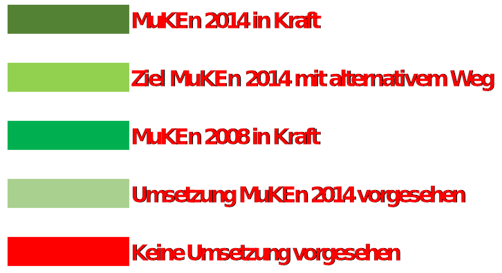
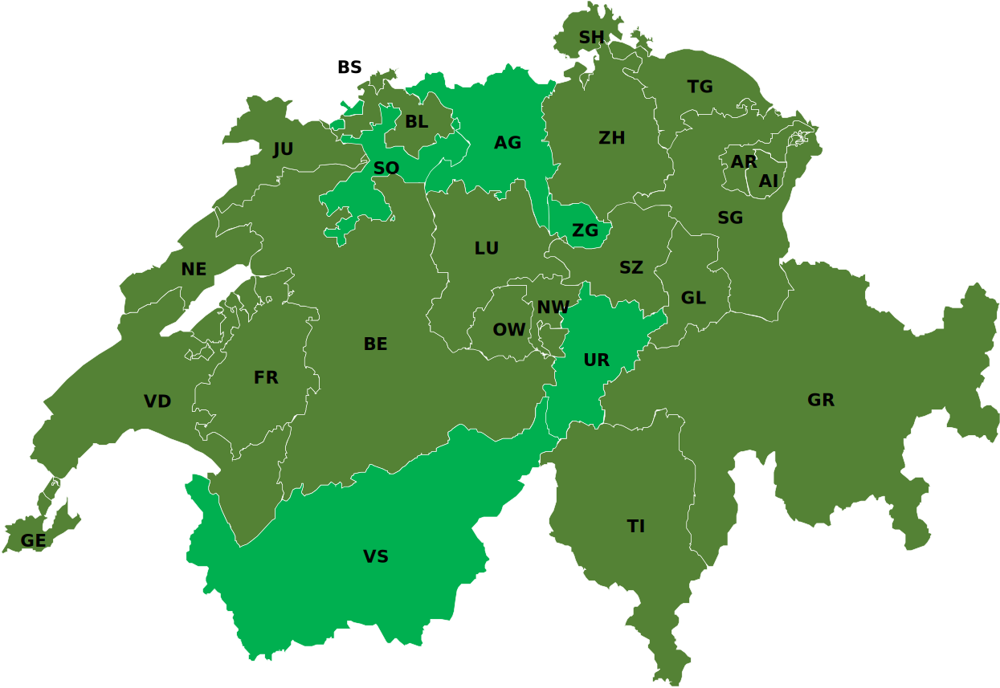
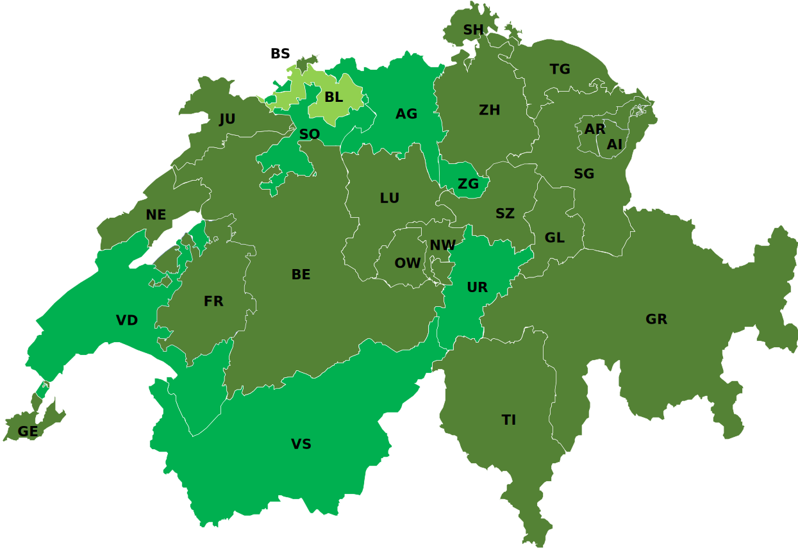
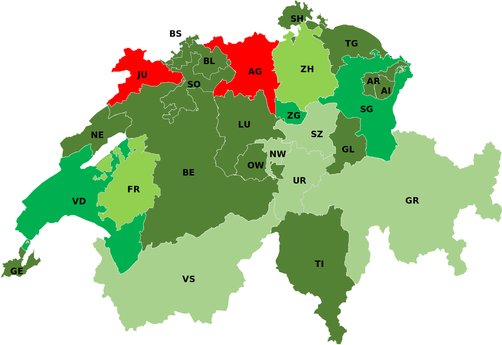

# Zusammenfassung

> **Quelle: [Energie-zentralschweiz Zusammenfassung](https://www.energie-zentralschweiz.ch/media/459/download?attachment)**

## Umsetzung Kantone

=== "Muken 2014"
    !!! info inline end "Legende"
        
    { width="800" }

=== "Gebäudehülle"
    !!! info inline end "Legende"
        
    { width="800" }

=== "Wärmeerzeugerersatz"
    !!! info inline end "Legende"
        
    { width="800" }

=== "Betriebsenergiekennzahl"
    !!! info inline end "Legende"
        
    { width="800" }

=== "Eigenstrom"
    !!! info inline end "Legende"
        
    { width="800" }

=== "Elektroheizungen"
    !!! info inline end "Legende"
        
    { width="800" }

## Anpassung winterlicher Wärmeschutz der Gebäudehülle

!!! info "Umbau, Bestand"
    1,5 * QH,li_Neubauten (bisher 1,25)

| Gebäudekategorie | Name               | QH,li0   | ΔQH,li   | PH,li  |
| ---------------- | ------------------ | -------- | -------- | ------ |
| -                | -                  | [kWh/m2] | [kWh/m2] | [W/m2] |
| I                | Wohnen MFH         | 13       | 15       | 20     |
| II               | Wohnen EFH         | 16       | 15       | 25     |
| III              | Verwaltung         | 13       | 15       | 25     |
| IV               | Schulen            | 14       | 15       | 20     |
| V                | Verkauf            | 7        | 14       |        |
| VI               | Restaurants        | 16       | 15       |        |
| VII              | Versammlungslokale | 18       | 15       |        |
| VIII             | Spitäler           | 18       | 17       |        |
| IX               | Industrie          | 10       | 14       |        |
| X                | Lager              | 14       | 14       |        |
| XI               | Sportbauten        | 16       | 14       |        |
| XII              | Hallenbäder        | 15       | 18       |        |

## Einzelanforderungen an die Wärmedämmung

=== "Neubauten und neue Bauteile"
    | Bauteile                                                          | Aussenklima | unbeheizt, 2m im Erdreich |
    | ----------------------------------------------------------------- | ----------- | ---------------------------- |
    | Opake (lichtundurchlässige) Bauteile: Dach, Decke, Wand, Boden | 0.17        | 0.25                         |
    | Fenster, Fenstertüren                                             | 1.0         | 1.3                          |
    | Türen                                                             | 1.2         | 1.5                          |
    | Tore (Türen grösser als 6 m2)                                     | 1.7         | 2.0                          |
    | Storenkasten                                                      | 0.5         | 0.5                          |

=== "Umbauten und Umnutzungen"
    | Bauteile                                                          | Aussenklima | unbeheizt, 2m im Erdreich |
    | ----------------------------------------------------------------- | ----------- | ---------------------------- |
    | Opake (lichtundurchlässige) Bauteile: Dach, Decke, Wand, Boden | 0.25        | 0.25                         |
    | Fenster, Fenstertüren                                             | 1.0         | 1.0                          |
    | Türen                                                             | 1.2         | 1.2                          |
    | Tore (Türen grösser als 6 m2)                                     | 1.7         | 1.7                          |
    | Storenkasten                                                      | 0.5         | 0.5                          |

## Grenzwert Neubau

??? info
    Anforderungen an die Deckung des Wärmebedarfes von Neubauten. Als Weiterentwicklung der bisherigen als „80/20-Regel“ ist abhängig von der Gebäudekategorie ein Grenzwert für den gewichteten Energieverbrauch fü r Heizung, Warmwasser, Lüftung und Klimatisierung einzuhalten. Diese Anforderung gilt für Neubauten und Erweiterungen von bestehenden Bauten.

| Gebäudekategorie |                    | Grenzwert für Neubauten EHLWK [kWh/m2] |
| ---------------- | ------------------ | -------------------------------------- |
| I                | Wohnen MFH         | 35                                     |
| II               | Wohnen EFH         | 35                                     |
| III              | Verwaltung         | 40                                     |
| IV               | Schulen            | 35                                     |
| V                | Verkauf            | 40                                     |
| VI               | Restaurants        | 45                                     |
| VII              | Versammlungslokale | 40                                     |
| VIII             | Spitäler           | 70                                     |
| IX               | Industrie          | 20                                     |
| X                | Lager              | 20                                     |
| XI               | Sportbauten        | 25                                     |
| XII              | Hallenbäder        | keine Anforderung an EHLWK             |

## Standardlösungen Einzelbauteilnachweis

| Id  | Gebäudehllüe                                                                                                                                                     | A                                       | B                         | C                                      | D                             | E                    | F                       | G                     |
| --- | ---------------------------------------------------------------------------------------------------------------------------------------------------------------- | --------------------------------------- | ------------------------- | -------------------------------------- | ----------------------------- | -------------------- | ----------------------- | --------------------- |
|     |                                                                                                                                                                  | Elektr. Wärmepumpe Erdsonde oder Wasser | Automatische Holzfeuerung | Erdwärme aus KVA, ARA o. ern. Energien | Elektr. Wärmepumpe Aussenluft | Stückholzfeuerung    | GasbetriebeneWärmepumpe | Fossiler Wärmeerzeuge |
| 1   | - Opake Bauteile gegen aussen `0,17` W/m2K - Fenster `1,00` W/m2K - Kontrollierte Wohnungslüftung (KWL)                                                    |  :material-check:                    |  :material-check:      |  :material-check:                   |  :material-check:          |                      |                         |                       |
| 2   | - Opake Bauteile gegen aussen `0,17` W/m2K - Fenster `1,00` W/m2K - Th. Solaranlage für WW, mind. `2%` der EBF                                             |  :material-check:                    |  :material-check:      |  :material-check:                   |  :material-check:          |  :material-check: |                         |                       |
| 3   | - Opake Bauteile gegen aussen `0,15` W/m2K - Fenster `1,00` W/m2K                                                                                             |  :material-check:                    |  :material-check:      |  :material-check:                   |                               |                      |                         |                       |
| 4   | - Opake Bauteile gegen aussen `0,15` W/m2K - Fenster `0,80` W/m2K                                                                                          |  :material-check:                    |  :material-check:      |  :material-check:                   |  :material-check:          |                      |                         |                       |
| 5   | - Opake Bauteile gegen aussen `0,15` W/m2K - Fenster `1,00` W/m2K - Kontrollierte Wohnungslüftung (KWL) - Th. Solaranlage für WW mit mind. `2%` der EBF |  :material-check:                    |  :material-check:      |  :material-check:                   |  :material-check:          |  :material-check: |  :material-check:    |                       |
| 6   | - Opake Bauteile gegen aussen `0,15` W/m2K - Fenster `0,80` W/m2K - Kontrollierte Wohnungslüftung (KWL) - Th. Solaranlage für H+WW, mind. `7%` der EBF  |  :material-check:                    |  :material-check:      |  :material-check:                   |  :material-check:          |  :material-check: |  :material-check:    |  :material-check:  |

## Eigenstromerzeugung bei Neubauten

Bei Neubauten wird verlangt, dass jedes Gebäude einen angemessenen Anteil des Stromverbrauchs durch eine Eigenproduktion abdeckt. Zertifikate werden nicht angerechnet.
Welche Art der Stromerzeugung eingesetzt wird, ist freigestellt. In der Regel dürften Photovoltaikanlagen (PV) eingesetzt werden. Eine Ersatzabgabe ist möglich. Die Höhe der Abgabe und deren Modalitäten legt der Kanton fest.

- Zu installierende elektrische Leistung: `10` $W_{peak} / m^2 * EBF$`
- Maximal erforderliche Leistung: `30` $kW_{peak}$

## Erneuerbare Wärme beim Wärmeerzeugerersatz

??? info
    Der Ersatz eines mit Heizöl oder Gas betriebenen Heizkessels schafft Gelegenheit, um einen Teil der Wärme aus erneuerbaren Quellen zu gewinnen. Dies kann mit insgesamt 11 Standardlösungen umgesetzt werden. Die einfachste ist eine thermische Solaranlage.

| Id    | Beschreibugn                                                                                                                                                        |
| ----- | ------------------------------------------------------------------------------------------------------------------------------------------------------------------- |
| SL 1  | Thermische Sonnenkollektoren für die Wassererwärmung (Mindestfläche 2% der EBF)                                                                                   |
| SL 2  | Holzfeuerung als Hauptwärmeerzeugung und erneuerbarer Energie für Warmwasser                                                                                       |
| SL 3  | Elektr. Wärmepumpe mit Erdsonde, Wasser- oder Aussenluft (Heizung, Warmwasser, ganzjährig)                                                                          |
| SL 4  | Mit Erdgas angetriebene Wärmepumpe (Heizung und Warmwasser, ganzjährig)                                                                                             |
| SL 5  | Fernwärmeanschluss Anschluss (KVA, ARA oder erneuerbaren Energien)                                                                                                  |
| SL 6  | Wärmekraftkopplung (elektr. Wirkungsgrad min. 25%, min. 60% des Wärmebedarf für Heizung/WW)                                                                        |
| SL 7  | Warmwasserwärmepumpe mit Photovoltaikanlage (mind. 5 WPeak / m2 EBF)                                                                                                |
| SL 8  | Ersatz der Fenster (U-Wert best. Fenster ≥ 2,0 W/m2K, U-Wert Glas neue Fenster ≤ 0,7 W/m2K)                                                                         |
| SL 9  | Wärmedämmung von Fassade und/oder Dach (U-Wert bestehende Bauteile ≥ 0,6 W/m2K, U-Wert neue Fassade/Dach/Estrichboden ≤ 0,20 W/m2K, Fläche mind. 0,5 m2 pro m2 EBF) |
| SL 10 | Wärmeerzeugung mit erneuerbarer Energie (mind. 25% Wärmeleistung) und Spitzenlastkessel fossil                                                                      |
| SL 11 | Neueinbau kontrollierte Wohnungslüftung (WRG-Wirkungsgrad mind. 70%                                                                                                 |