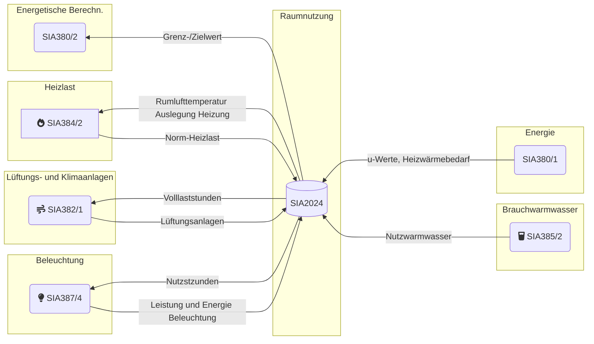
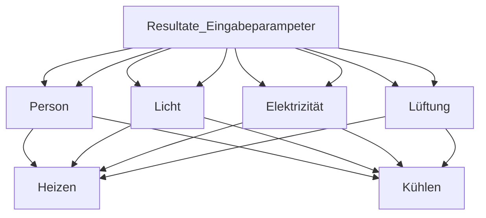
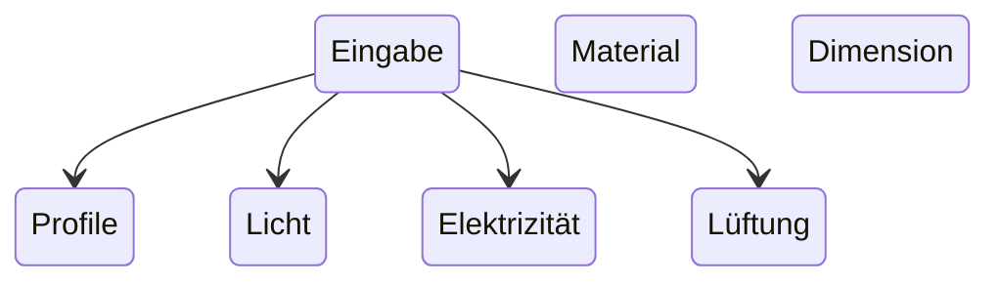

# Dokumentation

## Zusammenfassung



```mermaid
flowchart TD
    Eingabeparampeter --> Personenprofil & Wochenprofil & Jahresprofil & Geräteprofil & Dimensionen & Material Temperaturen
```





## Kategorien

### Standardwert

Die Spalte `Standardwert` enthält Parameter, welche typische Planungswerte für Neubauten und Gesamterneuerungen darstellen. Diese sollten in der Planung verwendet werden, falls keine genaueren Angaben vorhanden sind.
Die Standardwertewerden inderRegelvonEinzel- oder Systemanforderungenan den Grenzwert gemäss den zugrundeliegenden SIA-Normen und Merkblättern abgeleitet.

### «Zielwert»

Die Spalte `Zielwert` enthält Parameter, weiche optimale Planungswerte für Neubauten und Gesamterneuerungen darstellen. Diese sollten in der Planung im Rahmen der technischen und wirtschaftlichen Möglichkeiten angestrebt werden.Die Zielwerte werden in der Regel von Einzel- oder Systemanforderungenan den Zielwert gemäss den zugrundeliegenden SIA-Normen und Merkblättern abgeleitet.

### «Bestand»

Die Spalte `Bestand` enthält Parameter, welche typische Werte für bestehende, energetisch nicht erneuerte Gebäude mit Baujahr vor `1980` darstellen sollen. Diese können in der Planung als Ausgangswerte für bestehende Gebäude verwendet werden, solange keine genaueren Angaben vorhanden sind.

## Zeitprofile

Produkt aus `Volllaststunden` pro Tag Anzahl `Nutzungstagen` pro Jahr und `Jahresgleichzeitigkeit`, auf 10 h gerundet.

!!! info "Zeitangaben"
    Jahr = `365` Tage -> `52` Wochen -> `8760` Stunden

| Profil                            | Formel                      | Beispiel |
| --------------------------------- | --------------------------- | -------- |
| Tagesprofil Person                | $faktor * Stunde\ pro\ Tag$ | 7.2h     |
| Tagesprofil Elektrogeräte         | $faktor * Stunde\ pro\ Tag$ | ...      |
| Wochenprofil (5, 6 oder 7 Tage)   | $52 * Tage\ pro\ Woche$     | ...      |
| Jahresprofil als Monate (Jan-Dez) | $faktor * Tage\ pro\ Monat$ | ...      |

**Vollstunden pro Tag:**

$$
t_{P,d}= \sum_{h=1}^{24} t_{P,h}*1h
$$

**Nutzungstage pro Jahr:**

$$d_P= 365d - (52 * d_{Pr,w})$$

- $d_{Pr,w}$ = Ruhetage pro Woche (0,1 oder 2 Tage)

**Jahresgleichzeitigkeit beispiel:**

!!! example "Beispiel: Einzel-, Gruppenbüro:"
    $$(0.8 *31 d +0.6* 28d +0.9 *31 d + ...+ ... +0‚6*31d)/365d=0.70$$

**Volllaststunden pro Jahr:**

$$t_p = t_{P,d} * d_P * f_p$$

!!! example "Beispiel: Einzel-, Gruppenbüro:"
    $$7.2 h/d *261d* 0.80 = 1500h$$

## Raum Dimensionen

**Eingabe Daten:**

- $Länge$, $Breite$, $Höhe$
- $A_{th} = Thermische Gebäudehüllfläche$

??? info 
    "Berechnungsschritte Flächen" 1. `Glassfläche` 2. `Fensterfläche` 3. `Aussenwandfläche`

**Netto zu Brutto Faktor:**

$$A_g = (l_R * h_R) / 0.85$$

$$1 / 0.85 = 1.17647$$

!!! info
    $$1 / 0.85 = 1.17647$$

**Glasfläche:**

$$A_g = (l_R *h_R* f_g) / 0.85$$

**Fensterfläche:**

$$A_W = A_g / F_F$$

**Aussenwandfläche:**

$$A_{op} = A_{th} - A_W$$

## Geräte und Prozessanlagen

Volllaststunden an Ruhetagen: 24 h \* Bereitschaftsverluste:

$$t_{A,d} = {(t_{A,d} *d_p) + [f_{A,St} * 24 - (365 - d_p)]}* f_p$$

??? example "Beispiel: Einzel-, Gruppenbüro:"
    $$[(11.1 h/d - 261 d/a) + (24h/d * 30\% * 104 d/a )] * 0.80 = 2910 h/a$$

**Energie**

$$E_A = (t_{A‚PS} * p_A)/1000$$

## Beleuchtung

**Raumindex**

$$
k_R = (I_R- d_R) / (h_L - ( I_R + d_R))
$$

**Grenzwert**

$$
n_R = 1.25 * (1- \frac{1}{k_R+1})
$$

**Zielwert**

$$
n_R = 1.35 * (1- \frac{1}{k_R+1})
$$

**Nutzungsstunden Tag und Nacht**

$$t_{ud} + t_{un} = t_{P,d\ max}$$

**Elektrische Leistung der Beleuchtung**

$$P_L = E_0 / (MF * \eta_{v,Lo} * \eta_{R})$$

*Wobei:*

|         |                                                                       |
| ------------: | ------------------------------------------------------------------------ |
|         $P_L$ | Referenzwert der Beleuchtungsstärke i n Ix: $E_0 = k_0 * E*{vm}$    |
|         $k_0$ | nutzungsspezifischer Korrekturfaktor für die Referenz-Beleuchtungsstärke |
|      $E_{vm}$ | Wartungswert der Beleuchtungsstärke i n Ix                               |
|          $MF$ | Wartungsfaktor Beleuchtung; MF: 1,25                                     |
| $\eta_{v,Lo}$ | Leuchten-Lichtausbeute in $Im/W$                                         |
|      $\eta_R$ | Raumwirkungsgrad                                                         |

**Jährliche Volllaststunden der Beleuchtung**

$$
t_L= d_p * \left \{ k_{pr} * \frac{t_{ud}}{11h} * [0.5 * (11h-t_{L,min}) * cos* \frac{3.14*Z_g}{Z_{g0}}+ 0.5 * (11h + t_{L,min}) ] + t_{un}\right \} * f_p*k_{si}
$$

**Minimale Volllaststundenzahl**

$$
t_{l,min} = Min[11h; 2h * k_c * k_{Re} * k_T * Max (k_{li}; k_B)k_{sp}* k_{sur} ]
$$

**Glasflächenzahl**

oberhalb welcher keine weitere Reduktion der Volllaststunden eintritt für seitlich einfallendes Licht

$$
z_{g0} = Max[0.175; 0.35 * (0.375 + (E_0 / 800lx))]
$$

|                                                | Grenzwert                            | Zielwert |
| ---------------------------------------------- | ------------------------------------ | -------- |
| KorrekturfaktorRegelungnachTageslichtk„        | 2.0                                  | 1,0      |
| Korrekturfaktor Reflexionsgrad k„e             | 1.1                                  | 1,0      |
| Korrekturfaktor Transmissionsgrad kT           | 1.0                                  | 1.0      |
| Korrekturfaktor Fenstersturz $k_{li}$          | $k_{li} = 0.8 + 0.2 m / (h_R - 2 m)$ |          |
| Korrekturfaktor Balkon $k_B$                   | 1.0                                  | 1,0      |
| Korrekturfaktor Sonnenschutz $k_{sp}$          | 1.44                                 | 1,0      |
| Korrekturfaktor Horizontverschattung $k_{sur}$ | 1.0                                  | 1.0      |

**Energie**

$$E_L = ( p_L * t_L )/1000$$

## Lüftung

### Regelung

| Aussenluft-Volumenstrom1 | Standard   | Zielwert   | Bestand    |
| ------------------------ | ---------- | ---------- | ---------- |
| 3 m3/(m2-h)              | einstufig  | zweistufig | einstufig  |
| > 3 bis 5 6 m3/(m2-h)    | zweistufig | stufenlos  | einstufig  |
| > 6 m3/(m2-h)            | stufenlos  | stufenlos  | zweistufig |

### Stufen

| Stufe | Faktor |
| ---------- | -------------------------------- |
| einstufig | 100% = 8760 stunden|
| zweistufig | Personen `< 50%`, 67% Lüftung|
|  | Personen `> 50%`: 100% Lüftung|
| stufenlos | $Max(25\%,\ Personen \% )$|

**Aussenluft-Volumenstrom durch Infiltration**

| Nutzung               | Wert           |
| --------------------- | -------------- |
| Standard und Zielwert | 0,15 $m^3 / m^2*h$ |
| Bestand               | 0,30 $m^3 / m^2*h$ |

Die Lüftungsanlagen sind während der Nutzungsstunden gemäss
Personenprofil plus jeweils während einer zweistündigen Vorspülung und Nachspülung sowie in der Mittagspause in Betrieb. Die Vor- und Nachspülung erfolgt jeweils auf der tiefsten vorhandenen Stufe der Ventilatorsteuerung bzw. -regelung.

Bei der Berechnung derjährlichen Volumenstrom-Volllaststunden wird das Jahresprofil nur berücksichtigt, wenn der Teillastwert des entsprechenden Monats = 0 ist. Die jährlichen Volllaststunden werden auf 10 h gerundet.

## Heizung

### Transmission

**Bauteile**

$$H_T = (A_{op} * U_{op} + A_w *U_w)* 1,1$$

**Lüftung**

$$
H_V = n_{min,i} * V_i * p * c * A_{NGF}
$$

$n_{min,i}$ = thermisch wirksame Mindest-Luftwechselrate des beheizten Raums (SIA 384/2 , Tabelle 5) $h^{-1}$

$p * c = 0,32 Wh/(m^3-K)$ spez. Wärmespeicherfähigkeit der Luft

$V_i$ = Nettovolumen des Raums, in $m^3$

$A_{NGF}$ = Nettogeschossfläche

**Transsmission Total**

$$
H_H = H_T + H_V
$$

### Leistung

$$
\psi_{HL} = [(H_H * (\theta_{i,des,H} - \theta_e - \theta_{cor}))] / A_{NFG}
$$

**Temperaturkorrektur**

$$SIA384/2, Ziffer 5.3.$$

**Zeitkonstante**

$$\tau = C_m/H_H$$

### Energie

**Meschanscihe Lüftung**

$$q_{th} =  SIA380/1,Ziffer3.5.5$$

**Infiltration**

$$Infiltration wird gemäss 1.1.5.4$$

**Stunden**

Jährlicher Heizwärmebedarf OH geteilt durch die Norm-Heizlast

## Warmwasser

$$
Q_w = [V_w * p_w * c_p * (\theta_w - \theta_{cw}) * d_p * f_p] / A_{p,NGF}
$$

- $V_W$ = Wasserbedarf pro Person
- $p_w$ = spezifische Dichte von Wasser: 1,00 kg/l
- $c_p$ = spezifische Wärmekapazität von Wasser : $0,00116 kwh / (kg-K)$
- $\theta_{W}$ = Solltemperatur des Warmwassers: 60 °C
- $\theta_{CW}$ = Kaltwassertemperatur: 10°C
- $d_p$ = Nutzungstage pro Jahrgemäss 1.1.2.5
- $f_p$ = Jahresgleichzeitigkeit gemäss 1.1.2.7
- $A_{RNGF}$ = Personenfläche
