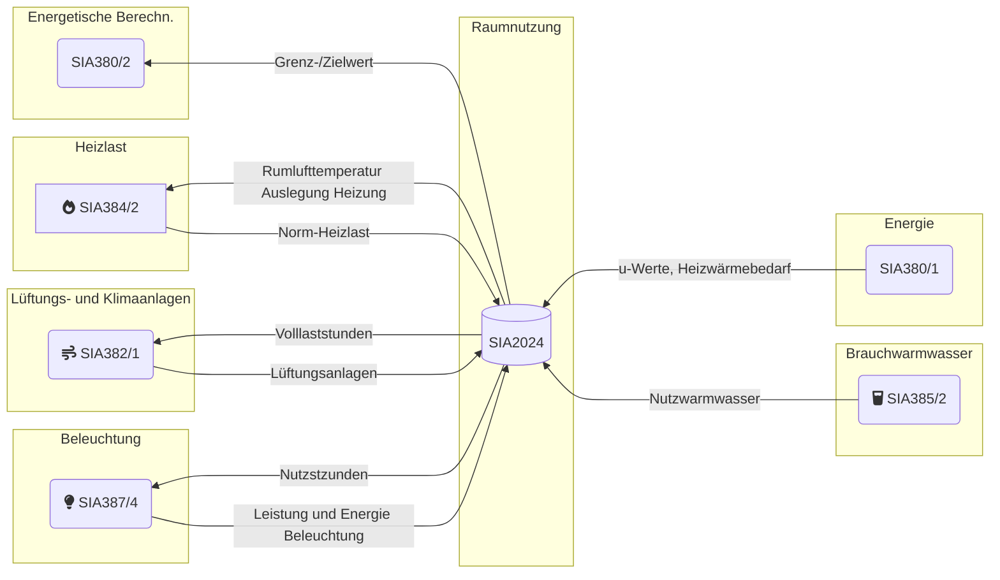
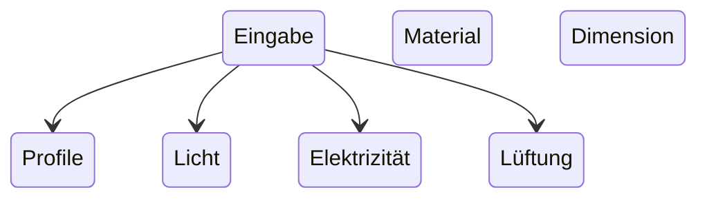

# Dokumentation

## Zusammenfassung



```mermaid

flowchart TD
    Eingabeparampeter --> Personenprofil & Wochenprofil & Jahresprofil & Geräteprofil & Dimensionen & Material & Temperaturen 
````

```mermaid

flowchart TD
    Resultate_Eingabeparampeter --> Person & Licht & Elektrizität & Lüftung & Person & Licht & Elektrizität & Lüftung
    Person --> Heizen & Kühlen
    Licht --> Heizen & Kühlen
    Elektrizität --> Heizen & Kühlen
    Lüftung --> Heizen & Kühlen
```



> Leistung: Als Leistung wird die aufgewendete energie pro stunde
> Energie: Als energie wird eine über mehrere stunden anfallende Leistung bezeichnet
> In der Norm wird die energie entweder pro Jahr (8760 h) als kwh oder pro Tag (24h) in Wh angegeben.

## Kategorien

### Standardwert

Die Spalte `Standardwert` enthält Parameter, welche typische Planungswerte für Neubauten und Gesamterneuerungen darstellen. Diese sollten in der Planung verwendet werden, falls keine genaueren Angaben vorhanden sind.
Die Standardwertewerden inderRegelvonEinzel- oder Systemanforderungenan den Grenzwert gemäss den zugrundeliegenden SIA-Normen und Merkblättern abgeleitet.

### «Zielwert»

Die Spalte `Zielwert` enthält Parameter, weiche optimale Planungswerte für Neubauten und Gesamterneuerungen darstellen. Diese sollten in der Planung im Rahmen der technischen und wirtschaftlichen Möglichkeiten angestrebt werden.Die Zielwerte werden in der Regel von Einzel- oder Systemanforderungenan den Zielwert gemäss den zugrundeliegenden SIA-Normen und Merkblättern abgeleitet.

### «Bestand»

Die Spalte `Bestand` enthält Parameter, welche typische Werte für bestehende, energetisch nicht erneuerte Gebäude mit Baujahr vor `1980` darstellen sollen. Diese können in der Planung als Ausgangswerte für bestehende Gebäude verwendet werden, solange keine genaueren Angaben vorhanden sind.

## Zeitprofile

Produkt aus `Volllaststunden` pro Tag Anzahl `Nutzungstagen` pro Jahr und `Jahresgleichzeitigkeit`, auf 10 h gerundet.

> Jahr = `365` Tage -> `52` Wochen ->  `8760` Stunden

- Tagesprofil Person $faktor * Stunde pro Tag$
- Tagesprofil Elektrogeräte $faktor * Stunde pro Tag$
- Wochenprofil (5, 6 oder 7 Tage) $52 * Tage pro Woche$
- Jahresprofil als Monate (Jan-Dez) $faktor * Tage pro Monat$

**Nutzungstage pro Jahr:**

$d_P= 365d - (52 * d_{Pr,w})$

- $d_{Pr,w}$ = Ruhetage pro Woche (0,1 oder 2 Tage)

**Jahresgleichzeitigkeit beispiel:**

$(0.8 *31 d +0.6* 28d +0.9 *31 d + ...+ ... +0‚6*31d)/365d=0.70$

Beispiel:
Einzel-, Gruppenbüro: $[(11.1 h/d - 261 d/a) + (24h/d * 30\% * 104 d/a )] * 0.80 = 2910 h/a$

## Raum Dimensionen

**Eingabe Daten:**

- $Länge$, $Breite$, $Höhe$
- $A_{th} = Thermische Gebäudehüllfläche$

> Berechnung: Glassfläche -> Fensterfläche -> Aussenwandfläche

**Netto zu Brutto Faktor:**

!!! info
    $1 / 0.85 = 1.17647$

$A_g = (l_R * h_R) / 0.85$

**Glasfläche**

$A_g = (l_R *h_R* f_g) / 0.85$

**Fensterfläche**

$A_W = A_g / F_F$

**Aussenwandfläche**

$A_{op} = A_{th} - A_W$

## Geräte und Prozessanlagen

Volllaststunden an Ruhetagen: 24 h * Bereitschaftsverluste:

$t_{A,d} = {(t_{A,d} *d_p) + [f_{A,St} * 24 - (365 - d_p)]}* f_p$

**Energie**

$E_A = (t_{A‚PS} * p_A)/1000$

## Heizung

### Transmission

**Bauteile**

$H_T = (A_{op} * U_{op} + A_w *U_w)* 1,1$

**Lüftung**

$H_V = n_{min,i} * V_i * p * c * A_{NGF}$

- $n_{min,i}$ = thermisch wirksame Mindest-Luftwechselrate des beheizten Raumsgemäss SIA 384/2 , Tabelle 5 , in $h^{-1}$
- Nettovolumen

$H_H = H_T + H_V$

### Leistung

$\psi_{HL} = [(H_H * (\theta_{i,des,H} - \theta_e - \theta_{cor}))] / A_{NFG}$

## Warmwasser

$Q_w = [V_w * p_w * c_p * (\theta_w - \theta_{cw}) * d_p * f_p] / A_{p,NGF}$

- $V_W$ = Wasserbedarf pro Person
- $p_w$ = spezifische Dichte von Wasser: 1,00 kg/l
- $c_p$ = spezifische Wärmekapazität von Wasser : $0,00116 kwh / (kg-K)$
- $\theta_{W}$ = Solltemperatur des Warmwassers: 60 °C
- $\theta_{CW}$ = Kaltwassertemperatur: 10°C
- $d_p$ =  Nutzungstage pro Jahrgemäss 1.1.2.5
- $f_p$ = Jahresgleichzeitigkeit gemäss 1.1.2.7
- $A_{RNGF}$ =  Personenfläche

=== "Standard"
    | Raumnutzung                     | Elektrische Energie |                |             | Thermische Energie |           |            |
    | ------------------------------- | ------------------- | -------------- | ----------- | ------------------ | --------- | ---------- |
    |                                 | Geräte              | Prozessanlagen | Beleuchtung | Klima- kälte       | Heizwärme | Warmwasser |
    | kWh/m2                          | kWh/m2              | kWh/m2         | kWh/m2      | kWh/m2             | kWh/m2    |            |
    | 1.01 Wohnen MFH                 | 21,6                | 0              | 4,2         | 5,4                | 14,2      | 16,9       |
    | 1.02 Wohnen EFH                 | 17,8                | 0              | 4,2         | 2,3                | 23,4      | 13,5       |
    | 2.01 Hotelzimmer                | 22,1                | 0              | 5,4         | 6,5                | 15,5      | 39,5       |
    | 2.02 Empfang, Lobby             | 20,9                | 0              | 27,1        | 23,2               | 8,5       | 0          |
    | 3.01 Einzel—, Gruppenbüro       | 32,0                | 0              | 17,5        | 15,4               | 10,7      | 2,6        |
    | 3.02 Grossraumbüro              | 43,7                | 0              | 19,2        | 25,2               | 1,3       | 3,6        |
    | 3.03 Sitzungszimmer             | 11,3                | 0              | 9,4         | 8,1                | 17,7      | 0          |
    | 3.04 Schalterhalle, Empfang     | 11,6                | 0              | 10,3        | 6,1                | 11,4      | 0          |
    | 4.01 Schulzimmer                | 14,2                | 0              | 14,4        | 11,6               | 14,9      | 4,0        |
    | 4.02 Lehrerzimmer               | 6,0                 | 0              | 8,6         | 5,0                | 26,3      | 0          |
    | 4.03 Bibliothek                 | 3,0                 | 0              | 8,8         | 3,6                | 15,5      | 0          |
    | 4.04 Hörsaal                    | 43,6                | 0              | 16,7        | 34,2               | 1,2       | 5,3        |
    | 4'05 (sgg‘:z'fjlcrglrjäj)m      | 7,1                 | 0              | 14,4        | 6,6                | 21,0      | 3,2        |
    | 5.01 Lebensmittelverkauf        | 8,0                 | 401            | 59,8        | 35,0               | 0,1       | 2,7        |
    | 5.02 Fachgeschäft               | 7,3                 | 0              | 59,8        | 34,3               | 0,1       | 2,7        |
    | 5.03 Verkauf Möbel, Bau, Garten | 6,8                 | 0              | 47,8        | 21,0               | 0,3       | 1,5        |
    | 6.01 Restaurant                 | 4,5                 | 0              | 15,6        | 12,1               | 16,3      | 108,9      |
    | 6.02 Selbstbedienungsrestaurant | 3,5                 | 8,1            | 6,6         | 9,9                | 108,9     |            |
    | 6.03 Küche zu Restaurant        | 25,3                | 481            | 30,6        | 12,6               | 24,1      | 0          |
    | 6.04 Selbstbedlenung            | 17,3                | 329            | 18,7        | 8,5                | 11,5      | 0          |
    | 7.01 Vorstellungsraum           | 4,6                 | 0              | 20,9        | 15,1               | 6,4       | 7,3        |
    | 7.02 Mehrzweckhalle             | 11,6                | 0              | 20,5        | 24,8               | 10,0      | 7,3        |
    | 7.03 Ausstellungshalle          | 20,3                | 0              | 47,4        | 45,1               | 3,7       | 7,3        |
    | 8.01 Bettenzimmer               | 10,5                | 0              | 10,5        | 14,7               | 10,2      | 67,7       |
    | 8.02 Stationszimmer             | 31,5                | 0              | 71,9        | 86,9               | 0,7       | 0          |
    | 8.03 Behandlungsraum            | 32,7                | 33             | 35,6        | 27,8               | 7,4       | 0          |
    | 9.01 Produktion (grobe Arbeit)  | 16,8                | 50             | 28,9        | 9,0                | 10,7      | 2,4        |
    | 9.02 Produktion (feine Arbeit)  | 12,2                | 24             | 19,7        | 7,4                | 9,6       | 2,4        |
    | 9.03 Laborraum                  | 12,2                | 37             | 17,3        | 6,3                | 19,1      | 2,4        |
    | 10.01 Lagerhalle                | 6,3                 | 0              | 10,5        | 0                  | 11,5      | 0,9        |
    | 11.01 Turnhalle                 | 2,6                 | 0              | 25,4        | 0                  | 27,4      | 63,5       |
    | 11.02 Fitnessraum               | 6,8                 | 0              | 20,1        | 4,2                | 11,2      | 87,1       |
    | 11.03 Schwimmhalle              | 10,2                | 341            | 20,3        | 0                  | 41,3      | 145,2      |
    | 12.01 Verkehrsfläche            | 0,0                 | 0              | 5,8         | 0                  | 7,3       | 0          |
    | 12.02 Verkehrsfläche 24 h       | 0,0                 | 0              | 23,6        | 6,8                | 1,8       | 0          |
    | 12.03 Treppenhaus               | 0,0                 | 0              | 5,8         | 0                  | 5,4       | 0          |
    | 12.04 Nebenraum                 | 0,0                 | 0              | 4,2         | 0                  | 13,3      | 0          |
    | 12.05 Küche, Teeküche           | 57,2                | 0              | 4,3         | 0                  | 0,6       | 0          |
    | 12.06 WC, Bad, Dusche           | 0,0                 | 0              | 5,1         | 0                  | 54,1      | 0          |
    | 12.07 WC                        | 0,0                 | 0              | 7,9         | 0                  | 39,4      | 0          |
    | 12.08 Garderobe, Dusche         | 0,0                 | 0              | 4,8         | 0                  | 37,8      | 0          |
    | 12.09 Parkhaus                  | 2,1                 | 0              | 2,2         | 0                  | 0         | 0          |
    | 12.10 Wasch- und Trockenraum    | 34,4                | 0              | 9,4         | 0                  | 4,5       | 0          |
    | 12.11 Kühlraum                  | 0,0                 | 318            | 0,1         | 0                  | 11,2      | 0          |
    | 12.12 Serverraum                | 0,0                 | 1052           | 0,2         | 0                  | 19,5      | 0          |

=== "Zielwert"
    | Raumnutzung | Elektrische Energie                     |                |             | Thermische Energie |           |            |       |
    | ----------- | --------------------------------------- | -------------- | ----------- | ------------------ | --------- | ---------- | ----- |
    |             | Geräte                                  | Prozessanlagen | Beleuchtung | Klima- kälte       | Heizwärme | Warmwasser |       |
    | kWh/m2      | kWh/m2                                  | kWh/m2         | kWh/m2      | kWh/m2             | kWh/m2    |            |       |
    | 1.01        | Wohnen MFH                              | 10,8           | 0           | 2,0                | 3,0       | 10,0       | 16,9  |
    | 1.02        | Wohnen EFH                              | 8,9            | 0           | 2,0                | 1,2       | 15,5       | 13,5  |
    | 2.01        | Hotelzimmer                             | 11,0           | 0           | 2,7                | 4,3       | 10,2       | 39,5  |
    | 2.02        | Empfang, Lobby                          | 9,0            | 0           | 13,5               | 18,4      | 3,7        | 0,0   |
    | 3.01        | Einzel-, Gruppenbi.iro                  | 17,5           | 0           | 2,8                | 5,3       | 10,2       | 2,6   |
    | 3.02        | Grossraumbi.iro                         | 29,1           | 0           | 7,0                | 14,1      | 1,5        | 3,6   |
    | 3.03        | Sitzungszimmer                          | 5,6            | 0           | 1,6                | 4,8       | 12,5       | 0     |
    | 3.04        | Schalterhalle, Empfang                  | 5,8            | 0           | 3,2                | 3,0       | 8,6        | 0     |
    | 4.01        | Schulzimmer                             | 7,1            | 0           | 3,2                | 6,3       | 10,9       | 4,0   |
    | 4.02        | Lehrerzimmer                            | 3,0            | 0           | 1,2                | 3,1       | 17,2       | 0     |
    | 4.03        | Bibliothek                              | 1,5            | 0           | 2,7                | 2,9       | 8,5        | 0     |
    | 4.04        | Hi:irsaal                               | 21,8           | 0           | 6,0                | 19,2      | 1,8        | 5,3   |
    | 4.05        | Schulfachraum (Spezialraum)             | 3,5            | 0           | 3,2                | 4,3       | 12,5       | 3,2   |
    | 5.01        | Lebensmittelverkauf                     | 4,0            | 321         | 38,8               | 31,9      | 0          | 2,7   |
    | 5.02        | Fachgeschaft                            | 3,6            | 0           | 38,8               | 31,5      | 0          | 2,7   |
    | 5.03        | Verkauf Mi:ibel, Bau, Garten            | 3,4            | 0           | 31,0               | 15,6      | 0,2        | 1,5   |
    | 6.01        | Restaurant                              | 2,3            | 0           | 6,1                | 10,9      | 10,0       | 108,9 |
    | 6.02        | Selbstbed ienungsrestaurant             | 1,8            | 0           | 3,2                | 6,0       | 6,2        | 108,9 |
    | 6.03        | Ki.iche zu Restaurant                   | 25,3           | 354         | 13,8               | 9,4       | 15,6       | 0     |
    | 6.04        | Ki.iche zu Selbstbedienungs- restaurant | 17,3           | 242         | 9,9                | 6,9       | 7,2        | 0     |
    | 7.01        | Vorstellungsraum                        | 2,3            | 0           | 13,5               | 17,2      | 2,4        | 7,3   |
    | 7.02        | Mehrzweckhalle                          | 5,8            | 0           | 9,0                | 21,2      | 5,6        | 7,3   |
    | 7.03        | Ausstellungshalle                       | 8,7            | 0           | 25,3               | 32,4      | 2,8        | 7,3   |
    | 8.01        | Bettenzimmer                            | 7,0            | 0           | 3,5                | 11,7      | 5,8        | 67,7  |
    | 8.02        | Stationszimmer                          | 15,8           | 0           | 36,9               | 55,6      | 0,8        | 0     |
    | 8.03        | Behandlungsraum                         | 21,8           | 11          | 14,0               | 18,2      | 4,2        | 0     |
    | 9.01        | Produktion (grobe Arbeit)               | 16,8           | 34          | 10,6               | 5,0       | 7,0        | 2,4   |
    | 9.02        | Produktion (feine Arbeit)               | 12,2           | 12          | 5,6                | 4,1       | 6,6        | 2,4   |
    | 9.03        | Laborraum                               | 12,2           | 24          | 3,7                | 3,5       | 12,4       | 2,4   |
    | 10.01       | Lagerhalle                              | 3,2            | 0           | 2,1                | 0         | 8,9        | 0,9   |
    | 11.01       | Turnhalle                               | 0,0            | 0           | 9,1                | 0         | 22,7       | 63,5  |
    | 11.02       | Fitnessraum                             | 3,4            | 0           | 7,5                | 1,4       | 10,4       | 87,1  |
    | 11.03       | Schwimmhalle                            | 6,8            | 171         | 6,4                | 3,0       | 25,8       | 145,2 |
    | 12.01       | Verkehrsflache                          | 0,0            | 0           | 1,5                | 1,2       | 6,1        | 0     |
    | 12.02       | Verkehrsflache 24 h                     | 0,0            | 0           | 7,1                | 4,3       | 4,4        | 0     |
    | 12.03       | Treppenhaus                             | 0,0            | 0           | 1,5                | 0         | 4,8        | 0     |
    | 12.04       | Nebenraum                               | 0,0            | 0           | 0,6                | 0         | 9,5        | 0     |
    | 12.05       | Ki.iche, Teeki.iche                     | 42,9           | 0           | 0,5                | 0         | 0,3        | 0     |
    | 12.06       | WC, Bad, Dusche                         | 0,0            | 0           | 0,6                | 0         | 50,1       | 0     |
    | 12.07       | WC                                      | 0,0            | 0           | 1,0                | 0         | 27,5       | 0     |
    | 12.08       | Garderobe, Dusche                       | 0,0            | 0           | 0,7                | 0         | 23,0       | 0     |
    | 12.09       | Parkhaus                                | 0,0            | 0           | 0,7                | 0         | 0          | 0     |
    | 12.10       | Wasch- und Trockenraum                  | 25,8           | 0           | 1,7                | 0         | 2,4        | 0     |
    | 12.11       | Ki.ihlraum                              | 0,0            | 254         | 0,1                | 0         | 7,9        | 0     |
    | 12.12       | Serverraum                              | 0,0            | 701         | 0,1                | 0         | 14,7       | 0     |

=== "Bestand 1980"
    | Raumnutzung | Elektrische Energie                     |                |             | Thermische Energie |           |            |       |
    | ----------- | --------------------------------------- | -------------- | ----------- | ------------------ | --------- | ---------- | ----- |
    |             | Geräte                                  | Prozessanlagen | Beleuchtung | Klima- kälte       | Heizwärme | Warmwasser |       |
    | kWh/m2      | kWh/m2                                  | kWh/m2         | kWh/m2      | kWh/m2             | kWh/m2    |            |       |
    | 1.01        | Wohnen MFH                              | 25,9           | 0           | 6,6                | 0         | 102,9      | 16,9  |
    | 1.02        | Wohnen EFH                              | 21,4           | 0           | 6,6                | 0         | 164,2      | 13,5  |
    | 2.01        | Hotelzimmer                             | 33,1           | 0           | 8,3                | 0         | 102,1      | 39,5  |
    | 2.02        | Empfang, Lobby                          | 44,9           | 0           | 42,1               | 9,7       | 57,8       | 0,0   |
    | 3.01        | Einzel-, Gruppenbi.iro                  | 52,4           | 0           | 22,3               | 4,4       | 69,3       | 2,6   |
    | 3.02        | Grossraumbi.iro                         | 58,2           | 0           | 24,4               | 6,9       | 46,8       | 3,6   |
    | 3.03        | Sitzungszimmer                          | 16,9           | 0           | 11,9               | 0         | 102,5      | 0     |
    | 3.04        | Schalterhalle, Empfang                  | 29,1           | 0           | 16,0               | 2,2       | 51,9       | 0     |
    | 4.01        | Schulzimmer                             | 21,2           | 0           | 18,3               | 0         | 125,5      | 4,0   |
    | 4.02        | Lehrerzimmer                            | 9,1            | 0           | 13,4               | 0         | 164,8      | 0     |
    | 4.03        | Bibliothek                              | 4,5            | 0           | 13,8               | 0         | 91,5       | 0     |
    | 4.04        | Horsaal                                 | 65,4           | 0           | 21,3               | 9,8       | 56,0       | 5,3   |
    | 4.05        | Schulfachraum (Spezialraum)             | 17,7           | 0           | 18,3               | 0         | 112,3      | 3,2   |
    | 5.01        | Lebensmittelverkauf                     | 12,0           | 481         | 62,0               | 0,6       | 79,4       | 2,7   |
    | 5.02        | Fachgeschiift                           | 10,9           | 0           | 62,0               | 0,4       | 80,3       | 2,7   |
    | 5.03        | Verkauf Mobel, Bau, Garten              | 10,2           | 0           | 55,8               | 0         | 85,5       | 1,5   |
    | 6.01        | Restaurant                              | 6,8            | 0           | 24,3               | 0         | 173,9      | 108,9 |
    | 6.02        | Selbstbedien ungsresta urant            | 5,3            | 0           | 12,7               | 0         | 97,7       | 108,9 |
    | 6.03        | Ki.iche zu Restaurant                   | 50,6           | 582         | 39,0               | 0         | 165,6      | 0     |
    | 6.04        | Ki.iche zu Selbstbedienungs- restaurant | 34,6           | 398         | 23,8               | 0         | 88,2       | 0     |
    | 7.01        | Vorstellungsraum                        | 6,9            | 0           | 32,5               | 0         | 157,2      | 7,3   |
    | 7.02        | Mehrzweckhalle                          | 17,4           | 0           | 32,0               | 0,5       | 124,5      | 7,3   |
    | 7.03        | Ausstellungshalle                       | 43,5           | 0           | 55,3               | 7,8       | 99,5       | 7,3   |
    | 8.01        | Bettenzimmer                            | 14,0           | 0           | 16,4               | 0,3       | 88,5       | 67,7  |
    | 8.02        | Stationszimmer                          | 47,3           | 0           | 91,5               | 19,6      | 64,4       | 0     |
    | 8.03        | Behandlungsraum                         | 43,6           | 44          | 36,9               | 4,9       | 85,5       | 0     |
    | 9.01        | Produktion (grobe Arbeit)               | 33,6           | 101         | 45,0               | 0         | 80,5       | 2,4   |
    | 9.02        | Produktion (feine Arbeit)               | 24,4           | 49          | 25,1               | 0         | 75,7       | 2,4   |
    | 9.03        | Laborraum                               | 24,4           | 73          | 22,0               | 0         | 113,0      | 2,4   |
    | 10.01       | Lagerhalle                              | 9,5            | 0           | 16,4               | 0         | 73,5       | 0,9   |
    | 11.01       | Turnhalle                               | 5,2            | 0           | 32,3               | 0         | 77,9       | 63,5  |
    | 11.02       | Fitnessraum                             | 10,2           | 0           | 31,3               | 0         | 79,0       | 87,1  |
    | 11.03       | Schwimmhalle                            | 13,6           | 512         | 31,6               | 0         | 194,9      | 145,2 |
    | 12.01       | Verkehrsfliiche                         | 0,0            | 0           | 11,6               | 0         | 27,9       | 0     |
    | 12.02       | Verkehrsfliiche 24 h                    | 0,0            | 0           | 41,4               | 0         | 24,9       | 0     |
    | 12.03       | Treppenhaus                             | 0,0            | 0           | 11,6               | 0         | 23,3       | 0     |
    | 12.04       | Nebenraum                               | 0,0            | 0           | 8,4                | 0         | 40,3       | 0     |
    | 12.05       | Ki.iche, Teeki.iche                     | 71,5           | 0           | 7,6                | 0         | 105,4      | 0     |
    | 12.06       | WC, Bad, Dusche                         | 0,0            | 0           | 8,9                | 0         | 126,3      | 0     |
    | 12.07       | WC                                      | 0,0            | 0           | 13,8               | 0         | 181,9      | 0     |
    | 12.08       | Garderobe, Dusche                       | 0,0            | 0           | 8,4                | 0         | 258,8      | 0     |
    | 12.09       | Parkhaus                                | 4,3            | 0           | 4,6                | 0         | 0          | 0     |
    | 12.10       | Wasch- und Trockenraum                  | 43,0           | 0           | 14,5               | 0         | 38,2       | 0     |
    | 12.11       | Ki.ihlraum                              | 0,0            | 382         | 0,3                | 0         | 63,9       | 0     |
    | 12.12       | Serverraum                              | 0,0            | 1402        | 0,3                | 0         | 87,4       | 0     |
