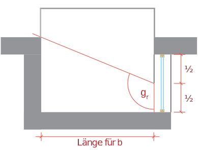

# Fenster / Verschattung

!!! info
    **Quelle:**  [Das Fenster im Energienachweis: Merkblatt Fenster (pdf)](https://www.endk.ch/de/ablage/ftw-simplelayout-filelistingblock/Merkblatt_Fenster_D_2021.pdf)

    **Link:** [EnDK Hilfsmittel](https://www.endk.ch/de/fachleute-1/hilfsmittel)

    **Excel-Programm:**  [Fenstertool (xlsx)](https://www.endk.ch/de/ablage/ftw-simplelayout-filelistingblock/Fenstertool_D.xlsx)

## Einzelbauteilnachweis

<figure markdown>
  { width="500" }
  <figcaption>Fenster mit angrenzendem Bauteil</figcaption>
</figure>

## Systemnachweis

In der Berechnung des Heizwärmebedarfs werden für das Bauteil Fenster sowohl die Wärmedämmeigenschaften (Transmissions-wärmeverluste) wie auch die solaren Gewinne berücksichtigt. In der Norm SIA 380/1 sind verschiedene Rechenwerte und damit zusammenhängende Vorgaben festgelegt.

## Verschattungsfaktor

$$
f_S = f_{S1} * f_{S2} * f_{S3,l} * f_{S3,r}
$$

- $f_{S1}$ = Verschattungsfaktor Horizont
- $f_{S2}$ = Verschattungsfaktor Überhang 
- $f_{S3,l}$ = Verschattungsfaktor linke Seitenblende
- $f_{S3,r}$ = Verschattungsfaktor rechte Seitenblende

#### Horizontale Flächen

Für Fenster in horizontalen Flächen wird (bis zu einer Neigung von 60 °) nur der Verschattungsfaktor Horizont fS1 gemäss Norm SIA 380/1:2016, 3.5.4.13.4 angewendet. Der Horizontwinkel wird für alle vier Himmelsrichtungen bezüglich Fenstermitte bestimmt, wobei die Beschattung durch das Gebäude selbst berücksichtigt wird. Der Verschattungsfaktor fS ergibt sich dann aus der Multiplikation der Werte für die vier Himmelsrichtungen.

#### Verschattungsfaktor «Horizont» $f_{s1}$

Der Verschattungsfaktor «Horizont» für umliegende Gebäude, für das eigene Gebäude und für die Topografie wird fassadenweise bestimmt. Der Horizontwinkel $\alpha$ wird auf die Fassadenmitte bezogen.

<figure markdown>
  { width="500" }
  <figcaption>Horizont</figcaption>
</figure>

<figure markdown>
  { width="500" }
  <figcaption>Horizont Schnitt</figcaption>
</figure>

<figure markdown>
  { width="500" }
  <figcaption>Horizont Grundriss</figcaption>
</figure>

??? table "Horizontal Winkel"
    | Horizon angle | Süd  | Ost, West | Nord |
    | ------------- | ---- | --------- | ---- |
    | 0°            | 1,00 | 1,00      | 1,00 |
    | 10°           | 0,96 | 0,94      | 1,00 |
    | 20°           | 0,82 | 0,81      | 0,97 |
    | 30°           | 0,59 | 0,68      | 0,94 |
    | 40°           | 0,45 | 0,60      | 0,90 |
    | 50°           | 0,36 | 0,50      | 0,86 |
    | 60°           | 0,27 | 0,40      | 0,82 |
    | 70°           | 0,19 | 0,30      | 0,78 |

#### Verschattungsfaktor Überhang $f_{s2}$

<figure markdown>
  { width="500" }
  <figcaption>Schnitt</figcaption>
</figure>

??? table "Überhang Winkel"
    | Overhang angle | Süd  | Ost, West | Nord |
    | -------------- | ---- | --------- | ---- |
    | 0°             | 1,00 | 1,00      | 1,00 |
    | 15°            | 0,95 | 0,95      | 0,96 |
    | 30°            | 0,91 | 0,89      | 0,91 |
    | 45°            | 0,75 | 0,77      | 0,80 |
    | 60°            | 0,52 | 0,59      | 0,66 |
    | 75°            | 0,26 | 0,34      | 0,48 |

#### Verschattungsfaktor seitenblende $f_{s2}$

<figure markdown>
  { width="500" }
  <figcaption>Grundriss Seitenblende</figcaption>
</figure>

<figure markdown>
  { width="500" }
  <figcaption>Grundriss Seitenblende Einseitig</figcaption>
</figure>

<figure markdown>
  { width="500" }
  <figcaption>Seitenblende Loggia</figcaption>
</figure>

<figure markdown>
  { width="500" }
  <figcaption>Seitenblende Loggia Aussen</figcaption>
</figure>

??? table "Seitenblende"
    | Side panel | Orientierung der Fassade |           |      |
    | ---------- | ------------------------ | --------- | ---- |
    | Angle      | Süd                      | Ost, West | Nord |
    | 0°         | 1,00                     | 1,00      | 1,00 |
    | 15°        | 0,97                     | 0,96      | 1,00 |
    | 30°        | 0,94                     | 0,92      | 1,00 |
    | 45°        | 0,84                     | 0,84      | 1,00 |
    | 60°        | 0,72                     | 0,75      | 1,00 |
    | 75°        | 0,57                     | 0,65      | 1,00 |

## U-Werte Fenster

??? info "U-Wert des Rahmens"
    | Rechenwerte für den U-Wert des Rahmens $U_f$ |            |
    | -------------------------------------------- | ---------- |
    | Rahmenmaterial                               | Uf [W/m2K] |
    | Holz / Holz-Metall                           | 1.4        |
    | Kunststoff                                   | 1.9        |
    | Wärmegedämmte Verbundprofile                 | 2.5        |
    | Metallprofile                                | 3.3        |

### Fenster Neubau

3-IV-IR-IR Wärmeschutzglas mit zwei Scheibenzwischenräumen > 9 mm und zwei selektiven Schichten mit Gasfüllun (Argon)

| Bezeichnung | Verglasung                                                                                                 | $U_g-Wert$ | $g-Wert$ | $U_f = 1.4$ Holz / Holz-Metall | $U_f = 1.9$ Kunststoff | $U_f = 2.5$ Wärmegedämmte Verbundprofile | $U_f = 3.3$ Metallprofile |
| ----------- | ---------------------------------------------------------------------------------------------------------- | ---------- | -------- | --------------------------------- | ------------------------- | ------------------------------------------- | ---------------------------- |
| 3-IV-IR-IR  | Wärmeschutzglas mit zwei Scheibenzwischenräumen > 9 mm und zwei selektiven Schichten mit Gasfüllun (Argon) | 0.7        | 50       | 0.9                               | 0.9                       | 1.0                                         | 1.1                          |
| 3-IV-IR-IR  | Wärmeschutzglas mit zwei Scheibenzwischenräumen > 9 mm und zwei selektiven Schichten mit Gasfüllun (Argon) | 0.5        | 50       | 0.7                               | 0.8                       | 0.8                                         | 0.9                          |

### Fenster Altbau

=== "bis 1980"
    | Bezeichnung             | Verglasung                                     | $U_g-Wert$ | $g-Wert$ | $U_f = 1.4$ Holz / Holz-Metall | $U_f = 1.9$ Kunststoff | $U_f = 2.5$ Wärmegedämmte Verbundprofile | $U_f = 3.3$ Metallprofile |
    | ----------------------- | ---------------------------------------------- | ---------- | -------- | --------------------------------- | ------------------------- | ------------------------------------------- | ---------------------------- |
    | Winterfenster Altbauten | Doppelverglasung mit Luft- zwischenraum > 7 cm | 2,7        | 75       | 2,5                               | 2,6                       | 2,6                                         | 3,5                          |
    | DV bis 1980             | Doppelverglasung                               | 2,7        | 75       | 2,5                               | 2,6                       | 2,6                                         | 3,5                          |

=== "bis 1990"
    | Bezeichnung   | Verglasung                                               | $U_g-Wert$ | $g-Wert$ | $U_f = 1.4$ Holz / Holz-Metall | $U_f = 1.9$ Kunststoff | $U_f = 2.5$ Wärmegedämmte Verbundprofile | $U_f = 3.3$ Metallprofile |
    | ------------- | -------------------------------------------------------- | ---------- | -------- | --------------------------------- | ------------------------- | ------------------------------------------- | ---------------------------- |
    | 2-IV bis 1990 | Isolierverglasung mit einem Scheibenzwischenraum > 12 mm |            |          |                                   |                           |                                             |                              |
    | 2-IV bis 1990 | a) Luftfüllung                                           | 2,9        | 75       | 2,7                               | 2.8                       | 3.0                                         | 3.5                          |
    | 2-IV bis 1990 | b) Gasfüllung (Argon)                                    | 2,7        | 75       | 2,6                               | 2,7                       | 2,8                                         | 3,0                          |
    | 3-IV bis 1990 | 3-fach-Isolierverglasung mit zwei                        |            |          |                                   |                           |                                             |                              |
    | 3-IV bis 1990 | Scheibenzwischenräumen > 9 mm                            |            |          |                                   |                           |                                             |                              |
    | 3-IV bis 1990 | a) Luftfüllung                                           | 2,0        | 70       | 2,0                               | 2,1                       | 2,3                                         | 2,5                          |
    | 3-IV bis 1990 | b) Gasfüllung (Argon)                                    | 1,9        | 70       | 1,9                               | 2,0                       | 2,2                                         | 2,4                          |

=== "ab 1990"
    | Bezeichnung        | Verglasung                                                    | $U_g-Wert$ | $g-Wert$ | $U_f = 1.4$ Holz / Holz-Metall | $U_f = 1.9$ Kunststoff | $U_f = 2.5$ Wärmegedämmte Verbundprofile | $U_f = 3.3$ Metallprofile |
    | ------------------ | ------------------------------------------------------------- | ---------- | -------- | --------------------------------- | ------------------------- | ------------------------------------------- | ---------------------------- |
    | 2-IV-IR ab 1990    | Wärmeschutzglas mit einem                                     | 1,8        | 62       | 1,9                               | 2,0                       | 2,2                                         | 2,4                          |
    | 2-IV-IR ab 1990    | Scheibenzwischenraum > 10 mm und einer selektiven Schicht mit | 1,6        | 62       | 1,7                               | 1,8                       | 2,0                                         | 2,2                          |
    | 2-IV-IR ab 1990    | Gasfüllung (Argon)                                            | 1,4        | 62       | 1,6                               | 1,7                       | 1,9                                         | 2,1                          |
    | 2-IV-IR ab 1990    | 1,3                                                           | 62         | 1,5      | 1,6                               | 1,8                       | 2,0                                         |                              |
    | 3-IV-IR ab 1990    | Wärmeschutzglas mit zwei                                      | 1,5        | 60       | 1,7                               | 1,8                       | 1,9                                         | 2,1                          |
    | 3-IV-IR ab 1990    | Scheibenzwischenräumen                                        | 1,4        | 60       | 1,6                               | 1,7                       | 1,8                                         | 2,0                          |
    | 3-IV-IR ab 1990    | > 9 mm und einer selektiven Schicht mit Gasfüllung (Argon)    | 1,2        | 60       | 1,4                               | 1,6                       | 1,7                                         | 1,9                          |
    | 3-IV-IR ab 1990    | 1,1                                                           | 60         | 1,3      | 1,5                               | 1,6                       | 1,8                                         |                              |
    | 3-IV-IR-IR ab 1990 | Wärmeschutzglas mit zwei                                      | 1,2        | 45       | 1,5                               | 1,6                       | 1,7                                         | 1,9                          |
    | 3-IV-IR-IR ab 1990 | Scheibenzwischenräumen > 9 mm und zwei selektiven             | 1,1        | 45       | 1,4                               | 1,5                       | 1,6                                         | 1,8                          |
    | 3-IV-IR-IR ab 1990 | Schichten mit Gasfüllung (Argon)                              | 0,9        | 45       | 1,2                               | 1,4                       | 1,5                                         | 1,7                          |
    | 3-IV-IR-IR ab 1990 | 0,8                                                           | 45         | 1,1      | 1,3                               | 1,4                       | 1,6                                         |                              |
