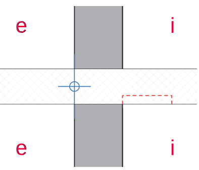
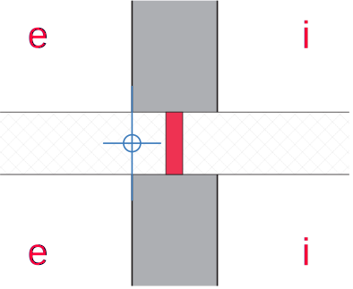
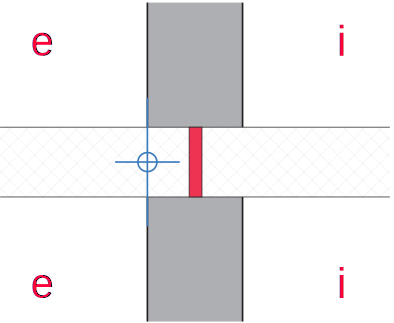
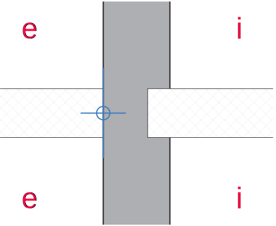
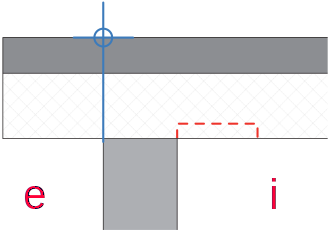
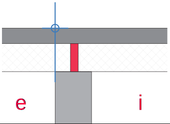

# Wärmebrücken

## 1.1 Balkonplatte

!!! info  inline
    Lorem ipsum dolor sit amet, consectetur
    adipiscing elit. Nulla et euismod nulla.
    Curabitur feugiat, tortor non consequat
    finibus, justo purus auctor massa, nec
    semper lorem quam in massa.

<figure markdown>
  {    width="200" }
  <figcaption>Balkon durchbetoniert</figcaption>
</figure>

!!! info inline end
    Lorem ipsum dolor sit amet, consectetur
    adipiscing elit. Nulla et euismod nulla.
    Curabitur feugiat, tortor non consequat
    finibus, justo purus auctor massa, nec
    semper lorem quam in massa.

<figure markdown>
{ width="200" }
  <figcaption>Balkon Stahlkorb</figcaption>
</figure>

<figure markdown>
{ width="200" }
  <figcaption>Balkon Dorn</figcaption>
</figure>

<figure markdown>
{ width="200" }
  <figcaption>Balkon durchbetoniert</figcaption>
</figure>

<figure markdown>
{ width="200" }
  <figcaption>Balkon statisch getrennt</figcaption>
</figure>

## 1.2 Flachdach, 1.3 Flachdach Brüstung

<figure markdown>
{ width="200" }
    <figcaption>Flachdach durchbetoniert</figcaption>
</figure>

<figure markdown>
{ width="200" }
    <figcaption>Flachdach stahlkorb</figcaption>
</figure>

<figure markdown>
{ width="200" }
    <figcaption>Flachdach dämmung</figcaption>
</figure>

## 2.1 Geschossdecke

## 2.2 Wandanschluss an Kellerdecke

## 2.3 Innenwandanschluss an Aussenwand

## 2.4 Wandanschluss im UG

## 3.1 Flachdach Dachrand onhe Vordach und Anschluss Attika

## 3.2 Anschluss Steildach Traufe 

## 3.3 Anschluss Aussenwand and Estrichboden

## 3.4 Sockeldetail unbeheizter Keller im Erdreich

## 3.4 Sockeldetail beheizter Keller nicht im Erdreich

## 3.4 Sockeldetail beheizter Keller im Erdreich

## 5.1 bis 5.3 Fensteranschlag (Leibugn, Fensterbank, Fenstersturz)

