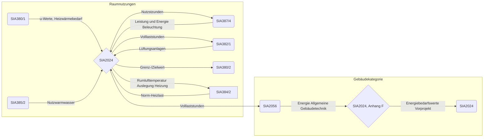
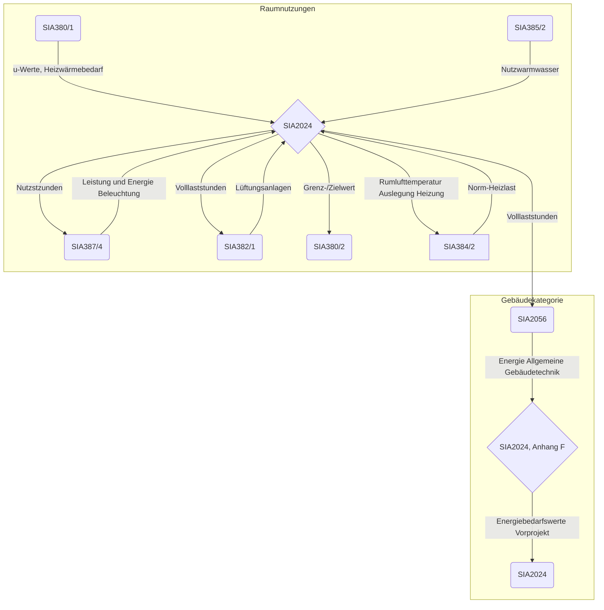
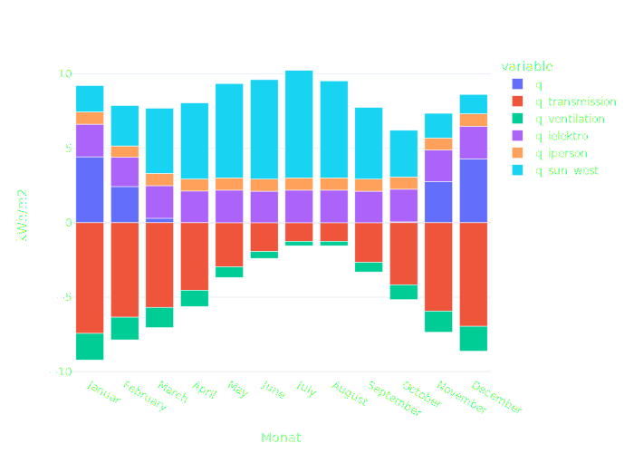
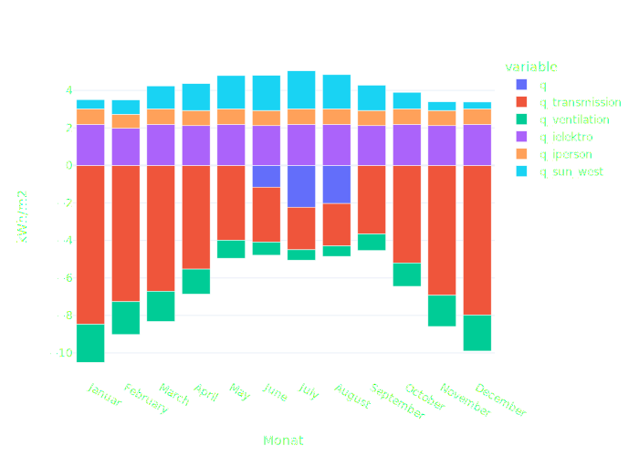
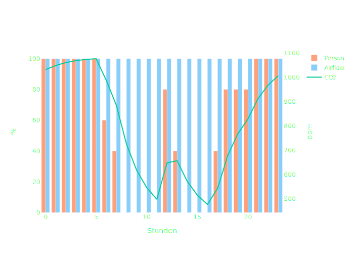
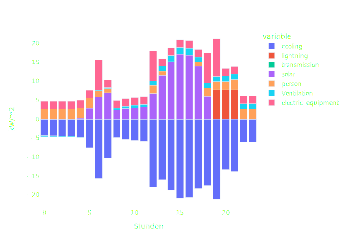
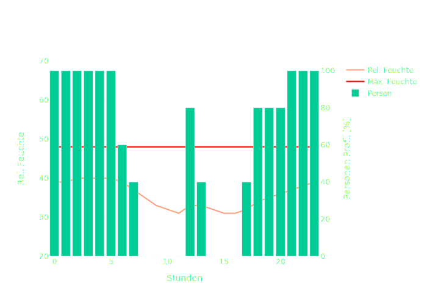

# 

Komfortnachweise gemäss SIA 180 und SIA 382/1 sowie die Auslegung von Anlagen und Anforderungen an den Energiebedarf gemäss SIA 380/2 können mit dynamischen Gebäudesimulationsprogrammen erstellt werden. Dabei gelten die Anforderungen der entsprechenden Normen. Wenn keine besseren Angaben vorliegen, sind für die folgenden Eingabedaten Standard-Raumnutzungsdaten gemäss Kapitel 2 zu verwenden:

* Personenfläche
* Personenprofil und Anzahl Ruhetage pro Woche für die Personenbelegung,
* Jahresprofil zur Berücksichtigung von Feiertagen und Ferienabwesenheiten
* Aktivitätsgrad der Personen (Abgabe von sensibler und Iatenter Wärme)
* Lastprofil und Leistung ausserhalb der Nutzungszeit für Geräte und Prozessanlagen
* Installierte elektrische Leistung der Geräte und Prozessanlagen
* Beleuchtungsstärke
* Installierte elektrische Leistung der Beleuchtung
* Art der Beleuchtungssteuerung (Präsenz- und Tageslichtregelung)
* Raumtemperatur-Auslegungswert im Heiz- und im Kühlfall
* Mittlere Raumtemperaturen für die Berechnung des Heizwärme- und Klimakältebedarfs
* Auslegungswerte der relativen Raumluftfeuchte im Heiz- und im Kühlfall
* spezifischer Aussenluft-Volumenstrom pro Person und pro Nettogeschossfläche.

!!! note
    - Benutze ++alt+left-button++ um einzelne Reihen und oder Kolummnen zu makrieren
    - Benutze ++right-button++ auf einem Symbol und kopiere es als `TeX` oder `MathML`

## Raum

### :fontawesome-solid-ruler: Raumabmessungen

| **Name**                         | **Symbol** | **Wert**                             |       |
| -------------------------------- | ---------- | ------------------------------------ | ----- |
| **Raumlänge**                    | $l_R$      | 4              | $m$   |
| **Raumtiefe**                    | $d_R$      | 5               | $m$   |
| **Raumhöhe**                     | $h_R$      | 2.5              | $m$   |
| **Nettogeschossfläche**          | $A_{NGF}$  | 20       | $m^2$ |
| **Thermische Gebäudehüllfläche** | $A_{th}$   | 26.5 | $m^2$ |
| **Glasanteil**                   | $fg$       | 0.3     | $\%$  |
| **Glasfläche**                   | $Ag$       | 3.5294117647058822           | $m^2$ |
| **Fensterfläche**                | $Aw$       | 4.705882352941177          | $m^2$ |
| **Opake Gebäudehüllfläche**      | $Aop$      | 21.794117647058822           | $m^2$ |

### :fontawesome-solid-house: Bauphysikalische Eigenschaften

| **Name**                                           | **Symbol** | **Wert**                             |             |
| -------------------------------------------------- | ---------- | ------------------------------------ | ----------- |
| **U-Wert opake Bauteile**                          | $U_{op}$   | 0.17       | $W/(m^2×K)$ |
| **U-Wert Fenster**                                 | $U_w$      | 1       | $W/(m^2×K)$ |
| **Abminderungsfaktor für Fensterrahmen**           | $F_F$      | 0.75 | $-$         |
| **Wärmebrückenzuschlag auf Gesamt-U-Wert Fassade** | -          | + 10                                 | $\%$        |

| **Gesamtenergiedurchlassgrad Verglasung**                  | $g$        | 0.5         | $–$         |
| **Gesamtenergiedurchlassgrad Verglasung und Sonnenschutz** | $gtot$     | 0.14 | $–$         |
| **Wärmespeicherfähigkeit des Raumes**                      | $Cm$       | 120         | $Wh/m^2×K$  |

### :fontawesome-solid-temperature-half: Raumklima

| **Name**                          | **Bemerkung**               | **Symbol**         | **Wert**                                      |
| --------------------------------- | --------------------------- | ------------------ | --------------------------------------------- |
| **Raumtemperatur-Auslegungswert** | Auslegung Kühlung           | $\theta_{i,des,C}$ | 25 $°C$            |
| **-**                             | Auslegung Heizung           | $\theta_{i,des,H}$ | 22 $°C$            |
| **Mittlere Raumtemperatur**       | Jährlicher Klimakältebedarf | $\theta_{i,ave,C}$ | 26 $°C$         |
| **-**                             | Jährlicher Heizwärmebedarf  | $\theta_{i,ave,H}$ | 21 $°C$         |
| **Relative Raumluftfeuchte**      | Auslegung Entfeuchtung      | $\psi_{i,des,C}$   | 60 $\%$       |
| **-**                             | Auslegung Befeuchtung       | $\psi_{i,des,H}$   | 30 $\%$       |
| **Mittlere Luftgeschwindigkeit**  | Auslegung Kühlung           | $\nu_{a,des,C}$    | 0.18 $m/s$ |
| **-**                             | Auslegung Heizung           | $\nu_{a,des,H}$    | 0.125 $m/s$ |

## :fontawesome-solid-volume-high: Schallschutz

| **Name**                                                    | **Bemerkung**                  | **Symbol** | **Einheit** | **Wert**                                          |
| ----------------------------------------------------------- | ------------------------------ | ---------- | ----------- | ------------------------------------------------- |
| **Lärmempfindlichkeit**                                     | Aussen-/Innenlärm, Trittschall | –          | –           | normal                  |
| **Anforderungswert an Dauergeräusche gebäudetech. Anlagen** | Auslegung Dauergeräusche       | $LH$       | $dB$        | 28 |
| **Nachhallzeit**                                            | mit Möblierung                 | $T$        | $s$         |                                              |
| **Einzelgeräusche, Funktionsgeräusche**                     |                                | $T$        | $dB$        | 33            |
| **Einzelgeräusche, Benutzungsgeräusche**                    |                                | $T$        | $dB$        | 38                  |

## :fontawesome-solid-person: Personen

| **Name**                                | **Bemerkung**                    | **Symbol**     | **Einheit** | **Wert**                                          |
| --------------------------------------- | -------------------------------- | -------------- | ----------- | ------------------------------------------------- |
| Nutzungsstunden pro Tag                 | -                                | $t_{P,d,max}$  | $h$         | 24                     |
| Volllaststunden pro Tag                 | -                                | $t_{P,d}$      | $h$         | 14                       |
| Ruhetage pro Woche                      | -                                | $d_{Pr,w}$     | $d$         | 7                         |
| Nutzungstage pro Jahr                   | -                                | $d_{P}$        | $d$         | 365                         |
| Jahresgleichzeitigkeit                  | -                                | $f_{P}$        | $-$         | 0.8                   |
| Volllaststunden pro Jahr                | -                                | $t_{P}$        | $h$         | 14                   |
| Personenfläche                          | Nettogeschossfläche pro Person   | $A_{P,NGF}$    | $m^2$       | 35                     |
| Aktivitätsgrad                          | -                                | $M$            | $met$       | 1.2                      |
| Wärmedämmwert der Bekleidung            | Auslegung Kühlung                | $l_{cl,C}$     | $clo$       | 0.5 |
| -                                       | Auslegung Heizung                | $l_{cl,H}$     | $clo$       | 1  |
| Sensible Wärmeeintragsleistung Personen | Auslegung Kühlung -> 84 W        | $\Phi_{P,C}$   | $W/m^2$     | 84         |
| -                                       | Auslegung Heizung -> 94 W        | $\Phi_{P,H}$   | $W/m^2$     | 94         |
| Interne Wärmeeinträge Personen pro Tag  | -                                | $\theta_{P,d}$ | $Wh/m^2$    | 33.6                          |
| Interne Wärmeeinträge Personen pro Jahr | -                                | $\theta_{P,a}$ | $kWh/m^2$   | 9.8                       |
| Feuchteproduktion Personen              | Auslegung Entfeuchtung -> 51 g/h | $g_{P,C}$      | $g/h×m^2$   | 51          |
| -                                       | Auslegung Befeuchtung -> 66 g/h  | $g_{P,H}$      | $g/h×m^2$   | 66          |
| Feuchtequellen (ohne Personen)          | z.B. Pflanzen                    | $g_{a}$        | $g/h×m^2$   | 0.5   |

## :fontawesome-solid-bolt: Geräte und Prozessanlagen

| **Name**                                                      | **Symbol**     | **Einheit** | **Wert**                                             |
| ------------------------------------------------------------- | -------------- | ----------- | ---------------------------------------------------- |
| Volllaststunden pro Tag                                       | $t_{A,d}$      | $h$         | 7.4               |
| Elektrische Leistung der Geräte Maximaler Stundenwert         | $p_{A}$        | $W/m^2$     | 10  |
| Elektrische Leistung der Prozessanlagen Maximaler Stundenwert | $p_{Ps}$       | $W/m^2$     | 0    |
| Leistung ausserhalb der Nutzungszeit                          | $f_{A,St}$     | $\%$        | 0.2 |
| Wärmeeintragsleistung der Geräte                              | $F_{A}$        | $W/m^2$     | 10  |
| Interne Wärmeeinträge der Geräte pro Tag                      | $\theta_A$     | $Wh/m^2d$   | 74.0                 |
| Jährliche Volllaststunden der Geräte und Prozessanlagen       | $t_{A,Ps}$     | $h$         | 2160.0              |
| Interne Wärmeeinträge der Geräte pro Jahr                     | $\theta_{A,a}$ | $kWh/m^2$   | 21.6    |
| Jährlicher Elektrizitätsbedarf der Geräte                     | $E_A$          | $kWh/m^2$   | 21.6    |
| Jährlicher Elektrizitätsbedarf der Prozessanlagen             | $E_{Ps}$       | $kWh/m^2$   | 0.0      |
| Interne Wärmeeinträge der Geräte + Prozessanlagen pro Jahr    | $\theta_{A,a}$ | $kWh/m^2$   | 0.0              |

## :fontawesome-solid-lightbulb: Beleuchtung

=== "Eingaben"

    | **Name**                                                                                                                  | **Bemerkung**             | **Symbol** | **Einheit** | **Wert**                                           |
    | ------------------------------------------------------------------------------------------------------------------------- | ------------------------- | ---------- | ----------- | -------------------------------------------------- |
    | Beleuchtungsstärke                                                                                                        | Wartungswert              | $E_vm$     | $lx$        | 50.0               |
    | Referenzbeleuchtungsstärke                                                                                                | -                         | $E_0$      | $lx$        | 300               |
    | Bewertungsebene                                                                                                           | Höhe = 0.75 m oder 0.05 m | $h_v$      | $m$         | 0.75               |
    | Raumindex                                                                                                                 | -                         | $k_R$      |             | 1.27               |
    | Wartungswert Beleuchtung                                                                                                  | -                         | $M_F$      |             | 0.8           |
    | Leuchten-Lichtausbeute                                                                                                    | -                         | $h_{v,Lo}$ | $lm/W$      | 70               |
    | Raumwirkungsgrad                                                                                                          | -                         | $h_R$      |             | 0.7               |
    | Glasflächenzahl                                                                                                           | -                         | $z_g$      |             | 0.18              |
    | **Glasflächenzahl oberhalb welcher keine weitere Reduktion der Volllaststunden eintritt** für seitlich einfallendes Licht |                           | $z_{g0}$   |             | 0.26 |

=== "Korrektur Faktoren"

    | **Name**                                                                          | **Symbol** | **Einheit** | **Wert**                              |
    | --------------------------------------------------------------------------------- | ---------- | ----------- | ------------------------------------- |
    | **Korrekturfaktor Beleuchtungssteuerung nach Tageslicht**                         | $k_{c}$    |             | 2   |
    | **Korrekturfaktor Reflexionsgrad**                                                | $k_{Re }$  |             | 1.1           |
    | **Lichttransmissionsgrad** [siehe Eigenschaften](#bauphysikalische-eigenschaften) | $-$        |             | 0.7     |
    | **Korrekturfaktor Transmissionsgrad**                                             | $k_{T}$    |             | 1        |
    | **Höhe Fenstersturz**                                                             | $h_{St}$   | $m$         | 0.75         |
    | **Korrekturfaktor Fenstersturz**                                                  | $k_{li}$   |             | 1.2        |
    | **Balkontiefe**                                                                   | $a_{B}$    | $m$         | 0.0                                   |
    | **Korrekturfaktor Balkon**                                                        | $k_{B}$    |             | 1             |
    | **Korrekturfaktor Art des Sonnenschutzes**                                        | $k_{sp1}$  |             | 1.44      |
    | **Korrekturfaktor Horrizontverschattung**                                         | $k_{sur}$  |             | 1  |
    | **Nutzungsspezifischer Korrekturfaktor für die Referenz-Beleuchtungsstärke**      | $K_0$      | -           | 6.0                 |
    | **Präsenzmelder**                                                                 | $k_{Pr}$   |             | permanent           |
    | **Korrekturfaktor Gleichzeitigkeit**                                              | $k_{si}$   | $–$         | 0.3 |

=== "Zwischenresultate Zeit"

    | **Name**                             | **Einheit**  | **Symbol** | **Einheit** | **Wert**                       |
    | ------------------------------------ | ------------ | ---------- | ----------- | ------------------------------ |
    | **Minimale Volllaststundenzahl**     | $t_{Li,min}$ | $h$        |             | 7.6 |
    | **Nutzungsstunden pro Tag** 7-18 h   | $t_{ud}$     | $h$        |             | 3     |
    | **Nutzungsstunden pro Nacht** 18-7 h | $t_{un}$     | $h$        |             | 4   |

#### Leistung / Energie

| **Name**                                          | **Bemerkung** | **Symbol** | **Einheit** | **Wert**                              |
| ------------------------------------------------- | ------------- | ---------- | ----------- | ------------------------------------- |
| **Elektrische Leistung der Beleuchtung**          |               | $pL$       | $W/m^2$     | 7.7 |
| **Wärmeeintragsleistung der Beleuchtung**         |               | $FL$       | $W/m^2$     | 7.7 |
| **Interne Wärmeeinträge der Beleuchtung pro Tag** |               | $\theta_L$ | $Wh/m^2$    | 10.0 |
| **Jährliche Volllaststunden der Beleuchtung**     |               | $t_L$      | $h$         | 550.0 |
| **Jährlicher Elektrizitätsbedarf Beleuchtung**    |               | $E'_L$     | $kWh/m^2$   | 4.2 |

## :fontawesome-solid-wind: Lüftung

| **Name**                                                                            | Bemerkung                                | Symbol       | Einheit       | Standardwert                                                                                                                         |
| ----------------------------------------------------------------------------------- | ---------------------------------------- | ------------ | ------------- | ------------------------------------------------------------------------------------------------------------------------------------ |
| **Aussenluft-Volumenstrom pro Person**                                              | mit unterstützender Fensterlüftung       | $q_{V,e,P}$  | $m^3/h$       | 29                                                                               |
| **Mechanische Lüftung**                                                             | -                                        | $-$          | $Boolean$     |  Ja   |
| **Jährliche Betriebsstunden (Vol.Strom)**                                           |                                          | $t_{bV}$     | $h_{}$        | 8760.0                                                                                              |
| **Hygienebedingter Aussenluft-Volumenstrom**                                        | pro Nettogeschossfläche                  | $q_{V,e}$    | $m^3/(m^2×h)$ | 0.8                                                                                    |
| **Prozessbedingter Aussenluft-Volumenstrom**                                        | pro Nettogeschossfläche                  | $q_{V,e,Ps}$ | $m^3/(m^2×h)$ | 0                                                                                                    |
| **Aussenluft-Volumenstrom durch Infiltration**                                      |                                          | $q_{V,inf}$  | $m^3/(m^2×h)$ | 0.15                                                                                                        |
| **Steuerung und Regelung des Luftvolumenstroms (einstufig, zweistufig, stufenlos)** | –                                        | $–$          |               | single_stage                                                                                           |
| **Temperatur-Änderungsgrad der Wärmerückgewinnung**                                 |                                          | $h_{rec,q}$  | $–$           | 0.73                                                                                           |
| **Anlagennutzungsgrad der Wärmerückgewinnung**                                      |                                          | ${h_V }$     | $–$           | 0.7                                                                                     |
| **Jährliche Volumenstrom-Volllaststunden**                                          | Hygienelüftung                           | $t_{V}$      | $h$           |                                                                                                                                |
| **Spezifische Ventilatorleistung**                                                  | Total Zu- und Abluft                     | $p_{SFP}$    | $W/(m^3/h)$   | 0.56                                                                                                  |
| **Elektrische Leistung der Lüftung**                                                | ohne Fensterlüftung, ohne Prozessanlagen | $p_{V}$      | $W/m^2$       | 0.45                                                                                        |
| **Jährliche Volllaststunden der Lüftung**                                           | Elektrizitätsbedarf                      | $t_{V,e}$    | $h$           | 8760.0                                                                                              |
| **Jährlicher Elektrizitätsbedarf der Lüftung**                                      | ohne Fensterlüftung, ohne Prozessanlagen | $E_{V}$      | $kWh/m^2$     | 3.94                                                                                                         |

## :fontawesome-solid-snowflake: Raumkühlung

### Notwendigkeit

| Interne Wärmeeinträge pro Tag:       | 117.6 $Wh/m^2$ |                         |                   |
| ------------------------------------ | --------------------------------------------------- | ----------------------- | ----------------- |
| **mit Fensterlüftung Tag und Nacht** | **mit Fensterlüftung bei Belegung**                 | **ohne Fensterlüftung** | **Kühlung ?**     |
| $> 200$                              | $>140$                                              | $>120$                  | `notwendig`       |
| $140-200$                            | $100-140$                                           | $80-120$                | `erwünscht`       |
| $<140$                               | $<100$                                              | $<80$                   | `nicht notwendig` |

<iframe width="100%" height="500px" src="/plots/is_cooling.html" title="is Cooling"></iframe>

### Resultate

| **Name**                                      | Bemerkung                                        | Symbol   | Einheit   | Standardwert                                                                                    |
| --------------------------------------------- | ------------------------------------------------ | -------- | --------- | ----------------------------------------------------------------------------------------------- |
| **Externe Wärmeeintragsleistung**             | Solar, Transmission, Lüftung                     | $F_e$    | $W/m^2$   | 28.09                                                   |
| **Interne Wärmeeintragsleistung**             | Personen, Geräte, Beleuchtung                    | $F_i$    | $W/m^2$   | 20.1                                                   |
| **Interne Wärmeeinträge pro Tag**             | Personen, Geräte, Beleuchtung                    | $\theta$ | $Wh/m^2$  | 117.6                                                   |
| **Notwendigkeit einer Kühlung**               | mit unterstützender Fensterlüftung Tag und Nacht | -        | $-$       |  |
|                                               | mit unterstützender Fensterlüftung bei Belegung  |          | $-$       |   |
|                                               | ohne Fensterlüftung                              |          | $-$       |        |
| **Klimakälteleistungsbedarf**                 | ohne Fensterlüftung, ohne Prozessanlagen         | $\phi_C$ | $W/m^2$   | -24.13                         |
| **Jährliche Volllaststunden der Raumkühlung** | ohne Fensterlüftung, ohne Prozessanlagen         | $t_C$    | $h$       | 225                             |
| **Jährlicher Klimakältebedarf**               | ohne Fensterlüftung, ohne Prozessanlagen         | $Q_C$    | $kWh/m^2$ | -5.42  |

<iframe width="100%" height="500px" src="/plots/cooling.html" title="Cooling"></iframe>

## :fontawesome-solid-fire: Raumheizung

| **Name**                                       | Symbol             | Einheit       | Standardwert                                      |
| ---------------------------------------------- | ------------------ | ------------- | ------------------------------------------------- |
| Zeitkonstante                                  | $t$                | $h$           | 221.19815668202764                     |
| Temperaturkorrektur                            | $\theta_{cor}$     | $°C$          | -0.082              |
| Thermisch *wirksame* Mindest-Luftwechselrate   | $n,min$            | $h^{-1}$      | 0.1 |
| Thermisch *wirksamer* Mindest-Luftvolumenstrom | $\theta_{v,min,i}$ | $m^3/(m^2×h)$ | 0.7  |

#### Ergebnisse

<iframe width="100%" height="500px" src="/plots/heating.html" title="Heating"></iframe>

| **Name**                                                                           | Symbol       | Einheit       | Standardwert                                         |
| ---------------------------------------------------------------------------------- | ------------ | ------------- | ---------------------------------------------------- |
| **Transmissions-Wärmetransferkoeffizient**                                         | $H_T$        | $W/K$         | 9.25                      |
| **Lüftungs-Wärmetransferkoeffizient**                                              | $H_V$        | $W/K$         | 1.6                  |
| **Wärmetransferkoeffizient**                                                       | $H_H$        | $W/K$         | 10.85                |
| **Norm-Lüftungswärmeverlust**                                                      | $\Phi_{V,i}$ | $W/m^2$       | 2.3                       |
| **Norm-Transmissionswärmeverlust**                                                 | $F_{T,i}$    | $W/m^2$       | 13.5          |
| **Norm-Heizlast**                                                                  | $\Phi_{HL}$  | $W/m^2$       | 15.776985          |
| **Jährliche Volllaststunden der Raumheizung**                                      | $t_{H}$      | $h$           | 910.0                    |
| **Thermisch wirksamer Aussenluft-Volumenstrom**                                    | $q_{th}$     | $m^3/(m^2×h)$ | 0.35 |
| **Jährlicher Heizwärmebedarf**  *ohne Fensterlüftung,  * ohne Prozessanlagen | $Q_{H,eff}$  | $kWh/m^2$     | 14.3          |
| **Jährlicher Heizwärmebedarf**  *mit Fensterlüftung,  * ohne Prozessanlagen  | $Q_{H}$      | $kWh/m^2$     | 21.9             |

## :fontawesome-solid-glass-water: Wasser

| **Name**                                        | Bemerkung | Symbol    | Einheit | Standardwert                        |
| ----------------------------------------------- | --------- | --------- | ------- | ----------------------------------- |
| **Bezugseinheit**                               |           |           |         | person          |
| **Nutzwarmwasserbedarf pro Bezugseinheit**      | $60 °C$   | $V_{W,u}$ | $l/d$   | 35          |
| **Anzahl Bezugseinheiten pro Person**           |           | $-$       | $-$     | 1       |
| **Verhältnis Wasserbedarf zu Warmwasserbedarf** |           | $-$       | $-$     | 4 |

#### Ergebnisse

| **Name**                                  | Bemerkung            | Symbol | Einheit   | Standardwert                      |
| ----------------------------------------- | -------------------- | ------ | --------- | --------------------------------- |
| **Warmwasserbedarf pro Person**           | $60°C$               | $V_W$  | $l/d$     | 35 |
| **Wasserbedarf pro Person**               | Warm- und Kaltwasser | $V_w$  | $l/d$     | 140     |
| **Jährlicher Wärmebedarf für Warmwasser** | $10 °C -> 60 °C$     | $Q_W$  | $kWh/m^2$ | 16.9     |

## Energie- und Leistungsbedarf

## Tages Auslegung

### Klima / Kälte

<iframe width="100%" height="500px" src="/plots/ddy_august.html" title="Cooling"></iframe>

### Co_2

<iframe width="100%" height="500px" src="/plots/co_2.html" title="co2"></iframe>

### Relative Feuchte (März)

<iframe width="100%" height="500px" src="/plots/rel_hum.html" title="rel_moisture"></iframe>

## SVG Dateien

| **Name** | Bemerkung | Symbol | Einheit | Standardwert |
| -------- | --------- | ------ | ------- | ------------ |

## Kommentare

| **Name** | Bemerkung | Symbol | Einheit | Standardwert |
| -------- | --------- | ------ | ------- | ------------ |
