<!--
 DO NOT EDIT.
 THIS FILE WAS AUTOMATICALLY GENERATED BY mkdocs-gallery.
 TO MAKE CHANGES, EDIT THE SOURCE PYTHON FILE:
 "docs/examples/plot_1_pvwatt.py"
 LINE NUMBERS ARE GIVEN BELOW.
-->

!!! note

    Click [here](#download_links)
    to download the full example code


PVWatts 
===================================

<!-- GENERATED FROM PYTHON SOURCE LINES 11-25 -->

## PVWatts

Here we will demonstrate one of the more basic PV models implemented by pvlib.  The PVWatts module model requires only two array parameters -- the array size (nameplate capacity) and the array's efficiency change with cell temperature.  Typical array sizes range from a few kW for residential arrays to hundreds of MW for large utility-scale systems.  The cell temperature response parameter, often called the module's temperature coefficient, determines the efficiency loss for a temperature increase.  For example, a module that produces 100W at test conditions but only 95W when the cell temperature is increased by 10 degrees has a temperature coefficient of -0.5%/°C.  Typical temperature coefficients range from -0.5%/°C to -0.2%/°C.

We'll read in weather data, run the irradiance transposition, and model cell temperature as in previous tutorials.


## STEPS:
<ol>
    <li><a id='step1'>Define System</a></li>
    <li><a id='step2'>Calculating the Temperature of the system </a></li>
    <li><a id='step3'>Calculating the Power (DC) </a></li>
    <li><a id='step4'>Calculating the AC Power </a></li>
</ol>

<!-- GENERATED FROM PYTHON SOURCE LINES 28-136 -->

```{.python }
from pvlib import pvsystem
import pandas as pd
import matplotlib.pyplot as plt

# Example module parameters for the Canadian Solar CS5P-220M:
parameters = {
    "Name": "Canadian Solar CS5P-220M",
    "BIPV": "N",
    "Date": "10/5/2009",
    "T_NOCT": 42.4,
    "A_c": 1.7,
    "N_s": 96,
    "I_sc_ref": 5.1,
    "V_oc_ref": 59.4,
    "I_mp_ref": 4.69,
    "V_mp_ref": 46.9,
    "alpha_sc": 0.004539,
    "beta_oc": -0.22216,
    "a_ref": 2.6373,
    "I_L_ref": 5.114,
    "I_o_ref": 8.196e-10,
    "R_s": 1.065,
    "R_sh_ref": 381.68,
    "Adjust": 8.7,
    "gamma_r": -0.476,
    "Version": "MM106",
    "PTC": 200.1,
    "Technology": "Mono-c-Si",
}

cases = [(1000, 55), (800, 55), (600, 55), (400, 25), (400, 40), (400, 55)]

conditions = pd.DataFrame(cases, columns=["Geff", "Tcell"])

# adjust the reference parameters according to the operating
# conditions using the De Soto model:
IL, I0, Rs, Rsh, nNsVth = pvsystem.calcparams_desoto(
    conditions["Geff"],
    conditions["Tcell"],
    alpha_sc=parameters["alpha_sc"],
    a_ref=parameters["a_ref"],
    I_L_ref=parameters["I_L_ref"],
    I_o_ref=parameters["I_o_ref"],
    R_sh_ref=parameters["R_sh_ref"],
    R_s=parameters["R_s"],
    EgRef=1.121,
    dEgdT=-0.0002677,
)

# plug the parameters into the SDE and solve for IV curves:
curve_info = pvsystem.singlediode(
    photocurrent=IL,
    saturation_current=I0,
    resistance_series=Rs,
    resistance_shunt=Rsh,
    nNsVth=nNsVth,
    ivcurve_pnts=100,
    method="lambertw",
)

# plot the calculated curves:
plt.figure()
for i, case in conditions.iterrows():
    label = (
        "$G_{eff}$ " + f"{case['Geff']} $W/m^2$\n"
        "$T_{cell}$ " + f"{case['Tcell']} $\\degree C$"
    )
    plt.plot(curve_info["v"][i], curve_info["i"][i], label=label)
    v_mp = curve_info["v_mp"][i]
    i_mp = curve_info["i_mp"][i]
    # mark the MPP
    plt.plot([v_mp], [i_mp], ls="", marker="o", c="k")

plt.legend(loc=(1.0, 0))
plt.xlabel("Module voltage [V]")
plt.ylabel("Module current [A]")
plt.title(parameters["Name"])

plt.gcf().set_tight_layout(True)
plt.gcf().set_tight_layout(False)


# draw trend arrows
def draw_arrow(ax, label, x0, y0, rotation, size, direction):
    style = direction + "arrow"
    bbox_props = dict(boxstyle=style, fc=(0.8, 0.9, 0.9), ec="b", lw=1)
    t = ax.text(
        x0,
        y0,
        label,
        ha="left",
        va="bottom",
        rotation=rotation,
        size=size,
        bbox=bbox_props,
        zorder=-1,
    )

    bb = t.get_bbox_patch()
    bb.set_boxstyle(style, pad=0.6)


ax = plt.gca()
draw_arrow(ax, "Irradiance", 20, 2.5, 90, 15, "r")
draw_arrow(ax, "Temperature", 35, 1, 0, 15, "l")

plt.show()

```


{: .mkd-glr-single-img srcset="../images/mkd_glr_plot_1_pvwatt_001.png, ../images/mkd_glr_plot_1_pvwatt_001_2_0x.png 2.0x"}


<!-- GENERATED FROM PYTHON SOURCE LINES 137-149 -->

```{.python }
print(
    pd.DataFrame(
        {
            "i_sc": curve_info["i_sc"],
            "v_oc": curve_info["v_oc"],
            "i_mp": curve_info["i_mp"],
            "v_mp": curve_info["v_mp"],
            "p_mp": curve_info["p_mp"],
        }
    )
)

```


Out:
{: .mkd-glr-script-out }

```{.shell .mkd-glr-script-out-disp }
       i_sc       v_oc      i_mp       v_mp        p_mp
0  5.235561  52.129782  4.742475  39.614015  187.868468
1  4.190781  51.483032  3.805721  39.867810  151.725752
2  3.144837  50.649227  2.861983  39.956700  114.355377
3  2.043319  56.987478  1.886789  47.278408   89.204377
4  2.070523  53.238566  1.901044  43.490203   82.676790
5  2.097727  49.474043  1.912108  39.735025   75.977653

```


<!-- GENERATED FROM PYTHON SOURCE LINES 150-203 -->

```{.python }
from pvlib import solarposition
import pandas as pd
import numpy as np
import matplotlib.pyplot as plt

tz = "europe/Zurich"
lat, lon = 47.47970, 8.53580
times = pd.date_range("2013-01-01", "2021-01-01", freq="H", tz=tz)

plt.figure(dpi=300,figsize=(8, 8))

solpos = solarposition.get_solarposition(times, lat, lon)

# remove nighttime
solpos = solpos.loc[solpos["apparent_elevation"] > 0, :]

ax = plt.subplot(1, 1, 1, projection="polar")
# draw the analemma loops
points = ax.scatter(
    np.radians(solpos.azimuth),
    solpos.apparent_zenith,
    s=2,
    label=None,
    c=solpos.index.dayofyear,
)
ax.figure.colorbar(points)


# draw hour labels
for hour in np.unique(solpos.index.hour):
    # choose label position by the smallest radius for each hour
    subset = solpos.loc[solpos.index.hour == hour, :]
    r = subset.apparent_zenith
    pos = solpos.loc[r.idxmin(), :]
    ax.text(np.radians(pos["azimuth"]), pos["apparent_zenith"], str(hour))

# draw individual days
for date in pd.to_datetime(["2013-03-21", "2013-06-21", "2020-12-21"]):
    times = pd.date_range(date, date + pd.Timedelta("24h"), freq="5min", tz=tz)
    solpos = solarposition.get_solarposition(times, lat, lon)
    solpos = solpos.loc[solpos["apparent_elevation"] > 0, :]
    label = date.strftime("%Y-%m-%d")
    ax.plot(np.radians(solpos.azimuth), solpos.apparent_zenith, label=label)

ax.figure.legend(loc="upper left")

# change coordinates to be like a compass
ax.set_theta_zero_location("N")
ax.set_theta_direction(-1)
ax.set_rmax(90)

plt.show()

```


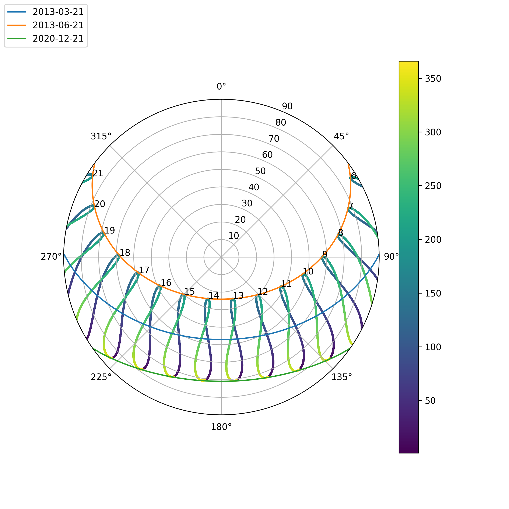{: .mkd-glr-single-img srcset="../images/mkd_glr_plot_1_pvwatt_002.png, ../images/mkd_glr_plot_1_pvwatt_002_2_0x.png 2.0x"}


<!-- GENERATED FROM PYTHON SOURCE LINES 204-247 -->

```{.python }

times = pd.date_range(
    "2019-01-01 00:00:00", "2020-01-01", inclusive="left", freq="H", tz=tz
)
plt.rcParams["figure.figsize"] = (15,5)

solpos = solarposition.get_solarposition(times, lat, lon)
# remove nighttime
solpos = solpos.loc[solpos["apparent_elevation"] > 0, :]

fig, ax = plt.subplots()
points = ax.scatter(
    solpos.azimuth, solpos.apparent_elevation, s=2, c=solpos.index.dayofyear, label=None
)
fig.colorbar(points)


for hour in np.unique(solpos.index.hour):
    # choose label position by the largest elevation for each hour
    subset = solpos.loc[solpos.index.hour == hour, :]
    height = subset.apparent_elevation
    pos = solpos.loc[height.idxmax(), :]
    ax.text(pos["azimuth"], pos["apparent_elevation"], str(hour))

for date in pd.to_datetime(["2019-03-21", "2019-06-21", "2019-12-21"]):
    times = pd.date_range(date, date + pd.Timedelta("24h"), freq="5min", tz=tz)
    solpos = solarposition.get_solarposition(times, lat, lon)
    solpos = solpos.loc[solpos["apparent_elevation"] > 0, :]
    label = date.strftime("%Y-%m-%d")
    ax.plot(
        solpos.azimuth,
        solpos.apparent_elevation,
        label=label,
    )

ax.figure.legend(loc="upper left")
ax.set_xlabel("Solar Azimuth (degrees)")
ax.set_ylabel("Solar Elevation (degrees)")

plt.show()


```


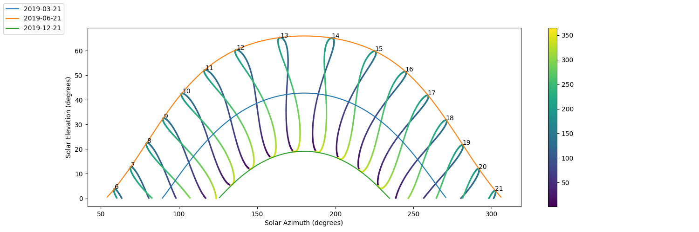{: .mkd-glr-single-img srcset="../images/mkd_glr_plot_1_pvwatt_003.png, ../images/mkd_glr_plot_1_pvwatt_003_2_0x.png 2.0x"}


<!-- GENERATED FROM PYTHON SOURCE LINES 248-250 -->

<a href='#step1'>


<!-- GENERATED FROM PYTHON SOURCE LINES 252-254 -->

## 1. Define system


<!-- GENERATED FROM PYTHON SOURCE LINES 256-263 -->

```{.python }
import pvlib
import pandas as pd  # for data wrangling
import matplotlib.pyplot as plt  # for visualization
import pathlib  # for finding the example dataset
print(pvlib.__version__)


```


Out:
{: .mkd-glr-script-out }

```{.shell .mkd-glr-script-out-disp }
0.9.3

```


<!-- GENERATED FROM PYTHON SOURCE LINES 264-273 -->

```{.python }
class Photovoltaik:
    def __init__(self, path, year) -> None:
        self.path = path
        df_tmy, meta = pvlib.iotools.read_epw(path, year)
        location = pvlib.location.Location(
            latitude=meta["latitude"], longitude=meta["longitude"]
        )


```


<!-- GENERATED FROM PYTHON SOURCE LINES 274-276 -->

## System


<!-- GENERATED FROM PYTHON SOURCE LINES 276-352 -->

```{.python }

path = "Zurich-Kloten_2013.epw"
import numpy as np


df_tmy, meta = pvlib.iotools.read_epw(path)


location = pvlib.location.Location(
    latitude=meta["latitude"], longitude=meta["longitude"]
)

times = df_tmy.index 
solar_position = location.get_solarposition(times)

tilt = 30
azimuth = 180

df_poa = pvlib.irradiance.get_total_irradiance(
    surface_tilt=tilt,
    surface_azimuth=azimuth,
    dni=df_tmy["dni"],
    ghi=df_tmy["ghi"],
    dhi=df_tmy["dhi"],
    solar_zenith=solar_position["apparent_zenith"],
    solar_azimuth=solar_position["azimuth"],
)

poa = df_poa["poa_global"]
poa_sky = df_poa["poa_sky_diffuse"]

parameters = pvlib.temperature.TEMPERATURE_MODEL_PARAMETERS["sapm"]["open_rack_glass_polymer"]

cell_temperature = pvlib.temperature.sapm_cell(
    poa, df_tmy["temp_air"], df_tmy["wind_speed"], **parameters)

# power
gamma_pdc = -0.004  # divide by 100 to go from %/°C to 1/°C
nameplate = 10000

array_power = pvlib.pvsystem.pvwatts_dc(poa, cell_temperature, nameplate, gamma_pdc)
loses = 1 - pvlib.pvsystem.pvwatts_losses() / 100
dc = loses*array_power


"""
soiling: numeric, default 2
shading: numeric, default 3
snow: numeric, default 0
mismatch: numeric, default 2
wiring: numeric, default 2
connections: numeric, default 0.5
lid: numeric, default 1.5
Light induced degradation
nameplate_rating: numeric, default 1
age: numeric, default 0
availability: numeric, default 3
"""

# 0.86 × 0.96 = 0.825
pdc0 = nameplate / 0.96  # W
ac = pvlib.inverter.pvwatts(dc, pdc0)

df_plot = pd.DataFrame(
    {
        "Sun power on Modul": poa,
        "Panel (DC)": dc,
        "Inverter (AC)": ac,
    }
)

print(len(df_tmy))
df_plot.sum() /1000


```


Out:
{: .mkd-glr-script-out }

```{.shell .mkd-glr-script-out-disp }
8760

Sun power on Modul     1228.649168
Panel (DC)            10291.541853
Inverter (AC)          9772.178951
dtype: float64
```


<!-- GENERATED FROM PYTHON SOURCE LINES 353-357 -->

```{.python }
loses


```


Out:
{: .mkd-glr-script-out }

```{.shell .mkd-glr-script-out-disp }

0.8592433931173553
```


<!-- GENERATED FROM PYTHON SOURCE LINES 363-374 -->

```{.python }

ar = dc.resample("M").sum() /1000
ar.plot.bar()
plt.xticks(np.arange(12), ['Jan', 'Feb', 'Mär', 'Mai', 'Apr', 'Jun', 'Jul', 'Aug', 'Sep', 'Okt', 'Nov', 'Dez'])
plt.ylabel("Power [W]")
plt.xlabel("Month")
plt.title("DC Power")
poa.resample(rule="M").sum().to_list()[0]/1000
df_poa.sum() / 1000


```


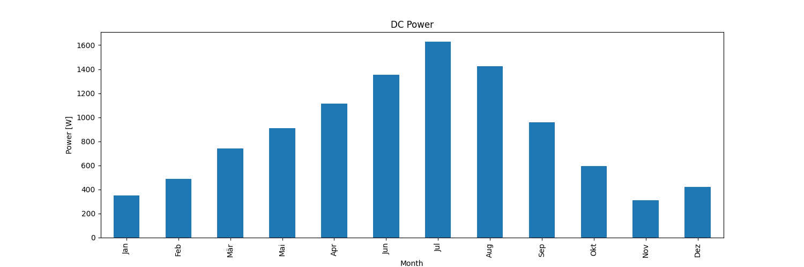{: .mkd-glr-single-img srcset="../images/mkd_glr_plot_1_pvwatt_004.png, ../images/mkd_glr_plot_1_pvwatt_004_2_0x.png 2.0x"}

Out:
{: .mkd-glr-script-out }

```{.shell .mkd-glr-script-out-disp }

poa_global            1228.649168
poa_direct             653.458733
poa_diffuse            575.190436
poa_sky_diffuse        555.746217
poa_ground_diffuse      19.444219
dtype: float64
```


<!-- GENERATED FROM PYTHON SOURCE LINES 375-384 -->

```{.python }


first_week = df_tmy[4000:4200]  # Plotting 7 days, each one has 24 hours or entries
first_week[['ghi', 'dhi', 'dni']].plot()
plt.ylabel('Irradiance [W/m$^2$]')
plt.title("By Hours")


```


{: .mkd-glr-single-img srcset="../images/mkd_glr_plot_1_pvwatt_005.png, ../images/mkd_glr_plot_1_pvwatt_005_2_0x.png 2.0x"}

Out:
{: .mkd-glr-script-out }

```{.shell .mkd-glr-script-out-disp }

Text(0.5, 1.0, 'By Hours')
```


<!-- GENERATED FROM PYTHON SOURCE LINES 385-396 -->

```{.python }

day = df_tmy.loc['2013-03-15':'2013-03-18']
plt.rcParams["figure.figsize"] = (15,5)
plt.plot(day['dni'], color='r', ) 
plt.plot(day['dhi'], color='g', marker='.') 
plt.plot(day['ghi'], color='b', marker='s') 
plt.ylabel('Irradiance [W/m$^2$]')
plt.show()
day[['ghi', 'dhi', 'dni']].plot()


```


<ul class="mkd-glr-horizontal">

</ul>


Out:
{: .mkd-glr-script-out }

```{.shell .mkd-glr-script-out-disp }

<AxesSubplot:>
```


<!-- GENERATED FROM PYTHON SOURCE LINES 397-408 -->

```{.python }
day = df_tmy.loc['2013-06-15':'2013-06-18']
plt.rcParams["figure.figsize"] = (15,5)

plt.plot(day['dni'], color='r', ) 
plt.plot(day['dhi'], color='g', marker='.') 
plt.plot(day['ghi'], color='b', marker='s') 
plt.ylabel('Irradiance [W/m$^2$]')
plt.show()


```


{: .mkd-glr-single-img srcset="../images/mkd_glr_plot_1_pvwatt_008.png, ../images/mkd_glr_plot_1_pvwatt_008_2_0x.png 2.0x"}


<!-- GENERATED FROM PYTHON SOURCE LINES 409-420 -->

```{.python }
day = df_tmy.loc['2013-09-15':'2013-09-18']
plt.rcParams["figure.figsize"] = (15,5)

plt.plot(day['dni'], color='r', ) 
plt.plot(day['dhi'], color='g', marker='.') 
plt.plot(day['ghi'], color='b', marker='s') 
plt.ylabel('Irradiance [W/m$^2$]')
plt.title("Sep day")

plt.show()

```


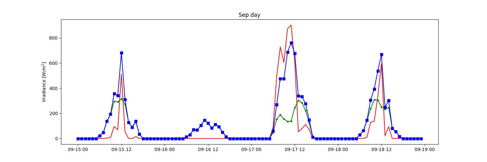{: .mkd-glr-single-img srcset="../images/mkd_glr_plot_1_pvwatt_009.png, ../images/mkd_glr_plot_1_pvwatt_009_2_0x.png 2.0x"}


<!-- GENERATED FROM PYTHON SOURCE LINES 421-431 -->

```{.python }
day = df_tmy.loc['2013-12-15':'2013-12-18']
plt.rcParams["figure.figsize"] = (15,5)

plt.plot(day['dni'], color='r', ) 
plt.plot(day['dhi'], color='g', marker='.') 
plt.plot(day['ghi'], color='b', marker='s') 
plt.ylabel('Irradiance [W/m$^2$]')
plt.title("Dezember day")
plt.show()

```


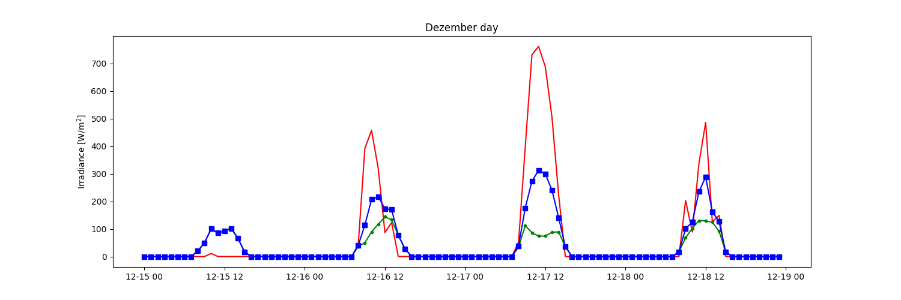{: .mkd-glr-single-img srcset="../images/mkd_glr_plot_1_pvwatt_010.png, ../images/mkd_glr_plot_1_pvwatt_010_2_0x.png 2.0x"}


<!-- GENERATED FROM PYTHON SOURCE LINES 432-435 -->

```{.python }
meta["latitude"], meta["longitude"]


```


Out:
{: .mkd-glr-script-out }

```{.shell .mkd-glr-script-out-disp }

(47.48, 8.536)
```


<!-- GENERATED FROM PYTHON SOURCE LINES 439-445 -->

```{.python }

print("Sun: kwh/m2", int(poa.sum()/1000))
print("DC: 1/kW", int(dc.sum() / 1000))
print("AC: 1/kW",int(ac.sum() / 1000))


```


Out:
{: .mkd-glr-script-out }

```{.shell .mkd-glr-script-out-disp }
Sun: kwh/m2 1228
DC: 1/kW 10291
AC: 1/kW 9772

```


<!-- GENERATED FROM PYTHON SOURCE LINES 446-456 -->

```{.python }

# summing hourly power (W) gives (W h)
df = df_plot.resample("M").sum()/1000

df.plot.bar(figsize=(10, 6))
plt.xticks(np.arange(12), ['Jan', 'Feb', 'Mär', 'Mai', 'Apr', 'Jun', 'Jul', 'Aug', 'Sep', 'Okt', 'Nov', 'Dez'])
plt.ylabel("Energy [kWh]")


```


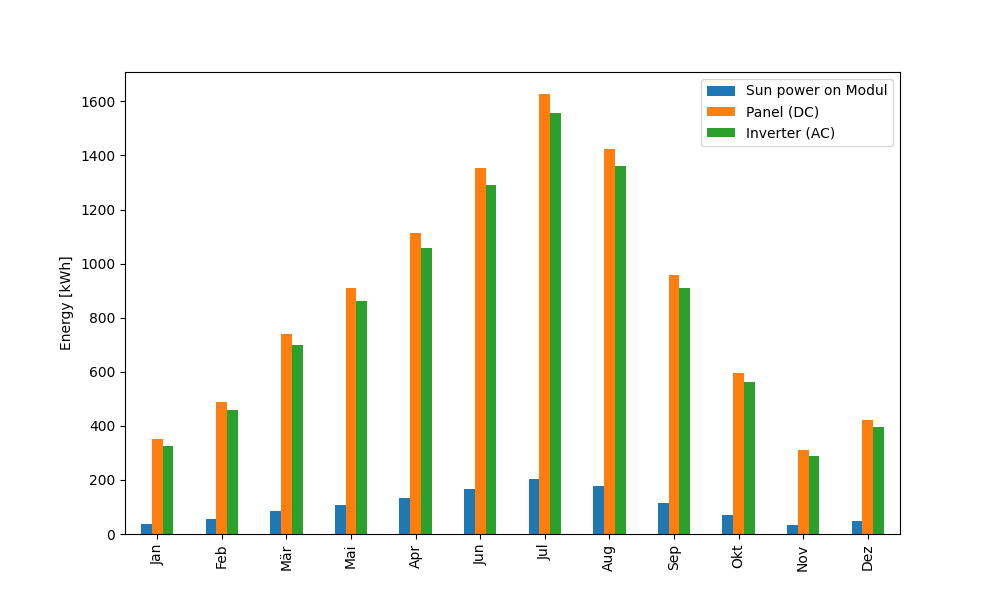{: .mkd-glr-single-img srcset="../images/mkd_glr_plot_1_pvwatt_011.png, ../images/mkd_glr_plot_1_pvwatt_011_2_0x.png 2.0x"}

Out:
{: .mkd-glr-script-out }

```{.shell .mkd-glr-script-out-disp }

Text(148.56944444444443, 0.5, 'Energy [kWh]')
```


<!-- GENERATED FROM PYTHON SOURCE LINES 457-462 -->

```{.python }
from IPython.core.display import HTML
table = df_plot.resample("M").sum()/1000
HTML(table.to_html())


```


<div class="output_subarea output_html rendered_html output_result">
    <table border="1" class="dataframe">
      <thead>
        <tr style="text-align: right;">
          <th></th>
          <th>Sun power on Modul</th>
          <th>Panel (DC)</th>
          <th>Inverter (AC)</th>
        </tr>
      </thead>
      <tbody>
        <tr>
          <th>2013-01-31 00:00:00+01:00</th>
          <td>38.494692</td>
          <td>350.633420</td>
          <td>326.911645</td>
        </tr>
        <tr>
          <th>2013-02-28 00:00:00+01:00</th>
          <td>53.672784</td>
          <td>488.012873</td>
          <td>459.871143</td>
        </tr>
        <tr>
          <th>2013-03-31 00:00:00+01:00</th>
          <td>83.392006</td>
          <td>738.956014</td>
          <td>699.358851</td>
        </tr>
        <tr>
          <th>2013-04-30 00:00:00+01:00</th>
          <td>107.681745</td>
          <td>909.861365</td>
          <td>863.239269</td>
        </tr>
        <tr>
          <th>2013-05-31 00:00:00+01:00</th>
          <td>131.628182</td>
          <td>1112.216254</td>
          <td>1057.149702</td>
        </tr>
        <tr>
          <th>2013-06-30 00:00:00+01:00</th>
          <td>165.497878</td>
          <td>1353.043178</td>
          <td>1289.504500</td>
        </tr>
        <tr>
          <th>2013-07-31 00:00:00+01:00</th>
          <td>204.188466</td>
          <td>1627.302976</td>
          <td>1555.574802</td>
        </tr>
        <tr>
          <th>2013-08-31 00:00:00+01:00</th>
          <td>177.170196</td>
          <td>1424.280164</td>
          <td>1360.727382</td>
        </tr>
        <tr>
          <th>2013-09-30 00:00:00+01:00</th>
          <td>115.700551</td>
          <td>956.579524</td>
          <td>910.439319</td>
        </tr>
        <tr>
          <th>2013-10-31 00:00:00+01:00</th>
          <td>69.452008</td>
          <td>596.784887</td>
          <td>563.050733</td>
        </tr>
        <tr>
          <th>2013-11-30 00:00:00+01:00</th>
          <td>34.949738</td>
          <td>312.421527</td>
          <td>289.569624</td>
        </tr>
        <tr>
          <th>2013-12-31 00:00:00+01:00</th>
          <td>46.820923</td>
          <td>421.449670</td>
          <td>396.781979</td>
        </tr>
      </tbody>
    </table>
</div>


<!-- GENERATED FROM PYTHON SOURCE LINES 463-480 -->

Total nominal power: 10 kWp	Meteodata: Meteoswiss 2020

| Month	      |  Gh [kWh/m2]	|    Simulated [kWh]	|
|:------------|---------------------:|-------------:|
| Jan     2020|	38	          |  572	0       	|
| Feb     2020|	51	          |  624	0       	|
| Mrz     2020|	105	         |   1078	        |
| Apr     2020|	153	         |   1379	        |
| Mai     2020|	184	         |   1424	        |
| Jun     2020|	159	         |   1162	        |
| Jul     2020|	195	         |   1444	        |
| Aug     2020|	151	         |   1206	        |
| Sep     2020|	116	         |   1073	        |
| Okt     2020|	59	          |  639	0       	|
| Nov     2020|	34	          |  438	0       	|
| Dez     2020|	18	          |  214	0       	|
| Year	       | 1263	        |11253	        |

<!-- GENERATED FROM PYTHON SOURCE LINES 482-489 -->

```{.python }

print("Sun: kwh/m2", int(poa.sum()/1000))
print("DC: 1/kW", int(dc.sum() / 1000))
print("AC: 1/kW",int(ac.sum() / 1000))


```


Out:
{: .mkd-glr-script-out }

```{.shell .mkd-glr-script-out-disp }
Sun: kwh/m2 1228
DC: 1/kW 10291
AC: 1/kW 9772

```


<!-- GENERATED FROM PYTHON SOURCE LINES 490-506 -->

```{.python }

ax = ac.resample("D").sum().plot( label="AC")
dc.resample("D").sum().plot(ax=ax, label="DC")

plt.rcParams["figure.figsize"] = (40,10)

plt.ylabel("Energy [kWh]")

plt.title("DC and AC Power")
plt.ylabel("Output [kWh/day]")
plt.grid()
plt.legend()

plt.show()


```


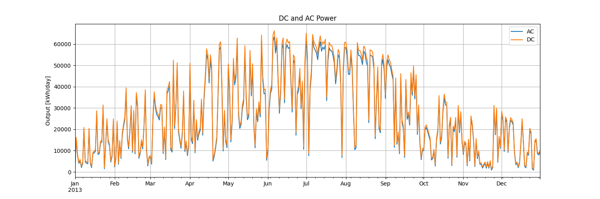{: .mkd-glr-single-img srcset="../images/mkd_glr_plot_1_pvwatt_012.png, ../images/mkd_glr_plot_1_pvwatt_012_2_0x.png 2.0x"}


<!-- GENERATED FROM PYTHON SOURCE LINES 507-531 -->

```{.python }

plt.rcParams["font.size"] = 14
bar = {"AC": ac.resample("M").sum()/1000,
        "DC": dc.resample("M").sum()/1000}


pd.DataFrame(bar).plot.bar(figsize=(15, 12),)


print(df_plot.resample("M").sum()/1000)


plt.xticks(np.arange(12), ['Jan', 'Feb', 'Mär', 'Mai', 'Apr', 'Jun', 'Jul', 'Aug', 'Sep', 'Okt', 'Nov', 'Dez'])
plt.ylabel("Energy [kWh]")


plt.title("DC and AC Power")
plt.ylabel("Output [kWh/Month]")
plt.grid(axis='y')
plt.legend()
plt.show()


```


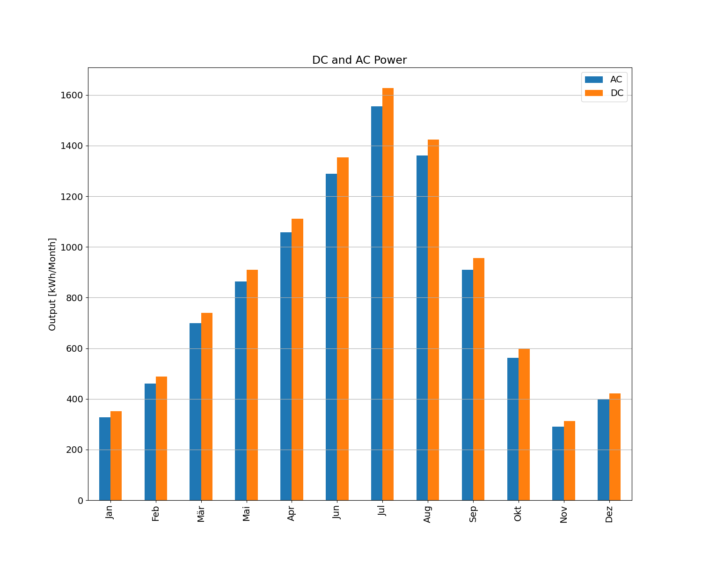{: .mkd-glr-single-img srcset="../images/mkd_glr_plot_1_pvwatt_013.png, ../images/mkd_glr_plot_1_pvwatt_013_2_0x.png 2.0x"}

Out:
{: .mkd-glr-script-out }

```{.shell .mkd-glr-script-out-disp }
                           Sun power on Modul   Panel (DC)  Inverter (AC)
2013-01-31 00:00:00+01:00           38.494692   350.633420     326.911645
2013-02-28 00:00:00+01:00           53.672784   488.012873     459.871143
2013-03-31 00:00:00+01:00           83.392006   738.956014     699.358851
2013-04-30 00:00:00+01:00          107.681745   909.861365     863.239269
2013-05-31 00:00:00+01:00          131.628182  1112.216254    1057.149702
2013-06-30 00:00:00+01:00          165.497878  1353.043178    1289.504500
2013-07-31 00:00:00+01:00          204.188466  1627.302976    1555.574802
2013-08-31 00:00:00+01:00          177.170196  1424.280164    1360.727382
2013-09-30 00:00:00+01:00          115.700551   956.579524     910.439319
2013-10-31 00:00:00+01:00           69.452008   596.784887     563.050733
2013-11-30 00:00:00+01:00           34.949738   312.421527     289.569624
2013-12-31 00:00:00+01:00           46.820923   421.449670     396.781979

```


<!-- GENERATED FROM PYTHON SOURCE LINES 532-545 -->

```{.python }
plt.rcParams["font.size"] = 14

ax = ac.resample("M").sum().plot(figsize=(15, 10), label="AC")
dc.resample("M").sum().plot(ax=ax, label="DC")

plt.title("DC and AC Power")
plt.ylabel("Output [Wh/day]")
plt.grid()
plt.legend()

plt.show()


```


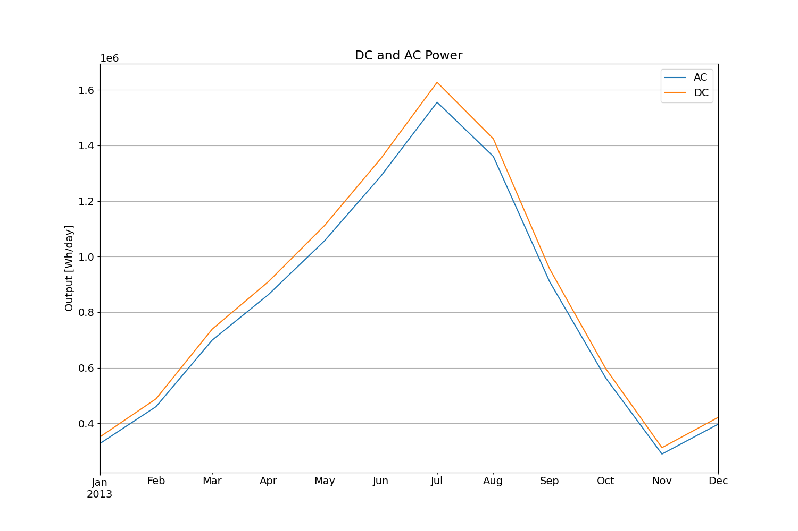{: .mkd-glr-single-img srcset="../images/mkd_glr_plot_1_pvwatt_014.png, ../images/mkd_glr_plot_1_pvwatt_014_2_0x.png 2.0x"}


<!-- GENERATED FROM PYTHON SOURCE LINES 546-564 -->

```{.python }
plt.rcParams["font.size"] = 14

ax = (
    ac.resample("M")
    .sum()
    .plot.bar(
        figsize=(8, 5),
        label="AC",
    )
)

plt.title("AC Power")
plt.ylabel("Output [Wh/day]")
plt.xticks(np.arange(12), ['Jan', 'Feb', 'Mär', 'Mai', 'Apr', 'Jun', 'Jul', 'Aug', 'Sep', 'Okt', 'Nov', 'Dez'])

plt.legend()


```


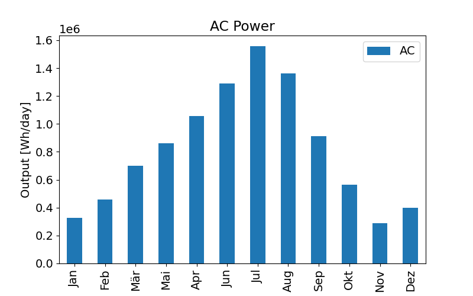{: .mkd-glr-single-img srcset="../images/mkd_glr_plot_1_pvwatt_015.png, ../images/mkd_glr_plot_1_pvwatt_015_2_0x.png 2.0x"}

Out:
{: .mkd-glr-script-out }

```{.shell .mkd-glr-script-out-disp }

<matplotlib.legend.Legend object at 0x12ee1d690>
```


<!-- GENERATED FROM PYTHON SOURCE LINES 565-576 -->

```{.python }
plt.rcParams["font.size"] = 14

dc.resample("M").sum().plot.bar(label="DC",figsize=(6, 5),)

plt.title("DC Power")
plt.ylabel("Output [Wh/day]")
plt.xticks(np.arange(12), ['Jan', 'Feb', 'Mär', 'Mai', 'Apr', 'Jun', 'Jul', 'Aug', 'Sep', 'Okt', 'Nov', 'Dez'])

plt.legend()


```


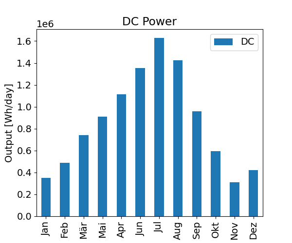{: .mkd-glr-single-img srcset="../images/mkd_glr_plot_1_pvwatt_016.png, ../images/mkd_glr_plot_1_pvwatt_016_2_0x.png 2.0x"}

Out:
{: .mkd-glr-script-out }

```{.shell .mkd-glr-script-out-disp }

<matplotlib.legend.Legend object at 0x29c886560>
```


<!-- GENERATED FROM PYTHON SOURCE LINES 577-587 -->

```{.python }

plt.rcParams["figure.figsize"] = (10,5)

plt.scatter(poa, dc, c=df_tmy["temp_air"])
plt.colorbar()
plt.ylabel("Array Power [W]")
plt.xlabel("POA Irradiance [W/m^2]")
plt.title("Power vs POA, colored by amb. temp.")


```


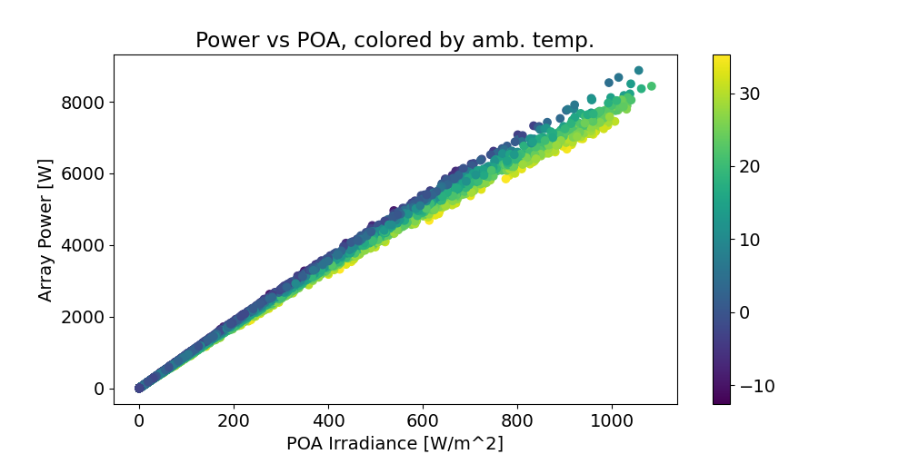{: .mkd-glr-single-img srcset="../images/mkd_glr_plot_1_pvwatt_017.png, ../images/mkd_glr_plot_1_pvwatt_017_2_0x.png 2.0x"}

Out:
{: .mkd-glr-script-out }

```{.shell .mkd-glr-script-out-disp }

Text(0.5, 1.0, 'Power vs POA, colored by amb. temp.')
```


<!-- GENERATED FROM PYTHON SOURCE LINES 588-589 -->

<a href='#step2'>


**Total running time of the script:** ( 0 minutes  7.638 seconds)

<div id="download_links"></div>


[:fontawesome-solid-download: Download Python source code: plot_1_pvwatt.py](./plot_1_pvwatt.py){ .md-button .center}

[:fontawesome-solid-download: Download Jupyter notebook: plot_1_pvwatt.ipynb](./plot_1_pvwatt.ipynb){ .md-button .center}


[Gallery generated by mkdocs-gallery](https://mkdocs-gallery.github.io){: .mkd-glr-signature }
