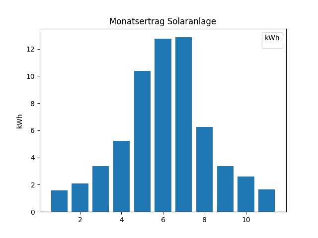

<!--
 DO NOT EDIT.
 THIS FILE WAS AUTOMATICALLY GENERATED BY mkdocs-gallery.
 TO MAKE CHANGES, EDIT THE SOURCE PYTHON FILE:
 "docs/examples/plott_2_GeoAdmin.py"
 LINE NUMBERS ARE GIVEN BELOW.
-->

!!! note

    Click [here](#download_links)
    to download the full example code


GeoAdmin API
===================================

[Documentation](https://api3.geo.admin.ch/index.html)

[Intro in Rest API Real Python](https://realpython.com/api-integration-in-python/#rest-architecture)

Layers Metadata[¶](https://api3.geo.admin.ch/services/sdiservices.html#layers-metadata "Permalink to this headline")

This service provides metadata for all the available layers in the GeoAdmin API.

<!-- GENERATED FROM PYTHON SOURCE LINES 16-25 -->

```{.python }
import requests
import pprint

api_url = "https://api3.geo.admin.ch/rest/services/api/MapServer"
response = requests.get(api_url)
response.json()

 

```


Out:
{: .mkd-glr-script-out }

```{.shell .mkd-glr-script-out-disp }

{'mapName': 'api', 'description': 'Configuration for the map (topic) api', 'copyrightUnicode': 'Data api', 'layers': [{'attributes': {'maps': 'api,ech,geodesy,geol,inspire,wms-bgdi', 'wmsUrlResource': 'https://wms.geo.admin.ch/?REQUEST=GetCapabilities&SERVICE=WMS&VERSION=1.0.0', 'dataOwner': 'Bundesamt für Landestopografie swisstopo, Atlas der Schweiz', 'urlDetails': 'https://www.swisstopo.admin.ch/de/wissen-fakten/geodaesie-vermessung/bezugsrahmen/lokal/landesschwerenetz.html', 'scaleLimit': '-', 'dataStatus': '20230210 21:20', 'inspireUpperAbstract': 'Basisdaten | Umwelt, Biologie und Geologie', 'inspireUpperName': 'Basisdaten | Umwelt, Biologie und Geologie', 'abstract': 'Aktuell verwendete Basisstationen des Landesschwerenetzes. Diese Stationen werden regelmässig neu vermessen und dienen als Referenzpunkte für gravimetrische Projekte.Das Rückgrat des Netzes bilden die absoluten Schweremessungen. Diese werden verdichtet durch relative Schweremessungen auf Fixpunkten der Landesvermessung.', 'urlApplication': 'https://map.geo.admin.ch', 'inspireAbstract': 'Geografische Bezeichnungen | Geologie', 'fullTextSearch': 'Landesschwerenetz | Aktuell verwendete Basisstationen des Landesschwerenetzes. Diese Stationen werden regelmässig neu vermessen und dienen als Referenzpunkte für gravimetrische Projekte.Das Rückgrat des Netzes bilden die absoluten Schweremessungen. Diese werden verdichtet durch relative Schweremessungen auf Fixpunkten der Landesvermessung. | swisstopo | Bundesamt für Landestopografie swisstopo | Bundesamt für Landestopografie swisstopo, Atlas der Schweiz', 'inspireName': 'Geografische Bezeichnungen | Geologie', 'wmsContactAbbreviation': 'swisstopo', 'bundCollectionNumber': '34.8', 'wmsContactName': 'Bundesamt für Landestopografie swisstopo'}, 'idGeoCat': '95879cd4-e93d-4d4d-af57-4ec6731b9c97', 'layerBodId': 'ch.swisstopo.landesschwerenetz', 'name': 'Schweregrundnetz', 'fullName': 'Landesschwerenetz'}, {'attributes': {'maps': 'api,are,ech,inspire,kgs,swissmaponline,wms-bgdi', 'wmsUrlResource': 'https://wms.geo.admin.ch/?REQUEST=GetCapabilities&SERVICE=WMS&VERSION=1.0.0', 'bundCollection': 'Alpenkonvention', 'dataOwner': 'Bundesamt für Raumentwicklung ARE', 'urlDetails': 'https://www.are.admin.ch/are/de/home/laendliche-raeume-und-berggebiete/internationale-zusammenarbeit/alpenkonvention.html', 'scaleLimit': "Min 1:25'000", 'dataStatus': '20090101', 'inspireUpperAbstract': 'Basisdaten | Umwelt, Biologie und Geologie', 'downloadUrl': 'https://data.geo.admin.ch/browser/index.html#/collections/ch.are.alpenkonvention', 'inspireUpperName': 'Basisdaten | Umwelt, Biologie und Geologie', 'abstract': 'Perimeter der Alpenkonvention in der Schweiz. Die Alpenkonvention ist ein völkerrechtlicher Vertrag zwischen den acht Alpenländern Deutschland, Frankreich, Italien, Liechtenstein, Monaco, Österreich, Schweiz, Slowenien sowie der Europäischen Union. Das Ziel des Übereinkommens ist der Schutz der Alpen durch eine sektorübergreifende, ganzheitliche und nachhaltige Politik.', 'urlApplication': 'http://map.are.admin.ch/?Y=660000&X=190000&zoom=1&bgLayer=ch.swisstopo.pixelkarte-grau&layers=ch.are.alpenkonvention&layers_opacity=0.2&layers_visibility=true&lang=de', 'inspireAbstract': 'Umweltüberwachung | Verwaltungseinheiten', 'fullTextSearch': 'Alpenkonvention | Perimeter der Alpenkonvention in der Schweiz. Die Alpenkonvention ist ein völkerrechtlicher Vertrag zwischen den acht Alpenländern Deutschland, Frankreich, Italien, Liechtenstein, Monaco, Österreich, Schweiz, Slowenien sowie der Europäischen Union. Das Ziel des Übereinkommens ist der Schutz der Alpen durch eine sektorübergreifende, ganzheitliche und nachhaltige Politik. | Alpenkonvention | swisstopo | Bundesamt für Landestopografie swisstopo | Bundesamt für Raumentwicklung ARE', 'inspireName': 'Umweltüberwachung | Verwaltungseinheiten', 'wmsContactAbbreviation': 'swisstopo', 'bundCollectionNumber': '3.1', 'wmsContactName': 'Bundesamt für Landestopografie swisstopo'}, 'idGeoCat': '8698bf0b-fceb-4f0f-989b-111e7c4af0a4', 'layerBodId': 'ch.are.alpenkonvention', 'name': 'Alpenkonvention', 'fullName': 'Alpenkonvention'}, {'attributes': {'maps': 'api,ech,energie,geol,geothermie,inspire,schule,wms-bgdi', 'wmsUrlResource': 'https://wms.geo.admin.ch/?REQUEST=GetCapabilities&SERVICE=WMS&VERSION=1.0.0', 'dataOwner': 'Bundesamt für Landestopografie swisstopo', 'scaleLimit': '-', 'dataStatus': '20180808', 'inspireUpperAbstract': 'Energie und Wirtschaft', 'downloadUrl': 'https://data.geo.admin.ch/ch.swisstopo.geologie-tiefengeothermie_projekte/', 'inspireUpperName': 'Energie und Wirtschaft', 'abstract': 'Das Produkt «Tiefengeothermie-Projekte» wird derzeit überarbeitet, und daher ist die Online-Version für den Moment nicht aktuell. Diese Karte zeigt Tiefengeothermie-Anlagen im Betrieb sowie ehemalige und aktuelle Tiefengeothermie-Projekte in der Schweiz an. Der Projektstatus entspricht einer der folgenden möglichen Phasen: - In Planung: Das Projekt ist in der technischen Planungsphase. Dies beinhaltet auch Bewilligungs- und Konzessionsverfahren. - Bewilligung erteilt: Das Projekt wurde bewilligt und befindet sich in der Bauphase, produziert aber noch keine Energie. - In Betrieb: Das Projekt ist in der Phase der geothermischen Energieproduktion. - Stillgelegt: Aus verschiedenen Gründen wurde das Projekt sistiert oder ganz eingestellt. Weiter wird zwischen Wärme-, Wärme/Strom- und Speicher-Projekten unterschieden.', 'inspireAbstract': 'Energiequellen', 'fullTextSearch': 'Mitteltiefe und tiefe Geothermie in der Schweiz | Das Produkt «Tiefengeothermie-Projekte» wird derzeit überarbeitet, und daher ist die Online-Version für den Moment nicht aktuell. Diese Karte zeigt Tiefengeothermie-Anlagen im Betrieb sowie ehemalige und aktuelle Tiefengeothermie-Projekte in der Schweiz an. Der Projektstatus entspricht einer der folgenden möglichen Phasen: - In Planung: Das Projekt ist in der technischen Planungsphase. Dies beinhaltet auch Bewilligungs- und Konzessionsverfahren. - Bewilligung erteilt: Das Projekt wurde bewilligt und befindet sich in der Bauphase, produziert aber noch keine Energie. - In Betrieb: Das Projekt ist in der Phase der geothermischen Energieproduktion. - Stillgelegt: Aus verschiedenen Gründen wurde das Projekt sistiert oder ganz eingestellt. Weiter wird zwischen Wärme-, Wärme/Strom- und Speicher-Projekten unterschieden. | swisstopo | Bundesamt für Landestopografie swisstopo | Bundesamt für Landestopografie swisstopo', 'inspireName': 'Energiequellen', 'wmsContactAbbreviation': 'swisstopo', 'wmsContactName': 'Bundesamt für Landestopografie swisstopo'}, 'idGeoCat': '2df11e59-d85a-40cf-98cf-4b941577e23c', 'layerBodId': 'ch.swisstopo.geologie-tiefengeothermie_projekte', 'name': 'Tiefengeothermie-Projekte', 'fullName': 'Mitteltiefe und tiefe Geothermie in der Schweiz'}, {'attributes': {'maps': 'api,ech,inspire,wms-bgdi', 'wmsUrlResource': 'https://wms.geo.admin.ch/?REQUEST=GetCapabilities&SERVICE=WMS&VERSION=1.0.0', 'dataOwner': 'Bundesamt für Gesundheit BAG', 'urlDetails': 'https://www.bag.admin.ch/ura-hvs-de', 'scaleLimit': '-', 'dataStatus': '20230210', 'inspireUpperAbstract': 'Umwelt, Biologie und Geologie', 'downloadUrl': 'https://data.geo.admin.ch/browser/index.html#/collections/ch.bag.radioaktivitaet-atmosphaere', 'inspireUpperName': 'Umwelt, Biologie und Geologie', 'abstract': 'Konzentration von aerosolgebundener Radioaktivität in der Aussenluft bei 6 von der Sektion Umweltradioaktivität (URA) des Bundesamtes für Gesundheit (BAG) betriebenen Stationen. Die Filter der Hoch-Volumen-Aerosolsammler werden wöchentlich gewechselt und anschliessend gammaspektrometrisch (HPGe) gemessen. Dargestellt sind die neuesten verfügbaren Messwerte in Mikro-Becquerel pro Kubikmeter (µBq/m3).', 'inspireAbstract': 'Meteorologisch-geografische Kennwerte', 'fullTextSearch': 'Radioaktivität in der Atmosphäre | Konzentration von aerosolgebundener Radioaktivität in der Aussenluft bei 6 von der Sektion Umweltradioaktivität (URA) des Bundesamtes für Gesundheit (BAG) betriebenen Stationen. Die Filter der Hoch-Volumen-Aerosolsammler werden wöchentlich gewechselt und anschliessend gammaspektrometrisch (HPGe) gemessen. Dargestellt sind die neuesten verfügbaren Messwerte in Mikro-Becquerel pro Kubikmeter (µBq/m3). | swisstopo | Bundesamt für Landestopografie swisstopo | Bundesamt für Gesundheit BAG', 'inspireName': 'Meteorologisch-geografische Kennwerte', 'wmsContactAbbreviation': 'swisstopo', 'wmsContactName': 'Bundesamt für Landestopografie swisstopo'}, 'idGeoCat': '170800fb-e85c-42b7-8c4b-ba33b364b79f', 'layerBodId': 'ch.bag.radioaktivitaet-atmosphaere', 'name': 'Radioaktivität in der Atmosphäre', 'fullName': 'Radioaktivität in der Atmosphäre'}, {'attributes': {'maps': 'api,are,ech,inspire,wms-bgdi', 'wmsUrlResource': 'https://wms.geo.admin.ch/?REQUEST=GetCapabilities&SERVICE=WMS&VERSION=1.0.0', 'dataOwner': 'Bundesamt für Raumentwicklung ARE', 'urlDetails': 'https://www.are.admin.ch/verkehrsperspektiven', 'scaleLimit': '', 'dataStatus': '20210630', 'inspireUpperAbstract': 'Infrastruktur und Kommunikation', 'downloadUrl': 'https://data.geo.admin.ch/browser/index.html#/collections/ch.are.belastung-personenverkehr-bahn_zukunft', 'inspireUpperName': 'Infrastruktur und Kommunikation', 'abstract': 'Beförderte Personen im öffentlichen Verkehr auf dem schweizerischen Schienennetz (inkl. Tram) im Jahr 2050. Tageswerte für den durchschnittlichen Werktagverkehr (DWV) und den durchschnittlichen Tagesverkehr (DTV) sowie Werte der Morgenspitze (7h-8h, MSP) und der Abendspitze (17h-18h, ASP). Quelle: Verkehrsperspektiven 2050, Szenario Basis.', 'urlApplication': 'http://map.are.admin.ch/?Y=660000&X=190000&zoom=1&bgLayer=ch.swisstopo.pixelkarte-grau&layers=ch.are.belastung-personenverkehr-bahn-2050&layers_opacity=1&layers_visibility=true&lang=de', 'inspireAbstract': 'Verkehrsnetze', 'fullTextSearch': 'Belastung (Personen) des schweizerischen Schienennetzes (Personenverkehr) 2050 | Beförderte Personen im öffentlichen Verkehr auf dem schweizerischen Schienennetz (inkl. Tram) im Jahr 2050. Tageswerte für den durchschnittlichen Werktagverkehr (DWV) und den durchschnittlichen Tagesverkehr (DTV) sowie Werte der Morgenspitze (7h-8h, MSP) und der Abendspitze (17h-18h, ASP). Quelle: Verkehrsperspektiven 2050, Szenario Basis. | swisstopo | Bundesamt für Landestopografie swisstopo | Bundesamt für Raumentwicklung ARE', 'inspireName': 'Verkehrsnetze', 'wmsContactAbbreviation': 'swisstopo', 'wmsContactName': 'Bundesamt für Landestopografie swisstopo'}, 'idGeoCat': '8f947ac4-0334-4065-a55f-2563b39cd6ed', 'layerBodId': 'ch.are.belastung-personenverkehr-bahn_zukunft', 'name': 'Personenverkehr Schiene 2050', 'fullName': 'Belastung (Personen) des schweizerischen Schienennetzes (Personenverkehr) 2050'}, {'attributes': {'maps': 'api,ech,geol,inspire,wms-bgdi', 'wmsUrlResource': 'https://wms.geo.admin.ch/?REQUEST=GetCapabilities&SERVICE=WMS&VERSION=1.0.0', 'dataOwner': 'Bundesamt für Landestopografie swisstopo, Erlebnis Geologie', 'urlDetails': 'https://www.erlebnis-geologie.ch/ueber-uns/erlebnis-geologie/', 'scaleLimit': '', 'dataStatus': '20230211', 'inspireUpperAbstract': 'Umwelt, Biologie und Geologie', 'inspireUpperName': 'Umwelt, Biologie und Geologie', 'abstract': 'Geotourismus erschliesst erdgeschichtliche und landschaftliche Besonderheiten. Fachleute und Laien können auf geologischen Wanderwegen (Geowege) erdwissenschaftliche Entwicklungen vor Ort erleben und begreifen. Die Plattform Geowissenschaften der Akademie der Naturwissenschaften Schweiz (SCNAT) und «Erlebnis Geologie» haben die geologischen Wanderwege in der Schweiz zusammengestellt.', 'urlApplication': 'https://www.erlebnis-geologie.ch/', 'inspireAbstract': 'Geologie', 'fullTextSearch': 'Erlebnis Geologie: Geowege | Geotourismus erschliesst erdgeschichtliche und landschaftliche Besonderheiten. Fachleute und Laien können auf geologischen Wanderwegen (Geowege) erdwissenschaftliche Entwicklungen vor Ort erleben und begreifen. Die Plattform Geowissenschaften der Akademie der Naturwissenschaften Schweiz (SCNAT) und «Erlebnis Geologie» haben die geologischen Wanderwege in der Schweiz zusammengestellt. | swisstopo | Bundesamt für Landestopografie swisstopo | Bundesamt für Landestopografie swisstopo, Erlebnis Geologie', 'inspireName': 'Geologie', 'wmsContactAbbreviation': 'swisstopo', 'wmsContactName': 'Bundesamt für Landestopografie swisstopo'}, 'idGeoCat': '3356602e-23d5-4e42-9d75-55fe9cc2daba', 'layerBodId': 'ch.swisstopo.geologie-geowege', 'name': 'Geowege', 'fullName': 'Erlebnis Geologie: Geowege'}, {'attributes': {'maps': 'api,are,ech,inspire,wms-bgdi', 'wmsUrlResource': 'https://wms.geo.admin.ch/?REQUEST=GetCapabilities&SERVICE=WMS&VERSION=1.0.0', 'dataOwner': 'Bundesamt für Raumentwicklung ARE', 'urlDetails': 'https://www.are.admin.ch/verkehrsperspektiven', 'scaleLimit': '', 'dataStatus': '20210630', 'inspireUpperAbstract': 'Infrastruktur und Kommunikation', 'downloadUrl': 'https://data.geo.admin.ch/browser/index.html#/collections/ch.are.belastung-personenverkehr-strasse_zukunft', 'inspireUpperName': 'Infrastruktur und Kommunikation', 'abstract': 'Fahrzeuge auf dem schweizerischen Strassennetz unterschieden nach Personenwagen (PW), Lieferwagen (LI), Lastwagen (LW) und Lastzügen (LZ) im Jahr 2050. Tageswerte für den durchschnittlichen Werktagverkehr (DWV) und den durchschnittlichen Tagesverkehr (DTV) sowie Werte der Morgenspitze (7h-8h, MSP) und der Abendspitze (17h-18h, ASP). Quelle: Verkehrsperspektiven 2050, Szenario Basis.', 'urlApplication': 'http://map.are.admin.ch/?Y=660000&X=190000&zoom=1&bgLayer=ch.swisstopo.pixelkarte-grau&layers=ch.are.belastung-personenverkehr-strasse-2050&layers_opacity=1&layers_visibility=true&lang=de', 'inspireAbstract': 'Verkehrsnetze', 'fullTextSearch': 'Belastung (Fahrzeuge) des schweizerischen Strassennetzes nach Fahrzeugkategorien (Personen- und Güterverkehr) 2050 | Fahrzeuge auf dem schweizerischen Strassennetz unterschieden nach Personenwagen (PW), Lieferwagen (LI), Lastwagen (LW) und Lastzügen (LZ) im Jahr 2050. Tageswerte für den durchschnittlichen Werktagverkehr (DWV) und den durchschnittlichen Tagesverkehr (DTV) sowie Werte der Morgenspitze (7h-8h, MSP) und der Abendspitze (17h-18h, ASP). Quelle: Verkehrsperspektiven 2050, Szenario Basis. | swisstopo | Bundesamt für Landestopografie swisstopo | Bundesamt für Raumentwicklung ARE', 'inspireName': 'Verkehrsnetze', 'wmsContactAbbreviation': 'swisstopo', 'wmsContactName': 'Bundesamt für Landestopografie swisstopo'}, 'idGeoCat': '5cd6d93e-3fbc-4ce9-b32b-136affb6baca', 'layerBodId': 'ch.are.belastung-personenverkehr-strasse_zukunft', 'name': 'Personen-/Güterverkehr Strasse 2050', 'fullName': 'Belastung (Fahrzeuge) des schweizerischen Strassennetzes nach Fahrzeugkategorien (Personen- und Güterverkehr) 2050'}, {'attributes': {'maps': 'api,are,ech,inspire,wms-bgdi', 'wmsUrlResource': 'https://wms.geo.admin.ch/?REQUEST=GetCapabilities&SERVICE=WMS&VERSION=1.0.0', 'dataOwner': 'Bundesamt für Raumentwicklung ARE', 'urlDetails': 'https://www.are.admin.ch/are/de/home/verkehr-und-infrastruktur/grundlagen-und-daten/verkehrsmodellierung/npvm.html', 'scaleLimit': '', 'dataStatus': '20170630', 'inspireUpperAbstract': 'Infrastruktur und Kommunikation', 'downloadUrl': 'https://data.geo.admin.ch/browser/index.html#/collections/ch.are.erreichbarkeit-miv', 'inspireUpperName': 'Infrastruktur und Kommunikation', 'abstract': 'Erreichbarkeit je Verkehrszone auf der Strasse in Abhängigkeit der Reisezeiten von allen Zonen in der Schweiz zur Verkehrszone sowie der Anzahl von in der Verkehrszone vorhandenen Einwohnern und Arbeitsplätzen. Quelle: Nationales Personenverkehrsmodell (NPVM) des UVEK.', 'urlApplication': 'https://map.are.admin.ch/?Y=660000&X=190000&zoom=1&bgLayer=ch.swisstopo.pixelkarte-grau&layers=ch.are.erreichbarkeit-miv&layers_opacity=0.75&layers_visibility=true&lang=de', 'inspireAbstract': 'Verkehrsnetze', 'fullTextSearch': 'Erreichbarkeit auf der Strasse in Abhängigkeit von Reisezeit und Potenzial am Ziel | Erreichbarkeit je Verkehrszone auf der Strasse in Abhängigkeit der Reisezeiten von allen Zonen in der Schweiz zur Verkehrszone sowie der Anzahl von in der Verkehrszone vorhandenen Einwohnern und Arbeitsplätzen. Quelle: Nationales Personenverkehrsmodell (NPVM) des UVEK. | swisstopo | Bundesamt für Landestopografie swisstopo | Bundesamt für Raumentwicklung ARE', 'inspireName': 'Verkehrsnetze', 'wmsContactAbbreviation': 'swisstopo', 'wmsContactName': 'Bundesamt für Landestopografie swisstopo'}, 'idGeoCat': 'f0835478-07fc-4e12-bf48-51646a59c809', 'layerBodId': 'ch.are.erreichbarkeit-miv', 'name': 'Erreichbarkeit auf der Strasse', 'fullName': 'Erreichbarkeit auf der Strasse in Abhängigkeit von Reisezeit und Potenzial am Ziel'}, {'attributes': {'maps': 'api,are,ech,inspire,wms-bgdi', 'wmsUrlResource': 'https://wms.geo.admin.ch/?REQUEST=GetCapabilities&SERVICE=WMS&VERSION=1.0.0', 'dataOwner': 'Bundesamt für Raumentwicklung ARE', 'urlDetails': 'https://www.are.admin.ch/are/de/home/verkehr-und-infrastruktur/grundlagen-und-daten/verkehrsmodellierung/npvm.html', 'scaleLimit': '', 'dataStatus': '20170630', 'inspireUpperAbstract': 'Infrastruktur und Kommunikation', 'downloadUrl': 'https://data.geo.admin.ch/browser/index.html#/collections/ch.are.erreichbarkeit-oev', 'inspireUpperName': 'Infrastruktur und Kommunikation', 'abstract': 'Erreichbarkeit je Verkehrszone im ÖV in Abhängigkeit der ÖV-Reisezeiten von allen Zonen in der Schweiz zur Verkehrszone sowie der Anzahl von in der Verkehrszone vorhandenen Einwohnern und Arbeitsplätzen. Quelle: Nationales Personenverkehrsmodell (NPVM) des UVEK.', 'urlApplication': 'https://map.are.admin.ch/?Y=660000&X=190000&zoom=1&bgLayer=ch.swisstopo.pixelkarte-grau&layers=ch.are.erreichbarkeit-oev&layers_opacity=0.75&layers_visibility=true&lang=de', 'inspireAbstract': 'Verkehrsnetze', 'fullTextSearch': 'Erreichbarkeit mit dem öffentlichen Verkehr in Abhängigkeit von Reisezeit und Potenzial am Ziel | Erreichbarkeit je Verkehrszone im ÖV in Abhängigkeit der ÖV-Reisezeiten von allen Zonen in der Schweiz zur Verkehrszone sowie der Anzahl von in der Verkehrszone vorhandenen Einwohnern und Arbeitsplätzen. Quelle: Nationales Personenverkehrsmodell (NPVM) des UVEK. | swisstopo | Bundesamt für Landestopografie swisstopo | Bundesamt für Raumentwicklung ARE', 'inspireName': 'Verkehrsnetze', 'wmsContactAbbreviation': 'swisstopo', 'wmsContactName': 'Bundesamt für Landestopografie swisstopo'}, 'idGeoCat': 'e3437f64-68e1-4b07-ae35-22597ca89cc2', 'layerBodId': 'ch.are.erreichbarkeit-oev', 'name': 'Erreichbarkeit mit dem ÖV', 'fullName': 'Erreichbarkeit mit dem öffentlichen Verkehr in Abhängigkeit von Reisezeit und Potenzial am Ziel'}, {'attributes': {'maps': 'api,are,ech,geothermie,inspire,swissmaponline,wms-bgdi', 'wmsUrlResource': 'https://wms.geo.admin.ch/?REQUEST=GetCapabilities&SERVICE=WMS&VERSION=1.0.0', 'dataOwner': 'Bundesamt für Raumentwicklung ARE', 'urlDetails': 'https://www.are.admin.ch/are/de/home/raumentwicklung-und-raumplanung/grundlagen-und-daten/bauzonenstatistik-schweiz.html', 'scaleLimit': '-', 'dataStatus': '20140101', 'inspireUpperAbstract': 'Basisdaten | Energie und Wirtschaft', 'downloadUrl': 'https://data.geo.admin.ch/browser/index.html#/collections/ch.are.gemeindetypen', 'inspireUpperName': 'Basisdaten | Energie und Wirtschaft', 'abstract': 'Die Gemeindetypologie ARE ist das Ergebnis einer Kombination zwischen den Grossregionen, der Agglomerationsdefinition 2000 sowie der Gemeindetypologie 2000 des Bundesamts für Statistik BFS.Die Gemeindetypologie ARE wird nicht mehr aktualisiert. Es wird empfohlen, die aktuelle Gemeindetypologie 2012 des BFS zu verwenden. Weitere Informationen: https://www.bfs.admin.ch/bfs/de/home/statistiken/querschnittsthemen/raeumliche-analysen/raeumliche-gliederungen/raeumliche-typologien.assetdetail.2543279.html', 'urlApplication': 'http://map.are.admin.ch/?Y=660000&X=190000&zoom=1&bgLayer=ch.swisstopo.pixelkarte-grau&layers=ch.are.gemeindetypen', 'inspireAbstract': 'Statistische Einheiten | Verwaltungseinheiten', 'fullTextSearch': 'Gemeindetypologie ARE | Die Gemeindetypologie ARE ist das Ergebnis einer Kombination zwischen den Grossregionen, der Agglomerationsdefinition 2000 sowie der Gemeindetypologie 2000 des Bundesamts für Statistik BFS.Die Gemeindetypologie ARE wird nicht mehr aktualisiert. Es wird empfohlen, die aktuelle Gemeindetypologie 2012 des BFS zu verwenden. Weitere Informationen: https://www.bfs.admin.ch/bfs/de/home/statistiken/querschnittsthemen/raeumliche-analysen/raeumliche-gliederungen/raeumliche-typologien.assetdetail.2543279.html | swisstopo | Bundesamt für Landestopografie swisstopo | Bundesamt für Raumentwicklung ARE', 'inspireName': 'Statistische Einheiten | Verwaltungseinheiten', 'wmsContactAbbreviation': 'swisstopo', 'wmsContactName': 'Bundesamt für Landestopografie swisstopo'}, 'idGeoCat': 'c967f055-9482-4bcb-a1bb-8de7971e7293', 'layerBodId': 'ch.are.gemeindetypen', 'name': 'Gemeindetypologie ARE', 'fullName': 'Gemeindetypologie ARE'}, {'attributes': {'maps': 'api,are,ech,inspire,wms-bgdi', 'wmsUrlResource': 'https://wms.geo.admin.ch/?REQUEST=GetCapabilities&SERVICE=WMS&VERSION=1.0.0', 'dataOwner': 'Bundesamt für Raumentwicklung ARE', 'urlDetails': 'https://www.are.admin.ch/are/de/home/verkehr-und-infrastruktur/grundlagen-und-daten/verkehrsmodellierung/npvm.html', 'scaleLimit': '', 'dataStatus': '20170630', 'inspireUpperAbstract': 'Infrastruktur und Kommunikation', 'downloadUrl': 'https://data.geo.admin.ch/browser/index.html#/collections/ch.are.reisezeit-agglomerationen-miv', 'inspireUpperName': 'Infrastruktur und Kommunikation', 'abstract': 'Reisezeit zu Agglomerationen und Kerngemeinden ausserhalb der Agglomerationen auf dem Strassennetz. Von jeder Verkehrszone aus wird die Reisezeit zur am schnellsten erreichbaren Agglomeration resp. Kerngemeinde bestimmt. Quelle: Nationales Personenverkehrsmodell (NPVM) des UVEK.', 'urlApplication': 'https://map.are.admin.ch/?Y=660000&X=190000&zoom=1&bgLayer=ch.swisstopo.pixelkarte-grau&layers=ch.are.reisezeit-agglomerationen-miv&layers_opacity=0.75&layers_visibility=true&lang=de', 'inspireAbstract': 'Verkehrsnetze', 'fullTextSearch': 'Reisezeit zu Agglomerationen und Kerngemeinden auf der Strasse | Reisezeit zu Agglomerationen und Kerngemeinden ausserhalb der Agglomerationen auf dem Strassennetz. Von jeder Verkehrszone aus wird die Reisezeit zur am schnellsten erreichbaren Agglomeration resp. Kerngemeinde bestimmt. Quelle: Nationales Personenverkehrsmodell (NPVM) des UVEK. | swisstopo | Bundesamt für Landestopografie swisstopo | Bundesamt für Raumentwicklung ARE', 'inspireName': 'Verkehrsnetze', 'wmsContactAbbreviation': 'swisstopo', 'wmsContactName': 'Bundesamt für Landestopografie swisstopo'}, 'idGeoCat': 'd23ebfb6-00a4-44d6-8463-4d34d57a5ff4', 'layerBodId': 'ch.are.reisezeit-agglomerationen-miv', 'name': 'Reisezeit zu Agglos Strasse', 'fullName': 'Reisezeit zu Agglomerationen und Kerngemeinden auf der Strasse'}, {'attributes': {'maps': 'api,are,ech,inspire,wms-bgdi', 'wmsUrlResource': 'https://wms.geo.admin.ch/?REQUEST=GetCapabilities&SERVICE=WMS&VERSION=1.0.0', 'dataOwner': 'Bundesamt für Raumentwicklung ARE', 'urlDetails': 'https://www.are.admin.ch/are/de/home/verkehr-und-infrastruktur/grundlagen-und-daten/verkehrsmodellierung/npvm.html', 'scaleLimit': '', 'dataStatus': '20170630', 'inspireUpperAbstract': 'Infrastruktur und Kommunikation', 'downloadUrl': 'https://data.geo.admin.ch/browser/index.html#/collections/ch.are.reisezeit-agglomerationen-oev', 'inspireUpperName': 'Infrastruktur und Kommunikation', 'abstract': 'Reisezeit zu Agglomerationen und Kerngemeinden ausserhalb der Agglomerationen mit dem öffentlichen Verkehr. Von jeder Verkehrszone aus wird die Reisezeit zur am schnellsten erreichbaren Agglomeration resp. Kerngemeinde bestimmt. Quelle: Nationales Personenverkehrsmodell (NPVM) des UVEK.', 'urlApplication': 'https://map.are.admin.ch/?Y=660000&X=190000&zoom=1&bgLayer=ch.swisstopo.pixelkarte-grau&layers=ch.are.reisezeit-agglomerationen-oev&layers_opacity=0.75&layers_visibility=true&lang=de', 'inspireAbstract': 'Verkehrsnetze', 'fullTextSearch': 'Reisezeit zu Agglomerationen und Kerngemeinden mit dem öffentlichen Verkehr | Reisezeit zu Agglomerationen und Kerngemeinden ausserhalb der Agglomerationen mit dem öffentlichen Verkehr. Von jeder Verkehrszone aus wird die Reisezeit zur am schnellsten erreichbaren Agglomeration resp. Kerngemeinde bestimmt. Quelle: Nationales Personenverkehrsmodell (NPVM) des UVEK. | swisstopo | Bundesamt für Landestopografie swisstopo | Bundesamt für Raumentwicklung ARE', 'inspireName': 'Verkehrsnetze', 'wmsContactAbbreviation': 'swisstopo', 'wmsContactName': 'Bundesamt für Landestopografie swisstopo'}, 'idGeoCat': '333489d5-6ea1-468d-b1d5-bd213d9f1d0b', 'layerBodId': 'ch.are.reisezeit-agglomerationen-oev', 'name': 'Reisezeit zu Agglos ÖV', 'fullName': 'Reisezeit zu Agglomerationen und Kerngemeinden mit dem öffentlichen Verkehr'}, {'attributes': {'maps': 'api,ech,energie,inspire,sachplan,wms-bgdi', 'wmsUrlResource': 'https://wms.geo.admin.ch/?REQUEST=GetCapabilities&SERVICE=WMS&VERSION=1.0.0', 'dataOwner': 'Bundesamt für Raumentwicklung ARE', 'urlDetails': 'https://www.are.admin.ch/windenergie', 'scaleLimit': '', 'dataStatus': '20200925', 'inspireUpperAbstract': 'Raum und Bevölkerung', 'downloadUrl': 'https://data.geo.admin.ch/browser/index.html#/collections/ch.are.windenergie-bundesinteressen', 'inspireUpperName': 'Raum und Bevölkerung', 'abstract': 'Das Konzept Windenergie ist ein Konzept nach Artikel 13 des Bundesgesetzes über die Raumplanung (RPG, SR 700). Das Konzept definiert einerseits die wichtigsten Bundesinteressen, welche bei der Planung von Windenergieanlagen zu berücksichtigen sind, und andererseits die hauptsächlichen Windpotenzialgebiete, welche im Rahmen der kantonalen Richtplanung abzuklären sind. Dadurch erhöht das Konzept Windenergie die Planungssicherheit.Die Hinweise auf Bundesinteressen bei der Planung von Windenergieanlagen beruhen auf einer Synthese der Einschränkungen in den Bereichen Lärmschutz, Sachpläne des Bundes, Landschafts-, Natur- und Heimatschutz, Artenschutz sowie Technische Anlagen in der Kompetenz des Bundes. Dabei ist zu beachten, dass zu verschiedenen relevanten Bundesinteressen aufgrund fehlender Daten keine oder keine vollständigen räumliche Aussagen gemacht werden können. Im Rahmen der kantonalen Richtplanung und der Nutzungsplanung sind deshalb jeweils weitere stufengerechte Abklärungen zu den betroffenen Bundesinteressen vorzunehmen. Die Karteninhalte stellen keine rechtsverbindliche Aussage dar. Einzelne Karteninhalte beruhen auf behördenverbindlichen Aussagen, z.B. Inventarobjekten des Bundes, die Karte ist jedoch nicht behördenverbindlich. Bei der Nutzung der Abfragefunktion werden Details zur abgefragten Rasterzelle angezeigt. Die Karte und Abfrageergebnisse entfalten ihre volle Aussagekraft nur unter Einbezug der Ausführungen im Konzept Windenergie sowie dem dazugehörigen Erläuterungsbericht.', 'urlApplication': 'https://map.geo.admin.ch/?topic=sachplan&lang=de', 'inspireAbstract': 'Geregelte Gebiete und Berichterstattungseinheiten', 'fullTextSearch': 'Konzept Windenergie - Hinweiskarte auf Bundesinteressen für die Planung von Windenergieanlagen | Das Konzept Windenergie ist ein Konzept nach Artikel 13 des Bundesgesetzes über die Raumplanung (RPG, SR 700). Das Konzept definiert einerseits die wichtigsten Bundesinteressen, welche bei der Planung von Windenergieanlagen zu berücksichtigen sind, und andererseits die hauptsächlichen Windpotenzialgebiete, welche im Rahmen der kantonalen Richtplanung abzuklären sind. Dadurch erhöht das Konzept Windenergie die Planungssicherheit.Die Hinweise auf Bundesinteressen bei der Planung von Windenergieanlagen beruhen auf einer Synthese der Einschränkungen in den Bereichen Lärmschutz, Sachpläne des Bundes, Landschafts-, Natur- und Heimatschutz, Artenschutz sowie Technische Anlagen in der Kompetenz des Bundes. Dabei ist zu beachten, dass zu verschiedenen relevanten Bundesinteressen aufgrund fehlender Daten keine oder keine vollständigen räumliche Aussagen gemacht werden können. Im Rahmen der kantonalen Richtplanung und der Nutzungsplanung sind deshalb jeweils weitere stufengerechte Abklärungen zu den betroffenen Bundesinteressen vorzunehmen. Die Karteninhalte stellen keine rechtsverbindliche Aussage dar. Einzelne Karteninhalte beruhen auf behördenverbindlichen Aussagen, z.B. Inventarobjekten des Bundes, die Karte ist jedoch nicht behördenverbindlich. Bei der Nutzung der Abfragefunktion werden Details zur abgefragten Rasterzelle angezeigt. Die Karte und Abfrageergebnisse entfalten ihre volle Aussagekraft nur unter Einbezug der Ausführungen im Konzept Windenergie sowie dem dazugehörigen Erläuterungsbericht. | swisstopo | Bundesamt für Landestopografie swisstopo | Bundesamt für Raumentwicklung ARE', 'inspireName': 'Geregelte Gebiete und Berichterstattungseinheiten', 'wmsContactAbbreviation': 'swisstopo', 'wmsContactName': 'Bundesamt für Landestopografie swisstopo'}, 'idGeoCat': '171a7520-27b2-4a60-9251-acf9b450d6b6', 'layerBodId': 'ch.are.windenergie-bundesinteressen', 'name': 'Wind: Bundesinteressen', 'fullName': 'Konzept Windenergie - Hinweiskarte auf Bundesinteressen für die Planung von Windenergieanlagen'}, {'attributes': {'maps': 'api,cadastre,ech,inspire,swisstopo,wms-bgdi', 'wmsUrlResource': 'https://wms.geo.admin.ch/?REQUEST=GetCapabilities&SERVICE=WMS&VERSION=1.0.0', 'dataOwner': 'Bundesamt für Landestopografie swisstopo', 'urlDetails': 'https://www.swisstopo.admin.ch/de/geodata/amtliche-verzeichnisse/gebaeudeadressenverzeichnis.html', 'scaleLimit': '', 'dataStatus': '20230210', 'inspireUpperAbstract': 'Basisdaten', 'downloadUrl': 'https://www.swisstopo.admin.ch/de/geodata/amtliche-verzeichnisse/gebaeudeadressenverzeichnis.html', 'inspireUpperName': 'Basisdaten', 'abstract': 'Offizieller Datensatz für «Amtliches Verzeichnis der Gebäudeadressen», ID197, gemäss Katalog der Geobasisdaten nach Bundesrecht. Das amtliche Verzeichnis der Gebäudeadressen beinhaltet sämtliche offiziellen und damit behördenverbindlichen Adressen der Schweiz. Alle Gebäude müssen eine oder mehrere eindeutige Adressen aufweisen. Gebäude mit Wohnnutzung, Arbeitsstätten sowie Gebäude von allgemein öffentlichem Interesse müssen zwingend im amtlichen Verzeichnis der Gebäudeadressen erscheinen. Grundlage für das amtliche Verzeichnis der Gebäudeadressen bildet das eidgenössische Gebäude- und Wohnungsregister (GWR).', 'urlApplication': 'https://www.swisstopo.admin.ch/de/geodata/amtliche-verzeichnisse/gebaeudeadressenverzeichnis.html', 'inspireAbstract': 'Adressen', 'fullTextSearch': 'Amtliches Verzeichnis der Gebäudeadressen | Offizieller Datensatz für «Amtliches Verzeichnis der Gebäudeadressen», ID197, gemäss Katalog der Geobasisdaten nach Bundesrecht. Das amtliche Verzeichnis der Gebäudeadressen beinhaltet sämtliche offiziellen und damit behördenverbindlichen Adressen der Schweiz. Alle Gebäude müssen eine oder mehrere eindeutige Adressen aufweisen. Gebäude mit Wohnnutzung, Arbeitsstätten sowie Gebäude von allgemein öffentlichem Interesse müssen zwingend im amtlichen Verzeichnis der Gebäudeadressen erscheinen. Grundlage für das amtliche Verzeichnis der Gebäudeadressen bildet das eidgenössische Gebäude- und Wohnungsregister (GWR). | swisstopo | Bundesamt für Landestopografie swisstopo | Bundesamt für Landestopografie swisstopo', 'inspireName': 'Adressen', 'wmsContactAbbreviation': 'swisstopo', 'bundCollectionNumber': '197.1', 'wmsContactName': 'Bundesamt für Landestopografie swisstopo'}, 'idGeoCat': '150c38c5-2650-4018-b5c7-939e2cdd56ce', 'layerBodId': 'ch.swisstopo.amtliches-gebaeudeadressverzeichnis', 'name': 'Amtliches Gebäudeadressverzeichnis', 'fullName': 'Amtliches Verzeichnis der Gebäudeadressen'}, {'attributes': {'maps': 'api,astra,ech,inspire,schule,wms-bgdi', 'wmsUrlResource': 'https://wms.geo.admin.ch/?REQUEST=GetCapabilities&SERVICE=WMS&VERSION=1.0.0', 'bundCollection': 'Hauptstrassennetz', 'dataOwner': 'Bundesamt für Strassen ASTRA', 'urlDetails': 'https://map.geo.admin.ch/?layers=ch.astra.hauptstrassennetz', 'scaleLimit': '', 'dataStatus': '20200101', 'inspireUpperAbstract': 'Infrastruktur und Kommunikation', 'downloadUrl': 'https://data.geo.admin.ch/ch.astra.hauptstrassennetz', 'inspireUpperName': 'Infrastruktur und Kommunikation', 'abstract': 'Dieser Datensatz umfasst das Netz der schweizerischen Hauptstrassen, das in der Verordnung über die Verwendung der zweckgebundenen Mineralölsteuer im Strassenverkehr (MinVV) festgelegt ist. Der Bund, der den Kantonen Beiträge für das Hauptstrassennetz gewährt, definiert eindeutig, welche Infrastruktur zum Hauptstrassennetz gehört. Die Achsen der Hauptstrassen können für die Beschreibung und die Referenzierung von Sachverhalten entlang der Strassen verwendet werden. Im Gegensatz zum schweizerischen Hauptstrassennetz gem. MinVV wird das Hauptstrassennetz gemäss Durchgangsstrassenverordnung auf nationaler Ebene nicht kartografisch dargestellt. Die Durchgangsstrassenverordnung hält lediglich die Strassenverbindungen fest, die dem Durchgangsverkehr offenstehen müssen. Welcher Streckenverlauf resp. welche Strasseninfrastruktur genau betroffen ist, wird hingegen nicht angegeben.', 'inspireAbstract': 'Verkehrsnetze', 'fullTextSearch': 'Hauptstrassennetz der Schweiz (MinVV) | Dieser Datensatz umfasst das Netz der schweizerischen Hauptstrassen, das in der Verordnung über die Verwendung der zweckgebundenen Mineralölsteuer im Strassenverkehr (MinVV) festgelegt ist. Der Bund, der den Kantonen Beiträge für das Hauptstrassennetz gewährt, definiert eindeutig, welche Infrastruktur zum Hauptstrassennetz gehört. Die Achsen der Hauptstrassen können für die Beschreibung und die Referenzierung von Sachverhalten entlang der Strassen verwendet werden. Im Gegensatz zum schweizerischen Hauptstrassennetz gem. MinVV wird das Hauptstrassennetz gemäss Durchgangsstrassenverordnung auf nationaler Ebene nicht kartografisch dargestellt. Die Durchgangsstrassenverordnung hält lediglich die Strassenverbindungen fest, die dem Durchgangsverkehr offenstehen müssen. Welcher Streckenverlauf resp. welche Strasseninfrastruktur genau betroffen ist, wird hingegen nicht angegeben. | Hauptstrassennetz | swisstopo | Bundesamt für Landestopografie swisstopo | Bundesamt für Strassen ASTRA', 'inspireName': 'Verkehrsnetze', 'wmsContactAbbreviation': 'swisstopo', 'bundCollectionNumber': '90.1', 'wmsContactName': 'Bundesamt für Landestopografie swisstopo'}, 'idGeoCat': 'c1333de6-fb91-4b0b-be95-8eab89b05358', 'layerBodId': 'ch.astra.hauptstrassennetz', 'name': 'Hauptstrassennetz', 'fullName': 'Hauptstrassennetz der Schweiz (MinVV)'}, {'attributes': {'maps': 'api,bafu,ech,inspire,kgs,schule,wms-bgdi', 'wmsUrlResource': 'https://wms.geo.admin.ch/?REQUEST=GetCapabilities&SERVICE=WMS&VERSION=1.0.0', 'dataOwner': 'Pro Natura', 'urlDetails': 'http://www.pronatura.ch/schutzgebiete', 'scaleLimit': '-', 'dataStatus': '20221231', 'inspireUpperAbstract': 'Umwelt, Biologie und Geologie', 'inspireUpperName': 'Umwelt, Biologie und Geologie', 'abstract': 'Pro Natura sichert mit Verträgen über 770 Naturschutzgebiete in der Schweiz mit einer Gesamtfläche von rund 270 km2. Aus unterschiedlichen Gründen dürfen öffentlich nur 763 Gebiete dargestellt werden. In einem Teil dieser Gebiete führt Pro Natura die professionelle Betreuung selbst aus. Über 69 km2 davon sind im Eigentum von Pro Natura. Damit ist Pro Natura die grösste private Landbesitzerin der Schweiz. Für einen besseren Schutz oder zur Arrondierung und Aufwertung von Naturschutzgebieten sichert Pro Natura jedes Jahr zusätzliche Flächen oder kauft neue Parzellen. Eine Übersicht darüber gibt der jährliche Leistungsbericht. Sie verzichtet aber auch auf die Erneuerung von Verträgen, wenn der Schutz des Gebietes durch andere Massnahmen gewährleistet ist. Mit ihren Naturschutzgebieten sichert Pro Natura Lebensräume für unzählige Tier- und Pflanzenarten und schenkt Ihnen und den folgenden Generationen attraktive, unverbaute Landschaftselemente. Die Naturschutzgebiete von Pro Natura umfassen unter anderem auch Waldreservate.', 'urlApplication': 'http://map.bafu.admin.ch', 'inspireAbstract': 'Schutzgebiete', 'fullTextSearch': 'Pro Natura Naturschutzgebiete | Pro Natura sichert mit Verträgen über 770 Naturschutzgebiete in der Schweiz mit einer Gesamtfläche von rund 270 km2. Aus unterschiedlichen Gründen dürfen öffentlich nur 763 Gebiete dargestellt werden. In einem Teil dieser Gebiete führt Pro Natura die professionelle Betreuung selbst aus. Über 69 km2 davon sind im Eigentum von Pro Natura. Damit ist Pro Natura die grösste private Landbesitzerin der Schweiz. Für einen besseren Schutz oder zur Arrondierung und Aufwertung von Naturschutzgebieten sichert Pro Natura jedes Jahr zusätzliche Flächen oder kauft neue Parzellen. Eine Übersicht darüber gibt der jährliche Leistungsbericht. Sie verzichtet aber auch auf die Erneuerung von Verträgen, wenn der Schutz des Gebietes durch andere Massnahmen gewährleistet ist. Mit ihren Naturschutzgebieten sichert Pro Natura Lebensräume für unzählige Tier- und Pflanzenarten und schenkt Ihnen und den folgenden Generationen attraktive, unverbaute Landschaftselemente. Die Naturschutzgebiete von Pro Natura umfassen unter anderem auch Waldreservate. | swisstopo | Bundesamt für Landestopografie swisstopo | Pro Natura', 'inspireName': 'Schutzgebiete', 'wmsContactAbbreviation': 'swisstopo', 'wmsContactName': 'Bundesamt für Landestopografie swisstopo'}, 'idGeoCat': 'db4b251f-d431-457d-9ed6-4abf59d2a54a', 'layerBodId': 'ch.pronatura.naturschutzgebiete', 'name': 'Pro Natura Naturschutzgebiete', 'fullName': 'Pro Natura Naturschutzgebiete'}, {'attributes': {'maps': 'api,astra,ech,inspire,ivs,swissmaponline,wms-bgdi', 'wmsUrlResource': 'https://wms.geo.admin.ch/?REQUEST=GetCapabilities&SERVICE=WMS&VERSION=1.0.0', 'dataOwner': 'Bundesamt für Strassen ASTRA', 'urlDetails': 'http://www.ivs.admin.ch', 'scaleLimit': '-', 'dataStatus': '20151231', 'inspireUpperAbstract': 'Infrastruktur und Kommunikation', 'downloadUrl': 'https://data.geo.admin.ch/ch.astra.ivs-gelaendekarte/data.zip', 'inspireUpperName': 'Infrastruktur und Kommunikation', 'abstract': 'Die Geländekarte stellt die kartografische Grundlage der Ersterfassung des Inventars dar. Sie beinhaltet ergänzende Angaben zu den Objekten nach Artikel 3 der Verordnung über das Bundesinventar der historischen Verkehrswege der Schweiz VIVS sowie zu den Objekten von regionaler und lokaler Bedeutung. Die Geländekarte wird vorerst nicht nachgeführt und deshalb nur als Zusatzinformation in der elektronischen Publikation sowie als gesonderte Karte in der gedruckten Ausgabe (vgl. Art. 4 VIVS) geführt. Der Kanton Solothurn hat für die Neubeurteilung der Objekte von regionaler/lokaler Bedeutung die Geländekarten überarbeitet. Diese überarbeiteten Versionen sind im vorliegenden Datensatz enthalten.', 'urlApplication': 'http://ivs-gis.admin.ch', 'inspireAbstract': 'Verkehrsnetze', 'fullTextSearch': 'Bundesinventar der historischen Verkehrswege der Schweiz, Geländekarte | Die Geländekarte stellt die kartografische Grundlage der Ersterfassung des Inventars dar. Sie beinhaltet ergänzende Angaben zu den Objekten nach Artikel 3 der Verordnung über das Bundesinventar der historischen Verkehrswege der Schweiz VIVS sowie zu den Objekten von regionaler und lokaler Bedeutung. Die Geländekarte wird vorerst nicht nachgeführt und deshalb nur als Zusatzinformation in der elektronischen Publikation sowie als gesonderte Karte in der gedruckten Ausgabe (vgl. Art. 4 VIVS) geführt. Der Kanton Solothurn hat für die Neubeurteilung der Objekte von regionaler/lokaler Bedeutung die Geländekarten überarbeitet. Diese überarbeiteten Versionen sind im vorliegenden Datensatz enthalten. | swisstopo | Bundesamt für Landestopografie swisstopo | Bundesamt für Strassen ASTRA', 'inspireName': 'Verkehrsnetze', 'wmsContactAbbreviation': 'swisstopo', 'wmsContactName': 'Bundesamt für Landestopografie swisstopo'}, 'idGeoCat': 'c99e4a84-b340-4c83-ad3f-f5bcb15a1bf1', 'layerBodId': 'ch.astra.ivs-gelaendekarte', 'name': 'IVS Geländekarte', 'fullName': 'Bundesinventar der historischen Verkehrswege der Schweiz, Geländekarte'}, {'attributes': {'maps': 'api,astra,blw,ech,emapis,energie,inspire,ivs,kgs,sachplan,swissmaponline,wms-bgdi', 'wmsUrlResource': 'https://wms.geo.admin.ch/?REQUEST=GetCapabilities&SERVICE=WMS&VERSION=1.0.0', 'bundCollection': 'Bundesinventar der historischen Verkehrswege der Schweiz (IVS)', 'dataOwner': 'Bundesamt für Strassen ASTRA', 'urlDetails': 'http://www.ivs.admin.ch/', 'scaleLimit': "1:25'000", 'dataStatus': '20100416', 'inspireUpperAbstract': 'Infrastruktur und Kommunikation', 'downloadUrl': 'https://data.geo.admin.ch/ch.astra.ivs-nat/data.zip', 'inspireUpperName': 'Infrastruktur und Kommunikation', 'abstract': 'Das Inventar der historischen Verkehrswege der Schweiz IVS enthält umfangreiche Informationen zum Verlauf der historischen Wege, ihrer Geschichte, ihrem Zustand und ihrer Bedeutung gemäss NHG. Das IVS besteht aus zwei Teilen: dem Bundesinventar und den weiteren historischen Verkehrswegen (Verordnung über das Bundesinventar der historischen Verkehrswege der Schweiz VIVS, Art. 3). Die Objekte von nationaler Bedeutung mit sichtbarer historischer Substanz bilden das rechtlich geschützte Bundesinventar. Objekte, die im historischen Kontext von nationaler Bedeutung sind, jedoch keine oder nur geringe bauliche Substanz aufweisen sind nicht Teil des Bundesinventars. Ebenfalls zum IVS, aber nicht zum Bundesinventar, gehören überdies zahlreiche Objekte, welche von den Kantonen als solche von regionaler oder lokaler Bedeutung bezeichnet werden. Nähere Informationen zum Inventar finden Sie unter folgendem Link: http://www.ivs.admin.ch/. Den kompletten Datensatz des Inventars können Sie in der folgenden WebGIS-Anwendung betrachten, sowie als Download beziehen: http://ivs-gis.admin.ch (vgl. VIVS, Art. 4).', 'urlApplication': 'http://ivs-gis.admin.ch', 'inspireAbstract': 'Verkehrsnetze', 'fullTextSearch': 'Bundesinventar der historischen Verkehrswege der Schweiz (IVS) | Das Inventar der historischen Verkehrswege der Schweiz IVS enthält umfangreiche Informationen zum Verlauf der historischen Wege, ihrer Geschichte, ihrem Zustand und ihrer Bedeutung gemäss NHG. Das IVS besteht aus zwei Teilen: dem Bundesinventar und den weiteren historischen Verkehrswegen (Verordnung über das Bundesinventar der historischen Verkehrswege der Schweiz VIVS, Art. 3). Die Objekte von nationaler Bedeutung mit sichtbarer historischer Substanz bilden das rechtlich geschützte Bundesinventar. Objekte, die im historischen Kontext von nationaler Bedeutung sind, jedoch keine oder nur geringe bauliche Substanz aufweisen sind nicht Teil des Bundesinventars. Ebenfalls zum IVS, aber nicht zum Bundesinventar, gehören überdies zahlreiche Objekte, welche von den Kantonen als solche von regionaler oder lokaler Bedeutung bezeichnet werden. Nähere Informationen zum Inventar finden Sie unter folgendem Link: http://www.ivs.admin.ch/. Den kompletten Datensatz des Inventars können Sie in der folgenden WebGIS-Anwendung betrachten, sowie als Download beziehen: http://ivs-gis.admin.ch (vgl. VIVS, Art. 4). | Bundesinventar der historischen Verkehrswege der Schweiz (IVS) | swisstopo | Bundesamt für Landestopografie swisstopo | Bundesamt für Strassen ASTRA', 'inspireName': 'Verkehrsnetze', 'wmsContactAbbreviation': 'swisstopo', 'bundCollectionNumber': '16.1', 'wmsContactName': 'Bundesamt für Landestopografie swisstopo'}, 'idGeoCat': '70b6e2ac-c7ea-4699-a22e-65792aa3b0b9', 'layerBodId': 'ch.astra.ivs-nat', 'name': 'IVS National', 'fullName': 'Bundesinventar der historischen Verkehrswege der Schweiz (IVS)'}, {'attributes': {'maps': 'api,astra,ech,inspire,ivs,wms-bgdi', 'wmsUrlResource': 'https://wms.geo.admin.ch/?REQUEST=GetCapabilities&SERVICE=WMS&VERSION=1.0.0', 'bundCollection': 'Bundesinventar der historischen Verkehrswege der Schweiz (IVS)', 'dataOwner': 'Bundesamt für Strassen ASTRA', 'urlDetails': 'http://www.ivs.admin.ch/', 'scaleLimit': "1:25'000", 'dataStatus': '20151231', 'inspireUpperAbstract': 'Infrastruktur und Kommunikation', 'downloadUrl': 'http://data.geo.admin.ch/ch.astra.ivs-nat_abgrenzungen/data.zip', 'inspireUpperName': 'Infrastruktur und Kommunikation', 'abstract': 'Die Abgrenzungen sind Bestandteil der Inventarkarte, unabhängig von der Klassierung (national, regional, lokal). Die Abgrenzungen markieren in der Karte Anfang und Ende eines (Weg)Abschnitts. Die Abgrenzungen sind Punktobjekte. Die Kantone Bern und Schaffhausen haben im Zuge der Überprüfung ihrer IVS-Objekte von regionaler/lokaler Bedeutung z.T. neue Strecken aufgenommen oder bestehende neu unterteilt. Bei diesen neuen/veränderten Wegstrecken wurden neue Abgrenzungen erfasst. Diese sind im vorliegenden Datensatz enthalten.', 'urlApplication': 'http://ivs-gis.admin.ch', 'inspireAbstract': 'Verkehrsnetze', 'fullTextSearch': 'Bundesinventar der historischen Verkehrswege der Schweiz, Abgrenzungen | Die Abgrenzungen sind Bestandteil der Inventarkarte, unabhängig von der Klassierung (national, regional, lokal). Die Abgrenzungen markieren in der Karte Anfang und Ende eines (Weg)Abschnitts. Die Abgrenzungen sind Punktobjekte. Die Kantone Bern und Schaffhausen haben im Zuge der Überprüfung ihrer IVS-Objekte von regionaler/lokaler Bedeutung z.T. neue Strecken aufgenommen oder bestehende neu unterteilt. Bei diesen neuen/veränderten Wegstrecken wurden neue Abgrenzungen erfasst. Diese sind im vorliegenden Datensatz enthalten. | Bundesinventar der historischen Verkehrswege der Schweiz (IVS) | swisstopo | Bundesamt für Landestopografie swisstopo | Bundesamt für Strassen ASTRA', 'inspireName': 'Verkehrsnetze', 'wmsContactAbbreviation': 'swisstopo', 'bundCollectionNumber': '16.1', 'wmsContactName': 'Bundesamt für Landestopografie swisstopo'}, 'idGeoCat': 'aab3c0bf-bfa3-48e0-84d7-1a7b86e04509', 'layerBodId': 'ch.astra.ivs-nat_abgrenzungen', 'name': 'IVS Abgrenzungen', 'fullName': 'Bundesinventar der historischen Verkehrswege der Schweiz, Abgrenzungen'}, {'attributes': {'maps': 'api,astra,ech,inspire,ivs,swissmaponline,wms-bgdi', 'wmsUrlResource': 'https://wms.geo.admin.ch/?REQUEST=GetCapabilities&SERVICE=WMS&VERSION=1.0.0', 'bundCollection': 'Bundesinventar der historischen Verkehrswege der Schweiz (IVS)', 'dataOwner': 'Bundesamt für Strassen ASTRA', 'urlDetails': 'http://www.ivs.admin.ch/', 'scaleLimit': "1:25'000", 'dataStatus': '20100416', 'inspireUpperAbstract': 'Infrastruktur und Kommunikation', 'downloadUrl': 'https://data.geo.admin.ch/ch.astra.ivs-nat-verlaeufe/data.zip', 'inspireUpperName': 'Infrastruktur und Kommunikation', 'abstract': 'Der Verlauf der historischen Verkehrswege von nationaler Bedeutung ist eine Zusatzinformation zum Bundesinventar. Sie zeigt historische Verkehrswege von nationaler Bedeutung ohne oder mit nur geringer baulicher Substanz, deren Linienführung heute noch ablesbar ist (Art. 2 VIVS). Die dargestellten Verläufe sind nicht Bestandteil des Bundesinventars.', 'urlApplication': 'http://ivs-gis.admin.ch', 'inspireAbstract': 'Verkehrsnetze', 'fullTextSearch': 'Verlauf historischer Verkehrswege von nationaler Bedeutung ohne Substanz | Der Verlauf der historischen Verkehrswege von nationaler Bedeutung ist eine Zusatzinformation zum Bundesinventar. Sie zeigt historische Verkehrswege von nationaler Bedeutung ohne oder mit nur geringer baulicher Substanz, deren Linienführung heute noch ablesbar ist (Art. 2 VIVS). Die dargestellten Verläufe sind nicht Bestandteil des Bundesinventars. | Bundesinventar der historischen Verkehrswege der Schweiz (IVS) | swisstopo | Bundesamt für Landestopografie swisstopo | Bundesamt für Strassen ASTRA', 'inspireName': 'Verkehrsnetze', 'wmsContactAbbreviation': 'swisstopo', 'bundCollectionNumber': '16.1', 'wmsContactName': 'Bundesamt für Landestopografie swisstopo'}, 'idGeoCat': '8c750eb5-d781-4b14-8dee-3d8943b04465', 'layerBodId': 'ch.astra.ivs-nat-verlaeufe', 'name': 'IVS nationale Bed. hist. Verlauf', 'fullName': 'Verlauf historischer Verkehrswege von nationaler Bedeutung ohne Substanz'}, {'attributes': {'maps': 'api,astra,ech,inspire,ivs,wms-bgdi', 'wmsUrlResource': 'https://wms.geo.admin.ch/?REQUEST=GetCapabilities&SERVICE=WMS&VERSION=1.0.0', 'bundCollection': 'Bundesinventar der historischen Verkehrswege der Schweiz (IVS)', 'dataOwner': 'Bundesamt für Strassen ASTRA', 'urlDetails': 'http://www.ivs.admin.ch/', 'scaleLimit': "1:25'000", 'dataStatus': '20151231', 'inspireUpperAbstract': 'Infrastruktur und Kommunikation', 'downloadUrl': 'https://data.geo.admin.ch/ch.astra.ivs-nat_wegbegleiter/data.zip', 'inspireUpperName': 'Infrastruktur und Kommunikation', 'abstract': 'Die Wegbegleiter sind Bestandteil der Inventarkarte, unabhängig von der Klassierung (national, regional, lokal). Sie zeigen Objekte wie Distanzsteine, Wegkreuze, Kapellen, Anlegestellen, Fähren, Brunnen oder andere Wegbegleiter. Die Wegbegleiter sind Punktobjekte ohne weitere Attribute. Im Beurteilungsprozess der Objekte von regionaler/lokaler Bedeutung haben die Kantone Bern, Basel-Landschaft, Solothurn und Schaffhausen ihre Wegbegleiter überarbeitet. Die neu erfassten oder gelöschten Wegbegleiter sind aktualisiert und im vorliegenden Datensatz enthalten.', 'urlApplication': 'http://ivs-gis.admin.ch/', 'inspireAbstract': 'Verkehrsnetze', 'fullTextSearch': 'Bundesinventar der historischen Verkehrswege der Schweiz, Wegbegleiter | Die Wegbegleiter sind Bestandteil der Inventarkarte, unabhängig von der Klassierung (national, regional, lokal). Sie zeigen Objekte wie Distanzsteine, Wegkreuze, Kapellen, Anlegestellen, Fähren, Brunnen oder andere Wegbegleiter. Die Wegbegleiter sind Punktobjekte ohne weitere Attribute. Im Beurteilungsprozess der Objekte von regionaler/lokaler Bedeutung haben die Kantone Bern, Basel-Landschaft, Solothurn und Schaffhausen ihre Wegbegleiter überarbeitet. Die neu erfassten oder gelöschten Wegbegleiter sind aktualisiert und im vorliegenden Datensatz enthalten. | Bundesinventar der historischen Verkehrswege der Schweiz (IVS) | swisstopo | Bundesamt für Landestopografie swisstopo | Bundesamt für Strassen ASTRA', 'inspireName': 'Verkehrsnetze', 'wmsContactAbbreviation': 'swisstopo', 'bundCollectionNumber': '16.1', 'wmsContactName': 'Bundesamt für Landestopografie swisstopo'}, 'idGeoCat': '3cf031e4-eef0-4c14-8bed-d132393dd4bc', 'layerBodId': 'ch.astra.ivs-nat_wegbegleiter', 'name': 'IVS Wegbegleiter', 'fullName': 'Bundesinventar der historischen Verkehrswege der Schweiz, Wegbegleiter'}, {'attributes': {'maps': 'api,astra,blw,ech,emapis,energie,inspire,ivs,kgs,sachplan,swissmaponline,wms-bgdi', 'wmsUrlResource': 'https://wms.geo.admin.ch/?REQUEST=GetCapabilities&SERVICE=WMS&VERSION=1.0.0', 'bundCollection': 'Inventar der historischen Verkehrswege der Schweiz regional und lokal', 'dataOwner': 'Bundesamt für Strassen ASTRA, Kantone', 'urlDetails': 'http://www.ivs.admin.ch', 'scaleLimit': "1:25'000", 'dataStatus': '20151231', 'inspireUpperAbstract': 'Infrastruktur und Kommunikation', 'downloadUrl': 'http://www.ivs.admin.ch', 'inspireUpperName': 'Infrastruktur und Kommunikation', 'abstract': 'Das Inventar der historischen Verkehrswege der Schweiz IVS enthält umfangreiche Informationen zum Verlauf der historischen Verkehrswege, ihrer Geschichte, ihrem Zustand und ihrer Bedeutung gemäss NHG. Nebst den Objekten von nationaler Bedeutung, welche im Bundesinventar (Objekte mit sichtbarer historischer Substanz) und als Zusatzinformation (Objekte mit keiner oder nur geringer baulicher Substanz) verzeichnet sind, umfasst das IVS auch die Objekte von regionaler und lokaler Bedeutung. Diese Objekte können von den Kantonen auf dem Wege der kantonalen Gesetzgebung, der Planung oder auf andere geeignete Weise als bedeutend bezeichnet werden. Sie können in die durch das ASTRA geführte elektronische Publikation aufgenommen werden, auch wenn noch keine definitive Bezeichnung durch die Kantone festliegt. Bis zu einer solchen definitiven Bezeichnung durch den Kanton beruhen die Einträge auf einer provisorischen Einschätzung des Bundes. Die Publikation dieser durch die jeweiligen Kantone noch nicht definitiv bezeichneten Objekte begründet sich durch die Bedeutung für die Beurteilung von Finanzhilfen (Art. 12 VIVS) und von Eingriffen (Art. 7 VIVS). Für folgende Kantone liegt eine definitive Bezeichnung der Objekte von regionaler/lokaler Bedeutung vor, welche im aktuellen Datensatz enthalten ist: Bern, Basel - Landschaft, Solothurn, Schaffhausen. Im Kanton Bern richtet sich der Schutz der Objekte von regionaler und lolaler Bedeutung nebst den Bestimmungen des Bundesgesetzes über den Natur- und Heimatschutz zusätzlich nach Artikel 10 des kantonalen Baugesetzes. Auf diese Objekte ist in besonderem Masse Rücksicht zu nehmen.', 'urlApplication': 'http://ivs-gis.admin.ch', 'inspireAbstract': 'Verkehrsnetze', 'fullTextSearch': 'Inventar der historischen Verkehrswege der Schweiz von regionaler und lokaler Bedeutung | Das Inventar der historischen Verkehrswege der Schweiz IVS enthält umfangreiche Informationen zum Verlauf der historischen Verkehrswege, ihrer Geschichte, ihrem Zustand und ihrer Bedeutung gemäss NHG. Nebst den Objekten von nationaler Bedeutung, welche im Bundesinventar (Objekte mit sichtbarer historischer Substanz) und als Zusatzinformation (Objekte mit keiner oder nur geringer baulicher Substanz) verzeichnet sind, umfasst das IVS auch die Objekte von regionaler und lokaler Bedeutung. Diese Objekte können von den Kantonen auf dem Wege der kantonalen Gesetzgebung, der Planung oder auf andere geeignete Weise als bedeutend bezeichnet werden. Sie können in die durch das ASTRA geführte elektronische Publikation aufgenommen werden, auch wenn noch keine definitive Bezeichnung durch die Kantone festliegt. Bis zu einer solchen definitiven Bezeichnung durch den Kanton beruhen die Einträge auf einer provisorischen Einschätzung des Bundes. Die Publikation dieser durch die jeweiligen Kantone noch nicht definitiv bezeichneten Objekte begründet sich durch die Bedeutung für die Beurteilung von Finanzhilfen (Art. 12 VIVS) und von Eingriffen (Art. 7 VIVS). Für folgende Kantone liegt eine definitive Bezeichnung der Objekte von regionaler/lokaler Bedeutung vor, welche im aktuellen Datensatz enthalten ist: Bern, Basel - Landschaft, Solothurn, Schaffhausen. Im Kanton Bern richtet sich der Schutz der Objekte von regionaler und lolaler Bedeutung nebst den Bestimmungen des Bundesgesetzes über den Natur- und Heimatschutz zusätzlich nach Artikel 10 des kantonalen Baugesetzes. Auf diese Objekte ist in besonderem Masse Rücksicht zu nehmen. | Inventar der historischen Verkehrswege der Schweiz regional und lokal | swisstopo | Bundesamt für Landestopografie swisstopo | Bundesamt für Strassen ASTRA, Kantone', 'inspireName': 'Verkehrsnetze', 'wmsContactAbbreviation': 'swisstopo', 'bundCollectionNumber': '17.1', 'wmsContactName': 'Bundesamt für Landestopografie swisstopo'}, 'idGeoCat': 'f59f9e16-1f67-47bf-ade0-fcce715ce6fe', 'layerBodId': 'ch.astra.ivs-reg_loc', 'name': 'IVS Regional und Lokal', 'fullName': 'Inventar der historischen Verkehrswege der Schweiz von regionaler und lokaler Bedeutung'}, {'attributes': {'maps': 'api,astra,ech,inspire,kgs,schule,wms-bgdi', 'wmsUrlResource': 'https://wms.geo.admin.ch/?REQUEST=GetCapabilities&SERVICE=WMS&VERSION=1.0.0', 'dataOwner': 'Bundesamt für Strassen ASTRA, Kantone', 'urlDetails': 'https://www.schweizmobil.org', 'scaleLimit': '-', 'dataStatus': '20220317', 'inspireUpperAbstract': 'Infrastruktur und Kommunikation', 'downloadUrl': 'https://data.geo.admin.ch/browser/index.html#/collections/ch.astra.mountainbikeland', 'inspireUpperName': 'Infrastruktur und Kommunikation', 'abstract': '"Mountainbikeland Schweiz" von SchweizMobil umfasst die nationalen, regionalen und lokalen Mountainbikerouten der Schweiz sowie des Fürstentums Liechtenstein. Dieser Datensatz wird gemäss Geoinformationsverordnung als Teil des Geobasisdatensatz "Velowegnetze" publiziert. Er wird in Zusammenarbeit mit dem Bundesamt für Strassen ASTRA, SchweizMobil und den Kantonen erarbeitet.', 'urlApplication': 'http://map.mountainbikeland.ch', 'inspireAbstract': 'Verkehrsnetze', 'fullTextSearch': 'Langsamverkehr - Mountainbikeland Schweiz | "Mountainbikeland Schweiz" von SchweizMobil umfasst die nationalen, regionalen und lokalen Mountainbikerouten der Schweiz sowie des Fürstentums Liechtenstein. Dieser Datensatz wird gemäss Geoinformationsverordnung als Teil des Geobasisdatensatz "Velowegnetze" publiziert. Er wird in Zusammenarbeit mit dem Bundesamt für Strassen ASTRA, SchweizMobil und den Kantonen erarbeitet. | swisstopo | Bundesamt für Landestopografie swisstopo | Bundesamt für Strassen ASTRA, Kantone', 'inspireName': 'Verkehrsnetze', 'wmsContactAbbreviation': 'swisstopo', 'wmsContactName': 'Bundesamt für Landestopografie swisstopo'}, 'idGeoCat': 'd4f1ebde-f999-4c56-b4a5-7ec8720a4052', 'layerBodId': 'ch.astra.mountainbikeland', 'name': 'Mountainbikeland Schweiz', 'fullName': 'Langsamverkehr - Mountainbikeland Schweiz'}, {'attributes': {'maps': 'api,ech,geodesy,geol,geothermie,gewiss,inspire,schule,swissmaponline,swisstopo,wms-bgdi', 'wmsUrlResource': 'https://wms.geo.admin.ch/?REQUEST=GetCapabilities&SERVICE=WMS&VERSION=1.0.0', 'bundCollection': 'Geologische Karte der Schweiz 1:500000', 'dataOwner': 'Bundesamt für Landestopografie swisstopo', 'urlDetails': 'https://shop.swisstopo.admin.ch/de/karten/geologische-karten/geokarten-500000', 'scaleLimit': "1:500'000", 'dataStatus': '20080630', 'inspireUpperAbstract': 'Umwelt, Biologie und Geologie', 'downloadUrl': 'https://data.geo.admin.ch/ch.swisstopo.geologie-geologische_karte', 'inspireUpperName': 'Umwelt, Biologie und Geologie', 'abstract': 'Die Geologische Karte der Schweiz 1:500`000 (GK500-Geol) deckt die gesamte Schweiz und das angrenzende Ausland ab. Sie gibt einen Überblick über die Verteilung der in der Schweiz auftretenden obersten Gesteinsschichten. Sie liefert somit eine wichtige Datengrundlage und ein Werkzeug für das bessere Verständnis unserer Umwelt zwecks einer nachhaltigen Entwicklung. Sie ist ein unumgängliches Hilfsmittel für die Ausbildung in den Bereichen Erd- und Umweltwissenschaften und Naturgefahren.', 'urlApplication': 'http://map.geologieportal.ch', 'inspireAbstract': 'Geologie', 'fullTextSearch': 'Geologische Karte der Schweiz 1:500000 | Die Geologische Karte der Schweiz 1:500`000 (GK500-Geol) deckt die gesamte Schweiz und das angrenzende Ausland ab. Sie gibt einen Überblick über die Verteilung der in der Schweiz auftretenden obersten Gesteinsschichten. Sie liefert somit eine wichtige Datengrundlage und ein Werkzeug für das bessere Verständnis unserer Umwelt zwecks einer nachhaltigen Entwicklung. Sie ist ein unumgängliches Hilfsmittel für die Ausbildung in den Bereichen Erd- und Umweltwissenschaften und Naturgefahren. | Geologische Karte der Schweiz 1:500000 | swisstopo | Bundesamt für Landestopografie swisstopo | Bundesamt für Landestopografie swisstopo', 'inspireName': 'Geologie', 'wmsContactAbbreviation': 'swisstopo', 'bundCollectionNumber': '46.4', 'wmsContactName': 'Bundesamt für Landestopografie swisstopo'}, 'idGeoCat': 'ca917a71-dcc9-44b6-8804-823c694be516', 'layerBodId': 'ch.swisstopo.geologie-geologische_karte', 'name': 'Geologie 500', 'fullName': 'Geologische Karte der Schweiz 1:500000'}, {'attributes': {'maps': 'api,are,ech,inspire,schule,wms-bgdi', 'wmsUrlResource': 'https://wms.geo.admin.ch/?REQUEST=GetCapabilities&SERVICE=WMS&VERSION=1.0.0', 'dataOwner': 'Bundesamt für Raumentwicklung ARE', 'urlDetails': 'https://www.are.admin.ch/are/de/home/verkehr-und-infrastruktur/grundlagen-und-daten/verkehrsmodellierung/nationales-personenverkehrsmodell.html', 'scaleLimit': '-', 'dataStatus': '20170630', 'inspireUpperAbstract': 'Infrastruktur und Kommunikation', 'downloadUrl': 'https://data.geo.admin.ch/browser/index.html#/collections/ch.are.belastung-personenverkehr-bahn', 'inspireUpperName': 'Infrastruktur und Kommunikation', 'abstract': 'Beförderte Personen im öffentlichen Verkehr auf dem schweizerischen Schienennetz (inkl. Tram) im Jahr 2017. Tageswerte für den durchschnittlichen Werktagverkehr (DWV) und den durchschnittlichen Tagesverkehr (DTV) sowie Werte der Morgenspitze (7h-8h, MSP) und der Abendspitze (17h-18h, ASP). Quelle: Nationales Personenverkehrsmodell (NPVM) des UVEK.', 'urlApplication': 'http://map.are.admin.ch/?Y=660000&X=190000&zoom=1&bgLayer=ch.swisstopo.pixelkarte-grau&layers=ch.are.belastung-personenverkehr-bahn&layers_opacity=1&layers_visibility=true&lang=de', 'inspireAbstract': 'Verkehrsnetze', 'fullTextSearch': 'Belastung (Personen) des schweizerischen Schienennetzes (Personenverkehr) 2017 | Beförderte Personen im öffentlichen Verkehr auf dem schweizerischen Schienennetz (inkl. Tram) im Jahr 2017. Tageswerte für den durchschnittlichen Werktagverkehr (DWV) und den durchschnittlichen Tagesverkehr (DTV) sowie Werte der Morgenspitze (7h-8h, MSP) und der Abendspitze (17h-18h, ASP). Quelle: Nationales Personenverkehrsmodell (NPVM) des UVEK. | swisstopo | Bundesamt für Landestopografie swisstopo | Bundesamt für Raumentwicklung ARE', 'inspireName': 'Verkehrsnetze', 'wmsContactAbbreviation': 'swisstopo', 'wmsContactName': 'Bundesamt für Landestopografie swisstopo'}, 'idGeoCat': '6fa32c65-988d-4e09-8034-6c5abcbd4e3f', 'layerBodId': 'ch.are.belastung-personenverkehr-bahn', 'name': 'Personenverkehr Schiene 2017', 'fullName': 'Belastung (Personen) des schweizerischen Schienennetzes (Personenverkehr) 2017'}, {'attributes': {'maps': 'api,astra,ech,inspire,sachplan,wms-bgdi', 'wmsUrlResource': 'https://wms.geo.admin.ch/?REQUEST=GetCapabilities&SERVICE=WMS&VERSION=1.0.0', 'bundCollection': 'Sachplan Verkehr Teil Strasse', 'dataOwner': 'Bundesamt für Strassen ASTRA', 'urlDetails': 'https://map.geo.admin.ch/?layers=ch.astra.sachplan-infrastruktur-strasse_kraft', 'scaleLimit': "Min 1:25'000 - Max 1:500'000", 'dataStatus': '20180627', 'inspireUpperAbstract': 'Infrastruktur und Kommunikation', 'downloadUrl': 'https://data.geo.admin.ch/ch.astra.sachplan-infrastruktur-strasse_kraft', 'inspireUpperName': 'Infrastruktur und Kommunikation', 'abstract': 'Der Sachplan Verkehr, Teil Infrastruktur Strasse (SIN) koordiniert die sachplanrelevanten Infrastrukturen der Strasse, die sich im Kompetenzbereich des Bundes befinden.', 'urlApplication': 'https://www.are.admin.ch/sachplan', 'inspireAbstract': 'Versorgungswirtschaft und staatliche Dienste', 'fullTextSearch': 'Sachplan Verkehr - Teil Infrastruktur Strasse (SIN) | Der Sachplan Verkehr, Teil Infrastruktur Strasse (SIN) koordiniert die sachplanrelevanten Infrastrukturen der Strasse, die sich im Kompetenzbereich des Bundes befinden. | Sachplan Verkehr Teil Strasse | swisstopo | Bundesamt für Landestopografie swisstopo | Bundesamt für Strassen ASTRA', 'inspireName': 'Versorgungswirtschaft und staatliche Dienste', 'wmsContactAbbreviation': 'swisstopo', 'bundCollectionNumber': '72.1', 'wmsContactName': 'Bundesamt für Landestopografie swisstopo'}, 'idGeoCat': '13780ac3-7340-454b-b721-fc4dd490d0fc', 'layerBodId': 'ch.astra.sachplan-infrastruktur-strasse_kraft', 'name': 'SP Infrastruktur Strasse', 'fullName': 'Sachplan Verkehr - Teil Infrastruktur Strasse (SIN)'}, {'attributes': {'maps': 'api,astra,ech,inspire,schule,vu,wms-bgdi', 'wmsUrlResource': 'https://wms.geo.admin.ch/?REQUEST=GetCapabilities&SERVICE=WMS&VERSION=1.0.0', 'bundCollection': 'Unfallprotokolle (Standorte)', 'dataOwner': 'Bundesamt für Strassen ASTRA', 'urlDetails': 'http://www.unfalldaten.ch', 'scaleLimit': '-', 'dataStatus': '20220227', 'inspireUpperAbstract': 'Infrastruktur und Kommunikation', 'downloadUrl': 'http://www.unfalldaten.ch', 'inspireUpperName': 'Infrastruktur und Kommunikation', 'abstract': "Strassenverkehrsunfälle mit Schwerverunfallten und Hauptursache Alkohol pro 10'000 Einwohner nach Kanton.", 'urlApplication': 'http://map.unfalldaten.ch', 'inspireAbstract': 'Verkehrsnetze', 'fullTextSearch': "Strassenverkehrsunfälle mit Schwerverunfallten und Hauptursache Alkohol pro 10'000 Einwohner nach Kanton | Strassenverkehrsunfälle mit Schwerverunfallten und Hauptursache Alkohol pro 10'000 Einwohner nach Kanton. | Unfallprotokolle (Standorte) | swisstopo | Bundesamt für Landestopografie swisstopo | Bundesamt für Strassen ASTRA", 'inspireName': 'Verkehrsnetze', 'wmsContactAbbreviation': 'swisstopo', 'bundCollectionNumber': '95.1', 'wmsContactName': 'Bundesamt für Landestopografie swisstopo'}, 'idGeoCat': '38ec4641-d068-49a0-bdd1-b2b11b6e6d4d', 'layerBodId': 'ch.astra.schwerverunfallte-kanton_alkohol', 'name': 'Unfälle pro Einwohner - Alkohol', 'fullName': "Strassenverkehrsunfälle mit Schwerverunfallten und Hauptursache Alkohol pro 10'000 Einwohner nach Kanton"}, {'attributes': {'maps': 'api,astra,ech,inspire,schule,vu,wms-bgdi', 'wmsUrlResource': 'https://wms.geo.admin.ch/?REQUEST=GetCapabilities&SERVICE=WMS&VERSION=1.0.0', 'bundCollection': 'Unfallprotokolle (Standorte)', 'dataOwner': 'Bundesamt für Strassen ASTRA', 'urlDetails': 'http://www.unfalldaten.ch', 'scaleLimit': '-', 'dataStatus': '20220227', 'inspireUpperAbstract': 'Infrastruktur und Kommunikation', 'downloadUrl': 'http://www.unfalldaten.ch', 'inspireUpperName': 'Infrastruktur und Kommunikation', 'abstract': "Strassenverkehrsunfälle mit Schwerverunfallten und Hauptursache Geschwindigkeit pro 10'000 Einwohner nach Kanton.", 'urlApplication': 'http://map.unfalldaten.ch', 'inspireAbstract': 'Verkehrsnetze', 'fullTextSearch': "Strassenverkehrsunfälle mit Schwerverunfallten und Hauptursache Geschwindigkeit pro 10'000 Einwohner nach Kanton | Strassenverkehrsunfälle mit Schwerverunfallten und Hauptursache Geschwindigkeit pro 10'000 Einwohner nach Kanton. | Unfallprotokolle (Standorte) | swisstopo | Bundesamt für Landestopografie swisstopo | Bundesamt für Strassen ASTRA", 'inspireName': 'Verkehrsnetze', 'wmsContactAbbreviation': 'swisstopo', 'bundCollectionNumber': '95.1', 'wmsContactName': 'Bundesamt für Landestopografie swisstopo'}, 'idGeoCat': '3a3ef559-8bd1-4681-b544-5a53b14bbde2', 'layerBodId': 'ch.astra.schwerverunfallte-kanton_geschwindigkeit', 'name': 'Unfälle pro Einwohner - Geschwindig', 'fullName': "Strassenverkehrsunfälle mit Schwerverunfallten und Hauptursache Geschwindigkeit pro 10'000 Einwohner nach Kanton"}, {'attributes': {'maps': 'api,astra,ech,inspire,schule,vu,wms-bgdi', 'wmsUrlResource': 'https://wms.geo.admin.ch/?REQUEST=GetCapabilities&SERVICE=WMS&VERSION=1.0.0', 'bundCollection': 'Unfallprotokolle (Standorte)', 'dataOwner': 'Bundesamt für Strassen ASTRA', 'urlDetails': 'http://www.unfalldaten.ch', 'scaleLimit': '-', 'dataStatus': '20220227', 'inspireUpperAbstract': 'Infrastruktur und Kommunikation', 'downloadUrl': 'http://www.unfalldaten.ch', 'inspireUpperName': 'Infrastruktur und Kommunikation', 'abstract': 'Strassenverkehrsunfälle mit Schwerverunfallten nach Kanton im Jahresvergleich.', 'urlApplication': 'http://map.unfalldaten.ch', 'inspireAbstract': 'Verkehrsnetze', 'fullTextSearch': 'Strassenverkehrsunfälle mit Schwerverunfallten nach Kanton im Jahresvergleich | Strassenverkehrsunfälle mit Schwerverunfallten nach Kanton im Jahresvergleich. | Unfallprotokolle (Standorte) | swisstopo | Bundesamt für Landestopografie swisstopo | Bundesamt für Strassen ASTRA', 'inspireName': 'Verkehrsnetze', 'wmsContactAbbreviation': 'swisstopo', 'bundCollectionNumber': '95.1', 'wmsContactName': 'Bundesamt für Landestopografie swisstopo'}, 'idGeoCat': '164f5ce7-4870-431b-9807-242dff20b844', 'layerBodId': 'ch.astra.schwerverunfallte-kanton_jahresvergleich', 'name': 'Unfälle im Jahresvergleich', 'fullName': 'Strassenverkehrsunfälle mit Schwerverunfallten nach Kanton im Jahresvergleich'}, {'attributes': {'maps': 'api,astra,ech,inspire,schule,vu,wms-bgdi', 'wmsUrlResource': 'https://wms.geo.admin.ch/?REQUEST=GetCapabilities&SERVICE=WMS&VERSION=1.0.0', 'dataOwner': 'Bundesamt für Strassen ASTRA', 'urlDetails': 'http://www.unfalldaten.ch', 'scaleLimit': '-', 'dataStatus': '20220227', 'inspireUpperAbstract': 'Infrastruktur und Kommunikation', 'downloadUrl': 'http://www.unfalldaten.ch', 'inspireUpperName': 'Infrastruktur und Kommunikation', 'abstract': "Strassenverkehrsunfälle mit Schwerverunfallten pro 10'000 Einwohner nach Kanton.", 'urlApplication': 'http://map.unfalldaten.ch', 'inspireAbstract': 'Verkehrsnetze', 'fullTextSearch': "Strassenverkehrsunfälle mit Schwerverunfallten pro 10'000 Einwohner nach Kanton | Strassenverkehrsunfälle mit Schwerverunfallten pro 10'000 Einwohner nach Kanton. | swisstopo | Bundesamt für Landestopografie swisstopo | Bundesamt für Strassen ASTRA", 'inspireName': 'Verkehrsnetze', 'wmsContactAbbreviation': 'swisstopo', 'wmsContactName': 'Bundesamt für Landestopografie swisstopo'}, 'idGeoCat': '3244a0b1-9589-43bb-b808-359c4aa13953', 'layerBodId': 'ch.astra.schwerverunfallte-kanton_pro_einwohner', 'name': 'Unfälle pro Einwohner', 'fullName': "Strassenverkehrsunfälle mit Schwerverunfallten pro 10'000 Einwohner nach Kanton"}, {'attributes': {'maps': 'api,astra,ech,inspire,schule,wms-bgdi', 'wmsUrlResource': 'https://wms.geo.admin.ch/?REQUEST=GetCapabilities&SERVICE=WMS&VERSION=1.0.0', 'dataOwner': 'Bundesamt für Strassen ASTRA, Kantone', 'urlDetails': 'https://www.schweizmobil.org', 'scaleLimit': '-', 'dataStatus': '20220317', 'inspireUpperAbstract': 'Infrastruktur und Kommunikation', 'downloadUrl': 'https://data.geo.admin.ch/browser/index.html#/collections/ch.astra.skatingland', 'inspireUpperName': 'Infrastruktur und Kommunikation', 'abstract': '"Skatingland Schweiz" von SchweizMobil umfasst die nationalen, regionalen und lokalen Skatingrouten der Schweiz und des Fürstentums Liechtenstein. Dieser Datensatz wird gemäss Geoinformationsverordnung als Teil des Geobasisdatensatz "Velowegnetze" publiziert. Er wird in Zusammenarbeit mit dem Bundesamt für Strassen ASTRA, SchweizMobil und den Kantonen erarbeitet.', 'urlApplication': 'http://map.skatingland.ch', 'inspireAbstract': 'Verkehrsnetze', 'fullTextSearch': 'Langsamverkehr - Skatingland Schweiz | "Skatingland Schweiz" von SchweizMobil umfasst die nationalen, regionalen und lokalen Skatingrouten der Schweiz und des Fürstentums Liechtenstein. Dieser Datensatz wird gemäss Geoinformationsverordnung als Teil des Geobasisdatensatz "Velowegnetze" publiziert. Er wird in Zusammenarbeit mit dem Bundesamt für Strassen ASTRA, SchweizMobil und den Kantonen erarbeitet. | swisstopo | Bundesamt für Landestopografie swisstopo | Bundesamt für Strassen ASTRA, Kantone', 'inspireName': 'Verkehrsnetze', 'wmsContactAbbreviation': 'swisstopo', 'wmsContactName': 'Bundesamt für Landestopografie swisstopo'}, 'idGeoCat': 'deeb1f0f-ea25-46f0-977a-6ae1031cc55b', 'layerBodId': 'ch.astra.skatingland', 'name': 'Skatingland Schweiz', 'fullName': 'Langsamverkehr - Skatingland Schweiz'}, {'attributes': {'maps': 'api,bafu,geol,gewiss,kgs,wms-bgdi', 'wmsUrlResource': 'https://wms.geo.admin.ch/?REQUEST=GetCapabilities&SERVICE=WMS&VERSION=1.0.0', 'dataOwner': 'Bundesamt für Umwelt BAFU', 'urlDetails': 'https://www.bafu.admin.ch/bafu/de/home/themen/naturgefahren/fachinformationen/naturgefahrensituation-und-raumnutzung/gefahrengrundlagen/aquaprotect.html', 'scaleLimit': "Max 1:50'000", 'dataStatus': '20081218', 'downloadUrl': 'https://www.bafu.admin.ch/bafu/de/home/themen/naturgefahren/fachinformationen/naturgefahrensituation-und-raumnutzung/gefahrengrundlagen/aquaprotect/bestellformular-fuer-daten-aquaprotect.html', 'abstract': "Die Überschwemmungsgebiete in Aquaprotect sind eine mit einfachen Methoden erarbeitete grobe gesamtschweizerische Übersicht der potenziell überschwemmten Gebiete bei seltenen und sehr seltenen Hochwasserabflüssen. Sie liefern eine grobe Übersicht der Gefahren und Risiken und ersetzen deshalb nicht die detaillierten Gefahrenkarten (http://www.bafu.admin.ch/gefahrenkarten). Sie berücksichtigen beispielsweise vorhandene Hochwasserschutzmassnahmen nicht und erlauben deshalb bei noch fehlenden Gefahrenkarten lediglich eine grobe Einschätzung einer möglichen Hochwassergefährdung. Die Überschwemmungsgebiete in Aquaprotect liegen für Hochwasserabflüsse mit den Wiederkehrperioden von 50, 100, 250 und 500 Jahren vor. Der Hochwasserabfluss mit beispielsweise einer Wiederkehrperiode von 100 Jahren ist jene Abflussmenge, die - über einen sehr langen Zeitraum betrachtet - im Durchschnitt ein Mal innerhalb von 100 Jahren erreicht wird. Aus der Tatsache, dass ein bestimmtes Gebiet in den Überschwemmungsgebieten von Aquaprotect nicht enthalten ist, kann nicht geschlossen werden, dass hier keine Hochwassergefahr besteht. Aufgrund der vereinfachten Betrachtung geben die ausgewiesenen Flächen eine grobe Übersicht. Bei detaillierteren Massstäben als 1:50'000 sind die Überschwemmungsgebiete nur noch mittels Schraffuren dargestellt. Dadurch soll vermieden werden, dass aus ungeeignet genauer Darstellung Fehlinterpretationen für betroffene bzw. nicht betroffene Gebiete erfolgen.", 'urlApplication': 'http://map.bafu.admin.ch', 'fullTextSearch': "Überschwemmungsgebiete Aquaprotect: Wiederkehrperiode 250 Jahre | Die Überschwemmungsgebiete in Aquaprotect sind eine mit einfachen Methoden erarbeitete grobe gesamtschweizerische Übersicht der potenziell überschwemmten Gebiete bei seltenen und sehr seltenen Hochwasserabflüssen. Sie liefern eine grobe Übersicht der Gefahren und Risiken und ersetzen deshalb nicht die detaillierten Gefahrenkarten (http://www.bafu.admin.ch/gefahrenkarten). Sie berücksichtigen beispielsweise vorhandene Hochwasserschutzmassnahmen nicht und erlauben deshalb bei noch fehlenden Gefahrenkarten lediglich eine grobe Einschätzung einer möglichen Hochwassergefährdung. Die Überschwemmungsgebiete in Aquaprotect liegen für Hochwasserabflüsse mit den Wiederkehrperioden von 50, 100, 250 und 500 Jahren vor. Der Hochwasserabfluss mit beispielsweise einer Wiederkehrperiode von 100 Jahren ist jene Abflussmenge, die - über einen sehr langen Zeitraum betrachtet - im Durchschnitt ein Mal innerhalb von 100 Jahren erreicht wird. Aus der Tatsache, dass ein bestimmtes Gebiet in den Überschwemmungsgebieten von Aquaprotect nicht enthalten ist, kann nicht geschlossen werden, dass hier keine Hochwassergefahr besteht. Aufgrund der vereinfachten Betrachtung geben die ausgewiesenen Flächen eine grobe Übersicht. Bei detaillierteren Massstäben als 1:50'000 sind die Überschwemmungsgebiete nur noch mittels Schraffuren dargestellt. Dadurch soll vermieden werden, dass aus ungeeignet genauer Darstellung Fehlinterpretationen für betroffene bzw. nicht betroffene Gebiete erfolgen. | swisstopo | Bundesamt für Landestopografie swisstopo | Bundesamt für Umwelt BAFU", 'wmsContactAbbreviation': 'swisstopo', 'wmsContactName': 'Bundesamt für Landestopografie swisstopo'}, 'idGeoCat': 'a889473d-cbe4-454c-838b-aac6b174e46e', 'layerBodId': 'ch.bafu.aquaprotect_250', 'name': 'Überschwemmung Aquaprotect 250', 'fullName': 'Überschwemmungsgebiete Aquaprotect: Wiederkehrperiode 250 Jahre'}, {'attributes': {'maps': 'api,are,ech,schule,wms-bgdi', 'wmsUrlResource': 'https://wms.geo.admin.ch/?REQUEST=GetCapabilities&SERVICE=WMS&VERSION=1.0.0', 'dataOwner': 'Bundesamt für Raumentwicklung ARE', 'urlDetails': 'https://www.are.admin.ch/are/de/home/verkehr-und-infrastruktur/grundlagen-und-daten/verkehrsmodellierung/nationale-gueterverkehrsmodellierung.html', 'scaleLimit': '-', 'dataStatus': '20121231', 'downloadUrl': 'https://www.are.admin.ch/are/de/home/verkehr-und-infrastruktur/grundlagen-und-daten/verkehrsmodellierung/datenzugang.html', 'abstract': 'Beförderte Gütermenge (Tonnen pro Jahr) auf dem schweizerischen Schienennetz der SBB und der meisten Privatbahnen. Resultate aus dem nationalen Güterverkehrsmodell des UVEK (NGVM-UVEK).', 'urlApplication': 'http://map.are.admin.ch/?Y=660000&X=190000&zoom=1&bgLayer=ch.swisstopo.pixelkarte-grau&layers=ch.are.belastung-gueterverkehr-bahn&layers_opacity=1&layers_visibility=true&lang=de', 'fullTextSearch': 'Jährliche Belastung der schweizerischen Bahnen (Güterverkehr) 2012 | Beförderte Gütermenge (Tonnen pro Jahr) auf dem schweizerischen Schienennetz der SBB und der meisten Privatbahnen. Resultate aus dem nationalen Güterverkehrsmodell des UVEK (NGVM-UVEK). | swisstopo | Bundesamt für Landestopografie swisstopo | Bundesamt für Raumentwicklung ARE', 'wmsContactAbbreviation': 'swisstopo', 'wmsContactName': 'Bundesamt für Landestopografie swisstopo'}, 'idGeoCat': 'f254b380-3652-4a64-82f4-6cd42fd8f6cc', 'layerBodId': 'ch.are.belastung-gueterverkehr-bahn', 'name': 'Güterverkehr Schiene 2012', 'fullName': 'Jährliche Belastung der schweizerischen Bahnen (Güterverkehr) 2012'}, {'attributes': {'maps': 'api,ech,geol,inspire,wms-bgdi', 'wmsUrlResource': 'https://wms.geo.admin.ch/?REQUEST=GetCapabilities&SERVICE=WMS&VERSION=1.0.0', 'dataOwner': 'Bundesamt für Landestopografie swisstopo, Erlebnis Geologie', 'urlDetails': 'https://www.erlebnis-geologie.ch/ueber-uns/erlebnis-geologie/', 'scaleLimit': '', 'dataStatus': '20230211', 'inspireUpperAbstract': 'Umwelt, Biologie und Geologie', 'inspireUpperName': 'Umwelt, Biologie und Geologie', 'abstract': '«Erlebnis Geologie» bezweckt die Bewusstseinsförderung der breiten Öffentlichkeit für die Bedeutung der Geologie. Dazu nutzt der Verein unter anderem eine Internetplattform (www.erlebnis-geologie.ch), auf der die Veranstalter von Anlässen mit einem Geologiebezug ihre eigenen Angebote bekannt machen können (Exkursionen, geowissenschaftliche Führungen für die breite Öffentlichkeit, geologische Lehrpfade, Vorträge). Diese Vernetzung von geowissenschaftlichen Aktivitäten auf einer Plattform ermöglicht eine verstärkte Verbreitung und Sichtbarkeit. Sie können Geosites ohne Voranmeldung besuchen.', 'urlApplication': 'https://www.erlebnis-geologie.ch/', 'inspireAbstract': 'Geologie', 'fullTextSearch': 'Erlebnis Geologie: Geosites | «Erlebnis Geologie» bezweckt die Bewusstseinsförderung der breiten Öffentlichkeit für die Bedeutung der Geologie. Dazu nutzt der Verein unter anderem eine Internetplattform (www.erlebnis-geologie.ch), auf der die Veranstalter von Anlässen mit einem Geologiebezug ihre eigenen Angebote bekannt machen können (Exkursionen, geowissenschaftliche Führungen für die breite Öffentlichkeit, geologische Lehrpfade, Vorträge). Diese Vernetzung von geowissenschaftlichen Aktivitäten auf einer Plattform ermöglicht eine verstärkte Verbreitung und Sichtbarkeit. Sie können Geosites ohne Voranmeldung besuchen. | swisstopo | Bundesamt für Landestopografie swisstopo | Bundesamt für Landestopografie swisstopo, Erlebnis Geologie', 'inspireName': 'Geologie', 'wmsContactAbbreviation': 'swisstopo', 'wmsContactName': 'Bundesamt für Landestopografie swisstopo'}, 'idGeoCat': 'af46b0e7-25b4-49ca-a357-c0ab6e794dd6', 'layerBodId': 'ch.swisstopo.geologie-geosites', 'name': 'Geosites', 'fullName': 'Erlebnis Geologie: Geosites'}, {'attributes': {'maps': 'api,astra,ech,inspire,schule,vu,wms-bgdi', 'wmsUrlResource': 'https://wms.geo.admin.ch/?REQUEST=GetCapabilities&SERVICE=WMS&VERSION=1.0.0', 'bundCollection': 'Unfallprotokolle (Standorte)', 'dataOwner': 'Bundesamt für Strassen ASTRA', 'urlDetails': 'http://www.unfalldaten.ch', 'scaleLimit': '-', 'dataStatus': '20220227', 'inspireUpperAbstract': 'Infrastruktur und Kommunikation', 'downloadUrl': 'https://data.geo.admin.ch/ch.astra.unfaelle-personenschaeden_alle', 'inspireUpperName': 'Infrastruktur und Kommunikation', 'abstract': 'Visualisierung der anonymisierten und lokalisierten Strassenverkehrsunfälle mit Personenschaden seit 2011. Verfügbar sind zu einem Strassenverkehrsunfall das Jahr, der Monat, der Wochentag, die Unfallstunde, die Strassenart, der Unfalltyp und die Unfallschwerekategorie.', 'inspireAbstract': 'Verkehrsnetze', 'fullTextSearch': 'Strassenverkehrsunfälle mit Personenschaden | Visualisierung der anonymisierten und lokalisierten Strassenverkehrsunfälle mit Personenschaden seit 2011. Verfügbar sind zu einem Strassenverkehrsunfall das Jahr, der Monat, der Wochentag, die Unfallstunde, die Strassenart, der Unfalltyp und die Unfallschwerekategorie. | Unfallprotokolle (Standorte) | swisstopo | Bundesamt für Landestopografie swisstopo | Bundesamt für Strassen ASTRA', 'inspireName': 'Verkehrsnetze', 'wmsContactAbbreviation': 'swisstopo', 'bundCollectionNumber': '95.1', 'wmsContactName': 'Bundesamt für Landestopografie swisstopo'}, 'idGeoCat': 'a76e370a-eb4c-409b-bf10-5dbda021528e', 'layerBodId': 'ch.astra.unfaelle-personenschaeden_alle', 'name': 'Unfälle mit Personenschaden', 'fullName': 'Strassenverkehrsunfälle mit Personenschaden'}, {'attributes': {'maps': 'api,astra,ech,inspire,schule,vu,wms-bgdi', 'wmsUrlResource': 'https://wms.geo.admin.ch/?REQUEST=GetCapabilities&SERVICE=WMS&VERSION=1.0.0', 'bundCollection': 'Unfallprotokolle (Standorte)', 'dataOwner': 'Bundesamt für Strassen ASTRA', 'scaleLimit': '-', 'dataStatus': '20220227', 'inspireUpperAbstract': 'Infrastruktur und Kommunikation', 'downloadUrl': 'https://data.geo.admin.ch/ch.astra.unfaelle-personenschaeden_alle', 'inspireUpperName': 'Infrastruktur und Kommunikation', 'abstract': 'Visualisierung der anonymisierten und lokalisierten Strassenverkehrsunfälle mit Personenschaden und Beteiligung mindestens eines Fahrrads (inkl. Fahrräder mit elektrischer Tretunterstützung) seit 2011. Verfügbar sind zu einem Strassenverkehrsunfall das Jahr, der Monat, der Wochentag, die Unfallstunde, die Strassenart, der Unfalltyp und die Unfallschwerekategorie.', 'urlApplication': 'http://map.unfalldaten.ch', 'inspireAbstract': 'Verkehrsnetze', 'fullTextSearch': 'Strassenverkehrsunfälle mit Personenschaden und Beteiligung mindestens eines Fahrrads (inkl. Fahrräder mit elektrischer Tretunterstützung) | Visualisierung der anonymisierten und lokalisierten Strassenverkehrsunfälle mit Personenschaden und Beteiligung mindestens eines Fahrrads (inkl. Fahrräder mit elektrischer Tretunterstützung) seit 2011. Verfügbar sind zu einem Strassenverkehrsunfall das Jahr, der Monat, der Wochentag, die Unfallstunde, die Strassenart, der Unfalltyp und die Unfallschwerekategorie. | Unfallprotokolle (Standorte) | swisstopo | Bundesamt für Landestopografie swisstopo | Bundesamt für Strassen ASTRA', 'inspireName': 'Verkehrsnetze', 'wmsContactAbbreviation': 'swisstopo', 'bundCollectionNumber': '95.1', 'wmsContactName': 'Bundesamt für Landestopografie swisstopo'}, 'idGeoCat': 'b3f51682-cb44-46ce-b215-ac5b5f996286', 'layerBodId': 'ch.astra.unfaelle-personenschaeden_fahrraeder', 'name': 'Unfälle mit Fahrradbeteiligung', 'fullName': 'Strassenverkehrsunfälle mit Personenschaden und Beteiligung mindestens eines Fahrrads (inkl. Fahrräder mit elektrischer Tretunterstützung)'}, {'attributes': {'maps': 'api,astra,ech,inspire,schule,vu,wms-bgdi', 'wmsUrlResource': 'https://wms.geo.admin.ch/?REQUEST=GetCapabilities&SERVICE=WMS&VERSION=1.0.0', 'bundCollection': 'Unfallprotokolle (Standorte)', 'dataOwner': 'Bundesamt für Strassen ASTRA', 'scaleLimit': '-', 'dataStatus': '20220227', 'inspireUpperAbstract': 'Infrastruktur und Kommunikation', 'downloadUrl': 'https://data.geo.admin.ch/ch.astra.unfaelle-personenschaeden_alle', 'inspireUpperName': 'Infrastruktur und Kommunikation', 'abstract': 'Visualisierung der anonymisierten und lokalisierten Strassenverkehrsunfälle mit Personenschaden und Beteiligung mindestens eines Fussgängers seit 2011. Verfügbar sind zu einem Strassenverkehrsunfall das Jahr, der Monat, der Wochentag, die Unfallstunde, die Strassenart, der Unfalltyp und die Unfallschwerekategorie.', 'urlApplication': 'http://map.unfalldaten.ch', 'inspireAbstract': 'Verkehrsnetze', 'fullTextSearch': 'Strassenverkehrsunfälle mit Personenschaden und Beteiligung mindestens eines Fussgängers | Visualisierung der anonymisierten und lokalisierten Strassenverkehrsunfälle mit Personenschaden und Beteiligung mindestens eines Fussgängers seit 2011. Verfügbar sind zu einem Strassenverkehrsunfall das Jahr, der Monat, der Wochentag, die Unfallstunde, die Strassenart, der Unfalltyp und die Unfallschwerekategorie. | Unfallprotokolle (Standorte) | swisstopo | Bundesamt für Landestopografie swisstopo | Bundesamt für Strassen ASTRA', 'inspireName': 'Verkehrsnetze', 'wmsContactAbbreviation': 'swisstopo', 'bundCollectionNumber': '95.1', 'wmsContactName': 'Bundesamt für Landestopografie swisstopo'}, 'idGeoCat': '578457c1-debb-41b9-8f2c-18d33148cfa5', 'layerBodId': 'ch.astra.unfaelle-personenschaeden_fussgaenger', 'name': 'Unfälle mit Fussgängerbeteiligung', 'fullName': 'Strassenverkehrsunfälle mit Personenschaden und Beteiligung mindestens eines Fussgängers'}, {'attributes': {'maps': 'api,astra,ech,inspire,schule,vu,wms-bgdi', 'wmsUrlResource': 'https://wms.geo.admin.ch/?REQUEST=GetCapabilities&SERVICE=WMS&VERSION=1.0.0', 'bundCollection': 'Unfallprotokolle (Standorte)', 'dataOwner': 'Bundesamt für Strassen ASTRA', 'scaleLimit': '-', 'dataStatus': '20220227', 'inspireUpperAbstract': 'Infrastruktur und Kommunikation', 'downloadUrl': 'https://data.geo.admin.ch/ch.astra.unfaelle-personenschaeden_alle', 'inspireUpperName': 'Infrastruktur und Kommunikation', 'abstract': 'Visualisierung der anonymisierten und lokalisierten Strassenverkehrsunfälle mit mindestens einer getöteten Person seit 2011. Verfügbar sind zu einem Strassenverkehrsunfall das Jahr, der Monat, der Wochentag, die Unfallstunde, die Strassenart, der Unfalltyp und die Unfallschwerekategorie.', 'urlApplication': 'http://map.unfalldaten.ch', 'inspireAbstract': 'Verkehrsnetze', 'fullTextSearch': 'Strassenverkehrsunfälle mit mindestens einer getöteten Person | Visualisierung der anonymisierten und lokalisierten Strassenverkehrsunfälle mit mindestens einer getöteten Person seit 2011. Verfügbar sind zu einem Strassenverkehrsunfall das Jahr, der Monat, der Wochentag, die Unfallstunde, die Strassenart, der Unfalltyp und die Unfallschwerekategorie. | Unfallprotokolle (Standorte) | swisstopo | Bundesamt für Landestopografie swisstopo | Bundesamt für Strassen ASTRA', 'inspireName': 'Verkehrsnetze', 'wmsContactAbbreviation': 'swisstopo', 'bundCollectionNumber': '95.1', 'wmsContactName': 'Bundesamt für Landestopografie swisstopo'}, 'idGeoCat': '7ef105ec-9192-4029-abb6-7112f0f4187b', 'layerBodId': 'ch.astra.unfaelle-personenschaeden_getoetete', 'name': 'Unfälle mit Getöteten', 'fullName': 'Strassenverkehrsunfälle mit mindestens einer getöteten Person'}, {'attributes': {'maps': 'api,astra,ech,inspire,schule,vu,wms-bgdi', 'wmsUrlResource': 'https://wms.geo.admin.ch/?REQUEST=GetCapabilities&SERVICE=WMS&VERSION=1.0.0', 'bundCollection': 'Unfallprotokolle (Standorte)', 'dataOwner': 'Bundesamt für Strassen ASTRA', 'scaleLimit': '-', 'dataStatus': '20220227', 'inspireUpperAbstract': 'Infrastruktur und Kommunikation', 'downloadUrl': 'https://data.geo.admin.ch/ch.astra.unfaelle-personenschaeden_alle', 'inspireUpperName': 'Infrastruktur und Kommunikation', 'abstract': 'Visualisierung der anonymisierten und lokalisierten Strassenverkehrsunfälle mit Personenschaden und Beteiligung mindestens eines Motorrads seit 2011. Verfügbar sind zu einem Strassenverkehrsunfall das Jahr, der Monat, der Wochentag, die Unfallstunde, die Strassenart, der Unfalltyp und die Unfallschwerekategorie.', 'urlApplication': 'http://map.unfalldaten.ch', 'inspireAbstract': 'Verkehrsnetze', 'fullTextSearch': 'Strassenverkehrsunfälle mit Personenschaden und Beteiligung mindestens eines Motorrads | Visualisierung der anonymisierten und lokalisierten Strassenverkehrsunfälle mit Personenschaden und Beteiligung mindestens eines Motorrads seit 2011. Verfügbar sind zu einem Strassenverkehrsunfall das Jahr, der Monat, der Wochentag, die Unfallstunde, die Strassenart, der Unfalltyp und die Unfallschwerekategorie. | Unfallprotokolle (Standorte) | swisstopo | Bundesamt für Landestopografie swisstopo | Bundesamt für Strassen ASTRA', 'inspireName': 'Verkehrsnetze', 'wmsContactAbbreviation': 'swisstopo', 'bundCollectionNumber': '95.1', 'wmsContactName': 'Bundesamt für Landestopografie swisstopo'}, 'idGeoCat': '2e3c55c6-b8cf-4822-bdd4-2fd368697c93', 'layerBodId': 'ch.astra.unfaelle-personenschaeden_motorraeder', 'name': 'Unfälle mit Motorradbeteiligung', 'fullName': 'Strassenverkehrsunfälle mit Personenschaden und Beteiligung mindestens eines Motorrads'}, {'attributes': {'maps': 'api,astra,ech,inspire,kgs,schule,wms-bgdi', 'wmsUrlResource': 'https://wms.geo.admin.ch/?REQUEST=GetCapabilities&SERVICE=WMS&VERSION=1.0.0', 'dataOwner': 'Bundesamt für Strassen ASTRA, Kantone', 'urlDetails': 'https://www.schweizmobil.org', 'scaleLimit': '-', 'dataStatus': '20220317', 'inspireUpperAbstract': 'Infrastruktur und Kommunikation', 'downloadUrl': 'https://data.geo.admin.ch/browser/index.html#/collections/ch.astra.veloland', 'inspireUpperName': 'Infrastruktur und Kommunikation', 'abstract': '"Veloland Schweiz" von SchweizMobil umfasst die nationalen, regionalen und lokalen Velorouten der Schweiz sowie des Fürstentums Liechtenstein. Dieser Datensatz wird gemäss Geoinformationsverordnung als Teil des Geobasisdatensatz "Velowegnetze" publiziert. Er wird in Zusammenarbeit mit dem Bundesamt für Strassen ASTRA, SchweizMobil und den Kantonen erarbeitet.', 'urlApplication': 'http://map.veloland.ch', 'inspireAbstract': 'Verkehrsnetze', 'fullTextSearch': 'Langsamverkehr - Veloland Schweiz | "Veloland Schweiz" von SchweizMobil umfasst die nationalen, regionalen und lokalen Velorouten der Schweiz sowie des Fürstentums Liechtenstein. Dieser Datensatz wird gemäss Geoinformationsverordnung als Teil des Geobasisdatensatz "Velowegnetze" publiziert. Er wird in Zusammenarbeit mit dem Bundesamt für Strassen ASTRA, SchweizMobil und den Kantonen erarbeitet. | swisstopo | Bundesamt für Landestopografie swisstopo | Bundesamt für Strassen ASTRA, Kantone', 'inspireName': 'Verkehrsnetze', 'wmsContactAbbreviation': 'swisstopo', 'wmsContactName': 'Bundesamt für Landestopografie swisstopo'}, 'idGeoCat': '16d16fa3-a416-4e8b-99fc-69c7267f134d', 'layerBodId': 'ch.astra.veloland', 'name': 'Veloland Schweiz', 'fullName': 'Langsamverkehr - Veloland Schweiz'}, {'attributes': {'maps': 'api,ech,inspire,swissmaponline,swisstopo,wms-bgdi', 'wmsUrlResource': 'https://wms.geo.admin.ch/?REQUEST=GetCapabilities&SERVICE=WMS&VERSION=1.0.0', 'dataOwner': 'Bundesamt für Landestopografie swisstopo', 'scaleLimit': '-', 'dataStatus': '1998-2006', 'inspireUpperAbstract': 'Oberflächendarstellung', 'inspireUpperName': 'Oberflächendarstellung', 'abstract': 'Die Ebene Primärflächen (Abkürzung pri) beschreibt die primäre topografische Bodenbedeckung. Die Flächenarten dieser Ebene schliessen sich gegenseitig aus (See und Wald) und bilden ein redundanzfreies, lückenloses Flächennetz. Im Gegensatz zur Landeskarte sind in den Primärflächen interpretierte Siedlungsgebiete enthalten. Einzelgebäude sind in der Ebene Gebäude verwaltet. Die linienförmigen Objekte dieser Ebene bilden die Grenzen zwischen den Flächen. Sie haben eigenständige Ob-jektarten, welche im Allgemeinen nicht aus den Flächen abgeleitet werden können (Flussufer links - Flussufer rechts, Waldrand - Waldrand offen).', 'urlApplication': 'https://map.geo.admin.ch/?topic=swisstopo&lang=de&bgLayer=voidLayer&X=198208.10&Y=645051.44&zoom=2&layers=ch.swisstopo.vec25-primaerflaechen&catalogNodes=1436', 'inspireAbstract': 'Bodenbedeckung', 'fullTextSearch': 'VECTOR25 Primärflächen | Die Ebene Primärflächen (Abkürzung pri) beschreibt die primäre topografische Bodenbedeckung. Die Flächenarten dieser Ebene schliessen sich gegenseitig aus (See und Wald) und bilden ein redundanzfreies, lückenloses Flächennetz. Im Gegensatz zur Landeskarte sind in den Primärflächen interpretierte Siedlungsgebiete enthalten. Einzelgebäude sind in der Ebene Gebäude verwaltet. Die linienförmigen Objekte dieser Ebene bilden die Grenzen zwischen den Flächen. Sie haben eigenständige Ob-jektarten, welche im Allgemeinen nicht aus den Flächen abgeleitet werden können (Flussufer links - Flussufer rechts, Waldrand - Waldrand offen). | swisstopo | Bundesamt für Landestopografie swisstopo | Bundesamt für Landestopografie swisstopo', 'inspireName': 'Bodenbedeckung', 'wmsContactAbbreviation': 'swisstopo', 'wmsContactName': 'Bundesamt für Landestopografie swisstopo'}, 'idGeoCat': 'fb4c7281-bd58-4aae-b86a-3a73ba82e0aa', 'layerBodId': 'ch.swisstopo.vec25-primaerflaechen', 'name': 'Primärflächen VECTOR25', 'fullName': 'VECTOR25 Primärflächen'}, {'attributes': {'maps': 'api,astra,ech,inspire,kgs,schule,wms-bgdi', 'wmsUrlResource': 'https://wms.geo.admin.ch/?REQUEST=GetCapabilities&SERVICE=WMS&VERSION=1.0.0', 'dataOwner': 'Bundesamt für Strassen ASTRA, Kantone', 'urlDetails': 'https://www.schweizmobil.org/schweizmobil.html', 'scaleLimit': '-', 'dataStatus': '20220317', 'inspireUpperAbstract': 'Infrastruktur und Kommunikation', 'downloadUrl': 'https://data.geo.admin.ch/browser/index.html#/collections/ch.astra.wanderland', 'inspireUpperName': 'Infrastruktur und Kommunikation', 'abstract': '"Wanderland Schweiz" von SchweizMobil umfasst die nationalen, regionalen und lokalen Wander- und Bergwanderrouten sowie die hindernisfreien Wege der Schweiz und des Fürstentums Liechtenstein. Dieser Datensatz wird gemäss Geoinformationsverordnung als Teil des Geobasisdatensatz "Fuss- und Wanderwegnetze" publiziert. Er wird in Zusammenarbeit mit dem Bundesamt für Strassen ASTRA, den Schweizer Wanderwegen, SchweizMobil und den Kantonen erarbeitet.', 'urlApplication': 'http://map.wanderland.ch', 'inspireAbstract': 'Verkehrsnetze', 'fullTextSearch': 'Langsamverkehr - Wanderland Schweiz | "Wanderland Schweiz" von SchweizMobil umfasst die nationalen, regionalen und lokalen Wander- und Bergwanderrouten sowie die hindernisfreien Wege der Schweiz und des Fürstentums Liechtenstein. Dieser Datensatz wird gemäss Geoinformationsverordnung als Teil des Geobasisdatensatz "Fuss- und Wanderwegnetze" publiziert. Er wird in Zusammenarbeit mit dem Bundesamt für Strassen ASTRA, den Schweizer Wanderwegen, SchweizMobil und den Kantonen erarbeitet. | swisstopo | Bundesamt für Landestopografie swisstopo | Bundesamt für Strassen ASTRA, Kantone', 'inspireName': 'Verkehrsnetze', 'wmsContactAbbreviation': 'swisstopo', 'wmsContactName': 'Bundesamt für Landestopografie swisstopo'}, 'idGeoCat': '95638869-ef86-4e95-ae60-20e84e8dca8c', 'layerBodId': 'ch.astra.wanderland', 'name': 'Wanderland', 'fullName': 'Langsamverkehr - Wanderland Schweiz'}, {'attributes': {'maps': 'api,blw,ech,emapis,inspire,schule,swissmaponline,wms-bgdi', 'wmsUrlResource': 'https://wms.geo.admin.ch/?REQUEST=GetCapabilities&SERVICE=WMS&VERSION=1.0.0', 'bundCollection': 'Landwirtschaftliche Zonengrenzen der Schweiz', 'dataOwner': 'Bundesamt für Landwirtschaft BLW', 'urlDetails': 'https://www.blw.admin.ch/blw/de/home/instrumente/grundlagen-und-querschnittsthemen/landwirtschaftliche-zonen.html', 'scaleLimit': "Min 1:25'000", 'dataStatus': '20230130', 'inspireUpperAbstract': 'Energie und Wirtschaft | Raum und Bevölkerung', 'downloadUrl': 'https://data.geo.admin.ch/browser/index.html#/collections/ch.blw.landwirtschaftliche-zonengrenzen', 'inspireUpperName': 'Energie und Wirtschaft | Raum und Bevölkerung', 'abstract': 'Der Geobasisdatensatz der landwirtschaftlichen Zonen und Gebiete besteht aus sechs landwirtschaftlichen Produktionszonen und dem Sömmerungsgebiet und bildet den landwirtschaftlichen Produktionskataster. Der landwirtschaftliche Produktionskataster erfasst erschwerende Produktionsverhältnisse und Lebensbedingungen, die bei der Anwendung des Landwirtschaftsgesetzes angemessen zu berücksichtigen sind. Die Rechtsgrundlagen sind in Artikel 4 des Landwirtschaftsgesetzes (SR 910.1) sowie in der Verordnung über den landwirtschaftlichen Produktionskataster und die Ausscheidung von Zonen (SR 912.1) geregelt. Verschiedene Massnahmen im Bereich des Landwirtschaftsgesetzes sind auf die Zoneneinteilung abgestützt. Ein Teil der Direktzahlungen an die Landwirtschaft beispielsweise wird differenziert nach Zonenzugehörigkeit ausgerichtet.', 'urlApplication': 'http://map.blw.admin.ch/', 'inspireAbstract': 'Bodennutzung | Geregelte Gebiete und Berichterstattungseinheiten', 'fullTextSearch': 'Landwirtschaftliche Zonengrenzen der Schweiz | Der Geobasisdatensatz der landwirtschaftlichen Zonen und Gebiete besteht aus sechs landwirtschaftlichen Produktionszonen und dem Sömmerungsgebiet und bildet den landwirtschaftlichen Produktionskataster. Der landwirtschaftliche Produktionskataster erfasst erschwerende Produktionsverhältnisse und Lebensbedingungen, die bei der Anwendung des Landwirtschaftsgesetzes angemessen zu berücksichtigen sind. Die Rechtsgrundlagen sind in Artikel 4 des Landwirtschaftsgesetzes (SR 910.1) sowie in der Verordnung über den landwirtschaftlichen Produktionskataster und die Ausscheidung von Zonen (SR 912.1) geregelt. Verschiedene Massnahmen im Bereich des Landwirtschaftsgesetzes sind auf die Zoneneinteilung abgestützt. Ein Teil der Direktzahlungen an die Landwirtschaft beispielsweise wird differenziert nach Zonenzugehörigkeit ausgerichtet. | Landwirtschaftliche Zonengrenzen der Schweiz | swisstopo | Bundesamt für Landestopografie swisstopo | Bundesamt für Landwirtschaft BLW', 'inspireName': 'Bodennutzung | Geregelte Gebiete und Berichterstattungseinheiten', 'wmsContactAbbreviation': 'swisstopo', 'bundCollectionNumber': '149.1', 'wmsContactName': 'Bundesamt für Landestopografie swisstopo'}, 'idGeoCat': '6e4544bc-55f4-4aef-b36a-e36fe376eaf8', 'layerBodId': 'ch.blw.landwirtschaftliche-zonengrenzen', 'name': 'Landwirtschaftliche Zonengrenzen', 'fullName': 'Landwirtschaftliche Zonengrenzen der Schweiz'}, {'attributes': {'maps': 'api,ech,energie,inspire,wms-bgdi', 'wmsUrlResource': 'https://wms.geo.admin.ch/?REQUEST=GetCapabilities&SERVICE=WMS&VERSION=1.0.0', 'dataOwner': 'Bundesamt für Energie BFE', 'urlDetails': 'https://www.bfe.admin.ch/2000-watt-areale', 'scaleLimit': "1:25'000-1'000'000", 'dataStatus': '20230208', 'inspireUpperAbstract': 'Energie und Wirtschaft', 'inspireUpperName': 'Energie und Wirtschaft', 'abstract': 'Das Label für 2000-Watt-Areale zeichnet Siedlungsgebiete aus, die einen nachhaltigen Umgang mit Ressourcen für die Erstellung von Gebäuden, deren Betrieb und Erneuerung und die durch den Betrieb verursachte Mobilität gesamthaft nachweisen können. Das Zertifikat ist auf Grundlage des bekannten Energiestadt-Labels in Kombination mit dem SIA-Effizienzpfad Energie für Gebäude aufgebaut. Für die Arealentwicklung kann das Zertifikat schon in einer frühen Projektphase beantragt werden und wird nach der Bewertung der Projektziele und der verpflichtenden Vereinbarung zur Einhaltung dieser Ziele erteilt. Das Zertifikat für eine Arealentwicklung kann solange erteilt werden, bis mehr als 50% der Gebäudeflächen der bestimmungsgemässen neuen Nutzung übergeben sind. Folgend muss sich das Areal einer neu aufgelegten Zertifizierung im Betrieb beweisen. Das Label beruht auf der Beurteilung vom Management-System, von Kommunikation und Kooperation, der Gebäudeerstellung und des Betriebs, der Ver- und Entsorgung sowie der Mobilität.', 'inspireAbstract': 'Energiequellen', 'fullTextSearch': '2000-Watt-Areale | Das Label für 2000-Watt-Areale zeichnet Siedlungsgebiete aus, die einen nachhaltigen Umgang mit Ressourcen für die Erstellung von Gebäuden, deren Betrieb und Erneuerung und die durch den Betrieb verursachte Mobilität gesamthaft nachweisen können. Das Zertifikat ist auf Grundlage des bekannten Energiestadt-Labels in Kombination mit dem SIA-Effizienzpfad Energie für Gebäude aufgebaut. Für die Arealentwicklung kann das Zertifikat schon in einer frühen Projektphase beantragt werden und wird nach der Bewertung der Projektziele und der verpflichtenden Vereinbarung zur Einhaltung dieser Ziele erteilt. Das Zertifikat für eine Arealentwicklung kann solange erteilt werden, bis mehr als 50% der Gebäudeflächen der bestimmungsgemässen neuen Nutzung übergeben sind. Folgend muss sich das Areal einer neu aufgelegten Zertifizierung im Betrieb beweisen. Das Label beruht auf der Beurteilung vom Management-System, von Kommunikation und Kooperation, der Gebäudeerstellung und des Betriebs, der Ver- und Entsorgung sowie der Mobilität. | swisstopo | Bundesamt für Landestopografie swisstopo | Bundesamt für Energie BFE', 'inspireName': 'Energiequellen', 'wmsContactAbbreviation': 'swisstopo', 'wmsContactName': 'Bundesamt für Landestopografie swisstopo'}, 'idGeoCat': 'd11e76bf-7df2-4057-8fa8-71a0a19523ea', 'layerBodId': 'ch.bfe.energiestaedte-2000watt-areale', 'name': '2000-Watt-Areale', 'fullName': '2000-Watt-Areale'}, {'attributes': {'maps': 'api,ech,gewiss,inspire,wms-bgdi', 'wmsUrlResource': 'https://wms.geo.admin.ch/?REQUEST=GetCapabilities&SERVICE=WMS&VERSION=1.0.0', 'dataOwner': 'Bundesamt für Landestopografie swisstopo', 'scaleLimit': '', 'dataStatus': '20071231', 'inspireUpperAbstract': 'Oberflächendarstellung', 'inspireUpperName': 'Oberflächendarstellung', 'abstract': 'Die Ebene Gewässernetz umfasst ein gerichtetes Liniennetz, die dazu gehörenden Gewässernetzknoten und eine Tabelle ohne Geometrie. Diese Objekte bilden auf dem Gebiet der Schweiz und des Fürstentums Liechtenstein die Grundlage des Gewässerinformationssystems Schweiz GEWISS. GEWISS wird vom Bundesamt für Umwelt (BAFU) verwaltet. Im Rahmen des Projekts GWN07 wurde die Ebene Gewässernetz stark überarbeitet. Die Ausgabe 2007 von VECTOR25 gwn wird als Referenz publiziert.', 'urlApplication': 'https://map.geo.admin.ch/?topic=ech&lang=de&bgLayer=voidLayer&layers=ch.swisstopo.vec25-gewaessernetz_referenz&E=2628536.05&N=1193098.00&zoom=2', 'inspireAbstract': 'Gewässernetz', 'fullTextSearch': 'VECTOR25 Gewässernetz GWN07 | Die Ebene Gewässernetz umfasst ein gerichtetes Liniennetz, die dazu gehörenden Gewässernetzknoten und eine Tabelle ohne Geometrie. Diese Objekte bilden auf dem Gebiet der Schweiz und des Fürstentums Liechtenstein die Grundlage des Gewässerinformationssystems Schweiz GEWISS. GEWISS wird vom Bundesamt für Umwelt (BAFU) verwaltet. Im Rahmen des Projekts GWN07 wurde die Ebene Gewässernetz stark überarbeitet. Die Ausgabe 2007 von VECTOR25 gwn wird als Referenz publiziert. | swisstopo | Bundesamt für Landestopografie swisstopo | Bundesamt für Landestopografie swisstopo', 'inspireName': 'Gewässernetz', 'wmsContactAbbreviation': 'swisstopo', 'wmsContactName': 'Bundesamt für Landestopografie swisstopo'}, 'idGeoCat': '0351bc2e-3cdc-4e8a-b422-0142e494e7b4', 'layerBodId': 'ch.swisstopo.vec25-gewaessernetz_referenz', 'name': 'Gewässernetz VECTOR25', 'fullName': 'VECTOR25 Gewässernetz GWN07'}, {'attributes': {'maps': 'api,cadastre,ech,inspire,swisstopo,wms-bgdi', 'wmsUrlResource': 'https://wms.geo.admin.ch/?REQUEST=GetCapabilities&SERVICE=WMS&VERSION=1.0.0', 'dataOwner': 'Amtliche Vermessung Schweiz', 'urlDetails': 'https://www.cadastre.ch/de/services/service/wms/geometa.html', 'scaleLimit': '-', 'dataStatus': '20230211', 'inspireUpperAbstract': 'Basisdaten', 'inspireUpperName': 'Basisdaten', 'abstract': 'Statistische und administrative Angaben über die Gemeinde mit Link zum kantonalen Geodatenportal. Ausserdem finden Sie einen Link auf die Metadaten der amtlichen Vermessung. Der Auszug (INTERLIS-Datei) beinhaltet u.a. das Datum der letzten Nachführung jeder Informationsebene der amtlichen Vermessung, die Adresse der Ausgabestelle, das betroffene geografische Gebiet, Angaben zur Genauigkeit der Daten.', 'inspireAbstract': 'Katasterparzellen', 'fullTextSearch': 'Gemeindeinformationen | Statistische und administrative Angaben über die Gemeinde mit Link zum kantonalen Geodatenportal. Ausserdem finden Sie einen Link auf die Metadaten der amtlichen Vermessung. Der Auszug (INTERLIS-Datei) beinhaltet u.a. das Datum der letzten Nachführung jeder Informationsebene der amtlichen Vermessung, die Adresse der Ausgabestelle, das betroffene geografische Gebiet, Angaben zur Genauigkeit der Daten. | swisstopo | Bundesamt für Landestopografie swisstopo | Amtliche Vermessung Schweiz', 'inspireName': 'Katasterparzellen', 'wmsContactAbbreviation': 'swisstopo', 'wmsContactName': 'Bundesamt für Landestopografie swisstopo'}, 'idGeoCat': '9114e8ee-f90c-4c05-af2e-0fe999f833bb', 'layerBodId': 'ch.swisstopo-vd.geometa-gemeinde', 'name': 'Gemeindeinformationen', 'fullName': 'Gemeindeinformationen'}, {'attributes': {'maps': 'api,blw,cadastre,ech,energie,funksender,geol,geothermie,inspire,isos,kgs,swissmaponline,swisstopo', 'dataOwner': 'Amtliche Vermessung Schweiz, Kantone', 'urlDetails': 'http://www.cadastre.ch/cwm', 'scaleLimit': 'Min 1:500', 'dataStatus': '20230210', 'inspireUpperAbstract': 'Basisdaten', 'inspireUpperName': 'Basisdaten', 'abstract': 'Basis ist ein Darstellungsdienst (Web Map Service), der aus Daten des AV-Geoportals des Bundes kreiert wird, dessen Inhalt gegenüber den vollständigen Daten der amtlichen Vermessung (AV) jedoch reduziert ist.', 'urlApplication': 'http://www.cadastre.ch/cwm', 'inspireAbstract': 'Katasterparzellen', 'fullTextSearch': 'CadastralWebMap | Basis ist ein Darstellungsdienst (Web Map Service), der aus Daten des AV-Geoportals des Bundes kreiert wird, dessen Inhalt gegenüber den vollständigen Daten der amtlichen Vermessung (AV) jedoch reduziert ist. | Amtliche Vermessung Schweiz, Kantone', 'inspireName': 'Katasterparzellen'}, 'idGeoCat': 'cf93dfb6-ffff-43ce-bd9b-271baba2d217', 'layerBodId': 'ch.kantone.cadastralwebmap-farbe', 'name': 'CadastralWebMap', 'fullName': 'CadastralWebMap'}, {'attributes': {'maps': 'api,bafu,ech,inspire,wms-bgdi', 'wmsUrlResource': 'https://wms.geo.admin.ch/?REQUEST=GetCapabilities&SERVICE=WMS&VERSION=1.0.0', 'dataOwner': 'Bundesamt für Umwelt BAFU', 'urlDetails': 'http://www.karch.ch/karch/Amphibienwanderung', 'scaleLimit': "1:25'000", 'dataStatus': '20201130', 'inspireUpperAbstract': 'Umwelt, Biologie und Geologie', 'downloadUrl': 'https://data.geo.admin.ch/ch.bafu.amphibienwanderung-verkehrskonflikte/data.zip', 'inspireUpperName': 'Umwelt, Biologie und Geologie', 'abstract': 'Seit Mitte der 1950er Jahre nahmen Amphibienmortalitäten auf Strassen drastisch zu. Jährlich überqueren in der Schweiz hunderttausende Amphibien Strassen auf ihren Wanderungen zwischen Landhabitaten und Laichgewässern und erleiden ohne Schutzmassnahmen dabei oft den Strassentod. Dies ist nicht nur ein Sicherheitsproblem für den Verkehr, sondern verursacht auch massive Populationsrückgänge bei Amphibien. Die Wanderungen innerhalb von Populationen finden auf mehr oder weniger immer denselben Wanderrouten statt. Sie sind saisonal bedingt und erlauben eine temporäre Nutzung verschiedener, räumlich getrennter Habitatstypen. Für den Fortbestand der Populationen sind diese Wanderbewegungen unerlässlich. Info fauna karch führt eine Datenbank zu den Konfliktstellen der Amphibienwanderungen mit der Verkehrsinfrastruktur. Zurzeit sind knapp 2000 Konfliktstellenstandorte bekannt, die in der Fachsprache «Amphibien-Zugstellen» genannt werden. Je nach Grösse der Amphibienpopulation, der Verkehrsdichte und den Möglichkeiten vor Ort werden hierin enthaltene Schutzmassnahmen umgesetzt, wie z.B. die Installation von Kleintiertunneln und Leiteinrichtungen, temporäre Amphibienzäune, temporäre Strassensperrungen oder temporäre Patrouillen. Die bekannten Konfliktstellenstandorte der Amphibienwanderungen in der Schweiz sind in diesem Geodatensatz enthalten und visualisierbar.', 'urlApplication': 'http://map.bafu.admin.ch', 'inspireAbstract': 'Schutzgebiete', 'fullTextSearch': 'Amphibienwanderungen mit Verkehrskonflikten | Seit Mitte der 1950er Jahre nahmen Amphibienmortalitäten auf Strassen drastisch zu. Jährlich überqueren in der Schweiz hunderttausende Amphibien Strassen auf ihren Wanderungen zwischen Landhabitaten und Laichgewässern und erleiden ohne Schutzmassnahmen dabei oft den Strassentod. Dies ist nicht nur ein Sicherheitsproblem für den Verkehr, sondern verursacht auch massive Populationsrückgänge bei Amphibien. Die Wanderungen innerhalb von Populationen finden auf mehr oder weniger immer denselben Wanderrouten statt. Sie sind saisonal bedingt und erlauben eine temporäre Nutzung verschiedener, räumlich getrennter Habitatstypen. Für den Fortbestand der Populationen sind diese Wanderbewegungen unerlässlich. Info fauna karch führt eine Datenbank zu den Konfliktstellen der Amphibienwanderungen mit der Verkehrsinfrastruktur. Zurzeit sind knapp 2000 Konfliktstellenstandorte bekannt, die in der Fachsprache «Amphibien-Zugstellen» genannt werden. Je nach Grösse der Amphibienpopulation, der Verkehrsdichte und den Möglichkeiten vor Ort werden hierin enthaltene Schutzmassnahmen umgesetzt, wie z.B. die Installation von Kleintiertunneln und Leiteinrichtungen, temporäre Amphibienzäune, temporäre Strassensperrungen oder temporäre Patrouillen. Die bekannten Konfliktstellenstandorte der Amphibienwanderungen in der Schweiz sind in diesem Geodatensatz enthalten und visualisierbar. | swisstopo | Bundesamt für Landestopografie swisstopo | Bundesamt für Umwelt BAFU', 'inspireName': 'Schutzgebiete', 'wmsContactAbbreviation': 'swisstopo', 'wmsContactName': 'Bundesamt für Landestopografie swisstopo'}, 'idGeoCat': '8dc1e2a5-eab0-467a-a570-d994830f8340', 'layerBodId': 'ch.bafu.amphibienwanderung-verkehrskonflikte', 'name': 'Amphibienwanderungen mit Konflikten', 'fullName': 'Amphibienwanderungen mit Verkehrskonflikten'}, {'attributes': {'maps': 'api,bafu,ech,inspire,schule,wms-bgdi', 'wmsUrlResource': 'https://wms.geo.admin.ch/?REQUEST=GetCapabilities&SERVICE=WMS&VERSION=1.0.0', 'dataOwner': 'Bundesamt für Umwelt BAFU', 'urlDetails': 'https://www.bafu.admin.ch/auen', 'scaleLimit': "1:25'000", 'dataStatus': '20171101', 'inspireUpperAbstract': 'Umwelt, Biologie und Geologie', 'downloadUrl': 'http://www.bafu.admin.ch/geodaten', 'inspireUpperName': 'Umwelt, Biologie und Geologie', 'abstract': 'Von den gesamtschweizerisch kartierten Auen sind diejenigen Objekte, die nicht ins Bundesinventar aufgenommen wurden in diesem Datensatz zusammengefasst. Dabei wird unterschieden zwischen Objekten welche in der Bewertung die Kriterien für die Aufnahme ins Bundesinventar nicht erreichten (Qualität II) und Objekten von potentiell nationaler Bedeutung die nicht oder noch nicht ins Inventar aufgenommen wurden (Qualität I).', 'urlApplication': 'http://map.bafu.admin.ch', 'inspireAbstract': 'Schutzgebiete', 'fullTextSearch': 'Auengebiete ausserhalb Bundesinventar | Von den gesamtschweizerisch kartierten Auen sind diejenigen Objekte, die nicht ins Bundesinventar aufgenommen wurden in diesem Datensatz zusammengefasst. Dabei wird unterschieden zwischen Objekten welche in der Bewertung die Kriterien für die Aufnahme ins Bundesinventar nicht erreichten (Qualität II) und Objekten von potentiell nationaler Bedeutung die nicht oder noch nicht ins Inventar aufgenommen wurden (Qualität I). | swisstopo | Bundesamt für Landestopografie swisstopo | Bundesamt für Umwelt BAFU', 'inspireName': 'Schutzgebiete', 'wmsContactAbbreviation': 'swisstopo', 'wmsContactName': 'Bundesamt für Landestopografie swisstopo'}, 'idGeoCat': 'feff7d50-4917-40d0-bcbe-675680d4aa0e', 'layerBodId': 'ch.bafu.auen-ausserhalb_bundesinventar', 'name': 'Auen ausserhalb Bundesinventar', 'fullName': 'Auengebiete ausserhalb Bundesinventar'}, {'attributes': {'maps': 'api,ech,energie,inspire,schule,wms-bgdi', 'wmsUrlResource': 'https://wms.geo.admin.ch/?REQUEST=GetCapabilities&SERVICE=WMS&VERSION=1.0.0', 'dataOwner': 'Bundesamt für Energie BFE', 'urlDetails': 'https://www.bfe.admin.ch/energiestaedte', 'scaleLimit': "1:25'000-1'000'000", 'dataStatus': '20230208', 'inspireUpperAbstract': 'Energie und Wirtschaft', 'inspireUpperName': 'Energie und Wirtschaft', 'abstract': 'Das Label Energiestadt ist ein Leistungsausweis für Gemeinden, die eine nachhaltige kommunale Energiepolitik vorleben und umsetzen. Energiestädte fördern erneuerbare Energien, umweltverträgliche Mobilität und setzen auf eine effiziente Nutzung der Ressourcen. Um das Label Energiestadt zu erreichen, muss eine Gemeinde mindestens 50% ihres energiepolitischen Handlungsspielraums, ermittelt anhand des Energiestadt-Katalogs, realisiert oder beschlossen haben. Die höchste Auszeichnung ist der «European Energy Award®GOLD». Diese Ehrung erhalten Energiestädte, die 75 Prozent oder mehr der Massnahmen des beim Zertifizierungsverfahren erstellten Katalogs umgesetzt haben. Mit dem GOLD-Award krönen Energiestädte ihr Engagement für eine nachhaltige Energiezukunft. Das Label beruht auf der Beurteilung der kommunalen Energiepolitik in Entwicklungsplanung und Raumordnung, kommunaler Gebäude und Anlagen, der Versorgung und Entsorgung, der Mobilität, der internen Organisation sowie von Kommunikation und Kooperation.', 'inspireAbstract': 'Energiequellen', 'fullTextSearch': 'Energiestädte | Das Label Energiestadt ist ein Leistungsausweis für Gemeinden, die eine nachhaltige kommunale Energiepolitik vorleben und umsetzen. Energiestädte fördern erneuerbare Energien, umweltverträgliche Mobilität und setzen auf eine effiziente Nutzung der Ressourcen. Um das Label Energiestadt zu erreichen, muss eine Gemeinde mindestens 50% ihres energiepolitischen Handlungsspielraums, ermittelt anhand des Energiestadt-Katalogs, realisiert oder beschlossen haben. Die höchste Auszeichnung ist der «European Energy Award®GOLD». Diese Ehrung erhalten Energiestädte, die 75 Prozent oder mehr der Massnahmen des beim Zertifizierungsverfahren erstellten Katalogs umgesetzt haben. Mit dem GOLD-Award krönen Energiestädte ihr Engagement für eine nachhaltige Energiezukunft. Das Label beruht auf der Beurteilung der kommunalen Energiepolitik in Entwicklungsplanung und Raumordnung, kommunaler Gebäude und Anlagen, der Versorgung und Entsorgung, der Mobilität, der internen Organisation sowie von Kommunikation und Kooperation. | swisstopo | Bundesamt für Landestopografie swisstopo | Bundesamt für Energie BFE', 'inspireName': 'Energiequellen', 'wmsContactAbbreviation': 'swisstopo', 'wmsContactName': 'Bundesamt für Landestopografie swisstopo'}, 'idGeoCat': '393940cd-6a67-4190-8b91-378669cdea1d', 'layerBodId': 'ch.bfe.energiestaedte', 'name': 'Energiestädte', 'fullName': 'Energiestädte'}, {'attributes': {'maps': 'api,bafu,ech,inspire,schule,wms-bgdi', 'wmsUrlResource': 'https://wms.geo.admin.ch/?REQUEST=GetCapabilities&SERVICE=WMS&VERSION=1.0.0', 'dataOwner': 'Bundesamt für Umwelt BAFU', 'urlDetails': 'https://www.bafu.admin.ch/auen', 'scaleLimit': '1:25‘000', 'dataStatus': '20190704', 'inspireUpperAbstract': 'Umwelt, Biologie und Geologie', 'downloadUrl': 'https://data.geo.admin.ch/ch.bafu.auen-ausserhalb_bundesinventar_alpin/data.zip', 'inspireUpperName': 'Umwelt, Biologie und Geologie', 'abstract': 'Im Rahmen der systematischen Inventarisierungen der Auengebiete wurden auch Objekte evaluiert, die letztlich nicht als Objekte von nationaler Bedeutung in das Bundesinventar aufgenommen wurden. In der Regel haben diese Objekte einen Auswahl- und Bewertungsprozess durchlaufen und weisen spezifische Qualitäten auf, die regionale oder lokale Bedeutung begründen können. Damit diese Objekte von den zuständigen Fachstellen und der interessierten Öffentlichkeit wahrgenommen werden können, publiziert sie das BAFU als Objekte ausserhalb des Bundesinventars.', 'urlApplication': 'http://map.bafu.admin.ch', 'inspireAbstract': 'Schutzgebiete', 'fullTextSearch': 'Alpine Auengebiete ausserhalb Bundesinventar | Im Rahmen der systematischen Inventarisierungen der Auengebiete wurden auch Objekte evaluiert, die letztlich nicht als Objekte von nationaler Bedeutung in das Bundesinventar aufgenommen wurden. In der Regel haben diese Objekte einen Auswahl- und Bewertungsprozess durchlaufen und weisen spezifische Qualitäten auf, die regionale oder lokale Bedeutung begründen können. Damit diese Objekte von den zuständigen Fachstellen und der interessierten Öffentlichkeit wahrgenommen werden können, publiziert sie das BAFU als Objekte ausserhalb des Bundesinventars. | swisstopo | Bundesamt für Landestopografie swisstopo | Bundesamt für Umwelt BAFU', 'inspireName': 'Schutzgebiete', 'wmsContactAbbreviation': 'swisstopo', 'wmsContactName': 'Bundesamt für Landestopografie swisstopo'}, 'idGeoCat': 'ecee1c92-9d66-41c7-af14-900902f54527', 'layerBodId': 'ch.bafu.auen-ausserhalb_bundesinventar_alpin', 'name': 'Alpine Auen ausserhalb Bundesinv.', 'fullName': 'Alpine Auengebiete ausserhalb Bundesinventar'}, {'attributes': {'maps': 'api,bafu,ech,inspire,schule,wms-bgdi', 'wmsUrlResource': 'https://wms.geo.admin.ch/?REQUEST=GetCapabilities&SERVICE=WMS&VERSION=1.0.0', 'dataOwner': 'Bundesamt für Umwelt BAFU', 'urlDetails': 'https://www.bafu.admin.ch/oekol-infrastruktur', 'scaleLimit': '1:10‘000', 'dataStatus': '20150302', 'inspireUpperAbstract': 'Umwelt, Biologie und Geologie', 'downloadUrl': 'https://data.geo.admin.ch/ch.bafu.auen-vegetationskarten/data.zip', 'inspireUpperName': 'Umwelt, Biologie und Geologie', 'abstract': 'Um den Kantonen die Möglichkeit zu geben, den Schutz der Auengebiete von wahrscheinlich nationaler Bedeutung möglichst rasch an die Hand zu nehmen, liess das BAFU 1987 gemäss der im technischen Bericht SRU 199 (BUWAL, 1993) beschriebenen Methode eine detaillierte Vegetationskartierung der 165 Objekte der Inventar-Vernehmlassungsversion ausarbeiten. Sie wurde auf der Grundlage einer Luftbildauswertung mit nachfolgender Verifizierung und Kartierung im Feld im Massstab 1:10‘000 erstellt. In den Karten ist festgehalten, welche Vegetationseinheiten (Primärvegetation und z. T. Begleitvegetation) und welche anthropogenen Einflüsse (Nutzungen respektive „Eingriffe“) zur Zeit der Kartierung festgestellt wurden. Von den nach der Vernehmlassung vergrösserten Objekten wurden in 23 Fällen in einer zweiten Kartierrunde die zusätzlichen Flächen nach den gleichen Kriterien erfasst und kartiert. Seither wurden fast alle der im Rahmen der 2. Ergänzung des Aueninventars (Etappe a von 2003, Etappe b von 2017) neu ins Inventar aufgenommenen Objekte mit Hilfe von photogrammetrierten Infrarot-Luftbildern im Massstab 1:5000 erfasst und nach der gleichen Methode im Feld kartiert. Die alpinen Auen (1. Ergänzung des Aueninventars von 2001) sind nach einer spezifischen, auf diese Höhenstufe angepassten Methode kartiert und ebenfalls auf map.geo.admin.ch publiziert worden (Datensatz „Vegetation alpine Auen“).', 'urlApplication': 'http://map.bafu.admin.ch', 'inspireAbstract': 'Lebensräume und Biotope', 'fullTextSearch': 'Kartierung der Auengebiete von nationaler Bedeutung | Um den Kantonen die Möglichkeit zu geben, den Schutz der Auengebiete von wahrscheinlich nationaler Bedeutung möglichst rasch an die Hand zu nehmen, liess das BAFU 1987 gemäss der im technischen Bericht SRU 199 (BUWAL, 1993) beschriebenen Methode eine detaillierte Vegetationskartierung der 165 Objekte der Inventar-Vernehmlassungsversion ausarbeiten. Sie wurde auf der Grundlage einer Luftbildauswertung mit nachfolgender Verifizierung und Kartierung im Feld im Massstab 1:10‘000 erstellt. In den Karten ist festgehalten, welche Vegetationseinheiten (Primärvegetation und z. T. Begleitvegetation) und welche anthropogenen Einflüsse (Nutzungen respektive „Eingriffe“) zur Zeit der Kartierung festgestellt wurden. Von den nach der Vernehmlassung vergrösserten Objekten wurden in 23 Fällen in einer zweiten Kartierrunde die zusätzlichen Flächen nach den gleichen Kriterien erfasst und kartiert. Seither wurden fast alle der im Rahmen der 2. Ergänzung des Aueninventars (Etappe a von 2003, Etappe b von 2017) neu ins Inventar aufgenommenen Objekte mit Hilfe von photogrammetrierten Infrarot-Luftbildern im Massstab 1:5000 erfasst und nach der gleichen Methode im Feld kartiert. Die alpinen Auen (1. Ergänzung des Aueninventars von 2001) sind nach einer spezifischen, auf diese Höhenstufe angepassten Methode kartiert und ebenfalls auf map.geo.admin.ch publiziert worden (Datensatz „Vegetation alpine Auen“). | swisstopo | Bundesamt für Landestopografie swisstopo | Bundesamt für Umwelt BAFU', 'inspireName': 'Lebensräume und Biotope', 'wmsContactAbbreviation': 'swisstopo', 'wmsContactName': 'Bundesamt für Landestopografie swisstopo'}, 'idGeoCat': 'ab76361f-657d-4705-9053-95f89ecab126', 'layerBodId': 'ch.bafu.auen-vegetationskarten', 'name': 'Auen Vegetationskarten', 'fullName': 'Kartierung der Auengebiete von nationaler Bedeutung'}, {'attributes': {'maps': 'api,are,bafu,blw,ech,emapis,energie,inspire,sachplan,schule,swissmaponline,wms-bgdi', 'wmsUrlResource': 'https://wms.geo.admin.ch/?REQUEST=GetCapabilities&SERVICE=WMS&VERSION=1.0.0', 'bundCollection': 'Bundesinventar der Amphibienlaichgebiete von nationaler Bedeutung - Ortsfeste Objekte', 'dataOwner': 'Bundesamt für Umwelt BAFU', 'urlDetails': 'https://www.bafu.admin.ch/amphibienlaichgebiete', 'scaleLimit': "1:10'000 / 25'000 ; 1 * 1:75'000", 'dataStatus': '20171101', 'inspireUpperAbstract': 'Umwelt, Biologie und Geologie | Umwelt, Biologie und Geologie', 'downloadUrl': 'https://data.geo.admin.ch/ch.bafu.bundesinventare-amphibien/data.zip', 'inspireUpperName': 'Umwelt, Biologie und Geologie | Umwelt, Biologie und Geologie', 'abstract': 'In der Schweiz leben heute 19 Amphibienarten – fast alle befinden sich auf der Roten Liste der gefährdeten Tierarten. Die Fläche der Feuchtgebiete als Lebensraum der Amphibien schrumpfte in den letzten 100 Jahren auf weniger als einen Zehntel zusammen. Die noch erhaltenen Lebensräume sollten deshalb gesichert werden. Als Laichgewässer bevorzugen die meisten Arten stehende Kleingewässer wie Tümpel und Weiher. Neben kleineren Tümpeln bis zu grossen Feuchtgebietskomplexen bilden Kies- und Lehmgruben einen wichtigen Anteil (rund ein Fünftel der Gesamtobjekte) des Inventars. Im Laufe der Nutzung haben sie sich zu schützenswerten naturnahen Standorten entwickelt.Die ortsfesten Objekte sind in zwei verschiedene Bereiche eingeteilt: Der Bereich A ist dem Naturschutz unterstellt. Der Bereich B umfasst den engeren Bereich der Landlebensräume und die Pufferzonen. Es sind meist land- und forstwirtschaftlich genutzte Flächen. Die Wanderobjekte beinhalten genutzte Gruben, innerhalb deren die dynamische Voraussetzung für eine Erhaltung der vorkommenden Amphibienbestände erhalten werden soll. Als viertes Bundesinventar gemäss Art. 18a NHG setzte der Bundesrat 2001 das Bundesinventar der Amphibienlaichgebiete mit 701 Objekten in Kraft, welches in den Jahren 2003, 2007 und 2017 revidiert wurde. Aktuell sind 929 Objekte (835 Ortsfeste und 94 Wanderobjekte) in Kraft. Weiter sind im Anhang 3 30 Objekte aufgeführt deren Perimeter noch nicht definitiv bereinigt sind. Deren Schutz richtet sich bis zum Entscheid ihrer Aufnahme in Anhang 1 oder 2 nach Artikel 29 Absatz 1 Buchstabe a der Natur- und Heimatschutzverordnung (NHV) und nach Artikel 10 der Amphibienlaichgebiete-Verordnung (AlgV). Der rechtverbindliche Massstab für die Lage des Schutzobjektes ist derjenige im Objektblatt. Die Festlegung des genauen Grenzverlaufs erfolgt durch die Kantone.', 'urlApplication': 'http://map.bafu.admin.ch', 'inspireAbstract': 'Lebensräume und Biotope | Schutzgebiete', 'fullTextSearch': 'Bundesinventar der Amphibienlaichgebiete von nationaler Bedeutung - Ortsfeste Objekte | In der Schweiz leben heute 19 Amphibienarten – fast alle befinden sich auf der Roten Liste der gefährdeten Tierarten. Die Fläche der Feuchtgebiete als Lebensraum der Amphibien schrumpfte in den letzten 100 Jahren auf weniger als einen Zehntel zusammen. Die noch erhaltenen Lebensräume sollten deshalb gesichert werden. Als Laichgewässer bevorzugen die meisten Arten stehende Kleingewässer wie Tümpel und Weiher. Neben kleineren Tümpeln bis zu grossen Feuchtgebietskomplexen bilden Kies- und Lehmgruben einen wichtigen Anteil (rund ein Fünftel der Gesamtobjekte) des Inventars. Im Laufe der Nutzung haben sie sich zu schützenswerten naturnahen Standorten entwickelt.Die ortsfesten Objekte sind in zwei verschiedene Bereiche eingeteilt: Der Bereich A ist dem Naturschutz unterstellt. Der Bereich B umfasst den engeren Bereich der Landlebensräume und die Pufferzonen. Es sind meist land- und forstwirtschaftlich genutzte Flächen. Die Wanderobjekte beinhalten genutzte Gruben, innerhalb deren die dynamische Voraussetzung für eine Erhaltung der vorkommenden Amphibienbestände erhalten werden soll. Als viertes Bundesinventar gemäss Art. 18a NHG setzte der Bundesrat 2001 das Bundesinventar der Amphibienlaichgebiete mit 701 Objekten in Kraft, welches in den Jahren 2003, 2007 und 2017 revidiert wurde. Aktuell sind 929 Objekte (835 Ortsfeste und 94 Wanderobjekte) in Kraft. Weiter sind im Anhang 3 30 Objekte aufgeführt deren Perimeter noch nicht definitiv bereinigt sind. Deren Schutz richtet sich bis zum Entscheid ihrer Aufnahme in Anhang 1 oder 2 nach Artikel 29 Absatz 1 Buchstabe a der Natur- und Heimatschutzverordnung (NHV) und nach Artikel 10 der Amphibienlaichgebiete-Verordnung (AlgV). Der rechtverbindliche Massstab für die Lage des Schutzobjektes ist derjenige im Objektblatt. Die Festlegung des genauen Grenzverlaufs erfolgt durch die Kantone. | Bundesinventar der Amphibienlaichgebiete von nationaler Bedeutung - Ortsfeste Objekte | swisstopo | Bundesamt für Landestopografie swisstopo | Bundesamt für Umwelt BAFU', 'inspireName': 'Lebensräume und Biotope | Schutzgebiete', 'wmsContactAbbreviation': 'swisstopo', 'bundCollectionNumber': '22.1', 'wmsContactName': 'Bundesamt für Landestopografie swisstopo'}, 'idGeoCat': '1b48774e-1047-4e8f-b743-769a2b3901cb', 'layerBodId': 'ch.bafu.bundesinventare-amphibien', 'name': 'Amphibien Ortsfeste Objekte', 'fullName': 'Bundesinventar der Amphibienlaichgebiete von nationaler Bedeutung - Ortsfeste Objekte'}, {'attributes': {'maps': 'api,bafu,blw,ech,emapis,energie,inspire,sachplan,swissmaponline,wms-bgdi', 'wmsUrlResource': 'https://wms.geo.admin.ch/?REQUEST=GetCapabilities&SERVICE=WMS&VERSION=1.0.0', 'bundCollection': 'Bundesinventar der Amphibienlaichgebiete von nationaler Bedeutung - Wanderobjekte', 'dataOwner': 'Bundesamt für Umwelt BAFU', 'urlDetails': 'https://www.bafu.admin.ch/amphibienlaichgebiete', 'scaleLimit': "1:10'000 / 25'000 ; 1 * 1:75'000", 'dataStatus': '20171101', 'inspireUpperAbstract': 'Umwelt, Biologie und Geologie | Umwelt, Biologie und Geologie', 'downloadUrl': 'https://data.geo.admin.ch/ch.bafu.bundesinventare-amphibien_wanderobjekte/data.zip', 'inspireUpperName': 'Umwelt, Biologie und Geologie | Umwelt, Biologie und Geologie', 'abstract': 'In der Schweiz leben heute 19 Amphibienarten – fast alle befinden sich auf der Roten Liste der gefährdeten Tierarten. Die Fläche der Feuchtgebiete als Lebensraum der Amphibien schrumpfte in den letzten 100 Jahren auf weniger als einen Zehntel zusammen. Die noch erhaltenen Lebensräume sollten deshalb gesichert werden. Als Laichgewässer bevorzugen die meisten Arten stehende Kleingewässer wie Tümpel und Weiher. Neben kleineren Tümpeln bis zu grossen Feuchtgebietskomplexen bilden Kies- und Lehmgruben einen wichtigen Anteil (rund ein Fünftel der Gesamtobjekte) des Inventars. Im Laufe der Nutzung haben sie sich zu schützenswerten naturnahen Standorten entwickelt.Die ortsfesten Objekte sind in zwei verschiedene Bereiche eingeteilt: Der Bereich A ist dem Naturschutz unterstellt. Der Bereich B umfasst den engeren Bereich der Landlebensräume und die Pufferzonen. Es sind meist land- und forstwirtschaftlich genutzte Flächen. Die Wanderobjekte beinhalten genutzte Gruben, innerhalb deren die dynamische Voraussetzung für eine Erhaltung der vorkommenden Amphibienbestände erhalten werden soll. Als viertes Bundesinventar gemäss Art. 18a NHG setzte der Bundesrat 2001 das Bundesinventar der Amphibienlaichgebiete mit 701 Objekten in Kraft, welches in den Jahren 2003, 2007 und 2017 revidiert wurde. Aktuell sind 929 Objekte (835 Ortsfeste und 94 Wanderobjekte) in Kraft. Weiter sind im Anhang 3 30 Objekte aufgeführt deren Perimeter noch nicht definitiv bereinigt sind. Deren Schutz richtet sich bis zum Entscheid ihrer Aufnahme in Anhang 1 oder 2 nach Artikel 29 Absatz 1 Buchstabe a der Natur- und Heimatschutzverordnung (NHV) und nach Artikel 10 der Amphibienlaichgebiete-Verordnung (AlgV). Der rechtverbindliche Massstab für die Lage des Schutzobjektes ist derjenige im Objektblatt. Die Festlegung des genauen Grenzverlaufs erfolgt durch die Kantone.', 'urlApplication': 'http://map.bafu.admin.ch', 'inspireAbstract': 'Lebensräume und Biotope | Schutzgebiete', 'fullTextSearch': 'Bundesinventar der Amphibienlaichgebiete von nationaler Bedeutung - Wanderobjekte | In der Schweiz leben heute 19 Amphibienarten – fast alle befinden sich auf der Roten Liste der gefährdeten Tierarten. Die Fläche der Feuchtgebiete als Lebensraum der Amphibien schrumpfte in den letzten 100 Jahren auf weniger als einen Zehntel zusammen. Die noch erhaltenen Lebensräume sollten deshalb gesichert werden. Als Laichgewässer bevorzugen die meisten Arten stehende Kleingewässer wie Tümpel und Weiher. Neben kleineren Tümpeln bis zu grossen Feuchtgebietskomplexen bilden Kies- und Lehmgruben einen wichtigen Anteil (rund ein Fünftel der Gesamtobjekte) des Inventars. Im Laufe der Nutzung haben sie sich zu schützenswerten naturnahen Standorten entwickelt.Die ortsfesten Objekte sind in zwei verschiedene Bereiche eingeteilt: Der Bereich A ist dem Naturschutz unterstellt. Der Bereich B umfasst den engeren Bereich der Landlebensräume und die Pufferzonen. Es sind meist land- und forstwirtschaftlich genutzte Flächen. Die Wanderobjekte beinhalten genutzte Gruben, innerhalb deren die dynamische Voraussetzung für eine Erhaltung der vorkommenden Amphibienbestände erhalten werden soll. Als viertes Bundesinventar gemäss Art. 18a NHG setzte der Bundesrat 2001 das Bundesinventar der Amphibienlaichgebiete mit 701 Objekten in Kraft, welches in den Jahren 2003, 2007 und 2017 revidiert wurde. Aktuell sind 929 Objekte (835 Ortsfeste und 94 Wanderobjekte) in Kraft. Weiter sind im Anhang 3 30 Objekte aufgeführt deren Perimeter noch nicht definitiv bereinigt sind. Deren Schutz richtet sich bis zum Entscheid ihrer Aufnahme in Anhang 1 oder 2 nach Artikel 29 Absatz 1 Buchstabe a der Natur- und Heimatschutzverordnung (NHV) und nach Artikel 10 der Amphibienlaichgebiete-Verordnung (AlgV). Der rechtverbindliche Massstab für die Lage des Schutzobjektes ist derjenige im Objektblatt. Die Festlegung des genauen Grenzverlaufs erfolgt durch die Kantone. | Bundesinventar der Amphibienlaichgebiete von nationaler Bedeutung - Wanderobjekte | swisstopo | Bundesamt für Landestopografie swisstopo | Bundesamt für Umwelt BAFU', 'inspireName': 'Lebensräume und Biotope | Schutzgebiete', 'wmsContactAbbreviation': 'swisstopo', 'bundCollectionNumber': '22.2', 'wmsContactName': 'Bundesamt für Landestopografie swisstopo'}, 'idGeoCat': '36a55486-04be-4533-9936-9c05407114a1', 'layerBodId': 'ch.bafu.bundesinventare-amphibien_wanderobjekte', 'name': 'Amphibien Wanderobjekte', 'fullName': 'Bundesinventar der Amphibienlaichgebiete von nationaler Bedeutung - Wanderobjekte'}, {'attributes': {'maps': 'api,aviation,ech,inspire,schule,wms-bgdi', 'wmsUrlResource': 'https://wms.geo.admin.ch/?REQUEST=GetCapabilities&SERVICE=WMS&VERSION=1.0.0', 'dataOwner': 'Bundesamt für Zivilluftfahrt BAZL', 'urlDetails': 'https://www.bazl.admin.ch/bazl/de/home/infrastruktur/luftfahrthindernisse/luftfahrtinformationen/digitale-luftfahrthinderniskarten.html', 'scaleLimit': "Min. 1:5'000 - Max. 1:1'000'000", 'dataStatus': '20230211', 'inspireUpperAbstract': 'Infrastruktur und Kommunikation', 'downloadUrl': 'https://data.geo.admin.ch/browser/index.html#/collections/ch.bazl.luftfahrthindernis/items/luftfahrthindernis', 'inspireUpperName': 'Infrastruktur und Kommunikation', 'abstract': 'Bei den Luftfahrthindernisdaten handelt es sich um Daten gemäss Art. 2 Bst. k der Verordnung vom 23. November 1994 über die Infrastruktur der Luftfahrt (VIL; SR 748.131.1). Luftfahrthindernisse sind Bauten und Anlagen (u. a. Antennen, Gebäude, Kabel, Krane, Seilbahnen, Hochspannungsleitungen, Windenergieanlagen) sowie Pflanzen, die den Betrieb von Luftfahrzeugen oder von Flugsicherungsanlagen erschweren, gefährden oder verunmöglichen können. Sie werden im Rahmen der Bewilligungspflicht gemäss Art. 63 VIL resp. der Registrierungspflicht gemäss Art. 65a VIL erhoben. Der vorliegende Datensatz beinhaltet mit Ausnahme von Pflanzen alle permanenten und temporären Luftfahrthindernisse, wenn sie in unbebauten Gebieten eine Höhe von 25 Metern und mehr aufweisen (im Falle von Mobilkranen: 40 Meter und mehr) oder wenn sie in bebauten Gebieten eine Höhe von mindestens 60 Metern erreichen. Sicherheitsrelevante Hindernisse in der Umgebung von Flugplätzen unter 25 / 60 Metern sind im Layer "Flugplatzhindernisse < 25 / 60 m" dargestellt.', 'urlApplication': 'https://map.geo.admin.ch/?topic=aviation&lang=de', 'inspireAbstract': 'Verkehrsnetze', 'fullTextSearch': 'Luftfahrthindernisdaten Schweiz | Bei den Luftfahrthindernisdaten handelt es sich um Daten gemäss Art. 2 Bst. k der Verordnung vom 23. November 1994 über die Infrastruktur der Luftfahrt (VIL; SR 748.131.1). Luftfahrthindernisse sind Bauten und Anlagen (u. a. Antennen, Gebäude, Kabel, Krane, Seilbahnen, Hochspannungsleitungen, Windenergieanlagen) sowie Pflanzen, die den Betrieb von Luftfahrzeugen oder von Flugsicherungsanlagen erschweren, gefährden oder verunmöglichen können. Sie werden im Rahmen der Bewilligungspflicht gemäss Art. 63 VIL resp. der Registrierungspflicht gemäss Art. 65a VIL erhoben. Der vorliegende Datensatz beinhaltet mit Ausnahme von Pflanzen alle permanenten und temporären Luftfahrthindernisse, wenn sie in unbebauten Gebieten eine Höhe von 25 Metern und mehr aufweisen (im Falle von Mobilkranen: 40 Meter und mehr) oder wenn sie in bebauten Gebieten eine Höhe von mindestens 60 Metern erreichen. Sicherheitsrelevante Hindernisse in der Umgebung von Flugplätzen unter 25 / 60 Metern sind im Layer "Flugplatzhindernisse < 25 / 60 m" dargestellt. | swisstopo | Bundesamt für Landestopografie swisstopo | Bundesamt für Zivilluftfahrt BAZL', 'inspireName': 'Verkehrsnetze', 'wmsContactAbbreviation': 'swisstopo', 'wmsContactName': 'Bundesamt für Landestopografie swisstopo'}, 'idGeoCat': 'b43208df-1ac2-4d00-b559-d83e4d86ba1a', 'layerBodId': 'ch.bazl.luftfahrthindernis', 'name': 'Luftfahrthindernisse', 'fullName': 'Luftfahrthindernisdaten Schweiz'}, {'attributes': {'maps': 'api,cadastre,ech,inspire,swisstopo,wms-bgdi', 'wmsUrlResource': 'https://wms.geo.admin.ch/?REQUEST=GetCapabilities&SERVICE=WMS&VERSION=1.0.0', 'dataOwner': 'Amtliche Vermessung Schweiz', 'urlDetails': 'https://www.cadastre.ch/de/services/service/wms/geometa.html', 'scaleLimit': '-', 'dataStatus': '20230211', 'inspireUpperAbstract': 'Basisdaten', 'inspireUpperName': 'Basisdaten', 'abstract': 'Dieser Datensatz liefert die Adresse des jeweiligen Grundbuchkreises resp. des zuständigen Grundbuchamtes der Gemeinde.', 'urlApplication': 'https://www.cadastre.ch/de/gb/offices.html', 'inspireAbstract': 'Katasterparzellen', 'fullTextSearch': 'Grundbuchinformationen | Dieser Datensatz liefert die Adresse des jeweiligen Grundbuchkreises resp. des zuständigen Grundbuchamtes der Gemeinde. | swisstopo | Bundesamt für Landestopografie swisstopo | Amtliche Vermessung Schweiz', 'inspireName': 'Katasterparzellen', 'wmsContactAbbreviation': 'swisstopo', 'wmsContactName': 'Bundesamt für Landestopografie swisstopo'}, 'idGeoCat': 'dad4a841-708b-4a99-94bc-743bb28e0ab0', 'layerBodId': 'ch.swisstopo-vd.geometa-grundbuch', 'name': 'Grundbuchinformationen', 'fullName': 'Grundbuchinformationen'}, {'attributes': {'maps': 'api,cadastre,ech,inspire,swisstopo,wms-bgdi', 'wmsUrlResource': 'https://wms.geo.admin.ch/?REQUEST=GetCapabilities&SERVICE=WMS&VERSION=1.0.0', 'dataOwner': 'Amtliche Vermessung Schweiz', 'scaleLimit': '-', 'dataStatus': '20230211', 'inspireUpperAbstract': 'Basisdaten', 'inspireUpperName': 'Basisdaten', 'abstract': 'Dieser Datensatz liefert die Adresse des jeweiligen Nachführungsgeometers bzw. der Nachführungsgeometerin der Gemeinde.', 'urlApplication': 'https://www.cadastre.ch/de/services/service/wms/geometa.html', 'inspireAbstract': 'Katasterparzellen', 'fullTextSearch': 'Nachführungsgeometer/in | Dieser Datensatz liefert die Adresse des jeweiligen Nachführungsgeometers bzw. der Nachführungsgeometerin der Gemeinde. | swisstopo | Bundesamt für Landestopografie swisstopo | Amtliche Vermessung Schweiz', 'inspireName': 'Katasterparzellen', 'wmsContactAbbreviation': 'swisstopo', 'wmsContactName': 'Bundesamt für Landestopografie swisstopo'}, 'idGeoCat': '601959f6-8345-429e-884c-8f0d37c414da', 'layerBodId': 'ch.swisstopo-vd.geometa-nfgeom', 'name': 'Nachführungsgeometer/in', 'fullName': 'Nachführungsgeometer/in'}, {'attributes': {'maps': 'api,bafu,ech,inspire,schule,wms-bgdi', 'wmsUrlResource': 'https://wms.geo.admin.ch/?REQUEST=GetCapabilities&SERVICE=WMS&VERSION=1.0.0', 'dataOwner': 'Bundesamt für Umwelt BAFU', 'urlDetails': 'https://www.bafu.admin.ch/auen', 'scaleLimit': "1:1'000", 'dataStatus': '20060101', 'inspireUpperAbstract': 'Umwelt, Biologie und Geologie', 'downloadUrl': 'https://data.geo.admin.ch/ch.bafu.bundesinventare-auen_vegetation_alpin/data.zip', 'inspireUpperName': 'Umwelt, Biologie und Geologie', 'abstract': 'Der Biotopschutz gemäss Artikel 18a des Natur- und Heimatschutzgesetzes NHG (SR 451) hat einen wirksamen Schutz der national bedeutenden Flächen der wichtigsten Biotoptypen zum Ziel. 1992 wurde das Bundesinventar der Auengebiete von nationaler Bedeutung (Aueninventar) mit 169 Auengebieten in Kraft gesetzt. Zwischen 1995 bis 1998 wurden die Gletschervorfelder und alpinen Schwemmebenen der Schweiz inventarisiert. 2001 wurden 52 Gletschervorfelder und 14 Schwemmebenen als alpine Auen von nationaler Bedeutung in das Aueninventar integriert. In den Jahren 2003 bis 2005 wurde der Zustand der alpinen Auen des Inventars detaillierter erfasst. Der Geodatensatz dokumentiert die Rohdaten der Vegetationserhebung sowie daraus abgeleitete Merkmale für spezifische Anwendungen.', 'urlApplication': 'http://map.bafu.admin.ch', 'inspireAbstract': 'Schutzgebiete', 'fullTextSearch': 'Vegetation alpine Auen | Der Biotopschutz gemäss Artikel 18a des Natur- und Heimatschutzgesetzes NHG (SR 451) hat einen wirksamen Schutz der national bedeutenden Flächen der wichtigsten Biotoptypen zum Ziel. 1992 wurde das Bundesinventar der Auengebiete von nationaler Bedeutung (Aueninventar) mit 169 Auengebieten in Kraft gesetzt. Zwischen 1995 bis 1998 wurden die Gletschervorfelder und alpinen Schwemmebenen der Schweiz inventarisiert. 2001 wurden 52 Gletschervorfelder und 14 Schwemmebenen als alpine Auen von nationaler Bedeutung in das Aueninventar integriert. In den Jahren 2003 bis 2005 wurde der Zustand der alpinen Auen des Inventars detaillierter erfasst. Der Geodatensatz dokumentiert die Rohdaten der Vegetationserhebung sowie daraus abgeleitete Merkmale für spezifische Anwendungen. | swisstopo | Bundesamt für Landestopografie swisstopo | Bundesamt für Umwelt BAFU', 'inspireName': 'Schutzgebiete', 'wmsContactAbbreviation': 'swisstopo', 'wmsContactName': 'Bundesamt für Landestopografie swisstopo'}, 'idGeoCat': '24ff96e5-0cda-485b-9ec0-365960a11190', 'layerBodId': 'ch.bafu.bundesinventare-auen_vegetation_alpin', 'name': 'Vegetation alpine Auen', 'fullName': 'Vegetation alpine Auen'}, {'attributes': {'maps': 'api,ech,inspire,wms-bgdi', 'wmsUrlResource': 'https://wms.geo.admin.ch/?REQUEST=GetCapabilities&SERVICE=WMS&VERSION=1.0.0', 'bundCollection': 'Kataster der belasteten Standorte im Bereich des Militärs', 'dataOwner': 'Verteidigung, Bevölkerungsschutz und Sport VBS', 'urlDetails': 'https://www.kbs-vbs.ch/', 'scaleLimit': "Min. 1:1'000", 'dataStatus': '20230210', 'inspireUpperAbstract': 'Umwelt, Biologie und Geologie', 'downloadUrl': 'https://data.geo.admin.ch/ch.vbs.kataster-belasteter-standorte-militaer/data.zip', 'inspireUpperName': 'Umwelt, Biologie und Geologie', 'abstract': 'Sämtliche mit Abfällen belasteten Standorte, die durch das VBS verursacht wurden, werden im öffentlichen Kataster der belasteten Standorte des VBS (KbS VBS) geführt. So sind rund 550 Zielgebiete und rund 2000 belastete Betriebsstandorte, Deponien und Unfallstandorte im KbS eingetragen. Geht von diesen Belastungen eine Umweltgefährdung aus, so werden diese Standorte gemäss der Altlasten-Verordnung saniert.', 'urlApplication': 'https://map.geo.admin.ch', 'inspireAbstract': 'Umweltüberwachung', 'fullTextSearch': 'Kataster der belasteten Standorte im Bereich des Militärs (KbS VBS) | Sämtliche mit Abfällen belasteten Standorte, die durch das VBS verursacht wurden, werden im öffentlichen Kataster der belasteten Standorte des VBS (KbS VBS) geführt. So sind rund 550 Zielgebiete und rund 2000 belastete Betriebsstandorte, Deponien und Unfallstandorte im KbS eingetragen. Geht von diesen Belastungen eine Umweltgefährdung aus, so werden diese Standorte gemäss der Altlasten-Verordnung saniert. | Kataster der belasteten Standorte im Bereich des Militärs | swisstopo | Bundesamt für Landestopografie swisstopo | Verteidigung, Bevölkerungsschutz und Sport VBS', 'inspireName': 'Umweltüberwachung', 'wmsContactAbbreviation': 'swisstopo', 'bundCollectionNumber': '117.1', 'wmsContactName': 'Bundesamt für Landestopografie swisstopo'}, 'idGeoCat': 'd56dc013-2659-4664-8829-7e097dfa4173', 'layerBodId': 'ch.vbs.kataster-belasteter-standorte-militaer', 'name': 'KbS Militär', 'fullName': 'Kataster der belasteten Standorte im Bereich des Militärs (KbS VBS)'}, {'attributes': {'maps': 'api,are,bafu,blw,ech,emapis,energie,gewiss,inspire,kgs,sachplan,schule,swissmaponline,wms-bgdi', 'wmsUrlResource': 'https://wms.geo.admin.ch/?REQUEST=GetCapabilities&SERVICE=WMS&VERSION=1.0.0', 'bundCollection': 'Bundesinventar der Flachmoore von nationaler Bedeutung', 'dataOwner': 'Bundesamt für Umwelt BAFU', 'urlDetails': 'https://www.bafu.admin.ch/moore', 'scaleLimit': "1:25'000", 'dataStatus': '20210701', 'inspireUpperAbstract': 'Umwelt, Biologie und Geologie | Umwelt, Biologie und Geologie', 'downloadUrl': 'https://data.geo.admin.ch/ch.bafu.bundesinventare-flachmoore/data.zip', 'inspireUpperName': 'Umwelt, Biologie und Geologie | Umwelt, Biologie und Geologie', 'abstract': 'Flachmoore sind Überreste der ursprünglichen Natur- und Kulturlandschaft und sind stark im Rückgang begriffen. Sie beherbergen hochangepasste Lebensgemeinschaften von Pflanzen und Tieren mit einer grossen Zahl gefährdeter Tier- und Pflanzenarten.Das wissenschaftliche Flachmoorinventar wurde in den Jahren 1987 - 90 von einer Arbeitsgemeinschaft im Auftrag des EDI erhoben. Gemäss Art. 18a des Bundesgesetzes vom 1. Juli 1966 über den Natur- und Heimatschutz (NHG) bezeichnet der Bundesrat die Biotope von nationaler Bedeutung, bestimmt deren Lage und legt die Schutzziele fest. Dies geschieht jedoch erst nach Anhören der Kantone. Der Bundesrat setzte 1994 die Flachmoorverordnung mit dem Bundesinventar mit einer ersten Serie von 728 Objekten im Anhang in Kraft, eine zweite Serie mit 364 Objekten folgte 1997, die dritte, abschliessende Serie mit 71 Objekten 1998. Revisionen einiger Objekte erfolgten in 2001, 2004, 2007, 2017 und 2021. Aktuell sind 1333 Objekte in Kraft. Der rechtverbindliche Massstab für die Lage des Schutzobjektes ist derjenige im Objektblatt. Die Festlegung des genauen Grenzverlaufs erfolgt durch die Kantone.', 'urlApplication': 'http://map.bafu.admin.ch', 'inspireAbstract': 'Lebensräume und Biotope | Schutzgebiete', 'fullTextSearch': 'Bundesinventar der Flachmoore von nationaler Bedeutung | Flachmoore sind Überreste der ursprünglichen Natur- und Kulturlandschaft und sind stark im Rückgang begriffen. Sie beherbergen hochangepasste Lebensgemeinschaften von Pflanzen und Tieren mit einer grossen Zahl gefährdeter Tier- und Pflanzenarten.Das wissenschaftliche Flachmoorinventar wurde in den Jahren 1987 - 90 von einer Arbeitsgemeinschaft im Auftrag des EDI erhoben. Gemäss Art. 18a des Bundesgesetzes vom 1. Juli 1966 über den Natur- und Heimatschutz (NHG) bezeichnet der Bundesrat die Biotope von nationaler Bedeutung, bestimmt deren Lage und legt die Schutzziele fest. Dies geschieht jedoch erst nach Anhören der Kantone. Der Bundesrat setzte 1994 die Flachmoorverordnung mit dem Bundesinventar mit einer ersten Serie von 728 Objekten im Anhang in Kraft, eine zweite Serie mit 364 Objekten folgte 1997, die dritte, abschliessende Serie mit 71 Objekten 1998. Revisionen einiger Objekte erfolgten in 2001, 2004, 2007, 2017 und 2021. Aktuell sind 1333 Objekte in Kraft. Der rechtverbindliche Massstab für die Lage des Schutzobjektes ist derjenige im Objektblatt. Die Festlegung des genauen Grenzverlaufs erfolgt durch die Kantone. | Bundesinventar der Flachmoore von nationaler Bedeutung | swisstopo | Bundesamt für Landestopografie swisstopo | Bundesamt für Umwelt BAFU', 'inspireName': 'Lebensräume und Biotope | Schutzgebiete', 'wmsContactAbbreviation': 'swisstopo', 'bundCollectionNumber': '21.1', 'wmsContactName': 'Bundesamt für Landestopografie swisstopo'}, 'idGeoCat': 'c98723f6-4c76-480b-bada-c8a5ce3d20d8', 'layerBodId': 'ch.bafu.bundesinventare-flachmoore', 'name': 'Flachmoore', 'fullName': 'Bundesinventar der Flachmoore von nationaler Bedeutung'}, {'attributes': {'maps': 'api,ech,geodesy,geol,geothermie,inspire,swissmaponline,swisstopo,wms-bgdi', 'wmsUrlResource': 'https://wms.geo.admin.ch/?REQUEST=GetCapabilities&SERVICE=WMS&VERSION=1.0.0', 'bundCollection': 'Schwerekarte der Schweiz (Bouguer-Anomalien) 1:500000', 'dataOwner': 'Bundesamt für Landestopografie swisstopo, SGPK', 'urlDetails': 'https://shop.swisstopo.admin.ch/de/karten/geologische-karten/geokarten-500000', 'scaleLimit': "1:500'000", 'dataStatus': '20110406', 'inspireUpperAbstract': 'Umwelt, Biologie und Geologie', 'downloadUrl': 'https://data.geo.admin.ch/ch.swisstopo.geologie-geodaesie-bouguer_anomalien', 'inspireUpperName': 'Umwelt, Biologie und Geologie', 'abstract': 'Die Fallbeschleunigung oder Schwere hängt vom Ort des Messpunktes und der Massenverteilung im Untergrund ab. Als Bouguer-Anomalie bezeichnet man die Differenz zwischen der in einem bestimmten Punkt auf der Erdoberfläche gemessenen Schwere und jenem Schwerewert, welchen man für eine schalenförmig homogene Erde am selben Punkt erwarten würde. Die Bouguer-Anomalien sind mit Hilfe der internationalen Schwereformel von 1967 berechnet, wobei die Geländeeinwirkung bis 167 km Entfernung (Zone O2 nach Hayford) mit konstanter Dichte von 2670 kg/m3 berücksichtigt ist. Die Karte verdeutlicht einerseits die regionalen negativen Schwereanomalien entlang der Alpen und anderseits die positive Anomalie der Sesia-Finero-Zone, welche einen Massenüberschuss im Erdinnern bedeutet.- Von E. KLINGELE & R. OLIVIER, 1979- Neue Ausgabe R. OLIVIER, B. DUMONT & E. KLINGELE, 2008', 'urlApplication': 'https://map.geo.admin.ch/?topic=geodesy&lang=de', 'inspireAbstract': 'Geologie', 'fullTextSearch': 'Schwerekarte der Schweiz (Bouguer-Anomalien) 1:500000 | Die Fallbeschleunigung oder Schwere hängt vom Ort des Messpunktes und der Massenverteilung im Untergrund ab. Als Bouguer-Anomalie bezeichnet man die Differenz zwischen der in einem bestimmten Punkt auf der Erdoberfläche gemessenen Schwere und jenem Schwerewert, welchen man für eine schalenförmig homogene Erde am selben Punkt erwarten würde. Die Bouguer-Anomalien sind mit Hilfe der internationalen Schwereformel von 1967 berechnet, wobei die Geländeeinwirkung bis 167 km Entfernung (Zone O2 nach Hayford) mit konstanter Dichte von 2670 kg/m3 berücksichtigt ist. Die Karte verdeutlicht einerseits die regionalen negativen Schwereanomalien entlang der Alpen und anderseits die positive Anomalie der Sesia-Finero-Zone, welche einen Massenüberschuss im Erdinnern bedeutet.- Von E. KLINGELE & R. OLIVIER, 1979- Neue Ausgabe R. OLIVIER, B. DUMONT & E. KLINGELE, 2008 | Schwerekarte der Schweiz (Bouguer-Anomalien) 1:500000 | swisstopo | Bundesamt für Landestopografie swisstopo | Bundesamt für Landestopografie swisstopo, SGPK', 'inspireName': 'Geologie', 'wmsContactAbbreviation': 'swisstopo', 'bundCollectionNumber': '47.4', 'wmsContactName': 'Bundesamt für Landestopografie swisstopo'}, 'idGeoCat': '618c9697-129f-47c7-830a-7a256b4c2499', 'layerBodId': 'ch.swisstopo.geologie-geodaesie-bouguer_anomalien', 'name': 'Bouguer-Anomalien 500', 'fullName': 'Schwerekarte der Schweiz (Bouguer-Anomalien) 1:500000'}, {'attributes': {'maps': 'api,are,bafu,blw,ech,emapis,energie,gewiss,inspire,kgs,sachplan,schule,swissmaponline,wms-bgdi', 'wmsUrlResource': 'https://wms.geo.admin.ch/?REQUEST=GetCapabilities&SERVICE=WMS&VERSION=1.0.0', 'bundCollection': 'Bundesinventar der Hoch- und Übergangsmoore von nationaler Bedeutung', 'dataOwner': 'Bundesamt für Umwelt BAFU', 'urlDetails': 'https://www.bafu.admin.ch/moore', 'scaleLimit': "1:25'000", 'dataStatus': '20171101', 'inspireUpperAbstract': 'Umwelt, Biologie und Geologie | Umwelt, Biologie und Geologie', 'downloadUrl': 'https://data.geo.admin.ch/ch.bafu.bundesinventare-hochmoore/data.zip', 'inspireUpperName': 'Umwelt, Biologie und Geologie | Umwelt, Biologie und Geologie', 'abstract': 'Hochmoore gehören zu den empfindlichsten Lebensräumen in der Schweiz und sind stark im Rückgang begriffen. Heute existieren noch zwischen 10 und 20% des ursprünglichen Bestandes. Das wissenschaftliche Hochmoorinventar wurde im Auftrag der Pro Natura Helvetica in den Jahren 1978 bis 1984 von der Abteilung Landschaft der WSL (Eidg. Forschungsanstalt für Wald, Schnee und Landschaft) erhoben.Gemäss Art. 18a des Bundesgesetzes vom 1. Juli 1966 über den Natur-und Heimatschutz (NHG) - in Kraft seit dem 1. Februar 1988 - bezeichnet der Bundesrat die Biotope von nationaler Bedeutung, bestimmt ihre Lage und legt die Schutzziele fest. Dies geschieht jedoch erst nach Anhören der Kantone. Als erstes Bundesinventar gemäss Art. 18a NHG setzte der Bundesrat 1991 das Bundesinventar der Hoch- und Übergangsmoore mit 514 Objekten in Kraft, welches 2003 mit einer 2.Serie ergänzt und 2007 als auch 2017 revidiert wurde. Aktuell sind 551 Objekte in Kraft. Der rechtverbindliche Massstab für die Lage des Schutzobjektes ist derjenige im Objektblatt. Die Festlegung des genauen Grenzverlaufs erfolgt durch die Kantone.', 'urlApplication': 'http://map.bafu.admin.ch', 'inspireAbstract': 'Lebensräume und Biotope | Schutzgebiete', 'fullTextSearch': 'Bundesinventar der Hoch- und Übergangsmoore von nationaler Bedeutung | Hochmoore gehören zu den empfindlichsten Lebensräumen in der Schweiz und sind stark im Rückgang begriffen. Heute existieren noch zwischen 10 und 20% des ursprünglichen Bestandes. Das wissenschaftliche Hochmoorinventar wurde im Auftrag der Pro Natura Helvetica in den Jahren 1978 bis 1984 von der Abteilung Landschaft der WSL (Eidg. Forschungsanstalt für Wald, Schnee und Landschaft) erhoben.Gemäss Art. 18a des Bundesgesetzes vom 1. Juli 1966 über den Natur-und Heimatschutz (NHG) - in Kraft seit dem 1. Februar 1988 - bezeichnet der Bundesrat die Biotope von nationaler Bedeutung, bestimmt ihre Lage und legt die Schutzziele fest. Dies geschieht jedoch erst nach Anhören der Kantone. Als erstes Bundesinventar gemäss Art. 18a NHG setzte der Bundesrat 1991 das Bundesinventar der Hoch- und Übergangsmoore mit 514 Objekten in Kraft, welches 2003 mit einer 2.Serie ergänzt und 2007 als auch 2017 revidiert wurde. Aktuell sind 551 Objekte in Kraft. Der rechtverbindliche Massstab für die Lage des Schutzobjektes ist derjenige im Objektblatt. Die Festlegung des genauen Grenzverlaufs erfolgt durch die Kantone. | Bundesinventar der Hoch- und Übergangsmoore von nationaler Bedeutung | swisstopo | Bundesamt für Landestopografie swisstopo | Bundesamt für Umwelt BAFU', 'inspireName': 'Lebensräume und Biotope | Schutzgebiete', 'wmsContactAbbreviation': 'swisstopo', 'bundCollectionNumber': '20.1', 'wmsContactName': 'Bundesamt für Landestopografie swisstopo'}, 'idGeoCat': '2ce98519-dd40-4cc1-bd95-8f4234d78492', 'layerBodId': 'ch.bafu.bundesinventare-hochmoore', 'name': 'Hochmoore', 'fullName': 'Bundesinventar der Hoch- und Übergangsmoore von nationaler Bedeutung'}, {'attributes': {'maps': 'api,ech,geol,inspire,schule,swissmaponline,swisstopo,wms-bgdi', 'wmsUrlResource': 'https://wms.geo.admin.ch/?REQUEST=GetCapabilities&SERVICE=WMS&VERSION=1.0.0', 'bundCollection': 'Die Schweiz während des letzteiszeitlichen Maximums (LGM) 1:500000', 'dataOwner': 'Bundesamt für Landestopografie swisstopo', 'urlDetails': 'https://shop.swisstopo.admin.ch/de/karten/geologische-karten/geokarten-500000', 'scaleLimit': "Min 1:100'000", 'dataStatus': '20081231', 'inspireUpperAbstract': 'Umwelt, Biologie und Geologie', 'downloadUrl': 'https://data.geo.admin.ch/ch.swisstopo.geologie-eiszeit-lgm-raster', 'inspireUpperName': 'Umwelt, Biologie und Geologie', 'abstract': 'Die Karte (GK500-LGM) stellt die grösste Gletscherausdehnung in der Schweiz während des Höhepunkts der letzten Eiszeit vor rund 24\'000 Jahren dar. Mit ihr werden die aktuellsten Resultate der hiesigen Eiszeitforschung kartografisch hochwertig visualisiert. Aufbau und Rückschmelzen der Gletscher sind Ausdruck bedeutender klimagesteuerter Umweltveränderungen in der jüngeren erdgeschichtlichen Vergangenheit. - Von "Schlüchter, C. (compil.) 2009. Die Schweiz während des letzteiszeitlichen Maximums (LGM), 1:500\'000. GeoKarten500, Bundesamt für Landestopografie swisstopo, Wabern."', 'urlApplication': 'http://map.geologieportal.ch', 'inspireAbstract': 'Geologie', 'fullTextSearch': 'Die Schweiz während des letzteiszeitlichen Maximums (LGM) 1:500000 | Die Karte (GK500-LGM) stellt die grösste Gletscherausdehnung in der Schweiz während des Höhepunkts der letzten Eiszeit vor rund 24\'000 Jahren dar. Mit ihr werden die aktuellsten Resultate der hiesigen Eiszeitforschung kartografisch hochwertig visualisiert. Aufbau und Rückschmelzen der Gletscher sind Ausdruck bedeutender klimagesteuerter Umweltveränderungen in der jüngeren erdgeschichtlichen Vergangenheit. - Von "Schlüchter, C. (compil.) 2009. Die Schweiz während des letzteiszeitlichen Maximums (LGM), 1:500\'000. GeoKarten500, Bundesamt für Landestopografie swisstopo, Wabern." | Die Schweiz während des letzteiszeitlichen Maximums (LGM) 1:500000 | swisstopo | Bundesamt für Landestopografie swisstopo | Bundesamt für Landestopografie swisstopo', 'inspireName': 'Geologie', 'wmsContactAbbreviation': 'swisstopo', 'bundCollectionNumber': '46.8', 'wmsContactName': 'Bundesamt für Landestopografie swisstopo'}, 'idGeoCat': 'f1455593-7571-48b0-8603-307ec59a6702', 'layerBodId': 'ch.swisstopo.geologie-eiszeit-lgm-raster', 'name': 'Letzteiszeitl. Max. (Karte) 500', 'fullName': 'Die Schweiz während des letzteiszeitlichen Maximums (LGM) 1:500000'}, {'attributes': {'maps': 'api,are,bafu,blw,ech,emapis,energie,geothermie,gewiss,inspire,kgs,sachplan,schule,swissmaponline,wms-bgdi', 'wmsUrlResource': 'https://wms.geo.admin.ch/?REQUEST=GetCapabilities&SERVICE=WMS&VERSION=1.0.0', 'bundCollection': 'Bundesinventar der Moorlandschaften von besonderer Schönheit und nationaler Bedeutung', 'dataOwner': 'Bundesamt für Umwelt BAFU', 'urlDetails': 'https://www.bafu.admin.ch/moore', 'scaleLimit': "1:25'000 ; exceptions 1:50'000 / 100'000", 'dataStatus': '20171101', 'inspireUpperAbstract': 'Umwelt, Biologie und Geologie | Umwelt, Biologie und Geologie', 'downloadUrl': 'https://data.geo.admin.ch/ch.bafu.bundesinventare-moorlandschaften/data.zip', 'inspireUpperName': 'Umwelt, Biologie und Geologie | Umwelt, Biologie und Geologie', 'abstract': 'Moorlandschaften sind in besonderem Masse durch Moore geprägte naturnahe Landschaften, die daneben auch andere bemerkenswerte Natur- und Kulturelemente beherbergen. Sie stellen für verschiedene Tier- und Pflanzenarten die letzten verbliebenen Lebensräume dar.Das wissenschaftliche Moorlandschaftsinventar wurde in den Jahren 1987 - 90 von der Hintermann & Weber AG im Auftrag des EDI erhoben. Gemäss Art. 23b des Bundesgesetzes vom 1. Juli 1966 über den Natur- und Heimatschutz (NHG) bezeichnet der Bundesrat unter Berücksichtigung der bestehenden Besiedlung und Nutzung die schützenswerten Moorlandschaften von besonderer Schönheit und von nationaler Bedeutung und bestimmt deren Lage. Er arbeitet dabei eng mit den Kantonen zusammen, welche ihrerseits die betroffenen Grundeigentümer anhören. Der Bundesrat setzte 1996 die Moorlandschaftsverordnung mit dem Bundesinventar mit 88 Objekten im Anhang in Kraft. Eine erste Revision erfolgte 2001 auf Antrag des Kantons VD, eine zweite mit der definitiven Aufnahme des Objektes Grimsel im Jahre 2004 und drei weitere 2007, 2015 und 2017. Aktuell sind 89 Objekte in Kraft. Der rechtverbindliche Massstab für die Lage des Schutzobjektes ist derjenige im Objektblatt. Die Festlegung des genauen Grenzverlaufs erfolgt durch die Kantone.', 'urlApplication': 'http://map.geo.admin.ch/?layers=ch.bafu.bundesinventare-moorlandschaften', 'inspireAbstract': 'Lebensräume und Biotope | Schutzgebiete', 'fullTextSearch': 'Bundesinventar der Moorlandschaften von besonderer Schönheit und nationaler Bedeutung | Moorlandschaften sind in besonderem Masse durch Moore geprägte naturnahe Landschaften, die daneben auch andere bemerkenswerte Natur- und Kulturelemente beherbergen. Sie stellen für verschiedene Tier- und Pflanzenarten die letzten verbliebenen Lebensräume dar.Das wissenschaftliche Moorlandschaftsinventar wurde in den Jahren 1987 - 90 von der Hintermann & Weber AG im Auftrag des EDI erhoben. Gemäss Art. 23b des Bundesgesetzes vom 1. Juli 1966 über den Natur- und Heimatschutz (NHG) bezeichnet der Bundesrat unter Berücksichtigung der bestehenden Besiedlung und Nutzung die schützenswerten Moorlandschaften von besonderer Schönheit und von nationaler Bedeutung und bestimmt deren Lage. Er arbeitet dabei eng mit den Kantonen zusammen, welche ihrerseits die betroffenen Grundeigentümer anhören. Der Bundesrat setzte 1996 die Moorlandschaftsverordnung mit dem Bundesinventar mit 88 Objekten im Anhang in Kraft. Eine erste Revision erfolgte 2001 auf Antrag des Kantons VD, eine zweite mit der definitiven Aufnahme des Objektes Grimsel im Jahre 2004 und drei weitere 2007, 2015 und 2017. Aktuell sind 89 Objekte in Kraft. Der rechtverbindliche Massstab für die Lage des Schutzobjektes ist derjenige im Objektblatt. Die Festlegung des genauen Grenzverlaufs erfolgt durch die Kantone. | Bundesinventar der Moorlandschaften von besonderer Schönheit und nationaler Bedeutung | swisstopo | Bundesamt für Landestopografie swisstopo | Bundesamt für Umwelt BAFU', 'inspireName': 'Lebensräume und Biotope | Schutzgebiete', 'wmsContactAbbreviation': 'swisstopo', 'bundCollectionNumber': '24.1', 'wmsContactName': 'Bundesamt für Landestopografie swisstopo'}, 'idGeoCat': '7ed73e2f-0a41-4e8b-a7ff-413f2d9b5ece', 'layerBodId': 'ch.bafu.bundesinventare-moorlandschaften', 'name': 'Moorlandschaften', 'fullName': 'Bundesinventar der Moorlandschaften von besonderer Schönheit und nationaler Bedeutung'}, {'attributes': {'maps': 'api,bafu,blw,ech,emapis,energie,inspire,sachplan,schule,wms-bgdi', 'wmsUrlResource': 'https://wms.geo.admin.ch/?REQUEST=GetCapabilities&SERVICE=WMS&VERSION=1.0.0', 'dataOwner': 'Bundesamt für Umwelt BAFU', 'urlDetails': 'https://www.bafu.admin.ch/tww', 'scaleLimit': "1:10'000 / 25'000", 'dataStatus': '20210101', 'inspireUpperAbstract': 'Umwelt, Biologie und Geologie | Umwelt, Biologie und Geologie', 'downloadUrl': 'https://data.geo.admin.ch/ch.bafu.bundesinventare-trockenwiesen_trockenweiden/data.zip', 'inspireUpperName': 'Umwelt, Biologie und Geologie | Umwelt, Biologie und Geologie', 'abstract': 'Trockenwiesen und –weiden verdanken ihre Entstehung der Landwirtschaft: Sie sind das Ergebnis einer jahrhundertelangen extensiven Bewirtschaftung und einer traditionellen Landwirtschaft. Seit Ende des 19. Jahrhunderts sind ist der Bestand der Trockenwiesen und –weiden um rund 90% zurückgegangen.Parallel dazu gerieten die in diesen Lebensräumen heimischen Arten immer mehr unter Druck: heute sind knapp 40% aller Pflanzenarten und 50% aller Tierarten, die auf trockene Standorte angewiesen sind, in den nationalen Roten Listen aufgeführt. Trotz verschiedener kantonaler Inventare fehlte eine gesamtschweizerische Übersicht über die Lebensräume der Trockenwiesen, welche eine Prioritätensetzung für Erhaltungsmassnahmen und für eine Erfolgskontrolle ermöglicht. Als letztes Bundesinventar gemäss Art. 18a NHG setzte der Bundesrat 2010 das Bundesinventar der Trockenwiesen und -weiden mit 2934 Objekten in Kraft, welches 2012, 2017 und 2021 revidiert wurde. Aktuell sind 3951 Objekte in Kraft. Weiter sind im Anhang 2 36 Objekte aufgeführt, deren Perimeter noch nicht definitiv bereinigt sind. Deren Schutz richtet sich bis zum Entscheid ihrer Aufnahme in Anhang 1 nach Artikel 29 Absatz 1 Buchstabe a der Natur- und Heimatschutzverordnung (NHV) und nach Artikel 10 der Trockenwiesenverordnung (TwwV). Der rechtverbindliche Massstab für die Lage des Schutzobjektes ist derjenige im Objektblatt. Die Festlegung des genauen Grenzverlaufs erfolgt durch die Kantone.', 'urlApplication': 'http://map.bafu.admin.ch', 'inspireAbstract': 'Lebensräume und Biotope | Schutzgebiete', 'fullTextSearch': 'Bundesinventar der Trockenwiesen und -weiden von nationaler Bedeutung (TWW) | Trockenwiesen und –weiden verdanken ihre Entstehung der Landwirtschaft: Sie sind das Ergebnis einer jahrhundertelangen extensiven Bewirtschaftung und einer traditionellen Landwirtschaft. Seit Ende des 19. Jahrhunderts sind ist der Bestand der Trockenwiesen und –weiden um rund 90% zurückgegangen.Parallel dazu gerieten die in diesen Lebensräumen heimischen Arten immer mehr unter Druck: heute sind knapp 40% aller Pflanzenarten und 50% aller Tierarten, die auf trockene Standorte angewiesen sind, in den nationalen Roten Listen aufgeführt. Trotz verschiedener kantonaler Inventare fehlte eine gesamtschweizerische Übersicht über die Lebensräume der Trockenwiesen, welche eine Prioritätensetzung für Erhaltungsmassnahmen und für eine Erfolgskontrolle ermöglicht. Als letztes Bundesinventar gemäss Art. 18a NHG setzte der Bundesrat 2010 das Bundesinventar der Trockenwiesen und -weiden mit 2934 Objekten in Kraft, welches 2012, 2017 und 2021 revidiert wurde. Aktuell sind 3951 Objekte in Kraft. Weiter sind im Anhang 2 36 Objekte aufgeführt, deren Perimeter noch nicht definitiv bereinigt sind. Deren Schutz richtet sich bis zum Entscheid ihrer Aufnahme in Anhang 1 nach Artikel 29 Absatz 1 Buchstabe a der Natur- und Heimatschutzverordnung (NHV) und nach Artikel 10 der Trockenwiesenverordnung (TwwV). Der rechtverbindliche Massstab für die Lage des Schutzobjektes ist derjenige im Objektblatt. Die Festlegung des genauen Grenzverlaufs erfolgt durch die Kantone. | swisstopo | Bundesamt für Landestopografie swisstopo | Bundesamt für Umwelt BAFU', 'inspireName': 'Lebensräume und Biotope | Schutzgebiete', 'wmsContactAbbreviation': 'swisstopo', 'bundCollectionNumber': '186.1', 'wmsContactName': 'Bundesamt für Landestopografie swisstopo'}, 'idGeoCat': '8fa24249-1ad0-48d3-a879-6ba6893db1d7', 'layerBodId': 'ch.bafu.bundesinventare-trockenwiesen_trockenweiden', 'name': 'Trockenwiesen und -weiden (TWW)', 'fullName': 'Bundesinventar der Trockenwiesen und -weiden von nationaler Bedeutung (TWW)'}, {'attributes': {'maps': 'api,bav,ech,inspire,kgs,schneesport,schule,wms-bgdi', 'wmsUrlResource': 'https://wms.geo.admin.ch/?REQUEST=GetCapabilities&SERVICE=WMS&VERSION=1.0.0', 'dataOwner': 'Bundesamt für Verkehr BAV', 'urlDetails': 'https://www.bav.admin.ch/bav/de/home/allgemeine-themen/fachthemen/geoinformation/geobasisdaten/haltestellen-des-oeffentlichen-verkehrs.html', 'scaleLimit': '1:10000 - 1:100000', 'dataStatus': '20230206', 'inspireUpperAbstract': 'Infrastruktur und Kommunikation', 'downloadUrl': 'https://data.geo.admin.ch/ch.bav.haltestellen-oev/data.zip', 'inspireUpperName': 'Infrastruktur und Kommunikation', 'abstract': 'Der Geobasisdatensatz "Haltestellen des öffentlichen Verkehrs" umfasst die Haltestellen des öffentlichen Verkehrs der Schweiz sowie weitere punktuelle, räumlich lokalisierbare Orte des öffentlichen Verkehrs, die eine betriebliche oder strukturbildende Bedeutung haben (Betriebspunkte).', 'urlApplication': 'https://www.bav.admin.ch/bav/de/home/allgemeine-themen/fachthemen/vollzugshilfen/verzeichnisse.html', 'inspireAbstract': 'Verkehrsnetze', 'fullTextSearch': 'Haltestellen des öffentlichen Verkehrs | Der Geobasisdatensatz "Haltestellen des öffentlichen Verkehrs" umfasst die Haltestellen des öffentlichen Verkehrs der Schweiz sowie weitere punktuelle, räumlich lokalisierbare Orte des öffentlichen Verkehrs, die eine betriebliche oder strukturbildende Bedeutung haben (Betriebspunkte). | swisstopo | Bundesamt für Landestopografie swisstopo | Bundesamt für Verkehr BAV', 'inspireName': 'Verkehrsnetze', 'wmsContactAbbreviation': 'swisstopo', 'bundCollectionNumber': '98.2', 'wmsContactName': 'Bundesamt für Landestopografie swisstopo'}, 'idGeoCat': '841d42ff-8177-4e07-a96b-e8e5455ae048', 'layerBodId': 'ch.bav.haltestellen-oev', 'name': 'öV-Haltestellen', 'fullName': 'Haltestellen des öffentlichen Verkehrs'}, {'attributes': {'maps': 'api,are,bafu,blw,ech,emapis,energie,gewiss,inspire,sachplan,schule,swissmaponline,wms-bgdi', 'wmsUrlResource': 'https://wms.geo.admin.ch/?REQUEST=GetCapabilities&SERVICE=WMS&VERSION=1.0.0', 'bundCollection': 'Bundesinventar der Wasser- und Zugvogelreservate von internationaler und nationaler Bedeutung', 'dataOwner': 'Bundesamt für Umwelt BAFU', 'urlDetails': 'https://www.bafu.admin.ch/wzv', 'scaleLimit': "1:5'000", 'dataStatus': '20181112', 'inspireUpperAbstract': 'Umwelt, Biologie und Geologie | Umwelt, Biologie und Geologie', 'downloadUrl': 'https://data.geo.admin.ch/ch.bafu.bundesinventare-vogelreservate/data.zip', 'inspireUpperName': 'Umwelt, Biologie und Geologie | Umwelt, Biologie und Geologie', 'abstract': 'Die Schweiz weist eine besondere Bedeutung als Überwinterungs- und Rastplatz für verschiedene ziehende Wasservogelarten auf. In Erkenntnis dieser Bedeutung hat der Bundesrat 1974 das „Übereinkommen über Gewässer und Feuchtgebiete von internationaler Bedeutung“ unterzeichnet. Das Übereinkommen wurde 1971 in Ramsar abgeschlossen (Ramsarkonvention). 1975 hat es die Bundesversammlung ratifiziert. 1976 wurde aufgrund früherer Kriterien ein Inventar der Wasservogelreservate von internationaler Bedeutung für die Schweiz erarbeitet. Die Schweizerische Vogelwarte Sempach hat 1995 die zweite revidierte Fassung dieses Inventars inklusive den Objekten von nationaler Bedeutung vorgelegt. Gemäss Artikel 11 des neuen Bundesgesetzes über die Jagd und den Schutz wildlebender Säugetiere und Vögel (JSG) ist der Bund verpflichtet, Wasser- und Zugvogelreservate von internationaler Bedeutung auszuscheiden. Das vorliegende Inventar enthält nach den Revision von 1992, 2001, 2009 und 2015 die wichtigsten der im Inventar der Vogelwarte enthaltenen Gebiete, wovon 10 von internationaler und 25 von nationaler Bedeutung.', 'urlApplication': 'http://map.bafu.admin.ch', 'inspireAbstract': 'Lebensräume und Biotope | Schutzgebiete', 'fullTextSearch': 'Bundesinventar der Wasser- und Zugvogelreservate von internationaler und nationaler Bedeutung | Die Schweiz weist eine besondere Bedeutung als Überwinterungs- und Rastplatz für verschiedene ziehende Wasservogelarten auf. In Erkenntnis dieser Bedeutung hat der Bundesrat 1974 das „Übereinkommen über Gewässer und Feuchtgebiete von internationaler Bedeutung“ unterzeichnet. Das Übereinkommen wurde 1971 in Ramsar abgeschlossen (Ramsarkonvention). 1975 hat es die Bundesversammlung ratifiziert. 1976 wurde aufgrund früherer Kriterien ein Inventar der Wasservogelreservate von internationaler Bedeutung für die Schweiz erarbeitet. Die Schweizerische Vogelwarte Sempach hat 1995 die zweite revidierte Fassung dieses Inventars inklusive den Objekten von nationaler Bedeutung vorgelegt. Gemäss Artikel 11 des neuen Bundesgesetzes über die Jagd und den Schutz wildlebender Säugetiere und Vögel (JSG) ist der Bund verpflichtet, Wasser- und Zugvogelreservate von internationaler Bedeutung auszuscheiden. Das vorliegende Inventar enthält nach den Revision von 1992, 2001, 2009 und 2015 die wichtigsten der im Inventar der Vogelwarte enthaltenen Gebiete, wovon 10 von internationaler und 25 von nationaler Bedeutung. | Bundesinventar der Wasser- und Zugvogelreservate von internationaler und nationaler Bedeutung | swisstopo | Bundesamt für Landestopografie swisstopo | Bundesamt für Umwelt BAFU', 'inspireName': 'Lebensräume und Biotope | Schutzgebiete', 'wmsContactAbbreviation': 'swisstopo', 'bundCollectionNumber': '171.1', 'wmsContactName': 'Bundesamt für Landestopografie swisstopo'}, 'idGeoCat': '8fc6f748-80ce-47b2-8d49-b05a0c8ba975', 'layerBodId': 'ch.bafu.bundesinventare-vogelreservate', 'name': 'Wasser- und Zugvogelreservate', 'fullName': 'Bundesinventar der Wasser- und Zugvogelreservate von internationaler und nationaler Bedeutung'}, {'attributes': {'maps': 'api,bafu,ech,inspire,wms-bgdi', 'wmsUrlResource': 'https://wms.geo.admin.ch/?REQUEST=GetCapabilities&SERVICE=WMS&VERSION=1.0.0', 'dataOwner': 'Bundesamt für Umwelt BAFU', 'urlDetails': 'https://www.tandfonline.com/doi/full/10.1080/17445647.2019.1585980', 'scaleLimit': '', 'dataStatus': '20190401', 'inspireUpperAbstract': 'Umwelt, Biologie und Geologie', 'downloadUrl': 'https://www.bafu.admin.ch/geodaten', 'inspireUpperName': 'Umwelt, Biologie und Geologie', 'abstract': 'Monatliche Erosionsrisikokarten für das Schweizer Dauergrünland mit einer räumlichen Auflösung von 100 m. Die Karten zeigen den mittleren Bodenabtrag in Tonnen pro Hektare und Monat. Grüne Farbtöne bedeuten ein geringes, gelbe ein mittleres und rote ein hohes Erosionsrisiko.Die monatlichen Erosionsrisikokarten wurden mit der Revised Universal Soil Loss Equation (RUSLE) gerechnet. Für diese RUSLE-Anwendung wurde die monatliche Dynamik der Faktoren Niederschlagserosivität (R-Faktor) und Bodenbedeckung (C-Faktor) wie folgt berücksichtigt: A(Monat)=R(Monat)*K*C(Monat)*L*S*P wobei A(Monat) der Bodenabtrag in Tonnen pro Hektare und Monat und R(Monat) und C(Monat) der monatliche R-Faktor (MJ mm ha⁻¹ h⁻¹ Monat⁻¹) und C-Faktor (dimensionslos) sind. Die weiteren Erosionsfaktoren sind die Bodenerodierbarkeit (K-Faktor), die Hanglänge (L-Faktor) und die Hangneigung (S-Faktor) sowie Schutzmassnahmen (P-Faktor). Die RUSLE-Faktoren wurden an die besonderen Umweltbedingungen des Schweizer Dauergrünlands angepasst. Der P-Faktor ist als Konstante mit dem Wert 1 in die Berechnung eingeflossen, da räumliche Daten zum Weidemanagement und dessen Einfluss auf die Bodenerosion fehlen.', 'urlApplication': 'http://map.bafu.admin.ch', 'inspireAbstract': 'Boden', 'fullTextSearch': 'Monatliche Erosionsrisikokarten des Schweizer Dauergrünlands, mittlerer Bodenabtrag in Tonnen/(ha*Monat), April | Monatliche Erosionsrisikokarten für das Schweizer Dauergrünland mit einer räumlichen Auflösung von 100 m. Die Karten zeigen den mittleren Bodenabtrag in Tonnen pro Hektare und Monat. Grüne Farbtöne bedeuten ein geringes, gelbe ein mittleres und rote ein hohes Erosionsrisiko.Die monatlichen Erosionsrisikokarten wurden mit der Revised Universal Soil Loss Equation (RUSLE) gerechnet. Für diese RUSLE-Anwendung wurde die monatliche Dynamik der Faktoren Niederschlagserosivität (R-Faktor) und Bodenbedeckung (C-Faktor) wie folgt berücksichtigt: A(Monat)=R(Monat)*K*C(Monat)*L*S*P wobei A(Monat) der Bodenabtrag in Tonnen pro Hektare und Monat und R(Monat) und C(Monat) der monatliche R-Faktor (MJ mm ha⁻¹ h⁻¹ Monat⁻¹) und C-Faktor (dimensionslos) sind. Die weiteren Erosionsfaktoren sind die Bodenerodierbarkeit (K-Faktor), die Hanglänge (L-Faktor) und die Hangneigung (S-Faktor) sowie Schutzmassnahmen (P-Faktor). Die RUSLE-Faktoren wurden an die besonderen Umweltbedingungen des Schweizer Dauergrünlands angepasst. Der P-Faktor ist als Konstante mit dem Wert 1 in die Berechnung eingeflossen, da räumliche Daten zum Weidemanagement und dessen Einfluss auf die Bodenerosion fehlen. | swisstopo | Bundesamt für Landestopografie swisstopo | Bundesamt für Umwelt BAFU', 'inspireName': 'Boden', 'wmsContactAbbreviation': 'swisstopo', 'wmsContactName': 'Bundesamt für Landestopografie swisstopo'}, 'idGeoCat': '6007a86c-7e1d-4f3c-a7d9-4eae01cac9c0', 'layerBodId': 'ch.bafu.erosion-gruenland_bodenabtrag_apr', 'name': 'Erosionsrisiko Dauergrünland April', 'fullName': 'Monatliche Erosionsrisikokarten des Schweizer Dauergrünlands, mittlerer Bodenabtrag in Tonnen/(ha*Monat), April'}, {'attributes': {'maps': 'api,bafu,ech,inspire,wms-bgdi', 'wmsUrlResource': 'https://wms.geo.admin.ch/?REQUEST=GetCapabilities&SERVICE=WMS&VERSION=1.0.0', 'dataOwner': 'Bundesamt für Umwelt BAFU', 'urlDetails': 'https://www.tandfonline.com/doi/full/10.1080/17445647.2019.1585980', 'scaleLimit': '', 'dataStatus': '20190401', 'inspireUpperAbstract': 'Umwelt, Biologie und Geologie', 'downloadUrl': 'https://www.bafu.admin.ch/geodaten', 'inspireUpperName': 'Umwelt, Biologie und Geologie', 'abstract': 'Monatliche Erosionsrisikokarten für das Schweizer Dauergrünland mit einer räumlichen Auflösung von 100 m. Die Karten zeigen den mittleren Bodenabtrag in Tonnen pro Hektare und Monat. Grüne Farbtöne bedeuten ein geringes, gelbe ein mittleres und rote ein hohes Erosionsrisiko.Die monatlichen Erosionsrisikokarten wurden mit der Revised Universal Soil Loss Equation (RUSLE) gerechnet. Für diese RUSLE-Anwendung wurde die monatliche Dynamik der Faktoren Niederschlagserosivität (R-Faktor) und Bodenbedeckung (C-Faktor) wie folgt berücksichtigt: A(Monat)=R(Monat)*K*C(Monat)*L*S*P wobei A(Monat) der Bodenabtrag in Tonnen pro Hektare und Monat und R(Monat) und C(Monat) der monatliche R-Faktor (MJ mm ha⁻¹ h⁻¹ Monat⁻¹) und C-Faktor (dimensionslos) sind. Die weiteren Erosionsfaktoren sind die Bodenerodierbarkeit (K-Faktor), die Hanglänge (L-Faktor) und die Hangneigung (S-Faktor) sowie Schutzmassnahmen (P-Faktor). Die RUSLE-Faktoren wurden an die besonderen Umweltbedingungen des Schweizer Dauergrünlands angepasst. Der P-Faktor ist als Konstante mit dem Wert 1 in die Berechnung eingeflossen, da räumliche Daten zum Weidemanagement und dessen Einfluss auf die Bodenerosion fehlen.', 'urlApplication': 'http://map.bafu.admin.ch', 'inspireAbstract': 'Boden', 'fullTextSearch': 'Monatliche Erosionsrisikokarten des Schweizer Dauergrünlands, mittlerer Bodenabtrag in Tonnen/(ha*Monat), August | Monatliche Erosionsrisikokarten für das Schweizer Dauergrünland mit einer räumlichen Auflösung von 100 m. Die Karten zeigen den mittleren Bodenabtrag in Tonnen pro Hektare und Monat. Grüne Farbtöne bedeuten ein geringes, gelbe ein mittleres und rote ein hohes Erosionsrisiko.Die monatlichen Erosionsrisikokarten wurden mit der Revised Universal Soil Loss Equation (RUSLE) gerechnet. Für diese RUSLE-Anwendung wurde die monatliche Dynamik der Faktoren Niederschlagserosivität (R-Faktor) und Bodenbedeckung (C-Faktor) wie folgt berücksichtigt: A(Monat)=R(Monat)*K*C(Monat)*L*S*P wobei A(Monat) der Bodenabtrag in Tonnen pro Hektare und Monat und R(Monat) und C(Monat) der monatliche R-Faktor (MJ mm ha⁻¹ h⁻¹ Monat⁻¹) und C-Faktor (dimensionslos) sind. Die weiteren Erosionsfaktoren sind die Bodenerodierbarkeit (K-Faktor), die Hanglänge (L-Faktor) und die Hangneigung (S-Faktor) sowie Schutzmassnahmen (P-Faktor). Die RUSLE-Faktoren wurden an die besonderen Umweltbedingungen des Schweizer Dauergrünlands angepasst. Der P-Faktor ist als Konstante mit dem Wert 1 in die Berechnung eingeflossen, da räumliche Daten zum Weidemanagement und dessen Einfluss auf die Bodenerosion fehlen. | swisstopo | Bundesamt für Landestopografie swisstopo | Bundesamt für Umwelt BAFU', 'inspireName': 'Boden', 'wmsContactAbbreviation': 'swisstopo', 'wmsContactName': 'Bundesamt für Landestopografie swisstopo'}, 'idGeoCat': '6672872c-a579-42e1-b7d4-35d706b61cfb', 'layerBodId': 'ch.bafu.erosion-gruenland_bodenabtrag_aug', 'name': 'Erosionsrisiko Dauergrünland Aug.', 'fullName': 'Monatliche Erosionsrisikokarten des Schweizer Dauergrünlands, mittlerer Bodenabtrag in Tonnen/(ha*Monat), August'}, {'attributes': {'maps': 'api,bafu,ech,inspire,wms-bgdi', 'wmsUrlResource': 'https://wms.geo.admin.ch/?REQUEST=GetCapabilities&SERVICE=WMS&VERSION=1.0.0', 'dataOwner': 'Bundesamt für Umwelt BAFU', 'urlDetails': 'https://www.tandfonline.com/doi/full/10.1080/17445647.2019.1585980', 'scaleLimit': '', 'dataStatus': '20190401', 'inspireUpperAbstract': 'Umwelt, Biologie und Geologie', 'downloadUrl': 'https://www.bafu.admin.ch/geodaten', 'inspireUpperName': 'Umwelt, Biologie und Geologie', 'abstract': 'Monatliche Erosionsrisikokarten für das Schweizer Dauergrünland mit einer räumlichen Auflösung von 100 m. Die Karten zeigen den mittleren Bodenabtrag in Tonnen pro Hektare und Monat. Grüne Farbtöne bedeuten ein geringes, gelbe ein mittleres und rote ein hohes Erosionsrisiko.Die monatlichen Erosionsrisikokarten wurden mit der Revised Universal Soil Loss Equation (RUSLE) gerechnet. Für diese RUSLE-Anwendung wurde die monatliche Dynamik der Faktoren Niederschlagserosivität (R-Faktor) und Bodenbedeckung (C-Faktor) wie folgt berücksichtigt: A(Monat)=R(Monat)*K*C(Monat)*L*S*P wobei A(Monat) der Bodenabtrag in Tonnen pro Hektare und Monat und R(Monat) und C(Monat) der monatliche R-Faktor (MJ mm ha⁻¹ h⁻¹ Monat⁻¹) und C-Faktor (dimensionslos) sind. Die weiteren Erosionsfaktoren sind die Bodenerodierbarkeit (K-Faktor), die Hanglänge (L-Faktor) und die Hangneigung (S-Faktor) sowie Schutzmassnahmen (P-Faktor). Die RUSLE-Faktoren wurden an die besonderen Umweltbedingungen des Schweizer Dauergrünlands angepasst. Der P-Faktor ist als Konstante mit dem Wert 1 in die Berechnung eingeflossen, da räumliche Daten zum Weidemanagement und dessen Einfluss auf die Bodenerosion fehlen.', 'urlApplication': 'http://map.bafu.admin.ch', 'inspireAbstract': 'Boden', 'fullTextSearch': 'Monatliche Erosionsrisikokarten des Schweizer Dauergrünlands, mittlerer Bodenabtrag in Tonnen/(ha*Monat), Dezember | Monatliche Erosionsrisikokarten für das Schweizer Dauergrünland mit einer räumlichen Auflösung von 100 m. Die Karten zeigen den mittleren Bodenabtrag in Tonnen pro Hektare und Monat. Grüne Farbtöne bedeuten ein geringes, gelbe ein mittleres und rote ein hohes Erosionsrisiko.Die monatlichen Erosionsrisikokarten wurden mit der Revised Universal Soil Loss Equation (RUSLE) gerechnet. Für diese RUSLE-Anwendung wurde die monatliche Dynamik der Faktoren Niederschlagserosivität (R-Faktor) und Bodenbedeckung (C-Faktor) wie folgt berücksichtigt: A(Monat)=R(Monat)*K*C(Monat)*L*S*P wobei A(Monat) der Bodenabtrag in Tonnen pro Hektare und Monat und R(Monat) und C(Monat) der monatliche R-Faktor (MJ mm ha⁻¹ h⁻¹ Monat⁻¹) und C-Faktor (dimensionslos) sind. Die weiteren Erosionsfaktoren sind die Bodenerodierbarkeit (K-Faktor), die Hanglänge (L-Faktor) und die Hangneigung (S-Faktor) sowie Schutzmassnahmen (P-Faktor). Die RUSLE-Faktoren wurden an die besonderen Umweltbedingungen des Schweizer Dauergrünlands angepasst. Der P-Faktor ist als Konstante mit dem Wert 1 in die Berechnung eingeflossen, da räumliche Daten zum Weidemanagement und dessen Einfluss auf die Bodenerosion fehlen. | swisstopo | Bundesamt für Landestopografie swisstopo | Bundesamt für Umwelt BAFU', 'inspireName': 'Boden', 'wmsContactAbbreviation': 'swisstopo', 'wmsContactName': 'Bundesamt für Landestopografie swisstopo'}, 'idGeoCat': 'b7a8ae3e-5ce7-429e-9783-4c4cd02481b9', 'layerBodId': 'ch.bafu.erosion-gruenland_bodenabtrag_dez', 'name': 'Erosionsrisiko Dauergrünland Dez.', 'fullName': 'Monatliche Erosionsrisikokarten des Schweizer Dauergrünlands, mittlerer Bodenabtrag in Tonnen/(ha*Monat), Dezember'}, {'attributes': {'maps': 'api,bafu,ech,inspire,wms-bgdi', 'wmsUrlResource': 'https://wms.geo.admin.ch/?REQUEST=GetCapabilities&SERVICE=WMS&VERSION=1.0.0', 'dataOwner': 'Bundesamt für Umwelt BAFU', 'urlDetails': 'https://www.tandfonline.com/doi/full/10.1080/17445647.2019.1585980', 'scaleLimit': '', 'dataStatus': '20190401', 'inspireUpperAbstract': 'Umwelt, Biologie und Geologie', 'downloadUrl': 'https://www.bafu.admin.ch/geodaten', 'inspireUpperName': 'Umwelt, Biologie und Geologie', 'abstract': 'Monatliche Erosionsrisikokarten für das Schweizer Dauergrünland mit einer räumlichen Auflösung von 100 m. Die Karten zeigen den mittleren Bodenabtrag in Tonnen pro Hektare und Monat. Grüne Farbtöne bedeuten ein geringes, gelbe ein mittleres und rote ein hohes Erosionsrisiko.Die monatlichen Erosionsrisikokarten wurden mit der Revised Universal Soil Loss Equation (RUSLE) gerechnet. Für diese RUSLE-Anwendung wurde die monatliche Dynamik der Faktoren Niederschlagserosivität (R-Faktor) und Bodenbedeckung (C-Faktor) wie folgt berücksichtigt: A(Monat)=R(Monat)*K*C(Monat)*L*S*P wobei A(Monat) der Bodenabtrag in Tonnen pro Hektare und Monat und R(Monat) und C(Monat) der monatliche R-Faktor (MJ mm ha⁻¹ h⁻¹ Monat⁻¹) und C-Faktor (dimensionslos) sind. Die weiteren Erosionsfaktoren sind die Bodenerodierbarkeit (K-Faktor), die Hanglänge (L-Faktor) und die Hangneigung (S-Faktor) sowie Schutzmassnahmen (P-Faktor). Die RUSLE-Faktoren wurden an die besonderen Umweltbedingungen des Schweizer Dauergrünlands angepasst. Der P-Faktor ist als Konstante mit dem Wert 1 in die Berechnung eingeflossen, da räumliche Daten zum Weidemanagement und dessen Einfluss auf die Bodenerosion fehlen.', 'urlApplication': 'http://map.bafu.admin.ch', 'inspireAbstract': 'Boden', 'fullTextSearch': 'Monatliche Erosionsrisikokarten des Schweizer Dauergrünlands, mittlerer Bodenabtrag in Tonnen/(ha*Monat), Februar | Monatliche Erosionsrisikokarten für das Schweizer Dauergrünland mit einer räumlichen Auflösung von 100 m. Die Karten zeigen den mittleren Bodenabtrag in Tonnen pro Hektare und Monat. Grüne Farbtöne bedeuten ein geringes, gelbe ein mittleres und rote ein hohes Erosionsrisiko.Die monatlichen Erosionsrisikokarten wurden mit der Revised Universal Soil Loss Equation (RUSLE) gerechnet. Für diese RUSLE-Anwendung wurde die monatliche Dynamik der Faktoren Niederschlagserosivität (R-Faktor) und Bodenbedeckung (C-Faktor) wie folgt berücksichtigt: A(Monat)=R(Monat)*K*C(Monat)*L*S*P wobei A(Monat) der Bodenabtrag in Tonnen pro Hektare und Monat und R(Monat) und C(Monat) der monatliche R-Faktor (MJ mm ha⁻¹ h⁻¹ Monat⁻¹) und C-Faktor (dimensionslos) sind. Die weiteren Erosionsfaktoren sind die Bodenerodierbarkeit (K-Faktor), die Hanglänge (L-Faktor) und die Hangneigung (S-Faktor) sowie Schutzmassnahmen (P-Faktor). Die RUSLE-Faktoren wurden an die besonderen Umweltbedingungen des Schweizer Dauergrünlands angepasst. Der P-Faktor ist als Konstante mit dem Wert 1 in die Berechnung eingeflossen, da räumliche Daten zum Weidemanagement und dessen Einfluss auf die Bodenerosion fehlen. | swisstopo | Bundesamt für Landestopografie swisstopo | Bundesamt für Umwelt BAFU', 'inspireName': 'Boden', 'wmsContactAbbreviation': 'swisstopo', 'wmsContactName': 'Bundesamt für Landestopografie swisstopo'}, 'idGeoCat': '2ed54e2b-e0da-406b-a7d0-5b0fbcd7f62b', 'layerBodId': 'ch.bafu.erosion-gruenland_bodenabtrag_feb', 'name': 'Erosionsrisiko Dauergrünland Feb.', 'fullName': 'Monatliche Erosionsrisikokarten des Schweizer Dauergrünlands, mittlerer Bodenabtrag in Tonnen/(ha*Monat), Februar'}, {'attributes': {'maps': 'api,bafu,ech,inspire,wms-bgdi', 'wmsUrlResource': 'https://wms.geo.admin.ch/?REQUEST=GetCapabilities&SERVICE=WMS&VERSION=1.0.0', 'dataOwner': 'Bundesamt für Umwelt BAFU', 'urlDetails': 'https://www.tandfonline.com/doi/full/10.1080/17445647.2019.1585980', 'scaleLimit': '', 'dataStatus': '20190401', 'inspireUpperAbstract': 'Umwelt, Biologie und Geologie', 'downloadUrl': 'https://www.bafu.admin.ch/geodaten', 'inspireUpperName': 'Umwelt, Biologie und Geologie', 'abstract': 'Monatliche Erosionsrisikokarten für das Schweizer Dauergrünland mit einer räumlichen Auflösung von 100 m. Die Karten zeigen den mittleren Bodenabtrag in Tonnen pro Hektare und Monat. Grüne Farbtöne bedeuten ein geringes, gelbe ein mittleres und rote ein hohes Erosionsrisiko.Die monatlichen Erosionsrisikokarten wurden mit der Revised Universal Soil Loss Equation (RUSLE) gerechnet. Für diese RUSLE-Anwendung wurde die monatliche Dynamik der Faktoren Niederschlagserosivität (R-Faktor) und Bodenbedeckung (C-Faktor) wie folgt berücksichtigt: A(Monat)=R(Monat)*K*C(Monat)*L*S*P wobei A(Monat) der Bodenabtrag in Tonnen pro Hektare und Monat und R(Monat) und C(Monat) der monatliche R-Faktor (MJ mm ha⁻¹ h⁻¹ Monat⁻¹) und C-Faktor (dimensionslos) sind. Die weiteren Erosionsfaktoren sind die Bodenerodierbarkeit (K-Faktor), die Hanglänge (L-Faktor) und die Hangneigung (S-Faktor) sowie Schutzmassnahmen (P-Faktor). Die RUSLE-Faktoren wurden an die besonderen Umweltbedingungen des Schweizer Dauergrünlands angepasst. Der P-Faktor ist als Konstante mit dem Wert 1 in die Berechnung eingeflossen, da räumliche Daten zum Weidemanagement und dessen Einfluss auf die Bodenerosion fehlen.', 'urlApplication': 'http://map.bafu.admin.ch', 'inspireAbstract': 'Boden', 'fullTextSearch': 'Monatliche Erosionsrisikokarten des Schweizer Dauergrünlands, mittlerer Bodenabtrag in Tonnen/(ha*Monat), Januar | Monatliche Erosionsrisikokarten für das Schweizer Dauergrünland mit einer räumlichen Auflösung von 100 m. Die Karten zeigen den mittleren Bodenabtrag in Tonnen pro Hektare und Monat. Grüne Farbtöne bedeuten ein geringes, gelbe ein mittleres und rote ein hohes Erosionsrisiko.Die monatlichen Erosionsrisikokarten wurden mit der Revised Universal Soil Loss Equation (RUSLE) gerechnet. Für diese RUSLE-Anwendung wurde die monatliche Dynamik der Faktoren Niederschlagserosivität (R-Faktor) und Bodenbedeckung (C-Faktor) wie folgt berücksichtigt: A(Monat)=R(Monat)*K*C(Monat)*L*S*P wobei A(Monat) der Bodenabtrag in Tonnen pro Hektare und Monat und R(Monat) und C(Monat) der monatliche R-Faktor (MJ mm ha⁻¹ h⁻¹ Monat⁻¹) und C-Faktor (dimensionslos) sind. Die weiteren Erosionsfaktoren sind die Bodenerodierbarkeit (K-Faktor), die Hanglänge (L-Faktor) und die Hangneigung (S-Faktor) sowie Schutzmassnahmen (P-Faktor). Die RUSLE-Faktoren wurden an die besonderen Umweltbedingungen des Schweizer Dauergrünlands angepasst. Der P-Faktor ist als Konstante mit dem Wert 1 in die Berechnung eingeflossen, da räumliche Daten zum Weidemanagement und dessen Einfluss auf die Bodenerosion fehlen. | swisstopo | Bundesamt für Landestopografie swisstopo | Bundesamt für Umwelt BAFU', 'inspireName': 'Boden', 'wmsContactAbbreviation': 'swisstopo', 'wmsContactName': 'Bundesamt für Landestopografie swisstopo'}, 'idGeoCat': '86e14673-a4f0-49c1-8945-27b5c9134fea', 'layerBodId': 'ch.bafu.erosion-gruenland_bodenabtrag_jan', 'name': 'Erosionsrisiko Dauergrünland Jan.', 'fullName': 'Monatliche Erosionsrisikokarten des Schweizer Dauergrünlands, mittlerer Bodenabtrag in Tonnen/(ha*Monat), Januar'}, {'attributes': {'maps': 'api,bafu,ech,inspire,wms-bgdi', 'wmsUrlResource': 'https://wms.geo.admin.ch/?REQUEST=GetCapabilities&SERVICE=WMS&VERSION=1.0.0', 'dataOwner': 'Bundesamt für Umwelt BAFU', 'urlDetails': 'https://www.tandfonline.com/doi/full/10.1080/17445647.2019.1585980', 'scaleLimit': '', 'dataStatus': '20190401', 'inspireUpperAbstract': 'Umwelt, Biologie und Geologie', 'downloadUrl': 'https://www.bafu.admin.ch/geodaten', 'inspireUpperName': 'Umwelt, Biologie und Geologie', 'abstract': 'Monatliche Erosionsrisikokarten für das Schweizer Dauergrünland mit einer räumlichen Auflösung von 100 m. Die Karten zeigen den mittleren Bodenabtrag in Tonnen pro Hektare und Monat. Grüne Farbtöne bedeuten ein geringes, gelbe ein mittleres und rote ein hohes Erosionsrisiko.Die monatlichen Erosionsrisikokarten wurden mit der Revised Universal Soil Loss Equation (RUSLE) gerechnet. Für diese RUSLE-Anwendung wurde die monatliche Dynamik der Faktoren Niederschlagserosivität (R-Faktor) und Bodenbedeckung (C-Faktor) wie folgt berücksichtigt: A(Monat)=R(Monat)*K*C(Monat)*L*S*P wobei A(Monat) der Bodenabtrag in Tonnen pro Hektare und Monat und R(Monat) und C(Monat) der monatliche R-Faktor (MJ mm ha⁻¹ h⁻¹ Monat⁻¹) und C-Faktor (dimensionslos) sind. Die weiteren Erosionsfaktoren sind die Bodenerodierbarkeit (K-Faktor), die Hanglänge (L-Faktor) und die Hangneigung (S-Faktor) sowie Schutzmassnahmen (P-Faktor). Die RUSLE-Faktoren wurden an die besonderen Umweltbedingungen des Schweizer Dauergrünlands angepasst. Der P-Faktor ist als Konstante mit dem Wert 1 in die Berechnung eingeflossen, da räumliche Daten zum Weidemanagement und dessen Einfluss auf die Bodenerosion fehlen.', 'urlApplication': 'http://map.bafu.admin.ch', 'inspireAbstract': 'Boden', 'fullTextSearch': 'Monatliche Erosionsrisikokarten des Schweizer Dauergrünlands, mittlerer Bodenabtrag in Tonnen/(ha*Monat), Juli | Monatliche Erosionsrisikokarten für das Schweizer Dauergrünland mit einer räumlichen Auflösung von 100 m. Die Karten zeigen den mittleren Bodenabtrag in Tonnen pro Hektare und Monat. Grüne Farbtöne bedeuten ein geringes, gelbe ein mittleres und rote ein hohes Erosionsrisiko.Die monatlichen Erosionsrisikokarten wurden mit der Revised Universal Soil Loss Equation (RUSLE) gerechnet. Für diese RUSLE-Anwendung wurde die monatliche Dynamik der Faktoren Niederschlagserosivität (R-Faktor) und Bodenbedeckung (C-Faktor) wie folgt berücksichtigt: A(Monat)=R(Monat)*K*C(Monat)*L*S*P wobei A(Monat) der Bodenabtrag in Tonnen pro Hektare und Monat und R(Monat) und C(Monat) der monatliche R-Faktor (MJ mm ha⁻¹ h⁻¹ Monat⁻¹) und C-Faktor (dimensionslos) sind. Die weiteren Erosionsfaktoren sind die Bodenerodierbarkeit (K-Faktor), die Hanglänge (L-Faktor) und die Hangneigung (S-Faktor) sowie Schutzmassnahmen (P-Faktor). Die RUSLE-Faktoren wurden an die besonderen Umweltbedingungen des Schweizer Dauergrünlands angepasst. Der P-Faktor ist als Konstante mit dem Wert 1 in die Berechnung eingeflossen, da räumliche Daten zum Weidemanagement und dessen Einfluss auf die Bodenerosion fehlen. | swisstopo | Bundesamt für Landestopografie swisstopo | Bundesamt für Umwelt BAFU', 'inspireName': 'Boden', 'wmsContactAbbreviation': 'swisstopo', 'wmsContactName': 'Bundesamt für Landestopografie swisstopo'}, 'idGeoCat': '05ab7dfa-9155-4575-a0a3-fdffd52f05d3', 'layerBodId': 'ch.bafu.erosion-gruenland_bodenabtrag_jul', 'name': 'Erosionsrisiko Dauergrünland Juli', 'fullName': 'Monatliche Erosionsrisikokarten des Schweizer Dauergrünlands, mittlerer Bodenabtrag in Tonnen/(ha*Monat), Juli'}, {'attributes': {'maps': 'api,bafu,ech,inspire,wms-bgdi', 'wmsUrlResource': 'https://wms.geo.admin.ch/?REQUEST=GetCapabilities&SERVICE=WMS&VERSION=1.0.0', 'dataOwner': 'Bundesamt für Umwelt BAFU', 'urlDetails': 'https://www.tandfonline.com/doi/full/10.1080/17445647.2019.1585980', 'scaleLimit': '', 'dataStatus': '20190401', 'inspireUpperAbstract': 'Umwelt, Biologie und Geologie', 'downloadUrl': 'https://www.bafu.admin.ch/geodaten', 'inspireUpperName': 'Umwelt, Biologie und Geologie', 'abstract': 'Monatliche Erosionsrisikokarten für das Schweizer Dauergrünland mit einer räumlichen Auflösung von 100 m. Die Karten zeigen den mittleren Bodenabtrag in Tonnen pro Hektare und Monat. Grüne Farbtöne bedeuten ein geringes, gelbe ein mittleres und rote ein hohes Erosionsrisiko.Die monatlichen Erosionsrisikokarten wurden mit der Revised Universal Soil Loss Equation (RUSLE) gerechnet. Für diese RUSLE-Anwendung wurde die monatliche Dynamik der Faktoren Niederschlagserosivität (R-Faktor) und Bodenbedeckung (C-Faktor) wie folgt berücksichtigt: A(Monat)=R(Monat)*K*C(Monat)*L*S*P wobei A(Monat) der Bodenabtrag in Tonnen pro Hektare und Monat und R(Monat) und C(Monat) der monatliche R-Faktor (MJ mm ha⁻¹ h⁻¹ Monat⁻¹) und C-Faktor (dimensionslos) sind. Die weiteren Erosionsfaktoren sind die Bodenerodierbarkeit (K-Faktor), die Hanglänge (L-Faktor) und die Hangneigung (S-Faktor) sowie Schutzmassnahmen (P-Faktor). Die RUSLE-Faktoren wurden an die besonderen Umweltbedingungen des Schweizer Dauergrünlands angepasst. Der P-Faktor ist als Konstante mit dem Wert 1 in die Berechnung eingeflossen, da räumliche Daten zum Weidemanagement und dessen Einfluss auf die Bodenerosion fehlen.', 'urlApplication': 'http://map.bafu.admin.ch', 'inspireAbstract': 'Boden', 'fullTextSearch': 'Monatliche Erosionsrisikokarten des Schweizer Dauergrünlands, mittlerer Bodenabtrag in Tonnen/(ha*Monat), Juni | Monatliche Erosionsrisikokarten für das Schweizer Dauergrünland mit einer räumlichen Auflösung von 100 m. Die Karten zeigen den mittleren Bodenabtrag in Tonnen pro Hektare und Monat. Grüne Farbtöne bedeuten ein geringes, gelbe ein mittleres und rote ein hohes Erosionsrisiko.Die monatlichen Erosionsrisikokarten wurden mit der Revised Universal Soil Loss Equation (RUSLE) gerechnet. Für diese RUSLE-Anwendung wurde die monatliche Dynamik der Faktoren Niederschlagserosivität (R-Faktor) und Bodenbedeckung (C-Faktor) wie folgt berücksichtigt: A(Monat)=R(Monat)*K*C(Monat)*L*S*P wobei A(Monat) der Bodenabtrag in Tonnen pro Hektare und Monat und R(Monat) und C(Monat) der monatliche R-Faktor (MJ mm ha⁻¹ h⁻¹ Monat⁻¹) und C-Faktor (dimensionslos) sind. Die weiteren Erosionsfaktoren sind die Bodenerodierbarkeit (K-Faktor), die Hanglänge (L-Faktor) und die Hangneigung (S-Faktor) sowie Schutzmassnahmen (P-Faktor). Die RUSLE-Faktoren wurden an die besonderen Umweltbedingungen des Schweizer Dauergrünlands angepasst. Der P-Faktor ist als Konstante mit dem Wert 1 in die Berechnung eingeflossen, da räumliche Daten zum Weidemanagement und dessen Einfluss auf die Bodenerosion fehlen. | swisstopo | Bundesamt für Landestopografie swisstopo | Bundesamt für Umwelt BAFU', 'inspireName': 'Boden', 'wmsContactAbbreviation': 'swisstopo', 'wmsContactName': 'Bundesamt für Landestopografie swisstopo'}, 'idGeoCat': '3d738c4e-26d1-4688-9d4d-3c405214bf77', 'layerBodId': 'ch.bafu.erosion-gruenland_bodenabtrag_jun', 'name': 'Erosionsrisiko Dauergrünland Juni', 'fullName': 'Monatliche Erosionsrisikokarten des Schweizer Dauergrünlands, mittlerer Bodenabtrag in Tonnen/(ha*Monat), Juni'}, {'attributes': {'maps': 'api,bafu,ech,inspire,wms-bgdi', 'wmsUrlResource': 'https://wms.geo.admin.ch/?REQUEST=GetCapabilities&SERVICE=WMS&VERSION=1.0.0', 'dataOwner': 'Bundesamt für Umwelt BAFU', 'urlDetails': 'https://www.tandfonline.com/doi/full/10.1080/17445647.2019.1585980', 'scaleLimit': '', 'dataStatus': '20190401', 'inspireUpperAbstract': 'Umwelt, Biologie und Geologie', 'downloadUrl': 'https://www.bafu.admin.ch/geodaten', 'inspireUpperName': 'Umwelt, Biologie und Geologie', 'abstract': 'Monatliche Erosionsrisikokarten für das Schweizer Dauergrünland mit einer räumlichen Auflösung von 100 m. Die Karten zeigen den mittleren Bodenabtrag in Tonnen pro Hektare und Monat. Grüne Farbtöne bedeuten ein geringes, gelbe ein mittleres und rote ein hohes Erosionsrisiko.Die monatlichen Erosionsrisikokarten wurden mit der Revised Universal Soil Loss Equation (RUSLE) gerechnet. Für diese RUSLE-Anwendung wurde die monatliche Dynamik der Faktoren Niederschlagserosivität (R-Faktor) und Bodenbedeckung (C-Faktor) wie folgt berücksichtigt: A(Monat)=R(Monat)*K*C(Monat)*L*S*P wobei A(Monat) der Bodenabtrag in Tonnen pro Hektare und Monat und R(Monat) und C(Monat) der monatliche R-Faktor (MJ mm ha⁻¹ h⁻¹ Monat⁻¹) und C-Faktor (dimensionslos) sind. Die weiteren Erosionsfaktoren sind die Bodenerodierbarkeit (K-Faktor), die Hanglänge (L-Faktor) und die Hangneigung (S-Faktor) sowie Schutzmassnahmen (P-Faktor). Die RUSLE-Faktoren wurden an die besonderen Umweltbedingungen des Schweizer Dauergrünlands angepasst. Der P-Faktor ist als Konstante mit dem Wert 1 in die Berechnung eingeflossen, da räumliche Daten zum Weidemanagement und dessen Einfluss auf die Bodenerosion fehlen.', 'urlApplication': 'http://map.bafu.admin.ch', 'inspireAbstract': 'Boden', 'fullTextSearch': 'Monatliche Erosionsrisikokarten des Schweizer Dauergrünlands, mittlerer Bodenabtrag in Tonnen/(ha*Monat), Mai | Monatliche Erosionsrisikokarten für das Schweizer Dauergrünland mit einer räumlichen Auflösung von 100 m. Die Karten zeigen den mittleren Bodenabtrag in Tonnen pro Hektare und Monat. Grüne Farbtöne bedeuten ein geringes, gelbe ein mittleres und rote ein hohes Erosionsrisiko.Die monatlichen Erosionsrisikokarten wurden mit der Revised Universal Soil Loss Equation (RUSLE) gerechnet. Für diese RUSLE-Anwendung wurde die monatliche Dynamik der Faktoren Niederschlagserosivität (R-Faktor) und Bodenbedeckung (C-Faktor) wie folgt berücksichtigt: A(Monat)=R(Monat)*K*C(Monat)*L*S*P wobei A(Monat) der Bodenabtrag in Tonnen pro Hektare und Monat und R(Monat) und C(Monat) der monatliche R-Faktor (MJ mm ha⁻¹ h⁻¹ Monat⁻¹) und C-Faktor (dimensionslos) sind. Die weiteren Erosionsfaktoren sind die Bodenerodierbarkeit (K-Faktor), die Hanglänge (L-Faktor) und die Hangneigung (S-Faktor) sowie Schutzmassnahmen (P-Faktor). Die RUSLE-Faktoren wurden an die besonderen Umweltbedingungen des Schweizer Dauergrünlands angepasst. Der P-Faktor ist als Konstante mit dem Wert 1 in die Berechnung eingeflossen, da räumliche Daten zum Weidemanagement und dessen Einfluss auf die Bodenerosion fehlen. | swisstopo | Bundesamt für Landestopografie swisstopo | Bundesamt für Umwelt BAFU', 'inspireName': 'Boden', 'wmsContactAbbreviation': 'swisstopo', 'wmsContactName': 'Bundesamt für Landestopografie swisstopo'}, 'idGeoCat': '8162b6fe-e9e4-4864-9f17-72e372a5f55a', 'layerBodId': 'ch.bafu.erosion-gruenland_bodenabtrag_mai', 'name': 'Erosionsrisiko Dauergrünland Mai', 'fullName': 'Monatliche Erosionsrisikokarten des Schweizer Dauergrünlands, mittlerer Bodenabtrag in Tonnen/(ha*Monat), Mai'}, {'attributes': {'maps': 'api,bafu,ech,inspire,wms-bgdi', 'wmsUrlResource': 'https://wms.geo.admin.ch/?REQUEST=GetCapabilities&SERVICE=WMS&VERSION=1.0.0', 'dataOwner': 'Bundesamt für Umwelt BAFU', 'urlDetails': 'https://www.tandfonline.com/doi/full/10.1080/17445647.2019.1585980', 'scaleLimit': '', 'dataStatus': '20190401', 'inspireUpperAbstract': 'Umwelt, Biologie und Geologie', 'downloadUrl': 'https://www.bafu.admin.ch/geodaten', 'inspireUpperName': 'Umwelt, Biologie und Geologie', 'abstract': 'Monatliche Erosionsrisikokarten für das Schweizer Dauergrünland mit einer räumlichen Auflösung von 100 m. Die Karten zeigen den mittleren Bodenabtrag in Tonnen pro Hektare und Monat. Grüne Farbtöne bedeuten ein geringes, gelbe ein mittleres und rote ein hohes Erosionsrisiko.Die monatlichen Erosionsrisikokarten wurden mit der Revised Universal Soil Loss Equation (RUSLE) gerechnet. Für diese RUSLE-Anwendung wurde die monatliche Dynamik der Faktoren Niederschlagserosivität (R-Faktor) und Bodenbedeckung (C-Faktor) wie folgt berücksichtigt: A(Monat)=R(Monat)*K*C(Monat)*L*S*P wobei A(Monat) der Bodenabtrag in Tonnen pro Hektare und Monat und R(Monat) und C(Monat) der monatliche R-Faktor (MJ mm ha⁻¹ h⁻¹ Monat⁻¹) und C-Faktor (dimensionslos) sind. Die weiteren Erosionsfaktoren sind die Bodenerodierbarkeit (K-Faktor), die Hanglänge (L-Faktor) und die Hangneigung (S-Faktor) sowie Schutzmassnahmen (P-Faktor). Die RUSLE-Faktoren wurden an die besonderen Umweltbedingungen des Schweizer Dauergrünlands angepasst. Der P-Faktor ist als Konstante mit dem Wert 1 in die Berechnung eingeflossen, da räumliche Daten zum Weidemanagement und dessen Einfluss auf die Bodenerosion fehlen.', 'urlApplication': 'http://map.bafu.admin.ch', 'inspireAbstract': 'Boden', 'fullTextSearch': 'Monatliche Erosionsrisikokarten des Schweizer Dauergrünlands, mittlerer Bodenabtrag in Tonnen/(ha*Monat), März | Monatliche Erosionsrisikokarten für das Schweizer Dauergrünland mit einer räumlichen Auflösung von 100 m. Die Karten zeigen den mittleren Bodenabtrag in Tonnen pro Hektare und Monat. Grüne Farbtöne bedeuten ein geringes, gelbe ein mittleres und rote ein hohes Erosionsrisiko.Die monatlichen Erosionsrisikokarten wurden mit der Revised Universal Soil Loss Equation (RUSLE) gerechnet. Für diese RUSLE-Anwendung wurde die monatliche Dynamik der Faktoren Niederschlagserosivität (R-Faktor) und Bodenbedeckung (C-Faktor) wie folgt berücksichtigt: A(Monat)=R(Monat)*K*C(Monat)*L*S*P wobei A(Monat) der Bodenabtrag in Tonnen pro Hektare und Monat und R(Monat) und C(Monat) der monatliche R-Faktor (MJ mm ha⁻¹ h⁻¹ Monat⁻¹) und C-Faktor (dimensionslos) sind. Die weiteren Erosionsfaktoren sind die Bodenerodierbarkeit (K-Faktor), die Hanglänge (L-Faktor) und die Hangneigung (S-Faktor) sowie Schutzmassnahmen (P-Faktor). Die RUSLE-Faktoren wurden an die besonderen Umweltbedingungen des Schweizer Dauergrünlands angepasst. Der P-Faktor ist als Konstante mit dem Wert 1 in die Berechnung eingeflossen, da räumliche Daten zum Weidemanagement und dessen Einfluss auf die Bodenerosion fehlen. | swisstopo | Bundesamt für Landestopografie swisstopo | Bundesamt für Umwelt BAFU', 'inspireName': 'Boden', 'wmsContactAbbreviation': 'swisstopo', 'wmsContactName': 'Bundesamt für Landestopografie swisstopo'}, 'idGeoCat': '7225cd4b-363a-44a0-822c-9c37e0a6930b', 'layerBodId': 'ch.bafu.erosion-gruenland_bodenabtrag_mrz', 'name': 'Erosionsrisiko Dauergrünland März', 'fullName': 'Monatliche Erosionsrisikokarten des Schweizer Dauergrünlands, mittlerer Bodenabtrag in Tonnen/(ha*Monat), März'}, {'attributes': {'maps': 'api,bafu,ech,inspire,wms-bgdi', 'wmsUrlResource': 'https://wms.geo.admin.ch/?REQUEST=GetCapabilities&SERVICE=WMS&VERSION=1.0.0', 'dataOwner': 'Bundesamt für Umwelt BAFU', 'urlDetails': 'https://www.tandfonline.com/doi/full/10.1080/17445647.2019.1585980', 'scaleLimit': '', 'dataStatus': '20190401', 'inspireUpperAbstract': 'Umwelt, Biologie und Geologie', 'downloadUrl': 'https://www.bafu.admin.ch/geodaten', 'inspireUpperName': 'Umwelt, Biologie und Geologie', 'abstract': 'Monatliche Erosionsrisikokarten für das Schweizer Dauergrünland mit einer räumlichen Auflösung von 100 m. Die Karten zeigen den mittleren Bodenabtrag in Tonnen pro Hektare und Monat. Grüne Farbtöne bedeuten ein geringes, gelbe ein mittleres und rote ein hohes Erosionsrisiko.Die monatlichen Erosionsrisikokarten wurden mit der Revised Universal Soil Loss Equation (RUSLE) gerechnet. Für diese RUSLE-Anwendung wurde die monatliche Dynamik der Faktoren Niederschlagserosivität (R-Faktor) und Bodenbedeckung (C-Faktor) wie folgt berücksichtigt: A(Monat)=R(Monat)*K*C(Monat)*L*S*P wobei A(Monat) der Bodenabtrag in Tonnen pro Hektare und Monat und R(Monat) und C(Monat) der monatliche R-Faktor (MJ mm ha⁻¹ h⁻¹ Monat⁻¹) und C-Faktor (dimensionslos) sind. Die weiteren Erosionsfaktoren sind die Bodenerodierbarkeit (K-Faktor), die Hanglänge (L-Faktor) und die Hangneigung (S-Faktor) sowie Schutzmassnahmen (P-Faktor). Die RUSLE-Faktoren wurden an die besonderen Umweltbedingungen des Schweizer Dauergrünlands angepasst. Der P-Faktor ist als Konstante mit dem Wert 1 in die Berechnung eingeflossen, da räumliche Daten zum Weidemanagement und dessen Einfluss auf die Bodenerosion fehlen.', 'urlApplication': 'http://map.bafu.admin.ch', 'inspireAbstract': 'Boden', 'fullTextSearch': 'Monatliche Erosionsrisikokarten des Schweizer Dauergrünlands, mittlerer Bodenabtrag in Tonnen/(ha*Monat), November | Monatliche Erosionsrisikokarten für das Schweizer Dauergrünland mit einer räumlichen Auflösung von 100 m. Die Karten zeigen den mittleren Bodenabtrag in Tonnen pro Hektare und Monat. Grüne Farbtöne bedeuten ein geringes, gelbe ein mittleres und rote ein hohes Erosionsrisiko.Die monatlichen Erosionsrisikokarten wurden mit der Revised Universal Soil Loss Equation (RUSLE) gerechnet. Für diese RUSLE-Anwendung wurde die monatliche Dynamik der Faktoren Niederschlagserosivität (R-Faktor) und Bodenbedeckung (C-Faktor) wie folgt berücksichtigt: A(Monat)=R(Monat)*K*C(Monat)*L*S*P wobei A(Monat) der Bodenabtrag in Tonnen pro Hektare und Monat und R(Monat) und C(Monat) der monatliche R-Faktor (MJ mm ha⁻¹ h⁻¹ Monat⁻¹) und C-Faktor (dimensionslos) sind. Die weiteren Erosionsfaktoren sind die Bodenerodierbarkeit (K-Faktor), die Hanglänge (L-Faktor) und die Hangneigung (S-Faktor) sowie Schutzmassnahmen (P-Faktor). Die RUSLE-Faktoren wurden an die besonderen Umweltbedingungen des Schweizer Dauergrünlands angepasst. Der P-Faktor ist als Konstante mit dem Wert 1 in die Berechnung eingeflossen, da räumliche Daten zum Weidemanagement und dessen Einfluss auf die Bodenerosion fehlen. | swisstopo | Bundesamt für Landestopografie swisstopo | Bundesamt für Umwelt BAFU', 'inspireName': 'Boden', 'wmsContactAbbreviation': 'swisstopo', 'wmsContactName': 'Bundesamt für Landestopografie swisstopo'}, 'idGeoCat': '7681e749-7e18-4304-ba20-c9ca757a8794', 'layerBodId': 'ch.bafu.erosion-gruenland_bodenabtrag_nov', 'name': 'Erosionsrisiko Dauergrünland Nov.', 'fullName': 'Monatliche Erosionsrisikokarten des Schweizer Dauergrünlands, mittlerer Bodenabtrag in Tonnen/(ha*Monat), November'}, {'attributes': {'maps': 'api,bafu,ech,inspire,wms-bgdi', 'wmsUrlResource': 'https://wms.geo.admin.ch/?REQUEST=GetCapabilities&SERVICE=WMS&VERSION=1.0.0', 'dataOwner': 'Bundesamt für Umwelt BAFU', 'urlDetails': 'https://www.tandfonline.com/doi/full/10.1080/17445647.2019.1585980', 'scaleLimit': '', 'dataStatus': '20190401', 'inspireUpperAbstract': 'Umwelt, Biologie und Geologie', 'downloadUrl': 'https://www.bafu.admin.ch/geodaten', 'inspireUpperName': 'Umwelt, Biologie und Geologie', 'abstract': 'Monatliche Erosionsrisikokarten für das Schweizer Dauergrünland mit einer räumlichen Auflösung von 100 m. Die Karten zeigen den mittleren Bodenabtrag in Tonnen pro Hektare und Monat. Grüne Farbtöne bedeuten ein geringes, gelbe ein mittleres und rote ein hohes Erosionsrisiko.Die monatlichen Erosionsrisikokarten wurden mit der Revised Universal Soil Loss Equation (RUSLE) gerechnet. Für diese RUSLE-Anwendung wurde die monatliche Dynamik der Faktoren Niederschlagserosivität (R-Faktor) und Bodenbedeckung (C-Faktor) wie folgt berücksichtigt: A(Monat)=R(Monat)*K*C(Monat)*L*S*P wobei A(Monat) der Bodenabtrag in Tonnen pro Hektare und Monat und R(Monat) und C(Monat) der monatliche R-Faktor (MJ mm ha⁻¹ h⁻¹ Monat⁻¹) und C-Faktor (dimensionslos) sind. Die weiteren Erosionsfaktoren sind die Bodenerodierbarkeit (K-Faktor), die Hanglänge (L-Faktor) und die Hangneigung (S-Faktor) sowie Schutzmassnahmen (P-Faktor). Die RUSLE-Faktoren wurden an die besonderen Umweltbedingungen des Schweizer Dauergrünlands angepasst. Der P-Faktor ist als Konstante mit dem Wert 1 in die Berechnung eingeflossen, da räumliche Daten zum Weidemanagement und dessen Einfluss auf die Bodenerosion fehlen.', 'urlApplication': 'http://map.bafu.admin.ch', 'inspireAbstract': 'Boden', 'fullTextSearch': 'Monatliche Erosionsrisikokarten des Schweizer Dauergrünlands, mittlerer Bodenabtrag in Tonnen/(ha*Monat), Oktober | Monatliche Erosionsrisikokarten für das Schweizer Dauergrünland mit einer räumlichen Auflösung von 100 m. Die Karten zeigen den mittleren Bodenabtrag in Tonnen pro Hektare und Monat. Grüne Farbtöne bedeuten ein geringes, gelbe ein mittleres und rote ein hohes Erosionsrisiko.Die monatlichen Erosionsrisikokarten wurden mit der Revised Universal Soil Loss Equation (RUSLE) gerechnet. Für diese RUSLE-Anwendung wurde die monatliche Dynamik der Faktoren Niederschlagserosivität (R-Faktor) und Bodenbedeckung (C-Faktor) wie folgt berücksichtigt: A(Monat)=R(Monat)*K*C(Monat)*L*S*P wobei A(Monat) der Bodenabtrag in Tonnen pro Hektare und Monat und R(Monat) und C(Monat) der monatliche R-Faktor (MJ mm ha⁻¹ h⁻¹ Monat⁻¹) und C-Faktor (dimensionslos) sind. Die weiteren Erosionsfaktoren sind die Bodenerodierbarkeit (K-Faktor), die Hanglänge (L-Faktor) und die Hangneigung (S-Faktor) sowie Schutzmassnahmen (P-Faktor). Die RUSLE-Faktoren wurden an die besonderen Umweltbedingungen des Schweizer Dauergrünlands angepasst. Der P-Faktor ist als Konstante mit dem Wert 1 in die Berechnung eingeflossen, da räumliche Daten zum Weidemanagement und dessen Einfluss auf die Bodenerosion fehlen. | swisstopo | Bundesamt für Landestopografie swisstopo | Bundesamt für Umwelt BAFU', 'inspireName': 'Boden', 'wmsContactAbbreviation': 'swisstopo', 'wmsContactName': 'Bundesamt für Landestopografie swisstopo'}, 'idGeoCat': '256be392-6fa9-4595-b0a3-9390c039bb80', 'layerBodId': 'ch.bafu.erosion-gruenland_bodenabtrag_okt', 'name': 'Erosionsrisiko Dauergrünland Okt.', 'fullName': 'Monatliche Erosionsrisikokarten des Schweizer Dauergrünlands, mittlerer Bodenabtrag in Tonnen/(ha*Monat), Oktober'}, {'attributes': {'maps': 'api,bafu,ech,inspire,wms-bgdi', 'wmsUrlResource': 'https://wms.geo.admin.ch/?REQUEST=GetCapabilities&SERVICE=WMS&VERSION=1.0.0', 'dataOwner': 'Bundesamt für Umwelt BAFU', 'urlDetails': 'https://www.tandfonline.com/doi/full/10.1080/17445647.2019.1585980', 'scaleLimit': '', 'dataStatus': '20190401', 'inspireUpperAbstract': 'Umwelt, Biologie und Geologie', 'downloadUrl': 'https://www.bafu.admin.ch/geodaten', 'inspireUpperName': 'Umwelt, Biologie und Geologie', 'abstract': 'Monatliche Erosionsrisikokarten für das Schweizer Dauergrünland mit einer räumlichen Auflösung von 100 m. Die Karten zeigen den mittleren Bodenabtrag in Tonnen pro Hektare und Monat. Grüne Farbtöne bedeuten ein geringes, gelbe ein mittleres und rote ein hohes Erosionsrisiko.Die monatlichen Erosionsrisikokarten wurden mit der Revised Universal Soil Loss Equation (RUSLE) gerechnet. Für diese RUSLE-Anwendung wurde die monatliche Dynamik der Faktoren Niederschlagserosivität (R-Faktor) und Bodenbedeckung (C-Faktor) wie folgt berücksichtigt: A(Monat)=R(Monat)*K*C(Monat)*L*S*P wobei A(Monat) der Bodenabtrag in Tonnen pro Hektare und Monat und R(Monat) und C(Monat) der monatliche R-Faktor (MJ mm ha⁻¹ h⁻¹ Monat⁻¹) und C-Faktor (dimensionslos) sind. Die weiteren Erosionsfaktoren sind die Bodenerodierbarkeit (K-Faktor), die Hanglänge (L-Faktor) und die Hangneigung (S-Faktor) sowie Schutzmassnahmen (P-Faktor). Die RUSLE-Faktoren wurden an die besonderen Umweltbedingungen des Schweizer Dauergrünlands angepasst. Der P-Faktor ist als Konstante mit dem Wert 1 in die Berechnung eingeflossen, da räumliche Daten zum Weidemanagement und dessen Einfluss auf die Bodenerosion fehlen.', 'urlApplication': 'http://map.bafu.admin.ch', 'inspireAbstract': 'Boden', 'fullTextSearch': 'Monatliche Erosionsrisikokarten des Schweizer Dauergrünlands, mittlerer Bodenabtrag in Tonnen/(ha*Monat), September | Monatliche Erosionsrisikokarten für das Schweizer Dauergrünland mit einer räumlichen Auflösung von 100 m. Die Karten zeigen den mittleren Bodenabtrag in Tonnen pro Hektare und Monat. Grüne Farbtöne bedeuten ein geringes, gelbe ein mittleres und rote ein hohes Erosionsrisiko.Die monatlichen Erosionsrisikokarten wurden mit der Revised Universal Soil Loss Equation (RUSLE) gerechnet. Für diese RUSLE-Anwendung wurde die monatliche Dynamik der Faktoren Niederschlagserosivität (R-Faktor) und Bodenbedeckung (C-Faktor) wie folgt berücksichtigt: A(Monat)=R(Monat)*K*C(Monat)*L*S*P wobei A(Monat) der Bodenabtrag in Tonnen pro Hektare und Monat und R(Monat) und C(Monat) der monatliche R-Faktor (MJ mm ha⁻¹ h⁻¹ Monat⁻¹) und C-Faktor (dimensionslos) sind. Die weiteren Erosionsfaktoren sind die Bodenerodierbarkeit (K-Faktor), die Hanglänge (L-Faktor) und die Hangneigung (S-Faktor) sowie Schutzmassnahmen (P-Faktor). Die RUSLE-Faktoren wurden an die besonderen Umweltbedingungen des Schweizer Dauergrünlands angepasst. Der P-Faktor ist als Konstante mit dem Wert 1 in die Berechnung eingeflossen, da räumliche Daten zum Weidemanagement und dessen Einfluss auf die Bodenerosion fehlen. | swisstopo | Bundesamt für Landestopografie swisstopo | Bundesamt für Umwelt BAFU', 'inspireName': 'Boden', 'wmsContactAbbreviation': 'swisstopo', 'wmsContactName': 'Bundesamt für Landestopografie swisstopo'}, 'idGeoCat': '4dc18e2d-e3e4-415b-b141-2c61feb1da52', 'layerBodId': 'ch.bafu.erosion-gruenland_bodenabtrag_sep', 'name': 'Erosionsrisiko Dauergrünland Sep.', 'fullName': 'Monatliche Erosionsrisikokarten des Schweizer Dauergrünlands, mittlerer Bodenabtrag in Tonnen/(ha*Monat), September'}, {'attributes': {'maps': 'api,bafu,ech,inspire,sachplan,schule,swissmaponline,wms-bgdi', 'wmsUrlResource': 'https://wms.geo.admin.ch/?REQUEST=GetCapabilities&SERVICE=WMS&VERSION=1.0.0', 'bundCollection': 'Verbreitung der Steinbockkolonien', 'dataOwner': 'Bundesamt für Umwelt BAFU', 'urlDetails': 'https://www.bafu.admin.ch/bafu/de/home/themen/biodiversitaet/zustand/karten.html', 'scaleLimit': 'Max 1:5000', 'dataStatus': '20200331', 'inspireUpperAbstract': 'Umwelt, Biologie und Geologie', 'downloadUrl': 'https://data.geo.admin.ch/ch.bafu.fauna-steinbockkolonien/data.zip', 'inspireUpperName': 'Umwelt, Biologie und Geologie', 'abstract': 'Der Alpensteinbock lebt nach seiner Wiederansiedlung im Jahre 1906 in verschiedenen Kolonien unterschiedlicher Ausdehnung im Alpenraum und im Jura. Das Wachstum der Bestände hat in einzelnen Kolonien zu negativen Auswirkungen bei anderen Arten und der Vegetation geführt, so dass Regulierungsmassnahmen getroffen werden. Die Vorschriften über die Abschussplanungen der Steinbockbestände beruhen auf dem Bundesgesetz über die Jagd und den Schutz wildlebender Säugetiere und Vögel vom 20. Juni 1986. Die Kolonien werden gemäss den Vorschriften über die Bestandeserhebungen in der Verordnung über die Regulierung von Steinbockbeständen vom 30. April 1990 erfasst und bilden zusammen mit den Bestandeserhebungen die Basis für die Abschussplanungen.', 'urlApplication': 'http://map.bafu.admin.ch', 'inspireAbstract': 'Verteilung der Arten', 'fullTextSearch': 'Verbreitung der Steinbockkolonien | Der Alpensteinbock lebt nach seiner Wiederansiedlung im Jahre 1906 in verschiedenen Kolonien unterschiedlicher Ausdehnung im Alpenraum und im Jura. Das Wachstum der Bestände hat in einzelnen Kolonien zu negativen Auswirkungen bei anderen Arten und der Vegetation geführt, so dass Regulierungsmassnahmen getroffen werden. Die Vorschriften über die Abschussplanungen der Steinbockbestände beruhen auf dem Bundesgesetz über die Jagd und den Schutz wildlebender Säugetiere und Vögel vom 20. Juni 1986. Die Kolonien werden gemäss den Vorschriften über die Bestandeserhebungen in der Verordnung über die Regulierung von Steinbockbeständen vom 30. April 1990 erfasst und bilden zusammen mit den Bestandeserhebungen die Basis für die Abschussplanungen. | Verbreitung der Steinbockkolonien | swisstopo | Bundesamt für Landestopografie swisstopo | Bundesamt für Umwelt BAFU', 'inspireName': 'Verteilung der Arten', 'wmsContactAbbreviation': 'swisstopo', 'bundCollectionNumber': '169.1', 'wmsContactName': 'Bundesamt für Landestopografie swisstopo'}, 'idGeoCat': '9c762bb5-4d8c-4174-9b77-95e85b962439', 'layerBodId': 'ch.bafu.fauna-steinbockkolonien', 'name': 'Steinbockkolonien', 'fullName': 'Verbreitung der Steinbockkolonien'}, {'attributes': {'maps': 'api,bafu,ech,gewiss,inspire,wms-bgdi', 'wmsUrlResource': 'https://wms.geo.admin.ch/?REQUEST=GetCapabilities&SERVICE=WMS&VERSION=1.0.0', 'bundCollection': 'Geschiebemessnetz (SOLID) - Standorte der Messstellen', 'dataOwner': 'Bundesamt für Umwelt BAFU', 'urlDetails': 'https://www.bafu.admin.ch/bafu/de/home/themen/wasser/zustand/wasser--messnetze/messnetze-zum-feststofftransport-in-gewaessern.html', 'scaleLimit': '-', 'dataStatus': '20090101', 'inspireUpperAbstract': 'Oberflächendarstellung', 'inspireUpperName': 'Oberflächendarstellung', 'abstract': 'Eine Datenbank zur schweizweiten Erfassung von Geschiebefrachten in den Gewässern. Nach den verheerenden Ereignissen im Sommer 1987, die in vielen Regionen der Schweiz zu grossen Schäden führten, schlug die Arbeitsgruppe für operationelle Hydrologie (GHO) den Betrieb einer Datenbank zur Erfassung der Geschiebefrachten vor. Für die Datenbank Solid arbeitet das BAFU mit den Kantonen und Forschungsinstituten zusammen. Diese liefern die Werte der transportierten und in den Geschiebesammlern abgelagerten Geschiebemengen. Die Mengen werden mit Vermessungsinstrumenten oder bei der Entleerung der Geschiebesammler geschätzt. Die Datenbank Solid umfasst etwa hundert Geschiebesammle', 'urlApplication': 'http://map.bafu.admin.ch', 'inspireAbstract': 'Gewässernetz', 'fullTextSearch': 'Datenbank Geschiebefrachten (Bund) | Eine Datenbank zur schweizweiten Erfassung von Geschiebefrachten in den Gewässern. Nach den verheerenden Ereignissen im Sommer 1987, die in vielen Regionen der Schweiz zu grossen Schäden führten, schlug die Arbeitsgruppe für operationelle Hydrologie (GHO) den Betrieb einer Datenbank zur Erfassung der Geschiebefrachten vor. Für die Datenbank Solid arbeitet das BAFU mit den Kantonen und Forschungsinstituten zusammen. Diese liefern die Werte der transportierten und in den Geschiebesammlern abgelagerten Geschiebemengen. Die Mengen werden mit Vermessungsinstrumenten oder bei der Entleerung der Geschiebesammler geschätzt. Die Datenbank Solid umfasst etwa hundert Geschiebesammle | Geschiebemessnetz (SOLID) - Standorte der Messstellen | swisstopo | Bundesamt für Landestopografie swisstopo | Bundesamt für Umwelt BAFU', 'inspireName': 'Gewässernetz', 'wmsContactAbbreviation': 'swisstopo', 'bundCollectionNumber': '81.1', 'wmsContactName': 'Bundesamt für Landestopografie swisstopo'}, 'idGeoCat': '05ba053f-60ca-492b-a1f5-bd70f6de8761', 'layerBodId': 'ch.bafu.feststoffe-geschiebemessnetz', 'name': 'SOLID Bund, Geschiebe', 'fullName': 'Datenbank Geschiebefrachten (Bund)'}, {'attributes': {'maps': 'api,bafu,ech,gewiss,inspire,wms-bgdi', 'wmsUrlResource': 'https://wms.geo.admin.ch/?REQUEST=GetCapabilities&SERVICE=WMS&VERSION=1.0.0', 'dataOwner': 'Bundesamt für Umwelt BAFU', 'urlDetails': 'http://www.bafu.admin.ch/floz-de', 'scaleLimit': '-', 'dataStatus': '20140805', 'inspireUpperAbstract': 'Oberflächendarstellung', 'downloadUrl': 'http://www.bafu.admin.ch/wasser/13462/13496/16044/index.html?lang=de', 'inspireUpperName': 'Oberflächendarstellung', 'abstract': 'Die Flussordnung nach Strahler gibt den Grad der Verzweigung eines Gewässernetzes an. Sie ist die Grundlage für morphologische Untersuchungen und Beschreibungen eines Gewässers. --- Nach Strahler weisen Quellen eine Flussordnungszahl von 1 auf. Fliessen zwei Nebengewässer derselben Flussordnung zusammen, nimmt die Ordnungszahl um 1 zu. Der Rhein und die Aare haben erhalten eine Ordnung von 9, die Rhone erhält eine Flussordnungszahl von 7. --- Die Flussordnung wurde auf dem Gewässernetz VECTOR25 gwn berechnet.', 'inspireAbstract': 'Gewässernetz', 'fullTextSearch': 'Flussordnungszahl nach Strahler | Die Flussordnung nach Strahler gibt den Grad der Verzweigung eines Gewässernetzes an. Sie ist die Grundlage für morphologische Untersuchungen und Beschreibungen eines Gewässers. --- Nach Strahler weisen Quellen eine Flussordnungszahl von 1 auf. Fliessen zwei Nebengewässer derselben Flussordnung zusammen, nimmt die Ordnungszahl um 1 zu. Der Rhein und die Aare haben erhalten eine Ordnung von 9, die Rhone erhält eine Flussordnungszahl von 7. --- Die Flussordnung wurde auf dem Gewässernetz VECTOR25 gwn berechnet. | swisstopo | Bundesamt für Landestopografie swisstopo | Bundesamt für Umwelt BAFU', 'inspireName': 'Gewässernetz', 'wmsContactAbbreviation': 'swisstopo', 'bundCollectionNumber': '-- z.B. 123.4 -- (siehe Sammlung Geobasisdatensätze)', 'wmsContactName': 'Bundesamt für Landestopografie swisstopo'}, 'idGeoCat': 'e8b4794c-7045-4970-85eb-6caba4384976', 'layerBodId': 'ch.bafu.flussordnungszahlen-strahler', 'name': 'Flussordnung', 'fullName': 'Flussordnungszahl nach Strahler'}, {'attributes': {'maps': 'api,bafu,ech,inspire,schule,wms-bgdi', 'wmsUrlResource': 'https://wms.geo.admin.ch/?REQUEST=GetCapabilities&SERVICE=WMS&VERSION=1.0.0', 'dataOwner': 'Bundesamt für Umwelt BAFU', 'urlDetails': 'https://www.bafu.admin.ch/oberflaechenabfluss', 'scaleLimit': "Min 1:12'500 - Max 1'000'001", 'dataStatus': '20180522', 'inspireUpperAbstract': 'Umwelt, Biologie und Geologie', 'downloadUrl': 'https://data.geo.admin.ch/ch.bafu.gefaehrdungskarte-oberflaechenabfluss/data.zip', 'inspireUpperName': 'Umwelt, Biologie und Geologie', 'abstract': 'Die in der Gefährdungskarte Oberflächenabfluss dargestellten Überschwemmungsgebiete wurden über das gesamte Gebiet der Schweiz mit einer einheitlichen Methode erstellt. Sie beruhen auf einer Modellierung ohne Verifizierung oder Plausibilisierung im Gelände. Sie kennzeichnen diejenigen Gebiete, die bei seltenen bis sehr seltenen Ereignissen potenziell betroffen sind. Sie geben eine grobe Gesamtübersicht über die Gefährdung durch Oberflächenabfluss. Sie kennzeichnen nicht die Gebiete, die durch Überschwemmung aus Fliessgewässern betroffen sind und berücksichtigen keine Schutzbauten oder Strassenunterführungen oder Durchlässe in Bahndämmen (so erscheinen bspw. SBB-Dämme im DTM als durchgehender Damm ohne Durchlass). Diese Karte erlaubt eine Grobaschätzung über die Gefährdung durch Oberflächenabfluss, sofern keine detaillierte Gefahrenkarte vorhanden ist. Die geschätzte Wiederkehrperiode ist grösser als 100 Jahre, das heisst, dass über lange Sicht gesehen ein solches Ereignis im Mittel einmal in hundert Jahren auftritt. Es ist nicht auszuschliessen, dass Oberflächenabfluss auch auf Flächen auftritt, die in der Karte als nicht betroffen erscheinen. Sie darf nicht in einem Massstab verwendet werden, der detaillierter als 1:12‘500 ist, um Fehler in der Interpretation von betroffenen und nicht betroffenen Gebieten zu vermeiden. Die Karte hat keine Rechtsverbindlichkeit, es steht aber den Kantonen frei, sie als Gefahrenhinweiskarte in ihre Gefahrengrundlagen zu übernehmen und sie im kantonalen Geoportal zu publizieren.', 'urlApplication': 'http://map.bafu.admin.ch', 'inspireAbstract': 'Gebiete mit naturbedingten Risiken', 'fullTextSearch': 'Gefährdungskarte Oberflächenabfluss | Die in der Gefährdungskarte Oberflächenabfluss dargestellten Überschwemmungsgebiete wurden über das gesamte Gebiet der Schweiz mit einer einheitlichen Methode erstellt. Sie beruhen auf einer Modellierung ohne Verifizierung oder Plausibilisierung im Gelände. Sie kennzeichnen diejenigen Gebiete, die bei seltenen bis sehr seltenen Ereignissen potenziell betroffen sind. Sie geben eine grobe Gesamtübersicht über die Gefährdung durch Oberflächenabfluss. Sie kennzeichnen nicht die Gebiete, die durch Überschwemmung aus Fliessgewässern betroffen sind und berücksichtigen keine Schutzbauten oder Strassenunterführungen oder Durchlässe in Bahndämmen (so erscheinen bspw. SBB-Dämme im DTM als durchgehender Damm ohne Durchlass). Diese Karte erlaubt eine Grobaschätzung über die Gefährdung durch Oberflächenabfluss, sofern keine detaillierte Gefahrenkarte vorhanden ist. Die geschätzte Wiederkehrperiode ist grösser als 100 Jahre, das heisst, dass über lange Sicht gesehen ein solches Ereignis im Mittel einmal in hundert Jahren auftritt. Es ist nicht auszuschliessen, dass Oberflächenabfluss auch auf Flächen auftritt, die in der Karte als nicht betroffen erscheinen. Sie darf nicht in einem Massstab verwendet werden, der detaillierter als 1:12‘500 ist, um Fehler in der Interpretation von betroffenen und nicht betroffenen Gebieten zu vermeiden. Die Karte hat keine Rechtsverbindlichkeit, es steht aber den Kantonen frei, sie als Gefahrenhinweiskarte in ihre Gefahrengrundlagen zu übernehmen und sie im kantonalen Geoportal zu publizieren. | swisstopo | Bundesamt für Landestopografie swisstopo | Bundesamt für Umwelt BAFU', 'inspireName': 'Gebiete mit naturbedingten Risiken', 'wmsContactAbbreviation': 'swisstopo', 'wmsContactName': 'Bundesamt für Landestopografie swisstopo'}, 'idGeoCat': '6b59f9ee-9e5f-4b12-86cf-f8afb539ae5d', 'layerBodId': 'ch.bafu.gefaehrdungskarte-oberflaechenabfluss', 'name': 'Gefährdungskarte Oberflächenabfluss', 'fullName': 'Gefährdungskarte Oberflächenabfluss'}, {'attributes': {'maps': 'api,aviation,ech,inspire,wms-bgdi', 'wmsUrlResource': 'https://wms.geo.admin.ch/?REQUEST=GetCapabilities&SERVICE=WMS&VERSION=1.0.0', 'dataOwner': 'Bundesamt für Zivilluftfahrt BAZL', 'urlDetails': 'https://www.bazl.admin.ch/bazl/de/home/infrastruktur/luftfahrthindernisse/luftfahrtinformationen/digitale-luftfahrthinderniskarten.html', 'scaleLimit': "Min. 1:5'000 - Max. 1:1'000'000", 'dataStatus': '20230211', 'inspireUpperAbstract': 'Infrastruktur und Kommunikation', 'downloadUrl': 'https://data.geo.admin.ch/browser/index.html#/collections/ch.bazl.luftfahrthindernis/items/luftfahrthindernis', 'inspireUpperName': 'Infrastruktur und Kommunikation', 'abstract': 'Hier werden die neuen Luftfahrthindernisse dargestellt, welche vor maximal 56 Tagen neu aktiviert wurden. Dieser Zeitraum deckt maximal zwei Zyklen von 28 Tagen ab, was dem Standard für die regelmässige Aktualisierung von Luftfahrtinformationen entspricht (AIRAC). Die neu aktivierten Luftfahrthindernisse werden täglich aktualisiert.', 'urlApplication': 'https://map.geo.admin.ch/?topic=aviation&lang=de', 'inspireAbstract': 'Verkehrsnetze', 'fullTextSearch': 'Luftfahrthindernisdaten Schweiz - Änderungen letzte 56 Tage | Hier werden die neuen Luftfahrthindernisse dargestellt, welche vor maximal 56 Tagen neu aktiviert wurden. Dieser Zeitraum deckt maximal zwei Zyklen von 28 Tagen ab, was dem Standard für die regelmässige Aktualisierung von Luftfahrtinformationen entspricht (AIRAC). Die neu aktivierten Luftfahrthindernisse werden täglich aktualisiert. | swisstopo | Bundesamt für Landestopografie swisstopo | Bundesamt für Zivilluftfahrt BAZL', 'inspireName': 'Verkehrsnetze', 'wmsContactAbbreviation': 'swisstopo', 'wmsContactName': 'Bundesamt für Landestopografie swisstopo'}, 'idGeoCat': 'e7de6005-86e8-49b9-baf5-be40e34fddd4', 'layerBodId': 'ch.bazl.luftfahrthindernis-aenderungen', 'name': 'Letzte Hindernisänderungen', 'fullName': 'Luftfahrthindernisdaten Schweiz - Änderungen letzte 56 Tage'}, {'attributes': {'maps': 'api,ech,inspire,wms-bgdi', 'wmsUrlResource': 'https://wms.geo.admin.ch/?REQUEST=GetCapabilities&SERVICE=WMS&VERSION=1.0.0', 'dataOwner': 'BAFU / Europäische Umweltagentur EUA', 'scaleLimit': '-', 'dataStatus': '20160429', 'inspireUpperAbstract': 'Umwelt, Biologie und Geologie', 'inspireUpperName': 'Umwelt, Biologie und Geologie', 'abstract': 'Basiskarte der Gemeinsamen Informationsplattform für Naturgefahren, erstellt mit Daten aus dem Copernicus Projekt der EU. Es werden Gewässer, Grenzen sowie das Relief im gezeigten Kartenausschnitt dargestellt.', 'urlApplication': 'http://map.bafu.admin.ch', 'inspireAbstract': 'Gebiete mit naturbedingten Risiken', 'fullTextSearch': 'Basiskarte der Gemeinsamen Informationsplattform Naturgefahren | Basiskarte der Gemeinsamen Informationsplattform für Naturgefahren, erstellt mit Daten aus dem Copernicus Projekt der EU. Es werden Gewässer, Grenzen sowie das Relief im gezeigten Kartenausschnitt dargestellt. | swisstopo | Bundesamt für Landestopografie swisstopo | BAFU / Europäische Umweltagentur EUA', 'inspireName': 'Gebiete mit naturbedingten Risiken', 'wmsContactAbbreviation': 'swisstopo', 'wmsContactName': 'Bundesamt für Landestopografie swisstopo'}, 'idGeoCat': '9e574967-a470-4f33-b635-b7badb0b30a3', 'layerBodId': 'ch.bafu.gefahren-basiskarte', 'name': 'Basiskarte GIN', 'fullName': 'Basiskarte der Gemeinsamen Informationsplattform Naturgefahren'}, {'attributes': {'maps': 'api,bafu,ech,gewiss,inspire,schule,swissmaponline,wms-bgdi', 'wmsUrlResource': 'https://wms.geo.admin.ch/?REQUEST=GetCapabilities&SERVICE=WMS&VERSION=1.0.0', 'dataOwner': 'Bundesamt für Umwelt BAFU', 'urlDetails': 'https://www.bafu.admin.ch/bafu/de/home/themen/wasser/fachinformationen/zustand-der-gewaesser/zustand-der-fliessgewaesser/wasserqualitaet-der-fliessgewaesser/badegewaesserqualitaet.html', 'scaleLimit': '-', 'dataStatus': '20211231', 'inspireUpperAbstract': 'Oberflächendarstellung', 'downloadUrl': 'https://data.geo.admin.ch/ch.bafu.gewaesserschutz-badewasserqualitaet/data.zip', 'inspireUpperName': 'Oberflächendarstellung', 'abstract': 'Die Beurteilung der Badegewässerqualität erfolgt anhand der Daten des kantonalen Gewässermonitorings zu den hygienischen Parametern E. coli und intestinale Enterokokken (Fäkalbakterien). Für die Beurteilung der Qualität gilt die EUA-Einstufung gemäss Anhang I der EU-Badegewässerrichtlinie 2006. Die EUA-Einstufung kann nur berechnet werden, wenn mindestens 4 Proben pro Badesaison und Messresultate für mindestens 4 Jahre vorliegen.', 'urlApplication': 'http://map.bafu.admin.ch', 'inspireAbstract': 'Gewässernetz', 'fullTextSearch': 'Badegewässerqualität | Die Beurteilung der Badegewässerqualität erfolgt anhand der Daten des kantonalen Gewässermonitorings zu den hygienischen Parametern E. coli und intestinale Enterokokken (Fäkalbakterien). Für die Beurteilung der Qualität gilt die EUA-Einstufung gemäss Anhang I der EU-Badegewässerrichtlinie 2006. Die EUA-Einstufung kann nur berechnet werden, wenn mindestens 4 Proben pro Badesaison und Messresultate für mindestens 4 Jahre vorliegen. | swisstopo | Bundesamt für Landestopografie swisstopo | Bundesamt für Umwelt BAFU', 'inspireName': 'Gewässernetz', 'wmsContactAbbreviation': 'swisstopo', 'wmsContactName': 'Bundesamt für Landestopografie swisstopo'}, 'idGeoCat': '5601eb96-45cb-40a4-a595-2ec0ebda8e8c', 'layerBodId': 'ch.bafu.gewaesserschutz-badewasserqualitaet', 'name': 'Badegewässerqualität', 'fullName': 'Badegewässerqualität'}, {'attributes': {'maps': 'api,bafu,ech,gewiss,inspire,schule,wms-bgdi', 'wmsUrlResource': 'https://wms.geo.admin.ch/?REQUEST=GetCapabilities&SERVICE=WMS&VERSION=1.0.0', 'dataOwner': 'Bundesamt für Umwelt BAFU', 'urlDetails': 'http://www.bafu.admin.ch/wasser/13462/14737/15108/index.html?lang=de', 'scaleLimit': '-', 'dataStatus': '20151231', 'inspireUpperAbstract': 'Oberflächendarstellung', 'downloadUrl': 'http://www.bafu.admin.ch/wasser/13462/13496/16044/index.html?lang=de#sprungmarke0_0', 'inspireUpperName': 'Oberflächendarstellung', 'abstract': 'Im Rahmen der Nationalen Beobachtung Oberflächengewässerqualität (NAWA) wird an rund 100 Messstellen die Gewässerqualität durch Bund und Kantone gemeinsam erfasst. Die Bewertung des biologischen Gewässerzustandes aufgrund von Fisch-Untersuchungen erfolgt nach dem Modul Fische des Modul-Stufen-Konzepts (www.modul-stufen-konzept.ch). Fische kommen in fast allen Bächen und Flüssen vor. Durch ihre komplexen und ausgeprägten Lebensraumansprüche sind sie gute Indikatoren für den morphologischen und hydrologischen Gewässerzustand. Die Mobilität und das Wanderverhalten vieler Fischarten lassen auch Rückschlüsse auf die Durchgängigkeit und Vernetzung der Gewässer zu.', 'inspireAbstract': 'Gewässernetz', 'fullTextSearch': 'Beurteilung des biologischen Gewässerzustandes: Kieselalgen (Diatomeen) | Im Rahmen der Nationalen Beobachtung Oberflächengewässerqualität (NAWA) wird an rund 100 Messstellen die Gewässerqualität durch Bund und Kantone gemeinsam erfasst. Die Bewertung des biologischen Gewässerzustandes aufgrund von Fisch-Untersuchungen erfolgt nach dem Modul Fische des Modul-Stufen-Konzepts (www.modul-stufen-konzept.ch). Fische kommen in fast allen Bächen und Flüssen vor. Durch ihre komplexen und ausgeprägten Lebensraumansprüche sind sie gute Indikatoren für den morphologischen und hydrologischen Gewässerzustand. Die Mobilität und das Wanderverhalten vieler Fischarten lassen auch Rückschlüsse auf die Durchgängigkeit und Vernetzung der Gewässer zu. | swisstopo | Bundesamt für Landestopografie swisstopo | Bundesamt für Umwelt BAFU', 'inspireName': 'Gewässernetz', 'wmsContactAbbreviation': 'swisstopo', 'wmsContactName': 'Bundesamt für Landestopografie swisstopo'}, 'idGeoCat': '04193332-3a11-4fa6-bdc0-1bee0deb4bc1', 'layerBodId': 'ch.bafu.gewaesserschutz-biologischer_zustand_diatomeen', 'name': 'Kieselalgen (Diatomeen)', 'fullName': 'Beurteilung des biologischen Gewässerzustandes: Kieselalgen (Diatomeen)'}, {'attributes': {'maps': 'api,bafu,ech,gewiss,inspire,schule,wms-bgdi', 'wmsUrlResource': 'https://wms.geo.admin.ch/?REQUEST=GetCapabilities&SERVICE=WMS&VERSION=1.0.0', 'dataOwner': 'Bundesamt für Umwelt BAFU', 'urlDetails': 'http://www.bafu.admin.ch/wasser/13462/14737/15108/index.html?lang=de', 'scaleLimit': '-', 'dataStatus': '20151231', 'inspireUpperAbstract': 'Oberflächendarstellung', 'downloadUrl': 'http://www.bafu.admin.ch/wasser/13462/13496/16044/index.html?lang=de#sprungmarke0_0', 'inspireUpperName': 'Oberflächendarstellung', 'abstract': 'Im Rahmen der Nationalen Beobachtung Oberflächengewässerqualität (NAWA) wird an rund 100 Messstellen die Gewässerqualität durch Bund und Kantone gemeinsam erfasst. Die Bewertung des biologischen Gewässerzustandes aufgrund von Fisch-Untersuchungen erfolgt nach dem Modul Fische des Modul-Stufen-Konzepts (www.modul-stufen-konzept.ch). Fische kommen in fast allen Bächen und Flüssen vor. Durch ihre komplexen und ausgeprägten Lebensraumansprüche sind sie gute Indikatoren für den morphologischen und hydrologischen Gewässerzustand. Die Mobilität und das Wanderverhalten vieler Fischarten lassen auch Rückschlüsse auf die Durchgängigkeit und Vernetzung der Gewässer zu.', 'inspireAbstract': 'Gewässernetz', 'fullTextSearch': 'Beurteilung des biologischen Gewässerzustandes: Fische | Im Rahmen der Nationalen Beobachtung Oberflächengewässerqualität (NAWA) wird an rund 100 Messstellen die Gewässerqualität durch Bund und Kantone gemeinsam erfasst. Die Bewertung des biologischen Gewässerzustandes aufgrund von Fisch-Untersuchungen erfolgt nach dem Modul Fische des Modul-Stufen-Konzepts (www.modul-stufen-konzept.ch). Fische kommen in fast allen Bächen und Flüssen vor. Durch ihre komplexen und ausgeprägten Lebensraumansprüche sind sie gute Indikatoren für den morphologischen und hydrologischen Gewässerzustand. Die Mobilität und das Wanderverhalten vieler Fischarten lassen auch Rückschlüsse auf die Durchgängigkeit und Vernetzung der Gewässer zu. | swisstopo | Bundesamt für Landestopografie swisstopo | Bundesamt für Umwelt BAFU', 'inspireName': 'Gewässernetz', 'wmsContactAbbreviation': 'swisstopo', 'wmsContactName': 'Bundesamt für Landestopografie swisstopo'}, 'idGeoCat': '16a81f2f-c2ce-4f6b-adf5-60c9a246819e', 'layerBodId': 'ch.bafu.gewaesserschutz-biologischer_zustand_fische', 'name': 'Fische', 'fullName': 'Beurteilung des biologischen Gewässerzustandes: Fische'}, {'attributes': {'maps': 'api,bafu,ech,gewiss,inspire,schule,wms-bgdi', 'wmsUrlResource': 'https://wms.geo.admin.ch/?REQUEST=GetCapabilities&SERVICE=WMS&VERSION=1.0.0', 'dataOwner': 'Bundesamt für Umwelt BAFU', 'urlDetails': 'http://www.bafu.admin.ch/wasser/13462/14737/15108/index.html?lang=de', 'scaleLimit': '-', 'dataStatus': '20151231', 'inspireUpperAbstract': 'Oberflächendarstellung', 'downloadUrl': 'http://www.bafu.admin.ch/wasser/13462/13496/16044/index.html?lang=de#sprungmarke0_0', 'inspireUpperName': 'Oberflächendarstellung', 'abstract': 'Im Rahmen der Nationalen Beobachtung Oberflächengewässerqualität (NAWA) wird an rund 100 Messstellen die Gewässerqualität durch Bund und Kantone gemeinsam erfasst. Die Bewertung des biologischen Gewässerzustandes aufgrund von Makrophyten-Untersuchungen erfolgt nach der Methode des Kantons Zürich (www.gewaesserqualitaet.zh.ch/fg_methoden). Wasserpflanzen (Makrophyten) wie Gefässpflanzen, Moose und von blossem Auge erkennbare Algen bilden durch ihre Standortgebundenheit und ihre lange Lebensdauer die im Gewässer herrschenden Bedingungen ab. Dabei indizieren sie die Gesamtheit der Umweltbedingungen, insbesondere die hydraulisch-strukturelle Gegebenheiten im Gewässer.', 'inspireAbstract': 'Gewässernetz', 'fullTextSearch': 'Beurteilung des biologischen Gewässerzustandes: Wasserpflanzen (Makrophyten) | Im Rahmen der Nationalen Beobachtung Oberflächengewässerqualität (NAWA) wird an rund 100 Messstellen die Gewässerqualität durch Bund und Kantone gemeinsam erfasst. Die Bewertung des biologischen Gewässerzustandes aufgrund von Makrophyten-Untersuchungen erfolgt nach der Methode des Kantons Zürich (www.gewaesserqualitaet.zh.ch/fg_methoden). Wasserpflanzen (Makrophyten) wie Gefässpflanzen, Moose und von blossem Auge erkennbare Algen bilden durch ihre Standortgebundenheit und ihre lange Lebensdauer die im Gewässer herrschenden Bedingungen ab. Dabei indizieren sie die Gesamtheit der Umweltbedingungen, insbesondere die hydraulisch-strukturelle Gegebenheiten im Gewässer. | swisstopo | Bundesamt für Landestopografie swisstopo | Bundesamt für Umwelt BAFU', 'inspireName': 'Gewässernetz', 'wmsContactAbbreviation': 'swisstopo', 'wmsContactName': 'Bundesamt für Landestopografie swisstopo'}, 'idGeoCat': '0ecdff3c-29b0-4556-a641-2e95d54cd406', 'layerBodId': 'ch.bafu.gewaesserschutz-biologischer_zustand_makrophyten', 'name': 'Wasserpflanzen (Makrophyten)', 'fullName': 'Beurteilung des biologischen Gewässerzustandes: Wasserpflanzen (Makrophyten)'}, {'attributes': {'maps': 'api,cadastre,ech,inspire,swisstopo,wms-bgdi', 'wmsUrlResource': 'https://wms.geo.admin.ch/?REQUEST=GetCapabilities&SERVICE=WMS&VERSION=1.0.0', 'dataOwner': 'Amtliche Vermessung Schweiz', 'urlDetails': 'https://www.cadastre.ch/de/services/service/pnf.html', 'scaleLimit': '-', 'dataStatus': '20230211', 'inspireUpperAbstract': 'Basisdaten', 'inspireUpperName': 'Basisdaten', 'abstract': 'Dieser Datensatz gibt einen aktuellen und kompletten Überblick über die Durchführung der periodischen Nachführung (PNF) der Informationsebene«Bodenbedeckung» (BB) über die ganze Schweiz.', 'inspireAbstract': 'Katasterparzellen', 'fullTextSearch': 'Periodische Nachführung | Dieser Datensatz gibt einen aktuellen und kompletten Überblick über die Durchführung der periodischen Nachführung (PNF) der Informationsebene«Bodenbedeckung» (BB) über die ganze Schweiz. | swisstopo | Bundesamt für Landestopografie swisstopo | Amtliche Vermessung Schweiz', 'inspireName': 'Katasterparzellen', 'wmsContactAbbreviation': 'swisstopo', 'wmsContactName': 'Bundesamt für Landestopografie swisstopo'}, 'idGeoCat': '67e2ea0a-868f-445e-848a-c33eb1528ec5', 'layerBodId': 'ch.swisstopo-vd.geometa-periodische_nachfuehrung', 'name': 'Periodische Nachführung', 'fullName': 'Periodische Nachführung'}, {'attributes': {'maps': 'api,bafu,ech,gewiss,inspire,schule,wms-bgdi', 'wmsUrlResource': 'https://wms.geo.admin.ch/?REQUEST=GetCapabilities&SERVICE=WMS&VERSION=1.0.0', 'dataOwner': 'Bundesamt für Umwelt BAFU', 'urlDetails': 'http://www.bafu.admin.ch/wasser/13462/14737/15108/index.html?lang=de', 'scaleLimit': '-', 'dataStatus': '20151231', 'inspireUpperAbstract': 'Oberflächendarstellung', 'downloadUrl': 'http://www.bafu.admin.ch/wasser/13462/13496/16044/index.html?lang=de#sprungmarke0_0', 'inspireUpperName': 'Oberflächendarstellung', 'abstract': 'Im Rahmen der Nationalen Beobachtung Oberflächengewässerqualität (NAWA) wird an rund 100 Messstellen die Gewässerqualität durch Bund und Kantone gemeinsam erfasst.Die Bewertung des biologischen Gewässerzustandes aufgrund von Makrozoobenthos-Untersuchungen erfolgt mittels des Moduls Makrozoobenthos des Modul-Stufen-Konzepts (www.modul-stufen-konzept.ch). Es wird dabei von der Annahme ausgegangen, dass eine anthropogene Beeinträchtigung der Fliessgewässer in der Regel zu einer Verringerung der biologischen Vielfalt führt, von der insbesondere bestimmte Insekten betroffen sind. Als Makrozoobenthos werden die wirbellosen Kleinlebewesen am Gewässergrund bezeichnet. Die wirbellosen Kleinlebewesen, deren Lebenszyklus sich zu einem wesentlichen Teil im Gewässer abspielt, sind als Bioindikatoren geeignet, da sie den Zustand des Gewässers über ihre gesamte Lebensdauer im Wasser integrieren und ihre Ansprüche an Wasserqualität und Lebensraum vielfach gut bekannt sind.', 'inspireAbstract': 'Gewässernetz', 'fullTextSearch': 'Beurteilung des biologischen Gewässerzustandes: Makrozoobenthos | Im Rahmen der Nationalen Beobachtung Oberflächengewässerqualität (NAWA) wird an rund 100 Messstellen die Gewässerqualität durch Bund und Kantone gemeinsam erfasst.Die Bewertung des biologischen Gewässerzustandes aufgrund von Makrozoobenthos-Untersuchungen erfolgt mittels des Moduls Makrozoobenthos des Modul-Stufen-Konzepts (www.modul-stufen-konzept.ch). Es wird dabei von der Annahme ausgegangen, dass eine anthropogene Beeinträchtigung der Fliessgewässer in der Regel zu einer Verringerung der biologischen Vielfalt führt, von der insbesondere bestimmte Insekten betroffen sind. Als Makrozoobenthos werden die wirbellosen Kleinlebewesen am Gewässergrund bezeichnet. Die wirbellosen Kleinlebewesen, deren Lebenszyklus sich zu einem wesentlichen Teil im Gewässer abspielt, sind als Bioindikatoren geeignet, da sie den Zustand des Gewässers über ihre gesamte Lebensdauer im Wasser integrieren und ihre Ansprüche an Wasserqualität und Lebensraum vielfach gut bekannt sind. | swisstopo | Bundesamt für Landestopografie swisstopo | Bundesamt für Umwelt BAFU', 'inspireName': 'Gewässernetz', 'wmsContactAbbreviation': 'swisstopo', 'wmsContactName': 'Bundesamt für Landestopografie swisstopo'}, 'idGeoCat': 'b0b3a9f3-0a3f-4177-ba89-ad21c8b39a10', 'layerBodId': 'ch.bafu.gewaesserschutz-biologischer_zustand_makrozoobenthos', 'name': 'Makrozoobenthos', 'fullName': 'Beurteilung des biologischen Gewässerzustandes: Makrozoobenthos'}, {'attributes': {'maps': 'api,bafu,ech,gewiss,inspire,schule,wms-bgdi', 'wmsUrlResource': 'https://wms.geo.admin.ch/?REQUEST=GetCapabilities&SERVICE=WMS&VERSION=1.0.0', 'dataOwner': 'Bundesamt für Umwelt BAFU', 'urlDetails': 'http://www.bafu.admin.ch/wasser/13462/14737/15108/index.html?lang=de', 'scaleLimit': '-', 'dataStatus': '20151231', 'inspireUpperAbstract': 'Oberflächendarstellung', 'downloadUrl': 'http://www.bafu.admin.ch/wasser/13462/13496/16044/index.html?lang=de#sprungmarke0_0', 'inspireUpperName': 'Oberflächendarstellung', 'abstract': 'Im Rahmen der Nationalen Beobachtung Oberflächengewässerqualität (NAWA) wird an rund 100 Messstellen die Gewässerqualität durch Bund und Kantone gemeinsam erfasst. Die Beurteilung des chemischen Gewässerzustandes aufgrund der Ammoniumkonzentration erfolgt nach der Methode „Chemisch-physikalische Erhebungen, Nährstoffe“ des Modul-Stufen-Konzepts (www.modul-stufen-konzept.ch). Stickstoff ist essentieller Nährstoff für Wasserorganismen. Der grösste Teil des anorganischen Stickstoffs liegt in Gewässern in Form von Nitrat vor. Unter Sauerstoffmangel können aus Nitrat reduzierte Stickstoffverbindungen gebildet werden, z.B. Ammonium (NH4+). Bei steigendendem pH-Wert im Wasser steigt auch der Anteil des Ammoniums, das als fischtoxischer Ammoniak (NH3) vorliegt. Die Ammoniumkonzentration gibt Aufschluss über die Belastung eines Gewässers durch kommunale Abwässer und durch Einträge aus Abschwemmung und Auswaschung landwirtschaftlich genutzter Gebiete. Die nummerische Anforderung in der Gewässerschutzverordnung für Ammonium beträgt 0.2 mg/L N für Wassertemperaturen über 10°C und 0.4 mg/L N für Wassertemperaturen unter 10°C.', 'inspireAbstract': 'Gewässernetz', 'fullTextSearch': 'Beurteilung des chemischen Gewässerzustandes: Ammonium | Im Rahmen der Nationalen Beobachtung Oberflächengewässerqualität (NAWA) wird an rund 100 Messstellen die Gewässerqualität durch Bund und Kantone gemeinsam erfasst. Die Beurteilung des chemischen Gewässerzustandes aufgrund der Ammoniumkonzentration erfolgt nach der Methode „Chemisch-physikalische Erhebungen, Nährstoffe“ des Modul-Stufen-Konzepts (www.modul-stufen-konzept.ch). Stickstoff ist essentieller Nährstoff für Wasserorganismen. Der grösste Teil des anorganischen Stickstoffs liegt in Gewässern in Form von Nitrat vor. Unter Sauerstoffmangel können aus Nitrat reduzierte Stickstoffverbindungen gebildet werden, z.B. Ammonium (NH4+). Bei steigendendem pH-Wert im Wasser steigt auch der Anteil des Ammoniums, das als fischtoxischer Ammoniak (NH3) vorliegt. Die Ammoniumkonzentration gibt Aufschluss über die Belastung eines Gewässers durch kommunale Abwässer und durch Einträge aus Abschwemmung und Auswaschung landwirtschaftlich genutzter Gebiete. Die nummerische Anforderung in der Gewässerschutzverordnung für Ammonium beträgt 0.2 mg/L N für Wassertemperaturen über 10°C und 0.4 mg/L N für Wassertemperaturen unter 10°C. | swisstopo | Bundesamt für Landestopografie swisstopo | Bundesamt für Umwelt BAFU', 'inspireName': 'Gewässernetz', 'wmsContactAbbreviation': 'swisstopo', 'wmsContactName': 'Bundesamt für Landestopografie swisstopo'}, 'idGeoCat': '35fe15e6-ea42-467e-928c-ce2b75512972', 'layerBodId': 'ch.bafu.gewaesserschutz-chemischer_zustand_ammonium', 'name': 'Ammonium', 'fullName': 'Beurteilung des chemischen Gewässerzustandes: Ammonium'}, {'attributes': {'maps': 'api,bafu,ech,gewiss,inspire,schule,wms-bgdi', 'wmsUrlResource': 'https://wms.geo.admin.ch/?REQUEST=GetCapabilities&SERVICE=WMS&VERSION=1.0.0', 'dataOwner': 'Bundesamt für Umwelt BAFU', 'urlDetails': 'http://www.bafu.admin.ch/wasser/13462/14737/15108/index.html?lang=de', 'scaleLimit': '-', 'dataStatus': '20151231', 'inspireUpperAbstract': 'Oberflächendarstellung', 'downloadUrl': 'http://www.bafu.admin.ch/wasser/13462/13496/16044/index.html?lang=de#sprungmarke0_0', 'inspireUpperName': 'Oberflächendarstellung', 'abstract': 'Im Rahmen der Nationalen Beobachtung Oberflächengewässerqualität (NAWA) wird an rund 100 Messstellen die Gewässerqualität durch Bund und Kantone gemeinsam erfasst. Im vorliegenden Datensatz wurde zur Beurteilung die nummerische Anforderung von 4 mg/L verwendet. Der gelöste organische Kohlenstoff (DOC = dissolved organic carbon) kann ein Indikator für die zivilisatorische Belastung eines Gewässers sein. Der DOC setzt sich aus einem natürlicherweise vorhandenen und einem zivilisatorisch bedingten Anteil zusammen. Die Gewässerschutzverordnung gibt als nummerische Anforderung einen Bereich für DOC von 1 bis 4 mg/L C vor. Die Beurteilung des chemischen Gewässerzustandes aufgrund der DOC-Konzentration erfolgt nach der Methode „Chemisch-physikalische Erhebungen, Nährstoffe“ des Modul-Stufen-Konzepts (www.modul-stufen-konzept.ch).', 'inspireAbstract': 'Gewässernetz', 'fullTextSearch': 'Beurteilung des chemischen Gewässerzustandes: Gelöster organischer Kohlenstoff (DOC) | Im Rahmen der Nationalen Beobachtung Oberflächengewässerqualität (NAWA) wird an rund 100 Messstellen die Gewässerqualität durch Bund und Kantone gemeinsam erfasst. Im vorliegenden Datensatz wurde zur Beurteilung die nummerische Anforderung von 4 mg/L verwendet. Der gelöste organische Kohlenstoff (DOC = dissolved organic carbon) kann ein Indikator für die zivilisatorische Belastung eines Gewässers sein. Der DOC setzt sich aus einem natürlicherweise vorhandenen und einem zivilisatorisch bedingten Anteil zusammen. Die Gewässerschutzverordnung gibt als nummerische Anforderung einen Bereich für DOC von 1 bis 4 mg/L C vor. Die Beurteilung des chemischen Gewässerzustandes aufgrund der DOC-Konzentration erfolgt nach der Methode „Chemisch-physikalische Erhebungen, Nährstoffe“ des Modul-Stufen-Konzepts (www.modul-stufen-konzept.ch). | swisstopo | Bundesamt für Landestopografie swisstopo | Bundesamt für Umwelt BAFU', 'inspireName': 'Gewässernetz', 'wmsContactAbbreviation': 'swisstopo', 'wmsContactName': 'Bundesamt für Landestopografie swisstopo'}, 'idGeoCat': '7ecace17-ab1a-4629-b80c-cb8599e8d07b', 'layerBodId': 'ch.bafu.gewaesserschutz-chemischer_zustand_doc', 'name': 'Gelöster organ. Kohlenstoff (DOC)', 'fullName': 'Beurteilung des chemischen Gewässerzustandes: Gelöster organischer Kohlenstoff (DOC)'}, {'attributes': {'maps': 'api,bafu,ech,gewiss,inspire,schule,wms-bgdi', 'wmsUrlResource': 'https://wms.geo.admin.ch/?REQUEST=GetCapabilities&SERVICE=WMS&VERSION=1.0.0', 'dataOwner': 'Bundesamt für Umwelt BAFU', 'urlDetails': 'http://www.bafu.admin.ch/wasser/13462/14737/15108/index.html?lang=de', 'scaleLimit': '-', 'dataStatus': '20151231', 'inspireUpperAbstract': 'Oberflächendarstellung', 'downloadUrl': 'http://www.bafu.admin.ch/wasser/13462/13496/16044/index.html?lang=de#sprungmarke0_0', 'inspireUpperName': 'Oberflächendarstellung', 'abstract': 'Im Rahmen der Nationalen Beobachtung Oberflächengewässerqualität (NAWA) wird an rund 100 Messstellen die Gewässerqualität durch Bund und Kantone gemeinsam erfasst. Die Beurteilung des chemischen Gewässerzustandes aufgrund der Nitratkonzentration erfolgt nach der Methode „Chemisch-physikalische Erhebungen, Nährstoffe“ des Modul-Stufen-Konzepts (www.modul-stufen-konzept.ch). Stickstoff ist ein essentieller Nährstoff für Wasserorganismen und wird von den Pflanzen insbesondere über Nitrat (NO3-) aufgenommen. Der grösste Teil des anorganischen Stickstoffs liegt in Gewässern in Form von Nitrat vor. Eine Limitierung des Algen- und Pflanzenwachstums wegen einer geringen Nitratkonzentration ist für schweizerische Fliessgewässer die Ausnahme. Negative Auswirkungen auf die Lebensgemeinschaften in Oberflächengewässern durch Nitratkonzentrationen unter 10 mg/L N werden nicht beobachtet. Nitratkonzentrationen über 1.5 mg/L N lassen meist auf Abschwemmung und Auswaschung von landwirtschaftlich genutzten Flächen und auch auf die Einleitung von kommunalen Abwässern schliessen. Die nummerische Anforderung in der Gewässerschutzverordnung für Nitrat an Gewässer, die der Trinkwassernutzung dienen, beträgt 5.6 mg/L N.', 'inspireAbstract': 'Gewässernetz', 'fullTextSearch': 'Beurteilung des chemischen Gewässerzustandes: Nitrat | Im Rahmen der Nationalen Beobachtung Oberflächengewässerqualität (NAWA) wird an rund 100 Messstellen die Gewässerqualität durch Bund und Kantone gemeinsam erfasst. Die Beurteilung des chemischen Gewässerzustandes aufgrund der Nitratkonzentration erfolgt nach der Methode „Chemisch-physikalische Erhebungen, Nährstoffe“ des Modul-Stufen-Konzepts (www.modul-stufen-konzept.ch). Stickstoff ist ein essentieller Nährstoff für Wasserorganismen und wird von den Pflanzen insbesondere über Nitrat (NO3-) aufgenommen. Der grösste Teil des anorganischen Stickstoffs liegt in Gewässern in Form von Nitrat vor. Eine Limitierung des Algen- und Pflanzenwachstums wegen einer geringen Nitratkonzentration ist für schweizerische Fliessgewässer die Ausnahme. Negative Auswirkungen auf die Lebensgemeinschaften in Oberflächengewässern durch Nitratkonzentrationen unter 10 mg/L N werden nicht beobachtet. Nitratkonzentrationen über 1.5 mg/L N lassen meist auf Abschwemmung und Auswaschung von landwirtschaftlich genutzten Flächen und auch auf die Einleitung von kommunalen Abwässern schliessen. Die nummerische Anforderung in der Gewässerschutzverordnung für Nitrat an Gewässer, die der Trinkwassernutzung dienen, beträgt 5.6 mg/L N. | swisstopo | Bundesamt für Landestopografie swisstopo | Bundesamt für Umwelt BAFU', 'inspireName': 'Gewässernetz', 'wmsContactAbbreviation': 'swisstopo', 'wmsContactName': 'Bundesamt für Landestopografie swisstopo'}, 'idGeoCat': 'e1a5a3ea-483e-4ccc-968e-0026d7df5e61', 'layerBodId': 'ch.bafu.gewaesserschutz-chemischer_zustand_nitrat', 'name': 'Nitrat', 'fullName': 'Beurteilung des chemischen Gewässerzustandes: Nitrat'}, {'attributes': {'maps': 'api,bafu,ech,gewiss,inspire,schule,wms-bgdi', 'wmsUrlResource': 'https://wms.geo.admin.ch/?REQUEST=GetCapabilities&SERVICE=WMS&VERSION=1.0.0', 'dataOwner': 'Bundesamt für Umwelt BAFU', 'urlDetails': 'http://www.bafu.admin.ch/wasser/13462/14737/15108/index.html?lang=de', 'scaleLimit': '-', 'dataStatus': '20151231', 'inspireUpperAbstract': 'Oberflächendarstellung', 'downloadUrl': 'http://www.bafu.admin.ch/wasser/13462/13496/16044/index.html?lang=de#sprungmarke0_0', 'inspireUpperName': 'Oberflächendarstellung', 'abstract': 'Im Rahmen der Nationalen Beobachtung Oberflächengewässerqualität (NAWA) wird an rund 100 Messstellen die Gewässerqualität durch Bund und Kantone gemeinsam erfasst.Die Beurteilung des chemischen Gewässerzustandes aufgrund der Nitritkonzentration erfolgt nach der Methode „Chemisch-physikalische Erhebungen, Nährstoffe“ des Modul-Stufen-Konzepts (www.modul-stufen-konzept.ch). Stickstoff ist essentieller Nährstoff für Wasserorganismen. Der grösste Teil des anorganischen Stickstoffs liegt in Gewässern in Form von Nitrat vor. Unter Sauerstoffmangel können aus Nitrat reduzierte Stickstoffverbindungen gebildet werden, z.B. Nitrit (NO2-). Nitrit ist stark fischgiftig, insbesondere für Salmoniden.', 'inspireAbstract': 'Gewässernetz', 'fullTextSearch': 'Beurteilung des chemischen Gewässerzustandes: Nitrit | Im Rahmen der Nationalen Beobachtung Oberflächengewässerqualität (NAWA) wird an rund 100 Messstellen die Gewässerqualität durch Bund und Kantone gemeinsam erfasst.Die Beurteilung des chemischen Gewässerzustandes aufgrund der Nitritkonzentration erfolgt nach der Methode „Chemisch-physikalische Erhebungen, Nährstoffe“ des Modul-Stufen-Konzepts (www.modul-stufen-konzept.ch). Stickstoff ist essentieller Nährstoff für Wasserorganismen. Der grösste Teil des anorganischen Stickstoffs liegt in Gewässern in Form von Nitrat vor. Unter Sauerstoffmangel können aus Nitrat reduzierte Stickstoffverbindungen gebildet werden, z.B. Nitrit (NO2-). Nitrit ist stark fischgiftig, insbesondere für Salmoniden. | swisstopo | Bundesamt für Landestopografie swisstopo | Bundesamt für Umwelt BAFU', 'inspireName': 'Gewässernetz', 'wmsContactAbbreviation': 'swisstopo', 'wmsContactName': 'Bundesamt für Landestopografie swisstopo'}, 'idGeoCat': 'cbe62982-11ff-46c1-9264-4b3bb67a7743', 'layerBodId': 'ch.bafu.gewaesserschutz-chemischer_zustand_nitrit', 'name': 'Nitrit', 'fullName': 'Beurteilung des chemischen Gewässerzustandes: Nitrit'}, {'attributes': {'maps': 'api,bafu,ech,gewiss,inspire,schule,wms-bgdi', 'wmsUrlResource': 'https://wms.geo.admin.ch/?REQUEST=GetCapabilities&SERVICE=WMS&VERSION=1.0.0', 'dataOwner': 'Bundesamt für Umwelt BAFU', 'urlDetails': 'http://www.bafu.admin.ch/wasser/13462/14737/15108/index.html?lang=de', 'scaleLimit': '-', 'dataStatus': '20151231', 'inspireUpperAbstract': 'Oberflächendarstellung', 'downloadUrl': 'http://www.bafu.admin.ch/wasser/13462/13496/16044/index.html?lang=de#sprungmarke0_0', 'inspireUpperName': 'Oberflächendarstellung', 'abstract': 'Im Rahmen der Nationalen Beobachtung Oberflächengewässerqualität (NAWA) wird an rund 100 Messstellen die Gewässerqualität durch Bund und Kantone gemeinsam erfasst. Die Beurteilung des chemischen Gewässerzustandes aufgrund der Phosphatkonzentration erfolgt nach der Methode „Chemisch-physikalische Erhebungen, Nährstoffe“ des Modul-Stufen-Konzepts (www.modul-stufen-konzept.ch). Orthophosphat (PO43-) stellt die für Pflanzen physiologisch direkt wirksame Phosphorkomponente dar und ist ein Indikator für die anthropogene Nährstoffbelastung eines Gewässers. Im Unterschied zu Seen ist Phosphor in Fliessgewässern im Normalfall nicht limitierend für das Algen- und Pflanzenwachstums. Folglich bedeutet eine erhöhte Phosphatkonzentration in einem Fliessgewässer keine Eutrophierungsgefahr für das Gewässers, sondern eine Konzentration, die aufgrund anthropogenen Eintrags nicht dem naturnahen Zustand entspricht.', 'inspireAbstract': 'Gewässernetz', 'fullTextSearch': 'Beurteilung des chemischen Gewässerzustandes: Phosphat | Im Rahmen der Nationalen Beobachtung Oberflächengewässerqualität (NAWA) wird an rund 100 Messstellen die Gewässerqualität durch Bund und Kantone gemeinsam erfasst. Die Beurteilung des chemischen Gewässerzustandes aufgrund der Phosphatkonzentration erfolgt nach der Methode „Chemisch-physikalische Erhebungen, Nährstoffe“ des Modul-Stufen-Konzepts (www.modul-stufen-konzept.ch). Orthophosphat (PO43-) stellt die für Pflanzen physiologisch direkt wirksame Phosphorkomponente dar und ist ein Indikator für die anthropogene Nährstoffbelastung eines Gewässers. Im Unterschied zu Seen ist Phosphor in Fliessgewässern im Normalfall nicht limitierend für das Algen- und Pflanzenwachstums. Folglich bedeutet eine erhöhte Phosphatkonzentration in einem Fliessgewässer keine Eutrophierungsgefahr für das Gewässers, sondern eine Konzentration, die aufgrund anthropogenen Eintrags nicht dem naturnahen Zustand entspricht. | swisstopo | Bundesamt für Landestopografie swisstopo | Bundesamt für Umwelt BAFU', 'inspireName': 'Gewässernetz', 'wmsContactAbbreviation': 'swisstopo', 'wmsContactName': 'Bundesamt für Landestopografie swisstopo'}, 'idGeoCat': '4c2c25da-35fe-40a8-97be-feb29051a170', 'layerBodId': 'ch.bafu.gewaesserschutz-chemischer_zustand_phosphat', 'name': 'Phosphat', 'fullName': 'Beurteilung des chemischen Gewässerzustandes: Phosphat'}, {'attributes': {'maps': 'api,bafu,ech,gewiss,inspire,schule,wms-bgdi', 'wmsUrlResource': 'https://wms.geo.admin.ch/?REQUEST=GetCapabilities&SERVICE=WMS&VERSION=1.0.0', 'dataOwner': 'Bundesamt für Umwelt BAFU', 'urlDetails': 'http://www.bafu.admin.ch/wasser/13462/14737/15108/index.html?lang=de', 'scaleLimit': '-', 'dataStatus': '20151231', 'inspireUpperAbstract': 'Oberflächendarstellung', 'downloadUrl': 'http://www.bafu.admin.ch/wasser/13462/13496/16044/index.html?lang=de#sprungmarke0_0', 'inspireUpperName': 'Oberflächendarstellung', 'abstract': 'Im Rahmen der Nationalen Beobachtung Oberflächengewässerqualität (NAWA) wird an rund 100 Messstellen die Gewässerqualität durch Bund und Kantone gemeinsam erfasst. Die Beurteilung des chemischen Gewässerzustandes aufgrund der Gesamt-Phosphorkonzentration erfolgt nach der Methode „Chemisch-physikalische Erhebungen, Nährstoffe“ des Modul-Stufen-Konzepts (www.modul-stufen-konzept.ch). Phosphor ist ein essentieller Nährstoff für Wasserorganismen. Phosphor gelangt diffus aus der Landwirtschaft, punktuell über Abwassereinleitungen und Regenüberläufe oder durch die Verwitterung von phosphorhaltigem Gestein in die Gewässer. Im Unterschied zu Seen ist Phosphor in Fliessgewässern im Normalfall nicht limitierend für das Algen- und Pflanzenwachstums. Da Einträge aus natürlichen Quellen in der Regel gering sind, ist der Gesamt-Phosphor somit primär ein Indikator für anthropogene Belastungen.', 'inspireAbstract': 'Gewässernetz', 'fullTextSearch': 'Beurteilung des chemischen Gewässerzustandes: Gesamt-Phosphor | Im Rahmen der Nationalen Beobachtung Oberflächengewässerqualität (NAWA) wird an rund 100 Messstellen die Gewässerqualität durch Bund und Kantone gemeinsam erfasst. Die Beurteilung des chemischen Gewässerzustandes aufgrund der Gesamt-Phosphorkonzentration erfolgt nach der Methode „Chemisch-physikalische Erhebungen, Nährstoffe“ des Modul-Stufen-Konzepts (www.modul-stufen-konzept.ch). Phosphor ist ein essentieller Nährstoff für Wasserorganismen. Phosphor gelangt diffus aus der Landwirtschaft, punktuell über Abwassereinleitungen und Regenüberläufe oder durch die Verwitterung von phosphorhaltigem Gestein in die Gewässer. Im Unterschied zu Seen ist Phosphor in Fliessgewässern im Normalfall nicht limitierend für das Algen- und Pflanzenwachstums. Da Einträge aus natürlichen Quellen in der Regel gering sind, ist der Gesamt-Phosphor somit primär ein Indikator für anthropogene Belastungen. | swisstopo | Bundesamt für Landestopografie swisstopo | Bundesamt für Umwelt BAFU', 'inspireName': 'Gewässernetz', 'wmsContactAbbreviation': 'swisstopo', 'wmsContactName': 'Bundesamt für Landestopografie swisstopo'}, 'idGeoCat': '359e590e-4c29-494a-80ba-182a9682173c', 'layerBodId': 'ch.bafu.gewaesserschutz-chemischer_zustand_phosphor_gesamt', 'name': 'Gesamt-Phosphor', 'fullName': 'Beurteilung des chemischen Gewässerzustandes: Gesamt-Phosphor'}, {'attributes': {'maps': 'api,aviation,ech,inspire,wms-bgdi', 'wmsUrlResource': 'https://wms.geo.admin.ch/?REQUEST=GetCapabilities&SERVICE=WMS&VERSION=1.0.0', 'dataOwner': 'Bundesamt für Zivilluftfahrt BAZL', 'urlDetails': 'https://www.bazl.admin.ch/bazl/de/home/infrastruktur/luftfahrthindernisse/luftfahrtinformationen/digitale-luftfahrthinderniskarten.html', 'scaleLimit': "Min. 1:5'000 - Max. 1:1'000'000", 'dataStatus': '20230211', 'inspireUpperAbstract': 'Infrastruktur und Kommunikation', 'downloadUrl': 'https://data.geo.admin.ch/browser/index.html#/collections/ch.bazl.luftfahrthindernis/items/luftfahrthindernis', 'inspireUpperName': 'Infrastruktur und Kommunikation', 'abstract': 'Der Layer beinhaltet sicherheitsrelevante Hindernisse in der Umgebung von Flugplätzen, welche weniger als 25 Meter in unbebautem Gebiet und weniger als 60 Meter in bebautem Gebiet betragen. Dies sind Hindernisse, welche in einer Sicherheitszone liegen und/oder eine Hindernisbegrenzungsfläche durchstossen, oder aus anderen Gründen für den Flugbetrieb als relevant bezeichnet wurden.', 'urlApplication': 'https://map.geo.admin.ch/?topic=aviation&lang=de', 'inspireAbstract': 'Verkehrsnetze', 'fullTextSearch': 'Luftfahrthindernisdaten Schweiz - Flugplatzhindernisse < 25 / 60 m | Der Layer beinhaltet sicherheitsrelevante Hindernisse in der Umgebung von Flugplätzen, welche weniger als 25 Meter in unbebautem Gebiet und weniger als 60 Meter in bebautem Gebiet betragen. Dies sind Hindernisse, welche in einer Sicherheitszone liegen und/oder eine Hindernisbegrenzungsfläche durchstossen, oder aus anderen Gründen für den Flugbetrieb als relevant bezeichnet wurden. | swisstopo | Bundesamt für Landestopografie swisstopo | Bundesamt für Zivilluftfahrt BAZL', 'inspireName': 'Verkehrsnetze', 'wmsContactAbbreviation': 'swisstopo', 'wmsContactName': 'Bundesamt für Landestopografie swisstopo'}, 'idGeoCat': '9d11574a-6b9a-4a5e-863f-0f1ad0dfcd90', 'layerBodId': 'ch.bazl.luftfahrthindernis-klein', 'name': 'Flugplatzhindernisse < 25 / 60 m', 'fullName': 'Luftfahrthindernisdaten Schweiz - Flugplatzhindernisse < 25 / 60 m'}, {'attributes': {'maps': 'api,bafu,ech,gewiss,inspire,wms-bgdi', 'wmsUrlResource': 'https://wms.geo.admin.ch/?REQUEST=GetCapabilities&SERVICE=WMS&VERSION=1.0.0', 'dataOwner': 'Bundesamt für Umwelt BAFU, Kantone', 'urlDetails': 'http://www.bafu.admin.ch/gewaesserschutz', 'scaleLimit': '-', 'dataStatus': '20140101', 'inspireUpperAbstract': 'Infrastruktur und Kommunikation', 'inspireUpperName': 'Infrastruktur und Kommunikation', 'abstract': 'Seit den 1980er-Jahren führt das BAFU (vormals BUWAL) eine Datenbank mit Informationen zu zentralen ARA. Die zugrundeliegenden Stammkarten wurden durch die Betreiber der Abwasseranlagen beim Erstellen einer Anlage erfasst und danach bei technischen Erneuerungen der Anlage unregelmässig und nicht systematisch aktualisiert. Angaben zu Kennzahlen der Abwasserentsorgung stammen aus der Erhebung des VSA von 2011 und basieren auf der VSA-Empfehlung von 2006. Die Prozentanteile Abwasser im Vorfluter bei Niedrigwasser wurden im Rahmen des Projektes Strategie Micropoll des BAFU abgeschätzt Zukünftig bildet die aktualisierte VSA-Empfehlung die Grundlage für die Kennzahlen-Definitionen. Die Erhebung wird periodisch durchgeführt. Zusätzlich erhebt das BAFU ca. alle 5 Jahre bei den Kantonen den Stand der kommunalen Abwasserentsorgung der Schweiz, letztmals per 1.1.2011.', 'urlApplication': 'http://map.bafu.admin.ch', 'inspireAbstract': 'Versorgungswirtschaft und staatliche Dienste', 'fullTextSearch': 'Kläranlagendatenbank (ARA-DB) - Prozentanteil Abwasser im Vorfluter bei Niedrigwasser | Seit den 1980er-Jahren führt das BAFU (vormals BUWAL) eine Datenbank mit Informationen zu zentralen ARA. Die zugrundeliegenden Stammkarten wurden durch die Betreiber der Abwasseranlagen beim Erstellen einer Anlage erfasst und danach bei technischen Erneuerungen der Anlage unregelmässig und nicht systematisch aktualisiert. Angaben zu Kennzahlen der Abwasserentsorgung stammen aus der Erhebung des VSA von 2011 und basieren auf der VSA-Empfehlung von 2006. Die Prozentanteile Abwasser im Vorfluter bei Niedrigwasser wurden im Rahmen des Projektes Strategie Micropoll des BAFU abgeschätzt Zukünftig bildet die aktualisierte VSA-Empfehlung die Grundlage für die Kennzahlen-Definitionen. Die Erhebung wird periodisch durchgeführt. Zusätzlich erhebt das BAFU ca. alle 5 Jahre bei den Kantonen den Stand der kommunalen Abwasserentsorgung der Schweiz, letztmals per 1.1.2011. | swisstopo | Bundesamt für Landestopografie swisstopo | Bundesamt für Umwelt BAFU, Kantone', 'inspireName': 'Versorgungswirtschaft und staatliche Dienste', 'wmsContactAbbreviation': 'swisstopo', 'bundCollectionNumber': '\xa0134.5', 'wmsContactName': 'Bundesamt für Landestopografie swisstopo'}, 'idGeoCat': '4e8a2a6b-9ede-4107-9b50-6e9af7389144', 'layerBodId': 'ch.bafu.gewaesserschutz-klaeranlagen_anteilq347', 'name': 'ARA - Abwasserant. an Q347', 'fullName': 'Kläranlagendatenbank (ARA-DB) - Prozentanteil Abwasser im Vorfluter bei Niedrigwasser'}, {'attributes': {'maps': 'api,bafu,ech,gewiss,inspire,wms-bgdi', 'wmsUrlResource': 'https://wms.geo.admin.ch/?REQUEST=GetCapabilities&SERVICE=WMS&VERSION=1.0.0', 'dataOwner': 'Bundesamt für Umwelt BAFU, Kantone', 'urlDetails': 'http://www.bafu.admin.ch/gewaesserschutz', 'scaleLimit': '-', 'dataStatus': '20140101', 'inspireUpperAbstract': 'Infrastruktur und Kommunikation', 'inspireUpperName': 'Infrastruktur und Kommunikation', 'abstract': 'Seit den 1980er-Jahren führt das BAFU (vormals BUWAL) eine Datenbank mit Informationen zu zentralen ARA. Die zugrundeliegenden Stammkarten wurden durch die Betreiber der Abwasseranlagen beim Erstellen einer Anlage erfasst und danach bei technischen Erneuerungen der Anlage unregelmässig und nicht systematisch aktualisiert. Angaben zu Kennzahlen der Abwasserentsorgung stammen aus der Erhebung des VSA von 2011 und basieren auf der VSA-Empfehlung von 2006. Die Prozentanteile Abwasser im Vorfluter bei Niedrigwasser wurden im Rahmen des Projektes Strategie Micropoll des BAFU abgeschätzt Zukünftig bildet die aktualisierte VSA-Empfehlung die Grundlage für die Kennzahlen-Definitionen. Die Erhebung wird periodisch durchgeführt. Zusätzlich erhebt das BAFU ca. alle 5 Jahre bei den Kantonen den Stand der kommunalen Abwasserentsorgung der Schweiz, letztmals per 1.1.2011.', 'urlApplication': 'http://map.bafu.admin.ch', 'inspireAbstract': 'Versorgungswirtschaft und staatliche Dienste', 'fullTextSearch': 'Kläranlagendatenbank (ARA-DB) - Ausbaugrösse (EGW) | Seit den 1980er-Jahren führt das BAFU (vormals BUWAL) eine Datenbank mit Informationen zu zentralen ARA. Die zugrundeliegenden Stammkarten wurden durch die Betreiber der Abwasseranlagen beim Erstellen einer Anlage erfasst und danach bei technischen Erneuerungen der Anlage unregelmässig und nicht systematisch aktualisiert. Angaben zu Kennzahlen der Abwasserentsorgung stammen aus der Erhebung des VSA von 2011 und basieren auf der VSA-Empfehlung von 2006. Die Prozentanteile Abwasser im Vorfluter bei Niedrigwasser wurden im Rahmen des Projektes Strategie Micropoll des BAFU abgeschätzt Zukünftig bildet die aktualisierte VSA-Empfehlung die Grundlage für die Kennzahlen-Definitionen. Die Erhebung wird periodisch durchgeführt. Zusätzlich erhebt das BAFU ca. alle 5 Jahre bei den Kantonen den Stand der kommunalen Abwasserentsorgung der Schweiz, letztmals per 1.1.2011. | swisstopo | Bundesamt für Landestopografie swisstopo | Bundesamt für Umwelt BAFU, Kantone', 'inspireName': 'Versorgungswirtschaft und staatliche Dienste', 'wmsContactAbbreviation': 'swisstopo', 'bundCollectionNumber': '\xa0134.5', 'wmsContactName': 'Bundesamt für Landestopografie swisstopo'}, 'idGeoCat': '5e06e47a-8d78-440f-b98e-e46cfa52c474', 'layerBodId': 'ch.bafu.gewaesserschutz-klaeranlagen_ausbaugroesse', 'name': 'ARA - Ausbaugrösse (EGW)', 'fullName': 'Kläranlagendatenbank (ARA-DB) - Ausbaugrösse (EGW)'}, {'attributes': {'maps': 'api,bafu,ech,gewiss,inspire,schule,wms-bgdi', 'wmsUrlResource': 'https://wms.geo.admin.ch/?REQUEST=GetCapabilities&SERVICE=WMS&VERSION=1.0.0', 'dataOwner': 'Bundesamt für Umwelt BAFU, Kantone', 'urlDetails': 'http://www.bafu.admin.ch/gewaesserschutz', 'scaleLimit': '-', 'dataStatus': '20140101', 'inspireUpperAbstract': 'Infrastruktur und Kommunikation', 'inspireUpperName': 'Infrastruktur und Kommunikation', 'abstract': 'Seit den 1980er-Jahren führt das BAFU (vormals BUWAL) eine Datenbank mit Informationen zu zentralen ARA. Die zugrundeliegenden Stammkarten wurden durch die Betreiber der Abwasseranlagen beim Erstellen einer Anlage erfasst und danach bei technischen Erneuerungen der Anlage unregelmässig und nicht systematisch aktualisiert. Angaben zu Kennzahlen der Abwasserentsorgung stammen aus der Erhebung des VSA von 2011 und basieren auf der VSA-Empfehlung von 2006. Die Prozentanteile Abwasser im Vorfluter bei Niedrigwasser wurden im Rahmen des Projektes Strategie Micropoll des BAFU abgeschätzt Zukünftig bildet die aktualisierte VSA-Empfehlung die Grundlage für die Kennzahlen-Definitionen. Die Erhebung wird periodisch durchgeführt. Zusätzlich erhebt das BAFU ca. alle 5 Jahre bei den Kantonen den Stand der kommunalen Abwasserentsorgung der Schweiz, letztmals per 1.1.2011.', 'urlApplication': 'http://map.bafu.admin.ch', 'inspireAbstract': 'Versorgungswirtschaft und staatliche Dienste', 'fullTextSearch': 'Kläranlagendatenbank (ARA-DB) - Reinigungstyp | Seit den 1980er-Jahren führt das BAFU (vormals BUWAL) eine Datenbank mit Informationen zu zentralen ARA. Die zugrundeliegenden Stammkarten wurden durch die Betreiber der Abwasseranlagen beim Erstellen einer Anlage erfasst und danach bei technischen Erneuerungen der Anlage unregelmässig und nicht systematisch aktualisiert. Angaben zu Kennzahlen der Abwasserentsorgung stammen aus der Erhebung des VSA von 2011 und basieren auf der VSA-Empfehlung von 2006. Die Prozentanteile Abwasser im Vorfluter bei Niedrigwasser wurden im Rahmen des Projektes Strategie Micropoll des BAFU abgeschätzt Zukünftig bildet die aktualisierte VSA-Empfehlung die Grundlage für die Kennzahlen-Definitionen. Die Erhebung wird periodisch durchgeführt. Zusätzlich erhebt das BAFU ca. alle 5 Jahre bei den Kantonen den Stand der kommunalen Abwasserentsorgung der Schweiz, letztmals per 1.1.2011. | swisstopo | Bundesamt für Landestopografie swisstopo | Bundesamt für Umwelt BAFU, Kantone', 'inspireName': 'Versorgungswirtschaft und staatliche Dienste', 'wmsContactAbbreviation': 'swisstopo', 'bundCollectionNumber': '\xa0134.5', 'wmsContactName': 'Bundesamt für Landestopografie swisstopo'}, 'idGeoCat': 'c80d9b2e-522e-45cb-a587-c5fe028d63df', 'layerBodId': 'ch.bafu.gewaesserschutz-klaeranlagen_reinigungstyp', 'name': 'ARA - Reinigungstyp', 'fullName': 'Kläranlagendatenbank (ARA-DB) - Reinigungstyp'}, {'attributes': {'maps': 'api,bafu,ech,gewiss,inspire,wms-bgdi', 'wmsUrlResource': 'https://wms.geo.admin.ch/?REQUEST=GetCapabilities&SERVICE=WMS&VERSION=1.0.0', 'dataOwner': 'Bundesamt für Umwelt BAFU', 'scaleLimit': "Min: 1:200'000 – Max: 1:500'000", 'dataStatus': '20170101', 'inspireUpperAbstract': 'Umwelt, Biologie und Geologie', 'downloadUrl': 'https://data.geo.admin.ch/ch.bafu.grundwasserkoerper/data.zip', 'inspireUpperName': 'Umwelt, Biologie und Geologie', 'abstract': 'Der Layer Grundwasserkörper zeigt eine vereinfachte und flächendeckende Unterteilung von hydrogeologischen Übersichtseinheiten für die Schweiz.. Die Grundwasserkörper sind dabei nicht als Bewirtschaftungseinheiten, sondern als fachtechnische Elemente der Umweltberichterstattung entwickelt worden, herausgegeben durch das Bundesamt für Umwelt BAFU. Sie dienen derzeit als räumlicher Bezug für die nationale Datenlieferung zum landesweiten Zustand des Grundwassers an die europäische Umweltagentur. Die Bemessung der Grundwasserkörper erfolgte GIS-basiert unter Berücksichtigung der Hauptkriterien Flussgebiete und dominierender Grundwasserleitertyp sowie spezifischer Grössenkriterien. Alle herangezogenen Parameter stammen aus schweizweit vorliegenden Datensätzen, insbesondere aus dem Layer Grundwasservorkommen 500.', 'urlApplication': 'http://map.bafu.admin.ch', 'inspireAbstract': 'Schutzgebiete', 'fullTextSearch': 'Grundwasserkörper der Schweiz | Der Layer Grundwasserkörper zeigt eine vereinfachte und flächendeckende Unterteilung von hydrogeologischen Übersichtseinheiten für die Schweiz.. Die Grundwasserkörper sind dabei nicht als Bewirtschaftungseinheiten, sondern als fachtechnische Elemente der Umweltberichterstattung entwickelt worden, herausgegeben durch das Bundesamt für Umwelt BAFU. Sie dienen derzeit als räumlicher Bezug für die nationale Datenlieferung zum landesweiten Zustand des Grundwassers an die europäische Umweltagentur. Die Bemessung der Grundwasserkörper erfolgte GIS-basiert unter Berücksichtigung der Hauptkriterien Flussgebiete und dominierender Grundwasserleitertyp sowie spezifischer Grössenkriterien. Alle herangezogenen Parameter stammen aus schweizweit vorliegenden Datensätzen, insbesondere aus dem Layer Grundwasservorkommen 500. | swisstopo | Bundesamt für Landestopografie swisstopo | Bundesamt für Umwelt BAFU', 'inspireName': 'Schutzgebiete', 'wmsContactAbbreviation': 'swisstopo', 'wmsContactName': 'Bundesamt für Landestopografie swisstopo'}, 'idGeoCat': '2bd1ab86-83ec-4c3e-b937-ab81b4968bc6', 'layerBodId': 'ch.bafu.grundwasserkoerper', 'name': 'Grundwasserkörper', 'fullName': 'Grundwasserkörper der Schweiz'}, {'attributes': {'maps': 'api,bafu,ech,geol,gewiss,inspire', 'dataOwner': 'Bundesamt für Umwelt BAFU', 'urlDetails': 'https://www.bafu.admin.ch/bafu/de/home/themen/wasser/zustand/infotracer--markierversuche-im-grundwasser.html', 'scaleLimit': '-', 'dataStatus': '20200320', 'inspireUpperAbstract': 'Oberflächendarstellung', 'inspireUpperName': 'Oberflächendarstellung', 'abstract': 'Markierversuche sind ein gängiges Mittel der angewandten Hydrogeologie zur Verfolgung des Wasserflusses im Untergrund. Der Layer zeigt die Eingabestellen aller seit 1984 bei InfoTracer gemeldeten und archivierten Markierversuche. InfoTracer ist das Instrument des BAFU zur Koordination zwischen denjenigen Stellen, die Markierversuche durchführen (in der Regel Geologie- und Ingenieurbüros sowie Forschungsinstitute) und den kantonalen Fachstellen. Die im Layer dargestellten Informationen liefern einerseits einen generellen Überblick der bisher durchgeführten Markierversuche und ermöglichen andererseits die Überprüfung des Bereichs geplanter Versuche. Markierstoffe werden direkt ins Grundwasser, in die ungesättigte Zone oder ein Oberflächengewässer, welche mit dem Grundwasser in Verbindung stehen kann, eingegeben. Insbesondere um unnötige Eingaben von Markierstoffen sowie Überschneidungen unterschiedlicher Eingaben zu vermeiden, erfasst InfoTracer auch die Metadaten der Markierversuche (Datum, Eingabemilieu, verwendeter Markierstoff, verantwortliche Stelle), verfügt jedoch über keine Angaben zu deren Ergebnissen.', 'urlApplication': 'http://map.bafu.admin.ch', 'inspireAbstract': 'Gewässernetz', 'fullTextSearch': 'Markierversuche im Grundwasser | Markierversuche sind ein gängiges Mittel der angewandten Hydrogeologie zur Verfolgung des Wasserflusses im Untergrund. Der Layer zeigt die Eingabestellen aller seit 1984 bei InfoTracer gemeldeten und archivierten Markierversuche. InfoTracer ist das Instrument des BAFU zur Koordination zwischen denjenigen Stellen, die Markierversuche durchführen (in der Regel Geologie- und Ingenieurbüros sowie Forschungsinstitute) und den kantonalen Fachstellen. Die im Layer dargestellten Informationen liefern einerseits einen generellen Überblick der bisher durchgeführten Markierversuche und ermöglichen andererseits die Überprüfung des Bereichs geplanter Versuche. Markierstoffe werden direkt ins Grundwasser, in die ungesättigte Zone oder ein Oberflächengewässer, welche mit dem Grundwasser in Verbindung stehen kann, eingegeben. Insbesondere um unnötige Eingaben von Markierstoffen sowie Überschneidungen unterschiedlicher Eingaben zu vermeiden, erfasst InfoTracer auch die Metadaten der Markierversuche (Datum, Eingabemilieu, verwendeter Markierstoff, verantwortliche Stelle), verfügt jedoch über keine Angaben zu deren Ergebnissen. | Bundesamt für Umwelt BAFU', 'inspireName': 'Gewässernetz'}, 'idGeoCat': 'fedac2fe-5f2b-4b4f-a21d-3c9fc216c496', 'layerBodId': 'ch.bafu.hydrogeologie-markierversuche', 'name': 'Markierversuche', 'fullName': 'Markierversuche im Grundwasser'}, {'attributes': {'maps': 'api,bafu,ech,geol,gewiss,inspire,wms-bgdi', 'wmsUrlResource': 'https://wms.geo.admin.ch/?REQUEST=GetCapabilities&SERVICE=WMS&VERSION=1.0.0', 'dataOwner': 'Bundesamt für Umwelt BAFU', 'urlDetails': 'https://www.bafu.admin.ch/bafu/de/home/themen/wasser/zustand/karten/geodaten-hydrogeologie.html', 'scaleLimit': "Max 1:1'000'000", 'dataStatus': '20210917', 'inspireUpperAbstract': 'Umwelt, Biologie und Geologie', 'downloadUrl': 'https://data.geo.admin.ch/ch.bafu.hydrogeologie-uebersichtskarte/data.zip', 'inspireUpperName': 'Umwelt, Biologie und Geologie', 'abstract': 'Grundwasser kommt in allen Gesteinen des Untergrundes vor. Die Karte gibt eine hydrogeologische Übersicht der Schweiz mit den verschiedenen Grundwasserleitertypen. Bedeutende Lockergesteins-Grundwasserleiter sind vor allem entlang der grossen Flüsse des Mittellandes sowie in den Alpentälern ausgebildet. Unterschiedliche Formen von Kluft-Grundwasserleitern sind in weiten Teilen des Mittellandes und der Alpen, Karst-Grundwasserleiter in den Alpen und entlang des Jura verbreitet.', 'urlApplication': 'http://map.bafu.admin.ch', 'inspireAbstract': 'Geologie', 'fullTextSearch': 'Hydrogeologische Übersichtskarte der Schweiz | Grundwasser kommt in allen Gesteinen des Untergrundes vor. Die Karte gibt eine hydrogeologische Übersicht der Schweiz mit den verschiedenen Grundwasserleitertypen. Bedeutende Lockergesteins-Grundwasserleiter sind vor allem entlang der grossen Flüsse des Mittellandes sowie in den Alpentälern ausgebildet. Unterschiedliche Formen von Kluft-Grundwasserleitern sind in weiten Teilen des Mittellandes und der Alpen, Karst-Grundwasserleiter in den Alpen und entlang des Jura verbreitet. | swisstopo | Bundesamt für Landestopografie swisstopo | Bundesamt für Umwelt BAFU', 'inspireName': 'Geologie', 'wmsContactAbbreviation': 'swisstopo', 'wmsContactName': 'Bundesamt für Landestopografie swisstopo'}, 'idGeoCat': 'e238580b-a03d-45c2-9ea6-f6634ff9c64c', 'layerBodId': 'ch.bafu.hydrogeologie-uebersichtskarte', 'name': 'Übersichtskarte Hydrogeologie', 'fullName': 'Hydrogeologische Übersichtskarte der Schweiz'}, {'attributes': {'maps': 'api,cadastre,ech,inspire,swisstopo,wms-bgdi', 'wmsUrlResource': 'https://wms.geo.admin.ch/?REQUEST=GetCapabilities&SERVICE=WMS&VERSION=1.0.0', 'dataOwner': 'Amtliche Vermessung Schweiz', 'urlDetails': 'https://www.cadastre.ch/de/services/service/wms/geometa.html', 'scaleLimit': '-', 'dataStatus': '20230211', 'inspireUpperAbstract': 'Basisdaten', 'inspireUpperName': 'Basisdaten', 'abstract': 'Dieser Datensatz gibt einen aktuellen und kompletten Überblick über das Fortschreiten der amtlichen Vermessung über die ganze Schweiz gemäss den verschiedenen Qualtitätsstandards: analog, digital LV03, digital LV95 oder nicht vermessen.', 'urlApplication': 'https://www.cadastre.ch/de/services/service/state.html', 'inspireAbstract': 'Katasterparzellen', 'fullTextSearch': 'Stand der amtlichen Vermessung | Dieser Datensatz gibt einen aktuellen und kompletten Überblick über das Fortschreiten der amtlichen Vermessung über die ganze Schweiz gemäss den verschiedenen Qualtitätsstandards: analog, digital LV03, digital LV95 oder nicht vermessen. | swisstopo | Bundesamt für Landestopografie swisstopo | Amtliche Vermessung Schweiz', 'inspireName': 'Katasterparzellen', 'wmsContactAbbreviation': 'swisstopo', 'wmsContactName': 'Bundesamt für Landestopografie swisstopo'}, 'idGeoCat': '1a848168-d629-4422-8097-c94a63164845', 'layerBodId': 'ch.swisstopo-vd.geometa-standav', 'name': 'Stand der amtlichen Vermessung', 'fullName': 'Stand der amtlichen Vermessung'}, {'attributes': {'maps': 'api,bafu,ech,geol,gewiss,inspire,wms-bgdi', 'wmsUrlResource': 'https://wms.geo.admin.ch/?REQUEST=GetCapabilities&SERVICE=WMS&VERSION=1.0.0', 'dataOwner': 'Bundesamt für Umwelt BAFU', 'urlDetails': 'https://www.bafu.admin.ch/bafu/de/home/themen/wasser/zustand/karten/geodaten-hydrogeologie.html', 'scaleLimit': '-', 'dataStatus': '20141231', 'inspireUpperAbstract': 'Oberflächendarstellung', 'downloadUrl': 'https://www.bafu.admin.ch/bafu/de/home/zustand/daten/geodaten.html', 'inspireUpperName': 'Oberflächendarstellung', 'abstract': "Herausgegeben vom Bundesamt für Umwelt BAFU, der zuständigen Fachstelle der Landesgeologie für die Hydrogeologie. Die Hydrogeologische Karte 1:100‘000 zeigt den Untergrund aus der Sicht von drei Fachbereichen: der Geologie, Hydrologie und Hydrogeologie. Der Untergrund ist nach lithologisch-petrografischen Kriterien und der Durchlässigkeit klassiert. Punkt- und Liniendaten (Quellen, Brunnen, hydraulische Verbindungen, Grundwasservorkommen etc.) zeigen die Zirkulationswege des Grundwassers und dessen Nutzung an Förderbrunnen und Quellfassungen. Die Darstellung im Massstab 100'000 gibt Einblick in die regionalen hydrogeologischen Gegebenheiten. Folgende Karten sind verfügbar: 1. Bözberg/Beromünster, 1972; 2. Bodensee, 1980; 3. Panixerpass, 1985; 4. Biel, 1991/92; 5. Toggenburg, 1993/94; 6. Saane, 1999; 8. Vallorbe - Léman nord, 2006; 7. Basel, 2014. Für die NW-Schweiz wurde ein blattschnittfreier Vektordatensatz der Kartenblätter 4, 6, 7, 8 erstellt. Die Daten können beim BAFU bezogen werden (www.bafu.admin.ch \uf0e0 Daten, Karten, Indikatoren).", 'urlApplication': 'http://map.bafu.admin.ch', 'inspireAbstract': 'Gewässernetz', 'fullTextSearch': "Hydrogeologische Karte der Schweiz 1:100000 | Herausgegeben vom Bundesamt für Umwelt BAFU, der zuständigen Fachstelle der Landesgeologie für die Hydrogeologie. Die Hydrogeologische Karte 1:100‘000 zeigt den Untergrund aus der Sicht von drei Fachbereichen: der Geologie, Hydrologie und Hydrogeologie. Der Untergrund ist nach lithologisch-petrografischen Kriterien und der Durchlässigkeit klassiert. Punkt- und Liniendaten (Quellen, Brunnen, hydraulische Verbindungen, Grundwasservorkommen etc.) zeigen die Zirkulationswege des Grundwassers und dessen Nutzung an Förderbrunnen und Quellfassungen. Die Darstellung im Massstab 100'000 gibt Einblick in die regionalen hydrogeologischen Gegebenheiten. Folgende Karten sind verfügbar: 1. Bözberg/Beromünster, 1972; 2. Bodensee, 1980; 3. Panixerpass, 1985; 4. Biel, 1991/92; 5. Toggenburg, 1993/94; 6. Saane, 1999; 8. Vallorbe - Léman nord, 2006; 7. Basel, 2014. Für die NW-Schweiz wurde ein blattschnittfreier Vektordatensatz der Kartenblätter 4, 6, 7, 8 erstellt. Die Daten können beim BAFU bezogen werden (www.bafu.admin.ch \uf0e0 Daten, Karten, Indikatoren). | swisstopo | Bundesamt für Landestopografie swisstopo | Bundesamt für Umwelt BAFU", 'inspireName': 'Gewässernetz', 'wmsContactAbbreviation': 'swisstopo', 'bundCollectionNumber': '135.5', 'wmsContactName': 'Bundesamt für Landestopografie swisstopo'}, 'idGeoCat': 'b01523a1-9f61-43a2-95cb-be843cc1b18a', 'layerBodId': 'ch.bafu.hydrogeologische-karte_100', 'name': 'Hydrogeologische Karte 100', 'fullName': 'Hydrogeologische Karte der Schweiz 1:100000'}, {'attributes': {'maps': 'api,cadastre,dev,ech,geothermie,inspire,swisstopo,wms-bgdi', 'wmsUrlResource': 'https://wms.geo.admin.ch/?REQUEST=GetCapabilities&SERVICE=WMS&VERSION=1.0.0', 'dataOwner': 'Bundesamt für Landestopografie swisstopo', 'urlDetails': 'http://www.cadastre.ch/ch', 'scaleLimit': '-', 'dataStatus': '20230211', 'inspireUpperAbstract': 'Basisdaten', 'inspireUpperName': 'Basisdaten', 'abstract': 'Der Datensatz zeigt pro Gemeinde, ob der Kataster der öffentlich-rechtlichen Eigentumsbeschränkungen (ÖREB-Kataster) verfügbar ist, ermöglicht den direkten Link zum kantonalen Geodatenportal sowie die direkte Bestellung des statischen Auszugs (PDF) zum ausgewählten Grundstück via WebService. Ausserdem finden Sie den Namen und die Adresse der zuständigen kantonalen Fachstelle.', 'urlApplication': 'https://map.geo.admin.ch/?topic=ech&lang=de&bgLayer=ch.swisstopo.pixelkarte-farbe&layers=ch.swisstopo-vd.stand-oerebkataster&layers_opacity=0.75', 'inspireAbstract': 'Katasterparzellen', 'fullTextSearch': 'ÖREB-Kataster: Verfügbarkeit der Informationen | Der Datensatz zeigt pro Gemeinde, ob der Kataster der öffentlich-rechtlichen Eigentumsbeschränkungen (ÖREB-Kataster) verfügbar ist, ermöglicht den direkten Link zum kantonalen Geodatenportal sowie die direkte Bestellung des statischen Auszugs (PDF) zum ausgewählten Grundstück via WebService. Ausserdem finden Sie den Namen und die Adresse der zuständigen kantonalen Fachstelle. | swisstopo | Bundesamt für Landestopografie swisstopo | Bundesamt für Landestopografie swisstopo', 'inspireName': 'Katasterparzellen', 'wmsContactAbbreviation': 'swisstopo', 'wmsContactName': 'Bundesamt für Landestopografie swisstopo'}, 'idGeoCat': 'fb60594e-2b16-45af-9bc0-b444035070f5', 'layerBodId': 'ch.swisstopo-vd.stand-oerebkataster', 'name': 'Verfügbarkeit des ÖREB-Katasters', 'fullName': 'ÖREB-Kataster: Verfügbarkeit der Informationen'}, {'attributes': {'maps': 'api,bafu,ech,gewiss,inspire,wms-bgdi', 'wmsUrlResource': 'https://wms.geo.admin.ch/?REQUEST=GetCapabilities&SERVICE=WMS&VERSION=1.0.0', 'dataOwner': 'Bundesamt für Umwelt BAFU', 'scaleLimit': '-', 'dataStatus': '20130301', 'inspireUpperAbstract': 'Raum und Bevölkerung | Umwelt, Biologie und Geologie', 'downloadUrl': 'https://data.geo.admin.ch/ch.bafu.hydrologie-gewaesserzustandsmessstationen/data.zip', 'inspireUpperName': 'Raum und Bevölkerung | Umwelt, Biologie und Geologie', 'abstract': 'Der Datensatz stellt die Messstandorte dar, an welchen der Gewässerzustand erhoben wird. Die Kantone, die wie in anderen Umweltbereichen auch im Gewässerschutz für den Vollzug zuständig sind, führen den Grossteil der Untersuchungen der Gewässer durch. Der Bund beschränkt sich auf Untersuchungen von nationalem Interesse. Die Daten der Kantone und des Bundes werden in der vom Bundesamt für Umwelt (BAFU) betriebenen Datenbank Gewässerzustand (DBGZ) gesammelt.', 'urlApplication': 'http://map.bafu.admin.ch', 'inspireAbstract': 'Gesundheit und Sicherheit | Umweltüberwachung', 'fullTextSearch': 'Messstandorte Gewässerzustand CH | Der Datensatz stellt die Messstandorte dar, an welchen der Gewässerzustand erhoben wird. Die Kantone, die wie in anderen Umweltbereichen auch im Gewässerschutz für den Vollzug zuständig sind, führen den Grossteil der Untersuchungen der Gewässer durch. Der Bund beschränkt sich auf Untersuchungen von nationalem Interesse. Die Daten der Kantone und des Bundes werden in der vom Bundesamt für Umwelt (BAFU) betriebenen Datenbank Gewässerzustand (DBGZ) gesammelt. | swisstopo | Bundesamt für Landestopografie swisstopo | Bundesamt für Umwelt BAFU', 'inspireName': 'Gesundheit und Sicherheit | Umweltüberwachung', 'wmsContactAbbreviation': 'swisstopo', 'wmsContactName': 'Bundesamt für Landestopografie swisstopo'}, 'idGeoCat': 'f48022fc-52a9-4303-95c7-18f5096f1a00', 'layerBodId': 'ch.bafu.hydrologie-gewaesserzustandsmessstationen', 'name': 'Messstandorte Gewässerzustand CH', 'fullName': 'Messstandorte Gewässerzustand CH'}, {'attributes': {'maps': 'api,ech,inspire,swissmaponline,wms-bgdi', 'wmsUrlResource': 'https://wms.geo.admin.ch/?REQUEST=GetCapabilities&SERVICE=WMS&VERSION=1.0.0', 'dataOwner': 'Bundesamt für Umwelt BAFU', 'urlDetails': 'http://www.hydrodaten.admin.ch', 'scaleLimit': '-', 'dataStatus': '20141023', 'inspireUpperAbstract': 'Oberflächendarstellung', 'downloadUrl': 'https://data.geo.admin.ch/ch.bafu.hydrologie-hintergrundkarte/data.zip', 'inspireUpperName': 'Oberflächendarstellung', 'abstract': 'Die generalisierte Hintergrundkarte enthält neben dem Umriss der Schweiz ein vereinfachtes, reduziertes Gewässernetz und einige ausgewählte Städte zur besseren Orientierung bei höheren Zoomstufen. Die Karte wird auf der Webseite für hydrologische Daten des BAFU (www.hydrodaten.admin.ch) verwendet, um verschiedene hydrologische Informationen darstellen zu können (z.B. erreichte Warnschwellen, Temperaturklassierungen, etc.). Eine Generalisierung der Karte ist notwendig, um die hydrologischen Punktinformationen (eingefärbte Punkte) nicht zu maskieren.', 'urlApplication': 'http://map.geo.admin.ch', 'inspireAbstract': 'Gewässernetz', 'fullTextSearch': 'Generalisierte Hintergrundkarte zur Darstellung hydrologischer Daten | Die generalisierte Hintergrundkarte enthält neben dem Umriss der Schweiz ein vereinfachtes, reduziertes Gewässernetz und einige ausgewählte Städte zur besseren Orientierung bei höheren Zoomstufen. Die Karte wird auf der Webseite für hydrologische Daten des BAFU (www.hydrodaten.admin.ch) verwendet, um verschiedene hydrologische Informationen darstellen zu können (z.B. erreichte Warnschwellen, Temperaturklassierungen, etc.). Eine Generalisierung der Karte ist notwendig, um die hydrologischen Punktinformationen (eingefärbte Punkte) nicht zu maskieren. | swisstopo | Bundesamt für Landestopografie swisstopo | Bundesamt für Umwelt BAFU', 'inspireName': 'Gewässernetz', 'wmsContactAbbreviation': 'swisstopo', 'wmsContactName': 'Bundesamt für Landestopografie swisstopo'}, 'idGeoCat': 'bbc6aedb-019f-4a49-8a6c-437264b3bd37', 'layerBodId': 'ch.bafu.hydrologie-hintergrundkarte', 'name': 'Hintergrundkarte hydrol. Daten', 'fullName': 'Generalisierte Hintergrundkarte zur Darstellung hydrologischer Daten'}, {'attributes': {'maps': 'api,bafu,ech,gewiss,inspire,swissmaponline,wms-bgdi', 'wmsUrlResource': 'https://wms.geo.admin.ch/?REQUEST=GetCapabilities&SERVICE=WMS&VERSION=1.0.0', 'dataOwner': 'Bundesamt für Umwelt BAFU', 'scaleLimit': '-', 'dataStatus': '20050101', 'inspireUpperAbstract': 'Oberflächendarstellung', 'downloadUrl': 'https://data.geo.admin.ch/ch.bafu.hydrologie-hochwassergrenzwertpegel/data.zip', 'inspireUpperName': 'Oberflächendarstellung', 'abstract': 'Der Datensatz stellt die Standorte der eidgenössischen Hochwassermessstationen, sogenannter Hochwassergrenzwertpegel, dar. Er bildet den Stand im Jahr 2005 ab, das Messnetz wird nicht mehr weiter betrieben. Die Stationen waren in der Regel mit Grenzwertpegeln ausgerüstet, an welchen nur wenige Male pro Jahr der zwischen den Ablesungen aufgetretene Höchstwasserstand festgestellt wurde.', 'urlApplication': 'http://map.bafu.admin.ch', 'inspireAbstract': 'Gewässernetz', 'fullTextSearch': 'HWGWP Hochwassergrenzwertpegel | Der Datensatz stellt die Standorte der eidgenössischen Hochwassermessstationen, sogenannter Hochwassergrenzwertpegel, dar. Er bildet den Stand im Jahr 2005 ab, das Messnetz wird nicht mehr weiter betrieben. Die Stationen waren in der Regel mit Grenzwertpegeln ausgerüstet, an welchen nur wenige Male pro Jahr der zwischen den Ablesungen aufgetretene Höchstwasserstand festgestellt wurde. | swisstopo | Bundesamt für Landestopografie swisstopo | Bundesamt für Umwelt BAFU', 'inspireName': 'Gewässernetz', 'wmsContactAbbreviation': 'swisstopo', 'wmsContactName': 'Bundesamt für Landestopografie swisstopo'}, 'idGeoCat': '36bcd44f-fd6e-49cd-a220-a6e9f386028e', 'layerBodId': 'ch.bafu.hydrologie-hochwassergrenzwertpegel', 'name': 'Hochwassergrenzwertpegel', 'fullName': 'HWGWP Hochwassergrenzwertpegel'}, {'attributes': {'maps': 'api,bafu,ech,gewiss,inspire,schule,swissmaponline,wms-bgdi', 'wmsUrlResource': 'https://wms.geo.admin.ch/?REQUEST=GetCapabilities&SERVICE=WMS&VERSION=1.0.0', 'dataOwner': 'Bundesamt für Umwelt BAFU', 'urlDetails': 'https://www.bafu.admin.ch/bafu/de/home/themen/wasser/zustand/daten/hochwasserstatistik.html', 'scaleLimit': '-', 'dataStatus': '20140101', 'inspireUpperAbstract': 'Oberflächendarstellung', 'downloadUrl': 'https://data.geo.admin.ch/ch.bafu.hydrologie-hochwasserstatistik/data.zip', 'inspireUpperName': 'Oberflächendarstellung', 'abstract': 'Das BAFU verwaltet die Daten zu Hochwasserereignissen, wertet sie statistisch aus und stellt sie in Form von Resultatblättern zur Verfügung. Seit 1986 findet eine systematische statistische Auswertung der Daten des Abflussmessnetzes hinsichtlich der Hochwasser statt. Während langer Zeit hielt sich die Abteilung Hydrologie dabei an die "Empfehlungen zur Berechnung von Hochwasserwahrscheinlichkeiten" des Deutschen Verbands für Wasserwirtschaft und Kulturbau (DVWK 1979; heute DWA). Ab 2014 arbeitet sie mit einem neuen Methodenset.', 'urlApplication': 'http://map.bafu.admin.ch', 'inspireAbstract': 'Gewässernetz', 'fullTextSearch': 'HQStat Hochwasserstatistik | Das BAFU verwaltet die Daten zu Hochwasserereignissen, wertet sie statistisch aus und stellt sie in Form von Resultatblättern zur Verfügung. Seit 1986 findet eine systematische statistische Auswertung der Daten des Abflussmessnetzes hinsichtlich der Hochwasser statt. Während langer Zeit hielt sich die Abteilung Hydrologie dabei an die "Empfehlungen zur Berechnung von Hochwasserwahrscheinlichkeiten" des Deutschen Verbands für Wasserwirtschaft und Kulturbau (DVWK 1979; heute DWA). Ab 2014 arbeitet sie mit einem neuen Methodenset. | swisstopo | Bundesamt für Landestopografie swisstopo | Bundesamt für Umwelt BAFU', 'inspireName': 'Gewässernetz', 'wmsContactAbbreviation': 'swisstopo', 'wmsContactName': 'Bundesamt für Landestopografie swisstopo'}, 'idGeoCat': '74936192-7935-4686-86ad-c7c795d31b44', 'layerBodId': 'ch.bafu.hydrologie-hochwasserstatistik', 'name': 'Hochwasserstatistik', 'fullName': 'HQStat Hochwasserstatistik'}, {'attributes': {'maps': 'api,bafu,ech,gewiss,inspire,schule,swissmaponline,wms-bgdi', 'wmsUrlResource': 'https://wms.geo.admin.ch/?REQUEST=GetCapabilities&SERVICE=WMS&VERSION=1.0.0', 'dataOwner': 'Bundesamt für Umwelt BAFU', 'urlDetails': 'https://www.bafu.admin.ch/bafu/de/home/themen/wasser/zustand/wasser--messnetze/basismessnetz--wasserstand-und-abfluss-an-oberflaechengewaessern.html', 'scaleLimit': '-', 'dataStatus': '20191231', 'inspireUpperAbstract': 'Umwelt, Biologie und Geologie', 'downloadUrl': 'https://data.geo.admin.ch/ch.bafu.hydrologie-hydromessstationen/data.zip', 'inspireUpperName': 'Umwelt, Biologie und Geologie', 'abstract': 'Der Datensatz stellt die Standorte der Stationen des Basismessnetzes der Abteilung Hydrologie des BAFU dar. Er enthält alle aktuellen Stationen, welche auf der Homepage des BAFU publiziert werden. Das Basismessnetz umfasst heute rund 260 Messstationen an Oberflächengewässern. Neben dem Wasserstand an Seen wird an den Flüssen an 200 Stellen der Abfluss bestimmt. 90% aller Stationen verfügen über eine automatische Fernabfrage.Die Umrisse, die beim Anklicken einer Messstation sichtbar werden, stellen das topographische Einzugsgebiet der entsprechenden Messstation dar.', 'urlApplication': 'https://www.hydrodaten.admin.ch/de/messstationen_zustand.html', 'inspireAbstract': 'Umweltüberwachung', 'fullTextSearch': 'Basismessnetz Oberflächengewässer | Der Datensatz stellt die Standorte der Stationen des Basismessnetzes der Abteilung Hydrologie des BAFU dar. Er enthält alle aktuellen Stationen, welche auf der Homepage des BAFU publiziert werden. Das Basismessnetz umfasst heute rund 260 Messstationen an Oberflächengewässern. Neben dem Wasserstand an Seen wird an den Flüssen an 200 Stellen der Abfluss bestimmt. 90% aller Stationen verfügen über eine automatische Fernabfrage.Die Umrisse, die beim Anklicken einer Messstation sichtbar werden, stellen das topographische Einzugsgebiet der entsprechenden Messstation dar. | swisstopo | Bundesamt für Landestopografie swisstopo | Bundesamt für Umwelt BAFU', 'inspireName': 'Umweltüberwachung', 'wmsContactAbbreviation': 'swisstopo', 'wmsContactName': 'Bundesamt für Landestopografie swisstopo'}, 'idGeoCat': 'bd377507-c61d-4fe2-bf81-9605b405d8ad', 'layerBodId': 'ch.bafu.hydrologie-hydromessstationen', 'name': 'Hydrologische Messstationen', 'fullName': 'Basismessnetz Oberflächengewässer'}, {'attributes': {'maps': 'api,ech,inspire,schule,swissmaponline,swisstopo,wms-bgdi', 'wmsUrlResource': 'https://wms.geo.admin.ch/?REQUEST=GetCapabilities&SERVICE=WMS&VERSION=1.0.0', 'dataOwner': 'Bundesamt für Landestopografie swisstopo', 'scaleLimit': '-', 'dataStatus': '1998-2006', 'inspireUpperAbstract': 'Infrastruktur und Kommunikation', 'inspireUpperName': 'Infrastruktur und Kommunikation', 'abstract': "Die Ebene Gebäude (Abkürzung geb) beschreibt alle Gebäudeinformationen der Landeskarte 1:25'000 als Flächenobjekte. Die Klassierung umfasst alle Objektarten, die aufgrund der Kartenlegende klar identifiziert werden können.", 'urlApplication': 'https://map.geo.admin.ch/?topic=swisstopo&lang=de&bgLayer=voidLayer&X=198208.10&Y=645051.44&zoom=2&layers=ch.swisstopo.vec25-gebaeude&catalogNodes=1436', 'inspireAbstract': 'Gebäude', 'fullTextSearch': "VECTOR25 Gebäude | Die Ebene Gebäude (Abkürzung geb) beschreibt alle Gebäudeinformationen der Landeskarte 1:25'000 als Flächenobjekte. Die Klassierung umfasst alle Objektarten, die aufgrund der Kartenlegende klar identifiziert werden können. | swisstopo | Bundesamt für Landestopografie swisstopo | Bundesamt für Landestopografie swisstopo", 'inspireName': 'Gebäude', 'wmsContactAbbreviation': 'swisstopo', 'wmsContactName': 'Bundesamt für Landestopografie swisstopo'}, 'idGeoCat': '112c4f0e-0755-44bb-bdb0-249e9c56f8bb', 'layerBodId': 'ch.swisstopo.vec25-gebaeude', 'name': 'Gebäude VECTOR25', 'fullName': 'VECTOR25 Gebäude'}, {'attributes': {'maps': 'api,bafu,ech,gewiss,inspire,schule,wms-bgdi', 'wmsUrlResource': 'https://wms.geo.admin.ch/?REQUEST=GetCapabilities&SERVICE=WMS&VERSION=1.0.0', 'dataOwner': 'Bundesamt für Umwelt BAFU', 'urlDetails': 'https://www.bafu.admin.ch/bafu/de/home/themen/wasser/zustand/daten/niedrigwasserstatistik.html', 'scaleLimit': '-', 'dataStatus': '20130101', 'inspireUpperAbstract': 'Oberflächendarstellung', 'downloadUrl': 'https://data.geo.admin.ch/ch.bafu.hydrologie-niedrigwasserstatistik/data.zip', 'inspireUpperName': 'Oberflächendarstellung', 'abstract': 'Zur Beschreibung von Niedrigwasserereignissen kommen zahlreiche verschiedene Kenngrössen in Frage. Die Niedrigwasserstatistik der Abteilung Hydrologie des Bundesamts für Umwelt basiert auf den Empfehlungen des Deutschen Verbands für Wasserwirtschaft und Kulturbau (DVWK 1982/1992; heute DWA). Sie umfasst die jährlichen Werte des niedrigsten mittleren Abflusses über eine bestimmte Anzahl Tage x (NMxQ). Die Kenngrösse NMxQ interessiert bei geplanten Entnahmen oder Einleitungen. Die Statistik wird jährlich aktualisiert.', 'urlApplication': 'http://map.bafu.admin.ch', 'inspireAbstract': 'Gewässernetz', 'fullTextSearch': 'Niedrigwasserstatistik NQStat | Zur Beschreibung von Niedrigwasserereignissen kommen zahlreiche verschiedene Kenngrössen in Frage. Die Niedrigwasserstatistik der Abteilung Hydrologie des Bundesamts für Umwelt basiert auf den Empfehlungen des Deutschen Verbands für Wasserwirtschaft und Kulturbau (DVWK 1982/1992; heute DWA). Sie umfasst die jährlichen Werte des niedrigsten mittleren Abflusses über eine bestimmte Anzahl Tage x (NMxQ). Die Kenngrösse NMxQ interessiert bei geplanten Entnahmen oder Einleitungen. Die Statistik wird jährlich aktualisiert. | swisstopo | Bundesamt für Landestopografie swisstopo | Bundesamt für Umwelt BAFU', 'inspireName': 'Gewässernetz', 'wmsContactAbbreviation': 'swisstopo', 'wmsContactName': 'Bundesamt für Landestopografie swisstopo'}, 'idGeoCat': '5cfc8b95-c901-44b9-baa3-b768a5edb647', 'layerBodId': 'ch.bafu.hydrologie-niedrigwasserstatistik', 'name': 'Niedrigwasserstatistik', 'fullName': 'Niedrigwasserstatistik NQStat'}, {'attributes': {'maps': 'api,bafu,ech,gewiss,inspire,wms-bgdi', 'wmsUrlResource': 'https://wms.geo.admin.ch/?REQUEST=GetCapabilities&SERVICE=WMS&VERSION=1.0.0', 'dataOwner': 'Bundesamt für Umwelt BAFU', 'urlDetails': 'https://www.bafu.admin.ch/bafu/de/home/themen/wasser/zustand/wasser--methoden/bestimmung-der-abflussmenge-q347.html', 'scaleLimit': '-', 'dataStatus': '20000101', 'inspireUpperAbstract': 'Oberflächendarstellung', 'downloadUrl': 'https://data.geo.admin.ch/ch.bafu.hydrologie-q347/data.zip', 'inspireUpperName': 'Oberflächendarstellung', 'abstract': 'Wer einem Fliessgewässer mit ständiger (ganzjähriger) Wasserführung Wasser entnimmt - sei dies zur Elektrizitätsproduktion, zur Bewässerung oder zur Kühlung -, braucht eine Bewilligung. Diese Bewilligung wird nur erteilt, wenn eine angemessene Restwassermenge im Fluss- oder Bachbett bleibt. Angewendet werden diese Restwasservorschriften gemäss Gewässerschutzgesetz nur bei neuen Wasserentnahmen sowie bei bestehenden Entnahmen, wenn die Konzession abläuft und deshalb erneuert werden muss. Die Abflussmenge Q347 ist eine der Grundlagen für die Festsetzung von Mindestrestwassermengen. Zur Bestimmung des Q347 braucht es Messungen oder geeignete Abschätzverfahren. Die Karte „Grundlagen zur Bestimmung der Abflussmenge Q347" fasst Mess- und Modellwerte zusammen. Bei letzteren handelt es sich um grobe Schätzwerte, die mit weitergehenden Methoden verbessert werden können. Ein so gewonnener Schätzwert muss dennoch im Allgemeinen mit einer Kurzzeitmessung überprüft werden.', 'urlApplication': 'http://map.bafu.admin.ch', 'inspireAbstract': 'Gewässernetz', 'fullTextSearch': 'Grundlagen zur Bestimmung der Abflussmenge Q347 | Wer einem Fliessgewässer mit ständiger (ganzjähriger) Wasserführung Wasser entnimmt - sei dies zur Elektrizitätsproduktion, zur Bewässerung oder zur Kühlung -, braucht eine Bewilligung. Diese Bewilligung wird nur erteilt, wenn eine angemessene Restwassermenge im Fluss- oder Bachbett bleibt. Angewendet werden diese Restwasservorschriften gemäss Gewässerschutzgesetz nur bei neuen Wasserentnahmen sowie bei bestehenden Entnahmen, wenn die Konzession abläuft und deshalb erneuert werden muss. Die Abflussmenge Q347 ist eine der Grundlagen für die Festsetzung von Mindestrestwassermengen. Zur Bestimmung des Q347 braucht es Messungen oder geeignete Abschätzverfahren. Die Karte „Grundlagen zur Bestimmung der Abflussmenge Q347" fasst Mess- und Modellwerte zusammen. Bei letzteren handelt es sich um grobe Schätzwerte, die mit weitergehenden Methoden verbessert werden können. Ein so gewonnener Schätzwert muss dennoch im Allgemeinen mit einer Kurzzeitmessung überprüft werden. | swisstopo | Bundesamt für Landestopografie swisstopo | Bundesamt für Umwelt BAFU', 'inspireName': 'Gewässernetz', 'wmsContactAbbreviation': 'swisstopo', 'wmsContactName': 'Bundesamt für Landestopografie swisstopo'}, 'idGeoCat': '83e6752a-e668-4ade-9ad5-fd9d555d35da', 'layerBodId': 'ch.bafu.hydrologie-q347', 'name': 'Grundlagen zur Bestimmung Q347', 'fullName': 'Grundlagen zur Bestimmung der Abflussmenge Q347'}, {'attributes': {'maps': 'api,bafu,ech,gewiss,inspire,swissmaponline,wms-bgdi', 'wmsUrlResource': 'https://wms.geo.admin.ch/?REQUEST=GetCapabilities&SERVICE=WMS&VERSION=1.0.0', 'dataOwner': 'Bundesamt für Umwelt BAFU', 'urlDetails': 'https://www.bafu.admin.ch/bafu/de/home/themen/wasser/zustand/wasser--messnetze/hydrologische-untersuchungsgebiete-der-schweiz--hug-.html', 'scaleLimit': '-', 'dataStatus': '20160111', 'inspireUpperAbstract': 'Oberflächendarstellung', 'downloadUrl': 'https://data.geo.admin.ch/ch.bafu.hydrologie-untersuchungsgebiete/data.zip', 'inspireUpperName': 'Oberflächendarstellung', 'abstract': 'Seit 1957 betreibt die Abteilung Hydrologie ein Netz von hydrologischen Untersuchungsgebieten, mit dem Ziel, die langfristigen Veränderungen des Wasserhaushaltes in möglichst naturnahen Einzugsgebieten der unterschiedlichen Klimaregionen der Schweiz zu beobachten. Sie stellt daher für rund 40 Einzugsgebiete die natürlichen Abflusshöhen bereit und berechnet für viele dieser Gebiete die monatlichen bzw. jährlichen Gebietsniederschläge sowie die jährliche Gebietsverdunstung. Ausserdem stehen Einzugsgebietskenngrössen zur Morphometrie, Geologie/Hydrogeologie, Pedologie und Landnutzung zur Verfügung.', 'urlApplication': 'http://map.bafu.admin.ch', 'inspireAbstract': 'Gewässernetz', 'fullTextSearch': 'Hydrologische Untersuchungsgebiete | Seit 1957 betreibt die Abteilung Hydrologie ein Netz von hydrologischen Untersuchungsgebieten, mit dem Ziel, die langfristigen Veränderungen des Wasserhaushaltes in möglichst naturnahen Einzugsgebieten der unterschiedlichen Klimaregionen der Schweiz zu beobachten. Sie stellt daher für rund 40 Einzugsgebiete die natürlichen Abflusshöhen bereit und berechnet für viele dieser Gebiete die monatlichen bzw. jährlichen Gebietsniederschläge sowie die jährliche Gebietsverdunstung. Ausserdem stehen Einzugsgebietskenngrössen zur Morphometrie, Geologie/Hydrogeologie, Pedologie und Landnutzung zur Verfügung. | swisstopo | Bundesamt für Landestopografie swisstopo | Bundesamt für Umwelt BAFU', 'inspireName': 'Gewässernetz', 'wmsContactAbbreviation': 'swisstopo', 'wmsContactName': 'Bundesamt für Landestopografie swisstopo'}, 'idGeoCat': 'eb6b589d-1184-441f-84cf-d4fa6ac46a38', 'layerBodId': 'ch.bafu.hydrologie-untersuchungsgebiete', 'name': 'HUG Hydro. Untersuchungsgebiete', 'fullName': 'Hydrologische Untersuchungsgebiete'}, {'attributes': {'maps': 'api,bafu,ech,gewiss,inspire,swissmaponline,wms-bgdi', 'wmsUrlResource': 'https://wms.geo.admin.ch/?REQUEST=GetCapabilities&SERVICE=WMS&VERSION=1.0.0', 'dataOwner': 'Bundesamt für Umwelt BAFU', 'urlDetails': 'https://www.bafu.admin.ch/bafu/de/home/themen/wasser/zustand/wasser--messnetze/hydrologische-untersuchungsgebiete-der-schweiz--hug-.html', 'scaleLimit': '-', 'dataStatus': '20160111', 'inspireUpperAbstract': 'Oberflächendarstellung', 'downloadUrl': 'https://data.geo.admin.ch/ch.bafu.hydrologie-untersuchungsgebiete_stationen/data.zip', 'inspireUpperName': 'Oberflächendarstellung', 'abstract': 'Seit 1957 betreibt die Abteilung Hydrologie ein Netz von hydrologischen Untersuchungsgebieten, mit dem Ziel, die langfristigen Veränderungen des Wasserhaushaltes in möglichst naturnahen Einzugsgebieten der unterschiedlichen Klimaregionen der Schweiz zu beobachten. Sie stellt daher für rund 40 Einzugsgebiete die natürlichen Abflusshöhen bereit und berechnet für viele dieser Gebiete die monatlichen bzw. jährlichen Gebietsniederschläge sowie die jährliche Gebietsverdunstung. Ausserdem stehen Einzugsgebietskenngrössen zur Morphometrie, Geologie/Hydrogeologie, Pedologie und Landnutzung zur Verfügung.', 'urlApplication': 'http://map.bafu.admin.ch', 'inspireAbstract': 'Gewässernetz', 'fullTextSearch': 'Messstationen der hydrologischen Untersuchungsgebiete | Seit 1957 betreibt die Abteilung Hydrologie ein Netz von hydrologischen Untersuchungsgebieten, mit dem Ziel, die langfristigen Veränderungen des Wasserhaushaltes in möglichst naturnahen Einzugsgebieten der unterschiedlichen Klimaregionen der Schweiz zu beobachten. Sie stellt daher für rund 40 Einzugsgebiete die natürlichen Abflusshöhen bereit und berechnet für viele dieser Gebiete die monatlichen bzw. jährlichen Gebietsniederschläge sowie die jährliche Gebietsverdunstung. Ausserdem stehen Einzugsgebietskenngrössen zur Morphometrie, Geologie/Hydrogeologie, Pedologie und Landnutzung zur Verfügung. | swisstopo | Bundesamt für Landestopografie swisstopo | Bundesamt für Umwelt BAFU', 'inspireName': 'Gewässernetz', 'wmsContactAbbreviation': 'swisstopo', 'wmsContactName': 'Bundesamt für Landestopografie swisstopo'}, 'idGeoCat': '9ce0ce29-35b2-4fdd-bfc8-247e189dca8f', 'layerBodId': 'ch.bafu.hydrologie-untersuchungsgebiete_stationen', 'name': 'HUG-Messstationen', 'fullName': 'Messstationen der hydrologischen Untersuchungsgebiete'}, {'attributes': {'maps': 'api,bafu,ech,gewiss,inspire,wms-bgdi', 'wmsUrlResource': 'https://wms.geo.admin.ch/?REQUEST=GetCapabilities&SERVICE=WMS&VERSION=1.0.0', 'dataOwner': 'Bundesamt für Umwelt BAFU', 'urlDetails': 'http://www.hydrodaten.admin.ch/de/', 'scaleLimit': '-', 'dataStatus': '20171001', 'inspireUpperAbstract': 'Raum und Bevölkerung | Umwelt, Biologie und Geologie', 'downloadUrl': 'https://data.geo.admin.ch/ch.bafu.hydrologie-wassertemperaturmessstationen/data.zip', 'inspireUpperName': 'Raum und Bevölkerung | Umwelt, Biologie und Geologie', 'abstract': 'Der Datensatz stellt die Standorte der Stationen des Wassertemperaturmessnetzes der Abteilung Hydrologie des Bundesamtes für Umwelt (BAFU) dar. Er enthält alle aktuellen Stationen. Das Temperaturmessnetz des BAFU beschränkt sich auf Fliessgewässer.', 'urlApplication': 'http://map.bafu.admin.ch', 'inspireAbstract': 'Gesundheit und Sicherheit | Umweltüberwachung', 'fullTextSearch': 'Messstationen Wassertemperatur | Der Datensatz stellt die Standorte der Stationen des Wassertemperaturmessnetzes der Abteilung Hydrologie des Bundesamtes für Umwelt (BAFU) dar. Er enthält alle aktuellen Stationen. Das Temperaturmessnetz des BAFU beschränkt sich auf Fliessgewässer. | swisstopo | Bundesamt für Landestopografie swisstopo | Bundesamt für Umwelt BAFU', 'inspireName': 'Gesundheit und Sicherheit | Umweltüberwachung', 'wmsContactAbbreviation': 'swisstopo', 'wmsContactName': 'Bundesamt für Landestopografie swisstopo'}, 'idGeoCat': '4f10c35a-8fac-4000-ab6d-7a294284059a', 'layerBodId': 'ch.bafu.hydrologie-wassertemperaturmessstationen', 'name': 'Messstationen Wassertemperatur', 'fullName': 'Messstationen Wassertemperatur'}, {'attributes': {'maps': 'api,bafu,ech,gewiss,inspire,wms-bgdi', 'wmsUrlResource': 'https://wms.geo.admin.ch/?REQUEST=GetCapabilities&SERVICE=WMS&VERSION=1.0.0', 'dataOwner': 'Bundesamt für Umwelt BAFU', 'urlDetails': 'http://hydrologischeratlas.ch/produkte/druckausgabe/grundlagen/tafel-1-2', 'scaleLimit': '-', 'dataStatus': '20040101', 'inspireUpperAbstract': 'Oberflächendarstellung', 'inspireUpperName': 'Oberflächendarstellung', 'abstract': 'Die Basisgebiete bilden die unterste Ebene des Systems von Einzugsgebieten zur Beschreibung der hydrographischen Gliederung der Schweiz (Hydrologischer Atlas der Schweiz HADES). Auf dieser Ebene werden aufgrund der naturräumlichen Charakteristik möglichst homogene Gebiete (30–50 km²) zusammengefasst.', 'urlApplication': 'https://map.geo.admin.ch/?lang=de&topic=gewiss&bgLayer=ch.swisstopo.pixelkarte-grau&E=2612443.00&N=1182156.88&zoom=1', 'inspireAbstract': 'Gewässernetz', 'fullTextSearch': 'Basisgebiete (Einzugsgebiete) HADES | Die Basisgebiete bilden die unterste Ebene des Systems von Einzugsgebieten zur Beschreibung der hydrographischen Gliederung der Schweiz (Hydrologischer Atlas der Schweiz HADES). Auf dieser Ebene werden aufgrund der naturräumlichen Charakteristik möglichst homogene Gebiete (30–50 km²) zusammengefasst. | swisstopo | Bundesamt für Landestopografie swisstopo | Bundesamt für Umwelt BAFU', 'inspireName': 'Gewässernetz', 'wmsContactAbbreviation': 'swisstopo', 'wmsContactName': 'Bundesamt für Landestopografie swisstopo'}, 'idGeoCat': 'f9e7ce17-3622-4ae4-8cbb-067011d5eed5', 'layerBodId': 'ch.bafu.hydrologischer-atlas_basisgebiete', 'name': 'Basisgebiet', 'fullName': 'Basisgebiete (Einzugsgebiete) HADES'}, {'attributes': {'maps': 'api,ech,inspire,schule,swissmaponline,swisstopo,wms-bgdi', 'wmsUrlResource': 'https://wms.geo.admin.ch/?REQUEST=GetCapabilities&SERVICE=WMS&VERSION=1.0.0', 'dataOwner': 'Bundesamt für Landestopografie swisstopo', 'scaleLimit': "1:25'000", 'dataStatus': '1998-2006', 'inspireUpperAbstract': 'Infrastruktur und Kommunikation', 'inspireUpperName': 'Infrastruktur und Kommunikation', 'abstract': 'Die Ebene Anlagen (Abkürzung anl) umfasst die Objektarten Bahnhofareal, Flughafenareal und Flughafenbahnhof-areal.', 'urlApplication': 'https://map.geo.admin.ch/?topic=swisstopo&lang=de&bgLayer=voidLayer&catalogNodes=1436&layers=ch.swisstopo.vec25-anlagen&X=198208.10&Y=645051.44&zoom=2', 'inspireAbstract': 'Verkehrsnetze', 'fullTextSearch': 'VECTOR25 Anlagen | Die Ebene Anlagen (Abkürzung anl) umfasst die Objektarten Bahnhofareal, Flughafenareal und Flughafenbahnhof-areal. | swisstopo | Bundesamt für Landestopografie swisstopo | Bundesamt für Landestopografie swisstopo', 'inspireName': 'Verkehrsnetze', 'wmsContactAbbreviation': 'swisstopo', 'wmsContactName': 'Bundesamt für Landestopografie swisstopo'}, 'idGeoCat': '67047f47-13d7-491a-bb7e-bb2c8016582d', 'layerBodId': 'ch.swisstopo.vec25-anlagen', 'name': 'Anlagen VECTOR25', 'fullName': 'VECTOR25 Anlagen'}, {'attributes': {'maps': 'api,bafu,ech,gewiss,inspire,wms-bgdi', 'wmsUrlResource': 'https://wms.geo.admin.ch/?REQUEST=GetCapabilities&SERVICE=WMS&VERSION=1.0.0', 'dataOwner': 'Bundesamt für Umwelt BAFU', 'urlDetails': 'http://hydrologischeratlas.ch/produkte/druckausgabe/grundlagen/tafel-1-2', 'scaleLimit': '-', 'dataStatus': '20040101', 'inspireUpperAbstract': 'Oberflächendarstellung', 'downloadUrl': 'https://hydromaps.ch/#de/8/46.830/8.190/bl_hds--a02_a02_palps_yr_02_bilanz_clean_topo$0', 'inspireUpperName': 'Oberflächendarstellung', 'abstract': 'Die Bilanzgebiete bilden die mittlere Ebene des Systems von Ein-zugsgebieten zur Beschreibung der hydrographischen Gliederung der Schweiz (Hydrologischer Atlas der Schweiz HADES). Sie sind in der Regel 100–200 km² gross.', 'urlApplication': 'https://hydromaps.ch/#de/8/46.830/8.190/bl_hds--a02_a02_palps_yr_02_bilanz_clean_topo$0', 'inspireAbstract': 'Gewässernetz', 'fullTextSearch': 'Bilanzgebiete (Einzugsgebiete) HADES | Die Bilanzgebiete bilden die mittlere Ebene des Systems von Ein-zugsgebieten zur Beschreibung der hydrographischen Gliederung der Schweiz (Hydrologischer Atlas der Schweiz HADES). Sie sind in der Regel 100–200 km² gross. | swisstopo | Bundesamt für Landestopografie swisstopo | Bundesamt für Umwelt BAFU', 'inspireName': 'Gewässernetz', 'wmsContactAbbreviation': 'swisstopo', 'wmsContactName': 'Bundesamt für Landestopografie swisstopo'}, 'idGeoCat': '52d0c066-65dd-4dd1-ac94-2b34f83a9bd6', 'layerBodId': 'ch.bafu.hydrologischer-atlas_bilanzgebiete', 'name': 'Bilanzgebiet', 'fullName': 'Bilanzgebiete (Einzugsgebiete) HADES'}, {'attributes': {'maps': 'api,bafu,ech,gewiss,inspire,schule,wms-bgdi', 'wmsUrlResource': 'https://wms.geo.admin.ch/?REQUEST=GetCapabilities&SERVICE=WMS&VERSION=1.0.0', 'dataOwner': 'Bundesamt für Umwelt BAFU', 'urlDetails': 'http://www.bafu.admin.ch/ezgg-ch', 'scaleLimit': '-', 'dataStatus': '20191201', 'inspireUpperAbstract': 'Oberflächendarstellung', 'inspireUpperName': 'Oberflächendarstellung', 'abstract': 'Die Flussgebiete bilden die oberste Aggregationsebene des Geobasisdatensatzes «Topographische Einzugsgebiete der Schweizer Gewässer». Die grossen Gebiete mit Flächen von meist mehreren 1000 km² werden durch grosse Fliessgewässer entwässert: Rhein, Aare, Reuss, Limmat, Thur, Rhone, Ticino, Inn, Adda und Adige.', 'inspireAbstract': 'Gewässernetz', 'fullTextSearch': 'Flussgebiete (Einzugsgebiete) | Die Flussgebiete bilden die oberste Aggregationsebene des Geobasisdatensatzes «Topographische Einzugsgebiete der Schweizer Gewässer». Die grossen Gebiete mit Flächen von meist mehreren 1000 km² werden durch grosse Fliessgewässer entwässert: Rhein, Aare, Reuss, Limmat, Thur, Rhone, Ticino, Inn, Adda und Adige. | swisstopo | Bundesamt für Landestopografie swisstopo | Bundesamt für Umwelt BAFU', 'inspireName': 'Gewässernetz', 'wmsContactAbbreviation': 'swisstopo', 'wmsContactName': 'Bundesamt für Landestopografie swisstopo'}, 'idGeoCat': 'edff6d33-ba8c-441e-b8bd-7ab4969d4440', 'layerBodId': 'ch.bafu.hydrologischer-atlas_flussgebiete', 'name': 'Flussgebiet', 'fullName': 'Flussgebiete (Einzugsgebiete)'}, {'attributes': {'maps': 'api,bafu,ech,gewiss,inspire,schule', 'dataOwner': 'Bundesamt für Umwelt BAFU', 'urlDetails': 'http://hydrologischeratlas.ch/produkte/druckausgabe/fliessgewasser-und-seen/tafel-5-1b', 'scaleLimit': '-', 'dataStatus': '20030101', 'inspireUpperAbstract': 'Oberflächendarstellung', 'downloadUrl': 'http://hydrologischeratlas.ch/produkte/druckausgabe/fliessgewasser-und-seen/tafel-5-1b', 'inspireUpperName': 'Oberflächendarstellung', 'abstract': 'Der Datensatz stellt die Standorte der hydrometrischen Messstationen der Kantone (Datenherkunft: „KANTON“) und Privater (Datenherkunft: „HADES “) dar. Er bildet den Stand im Jahr 2000 ab. Die angegebenen Nummern entsprechen der Bezeichnung im HADES-Atlasblatt 5.1.2. Die weiteren Attribute des Datensatzes wurden der Tabelle zum Atlasblatt entnommen.', 'urlApplication': 'https://hydromaps.ch/#de/8/46.830/8.190/bl_hds--a05_a05_20180118a_outlets_epsg2056$0', 'inspireAbstract': 'Gewässernetz', 'fullTextSearch': 'Kantonale und private Messstationen (HADES 5.1.2) | Der Datensatz stellt die Standorte der hydrometrischen Messstationen der Kantone (Datenherkunft: „KANTON“) und Privater (Datenherkunft: „HADES “) dar. Er bildet den Stand im Jahr 2000 ab. Die angegebenen Nummern entsprechen der Bezeichnung im HADES-Atlasblatt 5.1.2. Die weiteren Attribute des Datensatzes wurden der Tabelle zum Atlasblatt entnommen. | Bundesamt für Umwelt BAFU', 'inspireName': 'Gewässernetz'}, 'idGeoCat': '48143f81-0076-463f-a71d-b888cc7fe01b', 'layerBodId': 'ch.bafu.hydrologischer-atlas_kantonale-messstationen', 'name': 'Kantonale und private Messstationen', 'fullName': 'Kantonale und private Messstationen (HADES 5.1.2)'}, {'attributes': {'maps': 'api,ech,geothermie,inspire,swissmaponline,swisstopo', 'bundCollection': 'VECTOR200 "Transportation"', 'dataOwner': 'Bundesamt für Landestopografie swisstopo', 'urlDetails': 'https://www.swisstopo.admin.ch/de/geodata/landscape/tlmregio.html', 'scaleLimit': "Min 1:150'000", 'dataStatus': '20221019', 'inspireUpperAbstract': 'Infrastruktur und Kommunikation', 'downloadUrl': 'https://www.swisstopo.admin.ch/de/geodata/landscape/tlmregio.html', 'inspireUpperName': 'Infrastruktur und Kommunikation', 'abstract': 'Das Strassennetz als Teil des Topic Transportation des swissTLMRegio Produktes von swisstopo beschreibt die verschiedenen Elemente im Zusammenhang mit dem Verkehr / Transport. Es gibt Informationen über: Zollämter (CustomsOffice), wichtige Strassenknoten (Interchange), Auffahrtsrampen (Ramp), Strassen und Wege (Road), Autofähren (Ship) und Verkehrsinformationen zu den Strassen (TrafficInfo). Das detaillierte Verkehrsregime (Abbiegeverbote, Einbahnstrassen, usw.) ist nicht enthalten.', 'urlApplication': 'http://map.geo.admin.ch/?selectedNode=LT1_1&Y=660000.00&X=190000.00&zoom=1&bgLayer=ch.swisstopo.pixelkarte-grau&layers=ch.swisstopo.vec200-transportation-strassennetz&time_current=latest&lang=de&topic=ech', 'inspireAbstract': 'Verkehrsnetze', 'fullTextSearch': 'swissTLMRegio Transportation Strassennetz | Das Strassennetz als Teil des Topic Transportation des swissTLMRegio Produktes von swisstopo beschreibt die verschiedenen Elemente im Zusammenhang mit dem Verkehr / Transport. Es gibt Informationen über: Zollämter (CustomsOffice), wichtige Strassenknoten (Interchange), Auffahrtsrampen (Ramp), Strassen und Wege (Road), Autofähren (Ship) und Verkehrsinformationen zu den Strassen (TrafficInfo). Das detaillierte Verkehrsregime (Abbiegeverbote, Einbahnstrassen, usw.) ist nicht enthalten. | VECTOR200 "Transportation" | Bundesamt für Landestopografie swisstopo', 'inspireName': 'Verkehrsnetze', 'bundCollectionNumber': '38.16'}, 'idGeoCat': '2816b787-2508-42c8-8dec-094d68f5f094', 'layerBodId': 'ch.swisstopo.vec200-transportation-strassennetz', 'name': 'Strassennetz swissTLMRegio', 'fullName': 'swissTLMRegio Transportation Strassennetz'}, {'attributes': {'maps': 'api,ech,inspire,swissmaponline,swisstopo', 'bundCollection': 'VECTOR200 "Transportation"', 'dataOwner': 'Bundesamt für Landestopografie swisstopo', 'urlDetails': 'https://www.swisstopo.admin.ch/de/geodata/landscape/tlmregio.html', 'scaleLimit': "Min 1:150'000", 'dataStatus': '20221019', 'inspireUpperAbstract': 'Infrastruktur und Kommunikation', 'downloadUrl': 'https://www.swisstopo.admin.ch/de/geodata/landscape/tlmregio.html', 'inspireUpperName': 'Infrastruktur und Kommunikation', 'abstract': 'Der Topic Öffentlicher Verkehr als Teil des Topic Transportation beschreibt die verschiedenen Elemente im Zusammenhang mit dem Verkehr (Strassen- und Eisenbahnnetz, Flughafen, Autofähre, usw.). Er besteht aus 12 Feature Classes und 3 Tabellen. Die Linien und die Punkte sind durch eine so genannte Kanten-Knoten-Struktur topologisch miteinander verknüpft. Kanten (Linien) sind an Knoten (Punkte) miteinander verbunden. Jede Kante hat genau zwei Knoten an den Endpunkten. Kanten und Knoten bilden zusammen ein geometrisches Netzwerk.', 'urlApplication': 'http://map.geo.admin.ch/?selectedNode=LT1_1&Y=660000.00&X=190000.00&zoom=1&bgLayer=ch.swisstopo.pixelkarte-grau&layers=ch.swisstopo.vec200-transportation-oeffentliche-verkehr&time_current=latest&lang=de&topic=ech', 'inspireAbstract': 'Verkehrsnetze', 'fullTextSearch': 'swissTLMRegio Transportation Öffentlicher Verkehr | Der Topic Öffentlicher Verkehr als Teil des Topic Transportation beschreibt die verschiedenen Elemente im Zusammenhang mit dem Verkehr (Strassen- und Eisenbahnnetz, Flughafen, Autofähre, usw.). Er besteht aus 12 Feature Classes und 3 Tabellen. Die Linien und die Punkte sind durch eine so genannte Kanten-Knoten-Struktur topologisch miteinander verknüpft. Kanten (Linien) sind an Knoten (Punkte) miteinander verbunden. Jede Kante hat genau zwei Knoten an den Endpunkten. Kanten und Knoten bilden zusammen ein geometrisches Netzwerk. | VECTOR200 "Transportation" | Bundesamt für Landestopografie swisstopo', 'inspireName': 'Verkehrsnetze', 'bundCollectionNumber': '38.16'}, 'idGeoCat': 'dbcb87f1-3704-4eb6-8bd4-efed536bbf56', 'layerBodId': 'ch.swisstopo.vec200-transportation-oeffentliche-verkehr', 'name': 'Öffentlicher Verkehr swissTLMRegio', 'fullName': 'swissTLMRegio Transportation Öffentlicher Verkehr'}, {'attributes': {'maps': 'api,ech,inspire,swissmaponline,swisstopo,wms-bgdi', 'wmsUrlResource': 'https://wms.geo.admin.ch/?REQUEST=GetCapabilities&SERVICE=WMS&VERSION=1.0.0', 'bundCollection': 'VECTOR200 "Names"', 'dataOwner': 'Bundesamt für Landestopografie swisstopo', 'urlDetails': 'https://www.swisstopo.admin.ch/de/geodata/landscape/tlmregio.html', 'scaleLimit': '-', 'dataStatus': '20221019', 'inspireUpperAbstract': 'Basisdaten', 'downloadUrl': 'https://www.swisstopo.admin.ch/de/geodata/landscape/tlmregio.html', 'inspireUpperName': 'Basisdaten', 'abstract': "Das Topic Names ist zusammengestellt aus den zwei Feature Classes NamedLocation und TLMRegio_NamedLocation_PLY mit den Inhalten der Gemeindenamen, Ortsnamen, Gipfel und zahlreichen anderen wichtigen benannten Elementen im Massstab 1:200'000", 'urlApplication': 'http://map.geo.admin.ch/?Y=660000.00&X=190000.00&zoom=1&bgLayer=ch.swisstopo.pixelkarte-grau&layers=ch.swisstopo.vec200-names-namedlocation&time_current=latest&lang=de&topic=ech', 'inspireAbstract': 'Geografische Bezeichnungen', 'fullTextSearch': 'swissTLMRegio Names | Das Topic Names ist zusammengestellt aus den zwei Feature Classes NamedLocation und TLMRegio_NamedLocation_PLY mit den Inhalten der Gemeindenamen, Ortsnamen, Gipfel und zahlreichen anderen wichtigen benannten Elementen im Massstab 1:200\'000 | VECTOR200 "Names" | swisstopo | Bundesamt für Landestopografie swisstopo | Bundesamt für Landestopografie swisstopo', 'inspireName': 'Geografische Bezeichnungen', 'wmsContactAbbreviation': 'swisstopo', 'bundCollectionNumber': '38.17', 'wmsContactName': 'Bundesamt für Landestopografie swisstopo'}, 'idGeoCat': '4af350f6-2df1-4b5b-947f-6d65aea528f8', 'layerBodId': 'ch.swisstopo.vec200-names-namedlocation', 'name': 'Namen swissTLMRegio', 'fullName': 'swissTLMRegio Names'}, {'attributes': {'maps': 'api,ech,inspire,kgs,swissmaponline,swisstopo,wms-bgdi', 'wmsUrlResource': 'https://wms.geo.admin.ch/?REQUEST=GetCapabilities&SERVICE=WMS&VERSION=1.0.0', 'bundCollection': 'VECTOR200 "Miscellaneous"', 'dataOwner': 'Bundesamt für Landestopografie swisstopo', 'urlDetails': 'https://www.swisstopo.admin.ch/de/geodata/landscape/tlmregio.html', 'scaleLimit': '-', 'dataStatus': '20221019', 'inspireUpperAbstract': 'Oberflächendarstellung', 'downloadUrl': 'https://www.swisstopo.admin.ch/de/geodata/landscape/tlmregio.html', 'inspireUpperName': 'Oberflächendarstellung', 'abstract': 'Der Topic Miscellaneous umfasst eine Auswahl von markanten punktuellen und linearen Einzelobjekten sowie Höhenkoten. Er besteht aus sechs Feature Classes. Feature Class GeodPoint Höhenkoten', 'urlApplication': 'http://map.geo.admin.ch/?selectedNode=LT1_1&Y=660000.00&X=190000.00&zoom=1&bgLayer=ch.swisstopo.pixelkarte-grau&layers=ch.swisstopo.vec200-miscellaneous-geodpoint&time_current=latest&lang=de&topic=ech', 'inspireAbstract': 'Höhe', 'fullTextSearch': 'swissTLMRegio Höhenkoten | Der Topic Miscellaneous umfasst eine Auswahl von markanten punktuellen und linearen Einzelobjekten sowie Höhenkoten. Er besteht aus sechs Feature Classes. Feature Class GeodPoint Höhenkoten | VECTOR200 "Miscellaneous" | swisstopo | Bundesamt für Landestopografie swisstopo | Bundesamt für Landestopografie swisstopo', 'inspireName': 'Höhe', 'wmsContactAbbreviation': 'swisstopo', 'bundCollectionNumber': '38.18', 'wmsContactName': 'Bundesamt für Landestopografie swisstopo'}, 'idGeoCat': 'e93697f6-2c2a-4774-94ea-bb95d17aba6e', 'layerBodId': 'ch.swisstopo.vec200-miscellaneous-geodpoint', 'name': 'Höhenkoten swissTLMRegio', 'fullName': 'swissTLMRegio Höhenkoten'}, {'attributes': {'maps': 'api,ech,inspire,swissmaponline,swisstopo,wms-bgdi', 'wmsUrlResource': 'https://wms.geo.admin.ch/?REQUEST=GetCapabilities&SERVICE=WMS&VERSION=1.0.0', 'bundCollection': 'VECTOR200 "Landcover"', 'dataOwner': 'Bundesamt für Landestopografie swisstopo', 'urlDetails': 'https://www.swisstopo.admin.ch/de/geodata/landscape/tlmregio.html', 'scaleLimit': '-', 'dataStatus': '20221019', 'inspireUpperAbstract': 'Oberflächendarstellung', 'downloadUrl': 'https://www.swisstopo.admin.ch/de/geodata/landscape/tlmregio.html', 'inspireUpperName': 'Oberflächendarstellung', 'abstract': 'Der Topic Landcover beschreibt die topografische Bodenbedeckung. Er besteht aus 1 Feature Class. Die Flächen bilden ein Flächennetz, in dem Lücken und bestimmte Überlappungen gemäss der Überlappungsmatrix erlaubt sind.', 'urlApplication': 'http://map.geo.admin.ch/?Y=660000.00&X=190000.00&zoom=1&bgLayer=ch.swisstopo.pixelkarte-grau&layers=ch.swisstopo.vec200-landcover&layers_opacity=0.75&time_current=latest&lang=de&topic=ech', 'inspireAbstract': 'Bodenbedeckung', 'fullTextSearch': 'swissTLMRegio Landcover | Der Topic Landcover beschreibt die topografische Bodenbedeckung. Er besteht aus 1 Feature Class. Die Flächen bilden ein Flächennetz, in dem Lücken und bestimmte Überlappungen gemäss der Überlappungsmatrix erlaubt sind. | VECTOR200 "Landcover" | swisstopo | Bundesamt für Landestopografie swisstopo | Bundesamt für Landestopografie swisstopo', 'inspireName': 'Bodenbedeckung', 'wmsContactAbbreviation': 'swisstopo', 'bundCollectionNumber': '38.12', 'wmsContactName': 'Bundesamt für Landestopografie swisstopo'}, 'idGeoCat': 'cfbd4793-4225-4743-942b-d9b97acfbfcc', 'layerBodId': 'ch.swisstopo.vec200-landcover', 'name': 'Bodenbedeckung swissTLMRegio', 'fullName': 'swissTLMRegio Landcover'}, {'attributes': {'maps': 'api,ech,inspire,swissmaponline,swisstopo,wms-bgdi', 'wmsUrlResource': 'https://wms.geo.admin.ch/?REQUEST=GetCapabilities&SERVICE=WMS&VERSION=1.0.0', 'bundCollection': 'VECTOR200 "Buildings"', 'dataOwner': 'Bundesamt für Landestopografie swisstopo', 'urlDetails': 'https://www.swisstopo.admin.ch/de/geodata/landscape/tlmregio.html', 'scaleLimit': '-', 'dataStatus': '20221019', 'inspireUpperAbstract': 'Infrastruktur und Kommunikation', 'downloadUrl': 'https://www.swisstopo.admin.ch/de/geodata/landscape/tlmregio.html', 'inspireUpperName': 'Infrastruktur und Kommunikation', 'abstract': 'Der Topic Buildings umfasst die Einzelgebäude. Er besteht aus einer Feature Class. Die zugewiesenen Gebäude sind wegen der massstabsbedingten starken Generalisierung in Wirklichkeit häufig Gebäudegruppen bzw. Blöcke. Der Topic Building dient somit nicht der Identifikation von Einzelgebäuden, sondern stellt eher eine Orientierungshilfe dar.', 'urlApplication': 'http://map.geo.admin.ch/?Y=660000.00&X=190000.00&zoom=1&bgLayer=voidLayer&layers=ch.swisstopo.vec200-building&layers_opacity=0.75&time_current=latest&lang=de&topic=ech', 'inspireAbstract': 'Gebäude', 'fullTextSearch': 'swissTLMRegio Buildings | Der Topic Buildings umfasst die Einzelgebäude. Er besteht aus einer Feature Class. Die zugewiesenen Gebäude sind wegen der massstabsbedingten starken Generalisierung in Wirklichkeit häufig Gebäudegruppen bzw. Blöcke. Der Topic Building dient somit nicht der Identifikation von Einzelgebäuden, sondern stellt eher eine Orientierungshilfe dar. | VECTOR200 "Buildings" | swisstopo | Bundesamt für Landestopografie swisstopo | Bundesamt für Landestopografie swisstopo', 'inspireName': 'Gebäude', 'wmsContactAbbreviation': 'swisstopo', 'bundCollectionNumber': '38.14', 'wmsContactName': 'Bundesamt für Landestopografie swisstopo'}, 'idGeoCat': 'fca926e5-99ee-4cc2-bec4-778a5f1ebda5', 'layerBodId': 'ch.swisstopo.vec200-building', 'name': 'Einzelgebäude gen. swissTLMRegio', 'fullName': 'swissTLMRegio Buildings'}, {'attributes': {'maps': 'api,ech,inspire,swissmaponline,swisstopo,wms-bgdi', 'wmsUrlResource': 'https://wms.geo.admin.ch/?REQUEST=GetCapabilities&SERVICE=WMS&VERSION=1.0.0', 'bundCollection': 'VECTOR200 "Administrative Boundaries"', 'dataOwner': 'Bundesamt für Landestopografie swisstopo', 'urlDetails': 'https://www.swisstopo.admin.ch/de/geodata/landscape/tlmregio.html', 'scaleLimit': '-', 'dataStatus': '20221019', 'inspireUpperAbstract': 'Basisdaten', 'downloadUrl': 'https://www.swisstopo.admin.ch/de/geodata/landscape/tlmregio.html', 'inspireUpperName': 'Basisdaten', 'abstract': 'Hoheitsgrenzen: Grenzen von Schutzgebieten der Schweiz und des Auslands.', 'urlApplication': 'http://map.geo.admin.ch/?X=190000.00&Y=660000.00&zoom=1&lang=de&topic=ech&bgLayer=ch.swisstopo.pixelkarte-grau&layers=ch.swisstopo.vec200-adminboundaries-protectedarea&layers_opacity=0.75', 'inspireAbstract': 'Verwaltungseinheiten', 'fullTextSearch': 'swissTLMRegio Schutzgebiete | Hoheitsgrenzen: Grenzen von Schutzgebieten der Schweiz und des Auslands. | VECTOR200 "Administrative Boundaries" | swisstopo | Bundesamt für Landestopografie swisstopo | Bundesamt für Landestopografie swisstopo', 'inspireName': 'Verwaltungseinheiten', 'wmsContactAbbreviation': 'swisstopo', 'bundCollectionNumber': '38.11', 'wmsContactName': 'Bundesamt für Landestopografie swisstopo'}, 'idGeoCat': '37c78660-531a-404c-86f8-8cdde0c3d985', 'layerBodId': 'ch.swisstopo.vec200-adminboundaries-protectedarea', 'name': 'Schutzgebiete swissTLMRegio', 'fullName': 'swissTLMRegio Schutzgebiete'}, {'attributes': {'maps': 'api,bafu,ech,geol,gewiss,inspire,wms-bgdi', 'wmsUrlResource': 'https://wms.geo.admin.ch/?REQUEST=GetCapabilities&SERVICE=WMS&VERSION=1.0.0', 'dataOwner': 'Bundesamt für Umwelt BAFU', 'scaleLimit': "Min 1:25'000 – Max 1:500'000", 'dataStatus': '20160301', 'inspireUpperAbstract': 'Oberflächendarstellung', 'downloadUrl': 'https://data.geo.admin.ch/ch.bafu.karst-ausdehnung_grundwasservorkommen', 'inspireUpperName': 'Oberflächendarstellung', 'abstract': 'Der Layer Karstwasservorkommen zeigt die an die Oberfläche projezierte Ausdehnung des wassergesättigten Bereichs eines Karst-Grundwasserleiters. Diese wird bestimmt durch den Karstwasserspiegels und damit die Höhenlage der Hauptaustrittsstelle (Quelle) des jeweiligen Karstsystems. Dargestellte Informationen zu Karstgebieten bzw. Karstgrundwasser basieren auf hydrogeologischen 3D-Modellen (KARSYS-Ansatz). Sie wurden mit Unterstützung der jeweiligen Kantone durch das Schweizerische Institut für Speläologie und Karstforschung SISKA erarbeitet, herausgegeben durch das Bundesamt für Umwelt BAFU.', 'urlApplication': 'http://map.bafu.admin.ch', 'inspireAbstract': 'Gewässernetz', 'fullTextSearch': 'Ausdehnung der Grundwasservorkommen in Karstgebieten | Der Layer Karstwasservorkommen zeigt die an die Oberfläche projezierte Ausdehnung des wassergesättigten Bereichs eines Karst-Grundwasserleiters. Diese wird bestimmt durch den Karstwasserspiegels und damit die Höhenlage der Hauptaustrittsstelle (Quelle) des jeweiligen Karstsystems. Dargestellte Informationen zu Karstgebieten bzw. Karstgrundwasser basieren auf hydrogeologischen 3D-Modellen (KARSYS-Ansatz). Sie wurden mit Unterstützung der jeweiligen Kantone durch das Schweizerische Institut für Speläologie und Karstforschung SISKA erarbeitet, herausgegeben durch das Bundesamt für Umwelt BAFU. | swisstopo | Bundesamt für Landestopografie swisstopo | Bundesamt für Umwelt BAFU', 'inspireName': 'Gewässernetz', 'wmsContactAbbreviation': 'swisstopo', 'wmsContactName': 'Bundesamt für Landestopografie swisstopo'}, 'idGeoCat': '4ea295bb-a098-492b-84f8-e7687737fb35', 'layerBodId': 'ch.bafu.karst-ausdehnung_grundwasservorkommen', 'name': 'Karstwasservorkommen', 'fullName': 'Ausdehnung der Grundwasservorkommen in Karstgebieten'}, {'attributes': {'maps': 'api,bafu,ech,geol,gewiss,inspire,wms-bgdi', 'wmsUrlResource': 'https://wms.geo.admin.ch/?REQUEST=GetCapabilities&SERVICE=WMS&VERSION=1.0.0', 'dataOwner': 'Bundesamt für Umwelt BAFU', 'scaleLimit': "Min 1:25'000 - Max 1:500'000", 'dataStatus': '20160301', 'inspireUpperAbstract': 'Oberflächendarstellung', 'downloadUrl': 'https://data.geo.admin.ch/ch.bafu.karst-einzugsgebiete', 'inspireUpperName': 'Oberflächendarstellung', 'abstract': 'Der Layer Karst-Einzugsgebiete bildet diejenigen Flächen ab, an denen versickerndes Wasser einer bestimmten Quelle zufliesst und diese speist. Mitunter können sich Einzugsgebiete überlappen, nämlich wo Teilbereiche davon zugleich in Richtung verschiedener Karstquellen entwässern (Diffluenz). Die Karst-Einzugsgebiete sind mit den Karstquellen verknüpft: Wird ein Einzugsgebiet angewählt, werden die von ihm gespiesenen Karstquellen markiert. Dargestellte Informationen zu Karstgebieten bzw. Karstgrundwasser basieren auf hydrogeologischen 3D-Modellen (KARSYS-Ansatz). Sie wurden mit Unterstützung der jeweiligen Kantone durch das Schweizerische Institut für Speläologie und Karstforschung SISKA erarbeitet, herausgegeben durch das Bundesamt für Umwelt BAFU.', 'urlApplication': 'http://map.bafu.admin.ch', 'inspireAbstract': 'Gewässernetz', 'fullTextSearch': 'Einzugsgebiete in Karstgebieten | Der Layer Karst-Einzugsgebiete bildet diejenigen Flächen ab, an denen versickerndes Wasser einer bestimmten Quelle zufliesst und diese speist. Mitunter können sich Einzugsgebiete überlappen, nämlich wo Teilbereiche davon zugleich in Richtung verschiedener Karstquellen entwässern (Diffluenz). Die Karst-Einzugsgebiete sind mit den Karstquellen verknüpft: Wird ein Einzugsgebiet angewählt, werden die von ihm gespiesenen Karstquellen markiert. Dargestellte Informationen zu Karstgebieten bzw. Karstgrundwasser basieren auf hydrogeologischen 3D-Modellen (KARSYS-Ansatz). Sie wurden mit Unterstützung der jeweiligen Kantone durch das Schweizerische Institut für Speläologie und Karstforschung SISKA erarbeitet, herausgegeben durch das Bundesamt für Umwelt BAFU. | swisstopo | Bundesamt für Landestopografie swisstopo | Bundesamt für Umwelt BAFU', 'inspireName': 'Gewässernetz', 'wmsContactAbbreviation': 'swisstopo', 'wmsContactName': 'Bundesamt für Landestopografie swisstopo'}, 'idGeoCat': '01811bd5-7f55-4c89-92f2-78fcd379affa', 'layerBodId': 'ch.bafu.karst-einzugsgebiete', 'name': 'Karst-Einzugsgebiete', 'fullName': 'Einzugsgebiete in Karstgebieten'}, {'attributes': {'maps': 'api,bafu,ech,geol,gewiss,inspire,wms-bgdi', 'wmsUrlResource': 'https://wms.geo.admin.ch/?REQUEST=GetCapabilities&SERVICE=WMS&VERSION=1.0.0', 'dataOwner': 'Bundesamt für Umwelt BAFU', 'scaleLimit': "Min 1:25'000 - Max 1:500'000", 'dataStatus': '20160301', 'inspireUpperAbstract': 'Oberflächendarstellung', 'downloadUrl': 'https://data.geo.admin.ch/ch.bafu.karst-einzugsgebietseinheiten', 'inspireUpperName': 'Oberflächendarstellung', 'abstract': 'Der Layer Karst-Einzugsgebietseinheiten besteht aus denjenigen Teilflächen, von denen ausgehend jeweils ein ähnliches Fliessverhalten des Grundwassers hin zur Karstquelle zu erwarten ist. Dies trägt insbesondere dem für Karstgebiete typischen Phänomen Rechnung, dass eine Gebietseinheit je nach hydrologischen Bedingungen in unterschiedliche Richtungen entwässern und damit mehrere Karstsysteme respektive Karstquellen speisen kann (Diffluenz). Dargestellte Informationen zu Karstgebieten bzw. Karstgrundwasser basieren auf hydrogeologischen 3D-Modellen (KARSYS-Ansatz). Sie wurden mit Unterstützung der jeweiligen Kantone durch das Schweizerische Institut für Speläologie und Karstforschung SISKA erarbeitet, herausgegeben durch das Bundesamt für Umwelt BAFU.', 'urlApplication': 'http://map.bafu.admin.ch', 'inspireAbstract': 'Gewässernetz', 'fullTextSearch': 'Einzugsgebietseinheiten in Karstgebieten | Der Layer Karst-Einzugsgebietseinheiten besteht aus denjenigen Teilflächen, von denen ausgehend jeweils ein ähnliches Fliessverhalten des Grundwassers hin zur Karstquelle zu erwarten ist. Dies trägt insbesondere dem für Karstgebiete typischen Phänomen Rechnung, dass eine Gebietseinheit je nach hydrologischen Bedingungen in unterschiedliche Richtungen entwässern und damit mehrere Karstsysteme respektive Karstquellen speisen kann (Diffluenz). Dargestellte Informationen zu Karstgebieten bzw. Karstgrundwasser basieren auf hydrogeologischen 3D-Modellen (KARSYS-Ansatz). Sie wurden mit Unterstützung der jeweiligen Kantone durch das Schweizerische Institut für Speläologie und Karstforschung SISKA erarbeitet, herausgegeben durch das Bundesamt für Umwelt BAFU. | swisstopo | Bundesamt für Landestopografie swisstopo | Bundesamt für Umwelt BAFU', 'inspireName': 'Gewässernetz', 'wmsContactAbbreviation': 'swisstopo', 'wmsContactName': 'Bundesamt für Landestopografie swisstopo'}, 'idGeoCat': 'fa918831-97d1-4486-a348-c891f4e900ad', 'layerBodId': 'ch.bafu.karst-einzugsgebietseinheiten', 'name': 'Karst-Einzugsgebietseinheiten', 'fullName': 'Einzugsgebietseinheiten in Karstgebieten'}, {'attributes': {'maps': 'api,bafu,ech,geol,gewiss,inspire,wms-bgdi', 'wmsUrlResource': 'https://wms.geo.admin.ch/?REQUEST=GetCapabilities&SERVICE=WMS&VERSION=1.0.0', 'dataOwner': 'Bundesamt für Umwelt BAFU', 'scaleLimit': "Min 1:5'000 - Max 1:100'000", 'dataStatus': '20160301', 'inspireUpperAbstract': 'Oberflächendarstellung', 'downloadUrl': 'https://data.geo.admin.ch/ch.bafu.karst-quellen_schwinden', 'inspireUpperName': 'Oberflächendarstellung', 'abstract': 'Der Layer Karstquellen und Schwinden zeigt die Hauptaustrittsorte von Grundwasser aus dem Karstsystem sowie relevante punktuelle Infiltrationsstellen. Es wird zwischen gefassten und ungefassten sowie zwischen temporären und permanenten Quellen unterschieden. Die Karstquellen sind mit den dazugehörigen Karst-Einzugsgebieten verknüpft: Bei Auswahl einer Quelle wird das Einzugsgebiet markiert, aus welchem diese gespiesen wird. Dargestellte Informationen zu Karstgebieten bzw. Karstgrundwasser basieren auf hydrogeologischen 3D-Modellen (KARSYS-Ansatz). Sie wurden mit Unterstützung der jeweiligen Kantone durch das Schweizerische Institut für Speläologie und Karstforschung SISKA erarbeitet, herausgegeben durch das Bundesamt für Umwelt BAFU.', 'urlApplication': 'http://map.bafu.admin.ch', 'inspireAbstract': 'Gewässernetz', 'fullTextSearch': 'Quellen und Schwinden in Karstgebieten | Der Layer Karstquellen und Schwinden zeigt die Hauptaustrittsorte von Grundwasser aus dem Karstsystem sowie relevante punktuelle Infiltrationsstellen. Es wird zwischen gefassten und ungefassten sowie zwischen temporären und permanenten Quellen unterschieden. Die Karstquellen sind mit den dazugehörigen Karst-Einzugsgebieten verknüpft: Bei Auswahl einer Quelle wird das Einzugsgebiet markiert, aus welchem diese gespiesen wird. Dargestellte Informationen zu Karstgebieten bzw. Karstgrundwasser basieren auf hydrogeologischen 3D-Modellen (KARSYS-Ansatz). Sie wurden mit Unterstützung der jeweiligen Kantone durch das Schweizerische Institut für Speläologie und Karstforschung SISKA erarbeitet, herausgegeben durch das Bundesamt für Umwelt BAFU. | swisstopo | Bundesamt für Landestopografie swisstopo | Bundesamt für Umwelt BAFU', 'inspireName': 'Gewässernetz', 'wmsContactAbbreviation': 'swisstopo', 'wmsContactName': 'Bundesamt für Landestopografie swisstopo'}, 'idGeoCat': '1786c0cc-8aac-44b1-880c-aa627de09c1e', 'layerBodId': 'ch.bafu.karst-quellen_schwinden', 'name': 'Karstquellen und Schwinden', 'fullName': 'Quellen und Schwinden in Karstgebieten'}, {'attributes': {'maps': 'api,bafu,ech,geol,gewiss,inspire,schule,wms-bgdi', 'wmsUrlResource': 'https://wms.geo.admin.ch/?REQUEST=GetCapabilities&SERVICE=WMS&VERSION=1.0.0', 'dataOwner': 'Bundesamt für Umwelt BAFU', 'scaleLimit': "Min 1:25'000 - Max 1:200'000", 'dataStatus': '20160301', 'inspireUpperAbstract': 'Oberflächendarstellung', 'downloadUrl': 'https://data.geo.admin.ch/ch.bafu.karst-unterirdische_fliesswege', 'inspireUpperName': 'Oberflächendarstellung', 'abstract': 'Der Layer Unterirdische Fliesswege zeigt die wahrscheinliche Richtung an, die das Grundwasser in Karstgebieten innerhalb des Einzugsgebiets hin zur entsprechenden Quelle nimmt. Diese Interpretationen stützen sich auch auf Ergebnisse von Markierversuchen, die vermutete Fliessverbindungen belegen. Dargestellte Informationen zu Karstgebieten bzw. Karstgrundwasser basieren auf hydrogeologischen 3D-Modellen (KARSYS-Ansatz). Sie wurden mit Unterstützung der jeweiligen Kantone durch das Schweizerische Institut für Speläologie und Karstforschung SISKA erarbeitet, herausgegeben durch das Bundesamt für Umwelt BAFU.', 'urlApplication': 'http://map.bafu.admin.ch', 'inspireAbstract': 'Gewässernetz', 'fullTextSearch': 'Unterirdische Fliesswege in Karstgebieten | Der Layer Unterirdische Fliesswege zeigt die wahrscheinliche Richtung an, die das Grundwasser in Karstgebieten innerhalb des Einzugsgebiets hin zur entsprechenden Quelle nimmt. Diese Interpretationen stützen sich auch auf Ergebnisse von Markierversuchen, die vermutete Fliessverbindungen belegen. Dargestellte Informationen zu Karstgebieten bzw. Karstgrundwasser basieren auf hydrogeologischen 3D-Modellen (KARSYS-Ansatz). Sie wurden mit Unterstützung der jeweiligen Kantone durch das Schweizerische Institut für Speläologie und Karstforschung SISKA erarbeitet, herausgegeben durch das Bundesamt für Umwelt BAFU. | swisstopo | Bundesamt für Landestopografie swisstopo | Bundesamt für Umwelt BAFU', 'inspireName': 'Gewässernetz', 'wmsContactAbbreviation': 'swisstopo', 'wmsContactName': 'Bundesamt für Landestopografie swisstopo'}, 'idGeoCat': '7db32f1d-691d-4d2d-a842-ee188210acf6', 'layerBodId': 'ch.bafu.karst-unterirdische_fliesswege', 'name': 'Unterirdische Fliesswege', 'fullName': 'Unterirdische Fliesswege in Karstgebieten'}, {'attributes': {'maps': 'api,bafu,bav,ech,inspire,schule,swissmaponline,wms-bgdi', 'wmsUrlResource': 'https://wms.geo.admin.ch/?REQUEST=GetCapabilities&SERVICE=WMS&VERSION=1.0.0', 'bundCollection': 'Lärmbelastung durch Eisenbahnverkehr (Lr_Nacht)', 'dataOwner': 'Bundesamt für Umwelt BAFU', 'urlDetails': 'https://www.bafu.admin.ch/laerm', 'scaleLimit': "Max 1:25'000", 'dataStatus': '20151231', 'inspireUpperAbstract': 'Raum und Bevölkerung', 'downloadUrl': 'https://data.geo.admin.ch/ch.bafu.laerm-bahnlaerm_nacht/data.zip', 'inspireUpperName': 'Raum und Bevölkerung', 'abstract': 'Die Karte zeigt, welcher Lärmbelastung die Bevölkerung durch den Eisenbahnverkehr in der Nacht ausgesetzt ist. Die Lärmberechnung basiert auf den tatsächlichen Emissionen für das Jahr 2015. Diese wurden für das Netz der SBB, BLS, SOB, zb und RhB auf der Grundlage der Verkehrsdaten errechnet und im Emissionskataster 2015 festgehalten. Bei den Berechnungen wurde ein Streckennetz von rund 4000 km berücksichtigt. Die Daten sind gesetzlich nicht verbindlich. Verbindliche Angaben zur Lärmbelastung wie auch zur Lärmsanierung gibt die Vollzugsbehörde des Bundes, das Bundesamt für Verkehr (BAV).', 'urlApplication': 'http://map.bafu.admin.ch/', 'inspireAbstract': 'Gesundheit und Sicherheit', 'fullTextSearch': 'Lärmbelastung durch Eisenbahnverkehr (Lr_Nacht) | Die Karte zeigt, welcher Lärmbelastung die Bevölkerung durch den Eisenbahnverkehr in der Nacht ausgesetzt ist. Die Lärmberechnung basiert auf den tatsächlichen Emissionen für das Jahr 2015. Diese wurden für das Netz der SBB, BLS, SOB, zb und RhB auf der Grundlage der Verkehrsdaten errechnet und im Emissionskataster 2015 festgehalten. Bei den Berechnungen wurde ein Streckennetz von rund 4000 km berücksichtigt. Die Daten sind gesetzlich nicht verbindlich. Verbindliche Angaben zur Lärmbelastung wie auch zur Lärmsanierung gibt die Vollzugsbehörde des Bundes, das Bundesamt für Verkehr (BAV). | Lärmbelastung durch Eisenbahnverkehr (Lr_Nacht) | swisstopo | Bundesamt für Landestopografie swisstopo | Bundesamt für Umwelt BAFU | Lärmkarte', 'inspireName': 'Gesundheit und Sicherheit', 'wmsContactAbbreviation': 'swisstopo', 'bundCollectionNumber': '120.4', 'wmsContactName': 'Bundesamt für Landestopografie swisstopo'}, 'idGeoCat': '93814e81-2466-4690-b54d-c1d958f1c3b8', 'layerBodId': 'ch.bafu.laerm-bahnlaerm_nacht', 'name': 'Eisenbahnlärm Nacht', 'fullName': 'Lärmbelastung durch Eisenbahnverkehr (Lr_Nacht)'}, {'attributes': {'maps': 'api,bafu,bav,ech,inspire,schule,swissmaponline,wms-bgdi', 'wmsUrlResource': 'https://wms.geo.admin.ch/?REQUEST=GetCapabilities&SERVICE=WMS&VERSION=1.0.0', 'bundCollection': 'Lärmbelastung durch Eisenbahnverkehr (Lr_Tag)', 'dataOwner': 'Bundesamt für Umwelt BAFU', 'urlDetails': 'https://www.bafu.admin.ch/laerm', 'scaleLimit': "Max 1:25'000", 'dataStatus': '20151231', 'inspireUpperAbstract': 'Raum und Bevölkerung', 'downloadUrl': 'https://data.geo.admin.ch/ch.bafu.laerm-bahnlaerm_tag/data.zip', 'inspireUpperName': 'Raum und Bevölkerung', 'abstract': 'Die Karte zeigt, welcher Lärmbelastung die Bevölkerung durch den Eisenbahnverkehr am Tag ausgesetzt ist. Die Lärmberechnung basiert auf den tatsächlichen Emissionen für das Jahr 2015. Diese wurden für das Netz der SBB, BLS, SOB, zb und RhB auf der Grundlage der Verkehrsdaten errechnet und im Emissionskataster 2015 festgehalten. Bei den Berechnungen wurde ein Streckennetz von rund 4000 km berücksichtigt. Die Daten sind gesetzlich nicht verbindlich. Verbindliche Angaben zur Lärmbelastung wie auch zur Lärmsanierung gibt die Vollzugsbehörde des Bundes, das Bundesamt für Verkehr (BAV).', 'urlApplication': 'http://map.bafu.admin.ch/', 'inspireAbstract': 'Gesundheit und Sicherheit', 'fullTextSearch': 'Lärmbelastung durch Eisenbahnverkehr (Lr_Tag) | Die Karte zeigt, welcher Lärmbelastung die Bevölkerung durch den Eisenbahnverkehr am Tag ausgesetzt ist. Die Lärmberechnung basiert auf den tatsächlichen Emissionen für das Jahr 2015. Diese wurden für das Netz der SBB, BLS, SOB, zb und RhB auf der Grundlage der Verkehrsdaten errechnet und im Emissionskataster 2015 festgehalten. Bei den Berechnungen wurde ein Streckennetz von rund 4000 km berücksichtigt. Die Daten sind gesetzlich nicht verbindlich. Verbindliche Angaben zur Lärmbelastung wie auch zur Lärmsanierung gibt die Vollzugsbehörde des Bundes, das Bundesamt für Verkehr (BAV). | Lärmbelastung durch Eisenbahnverkehr (Lr_Tag) | swisstopo | Bundesamt für Landestopografie swisstopo | Bundesamt für Umwelt BAFU | Lärmkarte', 'inspireName': 'Gesundheit und Sicherheit', 'wmsContactAbbreviation': 'swisstopo', 'bundCollectionNumber': '120.3', 'wmsContactName': 'Bundesamt für Landestopografie swisstopo'}, 'idGeoCat': 'c335f61e-1e94-4a59-b0e7-94bb158f5a48', 'layerBodId': 'ch.bafu.laerm-bahnlaerm_tag', 'name': 'Eisenbahnlärm Tag', 'fullName': 'Lärmbelastung durch Eisenbahnverkehr (Lr_Tag)'}, {'attributes': {'maps': 'api,astra,bafu,ech,inspire,schule,swissmaponline,wms-bgdi', 'wmsUrlResource': 'https://wms.geo.admin.ch/?REQUEST=GetCapabilities&SERVICE=WMS&VERSION=1.0.0', 'bundCollection': 'Lärmbelastung durch Strassenverkehr (Lr_Nacht)', 'dataOwner': 'Bundesamt für Umwelt BAFU', 'urlDetails': 'https://www.bafu.admin.ch/laerm', 'scaleLimit': "Max 1:25'000", 'dataStatus': '20151231', 'inspireUpperAbstract': 'Raum und Bevölkerung', 'downloadUrl': 'https://data.geo.admin.ch/ch.bafu.laerm-strassenlaerm_nacht/data.zip', 'inspireUpperName': 'Raum und Bevölkerung', 'abstract': "Die Karte zeigt, welcher Lärmbelastung die Bevölkerung durch den Strassenverkehr in der Nacht ausgesetzt ist. Die Angaben basieren auf flächendeckenden Modellberechnungen (sonBASE). Das gesamte Strassennetz der Schweiz, das in diese Berechnung einbezogen wurde, umfasst ca. 68'000 km.Die Verkehrsdaten für den Strassenverkehr wurden mit einem Mobilitätsmodell für das Jahr 2015 ermittelt. Die so ermittelten Verkehrsdaten wurden auf der Grundlage von ca. 1900 nationalen und kantonalen Zählstellen mit stundenfeinen Zählwerten kalibriert. Daten sind gesetzlich nicht verbindlich. Verbindliche Angaben zur Belastung wie auch zur Lärmsanierung geben die jeweiligen Vollzugsbehörden. Bei Nationalstrassen: Bundesamt für Strassen (ASTRA). Bei Haupt- und übrige Strassen: Die Kantonalen Vollzugsbehörden.", 'urlApplication': 'http://map.bafu.admin.ch/', 'inspireAbstract': 'Gesundheit und Sicherheit', 'fullTextSearch': "Lärmbelastung durch Strassenverkehr (Lr_Nacht) | Die Karte zeigt, welcher Lärmbelastung die Bevölkerung durch den Strassenverkehr in der Nacht ausgesetzt ist. Die Angaben basieren auf flächendeckenden Modellberechnungen (sonBASE). Das gesamte Strassennetz der Schweiz, das in diese Berechnung einbezogen wurde, umfasst ca. 68'000 km.Die Verkehrsdaten für den Strassenverkehr wurden mit einem Mobilitätsmodell für das Jahr 2015 ermittelt. Die so ermittelten Verkehrsdaten wurden auf der Grundlage von ca. 1900 nationalen und kantonalen Zählstellen mit stundenfeinen Zählwerten kalibriert. Daten sind gesetzlich nicht verbindlich. Verbindliche Angaben zur Belastung wie auch zur Lärmsanierung geben die jeweiligen Vollzugsbehörden. Bei Nationalstrassen: Bundesamt für Strassen (ASTRA). Bei Haupt- und übrige Strassen: Die Kantonalen Vollzugsbehörden. | Lärmbelastung durch Strassenverkehr (Lr_Nacht) | swisstopo | Bundesamt für Landestopografie swisstopo | Bundesamt für Umwelt BAFU | Lärmkarte", 'inspireName': 'Gesundheit und Sicherheit', 'wmsContactAbbreviation': 'swisstopo', 'bundCollectionNumber': '120.2', 'wmsContactName': 'Bundesamt für Landestopografie swisstopo'}, 'idGeoCat': '89a0b0bc-10ff-4e3e-a4e4-36d081e2e672', 'layerBodId': 'ch.bafu.laerm-strassenlaerm_nacht', 'name': 'Strassenverkehrslärm Nacht', 'fullName': 'Lärmbelastung durch Strassenverkehr (Lr_Nacht)'}, {'attributes': {'maps': 'api,astra,bafu,ech,inspire,schule,swissmaponline,wms-bgdi', 'wmsUrlResource': 'https://wms.geo.admin.ch/?REQUEST=GetCapabilities&SERVICE=WMS&VERSION=1.0.0', 'bundCollection': 'Lärmbelastung durch Strassenverkehr (Lr_Tag)', 'dataOwner': 'Bundesamt für Umwelt BAFU', 'urlDetails': 'https://www.bafu.admin.ch/laerm', 'scaleLimit': "Max 1:25'000", 'dataStatus': '20151231', 'inspireUpperAbstract': 'Raum und Bevölkerung', 'downloadUrl': 'https://data.geo.admin.ch/ch.bafu.laerm-strassenlaerm_tag/data.zip', 'inspireUpperName': 'Raum und Bevölkerung', 'abstract': "Die Karte zeigt, welcher Lärmbelastung die Bevölkerung durch den Strassenverkehr am Tag ausgesetzt ist. Die Angaben basieren auf flächendeckenden Modellberechnungen (sonBASE).Das gesamte Strassennetz der Schweiz, das in diese Berechnung einbezogen wurde, umfasst ca. 68'000 km. Die Verkehrsdaten für den Strassenverkehr wurden mit einem Mobilitätsmodell für das Jahr 2015 ermittelt. Die so ermittelten Verkehrsdaten wurden auf der Grundlage von ca. 1900 nationalen und kantonalen Zählstellen mit stundenfeinen Zählwerten kalibriert. Die Daten sind gesetzlich nicht verbindlich. Verbindliche Angaben zur Belastung wie auch zur Lärmsanierung geben die jeweiligen Vollzugsbehörden. Bei Nationalstrassen: Bundesamt für Strassen (ASTRA). Bei Haupt- und übrige Strassen: Die Kantonalen Vollzugsbehörden.", 'urlApplication': 'http://map.bafu.admin.ch/', 'inspireAbstract': 'Gesundheit und Sicherheit', 'fullTextSearch': "Lärmbelastung durch Strassenverkehr (Lr_Tag) | Die Karte zeigt, welcher Lärmbelastung die Bevölkerung durch den Strassenverkehr am Tag ausgesetzt ist. Die Angaben basieren auf flächendeckenden Modellberechnungen (sonBASE).Das gesamte Strassennetz der Schweiz, das in diese Berechnung einbezogen wurde, umfasst ca. 68'000 km. Die Verkehrsdaten für den Strassenverkehr wurden mit einem Mobilitätsmodell für das Jahr 2015 ermittelt. Die so ermittelten Verkehrsdaten wurden auf der Grundlage von ca. 1900 nationalen und kantonalen Zählstellen mit stundenfeinen Zählwerten kalibriert. Die Daten sind gesetzlich nicht verbindlich. Verbindliche Angaben zur Belastung wie auch zur Lärmsanierung geben die jeweiligen Vollzugsbehörden. Bei Nationalstrassen: Bundesamt für Strassen (ASTRA). Bei Haupt- und übrige Strassen: Die Kantonalen Vollzugsbehörden. | Lärmbelastung durch Strassenverkehr (Lr_Tag) | swisstopo | Bundesamt für Landestopografie swisstopo | Bundesamt für Umwelt BAFU | Lärmkarte", 'inspireName': 'Gesundheit und Sicherheit', 'wmsContactAbbreviation': 'swisstopo', 'bundCollectionNumber': '120.1', 'wmsContactName': 'Bundesamt für Landestopografie swisstopo'}, 'idGeoCat': '87f3f029-4685-4d51-9de2-2a409b32aff5', 'layerBodId': 'ch.bafu.laerm-strassenlaerm_tag', 'name': 'Strassenverkehrslärm Tag', 'fullName': 'Lärmbelastung durch Strassenverkehr (Lr_Tag)'}, {'attributes': {'maps': 'api,bafu,ech,inspire,wms-bgdi', 'wmsUrlResource': 'https://wms.geo.admin.ch/?REQUEST=GetCapabilities&SERVICE=WMS&VERSION=1.0.0', 'dataOwner': 'Bundesamt für Umwelt BAFU', 'urlDetails': 'https://www.lfi.ch/', 'scaleLimit': '', 'dataStatus': '20201116', 'inspireUpperAbstract': 'Umwelt, Biologie und Geologie', 'downloadUrl': 'https://data.geo.admin.ch/ch.bafu.landesforstinventar-produktionsregionen/data.zip', 'inspireUpperName': 'Umwelt, Biologie und Geologie', 'abstract': 'Die Schweiz wird mit den im Datensatz vorliegenden Geometrien in fünf Gebiete aufgeteilt, namentlich Jura, Mittelland, Voralpen, Alpen, Alpensüdseite. Sie repräsentieren unterschiedliche forstliche Wuchs- und Produktionsbedingungen.', 'urlApplication': 'https://map.bafu.admin.ch', 'inspireAbstract': 'Lebensräume und Biotope', 'fullTextSearch': 'Produktionsregionen LFI | Die Schweiz wird mit den im Datensatz vorliegenden Geometrien in fünf Gebiete aufgeteilt, namentlich Jura, Mittelland, Voralpen, Alpen, Alpensüdseite. Sie repräsentieren unterschiedliche forstliche Wuchs- und Produktionsbedingungen. | swisstopo | Bundesamt für Landestopografie swisstopo | Bundesamt für Umwelt BAFU', 'inspireName': 'Lebensräume und Biotope', 'wmsContactAbbreviation': 'swisstopo', 'bundCollectionNumber': '164.3', 'wmsContactName': 'Bundesamt für Landestopografie swisstopo'}, 'idGeoCat': '3cc48f49-5641-4bd9-a5a9-22ab01063147', 'layerBodId': 'ch.bafu.landesforstinventar-produktionsregionen', 'name': 'Produktionsregionen LFI', 'fullName': 'Produktionsregionen LFI'}, {'attributes': {'maps': 'api,bafu,ech,inspire,wms-bgdi', 'wmsUrlResource': 'https://wms.geo.admin.ch/?REQUEST=GetCapabilities&SERVICE=WMS&VERSION=1.0.0', 'dataOwner': 'Bundesamt für Umwelt BAFU', 'urlDetails': 'https://www.lfi.ch/', 'scaleLimit': '', 'dataStatus': '20201116', 'inspireUpperAbstract': 'Umwelt, Biologie und Geologie', 'downloadUrl': 'https://data.geo.admin.ch/ch.bafu.landesforstinventar-schutzwaldregionen/data.zip', 'inspireUpperName': 'Umwelt, Biologie und Geologie', 'abstract': 'Die Schweiz wird mit den im Datensatz vorliegenden Geometrien in sechs Gebiete aufgeteilt. Sie repräsentieren unterschiedliche forstliche Wuchs- und Schutzwaldbedingungen.', 'urlApplication': 'https://map.bafu.admin.ch', 'inspireAbstract': 'Lebensräume und Biotope', 'fullTextSearch': 'Schutzwaldregionen LFI | Die Schweiz wird mit den im Datensatz vorliegenden Geometrien in sechs Gebiete aufgeteilt. Sie repräsentieren unterschiedliche forstliche Wuchs- und Schutzwaldbedingungen. | swisstopo | Bundesamt für Landestopografie swisstopo | Bundesamt für Umwelt BAFU', 'inspireName': 'Lebensräume und Biotope', 'wmsContactAbbreviation': 'swisstopo', 'bundCollectionNumber': '164.5', 'wmsContactName': 'Bundesamt für Landestopografie swisstopo'}, 'idGeoCat': '3f0550c4-bbfa-4fcd-89ba-217e26b20b71', 'layerBodId': 'ch.bafu.landesforstinventar-schutzwaldregionen', 'name': 'Schutzwaldregionen LFI', 'fullName': 'Schutzwaldregionen LFI'}, {'attributes': {'maps': 'api,bafu,ech,inspire,schule,wms-bgdi', 'wmsUrlResource': 'https://wms.geo.admin.ch/?REQUEST=GetCapabilities&SERVICE=WMS&VERSION=1.0.0', 'dataOwner': 'Bundesamt für Umwelt BAFU', 'urlDetails': 'https://data.geo.admin.ch/ch.bafu.landesforstinventar-vegetationshoehenmodell/data.zip', 'scaleLimit': '', 'dataStatus': '20191031', 'inspireUpperAbstract': 'Umwelt, Biologie und Geologie', 'downloadUrl': 'https://www.envidat.ch/dataset/vegetation-height-model-nfi', 'inspireUpperName': 'Umwelt, Biologie und Geologie', 'abstract': 'Informationen zu Vegetationshöhen werden mit Methoden der Fernerkundung mit aktiven und passiven Sensoren ermittelt. Ein aktiver Sensor ist LiDAR. Ein passiver Sensor ist ein optischer Sensor, zum Beispiel eine Luftbildkamera. LiDAR wird in der Schweiz auf regionaler, kantonaler und nationaler Ebene aufgenommen. Ein regelmässiges Nachführungskonzept besteht allerdings nicht. Stereo – Lufbilder werden auf nationaler Ebene regelmässig in einem 3-Jahres Turnus aufgezeichnet. Aus diesen planbaren Grundlagendaten der swisstopo werden regelmässig 3D Datensätze, digitale Oberlächenmodelle (DOM), mit hoher Auflösung im Rahmen des Landesforstinventars (LFI) erstellt. Aus der Differenz des DOM und dem digitalen Terrainmodell der swisstopo (swissAlti3D) wird ein normalisiertes digitales Oberflächenmodell (nDOM) berechnet. Gebäude werden mit einer Kombination aus den Grundflächen des Topographischen Landschaftsmodells (TLM) der swisstopo und den spektralen Informationen der Stereo – Luftbilder eliminiert. Das Endresutat ist ein Modell der Vegetationshöhe (Vegetationshöhenmodell VHM) über die Schweiz.', 'urlApplication': 'https://map.bafu.admin.ch', 'inspireAbstract': 'Lebensräume und Biotope', 'fullTextSearch': 'Vegetationshöhenmodell LFI | Informationen zu Vegetationshöhen werden mit Methoden der Fernerkundung mit aktiven und passiven Sensoren ermittelt. Ein aktiver Sensor ist LiDAR. Ein passiver Sensor ist ein optischer Sensor, zum Beispiel eine Luftbildkamera. LiDAR wird in der Schweiz auf regionaler, kantonaler und nationaler Ebene aufgenommen. Ein regelmässiges Nachführungskonzept besteht allerdings nicht. Stereo – Lufbilder werden auf nationaler Ebene regelmässig in einem 3-Jahres Turnus aufgezeichnet. Aus diesen planbaren Grundlagendaten der swisstopo werden regelmässig 3D Datensätze, digitale Oberlächenmodelle (DOM), mit hoher Auflösung im Rahmen des Landesforstinventars (LFI) erstellt. Aus der Differenz des DOM und dem digitalen Terrainmodell der swisstopo (swissAlti3D) wird ein normalisiertes digitales Oberflächenmodell (nDOM) berechnet. Gebäude werden mit einer Kombination aus den Grundflächen des Topographischen Landschaftsmodells (TLM) der swisstopo und den spektralen Informationen der Stereo – Luftbilder eliminiert. Das Endresutat ist ein Modell der Vegetationshöhe (Vegetationshöhenmodell VHM) über die Schweiz. | swisstopo | Bundesamt für Landestopografie swisstopo | Bundesamt für Umwelt BAFU', 'inspireName': 'Lebensräume und Biotope', 'wmsContactAbbreviation': 'swisstopo', 'bundCollectionNumber': '164.19', 'wmsContactName': 'Bundesamt für Landestopografie swisstopo'}, 'idGeoCat': '8b7c23ef-88a4-47d6-87dc-6f5b5d91928c', 'layerBodId': 'ch.bafu.landesforstinventar-vegetationshoehenmodell', 'name': 'Vegetationshöhe LFI', 'fullName': 'Vegetationshöhenmodell LFI'}, {'attributes': {'maps': 'api,bafu,ech,inspire,wms-bgdi', 'wmsUrlResource': 'https://wms.geo.admin.ch/?REQUEST=GetCapabilities&SERVICE=WMS&VERSION=1.0.0', 'dataOwner': 'Bundesamt für Umwelt BAFU', 'urlDetails': 'https://www.envidat.ch/dataset/hillshade-for-vegetation-height-model-nfi', 'scaleLimit': '', 'dataStatus': '20191031', 'inspireUpperAbstract': 'Umwelt, Biologie und Geologie', 'downloadUrl': 'https://www.envidat.ch/dataset/hillshade-for-vegetation-height-model-nfi', 'inspireUpperName': 'Umwelt, Biologie und Geologie', 'abstract': 'Informationen zu Vegetationshöhen werden mit Methoden der Fernerkundung mit aktiven und passiven Sensoren ermittelt. Ein aktiver Sensor ist LiDAR. Ein passiver Sensor ist ein optischer Sensor, zum Beispiel eine Luftbildkamera. LiDAR wird in der Schweiz auf regionaler, kantonaler und nationaler Ebene aufgenommen. Ein regelmässiges Nachführungskonzept besteht allerdings nicht. Stereo – Lufbilder werden auf nationaler Ebene regelmässig in einem 3-Jahres Turnus aufgezeichnet. Aus diesen planbaren Grundlagendaten der swisstopo werden regelmässig 3D Datensätze, digitale Oberlächenmodelle (DOM), mit hoher Auflösung im Rahmen des Landesforstinventars (LFI) erstellt. Aus der Differenz des DOM und dem digitalen Terrainmodell der swisstopo (swissAlti3D) wird ein normalisiertes digitales Oberflächenmodell (nDOM) berechnet. Gebäude werden mit einer Kombination aus den Grundflächen des Topographischen Landschaftsmodells (TLM) der swisstopo und den spektralen Informationen der Stereo – Luftbilder eliminiert. Das Endresutat ist ein Modell der Vegetationshöhe (Vegetationshöhenmodell VHM) über die Schweiz.', 'urlApplication': 'https://map.bafu.admin.ch', 'inspireAbstract': 'Lebensräume und Biotope', 'fullTextSearch': 'Reliefschattierung zum Vegetationshöhenmodell LFI | Informationen zu Vegetationshöhen werden mit Methoden der Fernerkundung mit aktiven und passiven Sensoren ermittelt. Ein aktiver Sensor ist LiDAR. Ein passiver Sensor ist ein optischer Sensor, zum Beispiel eine Luftbildkamera. LiDAR wird in der Schweiz auf regionaler, kantonaler und nationaler Ebene aufgenommen. Ein regelmässiges Nachführungskonzept besteht allerdings nicht. Stereo – Lufbilder werden auf nationaler Ebene regelmässig in einem 3-Jahres Turnus aufgezeichnet. Aus diesen planbaren Grundlagendaten der swisstopo werden regelmässig 3D Datensätze, digitale Oberlächenmodelle (DOM), mit hoher Auflösung im Rahmen des Landesforstinventars (LFI) erstellt. Aus der Differenz des DOM und dem digitalen Terrainmodell der swisstopo (swissAlti3D) wird ein normalisiertes digitales Oberflächenmodell (nDOM) berechnet. Gebäude werden mit einer Kombination aus den Grundflächen des Topographischen Landschaftsmodells (TLM) der swisstopo und den spektralen Informationen der Stereo – Luftbilder eliminiert. Das Endresutat ist ein Modell der Vegetationshöhe (Vegetationshöhenmodell VHM) über die Schweiz. | swisstopo | Bundesamt für Landestopografie swisstopo | Bundesamt für Umwelt BAFU', 'inspireName': 'Lebensräume und Biotope', 'wmsContactAbbreviation': 'swisstopo', 'bundCollectionNumber': '164.20', 'wmsContactName': 'Bundesamt für Landestopografie swisstopo'}, 'idGeoCat': '55eb4917-ce3b-423b-873f-2c8efb1c6762', 'layerBodId': 'ch.bafu.landesforstinventar-vegetationshoehenmodell_relief', 'name': 'Oberflächenmodell LFI', 'fullName': 'Reliefschattierung zum Vegetationshöhenmodell LFI'}, {'attributes': {'maps': 'api,bafu,ech,inspire,wms-bgdi', 'wmsUrlResource': 'https://wms.geo.admin.ch/?REQUEST=GetCapabilities&SERVICE=WMS&VERSION=1.0.0', 'dataOwner': 'Bundesamt für Umwelt BAFU', 'urlDetails': 'https://data.geo.admin.ch/ch.bafu.landesforstinventar-waldmischungsgrad/data.zip', 'scaleLimit': '', 'dataStatus': '20181031', 'inspireUpperAbstract': 'Umwelt, Biologie und Geologie', 'inspireUpperName': 'Umwelt, Biologie und Geologie', 'abstract': 'Informationen zum Waldmischungsgrad LFI werden mit Methoden der Fernerkundung modelliert. Auf der Basis von den frei verfügbarenen Copernicus (ESA) Sentinel-1 und -2 Satellitendaten (Bildstapel der vergangenen Jahre) wird der Laub- beziehungsweise Nadelbaumanteil landesweit ausgewertet in Rasterzellen mit einer räumlichen Auflösung von 10 Metern. Hierzu wird ein Machine Learning Verfahren verwendet. Als Referenzdaten für die Modellierung dienen interpretierte Polygone Luftbildern. Jede Rasterzelle trägt die Information zum Laubbaumanteil. Der Datensatz bezieht sich landesweit auf alle Bestockungen, nicht nur auf das LFI Waldareal, Der räumlich explizite Waldmischungsgrad LFI kann sich vom Mischungsgrad LFI der terrestrischen Stichprobenerhebung unterscheiden. Bei der terrestrischen Bestimmung des Mischungsgrades wird das Basalflächenverhältnis von Laub- und Nadelbäumen verwendet. Beim Waldmischungsgrad LFI basierend auf den Sentinel-1 und -2 Satellitendaten wird das Verhältnis der sichtbaren Baumkronen von Laub- und Nadelbaumanteilen berechnet.', 'urlApplication': 'https://map.bafu.admin.ch', 'inspireAbstract': 'Lebensräume und Biotope', 'fullTextSearch': 'Waldmischungsgrad LFI | Informationen zum Waldmischungsgrad LFI werden mit Methoden der Fernerkundung modelliert. Auf der Basis von den frei verfügbarenen Copernicus (ESA) Sentinel-1 und -2 Satellitendaten (Bildstapel der vergangenen Jahre) wird der Laub- beziehungsweise Nadelbaumanteil landesweit ausgewertet in Rasterzellen mit einer räumlichen Auflösung von 10 Metern. Hierzu wird ein Machine Learning Verfahren verwendet. Als Referenzdaten für die Modellierung dienen interpretierte Polygone Luftbildern. Jede Rasterzelle trägt die Information zum Laubbaumanteil. Der Datensatz bezieht sich landesweit auf alle Bestockungen, nicht nur auf das LFI Waldareal, Der räumlich explizite Waldmischungsgrad LFI kann sich vom Mischungsgrad LFI der terrestrischen Stichprobenerhebung unterscheiden. Bei der terrestrischen Bestimmung des Mischungsgrades wird das Basalflächenverhältnis von Laub- und Nadelbäumen verwendet. Beim Waldmischungsgrad LFI basierend auf den Sentinel-1 und -2 Satellitendaten wird das Verhältnis der sichtbaren Baumkronen von Laub- und Nadelbaumanteilen berechnet. | swisstopo | Bundesamt für Landestopografie swisstopo | Bundesamt für Umwelt BAFU', 'inspireName': 'Lebensräume und Biotope', 'wmsContactAbbreviation': 'swisstopo', 'bundCollectionNumber': '164.21', 'wmsContactName': 'Bundesamt für Landestopografie swisstopo'}, 'idGeoCat': 'b07a4589-159b-4c3a-b1e7-dbdad11f7e62', 'layerBodId': 'ch.bafu.landesforstinventar-waldmischungsgrad', 'name': 'Waldmischungsgrad LFI', 'fullName': 'Waldmischungsgrad LFI'}, {'attributes': {'maps': 'api,bafu,ech,inspire,wms-bgdi', 'wmsUrlResource': 'https://wms.geo.admin.ch/?REQUEST=GetCapabilities&SERVICE=WMS&VERSION=1.0.0', 'dataOwner': 'Bundesamt für Umwelt BAFU', 'urlDetails': 'https://www.lfi.ch/', 'scaleLimit': '', 'dataStatus': '20201116', 'inspireUpperAbstract': 'Umwelt, Biologie und Geologie', 'downloadUrl': 'https://data.geo.admin.ch/ch.bafu.landesforstinventar-wirtschaftsregionen/data.zip', 'inspireUpperName': 'Umwelt, Biologie und Geologie', 'abstract': 'Die Schweiz wird mit den im Datensatz vorliegenden Geometrien in vierzehn Gebiete aufgeteilt. Sie repräsentieren unterschiedliche forstliche Wuchs- und Wirtschaftsbedingungen und stellen eine Verfeinerung des Datensatzes Produktionsregionen dar.', 'urlApplication': 'https://map.bafu.admin.ch', 'inspireAbstract': 'Lebensräume und Biotope', 'fullTextSearch': 'Wirtschaftsregionen LFI | Die Schweiz wird mit den im Datensatz vorliegenden Geometrien in vierzehn Gebiete aufgeteilt. Sie repräsentieren unterschiedliche forstliche Wuchs- und Wirtschaftsbedingungen und stellen eine Verfeinerung des Datensatzes Produktionsregionen dar. | swisstopo | Bundesamt für Landestopografie swisstopo | Bundesamt für Umwelt BAFU', 'inspireName': 'Lebensräume und Biotope', 'wmsContactAbbreviation': 'swisstopo', 'bundCollectionNumber': '164.4', 'wmsContactName': 'Bundesamt für Landestopografie swisstopo'}, 'idGeoCat': '5a1886a3-b107-4794-8784-3077e67dc568', 'layerBodId': 'ch.bafu.landesforstinventar-wirtschaftsregionen', 'name': 'Wirtschaftsregionen LFI', 'fullName': 'Wirtschaftsregionen LFI'}, {'attributes': {'maps': 'api,bafu,ech,gewiss,inspire', 'dataOwner': 'Bundesamt für Umwelt BAFU', 'urlDetails': 'http://www.bafu.admin.ch/mq-gwn-ch-d', 'scaleLimit': '-', 'dataStatus': '20001231', 'inspireUpperAbstract': 'Oberflächendarstellung', 'downloadUrl': 'http://www.bafu.admin.ch/mq-gwn-ch-d', 'inspireUpperName': 'Oberflächendarstellung', 'abstract': 'Für das Gewässernetz der Schweiz wurden die mittleren natürlichen monatlichen und jährlichen Abflüsse (m³/s) modelliert und die zugehörigen Abflussregimetypen ermittelt. Mit «MQ-GWN-CH» liegt für mittelgrosse Gewässer eine flächendeckende Datengrundlage zu den mittleren Abflüssen vor. Keine Abflusswerte werden ausgegeben für Gewässer mit Einzugsgebieten kleiner als 3 km²(Anwendungsgrenze des zugrundeliegenden Abflusshöhendatensatzes) und grösser oder gleich 500 km² (weil davon ausgegangen wird, dass dafür in der Regel verwertbare Abflussmesstationen vorhanden sind). Generell gilt, dass Messungen der hydrometrischen Stationen eine bessere Datengrundlage darstellen.', 'urlApplication': 'https://map.geo.admin.ch/?topic=gewiss&bgLayer=ch.swisstopo.pixelkarte-grau&lang=de&layers_opacity=0.7', 'inspireAbstract': 'Gewässernetz', 'fullTextSearch': 'Mittlere Abflüsse (m³/s) und Abflussregimetyp für das Gewässernetz der Schweiz | Für das Gewässernetz der Schweiz wurden die mittleren natürlichen monatlichen und jährlichen Abflüsse (m³/s) modelliert und die zugehörigen Abflussregimetypen ermittelt. Mit «MQ-GWN-CH» liegt für mittelgrosse Gewässer eine flächendeckende Datengrundlage zu den mittleren Abflüssen vor. Keine Abflusswerte werden ausgegeben für Gewässer mit Einzugsgebieten kleiner als 3 km²(Anwendungsgrenze des zugrundeliegenden Abflusshöhendatensatzes) und grösser oder gleich 500 km² (weil davon ausgegangen wird, dass dafür in der Regel verwertbare Abflussmesstationen vorhanden sind). Generell gilt, dass Messungen der hydrometrischen Stationen eine bessere Datengrundlage darstellen. | Bundesamt für Umwelt BAFU', 'inspireName': 'Gewässernetz'}, 'idGeoCat': '75c48c9d-34ec-4a11-bdd8-6dc019f0ec9e', 'layerBodId': 'ch.bafu.mittlere-abfluesse', 'name': 'Mittlere Abflüsse (m³/s) und Regime', 'fullName': 'Mittlere Abflüsse (m³/s) und Abflussregimetyp für das Gewässernetz der Schweiz'}, {'attributes': {'maps': 'api,bafu,ech,gewiss,inspire,wms-bgdi', 'wmsUrlResource': 'https://wms.geo.admin.ch/?REQUEST=GetCapabilities&SERVICE=WMS&VERSION=1.0.0', 'dataOwner': 'Bundesamt für Umwelt BAFU', 'urlDetails': 'https://www.nccs.admin.ch/nccs/de/home/klimawandel-und-auswirkungen/schweizer-hydroszenarien/synthesebericht.html', 'scaleLimit': '', 'dataStatus': '20200930', 'inspireUpperAbstract': 'Oberflächendarstellung', 'downloadUrl': 'https://www.nccs.admin.ch/nccs/de/home/materialien-und-daten/daten/hydro-ch2018-datensaetze.html', 'inspireUpperName': 'Oberflächendarstellung', 'abstract': 'Die Karte zeigt die in den hydrologischen Szenarien Hydro-CH2018 berechneten prozentualen Veränderungen der Sommerabflüsse gegen Ende des Jahrhunderts (2070-2099) im Vergleich zur Referenzperiode (1981 – 2010) für ein Szenario ohne Klimaschutz (RCP8.5). Dargestellt ist jeweils der Median der gesamten Bandbreite aller Simulationen. Im Sommer zeigen die hydrologischen Szenarien eine mittlere Abflussabnahme von 30 - 50 % ohne Klimaschutz bis Ende des Jahrhunderts. Verantwortlich für diesen Rückgang sind verminderte Sommerniederschläge, höhere Verdunstung und die Abnahme des Gletscher- und Schneeschmelzwassers. Im Projekt Hydro-CH2018, das einen Themenschwerpunkt des National Centre for Climate Services (NCCS, www.nccs.admin.ch) bildet und vom BAFU geleitet wird, wurden je nach Fragestellung verschiedene, spezialisierte hydrologische Modelle eingesetzt. Aus diesem Grund ist es möglich, dass an gewissen Stationen mehrere, leicht unterschiedliche Resultate vorliegen, z.B. Thur bei Andelfingen (Details dazu können dem Synthesebericht «Auswirkungen des Klimawandels auf die Schweizer Gewässer » entnommen werden). Durch Anklicken des Links in den Objektinformationen gelangen Sie auf den Hydrologischen Atlas der Schweiz, wo sämtliche Resultate für alle Stationen, alle Klimaszenarien und alle Zeiträume inkl. Unsicherheitsbereich zu finden sind.', 'urlApplication': 'https://hydromapscc.ch/', 'inspireAbstract': 'Gewässernetz', 'fullTextSearch': 'Mittlere Abflüsse in der Zukunft – Resultate aus dem Projekt Hydro-CH2018 | Die Karte zeigt die in den hydrologischen Szenarien Hydro-CH2018 berechneten prozentualen Veränderungen der Sommerabflüsse gegen Ende des Jahrhunderts (2070-2099) im Vergleich zur Referenzperiode (1981 – 2010) für ein Szenario ohne Klimaschutz (RCP8.5). Dargestellt ist jeweils der Median der gesamten Bandbreite aller Simulationen. Im Sommer zeigen die hydrologischen Szenarien eine mittlere Abflussabnahme von 30 - 50 % ohne Klimaschutz bis Ende des Jahrhunderts. Verantwortlich für diesen Rückgang sind verminderte Sommerniederschläge, höhere Verdunstung und die Abnahme des Gletscher- und Schneeschmelzwassers. Im Projekt Hydro-CH2018, das einen Themenschwerpunkt des National Centre for Climate Services (NCCS, www.nccs.admin.ch) bildet und vom BAFU geleitet wird, wurden je nach Fragestellung verschiedene, spezialisierte hydrologische Modelle eingesetzt. Aus diesem Grund ist es möglich, dass an gewissen Stationen mehrere, leicht unterschiedliche Resultate vorliegen, z.B. Thur bei Andelfingen (Details dazu können dem Synthesebericht «Auswirkungen des Klimawandels auf die Schweizer Gewässer » entnommen werden). Durch Anklicken des Links in den Objektinformationen gelangen Sie auf den Hydrologischen Atlas der Schweiz, wo sämtliche Resultate für alle Stationen, alle Klimaszenarien und alle Zeiträume inkl. Unsicherheitsbereich zu finden sind. | swisstopo | Bundesamt für Landestopografie swisstopo | Bundesamt für Umwelt BAFU', 'inspireName': 'Gewässernetz', 'wmsContactAbbreviation': 'swisstopo', 'wmsContactName': 'Bundesamt für Landestopografie swisstopo'}, 'idGeoCat': '144e7781-cfff-404c-ae9c-474525ed9a1f', 'layerBodId': 'ch.bafu.mittlere-abfluesse_zukunft', 'name': 'Mittlere Abflüsse in der Zukunft', 'fullName': 'Mittlere Abflüsse in der Zukunft – Resultate aus dem Projekt Hydro-CH2018'}, {'attributes': {'maps': 'api,bafu,ech,inspire,schule,wms-bgdi', 'wmsUrlResource': 'https://wms.geo.admin.ch/?REQUEST=GetCapabilities&SERVICE=WMS&VERSION=1.0.0', 'dataOwner': 'Bundesamt für Umwelt BAFU', 'urlDetails': 'http://swissbryophytes.ch/index.php/de/datenzentrum/dokumente-artenschutz', 'scaleLimit': '\r', 'dataStatus': '20170727', 'inspireUpperAbstract': 'Umwelt, Biologie und Geologie', 'inspireUpperName': 'Umwelt, Biologie und Geologie', 'abstract': 'Enthält die schweizweit bekannten Fundangaben gefährdeter und geschützter Moose. Berücksichtigt sind die Funde von Arten der Roten Liste aus den Kategorien CR (vom Aussterben bedroht), EN (stark gefährdet), VU (verletzlich) und RE (in der Schweiz ausgestorben) sowie Funde aller Arten die entweder schweizweit oder kantonal durch die Natur- und Heimatschutzverordnung (NHV) geschützt sind. Die Fundpunkte befinden sich sich entweder mit einer Toleranz von 10 bzw. 100 m an den genauen Fundstellen oder falls nur die Quadratkilometerzelle bekannt ist auf deren Koordinatenschnittpunkt unten links.', 'inspireAbstract': 'Verteilung der Arten', 'fullTextSearch': 'Rote Liste Moose (Gefährdung der Moose in der Schweiz) | Enthält die schweizweit bekannten Fundangaben gefährdeter und geschützter Moose. Berücksichtigt sind die Funde von Arten der Roten Liste aus den Kategorien CR (vom Aussterben bedroht), EN (stark gefährdet), VU (verletzlich) und RE (in der Schweiz ausgestorben) sowie Funde aller Arten die entweder schweizweit oder kantonal durch die Natur- und Heimatschutzverordnung (NHV) geschützt sind. Die Fundpunkte befinden sich sich entweder mit einer Toleranz von 10 bzw. 100 m an den genauen Fundstellen oder falls nur die Quadratkilometerzelle bekannt ist auf deren Koordinatenschnittpunkt unten links. | swisstopo | Bundesamt für Landestopografie swisstopo | Bundesamt für Umwelt BAFU', 'inspireName': 'Verteilung der Arten', 'wmsContactAbbreviation': 'swisstopo', 'wmsContactName': 'Bundesamt für Landestopografie swisstopo'}, 'idGeoCat': '07b046a7-1b21-4cd0-b605-a113f2e5e94d', 'layerBodId': 'ch.bafu.moose', 'name': 'Rote Liste Moose', 'fullName': ' Rote Liste Moose (Gefährdung der Moose in der Schweiz)'}, {'attributes': {'maps': 'api,bafu,ech,inspire,swissmaponline,wms-bgdi', 'wmsUrlResource': 'https://wms.geo.admin.ch/?REQUEST=GetCapabilities&SERVICE=WMS&VERSION=1.0.0', 'bundCollection': 'Nationales Beobachtungsnetz für Luftfremdstoffe NABEL: Stationen', 'dataOwner': 'Bundesamt für Umwelt BAFU', 'urlDetails': 'https://www.bafu.admin.ch/bafu/de/home/themen/luft/zustand/daten.html', 'scaleLimit': '-', 'dataStatus': '20110309', 'inspireUpperAbstract': 'Raum und Bevölkerung', 'downloadUrl': 'https://www.bafu.admin.ch/geodaten', 'inspireUpperName': 'Raum und Bevölkerung', 'abstract': 'Das Nationale Beobachtungsnetz für Luftfremdstoffe NABEL misst die Luftverschmutzung an 16 Standorten in der Schweiz. Die Stationen sind über das ganze Land verteilt und messen die Belastung an typischen Standorten (z.B. Strassen in Stadtzentrum, Wohngebiet, ländliche Station).Die Stationen des NABEL repräsentieren je nach Standorttyp unterschiedliche Belastungssituationen. Die Luftqualität muss somit nach Standorttyp und nicht nach geografischer Lage der Stationen beurteilt werden.', 'urlApplication': 'http://map.bafu.admin.ch', 'inspireAbstract': 'Gesundheit und Sicherheit', 'fullTextSearch': 'Nationales Beobachtungsnetz für Luftfremdstoffe NABEL: Stationen | Das Nationale Beobachtungsnetz für Luftfremdstoffe NABEL misst die Luftverschmutzung an 16 Standorten in der Schweiz. Die Stationen sind über das ganze Land verteilt und messen die Belastung an typischen Standorten (z.B. Strassen in Stadtzentrum, Wohngebiet, ländliche Station).Die Stationen des NABEL repräsentieren je nach Standorttyp unterschiedliche Belastungssituationen. Die Luftqualität muss somit nach Standorttyp und nicht nach geografischer Lage der Stationen beurteilt werden. | Nationales Beobachtungsnetz für Luftfremdstoffe NABEL: Stationen | swisstopo | Bundesamt für Landestopografie swisstopo | Bundesamt für Umwelt BAFU', 'inspireName': 'Gesundheit und Sicherheit', 'wmsContactAbbreviation': 'swisstopo', 'bundCollectionNumber': '121.1', 'wmsContactName': 'Bundesamt für Landestopografie swisstopo'}, 'idGeoCat': '14de1375-09ae-42b4-9592-5f0af091d050', 'layerBodId': 'ch.bafu.nabelstationen', 'name': 'Messstationen Luftqualität', 'fullName': 'Nationales Beobachtungsnetz für Luftfremdstoffe NABEL: Stationen'}, {'attributes': {'maps': 'api,bafu,ech,inspire,schule,wms-bgdi', 'wmsUrlResource': 'https://wms.geo.admin.ch/?REQUEST=GetCapabilities&SERVICE=WMS&VERSION=1.0.0', 'dataOwner': 'Bundesamt für Umwelt BAFU', 'urlDetails': 'https://www.bafu.admin.ch/gebietsfremde-arten', 'scaleLimit': '', 'dataStatus': '20151007', 'inspireUpperAbstract': 'Umwelt, Biologie und Geologie', 'downloadUrl': 'https://www.bafu.admin.ch/bafu/de/home/zustand/daten/geodaten/biodiversitaet--geodaten.html#-184504728', 'inspireUpperName': 'Umwelt, Biologie und Geologie', 'abstract': 'Das Set Invasive gebietsfremde Pflanzen enthält die Karten der potentiellen Verbreitung von 56 in der Schweiz vorkommenden invasiven gebietsfremden Arten sowie solchen aus Nachbarländern mit dem Potential sich in die Schweiz auszudehnen. Die Karten sind das Ergebnis einer Modellierung der Uni Lausanne zur Vorhersage der Verbreitung von invasiven Pflanzen, welche in der Schwarzen Liste resp. der Watchliste aufgeführt sind. Das Modell basiert auf den verfügbaren Daten von GBIF (Global Biodiversity Information Facility), verknüpft mit aktuellen Klimadaten von Worldclim (1km Auflösung) sowie den verfügbaren Daten von InfoFlora verknüpft mit Klimadaten der WSL (100 m Auflösung). Die Karten mit 100 m Auflösung beinhalten weitere Variablen wie Landnutzung und Geologie.', 'urlApplication': 'http://map.bafu.admin.ch', 'inspireAbstract': 'Verteilung der Arten', 'fullTextSearch': 'Invasive gebietsfremde Pflanzen - Potentialkarte Amerikanische Kermesbeere | Das Set Invasive gebietsfremde Pflanzen enthält die Karten der potentiellen Verbreitung von 56 in der Schweiz vorkommenden invasiven gebietsfremden Arten sowie solchen aus Nachbarländern mit dem Potential sich in die Schweiz auszudehnen. Die Karten sind das Ergebnis einer Modellierung der Uni Lausanne zur Vorhersage der Verbreitung von invasiven Pflanzen, welche in der Schwarzen Liste resp. der Watchliste aufgeführt sind. Das Modell basiert auf den verfügbaren Daten von GBIF (Global Biodiversity Information Facility), verknüpft mit aktuellen Klimadaten von Worldclim (1km Auflösung) sowie den verfügbaren Daten von InfoFlora verknüpft mit Klimadaten der WSL (100 m Auflösung). Die Karten mit 100 m Auflösung beinhalten weitere Variablen wie Landnutzung und Geologie. | swisstopo | Bundesamt für Landestopografie swisstopo | Bundesamt für Umwelt BAFU', 'inspireName': 'Verteilung der Arten', 'wmsContactAbbreviation': 'swisstopo', 'wmsContactName': 'Bundesamt für Landestopografie swisstopo'}, 'idGeoCat': '6b47b850-b095-4a7b-9c5c-b116dca99a11', 'layerBodId': 'ch.bafu.neophyten-amerikanische_kermesbeere', 'name': 'Amerikanische Kermesbeere', 'fullName': 'Invasive gebietsfremde Pflanzen - Potentialkarte Amerikanische Kermesbeere'}, {'attributes': {'maps': 'api,bafu,ech,inspire,schule,wms-bgdi', 'wmsUrlResource': 'https://wms.geo.admin.ch/?REQUEST=GetCapabilities&SERVICE=WMS&VERSION=1.0.0', 'dataOwner': 'Bundesamt für Umwelt BAFU', 'urlDetails': 'https://www.bafu.admin.ch/gebietsfremde-arten', 'scaleLimit': '', 'dataStatus': '20151007', 'inspireUpperAbstract': 'Umwelt, Biologie und Geologie', 'downloadUrl': 'https://www.bafu.admin.ch/bafu/de/home/zustand/daten/geodaten/biodiversitaet--geodaten.html#-184504728', 'inspireUpperName': 'Umwelt, Biologie und Geologie', 'abstract': 'Das Set Invasive gebietsfremde Pflanzen enthält die Karten der potentiellen Verbreitung von 56 in der Schweiz vorkommenden invasiven gebietsfremden Arten sowie solchen aus Nachbarländern mit dem Potential sich in die Schweiz auszudehnen. Die Karten sind das Ergebnis einer Modellierung der Uni Lausanne zur Vorhersage der Verbreitung von invasiven Pflanzen, welche in der Schwarzen Liste resp. der Watchliste aufgeführt sind. Das Modell basiert auf den verfügbaren Daten von GBIF (Global Biodiversity Information Facility), verknüpft mit aktuellen Klimadaten von Worldclim (1km Auflösung) sowie den verfügbaren Daten von InfoFlora verknüpft mit Klimadaten der WSL (100 m Auflösung). Die Karten mit 100 m Auflösung beinhalten weitere Variablen wie Landnutzung und Geologie.', 'urlApplication': 'http://map.bafu.admin.ch', 'inspireAbstract': 'Verteilung der Arten', 'fullTextSearch': 'Invasive gebietsfremde Pflanzen - Potentialkarte Amerikanischer Stinktierkohl | Das Set Invasive gebietsfremde Pflanzen enthält die Karten der potentiellen Verbreitung von 56 in der Schweiz vorkommenden invasiven gebietsfremden Arten sowie solchen aus Nachbarländern mit dem Potential sich in die Schweiz auszudehnen. Die Karten sind das Ergebnis einer Modellierung der Uni Lausanne zur Vorhersage der Verbreitung von invasiven Pflanzen, welche in der Schwarzen Liste resp. der Watchliste aufgeführt sind. Das Modell basiert auf den verfügbaren Daten von GBIF (Global Biodiversity Information Facility), verknüpft mit aktuellen Klimadaten von Worldclim (1km Auflösung) sowie den verfügbaren Daten von InfoFlora verknüpft mit Klimadaten der WSL (100 m Auflösung). Die Karten mit 100 m Auflösung beinhalten weitere Variablen wie Landnutzung und Geologie. | swisstopo | Bundesamt für Landestopografie swisstopo | Bundesamt für Umwelt BAFU', 'inspireName': 'Verteilung der Arten', 'wmsContactAbbreviation': 'swisstopo', 'wmsContactName': 'Bundesamt für Landestopografie swisstopo'}, 'idGeoCat': '7401635a-ad22-473a-a9b8-17165f6c814e', 'layerBodId': 'ch.bafu.neophyten-amerikanischer_stinktierkohl', 'name': 'Amerikanischer Stinktierkohl', 'fullName': 'Invasive gebietsfremde Pflanzen - Potentialkarte Amerikanischer Stinktierkohl'}, {'attributes': {'maps': 'api,bafu,ech,inspire,schule,wms-bgdi', 'wmsUrlResource': 'https://wms.geo.admin.ch/?REQUEST=GetCapabilities&SERVICE=WMS&VERSION=1.0.0', 'dataOwner': 'Bundesamt für Umwelt BAFU', 'urlDetails': 'https://www.bafu.admin.ch/gebietsfremde-arten', 'scaleLimit': '', 'dataStatus': '20151007', 'inspireUpperAbstract': 'Umwelt, Biologie und Geologie', 'downloadUrl': 'https://www.bafu.admin.ch/bafu/de/home/zustand/daten/geodaten/biodiversitaet--geodaten.html#-184504728', 'inspireUpperName': 'Umwelt, Biologie und Geologie', 'abstract': 'Das Set Invasive gebietsfremde Pflanzen enthält die Karten der potentiellen Verbreitung von 56 in der Schweiz vorkommenden invasiven gebietsfremden Arten sowie solchen aus Nachbarländern mit dem Potential sich in die Schweiz auszudehnen. Die Karten sind das Ergebnis einer Modellierung der Uni Lausanne zur Vorhersage der Verbreitung von invasiven Pflanzen, welche in der Schwarzen Liste resp. der Watchliste aufgeführt sind. Das Modell basiert auf den verfügbaren Daten von GBIF (Global Biodiversity Information Facility), verknüpft mit aktuellen Klimadaten von Worldclim (1km Auflösung) sowie den verfügbaren Daten von InfoFlora verknüpft mit Klimadaten der WSL (100 m Auflösung). Die Karten mit 100 m Auflösung beinhalten weitere Variablen wie Landnutzung und Geologie.', 'urlApplication': 'http://map.bafu.admin.ch', 'inspireAbstract': 'Verteilung der Arten', 'fullTextSearch': 'Invasive gebietsfremde Pflanzen - Potentialkarte Armenische Brombeere | Das Set Invasive gebietsfremde Pflanzen enthält die Karten der potentiellen Verbreitung von 56 in der Schweiz vorkommenden invasiven gebietsfremden Arten sowie solchen aus Nachbarländern mit dem Potential sich in die Schweiz auszudehnen. Die Karten sind das Ergebnis einer Modellierung der Uni Lausanne zur Vorhersage der Verbreitung von invasiven Pflanzen, welche in der Schwarzen Liste resp. der Watchliste aufgeführt sind. Das Modell basiert auf den verfügbaren Daten von GBIF (Global Biodiversity Information Facility), verknüpft mit aktuellen Klimadaten von Worldclim (1km Auflösung) sowie den verfügbaren Daten von InfoFlora verknüpft mit Klimadaten der WSL (100 m Auflösung). Die Karten mit 100 m Auflösung beinhalten weitere Variablen wie Landnutzung und Geologie. | swisstopo | Bundesamt für Landestopografie swisstopo | Bundesamt für Umwelt BAFU', 'inspireName': 'Verteilung der Arten', 'wmsContactAbbreviation': 'swisstopo', 'wmsContactName': 'Bundesamt für Landestopografie swisstopo'}, 'idGeoCat': 'c02da032-7b8e-4342-b227-a596455dd8b7', 'layerBodId': 'ch.bafu.neophyten-armenische_brombeere', 'name': 'Armenische Brombeere', 'fullName': 'Invasive gebietsfremde Pflanzen - Potentialkarte Armenische Brombeere'}, {'attributes': {'maps': 'api,bafu,ech,inspire,schule,wms-bgdi', 'wmsUrlResource': 'https://wms.geo.admin.ch/?REQUEST=GetCapabilities&SERVICE=WMS&VERSION=1.0.0', 'dataOwner': 'Bundesamt für Umwelt BAFU', 'urlDetails': 'https://www.bafu.admin.ch/gebietsfremde-arten', 'scaleLimit': '', 'dataStatus': '20151007', 'inspireUpperAbstract': 'Umwelt, Biologie und Geologie', 'downloadUrl': 'https://www.bafu.admin.ch/bafu/de/home/zustand/daten/geodaten/biodiversitaet--geodaten.html#-184504728', 'inspireUpperName': 'Umwelt, Biologie und Geologie', 'abstract': 'Das Set Invasive gebietsfremde Pflanzen enthält die Karten der potentiellen Verbreitung von 56 in der Schweiz vorkommenden invasiven gebietsfremden Arten sowie solchen aus Nachbarländern mit dem Potential sich in die Schweiz auszudehnen. Die Karten sind das Ergebnis einer Modellierung der Uni Lausanne zur Vorhersage der Verbreitung von invasiven Pflanzen, welche in der Schwarzen Liste resp. der Watchliste aufgeführt sind. Das Modell basiert auf den verfügbaren Daten von GBIF (Global Biodiversity Information Facility), verknüpft mit aktuellen Klimadaten von Worldclim (1km Auflösung) sowie den verfügbaren Daten von InfoFlora verknüpft mit Klimadaten der WSL (100 m Auflösung). Die Karten mit 100 m Auflösung beinhalten weitere Variablen wie Landnutzung und Geologie.', 'urlApplication': 'http://map.bafu.admin.ch', 'inspireAbstract': 'Verteilung der Arten', 'fullTextSearch': 'Invasive gebietsfremde Pflanzen - Potentialkarte Aufrechtes Traubenkraut | Das Set Invasive gebietsfremde Pflanzen enthält die Karten der potentiellen Verbreitung von 56 in der Schweiz vorkommenden invasiven gebietsfremden Arten sowie solchen aus Nachbarländern mit dem Potential sich in die Schweiz auszudehnen. Die Karten sind das Ergebnis einer Modellierung der Uni Lausanne zur Vorhersage der Verbreitung von invasiven Pflanzen, welche in der Schwarzen Liste resp. der Watchliste aufgeführt sind. Das Modell basiert auf den verfügbaren Daten von GBIF (Global Biodiversity Information Facility), verknüpft mit aktuellen Klimadaten von Worldclim (1km Auflösung) sowie den verfügbaren Daten von InfoFlora verknüpft mit Klimadaten der WSL (100 m Auflösung). Die Karten mit 100 m Auflösung beinhalten weitere Variablen wie Landnutzung und Geologie. | swisstopo | Bundesamt für Landestopografie swisstopo | Bundesamt für Umwelt BAFU', 'inspireName': 'Verteilung der Arten', 'wmsContactAbbreviation': 'swisstopo', 'wmsContactName': 'Bundesamt für Landestopografie swisstopo'}, 'idGeoCat': '2a65e6b4-2b76-4fb6-91c1-ad890cb0a906', 'layerBodId': 'ch.bafu.neophyten-aufrechtes_traubenkraut', 'name': 'Aufrechtes Traubenkraut', 'fullName': 'Invasive gebietsfremde Pflanzen - Potentialkarte Aufrechtes Traubenkraut'}, {'attributes': {'maps': 'api,bafu,ech,inspire,wms-bgdi', 'wmsUrlResource': 'https://wms.geo.admin.ch/?REQUEST=GetCapabilities&SERVICE=WMS&VERSION=1.0.0', 'dataOwner': 'Bundesamt für Umwelt BAFU', 'urlDetails': 'https://www.bafu.admin.ch/gebietsfremde-arten', 'scaleLimit': '', 'dataStatus': '20151007', 'inspireUpperAbstract': 'Umwelt, Biologie und Geologie', 'downloadUrl': 'https://www.bafu.admin.ch/bafu/de/home/zustand/daten/geodaten/biodiversitaet--geodaten.html#-184504728', 'inspireUpperName': 'Umwelt, Biologie und Geologie', 'abstract': 'Das Set Invasive gebietsfremde Pflanzen enthält die Karten der potentiellen Verbreitung von 56 in der Schweiz vorkommenden invasiven gebietsfremden Arten sowie solchen aus Nachbarländern mit dem Potential sich in die Schweiz auszudehnen. Die Karten sind das Ergebnis einer Modellierung der Uni Lausanne zur Vorhersage der Verbreitung von invasiven Pflanzen, welche in der Schwarzen Liste resp. der Watchliste aufgeführt sind. Das Modell basiert auf den verfügbaren Daten von GBIF (Global Biodiversity Information Facility), verknüpft mit aktuellen Klimadaten von Worldclim (1km Auflösung) sowie den verfügbaren Daten von InfoFlora verknüpft mit Klimadaten der WSL (100 m Auflösung). Die Karten mit 100 m Auflösung beinhalten weitere Variablen wie Landnutzung und Geologie.', 'urlApplication': 'http://map.bafu.admin.ch', 'inspireAbstract': 'Verteilung der Arten', 'fullTextSearch': 'Invasive gebietsfremde Pflanzen - Potentialkarte Ausläuferbildendes Fettkraut | Das Set Invasive gebietsfremde Pflanzen enthält die Karten der potentiellen Verbreitung von 56 in der Schweiz vorkommenden invasiven gebietsfremden Arten sowie solchen aus Nachbarländern mit dem Potential sich in die Schweiz auszudehnen. Die Karten sind das Ergebnis einer Modellierung der Uni Lausanne zur Vorhersage der Verbreitung von invasiven Pflanzen, welche in der Schwarzen Liste resp. der Watchliste aufgeführt sind. Das Modell basiert auf den verfügbaren Daten von GBIF (Global Biodiversity Information Facility), verknüpft mit aktuellen Klimadaten von Worldclim (1km Auflösung) sowie den verfügbaren Daten von InfoFlora verknüpft mit Klimadaten der WSL (100 m Auflösung). Die Karten mit 100 m Auflösung beinhalten weitere Variablen wie Landnutzung und Geologie. | swisstopo | Bundesamt für Landestopografie swisstopo | Bundesamt für Umwelt BAFU', 'inspireName': 'Verteilung der Arten', 'wmsContactAbbreviation': 'swisstopo', 'wmsContactName': 'Bundesamt für Landestopografie swisstopo'}, 'idGeoCat': 'd13289ba-96c2-456f-affb-02a3069bb505', 'layerBodId': 'ch.bafu.neophyten-auslaeuferbildendes_fettkraut', 'name': 'Ausläuferbildendes Fettkraut', 'fullName': 'Invasive gebietsfremde Pflanzen - Potentialkarte Ausläuferbildendes Fettkraut'}, {'attributes': {'maps': 'api,bafu,ech,inspire,wms-bgdi', 'wmsUrlResource': 'https://wms.geo.admin.ch/?REQUEST=GetCapabilities&SERVICE=WMS&VERSION=1.0.0', 'dataOwner': 'Bundesamt für Umwelt BAFU', 'urlDetails': 'https://www.bafu.admin.ch/gebietsfremde-arten', 'scaleLimit': '', 'dataStatus': '20151007', 'inspireUpperAbstract': 'Umwelt, Biologie und Geologie', 'downloadUrl': 'https://www.bafu.admin.ch/bafu/de/home/zustand/daten/geodaten/biodiversitaet--geodaten.html#-184504728', 'inspireUpperName': 'Umwelt, Biologie und Geologie', 'abstract': 'Das Set Invasive gebietsfremde Pflanzen enthält die Karten der potentiellen Verbreitung von 56 in der Schweiz vorkommenden invasiven gebietsfremden Arten sowie solchen aus Nachbarländern mit dem Potential sich in die Schweiz auszudehnen. Die Karten sind das Ergebnis einer Modellierung der Uni Lausanne zur Vorhersage der Verbreitung von invasiven Pflanzen, welche in der Schwarzen Liste resp. der Watchliste aufgeführt sind. Das Modell basiert auf den verfügbaren Daten von GBIF (Global Biodiversity Information Facility), verknüpft mit aktuellen Klimadaten von Worldclim (1km Auflösung) sowie den verfügbaren Daten von InfoFlora verknüpft mit Klimadaten der WSL (100 m Auflösung). Die Karten mit 100 m Auflösung beinhalten weitere Variablen wie Landnutzung und Geologie.', 'urlApplication': 'http://map.bafu.admin.ch', 'inspireAbstract': 'Verteilung der Arten', 'fullTextSearch': 'Invasive gebietsfremde Pflanzen - Potentialkarte Balfours Springkraut | Das Set Invasive gebietsfremde Pflanzen enthält die Karten der potentiellen Verbreitung von 56 in der Schweiz vorkommenden invasiven gebietsfremden Arten sowie solchen aus Nachbarländern mit dem Potential sich in die Schweiz auszudehnen. Die Karten sind das Ergebnis einer Modellierung der Uni Lausanne zur Vorhersage der Verbreitung von invasiven Pflanzen, welche in der Schwarzen Liste resp. der Watchliste aufgeführt sind. Das Modell basiert auf den verfügbaren Daten von GBIF (Global Biodiversity Information Facility), verknüpft mit aktuellen Klimadaten von Worldclim (1km Auflösung) sowie den verfügbaren Daten von InfoFlora verknüpft mit Klimadaten der WSL (100 m Auflösung). Die Karten mit 100 m Auflösung beinhalten weitere Variablen wie Landnutzung und Geologie. | swisstopo | Bundesamt für Landestopografie swisstopo | Bundesamt für Umwelt BAFU', 'inspireName': 'Verteilung der Arten', 'wmsContactAbbreviation': 'swisstopo', 'wmsContactName': 'Bundesamt für Landestopografie swisstopo'}, 'idGeoCat': '97baf479-04bc-4cdc-ad4a-e1e01553df68', 'layerBodId': 'ch.bafu.neophyten-balfours_springkraut', 'name': 'Balfours Springkraut', 'fullName': 'Invasive gebietsfremde Pflanzen - Potentialkarte Balfours Springkraut'}, {'attributes': {'maps': 'api,bafu,ech,inspire,wms-bgdi', 'wmsUrlResource': 'https://wms.geo.admin.ch/?REQUEST=GetCapabilities&SERVICE=WMS&VERSION=1.0.0', 'dataOwner': 'Bundesamt für Umwelt BAFU', 'urlDetails': 'https://www.bafu.admin.ch/gebietsfremde-arten', 'scaleLimit': '', 'dataStatus': '20151007', 'inspireUpperAbstract': 'Umwelt, Biologie und Geologie', 'downloadUrl': 'https://www.bafu.admin.ch/bafu/de/home/zustand/daten/geodaten/biodiversitaet--geodaten.html#-184504728', 'inspireUpperName': 'Umwelt, Biologie und Geologie', 'abstract': 'Das Set Invasive gebietsfremde Pflanzen enthält die Karten der potentiellen Verbreitung von 56 in der Schweiz vorkommenden invasiven gebietsfremden Arten sowie solchen aus Nachbarländern mit dem Potential sich in die Schweiz auszudehnen. Die Karten sind das Ergebnis einer Modellierung der Uni Lausanne zur Vorhersage der Verbreitung von invasiven Pflanzen, welche in der Schwarzen Liste resp. der Watchliste aufgeführt sind. Das Modell basiert auf den verfügbaren Daten von GBIF (Global Biodiversity Information Facility), verknüpft mit aktuellen Klimadaten von Worldclim (1km Auflösung) sowie den verfügbaren Daten von InfoFlora verknüpft mit Klimadaten der WSL (100 m Auflösung). Die Karten mit 100 m Auflösung beinhalten weitere Variablen wie Landnutzung und Geologie.', 'urlApplication': 'http://map.bafu.admin.ch', 'inspireAbstract': 'Verteilung der Arten', 'fullTextSearch': 'Invasive gebietsfremde Pflanzen - Potentialkarte Bastardindigo | Das Set Invasive gebietsfremde Pflanzen enthält die Karten der potentiellen Verbreitung von 56 in der Schweiz vorkommenden invasiven gebietsfremden Arten sowie solchen aus Nachbarländern mit dem Potential sich in die Schweiz auszudehnen. Die Karten sind das Ergebnis einer Modellierung der Uni Lausanne zur Vorhersage der Verbreitung von invasiven Pflanzen, welche in der Schwarzen Liste resp. der Watchliste aufgeführt sind. Das Modell basiert auf den verfügbaren Daten von GBIF (Global Biodiversity Information Facility), verknüpft mit aktuellen Klimadaten von Worldclim (1km Auflösung) sowie den verfügbaren Daten von InfoFlora verknüpft mit Klimadaten der WSL (100 m Auflösung). Die Karten mit 100 m Auflösung beinhalten weitere Variablen wie Landnutzung und Geologie. | swisstopo | Bundesamt für Landestopografie swisstopo | Bundesamt für Umwelt BAFU', 'inspireName': 'Verteilung der Arten', 'wmsContactAbbreviation': 'swisstopo', 'wmsContactName': 'Bundesamt für Landestopografie swisstopo'}, 'idGeoCat': '6ec3f114-b0fe-4bc0-8100-554ccc29ca83', 'layerBodId': 'ch.bafu.neophyten-bastardindigo', 'name': 'Bastardindigo', 'fullName': 'Invasive gebietsfremde Pflanzen - Potentialkarte Bastardindigo'}, {'attributes': {'maps': 'api,bafu,ech,inspire,wms-bgdi', 'wmsUrlResource': 'https://wms.geo.admin.ch/?REQUEST=GetCapabilities&SERVICE=WMS&VERSION=1.0.0', 'dataOwner': 'Bundesamt für Umwelt BAFU', 'urlDetails': 'https://www.bafu.admin.ch/gebietsfremde-arten', 'scaleLimit': '', 'dataStatus': '20151007', 'inspireUpperAbstract': 'Umwelt, Biologie und Geologie', 'downloadUrl': 'https://www.bafu.admin.ch/bafu/de/home/zustand/daten/geodaten/biodiversitaet--geodaten.html#-184504728', 'inspireUpperName': 'Umwelt, Biologie und Geologie', 'abstract': 'Das Set Invasive gebietsfremde Pflanzen enthält die Karten der potentiellen Verbreitung von 56 in der Schweiz vorkommenden invasiven gebietsfremden Arten sowie solchen aus Nachbarländern mit dem Potential sich in die Schweiz auszudehnen. Die Karten sind das Ergebnis einer Modellierung der Uni Lausanne zur Vorhersage der Verbreitung von invasiven Pflanzen, welche in der Schwarzen Liste resp. der Watchliste aufgeführt sind. Das Modell basiert auf den verfügbaren Daten von GBIF (Global Biodiversity Information Facility), verknüpft mit aktuellen Klimadaten von Worldclim (1km Auflösung) sowie den verfügbaren Daten von InfoFlora verknüpft mit Klimadaten der WSL (100 m Auflösung). Die Karten mit 100 m Auflösung beinhalten weitere Variablen wie Landnutzung und Geologie.', 'urlApplication': 'http://map.bafu.admin.ch', 'inspireAbstract': 'Verteilung der Arten', 'fullTextSearch': 'Invasive gebietsfremde Pflanzen - Potentialkarte Bastard-Staudenknöterich | Das Set Invasive gebietsfremde Pflanzen enthält die Karten der potentiellen Verbreitung von 56 in der Schweiz vorkommenden invasiven gebietsfremden Arten sowie solchen aus Nachbarländern mit dem Potential sich in die Schweiz auszudehnen. Die Karten sind das Ergebnis einer Modellierung der Uni Lausanne zur Vorhersage der Verbreitung von invasiven Pflanzen, welche in der Schwarzen Liste resp. der Watchliste aufgeführt sind. Das Modell basiert auf den verfügbaren Daten von GBIF (Global Biodiversity Information Facility), verknüpft mit aktuellen Klimadaten von Worldclim (1km Auflösung) sowie den verfügbaren Daten von InfoFlora verknüpft mit Klimadaten der WSL (100 m Auflösung). Die Karten mit 100 m Auflösung beinhalten weitere Variablen wie Landnutzung und Geologie. | swisstopo | Bundesamt für Landestopografie swisstopo | Bundesamt für Umwelt BAFU', 'inspireName': 'Verteilung der Arten', 'wmsContactAbbreviation': 'swisstopo', 'wmsContactName': 'Bundesamt für Landestopografie swisstopo'}, 'idGeoCat': '4e7b2bb9-7456-4a4c-b525-5fedc6665277', 'layerBodId': 'ch.bafu.neophyten-bastard_staudenknoeterich', 'name': 'Bastard-Staudenknöterich', 'fullName': 'Invasive gebietsfremde Pflanzen - Potentialkarte Bastard-Staudenknöterich'}, {'attributes': {'maps': 'api,bafu,ech,inspire,wms-bgdi', 'wmsUrlResource': 'https://wms.geo.admin.ch/?REQUEST=GetCapabilities&SERVICE=WMS&VERSION=1.0.0', 'dataOwner': 'Bundesamt für Umwelt BAFU', 'urlDetails': 'https://www.bafu.admin.ch/gebietsfremde-arten', 'scaleLimit': '', 'dataStatus': '20151007', 'inspireUpperAbstract': 'Umwelt, Biologie und Geologie', 'downloadUrl': 'https://www.bafu.admin.ch/bafu/de/home/zustand/daten/geodaten/biodiversitaet--geodaten.html#-184504728', 'inspireUpperName': 'Umwelt, Biologie und Geologie', 'abstract': 'Das Set Invasive gebietsfremde Pflanzen enthält die Karten der potentiellen Verbreitung von 56 in der Schweiz vorkommenden invasiven gebietsfremden Arten sowie solchen aus Nachbarländern mit dem Potential sich in die Schweiz auszudehnen. Die Karten sind das Ergebnis einer Modellierung der Uni Lausanne zur Vorhersage der Verbreitung von invasiven Pflanzen, welche in der Schwarzen Liste resp. der Watchliste aufgeführt sind. Das Modell basiert auf den verfügbaren Daten von GBIF (Global Biodiversity Information Facility), verknüpft mit aktuellen Klimadaten von Worldclim (1km Auflösung) sowie den verfügbaren Daten von InfoFlora verknüpft mit Klimadaten der WSL (100 m Auflösung). Die Karten mit 100 m Auflösung beinhalten weitere Variablen wie Landnutzung und Geologie.', 'urlApplication': 'http://map.bafu.admin.ch', 'inspireAbstract': 'Verteilung der Arten', 'fullTextSearch': 'Invasive gebietsfremde Pflanzen - Potentialkarte Besen-Radmelde | Das Set Invasive gebietsfremde Pflanzen enthält die Karten der potentiellen Verbreitung von 56 in der Schweiz vorkommenden invasiven gebietsfremden Arten sowie solchen aus Nachbarländern mit dem Potential sich in die Schweiz auszudehnen. Die Karten sind das Ergebnis einer Modellierung der Uni Lausanne zur Vorhersage der Verbreitung von invasiven Pflanzen, welche in der Schwarzen Liste resp. der Watchliste aufgeführt sind. Das Modell basiert auf den verfügbaren Daten von GBIF (Global Biodiversity Information Facility), verknüpft mit aktuellen Klimadaten von Worldclim (1km Auflösung) sowie den verfügbaren Daten von InfoFlora verknüpft mit Klimadaten der WSL (100 m Auflösung). Die Karten mit 100 m Auflösung beinhalten weitere Variablen wie Landnutzung und Geologie. | swisstopo | Bundesamt für Landestopografie swisstopo | Bundesamt für Umwelt BAFU', 'inspireName': 'Verteilung der Arten', 'wmsContactAbbreviation': 'swisstopo', 'wmsContactName': 'Bundesamt für Landestopografie swisstopo'}, 'idGeoCat': '717a8bc4-e8da-4f7d-a4a0-36d06b638182', 'layerBodId': 'ch.bafu.neophyten-besen_radmelde', 'name': 'Besen-Radmelde', 'fullName': 'Invasive gebietsfremde Pflanzen - Potentialkarte Besen-Radmelde'}, {'attributes': {'maps': 'api,bafu,ech,inspire,wms-bgdi', 'wmsUrlResource': 'https://wms.geo.admin.ch/?REQUEST=GetCapabilities&SERVICE=WMS&VERSION=1.0.0', 'dataOwner': 'Bundesamt für Umwelt BAFU', 'urlDetails': 'https://www.bafu.admin.ch/gebietsfremde-arten', 'scaleLimit': '', 'dataStatus': '20151007', 'inspireUpperAbstract': 'Umwelt, Biologie und Geologie', 'downloadUrl': 'https://www.bafu.admin.ch/bafu/de/home/zustand/daten/geodaten/biodiversitaet--geodaten.html#-184504728', 'inspireUpperName': 'Umwelt, Biologie und Geologie', 'abstract': 'Das Set Invasive gebietsfremde Pflanzen enthält die Karten der potentiellen Verbreitung von 56 in der Schweiz vorkommenden invasiven gebietsfremden Arten sowie solchen aus Nachbarländern mit dem Potential sich in die Schweiz auszudehnen. Die Karten sind das Ergebnis einer Modellierung der Uni Lausanne zur Vorhersage der Verbreitung von invasiven Pflanzen, welche in der Schwarzen Liste resp. der Watchliste aufgeführt sind. Das Modell basiert auf den verfügbaren Daten von GBIF (Global Biodiversity Information Facility), verknüpft mit aktuellen Klimadaten von Worldclim (1km Auflösung) sowie den verfügbaren Daten von InfoFlora verknüpft mit Klimadaten der WSL (100 m Auflösung). Die Karten mit 100 m Auflösung beinhalten weitere Variablen wie Landnutzung und Geologie.', 'urlApplication': 'http://map.bafu.admin.ch', 'inspireAbstract': 'Verteilung der Arten', 'fullTextSearch': 'Invasive gebietsfremde Pflanzen - Potentialkarte Blauglockenbaum | Das Set Invasive gebietsfremde Pflanzen enthält die Karten der potentiellen Verbreitung von 56 in der Schweiz vorkommenden invasiven gebietsfremden Arten sowie solchen aus Nachbarländern mit dem Potential sich in die Schweiz auszudehnen. Die Karten sind das Ergebnis einer Modellierung der Uni Lausanne zur Vorhersage der Verbreitung von invasiven Pflanzen, welche in der Schwarzen Liste resp. der Watchliste aufgeführt sind. Das Modell basiert auf den verfügbaren Daten von GBIF (Global Biodiversity Information Facility), verknüpft mit aktuellen Klimadaten von Worldclim (1km Auflösung) sowie den verfügbaren Daten von InfoFlora verknüpft mit Klimadaten der WSL (100 m Auflösung). Die Karten mit 100 m Auflösung beinhalten weitere Variablen wie Landnutzung und Geologie. | swisstopo | Bundesamt für Landestopografie swisstopo | Bundesamt für Umwelt BAFU', 'inspireName': 'Verteilung der Arten', 'wmsContactAbbreviation': 'swisstopo', 'wmsContactName': 'Bundesamt für Landestopografie swisstopo'}, 'idGeoCat': 'eb65c909-1278-43aa-962a-e048ee1863ce', 'layerBodId': 'ch.bafu.neophyten-blauglockenbaum', 'name': 'Blauglockenbaum', 'fullName': 'Invasive gebietsfremde Pflanzen - Potentialkarte Blauglockenbaum'}, {'attributes': {'maps': 'api,bafu,ech,inspire,wms-bgdi', 'wmsUrlResource': 'https://wms.geo.admin.ch/?REQUEST=GetCapabilities&SERVICE=WMS&VERSION=1.0.0', 'dataOwner': 'Bundesamt für Umwelt BAFU', 'urlDetails': 'https://www.bafu.admin.ch/gebietsfremde-arten', 'scaleLimit': '', 'dataStatus': '20151007', 'inspireUpperAbstract': 'Umwelt, Biologie und Geologie', 'downloadUrl': 'https://www.bafu.admin.ch/bafu/de/home/zustand/daten/geodaten/biodiversitaet--geodaten.html#-184504728', 'inspireUpperName': 'Umwelt, Biologie und Geologie', 'abstract': 'Das Set Invasive gebietsfremde Pflanzen enthält die Karten der potentiellen Verbreitung von 56 in der Schweiz vorkommenden invasiven gebietsfremden Arten sowie solchen aus Nachbarländern mit dem Potential sich in die Schweiz auszudehnen. Die Karten sind das Ergebnis einer Modellierung der Uni Lausanne zur Vorhersage der Verbreitung von invasiven Pflanzen, welche in der Schwarzen Liste resp. der Watchliste aufgeführt sind. Das Modell basiert auf den verfügbaren Daten von GBIF (Global Biodiversity Information Facility), verknüpft mit aktuellen Klimadaten von Worldclim (1km Auflösung) sowie den verfügbaren Daten von InfoFlora verknüpft mit Klimadaten der WSL (100 m Auflösung). Die Karten mit 100 m Auflösung beinhalten weitere Variablen wie Landnutzung und Geologie.', 'urlApplication': 'http://map.bafu.admin.ch', 'inspireAbstract': 'Verteilung der Arten', 'fullTextSearch': 'Invasive gebietsfremde Pflanzen - Potentialkarte Brasilianisches Tausendblatt | Das Set Invasive gebietsfremde Pflanzen enthält die Karten der potentiellen Verbreitung von 56 in der Schweiz vorkommenden invasiven gebietsfremden Arten sowie solchen aus Nachbarländern mit dem Potential sich in die Schweiz auszudehnen. Die Karten sind das Ergebnis einer Modellierung der Uni Lausanne zur Vorhersage der Verbreitung von invasiven Pflanzen, welche in der Schwarzen Liste resp. der Watchliste aufgeführt sind. Das Modell basiert auf den verfügbaren Daten von GBIF (Global Biodiversity Information Facility), verknüpft mit aktuellen Klimadaten von Worldclim (1km Auflösung) sowie den verfügbaren Daten von InfoFlora verknüpft mit Klimadaten der WSL (100 m Auflösung). Die Karten mit 100 m Auflösung beinhalten weitere Variablen wie Landnutzung und Geologie. | swisstopo | Bundesamt für Landestopografie swisstopo | Bundesamt für Umwelt BAFU', 'inspireName': 'Verteilung der Arten', 'wmsContactAbbreviation': 'swisstopo', 'wmsContactName': 'Bundesamt für Landestopografie swisstopo'}, 'idGeoCat': '2ce40229-35b5-4374-9346-ac4b1ce6d374', 'layerBodId': 'ch.bafu.neophyten-brasilianisches_tausendblatt', 'name': 'Brasilianisches Tausendblatt', 'fullName': 'Invasive gebietsfremde Pflanzen - Potentialkarte Brasilianisches Tausendblatt'}, {'attributes': {'maps': 'api,bafu,ech,inspire,wms-bgdi', 'wmsUrlResource': 'https://wms.geo.admin.ch/?REQUEST=GetCapabilities&SERVICE=WMS&VERSION=1.0.0', 'dataOwner': 'Bundesamt für Umwelt BAFU', 'urlDetails': 'https://www.bafu.admin.ch/gebietsfremde-arten', 'scaleLimit': '', 'dataStatus': '20151007', 'inspireUpperAbstract': 'Umwelt, Biologie und Geologie', 'downloadUrl': 'https://www.bafu.admin.ch/bafu/de/home/zustand/daten/geodaten/biodiversitaet--geodaten.html#-184504728', 'inspireUpperName': 'Umwelt, Biologie und Geologie', 'abstract': 'Das Set Invasive gebietsfremde Pflanzen enthält die Karten der potentiellen Verbreitung von 56 in der Schweiz vorkommenden invasiven gebietsfremden Arten sowie solchen aus Nachbarländern mit dem Potential sich in die Schweiz auszudehnen. Die Karten sind das Ergebnis einer Modellierung der Uni Lausanne zur Vorhersage der Verbreitung von invasiven Pflanzen, welche in der Schwarzen Liste resp. der Watchliste aufgeführt sind. Das Modell basiert auf den verfügbaren Daten von GBIF (Global Biodiversity Information Facility), verknüpft mit aktuellen Klimadaten von Worldclim (1km Auflösung) sowie den verfügbaren Daten von InfoFlora verknüpft mit Klimadaten der WSL (100 m Auflösung). Die Karten mit 100 m Auflösung beinhalten weitere Variablen wie Landnutzung und Geologie.', 'urlApplication': 'http://map.bafu.admin.ch', 'inspireAbstract': 'Verteilung der Arten', 'fullTextSearch': 'Invasive gebietsfremde Pflanzen - Potentialkarte Carolina-Nachtschatten | Das Set Invasive gebietsfremde Pflanzen enthält die Karten der potentiellen Verbreitung von 56 in der Schweiz vorkommenden invasiven gebietsfremden Arten sowie solchen aus Nachbarländern mit dem Potential sich in die Schweiz auszudehnen. Die Karten sind das Ergebnis einer Modellierung der Uni Lausanne zur Vorhersage der Verbreitung von invasiven Pflanzen, welche in der Schwarzen Liste resp. der Watchliste aufgeführt sind. Das Modell basiert auf den verfügbaren Daten von GBIF (Global Biodiversity Information Facility), verknüpft mit aktuellen Klimadaten von Worldclim (1km Auflösung) sowie den verfügbaren Daten von InfoFlora verknüpft mit Klimadaten der WSL (100 m Auflösung). Die Karten mit 100 m Auflösung beinhalten weitere Variablen wie Landnutzung und Geologie. | swisstopo | Bundesamt für Landestopografie swisstopo | Bundesamt für Umwelt BAFU', 'inspireName': 'Verteilung der Arten', 'wmsContactAbbreviation': 'swisstopo', 'wmsContactName': 'Bundesamt für Landestopografie swisstopo'}, 'idGeoCat': '93a43591-f202-440f-88bf-4e77f654666b', 'layerBodId': 'ch.bafu.neophyten-carolina_nachtschatten', 'name': 'Carolina-Nachtschatten', 'fullName': 'Invasive gebietsfremde Pflanzen - Potentialkarte Carolina-Nachtschatten'}, {'attributes': {'maps': 'api,bafu,ech,inspire,wms-bgdi', 'wmsUrlResource': 'https://wms.geo.admin.ch/?REQUEST=GetCapabilities&SERVICE=WMS&VERSION=1.0.0', 'dataOwner': 'Bundesamt für Umwelt BAFU', 'urlDetails': 'https://www.bafu.admin.ch/gebietsfremde-arten', 'scaleLimit': '', 'dataStatus': '20151007', 'inspireUpperAbstract': 'Umwelt, Biologie und Geologie', 'downloadUrl': 'https://www.bafu.admin.ch/bafu/de/home/zustand/daten/geodaten/biodiversitaet--geodaten.html#-184504728', 'inspireUpperName': 'Umwelt, Biologie und Geologie', 'abstract': 'Das Set Invasive gebietsfremde Pflanzen enthält die Karten der potentiellen Verbreitung von 56 in der Schweiz vorkommenden invasiven gebietsfremden Arten sowie solchen aus Nachbarländern mit dem Potential sich in die Schweiz auszudehnen. Die Karten sind das Ergebnis einer Modellierung der Uni Lausanne zur Vorhersage der Verbreitung von invasiven Pflanzen, welche in der Schwarzen Liste resp. der Watchliste aufgeführt sind. Das Modell basiert auf den verfügbaren Daten von GBIF (Global Biodiversity Information Facility), verknüpft mit aktuellen Klimadaten von Worldclim (1km Auflösung) sowie den verfügbaren Daten von InfoFlora verknüpft mit Klimadaten der WSL (100 m Auflösung). Die Karten mit 100 m Auflösung beinhalten weitere Variablen wie Landnutzung und Geologie.', 'urlApplication': 'http://map.bafu.admin.ch', 'inspireAbstract': 'Verteilung der Arten', 'fullTextSearch': 'Invasive gebietsfremde Pflanzen - Potentialkarte Chinesische Samtpappel | Das Set Invasive gebietsfremde Pflanzen enthält die Karten der potentiellen Verbreitung von 56 in der Schweiz vorkommenden invasiven gebietsfremden Arten sowie solchen aus Nachbarländern mit dem Potential sich in die Schweiz auszudehnen. Die Karten sind das Ergebnis einer Modellierung der Uni Lausanne zur Vorhersage der Verbreitung von invasiven Pflanzen, welche in der Schwarzen Liste resp. der Watchliste aufgeführt sind. Das Modell basiert auf den verfügbaren Daten von GBIF (Global Biodiversity Information Facility), verknüpft mit aktuellen Klimadaten von Worldclim (1km Auflösung) sowie den verfügbaren Daten von InfoFlora verknüpft mit Klimadaten der WSL (100 m Auflösung). Die Karten mit 100 m Auflösung beinhalten weitere Variablen wie Landnutzung und Geologie. | swisstopo | Bundesamt für Landestopografie swisstopo | Bundesamt für Umwelt BAFU', 'inspireName': 'Verteilung der Arten', 'wmsContactAbbreviation': 'swisstopo', 'wmsContactName': 'Bundesamt für Landestopografie swisstopo'}, 'idGeoCat': '3f58eb56-10ef-4170-ba7c-0e9a9b780751', 'layerBodId': 'ch.bafu.neophyten-chinesische_samtpappel', 'name': 'Chinesische Samtpappel', 'fullName': 'Invasive gebietsfremde Pflanzen - Potentialkarte Chinesische Samtpappel'}, {'attributes': {'maps': 'api,bafu,ech,inspire,wms-bgdi', 'wmsUrlResource': 'https://wms.geo.admin.ch/?REQUEST=GetCapabilities&SERVICE=WMS&VERSION=1.0.0', 'dataOwner': 'Bundesamt für Umwelt BAFU', 'urlDetails': 'https://www.bafu.admin.ch/gebietsfremde-arten', 'scaleLimit': '', 'dataStatus': '20151007', 'inspireUpperAbstract': 'Umwelt, Biologie und Geologie', 'downloadUrl': 'https://www.bafu.admin.ch/bafu/de/home/zustand/daten/geodaten/biodiversitaet--geodaten.html#-184504728', 'inspireUpperName': 'Umwelt, Biologie und Geologie', 'abstract': 'Das Set Invasive gebietsfremde Pflanzen enthält die Karten der potentiellen Verbreitung von 56 in der Schweiz vorkommenden invasiven gebietsfremden Arten sowie solchen aus Nachbarländern mit dem Potential sich in die Schweiz auszudehnen. Die Karten sind das Ergebnis einer Modellierung der Uni Lausanne zur Vorhersage der Verbreitung von invasiven Pflanzen, welche in der Schwarzen Liste resp. der Watchliste aufgeführt sind. Das Modell basiert auf den verfügbaren Daten von GBIF (Global Biodiversity Information Facility), verknüpft mit aktuellen Klimadaten von Worldclim (1km Auflösung) sowie den verfügbaren Daten von InfoFlora verknüpft mit Klimadaten der WSL (100 m Auflösung). Die Karten mit 100 m Auflösung beinhalten weitere Variablen wie Landnutzung und Geologie.', 'urlApplication': 'http://map.bafu.admin.ch', 'inspireAbstract': 'Verteilung der Arten', 'fullTextSearch': 'Invasive gebietsfremde Pflanzen - Potentialkarte Drüsiges Springkraut | Das Set Invasive gebietsfremde Pflanzen enthält die Karten der potentiellen Verbreitung von 56 in der Schweiz vorkommenden invasiven gebietsfremden Arten sowie solchen aus Nachbarländern mit dem Potential sich in die Schweiz auszudehnen. Die Karten sind das Ergebnis einer Modellierung der Uni Lausanne zur Vorhersage der Verbreitung von invasiven Pflanzen, welche in der Schwarzen Liste resp. der Watchliste aufgeführt sind. Das Modell basiert auf den verfügbaren Daten von GBIF (Global Biodiversity Information Facility), verknüpft mit aktuellen Klimadaten von Worldclim (1km Auflösung) sowie den verfügbaren Daten von InfoFlora verknüpft mit Klimadaten der WSL (100 m Auflösung). Die Karten mit 100 m Auflösung beinhalten weitere Variablen wie Landnutzung und Geologie. | swisstopo | Bundesamt für Landestopografie swisstopo | Bundesamt für Umwelt BAFU', 'inspireName': 'Verteilung der Arten', 'wmsContactAbbreviation': 'swisstopo', 'wmsContactName': 'Bundesamt für Landestopografie swisstopo'}, 'idGeoCat': '8b98dde1-c413-4ceb-9477-470b36ca9dfe', 'layerBodId': 'ch.bafu.neophyten-druesiges_springkraut', 'name': 'Drüsiges Springkraut', 'fullName': 'Invasive gebietsfremde Pflanzen - Potentialkarte Drüsiges Springkraut'}, {'attributes': {'maps': 'api,bafu,ech,inspire,wms-bgdi', 'wmsUrlResource': 'https://wms.geo.admin.ch/?REQUEST=GetCapabilities&SERVICE=WMS&VERSION=1.0.0', 'dataOwner': 'Bundesamt für Umwelt BAFU', 'urlDetails': 'https://www.bafu.admin.ch/gebietsfremde-arten', 'scaleLimit': '', 'dataStatus': '20151007', 'inspireUpperAbstract': 'Umwelt, Biologie und Geologie', 'downloadUrl': 'https://www.bafu.admin.ch/bafu/de/home/zustand/daten/geodaten/biodiversitaet--geodaten.html#-184504728', 'inspireUpperName': 'Umwelt, Biologie und Geologie', 'abstract': 'Das Set Invasive gebietsfremde Pflanzen enthält die Karten der potentiellen Verbreitung von 56 in der Schweiz vorkommenden invasiven gebietsfremden Arten sowie solchen aus Nachbarländern mit dem Potential sich in die Schweiz auszudehnen. Die Karten sind das Ergebnis einer Modellierung der Uni Lausanne zur Vorhersage der Verbreitung von invasiven Pflanzen, welche in der Schwarzen Liste resp. der Watchliste aufgeführt sind. Das Modell basiert auf den verfügbaren Daten von GBIF (Global Biodiversity Information Facility), verknüpft mit aktuellen Klimadaten von Worldclim (1km Auflösung) sowie den verfügbaren Daten von InfoFlora verknüpft mit Klimadaten der WSL (100 m Auflösung). Die Karten mit 100 m Auflösung beinhalten weitere Variablen wie Landnutzung und Geologie.', 'urlApplication': 'http://map.bafu.admin.ch', 'inspireAbstract': 'Verteilung der Arten', 'fullTextSearch': 'Invasive gebietsfremde Pflanzen - Potentialkarte Einjähriges Berufkraut | Das Set Invasive gebietsfremde Pflanzen enthält die Karten der potentiellen Verbreitung von 56 in der Schweiz vorkommenden invasiven gebietsfremden Arten sowie solchen aus Nachbarländern mit dem Potential sich in die Schweiz auszudehnen. Die Karten sind das Ergebnis einer Modellierung der Uni Lausanne zur Vorhersage der Verbreitung von invasiven Pflanzen, welche in der Schwarzen Liste resp. der Watchliste aufgeführt sind. Das Modell basiert auf den verfügbaren Daten von GBIF (Global Biodiversity Information Facility), verknüpft mit aktuellen Klimadaten von Worldclim (1km Auflösung) sowie den verfügbaren Daten von InfoFlora verknüpft mit Klimadaten der WSL (100 m Auflösung). Die Karten mit 100 m Auflösung beinhalten weitere Variablen wie Landnutzung und Geologie. | swisstopo | Bundesamt für Landestopografie swisstopo | Bundesamt für Umwelt BAFU', 'inspireName': 'Verteilung der Arten', 'wmsContactAbbreviation': 'swisstopo', 'wmsContactName': 'Bundesamt für Landestopografie swisstopo'}, 'idGeoCat': '351e94e5-d72c-45d2-8170-400902a46d42', 'layerBodId': 'ch.bafu.neophyten-einjaehriges_berufkraut', 'name': 'Einjähriges Berufkraut', 'fullName': 'Invasive gebietsfremde Pflanzen - Potentialkarte Einjähriges Berufkraut'}, {'attributes': {'maps': 'api,bafu,ech,inspire,wms-bgdi', 'wmsUrlResource': 'https://wms.geo.admin.ch/?REQUEST=GetCapabilities&SERVICE=WMS&VERSION=1.0.0', 'dataOwner': 'Bundesamt für Umwelt BAFU', 'urlDetails': 'https://www.bafu.admin.ch/gebietsfremde-arten', 'scaleLimit': '', 'dataStatus': '20151007', 'inspireUpperAbstract': 'Umwelt, Biologie und Geologie', 'downloadUrl': 'https://www.bafu.admin.ch/bafu/de/home/zustand/daten/geodaten/biodiversitaet--geodaten.html#-184504728', 'inspireUpperName': 'Umwelt, Biologie und Geologie', 'abstract': 'Das Set Invasive gebietsfremde Pflanzen enthält die Karten der potentiellen Verbreitung von 56 in der Schweiz vorkommenden invasiven gebietsfremden Arten sowie solchen aus Nachbarländern mit dem Potential sich in die Schweiz auszudehnen. Die Karten sind das Ergebnis einer Modellierung der Uni Lausanne zur Vorhersage der Verbreitung von invasiven Pflanzen, welche in der Schwarzen Liste resp. der Watchliste aufgeführt sind. Das Modell basiert auf den verfügbaren Daten von GBIF (Global Biodiversity Information Facility), verknüpft mit aktuellen Klimadaten von Worldclim (1km Auflösung) sowie den verfügbaren Daten von InfoFlora verknüpft mit Klimadaten der WSL (100 m Auflösung). Die Karten mit 100 m Auflösung beinhalten weitere Variablen wie Landnutzung und Geologie.', 'urlApplication': 'http://map.bafu.admin.ch', 'inspireAbstract': 'Verteilung der Arten', 'fullTextSearch': 'Invasive gebietsfremde Pflanzen - Potentialkarte Essbare Kermesbeere | Das Set Invasive gebietsfremde Pflanzen enthält die Karten der potentiellen Verbreitung von 56 in der Schweiz vorkommenden invasiven gebietsfremden Arten sowie solchen aus Nachbarländern mit dem Potential sich in die Schweiz auszudehnen. Die Karten sind das Ergebnis einer Modellierung der Uni Lausanne zur Vorhersage der Verbreitung von invasiven Pflanzen, welche in der Schwarzen Liste resp. der Watchliste aufgeführt sind. Das Modell basiert auf den verfügbaren Daten von GBIF (Global Biodiversity Information Facility), verknüpft mit aktuellen Klimadaten von Worldclim (1km Auflösung) sowie den verfügbaren Daten von InfoFlora verknüpft mit Klimadaten der WSL (100 m Auflösung). Die Karten mit 100 m Auflösung beinhalten weitere Variablen wie Landnutzung und Geologie. | swisstopo | Bundesamt für Landestopografie swisstopo | Bundesamt für Umwelt BAFU', 'inspireName': 'Verteilung der Arten', 'wmsContactAbbreviation': 'swisstopo', 'wmsContactName': 'Bundesamt für Landestopografie swisstopo'}, 'idGeoCat': 'acd81477-68ac-4136-866e-ed394d601d4c', 'layerBodId': 'ch.bafu.neophyten-essbare_kermesbeere', 'name': 'Essbare Kermesbeere', 'fullName': 'Invasive gebietsfremde Pflanzen - Potentialkarte Essbare Kermesbeere'}, {'attributes': {'maps': 'api,bafu,ech,inspire,wms-bgdi', 'wmsUrlResource': 'https://wms.geo.admin.ch/?REQUEST=GetCapabilities&SERVICE=WMS&VERSION=1.0.0', 'dataOwner': 'Bundesamt für Umwelt BAFU', 'urlDetails': 'https://www.bafu.admin.ch/gebietsfremde-arten', 'scaleLimit': '', 'dataStatus': '20151007', 'inspireUpperAbstract': 'Umwelt, Biologie und Geologie', 'downloadUrl': 'https://www.bafu.admin.ch/bafu/de/home/zustand/daten/geodaten/biodiversitaet--geodaten.html#-184504728', 'inspireUpperName': 'Umwelt, Biologie und Geologie', 'abstract': 'Das Set Invasive gebietsfremde Pflanzen enthält die Karten der potentiellen Verbreitung von 56 in der Schweiz vorkommenden invasiven gebietsfremden Arten sowie solchen aus Nachbarländern mit dem Potential sich in die Schweiz auszudehnen. Die Karten sind das Ergebnis einer Modellierung der Uni Lausanne zur Vorhersage der Verbreitung von invasiven Pflanzen, welche in der Schwarzen Liste resp. der Watchliste aufgeführt sind. Das Modell basiert auf den verfügbaren Daten von GBIF (Global Biodiversity Information Facility), verknüpft mit aktuellen Klimadaten von Worldclim (1km Auflösung) sowie den verfügbaren Daten von InfoFlora verknüpft mit Klimadaten der WSL (100 m Auflösung). Die Karten mit 100 m Auflösung beinhalten weitere Variablen wie Landnutzung und Geologie.', 'urlApplication': 'http://map.bafu.admin.ch', 'inspireAbstract': 'Verteilung der Arten', 'fullTextSearch': 'Invasive gebietsfremde Pflanzen - Potentialkarte Essbares Zypergras | Das Set Invasive gebietsfremde Pflanzen enthält die Karten der potentiellen Verbreitung von 56 in der Schweiz vorkommenden invasiven gebietsfremden Arten sowie solchen aus Nachbarländern mit dem Potential sich in die Schweiz auszudehnen. Die Karten sind das Ergebnis einer Modellierung der Uni Lausanne zur Vorhersage der Verbreitung von invasiven Pflanzen, welche in der Schwarzen Liste resp. der Watchliste aufgeführt sind. Das Modell basiert auf den verfügbaren Daten von GBIF (Global Biodiversity Information Facility), verknüpft mit aktuellen Klimadaten von Worldclim (1km Auflösung) sowie den verfügbaren Daten von InfoFlora verknüpft mit Klimadaten der WSL (100 m Auflösung). Die Karten mit 100 m Auflösung beinhalten weitere Variablen wie Landnutzung und Geologie. | swisstopo | Bundesamt für Landestopografie swisstopo | Bundesamt für Umwelt BAFU', 'inspireName': 'Verteilung der Arten', 'wmsContactAbbreviation': 'swisstopo', 'wmsContactName': 'Bundesamt für Landestopografie swisstopo'}, 'idGeoCat': 'b75b0103-9433-4bf5-bbc3-e5f5c127b5d4', 'layerBodId': 'ch.bafu.neophyten-essbares_zypergras', 'name': 'Essbares Zypergras', 'fullName': 'Invasive gebietsfremde Pflanzen - Potentialkarte Essbares Zypergras'}, {'attributes': {'maps': 'api,bafu,ech,inspire,wms-bgdi', 'wmsUrlResource': 'https://wms.geo.admin.ch/?REQUEST=GetCapabilities&SERVICE=WMS&VERSION=1.0.0', 'dataOwner': 'Bundesamt für Umwelt BAFU', 'urlDetails': 'https://www.bafu.admin.ch/gebietsfremde-arten', 'scaleLimit': '', 'dataStatus': '20151007', 'inspireUpperAbstract': 'Umwelt, Biologie und Geologie', 'downloadUrl': 'https://www.bafu.admin.ch/bafu/de/home/zustand/daten/geodaten/biodiversitaet--geodaten.html#-184504728', 'inspireUpperName': 'Umwelt, Biologie und Geologie', 'abstract': 'Das Set Invasive gebietsfremde Pflanzen enthält die Karten der potentiellen Verbreitung von 56 in der Schweiz vorkommenden invasiven gebietsfremden Arten sowie solchen aus Nachbarländern mit dem Potential sich in die Schweiz auszudehnen. Die Karten sind das Ergebnis einer Modellierung der Uni Lausanne zur Vorhersage der Verbreitung von invasiven Pflanzen, welche in der Schwarzen Liste resp. der Watchliste aufgeführt sind. Das Modell basiert auf den verfügbaren Daten von GBIF (Global Biodiversity Information Facility), verknüpft mit aktuellen Klimadaten von Worldclim (1km Auflösung) sowie den verfügbaren Daten von InfoFlora verknüpft mit Klimadaten der WSL (100 m Auflösung). Die Karten mit 100 m Auflösung beinhalten weitere Variablen wie Landnutzung und Geologie.', 'urlApplication': 'http://map.bafu.admin.ch', 'inspireAbstract': 'Verteilung der Arten', 'fullTextSearch': 'Invasive gebietsfremde Pflanzen - Potentialkarte Essigbaum | Das Set Invasive gebietsfremde Pflanzen enthält die Karten der potentiellen Verbreitung von 56 in der Schweiz vorkommenden invasiven gebietsfremden Arten sowie solchen aus Nachbarländern mit dem Potential sich in die Schweiz auszudehnen. Die Karten sind das Ergebnis einer Modellierung der Uni Lausanne zur Vorhersage der Verbreitung von invasiven Pflanzen, welche in der Schwarzen Liste resp. der Watchliste aufgeführt sind. Das Modell basiert auf den verfügbaren Daten von GBIF (Global Biodiversity Information Facility), verknüpft mit aktuellen Klimadaten von Worldclim (1km Auflösung) sowie den verfügbaren Daten von InfoFlora verknüpft mit Klimadaten der WSL (100 m Auflösung). Die Karten mit 100 m Auflösung beinhalten weitere Variablen wie Landnutzung und Geologie. | swisstopo | Bundesamt für Landestopografie swisstopo | Bundesamt für Umwelt BAFU', 'inspireName': 'Verteilung der Arten', 'wmsContactAbbreviation': 'swisstopo', 'wmsContactName': 'Bundesamt für Landestopografie swisstopo'}, 'idGeoCat': '1baf4c76-c7a8-4d33-bd53-563c2ffbe432', 'layerBodId': 'ch.bafu.neophyten-essigbaum', 'name': 'Essigbaum', 'fullName': 'Invasive gebietsfremde Pflanzen - Potentialkarte Essigbaum'}, {'attributes': {'maps': 'api,bafu,ech,inspire,wms-bgdi', 'wmsUrlResource': 'https://wms.geo.admin.ch/?REQUEST=GetCapabilities&SERVICE=WMS&VERSION=1.0.0', 'dataOwner': 'Bundesamt für Umwelt BAFU', 'urlDetails': 'https://www.bafu.admin.ch/gebietsfremde-arten', 'scaleLimit': '', 'dataStatus': '20151007', 'inspireUpperAbstract': 'Umwelt, Biologie und Geologie', 'downloadUrl': 'https://www.bafu.admin.ch/bafu/de/home/zustand/daten/geodaten/biodiversitaet--geodaten.html#-184504728', 'inspireUpperName': 'Umwelt, Biologie und Geologie', 'abstract': 'Das Set Invasive gebietsfremde Pflanzen enthält die Karten der potentiellen Verbreitung von 56 in der Schweiz vorkommenden invasiven gebietsfremden Arten sowie solchen aus Nachbarländern mit dem Potential sich in die Schweiz auszudehnen. Die Karten sind das Ergebnis einer Modellierung der Uni Lausanne zur Vorhersage der Verbreitung von invasiven Pflanzen, welche in der Schwarzen Liste resp. der Watchliste aufgeführt sind. Das Modell basiert auf den verfügbaren Daten von GBIF (Global Biodiversity Information Facility), verknüpft mit aktuellen Klimadaten von Worldclim (1km Auflösung) sowie den verfügbaren Daten von InfoFlora verknüpft mit Klimadaten der WSL (100 m Auflösung). Die Karten mit 100 m Auflösung beinhalten weitere Variablen wie Landnutzung und Geologie.', 'urlApplication': 'http://map.bafu.admin.ch', 'inspireAbstract': 'Verteilung der Arten', 'fullTextSearch': 'Invasive gebietsfremde Pflanzen - Potentialkarte Felsen-Greiskraut | Das Set Invasive gebietsfremde Pflanzen enthält die Karten der potentiellen Verbreitung von 56 in der Schweiz vorkommenden invasiven gebietsfremden Arten sowie solchen aus Nachbarländern mit dem Potential sich in die Schweiz auszudehnen. Die Karten sind das Ergebnis einer Modellierung der Uni Lausanne zur Vorhersage der Verbreitung von invasiven Pflanzen, welche in der Schwarzen Liste resp. der Watchliste aufgeführt sind. Das Modell basiert auf den verfügbaren Daten von GBIF (Global Biodiversity Information Facility), verknüpft mit aktuellen Klimadaten von Worldclim (1km Auflösung) sowie den verfügbaren Daten von InfoFlora verknüpft mit Klimadaten der WSL (100 m Auflösung). Die Karten mit 100 m Auflösung beinhalten weitere Variablen wie Landnutzung und Geologie. | swisstopo | Bundesamt für Landestopografie swisstopo | Bundesamt für Umwelt BAFU', 'inspireName': 'Verteilung der Arten', 'wmsContactAbbreviation': 'swisstopo', 'wmsContactName': 'Bundesamt für Landestopografie swisstopo'}, 'idGeoCat': 'e0dcb004-bfd3-454d-a60e-f61a6b5b0b1e', 'layerBodId': 'ch.bafu.neophyten-felsen_greiskraut', 'name': 'Felsen-Greiskraut', 'fullName': 'Invasive gebietsfremde Pflanzen - Potentialkarte Felsen-Greiskraut'}, {'attributes': {'maps': 'api,bafu,ech,inspire,wms-bgdi', 'wmsUrlResource': 'https://wms.geo.admin.ch/?REQUEST=GetCapabilities&SERVICE=WMS&VERSION=1.0.0', 'dataOwner': 'Bundesamt für Umwelt BAFU', 'urlDetails': 'https://www.bafu.admin.ch/gebietsfremde-arten', 'scaleLimit': '', 'dataStatus': '20151007', 'inspireUpperAbstract': 'Umwelt, Biologie und Geologie', 'downloadUrl': 'https://www.bafu.admin.ch/bafu/de/home/zustand/daten/geodaten/biodiversitaet--geodaten.html#-184504728', 'inspireUpperName': 'Umwelt, Biologie und Geologie', 'abstract': 'Das Set Invasive gebietsfremde Pflanzen enthält die Karten der potentiellen Verbreitung von 56 in der Schweiz vorkommenden invasiven gebietsfremden Arten sowie solchen aus Nachbarländern mit dem Potential sich in die Schweiz auszudehnen. Die Karten sind das Ergebnis einer Modellierung der Uni Lausanne zur Vorhersage der Verbreitung von invasiven Pflanzen, welche in der Schwarzen Liste resp. der Watchliste aufgeführt sind. Das Modell basiert auf den verfügbaren Daten von GBIF (Global Biodiversity Information Facility), verknüpft mit aktuellen Klimadaten von Worldclim (1km Auflösung) sowie den verfügbaren Daten von InfoFlora verknüpft mit Klimadaten der WSL (100 m Auflösung). Die Karten mit 100 m Auflösung beinhalten weitere Variablen wie Landnutzung und Geologie.', 'urlApplication': 'http://map.bafu.admin.ch', 'inspireAbstract': 'Verteilung der Arten', 'fullTextSearch': 'Invasive gebietsfremde Pflanzen - Potentialkarte Fortunes Hanfpalme | Das Set Invasive gebietsfremde Pflanzen enthält die Karten der potentiellen Verbreitung von 56 in der Schweiz vorkommenden invasiven gebietsfremden Arten sowie solchen aus Nachbarländern mit dem Potential sich in die Schweiz auszudehnen. Die Karten sind das Ergebnis einer Modellierung der Uni Lausanne zur Vorhersage der Verbreitung von invasiven Pflanzen, welche in der Schwarzen Liste resp. der Watchliste aufgeführt sind. Das Modell basiert auf den verfügbaren Daten von GBIF (Global Biodiversity Information Facility), verknüpft mit aktuellen Klimadaten von Worldclim (1km Auflösung) sowie den verfügbaren Daten von InfoFlora verknüpft mit Klimadaten der WSL (100 m Auflösung). Die Karten mit 100 m Auflösung beinhalten weitere Variablen wie Landnutzung und Geologie. | swisstopo | Bundesamt für Landestopografie swisstopo | Bundesamt für Umwelt BAFU', 'inspireName': 'Verteilung der Arten', 'wmsContactAbbreviation': 'swisstopo', 'wmsContactName': 'Bundesamt für Landestopografie swisstopo'}, 'idGeoCat': '46a2cd84-82af-4c34-b45c-881cd3fc0491', 'layerBodId': 'ch.bafu.neophyten-fortunes_hanfpalme', 'name': 'Fortunes Hanfpalme', 'fullName': 'Invasive gebietsfremde Pflanzen - Potentialkarte Fortunes Hanfpalme'}, {'attributes': {'maps': 'api,bafu,ech,inspire,wms-bgdi', 'wmsUrlResource': 'https://wms.geo.admin.ch/?REQUEST=GetCapabilities&SERVICE=WMS&VERSION=1.0.0', 'dataOwner': 'Bundesamt für Umwelt BAFU', 'urlDetails': 'https://www.bafu.admin.ch/gebietsfremde-arten', 'scaleLimit': '', 'dataStatus': '20151007', 'inspireUpperAbstract': 'Umwelt, Biologie und Geologie', 'downloadUrl': 'https://www.bafu.admin.ch/bafu/de/home/zustand/daten/geodaten/biodiversitaet--geodaten.html#-184504728', 'inspireUpperName': 'Umwelt, Biologie und Geologie', 'abstract': 'Das Set Invasive gebietsfremde Pflanzen enthält die Karten der potentiellen Verbreitung von 56 in der Schweiz vorkommenden invasiven gebietsfremden Arten sowie solchen aus Nachbarländern mit dem Potential sich in die Schweiz auszudehnen. Die Karten sind das Ergebnis einer Modellierung der Uni Lausanne zur Vorhersage der Verbreitung von invasiven Pflanzen, welche in der Schwarzen Liste resp. der Watchliste aufgeführt sind. Das Modell basiert auf den verfügbaren Daten von GBIF (Global Biodiversity Information Facility), verknüpft mit aktuellen Klimadaten von Worldclim (1km Auflösung) sowie den verfügbaren Daten von InfoFlora verknüpft mit Klimadaten der WSL (100 m Auflösung). Die Karten mit 100 m Auflösung beinhalten weitere Variablen wie Landnutzung und Geologie.', 'urlApplication': 'http://map.bafu.admin.ch', 'inspireAbstract': 'Verteilung der Arten', 'fullTextSearch': 'Invasive gebietsfremde Pflanzen - Potentialkarte Gestreiftes Süssgras | Das Set Invasive gebietsfremde Pflanzen enthält die Karten der potentiellen Verbreitung von 56 in der Schweiz vorkommenden invasiven gebietsfremden Arten sowie solchen aus Nachbarländern mit dem Potential sich in die Schweiz auszudehnen. Die Karten sind das Ergebnis einer Modellierung der Uni Lausanne zur Vorhersage der Verbreitung von invasiven Pflanzen, welche in der Schwarzen Liste resp. der Watchliste aufgeführt sind. Das Modell basiert auf den verfügbaren Daten von GBIF (Global Biodiversity Information Facility), verknüpft mit aktuellen Klimadaten von Worldclim (1km Auflösung) sowie den verfügbaren Daten von InfoFlora verknüpft mit Klimadaten der WSL (100 m Auflösung). Die Karten mit 100 m Auflösung beinhalten weitere Variablen wie Landnutzung und Geologie. | swisstopo | Bundesamt für Landestopografie swisstopo | Bundesamt für Umwelt BAFU', 'inspireName': 'Verteilung der Arten', 'wmsContactAbbreviation': 'swisstopo', 'wmsContactName': 'Bundesamt für Landestopografie swisstopo'}, 'idGeoCat': 'bb03e246-e1e0-4a05-a20c-c004047ab871', 'layerBodId': 'ch.bafu.neophyten-gestreiftes_suessgras', 'name': 'Gestreiftes Süssgras', 'fullName': 'Invasive gebietsfremde Pflanzen - Potentialkarte Gestreiftes Süssgras'}, {'attributes': {'maps': 'api,bafu,ech,inspire,wms-bgdi', 'wmsUrlResource': 'https://wms.geo.admin.ch/?REQUEST=GetCapabilities&SERVICE=WMS&VERSION=1.0.0', 'dataOwner': 'Bundesamt für Umwelt BAFU', 'urlDetails': 'https://www.bafu.admin.ch/gebietsfremde-arten', 'scaleLimit': '', 'dataStatus': '20151007', 'inspireUpperAbstract': 'Umwelt, Biologie und Geologie', 'downloadUrl': 'https://www.bafu.admin.ch/bafu/de/home/zustand/daten/geodaten/biodiversitaet--geodaten.html#-184504728', 'inspireUpperName': 'Umwelt, Biologie und Geologie', 'abstract': 'Das Set Invasive gebietsfremde Pflanzen enthält die Karten der potentiellen Verbreitung von 56 in der Schweiz vorkommenden invasiven gebietsfremden Arten sowie solchen aus Nachbarländern mit dem Potential sich in die Schweiz auszudehnen. Die Karten sind das Ergebnis einer Modellierung der Uni Lausanne zur Vorhersage der Verbreitung von invasiven Pflanzen, welche in der Schwarzen Liste resp. der Watchliste aufgeführt sind. Das Modell basiert auf den verfügbaren Daten von GBIF (Global Biodiversity Information Facility), verknüpft mit aktuellen Klimadaten von Worldclim (1km Auflösung) sowie den verfügbaren Daten von InfoFlora verknüpft mit Klimadaten der WSL (100 m Auflösung). Die Karten mit 100 m Auflösung beinhalten weitere Variablen wie Landnutzung und Geologie.', 'urlApplication': 'http://map.bafu.admin.ch', 'inspireAbstract': 'Verteilung der Arten', 'fullTextSearch': 'Invasive gebietsfremde Pflanzen - Potentialkarte Gewöhnliche Jungfernrebe | Das Set Invasive gebietsfremde Pflanzen enthält die Karten der potentiellen Verbreitung von 56 in der Schweiz vorkommenden invasiven gebietsfremden Arten sowie solchen aus Nachbarländern mit dem Potential sich in die Schweiz auszudehnen. Die Karten sind das Ergebnis einer Modellierung der Uni Lausanne zur Vorhersage der Verbreitung von invasiven Pflanzen, welche in der Schwarzen Liste resp. der Watchliste aufgeführt sind. Das Modell basiert auf den verfügbaren Daten von GBIF (Global Biodiversity Information Facility), verknüpft mit aktuellen Klimadaten von Worldclim (1km Auflösung) sowie den verfügbaren Daten von InfoFlora verknüpft mit Klimadaten der WSL (100 m Auflösung). Die Karten mit 100 m Auflösung beinhalten weitere Variablen wie Landnutzung und Geologie. | swisstopo | Bundesamt für Landestopografie swisstopo | Bundesamt für Umwelt BAFU', 'inspireName': 'Verteilung der Arten', 'wmsContactAbbreviation': 'swisstopo', 'wmsContactName': 'Bundesamt für Landestopografie swisstopo'}, 'idGeoCat': 'a12187bd-a0dc-4e8a-9884-4b4e9611eb91', 'layerBodId': 'ch.bafu.neophyten-gewoehnliche_jungfernrebe', 'name': 'Gewöhnliche Jungfernrebe', 'fullName': 'Invasive gebietsfremde Pflanzen - Potentialkarte Gewöhnliche Jungfernrebe'}, {'attributes': {'maps': 'api,bafu,ech,inspire,wms-bgdi', 'wmsUrlResource': 'https://wms.geo.admin.ch/?REQUEST=GetCapabilities&SERVICE=WMS&VERSION=1.0.0', 'dataOwner': 'Bundesamt für Umwelt BAFU', 'urlDetails': 'https://www.bafu.admin.ch/gebietsfremde-arten', 'scaleLimit': '', 'dataStatus': '20151007', 'inspireUpperAbstract': 'Umwelt, Biologie und Geologie', 'downloadUrl': 'https://www.bafu.admin.ch/bafu/de/home/zustand/daten/geodaten/biodiversitaet--geodaten.html#-184504728', 'inspireUpperName': 'Umwelt, Biologie und Geologie', 'abstract': 'Das Set Invasive gebietsfremde Pflanzen enthält die Karten der potentiellen Verbreitung von 56 in der Schweiz vorkommenden invasiven gebietsfremden Arten sowie solchen aus Nachbarländern mit dem Potential sich in die Schweiz auszudehnen. Die Karten sind das Ergebnis einer Modellierung der Uni Lausanne zur Vorhersage der Verbreitung von invasiven Pflanzen, welche in der Schwarzen Liste resp. der Watchliste aufgeführt sind. Das Modell basiert auf den verfügbaren Daten von GBIF (Global Biodiversity Information Facility), verknüpft mit aktuellen Klimadaten von Worldclim (1km Auflösung) sowie den verfügbaren Daten von InfoFlora verknüpft mit Klimadaten der WSL (100 m Auflösung). Die Karten mit 100 m Auflösung beinhalten weitere Variablen wie Landnutzung und Geologie.', 'urlApplication': 'http://map.bafu.admin.ch', 'inspireAbstract': 'Verteilung der Arten', 'fullTextSearch': 'Invasive gebietsfremde Pflanzen - Potentialkarte Glattes Zackenschötchen | Das Set Invasive gebietsfremde Pflanzen enthält die Karten der potentiellen Verbreitung von 56 in der Schweiz vorkommenden invasiven gebietsfremden Arten sowie solchen aus Nachbarländern mit dem Potential sich in die Schweiz auszudehnen. Die Karten sind das Ergebnis einer Modellierung der Uni Lausanne zur Vorhersage der Verbreitung von invasiven Pflanzen, welche in der Schwarzen Liste resp. der Watchliste aufgeführt sind. Das Modell basiert auf den verfügbaren Daten von GBIF (Global Biodiversity Information Facility), verknüpft mit aktuellen Klimadaten von Worldclim (1km Auflösung) sowie den verfügbaren Daten von InfoFlora verknüpft mit Klimadaten der WSL (100 m Auflösung). Die Karten mit 100 m Auflösung beinhalten weitere Variablen wie Landnutzung und Geologie. | swisstopo | Bundesamt für Landestopografie swisstopo | Bundesamt für Umwelt BAFU', 'inspireName': 'Verteilung der Arten', 'wmsContactAbbreviation': 'swisstopo', 'wmsContactName': 'Bundesamt für Landestopografie swisstopo'}, 'idGeoCat': 'ceee155b-d191-4e73-8f51-4419d227b9a6', 'layerBodId': 'ch.bafu.neophyten-glattes_zackenschoetchen', 'name': 'Glattes Zackenschötchen', 'fullName': 'Invasive gebietsfremde Pflanzen - Potentialkarte Glattes Zackenschötchen'}, {'attributes': {'maps': 'api,bafu,ech,inspire,wms-bgdi', 'wmsUrlResource': 'https://wms.geo.admin.ch/?REQUEST=GetCapabilities&SERVICE=WMS&VERSION=1.0.0', 'dataOwner': 'Bundesamt für Umwelt BAFU', 'urlDetails': 'https://www.bafu.admin.ch/gebietsfremde-arten', 'scaleLimit': '', 'dataStatus': '20151007', 'inspireUpperAbstract': 'Umwelt, Biologie und Geologie', 'downloadUrl': 'https://www.bafu.admin.ch/bafu/de/home/zustand/daten/geodaten/biodiversitaet--geodaten.html#-184504728', 'inspireUpperName': 'Umwelt, Biologie und Geologie', 'abstract': 'Das Set Invasive gebietsfremde Pflanzen enthält die Karten der potentiellen Verbreitung von 56 in der Schweiz vorkommenden invasiven gebietsfremden Arten sowie solchen aus Nachbarländern mit dem Potential sich in die Schweiz auszudehnen. Die Karten sind das Ergebnis einer Modellierung der Uni Lausanne zur Vorhersage der Verbreitung von invasiven Pflanzen, welche in der Schwarzen Liste resp. der Watchliste aufgeführt sind. Das Modell basiert auf den verfügbaren Daten von GBIF (Global Biodiversity Information Facility), verknüpft mit aktuellen Klimadaten von Worldclim (1km Auflösung) sowie den verfügbaren Daten von InfoFlora verknüpft mit Klimadaten der WSL (100 m Auflösung). Die Karten mit 100 m Auflösung beinhalten weitere Variablen wie Landnutzung und Geologie.', 'urlApplication': 'http://map.bafu.admin.ch', 'inspireAbstract': 'Verteilung der Arten', 'fullTextSearch': 'Invasive gebietsfremde Pflanzen - Potentialkarte Götterbaum | Das Set Invasive gebietsfremde Pflanzen enthält die Karten der potentiellen Verbreitung von 56 in der Schweiz vorkommenden invasiven gebietsfremden Arten sowie solchen aus Nachbarländern mit dem Potential sich in die Schweiz auszudehnen. Die Karten sind das Ergebnis einer Modellierung der Uni Lausanne zur Vorhersage der Verbreitung von invasiven Pflanzen, welche in der Schwarzen Liste resp. der Watchliste aufgeführt sind. Das Modell basiert auf den verfügbaren Daten von GBIF (Global Biodiversity Information Facility), verknüpft mit aktuellen Klimadaten von Worldclim (1km Auflösung) sowie den verfügbaren Daten von InfoFlora verknüpft mit Klimadaten der WSL (100 m Auflösung). Die Karten mit 100 m Auflösung beinhalten weitere Variablen wie Landnutzung und Geologie. | swisstopo | Bundesamt für Landestopografie swisstopo | Bundesamt für Umwelt BAFU', 'inspireName': 'Verteilung der Arten', 'wmsContactAbbreviation': 'swisstopo', 'wmsContactName': 'Bundesamt für Landestopografie swisstopo'}, 'idGeoCat': '3e6ea819-319c-4f72-bc3f-7e9a2bea6d24', 'layerBodId': 'ch.bafu.neophyten-goetterbaum', 'name': 'Götterbaum', 'fullName': 'Invasive gebietsfremde Pflanzen - Potentialkarte Götterbaum'}, {'attributes': {'maps': 'api,bafu,ech,inspire,wms-bgdi', 'wmsUrlResource': 'https://wms.geo.admin.ch/?REQUEST=GetCapabilities&SERVICE=WMS&VERSION=1.0.0', 'dataOwner': 'Bundesamt für Umwelt BAFU', 'urlDetails': 'https://www.bafu.admin.ch/gebietsfremde-arten', 'scaleLimit': '', 'dataStatus': '20151007', 'inspireUpperAbstract': 'Umwelt, Biologie und Geologie', 'downloadUrl': 'https://www.bafu.admin.ch/bafu/de/home/zustand/daten/geodaten/biodiversitaet--geodaten.html#-184504728', 'inspireUpperName': 'Umwelt, Biologie und Geologie', 'abstract': 'Das Set Invasive gebietsfremde Pflanzen enthält die Karten der potentiellen Verbreitung von 56 in der Schweiz vorkommenden invasiven gebietsfremden Arten sowie solchen aus Nachbarländern mit dem Potential sich in die Schweiz auszudehnen. Die Karten sind das Ergebnis einer Modellierung der Uni Lausanne zur Vorhersage der Verbreitung von invasiven Pflanzen, welche in der Schwarzen Liste resp. der Watchliste aufgeführt sind. Das Modell basiert auf den verfügbaren Daten von GBIF (Global Biodiversity Information Facility), verknüpft mit aktuellen Klimadaten von Worldclim (1km Auflösung) sowie den verfügbaren Daten von InfoFlora verknüpft mit Klimadaten der WSL (100 m Auflösung). Die Karten mit 100 m Auflösung beinhalten weitere Variablen wie Landnutzung und Geologie.', 'urlApplication': 'http://map.bafu.admin.ch', 'inspireAbstract': 'Verteilung der Arten', 'fullTextSearch': 'Invasive gebietsfremde Pflanzen - Potentialkarte Grossblütiges Heusenkraut | Das Set Invasive gebietsfremde Pflanzen enthält die Karten der potentiellen Verbreitung von 56 in der Schweiz vorkommenden invasiven gebietsfremden Arten sowie solchen aus Nachbarländern mit dem Potential sich in die Schweiz auszudehnen. Die Karten sind das Ergebnis einer Modellierung der Uni Lausanne zur Vorhersage der Verbreitung von invasiven Pflanzen, welche in der Schwarzen Liste resp. der Watchliste aufgeführt sind. Das Modell basiert auf den verfügbaren Daten von GBIF (Global Biodiversity Information Facility), verknüpft mit aktuellen Klimadaten von Worldclim (1km Auflösung) sowie den verfügbaren Daten von InfoFlora verknüpft mit Klimadaten der WSL (100 m Auflösung). Die Karten mit 100 m Auflösung beinhalten weitere Variablen wie Landnutzung und Geologie. | swisstopo | Bundesamt für Landestopografie swisstopo | Bundesamt für Umwelt BAFU', 'inspireName': 'Verteilung der Arten', 'wmsContactAbbreviation': 'swisstopo', 'wmsContactName': 'Bundesamt für Landestopografie swisstopo'}, 'idGeoCat': '07c2d5f7-f908-4067-9db3-a43aa95f28e1', 'layerBodId': 'ch.bafu.neophyten-grossbluetiges_heusenkraut', 'name': 'Grossblütiges Heusenkraut', 'fullName': 'Invasive gebietsfremde Pflanzen - Potentialkarte Grossblütiges Heusenkraut'}, {'attributes': {'maps': 'api,bafu,ech,inspire,wms-bgdi', 'wmsUrlResource': 'https://wms.geo.admin.ch/?REQUEST=GetCapabilities&SERVICE=WMS&VERSION=1.0.0', 'dataOwner': 'Bundesamt für Umwelt BAFU', 'urlDetails': 'https://www.bafu.admin.ch/gebietsfremde-arten', 'scaleLimit': '', 'dataStatus': '20151007', 'inspireUpperAbstract': 'Umwelt, Biologie und Geologie', 'downloadUrl': 'https://www.bafu.admin.ch/bafu/de/home/zustand/daten/geodaten/biodiversitaet--geodaten.html#-184504728', 'inspireUpperName': 'Umwelt, Biologie und Geologie', 'abstract': 'Das Set Invasive gebietsfremde Pflanzen enthält die Karten der potentiellen Verbreitung von 56 in der Schweiz vorkommenden invasiven gebietsfremden Arten sowie solchen aus Nachbarländern mit dem Potential sich in die Schweiz auszudehnen. Die Karten sind das Ergebnis einer Modellierung der Uni Lausanne zur Vorhersage der Verbreitung von invasiven Pflanzen, welche in der Schwarzen Liste resp. der Watchliste aufgeführt sind. Das Modell basiert auf den verfügbaren Daten von GBIF (Global Biodiversity Information Facility), verknüpft mit aktuellen Klimadaten von Worldclim (1km Auflösung) sowie den verfügbaren Daten von InfoFlora verknüpft mit Klimadaten der WSL (100 m Auflösung). Die Karten mit 100 m Auflösung beinhalten weitere Variablen wie Landnutzung und Geologie.', 'urlApplication': 'http://map.bafu.admin.ch', 'inspireAbstract': 'Verteilung der Arten', 'fullTextSearch': 'Invasive gebietsfremde Pflanzen - Potentialkarte Grosser Wassernabel | Das Set Invasive gebietsfremde Pflanzen enthält die Karten der potentiellen Verbreitung von 56 in der Schweiz vorkommenden invasiven gebietsfremden Arten sowie solchen aus Nachbarländern mit dem Potential sich in die Schweiz auszudehnen. Die Karten sind das Ergebnis einer Modellierung der Uni Lausanne zur Vorhersage der Verbreitung von invasiven Pflanzen, welche in der Schwarzen Liste resp. der Watchliste aufgeführt sind. Das Modell basiert auf den verfügbaren Daten von GBIF (Global Biodiversity Information Facility), verknüpft mit aktuellen Klimadaten von Worldclim (1km Auflösung) sowie den verfügbaren Daten von InfoFlora verknüpft mit Klimadaten der WSL (100 m Auflösung). Die Karten mit 100 m Auflösung beinhalten weitere Variablen wie Landnutzung und Geologie. | swisstopo | Bundesamt für Landestopografie swisstopo | Bundesamt für Umwelt BAFU', 'inspireName': 'Verteilung der Arten', 'wmsContactAbbreviation': 'swisstopo', 'wmsContactName': 'Bundesamt für Landestopografie swisstopo'}, 'idGeoCat': '208f375a-9bd6-4f1a-9228-8c200f0e4bbb', 'layerBodId': 'ch.bafu.neophyten-grosser_wassernabel', 'name': 'Grosser Wassernabel', 'fullName': 'Invasive gebietsfremde Pflanzen - Potentialkarte Grosser Wassernabel'}, {'attributes': {'maps': 'api,bafu,ech,inspire,wms-bgdi', 'wmsUrlResource': 'https://wms.geo.admin.ch/?REQUEST=GetCapabilities&SERVICE=WMS&VERSION=1.0.0', 'dataOwner': 'Bundesamt für Umwelt BAFU', 'urlDetails': 'https://www.bafu.admin.ch/gebietsfremde-arten', 'scaleLimit': '', 'dataStatus': '20151007', 'inspireUpperAbstract': 'Umwelt, Biologie und Geologie', 'downloadUrl': 'https://www.bafu.admin.ch/bafu/de/home/zustand/daten/geodaten/biodiversitaet--geodaten.html#-184504728', 'inspireUpperName': 'Umwelt, Biologie und Geologie', 'abstract': 'Das Set Invasive gebietsfremde Pflanzen enthält die Karten der potentiellen Verbreitung von 56 in der Schweiz vorkommenden invasiven gebietsfremden Arten sowie solchen aus Nachbarländern mit dem Potential sich in die Schweiz auszudehnen. Die Karten sind das Ergebnis einer Modellierung der Uni Lausanne zur Vorhersage der Verbreitung von invasiven Pflanzen, welche in der Schwarzen Liste resp. der Watchliste aufgeführt sind. Das Modell basiert auf den verfügbaren Daten von GBIF (Global Biodiversity Information Facility), verknüpft mit aktuellen Klimadaten von Worldclim (1km Auflösung) sowie den verfügbaren Daten von InfoFlora verknüpft mit Klimadaten der WSL (100 m Auflösung). Die Karten mit 100 m Auflösung beinhalten weitere Variablen wie Landnutzung und Geologie.', 'urlApplication': 'http://map.bafu.admin.ch', 'inspireAbstract': 'Verteilung der Arten', 'fullTextSearch': 'Invasive gebietsfremde Pflanzen - Potentialkarte Haargurke | Das Set Invasive gebietsfremde Pflanzen enthält die Karten der potentiellen Verbreitung von 56 in der Schweiz vorkommenden invasiven gebietsfremden Arten sowie solchen aus Nachbarländern mit dem Potential sich in die Schweiz auszudehnen. Die Karten sind das Ergebnis einer Modellierung der Uni Lausanne zur Vorhersage der Verbreitung von invasiven Pflanzen, welche in der Schwarzen Liste resp. der Watchliste aufgeführt sind. Das Modell basiert auf den verfügbaren Daten von GBIF (Global Biodiversity Information Facility), verknüpft mit aktuellen Klimadaten von Worldclim (1km Auflösung) sowie den verfügbaren Daten von InfoFlora verknüpft mit Klimadaten der WSL (100 m Auflösung). Die Karten mit 100 m Auflösung beinhalten weitere Variablen wie Landnutzung und Geologie. | swisstopo | Bundesamt für Landestopografie swisstopo | Bundesamt für Umwelt BAFU', 'inspireName': 'Verteilung der Arten', 'wmsContactAbbreviation': 'swisstopo', 'wmsContactName': 'Bundesamt für Landestopografie swisstopo'}, 'idGeoCat': 'ffdd90e3-55a6-4924-bf64-b9904f5d2437', 'layerBodId': 'ch.bafu.neophyten-haargurke', 'name': 'Haargurke', 'fullName': 'Invasive gebietsfremde Pflanzen - Potentialkarte Haargurke'}, {'attributes': {'maps': 'api,bafu,ech,inspire,wms-bgdi', 'wmsUrlResource': 'https://wms.geo.admin.ch/?REQUEST=GetCapabilities&SERVICE=WMS&VERSION=1.0.0', 'dataOwner': 'Bundesamt für Umwelt BAFU', 'urlDetails': 'https://www.bafu.admin.ch/gebietsfremde-arten', 'scaleLimit': '', 'dataStatus': '20151007', 'inspireUpperAbstract': 'Umwelt, Biologie und Geologie', 'downloadUrl': 'https://www.bafu.admin.ch/bafu/de/home/zustand/daten/geodaten/biodiversitaet--geodaten.html#-184504728', 'inspireUpperName': 'Umwelt, Biologie und Geologie', 'abstract': 'Das Set Invasive gebietsfremde Pflanzen enthält die Karten der potentiellen Verbreitung von 56 in der Schweiz vorkommenden invasiven gebietsfremden Arten sowie solchen aus Nachbarländern mit dem Potential sich in die Schweiz auszudehnen. Die Karten sind das Ergebnis einer Modellierung der Uni Lausanne zur Vorhersage der Verbreitung von invasiven Pflanzen, welche in der Schwarzen Liste resp. der Watchliste aufgeführt sind. Das Modell basiert auf den verfügbaren Daten von GBIF (Global Biodiversity Information Facility), verknüpft mit aktuellen Klimadaten von Worldclim (1km Auflösung) sowie den verfügbaren Daten von InfoFlora verknüpft mit Klimadaten der WSL (100 m Auflösung). Die Karten mit 100 m Auflösung beinhalten weitere Variablen wie Landnutzung und Geologie.', 'urlApplication': 'http://map.bafu.admin.ch', 'inspireAbstract': 'Verteilung der Arten', 'fullTextSearch': 'Invasive gebietsfremde Pflanzen - Potentialkarte Henrys Geissblatt | Das Set Invasive gebietsfremde Pflanzen enthält die Karten der potentiellen Verbreitung von 56 in der Schweiz vorkommenden invasiven gebietsfremden Arten sowie solchen aus Nachbarländern mit dem Potential sich in die Schweiz auszudehnen. Die Karten sind das Ergebnis einer Modellierung der Uni Lausanne zur Vorhersage der Verbreitung von invasiven Pflanzen, welche in der Schwarzen Liste resp. der Watchliste aufgeführt sind. Das Modell basiert auf den verfügbaren Daten von GBIF (Global Biodiversity Information Facility), verknüpft mit aktuellen Klimadaten von Worldclim (1km Auflösung) sowie den verfügbaren Daten von InfoFlora verknüpft mit Klimadaten der WSL (100 m Auflösung). Die Karten mit 100 m Auflösung beinhalten weitere Variablen wie Landnutzung und Geologie. | swisstopo | Bundesamt für Landestopografie swisstopo | Bundesamt für Umwelt BAFU', 'inspireName': 'Verteilung der Arten', 'wmsContactAbbreviation': 'swisstopo', 'wmsContactName': 'Bundesamt für Landestopografie swisstopo'}, 'idGeoCat': '011f2b38-a7e3-49c9-a40f-99d5f0548928', 'layerBodId': 'ch.bafu.neophyten-henrys_geissblatt', 'name': 'Henrys Geissblatt', 'fullName': 'Invasive gebietsfremde Pflanzen - Potentialkarte Henrys Geissblatt'}, {'attributes': {'maps': 'api,bafu,ech,inspire,wms-bgdi', 'wmsUrlResource': 'https://wms.geo.admin.ch/?REQUEST=GetCapabilities&SERVICE=WMS&VERSION=1.0.0', 'dataOwner': 'Bundesamt für Umwelt BAFU', 'urlDetails': 'https://www.bafu.admin.ch/gebietsfremde-arten', 'scaleLimit': '', 'dataStatus': '20151007', 'inspireUpperAbstract': 'Umwelt, Biologie und Geologie', 'downloadUrl': 'https://www.bafu.admin.ch/bafu/de/home/zustand/daten/geodaten/biodiversitaet--geodaten.html#-184504728', 'inspireUpperName': 'Umwelt, Biologie und Geologie', 'abstract': 'Das Set Invasive gebietsfremde Pflanzen enthält die Karten der potentiellen Verbreitung von 56 in der Schweiz vorkommenden invasiven gebietsfremden Arten sowie solchen aus Nachbarländern mit dem Potential sich in die Schweiz auszudehnen. Die Karten sind das Ergebnis einer Modellierung der Uni Lausanne zur Vorhersage der Verbreitung von invasiven Pflanzen, welche in der Schwarzen Liste resp. der Watchliste aufgeführt sind. Das Modell basiert auf den verfügbaren Daten von GBIF (Global Biodiversity Information Facility), verknüpft mit aktuellen Klimadaten von Worldclim (1km Auflösung) sowie den verfügbaren Daten von InfoFlora verknüpft mit Klimadaten der WSL (100 m Auflösung). Die Karten mit 100 m Auflösung beinhalten weitere Variablen wie Landnutzung und Geologie.', 'urlApplication': 'http://map.bafu.admin.ch', 'inspireAbstract': 'Verteilung der Arten', 'fullTextSearch': 'Invasive gebietsfremde Pflanzen - Potentialkarte Herbst-Traubenkirsche | Das Set Invasive gebietsfremde Pflanzen enthält die Karten der potentiellen Verbreitung von 56 in der Schweiz vorkommenden invasiven gebietsfremden Arten sowie solchen aus Nachbarländern mit dem Potential sich in die Schweiz auszudehnen. Die Karten sind das Ergebnis einer Modellierung der Uni Lausanne zur Vorhersage der Verbreitung von invasiven Pflanzen, welche in der Schwarzen Liste resp. der Watchliste aufgeführt sind. Das Modell basiert auf den verfügbaren Daten von GBIF (Global Biodiversity Information Facility), verknüpft mit aktuellen Klimadaten von Worldclim (1km Auflösung) sowie den verfügbaren Daten von InfoFlora verknüpft mit Klimadaten der WSL (100 m Auflösung). Die Karten mit 100 m Auflösung beinhalten weitere Variablen wie Landnutzung und Geologie. | swisstopo | Bundesamt für Landestopografie swisstopo | Bundesamt für Umwelt BAFU', 'inspireName': 'Verteilung der Arten', 'wmsContactAbbreviation': 'swisstopo', 'wmsContactName': 'Bundesamt für Landestopografie swisstopo'}, 'idGeoCat': 'e3935c69-5dbd-4196-9197-0f725d557845', 'layerBodId': 'ch.bafu.neophyten-herbst_traubenkirsche', 'name': 'Herbst-Traubenkirsche', 'fullName': 'Invasive gebietsfremde Pflanzen - Potentialkarte Herbst-Traubenkirsche'}, {'attributes': {'maps': 'api,bafu,ech,inspire,wms-bgdi', 'wmsUrlResource': 'https://wms.geo.admin.ch/?REQUEST=GetCapabilities&SERVICE=WMS&VERSION=1.0.0', 'dataOwner': 'Bundesamt für Umwelt BAFU', 'urlDetails': 'https://www.bafu.admin.ch/gebietsfremde-arten', 'scaleLimit': '', 'dataStatus': '20151007', 'inspireUpperAbstract': 'Umwelt, Biologie und Geologie', 'downloadUrl': 'https://www.bafu.admin.ch/bafu/de/home/zustand/daten/geodaten/biodiversitaet--geodaten.html#-184504728', 'inspireUpperName': 'Umwelt, Biologie und Geologie', 'abstract': 'Das Set Invasive gebietsfremde Pflanzen enthält die Karten der potentiellen Verbreitung von 56 in der Schweiz vorkommenden invasiven gebietsfremden Arten sowie solchen aus Nachbarländern mit dem Potential sich in die Schweiz auszudehnen. Die Karten sind das Ergebnis einer Modellierung der Uni Lausanne zur Vorhersage der Verbreitung von invasiven Pflanzen, welche in der Schwarzen Liste resp. der Watchliste aufgeführt sind. Das Modell basiert auf den verfügbaren Daten von GBIF (Global Biodiversity Information Facility), verknüpft mit aktuellen Klimadaten von Worldclim (1km Auflösung) sowie den verfügbaren Daten von InfoFlora verknüpft mit Klimadaten der WSL (100 m Auflösung). Die Karten mit 100 m Auflösung beinhalten weitere Variablen wie Landnutzung und Geologie.', 'urlApplication': 'http://map.bafu.admin.ch', 'inspireAbstract': 'Verteilung der Arten', 'fullTextSearch': 'Invasive gebietsfremde Pflanzen - Potentialkarte Igelgurke | Das Set Invasive gebietsfremde Pflanzen enthält die Karten der potentiellen Verbreitung von 56 in der Schweiz vorkommenden invasiven gebietsfremden Arten sowie solchen aus Nachbarländern mit dem Potential sich in die Schweiz auszudehnen. Die Karten sind das Ergebnis einer Modellierung der Uni Lausanne zur Vorhersage der Verbreitung von invasiven Pflanzen, welche in der Schwarzen Liste resp. der Watchliste aufgeführt sind. Das Modell basiert auf den verfügbaren Daten von GBIF (Global Biodiversity Information Facility), verknüpft mit aktuellen Klimadaten von Worldclim (1km Auflösung) sowie den verfügbaren Daten von InfoFlora verknüpft mit Klimadaten der WSL (100 m Auflösung). Die Karten mit 100 m Auflösung beinhalten weitere Variablen wie Landnutzung und Geologie. | swisstopo | Bundesamt für Landestopografie swisstopo | Bundesamt für Umwelt BAFU', 'inspireName': 'Verteilung der Arten', 'wmsContactAbbreviation': 'swisstopo', 'wmsContactName': 'Bundesamt für Landestopografie swisstopo'}, 'idGeoCat': 'fd69e7f3-22f7-4497-bb1f-4d21c892d9b2', 'layerBodId': 'ch.bafu.neophyten-igelgurke', 'name': 'Igelgurke', 'fullName': 'Invasive gebietsfremde Pflanzen - Potentialkarte Igelgurke'}, {'attributes': {'maps': 'api,bafu,ech,inspire,wms-bgdi', 'wmsUrlResource': 'https://wms.geo.admin.ch/?REQUEST=GetCapabilities&SERVICE=WMS&VERSION=1.0.0', 'dataOwner': 'Bundesamt für Umwelt BAFU', 'urlDetails': 'https://www.bafu.admin.ch/gebietsfremde-arten', 'scaleLimit': '', 'dataStatus': '20151007', 'inspireUpperAbstract': 'Umwelt, Biologie und Geologie', 'downloadUrl': 'https://www.bafu.admin.ch/bafu/de/home/zustand/daten/geodaten/biodiversitaet--geodaten.html#-184504728', 'inspireUpperName': 'Umwelt, Biologie und Geologie', 'abstract': 'Das Set Invasive gebietsfremde Pflanzen enthält die Karten der potentiellen Verbreitung von 56 in der Schweiz vorkommenden invasiven gebietsfremden Arten sowie solchen aus Nachbarländern mit dem Potential sich in die Schweiz auszudehnen. Die Karten sind das Ergebnis einer Modellierung der Uni Lausanne zur Vorhersage der Verbreitung von invasiven Pflanzen, welche in der Schwarzen Liste resp. der Watchliste aufgeführt sind. Das Modell basiert auf den verfügbaren Daten von GBIF (Global Biodiversity Information Facility), verknüpft mit aktuellen Klimadaten von Worldclim (1km Auflösung) sowie den verfügbaren Daten von InfoFlora verknüpft mit Klimadaten der WSL (100 m Auflösung). Die Karten mit 100 m Auflösung beinhalten weitere Variablen wie Landnutzung und Geologie.', 'urlApplication': 'http://map.bafu.admin.ch', 'inspireAbstract': 'Verteilung der Arten', 'fullTextSearch': 'Invasive gebietsfremde Pflanzen - Potentialkarte Japanischer Staudenknöterich | Das Set Invasive gebietsfremde Pflanzen enthält die Karten der potentiellen Verbreitung von 56 in der Schweiz vorkommenden invasiven gebietsfremden Arten sowie solchen aus Nachbarländern mit dem Potential sich in die Schweiz auszudehnen. Die Karten sind das Ergebnis einer Modellierung der Uni Lausanne zur Vorhersage der Verbreitung von invasiven Pflanzen, welche in der Schwarzen Liste resp. der Watchliste aufgeführt sind. Das Modell basiert auf den verfügbaren Daten von GBIF (Global Biodiversity Information Facility), verknüpft mit aktuellen Klimadaten von Worldclim (1km Auflösung) sowie den verfügbaren Daten von InfoFlora verknüpft mit Klimadaten der WSL (100 m Auflösung). Die Karten mit 100 m Auflösung beinhalten weitere Variablen wie Landnutzung und Geologie. | swisstopo | Bundesamt für Landestopografie swisstopo | Bundesamt für Umwelt BAFU', 'inspireName': 'Verteilung der Arten', 'wmsContactAbbreviation': 'swisstopo', 'wmsContactName': 'Bundesamt für Landestopografie swisstopo'}, 'idGeoCat': '80daeffb-34ec-4c35-8b6c-b34bda79a3db', 'layerBodId': 'ch.bafu.neophyten-japanischer_staudenknoeterich', 'name': 'Japanischer Staudenknöterich', 'fullName': 'Invasive gebietsfremde Pflanzen - Potentialkarte Japanischer Staudenknöterich'}, {'attributes': {'maps': 'api,bafu,ech,inspire,wms-bgdi', 'wmsUrlResource': 'https://wms.geo.admin.ch/?REQUEST=GetCapabilities&SERVICE=WMS&VERSION=1.0.0', 'dataOwner': 'Bundesamt für Umwelt BAFU', 'urlDetails': 'https://www.bafu.admin.ch/gebietsfremde-arten', 'scaleLimit': '-', 'dataStatus': '20140825', 'inspireUpperAbstract': 'Umwelt, Biologie und Geologie', 'downloadUrl': 'https://www.bafu.admin.ch/bafu/de/home/zustand/daten/geodaten/biodiversitaet--geodaten.html#-184504728', 'inspireUpperName': 'Umwelt, Biologie und Geologie', 'abstract': 'Das Set Invasive gebietsfremde Pflanzen enthält die Karten der potentiellen Verbreitung von 56 in der Schweiz vorkommenden invasiven gebietsfremden Arten sowie solchen aus Nachbarländern mit dem Potential sich in die Schweiz auszudehnen. Die Karten sind das Ergebnis einer Modellierung der Uni Lausanne zur Vorhersage der Verbreitung von invasiven Pflanzen, welche in der Schwarzen Liste resp. der Watchliste aufgeführt sind. Das Modell basiert auf den verfügbaren Daten von GBIF (Global Biodiversity Information Facility), verknüpft mit aktuellen Klimadaten von Worldclim (1km Auflösung) sowie den verfügbaren Daten von InfoFlora verknüpft mit Klimadaten der WSL (100 m Auflösung). Die Karten mit 100 m Auflösung beinhalten weitere Variablen wie Landnutzung und Geologie.', 'urlApplication': 'http://map.bafu.admin.ch', 'inspireAbstract': 'Verteilung der Arten', 'fullTextSearch': 'Invasive gebietsfremde Pflanzen - Potentialkarte Japanisches Geissblatt | Das Set Invasive gebietsfremde Pflanzen enthält die Karten der potentiellen Verbreitung von 56 in der Schweiz vorkommenden invasiven gebietsfremden Arten sowie solchen aus Nachbarländern mit dem Potential sich in die Schweiz auszudehnen. Die Karten sind das Ergebnis einer Modellierung der Uni Lausanne zur Vorhersage der Verbreitung von invasiven Pflanzen, welche in der Schwarzen Liste resp. der Watchliste aufgeführt sind. Das Modell basiert auf den verfügbaren Daten von GBIF (Global Biodiversity Information Facility), verknüpft mit aktuellen Klimadaten von Worldclim (1km Auflösung) sowie den verfügbaren Daten von InfoFlora verknüpft mit Klimadaten der WSL (100 m Auflösung). Die Karten mit 100 m Auflösung beinhalten weitere Variablen wie Landnutzung und Geologie. | swisstopo | Bundesamt für Landestopografie swisstopo | Bundesamt für Umwelt BAFU', 'inspireName': 'Verteilung der Arten', 'wmsContactAbbreviation': 'swisstopo', 'wmsContactName': 'Bundesamt für Landestopografie swisstopo'}, 'idGeoCat': 'a5bd8033-8457-486b-b099-2e6f3f7864a8', 'layerBodId': 'ch.bafu.neophyten-japanisches_geissblatt', 'name': 'Japanisches Geissblatt', 'fullName': 'Invasive gebietsfremde Pflanzen - Potentialkarte Japanisches Geissblatt'}, {'attributes': {'maps': 'api,bafu,ech,inspire,wms-bgdi', 'wmsUrlResource': 'https://wms.geo.admin.ch/?REQUEST=GetCapabilities&SERVICE=WMS&VERSION=1.0.0', 'dataOwner': 'Bundesamt für Umwelt BAFU', 'urlDetails': 'https://www.bafu.admin.ch/gebietsfremde-arten', 'scaleLimit': '', 'dataStatus': '20151007', 'inspireUpperAbstract': 'Umwelt, Biologie und Geologie', 'downloadUrl': 'https://www.bafu.admin.ch/bafu/de/home/zustand/daten/geodaten/biodiversitaet--geodaten.html#-184504728', 'inspireUpperName': 'Umwelt, Biologie und Geologie', 'abstract': 'Das Set Invasive gebietsfremde Pflanzen enthält die Karten der potentiellen Verbreitung von 56 in der Schweiz vorkommenden invasiven gebietsfremden Arten sowie solchen aus Nachbarländern mit dem Potential sich in die Schweiz auszudehnen. Die Karten sind das Ergebnis einer Modellierung der Uni Lausanne zur Vorhersage der Verbreitung von invasiven Pflanzen, welche in der Schwarzen Liste resp. der Watchliste aufgeführt sind. Das Modell basiert auf den verfügbaren Daten von GBIF (Global Biodiversity Information Facility), verknüpft mit aktuellen Klimadaten von Worldclim (1km Auflösung) sowie den verfügbaren Daten von InfoFlora verknüpft mit Klimadaten der WSL (100 m Auflösung). Die Karten mit 100 m Auflösung beinhalten weitere Variablen wie Landnutzung und Geologie.', 'urlApplication': 'http://map.bafu.admin.ch', 'inspireAbstract': 'Verteilung der Arten', 'fullTextSearch': 'Invasive gebietsfremde Pflanzen - Potentialkarte Kanadische Goldrute | Das Set Invasive gebietsfremde Pflanzen enthält die Karten der potentiellen Verbreitung von 56 in der Schweiz vorkommenden invasiven gebietsfremden Arten sowie solchen aus Nachbarländern mit dem Potential sich in die Schweiz auszudehnen. Die Karten sind das Ergebnis einer Modellierung der Uni Lausanne zur Vorhersage der Verbreitung von invasiven Pflanzen, welche in der Schwarzen Liste resp. der Watchliste aufgeführt sind. Das Modell basiert auf den verfügbaren Daten von GBIF (Global Biodiversity Information Facility), verknüpft mit aktuellen Klimadaten von Worldclim (1km Auflösung) sowie den verfügbaren Daten von InfoFlora verknüpft mit Klimadaten der WSL (100 m Auflösung). Die Karten mit 100 m Auflösung beinhalten weitere Variablen wie Landnutzung und Geologie. | swisstopo | Bundesamt für Landestopografie swisstopo | Bundesamt für Umwelt BAFU', 'inspireName': 'Verteilung der Arten', 'wmsContactAbbreviation': 'swisstopo', 'wmsContactName': 'Bundesamt für Landestopografie swisstopo'}, 'idGeoCat': 'ef8df535-27b5-4031-a967-9e9b93befd8f', 'layerBodId': 'ch.bafu.neophyten-kanadische_goldrute', 'name': 'Kanadische Goldrute', 'fullName': 'Invasive gebietsfremde Pflanzen - Potentialkarte Kanadische Goldrute'}, {'attributes': {'maps': 'api,bafu,ech,inspire,wms-bgdi', 'wmsUrlResource': 'https://wms.geo.admin.ch/?REQUEST=GetCapabilities&SERVICE=WMS&VERSION=1.0.0', 'dataOwner': 'Bundesamt für Umwelt BAFU', 'urlDetails': 'https://www.bafu.admin.ch/gebietsfremde-arten', 'scaleLimit': '', 'dataStatus': '20151007', 'inspireUpperAbstract': 'Umwelt, Biologie und Geologie', 'downloadUrl': 'https://www.bafu.admin.ch/bafu/de/home/zustand/daten/geodaten/biodiversitaet--geodaten.html#-184504728', 'inspireUpperName': 'Umwelt, Biologie und Geologie', 'abstract': 'Das Set Invasive gebietsfremde Pflanzen enthält die Karten der potentiellen Verbreitung von 56 in der Schweiz vorkommenden invasiven gebietsfremden Arten sowie solchen aus Nachbarländern mit dem Potential sich in die Schweiz auszudehnen. Die Karten sind das Ergebnis einer Modellierung der Uni Lausanne zur Vorhersage der Verbreitung von invasiven Pflanzen, welche in der Schwarzen Liste resp. der Watchliste aufgeführt sind. Das Modell basiert auf den verfügbaren Daten von GBIF (Global Biodiversity Information Facility), verknüpft mit aktuellen Klimadaten von Worldclim (1km Auflösung) sowie den verfügbaren Daten von InfoFlora verknüpft mit Klimadaten der WSL (100 m Auflösung). Die Karten mit 100 m Auflösung beinhalten weitere Variablen wie Landnutzung und Geologie.', 'urlApplication': 'http://map.bafu.admin.ch', 'inspireAbstract': 'Verteilung der Arten', 'fullTextSearch': 'Invasive gebietsfremde Pflanzen - Potentialkarte Kanadische Wasserpest | Das Set Invasive gebietsfremde Pflanzen enthält die Karten der potentiellen Verbreitung von 56 in der Schweiz vorkommenden invasiven gebietsfremden Arten sowie solchen aus Nachbarländern mit dem Potential sich in die Schweiz auszudehnen. Die Karten sind das Ergebnis einer Modellierung der Uni Lausanne zur Vorhersage der Verbreitung von invasiven Pflanzen, welche in der Schwarzen Liste resp. der Watchliste aufgeführt sind. Das Modell basiert auf den verfügbaren Daten von GBIF (Global Biodiversity Information Facility), verknüpft mit aktuellen Klimadaten von Worldclim (1km Auflösung) sowie den verfügbaren Daten von InfoFlora verknüpft mit Klimadaten der WSL (100 m Auflösung). Die Karten mit 100 m Auflösung beinhalten weitere Variablen wie Landnutzung und Geologie. | swisstopo | Bundesamt für Landestopografie swisstopo | Bundesamt für Umwelt BAFU', 'inspireName': 'Verteilung der Arten', 'wmsContactAbbreviation': 'swisstopo', 'wmsContactName': 'Bundesamt für Landestopografie swisstopo'}, 'idGeoCat': 'ae20bec0-b123-41a3-b508-02d6c1303595', 'layerBodId': 'ch.bafu.neophyten-kanadische_wasserpest', 'name': 'Kanadische Wasserpest', 'fullName': 'Invasive gebietsfremde Pflanzen - Potentialkarte Kanadische Wasserpest'}, {'attributes': {'maps': 'api,bafu,ech,inspire,wms-bgdi', 'wmsUrlResource': 'https://wms.geo.admin.ch/?REQUEST=GetCapabilities&SERVICE=WMS&VERSION=1.0.0', 'dataOwner': 'Bundesamt für Umwelt BAFU', 'urlDetails': 'https://www.bafu.admin.ch/gebietsfremde-arten', 'scaleLimit': '', 'dataStatus': '20151007', 'inspireUpperAbstract': 'Umwelt, Biologie und Geologie', 'downloadUrl': 'https://www.bafu.admin.ch/bafu/de/home/zustand/daten/geodaten/biodiversitaet--geodaten.html#-184504728', 'inspireUpperName': 'Umwelt, Biologie und Geologie', 'abstract': 'Das Set Invasive gebietsfremde Pflanzen enthält die Karten der potentiellen Verbreitung von 56 in der Schweiz vorkommenden invasiven gebietsfremden Arten sowie solchen aus Nachbarländern mit dem Potential sich in die Schweiz auszudehnen. Die Karten sind das Ergebnis einer Modellierung der Uni Lausanne zur Vorhersage der Verbreitung von invasiven Pflanzen, welche in der Schwarzen Liste resp. der Watchliste aufgeführt sind. Das Modell basiert auf den verfügbaren Daten von GBIF (Global Biodiversity Information Facility), verknüpft mit aktuellen Klimadaten von Worldclim (1km Auflösung) sowie den verfügbaren Daten von InfoFlora verknüpft mit Klimadaten der WSL (100 m Auflösung). Die Karten mit 100 m Auflösung beinhalten weitere Variablen wie Landnutzung und Geologie.', 'urlApplication': 'http://map.bafu.admin.ch', 'inspireAbstract': 'Verteilung der Arten', 'fullTextSearch': 'Invasive gebietsfremde Pflanzen - Potentialkarte Karolina-Haarnixe | Das Set Invasive gebietsfremde Pflanzen enthält die Karten der potentiellen Verbreitung von 56 in der Schweiz vorkommenden invasiven gebietsfremden Arten sowie solchen aus Nachbarländern mit dem Potential sich in die Schweiz auszudehnen. Die Karten sind das Ergebnis einer Modellierung der Uni Lausanne zur Vorhersage der Verbreitung von invasiven Pflanzen, welche in der Schwarzen Liste resp. der Watchliste aufgeführt sind. Das Modell basiert auf den verfügbaren Daten von GBIF (Global Biodiversity Information Facility), verknüpft mit aktuellen Klimadaten von Worldclim (1km Auflösung) sowie den verfügbaren Daten von InfoFlora verknüpft mit Klimadaten der WSL (100 m Auflösung). Die Karten mit 100 m Auflösung beinhalten weitere Variablen wie Landnutzung und Geologie. | swisstopo | Bundesamt für Landestopografie swisstopo | Bundesamt für Umwelt BAFU', 'inspireName': 'Verteilung der Arten', 'wmsContactAbbreviation': 'swisstopo', 'wmsContactName': 'Bundesamt für Landestopografie swisstopo'}, 'idGeoCat': 'dc375985-e3c2-4d7e-a3c3-f13b91ef4a68', 'layerBodId': 'ch.bafu.neophyten-karolina_haarnixe', 'name': 'Karolina-Haarnixe', 'fullName': 'Invasive gebietsfremde Pflanzen - Potentialkarte Karolina-Haarnixe'}, {'attributes': {'maps': 'api,bafu,ech,inspire,wms-bgdi', 'wmsUrlResource': 'https://wms.geo.admin.ch/?REQUEST=GetCapabilities&SERVICE=WMS&VERSION=1.0.0', 'dataOwner': 'Bundesamt für Umwelt BAFU', 'urlDetails': 'https://www.bafu.admin.ch/gebietsfremde-arten', 'scaleLimit': '', 'dataStatus': '20151007', 'inspireUpperAbstract': 'Umwelt, Biologie und Geologie', 'downloadUrl': 'https://www.bafu.admin.ch/bafu/de/home/zustand/daten/geodaten/biodiversitaet--geodaten.html#-184504728', 'inspireUpperName': 'Umwelt, Biologie und Geologie', 'abstract': 'Das Set Invasive gebietsfremde Pflanzen enthält die Karten der potentiellen Verbreitung von 56 in der Schweiz vorkommenden invasiven gebietsfremden Arten sowie solchen aus Nachbarländern mit dem Potential sich in die Schweiz auszudehnen. Die Karten sind das Ergebnis einer Modellierung der Uni Lausanne zur Vorhersage der Verbreitung von invasiven Pflanzen, welche in der Schwarzen Liste resp. der Watchliste aufgeführt sind. Das Modell basiert auf den verfügbaren Daten von GBIF (Global Biodiversity Information Facility), verknüpft mit aktuellen Klimadaten von Worldclim (1km Auflösung) sowie den verfügbaren Daten von InfoFlora verknüpft mit Klimadaten der WSL (100 m Auflösung). Die Karten mit 100 m Auflösung beinhalten weitere Variablen wie Landnutzung und Geologie.', 'urlApplication': 'http://map.bafu.admin.ch', 'inspireAbstract': 'Verteilung der Arten', 'fullTextSearch': 'Invasive gebietsfremde Pflanzen - Potentialkarte Kaukasus-Fettkraut | Das Set Invasive gebietsfremde Pflanzen enthält die Karten der potentiellen Verbreitung von 56 in der Schweiz vorkommenden invasiven gebietsfremden Arten sowie solchen aus Nachbarländern mit dem Potential sich in die Schweiz auszudehnen. Die Karten sind das Ergebnis einer Modellierung der Uni Lausanne zur Vorhersage der Verbreitung von invasiven Pflanzen, welche in der Schwarzen Liste resp. der Watchliste aufgeführt sind. Das Modell basiert auf den verfügbaren Daten von GBIF (Global Biodiversity Information Facility), verknüpft mit aktuellen Klimadaten von Worldclim (1km Auflösung) sowie den verfügbaren Daten von InfoFlora verknüpft mit Klimadaten der WSL (100 m Auflösung). Die Karten mit 100 m Auflösung beinhalten weitere Variablen wie Landnutzung und Geologie. | swisstopo | Bundesamt für Landestopografie swisstopo | Bundesamt für Umwelt BAFU', 'inspireName': 'Verteilung der Arten', 'wmsContactAbbreviation': 'swisstopo', 'wmsContactName': 'Bundesamt für Landestopografie swisstopo'}, 'idGeoCat': 'd628a1a7-bd94-4789-906c-99b8abd06c45', 'layerBodId': 'ch.bafu.neophyten-kaukasus_fettkraut', 'name': 'Kaukasus-Fettkraut', 'fullName': 'Invasive gebietsfremde Pflanzen - Potentialkarte Kaukasus-Fettkraut'}, {'attributes': {'maps': 'api,bafu,ech,inspire,wms-bgdi', 'wmsUrlResource': 'https://wms.geo.admin.ch/?REQUEST=GetCapabilities&SERVICE=WMS&VERSION=1.0.0', 'dataOwner': 'Bundesamt für Umwelt BAFU', 'urlDetails': 'https://www.bafu.admin.ch/gebietsfremde-arten', 'scaleLimit': '', 'dataStatus': '20151007', 'inspireUpperAbstract': 'Umwelt, Biologie und Geologie', 'downloadUrl': 'https://www.bafu.admin.ch/bafu/de/home/zustand/daten/geodaten/biodiversitaet--geodaten.html#-184504728', 'inspireUpperName': 'Umwelt, Biologie und Geologie', 'abstract': 'Das Set Invasive gebietsfremde Pflanzen enthält die Karten der potentiellen Verbreitung von 56 in der Schweiz vorkommenden invasiven gebietsfremden Arten sowie solchen aus Nachbarländern mit dem Potential sich in die Schweiz auszudehnen. Die Karten sind das Ergebnis einer Modellierung der Uni Lausanne zur Vorhersage der Verbreitung von invasiven Pflanzen, welche in der Schwarzen Liste resp. der Watchliste aufgeführt sind. Das Modell basiert auf den verfügbaren Daten von GBIF (Global Biodiversity Information Facility), verknüpft mit aktuellen Klimadaten von Worldclim (1km Auflösung) sowie den verfügbaren Daten von InfoFlora verknüpft mit Klimadaten der WSL (100 m Auflösung). Die Karten mit 100 m Auflösung beinhalten weitere Variablen wie Landnutzung und Geologie.', 'urlApplication': 'http://www.bafu.admin.ch', 'inspireAbstract': 'Verteilung der Arten', 'fullTextSearch': 'Invasive gebietsfremde Pflanzen - Potentialkarte Kirschlorbeer | Das Set Invasive gebietsfremde Pflanzen enthält die Karten der potentiellen Verbreitung von 56 in der Schweiz vorkommenden invasiven gebietsfremden Arten sowie solchen aus Nachbarländern mit dem Potential sich in die Schweiz auszudehnen. Die Karten sind das Ergebnis einer Modellierung der Uni Lausanne zur Vorhersage der Verbreitung von invasiven Pflanzen, welche in der Schwarzen Liste resp. der Watchliste aufgeführt sind. Das Modell basiert auf den verfügbaren Daten von GBIF (Global Biodiversity Information Facility), verknüpft mit aktuellen Klimadaten von Worldclim (1km Auflösung) sowie den verfügbaren Daten von InfoFlora verknüpft mit Klimadaten der WSL (100 m Auflösung). Die Karten mit 100 m Auflösung beinhalten weitere Variablen wie Landnutzung und Geologie. | swisstopo | Bundesamt für Landestopografie swisstopo | Bundesamt für Umwelt BAFU', 'inspireName': 'Verteilung der Arten', 'wmsContactAbbreviation': 'swisstopo', 'wmsContactName': 'Bundesamt für Landestopografie swisstopo'}, 'idGeoCat': '1b6ad787-5f95-42b4-8340-e62179de313e', 'layerBodId': 'ch.bafu.neophyten-kirschlorbeer', 'name': 'Kirschlorbeer', 'fullName': 'Invasive gebietsfremde Pflanzen - Potentialkarte Kirschlorbeer'}, {'attributes': {'maps': 'api,bafu,ech,inspire,wms-bgdi', 'wmsUrlResource': 'https://wms.geo.admin.ch/?REQUEST=GetCapabilities&SERVICE=WMS&VERSION=1.0.0', 'dataOwner': 'Bundesamt für Umwelt BAFU', 'urlDetails': 'https://www.bafu.admin.ch/gebietsfremde-arten', 'scaleLimit': '', 'dataStatus': '20151007', 'inspireUpperAbstract': 'Umwelt, Biologie und Geologie', 'downloadUrl': 'https://www.bafu.admin.ch/bafu/de/home/zustand/daten/geodaten/biodiversitaet--geodaten.html#-184504728', 'inspireUpperName': 'Umwelt, Biologie und Geologie', 'abstract': 'Das Set Invasive gebietsfremde Pflanzen enthält die Karten der potentiellen Verbreitung von 56 in der Schweiz vorkommenden invasiven gebietsfremden Arten sowie solchen aus Nachbarländern mit dem Potential sich in die Schweiz auszudehnen. Die Karten sind das Ergebnis einer Modellierung der Uni Lausanne zur Vorhersage der Verbreitung von invasiven Pflanzen, welche in der Schwarzen Liste resp. der Watchliste aufgeführt sind. Das Modell basiert auf den verfügbaren Daten von GBIF (Global Biodiversity Information Facility), verknüpft mit aktuellen Klimadaten von Worldclim (1km Auflösung) sowie den verfügbaren Daten von InfoFlora verknüpft mit Klimadaten der WSL (100 m Auflösung). Die Karten mit 100 m Auflösung beinhalten weitere Variablen wie Landnutzung und Geologie.', 'urlApplication': 'http://www.bafu.admin.ch', 'inspireAbstract': 'Verteilung der Arten', 'fullTextSearch': 'Invasive gebietsfremde Pflanzen - Potentialkarte Kletternder Giftsumach | Das Set Invasive gebietsfremde Pflanzen enthält die Karten der potentiellen Verbreitung von 56 in der Schweiz vorkommenden invasiven gebietsfremden Arten sowie solchen aus Nachbarländern mit dem Potential sich in die Schweiz auszudehnen. Die Karten sind das Ergebnis einer Modellierung der Uni Lausanne zur Vorhersage der Verbreitung von invasiven Pflanzen, welche in der Schwarzen Liste resp. der Watchliste aufgeführt sind. Das Modell basiert auf den verfügbaren Daten von GBIF (Global Biodiversity Information Facility), verknüpft mit aktuellen Klimadaten von Worldclim (1km Auflösung) sowie den verfügbaren Daten von InfoFlora verknüpft mit Klimadaten der WSL (100 m Auflösung). Die Karten mit 100 m Auflösung beinhalten weitere Variablen wie Landnutzung und Geologie. | swisstopo | Bundesamt für Landestopografie swisstopo | Bundesamt für Umwelt BAFU', 'inspireName': 'Verteilung der Arten', 'wmsContactAbbreviation': 'swisstopo', 'wmsContactName': 'Bundesamt für Landestopografie swisstopo'}, 'idGeoCat': 'cdabe2f9-7688-42a2-8c8c-d4f8b2a42fc7', 'layerBodId': 'ch.bafu.neophyten-kletternder_giftsumach', 'name': 'Kletternder Giftsumach', 'fullName': 'Invasive gebietsfremde Pflanzen - Potentialkarte Kletternder Giftsumach'}, {'attributes': {'maps': 'api,bafu,ech,inspire,wms-bgdi', 'wmsUrlResource': 'https://wms.geo.admin.ch/?REQUEST=GetCapabilities&SERVICE=WMS&VERSION=1.0.0', 'dataOwner': 'Bundesamt für Umwelt BAFU', 'urlDetails': 'https://www.bafu.admin.ch/gebietsfremde-arten', 'scaleLimit': '', 'dataStatus': '20151007', 'inspireUpperAbstract': 'Umwelt, Biologie und Geologie', 'downloadUrl': 'https://www.bafu.admin.ch/bafu/de/home/zustand/daten/geodaten/biodiversitaet--geodaten.html#-184504728', 'inspireUpperName': 'Umwelt, Biologie und Geologie', 'abstract': 'Das Set Invasive gebietsfremde Pflanzen enthält die Karten der potentiellen Verbreitung von 56 in der Schweiz vorkommenden invasiven gebietsfremden Arten sowie solchen aus Nachbarländern mit dem Potential sich in die Schweiz auszudehnen. Die Karten sind das Ergebnis einer Modellierung der Uni Lausanne zur Vorhersage der Verbreitung von invasiven Pflanzen, welche in der Schwarzen Liste resp. der Watchliste aufgeführt sind. Das Modell basiert auf den verfügbaren Daten von GBIF (Global Biodiversity Information Facility), verknüpft mit aktuellen Klimadaten von Worldclim (1km Auflösung) sowie den verfügbaren Daten von InfoFlora verknüpft mit Klimadaten der WSL (100 m Auflösung). Die Karten mit 100 m Auflösung beinhalten weitere Variablen wie Landnutzung und Geologie.', 'urlApplication': 'http://map.bafu.admin.ch', 'inspireAbstract': 'Verteilung der Arten', 'fullTextSearch': 'Invasive gebietsfremde Pflanzen - Potentialkarte Kopoubohne | Das Set Invasive gebietsfremde Pflanzen enthält die Karten der potentiellen Verbreitung von 56 in der Schweiz vorkommenden invasiven gebietsfremden Arten sowie solchen aus Nachbarländern mit dem Potential sich in die Schweiz auszudehnen. Die Karten sind das Ergebnis einer Modellierung der Uni Lausanne zur Vorhersage der Verbreitung von invasiven Pflanzen, welche in der Schwarzen Liste resp. der Watchliste aufgeführt sind. Das Modell basiert auf den verfügbaren Daten von GBIF (Global Biodiversity Information Facility), verknüpft mit aktuellen Klimadaten von Worldclim (1km Auflösung) sowie den verfügbaren Daten von InfoFlora verknüpft mit Klimadaten der WSL (100 m Auflösung). Die Karten mit 100 m Auflösung beinhalten weitere Variablen wie Landnutzung und Geologie. | swisstopo | Bundesamt für Landestopografie swisstopo | Bundesamt für Umwelt BAFU', 'inspireName': 'Verteilung der Arten', 'wmsContactAbbreviation': 'swisstopo', 'wmsContactName': 'Bundesamt für Landestopografie swisstopo'}, 'idGeoCat': 'c6be015b-c317-4f08-8f0b-72703e29377e', 'layerBodId': 'ch.bafu.neophyten-kopoubohne', 'name': 'Kopoubohne', 'fullName': 'Invasive gebietsfremde Pflanzen - Potentialkarte Kopoubohne'}, {'attributes': {'maps': 'api,bafu,ech,inspire,wms-bgdi', 'wmsUrlResource': 'https://wms.geo.admin.ch/?REQUEST=GetCapabilities&SERVICE=WMS&VERSION=1.0.0', 'dataOwner': 'Bundesamt für Umwelt BAFU', 'urlDetails': 'https://www.bafu.admin.ch/gebietsfremde-arten', 'scaleLimit': '', 'dataStatus': '20151007', 'inspireUpperAbstract': 'Umwelt, Biologie und Geologie', 'downloadUrl': 'https://www.bafu.admin.ch/bafu/de/home/zustand/daten/geodaten/biodiversitaet--geodaten.html#-184504728', 'inspireUpperName': 'Umwelt, Biologie und Geologie', 'abstract': 'Das Set Invasive gebietsfremde Pflanzen enthält die Karten der potentiellen Verbreitung von 56 in der Schweiz vorkommenden invasiven gebietsfremden Arten sowie solchen aus Nachbarländern mit dem Potential sich in die Schweiz auszudehnen. Die Karten sind das Ergebnis einer Modellierung der Uni Lausanne zur Vorhersage der Verbreitung von invasiven Pflanzen, welche in der Schwarzen Liste resp. der Watchliste aufgeführt sind. Das Modell basiert auf den verfügbaren Daten von GBIF (Global Biodiversity Information Facility), verknüpft mit aktuellen Klimadaten von Worldclim (1km Auflösung) sowie den verfügbaren Daten von InfoFlora verknüpft mit Klimadaten der WSL (100 m Auflösung). Die Karten mit 100 m Auflösung beinhalten weitere Variablen wie Landnutzung und Geologie.', 'urlApplication': 'http://map.bafu.admin.ch', 'inspireAbstract': 'Verteilung der Arten', 'fullTextSearch': 'Invasive gebietsfremde Pflanzen - Potentialkarte Mahonie | Das Set Invasive gebietsfremde Pflanzen enthält die Karten der potentiellen Verbreitung von 56 in der Schweiz vorkommenden invasiven gebietsfremden Arten sowie solchen aus Nachbarländern mit dem Potential sich in die Schweiz auszudehnen. Die Karten sind das Ergebnis einer Modellierung der Uni Lausanne zur Vorhersage der Verbreitung von invasiven Pflanzen, welche in der Schwarzen Liste resp. der Watchliste aufgeführt sind. Das Modell basiert auf den verfügbaren Daten von GBIF (Global Biodiversity Information Facility), verknüpft mit aktuellen Klimadaten von Worldclim (1km Auflösung) sowie den verfügbaren Daten von InfoFlora verknüpft mit Klimadaten der WSL (100 m Auflösung). Die Karten mit 100 m Auflösung beinhalten weitere Variablen wie Landnutzung und Geologie. | swisstopo | Bundesamt für Landestopografie swisstopo | Bundesamt für Umwelt BAFU', 'inspireName': 'Verteilung der Arten', 'wmsContactAbbreviation': 'swisstopo', 'wmsContactName': 'Bundesamt für Landestopografie swisstopo'}, 'idGeoCat': 'aac71816-fe8f-4621-aa32-fb51444edfdf', 'layerBodId': 'ch.bafu.neophyten-mahonie', 'name': 'Mahonie', 'fullName': 'Invasive gebietsfremde Pflanzen - Potentialkarte Mahonie'}, {'attributes': {'maps': 'api,bafu,ech,inspire,wms-bgdi', 'wmsUrlResource': 'https://wms.geo.admin.ch/?REQUEST=GetCapabilities&SERVICE=WMS&VERSION=1.0.0', 'dataOwner': 'Bundesamt für Umwelt BAFU', 'urlDetails': 'https://www.bafu.admin.ch/gebietsfremde-arten', 'scaleLimit': '', 'dataStatus': '20151007', 'inspireUpperAbstract': 'Umwelt, Biologie und Geologie', 'downloadUrl': 'https://www.bafu.admin.ch/bafu/de/home/zustand/daten/geodaten/biodiversitaet--geodaten.html#-184504728', 'inspireUpperName': 'Umwelt, Biologie und Geologie', 'abstract': 'Das Set Invasive gebietsfremde Pflanzen enthält die Karten der potentiellen Verbreitung von 56 in der Schweiz vorkommenden invasiven gebietsfremden Arten sowie solchen aus Nachbarländern mit dem Potential sich in die Schweiz auszudehnen. Die Karten sind das Ergebnis einer Modellierung der Uni Lausanne zur Vorhersage der Verbreitung von invasiven Pflanzen, welche in der Schwarzen Liste resp. der Watchliste aufgeführt sind. Das Modell basiert auf den verfügbaren Daten von GBIF (Global Biodiversity Information Facility), verknüpft mit aktuellen Klimadaten von Worldclim (1km Auflösung) sowie den verfügbaren Daten von InfoFlora verknüpft mit Klimadaten der WSL (100 m Auflösung). Die Karten mit 100 m Auflösung beinhalten weitere Variablen wie Landnutzung und Geologie.', 'urlApplication': 'http://map.bafu.admin.ch', 'inspireAbstract': 'Verteilung der Arten', 'fullTextSearch': 'Invasive gebietsfremde Pflanzen - Potentialkarte Nadelkraut | Das Set Invasive gebietsfremde Pflanzen enthält die Karten der potentiellen Verbreitung von 56 in der Schweiz vorkommenden invasiven gebietsfremden Arten sowie solchen aus Nachbarländern mit dem Potential sich in die Schweiz auszudehnen. Die Karten sind das Ergebnis einer Modellierung der Uni Lausanne zur Vorhersage der Verbreitung von invasiven Pflanzen, welche in der Schwarzen Liste resp. der Watchliste aufgeführt sind. Das Modell basiert auf den verfügbaren Daten von GBIF (Global Biodiversity Information Facility), verknüpft mit aktuellen Klimadaten von Worldclim (1km Auflösung) sowie den verfügbaren Daten von InfoFlora verknüpft mit Klimadaten der WSL (100 m Auflösung). Die Karten mit 100 m Auflösung beinhalten weitere Variablen wie Landnutzung und Geologie. | swisstopo | Bundesamt für Landestopografie swisstopo | Bundesamt für Umwelt BAFU', 'inspireName': 'Verteilung der Arten', 'wmsContactAbbreviation': 'swisstopo', 'wmsContactName': 'Bundesamt für Landestopografie swisstopo'}, 'idGeoCat': '3a4b34cb-354c-44ba-87df-ca8dbe7c2e20', 'layerBodId': 'ch.bafu.neophyten-nadelkraut', 'name': 'Nadelkraut', 'fullName': 'Invasive gebietsfremde Pflanzen - Potentialkarte Nadelkraut'}, {'attributes': {'maps': 'api,bafu,ech,inspire,wms-bgdi', 'wmsUrlResource': 'https://wms.geo.admin.ch/?REQUEST=GetCapabilities&SERVICE=WMS&VERSION=1.0.0', 'dataOwner': 'Bundesamt für Umwelt BAFU', 'urlDetails': 'https://www.bafu.admin.ch/gebietsfremde-arten', 'scaleLimit': '', 'dataStatus': '20151007', 'inspireUpperAbstract': 'Umwelt, Biologie und Geologie', 'downloadUrl': 'https://www.bafu.admin.ch/bafu/de/home/zustand/daten/geodaten/biodiversitaet--geodaten.html#-184504728', 'inspireUpperName': 'Umwelt, Biologie und Geologie', 'abstract': 'Das Set Invasive gebietsfremde Pflanzen enthält die Karten der potentiellen Verbreitung von 56 in der Schweiz vorkommenden invasiven gebietsfremden Arten sowie solchen aus Nachbarländern mit dem Potential sich in die Schweiz auszudehnen. Die Karten sind das Ergebnis einer Modellierung der Uni Lausanne zur Vorhersage der Verbreitung von invasiven Pflanzen, welche in der Schwarzen Liste resp. der Watchliste aufgeführt sind. Das Modell basiert auf den verfügbaren Daten von GBIF (Global Biodiversity Information Facility), verknüpft mit aktuellen Klimadaten von Worldclim (1km Auflösung) sowie den verfügbaren Daten von InfoFlora verknüpft mit Klimadaten der WSL (100 m Auflösung). Die Karten mit 100 m Auflösung beinhalten weitere Variablen wie Landnutzung und Geologie.', 'urlApplication': 'http://map.bafu.admin.ch', 'inspireAbstract': 'Verteilung der Arten', 'fullTextSearch': 'Invasive gebietsfremde Pflanzen - Potentialkarte Nuttalls Wasserpest | Das Set Invasive gebietsfremde Pflanzen enthält die Karten der potentiellen Verbreitung von 56 in der Schweiz vorkommenden invasiven gebietsfremden Arten sowie solchen aus Nachbarländern mit dem Potential sich in die Schweiz auszudehnen. Die Karten sind das Ergebnis einer Modellierung der Uni Lausanne zur Vorhersage der Verbreitung von invasiven Pflanzen, welche in der Schwarzen Liste resp. der Watchliste aufgeführt sind. Das Modell basiert auf den verfügbaren Daten von GBIF (Global Biodiversity Information Facility), verknüpft mit aktuellen Klimadaten von Worldclim (1km Auflösung) sowie den verfügbaren Daten von InfoFlora verknüpft mit Klimadaten der WSL (100 m Auflösung). Die Karten mit 100 m Auflösung beinhalten weitere Variablen wie Landnutzung und Geologie. | swisstopo | Bundesamt für Landestopografie swisstopo | Bundesamt für Umwelt BAFU', 'inspireName': 'Verteilung der Arten', 'wmsContactAbbreviation': 'swisstopo', 'wmsContactName': 'Bundesamt für Landestopografie swisstopo'}, 'idGeoCat': 'd4de71b5-a275-4475-b3e9-dc35e2aba4cf', 'layerBodId': 'ch.bafu.neophyten-nuttalls_wasserpest', 'name': 'Nuttalls Wasserpest', 'fullName': 'Invasive gebietsfremde Pflanzen - Potentialkarte Nuttalls Wasserpest'}, {'attributes': {'maps': 'api,bafu,ech,inspire,wms-bgdi', 'wmsUrlResource': 'https://wms.geo.admin.ch/?REQUEST=GetCapabilities&SERVICE=WMS&VERSION=1.0.0', 'dataOwner': 'Bundesamt für Umwelt BAFU', 'urlDetails': 'https://www.bafu.admin.ch/gebietsfremde-arten', 'scaleLimit': '', 'dataStatus': '20151007', 'inspireUpperAbstract': 'Umwelt, Biologie und Geologie', 'downloadUrl': 'https://www.bafu.admin.ch/bafu/de/home/zustand/daten/geodaten/biodiversitaet--geodaten.html#-184504728', 'inspireUpperName': 'Umwelt, Biologie und Geologie', 'abstract': 'Das Set Invasive gebietsfremde Pflanzen enthält die Karten der potentiellen Verbreitung von 56 in der Schweiz vorkommenden invasiven gebietsfremden Arten sowie solchen aus Nachbarländern mit dem Potential sich in die Schweiz auszudehnen. Die Karten sind das Ergebnis einer Modellierung der Uni Lausanne zur Vorhersage der Verbreitung von invasiven Pflanzen, welche in der Schwarzen Liste resp. der Watchliste aufgeführt sind. Das Modell basiert auf den verfügbaren Daten von GBIF (Global Biodiversity Information Facility), verknüpft mit aktuellen Klimadaten von Worldclim (1km Auflösung) sowie den verfügbaren Daten von InfoFlora verknüpft mit Klimadaten der WSL (100 m Auflösung). Die Karten mit 100 m Auflösung beinhalten weitere Variablen wie Landnutzung und Geologie.', 'urlApplication': 'http://map.bafu.admin.ch', 'inspireAbstract': 'Verteilung der Arten', 'fullTextSearch': 'Invasive gebietsfremde Pflanzen - Potentialkarte Portulak-Heusenkraut | Das Set Invasive gebietsfremde Pflanzen enthält die Karten der potentiellen Verbreitung von 56 in der Schweiz vorkommenden invasiven gebietsfremden Arten sowie solchen aus Nachbarländern mit dem Potential sich in die Schweiz auszudehnen. Die Karten sind das Ergebnis einer Modellierung der Uni Lausanne zur Vorhersage der Verbreitung von invasiven Pflanzen, welche in der Schwarzen Liste resp. der Watchliste aufgeführt sind. Das Modell basiert auf den verfügbaren Daten von GBIF (Global Biodiversity Information Facility), verknüpft mit aktuellen Klimadaten von Worldclim (1km Auflösung) sowie den verfügbaren Daten von InfoFlora verknüpft mit Klimadaten der WSL (100 m Auflösung). Die Karten mit 100 m Auflösung beinhalten weitere Variablen wie Landnutzung und Geologie. | swisstopo | Bundesamt für Landestopografie swisstopo | Bundesamt für Umwelt BAFU', 'inspireName': 'Verteilung der Arten', 'wmsContactAbbreviation': 'swisstopo', 'wmsContactName': 'Bundesamt für Landestopografie swisstopo'}, 'idGeoCat': '01a84c21-44b3-4bd4-be2b-e6def443a08f', 'layerBodId': 'ch.bafu.neophyten-portulak_heusenkraut', 'name': 'Portulak-Heusenkraut', 'fullName': 'Invasive gebietsfremde Pflanzen - Potentialkarte Portulak-Heusenkraut'}, {'attributes': {'maps': 'api,bafu,ech,inspire,wms-bgdi', 'wmsUrlResource': 'https://wms.geo.admin.ch/?REQUEST=GetCapabilities&SERVICE=WMS&VERSION=1.0.0', 'dataOwner': 'Bundesamt für Umwelt BAFU', 'urlDetails': 'https://www.bafu.admin.ch/gebietsfremde-arten', 'scaleLimit': '-', 'dataStatus': '20140825', 'inspireUpperAbstract': 'Umwelt, Biologie und Geologie', 'downloadUrl': 'https://www.bafu.admin.ch/bafu/de/home/zustand/daten/geodaten/biodiversitaet--geodaten.html#-184504728', 'inspireUpperName': 'Umwelt, Biologie und Geologie', 'abstract': 'Das Set Invasive gebietsfremde Pflanzen enthält die Karten der potentiellen Verbreitung von 56 in der Schweiz vorkommenden invasiven gebietsfremden Arten sowie solchen aus Nachbarländern mit dem Potential sich in die Schweiz auszudehnen. Die Karten sind das Ergebnis einer Modellierung der Uni Lausanne zur Vorhersage der Verbreitung von invasiven Pflanzen, welche in der Schwarzen Liste resp. der Watchliste aufgeführt sind. Das Modell basiert auf den verfügbaren Daten von GBIF (Global Biodiversity Information Facility), verknüpft mit aktuellen Klimadaten von Worldclim (1km Auflösung) sowie den verfügbaren Daten von InfoFlora verknüpft mit Klimadaten der WSL (100 m Auflösung). Die Karten mit 100 m Auflösung beinhalten weitere Variablen wie Landnutzung und Geologie.', 'urlApplication': 'http://map.bafu.admin.ch', 'inspireAbstract': 'Verteilung der Arten', 'fullTextSearch': 'Invasive gebietsfremde Pflanzen - Potentialkarte Riesenbärenklau | Das Set Invasive gebietsfremde Pflanzen enthält die Karten der potentiellen Verbreitung von 56 in der Schweiz vorkommenden invasiven gebietsfremden Arten sowie solchen aus Nachbarländern mit dem Potential sich in die Schweiz auszudehnen. Die Karten sind das Ergebnis einer Modellierung der Uni Lausanne zur Vorhersage der Verbreitung von invasiven Pflanzen, welche in der Schwarzen Liste resp. der Watchliste aufgeführt sind. Das Modell basiert auf den verfügbaren Daten von GBIF (Global Biodiversity Information Facility), verknüpft mit aktuellen Klimadaten von Worldclim (1km Auflösung) sowie den verfügbaren Daten von InfoFlora verknüpft mit Klimadaten der WSL (100 m Auflösung). Die Karten mit 100 m Auflösung beinhalten weitere Variablen wie Landnutzung und Geologie. | swisstopo | Bundesamt für Landestopografie swisstopo | Bundesamt für Umwelt BAFU', 'inspireName': 'Verteilung der Arten', 'wmsContactAbbreviation': 'swisstopo', 'wmsContactName': 'Bundesamt für Landestopografie swisstopo'}, 'idGeoCat': '98b43c26-0f11-4c58-af85-b007712b17b0', 'layerBodId': 'ch.bafu.neophyten-riesenbaerenklau', 'name': 'Riesenbärenklau', 'fullName': 'Invasive gebietsfremde Pflanzen - Potentialkarte Riesenbärenklau'}, {'attributes': {'maps': 'api,bafu,ech,inspire,wms-bgdi', 'wmsUrlResource': 'https://wms.geo.admin.ch/?REQUEST=GetCapabilities&SERVICE=WMS&VERSION=1.0.0', 'dataOwner': 'Bundesamt für Umwelt BAFU', 'urlDetails': 'https://www.bafu.admin.ch/gebietsfremde-arten', 'scaleLimit': '', 'dataStatus': '20151007', 'inspireUpperAbstract': 'Umwelt, Biologie und Geologie', 'downloadUrl': 'https://www.bafu.admin.ch/bafu/de/home/zustand/daten/geodaten/biodiversitaet--geodaten.html#-184504728', 'inspireUpperName': 'Umwelt, Biologie und Geologie', 'abstract': 'Das Set Invasive gebietsfremde Pflanzen enthält die Karten der potentiellen Verbreitung von 56 in der Schweiz vorkommenden invasiven gebietsfremden Arten sowie solchen aus Nachbarländern mit dem Potential sich in die Schweiz auszudehnen. Die Karten sind das Ergebnis einer Modellierung der Uni Lausanne zur Vorhersage der Verbreitung von invasiven Pflanzen, welche in der Schwarzen Liste resp. der Watchliste aufgeführt sind. Das Modell basiert auf den verfügbaren Daten von GBIF (Global Biodiversity Information Facility), verknüpft mit aktuellen Klimadaten von Worldclim (1km Auflösung) sowie den verfügbaren Daten von InfoFlora verknüpft mit Klimadaten der WSL (100 m Auflösung). Die Karten mit 100 m Auflösung beinhalten weitere Variablen wie Landnutzung und Geologie.', 'urlApplication': 'http://map.bafu.admin.ch', 'inspireAbstract': 'Verteilung der Arten', 'fullTextSearch': 'Invasive gebietsfremde Pflanzen - Potentialkarte Robinie | Das Set Invasive gebietsfremde Pflanzen enthält die Karten der potentiellen Verbreitung von 56 in der Schweiz vorkommenden invasiven gebietsfremden Arten sowie solchen aus Nachbarländern mit dem Potential sich in die Schweiz auszudehnen. Die Karten sind das Ergebnis einer Modellierung der Uni Lausanne zur Vorhersage der Verbreitung von invasiven Pflanzen, welche in der Schwarzen Liste resp. der Watchliste aufgeführt sind. Das Modell basiert auf den verfügbaren Daten von GBIF (Global Biodiversity Information Facility), verknüpft mit aktuellen Klimadaten von Worldclim (1km Auflösung) sowie den verfügbaren Daten von InfoFlora verknüpft mit Klimadaten der WSL (100 m Auflösung). Die Karten mit 100 m Auflösung beinhalten weitere Variablen wie Landnutzung und Geologie. | swisstopo | Bundesamt für Landestopografie swisstopo | Bundesamt für Umwelt BAFU', 'inspireName': 'Verteilung der Arten', 'wmsContactAbbreviation': 'swisstopo', 'wmsContactName': 'Bundesamt für Landestopografie swisstopo'}, 'idGeoCat': 'b5012ebd-8eef-46ef-b0e1-b9a848f10dbc', 'layerBodId': 'ch.bafu.neophyten-robinie', 'name': 'Robinie', 'fullName': 'Invasive gebietsfremde Pflanzen - Potentialkarte Robinie'}, {'attributes': {'maps': 'api,bafu,ech,inspire,wms-bgdi', 'wmsUrlResource': 'https://wms.geo.admin.ch/?REQUEST=GetCapabilities&SERVICE=WMS&VERSION=1.0.0', 'dataOwner': 'Bundesamt für Umwelt BAFU', 'urlDetails': 'https://www.bafu.admin.ch/gebietsfremde-arten', 'scaleLimit': '', 'dataStatus': '20151007', 'inspireUpperAbstract': 'Umwelt, Biologie und Geologie', 'downloadUrl': 'https://www.bafu.admin.ch/bafu/de/home/zustand/daten/geodaten/biodiversitaet--geodaten.html#-184504728', 'inspireUpperName': 'Umwelt, Biologie und Geologie', 'abstract': 'Das Set Invasive gebietsfremde Pflanzen enthält die Karten der potentiellen Verbreitung von 56 in der Schweiz vorkommenden invasiven gebietsfremden Arten sowie solchen aus Nachbarländern mit dem Potential sich in die Schweiz auszudehnen. Die Karten sind das Ergebnis einer Modellierung der Uni Lausanne zur Vorhersage der Verbreitung von invasiven Pflanzen, welche in der Schwarzen Liste resp. der Watchliste aufgeführt sind. Das Modell basiert auf den verfügbaren Daten von GBIF (Global Biodiversity Information Facility), verknüpft mit aktuellen Klimadaten von Worldclim (1km Auflösung) sowie den verfügbaren Daten von InfoFlora verknüpft mit Klimadaten der WSL (100 m Auflösung). Die Karten mit 100 m Auflösung beinhalten weitere Variablen wie Landnutzung und Geologie.', 'urlApplication': 'http://map.bafu.admin.ch', 'inspireAbstract': 'Verteilung der Arten', 'fullTextSearch': 'Invasive gebietsfremde Pflanzen - Potentialkarte Runzelblättriger Schneeball | Das Set Invasive gebietsfremde Pflanzen enthält die Karten der potentiellen Verbreitung von 56 in der Schweiz vorkommenden invasiven gebietsfremden Arten sowie solchen aus Nachbarländern mit dem Potential sich in die Schweiz auszudehnen. Die Karten sind das Ergebnis einer Modellierung der Uni Lausanne zur Vorhersage der Verbreitung von invasiven Pflanzen, welche in der Schwarzen Liste resp. der Watchliste aufgeführt sind. Das Modell basiert auf den verfügbaren Daten von GBIF (Global Biodiversity Information Facility), verknüpft mit aktuellen Klimadaten von Worldclim (1km Auflösung) sowie den verfügbaren Daten von InfoFlora verknüpft mit Klimadaten der WSL (100 m Auflösung). Die Karten mit 100 m Auflösung beinhalten weitere Variablen wie Landnutzung und Geologie. | swisstopo | Bundesamt für Landestopografie swisstopo | Bundesamt für Umwelt BAFU', 'inspireName': 'Verteilung der Arten', 'wmsContactAbbreviation': 'swisstopo', 'wmsContactName': 'Bundesamt für Landestopografie swisstopo'}, 'idGeoCat': 'c128b3e5-6620-41f0-a8f7-3cb7dd228f99', 'layerBodId': 'ch.bafu.neophyten-runzelblaettriger_schneeball', 'name': 'Runzelblättriger Schneeball', 'fullName': 'Invasive gebietsfremde Pflanzen - Potentialkarte Runzelblättriger Schneeball'}, {'attributes': {'maps': 'api,bafu,ech,inspire,wms-bgdi', 'wmsUrlResource': 'https://wms.geo.admin.ch/?REQUEST=GetCapabilities&SERVICE=WMS&VERSION=1.0.0', 'dataOwner': 'Bundesamt für Umwelt BAFU', 'urlDetails': 'https://www.bafu.admin.ch/bafu/de/home/themen/biodiversitaet/fachinformationen/massnahmen-zur-erhaltung-und-foerderung-der-biodiversitaet/erhaltung-und-foerderung-von-arten/invasive-gebietsfremde-arten.html', 'scaleLimit': '-', 'dataStatus': '20151007', 'inspireUpperAbstract': 'Umwelt, Biologie und Geologie', 'downloadUrl': 'ttp://www.bafu.admin.ch/umwelt/12877/15716/15719/index.html?lang=de#sprungmarke0_22', 'inspireUpperName': 'Umwelt, Biologie und Geologie', 'abstract': 'Das Set Invasive gebietsfremde Pflanzen enthält die Karten der potentiellen Verbreitung von 56 in der Schweiz vorkommenden invasiven gebietsfremden Arten sowie solchen aus Nachbarländern mit dem Potential sich in die Schweiz auszudehnen. Die Karten sind das Ergebnis einer Modellierung der Uni Lausanne zur Vorhersage der Verbreitung von invasiven Pflanzen, welche in der Schwarzen Liste resp. der Watchliste aufgeführt sind. Das Modell basiert auf den verfügbaren Daten von GBIF (Global Biodiversity Information Facility), verknüpft mit aktuellen Klimadaten von Worldclim (1km Auflösung) sowie den verfügbaren Daten von InfoFlora verknüpft mit Klimadaten der WSL (100 m Auflösung). Die Karten mit 100 m Auflösung beinhalten weitere Variablen wie Landnutzung und Geologie.', 'urlApplication': 'http://map.bafu.admin.ch', 'inspireAbstract': 'Verteilung der Arten', 'fullTextSearch': 'Invasive gebietsfremde Pflanzen - Potentialkarte Sachalin-Staudenknöterich | Das Set Invasive gebietsfremde Pflanzen enthält die Karten der potentiellen Verbreitung von 56 in der Schweiz vorkommenden invasiven gebietsfremden Arten sowie solchen aus Nachbarländern mit dem Potential sich in die Schweiz auszudehnen. Die Karten sind das Ergebnis einer Modellierung der Uni Lausanne zur Vorhersage der Verbreitung von invasiven Pflanzen, welche in der Schwarzen Liste resp. der Watchliste aufgeführt sind. Das Modell basiert auf den verfügbaren Daten von GBIF (Global Biodiversity Information Facility), verknüpft mit aktuellen Klimadaten von Worldclim (1km Auflösung) sowie den verfügbaren Daten von InfoFlora verknüpft mit Klimadaten der WSL (100 m Auflösung). Die Karten mit 100 m Auflösung beinhalten weitere Variablen wie Landnutzung und Geologie. | swisstopo | Bundesamt für Landestopografie swisstopo | Bundesamt für Umwelt BAFU', 'inspireName': 'Verteilung der Arten', 'wmsContactAbbreviation': 'swisstopo', 'wmsContactName': 'Bundesamt für Landestopografie swisstopo'}, 'idGeoCat': 'ae7db8c9-3bb8-43ca-a5d1-99de05cd8d32', 'layerBodId': 'ch.bafu.neophyten-sachalin_staudenknoeterich', 'name': 'Sachalin-Staudenknöterich', 'fullName': 'Invasive gebietsfremde Pflanzen - Potentialkarte Sachalin-Staudenknöterich'}, {'attributes': {'maps': 'api,bafu,ech,inspire,wms-bgdi', 'wmsUrlResource': 'https://wms.geo.admin.ch/?REQUEST=GetCapabilities&SERVICE=WMS&VERSION=1.0.0', 'dataOwner': 'Bundesamt für Umwelt BAFU', 'urlDetails': 'https://www.bafu.admin.ch/gebietsfremde-arten', 'scaleLimit': '-', 'dataStatus': '20151007', 'inspireUpperAbstract': 'Umwelt, Biologie und Geologie', 'downloadUrl': 'https://www.bafu.admin.ch/bafu/de/home/zustand/daten/geodaten/biodiversitaet--geodaten.html#-184504728', 'inspireUpperName': 'Umwelt, Biologie und Geologie', 'abstract': 'Das Set Invasive gebietsfremde Pflanzen enthält die Karten der potentiellen Verbreitung von 56 in der Schweiz vorkommenden invasiven gebietsfremden Arten sowie solchen aus Nachbarländern mit dem Potential sich in die Schweiz auszudehnen. Die Karten sind das Ergebnis einer Modellierung der Uni Lausanne zur Vorhersage der Verbreitung von invasiven Pflanzen, welche in der Schwarzen Liste resp. der Watchliste aufgeführt sind. Das Modell basiert auf den verfügbaren Daten von GBIF (Global Biodiversity Information Facility), verknüpft mit aktuellen Klimadaten von Worldclim (1km Auflösung) sowie den verfügbaren Daten von InfoFlora verknüpft mit Klimadaten der WSL (100 m Auflösung). Die Karten mit 100 m Auflösung beinhalten weitere Variablen wie Landnutzung und Geologie.', 'urlApplication': 'http://map.bafu.admin.ch', 'inspireAbstract': 'Verteilung der Arten', 'fullTextSearch': 'Invasive gebietsfremde Pflanzen - Potentialkarte Schmetterlingsstrauch | Das Set Invasive gebietsfremde Pflanzen enthält die Karten der potentiellen Verbreitung von 56 in der Schweiz vorkommenden invasiven gebietsfremden Arten sowie solchen aus Nachbarländern mit dem Potential sich in die Schweiz auszudehnen. Die Karten sind das Ergebnis einer Modellierung der Uni Lausanne zur Vorhersage der Verbreitung von invasiven Pflanzen, welche in der Schwarzen Liste resp. der Watchliste aufgeführt sind. Das Modell basiert auf den verfügbaren Daten von GBIF (Global Biodiversity Information Facility), verknüpft mit aktuellen Klimadaten von Worldclim (1km Auflösung) sowie den verfügbaren Daten von InfoFlora verknüpft mit Klimadaten der WSL (100 m Auflösung). Die Karten mit 100 m Auflösung beinhalten weitere Variablen wie Landnutzung und Geologie. | swisstopo | Bundesamt für Landestopografie swisstopo | Bundesamt für Umwelt BAFU', 'inspireName': 'Verteilung der Arten', 'wmsContactAbbreviation': 'swisstopo', 'wmsContactName': 'Bundesamt für Landestopografie swisstopo'}, 'idGeoCat': 'b0658eec-d604-4490-910c-e7117c0444bb', 'layerBodId': 'ch.bafu.neophyten-schmetterlingsstrauch', 'name': 'Schmetterlingsstrauch', 'fullName': 'Invasive gebietsfremde Pflanzen - Potentialkarte Schmetterlingsstrauch'}, {'attributes': {'maps': 'api,bafu,ech,inspire,wms-bgdi', 'wmsUrlResource': 'https://wms.geo.admin.ch/?REQUEST=GetCapabilities&SERVICE=WMS&VERSION=1.0.0', 'dataOwner': 'Bundesamt für Umwelt BAFU', 'urlDetails': 'https://www.bafu.admin.ch/gebietsfremde-arten', 'scaleLimit': '-', 'dataStatus': '20151007', 'inspireUpperAbstract': 'Umwelt, Biologie und Geologie', 'downloadUrl': 'https://www.bafu.admin.ch/bafu/de/home/zustand/daten/geodaten/biodiversitaet--geodaten.html#-184504728', 'inspireUpperName': 'Umwelt, Biologie und Geologie', 'abstract': 'Das Set Invasive gebietsfremde Pflanzen enthält die Karten der potentiellen Verbreitung von 56 in der Schweiz vorkommenden invasiven gebietsfremden Arten sowie solchen aus Nachbarländern mit dem Potential sich in die Schweiz auszudehnen. Die Karten sind das Ergebnis einer Modellierung der Uni Lausanne zur Vorhersage der Verbreitung von invasiven Pflanzen, welche in der Schwarzen Liste resp. der Watchliste aufgeführt sind. Das Modell basiert auf den verfügbaren Daten von GBIF (Global Biodiversity Information Facility), verknüpft mit aktuellen Klimadaten von Worldclim (1km Auflösung) sowie den verfügbaren Daten von InfoFlora verknüpft mit Klimadaten der WSL (100 m Auflösung). Die Karten mit 100 m Auflösung beinhalten weitere Variablen wie Landnutzung und Geologie.', 'urlApplication': 'http://map.bafu.admin.ch', 'inspireAbstract': 'Verteilung der Arten', 'fullTextSearch': 'Invasive gebietsfremde Pflanzen - Potentialkarte Seidiger Hornstrauch | Das Set Invasive gebietsfremde Pflanzen enthält die Karten der potentiellen Verbreitung von 56 in der Schweiz vorkommenden invasiven gebietsfremden Arten sowie solchen aus Nachbarländern mit dem Potential sich in die Schweiz auszudehnen. Die Karten sind das Ergebnis einer Modellierung der Uni Lausanne zur Vorhersage der Verbreitung von invasiven Pflanzen, welche in der Schwarzen Liste resp. der Watchliste aufgeführt sind. Das Modell basiert auf den verfügbaren Daten von GBIF (Global Biodiversity Information Facility), verknüpft mit aktuellen Klimadaten von Worldclim (1km Auflösung) sowie den verfügbaren Daten von InfoFlora verknüpft mit Klimadaten der WSL (100 m Auflösung). Die Karten mit 100 m Auflösung beinhalten weitere Variablen wie Landnutzung und Geologie. | swisstopo | Bundesamt für Landestopografie swisstopo | Bundesamt für Umwelt BAFU', 'inspireName': 'Verteilung der Arten', 'wmsContactAbbreviation': 'swisstopo', 'wmsContactName': 'Bundesamt für Landestopografie swisstopo'}, 'idGeoCat': '93c4e4a5-dc4d-40bc-9a79-728f133abcbb', 'layerBodId': 'ch.bafu.neophyten-seidiger_hornstrauch', 'name': 'Seidiger Hornstrauch', 'fullName': 'Invasive gebietsfremde Pflanzen - Potentialkarte Seidiger Hornstrauch'}, {'attributes': {'maps': 'api,bafu,ech,inspire,wms-bgdi', 'wmsUrlResource': 'https://wms.geo.admin.ch/?REQUEST=GetCapabilities&SERVICE=WMS&VERSION=1.0.0', 'dataOwner': 'Bundesamt für Umwelt BAFU', 'urlDetails': 'https://www.bafu.admin.ch/gebietsfremde-arten', 'scaleLimit': '-', 'dataStatus': '20151007', 'inspireUpperAbstract': 'Umwelt, Biologie und Geologie', 'downloadUrl': 'https://www.bafu.admin.ch/bafu/de/home/zustand/daten/geodaten/biodiversitaet--geodaten.html#-184504728', 'inspireUpperName': 'Umwelt, Biologie und Geologie', 'abstract': 'Das Set Invasive gebietsfremde Pflanzen enthält die Karten der potentiellen Verbreitung von 56 in der Schweiz vorkommenden invasiven gebietsfremden Arten sowie solchen aus Nachbarländern mit dem Potential sich in die Schweiz auszudehnen. Die Karten sind das Ergebnis einer Modellierung der Uni Lausanne zur Vorhersage der Verbreitung von invasiven Pflanzen, welche in der Schwarzen Liste resp. der Watchliste aufgeführt sind. Das Modell basiert auf den verfügbaren Daten von GBIF (Global Biodiversity Information Facility), verknüpft mit aktuellen Klimadaten von Worldclim (1km Auflösung) sowie den verfügbaren Daten von InfoFlora verknüpft mit Klimadaten der WSL (100 m Auflösung). Die Karten mit 100 m Auflösung beinhalten weitere Variablen wie Landnutzung und Geologie.', 'urlApplication': 'http://map.bafu.admin.ch', 'inspireAbstract': 'Verteilung der Arten', 'fullTextSearch': 'Invasive gebietsfremde Pflanzen - Potentialkarte Spätblühende Goldrute | Das Set Invasive gebietsfremde Pflanzen enthält die Karten der potentiellen Verbreitung von 56 in der Schweiz vorkommenden invasiven gebietsfremden Arten sowie solchen aus Nachbarländern mit dem Potential sich in die Schweiz auszudehnen. Die Karten sind das Ergebnis einer Modellierung der Uni Lausanne zur Vorhersage der Verbreitung von invasiven Pflanzen, welche in der Schwarzen Liste resp. der Watchliste aufgeführt sind. Das Modell basiert auf den verfügbaren Daten von GBIF (Global Biodiversity Information Facility), verknüpft mit aktuellen Klimadaten von Worldclim (1km Auflösung) sowie den verfügbaren Daten von InfoFlora verknüpft mit Klimadaten der WSL (100 m Auflösung). Die Karten mit 100 m Auflösung beinhalten weitere Variablen wie Landnutzung und Geologie. | swisstopo | Bundesamt für Landestopografie swisstopo | Bundesamt für Umwelt BAFU', 'inspireName': 'Verteilung der Arten', 'wmsContactAbbreviation': 'swisstopo', 'wmsContactName': 'Bundesamt für Landestopografie swisstopo'}, 'idGeoCat': '407f5593-f5a3-497d-a5fa-97354027085c', 'layerBodId': 'ch.bafu.neophyten-spaetbluehende_goldrute', 'name': 'Spätblühende Goldrute', 'fullName': 'Invasive gebietsfremde Pflanzen - Potentialkarte Spätblühende Goldrute'}, {'attributes': {'maps': 'api,bafu,ech,inspire,wms-bgdi', 'wmsUrlResource': 'https://wms.geo.admin.ch/?REQUEST=GetCapabilities&SERVICE=WMS&VERSION=1.0.0', 'dataOwner': 'Bundesamt für Umwelt BAFU', 'urlDetails': 'https://www.bafu.admin.ch/gebietsfremde-arten', 'scaleLimit': '-', 'dataStatus': '20151007', 'inspireUpperAbstract': 'Umwelt, Biologie und Geologie', 'downloadUrl': 'https://www.bafu.admin.ch/bafu/de/home/zustand/daten/geodaten/biodiversitaet--geodaten.html#-184504728', 'inspireUpperName': 'Umwelt, Biologie und Geologie', 'abstract': 'Das Set Invasive gebietsfremde Pflanzen enthält die Karten der potentiellen Verbreitung von 56 in der Schweiz vorkommenden invasiven gebietsfremden Arten sowie solchen aus Nachbarländern mit dem Potential sich in die Schweiz auszudehnen. Die Karten sind das Ergebnis einer Modellierung der Uni Lausanne zur Vorhersage der Verbreitung von invasiven Pflanzen, welche in der Schwarzen Liste resp. der Watchliste aufgeführt sind. Das Modell basiert auf den verfügbaren Daten von GBIF (Global Biodiversity Information Facility), verknüpft mit aktuellen Klimadaten von Worldclim (1km Auflösung) sowie den verfügbaren Daten von InfoFlora verknüpft mit Klimadaten der WSL (100 m Auflösung). Die Karten mit 100 m Auflösung beinhalten weitere Variablen wie Landnutzung und Geologie.', 'urlApplication': 'http://map.bafu.admin.ch', 'inspireAbstract': 'Verteilung der Arten', 'fullTextSearch': 'Invasive gebietsfremde Pflanzen - Potentialkarte Südafrikanisches Greiskraut | Das Set Invasive gebietsfremde Pflanzen enthält die Karten der potentiellen Verbreitung von 56 in der Schweiz vorkommenden invasiven gebietsfremden Arten sowie solchen aus Nachbarländern mit dem Potential sich in die Schweiz auszudehnen. Die Karten sind das Ergebnis einer Modellierung der Uni Lausanne zur Vorhersage der Verbreitung von invasiven Pflanzen, welche in der Schwarzen Liste resp. der Watchliste aufgeführt sind. Das Modell basiert auf den verfügbaren Daten von GBIF (Global Biodiversity Information Facility), verknüpft mit aktuellen Klimadaten von Worldclim (1km Auflösung) sowie den verfügbaren Daten von InfoFlora verknüpft mit Klimadaten der WSL (100 m Auflösung). Die Karten mit 100 m Auflösung beinhalten weitere Variablen wie Landnutzung und Geologie. | swisstopo | Bundesamt für Landestopografie swisstopo | Bundesamt für Umwelt BAFU', 'inspireName': 'Verteilung der Arten', 'wmsContactAbbreviation': 'swisstopo', 'wmsContactName': 'Bundesamt für Landestopografie swisstopo'}, 'idGeoCat': 'a7579e76-c854-431b-ab03-6e773c2da82e', 'layerBodId': 'ch.bafu.neophyten-suedafrikanisches_greiskraut', 'name': 'Südafrikanisches Greiskraut', 'fullName': 'Invasive gebietsfremde Pflanzen - Potentialkarte Südafrikanisches Greiskraut'}, {'attributes': {'maps': 'api,bafu,ech,inspire,wms-bgdi', 'wmsUrlResource': 'https://wms.geo.admin.ch/?REQUEST=GetCapabilities&SERVICE=WMS&VERSION=1.0.0', 'dataOwner': 'Bundesamt für Umwelt BAFU', 'urlDetails': 'https://www.bafu.admin.ch/gebietsfremde-arten', 'scaleLimit': '-', 'dataStatus': '20151007', 'inspireUpperAbstract': 'Umwelt, Biologie und Geologie', 'downloadUrl': 'https://www.bafu.admin.ch/bafu/de/home/zustand/daten/geodaten/biodiversitaet--geodaten.html#-184504728', 'inspireUpperName': 'Umwelt, Biologie und Geologie', 'abstract': 'Das Set Invasive gebietsfremde Pflanzen enthält die Karten der potentiellen Verbreitung von 56 in der Schweiz vorkommenden invasiven gebietsfremden Arten sowie solchen aus Nachbarländern mit dem Potential sich in die Schweiz auszudehnen. Die Karten sind das Ergebnis einer Modellierung der Uni Lausanne zur Vorhersage der Verbreitung von invasiven Pflanzen, welche in der Schwarzen Liste resp. der Watchliste aufgeführt sind. Das Modell basiert auf den verfügbaren Daten von GBIF (Global Biodiversity Information Facility), verknüpft mit aktuellen Klimadaten von Worldclim (1km Auflösung) sowie den verfügbaren Daten von InfoFlora verknüpft mit Klimadaten der WSL (100 m Auflösung). Die Karten mit 100 m Auflösung beinhalten weitere Variablen wie Landnutzung und Geologie.', 'urlApplication': 'http://map.bafu.admin.ch', 'inspireAbstract': 'Verteilung der Arten', 'fullTextSearch': 'Invasive gebietsfremde Pflanzen - Potentialkarte Syrische Seidenpflanze | Das Set Invasive gebietsfremde Pflanzen enthält die Karten der potentiellen Verbreitung von 56 in der Schweiz vorkommenden invasiven gebietsfremden Arten sowie solchen aus Nachbarländern mit dem Potential sich in die Schweiz auszudehnen. Die Karten sind das Ergebnis einer Modellierung der Uni Lausanne zur Vorhersage der Verbreitung von invasiven Pflanzen, welche in der Schwarzen Liste resp. der Watchliste aufgeführt sind. Das Modell basiert auf den verfügbaren Daten von GBIF (Global Biodiversity Information Facility), verknüpft mit aktuellen Klimadaten von Worldclim (1km Auflösung) sowie den verfügbaren Daten von InfoFlora verknüpft mit Klimadaten der WSL (100 m Auflösung). Die Karten mit 100 m Auflösung beinhalten weitere Variablen wie Landnutzung und Geologie. | swisstopo | Bundesamt für Landestopografie swisstopo | Bundesamt für Umwelt BAFU', 'inspireName': 'Verteilung der Arten', 'wmsContactAbbreviation': 'swisstopo', 'wmsContactName': 'Bundesamt für Landestopografie swisstopo'}, 'idGeoCat': 'c0858914-d721-42a3-b856-a3b786d99762', 'layerBodId': 'ch.bafu.neophyten-syrische_seidenpflanze', 'name': 'Syrische Seidenpflanze', 'fullName': 'Invasive gebietsfremde Pflanzen - Potentialkarte Syrische Seidenpflanze'}, {'attributes': {'maps': 'api,bafu,ech,inspire,wms-bgdi', 'wmsUrlResource': 'https://wms.geo.admin.ch/?REQUEST=GetCapabilities&SERVICE=WMS&VERSION=1.0.0', 'dataOwner': 'Bundesamt für Umwelt BAFU', 'urlDetails': 'https://www.bafu.admin.ch/gebietsfremde-arten', 'scaleLimit': '-', 'dataStatus': '20151007', 'inspireUpperAbstract': 'Umwelt, Biologie und Geologie', 'downloadUrl': 'https://www.bafu.admin.ch/bafu/de/home/zustand/daten/geodaten/biodiversitaet--geodaten.html#-184504728', 'inspireUpperName': 'Umwelt, Biologie und Geologie', 'abstract': 'Das Set Invasive gebietsfremde Pflanzen enthält die Karten der potentiellen Verbreitung von 56 in der Schweiz vorkommenden invasiven gebietsfremden Arten sowie solchen aus Nachbarländern mit dem Potential sich in die Schweiz auszudehnen. Die Karten sind das Ergebnis einer Modellierung der Uni Lausanne zur Vorhersage der Verbreitung von invasiven Pflanzen, welche in der Schwarzen Liste resp. der Watchliste aufgeführt sind. Das Modell basiert auf den verfügbaren Daten von GBIF (Global Biodiversity Information Facility), verknüpft mit aktuellen Klimadaten von Worldclim (1km Auflösung) sowie den verfügbaren Daten von InfoFlora verknüpft mit Klimadaten der WSL (100 m Auflösung). Die Karten mit 100 m Auflösung beinhalten weitere Variablen wie Landnutzung und Geologie.', 'urlApplication': 'http://map.bafu.admin.ch', 'inspireAbstract': 'Verteilung der Arten', 'fullTextSearch': 'Invasive gebietsfremde Pflanzen - Potentialkarte Topinambur | Das Set Invasive gebietsfremde Pflanzen enthält die Karten der potentiellen Verbreitung von 56 in der Schweiz vorkommenden invasiven gebietsfremden Arten sowie solchen aus Nachbarländern mit dem Potential sich in die Schweiz auszudehnen. Die Karten sind das Ergebnis einer Modellierung der Uni Lausanne zur Vorhersage der Verbreitung von invasiven Pflanzen, welche in der Schwarzen Liste resp. der Watchliste aufgeführt sind. Das Modell basiert auf den verfügbaren Daten von GBIF (Global Biodiversity Information Facility), verknüpft mit aktuellen Klimadaten von Worldclim (1km Auflösung) sowie den verfügbaren Daten von InfoFlora verknüpft mit Klimadaten der WSL (100 m Auflösung). Die Karten mit 100 m Auflösung beinhalten weitere Variablen wie Landnutzung und Geologie. | swisstopo | Bundesamt für Landestopografie swisstopo | Bundesamt für Umwelt BAFU', 'inspireName': 'Verteilung der Arten', 'wmsContactAbbreviation': 'swisstopo', 'wmsContactName': 'Bundesamt für Landestopografie swisstopo'}, 'idGeoCat': '3d459271-5d29-4454-b416-3cdcc15bff7f', 'layerBodId': 'ch.bafu.neophyten-topinambur', 'name': 'Topinambur', 'fullName': 'Invasive gebietsfremde Pflanzen - Potentialkarte Topinambur'}, {'attributes': {'maps': 'api,bafu,ech,inspire,wms-bgdi', 'wmsUrlResource': 'https://wms.geo.admin.ch/?REQUEST=GetCapabilities&SERVICE=WMS&VERSION=1.0.0', 'dataOwner': 'Bundesamt für Umwelt BAFU', 'urlDetails': 'https://www.bafu.admin.ch/gebietsfremde-arten', 'scaleLimit': '-', 'dataStatus': '20151007', 'inspireUpperAbstract': 'Umwelt, Biologie und Geologie', 'downloadUrl': 'https://www.bafu.admin.ch/bafu/de/home/zustand/daten/geodaten/biodiversitaet--geodaten.html#-184504728', 'inspireUpperName': 'Umwelt, Biologie und Geologie', 'abstract': 'Das Set Invasive gebietsfremde Pflanzen enthält die Karten der potentiellen Verbreitung von 56 in der Schweiz vorkommenden invasiven gebietsfremden Arten sowie solchen aus Nachbarländern mit dem Potential sich in die Schweiz auszudehnen. Die Karten sind das Ergebnis einer Modellierung der Uni Lausanne zur Vorhersage der Verbreitung von invasiven Pflanzen, welche in der Schwarzen Liste resp. der Watchliste aufgeführt sind. Das Modell basiert auf den verfügbaren Daten von GBIF (Global Biodiversity Information Facility), verknüpft mit aktuellen Klimadaten von Worldclim (1km Auflösung) sowie den verfügbaren Daten von InfoFlora verknüpft mit Klimadaten der WSL (100 m Auflösung). Die Karten mit 100 m Auflösung beinhalten weitere Variablen wie Landnutzung und Geologie.', 'urlApplication': 'http://map.bafu.admin.ch', 'inspireAbstract': 'Verteilung der Arten', 'fullTextSearch': 'Invasive gebietsfremde Pflanzen - Potentialkarte Verlotscher Beifuss | Das Set Invasive gebietsfremde Pflanzen enthält die Karten der potentiellen Verbreitung von 56 in der Schweiz vorkommenden invasiven gebietsfremden Arten sowie solchen aus Nachbarländern mit dem Potential sich in die Schweiz auszudehnen. Die Karten sind das Ergebnis einer Modellierung der Uni Lausanne zur Vorhersage der Verbreitung von invasiven Pflanzen, welche in der Schwarzen Liste resp. der Watchliste aufgeführt sind. Das Modell basiert auf den verfügbaren Daten von GBIF (Global Biodiversity Information Facility), verknüpft mit aktuellen Klimadaten von Worldclim (1km Auflösung) sowie den verfügbaren Daten von InfoFlora verknüpft mit Klimadaten der WSL (100 m Auflösung). Die Karten mit 100 m Auflösung beinhalten weitere Variablen wie Landnutzung und Geologie. | swisstopo | Bundesamt für Landestopografie swisstopo | Bundesamt für Umwelt BAFU', 'inspireName': 'Verteilung der Arten', 'wmsContactAbbreviation': 'swisstopo', 'wmsContactName': 'Bundesamt für Landestopografie swisstopo'}, 'idGeoCat': '9c64b6c9-57a6-4da6-b46c-df7f5fb4706e', 'layerBodId': 'ch.bafu.neophyten-verlotscher_beifuss', 'name': 'Verlotscher Beifuss', 'fullName': 'Invasive gebietsfremde Pflanzen - Potentialkarte Verlotscher Beifuss'}, {'attributes': {'maps': 'api,bafu,ech,inspire,wms-bgdi', 'wmsUrlResource': 'https://wms.geo.admin.ch/?REQUEST=GetCapabilities&SERVICE=WMS&VERSION=1.0.0', 'dataOwner': 'Bundesamt für Umwelt BAFU', 'urlDetails': 'https://www.bafu.admin.ch/gebietsfremde-arten', 'scaleLimit': '-', 'dataStatus': '20151007', 'inspireUpperAbstract': 'Umwelt, Biologie und Geologie', 'downloadUrl': 'https://www.bafu.admin.ch/bafu/de/home/zustand/daten/geodaten/biodiversitaet--geodaten.html#-184504728', 'inspireUpperName': 'Umwelt, Biologie und Geologie', 'abstract': 'Das Set Invasive gebietsfremde Pflanzen enthält die Karten der potentiellen Verbreitung von 56 in der Schweiz vorkommenden invasiven gebietsfremden Arten sowie solchen aus Nachbarländern mit dem Potential sich in die Schweiz auszudehnen. Die Karten sind das Ergebnis einer Modellierung der Uni Lausanne zur Vorhersage der Verbreitung von invasiven Pflanzen, welche in der Schwarzen Liste resp. der Watchliste aufgeführt sind. Das Modell basiert auf den verfügbaren Daten von GBIF (Global Biodiversity Information Facility), verknüpft mit aktuellen Klimadaten von Worldclim (1km Auflösung) sowie den verfügbaren Daten von InfoFlora verknüpft mit Klimadaten der WSL (100 m Auflösung). Die Karten mit 100 m Auflösung beinhalten weitere Variablen wie Landnutzung und Geologie.', 'urlApplication': 'http://map.bafu.admin.ch', 'inspireAbstract': 'Verteilung der Arten', 'fullTextSearch': 'Invasive gebietsfremde Pflanzen - Potentialkarte Vielähriger Knöterich | Das Set Invasive gebietsfremde Pflanzen enthält die Karten der potentiellen Verbreitung von 56 in der Schweiz vorkommenden invasiven gebietsfremden Arten sowie solchen aus Nachbarländern mit dem Potential sich in die Schweiz auszudehnen. Die Karten sind das Ergebnis einer Modellierung der Uni Lausanne zur Vorhersage der Verbreitung von invasiven Pflanzen, welche in der Schwarzen Liste resp. der Watchliste aufgeführt sind. Das Modell basiert auf den verfügbaren Daten von GBIF (Global Biodiversity Information Facility), verknüpft mit aktuellen Klimadaten von Worldclim (1km Auflösung) sowie den verfügbaren Daten von InfoFlora verknüpft mit Klimadaten der WSL (100 m Auflösung). Die Karten mit 100 m Auflösung beinhalten weitere Variablen wie Landnutzung und Geologie. | swisstopo | Bundesamt für Landestopografie swisstopo | Bundesamt für Umwelt BAFU', 'inspireName': 'Verteilung der Arten', 'wmsContactAbbreviation': 'swisstopo', 'wmsContactName': 'Bundesamt für Landestopografie swisstopo'}, 'idGeoCat': 'e125626e-bd88-4401-94f7-b41f7f09b835', 'layerBodId': 'ch.bafu.neophyten-vielaehriger_knoeterich', 'name': 'Vielähriger Knöterich', 'fullName': 'Invasive gebietsfremde Pflanzen - Potentialkarte Vielähriger Knöterich'}, {'attributes': {'maps': 'api,bafu,ech,inspire,swissmaponline,wms-bgdi', 'wmsUrlResource': 'https://wms.geo.admin.ch/?REQUEST=GetCapabilities&SERVICE=WMS&VERSION=1.0.0', 'dataOwner': 'Bundesamt für Umwelt BAFU', 'urlDetails': 'https://www.bafu.admin.ch/gebietsfremde-arten', 'scaleLimit': '-', 'dataStatus': '20151007', 'inspireUpperAbstract': 'Umwelt, Biologie und Geologie', 'downloadUrl': 'https://www.bafu.admin.ch/bafu/de/home/zustand/daten/geodaten/biodiversitaet--geodaten.html#-184504728', 'inspireUpperName': 'Umwelt, Biologie und Geologie', 'abstract': 'Das Set Invasive gebietsfremde Pflanzen enthält die Karten der potentiellen Verbreitung von 56 in der Schweiz vorkommenden invasiven gebietsfremden Arten sowie solchen aus Nachbarländern mit dem Potential sich in die Schweiz auszudehnen. Die Karten sind das Ergebnis einer Modellierung der Uni Lausanne zur Vorhersage der Verbreitung von invasiven Pflanzen, welche in der Schwarzen Liste resp. der Watchliste aufgeführt sind. Das Modell basiert auf den verfügbaren Daten von GBIF (Global Biodiversity Information Facility), verknüpft mit aktuellen Klimadaten von Worldclim (1km Auflösung) sowie den verfügbaren Daten von InfoFlora verknüpft mit Klimadaten der WSL (100 m Auflösung). Die Karten mit 100 m Auflösung beinhalten weitere Variablen wie Landnutzung und Geologie.', 'urlApplication': 'http://map.bafu.admin.ch', 'inspireAbstract': 'Verteilung der Arten', 'fullTextSearch': 'Invasive gebietsfremde Pflanzen - Potentialkarte Vielblättrige Lupine | Das Set Invasive gebietsfremde Pflanzen enthält die Karten der potentiellen Verbreitung von 56 in der Schweiz vorkommenden invasiven gebietsfremden Arten sowie solchen aus Nachbarländern mit dem Potential sich in die Schweiz auszudehnen. Die Karten sind das Ergebnis einer Modellierung der Uni Lausanne zur Vorhersage der Verbreitung von invasiven Pflanzen, welche in der Schwarzen Liste resp. der Watchliste aufgeführt sind. Das Modell basiert auf den verfügbaren Daten von GBIF (Global Biodiversity Information Facility), verknüpft mit aktuellen Klimadaten von Worldclim (1km Auflösung) sowie den verfügbaren Daten von InfoFlora verknüpft mit Klimadaten der WSL (100 m Auflösung). Die Karten mit 100 m Auflösung beinhalten weitere Variablen wie Landnutzung und Geologie. | swisstopo | Bundesamt für Landestopografie swisstopo | Bundesamt für Umwelt BAFU', 'inspireName': 'Verteilung der Arten', 'wmsContactAbbreviation': 'swisstopo', 'wmsContactName': 'Bundesamt für Landestopografie swisstopo'}, 'idGeoCat': 'e3af5881-4a91-42aa-bec8-ba759279f3f1', 'layerBodId': 'ch.bafu.neophyten-vielblaettrige_lupine', 'name': 'Vielblättrige Lupine', 'fullName': 'Invasive gebietsfremde Pflanzen - Potentialkarte Vielblättrige Lupine'}, {'attributes': {'maps': 'api,bafu,ech,inspire,wms-bgdi', 'wmsUrlResource': 'https://wms.geo.admin.ch/?REQUEST=GetCapabilities&SERVICE=WMS&VERSION=1.0.0', 'dataOwner': 'Bundesamt für Umwelt BAFU', 'urlDetails': 'https://www.researchgate.net/publication/309429881_Regionalization_of_monthly_rainfall_erosivity_patterns_in_Switzerland', 'scaleLimit': '', 'dataStatus': '20191002', 'inspireUpperAbstract': 'Umwelt, Biologie und Geologie', 'downloadUrl': 'https://www.bafu.admin.ch/geodaten', 'inspireUpperName': 'Umwelt, Biologie und Geologie', 'abstract': '<p>Monatliche Niederschlagserosivitätskarten (R-Faktor-Karten) der Schweiz in einer räumlichen Auflösung von 100 m. Die Karten zeigen die räumliche und saisonale Variabilität der Niederschlagserosivität in MJ mm ha⁻¹ h⁻¹ Monat⁻¹. Helle Blautöne bedeuten eine geringe und dunkle eine hohe erosive Wirkung der Niederschläge.</p> <p>Die monatlichen R-Faktoren wurden aus Niederschlagsmessungen von 87 automatischen Messstationen mit Messintervallen von 10 Minuten abgeleitet (mittlere Messperiode von 19,5 Jahre pro Station). Die Stationen decken alle landwirtschaftlichen Zonen der Schweiz ab. Um den Einfluss des Schnees auszuschliessen sind ausserdem Temperaturen in stündlicher Auflösung für 71 Stationen erfasst oder von der nächstgelegenen Station abgeleitet.</p> <p>Die Gegenüberstellung der zwölf monatlichen R-Faktor-Karten zeigt, dass die Sommermonate (Juni, Juli, und August) die höchsten Werte im Jahresverlauf für die Niederschlagserosivität aufweisen. Insbesondere die Südalpen (Kanton Tessin), die Bergzonen der Nordalpen und Teile der Talzone weisen in diesem Zeitraum hohe R-Faktoren auf. Zwischen Juni und September wird ein Anteil von 62 % an der Jahresniederschlagserosivität der Schweiz registriert. Die Identifikation von Regionen und Zeiträumen mit Niederschlägen mit erhöhter erosiver Wirkung ermöglicht einen zielgerichteten Erosionsschutz und ein besseres Verständnis der Dynamiken von Erosionsprozessen innerhalb eines Jahres.</p> Die Erstellung der monatlichen Niederschlagserosivitätskarten der Schweiz ist im Detail in "Regionalization of monthly rainfall erosivity patterns in Switzerland" von Schmidt et al. (Hydrology and Earth System Sciences: 20. 2016. S. 4359–4373) beschrieben.', 'urlApplication': 'http://map.bafu.admin.ch', 'inspireAbstract': 'Boden', 'fullTextSearch': 'Monatliche Niederschlagserosivitätskarten (R-Faktor) der Schweiz in MJ mm ha⁻¹ h⁻¹ Monat⁻¹, April | <p>Monatliche Niederschlagserosivitätskarten (R-Faktor-Karten) der Schweiz in einer räumlichen Auflösung von 100 m. Die Karten zeigen die räumliche und saisonale Variabilität der Niederschlagserosivität in MJ mm ha⁻¹ h⁻¹ Monat⁻¹. Helle Blautöne bedeuten eine geringe und dunkle eine hohe erosive Wirkung der Niederschläge.</p> <p>Die monatlichen R-Faktoren wurden aus Niederschlagsmessungen von 87 automatischen Messstationen mit Messintervallen von 10 Minuten abgeleitet (mittlere Messperiode von 19,5 Jahre pro Station). Die Stationen decken alle landwirtschaftlichen Zonen der Schweiz ab. Um den Einfluss des Schnees auszuschliessen sind ausserdem Temperaturen in stündlicher Auflösung für 71 Stationen erfasst oder von der nächstgelegenen Station abgeleitet.</p> <p>Die Gegenüberstellung der zwölf monatlichen R-Faktor-Karten zeigt, dass die Sommermonate (Juni, Juli, und August) die höchsten Werte im Jahresverlauf für die Niederschlagserosivität aufweisen. Insbesondere die Südalpen (Kanton Tessin), die Bergzonen der Nordalpen und Teile der Talzone weisen in diesem Zeitraum hohe R-Faktoren auf. Zwischen Juni und September wird ein Anteil von 62 % an der Jahresniederschlagserosivität der Schweiz registriert. Die Identifikation von Regionen und Zeiträumen mit Niederschlägen mit erhöhter erosiver Wirkung ermöglicht einen zielgerichteten Erosionsschutz und ein besseres Verständnis der Dynamiken von Erosionsprozessen innerhalb eines Jahres.</p> Die Erstellung der monatlichen Niederschlagserosivitätskarten der Schweiz ist im Detail in "Regionalization of monthly rainfall erosivity patterns in Switzerland" von Schmidt et al. (Hydrology and Earth System Sciences: 20. 2016. S. 4359–4373) beschrieben. | swisstopo | Bundesamt für Landestopografie swisstopo | Bundesamt für Umwelt BAFU', 'inspireName': 'Boden', 'wmsContactAbbreviation': 'swisstopo', 'wmsContactName': 'Bundesamt für Landestopografie swisstopo'}, 'idGeoCat': '42bdfe82-dd78-466c-acc5-146ac9651bb3', 'layerBodId': 'ch.bafu.niederschlagserosivitaet-apr', 'name': 'Niederschlagserosivität April', 'fullName': 'Monatliche Niederschlagserosivitätskarten (R-Faktor) der Schweiz in MJ mm ha⁻¹ h⁻¹ Monat⁻¹, April'}, {'attributes': {'maps': 'api,bafu,ech,inspire,wms-bgdi', 'wmsUrlResource': 'https://wms.geo.admin.ch/?REQUEST=GetCapabilities&SERVICE=WMS&VERSION=1.0.0', 'dataOwner': 'Bundesamt für Umwelt BAFU', 'urlDetails': 'https://www.researchgate.net/publication/309429881_Regionalization_of_monthly_rainfall_erosivity_patterns_in_Switzerland', 'scaleLimit': '', 'dataStatus': '20191002', 'inspireUpperAbstract': 'Umwelt, Biologie und Geologie', 'downloadUrl': 'https://www.bafu.admin.ch/geodaten', 'inspireUpperName': 'Umwelt, Biologie und Geologie', 'abstract': '<p>Monatliche Niederschlagserosivitätskarten (R-Faktor-Karten) der Schweiz in einer räumlichen Auflösung von 100 m. Die Karten zeigen die räumliche und saisonale Variabilität der Niederschlagserosivität in MJ mm ha⁻¹ h⁻¹ Monat⁻¹. Helle Blautöne bedeuten eine geringe und dunkle eine hohe erosive Wirkung der Niederschläge.</p> <p>Die monatlichen R-Faktoren wurden aus Niederschlagsmessungen von 87 automatischen Messstationen mit Messintervallen von 10 Minuten abgeleitet (mittlere Messperiode von 19,5 Jahre pro Station). Die Stationen decken alle landwirtschaftlichen Zonen der Schweiz ab. Um den Einfluss des Schnees auszuschliessen sind ausserdem Temperaturen in stündlicher Auflösung für 71 Stationen erfasst oder von der nächstgelegenen Station abgeleitet.</p> <p>Die Gegenüberstellung der zwölf monatlichen R-Faktor-Karten zeigt, dass die Sommermonate (Juni, Juli, und August) die höchsten Werte im Jahresverlauf für die Niederschlagserosivität aufweisen. Insbesondere die Südalpen (Kanton Tessin), die Bergzonen der Nordalpen und Teile der Talzone weisen in diesem Zeitraum hohe R-Faktoren auf. Zwischen Juni und September wird ein Anteil von 62 % an der Jahresniederschlagserosivität der Schweiz registriert. Die Identifikation von Regionen und Zeiträumen mit Niederschlägen mit erhöhter erosiver Wirkung ermöglicht einen zielgerichteten Erosionsschutz und ein besseres Verständnis der Dynamiken von Erosionsprozessen innerhalb eines Jahres.</p> Die Erstellung der monatlichen Niederschlagserosivitätskarten der Schweiz ist im Detail in "Regionalization of monthly rainfall erosivity patterns in Switzerland" von Schmidt et al. (Hydrology and Earth System Sciences: 20. 2016. S. 4359–4373) beschrieben.', 'urlApplication': 'http://map.bafu.admin.ch', 'inspireAbstract': 'Boden', 'fullTextSearch': 'Monatliche Niederschlagserosivitätskarten (R-Faktor) der Schweiz in MJ mm ha⁻¹ h⁻¹ Monat⁻¹, August | <p>Monatliche Niederschlagserosivitätskarten (R-Faktor-Karten) der Schweiz in einer räumlichen Auflösung von 100 m. Die Karten zeigen die räumliche und saisonale Variabilität der Niederschlagserosivität in MJ mm ha⁻¹ h⁻¹ Monat⁻¹. Helle Blautöne bedeuten eine geringe und dunkle eine hohe erosive Wirkung der Niederschläge.</p> <p>Die monatlichen R-Faktoren wurden aus Niederschlagsmessungen von 87 automatischen Messstationen mit Messintervallen von 10 Minuten abgeleitet (mittlere Messperiode von 19,5 Jahre pro Station). Die Stationen decken alle landwirtschaftlichen Zonen der Schweiz ab. Um den Einfluss des Schnees auszuschliessen sind ausserdem Temperaturen in stündlicher Auflösung für 71 Stationen erfasst oder von der nächstgelegenen Station abgeleitet.</p> <p>Die Gegenüberstellung der zwölf monatlichen R-Faktor-Karten zeigt, dass die Sommermonate (Juni, Juli, und August) die höchsten Werte im Jahresverlauf für die Niederschlagserosivität aufweisen. Insbesondere die Südalpen (Kanton Tessin), die Bergzonen der Nordalpen und Teile der Talzone weisen in diesem Zeitraum hohe R-Faktoren auf. Zwischen Juni und September wird ein Anteil von 62 % an der Jahresniederschlagserosivität der Schweiz registriert. Die Identifikation von Regionen und Zeiträumen mit Niederschlägen mit erhöhter erosiver Wirkung ermöglicht einen zielgerichteten Erosionsschutz und ein besseres Verständnis der Dynamiken von Erosionsprozessen innerhalb eines Jahres.</p> Die Erstellung der monatlichen Niederschlagserosivitätskarten der Schweiz ist im Detail in "Regionalization of monthly rainfall erosivity patterns in Switzerland" von Schmidt et al. (Hydrology and Earth System Sciences: 20. 2016. S. 4359–4373) beschrieben. | swisstopo | Bundesamt für Landestopografie swisstopo | Bundesamt für Umwelt BAFU', 'inspireName': 'Boden', 'wmsContactAbbreviation': 'swisstopo', 'wmsContactName': 'Bundesamt für Landestopografie swisstopo'}, 'idGeoCat': '389736f8-514d-4c68-8a9b-1533b97c0dd6', 'layerBodId': 'ch.bafu.niederschlagserosivitaet-aug', 'name': 'Niederschlagserosivität Aug.', 'fullName': 'Monatliche Niederschlagserosivitätskarten (R-Faktor) der Schweiz in MJ mm ha⁻¹ h⁻¹ Monat⁻¹, August'}, {'attributes': {'maps': 'api,bafu,ech,inspire,wms-bgdi', 'wmsUrlResource': 'https://wms.geo.admin.ch/?REQUEST=GetCapabilities&SERVICE=WMS&VERSION=1.0.0', 'dataOwner': 'Bundesamt für Umwelt BAFU', 'urlDetails': 'https://www.researchgate.net/publication/309429881_Regionalization_of_monthly_rainfall_erosivity_patterns_in_Switzerland', 'scaleLimit': '', 'dataStatus': '20191002', 'inspireUpperAbstract': 'Umwelt, Biologie und Geologie', 'downloadUrl': 'https://www.bafu.admin.ch/geodaten', 'inspireUpperName': 'Umwelt, Biologie und Geologie', 'abstract': '<p>Monatliche Niederschlagserosivitätskarten (R-Faktor-Karten) der Schweiz in einer räumlichen Auflösung von 100 m. Die Karten zeigen die räumliche und saisonale Variabilität der Niederschlagserosivität in MJ mm ha⁻¹ h⁻¹ Monat⁻¹. Helle Blautöne bedeuten eine geringe und dunkle eine hohe erosive Wirkung der Niederschläge.</p> <p>Die monatlichen R-Faktoren wurden aus Niederschlagsmessungen von 87 automatischen Messstationen mit Messintervallen von 10 Minuten abgeleitet (mittlere Messperiode von 19,5 Jahre pro Station). Die Stationen decken alle landwirtschaftlichen Zonen der Schweiz ab. Um den Einfluss des Schnees auszuschliessen sind ausserdem Temperaturen in stündlicher Auflösung für 71 Stationen erfasst oder von der nächstgelegenen Station abgeleitet.</p> <p>Die Gegenüberstellung der zwölf monatlichen R-Faktor-Karten zeigt, dass die Sommermonate (Juni, Juli, und August) die höchsten Werte im Jahresverlauf für die Niederschlagserosivität aufweisen. Insbesondere die Südalpen (Kanton Tessin), die Bergzonen der Nordalpen und Teile der Talzone weisen in diesem Zeitraum hohe R-Faktoren auf. Zwischen Juni und September wird ein Anteil von 62 % an der Jahresniederschlagserosivität der Schweiz registriert. Die Identifikation von Regionen und Zeiträumen mit Niederschlägen mit erhöhter erosiver Wirkung ermöglicht einen zielgerichteten Erosionsschutz und ein besseres Verständnis der Dynamiken von Erosionsprozessen innerhalb eines Jahres.</p> <p>Die Erstellung der monatlichen Niederschlagserosivitätskarten der Schweiz ist im Detail in "Regionalization of monthly rainfall erosivity patterns in Switzerland" von Schmidt et al. (Hydrology and Earth System Sciences: 20. 2016. S. 4359–4373) beschrieben.</p>', 'urlApplication': 'http://map.bafu.admin.ch', 'inspireAbstract': 'Boden', 'fullTextSearch': 'Monatliche Niederschlagserosivitätskarten (R-Faktor) der Schweiz in MJ mm ha⁻¹ h⁻¹ Monat⁻¹, Dezember | <p>Monatliche Niederschlagserosivitätskarten (R-Faktor-Karten) der Schweiz in einer räumlichen Auflösung von 100 m. Die Karten zeigen die räumliche und saisonale Variabilität der Niederschlagserosivität in MJ mm ha⁻¹ h⁻¹ Monat⁻¹. Helle Blautöne bedeuten eine geringe und dunkle eine hohe erosive Wirkung der Niederschläge.</p> <p>Die monatlichen R-Faktoren wurden aus Niederschlagsmessungen von 87 automatischen Messstationen mit Messintervallen von 10 Minuten abgeleitet (mittlere Messperiode von 19,5 Jahre pro Station). Die Stationen decken alle landwirtschaftlichen Zonen der Schweiz ab. Um den Einfluss des Schnees auszuschliessen sind ausserdem Temperaturen in stündlicher Auflösung für 71 Stationen erfasst oder von der nächstgelegenen Station abgeleitet.</p> <p>Die Gegenüberstellung der zwölf monatlichen R-Faktor-Karten zeigt, dass die Sommermonate (Juni, Juli, und August) die höchsten Werte im Jahresverlauf für die Niederschlagserosivität aufweisen. Insbesondere die Südalpen (Kanton Tessin), die Bergzonen der Nordalpen und Teile der Talzone weisen in diesem Zeitraum hohe R-Faktoren auf. Zwischen Juni und September wird ein Anteil von 62 % an der Jahresniederschlagserosivität der Schweiz registriert. Die Identifikation von Regionen und Zeiträumen mit Niederschlägen mit erhöhter erosiver Wirkung ermöglicht einen zielgerichteten Erosionsschutz und ein besseres Verständnis der Dynamiken von Erosionsprozessen innerhalb eines Jahres.</p> <p>Die Erstellung der monatlichen Niederschlagserosivitätskarten der Schweiz ist im Detail in "Regionalization of monthly rainfall erosivity patterns in Switzerland" von Schmidt et al. (Hydrology and Earth System Sciences: 20. 2016. S. 4359–4373) beschrieben.</p> | swisstopo | Bundesamt für Landestopografie swisstopo | Bundesamt für Umwelt BAFU', 'inspireName': 'Boden', 'wmsContactAbbreviation': 'swisstopo', 'wmsContactName': 'Bundesamt für Landestopografie swisstopo'}, 'idGeoCat': 'aa833371-8fed-4cb6-bb1d-6053e8838021', 'layerBodId': 'ch.bafu.niederschlagserosivitaet-dez', 'name': 'Niederschlagserosivität Dez.', 'fullName': 'Monatliche Niederschlagserosivitätskarten (R-Faktor) der Schweiz in MJ mm ha⁻¹ h⁻¹ Monat⁻¹, Dezember'}, {'attributes': {'maps': 'api,bafu,ech,inspire,wms-bgdi', 'wmsUrlResource': 'https://wms.geo.admin.ch/?REQUEST=GetCapabilities&SERVICE=WMS&VERSION=1.0.0', 'dataOwner': 'Bundesamt für Umwelt BAFU', 'urlDetails': 'https://www.researchgate.net/publication/309429881_Regionalization_of_monthly_rainfall_erosivity_patterns_in_Switzerland', 'scaleLimit': '', 'dataStatus': '20191002', 'inspireUpperAbstract': 'Umwelt, Biologie und Geologie', 'downloadUrl': 'https://www.bafu.admin.ch/geodaten', 'inspireUpperName': 'Umwelt, Biologie und Geologie', 'abstract': '<p>Monatliche Niederschlagserosivitätskarten (R-Faktor-Karten) der Schweiz in einer räumlichen Auflösung von 100 m. Die Karten zeigen die räumliche und saisonale Variabilität der Niederschlagserosivität in MJ mm ha⁻¹ h⁻¹ Monat⁻¹. Helle Blautöne bedeuten eine geringe und dunkle eine hohe erosive Wirkung der Niederschläge.</p> <p>Die monatlichen R-Faktoren wurden aus Niederschlagsmessungen von 87 automatischen Messstationen mit Messintervallen von 10 Minuten abgeleitet (mittlere Messperiode von 19,5 Jahre pro Station). Die Stationen decken alle landwirtschaftlichen Zonen der Schweiz ab. Um den Einfluss des Schnees auszuschliessen sind ausserdem Temperaturen in stündlicher Auflösung für 71 Stationen erfasst oder von der nächstgelegenen Station abgeleitet.</p> <p>Die Gegenüberstellung der zwölf monatlichen R-Faktor-Karten zeigt, dass die Sommermonate (Juni, Juli, und August) die höchsten Werte im Jahresverlauf für die Niederschlagserosivität aufweisen. Insbesondere die Südalpen (Kanton Tessin), die Bergzonen der Nordalpen und Teile der Talzone weisen in diesem Zeitraum hohe R-Faktoren auf. Zwischen Juni und September wird ein Anteil von 62 % an der Jahresniederschlagserosivität der Schweiz registriert. Die Identifikation von Regionen und Zeiträumen mit Niederschlägen mit erhöhter erosiver Wirkung ermöglicht einen zielgerichteten Erosionsschutz und ein besseres Verständnis der Dynamiken von Erosionsprozessen innerhalb eines Jahres.</p> Die Erstellung der monatlichen Niederschlagserosivitätskarten der Schweiz ist im Detail in "Regionalization of monthly rainfall erosivity patterns in Switzerland" von Schmidt et al. (Hydrology and Earth System Sciences: 20. 2016. S. 4359–4373) beschrieben.', 'urlApplication': 'http://map.bafu.admin.ch', 'inspireAbstract': 'Boden', 'fullTextSearch': 'Monatliche Niederschlagserosivitätskarten (R-Faktor) der Schweiz in MJ mm ha⁻¹ h⁻¹ Monat⁻¹, Februar | <p>Monatliche Niederschlagserosivitätskarten (R-Faktor-Karten) der Schweiz in einer räumlichen Auflösung von 100 m. Die Karten zeigen die räumliche und saisonale Variabilität der Niederschlagserosivität in MJ mm ha⁻¹ h⁻¹ Monat⁻¹. Helle Blautöne bedeuten eine geringe und dunkle eine hohe erosive Wirkung der Niederschläge.</p> <p>Die monatlichen R-Faktoren wurden aus Niederschlagsmessungen von 87 automatischen Messstationen mit Messintervallen von 10 Minuten abgeleitet (mittlere Messperiode von 19,5 Jahre pro Station). Die Stationen decken alle landwirtschaftlichen Zonen der Schweiz ab. Um den Einfluss des Schnees auszuschliessen sind ausserdem Temperaturen in stündlicher Auflösung für 71 Stationen erfasst oder von der nächstgelegenen Station abgeleitet.</p> <p>Die Gegenüberstellung der zwölf monatlichen R-Faktor-Karten zeigt, dass die Sommermonate (Juni, Juli, und August) die höchsten Werte im Jahresverlauf für die Niederschlagserosivität aufweisen. Insbesondere die Südalpen (Kanton Tessin), die Bergzonen der Nordalpen und Teile der Talzone weisen in diesem Zeitraum hohe R-Faktoren auf. Zwischen Juni und September wird ein Anteil von 62 % an der Jahresniederschlagserosivität der Schweiz registriert. Die Identifikation von Regionen und Zeiträumen mit Niederschlägen mit erhöhter erosiver Wirkung ermöglicht einen zielgerichteten Erosionsschutz und ein besseres Verständnis der Dynamiken von Erosionsprozessen innerhalb eines Jahres.</p> Die Erstellung der monatlichen Niederschlagserosivitätskarten der Schweiz ist im Detail in "Regionalization of monthly rainfall erosivity patterns in Switzerland" von Schmidt et al. (Hydrology and Earth System Sciences: 20. 2016. S. 4359–4373) beschrieben. | swisstopo | Bundesamt für Landestopografie swisstopo | Bundesamt für Umwelt BAFU', 'inspireName': 'Boden', 'wmsContactAbbreviation': 'swisstopo', 'wmsContactName': 'Bundesamt für Landestopografie swisstopo'}, 'idGeoCat': '053bcacc-0ae4-4e03-9a79-9e0ecb56cd77', 'layerBodId': 'ch.bafu.niederschlagserosivitaet-feb', 'name': 'Niederschlagserosivität Feb.', 'fullName': 'Monatliche Niederschlagserosivitätskarten (R-Faktor) der Schweiz in MJ mm ha⁻¹ h⁻¹ Monat⁻¹, Februar'}, {'attributes': {'maps': 'api,bafu,ech,inspire,wms-bgdi', 'wmsUrlResource': 'https://wms.geo.admin.ch/?REQUEST=GetCapabilities&SERVICE=WMS&VERSION=1.0.0', 'dataOwner': 'Bundesamt für Umwelt BAFU', 'urlDetails': 'https://www.researchgate.net/publication/309429881_Regionalization_of_monthly_rainfall_erosivity_patterns_in_Switzerland', 'scaleLimit': '', 'dataStatus': '20191002', 'inspireUpperAbstract': 'Umwelt, Biologie und Geologie', 'downloadUrl': 'https://www.bafu.admin.ch/geodaten', 'inspireUpperName': 'Umwelt, Biologie und Geologie', 'abstract': '<p>Monatliche Niederschlagserosivitätskarten (R-Faktor-Karten) der Schweiz in einer räumlichen Auflösung von 100 m. Die Karten zeigen die räumliche und saisonale Variabilität der Niederschlagserosivität in MJ mm ha⁻¹ h⁻¹ Monat⁻¹. Helle Blautöne bedeuten eine geringe und dunkle eine hohe erosive Wirkung der Niederschläge.</p> <p>Die monatlichen R-Faktoren wurden aus Niederschlagsmessungen von 87 automatischen Messstationen mit Messintervallen von 10 Minuten abgeleitet (mittlere Messperiode von 19,5 Jahre pro Station). Die Stationen decken alle landwirtschaftlichen Zonen der Schweiz ab. Um den Einfluss des Schnees auszuschliessen sind ausserdem Temperaturen in stündlicher Auflösung für 71 Stationen erfasst oder von der nächstgelegenen Station abgeleitet.</p> <p>Die Gegenüberstellung der zwölf monatlichen R-Faktor-Karten zeigt, dass die Sommermonate (Juni, Juli, und August) die höchsten Werte im Jahresverlauf für die Niederschlagserosivität aufweisen. Insbesondere die Südalpen (Kanton Tessin), die Bergzonen der Nordalpen und Teile der Talzone weisen in diesem Zeitraum hohe R-Faktoren auf. Zwischen Juni und September wird ein Anteil von 62 % an der Jahresniederschlagserosivität der Schweiz registriert. Die Identifikation von Regionen und Zeiträumen mit Niederschlägen mit erhöhter erosiver Wirkung ermöglicht einen zielgerichteten Erosionsschutz und ein besseres Verständnis der Dynamiken von Erosionsprozessen innerhalb eines Jahres.</p> Die Erstellung der monatlichen Niederschlagserosivitätskarten der Schweiz ist im Detail in "Regionalization of monthly rainfall erosivity patterns in Switzerland" von Schmidt et al. (Hydrology and Earth System Sciences: 20. 2016. S. 4359–4373) beschrieben.', 'urlApplication': 'http://map.bafu.admin.ch', 'inspireAbstract': 'Boden', 'fullTextSearch': 'Monatliche Niederschlagserosivitätskarten (R-Faktor) der Schweiz in MJ mm ha⁻¹ h⁻¹ Monat⁻¹, Januar | <p>Monatliche Niederschlagserosivitätskarten (R-Faktor-Karten) der Schweiz in einer räumlichen Auflösung von 100 m. Die Karten zeigen die räumliche und saisonale Variabilität der Niederschlagserosivität in MJ mm ha⁻¹ h⁻¹ Monat⁻¹. Helle Blautöne bedeuten eine geringe und dunkle eine hohe erosive Wirkung der Niederschläge.</p> <p>Die monatlichen R-Faktoren wurden aus Niederschlagsmessungen von 87 automatischen Messstationen mit Messintervallen von 10 Minuten abgeleitet (mittlere Messperiode von 19,5 Jahre pro Station). Die Stationen decken alle landwirtschaftlichen Zonen der Schweiz ab. Um den Einfluss des Schnees auszuschliessen sind ausserdem Temperaturen in stündlicher Auflösung für 71 Stationen erfasst oder von der nächstgelegenen Station abgeleitet.</p> <p>Die Gegenüberstellung der zwölf monatlichen R-Faktor-Karten zeigt, dass die Sommermonate (Juni, Juli, und August) die höchsten Werte im Jahresverlauf für die Niederschlagserosivität aufweisen. Insbesondere die Südalpen (Kanton Tessin), die Bergzonen der Nordalpen und Teile der Talzone weisen in diesem Zeitraum hohe R-Faktoren auf. Zwischen Juni und September wird ein Anteil von 62 % an der Jahresniederschlagserosivität der Schweiz registriert. Die Identifikation von Regionen und Zeiträumen mit Niederschlägen mit erhöhter erosiver Wirkung ermöglicht einen zielgerichteten Erosionsschutz und ein besseres Verständnis der Dynamiken von Erosionsprozessen innerhalb eines Jahres.</p> Die Erstellung der monatlichen Niederschlagserosivitätskarten der Schweiz ist im Detail in "Regionalization of monthly rainfall erosivity patterns in Switzerland" von Schmidt et al. (Hydrology and Earth System Sciences: 20. 2016. S. 4359–4373) beschrieben. | swisstopo | Bundesamt für Landestopografie swisstopo | Bundesamt für Umwelt BAFU', 'inspireName': 'Boden', 'wmsContactAbbreviation': 'swisstopo', 'wmsContactName': 'Bundesamt für Landestopografie swisstopo'}, 'idGeoCat': 'ca83b114-938b-4f52-8556-eb2844b4b00c', 'layerBodId': 'ch.bafu.niederschlagserosivitaet-jan', 'name': 'Niederschlagserosivität Jan.', 'fullName': 'Monatliche Niederschlagserosivitätskarten (R-Faktor) der Schweiz in MJ mm ha⁻¹ h⁻¹ Monat⁻¹, Januar'}, {'attributes': {'maps': 'api,bafu,ech,inspire,wms-bgdi', 'wmsUrlResource': 'https://wms.geo.admin.ch/?REQUEST=GetCapabilities&SERVICE=WMS&VERSION=1.0.0', 'dataOwner': 'Bundesamt für Umwelt BAFU', 'urlDetails': 'https://www.researchgate.net/publication/309429881_Regionalization_of_monthly_rainfall_erosivity_patterns_in_Switzerland', 'scaleLimit': '', 'dataStatus': '20191002', 'inspireUpperAbstract': 'Umwelt, Biologie und Geologie', 'downloadUrl': 'https://www.bafu.admin.ch/geodaten', 'inspireUpperName': 'Umwelt, Biologie und Geologie', 'abstract': '<p>Monatliche Niederschlagserosivitätskarten (R-Faktor-Karten) der Schweiz in einer räumlichen Auflösung von 100 m. Die Karten zeigen die räumliche und saisonale Variabilität der Niederschlagserosivität in MJ mm ha⁻¹ h⁻¹ Monat⁻¹. Helle Blautöne bedeuten eine geringe und dunkle eine hohe erosive Wirkung der Niederschläge.</p> <p>Die monatlichen R-Faktoren wurden aus Niederschlagsmessungen von 87 automatischen Messstationen mit Messintervallen von 10 Minuten abgeleitet (mittlere Messperiode von 19,5 Jahre pro Station). Die Stationen decken alle landwirtschaftlichen Zonen der Schweiz ab. Um den Einfluss des Schnees auszuschliessen sind ausserdem Temperaturen in stündlicher Auflösung für 71 Stationen erfasst oder von der nächstgelegenen Station abgeleitet.</p> <p>Die Gegenüberstellung der zwölf monatlichen R-Faktor-Karten zeigt, dass die Sommermonate (Juni, Juli, und August) die höchsten Werte im Jahresverlauf für die Niederschlagserosivität aufweisen. Insbesondere die Südalpen (Kanton Tessin), die Bergzonen der Nordalpen und Teile der Talzone weisen in diesem Zeitraum hohe R-Faktoren auf. Zwischen Juni und September wird ein Anteil von 62 % an der Jahresniederschlagserosivität der Schweiz registriert. Die Identifikation von Regionen und Zeiträumen mit Niederschlägen mit erhöhter erosiver Wirkung ermöglicht einen zielgerichteten Erosionsschutz und ein besseres Verständnis der Dynamiken von Erosionsprozessen innerhalb eines Jahres.</p> Die Erstellung der monatlichen Niederschlagserosivitätskarten der Schweiz ist im Detail in "Regionalization of monthly rainfall erosivity patterns in Switzerland" von Schmidt et al. (Hydrology and Earth System Sciences: 20. 2016. S. 4359–4373) beschrieben.', 'urlApplication': 'http://map.bafu.admin.ch', 'inspireAbstract': 'Boden', 'fullTextSearch': 'Monatliche Niederschlagserosivitätskarten (R-Faktor) der Schweiz in MJ mm ha⁻¹ h⁻¹ Monat⁻¹, Juli | <p>Monatliche Niederschlagserosivitätskarten (R-Faktor-Karten) der Schweiz in einer räumlichen Auflösung von 100 m. Die Karten zeigen die räumliche und saisonale Variabilität der Niederschlagserosivität in MJ mm ha⁻¹ h⁻¹ Monat⁻¹. Helle Blautöne bedeuten eine geringe und dunkle eine hohe erosive Wirkung der Niederschläge.</p> <p>Die monatlichen R-Faktoren wurden aus Niederschlagsmessungen von 87 automatischen Messstationen mit Messintervallen von 10 Minuten abgeleitet (mittlere Messperiode von 19,5 Jahre pro Station). Die Stationen decken alle landwirtschaftlichen Zonen der Schweiz ab. Um den Einfluss des Schnees auszuschliessen sind ausserdem Temperaturen in stündlicher Auflösung für 71 Stationen erfasst oder von der nächstgelegenen Station abgeleitet.</p> <p>Die Gegenüberstellung der zwölf monatlichen R-Faktor-Karten zeigt, dass die Sommermonate (Juni, Juli, und August) die höchsten Werte im Jahresverlauf für die Niederschlagserosivität aufweisen. Insbesondere die Südalpen (Kanton Tessin), die Bergzonen der Nordalpen und Teile der Talzone weisen in diesem Zeitraum hohe R-Faktoren auf. Zwischen Juni und September wird ein Anteil von 62 % an der Jahresniederschlagserosivität der Schweiz registriert. Die Identifikation von Regionen und Zeiträumen mit Niederschlägen mit erhöhter erosiver Wirkung ermöglicht einen zielgerichteten Erosionsschutz und ein besseres Verständnis der Dynamiken von Erosionsprozessen innerhalb eines Jahres.</p> Die Erstellung der monatlichen Niederschlagserosivitätskarten der Schweiz ist im Detail in "Regionalization of monthly rainfall erosivity patterns in Switzerland" von Schmidt et al. (Hydrology and Earth System Sciences: 20. 2016. S. 4359–4373) beschrieben. | swisstopo | Bundesamt für Landestopografie swisstopo | Bundesamt für Umwelt BAFU', 'inspireName': 'Boden', 'wmsContactAbbreviation': 'swisstopo', 'wmsContactName': 'Bundesamt für Landestopografie swisstopo'}, 'idGeoCat': '7fd70db8-3128-4734-99ac-b1cf46cfcad8', 'layerBodId': 'ch.bafu.niederschlagserosivitaet-jul', 'name': 'Niederschlagserosivität Juli', 'fullName': 'Monatliche Niederschlagserosivitätskarten (R-Faktor) der Schweiz in MJ mm ha⁻¹ h⁻¹ Monat⁻¹, Juli'}, {'attributes': {'maps': 'api,bafu,ech,inspire,wms-bgdi', 'wmsUrlResource': 'https://wms.geo.admin.ch/?REQUEST=GetCapabilities&SERVICE=WMS&VERSION=1.0.0', 'dataOwner': 'Bundesamt für Umwelt BAFU', 'urlDetails': 'https://www.researchgate.net/publication/309429881_Regionalization_of_monthly_rainfall_erosivity_patterns_in_Switzerland', 'scaleLimit': '', 'dataStatus': '20191002', 'inspireUpperAbstract': 'Umwelt, Biologie und Geologie', 'downloadUrl': 'https://www.bafu.admin.ch/geodaten', 'inspireUpperName': 'Umwelt, Biologie und Geologie', 'abstract': '<p>Monatliche Niederschlagserosivitätskarten (R-Faktor-Karten) der Schweiz in einer räumlichen Auflösung von 100 m. Die Karten zeigen die räumliche und saisonale Variabilität der Niederschlagserosivität in MJ mm ha⁻¹ h⁻¹ Monat⁻¹. Helle Blautöne bedeuten eine geringe und dunkle eine hohe erosive Wirkung der Niederschläge.</p> <p>Die monatlichen R-Faktoren wurden aus Niederschlagsmessungen von 87 automatischen Messstationen mit Messintervallen von 10 Minuten abgeleitet (mittlere Messperiode von 19,5 Jahre pro Station). Die Stationen decken alle landwirtschaftlichen Zonen der Schweiz ab. Um den Einfluss des Schnees auszuschliessen sind ausserdem Temperaturen in stündlicher Auflösung für 71 Stationen erfasst oder von der nächstgelegenen Station abgeleitet.</p> <p>Die Gegenüberstellung der zwölf monatlichen R-Faktor-Karten zeigt, dass die Sommermonate (Juni, Juli, und August) die höchsten Werte im Jahresverlauf für die Niederschlagserosivität aufweisen. Insbesondere die Südalpen (Kanton Tessin), die Bergzonen der Nordalpen und Teile der Talzone weisen in diesem Zeitraum hohe R-Faktoren auf. Zwischen Juni und September wird ein Anteil von 62 % an der Jahresniederschlagserosivität der Schweiz registriert. Die Identifikation von Regionen und Zeiträumen mit Niederschlägen mit erhöhter erosiver Wirkung ermöglicht einen zielgerichteten Erosionsschutz und ein besseres Verständnis der Dynamiken von Erosionsprozessen innerhalb eines Jahres.</p> Die Erstellung der monatlichen Niederschlagserosivitätskarten der Schweiz ist im Detail in "Regionalization of monthly rainfall erosivity patterns in Switzerland" von Schmidt et al. (Hydrology and Earth System Sciences: 20. 2016. S. 4359–4373) beschrieben.', 'urlApplication': 'http://map.bafu.admin.ch', 'inspireAbstract': 'Boden', 'fullTextSearch': 'Monatliche Niederschlagserosivitätskarten (R-Faktor) der Schweiz in MJ mm ha⁻¹ h⁻¹ Monat⁻¹, Juni | <p>Monatliche Niederschlagserosivitätskarten (R-Faktor-Karten) der Schweiz in einer räumlichen Auflösung von 100 m. Die Karten zeigen die räumliche und saisonale Variabilität der Niederschlagserosivität in MJ mm ha⁻¹ h⁻¹ Monat⁻¹. Helle Blautöne bedeuten eine geringe und dunkle eine hohe erosive Wirkung der Niederschläge.</p> <p>Die monatlichen R-Faktoren wurden aus Niederschlagsmessungen von 87 automatischen Messstationen mit Messintervallen von 10 Minuten abgeleitet (mittlere Messperiode von 19,5 Jahre pro Station). Die Stationen decken alle landwirtschaftlichen Zonen der Schweiz ab. Um den Einfluss des Schnees auszuschliessen sind ausserdem Temperaturen in stündlicher Auflösung für 71 Stationen erfasst oder von der nächstgelegenen Station abgeleitet.</p> <p>Die Gegenüberstellung der zwölf monatlichen R-Faktor-Karten zeigt, dass die Sommermonate (Juni, Juli, und August) die höchsten Werte im Jahresverlauf für die Niederschlagserosivität aufweisen. Insbesondere die Südalpen (Kanton Tessin), die Bergzonen der Nordalpen und Teile der Talzone weisen in diesem Zeitraum hohe R-Faktoren auf. Zwischen Juni und September wird ein Anteil von 62 % an der Jahresniederschlagserosivität der Schweiz registriert. Die Identifikation von Regionen und Zeiträumen mit Niederschlägen mit erhöhter erosiver Wirkung ermöglicht einen zielgerichteten Erosionsschutz und ein besseres Verständnis der Dynamiken von Erosionsprozessen innerhalb eines Jahres.</p> Die Erstellung der monatlichen Niederschlagserosivitätskarten der Schweiz ist im Detail in "Regionalization of monthly rainfall erosivity patterns in Switzerland" von Schmidt et al. (Hydrology and Earth System Sciences: 20. 2016. S. 4359–4373) beschrieben. | swisstopo | Bundesamt für Landestopografie swisstopo | Bundesamt für Umwelt BAFU', 'inspireName': 'Boden', 'wmsContactAbbreviation': 'swisstopo', 'wmsContactName': 'Bundesamt für Landestopografie swisstopo'}, 'idGeoCat': '1c8c4639-c783-4f76-954d-d0f82e07ed28', 'layerBodId': 'ch.bafu.niederschlagserosivitaet-jun', 'name': 'Niederschlagserosivität Juni', 'fullName': 'Monatliche Niederschlagserosivitätskarten (R-Faktor) der Schweiz in MJ mm ha⁻¹ h⁻¹ Monat⁻¹, Juni'}, {'attributes': {'maps': 'api,bafu,ech,inspire,wms-bgdi', 'wmsUrlResource': 'https://wms.geo.admin.ch/?REQUEST=GetCapabilities&SERVICE=WMS&VERSION=1.0.0', 'dataOwner': 'Bundesamt für Umwelt BAFU', 'urlDetails': 'https://www.researchgate.net/publication/309429881_Regionalization_of_monthly_rainfall_erosivity_patterns_in_Switzerland', 'scaleLimit': '', 'dataStatus': '20191002', 'inspireUpperAbstract': 'Umwelt, Biologie und Geologie', 'downloadUrl': 'https://www.bafu.admin.ch/geodaten', 'inspireUpperName': 'Umwelt, Biologie und Geologie', 'abstract': '<p>Monatliche Niederschlagserosivitätskarten (R-Faktor-Karten) der Schweiz in einer räumlichen Auflösung von 100 m. Die Karten zeigen die räumliche und saisonale Variabilität der Niederschlagserosivität in MJ mm ha⁻¹ h⁻¹ Monat⁻¹. Helle Blautöne bedeuten eine geringe und dunkle eine hohe erosive Wirkung der Niederschläge.</p> <p>Die monatlichen R-Faktoren wurden aus Niederschlagsmessungen von 87 automatischen Messstationen mit Messintervallen von 10 Minuten abgeleitet (mittlere Messperiode von 19,5 Jahre pro Station). Die Stationen decken alle landwirtschaftlichen Zonen der Schweiz ab. Um den Einfluss des Schnees auszuschliessen sind ausserdem Temperaturen in stündlicher Auflösung für 71 Stationen erfasst oder von der nächstgelegenen Station abgeleitet.</p> <p>Die Gegenüberstellung der zwölf monatlichen R-Faktor-Karten zeigt, dass die Sommermonate (Juni, Juli, und August) die höchsten Werte im Jahresverlauf für die Niederschlagserosivität aufweisen. Insbesondere die Südalpen (Kanton Tessin), die Bergzonen der Nordalpen und Teile der Talzone weisen in diesem Zeitraum hohe R-Faktoren auf. Zwischen Juni und September wird ein Anteil von 62 % an der Jahresniederschlagserosivität der Schweiz registriert. Die Identifikation von Regionen und Zeiträumen mit Niederschlägen mit erhöhter erosiver Wirkung ermöglicht einen zielgerichteten Erosionsschutz und ein besseres Verständnis der Dynamiken von Erosionsprozessen innerhalb eines Jahres.</p> Die Erstellung der monatlichen Niederschlagserosivitätskarten der Schweiz ist im Detail in "Regionalization of monthly rainfall erosivity patterns in Switzerland" von Schmidt et al. (Hydrology and Earth System Sciences: 20. 2016. S. 4359–4373) beschrieben.', 'urlApplication': 'http://map.bafu.admin.ch', 'inspireAbstract': 'Boden', 'fullTextSearch': 'Monatliche Niederschlagserosivitätskarten (R-Faktor) der Schweiz in MJ mm ha⁻¹ h⁻¹ Monat⁻¹, Mai | <p>Monatliche Niederschlagserosivitätskarten (R-Faktor-Karten) der Schweiz in einer räumlichen Auflösung von 100 m. Die Karten zeigen die räumliche und saisonale Variabilität der Niederschlagserosivität in MJ mm ha⁻¹ h⁻¹ Monat⁻¹. Helle Blautöne bedeuten eine geringe und dunkle eine hohe erosive Wirkung der Niederschläge.</p> <p>Die monatlichen R-Faktoren wurden aus Niederschlagsmessungen von 87 automatischen Messstationen mit Messintervallen von 10 Minuten abgeleitet (mittlere Messperiode von 19,5 Jahre pro Station). Die Stationen decken alle landwirtschaftlichen Zonen der Schweiz ab. Um den Einfluss des Schnees auszuschliessen sind ausserdem Temperaturen in stündlicher Auflösung für 71 Stationen erfasst oder von der nächstgelegenen Station abgeleitet.</p> <p>Die Gegenüberstellung der zwölf monatlichen R-Faktor-Karten zeigt, dass die Sommermonate (Juni, Juli, und August) die höchsten Werte im Jahresverlauf für die Niederschlagserosivität aufweisen. Insbesondere die Südalpen (Kanton Tessin), die Bergzonen der Nordalpen und Teile der Talzone weisen in diesem Zeitraum hohe R-Faktoren auf. Zwischen Juni und September wird ein Anteil von 62 % an der Jahresniederschlagserosivität der Schweiz registriert. Die Identifikation von Regionen und Zeiträumen mit Niederschlägen mit erhöhter erosiver Wirkung ermöglicht einen zielgerichteten Erosionsschutz und ein besseres Verständnis der Dynamiken von Erosionsprozessen innerhalb eines Jahres.</p> Die Erstellung der monatlichen Niederschlagserosivitätskarten der Schweiz ist im Detail in "Regionalization of monthly rainfall erosivity patterns in Switzerland" von Schmidt et al. (Hydrology and Earth System Sciences: 20. 2016. S. 4359–4373) beschrieben. | swisstopo | Bundesamt für Landestopografie swisstopo | Bundesamt für Umwelt BAFU', 'inspireName': 'Boden', 'wmsContactAbbreviation': 'swisstopo', 'wmsContactName': 'Bundesamt für Landestopografie swisstopo'}, 'idGeoCat': 'a554eed4-2a20-4d7e-a2ee-cc29832f4c46', 'layerBodId': 'ch.bafu.niederschlagserosivitaet-mai', 'name': 'Niederschlagserosivität Mai', 'fullName': 'Monatliche Niederschlagserosivitätskarten (R-Faktor) der Schweiz in MJ mm ha⁻¹ h⁻¹ Monat⁻¹, Mai'}, {'attributes': {'maps': 'api,bafu,ech,inspire,wms-bgdi', 'wmsUrlResource': 'https://wms.geo.admin.ch/?REQUEST=GetCapabilities&SERVICE=WMS&VERSION=1.0.0', 'dataOwner': 'Bundesamt für Umwelt BAFU', 'urlDetails': 'https://www.researchgate.net/publication/309429881_Regionalization_of_monthly_rainfall_erosivity_patterns_in_Switzerland', 'scaleLimit': '', 'dataStatus': '20191002', 'inspireUpperAbstract': 'Umwelt, Biologie und Geologie', 'downloadUrl': 'https://www.bafu.admin.ch/geodaten', 'inspireUpperName': 'Umwelt, Biologie und Geologie', 'abstract': '<p>Monatliche Niederschlagserosivitätskarten (R-Faktor-Karten) der Schweiz in einer räumlichen Auflösung von 100 m. Die Karten zeigen die räumliche und saisonale Variabilität der Niederschlagserosivität in MJ mm ha⁻¹ h⁻¹ Monat⁻¹. Helle Blautöne bedeuten eine geringe und dunkle eine hohe erosive Wirkung der Niederschläge.</p> <p>Die monatlichen R-Faktoren wurden aus Niederschlagsmessungen von 87 automatischen Messstationen mit Messintervallen von 10 Minuten abgeleitet (mittlere Messperiode von 19,5 Jahre pro Station). Die Stationen decken alle landwirtschaftlichen Zonen der Schweiz ab. Um den Einfluss des Schnees auszuschliessen sind ausserdem Temperaturen in stündlicher Auflösung für 71 Stationen erfasst oder von der nächstgelegenen Station abgeleitet.</p> <p>Die Gegenüberstellung der zwölf monatlichen R-Faktor-Karten zeigt, dass die Sommermonate (Juni, Juli, und August) die höchsten Werte im Jahresverlauf für die Niederschlagserosivität aufweisen. Insbesondere die Südalpen (Kanton Tessin), die Bergzonen der Nordalpen und Teile der Talzone weisen in diesem Zeitraum hohe R-Faktoren auf. Zwischen Juni und September wird ein Anteil von 62 % an der Jahresniederschlagserosivität der Schweiz registriert. Die Identifikation von Regionen und Zeiträumen mit Niederschlägen mit erhöhter erosiver Wirkung ermöglicht einen zielgerichteten Erosionsschutz und ein besseres Verständnis der Dynamiken von Erosionsprozessen innerhalb eines Jahres.</p> Die Erstellung der monatlichen Niederschlagserosivitätskarten der Schweiz ist im Detail in "Regionalization of monthly rainfall erosivity patterns in Switzerland" von Schmidt et al. (Hydrology and Earth System Sciences: 20. 2016. S. 4359–4373) beschrieben.', 'urlApplication': 'http://map.bafu.admin.ch', 'inspireAbstract': 'Boden', 'fullTextSearch': 'Monatliche Niederschlagserosivitätskarten (R-Faktor) der Schweiz in MJ mm ha⁻¹ h⁻¹ Monat⁻¹, März | <p>Monatliche Niederschlagserosivitätskarten (R-Faktor-Karten) der Schweiz in einer räumlichen Auflösung von 100 m. Die Karten zeigen die räumliche und saisonale Variabilität der Niederschlagserosivität in MJ mm ha⁻¹ h⁻¹ Monat⁻¹. Helle Blautöne bedeuten eine geringe und dunkle eine hohe erosive Wirkung der Niederschläge.</p> <p>Die monatlichen R-Faktoren wurden aus Niederschlagsmessungen von 87 automatischen Messstationen mit Messintervallen von 10 Minuten abgeleitet (mittlere Messperiode von 19,5 Jahre pro Station). Die Stationen decken alle landwirtschaftlichen Zonen der Schweiz ab. Um den Einfluss des Schnees auszuschliessen sind ausserdem Temperaturen in stündlicher Auflösung für 71 Stationen erfasst oder von der nächstgelegenen Station abgeleitet.</p> <p>Die Gegenüberstellung der zwölf monatlichen R-Faktor-Karten zeigt, dass die Sommermonate (Juni, Juli, und August) die höchsten Werte im Jahresverlauf für die Niederschlagserosivität aufweisen. Insbesondere die Südalpen (Kanton Tessin), die Bergzonen der Nordalpen und Teile der Talzone weisen in diesem Zeitraum hohe R-Faktoren auf. Zwischen Juni und September wird ein Anteil von 62 % an der Jahresniederschlagserosivität der Schweiz registriert. Die Identifikation von Regionen und Zeiträumen mit Niederschlägen mit erhöhter erosiver Wirkung ermöglicht einen zielgerichteten Erosionsschutz und ein besseres Verständnis der Dynamiken von Erosionsprozessen innerhalb eines Jahres.</p> Die Erstellung der monatlichen Niederschlagserosivitätskarten der Schweiz ist im Detail in "Regionalization of monthly rainfall erosivity patterns in Switzerland" von Schmidt et al. (Hydrology and Earth System Sciences: 20. 2016. S. 4359–4373) beschrieben. | swisstopo | Bundesamt für Landestopografie swisstopo | Bundesamt für Umwelt BAFU', 'inspireName': 'Boden', 'wmsContactAbbreviation': 'swisstopo', 'wmsContactName': 'Bundesamt für Landestopografie swisstopo'}, 'idGeoCat': 'c91931dd-73a0-47d0-aef2-7939625fa3b3', 'layerBodId': 'ch.bafu.niederschlagserosivitaet-mrz', 'name': 'Niederschlagserosivität März', 'fullName': 'Monatliche Niederschlagserosivitätskarten (R-Faktor) der Schweiz in MJ mm ha⁻¹ h⁻¹ Monat⁻¹, März'}, {'attributes': {'maps': 'api,bafu,ech,inspire,wms-bgdi', 'wmsUrlResource': 'https://wms.geo.admin.ch/?REQUEST=GetCapabilities&SERVICE=WMS&VERSION=1.0.0', 'dataOwner': 'Bundesamt für Umwelt BAFU', 'urlDetails': 'https://www.researchgate.net/publication/309429881_Regionalization_of_monthly_rainfall_erosivity_patterns_in_Switzerland', 'scaleLimit': '', 'dataStatus': '20191002', 'inspireUpperAbstract': 'Umwelt, Biologie und Geologie', 'downloadUrl': 'https://www.bafu.admin.ch/geodaten', 'inspireUpperName': 'Umwelt, Biologie und Geologie', 'abstract': '<p>Monatliche Niederschlagserosivitätskarten (R-Faktor-Karten) der Schweiz in einer räumlichen Auflösung von 100 m. Die Karten zeigen die räumliche und saisonale Variabilität der Niederschlagserosivität in MJ mm ha⁻¹ h⁻¹ Monat⁻¹. Helle Blautöne bedeuten eine geringe und dunkle eine hohe erosive Wirkung der Niederschläge.</p> <p>Die monatlichen R-Faktoren wurden aus Niederschlagsmessungen von 87 automatischen Messstationen mit Messintervallen von 10 Minuten abgeleitet (mittlere Messperiode von 19,5 Jahre pro Station). Die Stationen decken alle landwirtschaftlichen Zonen der Schweiz ab. Um den Einfluss des Schnees auszuschliessen sind ausserdem Temperaturen in stündlicher Auflösung für 71 Stationen erfasst oder von der nächstgelegenen Station abgeleitet.</p> <p>Die Gegenüberstellung der zwölf monatlichen R-Faktor-Karten zeigt, dass die Sommermonate (Juni, Juli, und August) die höchsten Werte im Jahresverlauf für die Niederschlagserosivität aufweisen. Insbesondere die Südalpen (Kanton Tessin), die Bergzonen der Nordalpen und Teile der Talzone weisen in diesem Zeitraum hohe R-Faktoren auf. Zwischen Juni und September wird ein Anteil von 62 % an der Jahresniederschlagserosivität der Schweiz registriert. Die Identifikation von Regionen und Zeiträumen mit Niederschlägen mit erhöhter erosiver Wirkung ermöglicht einen zielgerichteten Erosionsschutz und ein besseres Verständnis der Dynamiken von Erosionsprozessen innerhalb eines Jahres.</p> Die Erstellung der monatlichen Niederschlagserosivitätskarten der Schweiz ist im Detail in "Regionalization of monthly rainfall erosivity patterns in Switzerland" von Schmidt et al. (Hydrology and Earth System Sciences: 20. 2016. S. 4359–4373) beschrieben.', 'urlApplication': 'http://map.bafu.admin.ch', 'inspireAbstract': 'Boden', 'fullTextSearch': 'Monatliche Niederschlagserosivitätskarten (R-Faktor) der Schweiz in MJ mm ha⁻¹ h⁻¹ Monat⁻¹, November | <p>Monatliche Niederschlagserosivitätskarten (R-Faktor-Karten) der Schweiz in einer räumlichen Auflösung von 100 m. Die Karten zeigen die räumliche und saisonale Variabilität der Niederschlagserosivität in MJ mm ha⁻¹ h⁻¹ Monat⁻¹. Helle Blautöne bedeuten eine geringe und dunkle eine hohe erosive Wirkung der Niederschläge.</p> <p>Die monatlichen R-Faktoren wurden aus Niederschlagsmessungen von 87 automatischen Messstationen mit Messintervallen von 10 Minuten abgeleitet (mittlere Messperiode von 19,5 Jahre pro Station). Die Stationen decken alle landwirtschaftlichen Zonen der Schweiz ab. Um den Einfluss des Schnees auszuschliessen sind ausserdem Temperaturen in stündlicher Auflösung für 71 Stationen erfasst oder von der nächstgelegenen Station abgeleitet.</p> <p>Die Gegenüberstellung der zwölf monatlichen R-Faktor-Karten zeigt, dass die Sommermonate (Juni, Juli, und August) die höchsten Werte im Jahresverlauf für die Niederschlagserosivität aufweisen. Insbesondere die Südalpen (Kanton Tessin), die Bergzonen der Nordalpen und Teile der Talzone weisen in diesem Zeitraum hohe R-Faktoren auf. Zwischen Juni und September wird ein Anteil von 62 % an der Jahresniederschlagserosivität der Schweiz registriert. Die Identifikation von Regionen und Zeiträumen mit Niederschlägen mit erhöhter erosiver Wirkung ermöglicht einen zielgerichteten Erosionsschutz und ein besseres Verständnis der Dynamiken von Erosionsprozessen innerhalb eines Jahres.</p> Die Erstellung der monatlichen Niederschlagserosivitätskarten der Schweiz ist im Detail in "Regionalization of monthly rainfall erosivity patterns in Switzerland" von Schmidt et al. (Hydrology and Earth System Sciences: 20. 2016. S. 4359–4373) beschrieben. | swisstopo | Bundesamt für Landestopografie swisstopo | Bundesamt für Umwelt BAFU', 'inspireName': 'Boden', 'wmsContactAbbreviation': 'swisstopo', 'wmsContactName': 'Bundesamt für Landestopografie swisstopo'}, 'idGeoCat': 'd7470deb-cc45-404d-8977-85fbee610217', 'layerBodId': 'ch.bafu.niederschlagserosivitaet-nov', 'name': 'Niederschlagserosivität Nov.', 'fullName': 'Monatliche Niederschlagserosivitätskarten (R-Faktor) der Schweiz in MJ mm ha⁻¹ h⁻¹ Monat⁻¹, November'}, {'attributes': {'maps': 'api,bafu,ech,inspire,wms-bgdi', 'wmsUrlResource': 'https://wms.geo.admin.ch/?REQUEST=GetCapabilities&SERVICE=WMS&VERSION=1.0.0', 'dataOwner': 'Bundesamt für Umwelt BAFU', 'urlDetails': 'https://www.researchgate.net/publication/309429881_Regionalization_of_monthly_rainfall_erosivity_patterns_in_Switzerland', 'scaleLimit': '', 'dataStatus': '20191002', 'inspireUpperAbstract': 'Umwelt, Biologie und Geologie', 'downloadUrl': 'https://www.bafu.admin.ch/geodaten', 'inspireUpperName': 'Umwelt, Biologie und Geologie', 'abstract': '<p>Monatliche Niederschlagserosivitätskarten (R-Faktor-Karten) der Schweiz in einer räumlichen Auflösung von 100 m. Die Karten zeigen die räumliche und saisonale Variabilität der Niederschlagserosivität in MJ mm ha⁻¹ h⁻¹ Monat⁻¹. Helle Blautöne bedeuten eine geringe und dunkle eine hohe erosive Wirkung der Niederschläge.</p> <p>Die monatlichen R-Faktoren wurden aus Niederschlagsmessungen von 87 automatischen Messstationen mit Messintervallen von 10 Minuten abgeleitet (mittlere Messperiode von 19,5 Jahre pro Station). Die Stationen decken alle landwirtschaftlichen Zonen der Schweiz ab. Um den Einfluss des Schnees auszuschliessen sind ausserdem Temperaturen in stündlicher Auflösung für 71 Stationen erfasst oder von der nächstgelegenen Station abgeleitet.</p> <p>Die Gegenüberstellung der zwölf monatlichen R-Faktor-Karten zeigt, dass die Sommermonate (Juni, Juli, und August) die höchsten Werte im Jahresverlauf für die Niederschlagserosivität aufweisen. Insbesondere die Südalpen (Kanton Tessin), die Bergzonen der Nordalpen und Teile der Talzone weisen in diesem Zeitraum hohe R-Faktoren auf. Zwischen Juni und September wird ein Anteil von 62 % an der Jahresniederschlagserosivität der Schweiz registriert. Die Identifikation von Regionen und Zeiträumen mit Niederschlägen mit erhöhter erosiver Wirkung ermöglicht einen zielgerichteten Erosionsschutz und ein besseres Verständnis der Dynamiken von Erosionsprozessen innerhalb eines Jahres.</p> Die Erstellung der monatlichen Niederschlagserosivitätskarten der Schweiz ist im Detail in "Regionalization of monthly rainfall erosivity patterns in Switzerland" von Schmidt et al. (Hydrology and Earth System Sciences: 20. 2016. S. 4359–4373) beschrieben.', 'urlApplication': 'http://map.bafu.admin.ch', 'inspireAbstract': 'Boden', 'fullTextSearch': 'Monatliche Niederschlagserosivitätskarten (R-Faktor) der Schweiz in MJ mm ha⁻¹ h⁻¹ Monat⁻¹, Oktober | <p>Monatliche Niederschlagserosivitätskarten (R-Faktor-Karten) der Schweiz in einer räumlichen Auflösung von 100 m. Die Karten zeigen die räumliche und saisonale Variabilität der Niederschlagserosivität in MJ mm ha⁻¹ h⁻¹ Monat⁻¹. Helle Blautöne bedeuten eine geringe und dunkle eine hohe erosive Wirkung der Niederschläge.</p> <p>Die monatlichen R-Faktoren wurden aus Niederschlagsmessungen von 87 automatischen Messstationen mit Messintervallen von 10 Minuten abgeleitet (mittlere Messperiode von 19,5 Jahre pro Station). Die Stationen decken alle landwirtschaftlichen Zonen der Schweiz ab. Um den Einfluss des Schnees auszuschliessen sind ausserdem Temperaturen in stündlicher Auflösung für 71 Stationen erfasst oder von der nächstgelegenen Station abgeleitet.</p> <p>Die Gegenüberstellung der zwölf monatlichen R-Faktor-Karten zeigt, dass die Sommermonate (Juni, Juli, und August) die höchsten Werte im Jahresverlauf für die Niederschlagserosivität aufweisen. Insbesondere die Südalpen (Kanton Tessin), die Bergzonen der Nordalpen und Teile der Talzone weisen in diesem Zeitraum hohe R-Faktoren auf. Zwischen Juni und September wird ein Anteil von 62 % an der Jahresniederschlagserosivität der Schweiz registriert. Die Identifikation von Regionen und Zeiträumen mit Niederschlägen mit erhöhter erosiver Wirkung ermöglicht einen zielgerichteten Erosionsschutz und ein besseres Verständnis der Dynamiken von Erosionsprozessen innerhalb eines Jahres.</p> Die Erstellung der monatlichen Niederschlagserosivitätskarten der Schweiz ist im Detail in "Regionalization of monthly rainfall erosivity patterns in Switzerland" von Schmidt et al. (Hydrology and Earth System Sciences: 20. 2016. S. 4359–4373) beschrieben. | swisstopo | Bundesamt für Landestopografie swisstopo | Bundesamt für Umwelt BAFU', 'inspireName': 'Boden', 'wmsContactAbbreviation': 'swisstopo', 'wmsContactName': 'Bundesamt für Landestopografie swisstopo'}, 'idGeoCat': '73d7de96-ba8c-4b89-946a-97733df8f4f9', 'layerBodId': 'ch.bafu.niederschlagserosivitaet-okt', 'name': 'Niederschlagserosivität Okt.', 'fullName': 'Monatliche Niederschlagserosivitätskarten (R-Faktor) der Schweiz in MJ mm ha⁻¹ h⁻¹ Monat⁻¹, Oktober'}, {'attributes': {'maps': 'api,bafu,ech,inspire,wms-bgdi', 'wmsUrlResource': 'https://wms.geo.admin.ch/?REQUEST=GetCapabilities&SERVICE=WMS&VERSION=1.0.0', 'dataOwner': 'Bundesamt für Umwelt BAFU', 'urlDetails': 'https://www.researchgate.net/publication/309429881_Regionalization_of_monthly_rainfall_erosivity_patterns_in_Switzerland', 'scaleLimit': '', 'dataStatus': '20191002', 'inspireUpperAbstract': 'Umwelt, Biologie und Geologie', 'downloadUrl': 'https://www.bafu.admin.ch/geodaten', 'inspireUpperName': 'Umwelt, Biologie und Geologie', 'abstract': '<p>Monatliche Niederschlagserosivitätskarten (R-Faktor-Karten) der Schweiz in einer räumlichen Auflösung von 100 m. Die Karten zeigen die räumliche und saisonale Variabilität der Niederschlagserosivität in MJ mm ha⁻¹ h⁻¹ Monat⁻¹. Helle Blautöne bedeuten eine geringe und dunkle eine hohe erosive Wirkung der Niederschläge.</p> <p>Die monatlichen R-Faktoren wurden aus Niederschlagsmessungen von 87 automatischen Messstationen mit Messintervallen von 10 Minuten abgeleitet (mittlere Messperiode von 19,5 Jahre pro Station). Die Stationen decken alle landwirtschaftlichen Zonen der Schweiz ab. Um den Einfluss des Schnees auszuschliessen sind ausserdem Temperaturen in stündlicher Auflösung für 71 Stationen erfasst oder von der nächstgelegenen Station abgeleitet.</p> <p>Die Gegenüberstellung der zwölf monatlichen R-Faktor-Karten zeigt, dass die Sommermonate (Juni, Juli, und August) die höchsten Werte im Jahresverlauf für die Niederschlagserosivität aufweisen. Insbesondere die Südalpen (Kanton Tessin), die Bergzonen der Nordalpen und Teile der Talzone weisen in diesem Zeitraum hohe R-Faktoren auf. Zwischen Juni und September wird ein Anteil von 62 % an der Jahresniederschlagserosivität der Schweiz registriert. Die Identifikation von Regionen und Zeiträumen mit Niederschlägen mit erhöhter erosiver Wirkung ermöglicht einen zielgerichteten Erosionsschutz und ein besseres Verständnis der Dynamiken von Erosionsprozessen innerhalb eines Jahres.</p> Die Erstellung der monatlichen Niederschlagserosivitätskarten der Schweiz ist im Detail in "Regionalization of monthly rainfall erosivity patterns in Switzerland" von Schmidt et al. (Hydrology and Earth System Sciences: 20. 2016. S. 4359–4373) beschrieben.', 'urlApplication': 'http://map.bafu.admin.ch', 'inspireAbstract': 'Boden', 'fullTextSearch': 'Monatliche Niederschlagserosivitätskarten (R-Faktor) der Schweiz in MJ mm ha⁻¹ h⁻¹ Monat⁻¹, September | <p>Monatliche Niederschlagserosivitätskarten (R-Faktor-Karten) der Schweiz in einer räumlichen Auflösung von 100 m. Die Karten zeigen die räumliche und saisonale Variabilität der Niederschlagserosivität in MJ mm ha⁻¹ h⁻¹ Monat⁻¹. Helle Blautöne bedeuten eine geringe und dunkle eine hohe erosive Wirkung der Niederschläge.</p> <p>Die monatlichen R-Faktoren wurden aus Niederschlagsmessungen von 87 automatischen Messstationen mit Messintervallen von 10 Minuten abgeleitet (mittlere Messperiode von 19,5 Jahre pro Station). Die Stationen decken alle landwirtschaftlichen Zonen der Schweiz ab. Um den Einfluss des Schnees auszuschliessen sind ausserdem Temperaturen in stündlicher Auflösung für 71 Stationen erfasst oder von der nächstgelegenen Station abgeleitet.</p> <p>Die Gegenüberstellung der zwölf monatlichen R-Faktor-Karten zeigt, dass die Sommermonate (Juni, Juli, und August) die höchsten Werte im Jahresverlauf für die Niederschlagserosivität aufweisen. Insbesondere die Südalpen (Kanton Tessin), die Bergzonen der Nordalpen und Teile der Talzone weisen in diesem Zeitraum hohe R-Faktoren auf. Zwischen Juni und September wird ein Anteil von 62 % an der Jahresniederschlagserosivität der Schweiz registriert. Die Identifikation von Regionen und Zeiträumen mit Niederschlägen mit erhöhter erosiver Wirkung ermöglicht einen zielgerichteten Erosionsschutz und ein besseres Verständnis der Dynamiken von Erosionsprozessen innerhalb eines Jahres.</p> Die Erstellung der monatlichen Niederschlagserosivitätskarten der Schweiz ist im Detail in "Regionalization of monthly rainfall erosivity patterns in Switzerland" von Schmidt et al. (Hydrology and Earth System Sciences: 20. 2016. S. 4359–4373) beschrieben. | swisstopo | Bundesamt für Landestopografie swisstopo | Bundesamt für Umwelt BAFU', 'inspireName': 'Boden', 'wmsContactAbbreviation': 'swisstopo', 'wmsContactName': 'Bundesamt für Landestopografie swisstopo'}, 'idGeoCat': '5eda53ff-5566-4a22-964c-7855583f6a81', 'layerBodId': 'ch.bafu.niederschlagserosivitaet-sep', 'name': 'Niederschlagserosivität Sep.', 'fullName': 'Monatliche Niederschlagserosivitätskarten (R-Faktor) der Schweiz in MJ mm ha⁻¹ h⁻¹ Monat⁻¹, September'}, {'attributes': {'maps': 'api,bafu,ech,gewiss,inspire,schule,wms-bgdi', 'wmsUrlResource': 'https://wms.geo.admin.ch/?REQUEST=GetCapabilities&SERVICE=WMS&VERSION=1.0.0', 'dataOwner': 'Bundesamt für Umwelt BAFU', 'urlDetails': 'http://www.bafu.admin.ch/modul-stufen-konzept', 'scaleLimit': '-', 'dataStatus': '20080913', 'inspireUpperAbstract': 'Oberflächendarstellung', 'downloadUrl': 'https://www.bafu.admin.ch/bafu/de/home/zustand/daten/geodaten/wasser--geodaten.html', 'inspireUpperName': 'Oberflächendarstellung', 'abstract': 'Um die Gewässer umfassend schützen zu können, muss ihr Zustand bekannt sein. Das Modul-Stufen-Konzept bildet den Rahmen für eine standardisierte Gewässeruntersuchung und -bewertung. Das Konzept ist modular aufgebaut und umfasst Untersuchungen der Hydrologie, Struktur der Gewässer (Ökomorphologie), Wasserchemie und Ökotoxikologie sowie der Lebensgemeinschaften von Tieren, Pflanzen und Mikroorganismen (Biologie).Im Modul Ökomorphologie werden die strukturellen Eigenschaften der Bäche und Flüsse ganzer Regionen (z.B. Kantone, Regionen, Gemeinden) flächendeckend (Stufe F) untersucht. Der Layer «Abschnitte» zeigt die Klassifizierung der einzelnen Fliessgewässerabschnitte von natürlich bis künstlich und eingedolt (Referenzgeometrie VECTOR25 GWN). Diese Einteilung erfolgt anhand der summarischen Beurteilung ökologisch bedeutsamer Merkmale wie beispielsweise der Beschaffenheit des Uferbereiches.', 'urlApplication': 'http://map.bafu.admin.ch', 'inspireAbstract': 'Gewässernetz', 'fullTextSearch': 'Ökomorphologie Stufe F - Abschnitte | Um die Gewässer umfassend schützen zu können, muss ihr Zustand bekannt sein. Das Modul-Stufen-Konzept bildet den Rahmen für eine standardisierte Gewässeruntersuchung und -bewertung. Das Konzept ist modular aufgebaut und umfasst Untersuchungen der Hydrologie, Struktur der Gewässer (Ökomorphologie), Wasserchemie und Ökotoxikologie sowie der Lebensgemeinschaften von Tieren, Pflanzen und Mikroorganismen (Biologie).Im Modul Ökomorphologie werden die strukturellen Eigenschaften der Bäche und Flüsse ganzer Regionen (z.B. Kantone, Regionen, Gemeinden) flächendeckend (Stufe F) untersucht. Der Layer «Abschnitte» zeigt die Klassifizierung der einzelnen Fliessgewässerabschnitte von natürlich bis künstlich und eingedolt (Referenzgeometrie VECTOR25 GWN). Diese Einteilung erfolgt anhand der summarischen Beurteilung ökologisch bedeutsamer Merkmale wie beispielsweise der Beschaffenheit des Uferbereiches. | swisstopo | Bundesamt für Landestopografie swisstopo | Bundesamt für Umwelt BAFU', 'inspireName': 'Gewässernetz', 'wmsContactAbbreviation': 'swisstopo', 'bundCollectionNumber': '191', 'wmsContactName': 'Bundesamt für Landestopografie swisstopo'}, 'idGeoCat': 'ea12e280-75cf-4b71-90f0-d2bcc9d7fdfa', 'layerBodId': 'ch.bafu.oekomorphologie-f_abschnitte', 'name': 'Ökomorphologie F - Abschnitte', 'fullName': 'Ökomorphologie Stufe F - Abschnitte'}, {'attributes': {'maps': 'api,bafu,ech,gewiss,inspire,schule,wms-bgdi', 'wmsUrlResource': 'https://wms.geo.admin.ch/?REQUEST=GetCapabilities&SERVICE=WMS&VERSION=1.0.0', 'dataOwner': 'Bundesamt für Umwelt BAFU', 'urlDetails': 'http://www.bafu.admin.ch/modul-stufen-konzept', 'scaleLimit': '-', 'dataStatus': '20110912', 'inspireUpperAbstract': 'Oberflächendarstellung', 'downloadUrl': 'https://www.bafu.admin.ch/bafu/de/home/zustand/daten/geodaten/wasser--geodaten.html', 'inspireUpperName': 'Oberflächendarstellung', 'abstract': 'Um die Gewässer umfassend schützen zu können, muss ihr Zustand bekannt sein. Das Modul-Stufen-Konzept bildet den Rahmen für eine standardisierte Gewässeruntersuchung und -bewertung. Das Konzept ist modular aufgebaut und umfasst Untersuchungen der Hydrologie, Struktur der Gewässer (Ökomorphologie), Wasserchemie und Ökotoxikologie sowie der Lebensgemeinschaften von Tieren, Pflanzen und Mikroorganismen (Biologie).Im Modul Ökomorphologie werden die strukturellen Eigenschaften der Bäche und Flüsse ganzer Regionen (z.B. Kantone, Regionen, Gemeinden) flächendeckend (Stufe F) untersucht. Der Layer «Abstürze» weist künstliche und natürliche Störungen der Durchgängigkeit nach deren Beschaffenheit (Holz, Fels, Beton und weitere) aus.', 'urlApplication': 'http://map.bafu.admin.ch', 'inspireAbstract': 'Gewässernetz', 'fullTextSearch': 'Ökomorphologie Stufe F - Abstürze | Um die Gewässer umfassend schützen zu können, muss ihr Zustand bekannt sein. Das Modul-Stufen-Konzept bildet den Rahmen für eine standardisierte Gewässeruntersuchung und -bewertung. Das Konzept ist modular aufgebaut und umfasst Untersuchungen der Hydrologie, Struktur der Gewässer (Ökomorphologie), Wasserchemie und Ökotoxikologie sowie der Lebensgemeinschaften von Tieren, Pflanzen und Mikroorganismen (Biologie).Im Modul Ökomorphologie werden die strukturellen Eigenschaften der Bäche und Flüsse ganzer Regionen (z.B. Kantone, Regionen, Gemeinden) flächendeckend (Stufe F) untersucht. Der Layer «Abstürze» weist künstliche und natürliche Störungen der Durchgängigkeit nach deren Beschaffenheit (Holz, Fels, Beton und weitere) aus. | swisstopo | Bundesamt für Landestopografie swisstopo | Bundesamt für Umwelt BAFU', 'inspireName': 'Gewässernetz', 'wmsContactAbbreviation': 'swisstopo', 'bundCollectionNumber': '191', 'wmsContactName': 'Bundesamt für Landestopografie swisstopo'}, 'idGeoCat': '1ec44d95-573a-489c-9a57-7bc278cc6792', 'layerBodId': 'ch.bafu.oekomorphologie-f_abstuerze', 'name': 'Ökomorphologie F - Abstürze', 'fullName': 'Ökomorphologie Stufe F - Abstürze'}, {'attributes': {'maps': 'api,bafu,ech,gewiss,inspire,schule,wms-bgdi', 'wmsUrlResource': 'https://wms.geo.admin.ch/?REQUEST=GetCapabilities&SERVICE=WMS&VERSION=1.0.0', 'dataOwner': 'Bundesamt für Umwelt BAFU', 'urlDetails': 'http://www.bafu.admin.ch/modul-stufen-konzept', 'scaleLimit': '-', 'dataStatus': '20110912', 'inspireUpperAbstract': 'Oberflächendarstellung', 'downloadUrl': 'https://www.bafu.admin.ch/bafu/de/home/zustand/daten/geodaten/wasser--geodaten.html', 'inspireUpperName': 'Oberflächendarstellung', 'abstract': 'Um die Gewässer umfassend schützen zu können, muss ihr Zustand bekannt sein. Das Modul-Stufen-Konzept bildet den Rahmen für eine standardisierte Gewässeruntersuchung und -bewertung. Das Konzept ist modular aufgebaut und umfasst Untersuchungen der Hydrologie, Struktur der Gewässer (Ökomorphologie), Wasserchemie und Ökotoxikologie sowie der Lebensgemeinschaften von Tieren, Pflanzen und Mikroorganismen (Biologie).Im Modul Ökomorphologie werden die strukturellen Eigenschaften der Bäche und Flüsse ganzer Regionen (z.B. Kantone, Regionen, Gemeinden) flächendeckend (Stufe F) untersucht. Der Layer «Bauwerke» weist Wehre, Sperren, Schleusen, Fischpässe und weitere Bauwerke im Gewässerlauf aus.', 'inspireAbstract': 'Gewässernetz', 'fullTextSearch': 'Ökomorphologie Stufe F - Bauwerke | Um die Gewässer umfassend schützen zu können, muss ihr Zustand bekannt sein. Das Modul-Stufen-Konzept bildet den Rahmen für eine standardisierte Gewässeruntersuchung und -bewertung. Das Konzept ist modular aufgebaut und umfasst Untersuchungen der Hydrologie, Struktur der Gewässer (Ökomorphologie), Wasserchemie und Ökotoxikologie sowie der Lebensgemeinschaften von Tieren, Pflanzen und Mikroorganismen (Biologie).Im Modul Ökomorphologie werden die strukturellen Eigenschaften der Bäche und Flüsse ganzer Regionen (z.B. Kantone, Regionen, Gemeinden) flächendeckend (Stufe F) untersucht. Der Layer «Bauwerke» weist Wehre, Sperren, Schleusen, Fischpässe und weitere Bauwerke im Gewässerlauf aus. | swisstopo | Bundesamt für Landestopografie swisstopo | Bundesamt für Umwelt BAFU', 'inspireName': 'Gewässernetz', 'wmsContactAbbreviation': 'swisstopo', 'bundCollectionNumber': '191', 'wmsContactName': 'Bundesamt für Landestopografie swisstopo'}, 'idGeoCat': '5742b03b-d567-4acb-a84d-a3069faaa396', 'layerBodId': 'ch.bafu.oekomorphologie-f_bauwerke', 'name': 'Ökomorphologie F - Bauwerke', 'fullName': 'Ökomorphologie Stufe F - Bauwerke'}, {'attributes': {'maps': 'api,bafu,ech,geol,inspire,schule,swissmaponline,wms-bgdi', 'wmsUrlResource': 'https://wms.geo.admin.ch/?REQUEST=GetCapabilities&SERVICE=WMS&VERSION=1.0.0', 'dataOwner': 'Bundesamt für Umwelt BAFU', 'urlDetails': 'https://www.bafu.admin.ch/bafu/de/home/themen/naturgefahren/fachinformationen/naturgefahrensituation-und-raumnutzung/gefahrengrundlagen/hinweiskarte-der-permafrostverbreitung-in-der-schweiz.html', 'scaleLimit': '-', 'dataStatus': '20051031', 'inspireUpperAbstract': 'Umwelt, Biologie und Geologie', 'downloadUrl': 'https://data.geo.admin.ch/ch.bafu.permafrost/data.zip', 'inspireUpperName': 'Umwelt, Biologie und Geologie', 'abstract': 'Oberhalb von 2400 Metern ist je nach geographischer Ausrichtung der Boden in der Schweiz ständig gefroren. Dieses Phänomen heisst Permafrost. Aufgrund der Klimaänderung droht die Permafrostgrenze in den nächsten Jahrzehnten anzusteigen. Dadurch können in den Bergen Steinschlag, Fels- oder Bergstürze sowie Rutschungen und Murgänge ausgelöst werden.Die Hinweiskarte der potenziellen Permafrostverbreitung in der Schweiz wurde durch die Analyse eines digitalen Höhenmodells hergestellt. Für lokale Beurteilungen müssen zusätzlich im Gelände detaillierte Abklärungen durchgeführt werden.', 'urlApplication': 'http://map.bafu.admin.ch/', 'inspireAbstract': 'Gebiete mit naturbedingten Risiken', 'fullTextSearch': 'Hinweiskarte der potenziellen Permafrostverbreitung | Oberhalb von 2400 Metern ist je nach geographischer Ausrichtung der Boden in der Schweiz ständig gefroren. Dieses Phänomen heisst Permafrost. Aufgrund der Klimaänderung droht die Permafrostgrenze in den nächsten Jahrzehnten anzusteigen. Dadurch können in den Bergen Steinschlag, Fels- oder Bergstürze sowie Rutschungen und Murgänge ausgelöst werden.Die Hinweiskarte der potenziellen Permafrostverbreitung in der Schweiz wurde durch die Analyse eines digitalen Höhenmodells hergestellt. Für lokale Beurteilungen müssen zusätzlich im Gelände detaillierte Abklärungen durchgeführt werden. | swisstopo | Bundesamt für Landestopografie swisstopo | Bundesamt für Umwelt BAFU', 'inspireName': 'Gebiete mit naturbedingten Risiken', 'wmsContactAbbreviation': 'swisstopo', 'wmsContactName': 'Bundesamt für Landestopografie swisstopo'}, 'idGeoCat': '71d087ef-6531-4131-98ea-88ff655d8a63', 'layerBodId': 'ch.bafu.permafrost', 'name': 'Permafrosthinweiskarte', 'fullName': 'Hinweiskarte der potenziellen Permafrostverbreitung'}, {'attributes': {'maps': 'api,bafu,ech,inspire,schule,swissmaponline,wms-bgdi', 'wmsUrlResource': 'https://wms.geo.admin.ch/?REQUEST=GetCapabilities&SERVICE=WMS&VERSION=1.0.0', 'dataOwner': 'Bundesamt für Umwelt BAFU', 'urlDetails': 'https://www.bafu.admin.ch/bafu/de/home/themen/landschaft/publikationen-studien/publikationen/nationales-oekologisches-netzwerk-ren.html', 'scaleLimit': "Max 1:24'000", 'dataStatus': '20110214', 'inspireUpperAbstract': 'Umwelt, Biologie und Geologie', 'downloadUrl': 'https://data.geo.admin.ch/ch.bafu.ren-extensive_landwirtschaftsgebiete/data.zip', 'inspireUpperName': 'Umwelt, Biologie und Geologie', 'abstract': "Das nationale ökologische Netzwerk REN wurde in enger Zusammenarbeit mit den kantonalen Fachstellen für Natur- und Landschaftsschutz erarbeitet. Es handelt sich dabei um einen technisch/wissenschaftlichen Bericht, der die Landschaft der Schweiz aus ökologischer Sicht aufzeigt. Er stellt auf Karten im Massstab 1:500'000 und 1:100'000 sowohl die Zerschneidung als auch die Vernetzungselemente der Lebensräume dar. Dabei wird nicht nur die aktuelle Situation betrachtet, sondern auch das Potenzial der Landschaft berücksichtigt. Diese zukunftsorientierte und gesamtheitliche Vision bietet ein Gesamtbild der grossen ökologischen Netzwerke des Landes.Karten zu den spezifischen Netzwerken: Sie zeigen für die 5 spezifischen Netzwerke die entsprechenden Kern- und Ausbreitungsgebiete sowie die Kontinua und Korridore. Die Vernetzungssituation für jedes spezifische Netzwerk ist auf einem weiteren Kartensatz dargestellt.", 'urlApplication': 'http://map.bafu.admin.ch', 'inspireAbstract': 'Lebensräume und Biotope', 'fullTextSearch': "Nationales ökologisches Netzwerk REN, Lebensraum Extensives Landwirtschaftsgebiet | Das nationale ökologische Netzwerk REN wurde in enger Zusammenarbeit mit den kantonalen Fachstellen für Natur- und Landschaftsschutz erarbeitet. Es handelt sich dabei um einen technisch/wissenschaftlichen Bericht, der die Landschaft der Schweiz aus ökologischer Sicht aufzeigt. Er stellt auf Karten im Massstab 1:500'000 und 1:100'000 sowohl die Zerschneidung als auch die Vernetzungselemente der Lebensräume dar. Dabei wird nicht nur die aktuelle Situation betrachtet, sondern auch das Potenzial der Landschaft berücksichtigt. Diese zukunftsorientierte und gesamtheitliche Vision bietet ein Gesamtbild der grossen ökologischen Netzwerke des Landes.Karten zu den spezifischen Netzwerken: Sie zeigen für die 5 spezifischen Netzwerke die entsprechenden Kern- und Ausbreitungsgebiete sowie die Kontinua und Korridore. Die Vernetzungssituation für jedes spezifische Netzwerk ist auf einem weiteren Kartensatz dargestellt. | swisstopo | Bundesamt für Landestopografie swisstopo | Bundesamt für Umwelt BAFU", 'inspireName': 'Lebensräume und Biotope', 'wmsContactAbbreviation': 'swisstopo', 'wmsContactName': 'Bundesamt für Landestopografie swisstopo'}, 'idGeoCat': 'd60ff6a8-4b80-4535-aa89-cfad26916b80', 'layerBodId': 'ch.bafu.ren-extensive_landwirtschaftsgebiete', 'name': 'REN  Extensives Landwirtschaftsgebiet', 'fullName': 'Nationales ökologisches Netzwerk REN, Lebensraum Extensives Landwirtschaftsgebiet'}, {'attributes': {'maps': 'api,bafu,ech,inspire,schule,swissmaponline,wms-bgdi', 'wmsUrlResource': 'https://wms.geo.admin.ch/?REQUEST=GetCapabilities&SERVICE=WMS&VERSION=1.0.0', 'dataOwner': 'Bundesamt für Umwelt BAFU', 'urlDetails': 'https://www.bafu.admin.ch/bafu/de/home/themen/landschaft/publikationen-studien/publikationen/nationales-oekologisches-netzwerk-ren.html', 'scaleLimit': "Max 1:24'000", 'dataStatus': '20110214', 'inspireUpperAbstract': 'Umwelt, Biologie und Geologie', 'downloadUrl': 'https://data.geo.admin.ch/ch.bafu.ren-feuchtgebiete/data.zip', 'inspireUpperName': 'Umwelt, Biologie und Geologie', 'abstract': "Das nationale ökologische Netzwerk REN wurde in enger Zusammenarbeit mit den kantonalen Fachstellen für Natur- und Landschaftsschutz erarbeitet. Es handelt sich dabei um einen technisch/wissenschaftlichen Bericht, der die Landschaft der Schweiz aus ökologischer Sicht aufzeigt. Er stellt auf Karten im Massstab 1:500'000 und 1:100'000 sowohl die Zerschneidung als auch die Vernetzungselemente der Lebensräume dar. Dabei wird nicht nur die aktuelle Situation betrachtet, sondern auch das Potenzial der Landschaft berücksichtigt. Diese zukunftsorientierte und gesamtheitliche Vision bietet ein Gesamtbild der grossen ökologischen Netzwerke des Landes.Karten zu den spezifischen Netzwerken: Sie zeigen für die 5 spezifischen Netzwerke die entsprechenden Kern- und Ausbreitungsgebiete sowie die Kontinua und Korridore. Die Vernetzungssituation für jedes spezifische Netzwerk ist auf einem weiteren Kartensatz dargestellt.", 'urlApplication': 'http://map.bafu.admin.ch', 'inspireAbstract': 'Lebensräume und Biotope', 'fullTextSearch': "Nationales ökologisches Netzwerk REN, Lebensraum Feuchtgebiet | Das nationale ökologische Netzwerk REN wurde in enger Zusammenarbeit mit den kantonalen Fachstellen für Natur- und Landschaftsschutz erarbeitet. Es handelt sich dabei um einen technisch/wissenschaftlichen Bericht, der die Landschaft der Schweiz aus ökologischer Sicht aufzeigt. Er stellt auf Karten im Massstab 1:500'000 und 1:100'000 sowohl die Zerschneidung als auch die Vernetzungselemente der Lebensräume dar. Dabei wird nicht nur die aktuelle Situation betrachtet, sondern auch das Potenzial der Landschaft berücksichtigt. Diese zukunftsorientierte und gesamtheitliche Vision bietet ein Gesamtbild der grossen ökologischen Netzwerke des Landes.Karten zu den spezifischen Netzwerken: Sie zeigen für die 5 spezifischen Netzwerke die entsprechenden Kern- und Ausbreitungsgebiete sowie die Kontinua und Korridore. Die Vernetzungssituation für jedes spezifische Netzwerk ist auf einem weiteren Kartensatz dargestellt. | swisstopo | Bundesamt für Landestopografie swisstopo | Bundesamt für Umwelt BAFU", 'inspireName': 'Lebensräume und Biotope', 'wmsContactAbbreviation': 'swisstopo', 'wmsContactName': 'Bundesamt für Landestopografie swisstopo'}, 'idGeoCat': '8bc1565a-023e-490c-9526-fa04a14169ab', 'layerBodId': 'ch.bafu.ren-feuchtgebiete', 'name': 'REN  Feuchtgebiet', 'fullName': 'Nationales ökologisches Netzwerk REN, Lebensraum Feuchtgebiet'}, {'attributes': {'maps': 'api,bafu,ech,inspire,schule,swissmaponline,wms-bgdi', 'wmsUrlResource': 'https://wms.geo.admin.ch/?REQUEST=GetCapabilities&SERVICE=WMS&VERSION=1.0.0', 'dataOwner': 'Bundesamt für Umwelt BAFU', 'urlDetails': 'https://www.bafu.admin.ch/bafu/de/home/themen/landschaft/publikationen-studien/publikationen/nationales-oekologisches-netzwerk-ren.html', 'scaleLimit': "Max 1:24'000", 'dataStatus': '20110214', 'inspireUpperAbstract': 'Umwelt, Biologie und Geologie', 'downloadUrl': 'https://data.geo.admin.ch/ch.bafu.ren-fliessgewaesser_seen/data.zip', 'inspireUpperName': 'Umwelt, Biologie und Geologie', 'abstract': "Das nationale ökologische Netzwerk REN wurde in enger Zusammenarbeit mit den kantonalen Fachstellen für Natur- und Landschaftsschutz erarbeitet. Es handelt sich dabei um einen technisch/wissenschaftlichen Bericht, der die Landschaft der Schweiz aus ökologischer Sicht aufzeigt. Er stellt auf Karten im Massstab 1:500'000 und 1:100'000 sowohl die Zerschneidung als auch die Vernetzungselemente der Lebensräume dar. Dabei wird nicht nur die aktuelle Situation betrachtet, sondern auch das Potenzial der Landschaft berücksichtigt. Diese zukunftsorientierte und gesamtheitliche Vision bietet ein Gesamtbild der grossen ökologischen Netzwerke des Landes.Karten zu den spezifischen Netzwerken: Sie zeigen für die 5 spezifischen Netzwerke die entsprechenden Kern- und Ausbreitungsgebiete sowie die Kontinua und Korridore. Die Vernetzungssituation für jedes spezifische Netzwerk ist auf einem weiteren Kartensatz dargestellt.", 'urlApplication': 'http://map.bafu.admin.ch', 'inspireAbstract': 'Lebensräume und Biotope', 'fullTextSearch': "Nationales ökologisches Netzwerk REN, Lebensraum Fliessgewässer / Seen | Das nationale ökologische Netzwerk REN wurde in enger Zusammenarbeit mit den kantonalen Fachstellen für Natur- und Landschaftsschutz erarbeitet. Es handelt sich dabei um einen technisch/wissenschaftlichen Bericht, der die Landschaft der Schweiz aus ökologischer Sicht aufzeigt. Er stellt auf Karten im Massstab 1:500'000 und 1:100'000 sowohl die Zerschneidung als auch die Vernetzungselemente der Lebensräume dar. Dabei wird nicht nur die aktuelle Situation betrachtet, sondern auch das Potenzial der Landschaft berücksichtigt. Diese zukunftsorientierte und gesamtheitliche Vision bietet ein Gesamtbild der grossen ökologischen Netzwerke des Landes.Karten zu den spezifischen Netzwerken: Sie zeigen für die 5 spezifischen Netzwerke die entsprechenden Kern- und Ausbreitungsgebiete sowie die Kontinua und Korridore. Die Vernetzungssituation für jedes spezifische Netzwerk ist auf einem weiteren Kartensatz dargestellt. | swisstopo | Bundesamt für Landestopografie swisstopo | Bundesamt für Umwelt BAFU", 'inspireName': 'Lebensräume und Biotope', 'wmsContactAbbreviation': 'swisstopo', 'wmsContactName': 'Bundesamt für Landestopografie swisstopo'}, 'idGeoCat': '32dfd304-28de-4e82-ad8d-8d6cb6b5fe83', 'layerBodId': 'ch.bafu.ren-fliessgewaesser_seen', 'name': 'REN  Fliessgewässer / Seen', 'fullName': 'Nationales ökologisches Netzwerk REN, Lebensraum Fliessgewässer / Seen'}, {'attributes': {'maps': 'api,bafu,ech,inspire,schule,swissmaponline,wms-bgdi', 'wmsUrlResource': 'https://wms.geo.admin.ch/?REQUEST=GetCapabilities&SERVICE=WMS&VERSION=1.0.0', 'dataOwner': 'Bundesamt für Umwelt BAFU', 'urlDetails': 'http://www.bafu.admin.ch/landschaft/', 'scaleLimit': "Max 1:24'000", 'dataStatus': '20110214', 'inspireUpperAbstract': 'Umwelt, Biologie und Geologie', 'downloadUrl': 'https://data.geo.admin.ch/ch.bafu.ren-trockenstandorte/data.zip', 'inspireUpperName': 'Umwelt, Biologie und Geologie', 'abstract': "Das nationale ökologische Netzwerk REN wurde in enger Zusammenarbeit mit den kantonalen Fachstellen für Natur- und Landschaftsschutz erarbeitet. Es handelt sich dabei um einen technisch/wissenschaftlichen Bericht, der die Landschaft der Schweiz aus ökologischer Sicht aufzeigt. Er stellt auf Karten im Massstab 1:500'000 und 1:100'000 sowohl die Zerschneidung als auch die Vernetzungselemente der Lebensräume dar. Dabei wird nicht nur die aktuelle Situation betrachtet, sondern auch das Potenzial der Landschaft berücksichtigt. Diese zukunftsorientierte und gesamtheitliche Vision bietet ein Gesamtbild der grossen ökologischen Netzwerke des Landes.Karten zu den spezifischen Netzwerken: Sie zeigen für die 5 spezifischen Netzwerke die entsprechenden Kern- und Ausbreitungsgebiete sowie die Kontinua und Korridore. Die Vernetzungssituation für jedes spezifische Netzwerk ist auf einem weiteren Kartensatz dargestellt.", 'urlApplication': 'http://map.bafu.admin.ch', 'inspireAbstract': 'Lebensräume und Biotope', 'fullTextSearch': "Nationales ökologisches Netzwerk REN, Lebensraum Trockenstandort | Das nationale ökologische Netzwerk REN wurde in enger Zusammenarbeit mit den kantonalen Fachstellen für Natur- und Landschaftsschutz erarbeitet. Es handelt sich dabei um einen technisch/wissenschaftlichen Bericht, der die Landschaft der Schweiz aus ökologischer Sicht aufzeigt. Er stellt auf Karten im Massstab 1:500'000 und 1:100'000 sowohl die Zerschneidung als auch die Vernetzungselemente der Lebensräume dar. Dabei wird nicht nur die aktuelle Situation betrachtet, sondern auch das Potenzial der Landschaft berücksichtigt. Diese zukunftsorientierte und gesamtheitliche Vision bietet ein Gesamtbild der grossen ökologischen Netzwerke des Landes.Karten zu den spezifischen Netzwerken: Sie zeigen für die 5 spezifischen Netzwerke die entsprechenden Kern- und Ausbreitungsgebiete sowie die Kontinua und Korridore. Die Vernetzungssituation für jedes spezifische Netzwerk ist auf einem weiteren Kartensatz dargestellt. | swisstopo | Bundesamt für Landestopografie swisstopo | Bundesamt für Umwelt BAFU", 'inspireName': 'Lebensräume und Biotope', 'wmsContactAbbreviation': 'swisstopo', 'wmsContactName': 'Bundesamt für Landestopografie swisstopo'}, 'idGeoCat': 'b5f7374b-2f4b-4d28-a23c-eb2d2a64b579', 'layerBodId': 'ch.bafu.ren-trockenstandorte', 'name': 'REN  Trockenstandort', 'fullName': 'Nationales ökologisches Netzwerk REN, Lebensraum Trockenstandort'}, {'attributes': {'maps': 'api,bafu,ech,inspire,schule,swissmaponline,wms-bgdi', 'wmsUrlResource': 'https://wms.geo.admin.ch/?REQUEST=GetCapabilities&SERVICE=WMS&VERSION=1.0.0', 'dataOwner': 'Bundesamt für Umwelt BAFU', 'urlDetails': 'https://www.bafu.admin.ch/bafu/de/home/themen/landschaft/publikationen-studien/publikationen/nationales-oekologisches-netzwerk-ren.html', 'scaleLimit': "Max 1:24'000", 'dataStatus': '20110214', 'inspireUpperAbstract': 'Umwelt, Biologie und Geologie', 'downloadUrl': 'https://data.geo.admin.ch/ch.bafu.ren-wald/data.zip', 'inspireUpperName': 'Umwelt, Biologie und Geologie', 'abstract': "Das nationale ökologische Netzwerk REN wurde in enger Zusammenarbeit mit den kantonalen Fachstellen für Natur- und Landschaftsschutz erarbeitet. Es handelt sich dabei um einen technisch/wissenschaftlichen Bericht, der die Landschaft der Schweiz aus ökologischer Sicht aufzeigt. Er stellt auf Karten im Massstab 1:500'000 und 1:100'000 sowohl die Zerschneidung als auch die Vernetzungselemente der Lebensräume dar. Dabei wird nicht nur die aktuelle Situation betrachtet, sondern auch das Potenzial der Landschaft berücksichtigt. Diese zukunftsorientierte und gesamtheitliche Vision bietet ein Gesamtbild der grossen ökologischen Netzwerke des Landes.Karten zu den spezifischen Netzwerken: Sie zeigen für die 5 spezifischen Netzwerke die entsprechenden Kern- und Ausbreitungsgebiete sowie die Kontinua und Korridore. Die Vernetzungssituation für jedes spezifische Netzwerk ist auf einem weiteren Kartensatz dargestellt.", 'urlApplication': 'http://map.bafu.admin.ch', 'inspireAbstract': 'Lebensräume und Biotope', 'fullTextSearch': "Nationales ökologisches Netzwerk REN, Lebensraum Wald | Das nationale ökologische Netzwerk REN wurde in enger Zusammenarbeit mit den kantonalen Fachstellen für Natur- und Landschaftsschutz erarbeitet. Es handelt sich dabei um einen technisch/wissenschaftlichen Bericht, der die Landschaft der Schweiz aus ökologischer Sicht aufzeigt. Er stellt auf Karten im Massstab 1:500'000 und 1:100'000 sowohl die Zerschneidung als auch die Vernetzungselemente der Lebensräume dar. Dabei wird nicht nur die aktuelle Situation betrachtet, sondern auch das Potenzial der Landschaft berücksichtigt. Diese zukunftsorientierte und gesamtheitliche Vision bietet ein Gesamtbild der grossen ökologischen Netzwerke des Landes.Karten zu den spezifischen Netzwerken: Sie zeigen für die 5 spezifischen Netzwerke die entsprechenden Kern- und Ausbreitungsgebiete sowie die Kontinua und Korridore. Die Vernetzungssituation für jedes spezifische Netzwerk ist auf einem weiteren Kartensatz dargestellt. | swisstopo | Bundesamt für Landestopografie swisstopo | Bundesamt für Umwelt BAFU", 'inspireName': 'Lebensräume und Biotope', 'wmsContactAbbreviation': 'swisstopo', 'wmsContactName': 'Bundesamt für Landestopografie swisstopo'}, 'idGeoCat': 'a193df6d-071c-4a1d-bb64-0921cc916f2f', 'layerBodId': 'ch.bafu.ren-wald', 'name': 'REN  Wald', 'fullName': 'Nationales ökologisches Netzwerk REN, Lebensraum Wald'}, {'attributes': {'maps': 'api,astra,blw,ech,emapis,inspire,kgs,schule,swissmaponline,swisstopo,wms-bgdi', 'wmsUrlResource': 'https://wms.geo.admin.ch/?REQUEST=GetCapabilities&SERVICE=WMS&VERSION=1.0.0', 'bundCollection': 'swissTLM3D', 'dataOwner': 'Bundesamt für Landestopografie swisstopo', 'urlDetails': 'https://www.swisstopo.admin.ch/de/geodata/landscape/tlm3d.html', 'scaleLimit': '-', 'dataStatus': '20220316', 'inspireUpperAbstract': 'Infrastruktur und Kommunikation', 'downloadUrl': 'https://www.swisstopo.admin.ch/de/geodata/landscape/tlm3d.html', 'inspireUpperName': 'Infrastruktur und Kommunikation', 'abstract': 'swissTLM3D Wanderwege enthält die signalisierten Wanderrouten der Schweiz und des Fürstentums Liechtenstein. Der Datensatz wird in Zusammenarbeit mit dem Bundesamt für Strassen ASTRA, SchweizMobil, Schweizer Wanderwege und den Kantonen publiziert. swissTLM3D Wanderwege bildet einen Teil des Datensatzes swissTLM3D.', 'urlApplication': 'http://map.geo.admin.ch/?X=190000.00&Y=660000.00&zoom=1&lang=de&topic=ech&bgLayer=ch.swisstopo.pixelkarte-grau&layers=ch.swisstopo.swisstlm3d-wanderwege', 'inspireAbstract': 'Verkehrsnetze', 'fullTextSearch': 'swissTLM3D Wanderwege | swissTLM3D Wanderwege enthält die signalisierten Wanderrouten der Schweiz und des Fürstentums Liechtenstein. Der Datensatz wird in Zusammenarbeit mit dem Bundesamt für Strassen ASTRA, SchweizMobil, Schweizer Wanderwege und den Kantonen publiziert. swissTLM3D Wanderwege bildet einen Teil des Datensatzes swissTLM3D. | swissTLM3D | swisstopo | Bundesamt für Landestopografie swisstopo | Bundesamt für Landestopografie swisstopo', 'inspireName': 'Verkehrsnetze', 'wmsContactAbbreviation': 'swisstopo', 'bundCollectionNumber': '38.1', 'wmsContactName': 'Bundesamt für Landestopografie swisstopo'}, 'idGeoCat': '4a064664-a346-4c1a-b424-4e8a0f0b56cb', 'layerBodId': 'ch.swisstopo.swisstlm3d-wanderwege', 'name': 'Wanderwege', 'fullName': 'swissTLM3D Wanderwege'}, {'attributes': {'maps': 'api,ech,inspire', 'dataOwner': 'Bundesamt für Umwelt BAFU', 'urlDetails': 'http://www.iksr.org/', 'scaleLimit': '-', 'dataStatus': '20020101', 'inspireUpperAbstract': 'Oberflächendarstellung', 'inspireUpperName': 'Oberflächendarstellung', 'abstract': 'Die Plenarsitzung der IKSR hatte ihrer Arbeitsgruppe Ökologie 1999 den Auftrag erteilt, die Gewässerstruktur zu beschreiben und kartografisch im Maßstab 1: 100.000 darzustellen. Die europäische Wasserrahmenrichtlinie (EG-WRRL), die vergleichbare Qualitätsziele für die Gewässer der EU festlegt, fordert die Erfassung und Bewertung ökomorphologischer Merkmale von Fließgewässern.', 'urlApplication': 'http://map.bafu.admin.ch', 'inspireAbstract': 'Gewässernetz', 'fullTextSearch': 'Strukturgüte Hochrhein (2020) | Die Plenarsitzung der IKSR hatte ihrer Arbeitsgruppe Ökologie 1999 den Auftrag erteilt, die Gewässerstruktur zu beschreiben und kartografisch im Maßstab 1: 100.000 darzustellen. Die europäische Wasserrahmenrichtlinie (EG-WRRL), die vergleichbare Qualitätsziele für die Gewässer der EU festlegt, fordert die Erfassung und Bewertung ökomorphologischer Merkmale von Fließgewässern. | Bundesamt für Umwelt BAFU', 'inspireName': 'Gewässernetz'}, 'idGeoCat': '536e1742-182c-4fb3-a067-12899be38afa', 'layerBodId': 'ch.bafu.strukturguete-hochrhein_linkesufer', 'name': 'Strukturgüte Linkes Ufer', 'fullName': 'Strukturgüte Hochrhein (2020)'}, {'attributes': {'maps': 'api,ech,inspire', 'dataOwner': 'Bundesamt für Umwelt BAFU', 'urlDetails': 'http://www.iksr.org/', 'scaleLimit': '-', 'dataStatus': '20020101', 'inspireUpperAbstract': 'Oberflächendarstellung', 'inspireUpperName': 'Oberflächendarstellung', 'abstract': 'Die Plenarsitzung der IKSR hatte ihrer Arbeitsgruppe Ökologie 1999 den Auftrag erteilt, die Gewässerstruktur zu beschreiben und kartografisch im Maßstab 1: 100.000 darzustellen. Die europäische Wasserrahmenrichtlinie (EG-WRRL), die vergleichbare Qualitätsziele für die Gewässer der EU festlegt, fordert die Erfassung und Bewertung ökomorphologischer Merkmale von Fließgewässern.', 'urlApplication': 'http://map.bafu.admin.ch', 'inspireAbstract': 'Gewässernetz', 'fullTextSearch': 'Strukturgüte Hochrhein (2020) | Die Plenarsitzung der IKSR hatte ihrer Arbeitsgruppe Ökologie 1999 den Auftrag erteilt, die Gewässerstruktur zu beschreiben und kartografisch im Maßstab 1: 100.000 darzustellen. Die europäische Wasserrahmenrichtlinie (EG-WRRL), die vergleichbare Qualitätsziele für die Gewässer der EU festlegt, fordert die Erfassung und Bewertung ökomorphologischer Merkmale von Fließgewässern. | Bundesamt für Umwelt BAFU', 'inspireName': 'Gewässernetz'}, 'idGeoCat': '9b3f9ceb-3072-410f-b8ab-033ee151991c', 'layerBodId': 'ch.bafu.strukturguete-hochrhein_linkesumfeld', 'name': 'Strukturgüte Linkes Umfeld', 'fullName': 'Strukturgüte Hochrhein (2020)'}, {'attributes': {'maps': 'api,ech,inspire', 'dataOwner': 'Bundesamt für Umwelt BAFU', 'urlDetails': 'http://www.iksr.org/', 'scaleLimit': '-', 'dataStatus': '20020101', 'inspireUpperAbstract': 'Oberflächendarstellung', 'inspireUpperName': 'Oberflächendarstellung', 'abstract': 'Die Plenarsitzung der IKSR hatte ihrer Arbeitsgruppe Ökologie 1999 den Auftrag erteilt, die Gewässerstruktur zu beschreiben und kartografisch im Maßstab 1: 100.000 darzustellen. Die europäische Wasserrahmenrichtlinie (EG-WRRL), die vergleichbare Qualitätsziele für die Gewässer der EU festlegt, fordert die Erfassung und Bewertung ökomorphologischer Merkmale von Fließgewässern.', 'urlApplication': 'http://map.bafu.admin.ch', 'inspireAbstract': 'Gewässernetz', 'fullTextSearch': 'Strukturgüte Hochrhein (2020) | Die Plenarsitzung der IKSR hatte ihrer Arbeitsgruppe Ökologie 1999 den Auftrag erteilt, die Gewässerstruktur zu beschreiben und kartografisch im Maßstab 1: 100.000 darzustellen. Die europäische Wasserrahmenrichtlinie (EG-WRRL), die vergleichbare Qualitätsziele für die Gewässer der EU festlegt, fordert die Erfassung und Bewertung ökomorphologischer Merkmale von Fließgewässern. | Bundesamt für Umwelt BAFU', 'inspireName': 'Gewässernetz'}, 'idGeoCat': '0486c8a6-620b-4983-9e2e-7f91fd42c0d6', 'layerBodId': 'ch.bafu.strukturguete-hochrhein_rechtesufer', 'name': 'Strukturgüte Rechtes Ufer', 'fullName': 'Strukturgüte Hochrhein (2020)'}, {'attributes': {'maps': 'api,ech,inspire', 'dataOwner': 'Bundesamt für Umwelt BAFU', 'urlDetails': 'http://www.iksr.org/', 'scaleLimit': '-', 'dataStatus': '20020101', 'inspireUpperAbstract': 'Oberflächendarstellung', 'inspireUpperName': 'Oberflächendarstellung', 'abstract': 'Die Plenarsitzung der IKSR hatte ihrer Arbeitsgruppe Ökologie 1999 den Auftrag erteilt, die Gewässerstruktur zu beschreiben und kartografisch im Maßstab 1: 100.000 darzustellen. Die europäische Wasserrahmenrichtlinie (EG-WRRL), die vergleichbare Qualitätsziele für die Gewässer der EU festlegt, fordert die Erfassung und Bewertung ökomorphologischer Merkmale von Fließgewässern.', 'urlApplication': 'http://www.gewiss.ch/', 'inspireAbstract': 'Gewässernetz', 'fullTextSearch': 'Strukturgüte Hochrhein (2020) | Die Plenarsitzung der IKSR hatte ihrer Arbeitsgruppe Ökologie 1999 den Auftrag erteilt, die Gewässerstruktur zu beschreiben und kartografisch im Maßstab 1: 100.000 darzustellen. Die europäische Wasserrahmenrichtlinie (EG-WRRL), die vergleichbare Qualitätsziele für die Gewässer der EU festlegt, fordert die Erfassung und Bewertung ökomorphologischer Merkmale von Fließgewässern. | Bundesamt für Umwelt BAFU', 'inspireName': 'Gewässernetz'}, 'idGeoCat': '0343f09b-8638-4694-91d6-c2b2ba1b124d', 'layerBodId': 'ch.bafu.strukturguete-hochrhein_rechtesumfeld', 'name': 'Strukturgüte Rechtes Umfeld', 'fullName': 'Strukturgüte Hochrhein (2020)'}, {'attributes': {'maps': 'api,ech,inspire', 'dataOwner': 'Bundesamt für Umwelt BAFU', 'urlDetails': 'http://www.iksr.org/', 'scaleLimit': '-', 'dataStatus': '20020101', 'inspireUpperAbstract': 'Oberflächendarstellung', 'inspireUpperName': 'Oberflächendarstellung', 'abstract': 'Die Plenarsitzung der IKSR hatte ihrer Arbeitsgruppe Ökologie 1999 den Auftrag erteilt, die Gewässerstruktur zu beschreiben und kartografisch im Maßstab 1: 100.000 darzustellen. Die europäische Wasserrahmenrichtlinie (EG-WRRL), die vergleichbare Qualitätsziele für die Gewässer der EU festlegt, fordert die Erfassung und Bewertung ökomorphologischer Merkmale von Fließgewässern.', 'urlApplication': 'http://www.gewiss.ch/', 'inspireAbstract': 'Gewässernetz', 'fullTextSearch': 'Strukturgüte Hochrhein (2020) | Die Plenarsitzung der IKSR hatte ihrer Arbeitsgruppe Ökologie 1999 den Auftrag erteilt, die Gewässerstruktur zu beschreiben und kartografisch im Maßstab 1: 100.000 darzustellen. Die europäische Wasserrahmenrichtlinie (EG-WRRL), die vergleichbare Qualitätsziele für die Gewässer der EU festlegt, fordert die Erfassung und Bewertung ökomorphologischer Merkmale von Fließgewässern. | Bundesamt für Umwelt BAFU', 'inspireName': 'Gewässernetz'}, 'idGeoCat': '06c4d44c-2e9a-4ee2-8926-6457bb78dce2', 'layerBodId': 'ch.bafu.strukturguete-hochrhein_sohle', 'name': 'Strukturgüte Sohle', 'fullName': 'Strukturgüte Hochrhein (2020)'}, {'attributes': {'maps': 'api,bafu,ech,inspire,schule,swissmaponline,wms-bgdi', 'wmsUrlResource': 'https://wms.geo.admin.ch/?REQUEST=GetCapabilities&SERVICE=WMS&VERSION=1.0.0', 'dataOwner': 'Bundesamt für Umwelt BAFU', 'urlDetails': 'http://www.bafu.admin.ch/stuerme', 'scaleLimit': '-', 'dataStatus': '20141107', 'inspireUpperAbstract': 'Umwelt, Biologie und Geologie', 'downloadUrl': 'http://www.bafu.admin.ch/umwelt/12877/15716/15722/index.html?lang=de', 'inspireUpperName': 'Umwelt, Biologie und Geologie', 'abstract': 'Die Karten der Sturmgefährdung zeigen die Böenspitzen sowie den daraus abgeleiteten Staudruck mit den entsprechenden Unsicherheiten. Die Karten stellen eine Grundlage dar, um die regionale Sturmgefährdung einzuschätzen, wobei das Referenzwerk des Staudrucks (SIA Norm 261 Anhang E) dadurch nicht ersetzt wird. Berechnungsgrundlagen der Sturmgefährdung bilden 83 Wintersturmperioden zwischen 1871 und 2011 sowie der globale Datensatz „20th Century Reanalysis“. Für die Berechnungen nicht berücksichtigt wurden lokale Einflüsse sowie Sommerstürme und Gewitterböen. Die Werte für Böenspitzen sind deshalb nicht als punktgenaue, exakte Werte zu interpretieren und ersetzen keine standortspezifischen Gutachten. Vor allem für exponierte, hochalpine Standorte (z. B. Jungfraujoch) werden die Böenspitzen unterschätzt.', 'urlApplication': 'http://map.bafu.admin.ch', 'inspireAbstract': 'Gebiete mit naturbedingten Risiken', 'fullTextSearch': 'Sturmgefährdung: Böenspitzen mit Wiederkehrperiode 100 Jahre | Die Karten der Sturmgefährdung zeigen die Böenspitzen sowie den daraus abgeleiteten Staudruck mit den entsprechenden Unsicherheiten. Die Karten stellen eine Grundlage dar, um die regionale Sturmgefährdung einzuschätzen, wobei das Referenzwerk des Staudrucks (SIA Norm 261 Anhang E) dadurch nicht ersetzt wird. Berechnungsgrundlagen der Sturmgefährdung bilden 83 Wintersturmperioden zwischen 1871 und 2011 sowie der globale Datensatz „20th Century Reanalysis“. Für die Berechnungen nicht berücksichtigt wurden lokale Einflüsse sowie Sommerstürme und Gewitterböen. Die Werte für Böenspitzen sind deshalb nicht als punktgenaue, exakte Werte zu interpretieren und ersetzen keine standortspezifischen Gutachten. Vor allem für exponierte, hochalpine Standorte (z. B. Jungfraujoch) werden die Böenspitzen unterschätzt. | swisstopo | Bundesamt für Landestopografie swisstopo | Bundesamt für Umwelt BAFU', 'inspireName': 'Gebiete mit naturbedingten Risiken', 'wmsContactAbbreviation': 'swisstopo', 'wmsContactName': 'Bundesamt für Landestopografie swisstopo'}, 'idGeoCat': '4d1d17aa-2b92-42a9-b847-d6597631a264', 'layerBodId': 'ch.bafu.sturm-boeenspitzen_100', 'name': 'Sturmgefährdung Böenspitzen 100', 'fullName': 'Sturmgefährdung: Böenspitzen mit Wiederkehrperiode 100 Jahre'}, {'attributes': {'maps': 'api,bafu,ech,inspire,schule,swissmaponline,wms-bgdi', 'wmsUrlResource': 'https://wms.geo.admin.ch/?REQUEST=GetCapabilities&SERVICE=WMS&VERSION=1.0.0', 'dataOwner': 'Bundesamt für Umwelt BAFU', 'urlDetails': 'http://www.bafu.admin.ch/stuerme', 'scaleLimit': '-', 'dataStatus': '20141107', 'inspireUpperAbstract': 'Umwelt, Biologie und Geologie', 'downloadUrl': 'http://www.bafu.admin.ch/umwelt/12877/15716/15722/index.html?lang=de', 'inspireUpperName': 'Umwelt, Biologie und Geologie', 'abstract': 'Die Karten der Sturmgefährdung zeigen die Böenspitzen sowie den daraus abgeleiteten Staudruck mit den entsprechenden Unsicherheiten. Die Karten stellen eine Grundlage dar, um die regionale Sturmgefährdung einzuschätzen, wobei das Referenzwerk des Staudrucks (SIA Norm 261 Anhang E) dadurch nicht ersetzt wird. Berechnungsgrundlagen der Sturmgefährdung bilden 83 Wintersturmperioden zwischen 1871 und 2011 sowie der globale Datensatz „20th Century Reanalysis“. Für die Berechnungen nicht berücksichtigt wurden lokale Einflüsse sowie Sommerstürme und Gewitterböen. Die Werte für Böenspitzen sind deshalb nicht als punktgenaue, exakte Werte zu interpretieren und ersetzen keine standortspezifischen Gutachten. Vor allem für exponierte, hochalpine Standorte (z. B. Jungfraujoch) werden die Böenspitzen unterschätzt.', 'urlApplication': 'http://map.bafu.admin.ch', 'inspireAbstract': 'Gebiete mit naturbedingten Risiken', 'fullTextSearch': 'Sturmgefährdung: Böenspitzen mit Wiederkehrperiode 30 Jahre | Die Karten der Sturmgefährdung zeigen die Böenspitzen sowie den daraus abgeleiteten Staudruck mit den entsprechenden Unsicherheiten. Die Karten stellen eine Grundlage dar, um die regionale Sturmgefährdung einzuschätzen, wobei das Referenzwerk des Staudrucks (SIA Norm 261 Anhang E) dadurch nicht ersetzt wird. Berechnungsgrundlagen der Sturmgefährdung bilden 83 Wintersturmperioden zwischen 1871 und 2011 sowie der globale Datensatz „20th Century Reanalysis“. Für die Berechnungen nicht berücksichtigt wurden lokale Einflüsse sowie Sommerstürme und Gewitterböen. Die Werte für Böenspitzen sind deshalb nicht als punktgenaue, exakte Werte zu interpretieren und ersetzen keine standortspezifischen Gutachten. Vor allem für exponierte, hochalpine Standorte (z. B. Jungfraujoch) werden die Böenspitzen unterschätzt. | swisstopo | Bundesamt für Landestopografie swisstopo | Bundesamt für Umwelt BAFU', 'inspireName': 'Gebiete mit naturbedingten Risiken', 'wmsContactAbbreviation': 'swisstopo', 'wmsContactName': 'Bundesamt für Landestopografie swisstopo'}, 'idGeoCat': '83d7e62e-2e5e-4877-8434-93f0cabc6438', 'layerBodId': 'ch.bafu.sturm-boeenspitzen_30', 'name': 'Sturmgefährdung Böenspitzen 30', 'fullName': 'Sturmgefährdung: Böenspitzen mit Wiederkehrperiode 30 Jahre'}, {'attributes': {'maps': 'api,bafu,ech,inspire,schule,swissmaponline,wms-bgdi', 'wmsUrlResource': 'https://wms.geo.admin.ch/?REQUEST=GetCapabilities&SERVICE=WMS&VERSION=1.0.0', 'dataOwner': 'Bundesamt für Umwelt BAFU', 'urlDetails': 'http://www.bafu.admin.ch/stuerme', 'scaleLimit': '-', 'dataStatus': '20141107', 'inspireUpperAbstract': 'Umwelt, Biologie und Geologie', 'downloadUrl': 'http://www.bafu.admin.ch/umwelt/12877/15716/15722/index.html?lang=de', 'inspireUpperName': 'Umwelt, Biologie und Geologie', 'abstract': 'Die Karten der Sturmgefährdung zeigen die Böenspitzen sowie den daraus abgeleiteten Staudruck mit den entsprechenden Unsicherheiten. Die Karten stellen eine Grundlage dar, um die regionale Sturmgefährdung einzuschätzen, wobei das Referenzwerk des Staudrucks (SIA Norm 261 Anhang E) dadurch nicht ersetzt wird. Berechnungsgrundlagen der Sturmgefährdung bilden 83 Wintersturmperioden zwischen 1871 und 2011 sowie der globale Datensatz „20th Century Reanalysis“. Für die Berechnungen nicht berücksichtigt wurden lokale Einflüsse sowie Sommerstürme und Gewitterböen. Die Werte für Böenspitzen sind deshalb nicht als punktgenaue, exakte Werte zu interpretieren und ersetzen keine standortspezifischen Gutachten. Vor allem für exponierte, hochalpine Standorte (z. B. Jungfraujoch) werden die Böenspitzen unterschätzt.', 'urlApplication': 'http://map.bafu.admin.ch', 'inspireAbstract': 'Gebiete mit naturbedingten Risiken', 'fullTextSearch': 'Sturmgefährdung: Böenspitzen mit Wiederkehrperiode 300 Jahre | Die Karten der Sturmgefährdung zeigen die Böenspitzen sowie den daraus abgeleiteten Staudruck mit den entsprechenden Unsicherheiten. Die Karten stellen eine Grundlage dar, um die regionale Sturmgefährdung einzuschätzen, wobei das Referenzwerk des Staudrucks (SIA Norm 261 Anhang E) dadurch nicht ersetzt wird. Berechnungsgrundlagen der Sturmgefährdung bilden 83 Wintersturmperioden zwischen 1871 und 2011 sowie der globale Datensatz „20th Century Reanalysis“. Für die Berechnungen nicht berücksichtigt wurden lokale Einflüsse sowie Sommerstürme und Gewitterböen. Die Werte für Böenspitzen sind deshalb nicht als punktgenaue, exakte Werte zu interpretieren und ersetzen keine standortspezifischen Gutachten. Vor allem für exponierte, hochalpine Standorte (z. B. Jungfraujoch) werden die Böenspitzen unterschätzt. | swisstopo | Bundesamt für Landestopografie swisstopo | Bundesamt für Umwelt BAFU', 'inspireName': 'Gebiete mit naturbedingten Risiken', 'wmsContactAbbreviation': 'swisstopo', 'wmsContactName': 'Bundesamt für Landestopografie swisstopo'}, 'idGeoCat': 'a7956843-bc72-4271-b238-72fb4a21baa0', 'layerBodId': 'ch.bafu.sturm-boeenspitzen_300', 'name': 'Sturmgefährdung Böenspitzen 300', 'fullName': 'Sturmgefährdung: Böenspitzen mit Wiederkehrperiode 300 Jahre'}, {'attributes': {'maps': 'api,bafu,ech,inspire,schule,swissmaponline,wms-bgdi', 'wmsUrlResource': 'https://wms.geo.admin.ch/?REQUEST=GetCapabilities&SERVICE=WMS&VERSION=1.0.0', 'dataOwner': 'Bundesamt für Umwelt BAFU', 'urlDetails': 'http://www.bafu.admin.ch/stuerme', 'scaleLimit': '-', 'dataStatus': '20141107', 'inspireUpperAbstract': 'Umwelt, Biologie und Geologie', 'downloadUrl': 'http://www.bafu.admin.ch/umwelt/12877/15716/15722/index.html?lang=de', 'inspireUpperName': 'Umwelt, Biologie und Geologie', 'abstract': 'Die Karten der Sturmgefährdung zeigen die Böenspitzen sowie den daraus abgeleiteten Staudruck mit den entsprechenden Unsicherheiten. Die Karten stellen eine Grundlage dar, um die regionale Sturmgefährdung einzuschätzen, wobei das Referenzwerk des Staudrucks (SIA Norm 261 Anhang E) dadurch nicht ersetzt wird. Berechnungsgrundlagen der Sturmgefährdung bilden 83 Wintersturmperioden zwischen 1871 und 2011 sowie der globale Datensatz „20th Century Reanalysis“. Für die Berechnungen nicht berücksichtigt wurden lokale Einflüsse sowie Sommerstürme und Gewitterböen. Die Werte für Böenspitzen sind deshalb nicht als punktgenaue, exakte Werte zu interpretieren und ersetzen keine standortspezifischen Gutachten. Vor allem für exponierte, hochalpine Standorte (z. B. Jungfraujoch) werden die Böenspitzen unterschätzt.', 'urlApplication': 'http://map.bafu.admin.ch', 'inspireAbstract': 'Gebiete mit naturbedingten Risiken', 'fullTextSearch': 'Sturmgefährdung: Böenspitzen mit Wiederkehrperiode 50 Jahre | Die Karten der Sturmgefährdung zeigen die Böenspitzen sowie den daraus abgeleiteten Staudruck mit den entsprechenden Unsicherheiten. Die Karten stellen eine Grundlage dar, um die regionale Sturmgefährdung einzuschätzen, wobei das Referenzwerk des Staudrucks (SIA Norm 261 Anhang E) dadurch nicht ersetzt wird. Berechnungsgrundlagen der Sturmgefährdung bilden 83 Wintersturmperioden zwischen 1871 und 2011 sowie der globale Datensatz „20th Century Reanalysis“. Für die Berechnungen nicht berücksichtigt wurden lokale Einflüsse sowie Sommerstürme und Gewitterböen. Die Werte für Böenspitzen sind deshalb nicht als punktgenaue, exakte Werte zu interpretieren und ersetzen keine standortspezifischen Gutachten. Vor allem für exponierte, hochalpine Standorte (z. B. Jungfraujoch) werden die Böenspitzen unterschätzt. | swisstopo | Bundesamt für Landestopografie swisstopo | Bundesamt für Umwelt BAFU', 'inspireName': 'Gebiete mit naturbedingten Risiken', 'wmsContactAbbreviation': 'swisstopo', 'wmsContactName': 'Bundesamt für Landestopografie swisstopo'}, 'idGeoCat': '17531a73-040c-4bd8-8d77-3f24c733b37a', 'layerBodId': 'ch.bafu.sturm-boeenspitzen_50', 'name': 'Sturmgefährdung Böenspitzen 50', 'fullName': 'Sturmgefährdung: Böenspitzen mit Wiederkehrperiode 50 Jahre'}, {'attributes': {'maps': 'api,bafu,ech,inspire,swissmaponline,wms-bgdi', 'wmsUrlResource': 'https://wms.geo.admin.ch/?REQUEST=GetCapabilities&SERVICE=WMS&VERSION=1.0.0', 'dataOwner': 'Bundesamt für Umwelt BAFU', 'urlDetails': 'http://www.bafu.admin.ch/stuerme', 'scaleLimit': '-', 'dataStatus': '20141107', 'inspireUpperAbstract': 'Umwelt, Biologie und Geologie', 'downloadUrl': 'http://www.bafu.admin.ch/umwelt/12877/15716/15722/index.html?lang=de', 'inspireUpperName': 'Umwelt, Biologie und Geologie', 'abstract': 'Die Karten der Sturmgefährdung zeigen die Böenspitzen sowie den daraus abgeleiteten Staudruck mit den entsprechenden Unsicherheiten. Die Karten stellen eine Grundlage dar, um die regionale Sturmgefährdung einzuschätzen, wobei das Referenzwerk des Staudrucks (SIA Norm 261 Anhang E) dadurch nicht ersetzt wird. Berechnungsgrundlagen der Sturmgefährdung bilden 83 Wintersturmperioden zwischen 1871 und 2011 sowie der globale Datensatz „20th Century Reanalysis“. Für die Berechnungen nicht berücksichtigt wurden lokale Einflüsse sowie Sommerstürme und Gewitterböen. Die Werte für Böenspitzen sind deshalb nicht als punktgenaue, exakte Werte zu interpretieren und ersetzen keine standortspezifischen Gutachten. Vor allem für exponierte, hochalpine Standorte (z. B. Jungfraujoch) werden die Böenspitzen unterschätzt.', 'urlApplication': 'http://map.bafu.admin.ch', 'inspireAbstract': 'Gebiete mit naturbedingten Risiken', 'fullTextSearch': 'Sturmgefährdung: Staudruck mit Wiederkehrperiode 100 Jahre | Die Karten der Sturmgefährdung zeigen die Böenspitzen sowie den daraus abgeleiteten Staudruck mit den entsprechenden Unsicherheiten. Die Karten stellen eine Grundlage dar, um die regionale Sturmgefährdung einzuschätzen, wobei das Referenzwerk des Staudrucks (SIA Norm 261 Anhang E) dadurch nicht ersetzt wird. Berechnungsgrundlagen der Sturmgefährdung bilden 83 Wintersturmperioden zwischen 1871 und 2011 sowie der globale Datensatz „20th Century Reanalysis“. Für die Berechnungen nicht berücksichtigt wurden lokale Einflüsse sowie Sommerstürme und Gewitterböen. Die Werte für Böenspitzen sind deshalb nicht als punktgenaue, exakte Werte zu interpretieren und ersetzen keine standortspezifischen Gutachten. Vor allem für exponierte, hochalpine Standorte (z. B. Jungfraujoch) werden die Böenspitzen unterschätzt. | swisstopo | Bundesamt für Landestopografie swisstopo | Bundesamt für Umwelt BAFU', 'inspireName': 'Gebiete mit naturbedingten Risiken', 'wmsContactAbbreviation': 'swisstopo', 'wmsContactName': 'Bundesamt für Landestopografie swisstopo'}, 'idGeoCat': '4200db1b-16dd-48bb-8378-75afe4ec002b', 'layerBodId': 'ch.bafu.sturm-staudruck_100', 'name': 'Sturmgefährdung Staudruck 100', 'fullName': 'Sturmgefährdung: Staudruck mit Wiederkehrperiode 100 Jahre'}, {'attributes': {'maps': 'api,bafu,ech,inspire,swissmaponline,wms-bgdi', 'wmsUrlResource': 'https://wms.geo.admin.ch/?REQUEST=GetCapabilities&SERVICE=WMS&VERSION=1.0.0', 'dataOwner': 'Bundesamt für Umwelt BAFU', 'urlDetails': 'http://www.bafu.admin.ch/stuerme', 'scaleLimit': '-', 'dataStatus': '20141107', 'inspireUpperAbstract': 'Umwelt, Biologie und Geologie', 'downloadUrl': 'http://www.bafu.admin.ch/umwelt/12877/15716/15722/index.html?lang=de', 'inspireUpperName': 'Umwelt, Biologie und Geologie', 'abstract': 'Die Karten der Sturmgefährdung zeigen die Böenspitzen sowie den daraus abgeleiteten Staudruck mit den entsprechenden Unsicherheiten. Die Karten stellen eine Grundlage dar, um die regionale Sturmgefährdung einzuschätzen, wobei das Referenzwerk des Staudrucks (SIA Norm 261 Anhang E) dadurch nicht ersetzt wird. Berechnungsgrundlagen der Sturmgefährdung bilden 83 Wintersturmperioden zwischen 1871 und 2011 sowie der globale Datensatz „20th Century Reanalysis“. Für die Berechnungen nicht berücksichtigt wurden lokale Einflüsse sowie Sommerstürme und Gewitterböen. Die Werte für Böenspitzen sind deshalb nicht als punktgenaue, exakte Werte zu interpretieren und ersetzen keine standortspezifischen Gutachten. Vor allem für exponierte, hochalpine Standorte (z. B. Jungfraujoch) werden die Böenspitzen unterschätzt.', 'urlApplication': 'http://map.bafu.admin.ch', 'inspireAbstract': 'Gebiete mit naturbedingten Risiken', 'fullTextSearch': 'Sturmgefährdung: Staudruck mit Wiederkehrperiode 30 Jahre | Die Karten der Sturmgefährdung zeigen die Böenspitzen sowie den daraus abgeleiteten Staudruck mit den entsprechenden Unsicherheiten. Die Karten stellen eine Grundlage dar, um die regionale Sturmgefährdung einzuschätzen, wobei das Referenzwerk des Staudrucks (SIA Norm 261 Anhang E) dadurch nicht ersetzt wird. Berechnungsgrundlagen der Sturmgefährdung bilden 83 Wintersturmperioden zwischen 1871 und 2011 sowie der globale Datensatz „20th Century Reanalysis“. Für die Berechnungen nicht berücksichtigt wurden lokale Einflüsse sowie Sommerstürme und Gewitterböen. Die Werte für Böenspitzen sind deshalb nicht als punktgenaue, exakte Werte zu interpretieren und ersetzen keine standortspezifischen Gutachten. Vor allem für exponierte, hochalpine Standorte (z. B. Jungfraujoch) werden die Böenspitzen unterschätzt. | swisstopo | Bundesamt für Landestopografie swisstopo | Bundesamt für Umwelt BAFU', 'inspireName': 'Gebiete mit naturbedingten Risiken', 'wmsContactAbbreviation': 'swisstopo', 'wmsContactName': 'Bundesamt für Landestopografie swisstopo'}, 'idGeoCat': '6edc63b6-f56b-4fb6-8ba3-1506bea16ec8', 'layerBodId': 'ch.bafu.sturm-staudruck_30', 'name': 'Sturmgefährdung Staudruck 30', 'fullName': 'Sturmgefährdung: Staudruck mit Wiederkehrperiode 30 Jahre'}, {'attributes': {'maps': 'api,bafu,ech,inspire,swissmaponline,wms-bgdi', 'wmsUrlResource': 'https://wms.geo.admin.ch/?REQUEST=GetCapabilities&SERVICE=WMS&VERSION=1.0.0', 'dataOwner': 'Bundesamt für Umwelt BAFU', 'urlDetails': 'http://www.bafu.admin.ch/stuerme', 'scaleLimit': '-', 'dataStatus': '20141107', 'inspireUpperAbstract': 'Umwelt, Biologie und Geologie', 'downloadUrl': 'http://www.bafu.admin.ch/umwelt/12877/15716/15722/index.html?lang=de', 'inspireUpperName': 'Umwelt, Biologie und Geologie', 'abstract': 'Die Karten der Sturmgefährdung zeigen die Böenspitzen sowie den daraus abgeleiteten Staudruck mit den entsprechenden Unsicherheiten. Die Karten stellen eine Grundlage dar, um die regionale Sturmgefährdung einzuschätzen, wobei das Referenzwerk des Staudrucks (SIA Norm 261 Anhang E) dadurch nicht ersetzt wird. Berechnungsgrundlagen der Sturmgefährdung bilden 83 Wintersturmperioden zwischen 1871 und 2011 sowie der globale Datensatz „20th Century Reanalysis“. Für die Berechnungen nicht berücksichtigt wurden lokale Einflüsse sowie Sommerstürme und Gewitterböen. Die Werte für Böenspitzen sind deshalb nicht als punktgenaue, exakte Werte zu interpretieren und ersetzen keine standortspezifischen Gutachten. Vor allem für exponierte, hochalpine Standorte (z. B. Jungfraujoch) werden die Böenspitzen unterschätzt.', 'urlApplication': 'http://map.bafu.admin.ch', 'inspireAbstract': 'Gebiete mit naturbedingten Risiken', 'fullTextSearch': 'Sturmgefährdung: Staudruck mit Wiederkehrperiode 300 Jahre | Die Karten der Sturmgefährdung zeigen die Böenspitzen sowie den daraus abgeleiteten Staudruck mit den entsprechenden Unsicherheiten. Die Karten stellen eine Grundlage dar, um die regionale Sturmgefährdung einzuschätzen, wobei das Referenzwerk des Staudrucks (SIA Norm 261 Anhang E) dadurch nicht ersetzt wird. Berechnungsgrundlagen der Sturmgefährdung bilden 83 Wintersturmperioden zwischen 1871 und 2011 sowie der globale Datensatz „20th Century Reanalysis“. Für die Berechnungen nicht berücksichtigt wurden lokale Einflüsse sowie Sommerstürme und Gewitterböen. Die Werte für Böenspitzen sind deshalb nicht als punktgenaue, exakte Werte zu interpretieren und ersetzen keine standortspezifischen Gutachten. Vor allem für exponierte, hochalpine Standorte (z. B. Jungfraujoch) werden die Böenspitzen unterschätzt. | swisstopo | Bundesamt für Landestopografie swisstopo | Bundesamt für Umwelt BAFU', 'inspireName': 'Gebiete mit naturbedingten Risiken', 'wmsContactAbbreviation': 'swisstopo', 'wmsContactName': 'Bundesamt für Landestopografie swisstopo'}, 'idGeoCat': 'd416fce6-2319-4afc-9d28-3455083b2f40', 'layerBodId': 'ch.bafu.sturm-staudruck_300', 'name': 'Sturmgefährdung Staudruck 300', 'fullName': 'Sturmgefährdung: Staudruck mit Wiederkehrperiode 300 Jahre'}, {'attributes': {'maps': 'api,bafu,ech,inspire,swissmaponline,wms-bgdi', 'wmsUrlResource': 'https://wms.geo.admin.ch/?REQUEST=GetCapabilities&SERVICE=WMS&VERSION=1.0.0', 'dataOwner': 'Bundesamt für Umwelt BAFU', 'urlDetails': 'http://www.bafu.admin.ch/stuerme', 'scaleLimit': '-', 'dataStatus': '20141107', 'inspireUpperAbstract': 'Umwelt, Biologie und Geologie', 'downloadUrl': 'http://www.bafu.admin.ch/umwelt/12877/15716/15722/index.html?lang=de', 'inspireUpperName': 'Umwelt, Biologie und Geologie', 'abstract': 'Die Karten der Sturmgefährdung zeigen die Böenspitzen sowie den daraus abgeleiteten Staudruck mit den entsprechenden Unsicherheiten. Die Karten stellen eine Grundlage dar, um die regionale Sturmgefährdung einzuschätzen, wobei das Referenzwerk des Staudrucks (SIA Norm 261 Anhang E) dadurch nicht ersetzt wird. Berechnungsgrundlagen der Sturmgefährdung bilden 83 Wintersturmperioden zwischen 1871 und 2011 sowie der globale Datensatz „20th Century Reanalysis“. Für die Berechnungen nicht berücksichtigt wurden lokale Einflüsse sowie Sommerstürme und Gewitterböen. Die Werte für Böenspitzen sind deshalb nicht als punktgenaue, exakte Werte zu interpretieren und ersetzen keine standortspezifischen Gutachten. Vor allem für exponierte, hochalpine Standorte (z. B. Jungfraujoch) werden die Böenspitzen unterschätzt.', 'urlApplication': 'http://map.bafu.admin.ch', 'inspireAbstract': 'Gebiete mit naturbedingten Risiken', 'fullTextSearch': 'Sturmgefährdung: Staudruck mit Wiederkehrperiode 50 Jahre | Die Karten der Sturmgefährdung zeigen die Böenspitzen sowie den daraus abgeleiteten Staudruck mit den entsprechenden Unsicherheiten. Die Karten stellen eine Grundlage dar, um die regionale Sturmgefährdung einzuschätzen, wobei das Referenzwerk des Staudrucks (SIA Norm 261 Anhang E) dadurch nicht ersetzt wird. Berechnungsgrundlagen der Sturmgefährdung bilden 83 Wintersturmperioden zwischen 1871 und 2011 sowie der globale Datensatz „20th Century Reanalysis“. Für die Berechnungen nicht berücksichtigt wurden lokale Einflüsse sowie Sommerstürme und Gewitterböen. Die Werte für Böenspitzen sind deshalb nicht als punktgenaue, exakte Werte zu interpretieren und ersetzen keine standortspezifischen Gutachten. Vor allem für exponierte, hochalpine Standorte (z. B. Jungfraujoch) werden die Böenspitzen unterschätzt. | swisstopo | Bundesamt für Landestopografie swisstopo | Bundesamt für Umwelt BAFU', 'inspireName': 'Gebiete mit naturbedingten Risiken', 'wmsContactAbbreviation': 'swisstopo', 'wmsContactName': 'Bundesamt für Landestopografie swisstopo'}, 'idGeoCat': '41ace4c6-967d-4b99-b7aa-a0e51bc63611', 'layerBodId': 'ch.bafu.sturm-staudruck_50', 'name': 'Sturmgefährdung Staudruck 50', 'fullName': 'Sturmgefährdung: Staudruck mit Wiederkehrperiode 50 Jahre'}, {'attributes': {'maps': 'api,bafu,ech,gewiss,inspire,wms-bgdi', 'wmsUrlResource': 'https://wms.geo.admin.ch/?REQUEST=GetCapabilities&SERVICE=WMS&VERSION=1.0.0', 'dataOwner': 'Bundesamt für Umwelt BAFU', 'urlDetails': 'http://www.bafu.admin.ch/fgt', 'scaleLimit': '-', 'dataStatus': '20130101', 'inspireUpperAbstract': 'Oberflächendarstellung', 'inspireUpperName': 'Oberflächendarstellung', 'abstract': 'Die Fliessgewässertypisierung ordnet die Vielfalt der Schweizer Fliessgewässer. Die Gewässertypen werden anhand abiotischer, physiographischer Kriterien definiert, ohne Berücksichtigung der anthropogenen Einflüsse. Sie sind eine erste Grundlage für die Beurteilung des Gewässerzustandes und eine hilfreiche Orientierung für Aufwertungsmassnahmen.', 'urlApplication': 'http://map.bafu.admin.ch', 'inspireAbstract': 'Gewässernetz', 'fullTextSearch': 'Typisierung der Schweizer Fliessgewässer | Die Fliessgewässertypisierung ordnet die Vielfalt der Schweizer Fliessgewässer. Die Gewässertypen werden anhand abiotischer, physiographischer Kriterien definiert, ohne Berücksichtigung der anthropogenen Einflüsse. Sie sind eine erste Grundlage für die Beurteilung des Gewässerzustandes und eine hilfreiche Orientierung für Aufwertungsmassnahmen. | swisstopo | Bundesamt für Landestopografie swisstopo | Bundesamt für Umwelt BAFU', 'inspireName': 'Gewässernetz', 'wmsContactAbbreviation': 'swisstopo', 'bundCollectionNumber': '135.6', 'wmsContactName': 'Bundesamt für Landestopografie swisstopo'}, 'idGeoCat': '50a848cc-fe89-426a-940b-cc409cb4ff50', 'layerBodId': 'ch.bafu.typisierung-fliessgewaesser', 'name': 'Typisierung Fliessgewässer', 'fullName': 'Typisierung der Schweizer Fliessgewässer'}, {'attributes': {'maps': 'api,bafu,ech,inspire,kgs,sachplan,schule,wms-bgdi', 'wmsUrlResource': 'https://wms.geo.admin.ch/?REQUEST=GetCapabilities&SERVICE=WMS&VERSION=1.0.0', 'bundCollection': 'Übereinkommen zum Schutz des Kultur- und Naturgutes der Welt (UNESCO Weltnaturerbe)', 'dataOwner': 'Bundesamt für Umwelt BAFU', 'urlDetails': 'http://www.bafu.admin.ch/landschaft/14534/15821/15845/index.html?lang=de', 'scaleLimit': "Max 1:25'000", 'dataStatus': '20080724', 'inspireUpperAbstract': 'Umwelt, Biologie und Geologie | Umwelt, Biologie und Geologie', 'downloadUrl': 'https://data.geo.admin.ch/ch.bafu.unesco-weltnaturerbe/data.zip', 'inspireUpperName': 'Umwelt, Biologie und Geologie | Umwelt, Biologie und Geologie', 'abstract': 'Das Übereinkommen zum Schutz des Kultur- und Naturgutes der Welt (Welterbekonvention, SR 0.451.41) wurde 1972 von der Generalkonferenz der UNESCO beschlossen. Es hat zum Ziel, Kultur- und Naturgüter von aussergewöhnlichem universellem Wert als Bestandteil des Welterbes der ganzen Menschheit zu erhalten. Mit der Unterzeichnung verpflichtet sich ein Staat die innerhalb seiner Grenzen gelegenen Objekte zu schützen und zu bewahren. Von der Schweiz sind bisher 9 Kultur- und 3 Naturgüter vorgeschlagen und von der UNESCO in die Welterbeliste aufgenommen worden.', 'urlApplication': 'http://map.geo.admin.ch/?selectedNode=node_ch.bafu.unesco-weltnaturerbe1&Y=660000&X=190000&zoom=1&bgLayer=ch.swisstopo.pixelkarte-farbe&layers=ch.bafu.unesco-weltnaturerbe&layers_opacity=0.75&layers_visibility=true&lang=de', 'inspireAbstract': 'Lebensräume und Biotope | Schutzgebiete', 'fullTextSearch': 'UNESCO-Welterbe Naturstätten | Das Übereinkommen zum Schutz des Kultur- und Naturgutes der Welt (Welterbekonvention, SR 0.451.41) wurde 1972 von der Generalkonferenz der UNESCO beschlossen. Es hat zum Ziel, Kultur- und Naturgüter von aussergewöhnlichem universellem Wert als Bestandteil des Welterbes der ganzen Menschheit zu erhalten. Mit der Unterzeichnung verpflichtet sich ein Staat die innerhalb seiner Grenzen gelegenen Objekte zu schützen und zu bewahren. Von der Schweiz sind bisher 9 Kultur- und 3 Naturgüter vorgeschlagen und von der UNESCO in die Welterbeliste aufgenommen worden. | Übereinkommen zum Schutz des Kultur- und Naturgutes der Welt (UNESCO Weltnaturerbe) | swisstopo | Bundesamt für Landestopografie swisstopo | Bundesamt für Umwelt BAFU', 'inspireName': 'Lebensräume und Biotope | Schutzgebiete', 'wmsContactAbbreviation': 'swisstopo', 'bundCollectionNumber': '1.1', 'wmsContactName': 'Bundesamt für Landestopografie swisstopo'}, 'idGeoCat': '4a571da5-c3af-47fe-99a1-f33fc29d1cd9', 'layerBodId': 'ch.bafu.unesco-weltnaturerbe', 'name': 'UNESCO-Welterbe Naturstätten', 'fullName': 'UNESCO-Welterbe Naturstätten'}, {'attributes': {'maps': 'api,ech,gewiss,inspire', 'dataOwner': 'Bundesamt für Umwelt BAFU', 'urlDetails': 'https://shop.swisstopo.admin.ch/de/products/maps/digital_maps/vector/smv25', 'scaleLimit': '-', 'dataStatus': '20070101', 'inspireUpperAbstract': 'Oberflächendarstellung', 'inspireUpperName': 'Oberflächendarstellung', 'abstract': 'Auszug des VECTOR25 Gewässernetzes (Bundesamt für Landestopografie swisstopo) – Version GW07 für die Kartendarstellungen 1: 2 Mio.', 'urlApplication': 'http://map.bafu.admin.ch/', 'inspireAbstract': 'Gewässernetz', 'fullTextSearch': 'Gewässer der Übersichtskarte 1:2 Mio | Auszug des VECTOR25 Gewässernetzes (Bundesamt für Landestopografie swisstopo) – Version GW07 für die Kartendarstellungen 1: 2 Mio. | Bundesamt für Umwelt BAFU', 'inspireName': 'Gewässernetz'}, 'idGeoCat': '30b22e49-7ef5-4fa6-b957-7b38cc3beb27', 'layerBodId': 'ch.bafu.vec25-gewaessernetz_2000', 'name': 'Gewässernetz 1:2 Mio.', 'fullName': 'Gewässer der Übersichtskarte 1:2 Mio'}, {'attributes': {'maps': 'api,bafu,ech,gewiss,inspire,schule', 'dataOwner': 'Bundesamt für Umwelt BAFU', 'scaleLimit': '-', 'dataStatus': '20070101', 'inspireUpperAbstract': 'Oberflächendarstellung', 'inspireUpperName': 'Oberflächendarstellung', 'abstract': 'Auszug des VECTOR25 Primärflächen (Seen) des Bundesamtes für Landestopografie swisstopo ergänzt mit hydrographischen und wasserwirtschaftlichen Kenngrössen des Bundesamtes für Umwelt BAFU (natürliche Seen) und des Bundesamtes für Energie BFE (Speicherseen).', 'urlApplication': 'https://map.geo.admin.ch/?topic=gewiss&bgLayer=ch.swisstopo.pixelkarte-grau&lang=de&layers_opacity=0.7&catalogNodes=2627,2694,2695', 'inspireAbstract': 'Gewässernetz', 'fullTextSearch': 'Seen | Auszug des VECTOR25 Primärflächen (Seen) des Bundesamtes für Landestopografie swisstopo ergänzt mit hydrographischen und wasserwirtschaftlichen Kenngrössen des Bundesamtes für Umwelt BAFU (natürliche Seen) und des Bundesamtes für Energie BFE (Speicherseen). | Bundesamt für Umwelt BAFU', 'inspireName': 'Gewässernetz'}, 'idGeoCat': 'b3bcb280-b613-4b43-8889-bc386e621e0d', 'layerBodId': 'ch.bafu.vec25-seen', 'name': 'Seen', 'fullName': 'Seen'}, {'attributes': {'maps': 'api,ech,inspire,schule,swisstopo,wms-bgdi', 'wmsUrlResource': 'https://wms.geo.admin.ch/?REQUEST=GetCapabilities&SERVICE=WMS&VERSION=1.0.0', 'bundCollection': 'swissTLM3D', 'dataOwner': 'Bundesamt für Landestopografie swisstopo', 'urlDetails': 'https://www.swisstopo.admin.ch/de/geodata/landscape/tlm3d.html', 'scaleLimit': '', 'dataStatus': '20220316', 'inspireUpperAbstract': 'Oberflächendarstellung', 'downloadUrl': 'https://www.swisstopo.admin.ch/de/geodata/landscape/tlm3d.html', 'inspireUpperName': 'Oberflächendarstellung', 'abstract': 'swissTLM3D Wald enthält die Waldflächen der Schweiz und des Fürstentums Liechtenstein. Sie sind Bestandteil des Datensatzes swissTLM3D. Mit seiner hohen Genauigkeit und dem Einbezug der dritten Dimension ist swissTLM3D der umfassendste 3D-Vektordatensatz der Schweiz. In swissTLM3D Wald sind die Objektarten «Wald», «Wald offen» und «Gebueschwald» unterschiedlich dargestellt.', 'inspireAbstract': 'Bodenbedeckung', 'fullTextSearch': 'swissTLM3D Wald | swissTLM3D Wald enthält die Waldflächen der Schweiz und des Fürstentums Liechtenstein. Sie sind Bestandteil des Datensatzes swissTLM3D. Mit seiner hohen Genauigkeit und dem Einbezug der dritten Dimension ist swissTLM3D der umfassendste 3D-Vektordatensatz der Schweiz. In swissTLM3D Wald sind die Objektarten «Wald», «Wald offen» und «Gebueschwald» unterschiedlich dargestellt. | swissTLM3D | swisstopo | Bundesamt für Landestopografie swisstopo | Bundesamt für Landestopografie swisstopo', 'inspireName': 'Bodenbedeckung', 'wmsContactAbbreviation': 'swisstopo', 'bundCollectionNumber': '38.1', 'wmsContactName': 'Bundesamt für Landestopografie swisstopo'}, 'idGeoCat': 'cdb289d5-db16-4440-8529-5807a262f6a2', 'layerBodId': 'ch.swisstopo.swisstlm3d-wald', 'name': 'Wald swissTLM3D', 'fullName': 'swissTLM3D Wald'}, {'attributes': {'maps': 'api,ech,inspire,swissmaponline,swisstopo,wms-bgdi', 'wmsUrlResource': 'https://wms.geo.admin.ch/?REQUEST=GetCapabilities&SERVICE=WMS&VERSION=1.0.0', 'bundCollection': 'swissTLM3D', 'dataOwner': 'Bundesamt für Landestopografie swisstopo', 'urlDetails': 'https://www.swisstopo.admin.ch/de/geodata/landscape/tlm3d.html', 'scaleLimit': '-', 'dataStatus': '20220427', 'inspireUpperAbstract': 'Basisdaten', 'inspireUpperName': 'Basisdaten', 'abstract': "swissTLM-Map ist eine komplett automatisch erstellte Karte welche für den Massstabsbereich 1:5'000 bis ca. 1:10'000 eine Ergänzung zu den nationalen Kartenwerken bildet. Die Datengrundlage für swissTLM-Map ist das topografische Landschaftsmodell swissTLM3D komplementiert mit Höhenkurven und einer Reliefschattierung vom Höhenmodell swissALTI3D.", 'urlApplication': 'http://map.geo.admin.ch/?Y=660000&X=190000&zoom=1&bgLayer=voidLayer&layers=ch.swisstopo.swisstlm3d-karte-grau&layers_opacity=1&layers_visibility=true&time_current=latest&lang=de', 'inspireAbstract': 'Geografische Bezeichnungen', 'fullTextSearch': "swissTLM-Map (grau) | swissTLM-Map ist eine komplett automatisch erstellte Karte welche für den Massstabsbereich 1:5'000 bis ca. 1:10'000 eine Ergänzung zu den nationalen Kartenwerken bildet. Die Datengrundlage für swissTLM-Map ist das topografische Landschaftsmodell swissTLM3D komplementiert mit Höhenkurven und einer Reliefschattierung vom Höhenmodell swissALTI3D. | swissTLM3D | swisstopo | Bundesamt für Landestopografie swisstopo | Bundesamt für Landestopografie swisstopo", 'inspireName': 'Geografische Bezeichnungen', 'wmsContactAbbreviation': 'swisstopo', 'bundCollectionNumber': '38.1', 'wmsContactName': 'Bundesamt für Landestopografie swisstopo'}, 'idGeoCat': 'ea59f826-b408-4657-a393-6fec178b2e30', 'layerBodId': 'ch.swisstopo.swisstlm3d-karte-grau', 'name': 'Karte swissTLM (grau)', 'fullName': 'swissTLM-Map (grau)'}, {'attributes': {'maps': 'api,ech,inspire,isos,swissmaponline,swisstopo,wms-bgdi', 'wmsUrlResource': 'https://wms.geo.admin.ch/?REQUEST=GetCapabilities&SERVICE=WMS&VERSION=1.0.0', 'bundCollection': 'swissTLM3D', 'dataOwner': 'Bundesamt für Landestopografie swisstopo', 'urlDetails': 'https://www.swisstopo.admin.ch/de/geodata/landscape/tlm3d.html', 'scaleLimit': '-', 'dataStatus': '20220427', 'inspireUpperAbstract': 'Basisdaten', 'inspireUpperName': 'Basisdaten', 'abstract': "swissTLM-Map ist eine komplett automatisch erstellte Karte welche für den Massstabsbereich 1:5'000 bis ca. 1:10'000 eine Ergänzung zu den nationalen Kartenwerken bildet. Die Datengrundlage für swissTLM-Map ist das topografische Landschaftsmodell swissTLM3D komplementiert mit Höhenkurven und einer Reliefschattierung vom Höhenmodell swissALTI3D.", 'urlApplication': 'http://map.geo.admin.ch/?Y=660000&X=190000&zoom=1&bgLayer=voidLayer&layers=ch.swisstopo.swisstlm3d-karte-farbe&layers_opacity=1&layers_visibility=true&time_current=latest&lang=de', 'inspireAbstract': 'Geografische Bezeichnungen', 'fullTextSearch': "swissTLM-Map (farbig) | swissTLM-Map ist eine komplett automatisch erstellte Karte welche für den Massstabsbereich 1:5'000 bis ca. 1:10'000 eine Ergänzung zu den nationalen Kartenwerken bildet. Die Datengrundlage für swissTLM-Map ist das topografische Landschaftsmodell swissTLM3D komplementiert mit Höhenkurven und einer Reliefschattierung vom Höhenmodell swissALTI3D. | swissTLM3D | swisstopo | Bundesamt für Landestopografie swisstopo | Bundesamt für Landestopografie swisstopo", 'inspireName': 'Geografische Bezeichnungen', 'wmsContactAbbreviation': 'swisstopo', 'bundCollectionNumber': '38.1', 'wmsContactName': 'Bundesamt für Landestopografie swisstopo'}, 'idGeoCat': 'b353f39c-6349-49e0-97d0-c522fc2fbf0f', 'layerBodId': 'ch.swisstopo.swisstlm3d-karte-farbe', 'name': 'Karte swissTLM (farbig)', 'fullName': 'swissTLM-Map (farbig)'}, {'attributes': {'maps': 'api,ech,inspire,swisstopo,wms-bgdi', 'wmsUrlResource': 'https://wms.geo.admin.ch/?REQUEST=GetCapabilities&SERVICE=WMS&VERSION=1.0.0', 'bundCollection': 'swissALTI3D', 'dataOwner': 'Bundesamt für Landestopografie swisstopo', 'urlDetails': 'https://www.swisstopo.admin.ch/de/geodata/height/surface3d-raster.html', 'scaleLimit': '', 'dataStatus': '20220524', 'inspireUpperAbstract': 'Oberflächendarstellung', 'inspireUpperName': 'Oberflächendarstellung', 'abstract': 'Die Reliefschattierung ist ein Derivat aus dem digitalen Höhenmodell swissSURFACE3D Raster. Es erlaubt die Visualisierung des Reliefs der Schweiz und des Fürstentums Liechtenstein. Die Reliefschattierung ist ein digitales Schummerungsbild bei einem oder mehreren berechneten Lichteinfällen. Für die Darstellung der vorliegenden Reliefschattierung aus swissSURFACE3D Raster wurden sechs verschiedene Sonnenstände kombiniert. Der mittlere Sonnenstand befindet sich im Nordwesten.', 'inspireAbstract': 'Höhe', 'fullTextSearch': 'swissSURFACE3D Raster Reliefschattierung multidirektional | Die Reliefschattierung ist ein Derivat aus dem digitalen Höhenmodell swissSURFACE3D Raster. Es erlaubt die Visualisierung des Reliefs der Schweiz und des Fürstentums Liechtenstein. Die Reliefschattierung ist ein digitales Schummerungsbild bei einem oder mehreren berechneten Lichteinfällen. Für die Darstellung der vorliegenden Reliefschattierung aus swissSURFACE3D Raster wurden sechs verschiedene Sonnenstände kombiniert. Der mittlere Sonnenstand befindet sich im Nordwesten. | swissALTI3D | swisstopo | Bundesamt für Landestopografie swisstopo | Bundesamt für Landestopografie swisstopo', 'inspireName': 'Höhe', 'wmsContactAbbreviation': 'swisstopo', 'bundCollectionNumber': '41.6', 'wmsContactName': 'Bundesamt für Landestopografie swisstopo'}, 'idGeoCat': 'c6b8a141-9e08-4083-b654-620c43ffebe7', 'layerBodId': 'ch.swisstopo.swisssurface3d-reliefschattierung-multidirektional', 'name': 'swissSURFACE3D Raster multidirektionales Relief', 'fullName': 'swissSURFACE3D Raster Reliefschattierung multidirektional'}, {'attributes': {'maps': 'api,ech,inspire,swisstopo,wms-bgdi', 'wmsUrlResource': 'https://wms.geo.admin.ch/?REQUEST=GetCapabilities&SERVICE=WMS&VERSION=1.0.0', 'bundCollection': 'swissALTI3D', 'dataOwner': 'Bundesamt für Landestopografie swisstopo', 'urlDetails': 'https://www.swisstopo.admin.ch/de/geodata/height/surface3d-raster.html', 'scaleLimit': '', 'dataStatus': '20220524', 'inspireUpperAbstract': 'Oberflächendarstellung', 'inspireUpperName': 'Oberflächendarstellung', 'abstract': 'Die Reliefschattierung ist ein Derivat aus dem digitalen Höhenmodell swissSURFACE3D Raster. Es erlaubt die Visualisierung des Reliefs der Schweiz und des Fürstentums Liechtenstein. Die Reliefschattierung ist ein digitales Schummerungsbild bei einem oder mehreren berechneten Lichteinfällen. Die Darstellung der monodirektionalen Reliefschattierung aus swissSURFACE3D Raster wurde mit einem nordwestlichen Sonnenstand berechnet.', 'inspireAbstract': 'Höhe', 'fullTextSearch': 'swissSURFACE3D Raster Reliefschattierung monodirektional | Die Reliefschattierung ist ein Derivat aus dem digitalen Höhenmodell swissSURFACE3D Raster. Es erlaubt die Visualisierung des Reliefs der Schweiz und des Fürstentums Liechtenstein. Die Reliefschattierung ist ein digitales Schummerungsbild bei einem oder mehreren berechneten Lichteinfällen. Die Darstellung der monodirektionalen Reliefschattierung aus swissSURFACE3D Raster wurde mit einem nordwestlichen Sonnenstand berechnet. | swissALTI3D | swisstopo | Bundesamt für Landestopografie swisstopo | Bundesamt für Landestopografie swisstopo', 'inspireName': 'Höhe', 'wmsContactAbbreviation': 'swisstopo', 'bundCollectionNumber': '41.6', 'wmsContactName': 'Bundesamt für Landestopografie swisstopo'}, 'idGeoCat': 'ac330de2-572c-4602-acbc-ca4ba80e9d69', 'layerBodId': 'ch.swisstopo.swisssurface3d-reliefschattierung_monodirektional', 'name': 'swissSURFACE3D Raster monodirektionales Relief', 'fullName': 'swissSURFACE3D Raster Reliefschattierung monodirektional'}, {'attributes': {'maps': 'api,ech,inspire,swisstopo,wms-bgdi', 'wmsUrlResource': 'https://wms.geo.admin.ch/?REQUEST=GetCapabilities&SERVICE=WMS&VERSION=1.0.0', 'dataOwner': 'Bundesamt für Landestopografie swisstopo', 'scaleLimit': '-', 'dataStatus': '20220610', 'inspireUpperAbstract': 'Basisdaten', 'downloadUrl': 'https://data.geo.admin.ch/ch.swisstopo.swissnames3d/data.zip', 'inspireUpperName': 'Basisdaten', 'abstract': 'swissNAMES3D ist die vollständigste Sammlung von geografische Namen über die Schweiz und das Fürstentum Liechtenstein. swissNAMES3D umfasst über 400000 georeferenzierte Einträge, die in verschiedene Kategorien unterteilt sind. Der Datensatz ersetzt ab 2015 das auf dem Namengut der Landeskartenwerke basierende und bis 2008 nachgeführte Produkt SwissNames. Die Darstellung der geografischen Namen im Geoportal des Bundes entspricht einer Auswahl aus swissNAMES3D, die auf die ausgewählte Zoomstufe zugeschnitten ist.', 'urlApplication': 'https://map.geo.admin.ch/?topic=swisstopo&lang=de&bgLayer=ch.swisstopo.pixelkarte-farbe&X=189600.00&Y=654636.99&zoom=1&catalogNodes=1476&layers=ch.swisstopo.swissnames3d', 'inspireAbstract': 'Geografische Bezeichnungen', 'fullTextSearch': 'swissNAMES3D Geografische Namen der Landesvermessung | swissNAMES3D ist die vollständigste Sammlung von geografische Namen über die Schweiz und das Fürstentum Liechtenstein. swissNAMES3D umfasst über 400000 georeferenzierte Einträge, die in verschiedene Kategorien unterteilt sind. Der Datensatz ersetzt ab 2015 das auf dem Namengut der Landeskartenwerke basierende und bis 2008 nachgeführte Produkt SwissNames. Die Darstellung der geografischen Namen im Geoportal des Bundes entspricht einer Auswahl aus swissNAMES3D, die auf die ausgewählte Zoomstufe zugeschnitten ist. | swisstopo | Bundesamt für Landestopografie swisstopo | Bundesamt für Landestopografie swisstopo', 'inspireName': 'Geografische Bezeichnungen', 'wmsContactAbbreviation': 'swisstopo', 'bundCollectionNumber': '40.7', 'wmsContactName': 'Bundesamt für Landestopografie swisstopo'}, 'idGeoCat': 'ab24e5cc-7f53-451a-820a-f113fa545943', 'layerBodId': 'ch.swisstopo.swissnames3d', 'name': 'Geografische Namen swissNAMES3D', 'fullName': 'swissNAMES3D Geografische Namen der Landesvermessung'}, {'attributes': {'maps': 'api,ech,inspire,luftbilder,schule,swisstopo,wms-bgdi', 'wmsUrlResource': 'https://wms.geo.admin.ch/?REQUEST=GetCapabilities&SERVICE=WMS&VERSION=1.0.0', 'dataOwner': 'Bundesamt für Landestopografie swisstopo', 'urlDetails': 'https://www.swisstopo.admin.ch/de/geodata/images/ortho/swissimage-hist-1946.html', 'scaleLimit': '', 'dataStatus': '1946', 'inspireUpperAbstract': 'Oberflächendarstellung', 'inspireUpperName': 'Oberflächendarstellung', 'abstract': 'Das Orthofotomosaik SWISSIMAGE HIST 1946 ist eine Zusammensetzung von historischen Schwarz-Weiss-Luftbildern von 1946 («Amerikanerbefliegung») über die ganze Schweiz mit einer Bodenauflösung von 1 m. Ein Orthofoto ist ein Luftbild bei dem Neigungseinflüsse der Kamera und des Geländes korrigiert wurden.', 'urlApplication': 'https://map.geo.admin.ch/?lang=de&topic=swisstopo&bgLayer=ch.swisstopo.pixelkarte-farbe&X=185466.05&Y=647539.98&zoom=1&layers=ch.swisstopo.swissimage-hist1946', 'inspireAbstract': 'Orthofotografie', 'fullTextSearch': 'SWISSIMAGE HIST 1946: Das Orthophotomosaik der Schweiz von 1946 | Das Orthofotomosaik SWISSIMAGE HIST 1946 ist eine Zusammensetzung von historischen Schwarz-Weiss-Luftbildern von 1946 («Amerikanerbefliegung») über die ganze Schweiz mit einer Bodenauflösung von 1 m. Ein Orthofoto ist ein Luftbild bei dem Neigungseinflüsse der Kamera und des Geländes korrigiert wurden. | swisstopo | Bundesamt für Landestopografie swisstopo | Bundesamt für Landestopografie swisstopo', 'inspireName': 'Orthofotografie', 'wmsContactAbbreviation': 'swisstopo', 'bundCollectionNumber': '35', 'wmsContactName': 'Bundesamt für Landestopografie swisstopo'}, 'idGeoCat': 'd86ba57c-6053-44bf-9516-2ea3d376d76d', 'layerBodId': 'ch.swisstopo.swissimage-product_1946', 'name': 'SWISSIMAGE HIST 1946', 'fullName': 'SWISSIMAGE HIST 1946: Das Orthophotomosaik der Schweiz von 1946'}, {'attributes': {'maps': 'api,bafu,blw,ech,inspire,kgs,sachplan,schule,wms-bgdi', 'wmsUrlResource': 'https://wms.geo.admin.ch/?REQUEST=GetCapabilities&SERVICE=WMS&VERSION=1.0.0', 'dataOwner': 'Bundesamt für Umwelt BAFU, Kantone', 'urlDetails': 'http://www.bafu.admin.ch/paerke', 'scaleLimit': "1 : 25'000", 'dataStatus': '20230101', 'inspireUpperAbstract': 'Umwelt, Biologie und Geologie', 'downloadUrl': 'https://data.geo.admin.ch/browser/index.html#/collections/ch.bafu.schutzgebiete-paerke_nationaler_bedeutung/items/schutzgebiete-paerke_nationaler_bedeutung', 'inspireUpperName': 'Umwelt, Biologie und Geologie', 'abstract': 'Der Datensatz Pärke enthält das Schutzgebiet "Schweizerischer Nationalpark", welches nach dem Nationalparkgesetz vom 19. Dezember 1980 (SR454) geschützt ist und die beim BAFU angemeldeten Parkprojekte gemäss dem auf den 1. Dezember 2007 revidierte Natur- und Heimatschutzgesetz (SR451). Es definiert drei Parkkategorien von nationaler Bedeutung: Nationalpärke, Regionale Naturpärke und Naturerlebnispärke. Die Parkregionen können je nach Stand des Projekts das Label Kandidatur für den Aufbau eines Parks oder das markengeschützte Parklabel für den eigentlichen Betrieb beantragen. Pärke von nationaler Bedeutung helfen aussergewöhnliche natürliche Lebensräume zu schützen und aufzuwerten. Gleichzeitig begünstigen die Pärke die wirtschaftliche Entwicklung einer Region.', 'urlApplication': 'http://map.bafu.admin.ch', 'inspireAbstract': 'Schutzgebiete', 'fullTextSearch': 'Schweizerischer Nationalpark und Pärke von nationaler Bedeutung (Perimeter) | Der Datensatz Pärke enthält das Schutzgebiet "Schweizerischer Nationalpark", welches nach dem Nationalparkgesetz vom 19. Dezember 1980 (SR454) geschützt ist und die beim BAFU angemeldeten Parkprojekte gemäss dem auf den 1. Dezember 2007 revidierte Natur- und Heimatschutzgesetz (SR451). Es definiert drei Parkkategorien von nationaler Bedeutung: Nationalpärke, Regionale Naturpärke und Naturerlebnispärke. Die Parkregionen können je nach Stand des Projekts das Label Kandidatur für den Aufbau eines Parks oder das markengeschützte Parklabel für den eigentlichen Betrieb beantragen. Pärke von nationaler Bedeutung helfen aussergewöhnliche natürliche Lebensräume zu schützen und aufzuwerten. Gleichzeitig begünstigen die Pärke die wirtschaftliche Entwicklung einer Region. | swisstopo | Bundesamt für Landestopografie swisstopo | Bundesamt für Umwelt BAFU, Kantone', 'inspireName': 'Schutzgebiete', 'wmsContactAbbreviation': 'swisstopo', 'bundCollectionNumber': '187.1 31.1', 'wmsContactName': 'Bundesamt für Landestopografie swisstopo'}, 'idGeoCat': 'bc4bd921-cec6-4f29-a784-29049c9f8026', 'layerBodId': 'ch.bafu.schutzgebiete-paerke_nationaler_bedeutung_perimeter', 'name': 'Schweizer Pärke (Perimeter)', 'fullName': 'Schweizerischer Nationalpark und Pärke von nationaler Bedeutung (Perimeter)'}, {'attributes': {'maps': 'api,ech,inspire,swisstopo,wms-bgdi', 'wmsUrlResource': 'https://wms.geo.admin.ch/?REQUEST=GetCapabilities&SERVICE=WMS&VERSION=1.0.0', 'bundCollection': 'swissALTI3D', 'dataOwner': 'Bundesamt für Landestopografie swisstopo', 'urlDetails': 'https://www.swisstopo.admin.ch/de/geodata/height/bathy3d.html', 'scaleLimit': '', 'dataStatus': '20211202', 'inspireUpperAbstract': 'Oberflächendarstellung', 'downloadUrl': 'https://www.swisstopo.admin.ch/de/geodata/height/bathy3d.html', 'inspireUpperName': 'Oberflächendarstellung', 'abstract': 'Die abgeleitete Darstellung von swissBATHY3D ermöglicht Visualisierungen des Reliefs und der Tiefe von Schweizer Seen. Die Reliefschattierung ist ein digitales Schummerungsbild bei einem berechneten Lichteinfall von Azimuth 315° (Nord-West) und einem Winkel von 45°.', 'urlApplication': 'https://map.geo.admin.ch/?topic=ech&lang=de&bgLayer=ch.swisstopo.pixelkarte-grau&E=2626925.00&N=1215375.00&zoom=2&layers=ch.swisstopo.swissbathy3d-reliefschattierung', 'inspireAbstract': 'Höhe', 'fullTextSearch': 'swissBATHY3D Reliefschattierung : Bathymetrische Daten | Die abgeleitete Darstellung von swissBATHY3D ermöglicht Visualisierungen des Reliefs und der Tiefe von Schweizer Seen. Die Reliefschattierung ist ein digitales Schummerungsbild bei einem berechneten Lichteinfall von Azimuth 315° (Nord-West) und einem Winkel von 45°. | swissALTI3D | swisstopo | Bundesamt für Landestopografie swisstopo | Bundesamt für Landestopografie swisstopo', 'inspireName': 'Höhe', 'wmsContactAbbreviation': 'swisstopo', 'bundCollectionNumber': '41.6', 'wmsContactName': 'Bundesamt für Landestopografie swisstopo'}, 'idGeoCat': '81949e93-f552-42b6-ab4b-5a2d529a7768', 'layerBodId': 'ch.swisstopo.swissbathy3d-reliefschattierung', 'name': 'swissBATHY3D Reliefschattierung', 'fullName': 'swissBATHY3D Reliefschattierung : Bathymetrische Daten'}, {'attributes': {'maps': 'api,ech,inspire,swisstopo,wms-bgdi', 'wmsUrlResource': 'https://wms.geo.admin.ch/?REQUEST=GetCapabilities&SERVICE=WMS&VERSION=1.0.0', 'bundCollection': 'swissALTI3D', 'dataOwner': 'Bundesamt für Landestopografie swisstopo', 'urlDetails': 'https://www.swisstopo.admin.ch/de/geodata/height/alti3d.html', 'scaleLimit': '-', 'dataStatus': '20221021', 'inspireUpperAbstract': 'Oberflächendarstellung', 'inspireUpperName': 'Oberflächendarstellung', 'abstract': 'Die Reliefschattierung ist ein Derivat aus dem digitalen Höhenmodell swissALTI3D. Es erlaubt die Visualisierung des Reliefs der Schweiz und des Fürstentums Liechtenstein. Die Reliefschattierung ist ein digitales Schummerungsbild bei einem oder mehreren berechneten Lichteinfällen. Die Darstellung der monodirektionalen Reliefschattierung aus swissALTI3D wurde mit einem nordwestlichen Sonnenstand berechnet.', 'urlApplication': 'https://map.geo.admin.ch/?topic=swisstopo&lang=de&bgLayer=ch.swisstopo.pixelkarte-farbe&layers=ch.swisstopo.swissalti3d-reliefschattierung&catalogNodes=1459', 'inspireAbstract': 'Höhe', 'fullTextSearch': 'swissALTI3D Reliefschattierung monodirektional | Die Reliefschattierung ist ein Derivat aus dem digitalen Höhenmodell swissALTI3D. Es erlaubt die Visualisierung des Reliefs der Schweiz und des Fürstentums Liechtenstein. Die Reliefschattierung ist ein digitales Schummerungsbild bei einem oder mehreren berechneten Lichteinfällen. Die Darstellung der monodirektionalen Reliefschattierung aus swissALTI3D wurde mit einem nordwestlichen Sonnenstand berechnet. | swissALTI3D | swisstopo | Bundesamt für Landestopografie swisstopo | Bundesamt für Landestopografie swisstopo', 'inspireName': 'Höhe', 'wmsContactAbbreviation': 'swisstopo', 'bundCollectionNumber': '41.6', 'wmsContactName': 'Bundesamt für Landestopografie swisstopo'}, 'idGeoCat': '376f86bd-c46c-4b89-8f36-717641706226', 'layerBodId': 'ch.swisstopo.swissalti3d-reliefschattierung_monodirektional', 'name': 'swissALTI3D monodirektionales Relief', 'fullName': 'swissALTI3D Reliefschattierung monodirektional'}, {'attributes': {'maps': 'api,blw,ech,energie,funksender,geol,gewiss,inspire,swissmaponline,swisstopo,wms-bgdi', 'wmsUrlResource': 'https://wms.geo.admin.ch/?REQUEST=GetCapabilities&SERVICE=WMS&VERSION=1.0.0', 'bundCollection': 'swissALTI3D', 'dataOwner': 'Bundesamt für Landestopografie swisstopo', 'urlDetails': 'https://www.swisstopo.admin.ch/de/geodata/height/alti3d.html', 'scaleLimit': '-', 'dataStatus': '20221021', 'inspireUpperAbstract': 'Oberflächendarstellung', 'inspireUpperName': 'Oberflächendarstellung', 'abstract': 'Die Reliefschattierung ist ein Derivat aus dem digitalen Höhenmodell swissALTI3D. Es erlaubt die Visualisierung des Reliefs der Schweiz und des Fürstentums Liechtenstein. Die Reliefschattierung ist ein digitales Schummerungsbild bei einem oder mehreren berechneten Lichteinfällen. Für die Darstellung der vorliegenden Reliefschattierung aus swissALTI3D wurden sechs verschiedene Sonnenstände kombiniert. Der mittlere Sonnenstand befindet sich im Nordwesten.', 'urlApplication': 'https://map.geo.admin.ch/?topic=swisstopo&lang=de&bgLayer=ch.swisstopo.pixelkarte-farbe&layers=ch.swisstopo.swissalti3d-reliefschattierung&catalogNodes=1459', 'inspireAbstract': 'Höhe', 'fullTextSearch': 'swissALTI3D Reliefschattierung multidirektional | Die Reliefschattierung ist ein Derivat aus dem digitalen Höhenmodell swissALTI3D. Es erlaubt die Visualisierung des Reliefs der Schweiz und des Fürstentums Liechtenstein. Die Reliefschattierung ist ein digitales Schummerungsbild bei einem oder mehreren berechneten Lichteinfällen. Für die Darstellung der vorliegenden Reliefschattierung aus swissALTI3D wurden sechs verschiedene Sonnenstände kombiniert. Der mittlere Sonnenstand befindet sich im Nordwesten. | swissALTI3D | swisstopo | Bundesamt für Landestopografie swisstopo | Bundesamt für Landestopografie swisstopo', 'inspireName': 'Höhe', 'wmsContactAbbreviation': 'swisstopo', 'bundCollectionNumber': '41.6', 'wmsContactName': 'Bundesamt für Landestopografie swisstopo'}, 'idGeoCat': '1964cc81-5298-460f-9228-41120315bea8', 'layerBodId': 'ch.swisstopo.swissalti3d-reliefschattierung', 'name': 'swissALTI3D multidirektionales Relief', 'fullName': 'swissALTI3D Reliefschattierung multidirektional'}, {'attributes': {'maps': 'api,ech,inspire,swisstopo,wms-bgdi', 'wmsUrlResource': 'https://wms.geo.admin.ch/?REQUEST=GetCapabilities&SERVICE=WMS&VERSION=1.0.0', 'dataOwner': 'Bundesamt für Landestopografie swisstopo', 'urlDetails': 'https://www.swisstopo.admin.ch/de/geodata/maps/smr/smr50.html', 'scaleLimit': '-', 'dataStatus': '20180412', 'inspireUpperAbstract': 'Basisdaten', 'inspireUpperName': 'Basisdaten', 'abstract': 'Swiss Map Raster 50 ist die digitale Landeskarte der Schweiz im Massstab 1:50 000 in Rasterformat.Die «Einteilung Swiss Map Raster 50» zeigt den Perimeter, die Nummer und den Namen jedes Kartenblattes. Der Perimeter entspricht demjenigen eines Standardblattes der gedruckten Kartenblätter. Die auf den gedruckten Kartenblättern enthaltene Ausbuchtungen (z.B. südlicher Teil des Blattes 270 Genève) werden in zusätzlichen Kartenblättern mit der Standardausdehnung abgebildet auch wenn diese nur in Teilgebieten Informationen enthalten. Die Swiss Map Raster wird als georeferenzierte TIF-Datei (Rasterformat) geliefert. Die Karteninformation ist nach Farbebenen getrennt, jedoch nicht nach thematischen Kartenelementen gegliedert. Die Pixelkarten stehen als Farbkombination (508dpi) oder als farbgetrennte Layer (Binärdaten 508 dpi) zur Verfügung, und sie können einzelblattweise oder als individueller Perimeterausschnitt bezogen werden.', 'urlApplication': 'https://map.geo.admin.ch/?topic=ech&lang=de&bgLayer=ch.swisstopo.pixelkarte-farbe&layers=ch.swisstopo.pixelkarte-pk50.metadata', 'inspireAbstract': 'Geografische Bezeichnungen', 'fullTextSearch': "Blatteinteilung Landeskarte 1:50'000 Swiss Map Raster | Swiss Map Raster 50 ist die digitale Landeskarte der Schweiz im Massstab 1:50 000 in Rasterformat.Die «Einteilung Swiss Map Raster 50» zeigt den Perimeter, die Nummer und den Namen jedes Kartenblattes. Der Perimeter entspricht demjenigen eines Standardblattes der gedruckten Kartenblätter. Die auf den gedruckten Kartenblättern enthaltene Ausbuchtungen (z.B. südlicher Teil des Blattes 270 Genève) werden in zusätzlichen Kartenblättern mit der Standardausdehnung abgebildet auch wenn diese nur in Teilgebieten Informationen enthalten. Die Swiss Map Raster wird als georeferenzierte TIF-Datei (Rasterformat) geliefert. Die Karteninformation ist nach Farbebenen getrennt, jedoch nicht nach thematischen Kartenelementen gegliedert. Die Pixelkarten stehen als Farbkombination (508dpi) oder als farbgetrennte Layer (Binärdaten 508 dpi) zur Verfügung, und sie können einzelblattweise oder als individueller Perimeterausschnitt bezogen werden. | swisstopo | Bundesamt für Landestopografie swisstopo | Bundesamt für Landestopografie swisstopo", 'inspireName': 'Geografische Bezeichnungen', 'wmsContactAbbreviation': 'swisstopo', 'wmsContactName': 'Bundesamt für Landestopografie swisstopo'}, 'idGeoCat': '7cd16f54-34e9-43ba-b65c-39461c03495e', 'layerBodId': 'ch.swisstopo.pixelkarte-pk50.metadata', 'name': 'Einteilung Landeskarte 50 Raster', 'fullName': "Blatteinteilung Landeskarte 1:50'000 Swiss Map Raster"}, {'attributes': {'maps': 'api,ech,inspire,kgs,swisstopo,wms-bgdi', 'wmsUrlResource': 'https://wms.geo.admin.ch/?REQUEST=GetCapabilities&SERVICE=WMS&VERSION=1.0.0', 'dataOwner': 'Bundesamt für Landestopografie swisstopo', 'urlDetails': 'https://www.swisstopo.admin.ch/de/geodata/maps/smr/smr25.html', 'scaleLimit': '-', 'dataStatus': '20180412', 'inspireUpperAbstract': 'Basisdaten', 'inspireUpperName': 'Basisdaten', 'abstract': 'Swiss Map Raster 25 ist die digitale Landeskarte der Schweiz im Massstab 1:25 000 in Rasterformat.Die "Einteilung Swiss Map Raster 25" zeigt den Perimeter, die Nummer und den Namen jedes Kartenblattes. Der Perimeter entspricht demjenigen eines Standardblattes der gedruckten Kartenblätter. Die auf den gedruckten Kartenblättern enthaltene Ausbuchtungen (z.B. östlicher Teil des Blattes 1309 Simplon) werden in zusätzlichen Kartenblättern mit der Standardausdehnung abgebildet auch wenn diese nur in Teilgebieten Informationen enthalten. Die Swiss Map Raster wird als georeferenzierte TIF-Datei (Rasterformat) geliefert. Die Pixelkarten stehen als Farbkombination (508dpi) oder als farbgetrennte Layer (Binärdaten 508 dpi) zur Verfügung, und sie können einzelblattweise oder als individueller Perimeterausschnitt bezogen werden.', 'urlApplication': 'https://map.geo.admin.ch/?topic=ech&lang=de&bgLayer=ch.swisstopo.pixelkarte-farbe&layers=ch.swisstopo.pixelkarte-pk25.metadata', 'inspireAbstract': 'Geografische Bezeichnungen', 'fullTextSearch': 'Blatteinteilung Landeskarte 1:25\'000 Swiss Map Raster | Swiss Map Raster 25 ist die digitale Landeskarte der Schweiz im Massstab 1:25 000 in Rasterformat.Die "Einteilung Swiss Map Raster 25" zeigt den Perimeter, die Nummer und den Namen jedes Kartenblattes. Der Perimeter entspricht demjenigen eines Standardblattes der gedruckten Kartenblätter. Die auf den gedruckten Kartenblättern enthaltene Ausbuchtungen (z.B. östlicher Teil des Blattes 1309 Simplon) werden in zusätzlichen Kartenblättern mit der Standardausdehnung abgebildet auch wenn diese nur in Teilgebieten Informationen enthalten. Die Swiss Map Raster wird als georeferenzierte TIF-Datei (Rasterformat) geliefert. Die Pixelkarten stehen als Farbkombination (508dpi) oder als farbgetrennte Layer (Binärdaten 508 dpi) zur Verfügung, und sie können einzelblattweise oder als individueller Perimeterausschnitt bezogen werden. | swisstopo | Bundesamt für Landestopografie swisstopo | Bundesamt für Landestopografie swisstopo', 'inspireName': 'Geografische Bezeichnungen', 'wmsContactAbbreviation': 'swisstopo', 'wmsContactName': 'Bundesamt für Landestopografie swisstopo'}, 'idGeoCat': '78f00172-59ec-4b38-9106-cdddfb40e514', 'layerBodId': 'ch.swisstopo.pixelkarte-pk25.metadata', 'name': 'Einteilung Landeskarte 25 Raster', 'fullName': "Blatteinteilung Landeskarte 1:25'000 Swiss Map Raster"}, {'attributes': {'maps': 'api,bafu,dev,ech,inspire,schule,wms-bgdi', 'wmsUrlResource': 'https://wms.geo.admin.ch/?REQUEST=GetCapabilities&SERVICE=WMS&VERSION=1.0.0', 'dataOwner': 'Bundesamt für Umwelt BAFU, Kantone', 'urlDetails': 'https://www.bafu.admin.ch/waldreservate', 'scaleLimit': '-', 'dataStatus': '20191231', 'inspireUpperAbstract': 'Umwelt, Biologie und Geologie', 'inspireUpperName': 'Umwelt, Biologie und Geologie', 'abstract': 'Waldreservate sind grundsätzlich auf Dauer angelegte Schutzflächen für die ökologische und biologische Vielfalt im Wald. Einerseits ermöglichen sie die vollständige natürliche Entwicklung des Ökosystems Wald in Raum und Zeit (Prozesschutz in sog. Naturwaldreservaten). Andererseits dienen sie der Erhaltung von besonderen Lebensräumen (Habitaten) für bestimmte Arten, wofür gezielte Fördermassnahmen nötig sind (in sog. „Sonderwaldreservaten“ bzw. „Reservaten mit besonderen Eingriffen“). Abgebildet sind die Reservatsperimeter, die auch Nichtwaldflächen enthalten können. Ergänzend melden einige Kantone auch Waldflächen, deren Schutz in Verfügungen geregelt ist (Wälder in Naturschutzgebieten, Auen, Moorwälder etc.). Diese sind im Datensatz ebenfalls dargestellt. Die Kompetenz zur Einrichtung von Waldreservaten liegt bei den Kantonen. Die Kantone liefern dem BAFU die geografischen Daten (Geodaten) ihrer Waldreservate, der damit eine nationale Statistik erstellt.Die geschützten Wälder sind gemäss Wiener Resolution 4 Anhang 2 der Konferenz Europäischer Forstminister klassiert. Diese sieht 3 Kategorien vor (1.1 keine Intervention, 1.2 minimale Intervention, 1.3 Biodiversitätsförderung durch aktive Eingriffe), während die Schweizer Forstwirtschaft mit 2 Kategorien arbeitet (Naturwaldreservat und Sonderwaldreservat). Die Schweizer Sonderwaldreservate werden der Kategorie 1.3 zugeordnet während die Naturwaldreservate je nach Vereinbarung der Kategorie 1.1 oder 1.2 angehören. Die durch Verordnung und Verfügung geschützten Wälder werden gemäss Auflagen im Schutzbeschluss klassiert. Die Zuordnung der geschützten Waldflächen zu den 3 Kategorien der Wiener Resolution obliegt den zuständigen Kantonen.', 'urlApplication': 'http://map.bafu.admin.ch', 'inspireAbstract': 'Schutzgebiete', 'fullTextSearch': 'Waldreservate | Waldreservate sind grundsätzlich auf Dauer angelegte Schutzflächen für die ökologische und biologische Vielfalt im Wald. Einerseits ermöglichen sie die vollständige natürliche Entwicklung des Ökosystems Wald in Raum und Zeit (Prozesschutz in sog. Naturwaldreservaten). Andererseits dienen sie der Erhaltung von besonderen Lebensräumen (Habitaten) für bestimmte Arten, wofür gezielte Fördermassnahmen nötig sind (in sog. „Sonderwaldreservaten“ bzw. „Reservaten mit besonderen Eingriffen“). Abgebildet sind die Reservatsperimeter, die auch Nichtwaldflächen enthalten können. Ergänzend melden einige Kantone auch Waldflächen, deren Schutz in Verfügungen geregelt ist (Wälder in Naturschutzgebieten, Auen, Moorwälder etc.). Diese sind im Datensatz ebenfalls dargestellt. Die Kompetenz zur Einrichtung von Waldreservaten liegt bei den Kantonen. Die Kantone liefern dem BAFU die geografischen Daten (Geodaten) ihrer Waldreservate, der damit eine nationale Statistik erstellt.Die geschützten Wälder sind gemäss Wiener Resolution 4 Anhang 2 der Konferenz Europäischer Forstminister klassiert. Diese sieht 3 Kategorien vor (1.1 keine Intervention, 1.2 minimale Intervention, 1.3 Biodiversitätsförderung durch aktive Eingriffe), während die Schweizer Forstwirtschaft mit 2 Kategorien arbeitet (Naturwaldreservat und Sonderwaldreservat). Die Schweizer Sonderwaldreservate werden der Kategorie 1.3 zugeordnet während die Naturwaldreservate je nach Vereinbarung der Kategorie 1.1 oder 1.2 angehören. Die durch Verordnung und Verfügung geschützten Wälder werden gemäss Auflagen im Schutzbeschluss klassiert. Die Zuordnung der geschützten Waldflächen zu den 3 Kategorien der Wiener Resolution obliegt den zuständigen Kantonen. | swisstopo | Bundesamt für Landestopografie swisstopo | Bundesamt für Umwelt BAFU, Kantone', 'inspireName': 'Schutzgebiete', 'wmsContactAbbreviation': 'swisstopo', 'bundCollectionNumber': '160.1', 'wmsContactName': 'Bundesamt für Landestopografie swisstopo'}, 'idGeoCat': '4b9ff750-3e52-43e9-80d1-c07c59c469fd', 'layerBodId': 'ch.bafu.waldreservate', 'name': 'Waldreservate', 'fullName': 'Waldreservate'}, {'attributes': {'maps': 'api,bafu,ech,inspire,wms-bgdi', 'wmsUrlResource': 'https://wms.geo.admin.ch/?REQUEST=GetCapabilities&SERVICE=WMS&VERSION=1.0.0', 'dataOwner': 'Bundesamt für Umwelt BAFU', 'urlDetails': 'http://www.wsl.ch/wald_klima', 'scaleLimit': '', 'dataStatus': '20200603', 'inspireUpperAbstract': 'Umwelt, Biologie und Geologie', 'downloadUrl': 'https://data.geo.admin.ch/ch.bafu.wald-standortsregionen/data.zip', 'inspireUpperName': 'Umwelt, Biologie und Geologie', 'abstract': 'Die Karte zeigt die Waldstandortsregionen. Sie unterscheiden sich bezüglich klimatischer Faktoren, Waldvegetation und Höhenstufen. Die südlichste Spitze des Tessins wird klimatisch zum Mittelland gezählt. Die Waldstandortsregionen wurden erarbeitet für "Nachhaltigkeit und Erfolgskontrolle im Schutzwald" (Frehner et al. 2005). Detaillierte Informationen stehen zur Verfügung unter https://www.gebirgswald.ch/de/nais-download.html. In den Regionen «Nördliche Zwischenalpen ohne Buche», «Kontinentale Hochalpen» und «Südliche Zwischenalpen» kommt die Buche nicht vor, in allen anderen Regionen kommt sie vor.', 'urlApplication': 'http://map.bafu.admin.ch', 'inspireAbstract': 'Lebensräume und Biotope', 'fullTextSearch': 'Waldstandortsregionen | Die Karte zeigt die Waldstandortsregionen. Sie unterscheiden sich bezüglich klimatischer Faktoren, Waldvegetation und Höhenstufen. Die südlichste Spitze des Tessins wird klimatisch zum Mittelland gezählt. Die Waldstandortsregionen wurden erarbeitet für "Nachhaltigkeit und Erfolgskontrolle im Schutzwald" (Frehner et al. 2005). Detaillierte Informationen stehen zur Verfügung unter https://www.gebirgswald.ch/de/nais-download.html. In den Regionen «Nördliche Zwischenalpen ohne Buche», «Kontinentale Hochalpen» und «Südliche Zwischenalpen» kommt die Buche nicht vor, in allen anderen Regionen kommt sie vor. | swisstopo | Bundesamt für Landestopografie swisstopo | Bundesamt für Umwelt BAFU', 'inspireName': 'Lebensräume und Biotope', 'wmsContactAbbreviation': 'swisstopo', 'wmsContactName': 'Bundesamt für Landestopografie swisstopo'}, 'idGeoCat': 'cea10afc-8e6d-4a57-aeaf-01a49364ed14', 'layerBodId': 'ch.bafu.wald-standortsregionen', 'name': 'Waldstandortsregionen', 'fullName': 'Waldstandortsregionen'}, {'attributes': {'maps': 'api,bafu,ech,inspire,schule,wms-bgdi', 'wmsUrlResource': 'https://wms.geo.admin.ch/?REQUEST=GetCapabilities&SERVICE=WMS&VERSION=1.0.0', 'dataOwner': 'Bundesamt für Umwelt BAFU', 'urlDetails': 'http://www.wsl.ch/wald_klima', 'scaleLimit': '', 'dataStatus': '20200603', 'inspireUpperAbstract': 'Umwelt, Biologie und Geologie', 'downloadUrl': 'https://data.geo.admin.ch/ch.bafu.wald-tannenareale/data.zip', 'inspireUpperName': 'Umwelt, Biologie und Geologie', 'abstract': 'Die Karte zeigt die Areale der Weisstanne. Im Hauptareal ist die Tanne in der obermontanen und hochmontanen Stufe natürlicherweise in einem erheblichen Masse am Bestandesaufbau beteiligt. Im Nebenareal ist ihre Vitalität im Vergleich zum Hauptareal geringer. Je nach Region und Ökotyp ist sie hier noch unterschiedlich stark am Bestandesaufbau beteiligt. Im Reliktareal kommt sie höchstens noch in kleinen, isolierten Beständen als Relikte eines ehemals grösseren Tannenareals vor.Die Tannenareale wurden erarbeitet für "Nachhaltigkeit und Erfolgskontrolle im Schutzwald" (Frehner et al. 2005). Detaillierte Informationen stehen zur Verfügung unter https://www.gebirgswald.ch/de/nais-download.html', 'urlApplication': 'http://map.bafu.admin.ch', 'inspireAbstract': 'Lebensräume und Biotope', 'fullTextSearch': 'Tannenareale | Die Karte zeigt die Areale der Weisstanne. Im Hauptareal ist die Tanne in der obermontanen und hochmontanen Stufe natürlicherweise in einem erheblichen Masse am Bestandesaufbau beteiligt. Im Nebenareal ist ihre Vitalität im Vergleich zum Hauptareal geringer. Je nach Region und Ökotyp ist sie hier noch unterschiedlich stark am Bestandesaufbau beteiligt. Im Reliktareal kommt sie höchstens noch in kleinen, isolierten Beständen als Relikte eines ehemals grösseren Tannenareals vor.Die Tannenareale wurden erarbeitet für "Nachhaltigkeit und Erfolgskontrolle im Schutzwald" (Frehner et al. 2005). Detaillierte Informationen stehen zur Verfügung unter https://www.gebirgswald.ch/de/nais-download.html | swisstopo | Bundesamt für Landestopografie swisstopo | Bundesamt für Umwelt BAFU', 'inspireName': 'Lebensräume und Biotope', 'wmsContactAbbreviation': 'swisstopo', 'wmsContactName': 'Bundesamt für Landestopografie swisstopo'}, 'idGeoCat': '5d6af36c-f883-4421-a2f0-a1934ca60a69', 'layerBodId': 'ch.bafu.wald-tannenareale', 'name': 'Tannenareale', 'fullName': 'Tannenareale'}, {'attributes': {'maps': 'api,bafu,blw,ech,inspire,kgs,sachplan,swissmaponline,wms-bgdi', 'wmsUrlResource': 'https://wms.geo.admin.ch/?REQUEST=GetCapabilities&SERVICE=WMS&VERSION=1.0.0', 'dataOwner': 'Bundesamt für Umwelt BAFU, Kantone', 'urlDetails': 'http://www.bafu.admin.ch/paerke', 'scaleLimit': "1 : 25'000", 'dataStatus': '20230101', 'inspireUpperAbstract': 'Umwelt, Biologie und Geologie', 'downloadUrl': 'https://data.geo.admin.ch/browser/index.html#/collections/ch.bafu.schutzgebiete-paerke_nationaler_bedeutung/items/schutzgebiete-paerke_nationaler_bedeutung', 'inspireUpperName': 'Umwelt, Biologie und Geologie', 'abstract': 'Der Datensatz Pärke enthält das Schutzgebiet "Schweizerischer Nationalpark", welches nach dem Nationalparkgesetz vom 19. Dezember 1980 (SR454) geschützt ist und die beim BAFU angemeldeten Parkprojekte gemäss dem auf den 1. Dezember 2007 revidierte Natur- und Heimatschutzgesetz (SR451). Es definiert drei Parkkategorien von nationaler Bedeutung: Nationalpärke, Regionale Naturpärke und Naturerlebnispärke. Die Parkregionen können je nach Stand des Projekts das Label Kandidatur für den Aufbau eines Parks oder das markengeschützte Parklabel für den eigentlichen Betrieb beantragen. Pärke von nationaler Bedeutung helfen aussergewöhnliche natürliche Lebensräume zu schützen und aufzuwerten. Gleichzeitig begünstigen die Pärke die wirtschaftliche Entwicklung einer Region.', 'urlApplication': 'http://map.bafu.admin.ch', 'inspireAbstract': 'Schutzgebiete', 'fullTextSearch': 'Schweizerischer Nationalpark und Pärke von nationaler Bedeutung (Zonierung) | Der Datensatz Pärke enthält das Schutzgebiet "Schweizerischer Nationalpark", welches nach dem Nationalparkgesetz vom 19. Dezember 1980 (SR454) geschützt ist und die beim BAFU angemeldeten Parkprojekte gemäss dem auf den 1. Dezember 2007 revidierte Natur- und Heimatschutzgesetz (SR451). Es definiert drei Parkkategorien von nationaler Bedeutung: Nationalpärke, Regionale Naturpärke und Naturerlebnispärke. Die Parkregionen können je nach Stand des Projekts das Label Kandidatur für den Aufbau eines Parks oder das markengeschützte Parklabel für den eigentlichen Betrieb beantragen. Pärke von nationaler Bedeutung helfen aussergewöhnliche natürliche Lebensräume zu schützen und aufzuwerten. Gleichzeitig begünstigen die Pärke die wirtschaftliche Entwicklung einer Region. | swisstopo | Bundesamt für Landestopografie swisstopo | Bundesamt für Umwelt BAFU, Kantone', 'inspireName': 'Schutzgebiete', 'wmsContactAbbreviation': 'swisstopo', 'bundCollectionNumber': '187.1 31.1', 'wmsContactName': 'Bundesamt für Landestopografie swisstopo'}, 'idGeoCat': 'b1fb8e29-8387-4081-9976-022ff925823b', 'layerBodId': 'ch.bafu.schutzgebiete-paerke_nationaler_bedeutung', 'name': 'Schweizer Pärke (Zonierung)', 'fullName': 'Schweizerischer Nationalpark und Pärke von nationaler Bedeutung (Zonierung)'}, {'attributes': {'maps': 'api,ech,inspire,swisstopo,wms-bgdi', 'wmsUrlResource': 'https://wms.geo.admin.ch/?REQUEST=GetCapabilities&SERVICE=WMS&VERSION=1.0.0', 'dataOwner': 'Bundesamt für Landestopografie swisstopo', 'urlDetails': 'https://www.swisstopo.admin.ch/de/geodata/maps/smr/smr200.html', 'scaleLimit': '-', 'dataStatus': '20211118', 'inspireUpperAbstract': 'Basisdaten', 'inspireUpperName': 'Basisdaten', 'abstract': 'Swiss Map Raster 200 ist die digitale Landeskarte der Schweiz im Massstab 1:200 000 in Rasterformat.Die «Einteilung Swiss Map Raster 200» zeigt den Perimeter, die Nummer und den Namen jedes Kartenblattes. Die Swiss Map Raster wird als georeferenzierte TIF-Datei (Rasterformat) geliefert. Die Karteninformation ist nach Farbebenen getrennt, jedoch nicht nach thematischen Kartenelementen gegliedert. Die Pixelkarten stehen als Farbkombination (508 dpi) oder als farbgetrennte Layer (Binärdaten 508 dpi) zur Verfügung, und sie können als einzelblattweise oder als individueller Perimeterausschnitt bezogen werden.', 'urlApplication': 'https://map.geo.admin.ch/?topic=ech&lang=de&bgLayer=ch.swisstopo.pixelkarte-farbe&layers=ch.swisstopo.pixelkarte-pk200.metadata', 'inspireAbstract': 'Geografische Bezeichnungen', 'fullTextSearch': "Blatteinteilung Landeskarte 1:200'000 Swiss Map Raster | Swiss Map Raster 200 ist die digitale Landeskarte der Schweiz im Massstab 1:200 000 in Rasterformat.Die «Einteilung Swiss Map Raster 200» zeigt den Perimeter, die Nummer und den Namen jedes Kartenblattes. Die Swiss Map Raster wird als georeferenzierte TIF-Datei (Rasterformat) geliefert. Die Karteninformation ist nach Farbebenen getrennt, jedoch nicht nach thematischen Kartenelementen gegliedert. Die Pixelkarten stehen als Farbkombination (508 dpi) oder als farbgetrennte Layer (Binärdaten 508 dpi) zur Verfügung, und sie können als einzelblattweise oder als individueller Perimeterausschnitt bezogen werden. | swisstopo | Bundesamt für Landestopografie swisstopo | Bundesamt für Landestopografie swisstopo", 'inspireName': 'Geografische Bezeichnungen', 'wmsContactAbbreviation': 'swisstopo', 'wmsContactName': 'Bundesamt für Landestopografie swisstopo'}, 'idGeoCat': '59d2f908-51ab-40f5-912b-c446b3c3994f', 'layerBodId': 'ch.swisstopo.pixelkarte-pk200.metadata', 'name': 'Einteilung Landeskarte 200 Raster', 'fullName': "Blatteinteilung Landeskarte 1:200'000 Swiss Map Raster"}, {'attributes': {'maps': 'api,ech,inspire,swisstopo,wms-bgdi', 'wmsUrlResource': 'https://wms.geo.admin.ch/?REQUEST=GetCapabilities&SERVICE=WMS&VERSION=1.0.0', 'dataOwner': 'Bundesamt für Landestopografie swisstopo', 'urlDetails': 'https://www.swisstopo.admin.ch/de/geodata/maps/smr/smr100.html', 'scaleLimit': '-', 'dataStatus': '20180412', 'inspireUpperAbstract': 'Basisdaten', 'inspireUpperName': 'Basisdaten', 'abstract': 'Swiss Map Raster 100 ist die digitale Landeskarte der Schweiz im Massstab 1:100 000 in Rasterformat.Die «Einteilung Swiss Map Raster 100» zeigt den Perimeter, die Nummer und den Namen jedes Kartenblattes. Der Perimeter entspricht demjenigen eines Standardblattes der gedruckten Kartenblätter. Die auf den gedruckten Kartenblättern enthaltene Ausbuchtungen (z.B. östlicher Teil des Blattes 39 Flüelapass) werden in zusätzlichen Kartenblättern mit der Standardausdehnung abgebildet auch wenn diese nur in Teilgebieten Informationen enthalten. Die Swiss Map Raster wird als georeferenzierte TIF-Datei (Rasterformat) geliefert. Die Karteninformation ist nach Farbebenen getrennt, jedoch nicht nach thematischen Kartenelementen gegliedert. Die Pixelkarten stehen als Farbkombination (508 dpi) oder als farbgetrennte Layer (Binärdaten 508 dpi) zur Verfügung, und sie können einzelblattweise oder als individueller Perimeterausschnitt bezogen werden.', 'urlApplication': 'https://map.geo.admin.ch/?topic=ech&lang=de&bgLayer=ch.swisstopo.pixelkarte-farbe&layers=ch.swisstopo.pixelkarte-pk100.metadata', 'inspireAbstract': 'Geografische Bezeichnungen', 'fullTextSearch': "Blatteinteilung Landeskarte 1:100'000 Swiss Map Raster | Swiss Map Raster 100 ist die digitale Landeskarte der Schweiz im Massstab 1:100 000 in Rasterformat.Die «Einteilung Swiss Map Raster 100» zeigt den Perimeter, die Nummer und den Namen jedes Kartenblattes. Der Perimeter entspricht demjenigen eines Standardblattes der gedruckten Kartenblätter. Die auf den gedruckten Kartenblättern enthaltene Ausbuchtungen (z.B. östlicher Teil des Blattes 39 Flüelapass) werden in zusätzlichen Kartenblättern mit der Standardausdehnung abgebildet auch wenn diese nur in Teilgebieten Informationen enthalten. Die Swiss Map Raster wird als georeferenzierte TIF-Datei (Rasterformat) geliefert. Die Karteninformation ist nach Farbebenen getrennt, jedoch nicht nach thematischen Kartenelementen gegliedert. Die Pixelkarten stehen als Farbkombination (508 dpi) oder als farbgetrennte Layer (Binärdaten 508 dpi) zur Verfügung, und sie können einzelblattweise oder als individueller Perimeterausschnitt bezogen werden. | swisstopo | Bundesamt für Landestopografie swisstopo | Bundesamt für Landestopografie swisstopo", 'inspireName': 'Geografische Bezeichnungen', 'wmsContactAbbreviation': 'swisstopo', 'wmsContactName': 'Bundesamt für Landestopografie swisstopo'}, 'idGeoCat': '7afe40b9-3906-47da-9cb4-8456a6432a6e', 'layerBodId': 'ch.swisstopo.pixelkarte-pk100.metadata', 'name': 'Einteilung Landeskarte 100 Raster', 'fullName': "Blatteinteilung Landeskarte 1:100'000 Swiss Map Raster"}, {'attributes': {'maps': 'api,bafu,ech,energie,gewiss,inspire,swissmaponline', 'bundCollection': 'Restwasserkarte Schweiz: Wasserentnahme', 'dataOwner': 'Bundesamt für Umwelt BAFU, Kantone', 'urlDetails': 'http://www.bafu.admin.ch/restwasser', 'scaleLimit': '-', 'dataStatus': '20040101', 'inspireUpperAbstract': 'Umwelt, Biologie und Geologie', 'downloadUrl': 'http://www.bafu.admin.ch/geodaten', 'inspireUpperName': 'Umwelt, Biologie und Geologie', 'abstract': 'Das Bundesgesetz vom 24. Januar 1991 über den Schutz der Gewässer (GSchG) mit seinen Bestimmungen betreffend Restwassermengen ist am 1. November 1992 in Kraft getreten. Gemäss Artikel 80 ff GSchG müssen bestehende Restwasserstrecken auf Anordnung der Behörden – wenn immer möglich – saniert werden. Eine erste Etappe im Hinblick auf diese Sanierung bestand für die Kantone darin, ein Inventar der bestehenden Wasserentnahmen anzulegen und dem Bund einzureichen. Auf dieser Grundlage beurteilen die Kantone die aufgeführten Wasserentnahmen und entscheiden, ob und in welchem Ausmass eine Sanierung notwendig ist. Sie halten die Ergebnisse ihrer Untersuchung in einem Bericht fest und unterbreiten diesen Bericht ebenfalls dem Bund. Damit der Vollzug des GSchG im Bereich Restwasser / Sanierungen überblickt werden kann und zur Information der Öffentlichkeit und anderer interessierter Stellen, werden die von den Kantonen eingereichten Daten zu den Wasserentnahmen in einer nationalen Restwasserkarte dargestellt (Massstab 1 : 200’000).', 'urlApplication': 'http://map.bafu.admin.ch', 'inspireAbstract': 'Umweltüberwachung', 'fullTextSearch': 'Restwasserkarte Schweiz: Wasserentnahme | Das Bundesgesetz vom 24. Januar 1991 über den Schutz der Gewässer (GSchG) mit seinen Bestimmungen betreffend Restwassermengen ist am 1. November 1992 in Kraft getreten. Gemäss Artikel 80 ff GSchG müssen bestehende Restwasserstrecken auf Anordnung der Behörden – wenn immer möglich – saniert werden. Eine erste Etappe im Hinblick auf diese Sanierung bestand für die Kantone darin, ein Inventar der bestehenden Wasserentnahmen anzulegen und dem Bund einzureichen. Auf dieser Grundlage beurteilen die Kantone die aufgeführten Wasserentnahmen und entscheiden, ob und in welchem Ausmass eine Sanierung notwendig ist. Sie halten die Ergebnisse ihrer Untersuchung in einem Bericht fest und unterbreiten diesen Bericht ebenfalls dem Bund. Damit der Vollzug des GSchG im Bereich Restwasser / Sanierungen überblickt werden kann und zur Information der Öffentlichkeit und anderer interessierter Stellen, werden die von den Kantonen eingereichten Daten zu den Wasserentnahmen in einer nationalen Restwasserkarte dargestellt (Massstab 1 : 200’000). | Restwasserkarte Schweiz: Wasserentnahme | Bundesamt für Umwelt BAFU, Kantone', 'inspireName': 'Umweltüberwachung', 'bundCollectionNumber': '140.1'}, 'idGeoCat': 'a4ecf3a4-9943-4826-a997-9d7523e4d8ad', 'layerBodId': 'ch.bafu.wasser-entnahme', 'name': 'Wasserentnahme', 'fullName': 'Restwasserkarte Schweiz: Wasserentnahme'}, {'attributes': {'maps': 'api,bafu,ech,gewiss,inspire,wms-bgdi', 'wmsUrlResource': 'https://wms.geo.admin.ch/?REQUEST=GetCapabilities&SERVICE=WMS&VERSION=1.0.0', 'dataOwner': 'Bundesamt für Umwelt BAFU', 'urlDetails': 'http://www.bafu.admin.ch/ezgg-ch', 'scaleLimit': '-', 'dataStatus': '20191201', 'inspireUpperAbstract': 'Oberflächendarstellung', 'downloadUrl': 'https://data.geo.admin.ch/ch.bafu.wasser-gebietsauslaesse/data.zip', 'inspireUpperName': 'Oberflächendarstellung', 'abstract': "Der Datensatz ‹Gebietsauslässe› ist Teil des Geobasisdatensatzes ‹Topographische Einzugsgebiete Schweizer Gewässer›. Er besteht aus Punktobjekten, die die Gebietsauslässe der rund 22'000 möglichen Gesamteinzugsgebiete darstellen.", 'urlApplication': 'http://www.bafu.admin.ch/ezgg-ch', 'inspireAbstract': 'Gewässernetz', 'fullTextSearch': "Topographische Einzugsgebiete Schweizer Gewässer: Gebietsauslässe | Der Datensatz ‹Gebietsauslässe› ist Teil des Geobasisdatensatzes ‹Topographische Einzugsgebiete Schweizer Gewässer›. Er besteht aus Punktobjekten, die die Gebietsauslässe der rund 22'000 möglichen Gesamteinzugsgebiete darstellen. | swisstopo | Bundesamt für Landestopografie swisstopo | Bundesamt für Umwelt BAFU", 'inspireName': 'Gewässernetz', 'wmsContactAbbreviation': 'swisstopo', 'bundCollectionNumber': '135.4', 'wmsContactName': 'Bundesamt für Landestopografie swisstopo'}, 'idGeoCat': '1a4d7eee-5135-4895-a255-e1dfd1fd6ff9', 'layerBodId': 'ch.bafu.wasser-gebietsauslaesse', 'name': 'Gebietsauslässe', 'fullName': 'Topographische Einzugsgebiete Schweizer Gewässer: Gebietsauslässe'}, {'attributes': {'maps': 'api,bafu,ech,gewiss,inspire,swissmaponline,wms-bgdi', 'wmsUrlResource': 'https://wms.geo.admin.ch/?REQUEST=GetCapabilities&SERVICE=WMS&VERSION=1.0.0', 'dataOwner': 'Bundesamt für Umwelt BAFU, Kantone', 'urlDetails': 'http://www.bafu.admin.ch/restwasser', 'scaleLimit': '-', 'dataStatus': '20040101', 'inspireUpperAbstract': 'Umwelt, Biologie und Geologie', 'downloadUrl': 'http://www.bafu.admin.ch/geodaten', 'inspireUpperName': 'Umwelt, Biologie und Geologie', 'abstract': 'Das Bundesgesetz vom 24. Januar 1991 über den Schutz der Gewässer (GSchG) mit seinen Bestimmungen betreffend Restwassermengen ist am 1. November 1992 in Kraft getreten. Gemäss Artikel 80 ff GSchG müssen bestehende Restwasserstrecken auf Anordnung der Behörden – wenn immer möglich – saniert werden. Eine erste Etappe im Hinblick auf diese Sanierung bestand für die Kantone darin, ein Inventar der bestehenden Wasserentnahmen anzulegen und dem Bund einzureichen. Auf dieser Grundlage beurteilen die Kantone die aufgeführten Wasserentnahmen und entscheiden, ob und in welchem Ausmass eine Sanierung notwendig ist. Sie halten die Ergebnisse ihrer Untersuchung in einem Bericht fest und unterbreiten diesen Bericht ebenfalls dem Bund. Damit der Vollzug des GSchG im Bereich Restwasser / Sanierungen überblickt werden kann und zur Information der Öffentlichkeit und anderer interessierter Stellen, werden die von den Kantonen eingereichten Daten zu den Wasserentnahmen in einer nationalen Restwasserkarte dargestellt (Massstab 1 : 200’000).', 'urlApplication': 'http://map.bafu.admin.ch', 'inspireAbstract': 'Umweltüberwachung', 'fullTextSearch': 'Restwasserkarte Schweiz: Zuleitung | Das Bundesgesetz vom 24. Januar 1991 über den Schutz der Gewässer (GSchG) mit seinen Bestimmungen betreffend Restwassermengen ist am 1. November 1992 in Kraft getreten. Gemäss Artikel 80 ff GSchG müssen bestehende Restwasserstrecken auf Anordnung der Behörden – wenn immer möglich – saniert werden. Eine erste Etappe im Hinblick auf diese Sanierung bestand für die Kantone darin, ein Inventar der bestehenden Wasserentnahmen anzulegen und dem Bund einzureichen. Auf dieser Grundlage beurteilen die Kantone die aufgeführten Wasserentnahmen und entscheiden, ob und in welchem Ausmass eine Sanierung notwendig ist. Sie halten die Ergebnisse ihrer Untersuchung in einem Bericht fest und unterbreiten diesen Bericht ebenfalls dem Bund. Damit der Vollzug des GSchG im Bereich Restwasser / Sanierungen überblickt werden kann und zur Information der Öffentlichkeit und anderer interessierter Stellen, werden die von den Kantonen eingereichten Daten zu den Wasserentnahmen in einer nationalen Restwasserkarte dargestellt (Massstab 1 : 200’000). | swisstopo | Bundesamt für Landestopografie swisstopo | Bundesamt für Umwelt BAFU, Kantone', 'inspireName': 'Umweltüberwachung', 'wmsContactAbbreviation': 'swisstopo', 'wmsContactName': 'Bundesamt für Landestopografie swisstopo'}, 'idGeoCat': 'ae65e4e3-f47b-4544-a3a2-81dbf79d5a73', 'layerBodId': 'ch.bafu.wasser-leitungen', 'name': 'Zuleitung', 'fullName': 'Restwasserkarte Schweiz: Zuleitung'}, {'attributes': {'maps': 'api,bafu,ech,energie,gewiss,inspire,swissmaponline,wms-bgdi', 'wmsUrlResource': 'https://wms.geo.admin.ch/?REQUEST=GetCapabilities&SERVICE=WMS&VERSION=1.0.0', 'bundCollection': 'Restwasserkarte Schweiz: Wasserrückgabe', 'dataOwner': 'Bundesamt für Umwelt BAFU, Kantone', 'urlDetails': 'http://www.bafu.admin.ch/restwasser', 'scaleLimit': '-', 'dataStatus': '20040101', 'inspireUpperAbstract': 'Umwelt, Biologie und Geologie', 'downloadUrl': 'http://www.bafu.admin.ch/geodaten', 'inspireUpperName': 'Umwelt, Biologie und Geologie', 'abstract': 'Das Bundesgesetz vom 24. Januar 1991 über den Schutz der Gewässer (GSchG) mit seinen Bestimmungen betreffend Restwassermengen ist am 1. November 1992 in Kraft getreten. Gemäss Artikel 80 ff GSchG müssen bestehende Restwasserstrecken auf Anordnung der Behörden – wenn immer möglich – saniert werden. Eine erste Etappe im Hinblick auf diese Sanierung bestand für die Kantone darin, ein Inventar der bestehenden Wasserentnahmen anzulegen und dem Bund einzureichen. Auf dieser Grundlage beurteilen die Kantone die aufgeführten Wasserentnahmen und entscheiden, ob und in welchem Ausmass eine Sanierung notwendig ist. Sie halten die Ergebnisse ihrer Untersuchung in einem Bericht fest und unterbreiten diesen Bericht ebenfalls dem Bund. Damit der Vollzug des GSchG im Bereich Restwasser / Sanierungen überblickt werden kann und zur Information der Öffentlichkeit und anderer interessierter Stellen, werden die von den Kantonen eingereichten Daten zu den Wasserentnahmen in einer nationalen Restwasserkarte dargestellt (Massstab 1 : 200’000).', 'urlApplication': 'http://map.bafu.admin.ch', 'inspireAbstract': 'Umweltüberwachung', 'fullTextSearch': 'Restwasserkarte Schweiz: Wasserrückgabe | Das Bundesgesetz vom 24. Januar 1991 über den Schutz der Gewässer (GSchG) mit seinen Bestimmungen betreffend Restwassermengen ist am 1. November 1992 in Kraft getreten. Gemäss Artikel 80 ff GSchG müssen bestehende Restwasserstrecken auf Anordnung der Behörden – wenn immer möglich – saniert werden. Eine erste Etappe im Hinblick auf diese Sanierung bestand für die Kantone darin, ein Inventar der bestehenden Wasserentnahmen anzulegen und dem Bund einzureichen. Auf dieser Grundlage beurteilen die Kantone die aufgeführten Wasserentnahmen und entscheiden, ob und in welchem Ausmass eine Sanierung notwendig ist. Sie halten die Ergebnisse ihrer Untersuchung in einem Bericht fest und unterbreiten diesen Bericht ebenfalls dem Bund. Damit der Vollzug des GSchG im Bereich Restwasser / Sanierungen überblickt werden kann und zur Information der Öffentlichkeit und anderer interessierter Stellen, werden die von den Kantonen eingereichten Daten zu den Wasserentnahmen in einer nationalen Restwasserkarte dargestellt (Massstab 1 : 200’000). | Restwasserkarte Schweiz: Wasserrückgabe | swisstopo | Bundesamt für Landestopografie swisstopo | Bundesamt für Umwelt BAFU, Kantone', 'inspireName': 'Umweltüberwachung', 'wmsContactAbbreviation': 'swisstopo', 'bundCollectionNumber': '140.2', 'wmsContactName': 'Bundesamt für Landestopografie swisstopo'}, 'idGeoCat': 'ed1931ac-81bc-4517-9860-80090e530e33', 'layerBodId': 'ch.bafu.wasser-rueckgabe', 'name': 'Wasserrückgabe', 'fullName': 'Restwasserkarte Schweiz: Wasserrückgabe'}, {'attributes': {'maps': 'api,bafu,ech,gewiss,inspire,wms-bgdi', 'wmsUrlResource': 'https://wms.geo.admin.ch/?REQUEST=GetCapabilities&SERVICE=WMS&VERSION=1.0.0', 'dataOwner': 'Bundesamt für Umwelt BAFU', 'urlDetails': 'http://www.bafu.admin.ch/ezgg-ch', 'scaleLimit': '-', 'dataStatus': '20191201', 'inspireUpperAbstract': 'Oberflächendarstellung', 'downloadUrl': 'https://data.geo.admin.ch/ch.bafu.wasser-teileinzugsgebiete_2/data.zip', 'inspireUpperName': 'Oberflächendarstellung', 'abstract': "Der Datensatz ‹Teileinzugsgebiete 2 km²› ist das zentrale Element des Geobasisdatensatzes. Er besteht aus einem flächendeckenden Mosaik aus über 22'000 topographisch definierten Teileinzugsgebieten, die sich dank ihrer hierarchischen Struktur in jedem GIS rasch und einfach zu Gesamteinzugsgebieten kombinieren lassen. Die Polygone der Gesamteinzugsgebiete sind in einem separaten Datensatz ebenfalls frei erhältlich. Dieses Derivat des Geobasisdatensatzes beinhaltet zudem eine Reihe bereits berechneter Kennzahlen zur Bodenbedeckung und zur Physiogeographie. Im Kartenviewer des Bundes (www.map.geo.admin.ch) wird beim Anklicken des Layer das entsprechende Gesamteinzugsgebiet dargestellt. Verschiedene Kennzahlen dieses Gebiets sind im Weiteren einsehbar.", 'urlApplication': 'http://www.bafu.admin.ch/ezgg-ch', 'inspireAbstract': 'Gewässernetz', 'fullTextSearch': "Topographische Einzugsgebiete Schweizer Gewässer: Teileinzugsgebiete 2 km² | Der Datensatz ‹Teileinzugsgebiete 2 km²› ist das zentrale Element des Geobasisdatensatzes. Er besteht aus einem flächendeckenden Mosaik aus über 22'000 topographisch definierten Teileinzugsgebieten, die sich dank ihrer hierarchischen Struktur in jedem GIS rasch und einfach zu Gesamteinzugsgebieten kombinieren lassen. Die Polygone der Gesamteinzugsgebiete sind in einem separaten Datensatz ebenfalls frei erhältlich. Dieses Derivat des Geobasisdatensatzes beinhaltet zudem eine Reihe bereits berechneter Kennzahlen zur Bodenbedeckung und zur Physiogeographie. Im Kartenviewer des Bundes (www.map.geo.admin.ch) wird beim Anklicken des Layer das entsprechende Gesamteinzugsgebiet dargestellt. Verschiedene Kennzahlen dieses Gebiets sind im Weiteren einsehbar. | swisstopo | Bundesamt für Landestopografie swisstopo | Bundesamt für Umwelt BAFU", 'inspireName': 'Gewässernetz', 'wmsContactAbbreviation': 'swisstopo', 'bundCollectionNumber': '135.4', 'wmsContactName': 'Bundesamt für Landestopografie swisstopo'}, 'idGeoCat': '6d9c8ba5-2532-46ed-bc26-0a4017787a56', 'layerBodId': 'ch.bafu.wasser-teileinzugsgebiete_2', 'name': 'Teileinzugsgebiete 2 km²', 'fullName': 'Topographische Einzugsgebiete Schweizer Gewässer: Teileinzugsgebiete 2 km²'}, {'attributes': {'maps': 'api,bafu,ech,gewiss,inspire,wms-bgdi', 'wmsUrlResource': 'https://wms.geo.admin.ch/?REQUEST=GetCapabilities&SERVICE=WMS&VERSION=1.0.0', 'dataOwner': 'Bundesamt für Umwelt BAFU', 'scaleLimit': '-', 'dataStatus': '20191201', 'inspireUpperAbstract': 'Oberflächendarstellung', 'inspireUpperName': 'Oberflächendarstellung', 'abstract': 'Der Datensatz ‹Einzugsgebiete 40 km²› ist eine von vier möglichen Aggregationsebenen des Geobasisdatensatzes ‹Topographische Einzugsgebiete der Schweizer Gewässer›. Er besteht aus einem flächendeckenden Mosaik aus rund 1200 topographisch definierten Teileinzugsgebieten. Diese sind -wo möglich- auf die Basisgebiete des hydrologischen Atlas der Schweiz (HADES) abgestimmt.', 'inspireAbstract': 'Gewässernetz', 'fullTextSearch': 'Topographische Einzugsgebiete der Schweizer Gewässer: Teileinzugsgebiete 40 km² | Der Datensatz ‹Einzugsgebiete 40 km²› ist eine von vier möglichen Aggregationsebenen des Geobasisdatensatzes ‹Topographische Einzugsgebiete der Schweizer Gewässer›. Er besteht aus einem flächendeckenden Mosaik aus rund 1200 topographisch definierten Teileinzugsgebieten. Diese sind -wo möglich- auf die Basisgebiete des hydrologischen Atlas der Schweiz (HADES) abgestimmt. | swisstopo | Bundesamt für Landestopografie swisstopo | Bundesamt für Umwelt BAFU', 'inspireName': 'Gewässernetz', 'wmsContactAbbreviation': 'swisstopo', 'wmsContactName': 'Bundesamt für Landestopografie swisstopo'}, 'idGeoCat': '102e547e-6210-46ea-9246-123f966ba9be', 'layerBodId': 'ch.bafu.wasser-teileinzugsgebiete_40', 'name': 'Teileinzugsgebiete 40 km²', 'fullName': 'Topographische Einzugsgebiete der Schweizer Gewässer: Teileinzugsgebiete 40 km²'}, {'attributes': {'maps': 'api,bafu,ech,gewiss,inspire,wms-bgdi', 'wmsUrlResource': 'https://wms.geo.admin.ch/?REQUEST=GetCapabilities&SERVICE=WMS&VERSION=1.0.0', 'dataOwner': 'Bundesamt für Umwelt BAFU', 'urlDetails': 'http://www.bafu.admin.ch/ezgg-ch', 'scaleLimit': '-', 'dataStatus': '20191201', 'inspireUpperAbstract': 'Oberflächendarstellung', 'downloadUrl': 'https://data.geo.admin.ch/ch.bafu.wasser-vorfluter/data.zip', 'inspireUpperName': 'Oberflächendarstellung', 'abstract': 'Der Datensatz ‹Vorfluterabschnitte› ist Teil des Geobasisdatensatzes ‹Topographische Einzugsgebiete Schweizer Gewässer›. Als Vorfluter eines Einzugsgebiets wird das Gewässer bezeichnet, welches das Einzugsgebiet durch den Gebietsauslass verlässt.', 'urlApplication': 'http://www.bafu.admin.ch/ezgg-ch', 'inspireAbstract': 'Gewässernetz', 'fullTextSearch': 'Topographische Einzugsgebiete Schweizer Gewässer: Vorfluterabschnitte | Der Datensatz ‹Vorfluterabschnitte› ist Teil des Geobasisdatensatzes ‹Topographische Einzugsgebiete Schweizer Gewässer›. Als Vorfluter eines Einzugsgebiets wird das Gewässer bezeichnet, welches das Einzugsgebiet durch den Gebietsauslass verlässt. | swisstopo | Bundesamt für Landestopografie swisstopo | Bundesamt für Umwelt BAFU', 'inspireName': 'Gewässernetz', 'wmsContactAbbreviation': 'swisstopo', 'bundCollectionNumber': '135.4', 'wmsContactName': 'Bundesamt für Landestopografie swisstopo'}, 'idGeoCat': '300a3547-7b21-40a1-85d4-5d5387e81afc', 'layerBodId': 'ch.bafu.wasser-vorfluter', 'name': 'Vorfluterabschnitte', 'fullName': 'Topographische Einzugsgebiete Schweizer Gewässer: Vorfluterabschnitte'}, {'attributes': {'maps': 'api,ech,inspire,wms-bgdi', 'wmsUrlResource': 'https://wms.geo.admin.ch/?REQUEST=GetCapabilities&SERVICE=WMS&VERSION=1.0.0', 'bundCollection': 'Lärmbelastungskataster für zivile Flugplätze', 'dataOwner': 'Bundesamt für Zivilluftfahrt BAZL', 'urlDetails': 'https://www.bazl.admin.ch/bazl/de/home/themen/umwelt/laerm/laermbelastungskataster.html', 'scaleLimit': 'Min 1:1000', 'dataStatus': '20220630', 'inspireUpperAbstract': 'Raum und Bevölkerung', 'downloadUrl': 'https://data.geo.admin.ch/browser/index.html#/collections/ch.bazl.laermbelastungskataster-zivilflugplaetze/items/laermbelastungskataster-zivilflugplaetze', 'inspireUpperName': 'Raum und Bevölkerung', 'abstract': 'Für Flugplätze, von denen eine gewisse Lärmbelastung ausgeht, muss gestützt auf das schweizerische Umweltrecht (LSV, SR 814.41) die Lärmbelastung ausgewiesen und dargestellt werden. Dies geschieht in der Form von Lärmbelastungskurven im Lärmbelastungskataster. Die Lärmbelastungsskataster stellen lediglich ein Inventar der Lärmsituation dar und haben keine direkten juristischen Auswirkungen für die betroffenen Grundeigentümer. Den Betreibern der Flugplätze dient dieses Instrument, um Massnahmenpläne gegen übermässige Lärmbelastungen auszuarbeiten, den Behörden um die Raumplanung darauf abzustimmen. Auf den Landeskarten wird die Lärmbelastung mit Kurven gleicher Schallpegel dargestellt. Diese zeigen die Belastung für den Tagesdurchschnitt an, beim Betrieb mit Kleinflugzeugen den Tagesdurchschnitt eines mittleren Spitzentages. Die Lärmbelastungskurven stammen aus Berechnungen, die auf den tatsächlichen bzw. prognostizierten Flugbewegungen und den bekannten Lärmemissionen der verschiedenen Flugzeugtypen beruhen.', 'urlApplication': 'https://map.geo.admin.ch/?X=174000.00&Y=657000.00&zoom=1&topic=ech&bgLayer=ch.swisstopo.pixelkarte-grau&catalogNodes=532,639&layers=ch.bazl.laermbelastungskataster-zivilflugplaetze_militaer-gesamt', 'inspireAbstract': 'Gesundheit und Sicherheit', 'fullTextSearch': 'Lärmbelastungskataster für zivile Flugplätze - Lärmbelastung Militärflugplatz inkl. ziviler Flugverkehr Lr | Für Flugplätze, von denen eine gewisse Lärmbelastung ausgeht, muss gestützt auf das schweizerische Umweltrecht (LSV, SR 814.41) die Lärmbelastung ausgewiesen und dargestellt werden. Dies geschieht in der Form von Lärmbelastungskurven im Lärmbelastungskataster. Die Lärmbelastungsskataster stellen lediglich ein Inventar der Lärmsituation dar und haben keine direkten juristischen Auswirkungen für die betroffenen Grundeigentümer. Den Betreibern der Flugplätze dient dieses Instrument, um Massnahmenpläne gegen übermässige Lärmbelastungen auszuarbeiten, den Behörden um die Raumplanung darauf abzustimmen. Auf den Landeskarten wird die Lärmbelastung mit Kurven gleicher Schallpegel dargestellt. Diese zeigen die Belastung für den Tagesdurchschnitt an, beim Betrieb mit Kleinflugzeugen den Tagesdurchschnitt eines mittleren Spitzentages. Die Lärmbelastungskurven stammen aus Berechnungen, die auf den tatsächlichen bzw. prognostizierten Flugbewegungen und den bekannten Lärmemissionen der verschiedenen Flugzeugtypen beruhen. | Lärmbelastungskataster für zivile Flugplätze | swisstopo | Bundesamt für Landestopografie swisstopo | Bundesamt für Zivilluftfahrt BAZL', 'inspireName': 'Gesundheit und Sicherheit', 'wmsContactAbbreviation': 'swisstopo', 'bundCollectionNumber': '176.1', 'wmsContactName': 'Bundesamt für Landestopografie swisstopo'}, 'idGeoCat': 'cd12a6cd-38f0-4ea4-bbeb-4cc1be8bf0a6', 'layerBodId': 'ch.bazl.laermbelastungskataster-zivilflugplaetze_militaer-gesamt', 'name': 'Lärmbelast. Militärflugpl. (gesamt)', 'fullName': 'Lärmbelastungskataster für zivile Flugplätze - Lärmbelastung Militärflugplatz inkl. ziviler Flugverkehr Lr'}, {'attributes': {'maps': 'api,ech,energie,inspire,schule,wms-bgdi', 'wmsUrlResource': 'https://wms.geo.admin.ch/?REQUEST=GetCapabilities&SERVICE=WMS&VERSION=1.0.0', 'dataOwner': 'Bundesamt für Energie BFE', 'urlDetails': 'https://www.bfe.admin.ch/potenzial-waermenutzung-ara', 'scaleLimit': '', 'dataStatus': '20171231', 'inspireUpperAbstract': 'Energie und Wirtschaft', 'inspireUpperName': 'Energie und Wirtschaft', 'abstract': 'In einer Abwasserreinigungsanlage (ARA) wird Abwasser aufbereitet und gereinigt. Abwasser ist Wasser, das durch den Gebrauch (beim Kochen, Waschen oder Duschen) verschmutzt und durch die Kanalisation abgeleitet wird. Abwasser hat eine durchschnittliche Temperatur von 10-20° C. Diese Wärme kann mit einer Wärmepumpe gewonnen und als Wärmequelle für ein Fernwärmenetz verwendet werden. Die Karte zeigt das Wärmepotenzial der ARAs in der Schweiz. Das Wärmepotenzial wird dabei mit der Anzahl angeschlossener Einwohner abgeschätzt. Die Potenziale sind als Richtwert zu verstehen und sollten daher nicht als definitive Planungsgrundlage verwendet werden.', 'inspireAbstract': 'Energiequellen', 'fullTextSearch': 'Potenzial der Abwasserreinigungsanlagen für Wärmenutzung | In einer Abwasserreinigungsanlage (ARA) wird Abwasser aufbereitet und gereinigt. Abwasser ist Wasser, das durch den Gebrauch (beim Kochen, Waschen oder Duschen) verschmutzt und durch die Kanalisation abgeleitet wird. Abwasser hat eine durchschnittliche Temperatur von 10-20° C. Diese Wärme kann mit einer Wärmepumpe gewonnen und als Wärmequelle für ein Fernwärmenetz verwendet werden. Die Karte zeigt das Wärmepotenzial der ARAs in der Schweiz. Das Wärmepotenzial wird dabei mit der Anzahl angeschlossener Einwohner abgeschätzt. Die Potenziale sind als Richtwert zu verstehen und sollten daher nicht als definitive Planungsgrundlage verwendet werden. | swisstopo | Bundesamt für Landestopografie swisstopo | Bundesamt für Energie BFE', 'inspireName': 'Energiequellen', 'wmsContactAbbreviation': 'swisstopo', 'wmsContactName': 'Bundesamt für Landestopografie swisstopo'}, 'idGeoCat': 'b6c8d9c6-a2ca-435a-af0a-6a8ac94199fc', 'layerBodId': 'ch.bfe.fernwaerme-angebot', 'name': 'Potenzial Wärmenutzung ARA', 'fullName': 'Potenzial der Abwasserreinigungsanlagen für Wärmenutzung'}, {'attributes': {'maps': 'api,bav,ech,inspire,sachplan,wms-bgdi', 'wmsUrlResource': 'https://wms.geo.admin.ch/?REQUEST=GetCapabilities&SERVICE=WMS&VERSION=1.0.0', 'bundCollection': 'Sachplan Verkehr Teil Schiene/ÖV', 'dataOwner': 'Bundesamt für Verkehr BAV', 'urlDetails': 'https://www.bav.admin.ch/bav/de/home/allgemeine-themen/fachthemen/geoinformation/geobasisdaten/sachplan-verkehr-infrastruktur-schiene.html', 'scaleLimit': "1:25'000 – 1:500'000", 'dataStatus': '20221209', 'inspireUpperAbstract': 'Infrastruktur und Kommunikation', 'downloadUrl': 'https://data.geo.admin.ch/ch.bav.sachplan-infrastruktur-schiene_kraft/data.zip', 'inspireUpperName': 'Infrastruktur und Kommunikation', 'abstract': 'Der Sachplan Verkehr, Teil Infrastruktur Schiene (SIS) koordiniert die sachplanrelevanten Infrastrukturen des Schienenverkehrs, die sich im Kompetenzbereich des Bundes befinden.', 'urlApplication': 'https://www.are.admin.ch/are/de/home/raumentwicklung-und-raumplanung/strategie-und-planung/konzepte-und-sachplaene/sachplaene-des-bundes.html', 'inspireAbstract': 'Versorgungswirtschaft und staatliche Dienste', 'fullTextSearch': 'Sachplan Verkehr, Teil Infrastruktur Schiene (SIS) | Der Sachplan Verkehr, Teil Infrastruktur Schiene (SIS) koordiniert die sachplanrelevanten Infrastrukturen des Schienenverkehrs, die sich im Kompetenzbereich des Bundes befinden. | Sachplan Verkehr Teil Schiene/ÖV | swisstopo | Bundesamt für Landestopografie swisstopo | Bundesamt für Verkehr BAV', 'inspireName': 'Versorgungswirtschaft und staatliche Dienste', 'wmsContactAbbreviation': 'swisstopo', 'bundCollectionNumber': '71.1', 'wmsContactName': 'Bundesamt für Landestopografie swisstopo'}, 'idGeoCat': '80d0a3a6-56a3-408a-8964-6a48a500678e', 'layerBodId': 'ch.bav.sachplan-infrastruktur-schiene_kraft', 'name': 'SP Infrastruktur Schiene', 'fullName': 'Sachplan Verkehr, Teil Infrastruktur Schiene (SIS)'}, {'attributes': {'maps': 'api,ech,energie,inspire,schule', 'dataOwner': 'Bundesamt für Energie BFE', 'urlDetails': 'https://www.bfe.admin.ch/bfe/de/home/news-und-medien/medienmitteilungen/mm-test.msg-id-76512.html', 'scaleLimit': '', 'dataStatus': '20230211 00:00', 'inspireUpperAbstract': 'Infrastruktur und Kommunikation | Infrastruktur und Kommunikation', 'downloadUrl': 'https://opendata.swiss/dataset/ladestationen-fuer-elektroautos', 'inspireUpperName': 'Infrastruktur und Kommunikation | Infrastruktur und Kommunikation', 'abstract': 'Die Elektromobilität ist eine Schlüsseltechnologie für eine nachhaltigere Mobilität und trägt zur Erreichung ambitionierter energie- und klimapolitischer Ziele bei. Elektroantriebe sind effizient und der Einsatz von Strom erlaubt die Nutzung erneuerbarer Energien. ich-tanke-strom.ch zeigt die Verfügbarkeit von Ladestellen für Elektrofahrzeuge in Echtzeit an. Aktuell werden die Ladestationen der grössten Ladenetzwerke angezeigt. Das BFE lädt weitere interessierte Anbietende von öffentlichen Ladestationen für Elektrofahrzeuge ein, sich anzuschliessen. Weitere Informationen und Liste der angeschlossenen Lade-Netzwerke: https://github.com/SFOE/DIEMO-Documentation', 'urlApplication': 'https://s.geo.admin.ch/8493202ddd', 'inspireAbstract': 'Verkehrsnetze | Versorgungswirtschaft und staatliche Dienste', 'fullTextSearch': 'Ladestationen für Elektroautos | Die Elektromobilität ist eine Schlüsseltechnologie für eine nachhaltigere Mobilität und trägt zur Erreichung ambitionierter energie- und klimapolitischer Ziele bei. Elektroantriebe sind effizient und der Einsatz von Strom erlaubt die Nutzung erneuerbarer Energien. ich-tanke-strom.ch zeigt die Verfügbarkeit von Ladestellen für Elektrofahrzeuge in Echtzeit an. Aktuell werden die Ladestationen der grössten Ladenetzwerke angezeigt. Das BFE lädt weitere interessierte Anbietende von öffentlichen Ladestationen für Elektrofahrzeuge ein, sich anzuschliessen. Weitere Informationen und Liste der angeschlossenen Lade-Netzwerke: https://github.com/SFOE/DIEMO-Documentation | Bundesamt für Energie BFE', 'inspireName': 'Verkehrsnetze | Versorgungswirtschaft und staatliche Dienste'}, 'idGeoCat': 'deb77904-21ff-4ff4-b53d-b6ddb4615168', 'layerBodId': 'ch.bfe.ladestellen-elektromobilitaet', 'name': 'Ladestationen für Elektroautos', 'fullName': 'Ladestationen für Elektroautos'}, {'attributes': {'maps': 'api,bafu,ech,gewiss,inspire,swissmaponline,wms-bgdi', 'wmsUrlResource': 'https://wms.geo.admin.ch/?REQUEST=GetCapabilities&SERVICE=WMS&VERSION=1.0.0', 'bundCollection': 'Nationale Daueruntersuchung der schweizerischen Fliessgewässer (NADUF) - Standorte der Messstationen', 'dataOwner': 'Bundesamt für Umwelt BAFU', 'urlDetails': 'https://www.bafu.admin.ch/bafu/de/home/themen/wasser/zustand/wasser--messnetze/nationale-beobachtung-oberflaechengewaesserqualitaet--nawa-/nationale-daueruntersuchung-fliessgewaesser--naduf-.html', 'scaleLimit': '-', 'dataStatus': '20221208', 'inspireUpperAbstract': 'Oberflächendarstellung', 'downloadUrl': 'https://data.geo.admin.ch/ch.bafu.hydrologie-daueruntersuchung_fliessgewaesser/data.zip', 'inspireUpperName': 'Oberflächendarstellung', 'abstract': 'Die nationale Daueruntersuchung der schweizerischen Fliessgewässer (NADUF) verfolgt die Entwicklung der Wasserinhaltsstoffe in ausgewählten Schweizer Flüssen. NADUF, 1972 gegründet, ist ein gemeinsames Projekt des BAFU, der Eidgenössischen Anstalt für Wasserversorgung, Abwasserreinigung und Gewässerschutz (EAWAG) und - seit 2003 - der Eidgenössischen Forschungsanstalt für Wald, Schnee und Landschaft (WSL).', 'urlApplication': 'http://map.bafu.admin.ch', 'inspireAbstract': 'Gewässernetz', 'fullTextSearch': 'Nationale Daueruntersuchung der schweizerischen Fliessgewässer (NADUF) - Standorte der Messstationen | Die nationale Daueruntersuchung der schweizerischen Fliessgewässer (NADUF) verfolgt die Entwicklung der Wasserinhaltsstoffe in ausgewählten Schweizer Flüssen. NADUF, 1972 gegründet, ist ein gemeinsames Projekt des BAFU, der Eidgenössischen Anstalt für Wasserversorgung, Abwasserreinigung und Gewässerschutz (EAWAG) und - seit 2003 - der Eidgenössischen Forschungsanstalt für Wald, Schnee und Landschaft (WSL). | Nationale Daueruntersuchung der schweizerischen Fliessgewässer (NADUF) - Standorte der Messstationen | swisstopo | Bundesamt für Landestopografie swisstopo | Bundesamt für Umwelt BAFU', 'inspireName': 'Gewässernetz', 'wmsContactAbbreviation': 'swisstopo', 'bundCollectionNumber': '133.3', 'wmsContactName': 'Bundesamt für Landestopografie swisstopo'}, 'idGeoCat': '89a644dc-b73d-4d01-b72e-8feefc8f4bf7', 'layerBodId': 'ch.bafu.hydrologie-daueruntersuchung_fliessgewaesser', 'name': 'Messstandorte Gewässerzustand Bund', 'fullName': 'Nationale Daueruntersuchung der schweizerischen Fliessgewässer (NADUF) - Standorte der Messstationen'}, {'attributes': {'maps': 'api,ech,inspire,schule,swisstopo,wms-bgdi', 'wmsUrlResource': 'https://wms.geo.admin.ch/?REQUEST=GetCapabilities&SERVICE=WMS&VERSION=1.0.0', 'dataOwner': 'Bundesamt für Landestopografie swisstopo', 'urlDetails': 'https://www.swisstopo.admin.ch/de/geodata/maps/smr/smr10.html', 'scaleLimit': '-', 'dataStatus': '20220501', 'inspireUpperAbstract': 'Basisdaten', 'inspireUpperName': 'Basisdaten', 'abstract': "Die Landeskarte 1:10'000 ist die grossmassstäblichste topografische Karte von swisstopo. Sie zeichnet sich durch die sehr detaillierte Verkehrs-, Siedlungs-, Gelände- und Vegetationsdarstellung sowie einer dichten Beschriftung aus. Ergänzt werden die Inhalte mit der Felszeichnung und dem Relief. Der Kartenperimeter umfasst das Landesgebiet der Schweiz und des Fürstentums Liechtenstein. Die Nachführung erfolgt jährlich basierend auf der aktuellsten Version des Topografischen Landschaftsmodells TLM von swisstopo. Die Landeskarte 1:10'000 wird in digitaler Form farbig und in Graustufen erstellt. Beide Versionen dienen als Basiskarte in den ersten vier Zoomstufen im Geodatenviewer des Bundes map.geo.admin.ch. Die Landeskarte 1:10'000 steht ebenfalls als Swiss Map Raster 10 in Form von georeferenzierten TIF-Dateien und als Swiss Map Vector 10 zur Verfügung und kann für individuelle Perimeterausschnitte bezogen werden.", 'inspireAbstract': 'Geografische Bezeichnungen', 'fullTextSearch': "Landeskarte 1:10'000 (grau) | Die Landeskarte 1:10'000 ist die grossmassstäblichste topografische Karte von swisstopo. Sie zeichnet sich durch die sehr detaillierte Verkehrs-, Siedlungs-, Gelände- und Vegetationsdarstellung sowie einer dichten Beschriftung aus. Ergänzt werden die Inhalte mit der Felszeichnung und dem Relief. Der Kartenperimeter umfasst das Landesgebiet der Schweiz und des Fürstentums Liechtenstein. Die Nachführung erfolgt jährlich basierend auf der aktuellsten Version des Topografischen Landschaftsmodells TLM von swisstopo. Die Landeskarte 1:10'000 wird in digitaler Form farbig und in Graustufen erstellt. Beide Versionen dienen als Basiskarte in den ersten vier Zoomstufen im Geodatenviewer des Bundes map.geo.admin.ch. Die Landeskarte 1:10'000 steht ebenfalls als Swiss Map Raster 10 in Form von georeferenzierten TIF-Dateien und als Swiss Map Vector 10 zur Verfügung und kann für individuelle Perimeterausschnitte bezogen werden. | swisstopo | Bundesamt für Landestopografie swisstopo | Bundesamt für Landestopografie swisstopo", 'inspireName': 'Geografische Bezeichnungen', 'wmsContactAbbreviation': 'swisstopo', 'bundCollectionNumber': '42.15', 'wmsContactName': 'Bundesamt für Landestopografie swisstopo'}, 'idGeoCat': 'b495f369-9262-4269-8532-27b06591e33a', 'layerBodId': 'ch.swisstopo.landeskarte-grau-10', 'name': "Landeskarte 1:10'000 (grau)", 'fullName': "Landeskarte 1:10'000 (grau)"}, {'attributes': {'maps': 'api,bafu,ech,gewiss,inspire,wms-bgdi', 'wmsUrlResource': 'https://wms.geo.admin.ch/?REQUEST=GetCapabilities&SERVICE=WMS&VERSION=1.0.0', 'bundCollection': 'Datenbank Querprofile (QP)', 'dataOwner': 'Bundesamt für Umwelt BAFU', 'urlDetails': 'http://www.bafu.admin.ch', 'scaleLimit': '-', 'dataStatus': '20230120', 'inspireUpperAbstract': 'Oberflächendarstellung', 'downloadUrl': 'https://data.geo.admin.ch/ch.bafu.wasserbau-vermessungsstrecken/data.zip', 'inspireUpperName': 'Oberflächendarstellung', 'abstract': 'Die Karte zeigt die Gewässerabschnitte, welche derzeit unter Federführung des BAFU periodisch vermessen werden. Die Vermessung erfolgt in der Regel alle 10 Jahre oder nach grossen Hochwasserereignissen mit bedeutenden morphologischen Veränderungen. Ziele der periodischen Vermessung sind: - die frühzeitige Erkennung morphologischer Trends (Eintiefungen, Auflandungen) und ihrer Auswirkungen auf die Stabilität wasserbaulicher Schutzbauten oder die Abflusskapazität; - die Bereitstellung langjähriger Zeitreihen zu Gerinneveränderungen als Basis zur Quantifizierung des Geschiebehaushalts; - die Bereitstellung aktueller Daten für Planungen und zur Gefahrenbeurteilung. Die Vermessungsdaten werden durch die Abt. Gefahrenprävention, Sektion Risikomanagement verwaltet.', 'inspireAbstract': 'Gewässernetz', 'fullTextSearch': 'Datenbank Querprofile (QP) - Vermessungsabschnitt | Die Karte zeigt die Gewässerabschnitte, welche derzeit unter Federführung des BAFU periodisch vermessen werden. Die Vermessung erfolgt in der Regel alle 10 Jahre oder nach grossen Hochwasserereignissen mit bedeutenden morphologischen Veränderungen. Ziele der periodischen Vermessung sind: - die frühzeitige Erkennung morphologischer Trends (Eintiefungen, Auflandungen) und ihrer Auswirkungen auf die Stabilität wasserbaulicher Schutzbauten oder die Abflusskapazität; - die Bereitstellung langjähriger Zeitreihen zu Gerinneveränderungen als Basis zur Quantifizierung des Geschiebehaushalts; - die Bereitstellung aktueller Daten für Planungen und zur Gefahrenbeurteilung. Die Vermessungsdaten werden durch die Abt. Gefahrenprävention, Sektion Risikomanagement verwaltet. | Datenbank Querprofile (QP) | swisstopo | Bundesamt für Landestopografie swisstopo | Bundesamt für Umwelt BAFU', 'inspireName': 'Gewässernetz', 'wmsContactAbbreviation': 'swisstopo', 'bundCollectionNumber': '80.1', 'wmsContactName': 'Bundesamt für Landestopografie swisstopo'}, 'idGeoCat': '80a307f9-c24b-4ec2-adab-9e0c9e251f88', 'layerBodId': 'ch.bafu.wasserbau-vermessungsstrecken', 'name': 'Vermessungsabschnitt', 'fullName': 'Datenbank Querprofile (QP) - Vermessungsabschnitt'}, {'attributes': {'maps': 'api,bafu,ech,gewiss,inspire,wms-bgdi', 'wmsUrlResource': 'https://wms.geo.admin.ch/?REQUEST=GetCapabilities&SERVICE=WMS&VERSION=1.0.0', 'bundCollection': 'Datenbank Querprofile (QP)', 'dataOwner': 'Bundesamt für Umwelt BAFU', 'urlDetails': 'https://www.bafu.admin.ch/', 'scaleLimit': '-', 'dataStatus': '20230120', 'inspireUpperAbstract': 'Oberflächendarstellung', 'downloadUrl': 'https://data.geo.admin.ch/ch.bafu.wasserbau-querprofilmarken/data.zip', 'inspireUpperName': 'Oberflächendarstellung', 'abstract': 'Die Karte zeigt die Gewässerabschnitte, welche derzeit unter Federführung des BAFU periodisch vermessen werden. Die Vermessung erfolgt in der Regel alle 10 Jahre oder nach grossen Hochwasserereignissen mit bedeutenden morphologischen Veränderungen. Ziele der periodischen Vermessung sind: - die frühzeitige Erkennung morphologischer Trends (Eintiefungen, Auflandungen) und ihrer Auswirkungen auf die Stabilität wasserbaulicher Schutzbauten oder die Abflusskapazität; - die Bereitstellung langjähriger Zeitreihen zu Gerinneveränderungen als Basis zur Quantifizierung des Geschiebehaushalts; - die Bereitstellung aktueller Daten für Planungen und zur Gefahrenbeurteilung. Die Vermessungsdaten werden durch die Abt. Gefahrenprävention, Sektion Risikomanagement verwaltet.', 'inspireAbstract': 'Gewässernetz', 'fullTextSearch': 'Datenbank Querprofile (QP) - Querprofilachse | Die Karte zeigt die Gewässerabschnitte, welche derzeit unter Federführung des BAFU periodisch vermessen werden. Die Vermessung erfolgt in der Regel alle 10 Jahre oder nach grossen Hochwasserereignissen mit bedeutenden morphologischen Veränderungen. Ziele der periodischen Vermessung sind: - die frühzeitige Erkennung morphologischer Trends (Eintiefungen, Auflandungen) und ihrer Auswirkungen auf die Stabilität wasserbaulicher Schutzbauten oder die Abflusskapazität; - die Bereitstellung langjähriger Zeitreihen zu Gerinneveränderungen als Basis zur Quantifizierung des Geschiebehaushalts; - die Bereitstellung aktueller Daten für Planungen und zur Gefahrenbeurteilung. Die Vermessungsdaten werden durch die Abt. Gefahrenprävention, Sektion Risikomanagement verwaltet. | Datenbank Querprofile (QP) | swisstopo | Bundesamt für Landestopografie swisstopo | Bundesamt für Umwelt BAFU', 'inspireName': 'Gewässernetz', 'wmsContactAbbreviation': 'swisstopo', 'bundCollectionNumber': '80.1', 'wmsContactName': 'Bundesamt für Landestopografie swisstopo'}, 'idGeoCat': 'a5bdee12-cbec-4fbd-ba88-91f0d4ae8c10', 'layerBodId': 'ch.bafu.wasserbau-querprofilmarken', 'name': 'Querprofilachse', 'fullName': 'Datenbank Querprofile (QP) - Querprofilachse'}, {'attributes': {'maps': 'api,bafu,ech,gewiss,inspire,schule,wms-bgdi', 'wmsUrlResource': 'https://wms.geo.admin.ch/?REQUEST=GetCapabilities&SERVICE=WMS&VERSION=1.0.0', 'dataOwner': 'Bundesamt für Umwelt BAFU', 'urlDetails': 'https://www.agroscope.admin.ch/agroscope/de/home/themen/umwelt-ressourcen/boden-gewaesser-naehrstoffe/forschungsprojekte/stickstoff-phosphoreintraege-gewaesser.html', 'scaleLimit': '-', 'dataStatus': '20150701', 'inspireUpperAbstract': 'Oberflächendarstellung', 'downloadUrl': 'https://www.bafu.admin.ch/bafu/de/home/zustand/daten/geodaten/wasser--geodaten.html', 'inspireUpperName': 'Oberflächendarstellung', 'abstract': 'Stickstoffeinträge in Gewässer stellen eine unerwünschte Belastung dar. Im Rahmen des Übereinkommens über den Schutz der Meeresumwelt des Nordostatlantiks (OSPAR) hat sich die Schweiz verpflichtet, die über den Rhein aus der Schweiz gelangende Stickstofffracht gegenüber 1985 um 50% zu reduzieren. Dieses Ziel ist noch nicht erreicht. Insgesamt gelangen pro Jahr rund 48‘000 t Gesamt-Stickstoff aus diffusen Quellen in die Gewässer der Schweiz. Hohe Einträge erfolgen von intensiv genutzten Ackerflächen, insbesondere von drainierten Flächen.Die Gesamt-Stickstoffeinträge in die Gewässer wurden mit dem Stoffflussmodell MODIFFUS über alle diffusen Eintragsquellen (Ackerland, Dauergrünland, Wald, Gletscher, Siedlungsgrünflächen etc.) und alle diffusen Eintragspfade (Bodenerosion, Auswaschung, Abschwemmung, Drainage, atmosphärische Deposition etc.) berechnet. Die Karte zeigt die aufsummierten Verluste pro Landnutzungskategorie im Hektarraster, basierend auf der Arealstatistik 2013/18. Es wurden mittlere klimatische Bedingungen zugrunde gelegt, das Bezugsjahr ist 2020. Diese modellierten Werte sind nicht gleichzusetzen mit gemessenen Werten in Gewässern, da sie die Umwandlungs- und Ablagerungsprozesse sowohl in der Landschaft als auch im Gewässer selbst nicht berücksichtigen. Die Resultate sind für hydrologische oder administrative Einheiten ab 50 km² Grösse interpretierbar, nicht aber für einzelne Pixel.', 'inspireAbstract': 'Gewässernetz', 'fullTextSearch': 'Diffuse Gesamt-Stickstoffeinträge in die Gewässer | Stickstoffeinträge in Gewässer stellen eine unerwünschte Belastung dar. Im Rahmen des Übereinkommens über den Schutz der Meeresumwelt des Nordostatlantiks (OSPAR) hat sich die Schweiz verpflichtet, die über den Rhein aus der Schweiz gelangende Stickstofffracht gegenüber 1985 um 50% zu reduzieren. Dieses Ziel ist noch nicht erreicht. Insgesamt gelangen pro Jahr rund 48‘000 t Gesamt-Stickstoff aus diffusen Quellen in die Gewässer der Schweiz. Hohe Einträge erfolgen von intensiv genutzten Ackerflächen, insbesondere von drainierten Flächen.Die Gesamt-Stickstoffeinträge in die Gewässer wurden mit dem Stoffflussmodell MODIFFUS über alle diffusen Eintragsquellen (Ackerland, Dauergrünland, Wald, Gletscher, Siedlungsgrünflächen etc.) und alle diffusen Eintragspfade (Bodenerosion, Auswaschung, Abschwemmung, Drainage, atmosphärische Deposition etc.) berechnet. Die Karte zeigt die aufsummierten Verluste pro Landnutzungskategorie im Hektarraster, basierend auf der Arealstatistik 2013/18. Es wurden mittlere klimatische Bedingungen zugrunde gelegt, das Bezugsjahr ist 2020. Diese modellierten Werte sind nicht gleichzusetzen mit gemessenen Werten in Gewässern, da sie die Umwandlungs- und Ablagerungsprozesse sowohl in der Landschaft als auch im Gewässer selbst nicht berücksichtigen. Die Resultate sind für hydrologische oder administrative Einheiten ab 50 km² Grösse interpretierbar, nicht aber für einzelne Pixel. | swisstopo | Bundesamt für Landestopografie swisstopo | Bundesamt für Umwelt BAFU', 'inspireName': 'Gewässernetz', 'wmsContactAbbreviation': 'swisstopo', 'wmsContactName': 'Bundesamt für Landestopografie swisstopo'}, 'idGeoCat': '9b7dc233-813b-490b-b13c-3b3ab787e11f', 'layerBodId': 'ch.bafu.gewaesserschutz-diffuse_eintraege_stickstoff', 'name': 'Diffuse Gesamt-Stickstoffeinträge', 'fullName': 'Diffuse Gesamt-Stickstoffeinträge in die Gewässer'}, {'attributes': {'maps': 'api,ech,inspire,swisstopo', 'dataOwner': 'Bundesamt für Landestopografie swisstopo', 'urlDetails': 'https://www.swisstopo.admin.ch/de/karten-daten-online/aenderungen-melden.html', 'scaleLimit': '', 'dataStatus': '20230211 05:45', 'inspireUpperAbstract': 'Basisdaten', 'inspireUpperName': 'Basisdaten', 'abstract': 'Publikation der auf map.revision.admin.ch eingegangenen Meldungen zu Karten und Geodaten von swisstopo. Typische Themen für Revisionsmeldungen sind veränderte Strassenführungen, neue Bauten oder geografische Namen. In der Ebene « Meldungen zu Karten und Geodaten » werden die Hinweise als Punkte dargestellt. Für jeden Punkt sind die Kommentare und Informationen zum aktuellen Bearbeitungsstatus abrufbar. Der Absender kann somit den Verlauf seiner Nachricht jederzeit verfolgen. Eine Revisionsmeldung kann nur publiziert werden, wenn der Absender eine Punkt- oder Liniengeometrie zur Lokalisierung erfasst.', 'urlApplication': 'http://map.revision.admin.ch/', 'inspireAbstract': 'Geografische Bezeichnungen', 'fullTextSearch': 'Meldungen zu Karten und Geodaten | Publikation der auf map.revision.admin.ch eingegangenen Meldungen zu Karten und Geodaten von swisstopo. Typische Themen für Revisionsmeldungen sind veränderte Strassenführungen, neue Bauten oder geografische Namen. In der Ebene « Meldungen zu Karten und Geodaten » werden die Hinweise als Punkte dargestellt. Für jeden Punkt sind die Kommentare und Informationen zum aktuellen Bearbeitungsstatus abrufbar. Der Absender kann somit den Verlauf seiner Nachricht jederzeit verfolgen. Eine Revisionsmeldung kann nur publiziert werden, wenn der Absender eine Punkt- oder Liniengeometrie zur Lokalisierung erfasst. | Bundesamt für Landestopografie swisstopo', 'inspireName': 'Geografische Bezeichnungen'}, 'idGeoCat': '37fe878e-f207-48f7-9d9a-a4192aeaef71', 'layerBodId': 'ch.swisstopo.meldungen-karten_geodaten', 'name': 'Meldungen zu Karten und Geodaten', 'fullName': 'Meldungen zu Karten und Geodaten'}, {'attributes': {'maps': 'api,bafu,ech,gewiss,inspire,schule,wms-bgdi', 'wmsUrlResource': 'https://wms.geo.admin.ch/?REQUEST=GetCapabilities&SERVICE=WMS&VERSION=1.0.0', 'dataOwner': 'Bundesamt für Umwelt BAFU', 'urlDetails': 'https://www.agroscope.admin.ch/agroscope/de/home/themen/umwelt-ressourcen/boden-gewaesser-naehrstoffe/forschungsprojekte/stickstoff-phosphoreintraege-gewaesser.html', 'scaleLimit': '-', 'dataStatus': '20150701', 'inspireUpperAbstract': 'Oberflächendarstellung', 'downloadUrl': 'https://data.geo.admin.ch/ch.bafu.gewaesserschutz-diffuse_eintraege_phosphor/data.zip', 'inspireUpperName': 'Oberflächendarstellung', 'abstract': 'Phosphoreinträge in Gewässer stellen eine unerwünschte Belastung dar. Hohe Einträge an gelöstem Phosphor haben in den vergangenen Jahrzehnten zu einer Überdüngung der Mittellandseen geführt. Insgesamt gelangen pro Jahr rund 740 t gelöster Phosphor aus diffusen Quellen in die Gewässer der Schweiz. Hohe Einträge erfolgen vor allem von intensiv genutzten Graslandflächen in Hanglagen.Die gelösten Phosphoreinträge in die Gewässer wurden mit dem Stoffflussmodell MODIFFUS über alle diffusen Eintragsquellen (Ackerland, Dauergrünland, Wald, Gletscher, Siedlungsgrünflächen etc.) und die Eintragspfade Auswaschung, Abschwemmung, Drainage, atmosphärische Deposition und diffuse Direkteinträge berechnet. Die Karte zeigt die aufsummierten Verluste pro Landnutzungskategorie im Hektarraster, basierend auf der Arealstatistik 2013/18. Es wurden mittlere klimatische Bedingungen zugrunde gelegt, das Bezugsjahr ist 2020. Diese modellierten Werte sind nicht gleichzusetzen mit gemessenen Werten in Gewässern, da sie die Umwandlungs- und Ablagerungsprozesse sowohl in der Landschaft als auch im Gewässer selbst nicht berücksichtigen. Die Resultate sind für hydrologische oder administrative Einheiten ab 50 km² Grösse interpretierbar, nicht aber für einzelne Pixel.', 'inspireAbstract': 'Gewässernetz', 'fullTextSearch': 'Diffuse gelöste Phosphoreinträge in die Gewässer, modellierte Werte | Phosphoreinträge in Gewässer stellen eine unerwünschte Belastung dar. Hohe Einträge an gelöstem Phosphor haben in den vergangenen Jahrzehnten zu einer Überdüngung der Mittellandseen geführt. Insgesamt gelangen pro Jahr rund 740 t gelöster Phosphor aus diffusen Quellen in die Gewässer der Schweiz. Hohe Einträge erfolgen vor allem von intensiv genutzten Graslandflächen in Hanglagen.Die gelösten Phosphoreinträge in die Gewässer wurden mit dem Stoffflussmodell MODIFFUS über alle diffusen Eintragsquellen (Ackerland, Dauergrünland, Wald, Gletscher, Siedlungsgrünflächen etc.) und die Eintragspfade Auswaschung, Abschwemmung, Drainage, atmosphärische Deposition und diffuse Direkteinträge berechnet. Die Karte zeigt die aufsummierten Verluste pro Landnutzungskategorie im Hektarraster, basierend auf der Arealstatistik 2013/18. Es wurden mittlere klimatische Bedingungen zugrunde gelegt, das Bezugsjahr ist 2020. Diese modellierten Werte sind nicht gleichzusetzen mit gemessenen Werten in Gewässern, da sie die Umwandlungs- und Ablagerungsprozesse sowohl in der Landschaft als auch im Gewässer selbst nicht berücksichtigen. Die Resultate sind für hydrologische oder administrative Einheiten ab 50 km² Grösse interpretierbar, nicht aber für einzelne Pixel. | swisstopo | Bundesamt für Landestopografie swisstopo | Bundesamt für Umwelt BAFU', 'inspireName': 'Gewässernetz', 'wmsContactAbbreviation': 'swisstopo', 'wmsContactName': 'Bundesamt für Landestopografie swisstopo'}, 'idGeoCat': '9c4bf1ae-ee0a-491c-9ce3-156a3001a954', 'layerBodId': 'ch.bafu.gewaesserschutz-diffuse_eintraege_phosphor', 'name': 'Diffuse gelöste Phosphoreinträge', 'fullName': 'Diffuse gelöste Phosphoreinträge in die Gewässer, modellierte Werte'}, {'attributes': {'maps': 'api,ech,inspire,meteoschweiz,schule', 'dataOwner': 'Bundesamt für Meteorologie und Klimatologie MeteoSchweiz', 'urlDetails': 'https://www.meteoschweiz.admin.ch/home/messwerte.html?param=messwerte-neuschnee-1d', 'scaleLimit': '', 'dataStatus': '20230211 16:37', 'inspireUpperAbstract': 'Umwelt, Biologie und Geologie', 'inspireUpperName': 'Umwelt, Biologie und Geologie', 'abstract': 'Aktuelle Messwerte Neuschnee, 1 Tag [cm]. Daten werden alle 10 Minuten aktualisiert. Die Daten beziehen sich auf den Zeitraum 7:00 Uhr (Vortag) - 7:00 Uhr (Heute) und die Umstellung auf den nächsten Tag findet jeweils um 8:00 Uhr statt. Der Datensatz enthält alle manuellen Schneemessstationen von MeteoSchweiz. Zusätzlich zu den automatischen Niederschlagsmessungen betreibt MeteoSchweiz ein manuelles Niederschlagsmessnetz mit rund 280 Stationen, welche jeweils Schnee und Regen messen. An diesen Stationen werden einmal täglich um 7:00 Uhr Messungen vorgenommen und MeteoSchweiz per SMS übermittelt.', 'inspireAbstract': 'Meteorologisch-geografische Kennwerte', 'fullTextSearch': 'Messwerte Neuschneehöhe, Tagessumme | Aktuelle Messwerte Neuschnee, 1 Tag [cm]. Daten werden alle 10 Minuten aktualisiert. Die Daten beziehen sich auf den Zeitraum 7:00 Uhr (Vortag) - 7:00 Uhr (Heute) und die Umstellung auf den nächsten Tag findet jeweils um 8:00 Uhr statt. Der Datensatz enthält alle manuellen Schneemessstationen von MeteoSchweiz. Zusätzlich zu den automatischen Niederschlagsmessungen betreibt MeteoSchweiz ein manuelles Niederschlagsmessnetz mit rund 280 Stationen, welche jeweils Schnee und Regen messen. An diesen Stationen werden einmal täglich um 7:00 Uhr Messungen vorgenommen und MeteoSchweiz per SMS übermittelt. | Bundesamt für Meteorologie und Klimatologie MeteoSchweiz', 'inspireName': 'Meteorologisch-geografische Kennwerte'}, 'idGeoCat': '8a0cf1c7-b42e-44c9-957a-f944d7e951c8', 'layerBodId': 'ch.meteoschweiz.messwerte-neuschnee-1d', 'name': 'Neuschnee, 1 Tag', 'fullName': 'Messwerte Neuschneehöhe, Tagessumme'}, {'attributes': {'maps': 'api,ech,inspire,meteoschweiz,schule', 'dataOwner': 'Bundesamt für Meteorologie und Klimatologie MeteoSchweiz', 'urlDetails': 'https://www.meteoschweiz.admin.ch/wetter/messsysteme/bodenstationen/automatisches-messnetz.html', 'scaleLimit': '', 'dataStatus': '20230211 16:37', 'inspireUpperAbstract': 'Umwelt, Biologie und Geologie', 'inspireUpperName': 'Umwelt, Biologie und Geologie', 'abstract': 'Aktuelle Messwerte Temperatur 2 m, Min. heute [°C]. Daten werden alle 10 Minuten aktualisiert. Der Datensatz enthält alle Stationen des automatischen Bodenmessnetz SwissMetNet der MeteoSchweiz, welches 160 vollausgerüstete automatische Wetterstationen umfasst. Diese Messstationen liefern alle zehn Minuten eine Vielzahl an aktuellen Daten zu Wetter und Klima in der Schweiz.', 'inspireAbstract': 'Meteorologisch-geografische Kennwerte', 'fullTextSearch': 'Messwerte Lufttemperatur 2 m, Minimum des aktuellen Tages | Aktuelle Messwerte Temperatur 2 m, Min. heute [°C]. Daten werden alle 10 Minuten aktualisiert. Der Datensatz enthält alle Stationen des automatischen Bodenmessnetz SwissMetNet der MeteoSchweiz, welches 160 vollausgerüstete automatische Wetterstationen umfasst. Diese Messstationen liefern alle zehn Minuten eine Vielzahl an aktuellen Daten zu Wetter und Klima in der Schweiz. | Bundesamt für Meteorologie und Klimatologie MeteoSchweiz', 'inspireName': 'Meteorologisch-geografische Kennwerte'}, 'idGeoCat': '40f040da-c19b-4dc4-b798-f672de872f7a', 'layerBodId': 'ch.meteoschweiz.messwerte-lufttemperatur-24h-min-1h', 'name': 'Temperatur 2 m, Min. heute', 'fullName': 'Messwerte Lufttemperatur 2 m, Minimum des aktuellen Tages'}, {'attributes': {'maps': 'api,astra,ech,inspire,wms-bgdi', 'wmsUrlResource': 'https://wms.geo.admin.ch/?REQUEST=GetCapabilities&SERVICE=WMS&VERSION=1.0.0', 'bundCollection': 'Baulinien Nationalstrassen', 'dataOwner': 'Bundesamt für Strassen ASTRA', 'scaleLimit': '', 'dataStatus': '20230210', 'inspireUpperAbstract': 'Raum und Bevölkerung', 'downloadUrl': 'https://data.geo.admin.ch/ch.astra.baulinien-nationalstrassen', 'inspireUpperName': 'Raum und Bevölkerung', 'abstract': 'Der Datensatz der Baulinien Nationalstrassen enthält die Informationen über die Lage und den Genehmigungstand der Baulinien entlang den Nationalstrassen. Baulinien tragen den Anforderungen der Verkehrssicherheit und der Wohnhygiene Rechnung und dokumentieren die Bedürfnisse eines allfälligen künftigen Ausbaus der Strasse.', 'inspireAbstract': 'Geregelte Gebiete und Berichterstattungseinheiten', 'fullTextSearch': 'Baulinien Nationalstrassen | Der Datensatz der Baulinien Nationalstrassen enthält die Informationen über die Lage und den Genehmigungstand der Baulinien entlang den Nationalstrassen. Baulinien tragen den Anforderungen der Verkehrssicherheit und der Wohnhygiene Rechnung und dokumentieren die Bedürfnisse eines allfälligen künftigen Ausbaus der Strasse. | Baulinien Nationalstrassen | swisstopo | Bundesamt für Landestopografie swisstopo | Bundesamt für Strassen ASTRA', 'inspireName': 'Geregelte Gebiete und Berichterstattungseinheiten', 'wmsContactAbbreviation': 'swisstopo', 'bundCollectionNumber': '88.1', 'wmsContactName': 'Bundesamt für Landestopografie swisstopo'}, 'idGeoCat': 'fce3b347-cc58-4b29-bb87-a35eed4487ea', 'layerBodId': 'ch.astra.baulinien-nationalstrassen', 'name': 'Baulinien Nationalstrassen', 'fullName': 'Baulinien Nationalstrassen'}, {'attributes': {'maps': 'api,ech,inspire,meteoschweiz,schule', 'dataOwner': 'Bundesamt für Meteorologie und Klimatologie MeteoSchweiz', 'urlDetails': 'https://www.meteoschweiz.admin.ch/wetter/messsysteme/bodenstationen/automatisches-messnetz.html', 'scaleLimit': '', 'dataStatus': '20230211 16:38', 'inspireUpperAbstract': 'Umwelt, Biologie und Geologie', 'inspireUpperName': 'Umwelt, Biologie und Geologie', 'abstract': 'Aktuelle Messwerte Temperatur 2 m, Max. heute [°C]. Daten werden alle 10 Minuten aktualisiert. Der Datensatz enthält alle Stationen des automatischen Bodenmessnetz SwissMetNet der MeteoSchweiz, welches 160 vollausgerüstete automatische Wetterstationen umfasst. Diese Messstationen liefern alle zehn Minuten eine Vielzahl an aktuellen Daten zu Wetter und Klima in der Schweiz.', 'inspireAbstract': 'Meteorologisch-geografische Kennwerte', 'fullTextSearch': 'Messwerte Lufttemperatur 2 m, Maximum des aktuellen Tages | Aktuelle Messwerte Temperatur 2 m, Max. heute [°C]. Daten werden alle 10 Minuten aktualisiert. Der Datensatz enthält alle Stationen des automatischen Bodenmessnetz SwissMetNet der MeteoSchweiz, welches 160 vollausgerüstete automatische Wetterstationen umfasst. Diese Messstationen liefern alle zehn Minuten eine Vielzahl an aktuellen Daten zu Wetter und Klima in der Schweiz. | Bundesamt für Meteorologie und Klimatologie MeteoSchweiz', 'inspireName': 'Meteorologisch-geografische Kennwerte'}, 'idGeoCat': '59e85269-6b7d-47ad-96f6-e19149df10f8', 'layerBodId': 'ch.meteoschweiz.messwerte-lufttemperatur-24h-max-1h', 'name': 'Temperatur 2 m, Max. heute', 'fullName': 'Messwerte Lufttemperatur 2 m, Maximum des aktuellen Tages'}, {'attributes': {'maps': 'api,ech,inspire,meteoschweiz,schule', 'dataOwner': 'Bundesamt für Meteorologie und Klimatologie MeteoSchweiz', 'urlDetails': 'https://www.meteoschweiz.admin.ch/wetter/messsysteme/bodenstationen/automatisches-messnetz.html', 'scaleLimit': '', 'dataStatus': '20230211 16:36', 'inspireUpperAbstract': 'Umwelt, Biologie und Geologie', 'downloadUrl': 'https://data.geo.admin.ch/ch.meteoschweiz.messwerte-lufttemperatur-10min/data.zip', 'inspireUpperName': 'Umwelt, Biologie und Geologie', 'abstract': 'Aktuelle Messwerte Temperatur 2 m, 10 min [°C]. Daten werden alle 10 Minuten aktualisiert. Der Datensatz enthält alle Stationen des automatischen Bodenmessnetz SwissMetNet der MeteoSchweiz, welches 160 vollausgerüstete automatische Wetterstationen umfasst. Diese Messstationen liefern alle zehn Minuten eine Vielzahl an aktuellen Daten zu Wetter und Klima in der Schweiz.', 'inspireAbstract': 'Meteorologisch-geografische Kennwerte', 'fullTextSearch': 'Messwerte Lufttemperatur 2 m, Momentanwert | Aktuelle Messwerte Temperatur 2 m, 10 min [°C]. Daten werden alle 10 Minuten aktualisiert. Der Datensatz enthält alle Stationen des automatischen Bodenmessnetz SwissMetNet der MeteoSchweiz, welches 160 vollausgerüstete automatische Wetterstationen umfasst. Diese Messstationen liefern alle zehn Minuten eine Vielzahl an aktuellen Daten zu Wetter und Klima in der Schweiz. | Bundesamt für Meteorologie und Klimatologie MeteoSchweiz', 'inspireName': 'Meteorologisch-geografische Kennwerte'}, 'idGeoCat': '3df8ca1c-70ec-4b7c-89b1-413e89dbb15b', 'layerBodId': 'ch.meteoschweiz.messwerte-lufttemperatur-10min', 'name': 'Temperatur 2 m, 10 min', 'fullName': 'Messwerte Lufttemperatur 2 m, Momentanwert'}, {'attributes': {'maps': 'api,ech,inspire,schule,swisstopo,wms-bgdi', 'wmsUrlResource': 'https://wms.geo.admin.ch/?REQUEST=GetCapabilities&SERVICE=WMS&VERSION=1.0.0', 'dataOwner': 'Bundesamt für Landestopografie swisstopo', 'urlDetails': 'https://www.swisstopo.admin.ch/de/geodata/maps/smr/smr10.html', 'scaleLimit': '-', 'dataStatus': '20220501', 'inspireUpperAbstract': 'Basisdaten', 'downloadUrl': 'https://www.swisstopo.admin.ch/de/geodata/maps/smr/smr10.html', 'inspireUpperName': 'Basisdaten', 'abstract': "Die Landeskarte 1:10'000 ist die grossmassstäblichste topografische Karte von swisstopo. Sie zeichnet sich durch die sehr detaillierte Verkehrs-, Siedlungs-, Gelände- und Vegetationsdarstellung sowie einer dichten Beschriftung aus. Ergänzt werden die Inhalte mit der Felszeichnung und dem Relief. Der Kartenperimeter umfasst das Landesgebiet der Schweiz und des Fürstentums Liechtenstein. Die Nachführung erfolgt jährlich basierend auf der aktuellsten Version des Topografischen Landschaftsmodells TLM von swisstopo. Die Landeskarte 1:10'000 wird in digitaler Form farbig und in Graustufen erstellt. Beide Versionen dienen als Basiskarte in den ersten vier Zoomstufen im Geodatenviewer des Bundes map.geo.admin.ch. Die Landeskarte 1:10'000 steht ebenfalls als Swiss Map Raster 10 in Form von georeferenzierten TIF-Dateien und als Swiss Map Vector 10 zur Verfügung und kann für individuelle Perimeterausschnitte bezogen werden.", 'urlApplication': 'https://map.geo.admin.ch/?selectedNode=node_ch.swisstopo.pixelkarte-farbe-pk25.noscale1&zoom=3&bgLayer=ch.swisstopo.pixelkarte-farbe&layers=ch.swisstopo.landeskarte-farbe-10&time_current=latest&lang=fr&topic=ech&E=2609792.58&N=1186830.02', 'inspireAbstract': 'Geografische Bezeichnungen', 'fullTextSearch': "Landeskarte 1:10'000 (farbig) | Die Landeskarte 1:10'000 ist die grossmassstäblichste topografische Karte von swisstopo. Sie zeichnet sich durch die sehr detaillierte Verkehrs-, Siedlungs-, Gelände- und Vegetationsdarstellung sowie einer dichten Beschriftung aus. Ergänzt werden die Inhalte mit der Felszeichnung und dem Relief. Der Kartenperimeter umfasst das Landesgebiet der Schweiz und des Fürstentums Liechtenstein. Die Nachführung erfolgt jährlich basierend auf der aktuellsten Version des Topografischen Landschaftsmodells TLM von swisstopo. Die Landeskarte 1:10'000 wird in digitaler Form farbig und in Graustufen erstellt. Beide Versionen dienen als Basiskarte in den ersten vier Zoomstufen im Geodatenviewer des Bundes map.geo.admin.ch. Die Landeskarte 1:10'000 steht ebenfalls als Swiss Map Raster 10 in Form von georeferenzierten TIF-Dateien und als Swiss Map Vector 10 zur Verfügung und kann für individuelle Perimeterausschnitte bezogen werden. | swisstopo | Bundesamt für Landestopografie swisstopo | Bundesamt für Landestopografie swisstopo", 'inspireName': 'Geografische Bezeichnungen', 'wmsContactAbbreviation': 'swisstopo', 'bundCollectionNumber': '42.15', 'wmsContactName': 'Bundesamt für Landestopografie swisstopo'}, 'idGeoCat': 'cb0f8401-c49a-4bdf-aff6-40a7015ba43a', 'layerBodId': 'ch.swisstopo.landeskarte-farbe-10', 'name': "Landeskarte 1:10'000 (farbig)", 'fullName': "Landeskarte 1:10'000 (farbig)"}, {'attributes': {'maps': 'api,ech,inspire,meteoschweiz', 'dataOwner': 'Bundesamt für Meteorologie und Klimatologie MeteoSchweiz', 'urlDetails': 'https://www.meteoschweiz.admin.ch/home/messwerte.html?param=messwerte-neuschnee-2d', 'scaleLimit': '', 'dataStatus': '20230211 16:38', 'inspireUpperAbstract': 'Umwelt, Biologie und Geologie', 'inspireUpperName': 'Umwelt, Biologie und Geologie', 'abstract': 'Aktuelle Messwerte Neuschnee, 2 Tage [cm]. Daten werden alle 10 Minuten aktualisiert. Die Daten beziehen sich auf den Zeitraum 7:00 Uhr (Vortag) - 7:00 Uhr (Heute) und die Umstellung auf den nächsten Tag findet jeweils um 8:00 Uhr statt. Der Datensatz enthält alle manuellen Schneemessstationen von MeteoSchweiz. Zusätzlich zu den automatischen Niederschlagsmessungen betreibt MeteoSchweiz ein manuelles Niederschlagsmessnetz mit rund 280 Stationen, welche jeweils Schnee und Regen messen. An diesen Stationen werden einmal täglich um 7:00 Uhr Messungen vorgenommen und MeteoSchweiz per SMS übermittelt.', 'inspireAbstract': 'Meteorologisch-geografische Kennwerte', 'fullTextSearch': 'Messwerte Neuschneehöhe, Summe der letzten 2 Tage | Aktuelle Messwerte Neuschnee, 2 Tage [cm]. Daten werden alle 10 Minuten aktualisiert. Die Daten beziehen sich auf den Zeitraum 7:00 Uhr (Vortag) - 7:00 Uhr (Heute) und die Umstellung auf den nächsten Tag findet jeweils um 8:00 Uhr statt. Der Datensatz enthält alle manuellen Schneemessstationen von MeteoSchweiz. Zusätzlich zu den automatischen Niederschlagsmessungen betreibt MeteoSchweiz ein manuelles Niederschlagsmessnetz mit rund 280 Stationen, welche jeweils Schnee und Regen messen. An diesen Stationen werden einmal täglich um 7:00 Uhr Messungen vorgenommen und MeteoSchweiz per SMS übermittelt. | Bundesamt für Meteorologie und Klimatologie MeteoSchweiz', 'inspireName': 'Meteorologisch-geografische Kennwerte'}, 'idGeoCat': 'df711c72-1335-4485-8936-5dec4573a383', 'layerBodId': 'ch.meteoschweiz.messwerte-neuschnee-2d', 'name': 'Neuschnee, 2 Tage', 'fullName': 'Messwerte Neuschneehöhe, Summe der letzten 2 Tage'}, {'attributes': {'maps': 'api,ech,energie,inspire,schule,wms-bgdi', 'wmsUrlResource': 'https://wms.geo.admin.ch/?REQUEST=GetCapabilities&SERVICE=WMS&VERSION=1.0.0', 'dataOwner': 'Bundesamt für Energie BFE', 'urlDetails': 'http://www.minergie.ch/', 'scaleLimit': '', 'dataStatus': '20230208', 'inspireUpperAbstract': 'Infrastruktur und Kommunikation', 'inspireUpperName': 'Infrastruktur und Kommunikation', 'abstract': 'Minergie ist seit 1998 der Schweizer Baustandard für Komfort, Effizienz und Wert- erhalt. Die Marke wird von der Wirtschaft, den Kantonen und dem Bund gemeinsam getragen und ist vor Missbrauch geschützt. Im Zentrum steht der Wohn- und Arbeitskomfort für die Gebäudenutzenden, sowohl in Neubauten als auch bei Erneuerungen. Eine besondere Rolle spielen dabei die hochwertige Gebäudehülle und ein kontrollierter Luftwechsel. Minergie-Bauten zeichnen sich zudem durch einen sehr geringen Energiebedarf und einen möglichst hohen Anteil an erneuerbaren Energien aus. Die Quantifizierung der Bauqualität wird durch den spezifischen Energieverbrauch pro Quadratmeter Energiebezugsfläche (EBF) festgelegt. Die drei bekannten Baustandards Minergie, Minergie-P und Minergie-A stellen bereits in der Planungsphase höchste Qualität und Effizienz sicher. Der Minergie Standard für Niedrigenergie-Bauten richtet sich an Bauherren und Planer mit überdurchschnittlichen Ansprüchen an Qualität, Komfort und Energie. Minergie-P bezeichnet Niedrigstenergie-Bauten und genügt maximalen Ansprüchen an Qualität, Komfort und Energie. Insbesondere wegen einer herausragenden Gebäudehülle. Minergie-A kombiniert höchste Anforderungen an Qualität und Komfort mit maximaler energetischer Unabhängigkeit, dank grosser Photovoltaikanlage, Batterie und Lastmanagement. Ergänzt werden sie durch drei frei kombinierbare Zusatzprodukte: ECO berücksichtigt die Themen Gesundheit und Bauökologie. MQS Bau richtet sich an Bauherren und Planende, welche die anspruchsvollen Vorgaben am Bau garantiert haben möchten. MQS Betrieb optimiert die Nutzung der haustechnischen Anlagen und gewährleistet dadurch einen maximalen Komfort. Zurzeit sind in der Schweiz mehr als 39‘600 Gebäude mit dem Zertifikat Minergie, mehr als 3‘600 Gebäude mit dem Zertifikat Minergie-P und mehr als 550 Gebäude mit dem Zertifikat Minergie-A ausgezeichnet.', 'inspireAbstract': 'Gebäude', 'fullTextSearch': 'Minergie | Minergie ist seit 1998 der Schweizer Baustandard für Komfort, Effizienz und Wert- erhalt. Die Marke wird von der Wirtschaft, den Kantonen und dem Bund gemeinsam getragen und ist vor Missbrauch geschützt. Im Zentrum steht der Wohn- und Arbeitskomfort für die Gebäudenutzenden, sowohl in Neubauten als auch bei Erneuerungen. Eine besondere Rolle spielen dabei die hochwertige Gebäudehülle und ein kontrollierter Luftwechsel. Minergie-Bauten zeichnen sich zudem durch einen sehr geringen Energiebedarf und einen möglichst hohen Anteil an erneuerbaren Energien aus. Die Quantifizierung der Bauqualität wird durch den spezifischen Energieverbrauch pro Quadratmeter Energiebezugsfläche (EBF) festgelegt. Die drei bekannten Baustandards Minergie, Minergie-P und Minergie-A stellen bereits in der Planungsphase höchste Qualität und Effizienz sicher. Der Minergie Standard für Niedrigenergie-Bauten richtet sich an Bauherren und Planer mit überdurchschnittlichen Ansprüchen an Qualität, Komfort und Energie. Minergie-P bezeichnet Niedrigstenergie-Bauten und genügt maximalen Ansprüchen an Qualität, Komfort und Energie. Insbesondere wegen einer herausragenden Gebäudehülle. Minergie-A kombiniert höchste Anforderungen an Qualität und Komfort mit maximaler energetischer Unabhängigkeit, dank grosser Photovoltaikanlage, Batterie und Lastmanagement. Ergänzt werden sie durch drei frei kombinierbare Zusatzprodukte: ECO berücksichtigt die Themen Gesundheit und Bauökologie. MQS Bau richtet sich an Bauherren und Planende, welche die anspruchsvollen Vorgaben am Bau garantiert haben möchten. MQS Betrieb optimiert die Nutzung der haustechnischen Anlagen und gewährleistet dadurch einen maximalen Komfort. Zurzeit sind in der Schweiz mehr als 39‘600 Gebäude mit dem Zertifikat Minergie, mehr als 3‘600 Gebäude mit dem Zertifikat Minergie-P und mehr als 550 Gebäude mit dem Zertifikat Minergie-A ausgezeichnet. | swisstopo | Bundesamt für Landestopografie swisstopo | Bundesamt für Energie BFE', 'inspireName': 'Gebäude', 'wmsContactAbbreviation': 'swisstopo', 'wmsContactName': 'Bundesamt für Landestopografie swisstopo'}, 'idGeoCat': 'ad60a67c-f0a0-41fa-84f2-20b8565c9da9', 'layerBodId': 'ch.bfe.minergiegebaeude', 'name': 'Minergie', 'fullName': 'Minergie'}, {'attributes': {'maps': 'api,ech,inspire,meteoschweiz,schule', 'dataOwner': 'Bundesamt für Meteorologie und Klimatologie MeteoSchweiz', 'urlDetails': 'https://www.meteoschweiz.admin.ch/home/messwerte.html?param=messwerte-wind-boeenspitze-kmh-6h', 'scaleLimit': '', 'dataStatus': '20230211 16:38', 'inspireUpperAbstract': 'Umwelt, Biologie und Geologie', 'inspireUpperName': 'Umwelt, Biologie und Geologie', 'abstract': 'Aktuelle Messwerte Windböe 1 s, Max. 6 h [km/h]. Daten werden stündlich aktualisiert. Der Datensatz enthält alle Stationen des automatischen Bodenmessnetz SwissMetNet der MeteoSchweiz, welches 160 vollausgerüstete automatische Wetterstationen umfasst. Diese Messstationen liefern alle zehn Minuten eine Vielzahl an aktuellen Daten zu Wetter und Klima in der Schweiz.', 'inspireAbstract': 'Meteorologisch-geografische Kennwerte', 'fullTextSearch': 'Messwerte Wind Böenspitze 1 s, Maximum der letzten 6 Stunden | Aktuelle Messwerte Windböe 1 s, Max. 6 h [km/h]. Daten werden stündlich aktualisiert. Der Datensatz enthält alle Stationen des automatischen Bodenmessnetz SwissMetNet der MeteoSchweiz, welches 160 vollausgerüstete automatische Wetterstationen umfasst. Diese Messstationen liefern alle zehn Minuten eine Vielzahl an aktuellen Daten zu Wetter und Klima in der Schweiz. | Bundesamt für Meteorologie und Klimatologie MeteoSchweiz', 'inspireName': 'Meteorologisch-geografische Kennwerte'}, 'idGeoCat': 'fa6441c1-34bf-4f7a-a3be-be3e06f37061', 'layerBodId': 'ch.meteoschweiz.messwerte-wind-boeenspitze-kmh-6h', 'name': 'Windböe 1 s, Max. 6 h', 'fullName': 'Messwerte Wind Böenspitze 1 s, Maximum der letzten 6 Stunden'}, {'attributes': {'maps': 'api,ech,inspire,schule,swissmaponline,swisstopo,wms-bgdi', 'wmsUrlResource': 'https://wms.geo.admin.ch/?REQUEST=GetCapabilities&SERVICE=WMS&VERSION=1.0.0', 'bundCollection': 'Landeskarte 1:100000', 'dataOwner': 'Bundesamt für Landestopografie swisstopo', 'urlDetails': 'https://shop.swisstopo.admin.ch/fr/products/maps/national/lk100', 'scaleLimit': '-', 'dataStatus': '2012-2022', 'inspireUpperAbstract': 'Basisdaten', 'downloadUrl': 'https://www.swisstopo.admin.ch/de/geodata/maps/smr/smr100.html', 'inspireUpperName': 'Basisdaten', 'abstract': 'Die Landeskarte 1:100\'000 ist eine überregionale, topografische Karte der Schweiz. Der Kartenperimeter ist in 23 Einzelblätter aufgeteilt. Von ausgewählten Regionen existieren Zusammensetzungen. Die Landeskarte 1:100\'000 ist in analoger (Papierkarte) und in digitaler (Swiss Map Raster) Form verfügbar. Die Nachführung erfolgt sektorenweise. Die verschiedenen Nachführungsstände zeigt der Layer "<a href="https://map.geo.admin.ch/?lang=de&topic=ech&bgLayer=ch.swisstopo.pixelkarte-farbe&layers=ch.swisstopo.pixelkarte-pk100.metadata" target="_blank">Einteilung Landeskarte 100 Raster</a>".', 'urlApplication': 'http://map.geo.admin.ch/?selectedNode=node_ch.swisstopo.pixelkarte-farbe-pk100.noscale1&Y=660000&X=190000&zoom=1&bgLayer=ch.swisstopo.pixelkarte-farbe&layers=ch.swisstopo.pixelkarte-farbe-pk100.noscale&layers_opacity=1&layers_visibility=true&time_current=latest&lang=de', 'inspireAbstract': 'Geografische Bezeichnungen', 'fullTextSearch': 'Landeskarte 1:100\'000 | Die Landeskarte 1:100\'000 ist eine überregionale, topografische Karte der Schweiz. Der Kartenperimeter ist in 23 Einzelblätter aufgeteilt. Von ausgewählten Regionen existieren Zusammensetzungen. Die Landeskarte 1:100\'000 ist in analoger (Papierkarte) und in digitaler (Swiss Map Raster) Form verfügbar. Die Nachführung erfolgt sektorenweise. Die verschiedenen Nachführungsstände zeigt der Layer "<a href="https://map.geo.admin.ch/?lang=de&topic=ech&bgLayer=ch.swisstopo.pixelkarte-farbe&layers=ch.swisstopo.pixelkarte-pk100.metadata" target="_blank">Einteilung Landeskarte 100 Raster</a>". | Landeskarte 1:100000 | swisstopo | Bundesamt für Landestopografie swisstopo | Bundesamt für Landestopografie swisstopo', 'inspireName': 'Geografische Bezeichnungen', 'wmsContactAbbreviation': 'swisstopo', 'bundCollectionNumber': '42.3', 'wmsContactName': 'Bundesamt für Landestopografie swisstopo'}, 'idGeoCat': 'e8be74b0-fc58-4fc7-be9a-5dcc70dcea6e', 'layerBodId': 'ch.swisstopo.pixelkarte-farbe-pk100.noscale', 'name': "Landeskarte 1:100'000 | LK100", 'fullName': "Landeskarte 1:100'000"}, {'attributes': {'maps': 'api,ech,energie,inspire,schule,wms-bgdi', 'wmsUrlResource': 'https://wms.geo.admin.ch/?REQUEST=GetCapabilities&SERVICE=WMS&VERSION=1.0.0', 'dataOwner': 'Bundesamt für Energie BFE', 'urlDetails': 'https://www.energieschweiz.ch/page/de-ch/koordinationsstelle-fuer-nachhaltige-mobilitaet-komo', 'scaleLimit': '', 'dataStatus': '20230208', 'inspireUpperAbstract': 'Energie und Wirtschaft', 'inspireUpperName': 'Energie und Wirtschaft', 'abstract': 'Die Koordinationsstelle für nachhaltige Mobilität (KOMO) ist die zentrale Anlauf- und Koordinationsstelle und somit erste Ansprechpartnerin des Bundes in Sachen nachhaltiger Mobilität. Sie fördert innovative Projekte mit einem finanziellen Beitrag und stellt als Wissensplattform Informationen über abgeschlossene und laufende Projekte zur Verfügung.KOMO wird von sechs Bundesstellen getragen: dem Bundesamt für Raumentwicklung (ARE), dem Bundesamt für Strassen (ASTRA), dem Bundesamt für Umwelt (BAFU), dem Bundesamt für Verkehr (BAV), dem Bundesamt für Gesundheit (BAG) und dem Bundesamt für Energie (BFE). Die Karte gibt eine Übersicht zu allen von KOMO unterstützten Projekten.', 'inspireAbstract': 'Energiequellen', 'fullTextSearch': 'Projekte der Koordinationsstelle für nachhaltige Mobilität KOMO | Die Koordinationsstelle für nachhaltige Mobilität (KOMO) ist die zentrale Anlauf- und Koordinationsstelle und somit erste Ansprechpartnerin des Bundes in Sachen nachhaltiger Mobilität. Sie fördert innovative Projekte mit einem finanziellen Beitrag und stellt als Wissensplattform Informationen über abgeschlossene und laufende Projekte zur Verfügung.KOMO wird von sechs Bundesstellen getragen: dem Bundesamt für Raumentwicklung (ARE), dem Bundesamt für Strassen (ASTRA), dem Bundesamt für Umwelt (BAFU), dem Bundesamt für Verkehr (BAV), dem Bundesamt für Gesundheit (BAG) und dem Bundesamt für Energie (BFE). Die Karte gibt eine Übersicht zu allen von KOMO unterstützten Projekten. | swisstopo | Bundesamt für Landestopografie swisstopo | Bundesamt für Energie BFE', 'inspireName': 'Energiequellen', 'wmsContactAbbreviation': 'swisstopo', 'wmsContactName': 'Bundesamt für Landestopografie swisstopo'}, 'idGeoCat': '0d216c1b-2998-4eb9-a47b-ac88aafb7271', 'layerBodId': 'ch.bfe.komo-projekte', 'name': 'KOMO-Projekte', 'fullName': 'Projekte der Koordinationsstelle für nachhaltige Mobilität KOMO'}, {'attributes': {'maps': 'api,ech,energie,inspire,wms-bgdi', 'wmsUrlResource': 'https://wms.geo.admin.ch/?REQUEST=GetCapabilities&SERVICE=WMS&VERSION=1.0.0', 'dataOwner': 'Bundesamt für Energie BFE', 'urlDetails': 'https://www.bfe.admin.ch/impulsberatung', 'scaleLimit': '', 'dataStatus': '20230207', 'inspireUpperAbstract': 'Energie und Wirtschaft', 'inspireUpperName': 'Energie und Wirtschaft', 'abstract': 'Gebäudebesitzer und Gebäudebesitzerinnen mit einer Öl-, Gas- oder Elektroheizung erfahren mit der Impulsberatung «erneuerbar heizen», mit welchen erneuerbaren Wärmequellen ihr Gebäude sinnvoll und CO2-arm beheizt werden kann. Bei der Impulsberatung erneuerbar heizen kommt ein Berater oder eine Beraterin zum Kunden (Hauseigentümer) nach Hause. Im Beratungsgespräch wird der Energiebedarf des Gebäudes, die standortspezifischen Faktoren und die Wünsche der Eigentümer diskutiert. Der Berater prüft diese Faktoren und überliefert dem Hauseigentümer / der Hauseigentümerin eine Checkliste mit der Ausgangslage und den Empfehlungen zum Heizsystemwechsel. Die Checkliste ist eine gute Basis, um sich die richtigen Offerten einzuholen und ein erfolgreiches Bauprojekt zu starten. Dieser Datenbestand enthält alle im Rahmen des Programms «erneuerbar heizen» geschulten Impulsberater und Impulsberaterinnen, welche die Qualitätskriterien erfüllen.', 'inspireAbstract': 'Energiequellen', 'fullTextSearch': 'Impulsberatung erneuerbar heizen: EFH und MFH bis 6 Wohneinheiten | Gebäudebesitzer und Gebäudebesitzerinnen mit einer Öl-, Gas- oder Elektroheizung erfahren mit der Impulsberatung «erneuerbar heizen», mit welchen erneuerbaren Wärmequellen ihr Gebäude sinnvoll und CO2-arm beheizt werden kann. Bei der Impulsberatung erneuerbar heizen kommt ein Berater oder eine Beraterin zum Kunden (Hauseigentümer) nach Hause. Im Beratungsgespräch wird der Energiebedarf des Gebäudes, die standortspezifischen Faktoren und die Wünsche der Eigentümer diskutiert. Der Berater prüft diese Faktoren und überliefert dem Hauseigentümer / der Hauseigentümerin eine Checkliste mit der Ausgangslage und den Empfehlungen zum Heizsystemwechsel. Die Checkliste ist eine gute Basis, um sich die richtigen Offerten einzuholen und ein erfolgreiches Bauprojekt zu starten. Dieser Datenbestand enthält alle im Rahmen des Programms «erneuerbar heizen» geschulten Impulsberater und Impulsberaterinnen, welche die Qualitätskriterien erfüllen. | swisstopo | Bundesamt für Landestopografie swisstopo | Bundesamt für Energie BFE', 'inspireName': 'Energiequellen', 'wmsContactAbbreviation': 'swisstopo', 'wmsContactName': 'Bundesamt für Landestopografie swisstopo'}, 'idGeoCat': '0f756190-b7f7-4a4b-94db-696ed67676a4', 'layerBodId': 'ch.bfe.erneuerbarheizen', 'name': 'Impulsberatung EFH und kleine MFH', 'fullName': 'Impulsberatung erneuerbar heizen: EFH und MFH bis 6 Wohneinheiten'}, {'attributes': {'maps': 'api,ech,inspire,schule,swissmaponline,swisstopo,wms-bgdi', 'wmsUrlResource': 'https://wms.geo.admin.ch/?REQUEST=GetCapabilities&SERVICE=WMS&VERSION=1.0.0', 'bundCollection': 'Landeskarte 1:200000', 'dataOwner': 'Bundesamt für Landestopografie swisstopo', 'urlDetails': 'https://shop.swisstopo.admin.ch/de/products/maps/national/lk200', 'scaleLimit': '-', 'dataStatus': '20220101', 'inspireUpperAbstract': 'Basisdaten', 'downloadUrl': 'https://www.swisstopo.admin.ch/de/geodata/maps/smr/smr200.html', 'inspireUpperName': 'Basisdaten', 'abstract': 'Die Landeskarte 1:200\'000 ist eine topografische Übersichtskarte der Schweiz. Der Kartenperimeter ist in 4 (Papierkarte), bzw. 16 (Swiss Map Raster) Kartenblätter aufgeteilt. Die Landeskarte 1:200\'000 ist in analoger (Papierkarte) und in digitaler (Swiss Map Raster) Form verfügbar. Die Nachführung erfolgt sektorenweise. Die verschiedenen Nachführungsstände zeigt der Layer "<a href="https://map.geo.admin.ch/?lang=de&topic=ech&bgLayer=ch.swisstopo.pixelkarte-farbe&layers=ch.swisstopo.pixelkarte-pk200.metadata" target="_blank">Einteilung Landeskarte 200 Raster</a>".', 'urlApplication': 'http://map.geo.admin.ch/?selectedNode=node_ch.swisstopo.pixelkarte-farbe-pk200.noscale1&Y=659850&X=190100&zoom=1&bgLayer=ch.swisstopo.pixelkarte-farbe&layers=ch.swisstopo.pixelkarte-farbe-pk200.noscale&layers_opacity=1&layers_visibility=true&time_current=latest&lang=de', 'inspireAbstract': 'Geografische Bezeichnungen', 'fullTextSearch': 'Landeskarte 1:200\'000 | Die Landeskarte 1:200\'000 ist eine topografische Übersichtskarte der Schweiz. Der Kartenperimeter ist in 4 (Papierkarte), bzw. 16 (Swiss Map Raster) Kartenblätter aufgeteilt. Die Landeskarte 1:200\'000 ist in analoger (Papierkarte) und in digitaler (Swiss Map Raster) Form verfügbar. Die Nachführung erfolgt sektorenweise. Die verschiedenen Nachführungsstände zeigt der Layer "<a href="https://map.geo.admin.ch/?lang=de&topic=ech&bgLayer=ch.swisstopo.pixelkarte-farbe&layers=ch.swisstopo.pixelkarte-pk200.metadata" target="_blank">Einteilung Landeskarte 200 Raster</a>". | Landeskarte 1:200000 | swisstopo | Bundesamt für Landestopografie swisstopo | Bundesamt für Landestopografie swisstopo', 'inspireName': 'Geografische Bezeichnungen', 'wmsContactAbbreviation': 'swisstopo', 'bundCollectionNumber': '42.4', 'wmsContactName': 'Bundesamt für Landestopografie swisstopo'}, 'idGeoCat': '5f75341e-2050-4ed9-a8de-ee7637490565', 'layerBodId': 'ch.swisstopo.pixelkarte-farbe-pk200.noscale', 'name': "Landeskarte 1:200'000 | LK200", 'fullName': "Landeskarte 1:200'000"}, {'attributes': {'maps': 'api,ech,inspire,schule,wms-bgdi', 'wmsUrlResource': 'https://wms.geo.admin.ch/?REQUEST=GetCapabilities&SERVICE=WMS&VERSION=1.0.0', 'dataOwner': 'Bundesamt für Sport BASPO', 'urlDetails': 'https://www.baspo.admin.ch/de/aktuell/themen--dossiers-/nationales-sportanlagenkonzept-nasak.html', 'scaleLimit': '', 'dataStatus': '20171201', 'inspireUpperAbstract': 'Infrastruktur und Kommunikation', 'downloadUrl': 'https://data.geo.admin.ch/ch.baspo.nationales-sportanlagenkonzept/', 'inspireUpperName': 'Infrastruktur und Kommunikation', 'abstract': 'Katalog der Sportanlagen von Nationaler Bedeutung.Das Nationale Sportanlagenkonzept (NASAK) ist ein Konzept gemäss Artikel 13 des Bundesgesetzes über die Raumplanung und damit ein Planungs- und Koordinationsinstrument.', 'inspireAbstract': 'Gebäude', 'fullTextSearch': 'Konzept der Sportanlagen von nationaler Bedeutung NASAK | Katalog der Sportanlagen von Nationaler Bedeutung.Das Nationale Sportanlagenkonzept (NASAK) ist ein Konzept gemäss Artikel 13 des Bundesgesetzes über die Raumplanung und damit ein Planungs- und Koordinationsinstrument. | swisstopo | Bundesamt für Landestopografie swisstopo | Bundesamt für Sport BASPO', 'inspireName': 'Gebäude', 'wmsContactAbbreviation': 'swisstopo', 'wmsContactName': 'Bundesamt für Landestopografie swisstopo'}, 'idGeoCat': '9b3799d2-02e6-43c7-9655-9e3d268551c2', 'layerBodId': 'ch.baspo.nationales-sportanlagenkonzept', 'name': 'Sportanlagen NASAK', 'fullName': 'Konzept der Sportanlagen von nationaler Bedeutung NASAK'}, {'attributes': {'maps': 'api,bav,ech,inspire,sachplan,wms-bgdi', 'wmsUrlResource': 'https://wms.geo.admin.ch/?REQUEST=GetCapabilities&SERVICE=WMS&VERSION=1.0.0', 'dataOwner': 'Bundesamt für Verkehr BAV', 'urlDetails': 'https://www.bav.admin.ch/bav/de/home/verkehrsmittel/eisenbahn/gueterverkehr/schienengueterverkehr-in-der-flaeche.html', 'scaleLimit': "Max. 1:25'000", 'dataStatus': '20201209', 'inspireUpperAbstract': 'Raum und Bevölkerung', 'downloadUrl': 'https://data.geo.admin.ch/ch.bav.anlagen-schienengueterverkehr/', 'inspireUpperName': 'Raum und Bevölkerung', 'abstract': 'Das Konzept für den Gütertransport auf der Schiene ist ein Konzept nach Artikel 3 des Gütertransportgesetzes (GüTG, SR 742.41) und Artikel 13 des Bundesgesetzes über die Raumplanung (RPG, SR 700). Das Konzept definiert einerseits die wichtigsten Bundesinteressen, welche bei der Planung von Anlagen für den Schienengüterverkehr zu berücksichtigen sind und enthält andererseits ein Verzeichnis mit den bei der Verabschiedung des Konzepts bestehenden Anlagen für den Schienengüterverkehr. Diese Anlagen sind in der vorliegenden Karte abgebildet. Die Karteninhalte stellen keine rechtsverbindliche Aussage dar. Bei der Nutzung der Abfragefunktion werden Details zur abgefragten Anlagen angezeigt. Die Karte und die Abfrageergebnisse entfalten ihre volle Aussagekraft nur unter Einbezug der Ausführungen im Konzept für den Gütertransport auf der Schiene sowie dem dazugehörigen Erläuterungsbericht.', 'inspireAbstract': 'Geregelte Gebiete und Berichterstattungseinheiten', 'fullTextSearch': 'Bestand der Anlagen für den Schienengüterverkehr gemäss Konzept für den Gütertransport auf der Schiene | Das Konzept für den Gütertransport auf der Schiene ist ein Konzept nach Artikel 3 des Gütertransportgesetzes (GüTG, SR 742.41) und Artikel 13 des Bundesgesetzes über die Raumplanung (RPG, SR 700). Das Konzept definiert einerseits die wichtigsten Bundesinteressen, welche bei der Planung von Anlagen für den Schienengüterverkehr zu berücksichtigen sind und enthält andererseits ein Verzeichnis mit den bei der Verabschiedung des Konzepts bestehenden Anlagen für den Schienengüterverkehr. Diese Anlagen sind in der vorliegenden Karte abgebildet. Die Karteninhalte stellen keine rechtsverbindliche Aussage dar. Bei der Nutzung der Abfragefunktion werden Details zur abgefragten Anlagen angezeigt. Die Karte und die Abfrageergebnisse entfalten ihre volle Aussagekraft nur unter Einbezug der Ausführungen im Konzept für den Gütertransport auf der Schiene sowie dem dazugehörigen Erläuterungsbericht. | swisstopo | Bundesamt für Landestopografie swisstopo | Bundesamt für Verkehr BAV', 'inspireName': 'Geregelte Gebiete und Berichterstattungseinheiten', 'wmsContactAbbreviation': 'swisstopo', 'wmsContactName': 'Bundesamt für Landestopografie swisstopo'}, 'idGeoCat': 'dda92878-86a1-4191-a073-9721671d6bc1', 'layerBodId': 'ch.bav.anlagen-schienengueterverkehr', 'name': 'Anlagen Gütertransport Schiene', 'fullName': 'Bestand der Anlagen für den Schienengüterverkehr gemäss Konzept für den Gütertransport auf der Schiene'}, {'attributes': {'maps': 'api,ech,inspire,schneesport,schule,swissmaponline,swisstopo,wms-bgdi', 'wmsUrlResource': 'https://wms.geo.admin.ch/?REQUEST=GetCapabilities&SERVICE=WMS&VERSION=1.0.0', 'bundCollection': 'Landeskarte 1:50000', 'dataOwner': 'Bundesamt für Landestopografie swisstopo', 'urlDetails': 'https://shop.swisstopo.admin.ch/de/products/maps/national/lk50', 'scaleLimit': '-', 'dataStatus': '2012-2022', 'inspireUpperAbstract': 'Basisdaten', 'downloadUrl': 'https://www.swisstopo.admin.ch/de/geodata/maps/smr/smr50.html', 'inspireUpperName': 'Basisdaten', 'abstract': 'Die Landeskarte 1:50\'000 ist eine topografische Karte der Schweiz mit detaillierter Verkehrs-, Siedlungs-, Gelände- Gewässer- und Vegetationsdarstellung. Der Kartenperimeter ist in 78 Einzelblätter aufgeteilt. Von ausgewählten Regionen existieren Zusammensetzungen. Die Landeskarte 1:50\'000 ist in analoger (Papierkarte) und in digitaler Form (Swiss Map Raster) verfügbar. Die Nachführung erfolgt sektorenweise. Die verschiedenen Nachführungsstände zeigt der Layer "<a href="https://map.geo.admin.ch/?lang=de&topic=ech&bgLayer=ch.swisstopo.pixelkarte-farbe&layers=ch.swisstopo.pixelkarte-pk50.metadata" target="_blank">Einteilung Landeskarte 50 Raster</a>".', 'urlApplication': 'http://map.geo.admin.ch/?selectedNode=node_ch.swisstopo.pixelkarte-farbe-pk50.noscale1&Y=659850&X=190100&zoom=1&bgLayer=ch.swisstopo.pixelkarte-farbe&layers=ch.swisstopo.pixelkarte-farbe-pk50.noscale&layers_opacity=1&layers_visibility=true&time_current=latest&lang=de', 'inspireAbstract': 'Geografische Bezeichnungen', 'fullTextSearch': 'Landeskarte 1:50\'000 | Die Landeskarte 1:50\'000 ist eine topografische Karte der Schweiz mit detaillierter Verkehrs-, Siedlungs-, Gelände- Gewässer- und Vegetationsdarstellung. Der Kartenperimeter ist in 78 Einzelblätter aufgeteilt. Von ausgewählten Regionen existieren Zusammensetzungen. Die Landeskarte 1:50\'000 ist in analoger (Papierkarte) und in digitaler Form (Swiss Map Raster) verfügbar. Die Nachführung erfolgt sektorenweise. Die verschiedenen Nachführungsstände zeigt der Layer "<a href="https://map.geo.admin.ch/?lang=de&topic=ech&bgLayer=ch.swisstopo.pixelkarte-farbe&layers=ch.swisstopo.pixelkarte-pk50.metadata" target="_blank">Einteilung Landeskarte 50 Raster</a>". | Landeskarte 1:50000 | swisstopo | Bundesamt für Landestopografie swisstopo | Bundesamt für Landestopografie swisstopo', 'inspireName': 'Geografische Bezeichnungen', 'wmsContactAbbreviation': 'swisstopo', 'bundCollectionNumber': '42.2', 'wmsContactName': 'Bundesamt für Landestopografie swisstopo'}, 'idGeoCat': '4c8c7c58-61c7-4a61-8e7a-6ffb95d183df', 'layerBodId': 'ch.swisstopo.pixelkarte-farbe-pk50.noscale', 'name': "Landeskarte 1:50'000 | LK50", 'fullName': "Landeskarte 1:50'000"}, {'attributes': {'maps': 'api,ech,inspire,meteoschweiz,schule', 'dataOwner': 'Bundesamt für Meteorologie und Klimatologie MeteoSchweiz', 'urlDetails': 'https://www.meteoschweiz.admin.ch/wetter/messsysteme/bodenstationen/automatisches-messnetz.html', 'scaleLimit': '', 'dataStatus': '20230211 16:37', 'inspireUpperAbstract': 'Umwelt, Biologie und Geologie', 'downloadUrl': 'https://data.geo.admin.ch/ch.meteoschweiz.messwerte-wind-boeenspitze-kmh-10min/data.zip', 'inspireUpperName': 'Umwelt, Biologie und Geologie', 'abstract': 'Aktuelle Messwerte Windböe 1 s, Max. 10 min [km/h]. Daten werden alle 10 Minuten aktualisiert. Der Datensatz enthält alle Stationen des automatischen Bodenmessnetz SwissMetNet der MeteoSchweiz, welches 160 vollausgerüstete automatische Wetterstationen umfasst. Diese Messstationen liefern alle zehn Minuten eine Vielzahl an aktuellen Daten zu Wetter und Klima in der Schweiz.', 'inspireAbstract': 'Meteorologisch-geografische Kennwerte', 'fullTextSearch': 'Messwerte Wind Böenspitze 1 s, 10 min Maxima | Aktuelle Messwerte Windböe 1 s, Max. 10 min [km/h]. Daten werden alle 10 Minuten aktualisiert. Der Datensatz enthält alle Stationen des automatischen Bodenmessnetz SwissMetNet der MeteoSchweiz, welches 160 vollausgerüstete automatische Wetterstationen umfasst. Diese Messstationen liefern alle zehn Minuten eine Vielzahl an aktuellen Daten zu Wetter und Klima in der Schweiz. | Bundesamt für Meteorologie und Klimatologie MeteoSchweiz', 'inspireName': 'Meteorologisch-geografische Kennwerte'}, 'idGeoCat': '0b2cff5d-65c3-4e7a-8e1f-355c2b608948', 'layerBodId': 'ch.meteoschweiz.messwerte-wind-boeenspitze-kmh-10min', 'name': 'Windböe 1 s, Max. 10 min', 'fullName': 'Messwerte Wind Böenspitze 1 s, 10 min Maxima'}, {'attributes': {'maps': 'api,bav,ech,inspire,wms-bgdi', 'wmsUrlResource': 'https://wms.geo.admin.ch/?REQUEST=GetCapabilities&SERVICE=WMS&VERSION=1.0.0', 'bundCollection': 'Lärmbelastungskataster für Eisenbahnanlagen', 'dataOwner': 'Bundesamt für Verkehr BAV', 'urlDetails': 'https://www.bav.admin.ch/bav/de/home/verkehrsmittel/eisenbahn/bahninfrastruktur/ausbauprogramme/weitere-ausbauprogramme/laermsanierung/laermbelastungskataster.html', 'scaleLimit': 'Min 1:25‘000', 'dataStatus': '20190117', 'inspireUpperAbstract': 'Umwelt, Biologie und Geologie', 'inspireUpperName': 'Umwelt, Biologie und Geologie', 'abstract': 'Im Lärmbelastungskataster sind die verbindlichen Belastungswerte des Eisenbahnlärms festgehalten. Ausgewiesen werden sowohl Emissions- als auch Immissionswerte.Die tatsächlichen Immissionen Lr,e in [dB(A)] wurden aufgrund des tatsächlichen Verkehr eines Jahres in der Nachtperiode ermittelt.', 'inspireAbstract': 'Umweltüberwachung', 'fullTextSearch': 'Lärmbelastungskataster für Eisenbahnanlagen - Eisenbahnlärm, tatsächliche Immissionen Nacht | Im Lärmbelastungskataster sind die verbindlichen Belastungswerte des Eisenbahnlärms festgehalten. Ausgewiesen werden sowohl Emissions- als auch Immissionswerte.Die tatsächlichen Immissionen Lr,e in [dB(A)] wurden aufgrund des tatsächlichen Verkehr eines Jahres in der Nachtperiode ermittelt. | Lärmbelastungskataster für Eisenbahnanlagen | swisstopo | Bundesamt für Landestopografie swisstopo | Bundesamt für Verkehr BAV', 'inspireName': 'Umweltüberwachung', 'wmsContactAbbreviation': 'swisstopo', 'bundCollectionNumber': '126.1', 'wmsContactName': 'Bundesamt für Landestopografie swisstopo'}, 'idGeoCat': 'e449ba1d-ee2a-42d5-97a9-ad9fcf48b696', 'layerBodId': 'ch.bav.laermbelastung-eisenbahn_effektive_immissionen_nacht', 'name': 'Eisenbahnlärm, tats. Immission N', 'fullName': 'Lärmbelastungskataster für Eisenbahnanlagen - Eisenbahnlärm, tatsächliche Immissionen Nacht'}, {'attributes': {'maps': 'api,bav,ech,inspire,wms-bgdi', 'wmsUrlResource': 'https://wms.geo.admin.ch/?REQUEST=GetCapabilities&SERVICE=WMS&VERSION=1.0.0', 'bundCollection': 'Lärmbelastungskataster für Eisenbahnanlagen', 'dataOwner': 'Bundesamt für Verkehr BAV', 'urlDetails': 'https://www.bav.admin.ch/bav/de/home/verkehrsmittel/eisenbahn/bahninfrastruktur/ausbauprogramme/weitere-ausbauprogramme/laermsanierung/laermbelastungskataster.html', 'scaleLimit': 'Min 1:25‘000', 'dataStatus': '20190117', 'inspireUpperAbstract': 'Umwelt, Biologie und Geologie', 'inspireUpperName': 'Umwelt, Biologie und Geologie', 'abstract': 'Im Lärmbelastungskataster sind die verbindlichen Belastungswerte des Eisenbahnlärms festgehalten. Ausgewiesen werden sowohl Emissions- als auch Immissionswerte.Die tatsächlichen Immissionen Lr,e in [dB(A)] wurden aufgrund des tatsächlichen Verkehr eines Jahres in der Tagperiode ermittelt.', 'inspireAbstract': 'Umweltüberwachung', 'fullTextSearch': 'Lärmbelastungskataster für Eisenbahnanlagen - Eisenbahnlärm, tatsächliche Immissionen Tag | Im Lärmbelastungskataster sind die verbindlichen Belastungswerte des Eisenbahnlärms festgehalten. Ausgewiesen werden sowohl Emissions- als auch Immissionswerte.Die tatsächlichen Immissionen Lr,e in [dB(A)] wurden aufgrund des tatsächlichen Verkehr eines Jahres in der Tagperiode ermittelt. | Lärmbelastungskataster für Eisenbahnanlagen | swisstopo | Bundesamt für Landestopografie swisstopo | Bundesamt für Verkehr BAV', 'inspireName': 'Umweltüberwachung', 'wmsContactAbbreviation': 'swisstopo', 'bundCollectionNumber': '126.1', 'wmsContactName': 'Bundesamt für Landestopografie swisstopo'}, 'idGeoCat': 'a488ff49-540f-4013-aa23-af9a2d2d0d34', 'layerBodId': 'ch.bav.laermbelastung-eisenbahn_effektive_immissionen_tag', 'name': 'Eisenbahnlärm, tats. Immission T', 'fullName': 'Lärmbelastungskataster für Eisenbahnanlagen - Eisenbahnlärm, tatsächliche Immissionen Tag'}, {'attributes': {'maps': 'api,bav,ech,inspire,wms-bgdi', 'wmsUrlResource': 'https://wms.geo.admin.ch/?REQUEST=GetCapabilities&SERVICE=WMS&VERSION=1.0.0', 'bundCollection': 'Lärmbelastungskataster für Eisenbahnanlagen', 'dataOwner': 'Bundesamt für Verkehr BAV', 'urlDetails': 'https://www.bav.admin.ch/bav/de/home/verkehrsmittel/eisenbahn/bahninfrastruktur/ausbauprogramme/weitere-ausbauprogramme/laermsanierung/laermbelastungskataster.html', 'scaleLimit': 'Min 1:25‘000', 'dataStatus': '20210901', 'inspireUpperAbstract': 'Infrastruktur und Kommunikation', 'inspireUpperName': 'Infrastruktur und Kommunikation', 'abstract': 'Im Lärmbelastungskataster sind die verbindlichen Belastungswerte des Eisenbahnlärms festgehalten. Ausgewiesen werden sowohl Emissions- als auch Immissionswerte.Die festgelegten Emissionen Lr,e in [dB(A)] bildeten die Grundlage zur Festlegung der zulässigen Immissionen im Rahmen der Lärmsanierung oder von Ausbauprojekten in der Nachtperiode.', 'inspireAbstract': 'Verkehrsnetze', 'fullTextSearch': 'Lärmbelastungskataster für Eisenbahnanlagen - Eisenbahnlärm, festgelegte Emissionen Nacht | Im Lärmbelastungskataster sind die verbindlichen Belastungswerte des Eisenbahnlärms festgehalten. Ausgewiesen werden sowohl Emissions- als auch Immissionswerte.Die festgelegten Emissionen Lr,e in [dB(A)] bildeten die Grundlage zur Festlegung der zulässigen Immissionen im Rahmen der Lärmsanierung oder von Ausbauprojekten in der Nachtperiode. | Lärmbelastungskataster für Eisenbahnanlagen | swisstopo | Bundesamt für Landestopografie swisstopo | Bundesamt für Verkehr BAV', 'inspireName': 'Verkehrsnetze', 'wmsContactAbbreviation': 'swisstopo', 'bundCollectionNumber': '126.1', 'wmsContactName': 'Bundesamt für Landestopografie swisstopo'}, 'idGeoCat': 'a7efd280-1c64-4fdf-98dd-bec607ff6a9d', 'layerBodId': 'ch.bav.laermbelastung-eisenbahn_festgelegte_emissionen_nacht', 'name': 'Eisenbahnlärm, festgel. Emission N', 'fullName': 'Lärmbelastungskataster für Eisenbahnanlagen - Eisenbahnlärm, festgelegte Emissionen Nacht'}, {'attributes': {'maps': 'api,ech,inspire,meteoschweiz,schule', 'dataOwner': 'Bundesamt für Meteorologie und Klimatologie MeteoSchweiz', 'urlDetails': 'https://www.meteoschweiz.admin.ch/wetter/messsysteme/bodenstationen/automatisches-messnetz.html', 'scaleLimit': '', 'dataStatus': '20230211 16:37', 'inspireUpperAbstract': 'Umwelt, Biologie und Geologie', 'downloadUrl': 'https://data.geo.admin.ch/ch.meteoschweiz.messwerte-luftfeuchtigkeit-10min/data.zip', 'inspireUpperName': 'Umwelt, Biologie und Geologie', 'abstract': 'Aktuelle Messwerte Luftfeuchtigkeit, 10 min [%]. Daten werden alle 10 Minuten aktualisiert. Der Datensatz enthält alle Stationen des automatischen Bodenmessnetz SwissMetNet der MeteoSchweiz, welches 160 vollausgerüstete automatische Wetterstationen umfasst. Diese Messstationen liefern alle zehn Minuten eine Vielzahl an aktuellen Daten zu Wetter und Klima in der Schweiz.', 'inspireAbstract': 'Meteorologisch-geografische Kennwerte', 'fullTextSearch': 'Messwerte Relative Luftfeuchtigkeit, 10 min Mittel | Aktuelle Messwerte Luftfeuchtigkeit, 10 min [%]. Daten werden alle 10 Minuten aktualisiert. Der Datensatz enthält alle Stationen des automatischen Bodenmessnetz SwissMetNet der MeteoSchweiz, welches 160 vollausgerüstete automatische Wetterstationen umfasst. Diese Messstationen liefern alle zehn Minuten eine Vielzahl an aktuellen Daten zu Wetter und Klima in der Schweiz. | Bundesamt für Meteorologie und Klimatologie MeteoSchweiz', 'inspireName': 'Meteorologisch-geografische Kennwerte'}, 'idGeoCat': '27555e51-199b-431c-bffe-8e7b58faff4f', 'layerBodId': 'ch.meteoschweiz.messwerte-luftfeuchtigkeit-10min', 'name': 'Luftfeuchtigkeit, 10 min', 'fullName': 'Messwerte Relative Luftfeuchtigkeit, 10 min Mittel'}, {'attributes': {'maps': 'api,bav,ech,inspire,wms-bgdi', 'wmsUrlResource': 'https://wms.geo.admin.ch/?REQUEST=GetCapabilities&SERVICE=WMS&VERSION=1.0.0', 'bundCollection': 'Lärmbelastungskataster für Eisenbahnanlagen', 'dataOwner': 'Bundesamt für Verkehr BAV', 'urlDetails': 'https://www.bav.admin.ch/bav/de/home/verkehrsmittel/eisenbahn/bahninfrastruktur/ausbauprogramme/weitere-ausbauprogramme/laermsanierung/laermbelastungskataster.html', 'scaleLimit': 'Min 1:25‘000', 'dataStatus': '20210901', 'inspireUpperAbstract': 'Infrastruktur und Kommunikation', 'inspireUpperName': 'Infrastruktur und Kommunikation', 'abstract': 'Im Lärmbelastungskataster sind die verbindlichen Belastungswerte des Eisenbahnlärms festgehalten. Ausgewiesen werden sowohl Emissions- als auch Immissionswerte.Die festgelegten Emissionen Lr,e in [dB(A)] bildeten die Grundlage zur Festlegung der zulässigen Immissionen im Rahmen der Lärmsanierung oder von Ausbauprojekten in der Tagperiode.', 'inspireAbstract': 'Verkehrsnetze', 'fullTextSearch': 'Lärmbelastungskataster für Eisenbahnanlagen - Eisenbahnlärm, festgelegte Emissionen Tag | Im Lärmbelastungskataster sind die verbindlichen Belastungswerte des Eisenbahnlärms festgehalten. Ausgewiesen werden sowohl Emissions- als auch Immissionswerte.Die festgelegten Emissionen Lr,e in [dB(A)] bildeten die Grundlage zur Festlegung der zulässigen Immissionen im Rahmen der Lärmsanierung oder von Ausbauprojekten in der Tagperiode. | Lärmbelastungskataster für Eisenbahnanlagen | swisstopo | Bundesamt für Landestopografie swisstopo | Bundesamt für Verkehr BAV', 'inspireName': 'Verkehrsnetze', 'wmsContactAbbreviation': 'swisstopo', 'bundCollectionNumber': '126.1', 'wmsContactName': 'Bundesamt für Landestopografie swisstopo'}, 'idGeoCat': '2d35d97f-e7b9-4d40-8654-d6adfaf26240', 'layerBodId': 'ch.bav.laermbelastung-eisenbahn_festgelegte_emissionen_tag', 'name': 'Eisenbahnlärm, festgel. Emission T', 'fullName': 'Lärmbelastungskataster für Eisenbahnanlagen - Eisenbahnlärm, festgelegte Emissionen Tag'}, {'attributes': {'maps': 'api,bav,ech,inspire,wms-bgdi', 'wmsUrlResource': 'https://wms.geo.admin.ch/?REQUEST=GetCapabilities&SERVICE=WMS&VERSION=1.0.0', 'bundCollection': 'Lärmbelastungskataster für Eisenbahnanlagen', 'dataOwner': 'Bundesamt für Verkehr BAV', 'urlDetails': 'https://www.bav.admin.ch/bav/de/home/verkehrsmittel/eisenbahn/bahninfrastruktur/ausbauprogramme/weitere-ausbauprogramme/laermsanierung/laermbelastungskataster.html', 'scaleLimit': 'Min 1:25‘000', 'dataStatus': '20190117', 'inspireUpperAbstract': 'Umwelt, Biologie und Geologie', 'inspireUpperName': 'Umwelt, Biologie und Geologie', 'abstract': 'Im Lärmbelastungskataster sind die verbindlichen Belastungswerte des Eisenbahnlärms festgehalten. Die gebauten Lärmschutzwände führen zu einer Minderung der Immissionen. Ihre Wirkung ist bei den Immissionen berücksichtigt.', 'inspireAbstract': 'Umweltüberwachung', 'fullTextSearch': 'Lärmbelastungskataster für Eisenbahnanlagen - Lärmschutzwände | Im Lärmbelastungskataster sind die verbindlichen Belastungswerte des Eisenbahnlärms festgehalten. Die gebauten Lärmschutzwände führen zu einer Minderung der Immissionen. Ihre Wirkung ist bei den Immissionen berücksichtigt. | Lärmbelastungskataster für Eisenbahnanlagen | swisstopo | Bundesamt für Landestopografie swisstopo | Bundesamt für Verkehr BAV', 'inspireName': 'Umweltüberwachung', 'wmsContactAbbreviation': 'swisstopo', 'bundCollectionNumber': '126.1', 'wmsContactName': 'Bundesamt für Landestopografie swisstopo'}, 'idGeoCat': 'ed8f4713-e0c7-4dca-a7b0-3ef7aeb1bc73', 'layerBodId': 'ch.bav.laermbelastung-eisenbahn_laermschutzwaende', 'name': 'Eisenbahnlärm, Lärmschutzwände', 'fullName': 'Lärmbelastungskataster für Eisenbahnanlagen - Lärmschutzwände'}, {'attributes': {'maps': 'api,bav,ech,inspire,wms-bgdi', 'wmsUrlResource': 'https://wms.geo.admin.ch/?REQUEST=GetCapabilities&SERVICE=WMS&VERSION=1.0.0', 'bundCollection': 'Lärmbelastungskataster für Eisenbahnanlagen', 'dataOwner': 'Bundesamt für Verkehr BAV', 'urlDetails': 'https://www.bav.admin.ch/bav/de/home/verkehrsmittel/eisenbahn/bahninfrastruktur/ausbauprogramme/weitere-ausbauprogramme/laermsanierung/laermbelastungskataster.html', 'scaleLimit': 'Min 1:25‘000', 'dataStatus': '20180816', 'inspireUpperAbstract': 'Infrastruktur und Kommunikation', 'inspireUpperName': 'Infrastruktur und Kommunikation', 'abstract': 'Im Lärmbelastungskataster sind die verbindlichen Belastungswerte des Eisenbahnlärms festgehalten. Ausgewiesen werden sowohl Emissions- als auch Immissionswerte.Die tatsächlichen Emissionen Lr,e in [dB(A)] wurden aufgrund des tatsächlichen Verkehr eines Jahres in der Nachtperiode ermittelt.', 'inspireAbstract': 'Verkehrsnetze', 'fullTextSearch': 'Lärmbelastungskataster für Eisenbahnanlagen - Eisenbahnlärm, tatsächliche Emissionen Nacht | Im Lärmbelastungskataster sind die verbindlichen Belastungswerte des Eisenbahnlärms festgehalten. Ausgewiesen werden sowohl Emissions- als auch Immissionswerte.Die tatsächlichen Emissionen Lr,e in [dB(A)] wurden aufgrund des tatsächlichen Verkehr eines Jahres in der Nachtperiode ermittelt. | Lärmbelastungskataster für Eisenbahnanlagen | swisstopo | Bundesamt für Landestopografie swisstopo | Bundesamt für Verkehr BAV', 'inspireName': 'Verkehrsnetze', 'wmsContactAbbreviation': 'swisstopo', 'bundCollectionNumber': '126.1', 'wmsContactName': 'Bundesamt für Landestopografie swisstopo'}, 'idGeoCat': '49f67f0b-6122-42f3-8391-f2ceeb367c2f', 'layerBodId': 'ch.bav.laermbelastung-eisenbahn_tatsaechliche_emissionen_nacht', 'name': 'Eisenbahnlärm, tats. Emission N', 'fullName': 'Lärmbelastungskataster für Eisenbahnanlagen - Eisenbahnlärm, tatsächliche Emissionen Nacht'}, {'attributes': {'maps': 'api,bav,ech,inspire,wms-bgdi', 'wmsUrlResource': 'https://wms.geo.admin.ch/?REQUEST=GetCapabilities&SERVICE=WMS&VERSION=1.0.0', 'bundCollection': 'Lärmbelastungskataster für Eisenbahnanlagen', 'dataOwner': 'Bundesamt für Verkehr BAV', 'urlDetails': 'https://www.bav.admin.ch/bav/de/home/verkehrsmittel/eisenbahn/bahninfrastruktur/ausbauprogramme/weitere-ausbauprogramme/laermsanierung/laermbelastungskataster.html', 'scaleLimit': 'Min 1:25‘000', 'dataStatus': '20180816', 'inspireUpperAbstract': 'Infrastruktur und Kommunikation', 'inspireUpperName': 'Infrastruktur und Kommunikation', 'abstract': 'Im Lärmbelastungskataster sind die verbindlichen Belastungswerte des Eisenbahnlärms festgehalten. Ausgewiesen werden sowohl Emissions- als auch Immissionswerte.Die tatsächlichen Emissionen Lr,e in [dB(A)] wurden aufgrund des tatsächlichen Verkehr eines Jahres in der Tagperiode ermittelt.', 'inspireAbstract': 'Verkehrsnetze', 'fullTextSearch': 'Lärmbelastungskataster für Eisenbahnanlagen - Eisenbahnlärm, tatsächliche Emissionen Tag | Im Lärmbelastungskataster sind die verbindlichen Belastungswerte des Eisenbahnlärms festgehalten. Ausgewiesen werden sowohl Emissions- als auch Immissionswerte.Die tatsächlichen Emissionen Lr,e in [dB(A)] wurden aufgrund des tatsächlichen Verkehr eines Jahres in der Tagperiode ermittelt. | Lärmbelastungskataster für Eisenbahnanlagen | swisstopo | Bundesamt für Landestopografie swisstopo | Bundesamt für Verkehr BAV', 'inspireName': 'Verkehrsnetze', 'wmsContactAbbreviation': 'swisstopo', 'bundCollectionNumber': '126.1', 'wmsContactName': 'Bundesamt für Landestopografie swisstopo'}, 'idGeoCat': 'c4622adc-282a-4368-b3a8-d15769882b6f', 'layerBodId': 'ch.bav.laermbelastung-eisenbahn_tatsaechliche_emissionen_tag', 'name': 'Eisenbahnlärm, tats. Emission T', 'fullName': 'Lärmbelastungskataster für Eisenbahnanlagen - Eisenbahnlärm, tatsächliche Emissionen Tag'}, {'attributes': {'maps': 'api,bav,ech,inspire,wms-bgdi', 'wmsUrlResource': 'https://wms.geo.admin.ch/?REQUEST=GetCapabilities&SERVICE=WMS&VERSION=1.0.0', 'bundCollection': 'Lärmbelastungskataster für Eisenbahnanlagen', 'dataOwner': 'Bundesamt für Verkehr BAV', 'urlDetails': 'https://www.bav.admin.ch/bav/de/home/verkehrsmittel/eisenbahn/bahninfrastruktur/ausbauprogramme/weitere-ausbauprogramme/laermsanierung/laermbelastungskataster.html', 'scaleLimit': 'Min 1:25‘000', 'dataStatus': '20190117', 'inspireUpperAbstract': 'Umwelt, Biologie und Geologie', 'inspireUpperName': 'Umwelt, Biologie und Geologie', 'abstract': 'Im Lärmbelastungskataster sind die verbindlichen Belastungswerte des Eisenbahnlärms festgehalten. Ausgewiesen werden sowohl Emissions- als auch Immissionswerte. Die zulässigen Immissionen Lr,e in [dB(A)] wurden vom BAV in einer Verfügung festgehalten (LSV, Art. 37a).', 'inspireAbstract': 'Umweltüberwachung', 'fullTextSearch': 'Lärmbelastungskataster für Eisenbahnanlagen - Eisenbahnlärm, zulässige Immissionen Nacht | Im Lärmbelastungskataster sind die verbindlichen Belastungswerte des Eisenbahnlärms festgehalten. Ausgewiesen werden sowohl Emissions- als auch Immissionswerte. Die zulässigen Immissionen Lr,e in [dB(A)] wurden vom BAV in einer Verfügung festgehalten (LSV, Art. 37a). | Lärmbelastungskataster für Eisenbahnanlagen | swisstopo | Bundesamt für Landestopografie swisstopo | Bundesamt für Verkehr BAV', 'inspireName': 'Umweltüberwachung', 'wmsContactAbbreviation': 'swisstopo', 'bundCollectionNumber': '126.1', 'wmsContactName': 'Bundesamt für Landestopografie swisstopo'}, 'idGeoCat': '79b73ff5-e8af-4f26-82b6-6d3eda65fc30', 'layerBodId': 'ch.bav.laermbelastung-eisenbahn_zulaessige_immissionen_nacht', 'name': 'Eisenbahnlärm, zuläss. Immission N', 'fullName': 'Lärmbelastungskataster für Eisenbahnanlagen - Eisenbahnlärm, zulässige Immissionen Nacht'}, {'attributes': {'maps': 'api,bav,ech,inspire,wms-bgdi', 'wmsUrlResource': 'https://wms.geo.admin.ch/?REQUEST=GetCapabilities&SERVICE=WMS&VERSION=1.0.0', 'bundCollection': 'Lärmbelastungskataster für Eisenbahnanlagen', 'dataOwner': 'Bundesamt für Verkehr BAV', 'urlDetails': 'https://www.bav.admin.ch/bav/de/home/verkehrsmittel/eisenbahn/bahninfrastruktur/ausbauprogramme/weitere-ausbauprogramme/laermsanierung/laermbelastungskataster.html', 'scaleLimit': 'Min 1:25‘000', 'dataStatus': '20190117', 'inspireUpperAbstract': 'Umwelt, Biologie und Geologie', 'inspireUpperName': 'Umwelt, Biologie und Geologie', 'abstract': 'Im Lärmbelastungskataster sind die verbindlichen Belastungswerte des Eisenbahnlärms festgehalten. Ausgewiesen werden sowohl Emissions- als auch Immissionswerte. Die zulässigen Immissionen Lr,e in [dB(A)] wurden vom BAV in einer Verfügung festgehalten (LSV, Art. 37a).', 'inspireAbstract': 'Umweltüberwachung', 'fullTextSearch': 'Lärmbelastungskataster für Eisenbahnanlagen - Eisenbahnlärm, zulässige Immissionen Tag | Im Lärmbelastungskataster sind die verbindlichen Belastungswerte des Eisenbahnlärms festgehalten. Ausgewiesen werden sowohl Emissions- als auch Immissionswerte. Die zulässigen Immissionen Lr,e in [dB(A)] wurden vom BAV in einer Verfügung festgehalten (LSV, Art. 37a). | Lärmbelastungskataster für Eisenbahnanlagen | swisstopo | Bundesamt für Landestopografie swisstopo | Bundesamt für Verkehr BAV', 'inspireName': 'Umweltüberwachung', 'wmsContactAbbreviation': 'swisstopo', 'bundCollectionNumber': '126.1', 'wmsContactName': 'Bundesamt für Landestopografie swisstopo'}, 'idGeoCat': '1abcda60-f48d-4340-bc53-4611d49d716c', 'layerBodId': 'ch.bav.laermbelastung-eisenbahn_zulaessige_immissionen_tag', 'name': 'Eisenbahnlärm, zuläss. Immission T', 'fullName': 'Lärmbelastungskataster für Eisenbahnanlagen - Eisenbahnlärm, zulässige Immissionen Tag'}, {'attributes': {'maps': 'api,bav,ech,inspire,wms-bgdi', 'wmsUrlResource': 'https://wms.geo.admin.ch/?REQUEST=GetCapabilities&SERVICE=WMS&VERSION=1.0.0', 'dataOwner': 'Bundesamt für Verkehr BAV', 'urlDetails': 'https://www.bav.admin.ch/bav/de/home/allgemeine-themen/umwelt/gefahrgut/stoerfallvorsorge.html', 'scaleLimit': "1:25'000", 'dataStatus': '20180205', 'inspireUpperAbstract': 'Umwelt, Biologie und Geologie', 'inspireUpperName': 'Umwelt, Biologie und Geologie', 'abstract': 'Lage und angrenzender Bereich des störfallrelevanten Eisenbahnnetzes gemäss Störfallverordnung. Die Erstellung neuer Bauten oder Anlagen im angrenzenden Bereich (Konsultationsbereich) kann zu einer erheblichen Erhöhung des Risikos führen. Bei Nutzungsplanungen, die ganz oder teilweise im angrenzenden Bereich liegen, ist ein Koordinationsverfahren Raumplanung und Störfall durchzuführen.', 'urlApplication': 'https://www.bafu.admin.ch/bafu/de/home/zustand/daten/geodatenmodelle/stoerfallvorsorge--geodatenmodelle.html', 'inspireAbstract': 'Umweltüberwachung', 'fullTextSearch': 'Lage und angrenzende Bereiche gemäss Störfallverordnung im Bereich Eisenbahnanlagen | Lage und angrenzender Bereich des störfallrelevanten Eisenbahnnetzes gemäss Störfallverordnung. Die Erstellung neuer Bauten oder Anlagen im angrenzenden Bereich (Konsultationsbereich) kann zu einer erheblichen Erhöhung des Risikos führen. Bei Nutzungsplanungen, die ganz oder teilweise im angrenzenden Bereich liegen, ist ein Koordinationsverfahren Raumplanung und Störfall durchzuführen. | swisstopo | Bundesamt für Landestopografie swisstopo | Bundesamt für Verkehr BAV', 'inspireName': 'Umweltüberwachung', 'wmsContactAbbreviation': 'swisstopo', 'bundCollectionNumber': '212', 'wmsContactName': 'Bundesamt für Landestopografie swisstopo'}, 'idGeoCat': 'dc35a63d-58c9-42b6-911f-c9b086314a5c', 'layerBodId': 'ch.bav.lage-stoerfallverordnung_eisenbahnanlagen', 'name': 'Eisenbahnstrecken StFV', 'fullName': 'Lage und angrenzende Bereiche gemäss Störfallverordnung im Bereich Eisenbahnanlagen'}, {'attributes': {'maps': 'api,ech,inspire,meteoschweiz', 'dataOwner': 'Bundesamt für Meteorologie und Klimatologie MeteoSchweiz', 'urlDetails': 'https://www.meteoschweiz.admin.ch/wetter/messsysteme/bodenstationen/automatisches-messnetz.html', 'scaleLimit': '', 'dataStatus': '20230211 16:37', 'inspireUpperAbstract': 'Umwelt, Biologie und Geologie', 'downloadUrl': 'https://data.geo.admin.ch/ch.meteoschweiz.messwerte-taupunkt-10min/data.zip', 'inspireUpperName': 'Umwelt, Biologie und Geologie', 'abstract': 'Aktuelle Messwerte Taupunkt, 10 min [°C]. Daten werden alle 10 Minuten aktualisiert. Der Datensatz enthält alle Stationen des automatischen Bodenmessnetz SwissMetNet der MeteoSchweiz, welches 160 vollausgerüstete automatische Wetterstationen umfasst. Diese Messstationen liefern alle zehn Minuten eine Vielzahl an aktuellen Daten zu Wetter und Klima in der Schweiz.', 'inspireAbstract': 'Meteorologisch-geografische Kennwerte', 'fullTextSearch': 'Messwerte Taupunkt, 10 min Mittel | Aktuelle Messwerte Taupunkt, 10 min [°C]. Daten werden alle 10 Minuten aktualisiert. Der Datensatz enthält alle Stationen des automatischen Bodenmessnetz SwissMetNet der MeteoSchweiz, welches 160 vollausgerüstete automatische Wetterstationen umfasst. Diese Messstationen liefern alle zehn Minuten eine Vielzahl an aktuellen Daten zu Wetter und Klima in der Schweiz. | Bundesamt für Meteorologie und Klimatologie MeteoSchweiz', 'inspireName': 'Meteorologisch-geografische Kennwerte'}, 'idGeoCat': '5d6f8794-bf59-458e-a16c-aeb98df5d6c8', 'layerBodId': 'ch.meteoschweiz.messwerte-taupunkt-10min', 'name': 'Taupunkt, 10 min', 'fullName': 'Messwerte Taupunkt, 10 min Mittel'}, {'attributes': {'maps': 'api,bav,ech,inspire,sachplan,wms-bgdi', 'wmsUrlResource': 'https://wms.geo.admin.ch/?REQUEST=GetCapabilities&SERVICE=WMS&VERSION=1.0.0', 'bundCollection': 'Sachplan Verkehr, Teil Schifffahrt', 'dataOwner': 'Bundesamt für Verkehr BAV', 'urlDetails': 'https://www.bav.admin.ch/bav/de/home/allgemeine-themen/fachthemen/geoinformation/geobasisdaten/sachplan-verkehr-teil-infrastruktur-schifffahrt.html', 'scaleLimit': '-', 'dataStatus': '20151204', 'inspireUpperAbstract': 'Infrastruktur und Kommunikation', 'downloadUrl': 'https://data.geo.admin.ch/ch.bav.sachplan-infrastruktur-schifffahrt_kraft/data.zip', 'inspireUpperName': 'Infrastruktur und Kommunikation', 'abstract': 'Der Sachplan Verkehr, Teil Infrastruktur Schifffahrt (SIF) koordiniert die sachplanrelevanten Infrastrukturen für die Schifffahrt, die sich im Kompetenzbereich des Bundes befinden.', 'urlApplication': 'https://www.are.admin.ch/are/de/home/raumentwicklung-und-raumplanung/strategie-und-planung/konzepte-und-sachplaene/sachplaene-des-bundes.html', 'inspireAbstract': 'Versorgungswirtschaft und staatliche Dienste', 'fullTextSearch': 'Sachplan Verkehr, Teil Infrastruktur Schifffahrt (SIF) | Der Sachplan Verkehr, Teil Infrastruktur Schifffahrt (SIF) koordiniert die sachplanrelevanten Infrastrukturen für die Schifffahrt, die sich im Kompetenzbereich des Bundes befinden. | Sachplan Verkehr, Teil Schifffahrt | swisstopo | Bundesamt für Landestopografie swisstopo | Bundesamt für Verkehr BAV', 'inspireName': 'Versorgungswirtschaft und staatliche Dienste', 'wmsContactAbbreviation': 'swisstopo', 'bundCollectionNumber': '101.1', 'wmsContactName': 'Bundesamt für Landestopografie swisstopo'}, 'idGeoCat': 'fa9b082a-57a8-4c11-816b-2365e2741215', 'layerBodId': 'ch.bav.sachplan-infrastruktur-schifffahrt_kraft', 'name': 'SP Infrastruktur Schifffahrt', 'fullName': 'Sachplan Verkehr, Teil Infrastruktur Schifffahrt (SIF)'}, {'attributes': {'maps': 'api,ech,energie,inspire,wms-bgdi', 'wmsUrlResource': 'https://wms.geo.admin.ch/?REQUEST=GetCapabilities&SERVICE=WMS&VERSION=1.0.0', 'dataOwner': 'Bundesamt für Energie BFE', 'urlDetails': 'https://www.bfe.admin.ch/impulsberatung', 'scaleLimit': '', 'dataStatus': '20230207', 'inspireUpperAbstract': 'Energie und Wirtschaft', 'inspireUpperName': 'Energie und Wirtschaft', 'abstract': 'Gebäude- und Wohnungsbesitzerinnen und -besitzer mit einer Öl-, Gas- oder Elektroheizung erfahren mit der Impulsberatung «erneuerbar heizen», mit welchen erneuerbaren Wärmequellen ihr Gebäude sinnvoll und CO2-arm beheizt werden kann. Bei der Impulsberatung erneuerbar heizen kommt ein Berater oder eine Beraterin zum Kunden (Hauseigentümer/Verwalter/ Stockwerkeigentümerschaften) nach Hause. Im Beratungsgespräch wird der Energiebedarf des Gebäudes, die standortspezifischen Faktoren und die Wünsche der Eigentümer diskutiert. Der Berater prüft diese Faktoren und überliefert dem Hauseigentümer / der Hauseigentümerin oder Stockwerkeigentümerschaft eine Checkliste mit der Ausgangslage und den Empfehlungen zum Heizsystemwechsel. Die Checkliste ist eine gute Basis, um allenfalls einen Variantenvergleich in Auftrag zu geben, sich die richtigen Offerten einzuholen und ein erfolgreiches Bauprojekt zu starten. Dieser Datenbestand enthält alle im Rahmen des Programms «erneuerbar heizen» geschulten Impulsberater und Impulsberaterinnen, welche die Qualitätskriterien erfüllen.', 'inspireAbstract': 'Energiequellen', 'fullTextSearch': 'Impulsberatung erneuerbar heizen: MFH mit mehr als 6 Wohneinheiten | Gebäude- und Wohnungsbesitzerinnen und -besitzer mit einer Öl-, Gas- oder Elektroheizung erfahren mit der Impulsberatung «erneuerbar heizen», mit welchen erneuerbaren Wärmequellen ihr Gebäude sinnvoll und CO2-arm beheizt werden kann. Bei der Impulsberatung erneuerbar heizen kommt ein Berater oder eine Beraterin zum Kunden (Hauseigentümer/Verwalter/ Stockwerkeigentümerschaften) nach Hause. Im Beratungsgespräch wird der Energiebedarf des Gebäudes, die standortspezifischen Faktoren und die Wünsche der Eigentümer diskutiert. Der Berater prüft diese Faktoren und überliefert dem Hauseigentümer / der Hauseigentümerin oder Stockwerkeigentümerschaft eine Checkliste mit der Ausgangslage und den Empfehlungen zum Heizsystemwechsel. Die Checkliste ist eine gute Basis, um allenfalls einen Variantenvergleich in Auftrag zu geben, sich die richtigen Offerten einzuholen und ein erfolgreiches Bauprojekt zu starten. Dieser Datenbestand enthält alle im Rahmen des Programms «erneuerbar heizen» geschulten Impulsberater und Impulsberaterinnen, welche die Qualitätskriterien erfüllen. | swisstopo | Bundesamt für Landestopografie swisstopo | Bundesamt für Energie BFE', 'inspireName': 'Energiequellen', 'wmsContactAbbreviation': 'swisstopo', 'wmsContactName': 'Bundesamt für Landestopografie swisstopo'}, 'idGeoCat': 'c91a9264-9349-4555-904f-b7c500e31e74', 'layerBodId': 'ch.bfe.erneuerbarheizen-mehrfamilienhaeuser', 'name': 'Impulsberatung grosse MFH', 'fullName': 'Impulsberatung erneuerbar heizen: MFH mit mehr als 6 Wohneinheiten'}, {'attributes': {'maps': 'api,bav,ech,inspire,schule,swissmaponline,wms-bgdi', 'wmsUrlResource': 'https://wms.geo.admin.ch/?REQUEST=GetCapabilities&SERVICE=WMS&VERSION=1.0.0', 'bundCollection': 'Eisenbahnlinien und Bahnhöfe', 'dataOwner': 'Bundesamt für Verkehr BAV', 'urlDetails': 'https://www.bav.admin.ch/bav/de/home/verkehrstraeger/eisenbahn.html', 'scaleLimit': '-', 'dataStatus': '20210706', 'inspireUpperAbstract': 'Infrastruktur und Kommunikation', 'downloadUrl': 'https://data.geo.admin.ch/ch.bav.schienennetz/', 'inspireUpperName': 'Infrastruktur und Kommunikation', 'abstract': 'Der Basisdatensatz "Schienennetz" bildet das Netz des unter Bundesaufsicht stehenden schienengebundenenVerkehrs der Schweiz ab. Er umfasst die Normal- und Schmalspurstrecken von Eisenbahnen, Trams und Zahnradbahnen, auf denen regelmässig und gewerbsmässig Personen befördert werden oder auf denen der Netzzugang möglich ist. Nicht enthalten sind Anschlussgleise sowie die Strecken der Standseilbahnen (separater Datensatz Seilbahnen), Modellbahnen, Kindereisenbahnen, Rundfahrten-Eisenbahnen und Werkbahnen.', 'urlApplication': 'https://www.bav.admin.ch/bav/de/home/allgemeine-themen/fachthemen/geoinformation/geobasisdaten/schienennetz.html', 'inspireAbstract': 'Verkehrsnetze', 'fullTextSearch': 'Schienennetz | Der Basisdatensatz "Schienennetz" bildet das Netz des unter Bundesaufsicht stehenden schienengebundenenVerkehrs der Schweiz ab. Er umfasst die Normal- und Schmalspurstrecken von Eisenbahnen, Trams und Zahnradbahnen, auf denen regelmässig und gewerbsmässig Personen befördert werden oder auf denen der Netzzugang möglich ist. Nicht enthalten sind Anschlussgleise sowie die Strecken der Standseilbahnen (separater Datensatz Seilbahnen), Modellbahnen, Kindereisenbahnen, Rundfahrten-Eisenbahnen und Werkbahnen. | Eisenbahnlinien und Bahnhöfe | swisstopo | Bundesamt für Landestopografie swisstopo | Bundesamt für Verkehr BAV', 'inspireName': 'Verkehrsnetze', 'wmsContactAbbreviation': 'swisstopo', 'bundCollectionNumber': '98.1', 'wmsContactName': 'Bundesamt für Landestopografie swisstopo'}, 'idGeoCat': '4545b545-cdc9-4713-809c-210ee84436b0', 'layerBodId': 'ch.bav.schienennetz', 'name': 'Schienennetz', 'fullName': 'Schienennetz'}, {'attributes': {'maps': 'api,bav,ech,inspire,wms-bgdi', 'wmsUrlResource': 'https://wms.geo.admin.ch/?REQUEST=GetCapabilities&SERVICE=WMS&VERSION=1.0.0', 'bundCollection': 'Seilbahnen (Seilbahn-Linien, Seilbahn-Stationen u. Seilbahn-Stützen)', 'dataOwner': 'Bundesamt für Verkehr BAV', 'urlDetails': 'https://www.bav.admin.ch/bav/de/home/verkehrsmittel/seilbahnen.html', 'scaleLimit': "Min 1:25'000", 'dataStatus': '20200803', 'inspireUpperAbstract': 'Infrastruktur und Kommunikation', 'downloadUrl': 'https://data.geo.admin.ch/ch.bav.seilbahnen-bundeskonzession', 'inspireUpperName': 'Infrastruktur und Kommunikation', 'abstract': 'Das Bundesamt für Verkehr BAV ist für die eidgenössisch konzessionierten Anlagen zuständig. Dies sind die Anlagen, bei denen pro Fahrzeug bzw. Fahrtrichtung mehr als 8 Personen befördert werden dürfen und die regelmässig und gewerbsmässig betrieben werden.Sie sind in diesem Datenbestand aufgeführt. Seilbahnen ohne gewerbsmässige Personenbeförderung sowie Schlepplifte und Kleinseilbahnen sind Sache der Kantone.', 'urlApplication': 'https://www.bav.admin.ch/bav/de/home/allgemeine-themen/fachthemen/geoinformation/geobasisdaten/seilbahnen-mit-bundeskonzession.html', 'inspireAbstract': 'Verkehrsnetze', 'fullTextSearch': 'Seilbahnen mit Bundeskonzession | Das Bundesamt für Verkehr BAV ist für die eidgenössisch konzessionierten Anlagen zuständig. Dies sind die Anlagen, bei denen pro Fahrzeug bzw. Fahrtrichtung mehr als 8 Personen befördert werden dürfen und die regelmässig und gewerbsmässig betrieben werden.Sie sind in diesem Datenbestand aufgeführt. Seilbahnen ohne gewerbsmässige Personenbeförderung sowie Schlepplifte und Kleinseilbahnen sind Sache der Kantone. | Seilbahnen (Seilbahn-Linien, Seilbahn-Stationen u. Seilbahn-Stützen) | swisstopo | Bundesamt für Landestopografie swisstopo | Bundesamt für Verkehr BAV', 'inspireName': 'Verkehrsnetze', 'wmsContactAbbreviation': 'swisstopo', 'bundCollectionNumber': '99.1', 'wmsContactName': 'Bundesamt für Landestopografie swisstopo'}, 'idGeoCat': '43a660c0-baa2-4366-ad04-a458afe1ec2c', 'layerBodId': 'ch.bav.seilbahnen-bundeskonzession', 'name': 'Seilbahnen mit Bundeskonzession', 'fullName': 'Seilbahnen mit Bundeskonzession'}, {'attributes': {'maps': 'api,aviation,ech,inspire,wms-bgdi', 'wmsUrlResource': 'https://wms.geo.admin.ch/?REQUEST=GetCapabilities&SERVICE=WMS&VERSION=1.0.0', 'dataOwner': 'Bundesamt für Zivilluftfahrt BAZL', 'scaleLimit': 'Min. 1:1’000 - Max 1:100’000', 'dataStatus': '20210329', 'inspireUpperAbstract': 'Infrastruktur und Kommunikation', 'inspireUpperName': 'Infrastruktur und Kommunikation', 'abstract': 'Bei den bebauten Gebieten nach Schweizer Luftfahrtrecht handelt es sich um eine quantitative und im Hinblick auf aviatische Kriterien anwendbare Definition der Flächen, welche in Art. 63 und Art. 65a der Verordnung vom 23. November 1994 über die Infrastruktur der Luftfahrt (VIL; SR 748.131.1) angewendet werden. Eine Bewilligungspflicht in bebautem und unbebautem Gebiet gilt für Objekte mit einer Höhe von 100 m und mehr (Hochspannungsleitungen, WEA und Slacklines bereits ab 60 m und mehr), sowie bei Durchstossungen eines HBK oder eines SiZo. Eine Registrierungspflicht gilt für Objekte mit einer Höhe von 60 m und mehr in bebautem Gebiet und einer Höhe von 25 m und mehr in unbebautem Gebiet (oder im Falle von Mobilkranen erst ab einer Höhe von 40 m und mehr). Eigentümer müssen rechtzeitig vor der Erstellung oder Änderung eine Registrierung dieser Bauten und Anlagen oder temporären Objekte beim BAZL vornehmen. Dieser Vektordatensatz für die Schweiz und das Fürstentum Liechtenstein wird automatisch aus den Gebäudegrundrissen des Produkts "swissTLM3D" der Swisstopo abgeleitet und periodisch nachgeführt.', 'urlApplication': 'https://map.geo.admin.ch/?topic=aviation&lang=de&bgLayer=ch.swisstopo.pixelkarte-grau&layers=ch.bazl.bebaute-gebiete_luftfahrtrecht&catalogNodes=2863&layers_opacity=0.65&E=2642942.51&N=1189717.47&zoom=2', 'inspireAbstract': 'Verkehrsnetze', 'fullTextSearch': 'Bebaute Gebiete nach Schweizer Luftfahrtrecht | Bei den bebauten Gebieten nach Schweizer Luftfahrtrecht handelt es sich um eine quantitative und im Hinblick auf aviatische Kriterien anwendbare Definition der Flächen, welche in Art. 63 und Art. 65a der Verordnung vom 23. November 1994 über die Infrastruktur der Luftfahrt (VIL; SR 748.131.1) angewendet werden. Eine Bewilligungspflicht in bebautem und unbebautem Gebiet gilt für Objekte mit einer Höhe von 100 m und mehr (Hochspannungsleitungen, WEA und Slacklines bereits ab 60 m und mehr), sowie bei Durchstossungen eines HBK oder eines SiZo. Eine Registrierungspflicht gilt für Objekte mit einer Höhe von 60 m und mehr in bebautem Gebiet und einer Höhe von 25 m und mehr in unbebautem Gebiet (oder im Falle von Mobilkranen erst ab einer Höhe von 40 m und mehr). Eigentümer müssen rechtzeitig vor der Erstellung oder Änderung eine Registrierung dieser Bauten und Anlagen oder temporären Objekte beim BAZL vornehmen. Dieser Vektordatensatz für die Schweiz und das Fürstentum Liechtenstein wird automatisch aus den Gebäudegrundrissen des Produkts "swissTLM3D" der Swisstopo abgeleitet und periodisch nachgeführt. | swisstopo | Bundesamt für Landestopografie swisstopo | Bundesamt für Zivilluftfahrt BAZL', 'inspireName': 'Verkehrsnetze', 'wmsContactAbbreviation': 'swisstopo', 'wmsContactName': 'Bundesamt für Landestopografie swisstopo'}, 'idGeoCat': '13a1d280-d6ee-4c57-8ee4-ffcebedcfc2e', 'layerBodId': 'ch.bazl.bebaute-gebiete_luftfahrtrecht', 'name': 'Bebaute Gebiete VIL', 'fullName': 'Bebaute Gebiete nach Schweizer Luftfahrtrecht'}, {'attributes': {'maps': 'api,ech,inspire,wms-bgdi', 'wmsUrlResource': 'https://wms.geo.admin.ch/?REQUEST=GetCapabilities&SERVICE=WMS&VERSION=1.0.0', 'dataOwner': 'Bundesamt für Kultur BAK', 'urlDetails': 'https://www.bak.admin.ch/bak/de/home/sprachen-und-gesellschaft/jenische-und-sinti-als-nationale-minderheit.html', 'scaleLimit': '', 'dataStatus': '20221102', 'inspireUpperAbstract': 'Raum und Bevölkerung', 'downloadUrl': 'https://data.geo.admin.ch/browser/index.html#/collections/ch.bak.halteplaetze-jenische_sinti_roma', 'inspireUpperName': 'Raum und Bevölkerung', 'abstract': 'Die Sammlung von Geodaten "Standplätze, Durchgangs und Transitplätze für Jenische, Sinti und Roma " enthält Informationen über die Plätze, die für den Durchgang und die Stationierung der Jenischen, Sinti und Roma reserviert sind, die überwiegend einen nomadischen Lebensstil führen. Die Einrichtung und Verwaltung der Gebiete liegt hauptsächlich in der Verantwortung der Kantone und Gemeinden. Auf nationaler Ebene ist das Bundesamt für Kultur zuständig. Die Sammlung wird vom Bundesamt für Kultur in Zusammenarbeit mit der Stiftung "Zukunft für Schweizer Fahrende" und dem Bundesamt für Raumentwicklung ARE veröffentlicht.', 'inspireAbstract': 'Verteilung der Bevölkerung - Demografie', 'fullTextSearch': 'Standplätze, Durchgangs und Transitplätze für Jenische, Sinti und Roma | Die Sammlung von Geodaten "Standplätze, Durchgangs und Transitplätze für Jenische, Sinti und Roma " enthält Informationen über die Plätze, die für den Durchgang und die Stationierung der Jenischen, Sinti und Roma reserviert sind, die überwiegend einen nomadischen Lebensstil führen. Die Einrichtung und Verwaltung der Gebiete liegt hauptsächlich in der Verantwortung der Kantone und Gemeinden. Auf nationaler Ebene ist das Bundesamt für Kultur zuständig. Die Sammlung wird vom Bundesamt für Kultur in Zusammenarbeit mit der Stiftung "Zukunft für Schweizer Fahrende" und dem Bundesamt für Raumentwicklung ARE veröffentlicht. | swisstopo | Bundesamt für Landestopografie swisstopo | Bundesamt für Kultur BAK', 'inspireName': 'Verteilung der Bevölkerung - Demografie', 'wmsContactAbbreviation': 'swisstopo', 'wmsContactName': 'Bundesamt für Landestopografie swisstopo'}, 'idGeoCat': '51193e6b-d3d6-4202-8d1c-8bdb49f59535', 'layerBodId': 'ch.bak.halteplaetze-jenische_sinti_roma', 'name': 'Plätze für Jenische, Sinti und Roma', 'fullName': 'Standplätze, Durchgangs und Transitplätze für Jenische, Sinti und Roma'}, {'attributes': {'maps': 'api,ech,inspire,meteoschweiz', 'dataOwner': 'Bundesamt für Meteorologie und Klimatologie MeteoSchweiz', 'urlDetails': 'https://www.meteoschweiz.admin.ch/wetter/messsysteme/bodenstationen/automatisches-messnetz.html', 'scaleLimit': '', 'dataStatus': '20230211 16:36', 'inspireUpperAbstract': 'Umwelt, Biologie und Geologie', 'downloadUrl': 'https://data.geo.admin.ch/ch.meteoschweiz.messwerte-luftdruck-qnh-10min/data.zip', 'inspireUpperName': 'Umwelt, Biologie und Geologie', 'abstract': 'Aktuelle Messwerte Luftdruck reduziert QNH, 10 min [hPa]. Daten werden alle 10 Minuten aktualisiert. Der Datensatz enthält alle Stationen des automatischen Bodenmessnetz SwissMetNet der MeteoSchweiz, welches 160 vollausgerüstete automatische Wetterstationen umfasst. Diese Messstationen liefern alle zehn Minuten eine Vielzahl an aktuellen Daten zu Wetter und Klima in der Schweiz.', 'inspireAbstract': 'Meteorologisch-geografische Kennwerte', 'fullTextSearch': 'Messwerte Luftdruck reduziert mit Standardatmosphäre (QNH), 10 min Mittel | Aktuelle Messwerte Luftdruck reduziert QNH, 10 min [hPa]. Daten werden alle 10 Minuten aktualisiert. Der Datensatz enthält alle Stationen des automatischen Bodenmessnetz SwissMetNet der MeteoSchweiz, welches 160 vollausgerüstete automatische Wetterstationen umfasst. Diese Messstationen liefern alle zehn Minuten eine Vielzahl an aktuellen Daten zu Wetter und Klima in der Schweiz. | Bundesamt für Meteorologie und Klimatologie MeteoSchweiz', 'inspireName': 'Meteorologisch-geografische Kennwerte'}, 'idGeoCat': '8af9396d-a199-416d-883f-9763f3fdf16a', 'layerBodId': 'ch.meteoschweiz.messwerte-luftdruck-qnh-10min', 'name': 'Luftdruck reduziert QNH, 10 min', 'fullName': 'Messwerte Luftdruck reduziert mit Standardatmosphäre (QNH), 10 min Mittel'}, {'attributes': {'maps': 'api,ech,inspire,meteoschweiz,schule', 'dataOwner': 'Bundesamt für Meteorologie und Klimatologie MeteoSchweiz', 'urlDetails': 'https://www.meteoschweiz.admin.ch/home/messwerte.html?param=messwerte-sonnenscheindauer-relativ-1d', 'scaleLimit': '', 'dataStatus': '20230211 16:30', 'inspireUpperAbstract': 'Umwelt, Biologie und Geologie', 'inspireUpperName': 'Umwelt, Biologie und Geologie', 'abstract': 'Aktuelle Messwerte Sonnenscheindauer gestern [min]. Daten werden stündlich aktualisiert. Die Daten beziehen sich auf den vorhergehenden Kalendertag und die Umstellung auf den nächsten Tag findet jeweils um 8:00 Uhr statt. Der Datensatz enthält alle Stationen des automatischen Bodenmessnetz SwissMetNet der MeteoSchweiz, welches 160 vollausgerüstete automatische Wetterstationen umfasst. Diese Messstationen liefern alle zehn Minuten eine Vielzahl an aktuellen Daten zu Wetter und Klima in der Schweiz.', 'inspireAbstract': 'Meteorologisch-geografische Kennwerte', 'fullTextSearch': 'Messwerte Sonnenscheindauer, Summe gestern | Aktuelle Messwerte Sonnenscheindauer gestern [min]. Daten werden stündlich aktualisiert. Die Daten beziehen sich auf den vorhergehenden Kalendertag und die Umstellung auf den nächsten Tag findet jeweils um 8:00 Uhr statt. Der Datensatz enthält alle Stationen des automatischen Bodenmessnetz SwissMetNet der MeteoSchweiz, welches 160 vollausgerüstete automatische Wetterstationen umfasst. Diese Messstationen liefern alle zehn Minuten eine Vielzahl an aktuellen Daten zu Wetter und Klima in der Schweiz. | Bundesamt für Meteorologie und Klimatologie MeteoSchweiz', 'inspireName': 'Meteorologisch-geografische Kennwerte'}, 'idGeoCat': 'dc6dcd27-aafb-4912-9db5-9803b8a92506', 'layerBodId': 'ch.meteoschweiz.messwerte-sonnenscheindauer-relativ-1d', 'name': 'Sonnenscheindauer gestern', 'fullName': 'Messwerte Sonnenscheindauer, Summe gestern'}, {'attributes': {'maps': 'api,bafu,ech,inspire,wms-bgdi', 'wmsUrlResource': 'https://wms.geo.admin.ch/?REQUEST=GetCapabilities&SERVICE=WMS&VERSION=1.0.0', 'dataOwner': 'Bundesamt für Umwelt BAFU', 'urlDetails': 'https://www.wsl.ch/de/projekte/lebensraumkarte-schweiz-1.html', 'scaleLimit': "1:25'000", 'dataStatus': '20220805', 'inspireUpperAbstract': 'Umwelt, Biologie und Geologie', 'downloadUrl': 'https://data.geo.admin.ch/browser/index.html#/collections/ch.bafu.lebensraumkarte-schweiz/items/lebensraumkarte-schweiz', 'inspireUpperName': 'Umwelt, Biologie und Geologie', 'abstract': 'Der Datensatz enthält die Schweizer Lebensräume gemäss der TypoCH-Klassifikation ("Lebensräume der Schweiz", Delarze et al. 2015) flächendeckend, mindestens bis zur zweiten Detailstufe der Klassifikation (Lebensraumgruppe); wenn möglich bis zur dritten Detailstufe (Lebensraumtyp). Er stützt sich auf die bestehende gesamtschweizerische Bodenbedeckungskartierung des Topografischen Landschaftsmodells (TLM) von Swisstopo für die Erfassung der groben Lebensraumklassen auf Stufe 1 der TypoCH-Klassifikation und für Lebensraumklassen auf der zweiten Stufe, die mit diesen Informationen gut identifiziert werden können (zum Beispiel Klasse 1. Gewässer, 3. Gletscher, Fels, Schutt und Geröll, 9. Gebäude). Die Lebensraumtypen wurden dann auf einer feineren Detailebene (TypoCH 3. Ebene, wo möglich) mit einer Kombination verschiedener Methoden erfasst, wie Verbreitungsmodelle, die auf maschinellem Lernen beruhen und komplexen Regelsätzen, die sich stark auf Erdbeobachtungsdaten stützen. Insgesamt wurden 84 Lebensraumtypen oder -gruppen kartiert.', 'inspireAbstract': 'Schutzgebiete', 'fullTextSearch': 'Lebensraumkarte der Schweiz | Der Datensatz enthält die Schweizer Lebensräume gemäss der TypoCH-Klassifikation ("Lebensräume der Schweiz", Delarze et al. 2015) flächendeckend, mindestens bis zur zweiten Detailstufe der Klassifikation (Lebensraumgruppe); wenn möglich bis zur dritten Detailstufe (Lebensraumtyp). Er stützt sich auf die bestehende gesamtschweizerische Bodenbedeckungskartierung des Topografischen Landschaftsmodells (TLM) von Swisstopo für die Erfassung der groben Lebensraumklassen auf Stufe 1 der TypoCH-Klassifikation und für Lebensraumklassen auf der zweiten Stufe, die mit diesen Informationen gut identifiziert werden können (zum Beispiel Klasse 1. Gewässer, 3. Gletscher, Fels, Schutt und Geröll, 9. Gebäude). Die Lebensraumtypen wurden dann auf einer feineren Detailebene (TypoCH 3. Ebene, wo möglich) mit einer Kombination verschiedener Methoden erfasst, wie Verbreitungsmodelle, die auf maschinellem Lernen beruhen und komplexen Regelsätzen, die sich stark auf Erdbeobachtungsdaten stützen. Insgesamt wurden 84 Lebensraumtypen oder -gruppen kartiert. | swisstopo | Bundesamt für Landestopografie swisstopo | Bundesamt für Umwelt BAFU', 'inspireName': 'Schutzgebiete', 'wmsContactAbbreviation': 'swisstopo', 'wmsContactName': 'Bundesamt für Landestopografie swisstopo'}, 'idGeoCat': '88a5a85f-8dee-4539-915e-1887635efec9', 'layerBodId': 'ch.bafu.lebensraumkarte-schweiz', 'name': 'Lebensraumkarte', 'fullName': 'Lebensraumkarte der Schweiz'}, {'attributes': {'maps': 'api,ech,inspire,meteoschweiz', 'dataOwner': 'Bundesamt für Meteorologie und Klimatologie MeteoSchweiz', 'urlDetails': 'https://www.meteoschweiz.admin.ch/wetter/messsysteme/bodenstationen/automatisches-messnetz.html', 'scaleLimit': '', 'dataStatus': '20230211 16:36', 'inspireUpperAbstract': 'Umwelt, Biologie und Geologie', 'downloadUrl': 'https://data.geo.admin.ch/ch.meteoschweiz.messwerte-luftdruck-qff-10min/data.zip', 'inspireUpperName': 'Umwelt, Biologie und Geologie', 'abstract': 'Aktuelle Messwerte Luftdruck reduziert QFF, 10 min [hPa]. Daten werden alle 10 Minuten aktualisiert. Der Datensatz enthält alle Stationen des automatischen Bodenmessnetz SwissMetNet der MeteoSchweiz, welches 160 vollausgerüstete automatische Wetterstationen umfasst. Diese Messstationen liefern alle zehn Minuten eine Vielzahl an aktuellen Daten zu Wetter und Klima in der Schweiz.', 'inspireAbstract': 'Meteorologisch-geografische Kennwerte', 'fullTextSearch': 'Messwerte Luftdruck reduziert auf Meereshöhe (QFF), 10 min Mittel | Aktuelle Messwerte Luftdruck reduziert QFF, 10 min [hPa]. Daten werden alle 10 Minuten aktualisiert. Der Datensatz enthält alle Stationen des automatischen Bodenmessnetz SwissMetNet der MeteoSchweiz, welches 160 vollausgerüstete automatische Wetterstationen umfasst. Diese Messstationen liefern alle zehn Minuten eine Vielzahl an aktuellen Daten zu Wetter und Klima in der Schweiz. | Bundesamt für Meteorologie und Klimatologie MeteoSchweiz', 'inspireName': 'Meteorologisch-geografische Kennwerte'}, 'idGeoCat': '4d0b133f-8225-4ff9-914d-961f8f6e91a6', 'layerBodId': 'ch.meteoschweiz.messwerte-luftdruck-qff-10min', 'name': 'Luftdruck reduziert QFF, 10 min', 'fullName': 'Messwerte Luftdruck reduziert auf Meereshöhe (QFF), 10 min Mittel'}, {'attributes': {'maps': 'api,ech,inspire,ivs,kgs,schule,swissmaponline,swisstopo,wms-bgdi', 'wmsUrlResource': 'https://wms.geo.admin.ch/?REQUEST=GetCapabilities&SERVICE=WMS&VERSION=1.0.0', 'bundCollection': 'Topographischer Atlas der Schweiz (Siegfriedkarte)', 'dataOwner': 'Bundesamt für Landestopografie swisstopo', 'urlDetails': 'https://www.swisstopo.admin.ch/de/wissen-fakten/geschichte-sammlungen/historische-kartenwerke/siegfriedkarte.html', 'scaleLimit': "Max 1:50'000", 'dataStatus': '19261231', 'inspireUpperAbstract': 'Basisdaten', 'downloadUrl': 'https://www.swisstopo.admin.ch/de/geodata/maps/historical/siegfried25.html', 'inspireUpperName': 'Basisdaten', 'abstract': "In den Jahren 1870 bis 1926 wurde - anfänglich unter der Leitung von Oberst Hermann Siegfried - der Topographische Atlas der Schweiz veröffentlicht. Es handelt sich um das erste detaillierte Gesamtwerk für die Schweiz in den Massstäben 1:25'000 für das Mittelland, den Jura und das Südtessin sowie 1:50'000 für die Alpen. Mit der periodischen Fortführung bis 1949 wurden insgesamt über 4'000 nachgeführte Blätter publiziert. Für die Ersterstellung wurden zwei verschiedene Techniken angewandt: Kupferstich für die 462 Kartenblätter im Massstab 1:25'000 und Steingravur für die 142 Blätter 1:50'000. Sämtliche Ausgaben sind eingescannt worden und stehen nun digital für Untersuchungen zur Landschaftsentwicklung und weitere Anwendungen Verfügung.", 'urlApplication': 'https://map.geo.admin.ch/?noHeader=true&lang=de&X=174500.00&Y=655000.00&zoom=1&topic=swisstopo&bgLayer=ch.swisstopo.pixelkarte-farbe&catalogNodes=1396,1427&layers=ch.swisstopo.hiks-siegfried', 'inspireAbstract': 'Geografische Bezeichnungen', 'fullTextSearch': "Topographischer Atlas der Schweiz (Siegfriedkarte) | In den Jahren 1870 bis 1926 wurde - anfänglich unter der Leitung von Oberst Hermann Siegfried - der Topographische Atlas der Schweiz veröffentlicht. Es handelt sich um das erste detaillierte Gesamtwerk für die Schweiz in den Massstäben 1:25'000 für das Mittelland, den Jura und das Südtessin sowie 1:50'000 für die Alpen. Mit der periodischen Fortführung bis 1949 wurden insgesamt über 4'000 nachgeführte Blätter publiziert. Für die Ersterstellung wurden zwei verschiedene Techniken angewandt: Kupferstich für die 462 Kartenblätter im Massstab 1:25'000 und Steingravur für die 142 Blätter 1:50'000. Sämtliche Ausgaben sind eingescannt worden und stehen nun digital für Untersuchungen zur Landschaftsentwicklung und weitere Anwendungen Verfügung. | Topographischer Atlas der Schweiz (Siegfriedkarte) | swisstopo | Bundesamt für Landestopografie swisstopo | Bundesamt für Landestopografie swisstopo", 'inspireName': 'Geografische Bezeichnungen', 'wmsContactAbbreviation': 'swisstopo', 'bundCollectionNumber': '49.1', 'wmsContactName': 'Bundesamt für Landestopografie swisstopo'}, 'idGeoCat': 'd3b21424-70a4-4984-a693-aa7f11813c53', 'layerBodId': 'ch.swisstopo.hiks-siegfried', 'name': 'Siegfriedkarte Erstausgabe', 'fullName': 'Topographischer Atlas der Schweiz (Siegfriedkarte)'}, {'attributes': {'maps': 'api,ech,inspire,ivs,kgs,schule,swissmaponline,swisstopo,wms-bgdi', 'wmsUrlResource': 'https://wms.geo.admin.ch/?REQUEST=GetCapabilities&SERVICE=WMS&VERSION=1.0.0', 'bundCollection': 'Topographische Karte der Schweiz (Dufourkarte)', 'dataOwner': 'Bundesamt für Landestopografie swisstopo', 'urlDetails': 'https://www.swisstopo.admin.ch/de/wissen-fakten/geschichte-sammlungen/historische-kartenwerke/dufourkarte.html', 'scaleLimit': "Max 1:100'000", 'dataStatus': '18641231', 'inspireUpperAbstract': 'Basisdaten', 'downloadUrl': 'https://www.swisstopo.admin.ch/de/geodata/maps/historical/dufour.html', 'inspireUpperName': 'Basisdaten', 'abstract': 'Erstes amtliches Kartenwerk der Schweiz. Erstausgaben 1844 bis 1864, Nachführungen bis 1939. 25 Blätter. Kartenformat: 70 x 48 cm = 3360 km2. Geländedarstellung: Schattenschraffen, Reproduktionsart: Kupferstich, Druckverfahren: Tiefdruck (ab 1905 auch: Flachdruck) Anzahl der Farben: 1 (ab 1908: 2 und ab 1938: 3). Flächentreue unechte Kegelprojektion, Ellipsoid: Schmidt 1828. Ausgangshöhe: (Repère Pierre du Niton 376,2 m ü. M.).', 'urlApplication': 'https://map.geo.admin.ch/?noHeader=true&lang=de&X=191500.00&Y=621500.00&zoom=1&topic=ech&bgLayer=ch.swisstopo.pixelkarte-farbe&catalogNodes=457,510&layers=ch.swisstopo.hiks-dufour', 'inspireAbstract': 'Geografische Bezeichnungen', 'fullTextSearch': 'Topographische Karte der Schweiz (Dufourkarte) | Erstes amtliches Kartenwerk der Schweiz. Erstausgaben 1844 bis 1864, Nachführungen bis 1939. 25 Blätter. Kartenformat: 70 x 48 cm = 3360 km2. Geländedarstellung: Schattenschraffen, Reproduktionsart: Kupferstich, Druckverfahren: Tiefdruck (ab 1905 auch: Flachdruck) Anzahl der Farben: 1 (ab 1908: 2 und ab 1938: 3). Flächentreue unechte Kegelprojektion, Ellipsoid: Schmidt 1828. Ausgangshöhe: (Repère Pierre du Niton 376,2 m ü. M.). | Topographische Karte der Schweiz (Dufourkarte) | swisstopo | Bundesamt für Landestopografie swisstopo | Bundesamt für Landestopografie swisstopo', 'inspireName': 'Geografische Bezeichnungen', 'wmsContactAbbreviation': 'swisstopo', 'bundCollectionNumber': '49.2', 'wmsContactName': 'Bundesamt für Landestopografie swisstopo'}, 'idGeoCat': 'd12f970f-6a83-4c33-8cfe-7504b6a5dca9', 'layerBodId': 'ch.swisstopo.hiks-dufour', 'name': 'Dufourkarte Erstausgabe', 'fullName': 'Topographische Karte der Schweiz (Dufourkarte)'}, {'attributes': {'maps': 'api,ech,geol,gewiss,inspire,kgs,schneesport,swisstopo,wms-bgdi', 'wmsUrlResource': 'https://wms.geo.admin.ch/?REQUEST=GetCapabilities&SERVICE=WMS&VERSION=1.0.0', 'bundCollection': 'swissALTI3D', 'dataOwner': 'Bundesamt für Landestopografie swisstopo', 'urlDetails': 'https://www.swisstopo.admin.ch/de/geodata/height/alti3d.html', 'scaleLimit': '-', 'dataStatus': '20160101', 'inspireUpperAbstract': 'Oberflächendarstellung', 'inspireUpperName': 'Oberflächendarstellung', 'abstract': 'Derivat aus dem digitalen Höhenmodell swissALTI3D und aus den Modellen von Frankreich, Italien, Österreich und Deutschland welches die Identifikation von Hangneigungen von 30° und mehr erlaubt. Diese Information ist bei der Unfall- und Lawinenprävention hilfreich. Die Hangneigungen über 30° sind gemäss der Empfehlung vom Institut für Schnee- und Lawinenforschung SLF in 4 Klassen kategorisiert. Sie wurden aus einem kombinierten digitalen Höhenmodell bestehend aus swissALTI3D für die Schweiz und Liechtenstein, RGE ALTI für Frankreich, TINITALY/01 für Italien, DGM10 für Österreich und DGM1 für Bayern und Baden-Württemberg und mit einer Auflösung von 10m abgeleitet. Im Übergangsbereich zwischen den zwei Basismodellen kann die Genauigkeit der Hangneigungswerte nicht garantiert werden. Haftungsansprüche aufgrund der Darstellung der Hangneigungen können nicht geltend gemacht werden.', 'urlApplication': 'https://map.geo.admin.ch/?Y=645723.59&X=209000.00&zoom=1&bgLayer=ch.swisstopo.pixelkarte-farbe&time_current=latest&lang=de&topic=swisstopo&layers=ch.swisstopo.hangneigung-ueber_30&layers_opacity=0.75&catalogNodes=1459', 'inspireAbstract': 'Höhe', 'fullTextSearch': 'Hangneigungsklassen ab 30 Grad | Derivat aus dem digitalen Höhenmodell swissALTI3D und aus den Modellen von Frankreich, Italien, Österreich und Deutschland welches die Identifikation von Hangneigungen von 30° und mehr erlaubt. Diese Information ist bei der Unfall- und Lawinenprävention hilfreich. Die Hangneigungen über 30° sind gemäss der Empfehlung vom Institut für Schnee- und Lawinenforschung SLF in 4 Klassen kategorisiert. Sie wurden aus einem kombinierten digitalen Höhenmodell bestehend aus swissALTI3D für die Schweiz und Liechtenstein, RGE ALTI für Frankreich, TINITALY/01 für Italien, DGM10 für Österreich und DGM1 für Bayern und Baden-Württemberg und mit einer Auflösung von 10m abgeleitet. Im Übergangsbereich zwischen den zwei Basismodellen kann die Genauigkeit der Hangneigungswerte nicht garantiert werden. Haftungsansprüche aufgrund der Darstellung der Hangneigungen können nicht geltend gemacht werden. | swissALTI3D | swisstopo | Bundesamt für Landestopografie swisstopo | Bundesamt für Landestopografie swisstopo', 'inspireName': 'Höhe', 'wmsContactAbbreviation': 'swisstopo', 'bundCollectionNumber': '41.6', 'wmsContactName': 'Bundesamt für Landestopografie swisstopo'}, 'idGeoCat': '77f0637f-8d52-45bc-b824-d6e5719de55b', 'layerBodId': 'ch.swisstopo.hangneigung-ueber_30', 'name': 'Hangneigungsklassen ab 30°', 'fullName': 'Hangneigungsklassen ab 30 Grad'}, {'attributes': {'maps': 'api,ech,energie,inspire,sachplan,wms-bgdi', 'wmsUrlResource': 'https://wms.geo.admin.ch/?REQUEST=GetCapabilities&SERVICE=WMS&VERSION=1.0.0', 'bundCollection': 'Kraftwerke; Übertragungsleitungen und Übertragunsleitungskorridore; Unterwerke', 'dataOwner': 'Bundesamt für Energie BFE', 'urlDetails': 'https://www.bfe.admin.ch/sp-uebertragungsleitungen', 'scaleLimit': "Min 1:25'000 - Max 1:500'000", 'dataStatus': '20220831', 'inspireUpperAbstract': 'Infrastruktur und Kommunikation', 'inspireUpperName': 'Infrastruktur und Kommunikation', 'abstract': 'Die Sachplanung ist das übergeordnete Planungs- und Koordinationsinstrument des Bundes für die Umsetzung seiner raumplanerischen Aufgaben. Bauvorhaben für den Aus- und Neubau von Hochspannungsleitungen auf der Spannungsebene 220/380 kV, die sich erheblich auf Raum und Umwelt auswirken, müssen in der Regel im Sachplan Übertragungsleitungen (SÜL) festgesetzt werden.', 'inspireAbstract': 'Versorgungswirtschaft und staatliche Dienste', 'fullTextSearch': 'Sachplan Übertragungsleitungen (SÜL) | Die Sachplanung ist das übergeordnete Planungs- und Koordinationsinstrument des Bundes für die Umsetzung seiner raumplanerischen Aufgaben. Bauvorhaben für den Aus- und Neubau von Hochspannungsleitungen auf der Spannungsebene 220/380 kV, die sich erheblich auf Raum und Umwelt auswirken, müssen in der Regel im Sachplan Übertragungsleitungen (SÜL) festgesetzt werden. | Kraftwerke; Übertragungsleitungen und Übertragunsleitungskorridore; Unterwerke | swisstopo | Bundesamt für Landestopografie swisstopo | Bundesamt für Energie BFE', 'inspireName': 'Versorgungswirtschaft und staatliche Dienste', 'wmsContactAbbreviation': 'swisstopo', 'bundCollectionNumber': '94.1', 'wmsContactName': 'Bundesamt für Landestopografie swisstopo'}, 'idGeoCat': 'e1134feb-55d7-4b44-8e13-125e983b259b', 'layerBodId': 'ch.bfe.sachplan-uebertragungsleitungen_kraft', 'name': 'SP Übertragungsleitungen', 'fullName': 'Sachplan Übertragungsleitungen (SÜL)'}, {'attributes': {'maps': 'api,ech,inspire,luftbilder,schule,swisstopo', 'bundCollection': 'SWISSIMAGE', 'dataOwner': 'Bundesamt für Landestopografie swisstopo', 'urlDetails': 'https://www.swisstopo.admin.ch/de/geodata/images/ortho/swissimage10.html', 'scaleLimit': '-', 'dataStatus': '20230107', 'inspireUpperAbstract': 'Oberflächendarstellung', 'inspireUpperName': 'Oberflächendarstellung', 'abstract': 'Das Orthophotomosaik SWISSIMAGE ist eine Zusammensetzung von gescannten analogen und digitalen, Schwarz-Weiss und farbigen Luftbildern. Ein Orthofoto ist ein Luftbild bei dem Neigungseinflüsse der Kamera und des Geländes korrigiert wurden. Standardmässig wird der aktuelle Stand vom Produkt SWISSIMAGE angezeigt. Mit der Anzeige von Daten-Zeitstände – genannt «Zeitreise» - lässt sich der Landschaftswandel von 1970 bis heute anhand dieser Bilder auf interaktive Weise erfahren.', 'urlApplication': 'https://map.geo.admin.ch/?topic=swisstopo&lang=de&bgLayer=voidLayer&X=179943.14&Y=673886.99&zoom=1&catalogNodes=1476,1430&layers=ch.swisstopo.swissimage-product', 'inspireAbstract': 'Orthofotografie', 'fullTextSearch': 'SWISSIMAGE und Zeitreise - Luftbilder | Das Orthophotomosaik SWISSIMAGE ist eine Zusammensetzung von gescannten analogen und digitalen, Schwarz-Weiss und farbigen Luftbildern. Ein Orthofoto ist ein Luftbild bei dem Neigungseinflüsse der Kamera und des Geländes korrigiert wurden. Standardmässig wird der aktuelle Stand vom Produkt SWISSIMAGE angezeigt. Mit der Anzeige von Daten-Zeitstände – genannt «Zeitreise» - lässt sich der Landschaftswandel von 1970 bis heute anhand dieser Bilder auf interaktive Weise erfahren. | SWISSIMAGE | Bundesamt für Landestopografie swisstopo', 'inspireName': 'Orthofotografie', 'bundCollectionNumber': '35.1'}, 'idGeoCat': 'db5a52b4-0f5f-4998-a9a8-dd9539f93809', 'layerBodId': 'ch.swisstopo.swissimage-product', 'name': 'SWISSIMAGE Zeitreise', 'fullName': 'SWISSIMAGE und Zeitreise - Luftbilder'}, {'attributes': {'maps': 'api,ech,energie,inspire,schule,swissmaponline,wms-bgdi', 'wmsUrlResource': 'https://wms.geo.admin.ch/?REQUEST=GetCapabilities&SERVICE=WMS&VERSION=1.0.0', 'dataOwner': 'Bundesamt für Energie BFE', 'urlDetails': 'https://www.bfe.admin.ch/solarenergie-eignung-daecher', 'scaleLimit': '-', 'dataStatus': '20221020', 'inspireUpperAbstract': 'Energie und Wirtschaft | Infrastruktur und Kommunikation', 'inspireUpperName': 'Energie und Wirtschaft | Infrastruktur und Kommunikation', 'abstract': 'Die Sonnenenergie, welche auf die Erdoberfläche trifft, kann durch die beiden bewährten Solartechnologien Photovoltaik (Strom) und Solarthermie (Wärme) genutzt werden, um selber erneuerbare Energie zu produzieren. Das Potenzial von Solarstrom ist beträchtlich: bis zum Jahr 2050 könnten rund 20 Prozent des derzeitigen Strombedarfs durch Photovoltaik erzeugt werden. Solarwärme ist dank standardisierten Anlagentypen für Warmwasser und Heizungsunterstützung eine interessante Option. Die Eignungskarte zeigt für ein Dach, wie gut es für die Nutzung von Solarenergie geeignet ist und welcher Ertrag möglich wäre. Dafür wird der Sonnengang über das Jahr simuliert und die auf jede Dachfläche treffende Sonnenstrahlung berechnet.', 'inspireAbstract': 'Energiequellen | Versorgungswirtschaft und staatliche Dienste', 'fullTextSearch': 'Eignung von Hausdächern für die Nutzung von Sonnenenergie | Die Sonnenenergie, welche auf die Erdoberfläche trifft, kann durch die beiden bewährten Solartechnologien Photovoltaik (Strom) und Solarthermie (Wärme) genutzt werden, um selber erneuerbare Energie zu produzieren. Das Potenzial von Solarstrom ist beträchtlich: bis zum Jahr 2050 könnten rund 20 Prozent des derzeitigen Strombedarfs durch Photovoltaik erzeugt werden. Solarwärme ist dank standardisierten Anlagentypen für Warmwasser und Heizungsunterstützung eine interessante Option. Die Eignungskarte zeigt für ein Dach, wie gut es für die Nutzung von Solarenergie geeignet ist und welcher Ertrag möglich wäre. Dafür wird der Sonnengang über das Jahr simuliert und die auf jede Dachfläche treffende Sonnenstrahlung berechnet. | swisstopo | Bundesamt für Landestopografie swisstopo | Bundesamt für Energie BFE', 'inspireName': 'Energiequellen | Versorgungswirtschaft und staatliche Dienste', 'wmsContactAbbreviation': 'swisstopo', 'wmsContactName': 'Bundesamt für Landestopografie swisstopo'}, 'idGeoCat': 'b614de5c-2f12-4355-b2c9-7aef2c363ad6', 'layerBodId': 'ch.bfe.solarenergie-eignung-daecher', 'name': 'Solarenergie: Eignung Dächer', 'fullName': 'Eignung von Hausdächern für die Nutzung von Sonnenenergie'}, {'attributes': {'maps': 'api,ech,energie,inspire,schule,wms-bgdi', 'wmsUrlResource': 'https://wms.geo.admin.ch/?REQUEST=GetCapabilities&SERVICE=WMS&VERSION=1.0.0', 'dataOwner': 'Bundesamt für Energie BFE', 'urlDetails': 'https://www.bfe.admin.ch/solarenergie-eignung-fassaden', 'scaleLimit': "1:5'000 - 1:10'000", 'dataStatus': '20221020', 'inspireUpperAbstract': 'Energie und Wirtschaft | Infrastruktur und Kommunikation', 'inspireUpperName': 'Energie und Wirtschaft | Infrastruktur und Kommunikation', 'abstract': 'Die Sonnenenergie, welche auf die Erdoberfläche trifft, kann durch die beiden bewährten Solartechnologien Photovoltaik (Strom) und Solarthermie (Wärme) genutzt werden, um selber erneuerbare Energie zu produzieren.Das Potenzial von Solarstrom ist beträchtlich: bis zum Jahr 2050 könnten rund 20 Prozent des derzeitigen Strombedarfs durch Photovoltaik erzeugt werden. Solarwärme ist dank standardisierten Anlagentypen für Warmwasser und Heizungsunterstützung eine interessante Option. Die Eignungskarte zeigt für eine Fassade, wie gut es für die Nutzung von Solarenergie geeignet ist und welcher Ertrag möglich wäre. Dafür wird der Sonnengang über das Jahr simuliert und die auf jede Fassaden treffende Sonnenstrahlung berechnet. Die angegebene Fläche beträgt die gesamte Fassadenfläche und beinhaltet keine Reduktion von Fenstern oder ähnlichem. Für diese Berechnungen wurden Strahlungsdaten des Bundesamtes für Meteorologie und Klimatologie MeteoSchweiz und 3D-Gebäudedaten des Bundesamtes für Landestopografie swisstopo (Produkt swissBUILDINGS3D 2.0) verwendet.', 'urlApplication': 'https://map.geo.admin.ch/?lang=de&topic=energie&bgLayer=ch.swisstopo.pixelkarte-grau&catalogNodes=2419,2420,2427,2480,2429,2431,2434,2436,2767,2441,3206&layers=ch.bfe.solarenergie-eignung-daecher,ch.bfe.solarenergie-eignung-fassaden&layers_visibility=false,true', 'inspireAbstract': 'Energiequellen | Versorgungswirtschaft und staatliche Dienste', 'fullTextSearch': 'Eignung von Hausfassaden für die Nutzung von Sonnenenergie | Die Sonnenenergie, welche auf die Erdoberfläche trifft, kann durch die beiden bewährten Solartechnologien Photovoltaik (Strom) und Solarthermie (Wärme) genutzt werden, um selber erneuerbare Energie zu produzieren.Das Potenzial von Solarstrom ist beträchtlich: bis zum Jahr 2050 könnten rund 20 Prozent des derzeitigen Strombedarfs durch Photovoltaik erzeugt werden. Solarwärme ist dank standardisierten Anlagentypen für Warmwasser und Heizungsunterstützung eine interessante Option. Die Eignungskarte zeigt für eine Fassade, wie gut es für die Nutzung von Solarenergie geeignet ist und welcher Ertrag möglich wäre. Dafür wird der Sonnengang über das Jahr simuliert und die auf jede Fassaden treffende Sonnenstrahlung berechnet. Die angegebene Fläche beträgt die gesamte Fassadenfläche und beinhaltet keine Reduktion von Fenstern oder ähnlichem. Für diese Berechnungen wurden Strahlungsdaten des Bundesamtes für Meteorologie und Klimatologie MeteoSchweiz und 3D-Gebäudedaten des Bundesamtes für Landestopografie swisstopo (Produkt swissBUILDINGS3D 2.0) verwendet. | swisstopo | Bundesamt für Landestopografie swisstopo | Bundesamt für Energie BFE', 'inspireName': 'Energiequellen | Versorgungswirtschaft und staatliche Dienste', 'wmsContactAbbreviation': 'swisstopo', 'wmsContactName': 'Bundesamt für Landestopografie swisstopo'}, 'idGeoCat': '3849f57d-9bdd-428c-8d13-08be446e197a', 'layerBodId': 'ch.bfe.solarenergie-eignung-fassaden', 'name': 'Solarenergie: Eignung Fassaden', 'fullName': 'Eignung von Hausfassaden für die Nutzung von Sonnenenergie'}, {'attributes': {'maps': 'api,ech,inspire,meteoschweiz,schule', 'dataOwner': 'Bundesamt für Meteorologie und Klimatologie MeteoSchweiz', 'urlDetails': 'https://www.meteoschweiz.admin.ch/wetter/messsysteme/bodenstationen/automatisches-messnetz.html', 'scaleLimit': '', 'dataStatus': '20230211 16:36', 'inspireUpperAbstract': 'Umwelt, Biologie und Geologie', 'downloadUrl': 'https://data.geo.admin.ch/ch.meteoschweiz.messwerte-luftdruck-qfe-10min/data.zip', 'inspireUpperName': 'Umwelt, Biologie und Geologie', 'abstract': 'Aktuelle Messwerte Luftdruck QFE, 10 min [hPa]. Daten werden alle 10 Minuten aktualisiert. Der Datensatz enthält alle Stationen des automatischen Bodenmessnetz SwissMetNet der MeteoSchweiz, welches 160 vollausgerüstete automatische Wetterstationen umfasst. Diese Messstationen liefern alle zehn Minuten eine Vielzahl an aktuellen Daten zu Wetter und Klima in der Schweiz.', 'inspireAbstract': 'Meteorologisch-geografische Kennwerte', 'fullTextSearch': 'Messwerte Luftdruck auf Barometerhöhe (QFE), 10 min Mittel | Aktuelle Messwerte Luftdruck QFE, 10 min [hPa]. Daten werden alle 10 Minuten aktualisiert. Der Datensatz enthält alle Stationen des automatischen Bodenmessnetz SwissMetNet der MeteoSchweiz, welches 160 vollausgerüstete automatische Wetterstationen umfasst. Diese Messstationen liefern alle zehn Minuten eine Vielzahl an aktuellen Daten zu Wetter und Klima in der Schweiz. | Bundesamt für Meteorologie und Klimatologie MeteoSchweiz', 'inspireName': 'Meteorologisch-geografische Kennwerte'}, 'idGeoCat': 'e6ac5527-5447-4c24-a39b-1b248c65992f', 'layerBodId': 'ch.meteoschweiz.messwerte-luftdruck-qfe-10min', 'name': 'Luftdruck QFE, 10 min', 'fullName': 'Messwerte Luftdruck auf Barometerhöhe (QFE), 10 min Mittel'}, {'attributes': {'maps': 'api,ech,inspire,meteoschweiz', 'dataOwner': 'Bundesamt für Meteorologie und Klimatologie MeteoSchweiz', 'urlDetails': 'https://www.meteoschweiz.admin.ch/home/messwerte.html?param=messwerte-luftdruck-differenz-3h', 'scaleLimit': '', 'dataStatus': '20230211 16:30', 'inspireUpperAbstract': 'Umwelt, Biologie und Geologie', 'inspireUpperName': 'Umwelt, Biologie und Geologie', 'abstract': 'Aktuelle Messwerte Luftdruckänderung, 3 h [hPa]. Daten werden stündlich aktualisiert. Der Datensatz enthält alle Stationen des automatischen Bodenmessnetz SwissMetNet der MeteoSchweiz, welches 160 vollausgerüstete automatische Wetterstationen umfasst. Diese Messstationen liefern alle zehn Minuten eine Vielzahl an aktuellen Daten zu Wetter und Klima in der Schweiz.', 'inspireAbstract': 'Meteorologisch-geografische Kennwerte', 'fullTextSearch': 'Messwerte Luftdruckänderung seit den letzten 3 Stunden | Aktuelle Messwerte Luftdruckänderung, 3 h [hPa]. Daten werden stündlich aktualisiert. Der Datensatz enthält alle Stationen des automatischen Bodenmessnetz SwissMetNet der MeteoSchweiz, welches 160 vollausgerüstete automatische Wetterstationen umfasst. Diese Messstationen liefern alle zehn Minuten eine Vielzahl an aktuellen Daten zu Wetter und Klima in der Schweiz. | Bundesamt für Meteorologie und Klimatologie MeteoSchweiz', 'inspireName': 'Meteorologisch-geografische Kennwerte'}, 'idGeoCat': 'e81f13db-cdf9-4711-ab31-9847b003851b', 'layerBodId': 'ch.meteoschweiz.messwerte-luftdruck-differenz-3h', 'name': 'Luftdruckänderung, 3 h', 'fullName': 'Messwerte Luftdruckänderung seit den letzten 3 Stunden'}, {'attributes': {'maps': 'api,ech,inspire,meteoschweiz', 'dataOwner': 'Bundesamt für Meteorologie und Klimatologie MeteoSchweiz', 'urlDetails': 'https://www.meteoschweiz.admin.ch/home/messwerte.html?param=messwerte-sonnenscheindauer-kumuliert-10min', 'scaleLimit': '', 'dataStatus': '20230211 16:38', 'inspireUpperAbstract': 'Umwelt, Biologie und Geologie', 'inspireUpperName': 'Umwelt, Biologie und Geologie', 'abstract': 'Aktuelle Messwerte Sonnenscheindauer heute [min]. Daten werden alle 10 Minuten aktualisiert. Der Datensatz enthält alle Stationen des automatischen Bodenmessnetz SwissMetNet der MeteoSchweiz, welches 160 vollausgerüstete automatische Wetterstationen umfasst. Diese Messstationen liefern alle zehn Minuten eine Vielzahl an aktuellen Daten zu Wetter und Klima in der Schweiz.', 'inspireAbstract': 'Meteorologisch-geografische Kennwerte', 'fullTextSearch': 'Messwerte Sonnenscheindauer, Summe aktueller Tag | Aktuelle Messwerte Sonnenscheindauer heute [min]. Daten werden alle 10 Minuten aktualisiert. Der Datensatz enthält alle Stationen des automatischen Bodenmessnetz SwissMetNet der MeteoSchweiz, welches 160 vollausgerüstete automatische Wetterstationen umfasst. Diese Messstationen liefern alle zehn Minuten eine Vielzahl an aktuellen Daten zu Wetter und Klima in der Schweiz. | Bundesamt für Meteorologie und Klimatologie MeteoSchweiz', 'inspireName': 'Meteorologisch-geografische Kennwerte'}, 'idGeoCat': '351b2fa0-060b-4ca4-a10b-d49c69eb0091', 'layerBodId': 'ch.meteoschweiz.messwerte-sonnenscheindauer-kumuliert-10min', 'name': 'Sonnenscheindauer heute', 'fullName': 'Messwerte Sonnenscheindauer, Summe aktueller Tag'}, {'attributes': {'maps': 'api,ech,inspire,meteoschweiz,schule', 'dataOwner': 'Bundesamt für Meteorologie und Klimatologie MeteoSchweiz', 'urlDetails': 'https://www.meteoschweiz.admin.ch/wetter/messsysteme/bodenstationen/automatisches-messnetz.html', 'scaleLimit': '', 'dataStatus': '20230211 16:37', 'inspireUpperAbstract': 'Umwelt, Biologie und Geologie', 'downloadUrl': 'https://data.geo.admin.ch/ch.meteoschweiz.messwerte-sonnenscheindauer-10min/data.zip', 'inspireUpperName': 'Umwelt, Biologie und Geologie', 'abstract': 'Aktuelle Messwerte Sonnenscheindauer, 10 min [min]. Daten werden alle 10 Minuten aktualisiert. Der Datensatz enthält alle Stationen des automatischen Bodenmessnetz SwissMetNet der MeteoSchweiz, welches 160 vollausgerüstete automatische Wetterstationen umfasst. Diese Messstationen liefern alle zehn Minuten eine Vielzahl an aktuellen Daten zu Wetter und Klima in der Schweiz.', 'inspireAbstract': 'Meteorologisch-geografische Kennwerte', 'fullTextSearch': 'Messwerte Sonnenscheindauer, 10 min Summe | Aktuelle Messwerte Sonnenscheindauer, 10 min [min]. Daten werden alle 10 Minuten aktualisiert. Der Datensatz enthält alle Stationen des automatischen Bodenmessnetz SwissMetNet der MeteoSchweiz, welches 160 vollausgerüstete automatische Wetterstationen umfasst. Diese Messstationen liefern alle zehn Minuten eine Vielzahl an aktuellen Daten zu Wetter und Klima in der Schweiz. | Bundesamt für Meteorologie und Klimatologie MeteoSchweiz', 'inspireName': 'Meteorologisch-geografische Kennwerte'}, 'idGeoCat': '04611009-c323-4ece-a9fc-f6ce8fc62c60', 'layerBodId': 'ch.meteoschweiz.messwerte-sonnenscheindauer-10min', 'name': 'Sonnenscheindauer, 10 min', 'fullName': 'Messwerte Sonnenscheindauer, 10 min Summe'}, {'attributes': {'maps': 'api,ech,inspire,meteoschweiz', 'dataOwner': 'Bundesamt für Meteorologie und Klimatologie MeteoSchweiz', 'urlDetails': 'https://www.meteoschweiz.admin.ch/wetter/messsysteme/bodenstationen/automatisches-messnetz.html', 'scaleLimit': '', 'dataStatus': '20230211 16:38', 'inspireUpperAbstract': 'Umwelt, Biologie und Geologie', 'downloadUrl': 'https://data.geo.admin.ch/ch.meteoschweiz.messwerte-luftdruck-850hpa-flaeche-10min/data.zip', 'inspireUpperName': 'Umwelt, Biologie und Geologie', 'abstract': 'Aktuelle Messwerte Geopotentielle Höhe 850 hPa, 10 min [gpm]. Daten werden alle 10 Minuten aktualisiert. Der Datensatz enthält alle Stationen des automatischen Bodenmessnetz SwissMetNet der MeteoSchweiz, welches 160 vollausgerüstete automatische Wetterstationen umfasst. Diese Messstationen liefern alle zehn Minuten eine Vielzahl an aktuellen Daten zu Wetter und Klima in der Schweiz.', 'inspireAbstract': 'Meteorologisch-geografische Kennwerte', 'fullTextSearch': 'Geopotentielle Höhe der 850 hPa-Fläche, 10 min Mittel | Aktuelle Messwerte Geopotentielle Höhe 850 hPa, 10 min [gpm]. Daten werden alle 10 Minuten aktualisiert. Der Datensatz enthält alle Stationen des automatischen Bodenmessnetz SwissMetNet der MeteoSchweiz, welches 160 vollausgerüstete automatische Wetterstationen umfasst. Diese Messstationen liefern alle zehn Minuten eine Vielzahl an aktuellen Daten zu Wetter und Klima in der Schweiz. | Bundesamt für Meteorologie und Klimatologie MeteoSchweiz', 'inspireName': 'Meteorologisch-geografische Kennwerte'}, 'idGeoCat': '479d53c8-bc50-42d0-a50a-1e6b466f0e08', 'layerBodId': 'ch.meteoschweiz.messwerte-luftdruck-850hpa-flaeche-10min', 'name': 'Geopotentielle Höhe 850 hPa, 10 min', 'fullName': 'Geopotentielle Höhe der 850 hPa-Fläche, 10 min Mittel'}, {'attributes': {'maps': 'api,ech,inspire,meteoschweiz', 'dataOwner': 'Bundesamt für Meteorologie und Klimatologie MeteoSchweiz', 'urlDetails': 'https://www.meteoschweiz.admin.ch/wetter/messsysteme/bodenstationen/automatisches-messnetz.html', 'scaleLimit': '', 'dataStatus': '20230211 16:38', 'inspireUpperAbstract': 'Umwelt, Biologie und Geologie', 'downloadUrl': 'https://data.geo.admin.ch/ch.meteoschweiz.messwerte-luftdruck-700hpa-flaeche-10min/data.zip', 'inspireUpperName': 'Umwelt, Biologie und Geologie', 'abstract': 'Aktuelle Messwerte Geopotentielle Höhe 700 hPa, 10 min [gpm]. Daten werden alle 10 Minuten aktualisiert. Der Datensatz enthält alle Stationen des automatischen Bodenmessnetz SwissMetNet der MeteoSchweiz, welches 160 vollausgerüstete automatische Wetterstationen umfasst. Diese Messstationen liefern alle zehn Minuten eine Vielzahl an aktuellen Daten zu Wetter und Klima in der Schweiz.', 'inspireAbstract': 'Meteorologisch-geografische Kennwerte', 'fullTextSearch': 'Geopotentielle Höhe der 700 hPa-Fläche, Momentanwert 10 min | Aktuelle Messwerte Geopotentielle Höhe 700 hPa, 10 min [gpm]. Daten werden alle 10 Minuten aktualisiert. Der Datensatz enthält alle Stationen des automatischen Bodenmessnetz SwissMetNet der MeteoSchweiz, welches 160 vollausgerüstete automatische Wetterstationen umfasst. Diese Messstationen liefern alle zehn Minuten eine Vielzahl an aktuellen Daten zu Wetter und Klima in der Schweiz. | Bundesamt für Meteorologie und Klimatologie MeteoSchweiz', 'inspireName': 'Meteorologisch-geografische Kennwerte'}, 'idGeoCat': '800943fd-596a-458c-a570-1c1137451d5f', 'layerBodId': 'ch.meteoschweiz.messwerte-luftdruck-700hpa-flaeche-10min', 'name': 'Geopotentielle Höhe 700 hPa, 10 min', 'fullName': 'Geopotentielle Höhe der 700 hPa-Fläche, Momentanwert 10 min'}, {'attributes': {'maps': 'api,ech,geodesy,geol,geothermie,gewiss,inspire,schule,swissmaponline,swisstopo,wms-bgdi', 'wmsUrlResource': 'https://wms.geo.admin.ch/?REQUEST=GetCapabilities&SERVICE=WMS&VERSION=1.0.0', 'bundCollection': 'Geologischer Atlas der Schweiz 1:25000', 'dataOwner': 'Bundesamt für Landestopografie swisstopo', 'urlDetails': 'https://www.swisstopo.admin.ch/de/geodata/geology/maps/ga25/raster.html', 'scaleLimit': "Min 1:25'000", 'dataStatus': '20221005', 'inspireUpperAbstract': 'Umwelt, Biologie und Geologie', 'downloadUrl': 'https://www.swisstopo.admin.ch/de/geodata/geology/maps/ga25/raster.html', 'inspireUpperName': 'Umwelt, Biologie und Geologie', 'abstract': 'Die Blätter des Geologischen Atlas der Schweiz (GA25) geben detailliert Auskunft über die obersten Schichten des Untergrundes. Die geologischen Formationen werden mittels Farben, Signaturen und Symbolen nach ihrem Alter, ihrer stofflichen Beschaffenheit und ihrer Lagerung (Tektonik) dargestellt. Zu jedem Kartenblatt wird ein Erläuterungsheft publiziert, in welchem die Formationen sowie die geologischen Besonderheiten des betreffenden Gebietes beschrieben sind. Von den ca. 220 geplanten Kartenblättern sind etwas mehr als zwei Drittel bereits erschienen.', 'inspireAbstract': 'Geologie', 'fullTextSearch': 'Geologischer Atlas der Schweiz 1:25000 | Die Blätter des Geologischen Atlas der Schweiz (GA25) geben detailliert Auskunft über die obersten Schichten des Untergrundes. Die geologischen Formationen werden mittels Farben, Signaturen und Symbolen nach ihrem Alter, ihrer stofflichen Beschaffenheit und ihrer Lagerung (Tektonik) dargestellt. Zu jedem Kartenblatt wird ein Erläuterungsheft publiziert, in welchem die Formationen sowie die geologischen Besonderheiten des betreffenden Gebietes beschrieben sind. Von den ca. 220 geplanten Kartenblättern sind etwas mehr als zwei Drittel bereits erschienen. | Geologischer Atlas der Schweiz 1:25000 | swisstopo | Bundesamt für Landestopografie swisstopo | Bundesamt für Landestopografie swisstopo | shop', 'inspireName': 'Geologie', 'wmsContactAbbreviation': 'swisstopo', 'bundCollectionNumber': '46.1', 'wmsContactName': 'Bundesamt für Landestopografie swisstopo'}, 'idGeoCat': '258814a5-8fcf-47df-b0c6-160602b0078c', 'layerBodId': 'ch.swisstopo.geologie-geologischer_atlas', 'name': 'Geologischer Atlas GA25', 'fullName': 'Geologischer Atlas der Schweiz 1:25000'}, {'attributes': {'maps': 'api,ech,inspire,kgs,schule,wms-bgdi', 'wmsUrlResource': 'https://wms.geo.admin.ch/?REQUEST=GetCapabilities&SERVICE=WMS&VERSION=1.0.0', 'dataOwner': 'Bundesamt für Kultur BAK', 'urlDetails': 'https://www.bak.admin.ch/bak/de/home/baukultur/archaeologie-und-denkmalpflege/patrimonie-mondial-de-l-unesco.html', 'scaleLimit': '-', 'dataStatus': '20160717', 'inspireUpperAbstract': 'Umwelt, Biologie und Geologie', 'downloadUrl': 'https://data.geo.admin.ch/browser/index.html#/collections/ch.bak.schutzgebiete-unesco_weltkulturerbe/items/schutzgebiete-unesco_weltkulturerbe', 'inspireUpperName': 'Umwelt, Biologie und Geologie', 'abstract': 'Das Übereinkommen zum Schutz des Kultur- und Naturgutes der Welt (Welterbekonvention, SR 0.451.41) wurde 1972 von der Generalkonferenz der UNESCO beschlossen. Es hat zum Ziel, Kultur- und Naturgüter von aussergewöhnlichem universellem Wert als Bestandteil des Welterbes der ganzen Menschheit zu erhalten. Mit der Unterzeichnung verpflichtet sich ein Staat die innerhalb seiner Grenzen gelegenen Objekte zu schützen und zu bewahren. Von der Schweiz sind bisher 9 Kultur- und 3 Naturgüter vorgeschlagen und von der UNESCO in die Welterbeliste aufgenommen worden.', 'urlApplication': 'http://map.geo.admin.ch/?Y=660923.75&X=187145&zoom=2&bgLayer=ch.swisstopo.pixelkarte-farbe&layers=ch.bak.schutzgebiete-unesco_weltkulturerbe&layers_opacity=0.75&layers_visibility=true&time_current=latest&lang=de', 'inspireAbstract': 'Schutzgebiete', 'fullTextSearch': 'UNESCO-Welterbe Kulturstätten | Das Übereinkommen zum Schutz des Kultur- und Naturgutes der Welt (Welterbekonvention, SR 0.451.41) wurde 1972 von der Generalkonferenz der UNESCO beschlossen. Es hat zum Ziel, Kultur- und Naturgüter von aussergewöhnlichem universellem Wert als Bestandteil des Welterbes der ganzen Menschheit zu erhalten. Mit der Unterzeichnung verpflichtet sich ein Staat die innerhalb seiner Grenzen gelegenen Objekte zu schützen und zu bewahren. Von der Schweiz sind bisher 9 Kultur- und 3 Naturgüter vorgeschlagen und von der UNESCO in die Welterbeliste aufgenommen worden. | swisstopo | Bundesamt für Landestopografie swisstopo | Bundesamt für Kultur BAK', 'inspireName': 'Schutzgebiete', 'wmsContactAbbreviation': 'swisstopo', 'bundCollectionNumber': '179.1', 'wmsContactName': 'Bundesamt für Landestopografie swisstopo'}, 'idGeoCat': 'fb349ad4-5e01-43b7-9fcd-a0f60ae9c4db', 'layerBodId': 'ch.bak.schutzgebiete-unesco_weltkulturerbe', 'name': 'UNESCO-Welterbe Kulturstätten', 'fullName': 'UNESCO-Welterbe Kulturstätten'}, {'attributes': {'maps': 'api,ech,geol,geothermie,inspire,swisstopo,wms-bgdi', 'wmsUrlResource': 'https://wms.geo.admin.ch/?REQUEST=GetCapabilities&SERVICE=WMS&VERSION=1.0.0', 'bundCollection': 'Gesteinsisohypsen-Datensätze', 'dataOwner': 'Bundesamt für Landestopografie swisstopo', 'urlDetails': 'https://www.swisstopo.admin.ch/de/geodata/geology/models/bedrock-elevation.html', 'scaleLimit': "1:25'000", 'dataStatus': '20210920', 'inspireUpperAbstract': 'Umwelt, Biologie und Geologie', 'downloadUrl': 'https://data.geo.admin.ch/ch.swisstopo.geologie-felsoberflaeche_hoehenmodell/data.zip', 'inspireUpperName': 'Umwelt, Biologie und Geologie', 'abstract': 'Das Höhenmodell der Felsoberfläche ist ein flächendeckendes Modell der Felsoberfläche (bzw. der Basis der Lockergesteine) im Molassebecken, in den grossen Alpentälern (Rhein, Rhône, Aare, Reuss, Linth und Ticino) und in einem Teil des Juragebirges. Dieses digitale Höhenmodell besteht aus einem Raster mit einer Maschenweite von 25 Metern und zeigt die Höhe in m ü.M. 3D-Modelle stellen Vereinfachungen der realen Geologie dar. Der Nutzer anerkennt, dass die Autoren alle zumutbaren Aufwände unternommen haben, um die Informationen im geologischen 3D-Modell zu verifizieren. Es gibt keine Garantie, dass die angegebenen Daten an einem bestimmten Punkt im Untergrund korrekt sind. Der Herausgeber ist unter keinen Umständen für jegliche Verluste oder Schäden materieller oder immaterieller Art haftbar, welche aus dem Zugriff auf, die Nutzung oder Nichtnutzung der veröffentlichen Informationen, durch Missbrauch oder technische Störungen entstehen.', 'inspireAbstract': 'Geologie', 'fullTextSearch': 'Höhenmodell der Felsoberfläche | Das Höhenmodell der Felsoberfläche ist ein flächendeckendes Modell der Felsoberfläche (bzw. der Basis der Lockergesteine) im Molassebecken, in den grossen Alpentälern (Rhein, Rhône, Aare, Reuss, Linth und Ticino) und in einem Teil des Juragebirges. Dieses digitale Höhenmodell besteht aus einem Raster mit einer Maschenweite von 25 Metern und zeigt die Höhe in m ü.M. 3D-Modelle stellen Vereinfachungen der realen Geologie dar. Der Nutzer anerkennt, dass die Autoren alle zumutbaren Aufwände unternommen haben, um die Informationen im geologischen 3D-Modell zu verifizieren. Es gibt keine Garantie, dass die angegebenen Daten an einem bestimmten Punkt im Untergrund korrekt sind. Der Herausgeber ist unter keinen Umständen für jegliche Verluste oder Schäden materieller oder immaterieller Art haftbar, welche aus dem Zugriff auf, die Nutzung oder Nichtnutzung der veröffentlichen Informationen, durch Missbrauch oder technische Störungen entstehen. | Gesteinsisohypsen-Datensätze | swisstopo | Bundesamt für Landestopografie swisstopo | Bundesamt für Landestopografie swisstopo', 'inspireName': 'Geologie', 'wmsContactAbbreviation': 'swisstopo', 'bundCollectionNumber': '50.5', 'wmsContactName': 'Bundesamt für Landestopografie swisstopo'}, 'idGeoCat': '133b54a9-60d1-481c-85e8-e1a222d6ac3f', 'layerBodId': 'ch.swisstopo.geologie-felsoberflaeche_hoehenmodell', 'name': 'Höhenmodell der Felsoberfläche', 'fullName': 'Höhenmodell der Felsoberfläche'}, {'attributes': {'maps': 'api,ech,inspire,meteoschweiz', 'dataOwner': 'Bundesamt für Meteorologie und Klimatologie MeteoSchweiz', 'urlDetails': 'https://www.meteoschweiz.admin.ch/wetter/messsysteme/bodenstationen/pollenmessnetz.html', 'scaleLimit': '', 'dataStatus': '20230211 16:30', 'inspireUpperAbstract': 'Umwelt, Biologie und Geologie', 'inspireUpperName': 'Umwelt, Biologie und Geologie', 'abstract': 'Messwerte Hasel, mittlere stündliche Pollenkonzentration [Pollen pro Kubikmeter Luft]. Daten werden stündlich aktualisiert. Der Datensatz enthält alle Messstationen des automatischen nationalen Pollenmessnetzes.', 'inspireAbstract': 'Meteorologisch-geografische Kennwerte', 'fullTextSearch': 'Messwerte Hasel, mittlere stündliche Pollenkonzentration | Messwerte Hasel, mittlere stündliche Pollenkonzentration [Pollen pro Kubikmeter Luft]. Daten werden stündlich aktualisiert. Der Datensatz enthält alle Messstationen des automatischen nationalen Pollenmessnetzes. | Bundesamt für Meteorologie und Klimatologie MeteoSchweiz', 'inspireName': 'Meteorologisch-geografische Kennwerte'}, 'idGeoCat': '1b800419-21ff-4504-b54c-edab706d201c', 'layerBodId': 'ch.meteoschweiz.messwerte-pollen-hasel-1h', 'name': 'Pollen Hasel, 1 h', 'fullName': 'Messwerte Hasel, mittlere stündliche Pollenkonzentration'}, {'attributes': {'maps': 'api,bafu,ech,gewiss,inspire,wms-bgdi', 'wmsUrlResource': 'https://wms.geo.admin.ch/?REQUEST=GetCapabilities&SERVICE=WMS&VERSION=1.0.0', 'dataOwner': 'Bundesamt für Umwelt BAFU', 'scaleLimit': '', 'dataStatus': '20221007', 'inspireUpperAbstract': 'Oberflächendarstellung', 'downloadUrl': 'https://data.geo.admin.ch/browser/index.html#/collections/ch.bafu.gewaesser-uferbestockung_vegetation', 'inspireUpperName': 'Oberflächendarstellung', 'abstract': 'Für die Erstellung der schweizweiten Bestockungskarte wurden Berechnungen auf der Basis von verfügbaren Geodaten durchgeführt. Bestockung wurde definiert als Vegetation über 2.5 m Höhe. Sie wurde für einen je 15m breiten Uferstreifen entlang der Flüsse und Seen (Bestockung im Uferstreifen) sowie für die Gewässerfläche der Flüsse (überhängende Vegetation) berechnet. Die Bestockung wurde für alle offene Flüsse mit einer Breite ab 1 m berechnet Folgende Datengrundlagen wurden verwendet: - Vegetationshöhenmodell des Landesforstinventars - Bodenbedeckung aus dem topographischen Landschaftsmodell swissTLM3D der swisstopo - Gewässernetz aus dem topographischen Landschaftsmodell swissTLM3D der swisstopo - Ökomorphologie-Daten des BAFU sowie der Kantone St. Gallen und Zug', 'inspireAbstract': 'Gewässernetz', 'fullTextSearch': 'Bestockungskarte entlang Fliessgewässer und Seeufer | Für die Erstellung der schweizweiten Bestockungskarte wurden Berechnungen auf der Basis von verfügbaren Geodaten durchgeführt. Bestockung wurde definiert als Vegetation über 2.5 m Höhe. Sie wurde für einen je 15m breiten Uferstreifen entlang der Flüsse und Seen (Bestockung im Uferstreifen) sowie für die Gewässerfläche der Flüsse (überhängende Vegetation) berechnet. Die Bestockung wurde für alle offene Flüsse mit einer Breite ab 1 m berechnet Folgende Datengrundlagen wurden verwendet: - Vegetationshöhenmodell des Landesforstinventars - Bodenbedeckung aus dem topographischen Landschaftsmodell swissTLM3D der swisstopo - Gewässernetz aus dem topographischen Landschaftsmodell swissTLM3D der swisstopo - Ökomorphologie-Daten des BAFU sowie der Kantone St. Gallen und Zug | swisstopo | Bundesamt für Landestopografie swisstopo | Bundesamt für Umwelt BAFU', 'inspireName': 'Gewässernetz', 'wmsContactAbbreviation': 'swisstopo', 'wmsContactName': 'Bundesamt für Landestopografie swisstopo'}, 'idGeoCat': 'c1e84bbb-be87-455b-8705-25ec16efda19', 'layerBodId': 'ch.bafu.gewaesser-uferbestockung_vegetation', 'name': 'Bestockungskarte', 'fullName': 'Bestockungskarte entlang Fliessgewässer und Seeufer'}, {'attributes': {'maps': 'api,bafu,ech,gewiss,inspire,wms-bgdi', 'wmsUrlResource': 'https://wms.geo.admin.ch/?REQUEST=GetCapabilities&SERVICE=WMS&VERSION=1.0.0', 'dataOwner': 'Bundesamt für Umwelt BAFU', 'scaleLimit': '', 'dataStatus': '20221007', 'inspireUpperAbstract': 'Oberflächendarstellung', 'downloadUrl': 'https://data.geo.admin.ch/browser/index.html#/collections/ch.bafu.gewaesser-uferbestockung', 'inspireUpperName': 'Oberflächendarstellung', 'abstract': 'Die Uferbestockung erfüllt wichtige Funktionen. Sie beschattet die Flüsse und reduziert dadurch die maximalen Wassertemperaturen. Im Zusammenhang mit der Klimaerwärmung gewinnt dies an Bedeutung. Im Weiteren reduziert die Bestockung die Ufererosion und hält Schadstoffe zurück.Der Datensatz stellt den Anteil [%] der Bestockung der beiden 15 Meter breiten Uferstreifen dar. Bestockung wurde definiert als Vegetation über 2.5 Meter Höhe. Sie wurde für alle offenen Flüsse mit einer Breite ab 1 Meter berechnet. Als Datengrundlage diente das Vegetationshöhenmodell des Landesfortinventars.', 'inspireAbstract': 'Gewässernetz', 'fullTextSearch': 'Anteil der Bestockung entlang der Flüsse | Die Uferbestockung erfüllt wichtige Funktionen. Sie beschattet die Flüsse und reduziert dadurch die maximalen Wassertemperaturen. Im Zusammenhang mit der Klimaerwärmung gewinnt dies an Bedeutung. Im Weiteren reduziert die Bestockung die Ufererosion und hält Schadstoffe zurück.Der Datensatz stellt den Anteil [%] der Bestockung der beiden 15 Meter breiten Uferstreifen dar. Bestockung wurde definiert als Vegetation über 2.5 Meter Höhe. Sie wurde für alle offenen Flüsse mit einer Breite ab 1 Meter berechnet. Als Datengrundlage diente das Vegetationshöhenmodell des Landesfortinventars. | swisstopo | Bundesamt für Landestopografie swisstopo | Bundesamt für Umwelt BAFU', 'inspireName': 'Gewässernetz', 'wmsContactAbbreviation': 'swisstopo', 'wmsContactName': 'Bundesamt für Landestopografie swisstopo'}, 'idGeoCat': 'c6c2b47d-f8ad-488a-9104-24773d3d2f6f', 'layerBodId': 'ch.bafu.gewaesser-uferbestockung', 'name': 'Uferbestockung der Flüsse', 'fullName': 'Anteil der Bestockung entlang der Flüsse'}, {'attributes': {'maps': 'api,are,ech,wms-bgdi', 'wmsUrlResource': 'https://wms.geo.admin.ch/?REQUEST=GetCapabilities&SERVICE=WMS&VERSION=1.0.0', 'dataOwner': 'Bundesamt für Raumentwicklung ARE', 'urlDetails': 'https://www.are.admin.ch/are/de/home/verkehr-und-infrastruktur/grundlagen-und-daten/verkehrserschliessung-in-der-schweiz.html', 'scaleLimit': '-', 'dataStatus': '20230322', 'downloadUrl': 'https://data.geo.admin.ch/browser/index.html#/collections/ch.are.gueteklassen_oev', 'abstract': 'Die ÖV-Güteklassen sind ein wichtiger Indikator für die Beurteilung der Erschliessung mit dem öffentlichen Verkehr. Sie werden in einem automatisierten Prozess aus den Daten des elektronischen Fahrplans der Schweizerischen Transportunternehmungen (GTFS) berechnet. Quelle: opentransportdata.swiss', 'urlApplication': 'http://map.are.admin.ch/?Y=660000&X=190000&zoom=1&bgLayer=ch.swisstopo.pixelkarte-grau&layers=ch.are.gueteklassen_oev&layers_opacity=0.6&layers_visibility=true&lang=de', 'fullTextSearch': 'ÖV-Güteklassen ARE | Die ÖV-Güteklassen sind ein wichtiger Indikator für die Beurteilung der Erschliessung mit dem öffentlichen Verkehr. Sie werden in einem automatisierten Prozess aus den Daten des elektronischen Fahrplans der Schweizerischen Transportunternehmungen (GTFS) berechnet. Quelle: opentransportdata.swiss | swisstopo | Bundesamt für Landestopografie swisstopo | Bundesamt für Raumentwicklung ARE', 'wmsContactAbbreviation': 'swisstopo', 'wmsContactName': 'Bundesamt für Landestopografie swisstopo'}, 'idGeoCat': '61a79435-b986-495e-b3ea-fe97c4abd558', 'layerBodId': 'ch.are.gueteklassen_oev', 'name': 'ÖV-Güteklassen ARE', 'fullName': 'ÖV-Güteklassen ARE'}, {'attributes': {'maps': 'api,ech,inspire,meteoschweiz', 'dataOwner': 'Bundesamt für Meteorologie und Klimatologie MeteoSchweiz', 'urlDetails': 'https://www.meteoschweiz.admin.ch/wetter/messsysteme/bodenstationen/pollenmessnetz.html', 'scaleLimit': '', 'dataStatus': '20230211 16:30', 'inspireUpperAbstract': 'Umwelt, Biologie und Geologie', 'inspireUpperName': 'Umwelt, Biologie und Geologie', 'abstract': 'Messwerte Gräser, mittlere stündliche Pollenkonzentration [Pollen pro Kubikmeter Luft]. Daten werden stündlich aktualisiert. Der Datensatz enthält alle Messstationen des automatischen nationalen Pollenmessnetzes.', 'inspireAbstract': 'Meteorologisch-geografische Kennwerte', 'fullTextSearch': 'Messwerte Gräser, mittlere stündliche Pollenkonzentration | Messwerte Gräser, mittlere stündliche Pollenkonzentration [Pollen pro Kubikmeter Luft]. Daten werden stündlich aktualisiert. Der Datensatz enthält alle Messstationen des automatischen nationalen Pollenmessnetzes. | Bundesamt für Meteorologie und Klimatologie MeteoSchweiz', 'inspireName': 'Meteorologisch-geografische Kennwerte'}, 'idGeoCat': 'fed6787d-8e1c-4d06-a18d-1287e7302b40', 'layerBodId': 'ch.meteoschweiz.messwerte-pollen-graeser-1h', 'name': 'Pollen Gräser, 1 h', 'fullName': 'Messwerte Gräser, mittlere stündliche Pollenkonzentration'}, {'attributes': {'maps': 'api,ech,inspire,meteoschweiz,schule', 'dataOwner': 'Bundesamt für Meteorologie und Klimatologie MeteoSchweiz', 'urlDetails': 'https://www.meteoschweiz.admin.ch/home/messwerte.html?param=messwerte-globalstrahlung-1d', 'scaleLimit': '', 'dataStatus': '20230211 16:30', 'inspireUpperAbstract': 'Umwelt, Biologie und Geologie', 'inspireUpperName': 'Umwelt, Biologie und Geologie', 'abstract': 'Aktuelle Messwerte Globalstrahlung, 1 Tag [W/m2]. Daten werden stündlich aktualisiert. Die Daten beziehen sich auf den vorhergehenden Kalendertag und die Umstellung auf den nächsten Tag findet jeweils um 8:00 Uhr statt. Der Datensatz enthält alle Stationen des automatischen Bodenmessnetz SwissMetNet der MeteoSchweiz, welches 160 vollausgerüstete automatische Wetterstationen umfasst. Diese Messstationen liefern alle zehn Minuten eine Vielzahl an aktuellen Daten zu Wetter und Klima in der Schweiz.', 'inspireAbstract': 'Meteorologisch-geografische Kennwerte', 'fullTextSearch': 'Messwerte Globalstrahlung, Tagesmittel | Aktuelle Messwerte Globalstrahlung, 1 Tag [W/m2]. Daten werden stündlich aktualisiert. Die Daten beziehen sich auf den vorhergehenden Kalendertag und die Umstellung auf den nächsten Tag findet jeweils um 8:00 Uhr statt. Der Datensatz enthält alle Stationen des automatischen Bodenmessnetz SwissMetNet der MeteoSchweiz, welches 160 vollausgerüstete automatische Wetterstationen umfasst. Diese Messstationen liefern alle zehn Minuten eine Vielzahl an aktuellen Daten zu Wetter und Klima in der Schweiz. | Bundesamt für Meteorologie und Klimatologie MeteoSchweiz', 'inspireName': 'Meteorologisch-geografische Kennwerte'}, 'idGeoCat': 'f2c74c64-5bb3-48b3-8836-eab4a2dae47c', 'layerBodId': 'ch.meteoschweiz.messwerte-globalstrahlung-1d', 'name': 'Globalstrahlung, 1 Tag', 'fullName': 'Messwerte Globalstrahlung, Tagesmittel'}, {'attributes': {'maps': 'api,aviation,ech,inspire,schule', 'dataOwner': 'Bundesamt für Zivilluftfahrt BAZL', 'scaleLimit': "Min. 1:5'000 - Max. 1:1'000'000", 'dataStatus': '20210325', 'inspireUpperAbstract': 'Infrastruktur und Kommunikation', 'inspireUpperName': 'Infrastruktur und Kommunikation', 'abstract': 'Landestellen bei Spitälern sowie andere Landestellen, die ausschliesslich zur Hilfeleistung dienen, namentlich für Rettung und Bergung.', 'urlApplication': 'https://map.geo.admin.ch/?topic=aviation&lang=de&bgLayer=ch.swisstopo.pixelkarte-grau&layers=ch.bazl.spitallandeplaetze&catalogNodes=1379,1381,1514', 'inspireAbstract': 'Verkehrsnetze', 'fullTextSearch': 'Spitallandeplätze: Landestellen zur Hilfeleistung | Landestellen bei Spitälern sowie andere Landestellen, die ausschliesslich zur Hilfeleistung dienen, namentlich für Rettung und Bergung. | Bundesamt für Zivilluftfahrt BAZL', 'inspireName': 'Verkehrsnetze'}, 'idGeoCat': 'afcad9a9-3c1c-4640-a6a9-aa279e4d501c', 'layerBodId': 'ch.bazl.spitallandeplaetze', 'name': 'Spitallandeplätze', 'fullName': 'Spitallandeplätze: Landestellen zur Hilfeleistung'}, {'attributes': {'maps': 'api,ech,energie,gewiss,inspire,wms-bgdi', 'wmsUrlResource': 'https://wms.geo.admin.ch/?REQUEST=GetCapabilities&SERVICE=WMS&VERSION=1.0.0', 'bundCollection': 'Abgeltung von Einbussen der Wasserkraftnutzung (VAEW)', 'dataOwner': 'Bundesamt für Energie BFE', 'urlDetails': 'https://www.bfe.admin.ch/verzicht-wasserkraftnutzung', 'scaleLimit': '-', 'dataStatus': '20110908', 'inspireUpperAbstract': 'Energie und Wirtschaft', 'inspireUpperName': 'Energie und Wirtschaft', 'abstract': 'Schutzgebiete gemäss der Verordnung über die Abgeltung von Einbussen bei der Wasserkraftnutzung (VAEW) vom 25. Oktober 1995, basierend auf vertraglichen Regelungen zwischen Bund, Kanton und den betroffenen Gemeinden. Die Verordnung enthält genaue Vorschriften über die Voraussetzungen, die einen Anspruch auf Ausgleichsbeiträge wegen des Verzichts auf Wasserkraftnutzung zu Gunsten der Erhal-tung von national bedeutenden Landschaften begründen. Diese Beiträge sind an vertraglich vereinbarte Schutzziele geknüpft und werden jährlich ausgerichtet. Um die Vertragsverhältnisse zu kontrollieren, führt das Bundesamt für Energie BFE regelmässige Erfolgskontrollen durch. Derzeit sind neun Gesuche in den Kantonen Wallis und Graubünden gutgeheissen und entsprechende Verträge abgeschlossen: Baltschiedertal (VS), Bietschbach-Jolibach (VS), Binntal (VS), Gredetschtal (VS), Greina (GR), Laggintal (VS), Oberaletsch (VS), Val Frisal (GR), Vallon de Réchy (VS).', 'inspireAbstract': 'Energiequellen', 'fullTextSearch': 'Abgeltung von Einbussen der Wasserkraftnutzung (VAEW) | Schutzgebiete gemäss der Verordnung über die Abgeltung von Einbussen bei der Wasserkraftnutzung (VAEW) vom 25. Oktober 1995, basierend auf vertraglichen Regelungen zwischen Bund, Kanton und den betroffenen Gemeinden. Die Verordnung enthält genaue Vorschriften über die Voraussetzungen, die einen Anspruch auf Ausgleichsbeiträge wegen des Verzichts auf Wasserkraftnutzung zu Gunsten der Erhal-tung von national bedeutenden Landschaften begründen. Diese Beiträge sind an vertraglich vereinbarte Schutzziele geknüpft und werden jährlich ausgerichtet. Um die Vertragsverhältnisse zu kontrollieren, führt das Bundesamt für Energie BFE regelmässige Erfolgskontrollen durch. Derzeit sind neun Gesuche in den Kantonen Wallis und Graubünden gutgeheissen und entsprechende Verträge abgeschlossen: Baltschiedertal (VS), Bietschbach-Jolibach (VS), Binntal (VS), Gredetschtal (VS), Greina (GR), Laggintal (VS), Oberaletsch (VS), Val Frisal (GR), Vallon de Réchy (VS). | Abgeltung von Einbussen der Wasserkraftnutzung (VAEW) | swisstopo | Bundesamt für Landestopografie swisstopo | Bundesamt für Energie BFE', 'inspireName': 'Energiequellen', 'wmsContactAbbreviation': 'swisstopo', 'bundCollectionNumber': '85.1', 'wmsContactName': 'Bundesamt für Landestopografie swisstopo'}, 'idGeoCat': '6c5acaa7-ac82-414a-a2bc-490f60c82580', 'layerBodId': 'ch.bfe.abgeltung-wasserkraftnutzung', 'name': 'Verzicht Wasserkraftnutzung', 'fullName': 'Abgeltung von Einbussen der Wasserkraftnutzung (VAEW)'}, {'attributes': {'maps': 'api,ech,inspire,meteoschweiz', 'dataOwner': 'Bundesamt für Meteorologie und Klimatologie MeteoSchweiz', 'urlDetails': 'https://www.meteoschweiz.admin.ch/wetter/messsysteme/bodenstationen/pollenmessnetz.html', 'scaleLimit': '', 'dataStatus': '20230211 16:30', 'inspireUpperAbstract': 'Umwelt, Biologie und Geologie', 'inspireUpperName': 'Umwelt, Biologie und Geologie', 'abstract': 'Messwerte Esche, mittlere stündliche Pollenkonzentration [Pollen pro Kubikmeter Luft]. Daten werden stündlich aktualisiert. Der Datensatz enthält alle Messstationen des automatischen nationalen Pollenmessnetzes.', 'inspireAbstract': 'Meteorologisch-geografische Kennwerte', 'fullTextSearch': 'Messwerte Esche, mittlere stündliche Pollenkonzentration | Messwerte Esche, mittlere stündliche Pollenkonzentration [Pollen pro Kubikmeter Luft]. Daten werden stündlich aktualisiert. Der Datensatz enthält alle Messstationen des automatischen nationalen Pollenmessnetzes. | Bundesamt für Meteorologie und Klimatologie MeteoSchweiz', 'inspireName': 'Meteorologisch-geografische Kennwerte'}, 'idGeoCat': '7ad27023-2cfd-4103-b68b-a57288837557', 'layerBodId': 'ch.meteoschweiz.messwerte-pollen-esche-1h', 'name': 'Pollen Esche, 1 h', 'fullName': 'Messwerte Esche, mittlere stündliche Pollenkonzentration'}, {'attributes': {'maps': 'api,ech,inspire,meteoschweiz,schule', 'dataOwner': 'Bundesamt für Meteorologie und Klimatologie MeteoSchweiz', 'urlDetails': 'https://www.meteoschweiz.admin.ch/wetter/messsysteme/bodenstationen/automatisches-messnetz.html', 'scaleLimit': '', 'dataStatus': '20230211 16:36', 'inspireUpperAbstract': 'Umwelt, Biologie und Geologie', 'downloadUrl': 'https://data.geo.admin.ch/ch.meteoschweiz.messwerte-globalstrahlung-10min/data.zip', 'inspireUpperName': 'Umwelt, Biologie und Geologie', 'abstract': 'Aktuelle Messwerte Globalstrahlung, 10 min [W/m2]. Daten werden alle 10 Minuten aktualisiert. Der Datensatz enthält alle Stationen des automatischen Bodenmessnetz SwissMetNet der MeteoSchweiz, welches 160 vollausgerüstete automatische Wetterstationen umfasst. Diese Messstationen liefern alle zehn Minuten eine Vielzahl an aktuellen Daten zu Wetter und Klima in der Schweiz.', 'inspireAbstract': 'Meteorologisch-geografische Kennwerte', 'fullTextSearch': 'Messwerte Globalstrahlung, 10 min Mittel | Aktuelle Messwerte Globalstrahlung, 10 min [W/m2]. Daten werden alle 10 Minuten aktualisiert. Der Datensatz enthält alle Stationen des automatischen Bodenmessnetz SwissMetNet der MeteoSchweiz, welches 160 vollausgerüstete automatische Wetterstationen umfasst. Diese Messstationen liefern alle zehn Minuten eine Vielzahl an aktuellen Daten zu Wetter und Klima in der Schweiz. | Bundesamt für Meteorologie und Klimatologie MeteoSchweiz', 'inspireName': 'Meteorologisch-geografische Kennwerte'}, 'idGeoCat': '4865107d-fc3a-4ee7-9532-78e54b3404e8', 'layerBodId': 'ch.meteoschweiz.messwerte-globalstrahlung-10min', 'name': 'Globalstrahlung, 10 min', 'fullName': 'Messwerte Globalstrahlung, 10 min Mittel'}, {'attributes': {'maps': 'api,ech,energie,inspire,schule,wms-bgdi', 'wmsUrlResource': 'https://wms.geo.admin.ch/?REQUEST=GetCapabilities&SERVICE=WMS&VERSION=1.0.0', 'dataOwner': 'Bundesamt für Energie BFE', 'urlDetails': 'https://www.bfe.admin.ch/biogasanlagen', 'scaleLimit': '', 'dataStatus': '20201231', 'inspireUpperAbstract': 'Energie und Wirtschaft', 'inspireUpperName': 'Energie und Wirtschaft', 'abstract': 'In Biogasanlagen wird aus organischem Material mittels Vergärung Gas erzeugt. Das dabei entstehende Gasgemisch besteht zum überwiegenden Teil aus energiereichem Methan (CH4) und aus Kohlendioxid (CO2). Biogas kann zur Erzeugung von Strom und Wärme sowie als Treibstoff genutzt werden. Die Schweiz zählt mehr als 100 Biogasanlagen. Bei der inländischen Biogasproduktion werden ausschliesslich Abfälle und Speisereste aus Haushalten, der Nahrungsmittelindustrie und der Landwirtschaft verwertet. Biogas ist damit nicht nur ein erneuerbarer und CO2-neutraler, sondern auch ein nachhaltiger Energieträger. Mit Biogas kann direkt in einem Blockheizkraftwerk (BHKW) Strom und Wärme erzeugt werden. Es kann aber auch zu Biomethan aufbereitet und anschliessend ins Erdgasnetz eingespeist werden. Es steht dann wiederum für die Strom- und Wärmeproduktion oder als Treibstoff zur Verfügung. Die Geodaten über Biogasanlagen geben Auskunft über den derzeitigen Stand solcher Energieerzeugungsanlagen in der Schweiz. Derzeit beruhen die Daten nur auf der Liste der KEV-Bezüger. Das langfristige Ziel besteht darin, alle in der Schweiz in Betrieb stehenden Biogasanlagen erfassen zu können – ob sie nun Elektrizität oder Wärme vor Ort produzieren oder ob sie Biomethan ins Erdgasnetz einspeisen. Die Daten sind zur Information der breiten Öffentlichkeit bestimmt und stellen keine amtlichen oder verbindlichen Angaben dar.', 'inspireAbstract': 'Energiequellen', 'fullTextSearch': 'Biogasanlagen | In Biogasanlagen wird aus organischem Material mittels Vergärung Gas erzeugt. Das dabei entstehende Gasgemisch besteht zum überwiegenden Teil aus energiereichem Methan (CH4) und aus Kohlendioxid (CO2). Biogas kann zur Erzeugung von Strom und Wärme sowie als Treibstoff genutzt werden. Die Schweiz zählt mehr als 100 Biogasanlagen. Bei der inländischen Biogasproduktion werden ausschliesslich Abfälle und Speisereste aus Haushalten, der Nahrungsmittelindustrie und der Landwirtschaft verwertet. Biogas ist damit nicht nur ein erneuerbarer und CO2-neutraler, sondern auch ein nachhaltiger Energieträger. Mit Biogas kann direkt in einem Blockheizkraftwerk (BHKW) Strom und Wärme erzeugt werden. Es kann aber auch zu Biomethan aufbereitet und anschliessend ins Erdgasnetz eingespeist werden. Es steht dann wiederum für die Strom- und Wärmeproduktion oder als Treibstoff zur Verfügung. Die Geodaten über Biogasanlagen geben Auskunft über den derzeitigen Stand solcher Energieerzeugungsanlagen in der Schweiz. Derzeit beruhen die Daten nur auf der Liste der KEV-Bezüger. Das langfristige Ziel besteht darin, alle in der Schweiz in Betrieb stehenden Biogasanlagen erfassen zu können – ob sie nun Elektrizität oder Wärme vor Ort produzieren oder ob sie Biomethan ins Erdgasnetz einspeisen. Die Daten sind zur Information der breiten Öffentlichkeit bestimmt und stellen keine amtlichen oder verbindlichen Angaben dar. | swisstopo | Bundesamt für Landestopografie swisstopo | Bundesamt für Energie BFE', 'inspireName': 'Energiequellen', 'wmsContactAbbreviation': 'swisstopo', 'wmsContactName': 'Bundesamt für Landestopografie swisstopo'}, 'idGeoCat': 'd303ef3f-2ab2-4b83-9d81-7594173e3728', 'layerBodId': 'ch.bfe.biogasanlagen', 'name': 'Biogasanlagen', 'fullName': 'Biogasanlagen'}, {'attributes': {'maps': 'api,ech,energie,inspire,schule,wms-bgdi', 'wmsUrlResource': 'https://wms.geo.admin.ch/?REQUEST=GetCapabilities&SERVICE=WMS&VERSION=1.0.0', 'dataOwner': 'Bundesamt für Energie BFE', 'urlDetails': 'https://www.bfe.admin.ch/biomassepotenziale', 'scaleLimit': "1:5'000", 'dataStatus': '20170630', 'inspireUpperAbstract': 'Energie und Wirtschaft', 'inspireUpperName': 'Energie und Wirtschaft', 'abstract': 'Biomasse ist eine erneuerbare Energiequelle, die in verschiedene Energieformen umgewandelt werden kann: Wärme, Strom, Biogas oder flüssige Treibstoffe. Biomasse ist meist speicherbar und kann daher verwendet werden, um die schwankende Energieproduktion von Wind und Sonne auszugleichen. Nicht-verholzte Arten von Biomasse wurden mit methodisch vergleichbaren Ansätzen untersucht: Hofdünger, Nebenprodukte aus dem landwirtschaftliche Pflanzenbau, Organischer Anteil Kehricht, Grüngut aus Haushalt und Landschaft, organischen Abfälle aus Industrie und Gewerbe und Klärschlamm. Im Rahmen der Umsetzung der Energiestrategie 2050 sieht die Schweizer Regierung eine massive Erhöhung des Anteils der erneuerbaren Energien vor. Das Schweizerische Kompetenzzentrum für Energieforschung (SCCER) Biosweet (Biomass for Swiss Energy Future) sucht nach Lösungen für die technischen, sozialen und politischen Herausforderungen des Energiewandels im Bereich Biomasse. Die Eidgenössische Forschungsanstalt für Wald, Schnee und Landschaft WSL hat das Potenzial wichtiger Biomassenressourcen in der Schweiz quantifiziert und lokalisiert, insbesondere im Hinblick auf ihre nachhaltige Verfügbarkeit. Die Ergebnisse dienen als Grundlage für (i) die Optimierung von Umwandlungsprozessen unter Berücksichtigung technologischer Entwicklungen und (ii) die Identifizierung vielversprechender Biomassenutzungspfade und der besten Standorte für deren Umsetzung. Die Daten (https://www.envidat.ch/dataset/swiss-biomass-potentials) und ein detaillierter Bericht sind online verfügbar (https://www.dora.lib4ri.ch/wsl/islandora/object/wsl%3A13277/datastream/PDF/Thees-2017-Biomassepotenziale_der_Schweiz_f%C3%BCr_die-%28published_version%29.pdf). Diese Karte zeigt das nachhaltige Potenzial (maximale Menge an national produzierter Biomasse, die nach Abzug ökologischer, wirtschaftlicher, rechtlicher und politischer Restriktionen genutzt werden kann) der nicht verholzten Biomassen für Bioenergie in der Schweiz auf Gemeindeebene in Primärenergie (maximale Menge an Energie, die in einer Ressource ohne Umwandlung verfügbar ist) in Terajoule.', 'inspireAbstract': 'Energiequellen', 'fullTextSearch': 'Nachhaltiges Potenzial der nicht-verholzten Biomassenressourcen für Bioenergie in der Schweiz auf Gemeindeebene | Biomasse ist eine erneuerbare Energiequelle, die in verschiedene Energieformen umgewandelt werden kann: Wärme, Strom, Biogas oder flüssige Treibstoffe. Biomasse ist meist speicherbar und kann daher verwendet werden, um die schwankende Energieproduktion von Wind und Sonne auszugleichen. Nicht-verholzte Arten von Biomasse wurden mit methodisch vergleichbaren Ansätzen untersucht: Hofdünger, Nebenprodukte aus dem landwirtschaftliche Pflanzenbau, Organischer Anteil Kehricht, Grüngut aus Haushalt und Landschaft, organischen Abfälle aus Industrie und Gewerbe und Klärschlamm. Im Rahmen der Umsetzung der Energiestrategie 2050 sieht die Schweizer Regierung eine massive Erhöhung des Anteils der erneuerbaren Energien vor. Das Schweizerische Kompetenzzentrum für Energieforschung (SCCER) Biosweet (Biomass for Swiss Energy Future) sucht nach Lösungen für die technischen, sozialen und politischen Herausforderungen des Energiewandels im Bereich Biomasse. Die Eidgenössische Forschungsanstalt für Wald, Schnee und Landschaft WSL hat das Potenzial wichtiger Biomassenressourcen in der Schweiz quantifiziert und lokalisiert, insbesondere im Hinblick auf ihre nachhaltige Verfügbarkeit. Die Ergebnisse dienen als Grundlage für (i) die Optimierung von Umwandlungsprozessen unter Berücksichtigung technologischer Entwicklungen und (ii) die Identifizierung vielversprechender Biomassenutzungspfade und der besten Standorte für deren Umsetzung. Die Daten (https://www.envidat.ch/dataset/swiss-biomass-potentials) und ein detaillierter Bericht sind online verfügbar (https://www.dora.lib4ri.ch/wsl/islandora/object/wsl%3A13277/datastream/PDF/Thees-2017-Biomassepotenziale_der_Schweiz_f%C3%BCr_die-%28published_version%29.pdf). Diese Karte zeigt das nachhaltige Potenzial (maximale Menge an national produzierter Biomasse, die nach Abzug ökologischer, wirtschaftlicher, rechtlicher und politischer Restriktionen genutzt werden kann) der nicht verholzten Biomassen für Bioenergie in der Schweiz auf Gemeindeebene in Primärenergie (maximale Menge an Energie, die in einer Ressource ohne Umwandlung verfügbar ist) in Terajoule. | swisstopo | Bundesamt für Landestopografie swisstopo | Bundesamt für Energie BFE', 'inspireName': 'Energiequellen', 'wmsContactAbbreviation': 'swisstopo', 'wmsContactName': 'Bundesamt für Landestopografie swisstopo'}, 'idGeoCat': 'a1e28820-056f-4371-9bb3-8c17b846e56f', 'layerBodId': 'ch.bfe.biomasse-nicht-verholzt', 'name': 'Nicht-verholzte Biomassen', 'fullName': 'Nachhaltiges Potenzial der nicht-verholzten Biomassenressourcen für Bioenergie in der Schweiz auf Gemeindeebene'}, {'attributes': {'maps': 'api,ech,energie,inspire,schule,wms-bgdi', 'wmsUrlResource': 'https://wms.geo.admin.ch/?REQUEST=GetCapabilities&SERVICE=WMS&VERSION=1.0.0', 'dataOwner': 'Bundesamt für Energie BFE', 'urlDetails': 'https://www.bfe.admin.ch/biomassepotenziale', 'scaleLimit': "1:5'000", 'dataStatus': '20170630', 'inspireUpperAbstract': 'Energie und Wirtschaft', 'inspireUpperName': 'Energie und Wirtschaft', 'abstract': 'Biomasse ist eine erneuerbare Energiequelle, die in verschiedene Energieformen umgewandelt werden kann: Wärme, Strom, Biogas oder flüssige Treibstoffe. Biomasse ist meist speicherbar und kann daher verwendet werden, um die schwankende Energieproduktion von Wind und Sonne auszugleichen. Verholzte Arten von Biomassen wurden mit methodisch vergleichbaren Ansätzen untersucht: Waldholz, Flurholz, Restholz und Altholz.Im Rahmen der Umsetzung der Energiestrategie 2050 sieht die Schweizer Regierung eine massive Erhöhung des Anteils der erneuerbaren Energien vor. Das Schweizerische Kompetenzzentrum für Energieforschung (SCCER) Biosweet (Biomass for Swiss Energy Future) sucht nach Lösungen für die technischen, sozialen und politischen Herausforderungen des Energiewandels im Bereich Biomasse. Die Eidgenössische Forschungsanstalt für Wald, Schnee und Landschaft WSL hat das Potenzial wichtiger Biomasse-Ressourcen in der Schweiz quantifiziert und lokalisiert, insbesondere im Hinblick auf ihre nachhaltige Verfügbarkeit. Die Ergebnisse dienen als Grundlage für (i) die Optimierung von Umwandlungsprozessen unter Berücksichtigung technologischer Entwicklungen und (ii) die Identifizierung vielversprechender Biomassenutzungspfade und der besten Standorte für deren Umsetzung. Die Daten (https://www.envidat.ch/dataset/swiss-biomass-potentials) und ein detaillierter Bericht sind online verfügbar (https://www.dora.lib4ri.ch/wsl/islandora/object/wsl%3A13277/datastream/PDF/Thees-2017-Biomassepotenziale_der_Schweiz_f%C3%BCr_die-%28published_version%29.pdf). Diese Karte zeigt das nachhaltige Potenzial (maximale Menge an national produzierter Biomasse, die nach Abzug ökologischer, wirtschaftlicher, rechtlicher und politischer Restriktionen genutzt werden kann) der verholzten Biomassen für die Bioenergie in der Schweiz auf Gemeindeebene in Primärenergie (maximale Menge an Energie, die in einer Ressource ohne Umwandlung verfügbar ist) in Terajoule.', 'inspireAbstract': 'Energiequellen', 'fullTextSearch': 'Nachhaltiges Potenzial der verholzten Biomassenressourcen für Bioenergie in der Schweiz auf Gemeindeebene | Biomasse ist eine erneuerbare Energiequelle, die in verschiedene Energieformen umgewandelt werden kann: Wärme, Strom, Biogas oder flüssige Treibstoffe. Biomasse ist meist speicherbar und kann daher verwendet werden, um die schwankende Energieproduktion von Wind und Sonne auszugleichen. Verholzte Arten von Biomassen wurden mit methodisch vergleichbaren Ansätzen untersucht: Waldholz, Flurholz, Restholz und Altholz.Im Rahmen der Umsetzung der Energiestrategie 2050 sieht die Schweizer Regierung eine massive Erhöhung des Anteils der erneuerbaren Energien vor. Das Schweizerische Kompetenzzentrum für Energieforschung (SCCER) Biosweet (Biomass for Swiss Energy Future) sucht nach Lösungen für die technischen, sozialen und politischen Herausforderungen des Energiewandels im Bereich Biomasse. Die Eidgenössische Forschungsanstalt für Wald, Schnee und Landschaft WSL hat das Potenzial wichtiger Biomasse-Ressourcen in der Schweiz quantifiziert und lokalisiert, insbesondere im Hinblick auf ihre nachhaltige Verfügbarkeit. Die Ergebnisse dienen als Grundlage für (i) die Optimierung von Umwandlungsprozessen unter Berücksichtigung technologischer Entwicklungen und (ii) die Identifizierung vielversprechender Biomassenutzungspfade und der besten Standorte für deren Umsetzung. Die Daten (https://www.envidat.ch/dataset/swiss-biomass-potentials) und ein detaillierter Bericht sind online verfügbar (https://www.dora.lib4ri.ch/wsl/islandora/object/wsl%3A13277/datastream/PDF/Thees-2017-Biomassepotenziale_der_Schweiz_f%C3%BCr_die-%28published_version%29.pdf). Diese Karte zeigt das nachhaltige Potenzial (maximale Menge an national produzierter Biomasse, die nach Abzug ökologischer, wirtschaftlicher, rechtlicher und politischer Restriktionen genutzt werden kann) der verholzten Biomassen für die Bioenergie in der Schweiz auf Gemeindeebene in Primärenergie (maximale Menge an Energie, die in einer Ressource ohne Umwandlung verfügbar ist) in Terajoule. | swisstopo | Bundesamt für Landestopografie swisstopo | Bundesamt für Energie BFE', 'inspireName': 'Energiequellen', 'wmsContactAbbreviation': 'swisstopo', 'wmsContactName': 'Bundesamt für Landestopografie swisstopo'}, 'idGeoCat': 'b8539dc3-3a56-467e-8433-80f522bfd6fc', 'layerBodId': 'ch.bfe.biomasse-verholzt', 'name': 'Verholzte Biomassen', 'fullName': 'Nachhaltiges Potenzial der verholzten Biomassenressourcen für Bioenergie in der Schweiz auf Gemeindeebene'}, {'attributes': {'maps': 'api,ech,inspire,isos,wms-bgdi', 'wmsUrlResource': 'https://wms.geo.admin.ch/?REQUEST=GetCapabilities&SERVICE=WMS&VERSION=1.0.0', 'bundCollection': 'Bundesinventar der schützenswerten Ortsbilder der Schweiz von nationaler Bedeutung ISOS', 'dataOwner': 'Bundesamt für Kultur BAK', 'urlDetails': 'https://www.bak.admin.ch/bak/de/home/baukultur/isos-und-ortsbildschutz.html', 'scaleLimit': '1:5‘000 -1:7‘500', 'dataStatus': '20220504', 'inspireUpperAbstract': 'Raum und Bevölkerung', 'downloadUrl': 'https://data.geo.admin.ch/browser/index.html#/collections/ch.bak.bundesinventar-schuetzenswerte-ortsbilder/items/bundesinventar-schuetzenswerte-ortsbilder', 'inspireUpperName': 'Raum und Bevölkerung', 'abstract': 'Das Bundesinventar der schützenswerten Ortsbilder der Schweiz von nationaler Bedeutung (ISOS) bezeichnet die wertvollsten, landesweit bedeutenden Ortsbilder und dokumentiert sie.Die Arbeiten am ISOS begannen 1973 mit der Entwicklung einer für die Inventarisierung von Ortsbildern geeigneten Methode – der ISOS-Methode. Im Jahr 2016 hat das Bundesamt für Kultur (BAK) diese Methode aktualisiert und die Darstellung des Bundesinventars an die GIS-Technologie angepasst. Die ursprüngliche Methode (ISOS I) und die angepasste Methode (ISOS II) beruhen auf denselben Grundprinzipien und Regeln. Dieses Portal präsentiert die ISOS-Aufnahmen, die zurzeit in Kraft sind. Es gibt zwei Arten von Daten: 1. die nach Methode ISOS I erarbeiteten Aufnahmen, die lediglich als PDF verfügbar sind; 2. die nach Methode ISOS II erarbeiteten Aufnahmen, die als PDF und vektorielle Geodaten verfügbar sind. Bitte beachten Sie: Nur die PDF sind rechtsgültig. Die Geodaten dienen lediglich der Information. Ihr Detaillierungsgrad nimmt mit wachsendem Massstab zu. Das ISOS wird zurzeit revidiert. Die Revision erfolgt etappenweise. Folglich werden während einer gewissen Zeit Aufnahmen, die nach der Methode ISOS I erarbeitet wurden, und Aufnahmen, die mit der Methode ISOS II erstellt wurden, auf diesem Portal koexistieren. Nach Abschluss der Revision in der ganzen Schweiz werden nur noch Aufnahmen verfügbar sein, die nach der Methode ISOS II erarbeitet wurden. Dieser Layer präsentiert die Fotos zu den nach der Methode ISOS II aktualisierten Aufnahmen. Er wird jährlich aktualisiert. Die beste Übersichtlichkeit der Informationen wird erreicht, wenn er über dem Layer "Ortsbildaufnahmen" liegt. Die Fotos sind ab dem Massstab 1: 50\'000 zu sehen. Alle ISOS-Daten (Pläne, Texte, Fotos) sind geistiges Eigentum der Bundesregierung (© BAK, Bern) Für detaillierte Informationen zum ISOS siehe www.isos.ch.', 'urlApplication': 'http://map.geo.admin.ch/?selectedNode=node_ch.bak.bundesinventar-schuetzenswerte-ortsbilder_fotos1&Y=660000&X=190000&zoom=1&bgLayer=ch.swisstopo.pixelkarte-farbe&layers=ch.bak.bundesinventar-schuetzenswerte-ortsbilder&layers_opacity=1&layers_visibility=true&lan', 'inspireAbstract': 'Geregelte Gebiete und Berichterstattungseinheiten', 'fullTextSearch': 'ISOS - Bundesinventar der schützenswerten Ortsbilder der Schweiz von nationaler Bedeutung ab 2021 - Bilder | Das Bundesinventar der schützenswerten Ortsbilder der Schweiz von nationaler Bedeutung (ISOS) bezeichnet die wertvollsten, landesweit bedeutenden Ortsbilder und dokumentiert sie.Die Arbeiten am ISOS begannen 1973 mit der Entwicklung einer für die Inventarisierung von Ortsbildern geeigneten Methode – der ISOS-Methode. Im Jahr 2016 hat das Bundesamt für Kultur (BAK) diese Methode aktualisiert und die Darstellung des Bundesinventars an die GIS-Technologie angepasst. Die ursprüngliche Methode (ISOS I) und die angepasste Methode (ISOS II) beruhen auf denselben Grundprinzipien und Regeln. Dieses Portal präsentiert die ISOS-Aufnahmen, die zurzeit in Kraft sind. Es gibt zwei Arten von Daten: 1. die nach Methode ISOS I erarbeiteten Aufnahmen, die lediglich als PDF verfügbar sind; 2. die nach Methode ISOS II erarbeiteten Aufnahmen, die als PDF und vektorielle Geodaten verfügbar sind. Bitte beachten Sie: Nur die PDF sind rechtsgültig. Die Geodaten dienen lediglich der Information. Ihr Detaillierungsgrad nimmt mit wachsendem Massstab zu. Das ISOS wird zurzeit revidiert. Die Revision erfolgt etappenweise. Folglich werden während einer gewissen Zeit Aufnahmen, die nach der Methode ISOS I erarbeitet wurden, und Aufnahmen, die mit der Methode ISOS II erstellt wurden, auf diesem Portal koexistieren. Nach Abschluss der Revision in der ganzen Schweiz werden nur noch Aufnahmen verfügbar sein, die nach der Methode ISOS II erarbeitet wurden. Dieser Layer präsentiert die Fotos zu den nach der Methode ISOS II aktualisierten Aufnahmen. Er wird jährlich aktualisiert. Die beste Übersichtlichkeit der Informationen wird erreicht, wenn er über dem Layer "Ortsbildaufnahmen" liegt. Die Fotos sind ab dem Massstab 1: 50\'000 zu sehen. Alle ISOS-Daten (Pläne, Texte, Fotos) sind geistiges Eigentum der Bundesregierung (© BAK, Bern) Für detaillierte Informationen zum ISOS siehe www.isos.ch. | Bundesinventar der schützenswerten Ortsbilder der Schweiz von nationaler Bedeutung ISOS | swisstopo | Bundesamt für Landestopografie swisstopo | Bundesamt für Kultur BAK', 'inspireName': 'Geregelte Gebiete und Berichterstattungseinheiten', 'wmsContactAbbreviation': 'swisstopo', 'bundCollectionNumber': '25.1', 'wmsContactName': 'Bundesamt für Landestopografie swisstopo'}, 'idGeoCat': 'b9c1d690-008f-494c-a47f-ec96d9a8d84f', 'layerBodId': 'ch.bak.bundesinventar-schuetzenswerte-ortsbilder_fotos', 'name': 'ISOS - Bilder', 'fullName': 'ISOS - Bundesinventar der schützenswerten Ortsbilder der Schweiz von nationaler Bedeutung ab 2021 - Bilder'}, {'attributes': {'maps': 'api,ech,inspire,meteoschweiz', 'dataOwner': 'Bundesamt für Meteorologie und Klimatologie MeteoSchweiz', 'urlDetails': 'https://www.meteoschweiz.admin.ch/wetter/messsysteme/bodenstationen/pollenmessnetz.html', 'scaleLimit': '', 'dataStatus': '20230211 16:30', 'inspireUpperAbstract': 'Umwelt, Biologie und Geologie', 'inspireUpperName': 'Umwelt, Biologie und Geologie', 'abstract': 'Messwerte Erle, mittlere stündliche Pollenkonzentration [Pollen pro Kubikmeter Luft]. Daten werden stündlich aktualisiert. Der Datensatz enthält alle Messstationen des automatischen nationalen Pollenmessnetzes.', 'inspireAbstract': 'Meteorologisch-geografische Kennwerte', 'fullTextSearch': 'Messwerte Erle, mittlere stündliche Pollenkonzentration | Messwerte Erle, mittlere stündliche Pollenkonzentration [Pollen pro Kubikmeter Luft]. Daten werden stündlich aktualisiert. Der Datensatz enthält alle Messstationen des automatischen nationalen Pollenmessnetzes. | Bundesamt für Meteorologie und Klimatologie MeteoSchweiz', 'inspireName': 'Meteorologisch-geografische Kennwerte'}, 'idGeoCat': '012c160a-1404-42dd-8379-001a0bb2375b', 'layerBodId': 'ch.meteoschweiz.messwerte-pollen-erle-1h', 'name': 'Pollen Erle, 1 h', 'fullName': 'Messwerte Erle, mittlere stündliche Pollenkonzentration'}, {'attributes': {'maps': 'api,blw,ech,emapis,energie,inspire,isos,kgs,sachplan,schule,swissmaponline,wms-bgdi', 'wmsUrlResource': 'https://wms.geo.admin.ch/?REQUEST=GetCapabilities&SERVICE=WMS&VERSION=1.0.0', 'bundCollection': 'Bundesinventar der schützenswerten Ortsbilder der Schweiz von nationaler Bedeutung ISOS', 'dataOwner': 'Bundesamt für Kultur BAK', 'urlDetails': 'https://www.bak.admin.ch/bak/de/home/baukultur/isos-und-ortsbildschutz.html', 'scaleLimit': '1:5‘000 -1:7‘500', 'dataStatus': '20220504', 'inspireUpperAbstract': 'Raum und Bevölkerung', 'downloadUrl': 'https://data.geo.admin.ch/browser/index.html#/collections/ch.bak.bundesinventar-schuetzenswerte-ortsbilder/items/bundesinventar-schuetzenswerte-ortsbilder', 'inspireUpperName': 'Raum und Bevölkerung', 'abstract': 'Das Bundesinventar der schützenswerten Ortsbilder der Schweiz von nationaler Bedeutung (ISOS) bezeichnet die wertvollsten, landesweit bedeutenden Ortsbilder und dokumentiert sie. Es ermöglicht, Geschichte und Identität der Ortsbilder zu verstehen, und ist somit eine bedeutende Grundlage zur qualitätsvollen Siedlungsentwicklung. Die Arbeiten am ISOS begannen 1973 mit der Entwicklung einer für die Inventarisierung von Ortsbildern geeigneten Methode – der ISOS-Methode. Im Jahr 2016 hat das Bundesamt für Kultur (BAK) diese Methode aktualisiert und die Darstellung des Bundesinventars an die GIS-Technologie angepasst. Die ursprüngliche Methode (ISOS I) und die angepasste Methode (ISOS II) beruhen auf denselben Grundprinzipien und Regeln. Dieses Portal präsentiert die ISOS-Aufnahmen, die zurzeit in Kraft sind. Es gibt zwei Arten von Daten: 1. die nach Methode ISOS I erarbeiteten Aufnahmen, die lediglich als PDF verfügbar sind; 2. die nach Methode ISOS II erarbeiteten Aufnahmen, die als PDF und vektorielle Geodaten verfügbar sind. Bitte beachten Sie: Nur die PDF sind rechtsgültig. Die Geodaten dienen lediglich der Information. Ihr Detaillierungsgrad nimmt mit wachsendem Massstab zu. Das ISOS wird zurzeit revidiert. Die Revision erfolgt etappenweise. Folglich werden während einer gewissen Zeit Aufnahmen, die nach der Methode ISOS I erarbeitet wurden, und Aufnahmen, die mit der Methode ISOS II erstellt wurden, auf diesem Portal koexistieren. Nach Abschluss der Revision in der ganzen Schweiz werden nur noch Aufnahmen verfügbar sein, die nach der Methode ISOS II erarbeitet wurden. Dieser Layer präsentiert die Aufnahmen der ISOS-Ortsbilder. Er wird jährlich aktualisiert. Die beste Übersichtlichkeit der Informationen wird erreicht, wenn er unter dem Layer "Fotos" liegt. Alle ISOS-Daten (Pläne, Texte, Fotos) sind geistiges Eigentum der Bundesregierung (© BAK, Bern) Für detaillierte Informationen zum ISOS siehe www.isos.ch.', 'urlApplication': 'http://map.geo.admin.ch/?selectedNode=node_ch.bak.bundesinventar-schuetzenswerte-ortsbilder1&Y=660000&X=190000&zoom=1&bgLayer=ch.swisstopo.pixelkarte-farbe&layers=ch.bak.bundesinventar-schuetzenswerte-ortsbilder&layers_opacity=1&layers_visibility=true&lan', 'inspireAbstract': 'Geregelte Gebiete und Berichterstattungseinheiten', 'fullTextSearch': 'ISOS - Bundesinventar der schützenswerten Ortsbilder der Schweiz von nationaler Bedeutung ab 2021 - Ortsbildaufnahmen | Das Bundesinventar der schützenswerten Ortsbilder der Schweiz von nationaler Bedeutung (ISOS) bezeichnet die wertvollsten, landesweit bedeutenden Ortsbilder und dokumentiert sie. Es ermöglicht, Geschichte und Identität der Ortsbilder zu verstehen, und ist somit eine bedeutende Grundlage zur qualitätsvollen Siedlungsentwicklung. Die Arbeiten am ISOS begannen 1973 mit der Entwicklung einer für die Inventarisierung von Ortsbildern geeigneten Methode – der ISOS-Methode. Im Jahr 2016 hat das Bundesamt für Kultur (BAK) diese Methode aktualisiert und die Darstellung des Bundesinventars an die GIS-Technologie angepasst. Die ursprüngliche Methode (ISOS I) und die angepasste Methode (ISOS II) beruhen auf denselben Grundprinzipien und Regeln. Dieses Portal präsentiert die ISOS-Aufnahmen, die zurzeit in Kraft sind. Es gibt zwei Arten von Daten: 1. die nach Methode ISOS I erarbeiteten Aufnahmen, die lediglich als PDF verfügbar sind; 2. die nach Methode ISOS II erarbeiteten Aufnahmen, die als PDF und vektorielle Geodaten verfügbar sind. Bitte beachten Sie: Nur die PDF sind rechtsgültig. Die Geodaten dienen lediglich der Information. Ihr Detaillierungsgrad nimmt mit wachsendem Massstab zu. Das ISOS wird zurzeit revidiert. Die Revision erfolgt etappenweise. Folglich werden während einer gewissen Zeit Aufnahmen, die nach der Methode ISOS I erarbeitet wurden, und Aufnahmen, die mit der Methode ISOS II erstellt wurden, auf diesem Portal koexistieren. Nach Abschluss der Revision in der ganzen Schweiz werden nur noch Aufnahmen verfügbar sein, die nach der Methode ISOS II erarbeitet wurden. Dieser Layer präsentiert die Aufnahmen der ISOS-Ortsbilder. Er wird jährlich aktualisiert. Die beste Übersichtlichkeit der Informationen wird erreicht, wenn er unter dem Layer "Fotos" liegt. Alle ISOS-Daten (Pläne, Texte, Fotos) sind geistiges Eigentum der Bundesregierung (© BAK, Bern) Für detaillierte Informationen zum ISOS siehe www.isos.ch. | Bundesinventar der schützenswerten Ortsbilder der Schweiz von nationaler Bedeutung ISOS | swisstopo | Bundesamt für Landestopografie swisstopo | Bundesamt für Kultur BAK', 'inspireName': 'Geregelte Gebiete und Berichterstattungseinheiten', 'wmsContactAbbreviation': 'swisstopo', 'bundCollectionNumber': '25.1', 'wmsContactName': 'Bundesamt für Landestopografie swisstopo'}, 'idGeoCat': '954451d0-f68a-4785-92e1-60aff077dd91', 'layerBodId': 'ch.bak.bundesinventar-schuetzenswerte-ortsbilder', 'name': 'ISOS - Ortsbildaufnahmen', 'fullName': 'ISOS - Bundesinventar der schützenswerten Ortsbilder der Schweiz von nationaler Bedeutung ab 2021 - Ortsbildaufnahmen'}, {'attributes': {'maps': 'api,ech,inspire,meteoschweiz', 'dataOwner': 'Bundesamt für Meteorologie und Klimatologie MeteoSchweiz', 'urlDetails': 'https://www.meteoschweiz.admin.ch/wetter/messsysteme/bodenstationen/pollenmessnetz.html', 'scaleLimit': '', 'dataStatus': '20230211 16:31', 'inspireUpperAbstract': 'Umwelt, Biologie und Geologie', 'inspireUpperName': 'Umwelt, Biologie und Geologie', 'abstract': 'Messwerte Eiche, mittlere stündliche Pollenkonzentration [Pollen pro Kubikmeter Luft]. Daten werden stündlich aktualisiert. Der Datensatz enthält alle Messstationen des automatischen nationalen Pollenmessnetzes.', 'inspireAbstract': 'Meteorologisch-geografische Kennwerte', 'fullTextSearch': 'Messwerte Eiche, mittlere stündliche Pollenkonzentration | Messwerte Eiche, mittlere stündliche Pollenkonzentration [Pollen pro Kubikmeter Luft]. Daten werden stündlich aktualisiert. Der Datensatz enthält alle Messstationen des automatischen nationalen Pollenmessnetzes. | Bundesamt für Meteorologie und Klimatologie MeteoSchweiz', 'inspireName': 'Meteorologisch-geografische Kennwerte'}, 'idGeoCat': '78a41177-6125-4f11-ac8b-4ec6166dad70', 'layerBodId': 'ch.meteoschweiz.messwerte-pollen-eiche-1h', 'name': 'Pollen Eiche, 1 h', 'fullName': 'Messwerte Eiche, mittlere stündliche Pollenkonzentration'}, {'attributes': {'maps': 'api,ech,funksender,inspire,schule,wms-bgdi', 'wmsUrlResource': 'https://wms.geo.admin.ch/?REQUEST=GetCapabilities&SERVICE=WMS&VERSION=1.0.0', 'dataOwner': 'Bundesamt für Kommunikation BAKOM', 'urlDetails': 'https://www.bakom.admin.ch/bakom/de/home/das-bakom/organisation/rechtliche-grundlagen/verordnungen/radio-und-fernsehen/ukw-versorgungsgebiete-und-karten.html', 'scaleLimit': "Min 1:25'000", 'dataStatus': '20070704', 'inspireUpperAbstract': 'Infrastruktur und Kommunikation', 'downloadUrl': 'https://data.geo.admin.ch/browser/index.html#/collections/ch.bakom.versorgungsgebiet-ukw', 'inspireUpperName': 'Infrastruktur und Kommunikation', 'abstract': 'Versorgungsgebiete aller privaten, lokalen/regionalen Radio mit Leistungsauftrag und Gebührensplitting nach Artikel 38 sowie mit Leistungsauftrag nach Artikel 43 des Radio- und Fernsehgesetzes (RTVG). Die entsprechenden technischen Vorgaben und Planungsgrundsätze sowie die Umrisse der einzelnen Versorgungsgebiete sind gestützt auf Artikel 38 der Radio- und Fernsehverordnung (RTVV) in Anhang 1 (Radio) und Anhang 2 (Fernsehen) der RTVV zu finden.', 'urlApplication': 'https://map.geo.admin.ch/?topic=funksender&lang=de&bgLayer=ch.swisstopo.pixelkarte-farbe&layers=ch.bakom.radio-fernsehsender,ch.bakom.mobil-antennenstandorte-gsm,ch.bakom.mobil-antennenstandorte-umts,ch.bakom.mobil-antennenstandorte-lte,ch.bakom.versorgungsgebiet-ukw&catalogNodes=403,408&layers_visibility=false,false,false,false,true&layers_opacity=1,1,1,1,0.75', 'inspireAbstract': 'Versorgungswirtschaft und staatliche Dienste', 'fullTextSearch': 'Lokale/regionale Versorgungsgebiete Radio | Versorgungsgebiete aller privaten, lokalen/regionalen Radio mit Leistungsauftrag und Gebührensplitting nach Artikel 38 sowie mit Leistungsauftrag nach Artikel 43 des Radio- und Fernsehgesetzes (RTVG). Die entsprechenden technischen Vorgaben und Planungsgrundsätze sowie die Umrisse der einzelnen Versorgungsgebiete sind gestützt auf Artikel 38 der Radio- und Fernsehverordnung (RTVV) in Anhang 1 (Radio) und Anhang 2 (Fernsehen) der RTVV zu finden. | swisstopo | Bundesamt für Landestopografie swisstopo | Bundesamt für Kommunikation BAKOM', 'inspireName': 'Versorgungswirtschaft und staatliche Dienste', 'wmsContactAbbreviation': 'swisstopo', 'wmsContactName': 'Bundesamt für Landestopografie swisstopo'}, 'idGeoCat': '60a2fcd0-3a04-4fea-9bae-c3e0f9b31604', 'layerBodId': 'ch.bakom.versorgungsgebiet-ukw', 'name': 'Versorgungsgebiete Radio', 'fullName': 'Lokale/regionale Versorgungsgebiete Radio'}, {'attributes': {'maps': 'api,ech,funksender,inspire,schule,wms-bgdi', 'wmsUrlResource': 'https://wms.geo.admin.ch/?REQUEST=GetCapabilities&SERVICE=WMS&VERSION=1.0.0', 'dataOwner': 'Bundesamt für Kommunikation BAKOM', 'urlDetails': 'https://www.bakom.admin.ch/bakom/de/home/das-bakom/organisation/rechtliche-grundlagen/verordnungen/radio-und-fernsehen/ukw-versorgungsgebiete-und-karten.html', 'scaleLimit': "Min 1:25'000", 'dataStatus': '20070704', 'inspireUpperAbstract': 'Infrastruktur und Kommunikation', 'downloadUrl': 'https://data.geo.admin.ch/browser/index.html#/collections/ch.bakom.versorgungsgebiet-tv', 'inspireUpperName': 'Infrastruktur und Kommunikation', 'abstract': 'Versorgungsgebiete aller privaten, lokalen/regionalen Fernsehveranstalter mit Leistungsauftrag und Gebührensplitting nach Artikel 38 sowie mit Leistungsauftrag nach Artikel 43 des Radio- und Fernsehgesetzes (RTVG). Die entsprechenden technischen Vorgaben und Planungsgrundsätze sowie die Umrisse der einzelnen Versorgungsgebiete sind gestützt auf Artikel 38 der Radio- und Fernsehverordnung (RTVV) in Anhang 1 (Radio) und Anhang 2 (Fernsehen) der RTVV zu finden.', 'urlApplication': 'https://map.geo.admin.ch/?topic=funksender&lang=de&bgLayer=ch.swisstopo.pixelkarte-farbe&layers=ch.bakom.radio-fernsehsender,ch.bakom.mobil-antennenstandorte-gsm,ch.bakom.mobil-antennenstandorte-umts,ch.bakom.mobil-antennenstandorte-lte,ch.bakom.versorgungsgebiet-ukw,ch.bakom.versorgungsgebiet-tv&catalogNodes=403,408&layers_visibility=false,false,false,false,false,true&layers_opacity=1,1,1,1,0.75,0.75', 'inspireAbstract': 'Versorgungswirtschaft und staatliche Dienste', 'fullTextSearch': 'Lokale/regionale Versorgungsgebiete TV | Versorgungsgebiete aller privaten, lokalen/regionalen Fernsehveranstalter mit Leistungsauftrag und Gebührensplitting nach Artikel 38 sowie mit Leistungsauftrag nach Artikel 43 des Radio- und Fernsehgesetzes (RTVG). Die entsprechenden technischen Vorgaben und Planungsgrundsätze sowie die Umrisse der einzelnen Versorgungsgebiete sind gestützt auf Artikel 38 der Radio- und Fernsehverordnung (RTVV) in Anhang 1 (Radio) und Anhang 2 (Fernsehen) der RTVV zu finden. | swisstopo | Bundesamt für Landestopografie swisstopo | Bundesamt für Kommunikation BAKOM', 'inspireName': 'Versorgungswirtschaft und staatliche Dienste', 'wmsContactAbbreviation': 'swisstopo', 'wmsContactName': 'Bundesamt für Landestopografie swisstopo'}, 'idGeoCat': 'f57f174b-15ab-4428-b41f-916f33ea4cbb', 'layerBodId': 'ch.bakom.versorgungsgebiet-tv', 'name': 'Versorgungsgebiete TV', 'fullName': 'Lokale/regionale Versorgungsgebiete TV'}, {'attributes': {'maps': 'api,ech,inspire,notruf,wms-bgdi', 'wmsUrlResource': 'https://wms.geo.admin.ch/?REQUEST=GetCapabilities&SERVICE=WMS&VERSION=1.0.0', 'dataOwner': 'Bundesamt für Kommunikation BAKOM', 'urlDetails': 'https://www.bakom.admin.ch/bakom/de/home/das-bakom/organisation/rechtliche-grundlagen/vollzugspraxis/technische-und-administrative-vorschriften/sr-784-101-113-1-3.html', 'scaleLimit': "1:10'000", 'dataStatus': '20210601', 'inspireUpperAbstract': 'Infrastruktur und Kommunikation', 'downloadUrl': 'https://data.geo.admin.ch/browser/index.html#/collections/ch.bakom.notruf-147_zentral', 'inspireUpperName': 'Infrastruktur und Kommunikation', 'abstract': 'Ein Notruf ist ein Anruf auf eine dreistellige Kurznummer des Notrufdienstes, die von den Anrufenden gewählt wird: Europäische Notrufnummer 112; Polizeinotruf 117; Feuerwehrnotruf 118; Dargebotene Hand 143; Sanitätsnotruf 144; Telefonhilfe für Kinder und Jugendliche 147. Ein Notruf kann über ein Festnetz, Mobilnetz oder Satellitennetz erfolgen. Der Notruf muss zur Alarmzentrale des für den Fall sachlich und örtlich zuständigen Notrufdienstes geleitet werden. Eine Region, aus der die Notrufe auf eine bestimmte Alarmzentrale geleitet werden ist ein Einzugsgebiet. Die Karte stellt die Einzugsgebiete der Alarmzentralen in der Schweiz für ausgeführte Notrufe 147 im Festnetz und Mobilnetz dar. Für jedes Einzugsgebiet sieht man die 147 Alarmzentralen und die entsprechenden Routing-Nummer, wenn man dieses Einzugsgebiet auswählt. Die 147 fest und mobil Alarmzentralen eines Einzugsgebiet können die gleiche Alarmzentrale oder unterschiedliche Alarmzentralen sein.', 'urlApplication': 'https://map.geo.admin.ch/?topic=notruf', 'inspireAbstract': 'Versorgungswirtschaft und staatliche Dienste', 'fullTextSearch': 'Einzugsgebiete von Alarmzentralen 147 | Ein Notruf ist ein Anruf auf eine dreistellige Kurznummer des Notrufdienstes, die von den Anrufenden gewählt wird: Europäische Notrufnummer 112; Polizeinotruf 117; Feuerwehrnotruf 118; Dargebotene Hand 143; Sanitätsnotruf 144; Telefonhilfe für Kinder und Jugendliche 147. Ein Notruf kann über ein Festnetz, Mobilnetz oder Satellitennetz erfolgen. Der Notruf muss zur Alarmzentrale des für den Fall sachlich und örtlich zuständigen Notrufdienstes geleitet werden. Eine Region, aus der die Notrufe auf eine bestimmte Alarmzentrale geleitet werden ist ein Einzugsgebiet. Die Karte stellt die Einzugsgebiete der Alarmzentralen in der Schweiz für ausgeführte Notrufe 147 im Festnetz und Mobilnetz dar. Für jedes Einzugsgebiet sieht man die 147 Alarmzentralen und die entsprechenden Routing-Nummer, wenn man dieses Einzugsgebiet auswählt. Die 147 fest und mobil Alarmzentralen eines Einzugsgebiet können die gleiche Alarmzentrale oder unterschiedliche Alarmzentralen sein. | swisstopo | Bundesamt für Landestopografie swisstopo | Bundesamt für Kommunikation BAKOM', 'inspireName': 'Versorgungswirtschaft und staatliche Dienste', 'wmsContactAbbreviation': 'swisstopo', 'wmsContactName': 'Bundesamt für Landestopografie swisstopo'}, 'idGeoCat': '00347ff2-fc9d-4171-bc6d-5fe49658e80b', 'layerBodId': 'ch.bakom.notruf-147_zentral', 'name': '147 Alarmzentralen', 'fullName': 'Einzugsgebiete von Alarmzentralen 147'}, {'attributes': {'maps': 'api,ech,inspire,meteoschweiz,schule', 'dataOwner': 'Bundesamt für Meteorologie und Klimatologie MeteoSchweiz', 'urlDetails': 'https://www.meteoschweiz.admin.ch/home/messwerte.html?param=messwerte-gesamtschnee-1d', 'scaleLimit': '', 'dataStatus': '20230211 16:36', 'inspireUpperAbstract': 'Umwelt, Biologie und Geologie', 'inspireUpperName': 'Umwelt, Biologie und Geologie', 'abstract': 'Aktuelle Messwerte Schneehöhe [cm]. Daten werden alle 10 Minuten aktualisiert. Die Daten beziehen sich auf den Zeitraum 7:00 Uhr (Vortag) - 7:00 Uhr (Heute) und die Umstellung auf den nächsten Tag findet jeweils um 8:00 Uhr statt. Der Datensatz enthält alle manuellen Schneemessstationen von MeteoSchweiz. Zusätzlich zu den automatischen Niederschlagsmessungen betreibt MeteoSchweiz ein manuelles Niederschlagsmessnetz mit rund 280 Stationen, welche jeweils Schnee und Regen messen. An diesen Stationen werden einmal täglich um 7:00 Uhr Messungen vorgenommen und MeteoSchweiz per SMS übermittelt.', 'inspireAbstract': 'Meteorologisch-geografische Kennwerte', 'fullTextSearch': 'Messwerte Schneehöhe, gemessen um 7:00 | Aktuelle Messwerte Schneehöhe [cm]. Daten werden alle 10 Minuten aktualisiert. Die Daten beziehen sich auf den Zeitraum 7:00 Uhr (Vortag) - 7:00 Uhr (Heute) und die Umstellung auf den nächsten Tag findet jeweils um 8:00 Uhr statt. Der Datensatz enthält alle manuellen Schneemessstationen von MeteoSchweiz. Zusätzlich zu den automatischen Niederschlagsmessungen betreibt MeteoSchweiz ein manuelles Niederschlagsmessnetz mit rund 280 Stationen, welche jeweils Schnee und Regen messen. An diesen Stationen werden einmal täglich um 7:00 Uhr Messungen vorgenommen und MeteoSchweiz per SMS übermittelt. | Bundesamt für Meteorologie und Klimatologie MeteoSchweiz', 'inspireName': 'Meteorologisch-geografische Kennwerte'}, 'idGeoCat': 'd460972c-273f-4404-8221-1ccb6ac351ce', 'layerBodId': 'ch.meteoschweiz.messwerte-gesamtschnee-1d', 'name': 'Schneehöhe', 'fullName': 'Messwerte Schneehöhe, gemessen um 7:00'}, {'attributes': {'maps': 'api,ech,inspire,meteoschweiz,schule', 'dataOwner': 'Bundesamt für Meteorologie und Klimatologie MeteoSchweiz', 'urlDetails': 'https://www.meteoschweiz.admin.ch/wetter/wetter-und-klima-von-a-bis-z/foehnindex.html', 'scaleLimit': '', 'dataStatus': '20230211 16:35', 'inspireUpperAbstract': 'Umwelt, Biologie und Geologie', 'downloadUrl': 'https://data.geo.admin.ch/ch.meteoschweiz.messwerte-foehn-10min/data.zip', 'inspireUpperName': 'Umwelt, Biologie und Geologie', 'abstract': 'Aktuelle Messwerte Föhnindex, 10 min [index]. Der Föhnindex ist ausschliesslich für die dargestellten Stationen verfügbar und wird alle 10 Minuten aktualisiert. Der Föhn wird erst angezeigt, wenn er an der Station auftritt und gemessen wird. Die gezeigten Werte werden nur teilweise überprüft und können Lücken enthalten. Die Darstellung umfasst 3 Stufen: 0 = kein Föhn; 1 = Föhnmischluft; 2 = Föhn.', 'inspireAbstract': 'Meteorologisch-geografische Kennwerte', 'fullTextSearch': 'Messwerte Föhnindex, 10 min Wert | Aktuelle Messwerte Föhnindex, 10 min [index]. Der Föhnindex ist ausschliesslich für die dargestellten Stationen verfügbar und wird alle 10 Minuten aktualisiert. Der Föhn wird erst angezeigt, wenn er an der Station auftritt und gemessen wird. Die gezeigten Werte werden nur teilweise überprüft und können Lücken enthalten. Die Darstellung umfasst 3 Stufen: 0 = kein Föhn; 1 = Föhnmischluft; 2 = Föhn. | Bundesamt für Meteorologie und Klimatologie MeteoSchweiz', 'inspireName': 'Meteorologisch-geografische Kennwerte'}, 'idGeoCat': '8d15939e-b489-467f-8a76-cbf7abb0ada9', 'layerBodId': 'ch.meteoschweiz.messwerte-foehn-10min', 'name': 'Föhnindex, 10 min', 'fullName': 'Messwerte Föhnindex, 10 min Wert'}, {'attributes': {'maps': 'api,ech,energie,inspire,wms-bgdi', 'wmsUrlResource': 'https://wms.geo.admin.ch/?REQUEST=GetCapabilities&SERVICE=WMS&VERSION=1.0.0', 'dataOwner': 'Bundesamt für Energie BFE', 'urlDetails': 'https://www.bfe.admin.ch/waerme-kaeltenachfrage-industrie', 'scaleLimit': '', 'dataStatus': '20131231', 'inspireUpperAbstract': 'Energie und Wirtschaft', 'inspireUpperName': 'Energie und Wirtschaft', 'abstract': "Die Wärme- und Kältenachfrage ist für die strategische Planung von thermischen Netzen von zentraler Bedeutung. Der Bau eines thermischen Netzes in einem Gebiet lohnt sich erst bei genügendem Wärme- und/oder Kälteabsatz. .Die Wärmenachfrage dient in der strategischen Planung zur Identifizierung von grösseren zusammenhängenden Gebieten, die sich für ein thermisches Netz eignen können. Ab einer Wärmedichte von 700 MWh/a pro Hektare gilt ein Gebiet als geeignet. Neben der Wärmedichte ist auch das erforderliche Temperaturniveau für die Wärmeversorgung wichtig. In der Industrie und Gewerbe wird zum Teil Prozesswärme auf sehr hohem Niveau (z.T. 1'000 °C und mehr) benötigt, die mit einem thermischen Netz nicht bereitgestellt werden kann. Deshalb wurde die Wärmenachfrage von Industrie und Gewerbe in einen eigenen Datensatz erfasst. Die Datengrundlage bildet die Statistik der Unternehmensstruktur (STATENT) des BFS aus dem Jahr 2013, ergänzt mit Zahlen aus dem jährlichen Bericht «Energieverbrauch in der Industrie und im Dienstleistungssektor» des BFE. Die Wärmenachfrage wird als Wärmedichte im Hektarraster dargestellt. Die Wärmedichte ist anhand einer Farbskala ersichtlich. Die Angaben dienen als Informationsmaterial für die Öffentlichkeit und stellen keine amtliche Auskunft oder rechtsverbindliche Aussage dar.", 'inspireAbstract': 'Energiequellen', 'fullTextSearch': "Thermische Netze: Nachfrage Industrie | Die Wärme- und Kältenachfrage ist für die strategische Planung von thermischen Netzen von zentraler Bedeutung. Der Bau eines thermischen Netzes in einem Gebiet lohnt sich erst bei genügendem Wärme- und/oder Kälteabsatz. .Die Wärmenachfrage dient in der strategischen Planung zur Identifizierung von grösseren zusammenhängenden Gebieten, die sich für ein thermisches Netz eignen können. Ab einer Wärmedichte von 700 MWh/a pro Hektare gilt ein Gebiet als geeignet. Neben der Wärmedichte ist auch das erforderliche Temperaturniveau für die Wärmeversorgung wichtig. In der Industrie und Gewerbe wird zum Teil Prozesswärme auf sehr hohem Niveau (z.T. 1'000 °C und mehr) benötigt, die mit einem thermischen Netz nicht bereitgestellt werden kann. Deshalb wurde die Wärmenachfrage von Industrie und Gewerbe in einen eigenen Datensatz erfasst. Die Datengrundlage bildet die Statistik der Unternehmensstruktur (STATENT) des BFS aus dem Jahr 2013, ergänzt mit Zahlen aus dem jährlichen Bericht «Energieverbrauch in der Industrie und im Dienstleistungssektor» des BFE. Die Wärmenachfrage wird als Wärmedichte im Hektarraster dargestellt. Die Wärmedichte ist anhand einer Farbskala ersichtlich. Die Angaben dienen als Informationsmaterial für die Öffentlichkeit und stellen keine amtliche Auskunft oder rechtsverbindliche Aussage dar. | swisstopo | Bundesamt für Landestopografie swisstopo | Bundesamt für Energie BFE", 'inspireName': 'Energiequellen', 'wmsContactAbbreviation': 'swisstopo', 'wmsContactName': 'Bundesamt für Landestopografie swisstopo'}, 'idGeoCat': '25de2a79-1714-4db8-a7ad-48efc8a4f5c7', 'layerBodId': 'ch.bfe.fernwaerme-nachfrage_industrie', 'name': 'Wärme-/Kältenachfrage Industrie', 'fullName': 'Thermische Netze: Nachfrage Industrie'}, {'attributes': {'maps': 'api,ech,energie,inspire,wms-bgdi', 'wmsUrlResource': 'https://wms.geo.admin.ch/?REQUEST=GetCapabilities&SERVICE=WMS&VERSION=1.0.0', 'dataOwner': 'Bundesamt für Energie BFE', 'urlDetails': 'https://www.bfe.admin.ch/waerme-kaeltenachfrage-wohnen-und-dl', 'scaleLimit': '', 'dataStatus': '20131231', 'inspireUpperAbstract': 'Energie und Wirtschaft', 'inspireUpperName': 'Energie und Wirtschaft', 'abstract': "Die Wärme- und Kältenachfrage ist für die strategische Planung von thermischen Netzen von zentraler Bedeutung. Der Bau eines thermischen Netzes in einem Gebiet lohnt sich erst bei genügendem Wärme- und/oder Kälteabsatz. Die Wärmenachfrage dient in der strategischen Planung zur Identifizierung von grösseren zusammenhängenden Gebieten, die sich für ein thermisches Netz eignen können. Ab einer Wärmedichte von 700 MWh/a pro Hektare gilt ein Gebiet als geeignet. Neben der Wärmedichte ist auch das erforderliche Temperaturniveau für die Wärmeversorgung wichtig. In der Industrie und dem Gewerbe wird zum Teil Prozesswärme auf sehr hohem Niveau (z.T. 1'000 °C und mehr) benötigt, die mit einem thermischen Netz nicht bereitgestellt werden kann. Deshalb wurde die Wärmenachfrage von Industrie in einem eigenen Datensatz erfasst. Die Wärmenachfrage von Wohn- und Dienstleistungsgebäuden ist für thermische Netze am interessantesten, da die allermeisten Gebäude dieser Kategorien mit tiefen Temperaturen von ca. 12°C bis max. 90°C versorgt werden können. Die Datengrundlage bildet die Gebäude- und Wohnungsstatistik (GWS) aus dem Jahr 2014 und die Statistik der Unternehmensstruktur (STATENT) des BFS aus dem Jahr 2013, ergänzt mit Zahlen aus dem jährlichen Bericht «Energieverbrauch in der Industrie und im Dienstleistungssektor» des BFE. Die Wärmenachfrage wird als Wärmedichte im Hektarraster dargestellt. Die Wärmedichte ist anhand einer Farbskala ersichtlich. Die Angaben dienen als Informationsmaterial für die Öffentlichkeit und stellen keine amtliche Auskunft oder rechtsverbindliche Aussage dar.", 'inspireAbstract': 'Energiequellen', 'fullTextSearch': "Thermische Netze: Nachfrage Wohn- und Dienstleistungsgebäude | Die Wärme- und Kältenachfrage ist für die strategische Planung von thermischen Netzen von zentraler Bedeutung. Der Bau eines thermischen Netzes in einem Gebiet lohnt sich erst bei genügendem Wärme- und/oder Kälteabsatz. Die Wärmenachfrage dient in der strategischen Planung zur Identifizierung von grösseren zusammenhängenden Gebieten, die sich für ein thermisches Netz eignen können. Ab einer Wärmedichte von 700 MWh/a pro Hektare gilt ein Gebiet als geeignet. Neben der Wärmedichte ist auch das erforderliche Temperaturniveau für die Wärmeversorgung wichtig. In der Industrie und dem Gewerbe wird zum Teil Prozesswärme auf sehr hohem Niveau (z.T. 1'000 °C und mehr) benötigt, die mit einem thermischen Netz nicht bereitgestellt werden kann. Deshalb wurde die Wärmenachfrage von Industrie in einem eigenen Datensatz erfasst. Die Wärmenachfrage von Wohn- und Dienstleistungsgebäuden ist für thermische Netze am interessantesten, da die allermeisten Gebäude dieser Kategorien mit tiefen Temperaturen von ca. 12°C bis max. 90°C versorgt werden können. Die Datengrundlage bildet die Gebäude- und Wohnungsstatistik (GWS) aus dem Jahr 2014 und die Statistik der Unternehmensstruktur (STATENT) des BFS aus dem Jahr 2013, ergänzt mit Zahlen aus dem jährlichen Bericht «Energieverbrauch in der Industrie und im Dienstleistungssektor» des BFE. Die Wärmenachfrage wird als Wärmedichte im Hektarraster dargestellt. Die Wärmedichte ist anhand einer Farbskala ersichtlich. Die Angaben dienen als Informationsmaterial für die Öffentlichkeit und stellen keine amtliche Auskunft oder rechtsverbindliche Aussage dar. | swisstopo | Bundesamt für Landestopografie swisstopo | Bundesamt für Energie BFE", 'inspireName': 'Energiequellen', 'wmsContactAbbreviation': 'swisstopo', 'wmsContactName': 'Bundesamt für Landestopografie swisstopo'}, 'idGeoCat': '32a8a3cd-d269-4915-b983-54fd979ca486', 'layerBodId': 'ch.bfe.fernwaerme-nachfrage_wohn_dienstleistungsgebaeude', 'name': 'Wärme-/Kältenachfrage Wohnen und DL', 'fullName': 'Thermische Netze: Nachfrage Wohn- und Dienstleistungsgebäude'}, {'attributes': {'maps': 'api,ech,inspire,meteoschweiz', 'dataOwner': 'Bundesamt für Meteorologie und Klimatologie MeteoSchweiz', 'urlDetails': 'https://www.meteoschweiz.admin.ch/wetter/messsysteme/bodenstationen/pollenmessnetz.html', 'scaleLimit': '', 'dataStatus': '20230211 16:30', 'inspireUpperAbstract': 'Umwelt, Biologie und Geologie', 'inspireUpperName': 'Umwelt, Biologie und Geologie', 'abstract': 'Messwerte Buche, mittlere stündliche Pollenkonzentration [Pollen pro Kubikmeter Luft]. Daten werden stündlich aktualisiert. Der Datensatz enthält alle Messstationen des automatischen nationalen Pollenmessnetzes.', 'inspireAbstract': 'Meteorologisch-geografische Kennwerte', 'fullTextSearch': 'Messwerte Buche, mittlere stündliche Pollenkonzentration | Messwerte Buche, mittlere stündliche Pollenkonzentration [Pollen pro Kubikmeter Luft]. Daten werden stündlich aktualisiert. Der Datensatz enthält alle Messstationen des automatischen nationalen Pollenmessnetzes. | Bundesamt für Meteorologie und Klimatologie MeteoSchweiz', 'inspireName': 'Meteorologisch-geografische Kennwerte'}, 'idGeoCat': '13237b0e-5078-4fb1-9c41-f694ef5704fb', 'layerBodId': 'ch.meteoschweiz.messwerte-pollen-buche-1h', 'name': 'Pollen Buche, 1 h', 'fullName': 'Messwerte Buche, mittlere stündliche Pollenkonzentration'}, {'attributes': {'maps': 'api,ech,energie,inspire,schule,wms-bgdi', 'wmsUrlResource': 'https://wms.geo.admin.ch/?REQUEST=GetCapabilities&SERVICE=WMS&VERSION=1.0.0', 'dataOwner': 'Bundesamt für Energie BFE', 'urlDetails': 'https://www.bfe.admin.ch/kehrichtverbrennungsanlagen', 'scaleLimit': '1:5‘000 – 1:1‘000‘000', 'dataStatus': '20211231', 'inspireUpperAbstract': 'Energie und Wirtschaft', 'inspireUpperName': 'Energie und Wirtschaft', 'abstract': "Die Kehrichtverbrennung ist die Verbrennung der atmosphärisch brennbaren Anteile von Abfall zum Zwecke der Volumenreduzierung des Abfalls unter Nutzung der enthaltenen Energie.Der schweizerische KVA-Park umfasst im Jahr 2017 30 Anlagen mit Kapazitäten zwischen 30‘000 und 230‘000 Jahrestonnen. Die Gesamtmenge an brennbaren Abfällen aus der Schweiz und dem Ausland, die in KVA thermisch verwertet werden, beläuft sich auf ca. 4 Mio. Tonnen. Die bei der Verbrennung anfallende Wärme wird für die Produktion von Strom oder für den Betrieb von Fernwärmenetzen bzw. für Prozesswärme für Industrieanlagen eingesetzt. Im Jahr 2017 produzierten die 30 KVA eine bisherige Rekordmenge an Energie von gesamthaft 4'036 Gigawattstunden (GWh) Wärme und 2338 GWh Strom. Sie tragen damit rund 2.5 Prozent zur Deckung des schweizerischen Gesamtenergiebedarfs bzw. knapp 4 Prozent zur schweizerischen Stromproduktion bei. Die Geofachdaten KVA dokumentieren den aktuellen Stand verwerteter Abfallmengen und der nach aussen gelieferten Energiemengen. Sämtliche Informationen basieren auf den Auskünften der Anlagenbetreibenden. Die Angaben dienen als Informationsmaterial für die Öffentlichkeit und stellen keine amtliche Auskunft oder rechtsverbindliche Aussage dar.", 'inspireAbstract': 'Energiequellen', 'fullTextSearch': "Kehrichtverbrennungsanlagen (KVA) | Die Kehrichtverbrennung ist die Verbrennung der atmosphärisch brennbaren Anteile von Abfall zum Zwecke der Volumenreduzierung des Abfalls unter Nutzung der enthaltenen Energie.Der schweizerische KVA-Park umfasst im Jahr 2017 30 Anlagen mit Kapazitäten zwischen 30‘000 und 230‘000 Jahrestonnen. Die Gesamtmenge an brennbaren Abfällen aus der Schweiz und dem Ausland, die in KVA thermisch verwertet werden, beläuft sich auf ca. 4 Mio. Tonnen. Die bei der Verbrennung anfallende Wärme wird für die Produktion von Strom oder für den Betrieb von Fernwärmenetzen bzw. für Prozesswärme für Industrieanlagen eingesetzt. Im Jahr 2017 produzierten die 30 KVA eine bisherige Rekordmenge an Energie von gesamthaft 4'036 Gigawattstunden (GWh) Wärme und 2338 GWh Strom. Sie tragen damit rund 2.5 Prozent zur Deckung des schweizerischen Gesamtenergiebedarfs bzw. knapp 4 Prozent zur schweizerischen Stromproduktion bei. Die Geofachdaten KVA dokumentieren den aktuellen Stand verwerteter Abfallmengen und der nach aussen gelieferten Energiemengen. Sämtliche Informationen basieren auf den Auskünften der Anlagenbetreibenden. Die Angaben dienen als Informationsmaterial für die Öffentlichkeit und stellen keine amtliche Auskunft oder rechtsverbindliche Aussage dar. | swisstopo | Bundesamt für Landestopografie swisstopo | Bundesamt für Energie BFE", 'inspireName': 'Energiequellen', 'wmsContactAbbreviation': 'swisstopo', 'wmsContactName': 'Bundesamt für Landestopografie swisstopo'}, 'idGeoCat': 'd9596eaf-5629-4756-9a46-4f178407b905', 'layerBodId': 'ch.bfe.kehrichtverbrennungsanlagen', 'name': 'Kehrichtverbrennungsanlagen', 'fullName': 'Kehrichtverbrennungsanlagen (KVA)'}, {'attributes': {'maps': 'api,ech,inspire,meteoschweiz', 'dataOwner': 'Bundesamt für Meteorologie und Klimatologie MeteoSchweiz', 'urlDetails': 'https://www.meteoschweiz.admin.ch/wetter/messsysteme/bodenstationen/pollenmessnetz.html', 'scaleLimit': '', 'dataStatus': '20230211 16:30', 'inspireUpperAbstract': 'Umwelt, Biologie und Geologie', 'inspireUpperName': 'Umwelt, Biologie und Geologie', 'abstract': 'Messwerte Birke, mittlere stündliche Pollenkonzentration [Pollen pro Kubikmeter Luft]. Daten werden stündlich aktualisiert. Der Datensatz enthält alle Messstationen des automatischen nationalen Pollenmessnetzes.', 'inspireAbstract': 'Meteorologisch-geografische Kennwerte', 'fullTextSearch': 'Messwerte Birke, mittlere stündliche Pollenkonzentration | Messwerte Birke, mittlere stündliche Pollenkonzentration [Pollen pro Kubikmeter Luft]. Daten werden stündlich aktualisiert. Der Datensatz enthält alle Messstationen des automatischen nationalen Pollenmessnetzes. | Bundesamt für Meteorologie und Klimatologie MeteoSchweiz', 'inspireName': 'Meteorologisch-geografische Kennwerte'}, 'idGeoCat': '9ae60982-115e-4a52-b7a8-4d963b1dfc7b', 'layerBodId': 'ch.meteoschweiz.messwerte-pollen-birke-1h', 'name': 'Pollen Birke, 1 h', 'fullName': 'Messwerte Birke, mittlere stündliche Pollenkonzentration'}, {'attributes': {'maps': 'api,ech,energie,gewiss,inspire,schule,swissmaponline,wms-bgdi', 'wmsUrlResource': 'https://wms.geo.admin.ch/?REQUEST=GetCapabilities&SERVICE=WMS&VERSION=1.0.0', 'dataOwner': 'Bundesamt für Energie BFE', 'urlDetails': 'https://www.bfe.admin.ch/kleinwasserkraftpotentiale', 'scaleLimit': '-', 'dataStatus': '20120531', 'inspireUpperAbstract': 'Energie und Wirtschaft | Oberflächendarstellung', 'inspireUpperName': 'Energie und Wirtschaft | Oberflächendarstellung', 'abstract': 'Beim Geodatenprodukt «Kleinwasserkraftpotentiale der Schweizer Gewässer» handelt es sich um das Ergebnis einer GIS-gestützten Analyse, welche im Rahmen des Forschungsprojektes 102835 «Erhe-bung des Kleinwasserkraftpotentials der Schweiz» im Jahre 2012 durchgeführt wurde. Dabei wurde das theoretische hydroelektrische Potential aller natürlichen Fliessgewässer der Schweiz berechnet. Die Aussagen zum theoretischen Potential sind korrekt zu interpretieren, da unter Berücksichtigung technischer, ökologischer, wirtschaftlicher und rechtlicher Aspekte nur ein Teil des theoretischen Potentials für die Stromerzeugung tatsächlich nutzbar ist. Dazu ist einerseits die Dokumentation der Geodatenmodells und andererseits der Schlussbericht des Forschungsprojektes zu konsultieren.', 'inspireAbstract': 'Energiequellen | Gewässernetz', 'fullTextSearch': 'Kleinwasserkraftpotentiale der Schweizer Gewässer | Beim Geodatenprodukt «Kleinwasserkraftpotentiale der Schweizer Gewässer» handelt es sich um das Ergebnis einer GIS-gestützten Analyse, welche im Rahmen des Forschungsprojektes 102835 «Erhe-bung des Kleinwasserkraftpotentials der Schweiz» im Jahre 2012 durchgeführt wurde. Dabei wurde das theoretische hydroelektrische Potential aller natürlichen Fliessgewässer der Schweiz berechnet. Die Aussagen zum theoretischen Potential sind korrekt zu interpretieren, da unter Berücksichtigung technischer, ökologischer, wirtschaftlicher und rechtlicher Aspekte nur ein Teil des theoretischen Potentials für die Stromerzeugung tatsächlich nutzbar ist. Dazu ist einerseits die Dokumentation der Geodatenmodells und andererseits der Schlussbericht des Forschungsprojektes zu konsultieren. | swisstopo | Bundesamt für Landestopografie swisstopo | Bundesamt für Energie BFE', 'inspireName': 'Energiequellen | Gewässernetz', 'wmsContactAbbreviation': 'swisstopo', 'wmsContactName': 'Bundesamt für Landestopografie swisstopo'}, 'idGeoCat': 'c4b695b0-23ad-4d0d-a496-16fc0f597819', 'layerBodId': 'ch.bfe.kleinwasserkraftpotentiale', 'name': 'Kleinwasserkraftpotentiale', 'fullName': 'Kleinwasserkraftpotentiale der Schweizer Gewässer'}, {'attributes': {'maps': 'api,ech,geol,geothermie,inspire,swisstopo,wms-bgdi', 'wmsUrlResource': 'https://wms.geo.admin.ch/?REQUEST=GetCapabilities&SERVICE=WMS&VERSION=1.0.0', 'bundCollection': 'Quartärmächtigkeitskarte der Schweiz', 'dataOwner': 'Bundesamt für Landestopografie swisstopo', 'urlDetails': 'https://www.swisstopo.admin.ch/de/geodata/geology/models/unconsolidated-deposits.html', 'scaleLimit': "1:25'000", 'dataStatus': '20210920', 'inspireUpperAbstract': 'Umwelt, Biologie und Geologie', 'downloadUrl': 'https://data.geo.admin.ch/ch.swisstopo.geologie-lockergestein_maechtigkeitsmodell/data.zip', 'inspireUpperName': 'Umwelt, Biologie und Geologie', 'abstract': 'Das Mächtigkeitsmodell des Lockergesteins ist ein digitaler Datensatz, der die Mächtigkeit des Lockergesteins beschreibt. Es handelt sich um ein vom Höhenmodell der Felsoberfläche abgeleitetes Produkt. Die Subtraktion des Höhenmodells der Felsoberfläche vom Digitalen Höhenmodell (DHM25) ergibt die Lockergesteinsmächtigkeit. 3D-Modelle stellen Vereinfachungen der realen Geologie dar. Der Nutzer anerkennt, dass die Autoren alle zumutbaren Aufwände unternommen haben, um die Informationen im geologischen 3D-Modell zu verifizieren. Es gibt keine Garantie, dass die angegebenen Daten an einem bestimmten Punkt im Untergrund korrekt sind. Der Herausgeber ist unter keinen Umständen für jegliche Verluste oder Schäden materieller oder immaterieller Art haftbar, welche aus dem Zugriff auf, die Nutzung oder Nichtnutzung der veröffentlichen Informationen, durch Missbrauch oder technische Störungen entstehen.', 'inspireAbstract': 'Geologie', 'fullTextSearch': 'Mächtigkeitsmodell des Lockergesteins | Das Mächtigkeitsmodell des Lockergesteins ist ein digitaler Datensatz, der die Mächtigkeit des Lockergesteins beschreibt. Es handelt sich um ein vom Höhenmodell der Felsoberfläche abgeleitetes Produkt. Die Subtraktion des Höhenmodells der Felsoberfläche vom Digitalen Höhenmodell (DHM25) ergibt die Lockergesteinsmächtigkeit. 3D-Modelle stellen Vereinfachungen der realen Geologie dar. Der Nutzer anerkennt, dass die Autoren alle zumutbaren Aufwände unternommen haben, um die Informationen im geologischen 3D-Modell zu verifizieren. Es gibt keine Garantie, dass die angegebenen Daten an einem bestimmten Punkt im Untergrund korrekt sind. Der Herausgeber ist unter keinen Umständen für jegliche Verluste oder Schäden materieller oder immaterieller Art haftbar, welche aus dem Zugriff auf, die Nutzung oder Nichtnutzung der veröffentlichen Informationen, durch Missbrauch oder technische Störungen entstehen. | Quartärmächtigkeitskarte der Schweiz | swisstopo | Bundesamt für Landestopografie swisstopo | Bundesamt für Landestopografie swisstopo', 'inspireName': 'Geologie', 'wmsContactAbbreviation': 'swisstopo', 'bundCollectionNumber': '47.18', 'wmsContactName': 'Bundesamt für Landestopografie swisstopo'}, 'idGeoCat': '99eb4571-4c34-48cc-bd6a-32fd9decc2a7', 'layerBodId': 'ch.swisstopo.geologie-lockergestein_maechtigkeitsmodell', 'name': 'Mächtigkeit des Lockergesteins', 'fullName': 'Mächtigkeitsmodell des Lockergesteins'}, {'attributes': {'maps': 'api,dev,ech,geol,geothermie,gewiss,inspire,swisstopo,wms-bgdi', 'wmsUrlResource': 'https://wms.geo.admin.ch/?REQUEST=GetCapabilities&SERVICE=WMS&VERSION=1.0.0', 'bundCollection': 'Geologische Vektordatensätze 1:25000', 'dataOwner': 'Bundesamt für Landestopografie swisstopo', 'urlDetails': 'https://www.swisstopo.admin.ch/de/geodata/geology/maps/geocover.html', 'scaleLimit': "1:25'000", 'dataStatus': '20221005', 'inspireUpperAbstract': 'Umwelt, Biologie und Geologie', 'downloadUrl': 'https://www.swisstopo.admin.ch/de/geodata/geology/maps/geocover.html', 'inspireUpperName': 'Umwelt, Biologie und Geologie', 'abstract': "Die GeoCover-Datensätze V2 (gemäss Datenmodell Geologie standardisiert) basieren auf den Blättern des Geologischen Atlas der Schweiz 1:25'000 (GA25) und auf Kompilationen der zur Verfügung stehenden, geologischen Karten guter Qualität. Die neue Version GeoCover V3 (verfügbar ab 1. Juni 2022) ist eine inhaltlich überarbeitete Version. Die Überarbeitung ist geografisch auf die Schweiz beschränkt.", 'inspireAbstract': 'Geologie', 'fullTextSearch': "Geologische Vektordatensätze GeoCover | Die GeoCover-Datensätze V2 (gemäss Datenmodell Geologie standardisiert) basieren auf den Blättern des Geologischen Atlas der Schweiz 1:25'000 (GA25) und auf Kompilationen der zur Verfügung stehenden, geologischen Karten guter Qualität. Die neue Version GeoCover V3 (verfügbar ab 1. Juni 2022) ist eine inhaltlich überarbeitete Version. Die Überarbeitung ist geografisch auf die Schweiz beschränkt. | Geologische Vektordatensätze 1:25000 | swisstopo | Bundesamt für Landestopografie swisstopo | Bundesamt für Landestopografie swisstopo | shop", 'inspireName': 'Geologie', 'wmsContactAbbreviation': 'swisstopo', 'bundCollectionNumber': '46.9', 'wmsContactName': 'Bundesamt für Landestopografie swisstopo'}, 'idGeoCat': '2467ab13-e794-4c13-8c55-59fe276398c5', 'layerBodId': 'ch.swisstopo.geologie-geocover', 'name': 'GeoCover - Vektordaten', 'fullName': 'Geologische Vektordatensätze GeoCover'}, {'attributes': {'maps': 'api,ech,energie,inspire,schule,swissmaponline,wms-bgdi', 'wmsUrlResource': 'https://wms.geo.admin.ch/?REQUEST=GetCapabilities&SERVICE=WMS&VERSION=1.0.0', 'dataOwner': 'Bundesamt für Energie BFE', 'urlDetails': 'https://www.bfe.admin.ch/vereisungshaeufigkeit', 'scaleLimit': '-', 'dataStatus': '20160531', 'inspireUpperAbstract': 'Energie und Wirtschaft', 'inspireUpperName': 'Energie und Wirtschaft', 'abstract': 'In der Schweiz liegen die Potentialgebiete für Windenergie unter anderem auf den Jurahöhen, wie auch in den Alpen und Voralpen. Während der Wintermonate liegt dort die Lufttemperatur regelmässig und für längere Zeit unter 0° Celsius. Damit verbunden sind Vereisungseffekte an Messinstrumenten und Rotorblättern.Die Vereisung beeinflusst die Planung und den Betrieb einer Windenergieanlage (WEA) auf unterschiedliche Weise: Eisansatz an den Rotorblättern führt zu einer gestörten Aerodynamik der Flügel und verursacht Produktionsverluste. Die mit der Vereisung verbundenen Zusatzlasten und Unwuchten belasten die Strukturelemente der WEA. Aus Sicherheitsgründen (Eiswurf) und auf Grund der zusätzlichen Materialbelastung werden die WEA bei Vereisung abgeschaltet. Weiter kann Eisansatz an den Windmessgeräten einer WEA zu einem fehlerhaften Betrieb führen. Die Berechnungen der Vereisungshäufigkeit basieren auf flächendeckenden Daten zu Wolkenwasser, Temperatur und Wind aus der Analyse des Wettervorhersagemodells COSMO-2 der MeteoSchweiz. Das Vereisungsmodell berechnet die Eislast an einer zylindrischen, frei rotierenden Struktur. Die Vereisungshäufigkeit liegt auf einem 2.2-km-Raster vor und wurde anhand von Messungen von IMIS-Stationen in den Alpen und Messungen im Jura verifiziert. Die Karte zeigt die Häufigkeit meteorologischer Vereisung auf 100 m über Grund für den Zeitraum August 2007 bis Juli 2009. Im 10-Jahres-Mittel liegt die mittlere Vereisung etwa 5% tiefer. Die Häufigkeitsangaben sind modellierte Werte. Sie geben Hinweise, wo in der Schweiz Vereisungen auftreten können. Die Häufigkeitsangaben können nicht als punktgenaue, exakte Werte interpretiert werden. In kleinräumigem Gelände, wie es häufig in den Zentralalpen anzutreffen ist, gibt es Abweichungen. Bei stark exponierten Lagen liegt der Vereisungswert höher, bei abgeschatteter Lage liegt der Vereisungswert tiefer als in der Karte dargestellt. Auf der Karte ist die meteorologische Vereisung dargestellt, die Perioden von instrumenteller Vereisung dauern im Durchschnitt länger. Bei Interesse an einer Standortentwicklung ist eine Messung vor Ort unumgänglich.', 'inspireAbstract': 'Energiequellen', 'fullTextSearch': 'Windatlas Schweiz: Häufigkeit meteorologischer Vereisung in 100 m Höhe über Grund | In der Schweiz liegen die Potentialgebiete für Windenergie unter anderem auf den Jurahöhen, wie auch in den Alpen und Voralpen. Während der Wintermonate liegt dort die Lufttemperatur regelmässig und für längere Zeit unter 0° Celsius. Damit verbunden sind Vereisungseffekte an Messinstrumenten und Rotorblättern.Die Vereisung beeinflusst die Planung und den Betrieb einer Windenergieanlage (WEA) auf unterschiedliche Weise: Eisansatz an den Rotorblättern führt zu einer gestörten Aerodynamik der Flügel und verursacht Produktionsverluste. Die mit der Vereisung verbundenen Zusatzlasten und Unwuchten belasten die Strukturelemente der WEA. Aus Sicherheitsgründen (Eiswurf) und auf Grund der zusätzlichen Materialbelastung werden die WEA bei Vereisung abgeschaltet. Weiter kann Eisansatz an den Windmessgeräten einer WEA zu einem fehlerhaften Betrieb führen. Die Berechnungen der Vereisungshäufigkeit basieren auf flächendeckenden Daten zu Wolkenwasser, Temperatur und Wind aus der Analyse des Wettervorhersagemodells COSMO-2 der MeteoSchweiz. Das Vereisungsmodell berechnet die Eislast an einer zylindrischen, frei rotierenden Struktur. Die Vereisungshäufigkeit liegt auf einem 2.2-km-Raster vor und wurde anhand von Messungen von IMIS-Stationen in den Alpen und Messungen im Jura verifiziert. Die Karte zeigt die Häufigkeit meteorologischer Vereisung auf 100 m über Grund für den Zeitraum August 2007 bis Juli 2009. Im 10-Jahres-Mittel liegt die mittlere Vereisung etwa 5% tiefer. Die Häufigkeitsangaben sind modellierte Werte. Sie geben Hinweise, wo in der Schweiz Vereisungen auftreten können. Die Häufigkeitsangaben können nicht als punktgenaue, exakte Werte interpretiert werden. In kleinräumigem Gelände, wie es häufig in den Zentralalpen anzutreffen ist, gibt es Abweichungen. Bei stark exponierten Lagen liegt der Vereisungswert höher, bei abgeschatteter Lage liegt der Vereisungswert tiefer als in der Karte dargestellt. Auf der Karte ist die meteorologische Vereisung dargestellt, die Perioden von instrumenteller Vereisung dauern im Durchschnitt länger. Bei Interesse an einer Standortentwicklung ist eine Messung vor Ort unumgänglich. | swisstopo | Bundesamt für Landestopografie swisstopo | Bundesamt für Energie BFE', 'inspireName': 'Energiequellen', 'wmsContactAbbreviation': 'swisstopo', 'wmsContactName': 'Bundesamt für Landestopografie swisstopo'}, 'idGeoCat': '94cedad7-6d19-46b2-9ecf-0d1d1a58bea8', 'layerBodId': 'ch.bfe.meteorologische-vereisung', 'name': 'Vereisungshäufigkeit', 'fullName': 'Windatlas Schweiz: Häufigkeit meteorologischer Vereisung in 100 m Höhe über Grund'}, {'attributes': {'maps': 'api,ech,inspire,meteoschweiz', 'dataOwner': 'Bundesamt für Meteorologie und Klimatologie MeteoSchweiz', 'urlDetails': 'https://www.meteoschweiz.admin.ch/home/messwerte.html?param=messwerte-niederschlag-72h', 'scaleLimit': '', 'dataStatus': '20230211 16:30', 'inspireUpperAbstract': 'Umwelt, Biologie und Geologie', 'inspireUpperName': 'Umwelt, Biologie und Geologie', 'abstract': 'Aktuelle Messwerte Niederschlagsumme, 72 h [mm]. Daten werden stündlich aktualisiert. Der Datensatz enthält alle Stationen des automatischen Bodenmessnetz SwissMetNet der MeteoSchweiz, welches 160 vollausgerüstete automatische Wetterstationen umfasst. Diese Messstationen liefern alle zehn Minuten eine Vielzahl an aktuellen Daten zu Wetter und Klima in der Schweiz. Rund 140 automatische Niederschlagsstationen ergänzen das SwissMetNet auf total 300 automatische Messstationen.', 'inspireAbstract': 'Meteorologisch-geografische Kennwerte', 'fullTextSearch': 'Messwerte Niederschlag, Summe der letzten 72 Stunden | Aktuelle Messwerte Niederschlagsumme, 72 h [mm]. Daten werden stündlich aktualisiert. Der Datensatz enthält alle Stationen des automatischen Bodenmessnetz SwissMetNet der MeteoSchweiz, welches 160 vollausgerüstete automatische Wetterstationen umfasst. Diese Messstationen liefern alle zehn Minuten eine Vielzahl an aktuellen Daten zu Wetter und Klima in der Schweiz. Rund 140 automatische Niederschlagsstationen ergänzen das SwissMetNet auf total 300 automatische Messstationen. | Bundesamt für Meteorologie und Klimatologie MeteoSchweiz', 'inspireName': 'Meteorologisch-geografische Kennwerte'}, 'idGeoCat': 'd64e63e2-41b7-4f4c-9a72-5f239e4001f3', 'layerBodId': 'ch.meteoschweiz.messwerte-niederschlag-72h', 'name': 'Niederschlagsumme, 72 h', 'fullName': 'Messwerte Niederschlag, Summe der letzten 72 Stunden'}, {'attributes': {'maps': 'api,ech,inspire,meteoschweiz', 'dataOwner': 'Bundesamt für Meteorologie und Klimatologie MeteoSchweiz', 'urlDetails': 'https://www.meteoschweiz.admin.ch/home/messwerte.html?param=messwerte-niederschlag-48h', 'scaleLimit': '', 'dataStatus': '20230211 16:30', 'inspireUpperAbstract': 'Umwelt, Biologie und Geologie', 'inspireUpperName': 'Umwelt, Biologie und Geologie', 'abstract': 'Aktuelle Messwerte Niederschlagsumme, 48 h [mm]. Daten werden stündlich aktualisiert. Der Datensatz enthält alle Stationen des automatischen Bodenmessnetz SwissMetNet der MeteoSchweiz, welches 160 vollausgerüstete automatische Wetterstationen umfasst. Diese Messstationen liefern alle zehn Minuten eine Vielzahl an aktuellen Daten zu Wetter und Klima in der Schweiz. Rund 140 automatische Niederschlagsstationen ergänzen das SwissMetNet auf total 300 automatische Messstationen.', 'inspireAbstract': 'Meteorologisch-geografische Kennwerte', 'fullTextSearch': 'Messwerte Niederschlag, Summe der letzten 48 Stunden | Aktuelle Messwerte Niederschlagsumme, 48 h [mm]. Daten werden stündlich aktualisiert. Der Datensatz enthält alle Stationen des automatischen Bodenmessnetz SwissMetNet der MeteoSchweiz, welches 160 vollausgerüstete automatische Wetterstationen umfasst. Diese Messstationen liefern alle zehn Minuten eine Vielzahl an aktuellen Daten zu Wetter und Klima in der Schweiz. Rund 140 automatische Niederschlagsstationen ergänzen das SwissMetNet auf total 300 automatische Messstationen. | Bundesamt für Meteorologie und Klimatologie MeteoSchweiz', 'inspireName': 'Meteorologisch-geografische Kennwerte'}, 'idGeoCat': '83a919bf-530b-4d2b-9a53-69d579eb693c', 'layerBodId': 'ch.meteoschweiz.messwerte-niederschlag-48h', 'name': 'Niederschlagsumme, 48 h', 'fullName': 'Messwerte Niederschlag, Summe der letzten 48 Stunden'}, {'attributes': {'maps': 'api,ech,energie,inspire,wms-bgdi', 'wmsUrlResource': 'https://wms.geo.admin.ch/?REQUEST=GetCapabilities&SERVICE=WMS&VERSION=1.0.0', 'dataOwner': 'Bundesamt für Energie BFE', 'urlDetails': 'https://www.bfe.admin.ch/konsultationsbereiche-rohrleitungen', 'scaleLimit': '1:5‘000 – 1:1‘000‘000', 'dataStatus': '20220511', 'inspireUpperAbstract': 'Infrastruktur und Kommunikation', 'inspireUpperName': 'Infrastruktur und Kommunikation', 'abstract': 'Die Störfallverordnung (StFV, SR 814.012) bezweckt den Schutz der Bevölkerung und der Umwelt vor schweren Schädigungen infolge von Störfällen. Sie regelt das eigenverantwortliche Umsetzen von Sicherheitsmassnahmen durch die Inhaber eines Verkehrswegs, eines Betriebs oder einer Rohrleitungsanlage und das Kontroll- und Beurteilungsverfahren durch die Behörden. Die geografische Lage der unterstellten Rohleitungsanlagen und der von der Vollzugsbehörde festgelegte, für raumplanerische Entscheide relevante angrenzende Bereich (Konsultationsbereich) werden durch die Vollzugsbehörde (Bundesamt für Energie BFE) veröffentlicht (Art. 20 Abs. 1 StFV). Der Datenbestand enthält sämtliche Rohrleitungsanlagen nach der Rohrleitungsverordnung vom 2. Februar 2000 (RLV, SR 746.11), welche die Kriterien nach Anhang 1.3 StFV erfüllen. Zudem enthält er von den Rohrleitungsanlagen abgeleitete angrenzende Bereiche (Konsultationsbereiche). Der Konsultationsbereich beträgt 300 Meter auf beiden Seiten der Rohrleitungsanlage, falls der Druck grösser gleich 67.5 bar und der Durchmesser der Rohrleitung grösser gleich 24 Zoll ist. Ansonsten beträgt der Konsultationsbereich 100 Meter auf beiden Seiten der Rohrleitung. Die Daten werden jährlich in Zusammenarbeit mit den Betreibenden aktualisiert. Daher ist es möglich, dass die Daten zum Zeitpunkt der Betrachtung punktuell nicht mehr aktuell sind. Für den Einzelfall ist eine Auskunft des Betreibenden einzuholen. Die Daten werden nicht zum Download angeboten.', 'inspireAbstract': 'Versorgungswirtschaft und staatliche Dienste', 'fullTextSearch': 'Lage und angrenzende Bereiche gemäss Störfallverordnung im Bereich Rohrleitungsanlagen | Die Störfallverordnung (StFV, SR 814.012) bezweckt den Schutz der Bevölkerung und der Umwelt vor schweren Schädigungen infolge von Störfällen. Sie regelt das eigenverantwortliche Umsetzen von Sicherheitsmassnahmen durch die Inhaber eines Verkehrswegs, eines Betriebs oder einer Rohrleitungsanlage und das Kontroll- und Beurteilungsverfahren durch die Behörden. Die geografische Lage der unterstellten Rohleitungsanlagen und der von der Vollzugsbehörde festgelegte, für raumplanerische Entscheide relevante angrenzende Bereich (Konsultationsbereich) werden durch die Vollzugsbehörde (Bundesamt für Energie BFE) veröffentlicht (Art. 20 Abs. 1 StFV). Der Datenbestand enthält sämtliche Rohrleitungsanlagen nach der Rohrleitungsverordnung vom 2. Februar 2000 (RLV, SR 746.11), welche die Kriterien nach Anhang 1.3 StFV erfüllen. Zudem enthält er von den Rohrleitungsanlagen abgeleitete angrenzende Bereiche (Konsultationsbereiche). Der Konsultationsbereich beträgt 300 Meter auf beiden Seiten der Rohrleitungsanlage, falls der Druck grösser gleich 67.5 bar und der Durchmesser der Rohrleitung grösser gleich 24 Zoll ist. Ansonsten beträgt der Konsultationsbereich 100 Meter auf beiden Seiten der Rohrleitung. Die Daten werden jährlich in Zusammenarbeit mit den Betreibenden aktualisiert. Daher ist es möglich, dass die Daten zum Zeitpunkt der Betrachtung punktuell nicht mehr aktuell sind. Für den Einzelfall ist eine Auskunft des Betreibenden einzuholen. Die Daten werden nicht zum Download angeboten. | swisstopo | Bundesamt für Landestopografie swisstopo | Bundesamt für Energie BFE', 'inspireName': 'Versorgungswirtschaft und staatliche Dienste', 'wmsContactAbbreviation': 'swisstopo', 'bundCollectionNumber': '213', 'wmsContactName': 'Bundesamt für Landestopografie swisstopo'}, 'idGeoCat': '9188dcff-dced-43b9-8127-b3104f09c175', 'layerBodId': 'ch.bfe.rohrleitungen-konsultationsbereiche', 'name': 'Konsultationsbereiche Rohrleitungen', 'fullName': 'Lage und angrenzende Bereiche gemäss Störfallverordnung im Bereich Rohrleitungsanlagen'}, {'attributes': {'maps': 'api,ech,energie,geol,geothermie,inspire,kgs,sachplan,wms-bgdi', 'wmsUrlResource': 'https://wms.geo.admin.ch/?REQUEST=GetCapabilities&SERVICE=WMS&VERSION=1.0.0', 'bundCollection': 'Sachplan geologische Tiefenlager', 'dataOwner': 'Bundesamt für Energie BFE', 'urlDetails': 'https://www.bfe.admin.ch/sp-geologische-tiefenlager', 'scaleLimit': "Min 1:25'000 - Max 1:500'000", 'dataStatus': '20181122', 'inspireUpperAbstract': 'Energie und Wirtschaft | Infrastruktur und Kommunikation', 'inspireUpperName': 'Energie und Wirtschaft | Infrastruktur und Kommunikation', 'abstract': 'Die radioaktiven Abfälle der Schweiz stammen grösstenteils aus den fünf Kernkraftwerken, aber auch aus Medizin, Industrie und Forschung. Sie müssen für sehr lange Zeit sicher von Mensch und Umwelt ferngehalten werden. Dazu ist die Einlagerung in unterirdische Gesteinsschichten nach heutigem Kenntnisstand die sicherste Lösung.Das Kernenergiegesetz schreibt deshalb die geologische Tiefenlagerung der radioaktiven Abfälle vor. Die Standortsuche für geologische Tiefenlager erfolgt im Rahmen des "Sachplan geologische Tiefenlager (SGT)". Die Standortsuche erfolgt in drei Etappen. Am Ende der dritten Etappe wird der Bundesrat über einen Standort für schwach- und mittelradioaktive Abfälle SMA sowie einen Standort für hochradioaktive Abfälle HAA oder für einen Standort für alle Abfallkategorien entscheiden (Rahmenbewilligung). Die Geodaten enthalten die geologischen Standortgebiete für SMA bzw. HAA und die Standortareale für eine Oberflächenanlage entsprechend dem aktuellen Koordinationsstand der Festlegung.', 'inspireAbstract': 'Bodennutzung | Versorgungswirtschaft und staatliche Dienste', 'fullTextSearch': 'Sachplan geologische Tiefenlager | Die radioaktiven Abfälle der Schweiz stammen grösstenteils aus den fünf Kernkraftwerken, aber auch aus Medizin, Industrie und Forschung. Sie müssen für sehr lange Zeit sicher von Mensch und Umwelt ferngehalten werden. Dazu ist die Einlagerung in unterirdische Gesteinsschichten nach heutigem Kenntnisstand die sicherste Lösung.Das Kernenergiegesetz schreibt deshalb die geologische Tiefenlagerung der radioaktiven Abfälle vor. Die Standortsuche für geologische Tiefenlager erfolgt im Rahmen des "Sachplan geologische Tiefenlager (SGT)". Die Standortsuche erfolgt in drei Etappen. Am Ende der dritten Etappe wird der Bundesrat über einen Standort für schwach- und mittelradioaktive Abfälle SMA sowie einen Standort für hochradioaktive Abfälle HAA oder für einen Standort für alle Abfallkategorien entscheiden (Rahmenbewilligung). Die Geodaten enthalten die geologischen Standortgebiete für SMA bzw. HAA und die Standortareale für eine Oberflächenanlage entsprechend dem aktuellen Koordinationsstand der Festlegung. | Sachplan geologische Tiefenlager | swisstopo | Bundesamt für Landestopografie swisstopo | Bundesamt für Energie BFE', 'inspireName': 'Bodennutzung | Versorgungswirtschaft und staatliche Dienste', 'wmsContactAbbreviation': 'swisstopo', 'bundCollectionNumber': '78.1', 'wmsContactName': 'Bundesamt für Landestopografie swisstopo'}, 'idGeoCat': '7162f14b-4c16-4ec3-8ac6-b158136e65c7', 'layerBodId': 'ch.bfe.sachplan-geologie-tiefenlager', 'name': 'SP Geologische Tiefenlager', 'fullName': 'Sachplan geologische Tiefenlager'}, {'attributes': {'maps': 'api,ech,gewiss,inspire,swissmaponline,swisstopo', 'bundCollection': 'VECTOR200 "Hydrography"', 'dataOwner': 'Bundesamt für Landestopografie swisstopo', 'urlDetails': 'https://www.swisstopo.admin.ch/de/geodata/landscape/tlmregio.html', 'scaleLimit': '-', 'dataStatus': '20221019', 'inspireUpperAbstract': 'Oberflächendarstellung', 'downloadUrl': 'https://www.swisstopo.admin.ch/de/geodata/landscape/tlmregio.html', 'inspireUpperName': 'Oberflächendarstellung', 'abstract': 'Der Topic Hydrography beschreibt die verschiedenen Elemente der Gewässer. Er besteht aus 6 Feature Classes und einer Tabelle. Die Linien von "FlowingWater" und "StagnantWater" und die Punkte von "GWK_FW_Node" sind durch eine so genannte Kanten-Knoten Struktur topologisch miteinander verknüpft. Kanten (Linien) sind durch Knoten (Punkte) miteinander verbunden. Jede Kante hat somit genau zwei Knoten an den Endpunkten. Kanten und Knoten bauen zusammen ein geometrisches Netzwerk. In Zusammenarbeit mit dem Bundesamt für Umwelt (BAFU) wurden die Knoten und Kanten auf dem Gebiet der Schweiz gemäss GEWISS (Gewässerinformationssystem der Schweiz) strukturiert und adressiert. Zu diesem Zweck wurden die so genannten GEWISS-Attribute eingeführt In diesem Topic ist eine Feature Class mit Informationen über Wasserfälle, Schleusen und weitere Objekte integriert.', 'urlApplication': 'http://map.geo.admin.ch/?Y=660000.00&X=190000.00&zoom=1&bgLayer=ch.swisstopo.pixelkarte-grau&layers=ch.swisstopo.vec200-hydrography&time_current=latest&lang=de&topic=ech', 'inspireAbstract': 'Gewässernetz', 'fullTextSearch': 'swissTLMRegio Hydrography | Der Topic Hydrography beschreibt die verschiedenen Elemente der Gewässer. Er besteht aus 6 Feature Classes und einer Tabelle. Die Linien von "FlowingWater" und "StagnantWater" und die Punkte von "GWK_FW_Node" sind durch eine so genannte Kanten-Knoten Struktur topologisch miteinander verknüpft. Kanten (Linien) sind durch Knoten (Punkte) miteinander verbunden. Jede Kante hat somit genau zwei Knoten an den Endpunkten. Kanten und Knoten bauen zusammen ein geometrisches Netzwerk. In Zusammenarbeit mit dem Bundesamt für Umwelt (BAFU) wurden die Knoten und Kanten auf dem Gebiet der Schweiz gemäss GEWISS (Gewässerinformationssystem der Schweiz) strukturiert und adressiert. Zu diesem Zweck wurden die so genannten GEWISS-Attribute eingeführt In diesem Topic ist eine Feature Class mit Informationen über Wasserfälle, Schleusen und weitere Objekte integriert. | VECTOR200 "Hydrography" | Bundesamt für Landestopografie swisstopo', 'inspireName': 'Gewässernetz', 'bundCollectionNumber': '38.13'}, 'idGeoCat': 'f22843ce-ee17-43b3-adc8-ad7015043984', 'layerBodId': 'ch.swisstopo.vec200-hydrography', 'name': 'Gewässernetz swissTLMRegio', 'fullName': 'swissTLMRegio Hydrography'}, {'attributes': {'maps': 'api,bafu,dev,ech,gewiss,inspire,kgs,swissmaponline,wms-bgdi', 'wmsUrlResource': 'https://wms.geo.admin.ch/?REQUEST=GetCapabilities&SERVICE=WMS&VERSION=1.0.0', 'dataOwner': 'Bundesamt für Umwelt BAFU', 'urlDetails': 'https://www.hydrodaten.admin.ch/de/erlauterungen-zu-den-ubersichtskarten.html#allgemeine-lage', 'scaleLimit': '-', 'dataStatus': '20230211 16:40', 'inspireUpperAbstract': 'Oberflächendarstellung', 'downloadUrl': 'https://data.geo.admin.ch/ch.bafu.hydroweb-messstationen_zustand/data.zip', 'inspireUpperName': 'Oberflächendarstellung', 'abstract': 'Die Karte zeigt die aktuellen Abflüsse der Schweizer Fliessgewässer und die aktuellen Wasserstände an Schweizer Seen im Vergleich zu den Monatsperzentilen der langjährigen Stundenmitteln (Angabe in Perzentilen). Die Perzentile werden monatsweise basierend auf den langjährigen Reihen von Stundenmitteln berechnet. Hierfür werden für jeden Monat die Stundenmittel von Messbeginn bis heute separat zusammengezogen. Das Perzentil legt fest, welcher Anteil der Werte grösser oder kleiner ist als ein bestimmter Grenzwert. Ein Abflusswert auf dem 95% Perzentil bedeutet, dass 95% der im betreffenden Monat gemessenen Abflüsse unterhalb dieser Schwelle liegen (nur 5% sind grösser).', 'urlApplication': 'https://www.hydrodaten.admin.ch/de/messstationen_zustand.html', 'inspireAbstract': 'Gewässernetz', 'fullTextSearch': 'Allgemeine Lage der Fliessgewässer und Seen | Die Karte zeigt die aktuellen Abflüsse der Schweizer Fliessgewässer und die aktuellen Wasserstände an Schweizer Seen im Vergleich zu den Monatsperzentilen der langjährigen Stundenmitteln (Angabe in Perzentilen). Die Perzentile werden monatsweise basierend auf den langjährigen Reihen von Stundenmitteln berechnet. Hierfür werden für jeden Monat die Stundenmittel von Messbeginn bis heute separat zusammengezogen. Das Perzentil legt fest, welcher Anteil der Werte grösser oder kleiner ist als ein bestimmter Grenzwert. Ein Abflusswert auf dem 95% Perzentil bedeutet, dass 95% der im betreffenden Monat gemessenen Abflüsse unterhalb dieser Schwelle liegen (nur 5% sind grösser). | swisstopo | Bundesamt für Landestopografie swisstopo | Bundesamt für Umwelt BAFU', 'inspireName': 'Gewässernetz', 'wmsContactAbbreviation': 'swisstopo', 'wmsContactName': 'Bundesamt für Landestopografie swisstopo'}, 'idGeoCat': 'b034fd62-6405-44a7-969a-e1f5ebe873ee', 'layerBodId': 'ch.bafu.hydroweb-messstationen_zustand', 'name': 'Lage Fliessgewässer und Seen', 'fullName': 'Allgemeine Lage der Fliessgewässer und Seen'}, {'attributes': {'maps': 'api,ech,inspire,swisstopo,wms-bgdi', 'wmsUrlResource': 'https://wms.geo.admin.ch/?REQUEST=GetCapabilities&SERVICE=WMS&VERSION=1.0.0', 'dataOwner': 'Bundesamt für Landestopografie swisstopo', 'urlDetails': 'https://www.swisstopo.admin.ch/de/geodata/height/surface3d.html', 'scaleLimit': '', 'dataStatus': '20221010', 'inspireUpperAbstract': 'Oberflächendarstellung', 'downloadUrl': 'https://www.swisstopo.admin.ch/de/geodata/height/surface3d.html', 'inspireUpperName': 'Oberflächendarstellung', 'abstract': 'swissSURFACE3D beschreibt die Oberfläche der Schweiz mit allen natürlichen und künstlichen Elementen in Form einer klassifizierten Punktwolke. Die mit einem airborne LiDAR erhobenen Daten zeichnen sich durch eine hohe Punktdichte und Genauigkeit aus. swissSURFACE3D wird in Kacheln von jeweils 1 km2 produziert. Die Kachelnummerierung entspricht den Kilometerkoordinaten des südwestlichen Eckpunkts einer Kachel.', 'urlApplication': 'https://map.geo.admin.ch/?lang=de&topic=swisstopo&bgLayer=ch.swisstopo.pixelkarte-farbe&X=185466.05&Y=647539.98&zoom=1&layers=ch.swisstopo.swisssurface3d.metadata', 'inspireAbstract': 'Höhe', 'fullTextSearch': 'Geografische Ausdehnung swissSURFACE3D | swissSURFACE3D beschreibt die Oberfläche der Schweiz mit allen natürlichen und künstlichen Elementen in Form einer klassifizierten Punktwolke. Die mit einem airborne LiDAR erhobenen Daten zeichnen sich durch eine hohe Punktdichte und Genauigkeit aus. swissSURFACE3D wird in Kacheln von jeweils 1 km2 produziert. Die Kachelnummerierung entspricht den Kilometerkoordinaten des südwestlichen Eckpunkts einer Kachel. | swisstopo | Bundesamt für Landestopografie swisstopo | Bundesamt für Landestopografie swisstopo', 'inspireName': 'Höhe', 'wmsContactAbbreviation': 'swisstopo', 'bundCollectionNumber': '41.7', 'wmsContactName': 'Bundesamt für Landestopografie swisstopo'}, 'idGeoCat': 'a1a07baa-2dfc-458e-91e7-b1710ce1de1d', 'layerBodId': 'ch.swisstopo.swisssurface3d.metadata', 'name': 'Einteilung swissSURFACE3D LiDAR', 'fullName': 'Geografische Ausdehnung swissSURFACE3D'}, {'attributes': {'maps': 'api,ech,inspire,swissmaponline,swisstopo', 'bundCollection': 'VECTOR200 "Miscellaneous"', 'dataOwner': 'Bundesamt für Landestopografie swisstopo', 'urlDetails': 'https://www.swisstopo.admin.ch/de/geodata/landscape/tlmregio.html', 'scaleLimit': '-', 'dataStatus': '20221019', 'inspireUpperAbstract': 'Basisdaten | Energie und Wirtschaft', 'downloadUrl': 'https://www.swisstopo.admin.ch/de/geodata/landscape/tlmregio.html', 'inspireUpperName': 'Basisdaten | Energie und Wirtschaft', 'abstract': 'Der Topic Miscellaneous umfasst eine Auswahl von markanten punktuellen und linearen Einzelobjekten sowie Höhenkoten. Er besteht aus sechs Feature Classes.', 'urlApplication': 'https://map.geo.admin.ch/?Y=660000.00&X=190000.00&zoom=1&bgLayer=ch.swisstopo.pixelkarte-grau&layers=ch.swisstopo.vec200-miscellaneous&time_current=latest&lang=de&topic=ech', 'inspireAbstract': 'Energiequellen | Geografische Bezeichnungen', 'fullTextSearch': 'swissTLMRegio Miscellaneous | Der Topic Miscellaneous umfasst eine Auswahl von markanten punktuellen und linearen Einzelobjekten sowie Höhenkoten. Er besteht aus sechs Feature Classes. | VECTOR200 "Miscellaneous" | Bundesamt für Landestopografie swisstopo', 'inspireName': 'Energiequellen | Geografische Bezeichnungen', 'bundCollectionNumber': '38.18'}, 'idGeoCat': '2ba45ce9-b062-4792-95ba-9bbc8d840652', 'layerBodId': 'ch.swisstopo.vec200-miscellaneous', 'name': 'Einzelobjekte swissTLMRegio', 'fullName': 'swissTLMRegio Miscellaneous'}, {'attributes': {'maps': 'api,ech,inspire,meteoschweiz', 'dataOwner': 'Bundesamt für Meteorologie und Klimatologie MeteoSchweiz', 'urlDetails': 'https://www.meteoschweiz.admin.ch/home/messwerte.html?param=messwerte-niederschlag-24h', 'scaleLimit': '', 'dataStatus': '20230211 16:30', 'inspireUpperAbstract': 'Umwelt, Biologie und Geologie', 'inspireUpperName': 'Umwelt, Biologie und Geologie', 'abstract': 'Aktuelle Messwerte Niederschlagsumme, 24 h [mm]. Daten werden stündlich aktualisiert. Der Datensatz enthält alle Stationen des automatischen Bodenmessnetz SwissMetNet der MeteoSchweiz, welches 160 vollausgerüstete automatische Wetterstationen umfasst. Diese Messstationen liefern alle zehn Minuten eine Vielzahl an aktuellen Daten zu Wetter und Klima in der Schweiz. Rund 140 automatische Niederschlagsstationen ergänzen das SwissMetNet auf total 300 automatische Messstationen.', 'inspireAbstract': 'Meteorologisch-geografische Kennwerte', 'fullTextSearch': 'Messwerte Niederschlag, Summe der letzten 24 Stunden | Aktuelle Messwerte Niederschlagsumme, 24 h [mm]. Daten werden stündlich aktualisiert. Der Datensatz enthält alle Stationen des automatischen Bodenmessnetz SwissMetNet der MeteoSchweiz, welches 160 vollausgerüstete automatische Wetterstationen umfasst. Diese Messstationen liefern alle zehn Minuten eine Vielzahl an aktuellen Daten zu Wetter und Klima in der Schweiz. Rund 140 automatische Niederschlagsstationen ergänzen das SwissMetNet auf total 300 automatische Messstationen. | Bundesamt für Meteorologie und Klimatologie MeteoSchweiz', 'inspireName': 'Meteorologisch-geografische Kennwerte'}, 'idGeoCat': '212d2b23-6f58-437b-8748-cfc88794085c', 'layerBodId': 'ch.meteoschweiz.messwerte-niederschlag-24h', 'name': 'Niederschlagsumme, 24 h', 'fullName': 'Messwerte Niederschlag, Summe der letzten 24 Stunden'}, {'attributes': {'maps': 'api,ech,energie,gewiss,inspire,schule,wms-bgdi', 'wmsUrlResource': 'https://wms.geo.admin.ch/?REQUEST=GetCapabilities&SERVICE=WMS&VERSION=1.0.0', 'bundCollection': 'Statistik der Wasserkraftanlagen (WASTA)', 'dataOwner': 'Bundesamt für Energie BFE', 'urlDetails': 'https://www.bfe.admin.ch/statistik-wasserkraft', 'scaleLimit': '-', 'dataStatus': '20211231', 'inspireUpperAbstract': 'Energie und Wirtschaft', 'inspireUpperName': 'Energie und Wirtschaft', 'abstract': 'Die «Statistik der Wasserkraftanlagen (WASTA)» enthält Daten zu den Zentralen der schweizerischen Wasserkraftanlagen mit einer Leistung von mindestens 300 kW. Enthalten sind unter anderem technische Daten wie Leistung und Produktionserwartung.', 'inspireAbstract': 'Energiequellen', 'fullTextSearch': 'Statistik der Wasserkraftanlagen (WASTA) | Die «Statistik der Wasserkraftanlagen (WASTA)» enthält Daten zu den Zentralen der schweizerischen Wasserkraftanlagen mit einer Leistung von mindestens 300 kW. Enthalten sind unter anderem technische Daten wie Leistung und Produktionserwartung. | Statistik der Wasserkraftanlagen (WASTA) | swisstopo | Bundesamt für Landestopografie swisstopo | Bundesamt für Energie BFE', 'inspireName': 'Energiequellen', 'wmsContactAbbreviation': 'swisstopo', 'bundCollectionNumber': '82.2', 'wmsContactName': 'Bundesamt für Landestopografie swisstopo'}, 'idGeoCat': 'a7d239f2-4202-4760-9537-41e1a8c3c984', 'layerBodId': 'ch.bfe.statistik-wasserkraftanlagen', 'name': 'Statistik Wasserkraft', 'fullName': 'Statistik der Wasserkraftanlagen (WASTA)'}, {'attributes': {'maps': 'api,bafu,dev,ech,gewiss,inspire,swissmaponline,wms-bgdi', 'wmsUrlResource': 'https://wms.geo.admin.ch/?REQUEST=GetCapabilities&SERVICE=WMS&VERSION=1.0.0', 'dataOwner': 'Bundesamt für Umwelt BAFU', 'urlDetails': 'https://www.bafu.admin.ch/bafu/de/home/themen/wasser/fachinformationen/zustand-der-gewaesser/hydrologische-vorhersagen-des-bundes.html', 'scaleLimit': '-', 'dataStatus': '20230211 16:40', 'inspireUpperAbstract': 'Oberflächendarstellung', 'downloadUrl': 'https://data.geo.admin.ch/ch.bafu.hydroweb-messstationen_vorhersage/data.zip', 'inspireUpperName': 'Oberflächendarstellung', 'abstract': 'Die Karte liefert einen Überblick über die Stationen, für die hydrologische Vorhersagen mit FEWS erstellt werden.', 'urlApplication': 'https://www.hydrodaten.admin.ch/de/messstationen_vorhersage.html', 'inspireAbstract': 'Gewässernetz', 'fullTextSearch': 'Hydrologische Stationen mit Vorhersagen | Die Karte liefert einen Überblick über die Stationen, für die hydrologische Vorhersagen mit FEWS erstellt werden. | swisstopo | Bundesamt für Landestopografie swisstopo | Bundesamt für Umwelt BAFU', 'inspireName': 'Gewässernetz', 'wmsContactAbbreviation': 'swisstopo', 'wmsContactName': 'Bundesamt für Landestopografie swisstopo'}, 'idGeoCat': '6655ccdb-fb9b-4049-8bf5-4d5a0b3bfe4f', 'layerBodId': 'ch.bafu.hydroweb-messstationen_vorhersage', 'name': 'Hydrol. Stationen Vorhersagen', 'fullName': 'Hydrologische Stationen mit Vorhersagen'}, {'attributes': {'maps': 'api,bafu,dev,ech,gewiss,inspire,schule,swissmaponline,wms-bgdi', 'wmsUrlResource': 'https://wms.geo.admin.ch/?REQUEST=GetCapabilities&SERVICE=WMS&VERSION=1.0.0', 'dataOwner': 'Bundesamt für Umwelt BAFU', 'urlDetails': 'https://www.hydrodaten.admin.ch/de/erlauterungen-zu-den-ubersichtskarten.html#aktuelle-wassertemperatur', 'scaleLimit': '-', 'dataStatus': '20230211 16:40', 'inspireUpperAbstract': 'Oberflächendarstellung', 'downloadUrl': 'https://data.geo.admin.ch/ch.bafu.hydroweb-messstationen_temperatur/data.zip', 'inspireUpperName': 'Oberflächendarstellung', 'abstract': 'Die Karte liefert einen Überblick über die aktuellen Wassertemperaturen in den Schweizer Flüssen (Maxima der letzten 24 Stunden).', 'urlApplication': 'https://www.hydrodaten.admin.ch/de/messstationen_temperatur.html', 'inspireAbstract': 'Gewässernetz', 'fullTextSearch': 'Wassertemperatur der Flüsse | Die Karte liefert einen Überblick über die aktuellen Wassertemperaturen in den Schweizer Flüssen (Maxima der letzten 24 Stunden). | swisstopo | Bundesamt für Landestopografie swisstopo | Bundesamt für Umwelt BAFU', 'inspireName': 'Gewässernetz', 'wmsContactAbbreviation': 'swisstopo', 'wmsContactName': 'Bundesamt für Landestopografie swisstopo'}, 'idGeoCat': 'eb9d3cc1-0c04-4cda-9f21-7742b8376be7', 'layerBodId': 'ch.bafu.hydroweb-messstationen_temperatur', 'name': 'Wassertemperatur der Flüsse', 'fullName': 'Wassertemperatur der Flüsse'}, {'attributes': {'maps': 'api,ech,energie,inspire,wms-bgdi', 'wmsUrlResource': 'https://wms.geo.admin.ch/?REQUEST=GetCapabilities&SERVICE=WMS&VERSION=1.0.0', 'dataOwner': 'Bundesamt für Energie BFE', 'urlDetails': 'https://opendata.swiss/perma/f51ab0db-c25c-4211-ab07-365734380066@bundesamt-fur-energie-bfe', 'scaleLimit': '', 'dataStatus': '20181231', 'inspireUpperAbstract': 'Energie und Wirtschaft', 'inspireUpperName': 'Energie und Wirtschaft', 'abstract': 'Die Wärmenutzung von Seen und Flüssen ist eine grosse aber wenig genutzte Quelle thermischer Energie. In der Schweiz wäre diese erneuerbare Energiequelle zum Heizen (Wärmeentzug) und Kühlen (Wärmeeinleitung) einsetzbar, da viele Städte nah an Seen und Flüssen liegen und die Technik gut etabliert ist.Basierend auf einfachen Annahmen wurde das Potenzial der grössten Seen und Flüsse der Schweiz für Wärmeentzug und Wärmeeinleitung abgeschätzt. Gewässerspezifische Eigenschaften wurden dabei nur teilweise berücksichtigt. Die Potenziale sind als Richtwert zu verstehen und sollten daher nicht als definitive Planungsgrundlage verwendet werden. Die Abschätzung wurde von der Eawag, dem Wasserforschungsinstitut des ETH-Bereichs, durchgeführt und durch das Bundesamt für Umwelt finanziert. Dieser Datensatz enthält das Potenzial der grösseren Seen und Flüsse der Schweiz für Wärmeentzug und Wärmeeinleitung.', 'inspireAbstract': 'Energiequellen', 'fullTextSearch': 'Potenzial der Seen und Flüsse für Wärmeentzug und Wärmeeinleitung | Die Wärmenutzung von Seen und Flüssen ist eine grosse aber wenig genutzte Quelle thermischer Energie. In der Schweiz wäre diese erneuerbare Energiequelle zum Heizen (Wärmeentzug) und Kühlen (Wärmeeinleitung) einsetzbar, da viele Städte nah an Seen und Flüssen liegen und die Technik gut etabliert ist.Basierend auf einfachen Annahmen wurde das Potenzial der grössten Seen und Flüsse der Schweiz für Wärmeentzug und Wärmeeinleitung abgeschätzt. Gewässerspezifische Eigenschaften wurden dabei nur teilweise berücksichtigt. Die Potenziale sind als Richtwert zu verstehen und sollten daher nicht als definitive Planungsgrundlage verwendet werden. Die Abschätzung wurde von der Eawag, dem Wasserforschungsinstitut des ETH-Bereichs, durchgeführt und durch das Bundesamt für Umwelt finanziert. Dieser Datensatz enthält das Potenzial der grösseren Seen und Flüsse der Schweiz für Wärmeentzug und Wärmeeinleitung. | swisstopo | Bundesamt für Landestopografie swisstopo | Bundesamt für Energie BFE', 'inspireName': 'Energiequellen', 'wmsContactAbbreviation': 'swisstopo', 'wmsContactName': 'Bundesamt für Landestopografie swisstopo'}, 'idGeoCat': 'f51ab0db-c25c-4211-ab07-365734380066', 'layerBodId': 'ch.bfe.waermepotential-gewaesser', 'name': 'Potenzial Wärmenutzung Gewässer', 'fullName': 'Potenzial der Seen und Flüsse für Wärmeentzug und Wärmeeinleitung'}, {'attributes': {'maps': 'api,ech,inspire,meteoschweiz,schule', 'dataOwner': 'Bundesamt für Meteorologie und Klimatologie MeteoSchweiz', 'urlDetails': 'https://www.meteoschweiz.admin.ch/home/messwerte.html?param=messwerte-niederschlag-1h', 'scaleLimit': '', 'dataStatus': '20230211 16:37', 'inspireUpperAbstract': 'Umwelt, Biologie und Geologie', 'inspireUpperName': 'Umwelt, Biologie und Geologie', 'abstract': 'Aktuelle Messwerte Niederschlagsumme, 1 h [mm]. Daten werden alle 10 Minuten aktualisiert. Der Datensatz enthält alle Stationen des automatischen Bodenmessnetz SwissMetNet der MeteoSchweiz, welches 160 vollausgerüstete automatische Wetterstationen umfasst. Diese Messstationen liefern alle zehn Minuten eine Vielzahl an aktuellen Daten zu Wetter und Klima in der Schweiz. Rund 140 automatische Niederschlagsstationen ergänzen das SwissMetNet auf total 300 automatische Messstationen.', 'inspireAbstract': 'Meteorologisch-geografische Kennwerte', 'fullTextSearch': 'Messwerte Niederschlag, Stundensumme | Aktuelle Messwerte Niederschlagsumme, 1 h [mm]. Daten werden alle 10 Minuten aktualisiert. Der Datensatz enthält alle Stationen des automatischen Bodenmessnetz SwissMetNet der MeteoSchweiz, welches 160 vollausgerüstete automatische Wetterstationen umfasst. Diese Messstationen liefern alle zehn Minuten eine Vielzahl an aktuellen Daten zu Wetter und Klima in der Schweiz. Rund 140 automatische Niederschlagsstationen ergänzen das SwissMetNet auf total 300 automatische Messstationen. | Bundesamt für Meteorologie und Klimatologie MeteoSchweiz', 'inspireName': 'Meteorologisch-geografische Kennwerte'}, 'idGeoCat': '8f3eb01b-9368-4400-8c39-68ec0221f029', 'layerBodId': 'ch.meteoschweiz.messwerte-niederschlag-1h', 'name': 'Niederschlagsumme, 1 h', 'fullName': 'Messwerte Niederschlag, Stundensumme'}, {'attributes': {'maps': 'api,dev,ech,energie,inspire,kgs,schule,wms-bgdi', 'wmsUrlResource': 'https://wms.geo.admin.ch/?REQUEST=GetCapabilities&SERVICE=WMS&VERSION=1.0.0', 'dataOwner': 'Bundesamt für Energie BFE', 'urlDetails': 'https://www.bfe.admin.ch/windenergieanlagen', 'scaleLimit': "1:25'000-1'000'000", 'dataStatus': '20211231', 'inspireUpperAbstract': 'Energie und Wirtschaft', 'inspireUpperName': 'Energie und Wirtschaft', 'abstract': 'Windenergieanlagen nutzen die kinetische Energie der anströmenden Luft zur Rotation der Flügel. Die auf diese Weise erzeugte mechanische Energie wird von einem Generator in elektrische Energie umgewandelt.Die erste Windenergieanlage der Schweiz wurde 1986 beim Soolhof (Langenbruck, BL) mit einer Leistung von 28 kW in Betrieb genommen. 2013 gibt es insgesamt 34 Windenergieanlagen, die rund 85 Gigawattstunden (GWh) Windstrom produzieren. Der grösste Windpark befindet sich auf dem Mont Crosin im Berner Jura bei St. Imier: Hier stehen 16 Windturbinen mit einer Gesamtleistung von 23,6 MW. Weitere Grossanlagen stehen u.a. im Rhonetal (VS), bei Entlebuch (LU) und auf dem Gütsch ob Andermatt (UR). In der Schweiz kann sich die Windenergie noch stark entwickeln. So sollen Windenergieanlagen bis zum Jahr 2020 rund 600 GWh und bis 2050 etwa 4‘000 GWh Strom pro Jahr produzieren. Geeignete Standorte befinden sich auf den Jurahöhen, aber auch in den Alpen und Voralpen und im westlichen Mittelland. Die Geofachdaten «Windenergieanlagen» dokumentieren den aktuellen Bestand der Windenergieanlagen der Schweiz. Sämtliche Informationen basieren auf den Auskünften der Anlagenbetreibenden. Die Angaben dienen als Informationsmaterial für die Öffentlichkeit und stellen keine amtliche Auskunft oder rechtsverbindliche Aussage dar.', 'inspireAbstract': 'Energiequellen', 'fullTextSearch': 'Windenergieanlagen | Windenergieanlagen nutzen die kinetische Energie der anströmenden Luft zur Rotation der Flügel. Die auf diese Weise erzeugte mechanische Energie wird von einem Generator in elektrische Energie umgewandelt.Die erste Windenergieanlage der Schweiz wurde 1986 beim Soolhof (Langenbruck, BL) mit einer Leistung von 28 kW in Betrieb genommen. 2013 gibt es insgesamt 34 Windenergieanlagen, die rund 85 Gigawattstunden (GWh) Windstrom produzieren. Der grösste Windpark befindet sich auf dem Mont Crosin im Berner Jura bei St. Imier: Hier stehen 16 Windturbinen mit einer Gesamtleistung von 23,6 MW. Weitere Grossanlagen stehen u.a. im Rhonetal (VS), bei Entlebuch (LU) und auf dem Gütsch ob Andermatt (UR). In der Schweiz kann sich die Windenergie noch stark entwickeln. So sollen Windenergieanlagen bis zum Jahr 2020 rund 600 GWh und bis 2050 etwa 4‘000 GWh Strom pro Jahr produzieren. Geeignete Standorte befinden sich auf den Jurahöhen, aber auch in den Alpen und Voralpen und im westlichen Mittelland. Die Geofachdaten «Windenergieanlagen» dokumentieren den aktuellen Bestand der Windenergieanlagen der Schweiz. Sämtliche Informationen basieren auf den Auskünften der Anlagenbetreibenden. Die Angaben dienen als Informationsmaterial für die Öffentlichkeit und stellen keine amtliche Auskunft oder rechtsverbindliche Aussage dar. | swisstopo | Bundesamt für Landestopografie swisstopo | Bundesamt für Energie BFE', 'inspireName': 'Energiequellen', 'wmsContactAbbreviation': 'swisstopo', 'wmsContactName': 'Bundesamt für Landestopografie swisstopo'}, 'idGeoCat': 'b11962c5-cad9-4783-9e88-d8248e90c47f', 'layerBodId': 'ch.bfe.windenergieanlagen', 'name': 'Windenergieanlagen', 'fullName': 'Windenergieanlagen'}, {'attributes': {'maps': 'api,ech,energie,inspire,schule,wms-bgdi', 'wmsUrlResource': 'https://wms.geo.admin.ch/?REQUEST=GetCapabilities&SERVICE=WMS&VERSION=1.0.0', 'dataOwner': 'Bundesamt für Energie BFE', 'urlDetails': 'https://www.bfe.admin.ch/windgeschwindigkeit', 'scaleLimit': '-', 'dataStatus': '20181001', 'inspireUpperAbstract': 'Energie und Wirtschaft', 'inspireUpperName': 'Energie und Wirtschaft', 'abstract': 'Der Windatlas Schweiz beschreibt die Windverhältnisse auf fünf Höhen über Grund: 50, 75, 100, 125 und 150 m. Die Daten basieren auf einer schweizweiten Modellierung mit einer horizontalen Gitterweite von 100 m. In der Karte ist für jeden Gitterpunkt der modellierte Jahresmittelwert der Windgeschwindigkeit dargestellt. Die Verteilung der Windgeschwindigkeiten in Windgeschwindigkeitsklassen kann mit den Weibullparametern A (Skalenparameter) und k (Formparameter) angenähert werden. Aus den Weibullparametern kann nicht direkt auf den Mittelwert der Windgeschwindigkeit geschlossen werden, da es sich um eine Annäherung an eine Windverteilung handelt und diese nicht für jeden Standort ausreichend wiedergegeben werden kann. Die Windrose zeigt die relative Häufigkeit der modellierten Windrichtungen. Pro Sektor sind die gemittelten Windgeschwindigkeiten und zugehörigen Weibullparameter ersichtlich. Für die Berechnung der Windgeschwindigkeiten und Windrichtungen sind langjährige Messungen in die Modellierung eingeflossen. Da die Messpunkte schweizweit nicht überall in einer angemessenen Dichte vorhanden sind und Ungenauigkeiten bei der Modellierung von Windströmungen im komplexen Gelände auftreten, sind die Resultate mit Unsicherheiten behaftet. Die Grössenordnung der Unsicherheiten liegen im Jurabogen bei bis zu +/- 0.5m/s, im Mittelland bei bis zu +/- 0.7m/s, in den Voralpen bei bis zu +/- 0.5m/s und in den Alpen bei bis zu +/- 1.3m/s. Für die Karten ab 100m Höhe über Grund stehen markant weniger Messungen für die Modellierung zu Verfügung. Dies resultiert in einer höheren Unsicherheit der Ergebnisse. Die Angaben sind als grobe Einschätzung der Windverhältnisse zu verstehen. Bei Interesse an einer Standortentwicklung ist eine Messung vor Ort unumgänglich.', 'inspireAbstract': 'Energiequellen', 'fullTextSearch': 'Windatlas Schweiz: Jahresmittel der modellierten Windgeschwindigkeit und Windrichtung in 100 m Höhe über Grund | Der Windatlas Schweiz beschreibt die Windverhältnisse auf fünf Höhen über Grund: 50, 75, 100, 125 und 150 m. Die Daten basieren auf einer schweizweiten Modellierung mit einer horizontalen Gitterweite von 100 m. In der Karte ist für jeden Gitterpunkt der modellierte Jahresmittelwert der Windgeschwindigkeit dargestellt. Die Verteilung der Windgeschwindigkeiten in Windgeschwindigkeitsklassen kann mit den Weibullparametern A (Skalenparameter) und k (Formparameter) angenähert werden. Aus den Weibullparametern kann nicht direkt auf den Mittelwert der Windgeschwindigkeit geschlossen werden, da es sich um eine Annäherung an eine Windverteilung handelt und diese nicht für jeden Standort ausreichend wiedergegeben werden kann. Die Windrose zeigt die relative Häufigkeit der modellierten Windrichtungen. Pro Sektor sind die gemittelten Windgeschwindigkeiten und zugehörigen Weibullparameter ersichtlich. Für die Berechnung der Windgeschwindigkeiten und Windrichtungen sind langjährige Messungen in die Modellierung eingeflossen. Da die Messpunkte schweizweit nicht überall in einer angemessenen Dichte vorhanden sind und Ungenauigkeiten bei der Modellierung von Windströmungen im komplexen Gelände auftreten, sind die Resultate mit Unsicherheiten behaftet. Die Grössenordnung der Unsicherheiten liegen im Jurabogen bei bis zu +/- 0.5m/s, im Mittelland bei bis zu +/- 0.7m/s, in den Voralpen bei bis zu +/- 0.5m/s und in den Alpen bei bis zu +/- 1.3m/s. Für die Karten ab 100m Höhe über Grund stehen markant weniger Messungen für die Modellierung zu Verfügung. Dies resultiert in einer höheren Unsicherheit der Ergebnisse. Die Angaben sind als grobe Einschätzung der Windverhältnisse zu verstehen. Bei Interesse an einer Standortentwicklung ist eine Messung vor Ort unumgänglich. | swisstopo | Bundesamt für Landestopografie swisstopo | Bundesamt für Energie BFE', 'inspireName': 'Energiequellen', 'wmsContactAbbreviation': 'swisstopo', 'wmsContactName': 'Bundesamt für Landestopografie swisstopo'}, 'idGeoCat': '216fd29a-b016-457f-aecf-3a8b1cc70803', 'layerBodId': 'ch.bfe.windenergie-geschwindigkeit_h100', 'name': 'Windgeschwindigkeit 100 m Höhe', 'fullName': 'Windatlas Schweiz: Jahresmittel der modellierten Windgeschwindigkeit und Windrichtung in 100 m Höhe über Grund'}, {'attributes': {'maps': 'api,ech,energie,inspire,schule,wms-bgdi', 'wmsUrlResource': 'https://wms.geo.admin.ch/?REQUEST=GetCapabilities&SERVICE=WMS&VERSION=1.0.0', 'dataOwner': 'Bundesamt für Energie BFE', 'urlDetails': 'https://www.bfe.admin.ch/windgeschwindigkeit', 'scaleLimit': '-', 'dataStatus': '20181001', 'inspireUpperAbstract': 'Energie und Wirtschaft', 'inspireUpperName': 'Energie und Wirtschaft', 'abstract': 'Der Windatlas Schweiz beschreibt die Windverhältnisse auf fünf Höhen über Grund: 50, 75, 100, 125 und 150 m. Die Daten basieren auf einer schweizweiten Modellierung mit einer horizontalen Gitterweite von 100 m. In der Karte ist für jeden Gitterpunkt der modellierte Jahresmittelwert der Windgeschwindigkeit dargestellt. Die Verteilung der Windgeschwindigkeiten in Windgeschwindigkeitsklassen kann mit den Weibullparametern A (Skalenparameter) und k (Formparameter) angenähert werden. Aus den Weibullparametern kann nicht direkt auf den Mittelwert der Windgeschwindigkeit geschlossen werden, da es sich um eine Annäherung an eine Windverteilung handelt und diese nicht für jeden Standort ausreichend wiedergegeben werden kann. Die Windrose zeigt die relative Häufigkeit der modellierten Windrichtungen. Pro Sektor sind die gemittelten Windgeschwindigkeiten und zugehörigen Weibullparameter ersichtlich. Für die Berechnung der Windgeschwindigkeiten und Windrichtungen sind langjährige Messungen in die Modellierung eingeflossen. Da die Messpunkte schweizweit nicht überall in einer angemessenen Dichte vorhanden sind und Ungenauigkeiten bei der Modellierung von Windströmungen im komplexen Gelände auftreten, sind die Resultate mit Unsicherheiten behaftet. Die Grössenordnung der Unsicherheiten liegen im Jurabogen bei bis zu +/- 0.5m/s, im Mittelland bei bis zu +/- 0.7m/s, in den Voralpen bei bis zu +/- 0.5m/s und in den Alpen bei bis zu +/- 1.3m/s. Für die Karten ab 100m Höhe über Grund stehen markant weniger Messungen für die Modellierung zu Verfügung. Dies resultiert in einer höheren Unsicherheit der Ergebnisse. Die Angaben sind als grobe Einschätzung der Windverhältnisse zu verstehen. Bei Interesse an einer Standortentwicklung ist eine Messung vor Ort unumgänglich.', 'inspireAbstract': 'Energiequellen', 'fullTextSearch': 'Windatlas Schweiz: Jahresmittel der modellierten Windgeschwindigkeit und Windrichtung in 125 m Höhe über Grund | Der Windatlas Schweiz beschreibt die Windverhältnisse auf fünf Höhen über Grund: 50, 75, 100, 125 und 150 m. Die Daten basieren auf einer schweizweiten Modellierung mit einer horizontalen Gitterweite von 100 m. In der Karte ist für jeden Gitterpunkt der modellierte Jahresmittelwert der Windgeschwindigkeit dargestellt. Die Verteilung der Windgeschwindigkeiten in Windgeschwindigkeitsklassen kann mit den Weibullparametern A (Skalenparameter) und k (Formparameter) angenähert werden. Aus den Weibullparametern kann nicht direkt auf den Mittelwert der Windgeschwindigkeit geschlossen werden, da es sich um eine Annäherung an eine Windverteilung handelt und diese nicht für jeden Standort ausreichend wiedergegeben werden kann. Die Windrose zeigt die relative Häufigkeit der modellierten Windrichtungen. Pro Sektor sind die gemittelten Windgeschwindigkeiten und zugehörigen Weibullparameter ersichtlich. Für die Berechnung der Windgeschwindigkeiten und Windrichtungen sind langjährige Messungen in die Modellierung eingeflossen. Da die Messpunkte schweizweit nicht überall in einer angemessenen Dichte vorhanden sind und Ungenauigkeiten bei der Modellierung von Windströmungen im komplexen Gelände auftreten, sind die Resultate mit Unsicherheiten behaftet. Die Grössenordnung der Unsicherheiten liegen im Jurabogen bei bis zu +/- 0.5m/s, im Mittelland bei bis zu +/- 0.7m/s, in den Voralpen bei bis zu +/- 0.5m/s und in den Alpen bei bis zu +/- 1.3m/s. Für die Karten ab 100m Höhe über Grund stehen markant weniger Messungen für die Modellierung zu Verfügung. Dies resultiert in einer höheren Unsicherheit der Ergebnisse. Die Angaben sind als grobe Einschätzung der Windverhältnisse zu verstehen. Bei Interesse an einer Standortentwicklung ist eine Messung vor Ort unumgänglich. | swisstopo | Bundesamt für Landestopografie swisstopo | Bundesamt für Energie BFE', 'inspireName': 'Energiequellen', 'wmsContactAbbreviation': 'swisstopo', 'wmsContactName': 'Bundesamt für Landestopografie swisstopo'}, 'idGeoCat': '8d78a2a4-03fa-4d95-8a37-57594f2bf7d4', 'layerBodId': 'ch.bfe.windenergie-geschwindigkeit_h125', 'name': 'Windgeschwindigkeit 125 m Höhe', 'fullName': 'Windatlas Schweiz: Jahresmittel der modellierten Windgeschwindigkeit und Windrichtung in 125 m Höhe über Grund'}, {'attributes': {'maps': 'api,ech,energie,inspire,sachplan,schule,wms-bgdi', 'wmsUrlResource': 'https://wms.geo.admin.ch/?REQUEST=GetCapabilities&SERVICE=WMS&VERSION=1.0.0', 'dataOwner': 'Bundesamt für Energie BFE', 'urlDetails': 'https://www.bfe.admin.ch/windgeschwindigkeit', 'scaleLimit': '-', 'dataStatus': '20181001', 'inspireUpperAbstract': 'Energie und Wirtschaft', 'inspireUpperName': 'Energie und Wirtschaft', 'abstract': 'Der Windatlas Schweiz beschreibt die Windverhältnisse auf fünf Höhen über Grund: 50, 75, 100, 125 und 150 m. Die Daten basieren auf einer schweizweiten Modellierung mit einer horizontalen Gitterweite von 100 m. In der Karte ist für jeden Gitterpunkt der modellierte Jahresmittelwert der Windgeschwindigkeit dargestellt. Die Verteilung der Windgeschwindigkeiten in Windgeschwindigkeitsklassen kann mit den Weibullparametern A (Skalenparameter) und k (Formparameter) angenähert werden. Aus den Weibullparametern kann nicht direkt auf den Mittelwert der Windgeschwindigkeit geschlossen werden, da es sich um eine Annäherung an eine Windverteilung handelt und diese nicht für jeden Standort ausreichend wiedergegeben werden kann. Die Windrose zeigt die relative Häufigkeit der modellierten Windrichtungen. Pro Sektor sind die gemittelten Windgeschwindigkeiten und zugehörigen Weibullparameter ersichtlich. Für die Berechnung der Windgeschwindigkeiten und Windrichtungen sind langjährige Messungen in die Modellierung eingeflossen. Da die Messpunkte schweizweit nicht überall in einer angemessenen Dichte vorhanden sind und Ungenauigkeiten bei der Modellierung von Windströmungen im komplexen Gelände auftreten, sind die Resultate mit Unsicherheiten behaftet. Die Grössenordnung der Unsicherheiten liegen im Jurabogen bei bis zu +/- 0.5m/s, im Mittelland bei bis zu +/- 0.7m/s, in den Voralpen bei bis zu +/- 0.5m/s und in den Alpen bei bis zu +/- 1.3m/s. Für die Karten ab 100m Höhe über Grund stehen markant weniger Messungen für die Modellierung zu Verfügung. Dies resultiert in einer höheren Unsicherheit der Ergebnisse. Die Angaben sind als grobe Einschätzung der Windverhältnisse zu verstehen. Bei Interesse an einer Standortentwicklung ist eine Messung vor Ort unumgänglich.', 'inspireAbstract': 'Energiequellen', 'fullTextSearch': 'Windatlas Schweiz: Jahresmittel der modellierten Windgeschwindigkeit und Windrichtung in 150 m Höhe über Grund | Der Windatlas Schweiz beschreibt die Windverhältnisse auf fünf Höhen über Grund: 50, 75, 100, 125 und 150 m. Die Daten basieren auf einer schweizweiten Modellierung mit einer horizontalen Gitterweite von 100 m. In der Karte ist für jeden Gitterpunkt der modellierte Jahresmittelwert der Windgeschwindigkeit dargestellt. Die Verteilung der Windgeschwindigkeiten in Windgeschwindigkeitsklassen kann mit den Weibullparametern A (Skalenparameter) und k (Formparameter) angenähert werden. Aus den Weibullparametern kann nicht direkt auf den Mittelwert der Windgeschwindigkeit geschlossen werden, da es sich um eine Annäherung an eine Windverteilung handelt und diese nicht für jeden Standort ausreichend wiedergegeben werden kann. Die Windrose zeigt die relative Häufigkeit der modellierten Windrichtungen. Pro Sektor sind die gemittelten Windgeschwindigkeiten und zugehörigen Weibullparameter ersichtlich. Für die Berechnung der Windgeschwindigkeiten und Windrichtungen sind langjährige Messungen in die Modellierung eingeflossen. Da die Messpunkte schweizweit nicht überall in einer angemessenen Dichte vorhanden sind und Ungenauigkeiten bei der Modellierung von Windströmungen im komplexen Gelände auftreten, sind die Resultate mit Unsicherheiten behaftet. Die Grössenordnung der Unsicherheiten liegen im Jurabogen bei bis zu +/- 0.5m/s, im Mittelland bei bis zu +/- 0.7m/s, in den Voralpen bei bis zu +/- 0.5m/s und in den Alpen bei bis zu +/- 1.3m/s. Für die Karten ab 100m Höhe über Grund stehen markant weniger Messungen für die Modellierung zu Verfügung. Dies resultiert in einer höheren Unsicherheit der Ergebnisse. Die Angaben sind als grobe Einschätzung der Windverhältnisse zu verstehen. Bei Interesse an einer Standortentwicklung ist eine Messung vor Ort unumgänglich. | swisstopo | Bundesamt für Landestopografie swisstopo | Bundesamt für Energie BFE', 'inspireName': 'Energiequellen', 'wmsContactAbbreviation': 'swisstopo', 'wmsContactName': 'Bundesamt für Landestopografie swisstopo'}, 'idGeoCat': 'bb51c6f0-2be5-4933-9582-90dc613c8c75', 'layerBodId': 'ch.bfe.windenergie-geschwindigkeit_h150', 'name': 'Windgeschwindigkeit 150 m Höhe', 'fullName': 'Windatlas Schweiz: Jahresmittel der modellierten Windgeschwindigkeit und Windrichtung in 150 m Höhe über Grund'}, {'attributes': {'maps': 'api,ech,energie,inspire,schule,wms-bgdi', 'wmsUrlResource': 'https://wms.geo.admin.ch/?REQUEST=GetCapabilities&SERVICE=WMS&VERSION=1.0.0', 'dataOwner': 'Bundesamt für Energie BFE', 'urlDetails': 'https://www.bfe.admin.ch/windgeschwindigkeit', 'scaleLimit': '-', 'dataStatus': '20181001', 'inspireUpperAbstract': 'Energie und Wirtschaft', 'inspireUpperName': 'Energie und Wirtschaft', 'abstract': 'Der Windatlas Schweiz beschreibt die Windverhältnisse auf fünf Höhen über Grund: 50, 75, 100, 125 und 150 m. Die Daten basieren auf einer schweizweiten Modellierung mit einer horizontalen Gitterweite von 100 m. In der Karte ist für jeden Gitterpunkt der modellierte Jahresmittelwert der Windgeschwindigkeit dargestellt. Die Verteilung der Windgeschwindigkeiten in Windgeschwindigkeitsklassen kann mit den Weibullparametern A (Skalenparameter) und k (Formparameter) angenähert werden. Aus den Weibullparametern kann nicht direkt auf den Mittelwert der Windgeschwindigkeit geschlossen werden, da es sich um eine Annäherung an eine Windverteilung handelt und diese nicht für jeden Standort ausreichend wiedergegeben werden kann. Die Windrose zeigt die relative Häufigkeit der modellierten Windrichtungen. Pro Sektor sind die gemittelten Windgeschwindigkeiten und zugehörigen Weibullparameter ersichtlich. Für die Berechnung der Windgeschwindigkeiten und Windrichtungen sind langjährige Messungen in die Modellierung eingeflossen. Da die Messpunkte schweizweit nicht überall in einer angemessenen Dichte vorhanden sind und Ungenauigkeiten bei der Modellierung von Windströmungen im komplexen Gelände auftreten, sind die Resultate mit Unsicherheiten behaftet. Die Grössenordnung der Unsicherheiten liegen im Jurabogen bei bis zu +/- 0.5m/s, im Mittelland bei bis zu +/- 0.7m/s, in den Voralpen bei bis zu +/- 0.5m/s und in den Alpen bei bis zu +/- 1.3m/s. Für die Karten ab 100m Höhe über Grund stehen markant weniger Messungen für die Modellierung zu Verfügung. Dies resultiert in einer höheren Unsicherheit der Ergebnisse. Die Angaben sind als grobe Einschätzung der Windverhältnisse zu verstehen. Bei Interesse an einer Standortentwicklung ist eine Messung vor Ort unumgänglich.', 'inspireAbstract': 'Energiequellen', 'fullTextSearch': 'Windatlas Schweiz: Jahresmittel der modellierten Windgeschwindigkeit und Windrichtung in 50 m Höhe über Grund | Der Windatlas Schweiz beschreibt die Windverhältnisse auf fünf Höhen über Grund: 50, 75, 100, 125 und 150 m. Die Daten basieren auf einer schweizweiten Modellierung mit einer horizontalen Gitterweite von 100 m. In der Karte ist für jeden Gitterpunkt der modellierte Jahresmittelwert der Windgeschwindigkeit dargestellt. Die Verteilung der Windgeschwindigkeiten in Windgeschwindigkeitsklassen kann mit den Weibullparametern A (Skalenparameter) und k (Formparameter) angenähert werden. Aus den Weibullparametern kann nicht direkt auf den Mittelwert der Windgeschwindigkeit geschlossen werden, da es sich um eine Annäherung an eine Windverteilung handelt und diese nicht für jeden Standort ausreichend wiedergegeben werden kann. Die Windrose zeigt die relative Häufigkeit der modellierten Windrichtungen. Pro Sektor sind die gemittelten Windgeschwindigkeiten und zugehörigen Weibullparameter ersichtlich. Für die Berechnung der Windgeschwindigkeiten und Windrichtungen sind langjährige Messungen in die Modellierung eingeflossen. Da die Messpunkte schweizweit nicht überall in einer angemessenen Dichte vorhanden sind und Ungenauigkeiten bei der Modellierung von Windströmungen im komplexen Gelände auftreten, sind die Resultate mit Unsicherheiten behaftet. Die Grössenordnung der Unsicherheiten liegen im Jurabogen bei bis zu +/- 0.5m/s, im Mittelland bei bis zu +/- 0.7m/s, in den Voralpen bei bis zu +/- 0.5m/s und in den Alpen bei bis zu +/- 1.3m/s. Für die Karten ab 100m Höhe über Grund stehen markant weniger Messungen für die Modellierung zu Verfügung. Dies resultiert in einer höheren Unsicherheit der Ergebnisse. Die Angaben sind als grobe Einschätzung der Windverhältnisse zu verstehen. Bei Interesse an einer Standortentwicklung ist eine Messung vor Ort unumgänglich. | swisstopo | Bundesamt für Landestopografie swisstopo | Bundesamt für Energie BFE', 'inspireName': 'Energiequellen', 'wmsContactAbbreviation': 'swisstopo', 'wmsContactName': 'Bundesamt für Landestopografie swisstopo'}, 'idGeoCat': '69f9bf6d-f168-4250-8c5a-77398fa750cb', 'layerBodId': 'ch.bfe.windenergie-geschwindigkeit_h50', 'name': 'Windgeschwindigkeit 50 m Höhe', 'fullName': 'Windatlas Schweiz: Jahresmittel der modellierten Windgeschwindigkeit und Windrichtung in 50 m Höhe über Grund'}, {'attributes': {'maps': 'api,ech,energie,inspire,schule,wms-bgdi', 'wmsUrlResource': 'https://wms.geo.admin.ch/?REQUEST=GetCapabilities&SERVICE=WMS&VERSION=1.0.0', 'dataOwner': 'Bundesamt für Energie BFE', 'urlDetails': 'https://www.bfe.admin.ch/windgeschwindigkeit', 'scaleLimit': '-', 'dataStatus': '20181001', 'inspireUpperAbstract': 'Energie und Wirtschaft', 'inspireUpperName': 'Energie und Wirtschaft', 'abstract': 'Der Windatlas Schweiz beschreibt die Windverhältnisse auf fünf Höhen über Grund: 50, 75, 100, 125 und 150 m. Die Daten basieren auf einer schweizweiten Modellierung mit einer horizontalen Gitterweite von 100 m. In der Karte ist für jeden Gitterpunkt der modellierte Jahresmittelwert der Windgeschwindigkeit dargestellt. Die Verteilung der Windgeschwindigkeiten in Windgeschwindigkeitsklassen kann mit den Weibullparametern A (Skalenparameter) und k (Formparameter) angenähert werden. Aus den Weibullparametern kann nicht direkt auf den Mittelwert der Windgeschwindigkeit geschlossen werden, da es sich um eine Annäherung an eine Windverteilung handelt und diese nicht für jeden Standort ausreichend wiedergegeben werden kann. Die Windrose zeigt die relative Häufigkeit der modellierten Windrichtungen. Pro Sektor sind die gemittelten Windgeschwindigkeiten und zugehörigen Weibullparameter ersichtlich. Für die Berechnung der Windgeschwindigkeiten und Windrichtungen sind langjährige Messungen in die Modellierung eingeflossen. Da die Messpunkte schweizweit nicht überall in einer angemessenen Dichte vorhanden sind und Ungenauigkeiten bei der Modellierung von Windströmungen im komplexen Gelände auftreten, sind die Resultate mit Unsicherheiten behaftet. Die Grössenordnung der Unsicherheiten liegen im Jurabogen bei bis zu +/- 0.5m/s, im Mittelland bei bis zu +/- 0.7m/s, in den Voralpen bei bis zu +/- 0.5m/s und in den Alpen bei bis zu +/- 1.3m/s. Für die Karten ab 100m Höhe über Grund stehen markant weniger Messungen für die Modellierung zu Verfügung. Dies resultiert in einer höheren Unsicherheit der Ergebnisse. Die Angaben sind als grobe Einschätzung der Windverhältnisse zu verstehen. Bei Interesse an einer Standortentwicklung ist eine Messung vor Ort unumgänglich.', 'inspireAbstract': 'Energiequellen', 'fullTextSearch': 'Windatlas Schweiz: Jahresmittel der modellierten Windgeschwindigkeit und Windrichtung in 75 m Höhe über Grund | Der Windatlas Schweiz beschreibt die Windverhältnisse auf fünf Höhen über Grund: 50, 75, 100, 125 und 150 m. Die Daten basieren auf einer schweizweiten Modellierung mit einer horizontalen Gitterweite von 100 m. In der Karte ist für jeden Gitterpunkt der modellierte Jahresmittelwert der Windgeschwindigkeit dargestellt. Die Verteilung der Windgeschwindigkeiten in Windgeschwindigkeitsklassen kann mit den Weibullparametern A (Skalenparameter) und k (Formparameter) angenähert werden. Aus den Weibullparametern kann nicht direkt auf den Mittelwert der Windgeschwindigkeit geschlossen werden, da es sich um eine Annäherung an eine Windverteilung handelt und diese nicht für jeden Standort ausreichend wiedergegeben werden kann. Die Windrose zeigt die relative Häufigkeit der modellierten Windrichtungen. Pro Sektor sind die gemittelten Windgeschwindigkeiten und zugehörigen Weibullparameter ersichtlich. Für die Berechnung der Windgeschwindigkeiten und Windrichtungen sind langjährige Messungen in die Modellierung eingeflossen. Da die Messpunkte schweizweit nicht überall in einer angemessenen Dichte vorhanden sind und Ungenauigkeiten bei der Modellierung von Windströmungen im komplexen Gelände auftreten, sind die Resultate mit Unsicherheiten behaftet. Die Grössenordnung der Unsicherheiten liegen im Jurabogen bei bis zu +/- 0.5m/s, im Mittelland bei bis zu +/- 0.7m/s, in den Voralpen bei bis zu +/- 0.5m/s und in den Alpen bei bis zu +/- 1.3m/s. Für die Karten ab 100m Höhe über Grund stehen markant weniger Messungen für die Modellierung zu Verfügung. Dies resultiert in einer höheren Unsicherheit der Ergebnisse. Die Angaben sind als grobe Einschätzung der Windverhältnisse zu verstehen. Bei Interesse an einer Standortentwicklung ist eine Messung vor Ort unumgänglich. | swisstopo | Bundesamt für Landestopografie swisstopo | Bundesamt für Energie BFE', 'inspireName': 'Energiequellen', 'wmsContactAbbreviation': 'swisstopo', 'wmsContactName': 'Bundesamt für Landestopografie swisstopo'}, 'idGeoCat': 'd5892cf4-38fa-4af7-9ddb-f87dd2ed06cd', 'layerBodId': 'ch.bfe.windenergie-geschwindigkeit_h75', 'name': 'Windgeschwindigkeit 75 m Höhe', 'fullName': 'Windatlas Schweiz: Jahresmittel der modellierten Windgeschwindigkeit und Windrichtung in 75 m Höhe über Grund'}, {'attributes': {'maps': 'api,ech,energie,inspire,sachplan,schule,wms-bgdi', 'wmsUrlResource': 'https://wms.geo.admin.ch/?REQUEST=GetCapabilities&SERVICE=WMS&VERSION=1.0.0', 'dataOwner': 'Bundesamt für Energie BFE', 'urlDetails': 'https://www.bfe.admin.ch/windpotenzialgebiete', 'scaleLimit': "1:25'000", 'dataStatus': '20200925', 'inspireUpperAbstract': 'Energie und Wirtschaft', 'inspireUpperName': 'Energie und Wirtschaft', 'abstract': 'Das Konzept Windenergie ist ein Konzept nach Artikel 13 des Bundesgesetzes über die Raumplanung (RPG, SR 700). Das Konzept definiert einerseits die wichtigsten Bundesinteressen, welche bei der Planung von Windenergieanlagen zu berücksichtigen sind, und andererseits die Hauptpotenzialgebiete, welche im Rahmen der kantonalen Richtplanung abzuklären sind. Dadurch erhöht das Konzept Windenergie die Planungssicherheit.Die Hauptpotenzialgebiete sind durch den Bund unter Berücksichtigung hoher Windenergieerträge (Basisdaten Windatlas Schweiz, www.windatlas.ch), der wichtigsten Bundesinteressen und einer ausreichenden räumlichen Konzentration ermittelt worden. Die grobe, mit Unsicherheit behaftete Analyse berücksichtigt dabei keine kantonalen und kommunalen Interessen und erlaubt keine Aussagen zur konkreten Realisierbarkeit von Windenergieanlagen. Die kartografische Darstellung der Potenzialgebiete stellt somit keine Positivplanung des Bundes dar und konkurriert keine genehmigten Richtplaneinträge und macht nur Aussagen bis zum Massstab 1:50‘000. Die Bezeichnung von geeigneten Gebieten für die Windenergienutzung mit der damit verbundenen stufengerechten Interessenabwägung liegt in der Kompetenz der Kantone. Die Geodaten der Hauptpotenzialgebiete haben keinen behördenverbindlichen Charakter, sondern sind primär als eine Grundlage des Bundes für Kantone aufzufassen, welche noch kein Richtplankapitel zur Windenergie haben oder ein entsprechendes Richtplankapitel anpassen wollen. Die Karte entfaltet ihre volle Aussagekraft nur unter Einbezug der Ausführungen im Konzept Windenergie sowie des dazugehörigen Erläuterungsberichts.', 'inspireAbstract': 'Energiequellen', 'fullTextSearch': 'Konzept Windenergie – Grundlagenkarte des Bundes betreffend die hauptsächlichen Windpotenzialgebiete | Das Konzept Windenergie ist ein Konzept nach Artikel 13 des Bundesgesetzes über die Raumplanung (RPG, SR 700). Das Konzept definiert einerseits die wichtigsten Bundesinteressen, welche bei der Planung von Windenergieanlagen zu berücksichtigen sind, und andererseits die Hauptpotenzialgebiete, welche im Rahmen der kantonalen Richtplanung abzuklären sind. Dadurch erhöht das Konzept Windenergie die Planungssicherheit.Die Hauptpotenzialgebiete sind durch den Bund unter Berücksichtigung hoher Windenergieerträge (Basisdaten Windatlas Schweiz, www.windatlas.ch), der wichtigsten Bundesinteressen und einer ausreichenden räumlichen Konzentration ermittelt worden. Die grobe, mit Unsicherheit behaftete Analyse berücksichtigt dabei keine kantonalen und kommunalen Interessen und erlaubt keine Aussagen zur konkreten Realisierbarkeit von Windenergieanlagen. Die kartografische Darstellung der Potenzialgebiete stellt somit keine Positivplanung des Bundes dar und konkurriert keine genehmigten Richtplaneinträge und macht nur Aussagen bis zum Massstab 1:50‘000. Die Bezeichnung von geeigneten Gebieten für die Windenergienutzung mit der damit verbundenen stufengerechten Interessenabwägung liegt in der Kompetenz der Kantone. Die Geodaten der Hauptpotenzialgebiete haben keinen behördenverbindlichen Charakter, sondern sind primär als eine Grundlage des Bundes für Kantone aufzufassen, welche noch kein Richtplankapitel zur Windenergie haben oder ein entsprechendes Richtplankapitel anpassen wollen. Die Karte entfaltet ihre volle Aussagekraft nur unter Einbezug der Ausführungen im Konzept Windenergie sowie des dazugehörigen Erläuterungsberichts. | swisstopo | Bundesamt für Landestopografie swisstopo | Bundesamt für Energie BFE', 'inspireName': 'Energiequellen', 'wmsContactAbbreviation': 'swisstopo', 'wmsContactName': 'Bundesamt für Landestopografie swisstopo'}, 'idGeoCat': 'bf588f7f-7708-4518-932e-ef950e0c789a', 'layerBodId': 'ch.bfe.windenergie-potenzialgebiete', 'name': 'Windpotenzialgebiete', 'fullName': 'Konzept Windenergie – Grundlagenkarte des Bundes betreffend die hauptsächlichen Windpotenzialgebiete'}, {'attributes': {'maps': 'api,bfs,ech,gewiss,inspire,swissmaponline', 'bundCollection': 'Arealstatistik nach Nomenklatur 2004', 'dataOwner': 'Bundesamt für Statistik BFS', 'urlDetails': 'https://www.bfs.admin.ch/bfs/de/home/dienstleistungen/geostat/geodaten-bundesstatistik/boden-nutzung-bedeckung-eignung/arealstatistik-schweiz.assetdetail.20104774.html', 'scaleLimit': '-', 'dataStatus': '20181231', 'inspireUpperAbstract': 'Oberflächendarstellung', 'downloadUrl': 'https://www.bfs.admin.ch/bfs/de/home/dienstleistungen/geostat/geodaten-bundesstatistik/boden-nutzung-bedeckung-eignung/arealstatistik-schweiz.assetdetail.20104753.html', 'inspireUpperName': 'Oberflächendarstellung', 'abstract': 'Bodennutzungsdaten nach 72 Grundkategorien, 17 und 27 Klassen und 4 Hauptbereichen, erhoben durch visuelle Interpretation von Stichprobenpunkten eines regelmässigen 100m-Rasters auf dreidimensional dargestellten, digitalen Luftbildern. Die Bodenbedeckung und Bodennutzung werden seit 1979 getrennt erhoben, so dass pro Stichprobenpunkt zwei Informationen verfügbar sind, welche sowohl einzeln (als «reine» Nutzung und Bedeckung) als auch in nahezu beliebigen Kombinationen ausgewertet werden können. Die Standardnomenklatur 2004 (NOAS04) umfasst 72 solchermassen kombinierte Grundkategorien.', 'urlApplication': 'https://www.bfs.admin.ch/bfs/de/home/dienstleistungen/geostat.html', 'inspireAbstract': 'Bodenbedeckung', 'fullTextSearch': 'Arealstatistik nach Standardnomenklatur NOAS04 | Bodennutzungsdaten nach 72 Grundkategorien, 17 und 27 Klassen und 4 Hauptbereichen, erhoben durch visuelle Interpretation von Stichprobenpunkten eines regelmässigen 100m-Rasters auf dreidimensional dargestellten, digitalen Luftbildern. Die Bodenbedeckung und Bodennutzung werden seit 1979 getrennt erhoben, so dass pro Stichprobenpunkt zwei Informationen verfügbar sind, welche sowohl einzeln (als «reine» Nutzung und Bedeckung) als auch in nahezu beliebigen Kombinationen ausgewertet werden können. Die Standardnomenklatur 2004 (NOAS04) umfasst 72 solchermassen kombinierte Grundkategorien. | Arealstatistik nach Nomenklatur 2004 | Bundesamt für Statistik BFS', 'inspireName': 'Bodenbedeckung', 'bundCollectionNumber': '12.3'}, 'idGeoCat': '8ac687ee-ad27-4ac7-8c1c-b64abee9e3b3', 'layerBodId': 'ch.bfs.arealstatistik', 'name': 'Arealstatistik Standard', 'fullName': 'Arealstatistik nach Standardnomenklatur NOAS04'}, {'attributes': {'maps': 'api,bfs,ech,inspire,swissmaponline,wms-bgdi', 'wmsUrlResource': 'https://wms.geo.admin.ch/?REQUEST=GetCapabilities&SERVICE=WMS&VERSION=1.0.0', 'bundCollection': 'Arealstatistik nach Nomenklatur 2004', 'dataOwner': 'Bundesamt für Statistik BFS', 'urlDetails': 'https://www.bfs.admin.ch/bfs/de/home/dienstleistungen/geostat/geodaten-bundesstatistik/boden-nutzung-bedeckung-eignung/arealstatistik-schweiz.assetdetail.20104774.html', 'scaleLimit': '-', 'dataStatus': '20181231', 'inspireUpperAbstract': 'Oberflächendarstellung', 'downloadUrl': 'https://www.bfs.admin.ch/bfs/de/home/dienstleistungen/geostat/geodaten-bundesstatistik/boden-nutzung-bedeckung-eignung/arealstatistik-schweiz.assetdetail.20104753.html', 'inspireUpperName': 'Oberflächendarstellung', 'abstract': 'Bodenbedeckungsdaten nach 27 Grundkategorien und 6 Hauptbereichen, erhoben durch visuelle Interpretation von Stichprobenpunkten eines regelmässigen 100m-Rasters auf dreidimensional dargestellten, digitalen Luftbildern. Die Bodenbedeckung und Bodennutzung werden getrennt erhoben, so dass pro Stichprobenpunkt zwei Informationen verfügbar sind, welche sowohl einzeln (als «reine» Nutzung und Bedeckung) als auch in nahezu beliebigen Kombinationen ausgewertet werden können.', 'urlApplication': 'https://www.bfs.admin.ch/bfs/de/home/dienstleistungen/geostat.html', 'inspireAbstract': 'Bodenbedeckung', 'fullTextSearch': 'Arealstatistik nach Bodenbedeckungsnomenklatur NOLC04 | Bodenbedeckungsdaten nach 27 Grundkategorien und 6 Hauptbereichen, erhoben durch visuelle Interpretation von Stichprobenpunkten eines regelmässigen 100m-Rasters auf dreidimensional dargestellten, digitalen Luftbildern. Die Bodenbedeckung und Bodennutzung werden getrennt erhoben, so dass pro Stichprobenpunkt zwei Informationen verfügbar sind, welche sowohl einzeln (als «reine» Nutzung und Bedeckung) als auch in nahezu beliebigen Kombinationen ausgewertet werden können. | Arealstatistik nach Nomenklatur 2004 | swisstopo | Bundesamt für Landestopografie swisstopo | Bundesamt für Statistik BFS', 'inspireName': 'Bodenbedeckung', 'wmsContactAbbreviation': 'swisstopo', 'bundCollectionNumber': '12.3', 'wmsContactName': 'Bundesamt für Landestopografie swisstopo'}, 'idGeoCat': 'b53c03bb-a168-491f-b266-c7e9ec0af320', 'layerBodId': 'ch.bfs.arealstatistik-bodenbedeckung', 'name': 'Arealstatistik Bedeckung', 'fullName': 'Arealstatistik nach Bodenbedeckungsnomenklatur NOLC04'}, {'attributes': {'maps': 'api,bfs,ech,inspire,swissmaponline,wms-bgdi', 'wmsUrlResource': 'https://wms.geo.admin.ch/?REQUEST=GetCapabilities&SERVICE=WMS&VERSION=1.0.0', 'bundCollection': 'Arealstatistik Waldmischungsgrad 1990', 'dataOwner': 'Bundesamt für Statistik BFS', 'scaleLimit': "Min 1:20'001", 'dataStatus': '19970901', 'inspireUpperAbstract': 'Oberflächendarstellung', 'downloadUrl': 'https://www.bfs.admin.ch/bfs/de/home/dienstleistungen/geostat/geodaten-bundesstatistik/boden-nutzung-bedeckung-eignung/abgeleitete-und-andere-daten/waldmischungsgrad-schweiz.assetdetail.14607409.html', 'inspireUpperName': 'Oberflächendarstellung', 'abstract': '1996 wurden im Projekt "Walddifferenzierung der Arealstatistik mit digitalen Satellitendaten" auf der Grundlage von Landsat-TM-Satellitenbildern zwei gesamtschweizerische Datensätze erzeugt, welche den Wald in Nadel-, Nadelmisch-, Laubmisch- und Laubwald unterteilen. Dieses Projekt sollte einerseits zum Aufbau einer soliden Erfahrungs- und Wissensbasis auf dem Gebiet der digitalen Fernerkundung und der Nutzung von Satellitendaten für statistische Zwecke beitragen, andererseits aber auch die Arealstatistik der Schweiz um eine statistisch abgesicherte und geographisch differenzierte Unterscheidung von Laub-, Misch- und Nadelwald ergänzen. Nach der geometrischen und radiometrischen Korrektur der verwendeten Satellitenszenen wurde in einem ersten Klassifikationsschritt der Wald vom Nichtwald unterschieden, danach der Wald in die vier Mischungsgrade unterteilt.', 'urlApplication': 'https://www.bfs.admin.ch/bfs/de/home/dienstleistungen/geostat/geodaten-bundesstatistik/boden-nutzung-bedeckung-eignung/abgeleitete-und-andere-daten/waldmischungsgrad-schweiz.html', 'inspireAbstract': 'Bodenbedeckung', 'fullTextSearch': 'Arealstatistik Waldmischungsgrad 1990 | 1996 wurden im Projekt "Walddifferenzierung der Arealstatistik mit digitalen Satellitendaten" auf der Grundlage von Landsat-TM-Satellitenbildern zwei gesamtschweizerische Datensätze erzeugt, welche den Wald in Nadel-, Nadelmisch-, Laubmisch- und Laubwald unterteilen. Dieses Projekt sollte einerseits zum Aufbau einer soliden Erfahrungs- und Wissensbasis auf dem Gebiet der digitalen Fernerkundung und der Nutzung von Satellitendaten für statistische Zwecke beitragen, andererseits aber auch die Arealstatistik der Schweiz um eine statistisch abgesicherte und geographisch differenzierte Unterscheidung von Laub-, Misch- und Nadelwald ergänzen. Nach der geometrischen und radiometrischen Korrektur der verwendeten Satellitenszenen wurde in einem ersten Klassifikationsschritt der Wald vom Nichtwald unterschieden, danach der Wald in die vier Mischungsgrade unterteilt. | Arealstatistik Waldmischungsgrad 1990 | swisstopo | Bundesamt für Landestopografie swisstopo | Bundesamt für Statistik BFS', 'inspireName': 'Bodenbedeckung', 'wmsContactAbbreviation': 'swisstopo', 'bundCollectionNumber': '12.6', 'wmsContactName': 'Bundesamt für Landestopografie swisstopo'}, 'idGeoCat': '116447b0-31b0-477c-9203-9f51d43e4ac5', 'layerBodId': 'ch.bfs.arealstatistik-waldmischungsgrad', 'name': 'Waldmischungsgrad 1990/1992', 'fullName': 'Arealstatistik Waldmischungsgrad 1990'}, {'attributes': {'maps': 'api,bfs,ech,inspire,wms-bgdi', 'wmsUrlResource': 'https://wms.geo.admin.ch/?REQUEST=GetCapabilities&SERVICE=WMS&VERSION=1.0.0', 'dataOwner': 'Bundesamt für Statistik BFS', 'urlDetails': 'https://www.bfs.admin.ch/bfs/de/home/dienstleistungen/geostat/geodaten-bundesstatistik/dienstleistungen-bevoelkerung-erreichbarkeit.assetdetail.17704252.html', 'scaleLimit': '', 'dataStatus': '20181231', 'inspireUpperAbstract': 'Energie und Wirtschaft', 'downloadUrl': 'https://www.bfs.admin.ch/bfs/de/home/dienstleistungen/geostat/geodaten-bundesstatistik/dienstleistungen-bevoelkerung-erreichbarkeit.html', 'inspireUpperName': 'Energie und Wirtschaft', 'abstract': 'Die Messung der Entfernung zu Dienstleistungen für jede bewohnte Hektare in der Schweiz stellt vielfältige statistische Informationen über den Zugang zu Gütern, Dienstleistungen sowie Rückzugsorten zur Verfügung. Eine ausreichende Grundversorgung mit den im Alltag benötigten Gütern und Dienstleistungen sowie Zugang zu Rückzugsorten wie Seeufer oder Wälder, sind für die Lebensqualität von grosser Bedeutung. Die Berechnung der Erreichbarkeit zu diesen Dienstleistungen ist eine Methode um dieses Phänomen zu messen. Die Erreichbarkeit wird durch die auf dem Strassennetz zurückgelegte Distanz zwischen dem Wohnort und dem Standort des nächstgelegenen Dienstleisters, respektive des nächstgelegenen Rückzugsorts, operationalisiert. Dabei werden Wohnorte nicht individuell, sondern aggregiert nach bewohnten Hektaren, verwendet.', 'urlApplication': 'https://www.bfs.admin.ch/bfs/de/home/dienstleistungen/geostat.html', 'inspireAbstract': 'Statistische Einheiten', 'fullTextSearch': 'Dienstleistungen für die Bevölkerung: Erreichbarkeit von Apotheken | Die Messung der Entfernung zu Dienstleistungen für jede bewohnte Hektare in der Schweiz stellt vielfältige statistische Informationen über den Zugang zu Gütern, Dienstleistungen sowie Rückzugsorten zur Verfügung. Eine ausreichende Grundversorgung mit den im Alltag benötigten Gütern und Dienstleistungen sowie Zugang zu Rückzugsorten wie Seeufer oder Wälder, sind für die Lebensqualität von grosser Bedeutung. Die Berechnung der Erreichbarkeit zu diesen Dienstleistungen ist eine Methode um dieses Phänomen zu messen. Die Erreichbarkeit wird durch die auf dem Strassennetz zurückgelegte Distanz zwischen dem Wohnort und dem Standort des nächstgelegenen Dienstleisters, respektive des nächstgelegenen Rückzugsorts, operationalisiert. Dabei werden Wohnorte nicht individuell, sondern aggregiert nach bewohnten Hektaren, verwendet. | swisstopo | Bundesamt für Landestopografie swisstopo | Bundesamt für Statistik BFS', 'inspireName': 'Statistische Einheiten', 'wmsContactAbbreviation': 'swisstopo', 'wmsContactName': 'Bundesamt für Landestopografie swisstopo'}, 'idGeoCat': '3fd30387-b9cb-493e-9e7d-ce9e853afe31', 'layerBodId': 'ch.bfs.erreichbarkeit-apotheken', 'name': 'Erreichbarkeit von Apotheken', 'fullName': 'Dienstleistungen für die Bevölkerung: Erreichbarkeit von Apotheken'}, {'attributes': {'maps': 'api,bfs,ech,inspire,wms-bgdi', 'wmsUrlResource': 'https://wms.geo.admin.ch/?REQUEST=GetCapabilities&SERVICE=WMS&VERSION=1.0.0', 'dataOwner': 'Bundesamt für Statistik BFS', 'urlDetails': 'https://www.bfs.admin.ch/bfs/de/home/services/geostat/geodonnees-statistique-federale/services-population-accessibilite.assetdetail.17704253.html', 'scaleLimit': '', 'dataStatus': '20181231', 'inspireUpperAbstract': 'Energie und Wirtschaft', 'downloadUrl': 'https://www.bfs.admin.ch/bfs/de/home/dienstleistungen/geostat/geodaten-bundesstatistik/dienstleistungen-bevoelkerung-erreichbarkeit.html', 'inspireUpperName': 'Energie und Wirtschaft', 'abstract': 'Die Messung der Entfernung zu Dienstleistungen für jede bewohnte Hektare in der Schweiz stellt vielfältige statistische Informationen über den Zugang zu Gütern, Dienstleistungen sowie Rückzugsorten zur Verfügung.\xa0 Eine ausreichende Grundversorgung mit den im Alltag benötigten Gütern und Dienstleistungen sowie Zugang zu Rückzugsorten wie Seeufer oder Wälder, sind für die Lebensqualität von grosser Bedeutung. Die Berechnung der Erreichbarkeit zu diesen Dienstleistungen ist eine Methode um dieses Phänomen zu messen. Die Erreichbarkeit wird durch die auf dem Strassennetz zurückgelegte Distanz zwischen dem Wohnort und dem Standort des nächstgelegenen Dienstleisters, respektive des nächstgelegenen Rückzugsorts, operationalisiert. Dabei werden Wohnorte nicht individuell, sondern aggregiert nach bewohnten Hektaren, verwendet.', 'urlApplication': 'https://www.bfs.admin.ch/bfs/de/home/dienstleistungen/geostat.html', 'inspireAbstract': 'Statistische Einheiten', 'fullTextSearch': 'Dienstleistungen für die Bevölkerung: Erreichbarkeit von Restaurants | Die Messung der Entfernung zu Dienstleistungen für jede bewohnte Hektare in der Schweiz stellt vielfältige statistische Informationen über den Zugang zu Gütern, Dienstleistungen sowie Rückzugsorten zur Verfügung.\xa0 Eine ausreichende Grundversorgung mit den im Alltag benötigten Gütern und Dienstleistungen sowie Zugang zu Rückzugsorten wie Seeufer oder Wälder, sind für die Lebensqualität von grosser Bedeutung. Die Berechnung der Erreichbarkeit zu diesen Dienstleistungen ist eine Methode um dieses Phänomen zu messen. Die Erreichbarkeit wird durch die auf dem Strassennetz zurückgelegte Distanz zwischen dem Wohnort und dem Standort des nächstgelegenen Dienstleisters, respektive des nächstgelegenen Rückzugsorts, operationalisiert. Dabei werden Wohnorte nicht individuell, sondern aggregiert nach bewohnten Hektaren, verwendet. | swisstopo | Bundesamt für Landestopografie swisstopo | Bundesamt für Statistik BFS', 'inspireName': 'Statistische Einheiten', 'wmsContactAbbreviation': 'swisstopo', 'wmsContactName': 'Bundesamt für Landestopografie swisstopo'}, 'idGeoCat': '8f48d5dd-270b-46c5-bf82-c8e7929d08f6', 'layerBodId': 'ch.bfs.erreichbarkeit-restaurants', 'name': 'Erreichbarkeit von Restaurants', 'fullName': 'Dienstleistungen für die Bevölkerung: Erreichbarkeit von Restaurants'}, {'attributes': {'maps': 'api,ech,inspire,meteoschweiz,schule', 'dataOwner': 'Bundesamt für Meteorologie und Klimatologie MeteoSchweiz', 'urlDetails': 'https://www.meteoschweiz.admin.ch/home/messwerte.html?param=messwerte-niederschlag-1d', 'scaleLimit': '', 'dataStatus': '20230211 16:37', 'inspireUpperAbstract': 'Umwelt, Biologie und Geologie', 'inspireUpperName': 'Umwelt, Biologie und Geologie', 'abstract': 'Aktuelle Messwerte Niederschlagsumme, 1 Tag [mm]. Daten werden alle 10 Minuten aktualisiert. Die Daten beziehen sich auf den Zeitraum 7:00 Uhr (Vortag) - 7:00 Uhr (Heute) und die Umstellung auf den nächsten Tag findet jeweils um 8:00 Uhr statt. Der Datensatz enthält alle Messstationen des automatischen und manuellen Niederschlagsmessnetzes von MeteoSchweiz. SwissMetNet, das automatische Messnetz der MeteoSchweiz, umfasst 300 automatische Niederschlagsstationen. Zusätzlich zu diesen automatischen Messstationen betreibt MeteoSchweiz ein manuelles Niederschlagsmessnetz mit rund 280 Stationen. An diesen Stationen werden einmal täglich um 7:00 Uhr Messungen vorgenommen und MeteoSchweiz per SMS übermittelt.', 'inspireAbstract': 'Meteorologisch-geografische Kennwerte', 'fullTextSearch': 'Messwerte Niederschlag, Tagessumme | Aktuelle Messwerte Niederschlagsumme, 1 Tag [mm]. Daten werden alle 10 Minuten aktualisiert. Die Daten beziehen sich auf den Zeitraum 7:00 Uhr (Vortag) - 7:00 Uhr (Heute) und die Umstellung auf den nächsten Tag findet jeweils um 8:00 Uhr statt. Der Datensatz enthält alle Messstationen des automatischen und manuellen Niederschlagsmessnetzes von MeteoSchweiz. SwissMetNet, das automatische Messnetz der MeteoSchweiz, umfasst 300 automatische Niederschlagsstationen. Zusätzlich zu diesen automatischen Messstationen betreibt MeteoSchweiz ein manuelles Niederschlagsmessnetz mit rund 280 Stationen. An diesen Stationen werden einmal täglich um 7:00 Uhr Messungen vorgenommen und MeteoSchweiz per SMS übermittelt. | Bundesamt für Meteorologie und Klimatologie MeteoSchweiz', 'inspireName': 'Meteorologisch-geografische Kennwerte'}, 'idGeoCat': '70498706-eba2-4621-8c4c-91a4a98801ed', 'layerBodId': 'ch.meteoschweiz.messwerte-niederschlag-1d', 'name': 'Niederschlagsumme, 1 Tag', 'fullName': 'Messwerte Niederschlag, Tagessumme'}, {'attributes': {'maps': 'api,are,bfs,ech,inspire,wms-bgdi', 'wmsUrlResource': 'https://wms.geo.admin.ch/?REQUEST=GetCapabilities&SERVICE=WMS&VERSION=1.0.0', 'dataOwner': 'Bundesamt für Statistik BFS', 'urlDetails': 'https://www.bfs.admin.ch/bfs/de/home/dienstleistungen/geostat/geodaten-bundesstatistik/administrative-grenzen/generalisierte-gemeindegrenzen.assetdetail.2825209.html', 'scaleLimit': '', 'dataStatus': '20220101', 'inspireUpperAbstract': 'Basisdaten', 'downloadUrl': 'https://www.bfs.admin.ch/bfs/de/home/dienstleistungen/geostat/geodaten-bundesstatistik/administrative-grenzen/generalisierte-gemeindegrenzen.html', 'inspireUpperName': 'Basisdaten', 'abstract': "Für thematische Karten und Darstellungen in kleinen Massstäben sind oft administrative Grenzen erwünscht, die einen niedrigen Detaillierungsgrad aufweisen. Die durch das Bundesamt für Landestopografie jährlich nachgeführten digitalen Gemeindegrenzen der Schweiz und des Fürstentums Liechtenstein sind dazu oft zu detailliert. Deshalb stellt GEOSTAT digitale Grenzen der Gemeinden, Bezirke, Kantone, Grossregionen, Seen mit mehr als 5 km2 Fläche sowie Landesgrenzen in unterschiedlichen Generalisierungen zur Verfügung. Zusätzlich zu den administrativen Einheiten sind auch die Grenzen des Raums mit städtischem Charakter (Agglomerationen inkl. zugehörige Gemeinden im Ausland und Kerne ausserhalb von Agglomerationen) in einer eigenen Datenebene verfügbar.Die Generalisierungsstufe G1 eignet sich insbesondere für kartografische Darstellungen im Massstabsbereich von 1:300'000 bis 1:600'000.", 'urlApplication': 'https://www.bfs.admin.ch/bfs/de/home/dienstleistungen/geostat.html', 'inspireAbstract': 'Verwaltungseinheiten', 'fullTextSearch': "Generalisierte Grenzen G1 und Raum mit städtischem Charakter | Für thematische Karten und Darstellungen in kleinen Massstäben sind oft administrative Grenzen erwünscht, die einen niedrigen Detaillierungsgrad aufweisen. Die durch das Bundesamt für Landestopografie jährlich nachgeführten digitalen Gemeindegrenzen der Schweiz und des Fürstentums Liechtenstein sind dazu oft zu detailliert. Deshalb stellt GEOSTAT digitale Grenzen der Gemeinden, Bezirke, Kantone, Grossregionen, Seen mit mehr als 5 km2 Fläche sowie Landesgrenzen in unterschiedlichen Generalisierungen zur Verfügung. Zusätzlich zu den administrativen Einheiten sind auch die Grenzen des Raums mit städtischem Charakter (Agglomerationen inkl. zugehörige Gemeinden im Ausland und Kerne ausserhalb von Agglomerationen) in einer eigenen Datenebene verfügbar.Die Generalisierungsstufe G1 eignet sich insbesondere für kartografische Darstellungen im Massstabsbereich von 1:300'000 bis 1:600'000. | swisstopo | Bundesamt für Landestopografie swisstopo | Bundesamt für Statistik BFS", 'inspireName': 'Verwaltungseinheiten', 'wmsContactAbbreviation': 'swisstopo', 'wmsContactName': 'Bundesamt für Landestopografie swisstopo'}, 'idGeoCat': '68924d22-bc42-425e-bbcc-a2f75c5c796c', 'layerBodId': 'ch.bfs.generalisierte-grenzen_agglomerationen_g1', 'name': 'Administrative Grenzen G1, Agglomerationen', 'fullName': 'Generalisierte Grenzen G1 und Raum mit städtischem Charakter'}, {'attributes': {'maps': 'api,bfs,ech,inspire,wms-bgdi', 'wmsUrlResource': 'https://wms.geo.admin.ch/?REQUEST=GetCapabilities&SERVICE=WMS&VERSION=1.0.0', 'dataOwner': 'Bundesamt für Statistik BFS', 'urlDetails': 'https://www.bfs.admin.ch/bfs/de/home/dienstleistungen/geostat/geodaten-bundesstatistik/administrative-grenzen/generalisierte-gemeindegrenzen.assetdetail.2825209.html', 'scaleLimit': '', 'dataStatus': '20220101', 'inspireUpperAbstract': 'Basisdaten', 'downloadUrl': 'https://www.bfs.admin.ch/bfs/de/home/dienstleistungen/geostat/geodaten-bundesstatistik/administrative-grenzen/generalisierte-gemeindegrenzen.html', 'inspireUpperName': 'Basisdaten', 'abstract': "Für thematische Karten und Darstellungen in kleinen Massstäben sind oft administrative Grenzen erwünscht, die einen niedrigen Detaillierungsgrad aufweisen. Die durch das Bundesamt für Landestopografie jährlich nachgeführten digitalen Gemeindegrenzen der Schweiz und des Fürstentums Liechtenstein sind dazu oft zu detailliert. Deshalb stellt GEOSTAT digitale Grenzen der Gemeinden, Bezirke, Kantone, Grossregionen, Seen mit mehr als 5 km2 Fläche sowie Landesgrenzen in unterschiedlichen Generalisierungen zur Verfügung. Zusätzlich zu den administrativen Einheiten sind auch die Grenzen des Raums mit städtischem Charakter (Agglomerationen inkl. zugehörige Gemeinden im Ausland und Kerne ausserhalb von Agglomerationen) in einer eigenen Datenebene verfügbar.Die Generalisierungsstufe G2 eignet sich insbesondere für kartografische Darstellungen im Massstabsbereich von 1:700'000 bis 1:1'500'000.", 'urlApplication': 'https://www.bfs.admin.ch/bfs/de/home/dienstleistungen/geostat/geodaten-bundesstatistik/administrative-grenzen/generalisierte-gemeindegrenzen.html', 'inspireAbstract': 'Verwaltungseinheiten', 'fullTextSearch': "Generalisierte Grenzen G2 und Raum mit städtischem Charakter | Für thematische Karten und Darstellungen in kleinen Massstäben sind oft administrative Grenzen erwünscht, die einen niedrigen Detaillierungsgrad aufweisen. Die durch das Bundesamt für Landestopografie jährlich nachgeführten digitalen Gemeindegrenzen der Schweiz und des Fürstentums Liechtenstein sind dazu oft zu detailliert. Deshalb stellt GEOSTAT digitale Grenzen der Gemeinden, Bezirke, Kantone, Grossregionen, Seen mit mehr als 5 km2 Fläche sowie Landesgrenzen in unterschiedlichen Generalisierungen zur Verfügung. Zusätzlich zu den administrativen Einheiten sind auch die Grenzen des Raums mit städtischem Charakter (Agglomerationen inkl. zugehörige Gemeinden im Ausland und Kerne ausserhalb von Agglomerationen) in einer eigenen Datenebene verfügbar.Die Generalisierungsstufe G2 eignet sich insbesondere für kartografische Darstellungen im Massstabsbereich von 1:700'000 bis 1:1'500'000. | swisstopo | Bundesamt für Landestopografie swisstopo | Bundesamt für Statistik BFS", 'inspireName': 'Verwaltungseinheiten', 'wmsContactAbbreviation': 'swisstopo', 'wmsContactName': 'Bundesamt für Landestopografie swisstopo'}, 'idGeoCat': '4aa954c6-2d71-4d96-ab85-cb5fb128be8e', 'layerBodId': 'ch.bfs.generalisierte-grenzen_agglomerationen_g2', 'name': 'Administrative Grenzen G2, Agglomerationen', 'fullName': 'Generalisierte Grenzen G2 und Raum mit städtischem Charakter'}, {'attributes': {'maps': 'api,bfs,ech,inspire,wms-bgdi', 'wmsUrlResource': 'https://wms.geo.admin.ch/?REQUEST=GetCapabilities&SERVICE=WMS&VERSION=1.0.0', 'bundCollection': 'Arealstatistik nach Nomenklatur 2004', 'dataOwner': 'Bundesamt für Statistik BFS', 'scaleLimit': '', 'dataStatus': '20200530', 'inspireUpperAbstract': 'Oberflächendarstellung', 'inspireUpperName': 'Oberflächendarstellung', 'abstract': 'Die Arealstatistik der Schweiz erzeugt nicht nur statistische Daten, sondern sie dokumentiert auch Landschaftsveränderungen. Während den Arbeiten an den Arealstatistik 2004/09 und 2013/18 wurden Bilddokumentationen hergestellt, georeferenziert und nach einer eigenen Nomenklatur erfasst. Diese illustrieren den Landschaftswandel in der Schweiz über 33 Jahre mit vier bzw. über 24 Jahre mit drei Luftbildausschnitten. Das Bundesamt für Statistik macht nun gut 1500 Bildvergleiche auf dem Geoportal des Bundes einer breiten Öffentlichkeit zugänglich. Die Arealstatistik der Schweiz liefert mit den Erhebungen 1979/85, 1992/97, 2004/09 und 2013/18 Resultate zum Zustand und zu den Veränderungen von Siedlungsflächen, Wald, Gehölzen, Äckern, Wiesen, Weiden, Gewässern, Gletschern und von vielen weiteren Nutzungen. Sie vermittelt das wandelnde Bild des Mosaiks der Flächenverhältnisse der Bodenbedeckung und -nutzung über die ganze Schweiz, auch in ihrer regionalen und lokalen geografischen Differenzierung.', 'urlApplication': 'https://www.bfs.admin.ch/bfs/de/home/dienstleistungen/geostat/geodaten-bundesstatistik/boden-nutzung-bedeckung-eignung/arealstatistik-schweiz.html', 'inspireAbstract': 'Bodenbedeckung', 'fullTextSearch': 'Landschaftswandel in der Schweiz | Die Arealstatistik der Schweiz erzeugt nicht nur statistische Daten, sondern sie dokumentiert auch Landschaftsveränderungen. Während den Arbeiten an den Arealstatistik 2004/09 und 2013/18 wurden Bilddokumentationen hergestellt, georeferenziert und nach einer eigenen Nomenklatur erfasst. Diese illustrieren den Landschaftswandel in der Schweiz über 33 Jahre mit vier bzw. über 24 Jahre mit drei Luftbildausschnitten. Das Bundesamt für Statistik macht nun gut 1500 Bildvergleiche auf dem Geoportal des Bundes einer breiten Öffentlichkeit zugänglich. Die Arealstatistik der Schweiz liefert mit den Erhebungen 1979/85, 1992/97, 2004/09 und 2013/18 Resultate zum Zustand und zu den Veränderungen von Siedlungsflächen, Wald, Gehölzen, Äckern, Wiesen, Weiden, Gewässern, Gletschern und von vielen weiteren Nutzungen. Sie vermittelt das wandelnde Bild des Mosaiks der Flächenverhältnisse der Bodenbedeckung und -nutzung über die ganze Schweiz, auch in ihrer regionalen und lokalen geografischen Differenzierung. | Arealstatistik nach Nomenklatur 2004 | swisstopo | Bundesamt für Landestopografie swisstopo | Bundesamt für Statistik BFS', 'inspireName': 'Bodenbedeckung', 'wmsContactAbbreviation': 'swisstopo', 'bundCollectionNumber': '12.3', 'wmsContactName': 'Bundesamt für Landestopografie swisstopo'}, 'idGeoCat': '826921fb-2bf7-44af-a71a-af56bda3dd6d', 'layerBodId': 'ch.bfs.landschaftswandel', 'name': 'Bilddokumentation Landschaftswandel', 'fullName': 'Landschaftswandel in der Schweiz'}, {'attributes': {'maps': 'api,bfs,ech,inspire,schule,wms-bgdi', 'wmsUrlResource': 'https://wms.geo.admin.ch/?REQUEST=GetCapabilities&SERVICE=WMS&VERSION=1.0.0', 'bundCollection': 'Eidg. Volks-, Gebäude- und Wohnungszählungen', 'dataOwner': 'Bundesamt für Statistik BFS', 'urlDetails': 'https://www.bfs.admin.ch/bfs/de/home/dienstleistungen/geostat/geodaten-bundesstatistik/gebaeude-wohnungen-haushalte-personen/gebaeude-wohnungen-ab-2010.assetdetail.4143609.html', 'scaleLimit': '', 'dataStatus': '20201231', 'inspireUpperAbstract': 'Infrastruktur und Kommunikation', 'downloadUrl': 'https://www.bfs.admin.ch/bfs/de/home/dienstleistungen/geostat/geodaten-bundesstatistik/gebaeude-wohnungen-haushalte-personen/gebaeude-wohnungen-ab-2010.html', 'inspireUpperName': 'Infrastruktur und Kommunikation', 'abstract': 'Seit 1990 werden für die im Rahmen der Eidgenössischen Volkszählungen erfassten Gebäuden mit Wohnzweck Koordinaten bestimmt. Seit 2010 löst die auf der Hauptgrundlage des eidg. Gebäude- und Wohnungsregisters (GWR) jährlich aktualisierte Gebäude- und Wohnungsstatistik (GWS) die einst alle 10 Jahre im Rahmen der Volkszählung (VZ) stattfindende Gebäude- und Wohnungserhebung ab. Sie liefert Informationen zur Struktur des gesamten Gebäude- und Wohnungsparks und über die Wohnverhältnisse (z.B. Wohn- und Belegungsdichte, Fläche pro Bewohner) der Bevölkerung.', 'urlApplication': 'https://www.bfs.admin.ch/bfs/de/home/dienstleistungen/geostat.html', 'inspireAbstract': 'Gebäude', 'fullTextSearch': 'Gebäude- und Wohnungsstatistik: Gebäude | Seit 1990 werden für die im Rahmen der Eidgenössischen Volkszählungen erfassten Gebäuden mit Wohnzweck Koordinaten bestimmt. Seit 2010 löst die auf der Hauptgrundlage des eidg. Gebäude- und Wohnungsregisters (GWR) jährlich aktualisierte Gebäude- und Wohnungsstatistik (GWS) die einst alle 10 Jahre im Rahmen der Volkszählung (VZ) stattfindende Gebäude- und Wohnungserhebung ab. Sie liefert Informationen zur Struktur des gesamten Gebäude- und Wohnungsparks und über die Wohnverhältnisse (z.B. Wohn- und Belegungsdichte, Fläche pro Bewohner) der Bevölkerung. | Eidg. Volks-, Gebäude- und Wohnungszählungen | swisstopo | Bundesamt für Landestopografie swisstopo | Bundesamt für Statistik BFS', 'inspireName': 'Gebäude', 'wmsContactAbbreviation': 'swisstopo', 'bundCollectionNumber': '15.2', 'wmsContactName': 'Bundesamt für Landestopografie swisstopo'}, 'idGeoCat': 'ac730d03-1840-4f64-bc89-9f06d2491e25', 'layerBodId': 'ch.bfs.volkszaehlung-gebaeudestatistik_gebaeude', 'name': 'Gebäude', 'fullName': 'Gebäude- und Wohnungsstatistik: Gebäude'}, {'attributes': {'maps': 'api,bfs,ech,inspire,schule,wms-bgdi', 'wmsUrlResource': 'https://wms.geo.admin.ch/?REQUEST=GetCapabilities&SERVICE=WMS&VERSION=1.0.0', 'bundCollection': 'Eidg. Volks-, Gebäude- und Wohnungszählungen', 'dataOwner': 'Bundesamt für Statistik BFS', 'urlDetails': 'https://www.bfs.admin.ch/bfs/de/home/dienstleistungen/geostat/geodaten-bundesstatistik/gebaeude-wohnungen-haushalte-personen/gebaeude-wohnungen-ab-2010.assetdetail.4143609.html', 'scaleLimit': '', 'dataStatus': '20201231', 'inspireUpperAbstract': 'Infrastruktur und Kommunikation', 'downloadUrl': 'https://www.bfs.admin.ch/bfs/de/home/dienstleistungen/geostat/geodaten-bundesstatistik/gebaeude-wohnungen-haushalte-personen/gebaeude-wohnungen-ab-2010.html', 'inspireUpperName': 'Infrastruktur und Kommunikation', 'abstract': 'Seit 1990 werden für die im Rahmen der Eidgenössischen Volkszählungen erfassten Gebäuden mit Wohnzweck Koordinaten bestimmt. Seit 2010 löst die auf der Hauptgrundlage des eidg. Gebäude- und Wohnungsregisters (GWR) jährlich aktualisierte Gebäude- und Wohnungsstatistik (GWS) die einst alle 10 Jahre im Rahmen der Volkszählung (VZ) stattfindende Gebäude- und Wohnungserhebung ab. Sie liefert Informationen zur Struktur des gesamten Gebäude- und Wohnungsparks und über die Wohnverhältnisse (z.B. Wohn- und Belegungsdichte, Fläche pro Bewohner) der Bevölkerung.', 'urlApplication': 'https://www.bfs.admin.ch/bfs/de/home/dienstleistungen/geostat.html', 'inspireAbstract': 'Gebäude', 'fullTextSearch': 'Gebäude- und Wohnungsstatistik: Wohnungen | Seit 1990 werden für die im Rahmen der Eidgenössischen Volkszählungen erfassten Gebäuden mit Wohnzweck Koordinaten bestimmt. Seit 2010 löst die auf der Hauptgrundlage des eidg. Gebäude- und Wohnungsregisters (GWR) jährlich aktualisierte Gebäude- und Wohnungsstatistik (GWS) die einst alle 10 Jahre im Rahmen der Volkszählung (VZ) stattfindende Gebäude- und Wohnungserhebung ab. Sie liefert Informationen zur Struktur des gesamten Gebäude- und Wohnungsparks und über die Wohnverhältnisse (z.B. Wohn- und Belegungsdichte, Fläche pro Bewohner) der Bevölkerung. | Eidg. Volks-, Gebäude- und Wohnungszählungen | swisstopo | Bundesamt für Landestopografie swisstopo | Bundesamt für Statistik BFS', 'inspireName': 'Gebäude', 'wmsContactAbbreviation': 'swisstopo', 'bundCollectionNumber': '15.2', 'wmsContactName': 'Bundesamt für Landestopografie swisstopo'}, 'idGeoCat': '987a55d8-fcc5-497a-b553-da1f1517e5c4', 'layerBodId': 'ch.bfs.volkszaehlung-gebaeudestatistik_wohnungen', 'name': 'Wohnungen', 'fullName': 'Gebäude- und Wohnungsstatistik: Wohnungen'}, {'attributes': {'maps': 'api,blw,ech,inspire,schule,swissmaponline,wms-bgdi', 'wmsUrlResource': 'https://wms.geo.admin.ch/?REQUEST=GetCapabilities&SERVICE=WMS&VERSION=1.0.0', 'dataOwner': 'Bundesamt für Landwirtschaft BLW', 'urlDetails': 'https://www.blw.admin.ch/blw/de/home/instrumente/kennzeichnung/berg-und-alp.html', 'scaleLimit': '-', 'dataStatus': '20150422', 'inspireUpperAbstract': 'Infrastruktur und Kommunikation | Raum und Bevölkerung', 'downloadUrl': 'https://data.geo.admin.ch/browser/index.html#/collections/ch.blw.alpprodukte', 'inspireUpperName': 'Infrastruktur und Kommunikation | Raum und Bevölkerung', 'abstract': 'Um die Bezeichnung „Alpprodukt“ (z.B. Alpkäse) verwenden zu können, müssen die Rohstoffe aus dem Söm-merungsgebiet stammen und auch dort verarbeitet werden.Die Verarbeitung folgender Produkte darf auch ausserhalb des Sömmerungsgebiets stattfinden: genussfertige Milch; genussfertiger Rahm; Reifung der Käse sowie die Schlachtung und Zerlegung der Tiere. Die Bezeichnung „Alp“ darf auch in der Kennzeichnung eines aus mehreren Zutaten zusammengesetzten Lebensmittels verwendet werden, auch wenn das Lebensmittel selbst die Anforderungen für die Verwendung der Bezeichnung „Alp“ nicht erfüllt. Die Bezeichnung „Alp“ darf sich ausschliesslich auf die betreffenden Zutaten beziehen (z.B. „Jogurt aus Alpmilch“) (SR 910.19).', 'urlApplication': 'https://map.geo.admin.ch/?topic=blw&lang=de&bgLayer=ch.swisstopo.pixelkarte-farbehttp://map.blw.admin.ch/', 'inspireAbstract': 'Geregelte Gebiete und Berichterstattungseinheiten | Versorgungswirtschaft und staatliche Dienste', 'fullTextSearch': 'Alpprodukte | Um die Bezeichnung „Alpprodukt“ (z.B. Alpkäse) verwenden zu können, müssen die Rohstoffe aus dem Söm-merungsgebiet stammen und auch dort verarbeitet werden.Die Verarbeitung folgender Produkte darf auch ausserhalb des Sömmerungsgebiets stattfinden: genussfertige Milch; genussfertiger Rahm; Reifung der Käse sowie die Schlachtung und Zerlegung der Tiere. Die Bezeichnung „Alp“ darf auch in der Kennzeichnung eines aus mehreren Zutaten zusammengesetzten Lebensmittels verwendet werden, auch wenn das Lebensmittel selbst die Anforderungen für die Verwendung der Bezeichnung „Alp“ nicht erfüllt. Die Bezeichnung „Alp“ darf sich ausschliesslich auf die betreffenden Zutaten beziehen (z.B. „Jogurt aus Alpmilch“) (SR 910.19). | swisstopo | Bundesamt für Landestopografie swisstopo | Bundesamt für Landwirtschaft BLW', 'inspireName': 'Geregelte Gebiete und Berichterstattungseinheiten | Versorgungswirtschaft und staatliche Dienste', 'wmsContactAbbreviation': 'swisstopo', 'wmsContactName': 'Bundesamt für Landestopografie swisstopo'}, 'idGeoCat': '843b3f48-ec98-4143-b9e6-1db1ad6ddac0', 'layerBodId': 'ch.blw.alpprodukte', 'name': 'Alpprodukte', 'fullName': 'Alpprodukte'}, {'attributes': {'maps': 'api,blw,ech,inspire,schule,swissmaponline,wms-bgdi', 'wmsUrlResource': 'https://wms.geo.admin.ch/?REQUEST=GetCapabilities&SERVICE=WMS&VERSION=1.0.0', 'dataOwner': 'Bundesamt für Landwirtschaft BLW', 'urlDetails': 'https://www.blw.admin.ch/blw/de/home/instrumente/kennzeichnung/berg-und-alp.html', 'scaleLimit': '-', 'dataStatus': '20150422', 'inspireUpperAbstract': 'Infrastruktur und Kommunikation | Raum und Bevölkerung', 'downloadUrl': 'https://data.geo.admin.ch/browser/index.html#/collections/ch.blw.bergprodukte', 'inspireUpperName': 'Infrastruktur und Kommunikation | Raum und Bevölkerung', 'abstract': 'Um die Bezeichnung „Bergprodukt“ (z.B. Bergkäse) verwenden zu können, müssen die Rohstoffe aus dem Berggebiet oder dem Sömmerungsgebiet stammen und in einer Gemeinde verarbeitet werden, die ganz oder teilweise im Berg- oder im Sömmerungsgebiet liegt.Die Verarbeitung folgender Produkte darf auch ausserhalb des Berg- und Sömmerungsgebiets stattfinden: genussfertige Milch; genussfertiger Rahm; Reifung der Käse sowie die Schlachtung und Zerlegung der Tiere. Die Bezeichnung „Berg“ darf auch in der Kennzeichnung eines aus mehreren Zutaten zusammengesetzten Lebensmit-tels verwendet werden, auch wenn das Lebensmittel selbst die Anforderungen für die Verwendung der Bezeichnung „Berg“ nicht erfüllt. Die Bezeichnung „Berg“ darf sich ausschliesslich auf die betreffenden Zutaten beziehen (z.B. „Jogurt aus Bergmilch“). (SR 910.19)', 'urlApplication': 'https://map.geo.admin.ch/?topic=blw&lang=de&bgLayer=ch.swisstopo.pixelkarte-farbe', 'inspireAbstract': 'Geregelte Gebiete und Berichterstattungseinheiten | Versorgungswirtschaft und staatliche Dienste', 'fullTextSearch': 'Bergprodukte | Um die Bezeichnung „Bergprodukt“ (z.B. Bergkäse) verwenden zu können, müssen die Rohstoffe aus dem Berggebiet oder dem Sömmerungsgebiet stammen und in einer Gemeinde verarbeitet werden, die ganz oder teilweise im Berg- oder im Sömmerungsgebiet liegt.Die Verarbeitung folgender Produkte darf auch ausserhalb des Berg- und Sömmerungsgebiets stattfinden: genussfertige Milch; genussfertiger Rahm; Reifung der Käse sowie die Schlachtung und Zerlegung der Tiere. Die Bezeichnung „Berg“ darf auch in der Kennzeichnung eines aus mehreren Zutaten zusammengesetzten Lebensmit-tels verwendet werden, auch wenn das Lebensmittel selbst die Anforderungen für die Verwendung der Bezeichnung „Berg“ nicht erfüllt. Die Bezeichnung „Berg“ darf sich ausschliesslich auf die betreffenden Zutaten beziehen (z.B. „Jogurt aus Bergmilch“). (SR 910.19) | swisstopo | Bundesamt für Landestopografie swisstopo | Bundesamt für Landwirtschaft BLW', 'inspireName': 'Geregelte Gebiete und Berichterstattungseinheiten | Versorgungswirtschaft und staatliche Dienste', 'wmsContactAbbreviation': 'swisstopo', 'wmsContactName': 'Bundesamt für Landestopografie swisstopo'}, 'idGeoCat': 'c5bc9d6b-cafb-4617-97d7-868ab4cd5506', 'layerBodId': 'ch.blw.bergprodukte', 'name': 'Bergprodukte', 'fullName': 'Bergprodukte'}, {'attributes': {'maps': 'api,blw,ech,inspire,swissmaponline,wms-bgdi', 'wmsUrlResource': 'https://wms.geo.admin.ch/?REQUEST=GetCapabilities&SERVICE=WMS&VERSION=1.0.0', 'dataOwner': 'Bundesamt für Landwirtschaft BLW', 'scaleLimit': '-', 'dataStatus': '20091110', 'inspireUpperAbstract': 'Energie und Wirtschaft | Umwelt, Biologie und Geologie', 'downloadUrl': 'https://data.geo.admin.ch/browser/index.html#/collections/ch.blw.bewaesserungsbeduerftigkeit', 'inspireUpperName': 'Energie und Wirtschaft | Umwelt, Biologie und Geologie', 'abstract': 'Langjähriges 33 % Quantil der relativen Evapotranspiration (Verhältnis von aktueller zu potenzieller Evapotranspiration, ET/ETP) für die landwirtschaftliche Nutzfläche der Schweiz; Berechnung für die Vegetationsperioden des Zeitraumes 1980-2006 im 500m x 500m Raster.', 'inspireAbstract': 'Landwirtschaftliche Anlagen und Aquakulturanlagen | Meteorologisch-geografische Kennwerte', 'fullTextSearch': 'Bewässerungsbedürftigkeit | Langjähriges 33 % Quantil der relativen Evapotranspiration (Verhältnis von aktueller zu potenzieller Evapotranspiration, ET/ETP) für die landwirtschaftliche Nutzfläche der Schweiz; Berechnung für die Vegetationsperioden des Zeitraumes 1980-2006 im 500m x 500m Raster. | swisstopo | Bundesamt für Landestopografie swisstopo | Bundesamt für Landwirtschaft BLW', 'inspireName': 'Landwirtschaftliche Anlagen und Aquakulturanlagen | Meteorologisch-geografische Kennwerte', 'wmsContactAbbreviation': 'swisstopo', 'wmsContactName': 'Bundesamt für Landestopografie swisstopo'}, 'idGeoCat': 'a3acc755-aad5-4992-b3f3-91f1137a94cb', 'layerBodId': 'ch.blw.bewaesserungsbeduerftigkeit', 'name': 'Bewässerungsbedürftigkeit', 'fullName': 'Bewässerungsbedürftigkeit'}, {'attributes': {'maps': 'api,bafu,ech,gewiss,inspire,schule,wms-bgdi', 'wmsUrlResource': 'https://wms.geo.admin.ch/?REQUEST=GetCapabilities&SERVICE=WMS&VERSION=1.0.0', 'dataOwner': 'Bundesamt für Umwelt BAFU', 'urlDetails': 'https://www.hydrodaten.admin.ch/de/erlauterungen-zu-den-ubersichtskarten.html#aktuelle-situation-grundwasser', 'scaleLimit': '', 'dataStatus': '20230211 16:40', 'inspireUpperAbstract': 'Oberflächendarstellung', 'downloadUrl': 'https://data.geo.admin.ch/ch.bafu.hydroweb-messstationen_grundwasserzustand/data.zip', 'inspireUpperName': 'Oberflächendarstellung', 'abstract': 'Die Karte zeigt einen Überblick der aktuellen Grundwasserstände und Quellabflüsse in der Schweiz in Bezug auf die zu erwartenden Verhältnisse. Dargestellt sind Messwerte als Unterschreitung, Überschreitung oder Übereinstimmung im Vergleich mit den langjährigen Mittelwerten des jeweiligen Monats. Für die Berechnung herangezogen werden Perzentile des Datensatzes der gesamten Messperiode (Grundlagedaten in m ü.M. und in l/min bzw. m3/s). Eine deutliche Unterschreitung der mittleren Verhältnisse (tiefer Grundwasserstand bzw. Quellabfluss) ist erreicht, wenn der aktuelle Messwert unter dem langjährigen 10%-Perzentil liegt, d.h. zu den niedrigsten 10% aller je gemessenen Werte des betreffenden Monats gehört. Ein Grundwasserstand bzw. Quellabfluss zwischen dem 10%-Perzentil und dem 90%-Perzentil bedeutet, dass normale Verhältnisse vorliegen. Eine deutliche Überschreitung der langjährigen mittleren Verhältnisse (hoher Grundwasserstand bzw. Quellabfluss) ist dagegen erreicht, wenn der aktuelle Messwert über dem 90%-Perzentil liegt. Quelle: Nationale Grundwasserbeobachtung NAQUA.', 'urlApplication': 'https://www.hydrodaten.admin.ch/de/messstationen_grundwasserzustand.html', 'inspireAbstract': 'Gewässernetz', 'fullTextSearch': 'Allgemeine Lage der Grundwasserstände und Quellschüttungen | Die Karte zeigt einen Überblick der aktuellen Grundwasserstände und Quellabflüsse in der Schweiz in Bezug auf die zu erwartenden Verhältnisse. Dargestellt sind Messwerte als Unterschreitung, Überschreitung oder Übereinstimmung im Vergleich mit den langjährigen Mittelwerten des jeweiligen Monats. Für die Berechnung herangezogen werden Perzentile des Datensatzes der gesamten Messperiode (Grundlagedaten in m ü.M. und in l/min bzw. m3/s). Eine deutliche Unterschreitung der mittleren Verhältnisse (tiefer Grundwasserstand bzw. Quellabfluss) ist erreicht, wenn der aktuelle Messwert unter dem langjährigen 10%-Perzentil liegt, d.h. zu den niedrigsten 10% aller je gemessenen Werte des betreffenden Monats gehört. Ein Grundwasserstand bzw. Quellabfluss zwischen dem 10%-Perzentil und dem 90%-Perzentil bedeutet, dass normale Verhältnisse vorliegen. Eine deutliche Überschreitung der langjährigen mittleren Verhältnisse (hoher Grundwasserstand bzw. Quellabfluss) ist dagegen erreicht, wenn der aktuelle Messwert über dem 90%-Perzentil liegt. Quelle: Nationale Grundwasserbeobachtung NAQUA. | swisstopo | Bundesamt für Landestopografie swisstopo | Bundesamt für Umwelt BAFU', 'inspireName': 'Gewässernetz', 'wmsContactAbbreviation': 'swisstopo', 'wmsContactName': 'Bundesamt für Landestopografie swisstopo'}, 'idGeoCat': 'f87d692e-8d65-4188-94ba-61b4c61d621c', 'layerBodId': 'ch.bafu.hydroweb-messstationen_grundwasserzustand', 'name': 'Grundwasserstände/Quellschüttungen', 'fullName': 'Allgemeine Lage der Grundwasserstände und Quellschüttungen'}, {'attributes': {'maps': 'api,bafu,dev,ech,geol,gewiss,inspire,swissmaponline,wms-bgdi', 'wmsUrlResource': 'https://wms.geo.admin.ch/?REQUEST=GetCapabilities&SERVICE=WMS&VERSION=1.0.0', 'dataOwner': 'Bundesamt für Umwelt BAFU', 'urlDetails': 'https://www.bafu.admin.ch/bafu/de/home/themen/wasser/fachinformationen/zustand-der-gewaesser/zustand-des-grundwassers/nationale-grundwasserbeobachtung-naqua/modul-quant.html', 'scaleLimit': '-', 'dataStatus': '20230211 16:40', 'inspireUpperAbstract': 'Oberflächendarstellung', 'downloadUrl': 'https://data.geo.admin.ch/ch.bafu.hydroweb-messstationen_grundwasser/data.zip', 'inspireUpperName': 'Oberflächendarstellung', 'abstract': 'Grundwasser entsteht durch das Versickern von Niederschlägen, sowie durch Infiltration von Flusswasser. Grundwasserstände und Quellschüttungen reagieren daher – wenn auch verzögert – auf Niederschlagsereignisse und Trockenperioden. Zustand und Entwicklung von Grundwasserständen und Quellschüttungen werden im Rahmen des Moduls QUANT der Nationalen Grundwasserbeobachtung NAQUA erfasst. Das Messnetz des Moduls QUANT umfasst rund 100 Messstellen und wird vom BAFU in enger Zusammenarbeit mit den kantonalen Fachstellen betrieben. Quelle: Nationale Grundwasserbeobachtung NAQUA, Bundesamt für Umwelt.', 'urlApplication': 'https://www.hydrodaten.admin.ch/de/messstationen_grundwasserzustand.html', 'inspireAbstract': 'Gewässernetz', 'fullTextSearch': 'NAQUA-QUANT Messstellen (Nationale Grundwasserbeobachtung NAQUA) | Grundwasser entsteht durch das Versickern von Niederschlägen, sowie durch Infiltration von Flusswasser. Grundwasserstände und Quellschüttungen reagieren daher – wenn auch verzögert – auf Niederschlagsereignisse und Trockenperioden. Zustand und Entwicklung von Grundwasserständen und Quellschüttungen werden im Rahmen des Moduls QUANT der Nationalen Grundwasserbeobachtung NAQUA erfasst. Das Messnetz des Moduls QUANT umfasst rund 100 Messstellen und wird vom BAFU in enger Zusammenarbeit mit den kantonalen Fachstellen betrieben. Quelle: Nationale Grundwasserbeobachtung NAQUA, Bundesamt für Umwelt. | swisstopo | Bundesamt für Landestopografie swisstopo | Bundesamt für Umwelt BAFU', 'inspireName': 'Gewässernetz', 'wmsContactAbbreviation': 'swisstopo', 'wmsContactName': 'Bundesamt für Landestopografie swisstopo'}, 'idGeoCat': '6146dc21-18b6-4d94-8865-8c2b99256e1b', 'layerBodId': 'ch.bafu.hydroweb-messstationen_grundwasser', 'name': 'NAQUA-QUANT Messstellen', 'fullName': 'NAQUA-QUANT Messstellen (Nationale Grundwasserbeobachtung NAQUA)'}, {'attributes': {'maps': 'api,bafu,dev,ech,gewiss,inspire,kgs,schule,swissmaponline,wms-bgdi', 'wmsUrlResource': 'https://wms.geo.admin.ch/?REQUEST=GetCapabilities&SERVICE=WMS&VERSION=1.0.0', 'dataOwner': 'Bundesamt für Umwelt BAFU', 'urlDetails': 'https://www.hydrodaten.admin.ch/de/erlauterungen-zu-den-ubersichtskarten.html', 'scaleLimit': '-', 'dataStatus': '20230211 16:40', 'inspireUpperAbstract': 'Oberflächendarstellung', 'downloadUrl': 'https://data.geo.admin.ch/ch.bafu.hydroweb-messstationen_gefahren/data.zip', 'inspireUpperName': 'Oberflächendarstellung', 'abstract': 'Die Karte zeigt für jede Messstation den aktuellen Abfluss verglichen mit den Gefahrenstufen für Hochwasser.', 'urlApplication': 'https://www.hydrodaten.admin.ch/de/messstationen_gefahren.html', 'inspireAbstract': 'Gewässernetz', 'fullTextSearch': 'Vergleich von Abfluss- und Pegeldaten mit den Gefahrenstufen | Die Karte zeigt für jede Messstation den aktuellen Abfluss verglichen mit den Gefahrenstufen für Hochwasser. | swisstopo | Bundesamt für Landestopografie swisstopo | Bundesamt für Umwelt BAFU', 'inspireName': 'Gewässernetz', 'wmsContactAbbreviation': 'swisstopo', 'wmsContactName': 'Bundesamt für Landestopografie swisstopo'}, 'idGeoCat': '7c64e2fa-1afe-41f4-9f91-ed251079965c', 'layerBodId': 'ch.bafu.hydroweb-messstationen_gefahren', 'name': 'Hochwasser Gefahrenstufen', 'fullName': 'Vergleich von Abfluss- und Pegeldaten mit den Gefahrenstufen'}, {'attributes': {'maps': 'api,bafu,ech,gewiss,inspire,schule,wms-bgdi', 'wmsUrlResource': 'https://wms.geo.admin.ch/?REQUEST=GetCapabilities&SERVICE=WMS&VERSION=1.0.0', 'dataOwner': 'Bundesamt für Umwelt BAFU', 'urlDetails': 'https://www.hydrodaten.admin.ch/de/die-5-gefahrenstufen-fur-hochwasser.html', 'scaleLimit': '-', 'dataStatus': '20230211 16:40', 'inspireUpperAbstract': 'Oberflächendarstellung', 'downloadUrl': 'https://data.geo.admin.ch/ch.bafu.hydrologie-messstationen_gefahren/data.zip', 'inspireUpperName': 'Oberflächendarstellung', 'abstract': 'Die Karte zeigt für jede Messstation den maximalen Abfluss der letzten 24 Stunden verglichen mit den Gefahrenstufen für Hochwasser.', 'urlApplication': 'http://map.geo.admin.ch', 'inspireAbstract': 'Gewässernetz', 'fullTextSearch': 'Vergleich von Abfluss- und Pegeldaten der letzten 24 Stunden mit den Gefahrenstufen | Die Karte zeigt für jede Messstation den maximalen Abfluss der letzten 24 Stunden verglichen mit den Gefahrenstufen für Hochwasser. | swisstopo | Bundesamt für Landestopografie swisstopo | Bundesamt für Umwelt BAFU', 'inspireName': 'Gewässernetz', 'wmsContactAbbreviation': 'swisstopo', 'wmsContactName': 'Bundesamt für Landestopografie swisstopo'}, 'idGeoCat': 'acca4141-17e4-46a2-8bc8-f4456fb2d822', 'layerBodId': 'ch.bafu.hydrologie-messstationen_gefahren', 'name': 'Hochwasser Gefahrenstufen 24h', 'fullName': 'Vergleich von Abfluss- und Pegeldaten der letzten 24 Stunden mit den Gefahrenstufen'}, {'attributes': {'maps': 'api,ech,inspire,meteoschweiz,schule', 'dataOwner': 'Bundesamt für Meteorologie und Klimatologie MeteoSchweiz', 'urlDetails': 'https://www.meteoschweiz.admin.ch/wetter/messsysteme/bodenstationen/automatisches-messnetz.html', 'scaleLimit': '', 'dataStatus': '20230211 16:36', 'inspireUpperAbstract': 'Umwelt, Biologie und Geologie', 'downloadUrl': 'https://data.geo.admin.ch/ch.meteoschweiz.messwerte-niederschlag-10min/data.zip', 'inspireUpperName': 'Umwelt, Biologie und Geologie', 'abstract': 'Aktuelle Messwerte Niederschlagsumme, 10 min [mm]. Daten werden alle 10 Minuten aktualisiert. Der Datensatz enthält alle Stationen des automatischen Bodenmessnetz SwissMetNet der MeteoSchweiz, welches 160 vollausgerüstete automatische Wetterstationen umfasst. Diese Messstationen liefern alle zehn Minuten eine Vielzahl an aktuellen Daten zu Wetter und Klima in der Schweiz. Rund 140 automatische Niederschlagsstationen ergänzen das SwissMetNet auf total 300 automatische Messstationen.', 'inspireAbstract': 'Meteorologisch-geografische Kennwerte', 'fullTextSearch': 'Messwerte Niederschlag, 10 min Summe | Aktuelle Messwerte Niederschlagsumme, 10 min [mm]. Daten werden alle 10 Minuten aktualisiert. Der Datensatz enthält alle Stationen des automatischen Bodenmessnetz SwissMetNet der MeteoSchweiz, welches 160 vollausgerüstete automatische Wetterstationen umfasst. Diese Messstationen liefern alle zehn Minuten eine Vielzahl an aktuellen Daten zu Wetter und Klima in der Schweiz. Rund 140 automatische Niederschlagsstationen ergänzen das SwissMetNet auf total 300 automatische Messstationen. | Bundesamt für Meteorologie und Klimatologie MeteoSchweiz', 'inspireName': 'Meteorologisch-geografische Kennwerte'}, 'idGeoCat': '70a66635-768f-40d1-8370-65734a1060e7', 'layerBodId': 'ch.meteoschweiz.messwerte-niederschlag-10min', 'name': 'Niederschlagsumme, 10 min', 'fullName': 'Messwerte Niederschlag, 10 min Summe'}, {'attributes': {'maps': 'api,ech,inspire,meteoschweiz', 'dataOwner': 'Bundesamt für Meteorologie und Klimatologie MeteoSchweiz', 'urlDetails': 'https://www.meteoschweiz.admin.ch/wetter/messsysteme/bodenstationen/kameranetz.html', 'scaleLimit': '', 'dataStatus': '20230211 04:34', 'inspireUpperAbstract': 'Umwelt, Biologie und Geologie', 'downloadUrl': 'https://data.geo.admin.ch/ch.meteoschweiz.messnetz-webcams/data.zip', 'inspireUpperName': 'Umwelt, Biologie und Geologie', 'abstract': 'Um Informationen zum aktuellen Wetterverlauf entlang der Schweizer Hauptflugrouten zu erhalten, betreibt MeteoSchweiz ein Kameranetz mit rund 35 Wetterkameras (Webcams). Die Kameras dienen der Wetterüberwachung vor allem entlang der Hauptflugrouten. Blickwinkel und Standorte der Kameras sind speziell auf die Wetterbeobachtung ausgerichtet und geben Einblick in Geländekammern und Passübergänge, die für den Flugverkehr wesentlich sind. Die Kameras speichern alle zehn Minuten ein Panoramabild. In der Dämmerung ermöglicht ein Infrarot-Filter das verbleibende Restlicht optimal zu nutzen. Auch bei schwacher Beleuchtung lassen sich so hochwertige Panoramabilder in schwarzweiss erzeugen. Dies erleichtert den Meteorologen/-innen die lückenlose Flugwetterüberwachung und Vorhersage.', 'inspireAbstract': 'Meteorologisch-geografische Kennwerte', 'fullTextSearch': 'Wetterkameras | Um Informationen zum aktuellen Wetterverlauf entlang der Schweizer Hauptflugrouten zu erhalten, betreibt MeteoSchweiz ein Kameranetz mit rund 35 Wetterkameras (Webcams). Die Kameras dienen der Wetterüberwachung vor allem entlang der Hauptflugrouten. Blickwinkel und Standorte der Kameras sind speziell auf die Wetterbeobachtung ausgerichtet und geben Einblick in Geländekammern und Passübergänge, die für den Flugverkehr wesentlich sind. Die Kameras speichern alle zehn Minuten ein Panoramabild. In der Dämmerung ermöglicht ein Infrarot-Filter das verbleibende Restlicht optimal zu nutzen. Auch bei schwacher Beleuchtung lassen sich so hochwertige Panoramabilder in schwarzweiss erzeugen. Dies erleichtert den Meteorologen/-innen die lückenlose Flugwetterüberwachung und Vorhersage. | Bundesamt für Meteorologie und Klimatologie MeteoSchweiz', 'inspireName': 'Meteorologisch-geografische Kennwerte'}, 'idGeoCat': 'd3fb5971-b21b-433f-aa27-2fa8adb76248', 'layerBodId': 'ch.meteoschweiz.messnetz-webcams', 'name': 'Wetterkameras', 'fullName': 'Wetterkameras'}, {'attributes': {'maps': 'api,ech,inspire,meteoschweiz', 'dataOwner': 'Bundesamt für Meteorologie und Klimatologie MeteoSchweiz', 'urlDetails': 'https://www.meteoschweiz.admin.ch/wetter/messsysteme/bodenstationen/pollenmessnetz.html', 'scaleLimit': '', 'dataStatus': '20230211 04:33', 'inspireUpperAbstract': 'Umwelt, Biologie und Geologie', 'downloadUrl': 'https://data.geo.admin.ch/ch.meteoschweiz.messnetz-pollen/data.zip', 'inspireUpperName': 'Umwelt, Biologie und Geologie', 'abstract': 'MeteoSchweiz betreibt das Nationale Pollenmessnetz. Es umfasst 16 Messstationen, welche die wichtigsten Klima- und Vegetationsräume der Schweiz berücksichtigen. Zur Überwachung der Ambrosia-Pollen werden zusätzliche Messstationen betrieben. Die Messungen der eingesetzten Pollenfallen liefern wertvolle Informationen für Allergiker/-innen.', 'inspireAbstract': 'Meteorologisch-geografische Kennwerte', 'fullTextSearch': 'Messstationen des nationalen Pollenmessnetzes | MeteoSchweiz betreibt das Nationale Pollenmessnetz. Es umfasst 16 Messstationen, welche die wichtigsten Klima- und Vegetationsräume der Schweiz berücksichtigen. Zur Überwachung der Ambrosia-Pollen werden zusätzliche Messstationen betrieben. Die Messungen der eingesetzten Pollenfallen liefern wertvolle Informationen für Allergiker/-innen. | Bundesamt für Meteorologie und Klimatologie MeteoSchweiz', 'inspireName': 'Meteorologisch-geografische Kennwerte'}, 'idGeoCat': 'c75ed269-5961-4b0e-bea8-9c64c34d84ee', 'layerBodId': 'ch.meteoschweiz.messnetz-pollen', 'name': 'Pollenstationen', 'fullName': 'Messstationen des nationalen Pollenmessnetzes'}, {'attributes': {'maps': 'api,ech,inspire,meteoschweiz', 'dataOwner': 'Bundesamt für Meteorologie und Klimatologie MeteoSchweiz', 'urlDetails': 'https://www.meteoschweiz.admin.ch/wetter/messsysteme/bodenstationen/phaenologisches-beobachtungsnetz.html', 'scaleLimit': '', 'dataStatus': '20230211 04:33', 'inspireUpperAbstract': 'Umwelt, Biologie und Geologie', 'downloadUrl': 'https://data.geo.admin.ch/ch.meteoschweiz.klima/phaenologie/data.zip', 'inspireUpperName': 'Umwelt, Biologie und Geologie', 'abstract': 'Das phänologische Beobachtungsnetz von MeteoSchweiz umfasst 170 Stationen. 26 verschiedene Pflanzenarten werden beobachtet, um die Vegetationsentwicklung zu beschreiben. Anhand dieser Informationen lassen sich die Auswirkungen des Klimawandels auf die Vegetation untersuchen.', 'inspireAbstract': 'Meteorologisch-geografische Kennwerte', 'fullTextSearch': 'Phänologische Beobachtungen | Das phänologische Beobachtungsnetz von MeteoSchweiz umfasst 170 Stationen. 26 verschiedene Pflanzenarten werden beobachtet, um die Vegetationsentwicklung zu beschreiben. Anhand dieser Informationen lassen sich die Auswirkungen des Klimawandels auf die Vegetation untersuchen. | Bundesamt für Meteorologie und Klimatologie MeteoSchweiz', 'inspireName': 'Meteorologisch-geografische Kennwerte'}, 'idGeoCat': '92f068d0-568b-4416-acbb-ee9e295463ce', 'layerBodId': 'ch.meteoschweiz.messnetz-phaenologie', 'name': 'Phänologische Beobachtungen', 'fullName': 'Phänologische Beobachtungen'}, {'attributes': {'maps': 'api,blw,ech,inspire,swissmaponline,wms-bgdi', 'wmsUrlResource': 'https://wms.geo.admin.ch/?REQUEST=GetCapabilities&SERVICE=WMS&VERSION=1.0.0', 'dataOwner': 'Bundesamt für Landwirtschaft BLW', 'urlDetails': 'https://www.blw.admin.ch/blw/de/home/nachhaltige-produktion/umwelt/boden.html', 'scaleLimit': '-', 'dataStatus': '20220503', 'inspireUpperAbstract': 'Umwelt, Biologie und Geologie', 'downloadUrl': 'https://data.geo.admin.ch/browser/index.html#/collections/ch.blw.erosion', 'inspireUpperName': 'Umwelt, Biologie und Geologie', 'abstract': 'Erosionsrisikokarte des Ackerlandes, qualitative Einstufung (Bundesamt für Landwirtschaft)Erosionsrisikokarte des Ackerlandes der Schweiz im 2x2-Meter-Raster auf der Basis von SwissALTI3D und kantonalen Flächendaten zum Ackerland (Stand 2021). Gezeigt wird das potentielle, qualitative Erosionsrisiko. Die Gesamtwertung wird einer von drei Gefährdungsstufen (keine Gefährdung, Gefährdung, hohe Gefährdung) zugeordnet, ohne dabei die Nutzung oder die Bewirtschaftungsweise des Bodens zu berücksichtigen. Berechnet wird der langjährige mittlere Bodenabtrag auf der Grundlage der Universal Soil Loss Equation (USLE).', 'urlApplication': 'http://map.blw.admin.ch/', 'inspireAbstract': 'Boden', 'fullTextSearch': 'Erosionsrisikokarte des Ackerlandes, qualitative Einstufung | Erosionsrisikokarte des Ackerlandes, qualitative Einstufung (Bundesamt für Landwirtschaft)Erosionsrisikokarte des Ackerlandes der Schweiz im 2x2-Meter-Raster auf der Basis von SwissALTI3D und kantonalen Flächendaten zum Ackerland (Stand 2021). Gezeigt wird das potentielle, qualitative Erosionsrisiko. Die Gesamtwertung wird einer von drei Gefährdungsstufen (keine Gefährdung, Gefährdung, hohe Gefährdung) zugeordnet, ohne dabei die Nutzung oder die Bewirtschaftungsweise des Bodens zu berücksichtigen. Berechnet wird der langjährige mittlere Bodenabtrag auf der Grundlage der Universal Soil Loss Equation (USLE). | swisstopo | Bundesamt für Landestopografie swisstopo | Bundesamt für Landwirtschaft BLW', 'inspireName': 'Boden', 'wmsContactAbbreviation': 'swisstopo', 'wmsContactName': 'Bundesamt für Landestopografie swisstopo'}, 'idGeoCat': '02210bb3-1c51-4c2c-a665-a696286b945c', 'layerBodId': 'ch.blw.erosion', 'name': 'Erosionsrisiko Acker qualitativ', 'fullName': 'Erosionsrisikokarte des Ackerlandes, qualitative Einstufung'}, {'attributes': {'maps': 'api,blw,ech,inspire,wms-bgdi', 'wmsUrlResource': 'https://wms.geo.admin.ch/?REQUEST=GetCapabilities&SERVICE=WMS&VERSION=1.0.0', 'dataOwner': 'Bundesamt für Landwirtschaft BLW', 'scaleLimit': '', 'dataStatus': '20190430', 'inspireUpperAbstract': 'Umwelt, Biologie und Geologie', 'downloadUrl': 'https://data.geo.admin.ch/browser/index.html#/collections/ch.blw.erosion-fliesswegkarte', 'inspireUpperName': 'Umwelt, Biologie und Geologie', 'abstract': 'Die Fliesswegkarte zeigt die neu berechneten Fliesswege für Oberflächenabfluss (L-Faktor der Universal Soil Loss Equation bzw. der Erosionsrisikokarte) auf der landwirtschaftlich genutzten Fläche innerhalb der Feldblöcke. Die Fliesswege basieren auf dem Geländemodell SwissALTI3D und Multiple-Flow-Algorithmen. Sie bilden die Bereiche ab, an denen sich aufgrund der Topographie das Wasser sammeln und abfliessen würde. Je dunkler die Farbe, desto grösser die mögliche Abflussmenge und damit auch das Erosionsrisiko. Das Erosionsrisiko für lineare Erosion in Tiefenlinien (Talwegerosion) und mögliche Schäden ausserhalb des Feldblocks (Off-Site-Schäden) z.B. an Strassen und Gewässern können mit dieser Karte gut sichtbar gemacht werden.', 'inspireAbstract': 'Boden', 'fullTextSearch': 'Fliesswegkarte zum Erosionsrisiko | Die Fliesswegkarte zeigt die neu berechneten Fliesswege für Oberflächenabfluss (L-Faktor der Universal Soil Loss Equation bzw. der Erosionsrisikokarte) auf der landwirtschaftlich genutzten Fläche innerhalb der Feldblöcke. Die Fliesswege basieren auf dem Geländemodell SwissALTI3D und Multiple-Flow-Algorithmen. Sie bilden die Bereiche ab, an denen sich aufgrund der Topographie das Wasser sammeln und abfliessen würde. Je dunkler die Farbe, desto grösser die mögliche Abflussmenge und damit auch das Erosionsrisiko. Das Erosionsrisiko für lineare Erosion in Tiefenlinien (Talwegerosion) und mögliche Schäden ausserhalb des Feldblocks (Off-Site-Schäden) z.B. an Strassen und Gewässern können mit dieser Karte gut sichtbar gemacht werden. | swisstopo | Bundesamt für Landestopografie swisstopo | Bundesamt für Landwirtschaft BLW', 'inspireName': 'Boden', 'wmsContactAbbreviation': 'swisstopo', 'wmsContactName': 'Bundesamt für Landestopografie swisstopo'}, 'idGeoCat': 'c3469d7a-9d43-4873-af2a-bd5cc230a958', 'layerBodId': 'ch.blw.erosion-fliesswegkarte', 'name': 'Fliesswegkarte', 'fullName': 'Fliesswegkarte zum Erosionsrisiko'}, {'attributes': {'maps': 'api,blw,ech,inspire,kgs,wms-bgdi', 'wmsUrlResource': 'https://wms.geo.admin.ch/?REQUEST=GetCapabilities&SERVICE=WMS&VERSION=1.0.0', 'dataOwner': 'Bundesamt für Landwirtschaft BLW', 'urlDetails': 'https://www.blw.admin.ch/blw/de/home/nachhaltige-produktion/umwelt/boden.html', 'scaleLimit': '-', 'dataStatus': '20220503', 'inspireUpperAbstract': 'Umwelt, Biologie und Geologie', 'downloadUrl': 'https://data.geo.admin.ch/browser/index.html#/collections/ch.blw.erosion-quantitativ', 'inspireUpperName': 'Umwelt, Biologie und Geologie', 'abstract': 'Erosionsrisikokarte des Ackerlandes, mittlerer Bodenabtrag in Tonnen/(ha*Jahr) (Bundesamt für Landwirtschaft)Erosionsrisikokarte des Ackerlandes der Schweiz im 2x2-Meter-Raster auf der Basis von SwissALTI3D und kantonalen Flächendaten zum Ackerland (Stand 2021). Die Karte zeigt den langjährigen mittleren potentiellen Bodenabtrag in Tonnen pro Hektare und Jahr, berechnet auf der Basis von Schwarzbrache (Erosion, die theoretisch eintreten könnte, wenn der Boden dauernd nackt wäre). Grüne Farbtöne bedeuten ein geringes, gelbe ein mittleres und rote ein hohes Erosionsrisiko. Die im Modell berechneten Werte sind durchwegs viel höher als in der Realität (ca. um den Faktor 10), weil die Bodenbearbeitung und -bewirtschaftung (C-Faktor) ausgeklammert wurden und als Konstante mit dem Wert 1 in die Berechnung eingeflossen sind. Die Berechnung des Erosionsrisikos mit Multiple-Flow-Algorithmen erlaubt die Struktur des Geländes detailgenau darzustellen – z. B. den Verlauf von Geländemulden oder von steilen Querhängen – und damit z. B. auch das Risiko von Talwegerosion zu erkennen. Dies ist in der Fliesswegkarte (siehe Fliesswegkarte) detailliert dargestellt. Die räumliche Berechnungsgrundlage bilden Feldblöcke (siehe Feldblockkarte).', 'inspireAbstract': 'Boden', 'fullTextSearch': 'Erosionsrisikokarte des Ackerlandes, mittlerer Bodenabtrag in Tonnen/(ha*Jahr) | Erosionsrisikokarte des Ackerlandes, mittlerer Bodenabtrag in Tonnen/(ha*Jahr) (Bundesamt für Landwirtschaft)Erosionsrisikokarte des Ackerlandes der Schweiz im 2x2-Meter-Raster auf der Basis von SwissALTI3D und kantonalen Flächendaten zum Ackerland (Stand 2021). Die Karte zeigt den langjährigen mittleren potentiellen Bodenabtrag in Tonnen pro Hektare und Jahr, berechnet auf der Basis von Schwarzbrache (Erosion, die theoretisch eintreten könnte, wenn der Boden dauernd nackt wäre). Grüne Farbtöne bedeuten ein geringes, gelbe ein mittleres und rote ein hohes Erosionsrisiko. Die im Modell berechneten Werte sind durchwegs viel höher als in der Realität (ca. um den Faktor 10), weil die Bodenbearbeitung und -bewirtschaftung (C-Faktor) ausgeklammert wurden und als Konstante mit dem Wert 1 in die Berechnung eingeflossen sind. Die Berechnung des Erosionsrisikos mit Multiple-Flow-Algorithmen erlaubt die Struktur des Geländes detailgenau darzustellen – z. B. den Verlauf von Geländemulden oder von steilen Querhängen – und damit z. B. auch das Risiko von Talwegerosion zu erkennen. Dies ist in der Fliesswegkarte (siehe Fliesswegkarte) detailliert dargestellt. Die räumliche Berechnungsgrundlage bilden Feldblöcke (siehe Feldblockkarte). | swisstopo | Bundesamt für Landestopografie swisstopo | Bundesamt für Landwirtschaft BLW', 'inspireName': 'Boden', 'wmsContactAbbreviation': 'swisstopo', 'wmsContactName': 'Bundesamt für Landestopografie swisstopo'}, 'idGeoCat': '14c92382-adf0-45d9-ad07-d41bd976c2a3', 'layerBodId': 'ch.blw.erosion-quantitativ', 'name': 'Erosionsrisiko Acker quantitativ', 'fullName': 'Erosionsrisikokarte des Ackerlandes, mittlerer Bodenabtrag in Tonnen/(ha*Jahr)'}, {'attributes': {'maps': 'api,blw,ech,inspire,wms-bgdi', 'wmsUrlResource': 'https://wms.geo.admin.ch/?REQUEST=GetCapabilities&SERVICE=WMS&VERSION=1.0.0', 'dataOwner': 'Bundesamt für Landwirtschaft BLW', 'urlDetails': 'https://www.blw.admin.ch/blw/de/home/nachhaltige-produktion/umwelt/boden.html', 'scaleLimit': '-', 'dataStatus': '20190330', 'inspireUpperAbstract': 'Umwelt, Biologie und Geologie', 'downloadUrl': 'https://data.geo.admin.ch/browser/index.html#/collections/ch.blw.feldblockkarte', 'inspireUpperName': 'Umwelt, Biologie und Geologie', 'abstract': 'Feldblöcke sind zusammenhängende landwirtschaftlich nutzbare Flächen, die von relativ stabilen, im Feld erkennbaren Aussengrenzen (z. B. Wald, Strassen, bebaute Flächen, Gewässer, Gräben) umgeben werden. Berechnungsgrundlage bildet das topographische Landschaftsmodell TLM3D. Ein Feldblock stellt somit ein geschlossenes hydrologisches Einzugsgebiet dar, in dem alle Pixel hydrologisch verbunden sein können und sich somit bezüglich Erosion beeinflussen können. Andere Feldblöcke oder Flächen ausserhalb eines Feldblocks können Wasserflüsse und Erosion innerhalb eines Feldblocks im Modell nicht beeinflussen. Fremdwasserzufluss ist im Modell also nicht möglich. Als Mindestgrösse für einen Feldblock wurden 25 Aren festgelegt. Die Überwachung von Erosion auf Ackerflächen durch die zuständigen Behörden erfolgt am besten über die Überprüfung von Feldblöcken in den Vorrangregionen. Eine Neuberechnung des Erosionsrisikos ist nötig, wenn sich die Feldblockgrösse ändert, z. B. wenn neue Wege gebaut oder Hecken gepflanzt oder beseitigt werden.', 'urlApplication': 'http://map.blw.admin.ch/', 'inspireAbstract': 'Boden', 'fullTextSearch': 'Feldblockkarte zum Erosionsrisiko | Feldblöcke sind zusammenhängende landwirtschaftlich nutzbare Flächen, die von relativ stabilen, im Feld erkennbaren Aussengrenzen (z. B. Wald, Strassen, bebaute Flächen, Gewässer, Gräben) umgeben werden. Berechnungsgrundlage bildet das topographische Landschaftsmodell TLM3D. Ein Feldblock stellt somit ein geschlossenes hydrologisches Einzugsgebiet dar, in dem alle Pixel hydrologisch verbunden sein können und sich somit bezüglich Erosion beeinflussen können. Andere Feldblöcke oder Flächen ausserhalb eines Feldblocks können Wasserflüsse und Erosion innerhalb eines Feldblocks im Modell nicht beeinflussen. Fremdwasserzufluss ist im Modell also nicht möglich. Als Mindestgrösse für einen Feldblock wurden 25 Aren festgelegt. Die Überwachung von Erosion auf Ackerflächen durch die zuständigen Behörden erfolgt am besten über die Überprüfung von Feldblöcken in den Vorrangregionen. Eine Neuberechnung des Erosionsrisikos ist nötig, wenn sich die Feldblockgrösse ändert, z. B. wenn neue Wege gebaut oder Hecken gepflanzt oder beseitigt werden. | swisstopo | Bundesamt für Landestopografie swisstopo | Bundesamt für Landwirtschaft BLW', 'inspireName': 'Boden', 'wmsContactAbbreviation': 'swisstopo', 'wmsContactName': 'Bundesamt für Landestopografie swisstopo'}, 'idGeoCat': '9d673266-aed0-46f3-a536-4eb7d57582e9', 'layerBodId': 'ch.blw.feldblockkarte', 'name': 'Feldblockkarte', 'fullName': 'Feldblockkarte zum Erosionsrisiko'}, {'attributes': {'maps': 'api,blw,ech,gewiss,inspire,wms-bgdi', 'wmsUrlResource': 'https://wms.geo.admin.ch/?REQUEST=GetCapabilities&SERVICE=WMS&VERSION=1.0.0', 'dataOwner': 'Bundesamt für Landwirtschaft BLW', 'urlDetails': 'https://www.blw.admin.ch/blw/de/home/nachhaltige-produktion/umwelt/boden.html', 'scaleLimit': '-', 'dataStatus': '20121201', 'inspireUpperAbstract': 'Umwelt, Biologie und Geologie', 'downloadUrl': 'https://data.geo.admin.ch/browser/index.html#/collections/ch.blw.gewaesseranschlusskarte', 'inspireUpperName': 'Umwelt, Biologie und Geologie', 'abstract': 'Die potenzielle Gewässeranschlusskarte zeigt in einer Art „Worst-Case-Szenario“ (permanente Schwarzbrache, keine Pufferstreifen oder bauliche Massnahmen) Flächen auf, auf denen bei nicht standortgerechter Bewirtschaftung mit einer erheblichen Gefahr für Stoffeinträge in Gewässer gerechnet werden muss. Sie bildet damit ein Hilfsmittel für eine zielgerichtete Massnahmenplanung im Gewässerschutz.Das Modell zur Identifizierung des Gewässeranschlusses von potenziell erosionsgefährdeten landwirtschaftlichen Flächen basiert auf der ERK2. Mit dem Gewässeranschlussmodell kann für jede Rasterzelle der ERK2 berechnet werden, wie hoch die Anschlusswahrscheinlichkeit an ein Gewässer ist. Um vom potenziellen auf den aktuellen Gewässeranschluss zu kommen, braucht es Informationen über die Nutzung der gefährdeten Flächen und allfällige abflussvermindernde Massnahmen. Diese müssen im Feld erhoben werden.', 'urlApplication': 'http://map.blw.admin.ch/', 'inspireAbstract': 'Boden', 'fullTextSearch': 'Gewässeranschlusskarte, Anschlusswahrscheinlichkeit | Die potenzielle Gewässeranschlusskarte zeigt in einer Art „Worst-Case-Szenario“ (permanente Schwarzbrache, keine Pufferstreifen oder bauliche Massnahmen) Flächen auf, auf denen bei nicht standortgerechter Bewirtschaftung mit einer erheblichen Gefahr für Stoffeinträge in Gewässer gerechnet werden muss. Sie bildet damit ein Hilfsmittel für eine zielgerichtete Massnahmenplanung im Gewässerschutz.Das Modell zur Identifizierung des Gewässeranschlusses von potenziell erosionsgefährdeten landwirtschaftlichen Flächen basiert auf der ERK2. Mit dem Gewässeranschlussmodell kann für jede Rasterzelle der ERK2 berechnet werden, wie hoch die Anschlusswahrscheinlichkeit an ein Gewässer ist. Um vom potenziellen auf den aktuellen Gewässeranschluss zu kommen, braucht es Informationen über die Nutzung der gefährdeten Flächen und allfällige abflussvermindernde Massnahmen. Diese müssen im Feld erhoben werden. | swisstopo | Bundesamt für Landestopografie swisstopo | Bundesamt für Landwirtschaft BLW', 'inspireName': 'Boden', 'wmsContactAbbreviation': 'swisstopo', 'wmsContactName': 'Bundesamt für Landestopografie swisstopo'}, 'idGeoCat': '77c1fecd-d698-442f-b957-65664297b26d', 'layerBodId': 'ch.blw.gewaesseranschlusskarte', 'name': 'Gewässeranschluss', 'fullName': 'Gewässeranschlusskarte, Anschlusswahrscheinlichkeit'}, {'attributes': {'maps': 'api,blw,ech,gewiss,inspire,wms-bgdi', 'wmsUrlResource': 'https://wms.geo.admin.ch/?REQUEST=GetCapabilities&SERVICE=WMS&VERSION=1.0.0', 'dataOwner': 'Bundesamt für Landwirtschaft BLW', 'urlDetails': 'http://map.blw.admin.ch/', 'scaleLimit': '-', 'dataStatus': '20121201', 'inspireUpperAbstract': 'Umwelt, Biologie und Geologie', 'downloadUrl': 'https://data.geo.admin.ch/browser/index.html#/collections/ch.blw.gewaesseranschlusskarte-direkt', 'inspireUpperName': 'Umwelt, Biologie und Geologie', 'abstract': 'Als Ergänzung zur Gewässeranschlusskarte wurde auch eine Karte erstellt, welche die Unterscheidung des Gewässeranschlusses in direkten und indirekten Gewässeranschluss zeigt. Flächen mit direktem Gewässeranschluss liegen neben einem Gewässer oder sind über temporär wasserführende Gräben oder Tiefenlinien ans Gewässer angeschlossen. Über Drainageschächte und Einlaufschächte der Strassenentwässerung kann der Oberflächenabfluss auch indirekt ins Gewässer gelangen. Dank dieser Information können die Massnahmen gegen den Stoffeintrag in Gewässer allenfalls noch gezielter geplant werden. Es werden sechs Kategorien der Anschlusswahrscheinlichkeit landwirtschaftlicher Flächen an Gewässer unterschieden.', 'urlApplication': 'https://www.blw.admin.ch/blw/de/home/nachhaltige-produktion/umwelt/boden.html', 'inspireAbstract': 'Boden', 'fullTextSearch': 'Gewässeranschlusskarte direkt und indirekt, Anschlusswahrscheinlichkeit | Als Ergänzung zur Gewässeranschlusskarte wurde auch eine Karte erstellt, welche die Unterscheidung des Gewässeranschlusses in direkten und indirekten Gewässeranschluss zeigt. Flächen mit direktem Gewässeranschluss liegen neben einem Gewässer oder sind über temporär wasserführende Gräben oder Tiefenlinien ans Gewässer angeschlossen. Über Drainageschächte und Einlaufschächte der Strassenentwässerung kann der Oberflächenabfluss auch indirekt ins Gewässer gelangen. Dank dieser Information können die Massnahmen gegen den Stoffeintrag in Gewässer allenfalls noch gezielter geplant werden. Es werden sechs Kategorien der Anschlusswahrscheinlichkeit landwirtschaftlicher Flächen an Gewässer unterschieden. | swisstopo | Bundesamt für Landestopografie swisstopo | Bundesamt für Landwirtschaft BLW', 'inspireName': 'Boden', 'wmsContactAbbreviation': 'swisstopo', 'wmsContactName': 'Bundesamt für Landestopografie swisstopo'}, 'idGeoCat': 'f03ce6ec-d927-4171-88a4-2369a75d4685', 'layerBodId': 'ch.blw.gewaesseranschlusskarte-direkt', 'name': 'Gewässeranschluss erweitert', 'fullName': 'Gewässeranschlusskarte direkt und indirekt, Anschlusswahrscheinlichkeit'}, {'attributes': {'maps': 'api,ech,inspire,meteoschweiz', 'dataOwner': 'Bundesamt für Meteorologie und Klimatologie MeteoSchweiz', 'urlDetails': 'https://www.meteoschweiz.admin.ch/wetter/messsysteme/bodenstationen/automatisches-messnetz/partnernetze.html', 'scaleLimit': '', 'dataStatus': '20230211 04:34', 'inspireUpperAbstract': 'Umwelt, Biologie und Geologie', 'downloadUrl': 'https://data.geo.admin.ch/ch.meteoschweiz.messnetz-partner/data.zip', 'inspireUpperName': 'Umwelt, Biologie und Geologie', 'abstract': 'MeteoSchweiz arbeitet eng mit kantonalen Fachstellen und anderen Institutionen zusammen, die ein eigenes Messnetz betreiben. So lassen sich Lücken im eigenen Messnetz füllen und die Genauigkeit von Vorhersagen und Warnungen erhöhen. Sämtliche Messstationen werden durch eine unabhängige Stelle auf ihre Qualität überprüft.', 'inspireAbstract': 'Meteorologisch-geografische Kennwerte', 'fullTextSearch': 'Stationen der MeteoSchweiz-Partnernetze | MeteoSchweiz arbeitet eng mit kantonalen Fachstellen und anderen Institutionen zusammen, die ein eigenes Messnetz betreiben. So lassen sich Lücken im eigenen Messnetz füllen und die Genauigkeit von Vorhersagen und Warnungen erhöhen. Sämtliche Messstationen werden durch eine unabhängige Stelle auf ihre Qualität überprüft. | Bundesamt für Meteorologie und Klimatologie MeteoSchweiz', 'inspireName': 'Meteorologisch-geografische Kennwerte'}, 'idGeoCat': '34dfcd14-f8d2-4bcb-94d4-1de4b0af3021', 'layerBodId': 'ch.meteoschweiz.messnetz-partner', 'name': 'MeteoSchweiz-Partnerstationen', 'fullName': 'Stationen der MeteoSchweiz-Partnernetze'}, {'attributes': {'maps': 'api,ech,inspire,meteoschweiz', 'dataOwner': 'Bundesamt für Meteorologie und Klimatologie MeteoSchweiz', 'urlDetails': 'https://www.meteoschweiz.admin.ch/wetter/messsysteme/bodenstationen/manuelles-niederschlagsmessnetz.html', 'scaleLimit': '', 'dataStatus': '20230211 04:33', 'inspireUpperAbstract': 'Umwelt, Biologie und Geologie', 'downloadUrl': 'https://data.geo.admin.ch/ch.meteoschweiz.messnetz-manuell/data.zip', 'inspireUpperName': 'Umwelt, Biologie und Geologie', 'abstract': 'Zusätzlich zu den automatischen Niederschlagsmessungen betreibt MeteoSchweiz ein manuelles Niederschlagsmessnetz. Hier werden einmal täglich Messungen vorgenommen und MeteoSchweiz per SMS übermittelt. Dem Netz gehören über 270 Standorte an (230 Stationen messen den Regen und Schnee und 40 Stationen nur den Schnee). Wegen ihrer langen Messreihen sind sie von grosser klimatologischer Bedeutung. In schwer zugänglichen Gebieten im Gebirge werden rund 60 Totalisatoren eingesetzt, welche die Niederschlagsmenge eines ganzen Jahres erfassen.', 'inspireAbstract': 'Meteorologisch-geografische Kennwerte', 'fullTextSearch': 'Manuelle Schnee- und Niederschlagsmessstationen | Zusätzlich zu den automatischen Niederschlagsmessungen betreibt MeteoSchweiz ein manuelles Niederschlagsmessnetz. Hier werden einmal täglich Messungen vorgenommen und MeteoSchweiz per SMS übermittelt. Dem Netz gehören über 270 Standorte an (230 Stationen messen den Regen und Schnee und 40 Stationen nur den Schnee). Wegen ihrer langen Messreihen sind sie von grosser klimatologischer Bedeutung. In schwer zugänglichen Gebieten im Gebirge werden rund 60 Totalisatoren eingesetzt, welche die Niederschlagsmenge eines ganzen Jahres erfassen. | Bundesamt für Meteorologie und Klimatologie MeteoSchweiz', 'inspireName': 'Meteorologisch-geografische Kennwerte'}, 'idGeoCat': 'f83b7866-de32-41a7-a398-c5b8908b8853', 'layerBodId': 'ch.meteoschweiz.messnetz-manuell', 'name': 'Manuelle Niederschlagsmessstationen', 'fullName': 'Manuelle Schnee- und Niederschlagsmessstationen'}, {'attributes': {'maps': 'api,ech,inspire,meteoschweiz', 'dataOwner': 'Bundesamt für Meteorologie und Klimatologie MeteoSchweiz', 'urlDetails': 'https://www.meteoschweiz.admin.ch/wetter/messsysteme/bodenstationen/schweizer-klimamessnetz.html', 'scaleLimit': '', 'dataStatus': '20230211 04:33', 'inspireUpperAbstract': 'Umwelt, Biologie und Geologie', 'downloadUrl': 'https://data.geo.admin.ch/ch.meteoschweiz.messnetz-klima/data.zip', 'inspireUpperName': 'Umwelt, Biologie und Geologie', 'abstract': 'Das Schweizer Klimamessnetz (Swiss NBCN) fasst die klimatologisch wichtigsten Bodenmessstationen innerhalb des Messnetzes der MeteoSchweiz zusammen. Es besteht aus 29 Klimastationen und 46 Niederschlagsstationen. Die digital verfügbaren Messreihen von Temperatur, Niederschlag und Sonnenscheindauer reichen teilweise bis in die Mitte des 19. Jahrhunderts zurück.', 'inspireAbstract': 'Meteorologisch-geografische Kennwerte', 'fullTextSearch': 'Stationen des Schweizer Klimamessnetzes | Das Schweizer Klimamessnetz (Swiss NBCN) fasst die klimatologisch wichtigsten Bodenmessstationen innerhalb des Messnetzes der MeteoSchweiz zusammen. Es besteht aus 29 Klimastationen und 46 Niederschlagsstationen. Die digital verfügbaren Messreihen von Temperatur, Niederschlag und Sonnenscheindauer reichen teilweise bis in die Mitte des 19. Jahrhunderts zurück. | Bundesamt für Meteorologie und Klimatologie MeteoSchweiz', 'inspireName': 'Meteorologisch-geografische Kennwerte'}, 'idGeoCat': '7868ec31-74fc-48ca-94bf-62237c4800a8', 'layerBodId': 'ch.meteoschweiz.messnetz-klima', 'name': 'Klimastationen', 'fullName': 'Stationen des Schweizer Klimamessnetzes'}, {'attributes': {'maps': 'api,ech,inspire,meteoschweiz', 'dataOwner': 'Bundesamt für Meteorologie und Klimatologie MeteoSchweiz', 'urlDetails': 'https://www.meteoschweiz.admin.ch/wetter/messsysteme/bodenstationen/beobachtungsnetz-fuer-flugwetter.html', 'scaleLimit': '', 'dataStatus': '20230211 04:33', 'inspireUpperAbstract': 'Umwelt, Biologie und Geologie', 'downloadUrl': 'https://data.geo.admin.ch/ch.meteoschweiz.messnetz-flugwetter/data.zip', 'inspireUpperName': 'Umwelt, Biologie und Geologie', 'abstract': 'MeteoSchweiz ist für die Flugsicherheit in meteorologischer Sicht verantwortlich und leistet mit meteorologischen Messungen einen wichtigen Beitrag zur Sicherheit in der Aviatik. Ohne genaue Kenntnisse der aktuellen Wettersituation ist der rege Flugverkehr von heute nicht denkbar. Damit die Flieger abheben können, überwachen die Mitarbeitenden von MeteoSchweiz die Wetterbedingungen am Flughafen Zürich und Genf rund um die Uhr. Neben der noch immer wichtigen Augenbeobachtung kommt dabei eine Reihe spezifischer Messgeräte zum Einsatz. Dazu zählen unter anderem Ceilometer zur Bestimmung der Wolkenschichten, Transmissometer zur Messung der Sichtweite sowie diverse Sensoren zur Bestimmung des aktuellen Wetters. Diese Instrumente sind neben den beiden internationalen Flughäfen in Genf und Kloten auch auf acht regionalen Flugplätzen in Betrieb. Die Informationen dieser Instrumente werden verwendet, um Meldungen für Piloten und die Flugsicherung zu erstellen.', 'inspireAbstract': 'Meteorologisch-geografische Kennwerte', 'fullTextSearch': 'Beobachtungsstationen für Flugwetter | MeteoSchweiz ist für die Flugsicherheit in meteorologischer Sicht verantwortlich und leistet mit meteorologischen Messungen einen wichtigen Beitrag zur Sicherheit in der Aviatik. Ohne genaue Kenntnisse der aktuellen Wettersituation ist der rege Flugverkehr von heute nicht denkbar. Damit die Flieger abheben können, überwachen die Mitarbeitenden von MeteoSchweiz die Wetterbedingungen am Flughafen Zürich und Genf rund um die Uhr. Neben der noch immer wichtigen Augenbeobachtung kommt dabei eine Reihe spezifischer Messgeräte zum Einsatz. Dazu zählen unter anderem Ceilometer zur Bestimmung der Wolkenschichten, Transmissometer zur Messung der Sichtweite sowie diverse Sensoren zur Bestimmung des aktuellen Wetters. Diese Instrumente sind neben den beiden internationalen Flughäfen in Genf und Kloten auch auf acht regionalen Flugplätzen in Betrieb. Die Informationen dieser Instrumente werden verwendet, um Meldungen für Piloten und die Flugsicherung zu erstellen. | Bundesamt für Meteorologie und Klimatologie MeteoSchweiz', 'inspireName': 'Meteorologisch-geografische Kennwerte'}, 'idGeoCat': '7a069711-0dbf-45c4-9b43-60b66d407e74', 'layerBodId': 'ch.meteoschweiz.messnetz-flugwetter', 'name': 'Flugplatzstationen', 'fullName': 'Beobachtungsstationen für Flugwetter'}, {'attributes': {'maps': 'api,ech,inspire,meteoschweiz', 'dataOwner': 'Bundesamt für Meteorologie und Klimatologie MeteoSchweiz', 'urlDetails': 'https://www.meteoschweiz.admin.ch/wetter/messsysteme/bodenstationen/manuelles-beobachtungsnetz.html', 'scaleLimit': '', 'dataStatus': '20230211 04:30', 'inspireUpperAbstract': 'Umwelt, Biologie und Geologie', 'downloadUrl': 'https://data.geo.admin.ch/ch.meteoschweiz.messnetz-beobachtungen/data.zip', 'inspireUpperName': 'Umwelt, Biologie und Geologie', 'abstract': 'Menschliche Augenbeobachtungen vervollständigen die Informationen über das aktuelle Wettergeschehen. Der Zustand der Atmosphäre rund um den Beobachtungsstandort wird detailliert beschrieben. Bei einer Augenbeobachtung werden die Wetterereignisse rund um den Beobachtungsstandort beschrieben. Visuelle Beobachtungen und Schneemessungen werden drei bis acht Mal täglich an 365 Tagen pro Jahr von meteorologischen Beobachterinnen und Beobachter ausgeführt und online an MeteoSchweiz übermittelt. Die Meldungen werden in international gültigen Codes chiffriert und stehen weltweit zur Verfügung.', 'inspireAbstract': 'Meteorologisch-geografische Kennwerte', 'fullTextSearch': 'Meteorologische Augenbeobachtungen | Menschliche Augenbeobachtungen vervollständigen die Informationen über das aktuelle Wettergeschehen. Der Zustand der Atmosphäre rund um den Beobachtungsstandort wird detailliert beschrieben. Bei einer Augenbeobachtung werden die Wetterereignisse rund um den Beobachtungsstandort beschrieben. Visuelle Beobachtungen und Schneemessungen werden drei bis acht Mal täglich an 365 Tagen pro Jahr von meteorologischen Beobachterinnen und Beobachter ausgeführt und online an MeteoSchweiz übermittelt. Die Meldungen werden in international gültigen Codes chiffriert und stehen weltweit zur Verfügung. | Bundesamt für Meteorologie und Klimatologie MeteoSchweiz', 'inspireName': 'Meteorologisch-geografische Kennwerte'}, 'idGeoCat': 'bb2c81cc-0f41-4bd0-919e-c7671e27cd12', 'layerBodId': 'ch.meteoschweiz.messnetz-beobachtungen', 'name': 'Meteorologische Beobachtungen', 'fullName': 'Meteorologische Augenbeobachtungen'}, {'attributes': {'maps': 'api,ech,inspire,meteoschweiz,schule', 'dataOwner': 'Bundesamt für Meteorologie und Klimatologie MeteoSchweiz', 'urlDetails': 'https://www.meteoschweiz.admin.ch/wetter/messsysteme/bodenstationen/automatisches-messnetz.html', 'scaleLimit': '', 'dataStatus': '20230211 16:37', 'inspireUpperAbstract': 'Umwelt, Biologie und Geologie', 'downloadUrl': 'https://data.geo.admin.ch/ch.meteoschweiz.messwerte-windgeschwindigkeit-kmh-10min/data.zip', 'inspireUpperName': 'Umwelt, Biologie und Geologie', 'abstract': 'Aktuelle Messwerte Windgeschwindigkeit, 10 min [km/h]. Daten werden alle 10 Minuten aktualisiert. Der Datensatz enthält alle Stationen des automatischen Bodenmessnetz SwissMetNet der MeteoSchweiz, welches 160 vollausgerüstete automatische Wetterstationen umfasst. Diese Messstationen liefern alle zehn Minuten eine Vielzahl an aktuellen Daten zu Wetter und Klima in der Schweiz.', 'inspireAbstract': 'Meteorologisch-geografische Kennwerte', 'fullTextSearch': 'Messwerte Wind Geschwindigkeit, 10 min Mittel | Aktuelle Messwerte Windgeschwindigkeit, 10 min [km/h]. Daten werden alle 10 Minuten aktualisiert. Der Datensatz enthält alle Stationen des automatischen Bodenmessnetz SwissMetNet der MeteoSchweiz, welches 160 vollausgerüstete automatische Wetterstationen umfasst. Diese Messstationen liefern alle zehn Minuten eine Vielzahl an aktuellen Daten zu Wetter und Klima in der Schweiz. | Bundesamt für Meteorologie und Klimatologie MeteoSchweiz', 'inspireName': 'Meteorologisch-geografische Kennwerte'}, 'idGeoCat': 'ec9e5d28-f102-418a-a8b9-1e6db53a4826', 'layerBodId': 'ch.meteoschweiz.messwerte-windgeschwindigkeit-kmh-10min', 'name': 'Windgeschwindigkeit, 10 min', 'fullName': 'Messwerte Wind Geschwindigkeit, 10 min Mittel'}, {'attributes': {'maps': 'api,ech,inspire,meteoschweiz', 'dataOwner': 'Bundesamt für Meteorologie und Klimatologie MeteoSchweiz', 'urlDetails': 'https://www.meteoschweiz.admin.ch/home/messwerte.html?param=messwerte-neuschnee-3d', 'scaleLimit': '', 'dataStatus': '20230211 16:38', 'inspireUpperAbstract': 'Umwelt, Biologie und Geologie', 'inspireUpperName': 'Umwelt, Biologie und Geologie', 'abstract': 'Aktuelle Messwerte Neuschnee, 3 Tage [cm]. Daten werden alle 10 Minuten aktualisiert. Die Daten beziehen sich auf den Zeitraum 7:00 Uhr (Vortag) - 7:00 Uhr (Heute) und die Umstellung auf den nächsten Tag findet jeweils um 8:00 Uhr statt. Der Datensatz enthält alle manuellen Schneemessstationen von MeteoSchweiz. Zusätzlich zu den automatischen Niederschlagsmessungen betreibt MeteoSchweiz ein manuelles Niederschlagsmessnetz mit rund 280 Stationen, welche jeweils Schnee und Regen messen. An diesen Stationen werden einmal täglich um 7:00 Uhr Messungen vorgenommen und MeteoSchweiz per SMS übermittelt.', 'inspireAbstract': 'Meteorologisch-geografische Kennwerte', 'fullTextSearch': 'Messwerte Neuschneehöhe, Summe der letzten 3 Tage | Aktuelle Messwerte Neuschnee, 3 Tage [cm]. Daten werden alle 10 Minuten aktualisiert. Die Daten beziehen sich auf den Zeitraum 7:00 Uhr (Vortag) - 7:00 Uhr (Heute) und die Umstellung auf den nächsten Tag findet jeweils um 8:00 Uhr statt. Der Datensatz enthält alle manuellen Schneemessstationen von MeteoSchweiz. Zusätzlich zu den automatischen Niederschlagsmessungen betreibt MeteoSchweiz ein manuelles Niederschlagsmessnetz mit rund 280 Stationen, welche jeweils Schnee und Regen messen. An diesen Stationen werden einmal täglich um 7:00 Uhr Messungen vorgenommen und MeteoSchweiz per SMS übermittelt. | Bundesamt für Meteorologie und Klimatologie MeteoSchweiz', 'inspireName': 'Meteorologisch-geografische Kennwerte'}, 'idGeoCat': '91424c0d-4196-4a63-a9be-8e2c71c80fa1', 'layerBodId': 'ch.meteoschweiz.messwerte-neuschnee-3d', 'name': 'Neuschnee, 3 Tage', 'fullName': 'Messwerte Neuschneehöhe, Summe der letzten 3 Tage'}, {'attributes': {'maps': 'api,ech,inspire,meteoschweiz', 'dataOwner': 'Bundesamt für Meteorologie und Klimatologie MeteoSchweiz', 'urlDetails': 'https://www.meteoschweiz.admin.ch/wetter/messsysteme/bodenstationen/automatisches-messnetz.html', 'scaleLimit': '', 'dataStatus': '20230211 04:33', 'inspireUpperAbstract': 'Umwelt, Biologie und Geologie', 'downloadUrl': 'https://data.geo.admin.ch/ch.meteoschweiz.messnetz-automatisch/data.zip', 'inspireUpperName': 'Umwelt, Biologie und Geologie', 'abstract': 'SwissMetNet, das automatische Messnetz von MeteoSchweiz, zählt 160 automatische Messstationen. Diese Stationen liefern alle zehn Minuten eine Vielzahl an aktuellen Daten zu Wetter und Klima in der Schweiz. Rund 140 automatische Niederschlagsstationen ergänzen das Messnetz. Zusammen bilden diese 300 automatische Bodenmessstationen die Basis, um zuverlässige lokale Wetterprognosen und Unwetter- und Hochwasserwarnungen zu erstellen.', 'inspireAbstract': 'Meteorologisch-geografische Kennwerte', 'fullTextSearch': 'Automatische meteorologische Bodenmessstationen | SwissMetNet, das automatische Messnetz von MeteoSchweiz, zählt 160 automatische Messstationen. Diese Stationen liefern alle zehn Minuten eine Vielzahl an aktuellen Daten zu Wetter und Klima in der Schweiz. Rund 140 automatische Niederschlagsstationen ergänzen das Messnetz. Zusammen bilden diese 300 automatische Bodenmessstationen die Basis, um zuverlässige lokale Wetterprognosen und Unwetter- und Hochwasserwarnungen zu erstellen. | Bundesamt für Meteorologie und Klimatologie MeteoSchweiz', 'inspireName': 'Meteorologisch-geografische Kennwerte'}, 'idGeoCat': 'd9ea83de-b8d7-44e1-a7e3-3065699eb571', 'layerBodId': 'ch.meteoschweiz.messnetz-automatisch', 'name': 'Automatische Wetterstationen', 'fullName': 'Automatische meteorologische Bodenmessstationen'}, {'attributes': {'maps': 'api,ech,inspire,meteoschweiz', 'dataOwner': 'Bundesamt für Meteorologie und Klimatologie MeteoSchweiz', 'urlDetails': 'https://www.meteoschweiz.admin.ch/wetter/messsysteme/atmosphaere.html', 'scaleLimit': '', 'dataStatus': '20230211 04:33', 'inspireUpperAbstract': 'Umwelt, Biologie und Geologie', 'downloadUrl': 'https://data.geo.admin.ch/ch.meteoschweiz.messnetz-atmosphaere/data.zip', 'inspireUpperName': 'Umwelt, Biologie und Geologie', 'abstract': 'MeteoSchweiz überwacht die Atmosphäre und misst deren Eigenschaften und Zusammensetzung. Dazu werden verschiedene Instrumente und Methoden eingesetzt, unter anderem Radiosondierungen, Fernerkundungsgeräte, Flugzeugmessungen und Satelliten. Von diversen Parametern (Temperatur, Feuchte, Wind, Aerosole, Ozon) werden auf diese Weise Totalgehalte und Profile gemessen, also auch die vertikale Dimension dargestellt. Die Anforderungen an die Erhebung von meteorologischen Messdaten lassen sich aus dem Bundesgesetz über die Meteorologie und Klimatologie (MetG) ableiten. Unter Berücksichtigung der Anforderungen anderer Bundesämter erstellt MeteoSchweiz Messkonzepte. Darin wird festgelegt, welche Grösse zu welchem Zweck an welchem Ort mit welchem System gemessen wird.', 'inspireAbstract': 'Meteorologisch-geografische Kennwerte', 'fullTextSearch': 'Atmosphärenstationen | MeteoSchweiz überwacht die Atmosphäre und misst deren Eigenschaften und Zusammensetzung. Dazu werden verschiedene Instrumente und Methoden eingesetzt, unter anderem Radiosondierungen, Fernerkundungsgeräte, Flugzeugmessungen und Satelliten. Von diversen Parametern (Temperatur, Feuchte, Wind, Aerosole, Ozon) werden auf diese Weise Totalgehalte und Profile gemessen, also auch die vertikale Dimension dargestellt. Die Anforderungen an die Erhebung von meteorologischen Messdaten lassen sich aus dem Bundesgesetz über die Meteorologie und Klimatologie (MetG) ableiten. Unter Berücksichtigung der Anforderungen anderer Bundesämter erstellt MeteoSchweiz Messkonzepte. Darin wird festgelegt, welche Grösse zu welchem Zweck an welchem Ort mit welchem System gemessen wird. | Bundesamt für Meteorologie und Klimatologie MeteoSchweiz', 'inspireName': 'Meteorologisch-geografische Kennwerte'}, 'idGeoCat': '8a1f0d78-5415-4b25-ac08-f4c8d632af39', 'layerBodId': 'ch.meteoschweiz.messnetz-atmosphaere', 'name': 'Atmosphärenstationen', 'fullName': 'Atmosphärenstationen'}, {'attributes': {'maps': 'api,cadastre,ech,inspire,swisstopo,wms-bgdi', 'wmsUrlResource': 'https://wms.geo.admin.ch/?REQUEST=GetCapabilities&SERVICE=WMS&VERSION=1.0.0', 'dataOwner': 'Amtliche Vermessung Schweiz', 'scaleLimit': '-', 'dataStatus': '20230211 16:42', 'inspireUpperAbstract': 'Basisdaten', 'downloadUrl': 'https://data.geo.admin.ch/ch.swisstopo-vd.amtliche-vermessung/data.zip', 'inspireUpperName': 'Basisdaten', 'abstract': 'Die amtliche Vermessung (AV) beschreibt die Lage, die Form und den Inhalt eines Grundstückes. Die digitalen AV-Daten sind in mehreren thematischen Informationsebenen gegliedert, die frei miteinander kombiniert werden können. OpenData AV basiert auf dem Darstellungsdienst der amtlichen Vermessung welcher mit den Daten des AV-Geoportals des Bundes kreiert wird.', 'inspireAbstract': 'Katasterparzellen', 'fullTextSearch': 'Amtliche Vermessung (OpenData) | Die amtliche Vermessung (AV) beschreibt die Lage, die Form und den Inhalt eines Grundstückes. Die digitalen AV-Daten sind in mehreren thematischen Informationsebenen gegliedert, die frei miteinander kombiniert werden können. OpenData AV basiert auf dem Darstellungsdienst der amtlichen Vermessung welcher mit den Daten des AV-Geoportals des Bundes kreiert wird. | swisstopo | Bundesamt für Landestopografie swisstopo | Amtliche Vermessung Schweiz', 'inspireName': 'Katasterparzellen', 'wmsContactAbbreviation': 'swisstopo', 'bundCollectionNumber': '', 'wmsContactName': 'Bundesamt für Landestopografie swisstopo'}, 'idGeoCat': 'a3c0f7fb-1be0-4385-9c54-33b65ae3e1ae', 'layerBodId': 'ch.swisstopo-vd.amtliche-vermessung', 'name': 'OpenData-AV', 'fullName': 'Amtliche Vermessung (OpenData)'}, {'attributes': {'maps': 'api,are,ech,inspire,wms-bgdi', 'wmsUrlResource': 'https://wms.geo.admin.ch/?REQUEST=GetCapabilities&SERVICE=WMS&VERSION=1.0.0', 'dataOwner': 'Bundesamt für Raumentwicklung ARE', 'urlDetails': 'https://www.are.admin.ch/are/de/home/verkehr-und-infrastruktur/programme-und-projekte/pav.html', 'scaleLimit': '', 'dataStatus': '20230101', 'inspireUpperAbstract': 'Basisdaten | Energie und Wirtschaft', 'downloadUrl': 'https://data.geo.admin.ch/browser/index.html#/collections/ch.are.agglomerationsverkehr', 'inspireUpperName': 'Basisdaten | Energie und Wirtschaft', 'abstract': 'Die Liste der Beitragsberechtigten Städte und Agglomerationen bildet ab, welche Gemeinden im Rahmen des Programms Agglomerationsverkehr für Beiträge des Bundes beitragsberechtigt sind (gemäss Anhang der Verordnung des UVEK über das Programm Agglomerationsverkehr [PAVV, SR 725.116.214]). Die Grundlage für die Liste bildet die Definition des «Raums mit städtischem Charakter» des Bundesamts für Statistik BFS (2012). Dabei wurde die Beitragsberechtigung für alle Gemeinden erhalten, die aufgrund der Agglomerationsdefinition von 2000 beitragsberechtigt waren. Die Anzahl Gürtelgemeinden wurde gegenüber der Definition des BFS von 2012 durch die Anwendung statistischer Kriterien reduziert. Überdies wurden die Gemeinden Sarnen und Appenzell als Kantonshauptorte in die Liste der Beitragsberechtigten Städte und Agglomerationen aufgenommen. Mit Arrondierungen und Lückenfüllungen wurden noch kleine Bereinigungen durchgeführt.Die Aktualisierung vom 01.01.2023 umfasst die berücksichtigten Vorschläge der Kantone und Agglomerationen auf Aufnahme oder Streichung von Gemeinden.', 'urlApplication': 'https://map.are.admin.ch/?Y=660000&X=190000&zoom=1&bgLayer=ch.swisstopo.pixelkarte-grau&layers=ch.are.agglomerationsverkehr&layers_opacity=0.5&layers_visibility=true&lang=de', 'inspireAbstract': 'Statistische Einheiten | Verwaltungseinheiten', 'fullTextSearch': 'Beitragsberechtigte Städte und Agglomerationen | Die Liste der Beitragsberechtigten Städte und Agglomerationen bildet ab, welche Gemeinden im Rahmen des Programms Agglomerationsverkehr für Beiträge des Bundes beitragsberechtigt sind (gemäss Anhang der Verordnung des UVEK über das Programm Agglomerationsverkehr [PAVV, SR 725.116.214]). Die Grundlage für die Liste bildet die Definition des «Raums mit städtischem Charakter» des Bundesamts für Statistik BFS (2012). Dabei wurde die Beitragsberechtigung für alle Gemeinden erhalten, die aufgrund der Agglomerationsdefinition von 2000 beitragsberechtigt waren. Die Anzahl Gürtelgemeinden wurde gegenüber der Definition des BFS von 2012 durch die Anwendung statistischer Kriterien reduziert. Überdies wurden die Gemeinden Sarnen und Appenzell als Kantonshauptorte in die Liste der Beitragsberechtigten Städte und Agglomerationen aufgenommen. Mit Arrondierungen und Lückenfüllungen wurden noch kleine Bereinigungen durchgeführt.Die Aktualisierung vom 01.01.2023 umfasst die berücksichtigten Vorschläge der Kantone und Agglomerationen auf Aufnahme oder Streichung von Gemeinden. | swisstopo | Bundesamt für Landestopografie swisstopo | Bundesamt für Raumentwicklung ARE', 'inspireName': 'Statistische Einheiten | Verwaltungseinheiten', 'wmsContactAbbreviation': 'swisstopo', 'wmsContactName': 'Bundesamt für Landestopografie swisstopo'}, 'idGeoCat': 'f4b72bb8-aff0-4eab-b1e8-48e698c0e8fb', 'layerBodId': 'ch.are.agglomerationsverkehr', 'name': 'Städte und Agglomerationen BeSA', 'fullName': 'Beitragsberechtigte Städte und Agglomerationen'}, {'attributes': {'maps': 'api,blw,ech,inspire,schule,swissmaponline,wms-bgdi', 'wmsUrlResource': 'https://wms.geo.admin.ch/?REQUEST=GetCapabilities&SERVICE=WMS&VERSION=1.0.0', 'bundCollection': 'Register Ursprungsbezeichnungen (GUB) und geografische Angaben (GGA)', 'dataOwner': 'Bundesamt für Landwirtschaft BLW', 'urlDetails': 'https://www.blw.admin.ch/blw/de/home/instrumente/kennzeichnung/ursprungsbezeichungen-und-geografische-angaben.html', 'scaleLimit': '-', 'dataStatus': '20211216', 'inspireUpperAbstract': 'Energie und Wirtschaft | Raum und Bevölkerung', 'downloadUrl': 'https://data.geo.admin.ch/browser/index.html#/collections/ch.blw.ursprungsbezeichnungen-fleisch', 'inspireUpperName': 'Energie und Wirtschaft | Raum und Bevölkerung', 'abstract': 'Mit dem Register Ursprungsbezeichnungen (GUB) und geografischen Angaben (GGA) lassen sich die Gebietsnamen und traditionellen Bezeichnungen von landwirtschaftlichen Erzeugnissen schützen (Wein ausgenommen), deren Qualität und Haupteigenschaften durch ihre geografische Herkunft bestimmt werden. Ist ein Name geschützt, darf er nur von den Produzentinnen und Produzenten des entsprechend definierten geografischen Gebiets benutzt werden, die sich an ein detailliertes Pflichtenheft halten.Der Schutz bestimmter Bezeichnungen für Landwirtschaftsprodukte bezweckt, die Konsumentinnen und Konsumenten vor Täuschung zu schützen und - im Interesse der Bäuerinnen und Bauern - den unlauteren Wettbewerb in der Verwendung dieser Begriffe zu verhindern. Die Regelungen in diesem Bereich ermöglichen, die gegenseitige Anerkennung von Qualitätsprodukten zwischen der Schweiz und der Europäischen Union. Es wird zwischen den vier Kategorien Käse, Fleischwaren, pflanzliche Produkte und Spirituosen unterschieden. Aktuell sind gegen 30 verschiedene Erzeugnisse im Register Ursprungsbezeichnungen eingetragen und es kommen laufend neue dazu.', 'urlApplication': 'https://map.geo.admin.ch/?topic=blw&lang=de&bgLayer=ch.swisstopo.pixelkarte-farbe', 'inspireAbstract': 'Bodennutzung | Geregelte Gebiete und Berichterstattungseinheiten', 'fullTextSearch': 'Register Ursprungsbezeichnungen (GUB) und geografische Angaben (GGA) Fleischware | Mit dem Register Ursprungsbezeichnungen (GUB) und geografischen Angaben (GGA) lassen sich die Gebietsnamen und traditionellen Bezeichnungen von landwirtschaftlichen Erzeugnissen schützen (Wein ausgenommen), deren Qualität und Haupteigenschaften durch ihre geografische Herkunft bestimmt werden. Ist ein Name geschützt, darf er nur von den Produzentinnen und Produzenten des entsprechend definierten geografischen Gebiets benutzt werden, die sich an ein detailliertes Pflichtenheft halten.Der Schutz bestimmter Bezeichnungen für Landwirtschaftsprodukte bezweckt, die Konsumentinnen und Konsumenten vor Täuschung zu schützen und - im Interesse der Bäuerinnen und Bauern - den unlauteren Wettbewerb in der Verwendung dieser Begriffe zu verhindern. Die Regelungen in diesem Bereich ermöglichen, die gegenseitige Anerkennung von Qualitätsprodukten zwischen der Schweiz und der Europäischen Union. Es wird zwischen den vier Kategorien Käse, Fleischwaren, pflanzliche Produkte und Spirituosen unterschieden. Aktuell sind gegen 30 verschiedene Erzeugnisse im Register Ursprungsbezeichnungen eingetragen und es kommen laufend neue dazu. | Register Ursprungsbezeichnungen (GUB) und geografische Angaben (GGA) | swisstopo | Bundesamt für Landestopografie swisstopo | Bundesamt für Landwirtschaft BLW', 'inspireName': 'Bodennutzung | Geregelte Gebiete und Berichterstattungseinheiten', 'wmsContactAbbreviation': 'swisstopo', 'bundCollectionNumber': '150.1', 'wmsContactName': 'Bundesamt für Landestopografie swisstopo'}, 'idGeoCat': 'd8a34a75-b1c3-4387-8b03-63dd150f529b', 'layerBodId': 'ch.blw.ursprungsbezeichnungen-fleisch', 'name': 'Fleischware', 'fullName': 'Register Ursprungsbezeichnungen (GUB) und geografische Angaben (GGA) Fleischware'}, {'attributes': {'maps': 'api,blw,ech,inspire,schule,swissmaponline,wms-bgdi', 'wmsUrlResource': 'https://wms.geo.admin.ch/?REQUEST=GetCapabilities&SERVICE=WMS&VERSION=1.0.0', 'bundCollection': 'Register Ursprungsbezeichnungen (GUB) und geografische Angaben (GGA)', 'dataOwner': 'Bundesamt für Landwirtschaft BLW', 'urlDetails': 'https://www.blw.admin.ch/blw/de/home/instrumente/kennzeichnung/ursprungsbezeichungen-und-geografische-angaben.html', 'scaleLimit': '-', 'dataStatus': '20211216', 'inspireUpperAbstract': 'Energie und Wirtschaft | Raum und Bevölkerung', 'downloadUrl': 'https://data.geo.admin.ch/browser/index.html#/collections/ch.blw.ursprungsbezeichnungen-kaese', 'inspireUpperName': 'Energie und Wirtschaft | Raum und Bevölkerung', 'abstract': 'Mit dem Register Ursprungsbezeichnungen (GUB) und geografischen Angaben (GGA) lassen sich die Gebietsnamen und traditionellen Bezeichnungen von landwirtschaftlichen Erzeugnissen schützen (Wein ausgenommen), deren Qualität und Haupteigenschaften durch ihre geografische Herkunft bestimmt werden. Ist ein Name geschützt, darf er nur von den Produzentinnen und Produzenten des entsprechend definierten geografischen Gebiets benutzt werden, die sich an ein detailliertes Pflichtenheft halten.Der Schutz bestimmter Bezeichnungen für Landwirtschaftsprodukte bezweckt, die Konsumentinnen und Konsumenten vor Täuschung zu schützen und - im Interesse der Bäuerinnen und Bauern - den unlauteren Wettbewerb in der Verwendung dieser Begriffe zu verhindern. Die Regelungen in diesem Bereich ermöglichen, die gegenseitige Anerkennung von Qualitätsprodukten zwischen der Schweiz und der Europäischen Union. Es wird zwischen den vier Kategorien Käse, Fleischwaren, pflanzliche Produkte und Spirituosen unterschieden. Aktuell sind gegen 30 verschiedene Erzeugnisse im Register Ursprungsbezeichnungen eingetragen und es kommen laufend neue dazu.', 'urlApplication': 'https://map.geo.admin.ch/?topic=blw&lang=de&bgLayer=ch.swisstopo.pixelkarte-farbe', 'inspireAbstract': 'Bodennutzung | Geregelte Gebiete und Berichterstattungseinheiten', 'fullTextSearch': 'Register Ursprungsbezeichnungen (GUB) und geografische Angaben (GGA) Käse | Mit dem Register Ursprungsbezeichnungen (GUB) und geografischen Angaben (GGA) lassen sich die Gebietsnamen und traditionellen Bezeichnungen von landwirtschaftlichen Erzeugnissen schützen (Wein ausgenommen), deren Qualität und Haupteigenschaften durch ihre geografische Herkunft bestimmt werden. Ist ein Name geschützt, darf er nur von den Produzentinnen und Produzenten des entsprechend definierten geografischen Gebiets benutzt werden, die sich an ein detailliertes Pflichtenheft halten.Der Schutz bestimmter Bezeichnungen für Landwirtschaftsprodukte bezweckt, die Konsumentinnen und Konsumenten vor Täuschung zu schützen und - im Interesse der Bäuerinnen und Bauern - den unlauteren Wettbewerb in der Verwendung dieser Begriffe zu verhindern. Die Regelungen in diesem Bereich ermöglichen, die gegenseitige Anerkennung von Qualitätsprodukten zwischen der Schweiz und der Europäischen Union. Es wird zwischen den vier Kategorien Käse, Fleischwaren, pflanzliche Produkte und Spirituosen unterschieden. Aktuell sind gegen 30 verschiedene Erzeugnisse im Register Ursprungsbezeichnungen eingetragen und es kommen laufend neue dazu. | Register Ursprungsbezeichnungen (GUB) und geografische Angaben (GGA) | swisstopo | Bundesamt für Landestopografie swisstopo | Bundesamt für Landwirtschaft BLW', 'inspireName': 'Bodennutzung | Geregelte Gebiete und Berichterstattungseinheiten', 'wmsContactAbbreviation': 'swisstopo', 'bundCollectionNumber': '150.1', 'wmsContactName': 'Bundesamt für Landestopografie swisstopo'}, 'idGeoCat': '2109a970-681d-4efb-9fd5-6f7da5ae0e14', 'layerBodId': 'ch.blw.ursprungsbezeichnungen-kaese', 'name': 'Käse', 'fullName': 'Register Ursprungsbezeichnungen (GUB) und geografische Angaben (GGA) Käse'}, {'attributes': {'maps': 'api,blw,ech,inspire,schule,swissmaponline,wms-bgdi', 'wmsUrlResource': 'https://wms.geo.admin.ch/?REQUEST=GetCapabilities&SERVICE=WMS&VERSION=1.0.0', 'bundCollection': 'Register Ursprungsbezeichnungen (GUB) und geografische Angaben (GGA)', 'dataOwner': 'Bundesamt für Landwirtschaft BLW', 'urlDetails': 'https://www.blw.admin.ch/blw/de/home/instrumente/kennzeichnung/ursprungsbezeichungen-und-geografische-angaben.html', 'scaleLimit': '-', 'dataStatus': '20211216', 'inspireUpperAbstract': 'Energie und Wirtschaft | Raum und Bevölkerung', 'downloadUrl': 'https://data.geo.admin.ch/browser/index.html#/collections/ch.blw.ursprungsbezeichnungen-konditoreiwaren', 'inspireUpperName': 'Energie und Wirtschaft | Raum und Bevölkerung', 'abstract': 'Mit dem Register Ursprungsbezeichnungen (GUB) und geografischen Angaben (GGA) lassen sich die Gebietsnamen und traditionellen Bezeichnungen von landwirtschaftlichen Erzeugnissen schützen (Wein ausgenommen), deren Qualität und Haupteigenschaften durch ihre geografische Herkunft bestimmt werden. Ist ein Name geschützt, darf er nur von den Produzentinnen und Produzenten des entsprechend definierten geografischen Gebiets benutzt werden, die sich an ein detailliertes Pflichtenheft halten.Der Schutz bestimmter Bezeichnungen für Landwirtschaftsprodukte bezweckt, die Konsumentinnen und Konsumenten vor Täuschung zu schützen und - im Interesse der Bäuerinnen und Bauern - den unlauteren Wettbewerb in der Verwendung dieser Begriffe zu verhindern. Die Regelungen in diesem Bereich ermöglichen, die gegenseitige Anerkennung von Qualitätsprodukten zwischen der Schweiz und der Europäischen Union. Es wird zwischen den vier Kategorien Käse, Fleischwaren, pflanzliche Produkte und Spirituosen unterschieden. Aktuell sind gegen 30 verschiedene Erzeugnisse im Register Ursprungsbezeichnungen eingetragen und es kommen laufend neue dazu.', 'urlApplication': 'https://map.geo.admin.ch/?topic=blw&lang=de&bgLayer=ch.swisstopo.pixelkarte-farbe', 'inspireAbstract': 'Bodennutzung | Geregelte Gebiete und Berichterstattungseinheiten', 'fullTextSearch': 'Register Ursprungsbezeichnungen (GUB) und geografische Angaben (GGA) Konditoreiware | Mit dem Register Ursprungsbezeichnungen (GUB) und geografischen Angaben (GGA) lassen sich die Gebietsnamen und traditionellen Bezeichnungen von landwirtschaftlichen Erzeugnissen schützen (Wein ausgenommen), deren Qualität und Haupteigenschaften durch ihre geografische Herkunft bestimmt werden. Ist ein Name geschützt, darf er nur von den Produzentinnen und Produzenten des entsprechend definierten geografischen Gebiets benutzt werden, die sich an ein detailliertes Pflichtenheft halten.Der Schutz bestimmter Bezeichnungen für Landwirtschaftsprodukte bezweckt, die Konsumentinnen und Konsumenten vor Täuschung zu schützen und - im Interesse der Bäuerinnen und Bauern - den unlauteren Wettbewerb in der Verwendung dieser Begriffe zu verhindern. Die Regelungen in diesem Bereich ermöglichen, die gegenseitige Anerkennung von Qualitätsprodukten zwischen der Schweiz und der Europäischen Union. Es wird zwischen den vier Kategorien Käse, Fleischwaren, pflanzliche Produkte und Spirituosen unterschieden. Aktuell sind gegen 30 verschiedene Erzeugnisse im Register Ursprungsbezeichnungen eingetragen und es kommen laufend neue dazu. | Register Ursprungsbezeichnungen (GUB) und geografische Angaben (GGA) | swisstopo | Bundesamt für Landestopografie swisstopo | Bundesamt für Landwirtschaft BLW', 'inspireName': 'Bodennutzung | Geregelte Gebiete und Berichterstattungseinheiten', 'wmsContactAbbreviation': 'swisstopo', 'bundCollectionNumber': '150.1', 'wmsContactName': 'Bundesamt für Landestopografie swisstopo'}, 'idGeoCat': '0652c964-e9d5-4c4a-8efe-5043f48b457f', 'layerBodId': 'ch.blw.ursprungsbezeichnungen-konditoreiwaren', 'name': 'Konditoreiware', 'fullName': 'Register Ursprungsbezeichnungen (GUB) und geografische Angaben (GGA) Konditoreiware'}, {'attributes': {'maps': 'api,blw,ech,inspire,schule,swissmaponline,wms-bgdi', 'wmsUrlResource': 'https://wms.geo.admin.ch/?REQUEST=GetCapabilities&SERVICE=WMS&VERSION=1.0.0', 'bundCollection': 'Register Ursprungsbezeichnungen (GUB) und geografische Angaben (GGA)', 'dataOwner': 'Bundesamt für Landwirtschaft BLW', 'urlDetails': 'https://www.blw.admin.ch/blw/de/home/instrumente/kennzeichnung/ursprungsbezeichungen-und-geografische-angaben.html', 'scaleLimit': '-', 'dataStatus': '20211216', 'inspireUpperAbstract': 'Energie und Wirtschaft | Raum und Bevölkerung', 'downloadUrl': 'https://data.geo.admin.ch/browser/index.html#/collections/ch.blw.ursprungsbezeichnungen-pflanzen', 'inspireUpperName': 'Energie und Wirtschaft | Raum und Bevölkerung', 'abstract': 'Mit dem Register Ursprungsbezeichnungen (GUB) und geografischen Angaben (GGA) lassen sich die Gebietsnamen und traditionellen Bezeichnungen von landwirtschaftlichen Erzeugnissen schützen (Wein ausgenommen), deren Qualität und Haupteigenschaften durch ihre geografische Herkunft bestimmt werden. Ist ein Name geschützt, darf er nur von den Produzentinnen und Produzenten des entsprechend definierten geografischen Gebiets benutzt werden, die sich an ein detailliertes Pflichtenheft halten.Der Schutz bestimmter Bezeichnungen für Landwirtschaftsprodukte bezweckt, die Konsumentinnen und Konsumenten vor Täuschung zu schützen und - im Interesse der Bäuerinnen und Bauern - den unlauteren Wettbewerb in der Verwendung dieser Begriffe zu verhindern. Die Regelungen in diesem Bereich ermöglichen, die gegenseitige Anerkennung von Qualitätsprodukten zwischen der Schweiz und der Europäischen Union. Es wird zwischen den vier Kategorien Käse, Fleischwaren, pflanzliche Produkte und Spirituosen unterschieden. Aktuell sind gegen 30 verschiedene Erzeugnisse im Register Ursprungsbezeichnungen eingetragen und es kommen laufend neue dazu.', 'urlApplication': 'https://map.geo.admin.ch/?topic=blw&lang=de&bgLayer=ch.swisstopo.pixelkarte-farbe', 'inspireAbstract': 'Bodennutzung | Geregelte Gebiete und Berichterstattungseinheiten', 'fullTextSearch': 'Register Ursprungsbezeichnungen (GUB) und geografische Angaben (GGA) Pflanzliche Produkte | Mit dem Register Ursprungsbezeichnungen (GUB) und geografischen Angaben (GGA) lassen sich die Gebietsnamen und traditionellen Bezeichnungen von landwirtschaftlichen Erzeugnissen schützen (Wein ausgenommen), deren Qualität und Haupteigenschaften durch ihre geografische Herkunft bestimmt werden. Ist ein Name geschützt, darf er nur von den Produzentinnen und Produzenten des entsprechend definierten geografischen Gebiets benutzt werden, die sich an ein detailliertes Pflichtenheft halten.Der Schutz bestimmter Bezeichnungen für Landwirtschaftsprodukte bezweckt, die Konsumentinnen und Konsumenten vor Täuschung zu schützen und - im Interesse der Bäuerinnen und Bauern - den unlauteren Wettbewerb in der Verwendung dieser Begriffe zu verhindern. Die Regelungen in diesem Bereich ermöglichen, die gegenseitige Anerkennung von Qualitätsprodukten zwischen der Schweiz und der Europäischen Union. Es wird zwischen den vier Kategorien Käse, Fleischwaren, pflanzliche Produkte und Spirituosen unterschieden. Aktuell sind gegen 30 verschiedene Erzeugnisse im Register Ursprungsbezeichnungen eingetragen und es kommen laufend neue dazu. | Register Ursprungsbezeichnungen (GUB) und geografische Angaben (GGA) | swisstopo | Bundesamt für Landestopografie swisstopo | Bundesamt für Landwirtschaft BLW', 'inspireName': 'Bodennutzung | Geregelte Gebiete und Berichterstattungseinheiten', 'wmsContactAbbreviation': 'swisstopo', 'bundCollectionNumber': '150.1', 'wmsContactName': 'Bundesamt für Landestopografie swisstopo'}, 'idGeoCat': '199c9078-9da7-4a77-b811-b342adc2a116', 'layerBodId': 'ch.blw.ursprungsbezeichnungen-pflanzen', 'name': 'Pflanzliche Produkte', 'fullName': 'Register Ursprungsbezeichnungen (GUB) und geografische Angaben (GGA) Pflanzliche Produkte'}, {'attributes': {'maps': 'api,blw,ech,inspire,schule,swissmaponline,wms-bgdi', 'wmsUrlResource': 'https://wms.geo.admin.ch/?REQUEST=GetCapabilities&SERVICE=WMS&VERSION=1.0.0', 'bundCollection': 'Register Ursprungsbezeichnungen (GUB) und geografische Angaben (GGA)', 'dataOwner': 'Bundesamt für Landwirtschaft BLW', 'urlDetails': 'https://www.blw.admin.ch/blw/de/home/instrumente/kennzeichnung/ursprungsbezeichungen-und-geografische-angaben.html', 'scaleLimit': '-', 'dataStatus': '20211216', 'inspireUpperAbstract': 'Energie und Wirtschaft | Raum und Bevölkerung', 'downloadUrl': 'https://data.geo.admin.ch/browser/index.html#/collections/ch.blw.ursprungsbezeichnungen-spirituosen', 'inspireUpperName': 'Energie und Wirtschaft | Raum und Bevölkerung', 'abstract': 'Mit dem Register Ursprungsbezeichnungen (GUB) und geografischen Angaben (GGA) lassen sich die Gebietsnamen und traditionellen Bezeichnungen von landwirtschaftlichen Erzeugnissen schützen (Wein ausgenommen), deren Qualität und Haupteigenschaften durch ihre geografische Herkunft bestimmt werden. Ist ein Name geschützt, darf er nur von den Produzentinnen und Produzenten des entsprechend definierten geografischen Gebiets benutzt werden, die sich an ein detailliertes Pflichtenheft halten.Der Schutz bestimmter Bezeichnungen für Landwirtschaftsprodukte bezweckt, die Konsumentinnen und Konsumenten vor Täuschung zu schützen und - im Interesse der Bäuerinnen und Bauern - den unlauteren Wettbewerb in der Verwendung dieser Begriffe zu verhindern. Die Regelungen in diesem Bereich ermöglichen, die gegenseitige Anerkennung von Qualitätsprodukten zwischen der Schweiz und der Europäischen Union. Es wird zwischen den vier Kategorien Käse, Fleischwaren, pflanzliche Produkte und Spirituosen unterschieden. Aktuell sind gegen 30 verschiedene Erzeugnisse im Register Ursprungsbezeichnungen eingetragen und es kommen laufend neue dazu.', 'urlApplication': 'https://map.geo.admin.ch/?topic=blw&lang=de&bgLayer=ch.swisstopo.pixelkarte-farbe', 'inspireAbstract': 'Bodennutzung | Geregelte Gebiete und Berichterstattungseinheiten', 'fullTextSearch': 'Register Ursprungsbezeichnungen (GUB) und geografische Angaben (GGA) Spirituosen | Mit dem Register Ursprungsbezeichnungen (GUB) und geografischen Angaben (GGA) lassen sich die Gebietsnamen und traditionellen Bezeichnungen von landwirtschaftlichen Erzeugnissen schützen (Wein ausgenommen), deren Qualität und Haupteigenschaften durch ihre geografische Herkunft bestimmt werden. Ist ein Name geschützt, darf er nur von den Produzentinnen und Produzenten des entsprechend definierten geografischen Gebiets benutzt werden, die sich an ein detailliertes Pflichtenheft halten.Der Schutz bestimmter Bezeichnungen für Landwirtschaftsprodukte bezweckt, die Konsumentinnen und Konsumenten vor Täuschung zu schützen und - im Interesse der Bäuerinnen und Bauern - den unlauteren Wettbewerb in der Verwendung dieser Begriffe zu verhindern. Die Regelungen in diesem Bereich ermöglichen, die gegenseitige Anerkennung von Qualitätsprodukten zwischen der Schweiz und der Europäischen Union. Es wird zwischen den vier Kategorien Käse, Fleischwaren, pflanzliche Produkte und Spirituosen unterschieden. Aktuell sind gegen 30 verschiedene Erzeugnisse im Register Ursprungsbezeichnungen eingetragen und es kommen laufend neue dazu. | Register Ursprungsbezeichnungen (GUB) und geografische Angaben (GGA) | swisstopo | Bundesamt für Landestopografie swisstopo | Bundesamt für Landwirtschaft BLW', 'inspireName': 'Bodennutzung | Geregelte Gebiete und Berichterstattungseinheiten', 'wmsContactAbbreviation': 'swisstopo', 'bundCollectionNumber': '150.1', 'wmsContactName': 'Bundesamt für Landestopografie swisstopo'}, 'idGeoCat': 'bc34236a-ffe9-40af-9eae-d2cf1e0e96e6', 'layerBodId': 'ch.blw.ursprungsbezeichnungen-spirituosen', 'name': 'Spirituosen', 'fullName': 'Register Ursprungsbezeichnungen (GUB) und geografische Angaben (GGA) Spirituosen'}, {'attributes': {'maps': 'api,ech,geol,inspire,swisstopo,wms-bgdi', 'wmsUrlResource': 'https://wms.geo.admin.ch/?REQUEST=GetCapabilities&SERVICE=WMS&VERSION=1.0.0', 'dataOwner': 'Bundesamt für Landestopografie swisstopo', 'urlDetails': 'https://www.swisstopo.admin.ch/de/geodata/geology/maps/ga25/raster.html', 'scaleLimit': '-', 'dataStatus': '20221005', 'inspireUpperAbstract': 'Umwelt, Biologie und Geologie', 'downloadUrl': 'https://data.geo.admin.ch/ch.swisstopo.geologie-geocover.metadata/data.zip', 'inspireUpperName': 'Umwelt, Biologie und Geologie', 'abstract': 'Die Blätter des Geologischen Atlas der Schweiz (GA25) geben detailliert Auskunft über die obersten Schichten des Untergrundes. Die geologischen Formationen werden mittels Farben, Signaturen und Symbolen nach ihrem Alter, ihrer stofflichen Beschaffenheit und ihrer Lagerung (Tektonik) dargestellt. Zu jedem Kartenblatt wird ein Erläuterungsheft publiziert, in welchem die Formationen sowie die geologischen Besonderheiten des betreffenden Gebietes beschrieben sind. Von den ca. 220 geplanten Kartenblättern sind etwas mehr als zwei Drittel bereits erschienen.', 'inspireAbstract': 'Geologie', 'fullTextSearch': 'Einteilung Geologischer Atlas 25 Raster | Die Blätter des Geologischen Atlas der Schweiz (GA25) geben detailliert Auskunft über die obersten Schichten des Untergrundes. Die geologischen Formationen werden mittels Farben, Signaturen und Symbolen nach ihrem Alter, ihrer stofflichen Beschaffenheit und ihrer Lagerung (Tektonik) dargestellt. Zu jedem Kartenblatt wird ein Erläuterungsheft publiziert, in welchem die Formationen sowie die geologischen Besonderheiten des betreffenden Gebietes beschrieben sind. Von den ca. 220 geplanten Kartenblättern sind etwas mehr als zwei Drittel bereits erschienen. | swisstopo | Bundesamt für Landestopografie swisstopo | Bundesamt für Landestopografie swisstopo', 'inspireName': 'Geologie', 'wmsContactAbbreviation': 'swisstopo', 'wmsContactName': 'Bundesamt für Landestopografie swisstopo'}, 'idGeoCat': 'a891e1e7-7f85-4c92-94d9-7120edf91a9c', 'layerBodId': 'ch.swisstopo.geologie-geologischer_atlas.metadata', 'name': 'Einteilung Geologischer Atlas 25 Raster', 'fullName': 'Einteilung Geologischer Atlas 25 Raster'}, {'attributes': {'maps': 'api,ech,geol,inspire,wms-bgdi', 'wmsUrlResource': 'https://wms.geo.admin.ch/?REQUEST=GetCapabilities&SERVICE=WMS&VERSION=1.0.0', 'dataOwner': 'Bundesamt für Landestopografie swisstopo', 'urlDetails': 'https://www.swisstopo.admin.ch/de/geodata/geology/maps/geocover.html', 'scaleLimit': "1:25'000", 'dataStatus': '20221005', 'inspireUpperAbstract': 'Umwelt, Biologie und Geologie', 'downloadUrl': 'https://data.geo.admin.ch/ch.swisstopo.geologie-geocover.metadata/data.zip', 'inspireUpperName': 'Umwelt, Biologie und Geologie', 'abstract': 'Die GeoCover-Datensätze stehen gemäss der Blatteinteilung der Landeskarten 1:25\'000 zur Verfügung. Der Datensatz "Einteilung GeoCover" beinhaltet die Metadaten zu den einzelnen Datensätzen.', 'inspireAbstract': 'Geologie', 'fullTextSearch': 'Blatteinteilung geologische Vektordatensätze GeoCover | Die GeoCover-Datensätze stehen gemäss der Blatteinteilung der Landeskarten 1:25\'000 zur Verfügung. Der Datensatz "Einteilung GeoCover" beinhaltet die Metadaten zu den einzelnen Datensätzen. | swisstopo | Bundesamt für Landestopografie swisstopo | Bundesamt für Landestopografie swisstopo', 'inspireName': 'Geologie', 'wmsContactAbbreviation': 'swisstopo', 'wmsContactName': 'Bundesamt für Landestopografie swisstopo'}, 'idGeoCat': 'f7485f4f-2224-4b76-a43c-52cbf8883a42', 'layerBodId': 'ch.swisstopo.geologie-geocover.metadata', 'name': 'Einteilung GeoCover', 'fullName': 'Blatteinteilung geologische Vektordatensätze GeoCover'}, {'attributes': {'maps': 'api,ech,geol,inspire,swisstopo,wms-bgdi', 'wmsUrlResource': 'https://wms.geo.admin.ch/?REQUEST=GetCapabilities&SERVICE=WMS&VERSION=1.0.0', 'dataOwner': 'Bundesamt für Landestopografie swisstopo', 'urlDetails': 'https://www.swisstopo.admin.ch/de/geodata/geology/maps/ggk.html', 'scaleLimit': '-', 'dataStatus': '20070425', 'inspireUpperAbstract': 'Umwelt, Biologie und Geologie', 'inspireUpperName': 'Umwelt, Biologie und Geologie', 'abstract': 'Auf der Dufourkarte basierendes gesamtschweizerisches geologisches Kartenwerk. In acht Blättern, zwischen 1942 und 1964 erschienen, ist die geologische Generalkarte der Schweiz (GGK200) ein historisches Werk höchster Qualität. Die «Blatteinteilung der geologischen Generalkarte der Schweiz 1:200000» zeigt den Perimeter, die Nummer und den Namen jedes Kartenblattes. Der Perimeter entspricht demjenigen eines Standardblattes der gedruckten Kartenblätter.', 'urlApplication': 'http://map.geologieportal.ch', 'inspireAbstract': 'Geologie', 'fullTextSearch': 'Einteilung Geologische Generalkarte 200 Raster | Auf der Dufourkarte basierendes gesamtschweizerisches geologisches Kartenwerk. In acht Blättern, zwischen 1942 und 1964 erschienen, ist die geologische Generalkarte der Schweiz (GGK200) ein historisches Werk höchster Qualität. Die «Blatteinteilung der geologischen Generalkarte der Schweiz 1:200000» zeigt den Perimeter, die Nummer und den Namen jedes Kartenblattes. Der Perimeter entspricht demjenigen eines Standardblattes der gedruckten Kartenblätter. | swisstopo | Bundesamt für Landestopografie swisstopo | Bundesamt für Landestopografie swisstopo', 'inspireName': 'Geologie', 'wmsContactAbbreviation': 'swisstopo', 'wmsContactName': 'Bundesamt für Landestopografie swisstopo'}, 'idGeoCat': 'c17ba742-9a43-4ed2-9331-e776d6e9065d', 'layerBodId': 'ch.swisstopo.geologie-generalkarte-ggk200.metadata', 'name': 'Einteilung Geologische Generalkarte 200 Raster', 'fullName': 'Einteilung Geologische Generalkarte 200 Raster'}, {'attributes': {'maps': 'api,bfs,cadastre,ech,inspire,kgs,swissmaponline,wms-bgdi', 'wmsUrlResource': 'https://wms.geo.admin.ch/?REQUEST=GetCapabilities&SERVICE=WMS&VERSION=1.0.0', 'bundCollection': 'Eidg. Gebäude- und Wohnungsregister GWR', 'dataOwner': 'Bundesamt für Statistik BFS', 'urlDetails': 'https://www.bfs.admin.ch/bfs/de/home/register/gebaeude-wohnungsregister.html', 'scaleLimit': "Min 1:5'000 - Max 1:1'000'001", 'dataStatus': '20230210', 'inspireUpperAbstract': 'Basisdaten | Infrastruktur und Kommunikation', 'downloadUrl': 'https://www.housing-stat.ch/fr/madd/public.html', 'inspireUpperName': 'Basisdaten | Infrastruktur und Kommunikation', 'abstract': 'Das eidgenössische Gebäude- und Wohnungsregister (GWR) wurde anhand von Daten der Volkszählung 2000 zu statistischen Zwecken erstellt.Das GWR hat sich nicht zuletzt dank der am 1. Juli 2017 in Kraft getretenen Totalrevision der Verordnung (VGWR) als massgebendes nationales Informationssystem für Gebäude etabliert. Das GWR enthält Informationen zu Bauprojekten, Gebäuden, Wohnungen, Gebäudeeingängen und Strassen. Daten der Stufe A sind öffentlich und können ohne Einschränkung verwendet werden. Die Datenebene "GWR: Gebäudestatus" veranschaulicht grafisch den Status von Gebäuden und deren Eingangsnummer(n).', 'inspireAbstract': 'Adressen | Gebäude', 'fullTextSearch': 'Eidg. Gebäude- und Wohnungsregister: Gebäudestatus | Das eidgenössische Gebäude- und Wohnungsregister (GWR) wurde anhand von Daten der Volkszählung 2000 zu statistischen Zwecken erstellt.Das GWR hat sich nicht zuletzt dank der am 1. Juli 2017 in Kraft getretenen Totalrevision der Verordnung (VGWR) als massgebendes nationales Informationssystem für Gebäude etabliert. Das GWR enthält Informationen zu Bauprojekten, Gebäuden, Wohnungen, Gebäudeeingängen und Strassen. Daten der Stufe A sind öffentlich und können ohne Einschränkung verwendet werden. Die Datenebene "GWR: Gebäudestatus" veranschaulicht grafisch den Status von Gebäuden und deren Eingangsnummer(n). | Eidg. Gebäude- und Wohnungsregister GWR | swisstopo | Bundesamt für Landestopografie swisstopo | Bundesamt für Statistik BFS', 'inspireName': 'Adressen | Gebäude', 'wmsContactAbbreviation': 'swisstopo', 'bundCollectionNumber': '9.1', 'wmsContactName': 'Bundesamt für Landestopografie swisstopo'}, 'idGeoCat': '56553efe-4a2c-449d-93ba-cf7edd518d56', 'layerBodId': 'ch.bfs.gebaeude_wohnungs_register', 'name': 'GWR: Gebäudestatus', 'fullName': 'Eidg. Gebäude- und Wohnungsregister: Gebäudestatus'}, {'attributes': {'maps': 'api,astra,ech,inspire,wms-bgdi', 'wmsUrlResource': 'https://wms.geo.admin.ch/?REQUEST=GetCapabilities&SERVICE=WMS&VERSION=1.0.0', 'dataOwner': 'Bundesamt für Strassen ASTRA, Kantone', 'urlDetails': 'https://www.schweizmobil.org', 'scaleLimit': '', 'dataStatus': '20230211', 'inspireUpperAbstract': 'Infrastruktur und Kommunikation', 'downloadUrl': 'https://data.geo.admin.ch/ch.astra.wanderland-sperrungen_umleitungen', 'inspireUpperName': 'Infrastruktur und Kommunikation', 'abstract': 'Der Datensatz enthält Wegsperrungen und -umleitungen auf dem Wanderwegnetz und den Wanderland-Routen der Schweiz und des Fürstentums Liechtenstein, die den Schweizer Wanderwegen und ihren kantonalen Wanderweg-Fachorganisationen gemeldet wurden. Der Datensatz ergänzt den Geobasisdatensatz "Wanderwege" (swissTLM3D Wanderwege) und "Wanderland" (Langsamverkehr – Wanderland Schweiz) und wird durch das Bundesamt für Strassen ASTRA, das Bundesamt für Landestopografie swisstopo, die Schweizer Wanderwege, SchweizMobil und die Kantone publiziert.Link zu Disclaimer: https://www.schweizer-wanderwege.ch/de/hinweis-zur-unvollstaendigkeit-der-daten', 'urlApplication': 'https://map.geo.admin.ch/?topic=astra&lang=de&bgLayer=ch.swisstopo.pixelkarte-grau&layers=ch.astra.wanderland-sperrungen_umleitungen&layers_opacity=0.8&catalogNodes=3019', 'inspireAbstract': 'Verkehrsnetze', 'fullTextSearch': 'Sperrungen / Umleitungen Wanderwege und Wanderland | Der Datensatz enthält Wegsperrungen und -umleitungen auf dem Wanderwegnetz und den Wanderland-Routen der Schweiz und des Fürstentums Liechtenstein, die den Schweizer Wanderwegen und ihren kantonalen Wanderweg-Fachorganisationen gemeldet wurden. Der Datensatz ergänzt den Geobasisdatensatz "Wanderwege" (swissTLM3D Wanderwege) und "Wanderland" (Langsamverkehr – Wanderland Schweiz) und wird durch das Bundesamt für Strassen ASTRA, das Bundesamt für Landestopografie swisstopo, die Schweizer Wanderwege, SchweizMobil und die Kantone publiziert.Link zu Disclaimer: https://www.schweizer-wanderwege.ch/de/hinweis-zur-unvollstaendigkeit-der-daten | swisstopo | Bundesamt für Landestopografie swisstopo | Bundesamt für Strassen ASTRA, Kantone', 'inspireName': 'Verkehrsnetze', 'wmsContactAbbreviation': 'swisstopo', 'wmsContactName': 'Bundesamt für Landestopografie swisstopo'}, 'idGeoCat': 'b440815a-07e5-48db-959d-cb2ca4458f3a', 'layerBodId': 'ch.astra.wanderland-sperrungen_umleitungen', 'name': 'Sperrungen Wanderwege', 'fullName': 'Sperrungen / Umleitungen Wanderwege und Wanderland'}, {'attributes': {'maps': 'api,ech,inspire,luftbilder,swisstopo,wms-bgdi', 'wmsUrlResource': 'https://wms.geo.admin.ch/?REQUEST=GetCapabilities&SERVICE=WMS&VERSION=1.0.0', 'dataOwner': 'Bundesamt für Landestopografie swisstopo', 'urlDetails': 'https://www.swisstopo.admin.ch/de/geodata/images/ortho/swissimage10.html', 'scaleLimit': '', 'dataStatus': '20230107', 'inspireUpperAbstract': 'Oberflächendarstellung', 'downloadUrl': 'https://data.geo.admin.ch/ch.swisstopo.images-swissimage-dop10.metadata/shp/2056/ch.swisstopo.images-swissimage-dop10.metadata.zip', 'inspireUpperName': 'Oberflächendarstellung', 'abstract': 'SWISSIMAGE 10 cm wird über die gesamte Fläche der Schweiz und Liechtenstein ab 2020 verfügbar sein. Es umfasst zudem einen geringen Teil der benachbarten Grenzregionen. SWISSIMAGE 10 cm wird in Kacheln von jeweils 1 km2 produziert. Die Kachelnummerierung entspricht den Kilometerkoordinaten des südwestlichen Eckpunkts einer Kachel. Neben der geometrischen und radiometrischen Qualität ist das Flugdatum der Luftbilder für die optimale Benutzung eines Orthophotos von grosser Wichtigkeit. Das Flugjahr wird daher für jede Kachel angegeben. In den Randgebieten der Befliegungsblöcke kann es vorkommen, dass die Kacheln nicht mit Bildern ein und desselben Flugjahres abgedeckt werden können. Diese Kacheln weisen daher Pixel unterschiedlicher Flugjahre auf, wobei jeweils dasjenige Flugjahr attributiert wird,das die Mehrheit der Pixel aufweist (mehr als 75% aller Pixel).', 'urlApplication': 'https://map.geo.admin.ch/?topic=swisstopo&lang=de&bgLayer=voidLayer&catalogNodes=1430&layers=ch.swisstopo.swissimage-product&X=192250.00&Y=634300.00&zoom=2', 'inspireAbstract': 'Orthofotografie', 'fullTextSearch': 'Kachelung SWISSIMAGE 10 cm | SWISSIMAGE 10 cm wird über die gesamte Fläche der Schweiz und Liechtenstein ab 2020 verfügbar sein. Es umfasst zudem einen geringen Teil der benachbarten Grenzregionen. SWISSIMAGE 10 cm wird in Kacheln von jeweils 1 km2 produziert. Die Kachelnummerierung entspricht den Kilometerkoordinaten des südwestlichen Eckpunkts einer Kachel. Neben der geometrischen und radiometrischen Qualität ist das Flugdatum der Luftbilder für die optimale Benutzung eines Orthophotos von grosser Wichtigkeit. Das Flugjahr wird daher für jede Kachel angegeben. In den Randgebieten der Befliegungsblöcke kann es vorkommen, dass die Kacheln nicht mit Bildern ein und desselben Flugjahres abgedeckt werden können. Diese Kacheln weisen daher Pixel unterschiedlicher Flugjahre auf, wobei jeweils dasjenige Flugjahr attributiert wird,das die Mehrheit der Pixel aufweist (mehr als 75% aller Pixel). | swisstopo | Bundesamt für Landestopografie swisstopo | Bundesamt für Landestopografie swisstopo', 'inspireName': 'Orthofotografie', 'wmsContactAbbreviation': 'swisstopo', 'wmsContactName': 'Bundesamt für Landestopografie swisstopo'}, 'idGeoCat': '3f340030-15de-4ab6-a1b1-5f33e09a997f', 'layerBodId': 'ch.swisstopo.images-swissimage-dop10.metadata', 'name': 'Einteilung SWISSIMAGE 10 cm Raster', 'fullName': 'Kachelung SWISSIMAGE 10 cm'}, {'attributes': {'maps': 'api,ech,inspire,luftbilder,swisstopo,wms-bgdi', 'wmsUrlResource': 'https://wms.geo.admin.ch/?REQUEST=GetCapabilities&SERVICE=WMS&VERSION=1.0.0', 'bundCollection': 'Digitale Luftbilder / Flugaufnahmen', 'dataOwner': 'Bundesamt für Landestopografie swisstopo', 'urlDetails': 'https://www.swisstopo.admin.ch/de/geodata/images/aerial/strips.html', 'scaleLimit': '-', 'dataStatus': '20230206', 'inspireUpperAbstract': 'Oberflächendarstellung', 'downloadUrl': 'https://data.geo.admin.ch/ch.swisstopo.lubis-bildstreifen/data.zip', 'inspireUpperName': 'Oberflächendarstellung', 'abstract': 'swisstopo erfasst die gesamte Fläche der Schweiz im Rahmen der Nachführung der Landeskarte und zur Produktion des Orthofotomosaiks SWISSIMAGE in einem Dreijahreszyklus mit Luftbildstreifen. Seit 2008 werden dazu digitale Luftbildkameras vom Typ ADS eingesetzt. Dabei erfolgt die Bilderfassung im Gegensatz zu Einzelbildkameras streifenweise. Sämtliche Bildstreifen weisen die Kanäle Pan, Infrarot, Rot, Grün und Blau auf. Die Luftbildstreifen sind in Form ihrer Lage, des jeweiligen abgedeckten Bodensegments (Footprint) sowie mit Metainformationen dargestellt. Die Luftbildstreifen können als digitale Datei inkl. Orientierungselementen bestellt werden.', 'urlApplication': 'https://map.geo.admin.ch/?topic=swisstopo&layers=ch.swisstopo.lubis-luftbilder_schwarzweiss,ch.swisstopo.lubis-luftbilder_farbe,ch.swisstopo.lubis-bildstreifen&lang=de&bgLayer=ch.swisstopo.pixelkarte-farbe&layers_timestamp=99991231,99991231,&catalogNodes=1430&layers_visibility=false,false,true', 'inspireAbstract': 'Orthofotografie', 'fullTextSearch': 'Luftbildstreifen swisstopo | swisstopo erfasst die gesamte Fläche der Schweiz im Rahmen der Nachführung der Landeskarte und zur Produktion des Orthofotomosaiks SWISSIMAGE in einem Dreijahreszyklus mit Luftbildstreifen. Seit 2008 werden dazu digitale Luftbildkameras vom Typ ADS eingesetzt. Dabei erfolgt die Bilderfassung im Gegensatz zu Einzelbildkameras streifenweise. Sämtliche Bildstreifen weisen die Kanäle Pan, Infrarot, Rot, Grün und Blau auf. Die Luftbildstreifen sind in Form ihrer Lage, des jeweiligen abgedeckten Bodensegments (Footprint) sowie mit Metainformationen dargestellt. Die Luftbildstreifen können als digitale Datei inkl. Orientierungselementen bestellt werden. | Digitale Luftbilder / Flugaufnahmen | swisstopo | Bundesamt für Landestopografie swisstopo | Bundesamt für Landestopografie swisstopo', 'inspireName': 'Orthofotografie', 'wmsContactAbbreviation': 'swisstopo', 'bundCollectionNumber': '36.1', 'wmsContactName': 'Bundesamt für Landestopografie swisstopo'}, 'idGeoCat': '7392cfbf-2f3b-446f-934f-604bc9410978', 'layerBodId': 'ch.swisstopo.lubis-bildstreifen', 'name': 'Luftbildstreifen swisstopo', 'fullName': 'Luftbildstreifen swisstopo'}, {'attributes': {'maps': 'api,bav,ech,inspire,wms-bgdi', 'wmsUrlResource': 'https://wms.geo.admin.ch/?REQUEST=GetCapabilities&SERVICE=WMS&VERSION=1.0.0', 'bundCollection': 'Kataster der belasteten Standorte im Bereich des öffentlichen Verkehrs', 'dataOwner': 'Bundesamt für Verkehr BAV', 'urlDetails': 'https://www.bav.admin.ch/bav/de/home/allgemeine-themen/umwelt/altlasten.html', 'scaleLimit': "Min. 1:1'000 ", 'dataStatus': '20230210', 'inspireUpperAbstract': 'Umwelt, Biologie und Geologie | Umwelt, Biologie und Geologie', 'downloadUrl': 'https://data.geo.admin.ch/ch.bav.kataster-belasteter-standorte-oev/', 'inspireUpperName': 'Umwelt, Biologie und Geologie | Umwelt, Biologie und Geologie', 'abstract': 'Öffentlich zugänglicher Kataster der belasteten Standorte im Bereich des öffentlichen Verkehrs. Der Kataster gibt Auskunft über die belasteten Standorte (gemäss Altlasten-Verordnung), welche in der Vollzugszuständigkeit des Bundesamt für Verkehr (BAV) liegen. Es handelt sich dabei um Bauten und Anlagen von eidgenössisch konzessionierten Eisenbahnen, Trolleybussen, Binnenschifffahrtsunternehmen und Seilbahnen, welche anhand der aktuellen Nutzung ganz oder überwiegend dem Betrieb der jeweiligen Infrastruktur- oder Transportunternehmen dienen.', 'urlApplication': 'https://www.bav.admin.ch/bav/de/home/allgemeine-themen/fachthemen/geoinformation/geobasisdaten/kataster-der-belasteten-standorte-im-bereich-oev.html', 'inspireAbstract': 'Boden | Umweltüberwachung', 'fullTextSearch': 'Kataster der belasteten Standorte im Bereich des öffentlichen Verkehrs (KbS BAV) | Öffentlich zugänglicher Kataster der belasteten Standorte im Bereich des öffentlichen Verkehrs. Der Kataster gibt Auskunft über die belasteten Standorte (gemäss Altlasten-Verordnung), welche in der Vollzugszuständigkeit des Bundesamt für Verkehr (BAV) liegen. Es handelt sich dabei um Bauten und Anlagen von eidgenössisch konzessionierten Eisenbahnen, Trolleybussen, Binnenschifffahrtsunternehmen und Seilbahnen, welche anhand der aktuellen Nutzung ganz oder überwiegend dem Betrieb der jeweiligen Infrastruktur- oder Transportunternehmen dienen. | Kataster der belasteten Standorte im Bereich des öffentlichen Verkehrs | swisstopo | Bundesamt für Landestopografie swisstopo | Bundesamt für Verkehr BAV', 'inspireName': 'Boden | Umweltüberwachung', 'wmsContactAbbreviation': 'swisstopo', 'bundCollectionNumber': '119.1', 'wmsContactName': 'Bundesamt für Landestopografie swisstopo'}, 'idGeoCat': 'c022c6b6-67ad-4023-8d01-cd0d89cf73a6', 'layerBodId': 'ch.bav.kataster-belasteter-standorte-oev', 'name': 'KbS öV', 'fullName': 'Kataster der belasteten Standorte im Bereich des öffentlichen Verkehrs (KbS BAV)'}, {'attributes': {'maps': 'api,ech,inspire,schneesport,schule,swisstopo,wms-bgdi', 'wmsUrlResource': 'https://wms.geo.admin.ch/?REQUEST=GetCapabilities&SERVICE=WMS&VERSION=1.0.0', 'bundCollection': 'Landeskarte 1:50000', 'dataOwner': 'Bundesamt für Landestopografie swisstopo', 'scaleLimit': '', 'dataStatus': '2012-2022', 'inspireUpperAbstract': 'Basisdaten', 'downloadUrl': 'https://www.swisstopo.admin.ch/de/geodata/maps/smrwinter.html', 'inspireUpperName': 'Basisdaten', 'abstract': "Die Landeskarte Winter ist eine Ableitung der topografischen Landeskarten der Schweiz mit detaillierter Verkehrs-, Siedlungs-, Gelände-, Gewässer- und Vegetationsdarstellung. Die Schweiz wird mittels einer winterlichen Darstellung flächendeckend in den Massstäben 1:10'000, 1:25'000, 1:50'000, 1:100'000 und 1:200'000 abgebildet. Das Landeskartenwerk Winter ist ausschliesslich in digitaler Form (Swiss Map Raster, API, WMTS) verfügbar.", 'urlApplication': 'https://map.geo.admin.ch/?topic=schneesport&lang=de&bgLayer=voidLayer&layers=ch.swisstopo.pixelkarte-farbe-winter&layers_opacity=0.85&catalogNodes=2352', 'inspireAbstract': 'Geografische Bezeichnungen', 'fullTextSearch': "Landeskarten der Schweiz Winterdarstellung | Die Landeskarte Winter ist eine Ableitung der topografischen Landeskarten der Schweiz mit detaillierter Verkehrs-, Siedlungs-, Gelände-, Gewässer- und Vegetationsdarstellung. Die Schweiz wird mittels einer winterlichen Darstellung flächendeckend in den Massstäben 1:10'000, 1:25'000, 1:50'000, 1:100'000 und 1:200'000 abgebildet. Das Landeskartenwerk Winter ist ausschliesslich in digitaler Form (Swiss Map Raster, API, WMTS) verfügbar. | Landeskarte 1:50000 | swisstopo | Bundesamt für Landestopografie swisstopo | Bundesamt für Landestopografie swisstopo", 'inspireName': 'Geografische Bezeichnungen', 'wmsContactAbbreviation': 'swisstopo', 'bundCollectionNumber': '42.2', 'wmsContactName': 'Bundesamt für Landestopografie swisstopo'}, 'idGeoCat': '27866f0f-12d7-4364-bcce-9a0c17558173', 'layerBodId': 'ch.swisstopo.pixelkarte-farbe-winter', 'name': 'Landeskarte Winter | LK10, LK25, LK50, LK100, LK200', 'fullName': 'Landeskarten der Schweiz Winterdarstellung'}, {'attributes': {'maps': 'api,ech,inspire,wms-bgdi', 'wmsUrlResource': 'https://wms.geo.admin.ch/?REQUEST=GetCapabilities&SERVICE=WMS&VERSION=1.0.0', 'bundCollection': 'Kataster der belasteten Standorte im Bereich der zivilen Flugplätze', 'dataOwner': 'Bundesamt für Zivilluftfahrt BAZL', 'urlDetails': 'https://www.bazl.admin.ch/bazl/de/home/infrastruktur/flugplaetze/kataster-der-belasteten-standorte-auf-zivilflugplaetzen--kbs-baz.html', 'scaleLimit': 'Min. 1:1‘000', 'dataStatus': '20230210', 'inspireUpperAbstract': 'Umwelt, Biologie und Geologie', 'downloadUrl': 'https://data.geo.admin.ch/ch.bazl.kataster-belasteter-standorte-zivilflugplaetze/', 'inspireUpperName': 'Umwelt, Biologie und Geologie', 'abstract': 'Öffentlich zugänglicher Kataster der belasteten Standorte im Perimeter der zivilen Flugplätze. Der Kataster gibt unter anderem Auskunft über die Lage, die Art und Menge der an den Standort gelangten Abfälle, den Ablagerungszeitraum, sowie durchgeführte Untersuchungen und Massnahmen. Unterschieden werden folgende Standorttypen: Betriebsstandort, Unfallstandort und Ablagerungsstandort.', 'urlApplication': 'https://map.geo.admin.ch/?topic=ech&lang=de&bgLayer=ch.swisstopo.pixelkarte-grau&layers=ch.bazl.kataster-belasteter-standorte-zivilflugplaetze&layers_opacity=0.75&X=188250.00&Y=650250.00&zoom=2', 'inspireAbstract': 'Umweltüberwachung', 'fullTextSearch': 'Kataster der belasteten Standorte im Bereich der zivilen Flugplätze (KbS BAZL) | Öffentlich zugänglicher Kataster der belasteten Standorte im Perimeter der zivilen Flugplätze. Der Kataster gibt unter anderem Auskunft über die Lage, die Art und Menge der an den Standort gelangten Abfälle, den Ablagerungszeitraum, sowie durchgeführte Untersuchungen und Massnahmen. Unterschieden werden folgende Standorttypen: Betriebsstandort, Unfallstandort und Ablagerungsstandort. | Kataster der belasteten Standorte im Bereich der zivilen Flugplätze | swisstopo | Bundesamt für Landestopografie swisstopo | Bundesamt für Zivilluftfahrt BAZL', 'inspireName': 'Umweltüberwachung', 'wmsContactAbbreviation': 'swisstopo', 'bundCollectionNumber': '118.1', 'wmsContactName': 'Bundesamt für Landestopografie swisstopo'}, 'idGeoCat': '3f7c8f9f-b1be-4eb6-a9e2-7bdacf35dd58', 'layerBodId': 'ch.bazl.kataster-belasteter-standorte-zivilflugplaetze', 'name': 'KbS Zivilflugplätze', 'fullName': 'Kataster der belasteten Standorte im Bereich der zivilen Flugplätze (KbS BAZL)'}, {'attributes': {'maps': 'api,ech,energie,inspire,wms-bgdi', 'wmsUrlResource': 'https://wms.geo.admin.ch/?REQUEST=GetCapabilities&SERVICE=WMS&VERSION=1.0.0', 'dataOwner': 'Bundesamt für Energie BFE', 'urlDetails': 'https://www.bfe.admin.ch/elektrizitaetsproduktionsanlagen', 'scaleLimit': '', 'dataStatus': '20230202', 'inspireUpperAbstract': 'Energie und Wirtschaft', 'inspireUpperName': 'Energie und Wirtschaft', 'abstract': 'Eine Elektrizitätsproduktionsanlage ist eine technische Einrichtung zur Erzeugung von Strom.Es ist von allgemeinem Interesse, eine räumliche Übersicht über sämtliche Elektrizitätsproduktionsanlagen der Schweiz zu haben. Insbesondere soll der Zubau an Produktionsanlagen, die Elektrizität aus erneuerbaren Energien produzieren, transparent dargestellt werden. Zudem kann das Verhältnis der Anlagen, die Elektrizität aus erneuerbaren Energien produzieren, zu den Anlagen, die Elektrizität aus nicht erneuerbaren Energien produzieren, sichtbar gemacht werden. Man unterscheidet zwischen Wasserkraft, Photovoltaik, Windenergie, Biomasse, Geothermie, Kernenergie, Erdöl, Erdgas und Kohle. Dieser Datenbestand enthält alle Elektrizitätsproduktionsanlagen, welche im Schweizerischen Herkunftsnachweissystem registriert sind. Darunter fallen zum einen alle Anlagen mit einer Leistung grösser 30 Kilovoltampere (kVA), sowie Kleinanlagen (grösser als 2 Kilowatt), welche freiwillig für die Ausstellung von Herkunftsnachweisen (HKN) registriert worden sind. Zum anderen enthält der Datenbestand Anlagen, die durch eine Einspeisevergütung, Einmalvergütung, Mehrkostenfinanzierung oder einen Investitionsbeitrag geförderten werden (gemäss Art. 19 und 24; EnG). Es sind nur Elektrizitätsproduktionsanlagen enthalten, welche in Betrieb sind.', 'inspireAbstract': 'Energiequellen', 'fullTextSearch': 'Elektrizitätsproduktionsanlagen | Eine Elektrizitätsproduktionsanlage ist eine technische Einrichtung zur Erzeugung von Strom.Es ist von allgemeinem Interesse, eine räumliche Übersicht über sämtliche Elektrizitätsproduktionsanlagen der Schweiz zu haben. Insbesondere soll der Zubau an Produktionsanlagen, die Elektrizität aus erneuerbaren Energien produzieren, transparent dargestellt werden. Zudem kann das Verhältnis der Anlagen, die Elektrizität aus erneuerbaren Energien produzieren, zu den Anlagen, die Elektrizität aus nicht erneuerbaren Energien produzieren, sichtbar gemacht werden. Man unterscheidet zwischen Wasserkraft, Photovoltaik, Windenergie, Biomasse, Geothermie, Kernenergie, Erdöl, Erdgas und Kohle. Dieser Datenbestand enthält alle Elektrizitätsproduktionsanlagen, welche im Schweizerischen Herkunftsnachweissystem registriert sind. Darunter fallen zum einen alle Anlagen mit einer Leistung grösser 30 Kilovoltampere (kVA), sowie Kleinanlagen (grösser als 2 Kilowatt), welche freiwillig für die Ausstellung von Herkunftsnachweisen (HKN) registriert worden sind. Zum anderen enthält der Datenbestand Anlagen, die durch eine Einspeisevergütung, Einmalvergütung, Mehrkostenfinanzierung oder einen Investitionsbeitrag geförderten werden (gemäss Art. 19 und 24; EnG). Es sind nur Elektrizitätsproduktionsanlagen enthalten, welche in Betrieb sind. | swisstopo | Bundesamt für Landestopografie swisstopo | Bundesamt für Energie BFE', 'inspireName': 'Energiequellen', 'wmsContactAbbreviation': 'swisstopo', 'bundCollectionNumber': '221.1', 'wmsContactName': 'Bundesamt für Landestopografie swisstopo'}, 'idGeoCat': 'e5a00bdb-5022-4856-ad4a-d1afe7bf38b0', 'layerBodId': 'ch.bfe.elektrizitaetsproduktionsanlagen', 'name': 'Elektrizitätsproduktionsanlagen', 'fullName': 'Elektrizitätsproduktionsanlagen'}, {'attributes': {'maps': 'api,astra,ech,inspire,wms-bgdi', 'wmsUrlResource': 'https://wms.geo.admin.ch/?REQUEST=GetCapabilities&SERVICE=WMS&VERSION=1.0.0', 'dataOwner': 'Bundesamt für Strassen ASTRA, Kantone', 'urlDetails': 'https://www.schweizmobil.org', 'scaleLimit': '', 'dataStatus': '20230211', 'inspireUpperAbstract': 'Infrastruktur und Kommunikation', 'downloadUrl': 'https://data.geo.admin.ch/ch.astra.veloland-sperrungen_umleitungen', 'inspireUpperName': 'Infrastruktur und Kommunikation', 'abstract': 'Der Datensatz enthält Sperrungen und Umleitungen auf den Veloland-Routen der Schweiz und des Fürstentums Liechtenstein, die SchweizMobil gemeldet wurden. Der Datensatz ergänzt den Geobasisdatensatz "Veloland" (Langsamverkehr – Veloland Schweiz) und wird durch das Bundesamt für Strassen ASTRA, das Bundesamt für Landestopografie swisstopo, SchweizMobil und die Kantone publiziert.Link zu Disclaimer: https://www.schweizmobil.ch/de/unterseiten/disclaimer_de.html', 'urlApplication': 'https://map.geo.admin.ch/?topic=astra&lang=de&bgLayer=ch.swisstopo.pixelkarte-grau&layers=ch.astra.veloland-sperrungen_umleitungen&layers_opacity=0.8&catalogNodes=3019', 'inspireAbstract': 'Verkehrsnetze', 'fullTextSearch': 'Sperrungen / Umleitungen Veloland | Der Datensatz enthält Sperrungen und Umleitungen auf den Veloland-Routen der Schweiz und des Fürstentums Liechtenstein, die SchweizMobil gemeldet wurden. Der Datensatz ergänzt den Geobasisdatensatz "Veloland" (Langsamverkehr – Veloland Schweiz) und wird durch das Bundesamt für Strassen ASTRA, das Bundesamt für Landestopografie swisstopo, SchweizMobil und die Kantone publiziert.Link zu Disclaimer: https://www.schweizmobil.ch/de/unterseiten/disclaimer_de.html | swisstopo | Bundesamt für Landestopografie swisstopo | Bundesamt für Strassen ASTRA, Kantone', 'inspireName': 'Verkehrsnetze', 'wmsContactAbbreviation': 'swisstopo', 'wmsContactName': 'Bundesamt für Landestopografie swisstopo'}, 'idGeoCat': 'c1293eab-eeb0-45a5-b79f-0909129c7e5a', 'layerBodId': 'ch.astra.veloland-sperrungen_umleitungen', 'name': 'Sperrungen Velo', 'fullName': 'Sperrungen / Umleitungen Veloland'}, {'attributes': {'maps': 'api,blw,ech,inspire,schule,swissmaponline,wms-bgdi', 'wmsUrlResource': 'https://wms.geo.admin.ch/?REQUEST=GetCapabilities&SERVICE=WMS&VERSION=1.0.0', 'bundCollection': 'Klimaeignungskarte für die Landwirtschaft', 'dataOwner': 'Bundesamt für Landwirtschaft BLW', 'urlDetails': 'https://www.blw.admin.ch/blw/de/home/politik/datenmanagement/geografisches-informationssystem-gis/klimaeignungskarte.html', 'scaleLimit': '-', 'dataStatus': '20081024', 'inspireUpperAbstract': 'Energie und Wirtschaft | Umwelt, Biologie und Geologie', 'downloadUrl': 'https://data.geo.admin.ch/browser/index.html#/collections/ch.blw.niederschlagshaushalt', 'inspireUpperName': 'Energie und Wirtschaft | Umwelt, Biologie und Geologie', 'abstract': 'Auf den vier Blättern der Karte im Massstab 1:200 000 ist eine Gesamtbeurteilung der klimatischen Voraussetzungen und Einschränkungen für die Landwirtschaft, in 20 Kategorien, wiedergegeben. Die Karte will auf die erheblichen Unterschiede in den Anbaumöglichkeiten der einzelnen Regionen hinweisen.', 'urlApplication': 'http://map.blw.admin.ch/', 'inspireAbstract': 'Bodennutzung | Meteorologisch-geografische Kennwerte', 'fullTextSearch': 'Klimaeignungskarte für die Landwirtschaft - Niederschläge | Auf den vier Blättern der Karte im Massstab 1:200 000 ist eine Gesamtbeurteilung der klimatischen Voraussetzungen und Einschränkungen für die Landwirtschaft, in 20 Kategorien, wiedergegeben. Die Karte will auf die erheblichen Unterschiede in den Anbaumöglichkeiten der einzelnen Regionen hinweisen. | Klimaeignungskarte für die Landwirtschaft | swisstopo | Bundesamt für Landestopografie swisstopo | Bundesamt für Landwirtschaft BLW', 'inspireName': 'Bodennutzung | Meteorologisch-geografische Kennwerte', 'wmsContactAbbreviation': 'swisstopo', 'bundCollectionNumber': '77.1', 'wmsContactName': 'Bundesamt für Landestopografie swisstopo'}, 'idGeoCat': '0335f9f0-b0b1-4925-9c9d-d530ed2dd1cf', 'layerBodId': 'ch.blw.niederschlagshaushalt', 'name': 'Niederschlagshaushalt', 'fullName': 'Klimaeignungskarte für die Landwirtschaft - Niederschläge'}, {'attributes': {'maps': 'api,ech,inspire,schneesport,schule,wildruhezonen,wms-bgdi', 'wmsUrlResource': 'https://wms.geo.admin.ch/?REQUEST=GetCapabilities&SERVICE=WMS&VERSION=1.0.0', 'dataOwner': 'Bundesamt für Umwelt BAFU, Kantone', 'urlDetails': 'http://www.wildruhezonen.ch/media/pdf/WRZ-Hinweise.pdf', 'scaleLimit': "Min 1:5'000", 'dataStatus': '20221201', 'inspireUpperAbstract': 'Umwelt, Biologie und Geologie', 'downloadUrl': 'https://www.geodienste.ch/services/wildruhezonen', 'inspireUpperName': 'Umwelt, Biologie und Geologie', 'abstract': 'Wildtiere brauchen Rückzugsgebiete in welchen sie nicht gestört werden. Die Ausscheidung von Wildruhezonen dient der Vermeidung übermässiger Störung gemäss Art. 7 Abs 4 des JSG als Antwort auf die zunehmende Freizeitnutzung. Es gibt heute rechtsverbindliche Wildruhezonen und Schutzgebiete, die über den Rechtssetzungsprozess ausgeschieden sind (kantonales Jagdrecht, kommunale Zonenplanung, etc.), wie auch empfohlene Gebiete. Innerhalb von rechtsverbindlichen Wildruhezonen und Wildtierschutzgebieten dürfen nur die in der Karte eingezeichneten erlaubten Routen und Wege begangen werden. Nicht eingezeichnet sind präparierte (Langlauf-)Loipen, Winterwanderwege und im Winter geräumte oder befahrbare Strassen. Diese dürfen von Schneesportlern selbstverständlich begangen werden. In empfohlenen Wildruhezonen sind die erlaubten Routen und Wege als Empfehlungen zu verstehen. Der Stand der Arbeiten in den Kantonen ist zur Zeit sehr unterschiedlich, weshalb der Datensatz Lücken aufweist. Die Karte wird mindestens jährlich (zu Winterbeginn) aktualisiert. Bitte beachten Sie die allgemeinen Hinweise und Änderungen (z.B. Perimeteranpassungen) unten, welche in der Karte noch nicht berücksichtigt werden konnten. Die Kampagne "Respektiere deine Grenzen" setzt sich für den Schutz der Wildtiere und die Bekanntmachung der Wildruhezonen in der Bevölkerung ein.', 'urlApplication': 'http://www.wildruhezonen.ch', 'inspireAbstract': 'Schutzgebiete', 'fullTextSearch': 'Wildruhezonen | Wildtiere brauchen Rückzugsgebiete in welchen sie nicht gestört werden. Die Ausscheidung von Wildruhezonen dient der Vermeidung übermässiger Störung gemäss Art. 7 Abs 4 des JSG als Antwort auf die zunehmende Freizeitnutzung. Es gibt heute rechtsverbindliche Wildruhezonen und Schutzgebiete, die über den Rechtssetzungsprozess ausgeschieden sind (kantonales Jagdrecht, kommunale Zonenplanung, etc.), wie auch empfohlene Gebiete. Innerhalb von rechtsverbindlichen Wildruhezonen und Wildtierschutzgebieten dürfen nur die in der Karte eingezeichneten erlaubten Routen und Wege begangen werden. Nicht eingezeichnet sind präparierte (Langlauf-)Loipen, Winterwanderwege und im Winter geräumte oder befahrbare Strassen. Diese dürfen von Schneesportlern selbstverständlich begangen werden. In empfohlenen Wildruhezonen sind die erlaubten Routen und Wege als Empfehlungen zu verstehen. Der Stand der Arbeiten in den Kantonen ist zur Zeit sehr unterschiedlich, weshalb der Datensatz Lücken aufweist. Die Karte wird mindestens jährlich (zu Winterbeginn) aktualisiert. Bitte beachten Sie die allgemeinen Hinweise und Änderungen (z.B. Perimeteranpassungen) unten, welche in der Karte noch nicht berücksichtigt werden konnten. Die Kampagne "Respektiere deine Grenzen" setzt sich für den Schutz der Wildtiere und die Bekanntmachung der Wildruhezonen in der Bevölkerung ein. | swisstopo | Bundesamt für Landestopografie swisstopo | Bundesamt für Umwelt BAFU, Kantone', 'inspireName': 'Schutzgebiete', 'wmsContactAbbreviation': 'swisstopo', 'bundCollectionNumber': '195', 'wmsContactName': 'Bundesamt für Landestopografie swisstopo'}, 'idGeoCat': '4a0c8bc7-89d1-484e-a34a-454a31267c41', 'layerBodId': 'ch.bafu.wrz-wildruhezonen_portal', 'name': 'Wildruhezonen', 'fullName': 'Wildruhezonen'}, {'attributes': {'maps': 'api,ech,geodesy,inspire,swissmaponline,swisstopo,wms-bgdi', 'wmsUrlResource': 'https://wms.geo.admin.ch/?REQUEST=GetCapabilities&SERVICE=WMS&VERSION=1.0.0', 'bundCollection': 'Fixpunkte LFP1, HFP1 (Landesvermessung)', 'dataOwner': 'Bundesamt für Landestopografie swisstopo', 'urlDetails': 'https://www.cadastre.ch/de/manual-av/topic/points.html#zustndigkeiten-fixpunktdatenservice-fpds', 'scaleLimit': '-', 'dataStatus': '20230210 21:18', 'inspireUpperAbstract': 'Basisdaten', 'inspireUpperName': 'Basisdaten', 'abstract': 'Vermessungspunkte bilden die Grundlage aller Daten mit Raumbezug. Die so genannten Fixpunkte werden für alle vermessungstechnischen Arbeiten genutzt, die eine zuverlässige und präzise Bestimmung erfordern. Unter einem Lagefixpunkt versteht man einen dauerhaft mit einem Stein oder einem Bolzen (zum Teil unter Schacht) versicherten Punkt mit bekannten Koordinaten und eventuell bekannter Höhe. Die Landesvermessung (swisstopo) ist für die Lagefixpunkte der Kategorie 1 zuständig. Es gibt verschiedene Typen: * Die Lagefixpunkte der Kategorie 1 (LFP1) bilden den Lagebezugsrahmen für sämtliche Vermessungsarbeiten in der Schweiz. Die LV03-Koordinaten der historischen Lagefixpunkte wurden zu Beginn des 20. Jahrhunderts mittels Triangulation bestimmt. * Die Transformationsstützpunkte (TSP1) sind Lagefixpunkte, welche über präzise gemessene Koordinaten sowohl im Bezugsrahmen LV03 wie auch LV95 verfügen. * Die EUREF Punkte sind Lagefixpunkte des europäischen GNSS-Referenznetzes EUREF (European Reference Frame). * Die LV95 Punkte sind Lagefixpunkte, welche die Grundlage für den neuen Bezugsrahmen LV95 bilden. Die Koordinaten dieser Punkte wurden sehr präzise mittels GNSS bestimmt. Da ein Lagefixpunkt mehreren Typen zugeordnet werden kann, sind überlagernde Symbole auf der Karte möglich.', 'urlApplication': 'https://map.geo.admin.ch/?X=190000.00&Y=660000.00&zoom=1&topic=ech&lang=de&bgLayer=ch.swisstopo.pixelkarte-farbe&layers=ch.swisstopo.fixpunkte-lfp1', 'inspireAbstract': 'Koordinatenreferenzsysteme', 'fullTextSearch': 'Lagefixpunkte LFP1 (Landesvermessung) | Vermessungspunkte bilden die Grundlage aller Daten mit Raumbezug. Die so genannten Fixpunkte werden für alle vermessungstechnischen Arbeiten genutzt, die eine zuverlässige und präzise Bestimmung erfordern. Unter einem Lagefixpunkt versteht man einen dauerhaft mit einem Stein oder einem Bolzen (zum Teil unter Schacht) versicherten Punkt mit bekannten Koordinaten und eventuell bekannter Höhe. Die Landesvermessung (swisstopo) ist für die Lagefixpunkte der Kategorie 1 zuständig. Es gibt verschiedene Typen: * Die Lagefixpunkte der Kategorie 1 (LFP1) bilden den Lagebezugsrahmen für sämtliche Vermessungsarbeiten in der Schweiz. Die LV03-Koordinaten der historischen Lagefixpunkte wurden zu Beginn des 20. Jahrhunderts mittels Triangulation bestimmt. * Die Transformationsstützpunkte (TSP1) sind Lagefixpunkte, welche über präzise gemessene Koordinaten sowohl im Bezugsrahmen LV03 wie auch LV95 verfügen. * Die EUREF Punkte sind Lagefixpunkte des europäischen GNSS-Referenznetzes EUREF (European Reference Frame). * Die LV95 Punkte sind Lagefixpunkte, welche die Grundlage für den neuen Bezugsrahmen LV95 bilden. Die Koordinaten dieser Punkte wurden sehr präzise mittels GNSS bestimmt. Da ein Lagefixpunkt mehreren Typen zugeordnet werden kann, sind überlagernde Symbole auf der Karte möglich. | Fixpunkte LFP1, HFP1 (Landesvermessung) | swisstopo | Bundesamt für Landestopografie swisstopo | Bundesamt für Landestopografie swisstopo', 'inspireName': 'Koordinatenreferenzsysteme', 'wmsContactAbbreviation': 'swisstopo', 'bundCollectionNumber': '53.1', 'wmsContactName': 'Bundesamt für Landestopografie swisstopo'}, 'idGeoCat': '7a49183b-9766-40dd-936c-fb09fdded185', 'layerBodId': 'ch.swisstopo.fixpunkte-lfp1', 'name': 'Lagefixpunkte LFP1', 'fullName': 'Lagefixpunkte LFP1 (Landesvermessung)'}, {'attributes': {'maps': 'api,ech,energie,inspire,wms-bgdi', 'wmsUrlResource': 'https://wms.geo.admin.ch/?REQUEST=GetCapabilities&SERVICE=WMS&VERSION=1.0.0', 'dataOwner': 'Bundesamt für Energie BFE', 'urlDetails': 'https://www.bfe.admin.ch/energieberatungsstellen', 'scaleLimit': "1:5'000", 'dataStatus': '20230208', 'inspireUpperAbstract': 'Infrastruktur und Kommunikation', 'inspireUpperName': 'Infrastruktur und Kommunikation', 'abstract': 'Das Angebot an öffentlichen Energieberatungsstellen in der Schweiz ist vielfältig. Sie bieten produkte- und firmenneutrale Beratungen in Energiefragen für ein breites Publikum an und werden von der öffentlichen Hand finanziert. Je nach Kanton sind die öffentlichen Energieberatungsstellen kantonal oder regional organisiert. Einige Städte und Gemeinden unterhalten auch eigene kommunale Beratungsstellen für Energiefragen. Die fachlichen Kernkompetenzen und thematischen Beratungsschwerpunkte der einzelnen Beratungsstellen liegen in den Bereichen Gebäude & Gebäudetechnik, Elektrogeräte & Beleuchtung oder Mobilität. Für die verschiedenen Kundengruppen Private, Unternehmen und Gemeinden bieten sie unterschiedliche kostenlose und kostengünstige Beratungen an. Einen Überblick über die Beratungsangebote der öffentlichen Energieberatungsstellen und der Infoline von EnergieSchweiz (Beratungsangebot des Bundes) findet sich auf www.energieschweiz.ch/beratung. Für jede Energieberatungsstelle wird ihre Trägerorganisation (kantonale, regionale oder kommunale Trägerschaft, gekennzeichnet durch Farbe des Symbols) und ihr Einzugsgebiet (angeschlossene Gemeinden, gekennzeichnet durch eingefärbte Fläche) auf der Karte dargestellt. Die Informationen bei Mouseklick beinhalten die vollständigen Kontaktdaten, inklusive Name der Leitung und Adresse der Webseite, und geben Auskunft über die Beratungsschwerpunkte und die Kundengruppen, für die Beratungen angeboten werden.', 'inspireAbstract': 'Versorgungswirtschaft und staatliche Dienste', 'fullTextSearch': 'Öffentliche Energieberatungsstellen | Das Angebot an öffentlichen Energieberatungsstellen in der Schweiz ist vielfältig. Sie bieten produkte- und firmenneutrale Beratungen in Energiefragen für ein breites Publikum an und werden von der öffentlichen Hand finanziert. Je nach Kanton sind die öffentlichen Energieberatungsstellen kantonal oder regional organisiert. Einige Städte und Gemeinden unterhalten auch eigene kommunale Beratungsstellen für Energiefragen. Die fachlichen Kernkompetenzen und thematischen Beratungsschwerpunkte der einzelnen Beratungsstellen liegen in den Bereichen Gebäude & Gebäudetechnik, Elektrogeräte & Beleuchtung oder Mobilität. Für die verschiedenen Kundengruppen Private, Unternehmen und Gemeinden bieten sie unterschiedliche kostenlose und kostengünstige Beratungen an. Einen Überblick über die Beratungsangebote der öffentlichen Energieberatungsstellen und der Infoline von EnergieSchweiz (Beratungsangebot des Bundes) findet sich auf www.energieschweiz.ch/beratung. Für jede Energieberatungsstelle wird ihre Trägerorganisation (kantonale, regionale oder kommunale Trägerschaft, gekennzeichnet durch Farbe des Symbols) und ihr Einzugsgebiet (angeschlossene Gemeinden, gekennzeichnet durch eingefärbte Fläche) auf der Karte dargestellt. Die Informationen bei Mouseklick beinhalten die vollständigen Kontaktdaten, inklusive Name der Leitung und Adresse der Webseite, und geben Auskunft über die Beratungsschwerpunkte und die Kundengruppen, für die Beratungen angeboten werden. | swisstopo | Bundesamt für Landestopografie swisstopo | Bundesamt für Energie BFE', 'inspireName': 'Versorgungswirtschaft und staatliche Dienste', 'wmsContactAbbreviation': 'swisstopo', 'wmsContactName': 'Bundesamt für Landestopografie swisstopo'}, 'idGeoCat': '26b94fae-3709-4436-901b-eb27546e9afe', 'layerBodId': 'ch.bfe.energieberatungsstellen', 'name': 'Energieberatungsstellen', 'fullName': 'Öffentliche Energieberatungsstellen'}, {'attributes': {'maps': 'api,ech,inspire,kgs,wms-bgdi', 'wmsUrlResource': 'https://wms.geo.admin.ch/?REQUEST=GetCapabilities&SERVICE=WMS&VERSION=1.0.0', 'bundCollection': 'Sicherheitszonenplan bei Flughäfen', 'dataOwner': 'Bundesamt für Zivilluftfahrt BAZL', 'urlDetails': 'https://www.bazl.admin.ch/bazl/de/home/themen/geoinformation_statistik/geoinformation/geobasisdaten/sicherheitszonenplan--geoiv-id-108-.html', 'scaleLimit': "Min 1:1'000", 'dataStatus': '20200528', 'inspireUpperAbstract': 'Infrastruktur und Kommunikation | Raum und Bevölkerung', 'downloadUrl': 'https://data.geo.admin.ch/browser/index.html#/collections/ch.bazl.sicherheitszonenplan/items/sicherheitszonenplan', 'inspireUpperName': 'Infrastruktur und Kommunikation | Raum und Bevölkerung', 'abstract': 'Für jeden Flughafen ist eine Sicherheitszone zu errichten, welche den Luftraum vor Hindernissen schützt. Das BAZL entscheidet im Einzelfall, ob für Flugsicherungsanlagen und Flugwege eine Sicherheitszone erforderlich ist. Für die Festsetzung der Sicherheitszonen sind die Hindernisbegrenzungsflächen-Kataster massgebend. Die Sicherheitszone wird in einem Zonenplan dargestellt, aus dem die Eigentumsbeschränkungen nach Fläche und Höhe ersichtlich sind. Die genehmigten Sicherheitszonenpläne werden mit ihrer Veröffentlichung in den kantonalen Publikationsorganen verbindlich und stellen eine öffentlich-rechtliche Eigentumsbeschränkung dar.', 'urlApplication': 'https://map.geo.admin.ch/?topic=ech&lang=de&bgLayer=ch.swisstopo.pixelkarte-grau&layers=ch.bazl.sicherheitszonenplan&layers_opacity=0.75&X=190750.00&Y=638750.00&zoom=2', 'inspireAbstract': 'Geregelte Gebiete und Berichterstattungseinheiten | Verkehrsnetze', 'fullTextSearch': 'Sicherheitszonenplan | Für jeden Flughafen ist eine Sicherheitszone zu errichten, welche den Luftraum vor Hindernissen schützt. Das BAZL entscheidet im Einzelfall, ob für Flugsicherungsanlagen und Flugwege eine Sicherheitszone erforderlich ist. Für die Festsetzung der Sicherheitszonen sind die Hindernisbegrenzungsflächen-Kataster massgebend. Die Sicherheitszone wird in einem Zonenplan dargestellt, aus dem die Eigentumsbeschränkungen nach Fläche und Höhe ersichtlich sind. Die genehmigten Sicherheitszonenpläne werden mit ihrer Veröffentlichung in den kantonalen Publikationsorganen verbindlich und stellen eine öffentlich-rechtliche Eigentumsbeschränkung dar. | Sicherheitszonenplan bei Flughäfen | swisstopo | Bundesamt für Landestopografie swisstopo | Bundesamt für Zivilluftfahrt BAZL', 'inspireName': 'Geregelte Gebiete und Berichterstattungseinheiten | Verkehrsnetze', 'wmsContactAbbreviation': 'swisstopo', 'bundCollectionNumber': '108.1', 'wmsContactName': 'Bundesamt für Landestopografie swisstopo'}, 'idGeoCat': 'f0ac2ddb-8b07-421b-ada6-8c192b593bca', 'layerBodId': 'ch.bazl.sicherheitszonenplan', 'name': 'Sicherheitszonenplan', 'fullName': 'Sicherheitszonenplan'}, {'attributes': {'maps': 'api,ech,inspire,sachplan,wms-bgdi', 'wmsUrlResource': 'https://wms.geo.admin.ch/?REQUEST=GetCapabilities&SERVICE=WMS&VERSION=1.0.0', 'bundCollection': 'Sachplan Verkehr Teil Luftfahrt (Sachplan Infrastruktur der Luftfahrt)', 'dataOwner': 'Bundesamt für Zivilluftfahrt BAZL', 'urlDetails': 'https://www.bazl.admin.ch/bazl/de/home/infrastruktur/sachplan-infrastruktur-der-luftfahrt--sil-.html', 'scaleLimit': "Min 1:25'000", 'dataStatus': '20220622', 'inspireUpperAbstract': 'Infrastruktur und Kommunikation | Raum und Bevölkerung', 'downloadUrl': 'https://data.geo.admin.ch/browser/index.html#/collections/ch.bazl.sachplan-infrastruktur-luftfahrt_kraft/items/sachplan-infrastruktur-luftfahrt_kraft', 'inspireUpperName': 'Infrastruktur und Kommunikation | Raum und Bevölkerung', 'abstract': 'Der Sachplan Verkehr, Teil Infrastruktur Luftfahrt (SIL) ist das Planungs- und Koordinationsinstrument des Bundes für die zivile Luftfahrt. Er legt die Ziele und Vorgaben für die Infrastruktur der Zivilluftfahrt der Schweiz für die Behörden verbindlich fest. Für die einzelnen Flugplätze bestimmt er den Zweck, das beanspruchte Areal, die Grundzüge der Nutzung, die Erschliessung sowie die Rahmenbedingungen zum Betrieb. Er stellt zudem die Auswirkungen auf Raum und Umwelt dar (Verordnung über die Infrastruktur der Luftfahrt VIL Art. 3a). Der SIL bildet somit die Grundlage für die Genehmigung der Bauten und des Betriebs aller Infrastrukturanlagen der zivilen Luftfahrt: Landesflughäfen, Regionalflugplätze, zivil mitbenutzte Militärflugplätze, Flugfelder, Heliports, Gebirgslandeplätze und Flugsicherungsanlagen. Der SIL besteht aus zwei Teilen: dem Konzeptteil mit den generellen Zielen und Vorgaben sowie einem Objektteil, mit den konkreten Festlegungen für jede Anlage.', 'urlApplication': 'https://map.geo.admin.ch/?topic=ech&lang=de&bgLayer=ch.swisstopo.pixelkarte-grau&layers=ch.bazl.sachplan-infrastruktur-luftfahrt_kraft&X=191750.00&Y=654000.00&zoom=2', 'inspireAbstract': 'Geregelte Gebiete und Berichterstattungseinheiten | Versorgungswirtschaft und staatliche Dienste', 'fullTextSearch': 'Sachplan Verkehr, Teil Infrastruktur Luftfahrt (SIL) | Der Sachplan Verkehr, Teil Infrastruktur Luftfahrt (SIL) ist das Planungs- und Koordinationsinstrument des Bundes für die zivile Luftfahrt. Er legt die Ziele und Vorgaben für die Infrastruktur der Zivilluftfahrt der Schweiz für die Behörden verbindlich fest. Für die einzelnen Flugplätze bestimmt er den Zweck, das beanspruchte Areal, die Grundzüge der Nutzung, die Erschliessung sowie die Rahmenbedingungen zum Betrieb. Er stellt zudem die Auswirkungen auf Raum und Umwelt dar (Verordnung über die Infrastruktur der Luftfahrt VIL Art. 3a). Der SIL bildet somit die Grundlage für die Genehmigung der Bauten und des Betriebs aller Infrastrukturanlagen der zivilen Luftfahrt: Landesflughäfen, Regionalflugplätze, zivil mitbenutzte Militärflugplätze, Flugfelder, Heliports, Gebirgslandeplätze und Flugsicherungsanlagen. Der SIL besteht aus zwei Teilen: dem Konzeptteil mit den generellen Zielen und Vorgaben sowie einem Objektteil, mit den konkreten Festlegungen für jede Anlage. | Sachplan Verkehr Teil Luftfahrt (Sachplan Infrastruktur der Luftfahrt) | swisstopo | Bundesamt für Landestopografie swisstopo | Bundesamt für Zivilluftfahrt BAZL', 'inspireName': 'Geregelte Gebiete und Berichterstattungseinheiten | Versorgungswirtschaft und staatliche Dienste', 'wmsContactAbbreviation': 'swisstopo', 'bundCollectionNumber': '102.1', 'wmsContactName': 'Bundesamt für Landestopografie swisstopo'}, 'idGeoCat': 'ae5fa63c-c153-496a-b8a6-c896126398b1', 'layerBodId': 'ch.bazl.sachplan-infrastruktur-luftfahrt_kraft', 'name': 'SP Infrastruktur Luftfahrt', 'fullName': 'Sachplan Verkehr, Teil Infrastruktur Luftfahrt (SIL)'}, {'attributes': {'maps': 'api,ech,inspire,swissmaponline,wms-bgdi', 'wmsUrlResource': 'https://wms.geo.admin.ch/?REQUEST=GetCapabilities&SERVICE=WMS&VERSION=1.0.0', 'bundCollection': 'Projektierungszonen Flughafenanlagen', 'dataOwner': 'Bundesamt für Zivilluftfahrt BAZL', 'urlDetails': 'https://www.bazl.admin.ch/bazl/de/home/themen/geoinformation_statistik/geoinformation/geobasisdaten/projektierungszonen-flughafenanlagen--geoiv-id-103-.html', 'scaleLimit': "Min 1:1'000", 'dataStatus': '20201016', 'inspireUpperAbstract': 'Basisdaten | Raum und Bevölkerung', 'downloadUrl': 'https://data.geo.admin.ch/browser/index.html#/collections/ch.bazl.projektierungszonen-flughafenanlagen/items/projektierungszonen-flughafenanlagen', 'inspireUpperName': 'Basisdaten | Raum und Bevölkerung', 'abstract': 'Genau bezeichnetes Gebiet, in dem die Grundstücke für künftige Flughafenanlagen freizuhalten sind. Parzellenscharfe Darstellung mit einer Linie auf einem grossmassstäblichen Plan. Bauliche Veränderungen, die diesem Zweck widersprechen sind nicht gestattet. Befristete Wirkung von maximal 5 Jahren, mögliche Verlängerung um höchstens 3 Jahre. Rechtsgrundlage (LFG Art. 37n Abs. 1): «Das Bundesamt kann von Amtes wegen oder auf Antrag des Flugplatzhalters, des Kantons oder der Gemeinde für genau bezeichnete Gebiete Projektierungszonen festlegen, um Grundstücke für künftige Flughafenanlagen freizuhalten. …»', 'urlApplication': 'https://map.geo.admin.ch/?topic=ech&lang=de&bgLayer=ch.swisstopo.pixelkarte-grau&layers=ch.bazl.projektierungszonen-flughafenanlagen&layers_opacity=0.75&X=257115.00&Y=683735.00&zoom=7', 'inspireAbstract': 'Geregelte Gebiete und Berichterstattungseinheiten | Katasterparzellen', 'fullTextSearch': 'Projektierungszonen Flughafenanlagen | Genau bezeichnetes Gebiet, in dem die Grundstücke für künftige Flughafenanlagen freizuhalten sind. Parzellenscharfe Darstellung mit einer Linie auf einem grossmassstäblichen Plan. Bauliche Veränderungen, die diesem Zweck widersprechen sind nicht gestattet. Befristete Wirkung von maximal 5 Jahren, mögliche Verlängerung um höchstens 3 Jahre. Rechtsgrundlage (LFG Art. 37n Abs. 1): «Das Bundesamt kann von Amtes wegen oder auf Antrag des Flugplatzhalters, des Kantons oder der Gemeinde für genau bezeichnete Gebiete Projektierungszonen festlegen, um Grundstücke für künftige Flughafenanlagen freizuhalten. …» | Projektierungszonen Flughafenanlagen | swisstopo | Bundesamt für Landestopografie swisstopo | Bundesamt für Zivilluftfahrt BAZL', 'inspireName': 'Geregelte Gebiete und Berichterstattungseinheiten | Katasterparzellen', 'wmsContactAbbreviation': 'swisstopo', 'bundCollectionNumber': '103.1', 'wmsContactName': 'Bundesamt für Landestopografie swisstopo'}, 'idGeoCat': 'd76d6e8d-c6ac-40f3-92c0-2a953cb99d9f', 'layerBodId': 'ch.bazl.projektierungszonen-flughafenanlagen', 'name': 'Projektierungszonen Flughäfen', 'fullName': 'Projektierungszonen Flughafenanlagen'}, {'attributes': {'maps': 'api,ech,energie,inspire,schule,wms-bgdi', 'wmsUrlResource': 'https://wms.geo.admin.ch/?REQUEST=GetCapabilities&SERVICE=WMS&VERSION=1.0.0', 'dataOwner': 'Bundesamt für Energie BFE', 'urlDetails': 'https://www.bfe.admin.ch/pilot-und-demonstrationsprojekte', 'scaleLimit': "1:25'000-1'000'000", 'dataStatus': '20230208', 'inspireUpperAbstract': 'Energie und Wirtschaft | Infrastruktur und Kommunikation', 'inspireUpperName': 'Energie und Wirtschaft | Infrastruktur und Kommunikation', 'abstract': 'Das Bundesamt für Energie BFE fördert mit dem Pilot- und Demonstrationsprogramm (P+D-Programm) die Entwicklung und Erprobung von neuen Technologien, Lösungen und Ansätzen im Bereich der sparsamen und effizienten Energienutzung, der Energieübertragung und -speicherung sowie der Nutzung erneuerbarer Energien. Das P+D-Programm positioniert sich an der Schnittstelle zwischen Forschung und Markt und hat das Ziel, den Reifegrad von neuen Technologien zu erhöhen, um sie letztendlich zur Marktreife zu bringen. Dieser Datenbestand enthält aktuelle Pilot- und Demonstrationsprojekte, welche vom Bundesamt für Energie unterstützt werden.', 'inspireAbstract': 'Energiequellen | Versorgungswirtschaft und staatliche Dienste', 'fullTextSearch': 'Aktuelle Pilot- und Demonstrationsprojekte des Bundesamts für Energie | Das Bundesamt für Energie BFE fördert mit dem Pilot- und Demonstrationsprogramm (P+D-Programm) die Entwicklung und Erprobung von neuen Technologien, Lösungen und Ansätzen im Bereich der sparsamen und effizienten Energienutzung, der Energieübertragung und -speicherung sowie der Nutzung erneuerbarer Energien. Das P+D-Programm positioniert sich an der Schnittstelle zwischen Forschung und Markt und hat das Ziel, den Reifegrad von neuen Technologien zu erhöhen, um sie letztendlich zur Marktreife zu bringen. Dieser Datenbestand enthält aktuelle Pilot- und Demonstrationsprojekte, welche vom Bundesamt für Energie unterstützt werden. | swisstopo | Bundesamt für Landestopografie swisstopo | Bundesamt für Energie BFE', 'inspireName': 'Energiequellen | Versorgungswirtschaft und staatliche Dienste', 'wmsContactAbbreviation': 'swisstopo', 'wmsContactName': 'Bundesamt für Landestopografie swisstopo'}, 'idGeoCat': '5bbd5006-448d-48ce-86ec-d7d285257534', 'layerBodId': 'ch.bfe.energieforschung', 'name': 'Pilot- und Demonstrationsprojekte', 'fullName': 'Aktuelle Pilot- und Demonstrationsprojekte des Bundesamts für Energie'}, {'attributes': {'maps': 'api,ech,geodesy,inspire,swissmaponline,swisstopo,wms-bgdi', 'wmsUrlResource': 'https://wms.geo.admin.ch/?REQUEST=GetCapabilities&SERVICE=WMS&VERSION=1.0.0', 'dataOwner': 'Bundesamt für Landestopografie swisstopo, Kantone', 'urlDetails': 'https://www.cadastre.ch/de/manual-av/topic/points.html#zustndigkeiten-fixpunktdatenservice-fpds', 'scaleLimit': '-', 'dataStatus': '20230210 21:19', 'inspireUpperAbstract': 'Basisdaten', 'inspireUpperName': 'Basisdaten', 'abstract': 'Vermessungspunkte bilden die Grundlage aller Daten mit Raumbezug. Die so genannten Fixpunkte werden für alle vermessungstechnischen Arbeiten genutzt, die eine zuverlässige und präzise Bestimmung erfordern. Unter einem Höhefixpunkt versteht man einen dauerhaft mit einem Bolzen gekennzeichneten Punkt mit bekannter Höhe. Die Landesvermessung (swisstopo) ist für die Höhefixpunkte der Kategorie 1 (HFP1) zuständig. Diese bilden den Höhenbezugsrahmen für sämtliche Vermessungsarbeiten in der Schweiz. Die Gebrauchshöhen LN02 der HFP1 wurden mittels einem eidgenössischen Präzisionsnivellement bestimmt.', 'urlApplication': 'https://map.geo.admin.ch/?X=190000.00&Y=660000.00&zoom=1&topic=ech&lang=de&bgLayer=ch.swisstopo.pixelkarte-farbe&layers=ch.swisstopo.fixpunkte-hfp1', 'inspireAbstract': 'Koordinatenreferenzsysteme', 'fullTextSearch': 'Höhenfixpunkte HFP1 (Landesvermessung) | Vermessungspunkte bilden die Grundlage aller Daten mit Raumbezug. Die so genannten Fixpunkte werden für alle vermessungstechnischen Arbeiten genutzt, die eine zuverlässige und präzise Bestimmung erfordern. Unter einem Höhefixpunkt versteht man einen dauerhaft mit einem Bolzen gekennzeichneten Punkt mit bekannter Höhe. Die Landesvermessung (swisstopo) ist für die Höhefixpunkte der Kategorie 1 (HFP1) zuständig. Diese bilden den Höhenbezugsrahmen für sämtliche Vermessungsarbeiten in der Schweiz. Die Gebrauchshöhen LN02 der HFP1 wurden mittels einem eidgenössischen Präzisionsnivellement bestimmt. | swisstopo | Bundesamt für Landestopografie swisstopo | Bundesamt für Landestopografie swisstopo, Kantone', 'inspireName': 'Koordinatenreferenzsysteme', 'wmsContactAbbreviation': 'swisstopo', 'bundCollectionNumber': '53.2', 'wmsContactName': 'Bundesamt für Landestopografie swisstopo'}, 'idGeoCat': '1ca6ef94-7204-424c-b2a6-d73158305df6', 'layerBodId': 'ch.swisstopo.fixpunkte-hfp1', 'name': 'Höhenfixpunkte HFP1', 'fullName': 'Höhenfixpunkte HFP1 (Landesvermessung)'}, {'attributes': {'maps': 'api,astra,ech,inspire,wms-bgdi', 'wmsUrlResource': 'https://wms.geo.admin.ch/?REQUEST=GetCapabilities&SERVICE=WMS&VERSION=1.0.0', 'dataOwner': 'Bundesamt für Strassen ASTRA, Kantone', 'urlDetails': 'https://www.schweizmobil.org', 'scaleLimit': '', 'dataStatus': '20230211', 'inspireUpperAbstract': 'Infrastruktur und Kommunikation', 'downloadUrl': 'https://data.geo.admin.ch/ch.astra.skatingland-sperrungen_umleitungen', 'inspireUpperName': 'Infrastruktur und Kommunikation', 'abstract': 'Der Datensatz enthält Sperrungen und Umleitungen auf den Skatingland-Routen der Schweiz und des Fürstentums Liechtenstein, die SchweizMobil gemeldet wurden. Der Datensatz ergänzt den Geobasisdatensatz "Skatingland" (Langsamverkehr – Skatingland Schweiz) und wird durch das Bundesamt für Strassen ASTRA, das Bundesamt für Landestopografie swisstopo, SchweizMobil und die Kantone publiziert.Link zu Disclaimer: https://www.schweizmobil.ch/de/unterseiten/disclaimer_de.html', 'urlApplication': 'https://map.geo.admin.ch/?topic=astra&lang=de&bgLayer=ch.swisstopo.pixelkarte-grau&layers=ch.astra.skatingland-sperrungen_umleitungen&layers_opacity=0.8&catalogNodes=3019', 'inspireAbstract': 'Verkehrsnetze', 'fullTextSearch': 'Sperrungen / Umleitungen Skatingland | Der Datensatz enthält Sperrungen und Umleitungen auf den Skatingland-Routen der Schweiz und des Fürstentums Liechtenstein, die SchweizMobil gemeldet wurden. Der Datensatz ergänzt den Geobasisdatensatz "Skatingland" (Langsamverkehr – Skatingland Schweiz) und wird durch das Bundesamt für Strassen ASTRA, das Bundesamt für Landestopografie swisstopo, SchweizMobil und die Kantone publiziert.Link zu Disclaimer: https://www.schweizmobil.ch/de/unterseiten/disclaimer_de.html | swisstopo | Bundesamt für Landestopografie swisstopo | Bundesamt für Strassen ASTRA, Kantone', 'inspireName': 'Verkehrsnetze', 'wmsContactAbbreviation': 'swisstopo', 'wmsContactName': 'Bundesamt für Landestopografie swisstopo'}, 'idGeoCat': 'e943182a-0126-4cfa-a02d-090dbe89e88e', 'layerBodId': 'ch.astra.skatingland-sperrungen_umleitungen', 'name': 'Sperrungen Skating', 'fullName': 'Sperrungen / Umleitungen Skatingland'}, {'attributes': {'maps': 'api,ech,energie,inspire,schule,wms-bgdi', 'wmsUrlResource': 'https://wms.geo.admin.ch/?REQUEST=GetCapabilities&SERVICE=WMS&VERSION=1.0.0', 'dataOwner': 'Bundesamt für Energie BFE', 'urlDetails': 'https://www.bfe.admin.ch/thermische-netze', 'scaleLimit': '', 'dataStatus': '20230208', 'inspireUpperAbstract': 'Energie und Wirtschaft', 'inspireUpperName': 'Energie und Wirtschaft', 'abstract': 'Unter Thermischen Netzen - auch Fernwärme-, Nahwärme- oder Fernkältenetze - versteht man eine Infrastruktur, welche mehrere Gebäude auf verschiedenen Grundstücken mit thermischer Energie versorgt. Es ist eine leitungsgebundene Wärmeversorgung von Kunden über Wasser oder Dampf. Neben Fernwärmenetzen existieren auch Fernkältenetze – deshalb verwendet man heute den allgemeineren Begriff Thermische Netze. Die Energieversorgung von Thermischen Netzen ist dabei nicht zwangsläufig erneuerbar, aber sie zeichnet sich oft – so zum Beispiel bei Kehrichtverbrennungsanlagen – durch eine geringe Bilanz an CO2-Emissionen aus. So ermöglicht Fernwärme z.B. die Nutzung von Abwärme oder den Einsatz von erneuerbaren Energien und gewinnt deshalb zunehmend an Bedeutung. Fernwärme beschreibt eine leitungsgebundene Wärmeversorgung von Kunden über Wasser oder Dampf mit zentral erzeugter Wärme und deckt einen breiten Leistungsbereich mit Anschlussleistungen von weniger als 100 kW bis zu über 1 GW ab. Eine Wärmeverteilung einzig über eine Verteilergruppe gilt nicht als Fernwärme. Die Geofachdaten «Thermische Netze» dokumentieren den aktuellen Bestand der Fernwärmenetze in der Schweiz. Sämtliche Informationen basieren auf den Auskünften der Anlagenbetreibenden. Die Angaben dienen als Informationsmaterial für die Öffentlichkeit und stellen keine amtliche Auskunft oder rechtsverbindliche Aussage dar.', 'inspireAbstract': 'Energiequellen', 'fullTextSearch': 'Thermische Netze (Nahwärme, Fernwärme, Fernkälte) | Unter Thermischen Netzen - auch Fernwärme-, Nahwärme- oder Fernkältenetze - versteht man eine Infrastruktur, welche mehrere Gebäude auf verschiedenen Grundstücken mit thermischer Energie versorgt. Es ist eine leitungsgebundene Wärmeversorgung von Kunden über Wasser oder Dampf. Neben Fernwärmenetzen existieren auch Fernkältenetze – deshalb verwendet man heute den allgemeineren Begriff Thermische Netze. Die Energieversorgung von Thermischen Netzen ist dabei nicht zwangsläufig erneuerbar, aber sie zeichnet sich oft – so zum Beispiel bei Kehrichtverbrennungsanlagen – durch eine geringe Bilanz an CO2-Emissionen aus. So ermöglicht Fernwärme z.B. die Nutzung von Abwärme oder den Einsatz von erneuerbaren Energien und gewinnt deshalb zunehmend an Bedeutung. Fernwärme beschreibt eine leitungsgebundene Wärmeversorgung von Kunden über Wasser oder Dampf mit zentral erzeugter Wärme und deckt einen breiten Leistungsbereich mit Anschlussleistungen von weniger als 100 kW bis zu über 1 GW ab. Eine Wärmeverteilung einzig über eine Verteilergruppe gilt nicht als Fernwärme. Die Geofachdaten «Thermische Netze» dokumentieren den aktuellen Bestand der Fernwärmenetze in der Schweiz. Sämtliche Informationen basieren auf den Auskünften der Anlagenbetreibenden. Die Angaben dienen als Informationsmaterial für die Öffentlichkeit und stellen keine amtliche Auskunft oder rechtsverbindliche Aussage dar. | swisstopo | Bundesamt für Landestopografie swisstopo | Bundesamt für Energie BFE', 'inspireName': 'Energiequellen', 'wmsContactAbbreviation': 'swisstopo', 'wmsContactName': 'Bundesamt für Landestopografie swisstopo'}, 'idGeoCat': '92b85345-4513-45a8-b64a-d7dbebd648a3', 'layerBodId': 'ch.bfe.thermische-netze', 'name': 'Thermische Netze', 'fullName': 'Thermische Netze (Nahwärme, Fernwärme, Fernkälte)'}, {'attributes': {'maps': 'api,astra,ech,inspire,wms-bgdi', 'wmsUrlResource': 'https://wms.geo.admin.ch/?REQUEST=GetCapabilities&SERVICE=WMS&VERSION=1.0.0', 'dataOwner': 'Bundesamt für Strassen ASTRA, Kantone', 'urlDetails': 'https://www.schweizmobil.org', 'scaleLimit': '', 'dataStatus': '20230211', 'inspireUpperAbstract': 'Infrastruktur und Kommunikation', 'downloadUrl': 'https://data.geo.admin.ch/ch.astra.mountainbikeland-sperrungen_umleitungen', 'inspireUpperName': 'Infrastruktur und Kommunikation', 'abstract': 'Der Datensatz enthält Sperrungen und Umleitungen auf den Mountainbikeland-Routen der Schweiz und des Fürstentums Liechtenstein, die SchweizMobil gemeldet wurden. Der Datensatz ergänzt den Geobasisdatensatz "Mountainbikeland" (Langsamverkehr – Mountainbikeland Schweiz) und wird durch das Bundesamt für Strassen ASTRA, das Bundesamt für Landestopografie swisstopo, SchweizMobil und die Kantone publiziert. Link zu Disclaimer: https://www.schweizmobil.ch/de/unterseiten/disclaimer_de.html', 'urlApplication': 'https://map.geo.admin.ch/?topic=astra&lang=de&bgLayer=ch.swisstopo.pixelkarte-grau&layers=ch.astra.mountainbikeland-sperrungen_umleitungen&layers_opacity=0.8&catalogNodes=3019', 'inspireAbstract': 'Verkehrsnetze', 'fullTextSearch': 'Sperrungen / Umleitungen Mountainbikeland | Der Datensatz enthält Sperrungen und Umleitungen auf den Mountainbikeland-Routen der Schweiz und des Fürstentums Liechtenstein, die SchweizMobil gemeldet wurden. Der Datensatz ergänzt den Geobasisdatensatz "Mountainbikeland" (Langsamverkehr – Mountainbikeland Schweiz) und wird durch das Bundesamt für Strassen ASTRA, das Bundesamt für Landestopografie swisstopo, SchweizMobil und die Kantone publiziert. Link zu Disclaimer: https://www.schweizmobil.ch/de/unterseiten/disclaimer_de.html | swisstopo | Bundesamt für Landestopografie swisstopo | Bundesamt für Strassen ASTRA, Kantone', 'inspireName': 'Verkehrsnetze', 'wmsContactAbbreviation': 'swisstopo', 'wmsContactName': 'Bundesamt für Landestopografie swisstopo'}, 'idGeoCat': 'fa5f0dfb-162f-4b83-828c-7b880ad5e972', 'layerBodId': 'ch.astra.mountainbikeland-sperrungen_umleitungen', 'name': 'Sperrungen Mountainbike', 'fullName': 'Sperrungen / Umleitungen Mountainbikeland'}, {'attributes': {'maps': 'api,ech,inspire,schneesport,schule,wms-bgdi', 'wmsUrlResource': 'https://wms.geo.admin.ch/?REQUEST=GetCapabilities&SERVICE=WMS&VERSION=1.0.0', 'dataOwner': 'Bundesamt für Landestopografie swisstopo', 'urlDetails': 'https://www.schweizmobil.org', 'scaleLimit': '', 'dataStatus': '20221101', 'inspireUpperAbstract': 'Infrastruktur und Kommunikation', 'inspireUpperName': 'Infrastruktur und Kommunikation', 'abstract': 'Der Datensatz «Schneeschuhwandern» umfasst die Best-of-Auswahl von SchweizMobil aus den signalisierten Schneeschuhtrails der Schweiz und des Fürstentums Liechtenstein. Diese Auswahl wird mit den Kantonen und dem Fürstentum Liechtenstein koordiniert.', 'inspireAbstract': 'Verkehrsnetze', 'fullTextSearch': 'Langsamverkehr - Schneeschuhwandern | Der Datensatz «Schneeschuhwandern» umfasst die Best-of-Auswahl von SchweizMobil aus den signalisierten Schneeschuhtrails der Schweiz und des Fürstentums Liechtenstein. Diese Auswahl wird mit den Kantonen und dem Fürstentum Liechtenstein koordiniert. | swisstopo | Bundesamt für Landestopografie swisstopo | Bundesamt für Landestopografie swisstopo', 'inspireName': 'Verkehrsnetze', 'wmsContactAbbreviation': 'swisstopo', 'wmsContactName': 'Bundesamt für Landestopografie swisstopo'}, 'idGeoCat': '56c1795e-c074-4731-9766-9a44050dc2a8', 'layerBodId': 'ch.swisstopo.schneeschuhwandern', 'name': 'Schneeschuhwandern', 'fullName': 'Langsamverkehr - Schneeschuhwandern'}, {'attributes': {'maps': 'api,bfs,cadastre,ech,inspire,swisstopo,wms-bgdi', 'wmsUrlResource': 'https://wms.geo.admin.ch/?REQUEST=GetCapabilities&SERVICE=WMS&VERSION=1.0.0', 'dataOwner': 'Bundesamt für Landestopografie swisstopo', 'urlDetails': 'https://www.swisstopo.admin.ch/de/geodata/amtliche-verzeichnisse/strassenverzeichnis.html', 'scaleLimit': '', 'dataStatus': '20230211', 'inspireUpperAbstract': 'Basisdaten', 'downloadUrl': 'https://www.swisstopo.admin.ch/de/geodata/amtliche-verzeichnisse/strassenverzeichnis.html', 'inspireUpperName': 'Basisdaten', 'abstract': 'Offizieller Datensatz für «Amtliches Verzeichnis der Strassen», ID196, gemäss Katalog der Geobasisdaten nach Bundesrecht. Das amtliche Verzeichnis der Strassen beinhaltet sämtliche Strassennamen welche im Eidgenössischen Gebäude- und Wohnungsregister (GWR) offiziell deklariert werden. Die Verantwortlichkeit für die Vollständigkeit der Namen im amtlichen Verzeichnis der Strassen erfolgt nach kantonalen Vorschriften.', 'urlApplication': 'https://www.swisstopo.admin.ch/de/geodata/amtliche-verzeichnisse/strassenverzeichnis.html', 'inspireAbstract': 'Geografische Bezeichnungen', 'fullTextSearch': 'Amtliches Verzeichnis der Strassen | Offizieller Datensatz für «Amtliches Verzeichnis der Strassen», ID196, gemäss Katalog der Geobasisdaten nach Bundesrecht. Das amtliche Verzeichnis der Strassen beinhaltet sämtliche Strassennamen welche im Eidgenössischen Gebäude- und Wohnungsregister (GWR) offiziell deklariert werden. Die Verantwortlichkeit für die Vollständigkeit der Namen im amtlichen Verzeichnis der Strassen erfolgt nach kantonalen Vorschriften. | swisstopo | Bundesamt für Landestopografie swisstopo | Bundesamt für Landestopografie swisstopo', 'inspireName': 'Geografische Bezeichnungen', 'wmsContactAbbreviation': 'swisstopo', 'bundCollectionNumber': '196.1', 'wmsContactName': 'Bundesamt für Landestopografie swisstopo'}, 'idGeoCat': 'caf39a72-92be-4bd1-a976-4eaaeb770a44', 'layerBodId': 'ch.swisstopo.amtliches-strassenverzeichnis', 'name': 'Amtliches Strassenverzeichnis', 'fullName': 'Amtliches Verzeichnis der Strassen'}, {'attributes': {'maps': 'api,ech,inspire,schule,swissmaponline,swisstopo,wms-bgdi', 'wmsUrlResource': 'https://wms.geo.admin.ch/?REQUEST=GetCapabilities&SERVICE=WMS&VERSION=1.0.0', 'bundCollection': 'Landeskarte 1:1 Mio.', 'dataOwner': 'Bundesamt für Landestopografie swisstopo', 'urlDetails': 'https://shop.swisstopo.admin.ch/de/products/maps/national/lk1000', 'scaleLimit': '-', 'dataStatus': '20220101', 'inspireUpperAbstract': 'Basisdaten', 'downloadUrl': 'https://data.geo.admin.ch/ch.swisstopo.pixelkarte-farbe-pk1000.noscale/data.zip', 'inspireUpperName': 'Basisdaten', 'abstract': 'Die Landeskarte 1:1 Million ist eine kleinmassstäbige topografische Übersichtskarte: Die Schweiz und das benachbarte Ausland von Lyon bis Salzburg und von Strassburg bis Genua auf einer handlichen Übersichtskarte. Die Landeskarte 1:1 Million ist in analoger (Papierkarte) und in digitaler (Swiss Map Raster, Swiss Map Vektor) Form verfügbar.', 'urlApplication': 'https://map.geo.admin.ch/?topic=ech&lang=de&bgLayer=ch.swisstopo.pixelkarte-farbe&layers=ch.swisstopo.pixelkarte-farbe-pk1000.noscale&E=2643250.00&N=1195750.00&zoom=2', 'inspireAbstract': 'Geografische Bezeichnungen', 'fullTextSearch': 'Landeskarte 1:1 Million | Die Landeskarte 1:1 Million ist eine kleinmassstäbige topografische Übersichtskarte: Die Schweiz und das benachbarte Ausland von Lyon bis Salzburg und von Strassburg bis Genua auf einer handlichen Übersichtskarte. Die Landeskarte 1:1 Million ist in analoger (Papierkarte) und in digitaler (Swiss Map Raster, Swiss Map Vektor) Form verfügbar. | Landeskarte 1:1 Mio. | swisstopo | Bundesamt für Landestopografie swisstopo | Bundesamt für Landestopografie swisstopo', 'inspireName': 'Geografische Bezeichnungen', 'wmsContactAbbreviation': 'swisstopo', 'bundCollectionNumber': '42.6', 'wmsContactName': 'Bundesamt für Landestopografie swisstopo'}, 'idGeoCat': '4ea228b8-7910-4339-8a31-d38d8d8592bd', 'layerBodId': 'ch.swisstopo.pixelkarte-farbe-pk1000.noscale', 'name': 'Landeskarte 1:1 Million', 'fullName': 'Landeskarte 1:1 Million'}, {'attributes': {'maps': 'api,ech,inspire,meteoschweiz', 'dataOwner': 'Bundesamt für Meteorologie und Klimatologie MeteoSchweiz', 'urlDetails': 'https://www.meteoschweiz.admin.ch/service-und-publikationen/publikationen/verschiedenes/2022/klimaszenarien-fuers-zukuenftige-innenraumklima-sia-2028.html', 'scaleLimit': '', 'dataStatus': '20211102', 'inspireUpperAbstract': 'Umwelt, Biologie und Geologie', 'downloadUrl': 'https://data.geo.admin.ch/browser/index.html#/QsMWYD3jndCfzpL26feX3iHB7QCsqTrYraKdJJcSBMesSX5XU4o9cBc2st8q9aYJPo3ZomJ?t=items', 'inspireUpperName': 'Umwelt, Biologie und Geologie', 'abstract': 'Basierend auf den Klimaszenarien CH2018 wurden an 45 Stationen stündliche, physikalisch konsistente Daten von Temperatur, Feuchte, Wind und Strahlung berechnet. Diese repräsentieren typische Jahre (sogenannte Design Reference Years) und warme Sommer der Zukunft. Erhältlich sind die Daten für die Zeiträume 2020-2049 und 2045-2074 unter der Annahme verschiedener Emissionsszenarien der Treibhausgase. Sie bilden eine wichtige Grundlage für Gebäudesimulationen durch Ergänzung der Klimadaten von SIA 2028 und wurden in gemeinsamen Projekten durch MeteoSchweiz, Baudirektion Kanton Zürich, BAFU, SIA und HSLU finanziert und erarbeitet.', 'inspireAbstract': 'Meteorologisch-geografische Kennwerte', 'fullTextSearch': 'Klimaszenarien fürs zukünftige Innenraumklima (SIA 2028) | Basierend auf den Klimaszenarien CH2018 wurden an 45 Stationen stündliche, physikalisch konsistente Daten von Temperatur, Feuchte, Wind und Strahlung berechnet. Diese repräsentieren typische Jahre (sogenannte Design Reference Years) und warme Sommer der Zukunft. Erhältlich sind die Daten für die Zeiträume 2020-2049 und 2045-2074 unter der Annahme verschiedener Emissionsszenarien der Treibhausgase. Sie bilden eine wichtige Grundlage für Gebäudesimulationen durch Ergänzung der Klimadaten von SIA 2028 und wurden in gemeinsamen Projekten durch MeteoSchweiz, Baudirektion Kanton Zürich, BAFU, SIA und HSLU finanziert und erarbeitet. | Bundesamt für Meteorologie und Klimatologie MeteoSchweiz', 'inspireName': 'Meteorologisch-geografische Kennwerte'}, 'idGeoCat': '6791cfd3-d53b-4ea3-bb43-8c6fd0db08b7', 'layerBodId': 'ch.meteoschweiz.klimaszenarien-raumklima', 'name': 'Klimaszenarien Raumklima', 'fullName': 'Klimaszenarien fürs zukünftige Innenraumklima (SIA 2028)'}, {'attributes': {'maps': 'api,aviation,dev,ech,inspire', 'dataOwner': 'Bundesamt für Zivilluftfahrt BAZL', 'urlDetails': 'https://www.bazl.admin.ch/bazl/de/home/infrastruktur/flugsicherung-und-luftraum.html', 'scaleLimit': "1:25'000 - 1:1'000'000", 'dataStatus': '20220324', 'inspireUpperAbstract': 'Infrastruktur und Kommunikation', 'inspireUpperName': 'Infrastruktur und Kommunikation', 'abstract': 'Gestützt auf die Artikel 40 des Luftfahrtgesetzes (LFG; SR 748.0) sowie Artikel 2 Absatz 1 der Verordnung überden Flugsicherungsdienst (VFSD; SR 748.132.1) legt das BAZL die Luftraumstruktur und die Luftraumklassen fest. Kontrollzonen gemäss dem letzten Ausgabedatum der ICAO-Karte. Die zusätzlichen Informationen, wie die Luftraumklasse, Konditionen zur Nutzung und weitere Informationen der dargestellten Lufträume ist der offiziellen Publikation (AIP und ICAO-Karte) zu entnehmen. Die Abgrenzungen der Lufträume werden in Fuss / Flight Level (FL) angegeben.', 'urlApplication': 'https://map.geo.admin.ch/?topic=aviation&lang=de&bgLayer=ch.swisstopo.pixelkarte-grau&layers=ch.bazl.luftraeume-kontrollzonen&catalogNodes=1379,1381,1514', 'inspireAbstract': 'Verkehrsnetze', 'fullTextSearch': 'Lufträume: Kontrollzonen (CTR) | Gestützt auf die Artikel 40 des Luftfahrtgesetzes (LFG; SR 748.0) sowie Artikel 2 Absatz 1 der Verordnung überden Flugsicherungsdienst (VFSD; SR 748.132.1) legt das BAZL die Luftraumstruktur und die Luftraumklassen fest. Kontrollzonen gemäss dem letzten Ausgabedatum der ICAO-Karte. Die zusätzlichen Informationen, wie die Luftraumklasse, Konditionen zur Nutzung und weitere Informationen der dargestellten Lufträume ist der offiziellen Publikation (AIP und ICAO-Karte) zu entnehmen. Die Abgrenzungen der Lufträume werden in Fuss / Flight Level (FL) angegeben. | Bundesamt für Zivilluftfahrt BAZL', 'inspireName': 'Verkehrsnetze'}, 'idGeoCat': 'ee7cdbda-996a-45f9-aeff-aa63fa0d446a', 'layerBodId': 'ch.bazl.luftraeume-kontrollzonen', 'name': 'Lufträume - CTR', 'fullName': 'Lufträume: Kontrollzonen (CTR)'}, {'attributes': {'maps': 'api,aviation,dev,ech,inspire', 'dataOwner': 'Bundesamt für Zivilluftfahrt BAZL', 'urlDetails': 'https://www.bazl.admin.ch/bazl/de/home/infrastruktur/flugsicherung-und-luftraum.html', 'scaleLimit': "1:25'000 - 1:1'000'000", 'dataStatus': '20220324', 'inspireUpperAbstract': 'Infrastruktur und Kommunikation', 'inspireUpperName': 'Infrastruktur und Kommunikation', 'abstract': 'Gestützt auf die Artikel 40 des Luftfahrtgesetzes (LFG; SR 748.0) sowie Artikel 2 Absatz 1 der Verordnung überden Flugsicherungsdienst (VFSD; SR 748.132.1) legt das BAZL die Luftraumstruktur und die Luftraumklassen fest. Die zusätzlichen Informationen, wie die Luftraumklasse, Konditionen zur Nutzung und weitere Informationen der dargestellten Lufträume sind der offiziellen Publikation (AIP) zu entnehmen. Der Schweizer Luftraum besteht aus den Kontrollbezirken (CTA) Zürich / Genf und einem Fluginformationsgebiet (FIR) mit Trennlinie Mittelland-Jura / Alpen.', 'urlApplication': 'https://map.geo.admin.ch/?topic=aviation&lang=de&bgLayer=ch.swisstopo.pixelkarte-grau&layers=ch.bazl.luftraeume-kontrollbezirke&catalogNodes=1379,1381,1514', 'inspireAbstract': 'Verkehrsnetze', 'fullTextSearch': 'Lufträume: Kontrollbezirke (CTA) | Gestützt auf die Artikel 40 des Luftfahrtgesetzes (LFG; SR 748.0) sowie Artikel 2 Absatz 1 der Verordnung überden Flugsicherungsdienst (VFSD; SR 748.132.1) legt das BAZL die Luftraumstruktur und die Luftraumklassen fest. Die zusätzlichen Informationen, wie die Luftraumklasse, Konditionen zur Nutzung und weitere Informationen der dargestellten Lufträume sind der offiziellen Publikation (AIP) zu entnehmen. Der Schweizer Luftraum besteht aus den Kontrollbezirken (CTA) Zürich / Genf und einem Fluginformationsgebiet (FIR) mit Trennlinie Mittelland-Jura / Alpen. | Bundesamt für Zivilluftfahrt BAZL', 'inspireName': 'Verkehrsnetze'}, 'idGeoCat': '5fd1a95b-8f2c-4fff-8038-a7b2922488ad', 'layerBodId': 'ch.bazl.luftraeume-kontrollbezirke', 'name': 'Lufträume - CTA', 'fullName': 'Lufträume: Kontrollbezirke (CTA)'}, {'attributes': {'maps': 'api,aviation,dev,ech,inspire', 'dataOwner': 'Bundesamt für Zivilluftfahrt BAZL', 'urlDetails': 'https://www.bazl.admin.ch/bazl/de/home/infrastruktur/flugsicherung-und-luftraum.html', 'scaleLimit': "1:25'000 - 1:1'000'000", 'dataStatus': '20220324', 'inspireUpperAbstract': 'Infrastruktur und Kommunikation', 'inspireUpperName': 'Infrastruktur und Kommunikation', 'abstract': 'Gestützt auf die Artikel 40 des Luftfahrtgesetzes (LFG; SR 748.0) sowie Artikel 2 Absatz 1 der Verordnung überden Flugsicherungsdienst (VFSD; SR 748.132.1) legt das BAZL die Luftraumstruktur und die Luftraumklassen fest. Fluginformationszonen gemäss dem letzten Ausgabedatum der ICAO-Karte. Die zusätzlichen Informationen, wie die Luftraumklasse, Konditionen zur Nutzung und weitere Informationen der dargestellten Lufträume ist der offiziellen Publikation (AIP und ICAO-Karte) zu entnehmen. Die Abgrenzungen der Lufträume werden in Fuss / Flight Level (FL) angegeben.', 'urlApplication': 'https://map.geo.admin.ch/?topic=aviation&lang=de&bgLayer=ch.swisstopo.pixelkarte-grau&layers=ch.bazl.luftraeume-fluginformationszonen&catalogNodes=1379,1381,1514', 'inspireAbstract': 'Verkehrsnetze', 'fullTextSearch': 'Lufträume: Fluginformationszonen (FIZ) | Gestützt auf die Artikel 40 des Luftfahrtgesetzes (LFG; SR 748.0) sowie Artikel 2 Absatz 1 der Verordnung überden Flugsicherungsdienst (VFSD; SR 748.132.1) legt das BAZL die Luftraumstruktur und die Luftraumklassen fest. Fluginformationszonen gemäss dem letzten Ausgabedatum der ICAO-Karte. Die zusätzlichen Informationen, wie die Luftraumklasse, Konditionen zur Nutzung und weitere Informationen der dargestellten Lufträume ist der offiziellen Publikation (AIP und ICAO-Karte) zu entnehmen. Die Abgrenzungen der Lufträume werden in Fuss / Flight Level (FL) angegeben. | Bundesamt für Zivilluftfahrt BAZL', 'inspireName': 'Verkehrsnetze'}, 'idGeoCat': '4d9bdb6f-3af1-4ef1-aad0-d6560ff996e0', 'layerBodId': 'ch.bazl.luftraeume-fluginformationszonen', 'name': 'Lufträume - FIZ', 'fullName': 'Lufträume: Fluginformationszonen (FIZ)'}, {'attributes': {'maps': 'api,aviation,dev,ech,inspire', 'dataOwner': 'Bundesamt für Zivilluftfahrt BAZL', 'urlDetails': 'https://www.bazl.admin.ch/bazl/de/home/infrastruktur/flugsicherung-und-luftraum.html', 'scaleLimit': "1:25'000 - 1:1'000'000", 'dataStatus': '20220324', 'inspireUpperAbstract': 'Infrastruktur und Kommunikation', 'inspireUpperName': 'Infrastruktur und Kommunikation', 'abstract': 'Gestützt auf die Artikel 40 des Luftfahrtgesetzes (LFG; SR 748.0) sowie Artikel 2 Absatz 1 der Verordnung überden Flugsicherungsdienst (VFSD; SR 748.132.1) legt das BAZL die Luftraumstruktur und die Luftraumklassen fest. Die zusätzlichen Informationen, wie die Luftraumklasse, Konditionen zur Nutzung und weitere Informationen der dargestellten Lufträume sind der offiziellen Publikation (AIP) zu entnehmen. Der Schweizer Luftraum besteht aus den Kontrollbezirken (CTA) Zürich / Genf und einem Fluginformationsgebiet (FIR) mit Trennlinie Mittelland-Jura / Alpen.', 'urlApplication': 'https://map.geo.admin.ch/?topic=aviation&lang=de&bgLayer=ch.swisstopo.pixelkarte-grau&layers=ch.bazl.luftraeume-fluginformationsgebiet&catalogNodes=1379,1381,1514', 'inspireAbstract': 'Verkehrsnetze', 'fullTextSearch': 'Lufträume: Fluginformationsgebiet (FIR) | Gestützt auf die Artikel 40 des Luftfahrtgesetzes (LFG; SR 748.0) sowie Artikel 2 Absatz 1 der Verordnung überden Flugsicherungsdienst (VFSD; SR 748.132.1) legt das BAZL die Luftraumstruktur und die Luftraumklassen fest. Die zusätzlichen Informationen, wie die Luftraumklasse, Konditionen zur Nutzung und weitere Informationen der dargestellten Lufträume sind der offiziellen Publikation (AIP) zu entnehmen. Der Schweizer Luftraum besteht aus den Kontrollbezirken (CTA) Zürich / Genf und einem Fluginformationsgebiet (FIR) mit Trennlinie Mittelland-Jura / Alpen. | Bundesamt für Zivilluftfahrt BAZL', 'inspireName': 'Verkehrsnetze'}, 'idGeoCat': 'cde5d669-5c65-4338-9e7c-dc839df4a8b4', 'layerBodId': 'ch.bazl.luftraeume-fluginformationsgebiet', 'name': 'Lufträume - FIR', 'fullName': 'Lufträume: Fluginformationsgebiet (FIR)'}, {'attributes': {'maps': 'api,ech,geol,inspire', 'bundCollection': 'Aeromagnetische Karte 1:100000 Aargau bis Schaffhausen', 'dataOwner': 'Nationale Genossenschaft für die Lagerung radioaktiver Abfälle NAGRA', 'urlDetails': 'http://www.nagra.ch/de/cat/publikationen/technischeberichte-ntbs/downloadcenter.htm', 'scaleLimit': '-', 'dataStatus': '19821231', 'inspireUpperAbstract': 'Umwelt, Biologie und Geologie', 'inspireUpperName': 'Umwelt, Biologie und Geologie', 'abstract': "Die Gesamtmagnetisierung eines Gesteins setzt sich aus der induzierten Magnetisierung, die durch das Magnetfeld der Erde hervorgerufen wird, und der remanenten Magnetisierung, die das Gestein bei seiner Bildung erhalten hat, zusammen. Regional oder lokal begrenzte Abweichungen des geomagnetischen Feldes aus einem globalen Modell, genannt Anomalien, werden vom Flugzeug gemessen. Diese Anomalien können die Identifizierung der geologischen und tektonischen Strukturen und der Präsenz der Konzentration von Mineralien ermöglichen.Im Rahmen des geophysikalischen untersuchungsprogramms der Nagra im Gebiet der Nordschweiz wurde von der Schweizerischen Geophysikalischen Kommission ein Netz von 6'250 km aeromagnetischer Linien geflogen. Das Resultat dieser Aufnahme wurde auf 4 Karten im Massstab 1:100'000 dargestellt: 2 Karten des Totalfeldes (Flughöhen von 1500 m und 1100 m) und 2 Karten des Residualfeldes nach Abzug des regionalen Trends. Sie zeigen keine Anomalien, die eine Bestimmung der Tiefe der Grundgebirgsoberfläche und des darin eingesenkten Permo-Karbon-Troges ermöglichen würden. - Papierkarte: E. KLINGELE, 1982. - Vektorkarte: Online-Version, nur Residualfeld, E. KLINGELE, 2010.", 'urlApplication': 'http://map.geologieportal.ch', 'inspireAbstract': 'Geologie', 'fullTextSearch': "Aeromagnetische Karte 1:100000 Aargau bis Schaffhausen (1100 m) | Die Gesamtmagnetisierung eines Gesteins setzt sich aus der induzierten Magnetisierung, die durch das Magnetfeld der Erde hervorgerufen wird, und der remanenten Magnetisierung, die das Gestein bei seiner Bildung erhalten hat, zusammen. Regional oder lokal begrenzte Abweichungen des geomagnetischen Feldes aus einem globalen Modell, genannt Anomalien, werden vom Flugzeug gemessen. Diese Anomalien können die Identifizierung der geologischen und tektonischen Strukturen und der Präsenz der Konzentration von Mineralien ermöglichen.Im Rahmen des geophysikalischen untersuchungsprogramms der Nagra im Gebiet der Nordschweiz wurde von der Schweizerischen Geophysikalischen Kommission ein Netz von 6'250 km aeromagnetischer Linien geflogen. Das Resultat dieser Aufnahme wurde auf 4 Karten im Massstab 1:100'000 dargestellt: 2 Karten des Totalfeldes (Flughöhen von 1500 m und 1100 m) und 2 Karten des Residualfeldes nach Abzug des regionalen Trends. Sie zeigen keine Anomalien, die eine Bestimmung der Tiefe der Grundgebirgsoberfläche und des darin eingesenkten Permo-Karbon-Troges ermöglichen würden. - Papierkarte: E. KLINGELE, 1982. - Vektorkarte: Online-Version, nur Residualfeld, E. KLINGELE, 2010. | Aeromagnetische Karte 1:100000 Aargau bis Schaffhausen | Nationale Genossenschaft für die Lagerung radioaktiver Abfälle NAGRA", 'inspireName': 'Geologie', 'bundCollectionNumber': '47.15'}, 'idGeoCat': '2ffdbb13-27dc-4380-8349-8debfeca4fd9', 'layerBodId': 'ch.nagra.aeromagnetische-karte_1100', 'name': 'Aeromagnetik Aargau 1100 m 100', 'fullName': 'Aeromagnetische Karte 1:100000 Aargau bis Schaffhausen (1100 m)'}, {'attributes': {'maps': 'api,ech,geol,inspire', 'bundCollection': 'Aeromagnetische Karte 1:100000 Aargau bis Schaffhausen', 'dataOwner': 'Nationale Genossenschaft für die Lagerung radioaktiver Abfälle NAGRA', 'urlDetails': 'http://www.nagra.ch/de/cat/publikationen/technischeberichte-ntbs/downloadcenter.htm', 'scaleLimit': '-', 'dataStatus': '19821231', 'inspireUpperAbstract': 'Umwelt, Biologie und Geologie', 'inspireUpperName': 'Umwelt, Biologie und Geologie', 'abstract': "Die Gesamtmagnetisierung eines Gesteins setzt sich aus der induzierten Magnetisierung, die durch das Magnetfeld der Erde hervorgerufen wird, und der remanenten Magnetisierung, die das Gestein bei seiner Bildung erhalten hat, zusammen. Regional oder lokal begrenzte Abweichungen des geomagnetischen Feldes aus einem globalen Modell, genannt Anomalien, werden vom Flugzeug gemessen. Diese Anomalien können die Identifizierung der geologischen und tektonischen Strukturen und der Präsenz der Konzentration von Mineralien ermöglichen.Im Rahmen des geophysikalischen untersuchungsprogramms der Nagra im Gebiet der Nordschweiz wurde von der Schweizerischen Geophysikalischen Kommission ein Netz von 6'250 km aeromagnetischer Linien geflogen. Das Resultat dieser Aufnahme wurde auf 4 Karten im Massstab 1:100'000 dargestellt: 2 Karten des Totalfeldes (Flughöhen von 1500 m und 1100 m) und 2 Karten des Residualfeldes nach Abzug des regionalen Trends. Sie zeigen keine Anomalien, die eine Bestimmung der Tiefe der Grundgebirgsoberfläche und des darin eingesenkten Permo-Karbon-Troges ermöglichen würden. - Papierkarte: E. KLINGELE, 1982. - Vektorkarte: Online-Version, nur Residualfeld, E. KLINGELE, 2010.", 'urlApplication': 'http://map.geologieportal.ch', 'inspireAbstract': 'Geologie', 'fullTextSearch': "Aeromagnetische Karte 1:100000 Aargau bis Schaffhausen (1500 m) | Die Gesamtmagnetisierung eines Gesteins setzt sich aus der induzierten Magnetisierung, die durch das Magnetfeld der Erde hervorgerufen wird, und der remanenten Magnetisierung, die das Gestein bei seiner Bildung erhalten hat, zusammen. Regional oder lokal begrenzte Abweichungen des geomagnetischen Feldes aus einem globalen Modell, genannt Anomalien, werden vom Flugzeug gemessen. Diese Anomalien können die Identifizierung der geologischen und tektonischen Strukturen und der Präsenz der Konzentration von Mineralien ermöglichen.Im Rahmen des geophysikalischen untersuchungsprogramms der Nagra im Gebiet der Nordschweiz wurde von der Schweizerischen Geophysikalischen Kommission ein Netz von 6'250 km aeromagnetischer Linien geflogen. Das Resultat dieser Aufnahme wurde auf 4 Karten im Massstab 1:100'000 dargestellt: 2 Karten des Totalfeldes (Flughöhen von 1500 m und 1100 m) und 2 Karten des Residualfeldes nach Abzug des regionalen Trends. Sie zeigen keine Anomalien, die eine Bestimmung der Tiefe der Grundgebirgsoberfläche und des darin eingesenkten Permo-Karbon-Troges ermöglichen würden. - Papierkarte: E. KLINGELE, 1982. - Vektorkarte: Online-Version, nur Residualfeld, E. KLINGELE, 2010. | Aeromagnetische Karte 1:100000 Aargau bis Schaffhausen | Nationale Genossenschaft für die Lagerung radioaktiver Abfälle NAGRA", 'inspireName': 'Geologie', 'bundCollectionNumber': '47.15'}, 'idGeoCat': 'b814401b-9eb2-4e6c-b4a9-f24df7b8bba6', 'layerBodId': 'ch.nagra.aeromagnetische-karte_1500', 'name': 'Aeromagnetik Aargau 1500 m 100', 'fullName': 'Aeromagnetische Karte 1:100000 Aargau bis Schaffhausen (1500 m)'}, {'attributes': {'maps': 'api,bafu,dev,ech,inspire,schule,wms-bgdi', 'wmsUrlResource': 'https://wms.geo.admin.ch/?REQUEST=GetCapabilities&SERVICE=WMS&VERSION=1.0.0', 'dataOwner': 'Pro Natura', 'urlDetails': 'https://www.pronatura.ch/wald', 'scaleLimit': '-', 'dataStatus': '20191231', 'inspireUpperAbstract': 'Umwelt, Biologie und Geologie', 'inspireUpperName': 'Umwelt, Biologie und Geologie', 'abstract': 'Pro Natura sichert über 4000 ha Wald in Waldreservaten. Diese gehören zu den Pro Natura Naturschutzgebieten, in welchen auch weitere Lebensräume geschützt werden. Es handelt sich um Wälder, die der Natur vollständig überlassen werden oder wo traditionelle Nutzungsformen und besondere Pflegemassnahmen zugunsten der Artenvielfalt stattfinden. So wird die Vielfalt der Lebensräume mit ihrer Tier- und Pflanzenwelt erhalten. Gebiete, welche Pro Natura als Naturschutzgebiete führt, sind privatrechtlich gesichert; das heisst, Pro Natura ist entweder Eigentümerin oder sie hat mit dem Eigentümer einen langfristigen Vertrag, welche die Nutzung des Gebietes gemäss den Naturschutzzielen einschränkt. Einige Pro Natura Waldflächen werden über kantonale Verträge gefördert und erscheinen bei gemeinsamer Betrachtung mit den Kantonsreservaten überlappend.', 'urlApplication': 'http://map.bafu.admin.ch', 'inspireAbstract': 'Schutzgebiete', 'fullTextSearch': 'Pro Natura Waldreservate | Pro Natura sichert über 4000 ha Wald in Waldreservaten. Diese gehören zu den Pro Natura Naturschutzgebieten, in welchen auch weitere Lebensräume geschützt werden. Es handelt sich um Wälder, die der Natur vollständig überlassen werden oder wo traditionelle Nutzungsformen und besondere Pflegemassnahmen zugunsten der Artenvielfalt stattfinden. So wird die Vielfalt der Lebensräume mit ihrer Tier- und Pflanzenwelt erhalten. Gebiete, welche Pro Natura als Naturschutzgebiete führt, sind privatrechtlich gesichert; das heisst, Pro Natura ist entweder Eigentümerin oder sie hat mit dem Eigentümer einen langfristigen Vertrag, welche die Nutzung des Gebietes gemäss den Naturschutzzielen einschränkt. Einige Pro Natura Waldflächen werden über kantonale Verträge gefördert und erscheinen bei gemeinsamer Betrachtung mit den Kantonsreservaten überlappend. | swisstopo | Bundesamt für Landestopografie swisstopo | Pro Natura', 'inspireName': 'Schutzgebiete', 'wmsContactAbbreviation': 'swisstopo', 'wmsContactName': 'Bundesamt für Landestopografie swisstopo'}, 'idGeoCat': '8a69330f-c6db-4c56-bedc-d244542ad86c', 'layerBodId': 'ch.pronatura.waldreservate', 'name': 'Pro Natura Waldreservate', 'fullName': 'Pro Natura Waldreservate'}, {'attributes': {'maps': 'api,ech,inspire,sachplan,wms-bgdi', 'wmsUrlResource': 'https://wms.geo.admin.ch/?REQUEST=GetCapabilities&SERVICE=WMS&VERSION=1.0.0', 'dataOwner': 'Staatssekretariat für Migration SEM', 'urlDetails': 'https://www.sem.admin.ch/sem/de/home/asyl/asylverfahren/asylregionen-baz/sachplan-asyl.html', 'scaleLimit': "1:25'000 - 1:500'000", 'dataStatus': '20200709', 'inspireUpperAbstract': 'Raum und Bevölkerung', 'downloadUrl': 'https://data.geo.admin.ch/ch.sem.sachplan-asyl_kraft/', 'inspireUpperName': 'Raum und Bevölkerung', 'abstract': 'Mit dem SPA stellt das Staatssekretariat für Migration die Grobplanung und -abstimmung von Bundesasylzentren sicher. Der SPA enthält eine schweizweite Übersicht über die Bundesasylzentren sowie Grundsätze zur Abstimmung mit strategischen Zielen und zur Zusammenarbeit zwischen den betroffenen Behörden. Ein Sachplaneintrag bildet jeweils die Grundlage für eine Plangenehmigung eines Projekts mit erheblichen Auswirkungen auf Raum und Umwelt.', 'urlApplication': 'https://map.geo.admin.ch/?topic=ech&lang=de&bgLayer=ch.swisstopo.pixelkarte-grau&layers=ch.sem.sachplan-asyl_kraft&X=191750.00&Y=654000.00&zoom=2', 'inspireAbstract': 'Geregelte Gebiete und Berichterstattungseinheiten', 'fullTextSearch': 'Sachplan Asyl (SPA) | Mit dem SPA stellt das Staatssekretariat für Migration die Grobplanung und -abstimmung von Bundesasylzentren sicher. Der SPA enthält eine schweizweite Übersicht über die Bundesasylzentren sowie Grundsätze zur Abstimmung mit strategischen Zielen und zur Zusammenarbeit zwischen den betroffenen Behörden. Ein Sachplaneintrag bildet jeweils die Grundlage für eine Plangenehmigung eines Projekts mit erheblichen Auswirkungen auf Raum und Umwelt. | swisstopo | Bundesamt für Landestopografie swisstopo | Staatssekretariat für Migration SEM', 'inspireName': 'Geregelte Gebiete und Berichterstattungseinheiten', 'wmsContactAbbreviation': 'swisstopo', 'bundCollectionNumber': '198.1', 'wmsContactName': 'Bundesamt für Landestopografie swisstopo'}, 'idGeoCat': '23a9027d-37a1-4ba4-b529-54c658540914', 'layerBodId': 'ch.sem.sachplan-asyl_kraft', 'name': 'SP Asyl', 'fullName': 'Sachplan Asyl (SPA)'}, {'attributes': {'maps': 'api,ech,inspire,swisstopo', 'bundCollection': 'DHM25 Basismodell', 'dataOwner': 'Bundesamt für Landestopografie swisstopo', 'urlDetails': 'https://www.swisstopo.admin.ch/de/geodata/height/dhm25.html', 'scaleLimit': '1:25000', 'dataStatus': '20010615', 'inspireUpperAbstract': 'Oberflächendarstellung', 'downloadUrl': 'https://www.swisstopo.admin.ch/de/geodata/height/dhm25.html', 'inspireUpperName': 'Oberflächendarstellung', 'abstract': 'Die DHM25 Reliefschattierung ist ein Derivat aus dem digitalen Höhenmodell DHM25. Es erlaubt die Visualisierung des Reliefs der Schweiz und des angrenzenden Auslands. Die DHM25 Reliefschattierung ist ein digitales Schummerungsbild bei einem berechneten Lichteinfall von Azimuth 315° (Nord-West) und einem Winkel von 45. Das digitale Höhenmodell DHM25 ist eine Höhenmatrix mit einer Maschenweite von 25 m.', 'urlApplication': 'https://map.geo.admin.ch/?topic=swisstopo&lang=de&bgLayer=ch.swisstopo.pixelkarte-farbe&catalogNodes=1459&layers=ch.swisstopo.digitales-hoehenmodell_25_reliefschattierung', 'inspireAbstract': 'Höhe', 'fullTextSearch': 'DHM25 Reliefschattierung | Die DHM25 Reliefschattierung ist ein Derivat aus dem digitalen Höhenmodell DHM25. Es erlaubt die Visualisierung des Reliefs der Schweiz und des angrenzenden Auslands. Die DHM25 Reliefschattierung ist ein digitales Schummerungsbild bei einem berechneten Lichteinfall von Azimuth 315° (Nord-West) und einem Winkel von 45. Das digitale Höhenmodell DHM25 ist eine Höhenmatrix mit einer Maschenweite von 25 m. | DHM25 Basismodell | Bundesamt für Landestopografie swisstopo | shop', 'inspireName': 'Höhe', 'bundCollectionNumber': '41.3'}, 'idGeoCat': '1b97015c-ae26-461e-b3f4-e53f65b6735f', 'layerBodId': 'ch.swisstopo.digitales-hoehenmodell_25_reliefschattierung', 'name': 'DHM25 Reliefschattierung', 'fullName': 'DHM25 Reliefschattierung'}, {'attributes': {'maps': 'api,ech,inspire,meteoschweiz,wms-bgdi', 'wmsUrlResource': 'https://wms.geo.admin.ch/?REQUEST=GetCapabilities&SERVICE=WMS&VERSION=1.0.0', 'dataOwner': 'Bundesamt für Meteorologie und Klimatologie MeteoSchweiz', 'urlDetails': 'https://www.meteoschweiz.admin.ch/klima/klima-der-schweiz/klima-normwerte.html', 'scaleLimit': '', 'dataStatus': '20190101', 'inspireUpperAbstract': 'Umwelt, Biologie und Geologie', 'downloadUrl': 'https://data.geo.admin.ch/ch.meteoschweiz.klimanormwerte-temperatur_aktuelle_periode/data.zip', 'inspireUpperName': 'Umwelt, Biologie und Geologie', 'abstract': 'Räumliche Analysen der langjährigen Monats- und Jahresmittel der Temperatur in der Normperiode 1991-2020.Quelle: MeteoSchweiz', 'inspireAbstract': 'Meteorologisch-geografische Kennwerte', 'fullTextSearch': 'Klimanormwerte Temperatur 1991-2020 | Räumliche Analysen der langjährigen Monats- und Jahresmittel der Temperatur in der Normperiode 1991-2020.Quelle: MeteoSchweiz | swisstopo | Bundesamt für Landestopografie swisstopo | Bundesamt für Meteorologie und Klimatologie MeteoSchweiz', 'inspireName': 'Meteorologisch-geografische Kennwerte', 'wmsContactAbbreviation': 'swisstopo', 'wmsContactName': 'Bundesamt für Landestopografie swisstopo'}, 'idGeoCat': '68adbf85-b4b1-4ce6-9c1c-e7b895d885ec', 'layerBodId': 'ch.meteoschweiz.klimanormwerte-temperatur_aktuelle_periode', 'name': 'Temperatur 1991-2020 (Klimanormwerte)', 'fullName': 'Klimanormwerte Temperatur 1991-2020'}, {'attributes': {'maps': 'api,ech,geodesy,inspire,swisstopo,wms-bgdi', 'wmsUrlResource': 'https://wms.geo.admin.ch/?REQUEST=GetCapabilities&SERVICE=WMS&VERSION=1.0.0', 'dataOwner': 'Bundesamt für Landestopografie swisstopo', 'urlDetails': 'https://www.swisstopo.admin.ch/de/wissen-fakten/geodaesie-vermessung/bezugsrahmen/transformationen-lage.html', 'scaleLimit': "Min 1:25'000 - Max 1:1'000'000", 'dataStatus': '20061231', 'inspireUpperAbstract': 'Basisdaten', 'downloadUrl': 'https://data.geo.admin.ch/ch.swisstopo.dreiecksvermaschung/data.zip', 'inspireUpperName': 'Basisdaten', 'abstract': "Die Dreiecksvermaschung auf Stufe Landesvermessung (FINELTRA-LV) wurde in den Neunziger Jahren fertig gestellt und ermöglichte, Geodaten von LV03 nach LV95 und umgekehrt mit einer Genauigkeit von ungefähr einem Dezimeter zu transformieren. In den letzten Jahren wurde diese Dreiecksvermaschung durch die Kantone systematisch verdichtet und durch swisstopo in 2006 zu einem Datensatz mit der Bezeichnung CHENyx06 vereint. Mit CHENyx06 können Geodaten im Durchschnitt mit einer Genauigkeit von 2 cm von LV03 nach LV95 und umgekehrt transformiert werden. Bei den Eckpunkten der einzelnen Dreiecke handelt es sich um sogenannte Transformationsstützpunkte (TSP). Diese Punkte wurden sowohl im Bezugsrahmen LV03 wie auch in LV95 sehr präzise eingemessen. Die TSP der Kategorie 1 und 2 können im Fixpunkt-Datenservice-Viewer oder im nationalen Geodatenportal map.geo.admin.ch > Ebene Lagefixpunkte abgerufen werden. Informationen zu den anderen TSP's sind bei den Kantonen erhältlich.", 'urlApplication': 'http://map.fineltra.admin.ch/', 'inspireAbstract': 'Koordinatenreferenzsysteme', 'fullTextSearch': "Bezugsrahmenwechsel LV03 - LV95: Dreiecksvermaschung (CHENyx06 und FINELTRA LV) | Die Dreiecksvermaschung auf Stufe Landesvermessung (FINELTRA-LV) wurde in den Neunziger Jahren fertig gestellt und ermöglichte, Geodaten von LV03 nach LV95 und umgekehrt mit einer Genauigkeit von ungefähr einem Dezimeter zu transformieren. In den letzten Jahren wurde diese Dreiecksvermaschung durch die Kantone systematisch verdichtet und durch swisstopo in 2006 zu einem Datensatz mit der Bezeichnung CHENyx06 vereint. Mit CHENyx06 können Geodaten im Durchschnitt mit einer Genauigkeit von 2 cm von LV03 nach LV95 und umgekehrt transformiert werden. Bei den Eckpunkten der einzelnen Dreiecke handelt es sich um sogenannte Transformationsstützpunkte (TSP). Diese Punkte wurden sowohl im Bezugsrahmen LV03 wie auch in LV95 sehr präzise eingemessen. Die TSP der Kategorie 1 und 2 können im Fixpunkt-Datenservice-Viewer oder im nationalen Geodatenportal map.geo.admin.ch > Ebene Lagefixpunkte abgerufen werden. Informationen zu den anderen TSP's sind bei den Kantonen erhältlich. | swisstopo | Bundesamt für Landestopografie swisstopo | Bundesamt für Landestopografie swisstopo", 'inspireName': 'Koordinatenreferenzsysteme', 'wmsContactAbbreviation': 'swisstopo', 'wmsContactName': 'Bundesamt für Landestopografie swisstopo'}, 'idGeoCat': 'fb7fe701-04b1-4a0c-ba3a-90dbc5bd23d3', 'layerBodId': 'ch.swisstopo.dreiecksvermaschung', 'name': 'LV95 Dreiecksvermaschung', 'fullName': 'Bezugsrahmenwechsel LV03 - LV95: Dreiecksvermaschung (CHENyx06 und FINELTRA LV)'}, {'attributes': {'maps': 'api,ech,geodesy,inspire,swissmaponline,swisstopo,wms-bgdi', 'wmsUrlResource': 'https://wms.geo.admin.ch/?REQUEST=GetCapabilities&SERVICE=WMS&VERSION=1.0.0', 'bundCollection': 'Referenznetz (permanent): Automatisches GNSS Netz Schweiz (AGNES)', 'dataOwner': 'Bundesamt für Landestopografie swisstopo', 'urlDetails': 'https://www.swisstopo.admin.ch/de/wissen-fakten/geodaesie-vermessung/permanentnetze.html', 'scaleLimit': '-', 'dataStatus': '20220105', 'inspireUpperAbstract': 'Basisdaten', 'downloadUrl': 'https://data.geo.admin.ch/ch.swisstopo.fixpunkte-agnes/fixpunkte-agnes/fixpunkte-agnes_2056.zip', 'inspireUpperName': 'Basisdaten', 'abstract': 'Anstatt den neuen Bezugsrahmen LV95 dem Benutzer auf klassische Art und Weise über Punktprotokolle und genaue Koordinaten zur Verfügung zu stellen, ist es auch denkbar, dies durch permanente und stabil verankerte Global Navigation Satellite System (GNSS)-Stationen anzubieten. Aus diesem Ansatz entstand das automatische GNSS-Netz Schweiz (AGNES).', 'urlApplication': 'http://map.geo.admin.ch/?zoom=1&X=190000&Y=660000&layers=ch.swisstopo.gg25-land-flaeche.fill,ch.swisstopo.fixpunkte-agnes&layers_indices=5,6&layers_opacity=1,1&bgLayer=pixelmaps-gray&selectedNode=node_ch.swisstopo.gg25-land-flaeche.fill1', 'inspireAbstract': 'Koordinatenreferenzsysteme', 'fullTextSearch': 'Referenznetz (permanent): Automatisches GNSS Netz Schweiz (AGNES) | Anstatt den neuen Bezugsrahmen LV95 dem Benutzer auf klassische Art und Weise über Punktprotokolle und genaue Koordinaten zur Verfügung zu stellen, ist es auch denkbar, dies durch permanente und stabil verankerte Global Navigation Satellite System (GNSS)-Stationen anzubieten. Aus diesem Ansatz entstand das automatische GNSS-Netz Schweiz (AGNES). | Referenznetz (permanent): Automatisches GNSS Netz Schweiz (AGNES) | swisstopo | Bundesamt für Landestopografie swisstopo | Bundesamt für Landestopografie swisstopo', 'inspireName': 'Koordinatenreferenzsysteme', 'wmsContactAbbreviation': 'swisstopo', 'bundCollectionNumber': '34.5', 'wmsContactName': 'Bundesamt für Landestopografie swisstopo'}, 'idGeoCat': 'd2152a5b-3c64-4a4a-abf5-0ae342f2f108', 'layerBodId': 'ch.swisstopo.fixpunkte-agnes', 'name': 'AGNES', 'fullName': 'Referenznetz (permanent): Automatisches GNSS Netz Schweiz (AGNES)'}, {'attributes': {'maps': 'api,ech,inspire,meteoschweiz,wms-bgdi', 'wmsUrlResource': 'https://wms.geo.admin.ch/?REQUEST=GetCapabilities&SERVICE=WMS&VERSION=1.0.0', 'dataOwner': 'Bundesamt für Meteorologie und Klimatologie MeteoSchweiz', 'urlDetails': 'https://www.meteoschweiz.admin.ch/klima/klima-der-schweiz/klima-normwerte.html', 'scaleLimit': '', 'dataStatus': '20190101', 'inspireUpperAbstract': 'Umwelt, Biologie und Geologie', 'downloadUrl': 'https://data.geo.admin.ch/ch.meteoschweiz.klimanormwerte-temperatur_1961_1990/data.zip', 'inspireUpperName': 'Umwelt, Biologie und Geologie', 'abstract': 'Räumliche Analysen der langjährigen Monats- und Jahresmittel der Temperatur in der Normperiode 1961-1990.Quelle: MeteoSchweiz', 'inspireAbstract': 'Meteorologisch-geografische Kennwerte', 'fullTextSearch': 'Klimanormwerte Temperatur 1961-1990 | Räumliche Analysen der langjährigen Monats- und Jahresmittel der Temperatur in der Normperiode 1961-1990.Quelle: MeteoSchweiz | swisstopo | Bundesamt für Landestopografie swisstopo | Bundesamt für Meteorologie und Klimatologie MeteoSchweiz', 'inspireName': 'Meteorologisch-geografische Kennwerte', 'wmsContactAbbreviation': 'swisstopo', 'wmsContactName': 'Bundesamt für Landestopografie swisstopo'}, 'idGeoCat': '1549b018-f8f0-4a56-bd17-c8a4377afe58', 'layerBodId': 'ch.meteoschweiz.klimanormwerte-temperatur_1961_1990', 'name': 'Temperatur 1961-1990 (Klimanormwerte)', 'fullName': 'Klimanormwerte Temperatur 1961-1990'}, {'attributes': {'maps': 'api,aviation,ech,inspire,sachplan,schule,wms-bgdi', 'wmsUrlResource': 'https://wms.geo.admin.ch/?REQUEST=GetCapabilities&SERVICE=WMS&VERSION=1.0.0', 'dataOwner': 'Bundesamt für Zivilluftfahrt BAZL', 'urlDetails': 'https://www.bazl.admin.ch/bazl/de/home/themen/umwelt/laerm.html', 'scaleLimit': "Min 1:25'000", 'dataStatus': '20110101', 'inspireUpperAbstract': 'Infrastruktur und Kommunikation', 'downloadUrl': 'https://data.geo.admin.ch/browser/index.html#/collections/ch.bazl.landschaftsruhezonen/items/landschaftsruhezonen', 'inspireUpperName': 'Infrastruktur und Kommunikation', 'abstract': 'Gemäss dem Konzept "Landschaftsruhezonen für die Luftfahrt" vom Januar 2011 handelt es sich um grössere Landschaftskammern, die arm an anthropogenen Lärmquellen sind. In solchen Ruhezonen ist das angestrebte Schutzziel die Vielfalt der natürlichen Geräusche und die Stille für die menschliche Erholung. Die Ausscheidung von Ruhezonen erfolgt auf der Basis von bestehenden Inventaren und Schutzobjekten gemäss Natur- und Heimatschutzgesetz (NHG; SR 451) und Jagdgesetz (JSG; SR 922.0). Innerhalb dieser Gebiete sind Überflüge mit motorisierten Luftfahrzeugen wenn möglich zu vermeiden oder wesentlich höher als auf den vorgesehenen Mindestflughöhen und auf möglichst kurzem Weg auszuführen.', 'urlApplication': 'https://map.geo.admin.ch/?topic=ech&lang=de&bgLayer=ch.swisstopo.pixelkarte-grau&layers=ch.bazl.landschaftsruhezonen&X=191750.00&Y=654000.00&zoom=2&layers_opacity=0.75', 'inspireAbstract': 'Verkehrsnetze', 'fullTextSearch': 'Landschaftsruhezonen für die Luftfahrt | Gemäss dem Konzept "Landschaftsruhezonen für die Luftfahrt" vom Januar 2011 handelt es sich um grössere Landschaftskammern, die arm an anthropogenen Lärmquellen sind. In solchen Ruhezonen ist das angestrebte Schutzziel die Vielfalt der natürlichen Geräusche und die Stille für die menschliche Erholung. Die Ausscheidung von Ruhezonen erfolgt auf der Basis von bestehenden Inventaren und Schutzobjekten gemäss Natur- und Heimatschutzgesetz (NHG; SR 451) und Jagdgesetz (JSG; SR 922.0). Innerhalb dieser Gebiete sind Überflüge mit motorisierten Luftfahrzeugen wenn möglich zu vermeiden oder wesentlich höher als auf den vorgesehenen Mindestflughöhen und auf möglichst kurzem Weg auszuführen. | swisstopo | Bundesamt für Landestopografie swisstopo | Bundesamt für Zivilluftfahrt BAZL', 'inspireName': 'Verkehrsnetze', 'wmsContactAbbreviation': 'swisstopo', 'wmsContactName': 'Bundesamt für Landestopografie swisstopo'}, 'idGeoCat': '8af95971-c458-4f4e-bfe4-2d541a1274e8', 'layerBodId': 'ch.bazl.landschaftsruhezonen', 'name': 'Landschaftsruhezonen', 'fullName': 'Landschaftsruhezonen für die Luftfahrt'}, {'attributes': {'maps': 'api,ech,inspire,meteoschweiz,wms-bgdi', 'wmsUrlResource': 'https://wms.geo.admin.ch/?REQUEST=GetCapabilities&SERVICE=WMS&VERSION=1.0.0', 'dataOwner': 'Bundesamt für Meteorologie und Klimatologie MeteoSchweiz', 'urlDetails': 'https://www.meteoschweiz.admin.ch/klima/klima-der-schweiz/klima-normwerte.html', 'scaleLimit': '', 'dataStatus': '20190101', 'inspireUpperAbstract': 'Umwelt, Biologie und Geologie', 'downloadUrl': 'https://data.geo.admin.ch/ch.meteoschweiz.klimanormwerte-sonnenscheindauer_aktuelle_periode/data.zip', 'inspireUpperName': 'Umwelt, Biologie und Geologie', 'abstract': 'Räumliche Analysen der langjährigen Monats- und Jahresmittel der relativen Sonnenscheindauer in der Normperiode 1991-2020.Quelle: MeteoSchweiz', 'inspireAbstract': 'Meteorologisch-geografische Kennwerte', 'fullTextSearch': 'Klimanormwerte Sonnenscheindauer 1991-2020 | Räumliche Analysen der langjährigen Monats- und Jahresmittel der relativen Sonnenscheindauer in der Normperiode 1991-2020.Quelle: MeteoSchweiz | swisstopo | Bundesamt für Landestopografie swisstopo | Bundesamt für Meteorologie und Klimatologie MeteoSchweiz', 'inspireName': 'Meteorologisch-geografische Kennwerte', 'wmsContactAbbreviation': 'swisstopo', 'wmsContactName': 'Bundesamt für Landestopografie swisstopo'}, 'idGeoCat': 'd77b8012-0b88-40f2-94a9-60b0a4ea9d38', 'layerBodId': 'ch.meteoschweiz.klimanormwerte-sonnenscheindauer_aktuelle_periode', 'name': 'Sonnenscheindauer 1991-2020 (Klimanormwerte)', 'fullName': 'Klimanormwerte Sonnenscheindauer 1991-2020'}, {'attributes': {'maps': 'api,ech,inspire,meteoschweiz,wms-bgdi', 'wmsUrlResource': 'https://wms.geo.admin.ch/?REQUEST=GetCapabilities&SERVICE=WMS&VERSION=1.0.0', 'dataOwner': 'Bundesamt für Meteorologie und Klimatologie MeteoSchweiz', 'urlDetails': 'https://www.meteoschweiz.admin.ch/klima/klima-der-schweiz/klima-normwerte.html', 'scaleLimit': '', 'dataStatus': '20190101', 'inspireUpperAbstract': 'Umwelt, Biologie und Geologie', 'downloadUrl': 'https://data.geo.admin.ch/ch.meteoschweiz.klimanormwerte-sonnenscheindauer_1961_1990/data.zip', 'inspireUpperName': 'Umwelt, Biologie und Geologie', 'abstract': 'Räumliche Analysen der langjährigen Monats- und Jahresmittel der relativen Sonnenscheindauer in der Normperiode 1961-1990.Quelle: MeteoSchweiz', 'inspireAbstract': 'Meteorologisch-geografische Kennwerte', 'fullTextSearch': 'Klimanormwerte Sonnenscheindauer 1961-1990 | Räumliche Analysen der langjährigen Monats- und Jahresmittel der relativen Sonnenscheindauer in der Normperiode 1961-1990.Quelle: MeteoSchweiz | swisstopo | Bundesamt für Landestopografie swisstopo | Bundesamt für Meteorologie und Klimatologie MeteoSchweiz', 'inspireName': 'Meteorologisch-geografische Kennwerte', 'wmsContactAbbreviation': 'swisstopo', 'wmsContactName': 'Bundesamt für Landestopografie swisstopo'}, 'idGeoCat': 'e7873de9-c1dc-4ded-a417-2c4dc2d839fc', 'layerBodId': 'ch.meteoschweiz.klimanormwerte-sonnenscheindauer_1961_1990', 'name': 'Sonnenscheindauer 1961-1990 (Klimanormwerte)', 'fullName': 'Klimanormwerte Sonnenscheindauer 1961-1990'}, {'attributes': {'maps': 'api,astra,ech,inspire,swissmaponline,wms-bgdi', 'wmsUrlResource': 'https://wms.geo.admin.ch/?REQUEST=GetCapabilities&SERVICE=WMS&VERSION=1.0.0', 'bundCollection': 'Nationalstrassenachsen', 'dataOwner': 'Bundesamt für Strassen ASTRA', 'urlDetails': 'https://map.geo.admin.ch/?layers=ch.astra.nationalstrassenachsen', 'scaleLimit': '-', 'dataStatus': '20230201', 'inspireUpperAbstract': 'Infrastruktur und Kommunikation', 'downloadUrl': 'https://data.geo.admin.ch/browser/index.html#/collections/ch.astra.nationalstrassenachsen', 'inspireUpperName': 'Infrastruktur und Kommunikation', 'abstract': 'Die Nationalstrassenachsen werden vom Bundesamt für Strassen verwaltet und unterhalten. Die Strassen sind anhand von ihrer Achse gekennzeichnet.Als Besonderheit haben die Achsen neben ihrer planaren, geometrischen Ausprägung eine lineare Beschreibung (Räumliches Basisbezugssystem, RBBS). Nationalstrassenachsen werden nachgeführt wenn bauliche Veränderungen stattgefunden haben oder wenn das RBBS verändert werden muss. Dazu gehören unter anderem das Setzen von zusätzlichen Bezugspunkten (Sektorunterteilung) oder das Nachführen von Eigentumsänderungen.', 'inspireAbstract': 'Verkehrsnetze', 'fullTextSearch': 'Nationalstrassenachsen | Die Nationalstrassenachsen werden vom Bundesamt für Strassen verwaltet und unterhalten. Die Strassen sind anhand von ihrer Achse gekennzeichnet.Als Besonderheit haben die Achsen neben ihrer planaren, geometrischen Ausprägung eine lineare Beschreibung (Räumliches Basisbezugssystem, RBBS). Nationalstrassenachsen werden nachgeführt wenn bauliche Veränderungen stattgefunden haben oder wenn das RBBS verändert werden muss. Dazu gehören unter anderem das Setzen von zusätzlichen Bezugspunkten (Sektorunterteilung) oder das Nachführen von Eigentumsänderungen. | Nationalstrassenachsen | swisstopo | Bundesamt für Landestopografie swisstopo | Bundesamt für Strassen ASTRA', 'inspireName': 'Verkehrsnetze', 'wmsContactAbbreviation': 'swisstopo', 'bundCollectionNumber': '86.1', 'wmsContactName': 'Bundesamt für Landestopografie swisstopo'}, 'idGeoCat': 'cc9bb928-851d-4ecd-8dd8-ba6abcad19a4', 'layerBodId': 'ch.astra.nationalstrassenachsen', 'name': 'Nationalstrassenachsen', 'fullName': 'Nationalstrassenachsen'}, {'attributes': {'maps': 'api,ech,geodesy,geol,inspire,swisstopo,wms-bgdi', 'wmsUrlResource': 'https://wms.geo.admin.ch/?REQUEST=GetCapabilities&SERVICE=WMS&VERSION=1.0.0', 'bundCollection': 'Geoidmodell', 'dataOwner': 'Bundesamt für Landestopografie swisstopo', 'urlDetails': 'https://www.swisstopo.admin.ch/de/wissen-fakten/geodaesie-vermessung/geoid.html', 'scaleLimit': "Min 1:25'000 - Max 1:1'000’000", 'dataStatus': '20041231', 'inspireUpperAbstract': 'Basisdaten | Oberflächendarstellung', 'downloadUrl': 'https://www.swisstopo.admin.ch/de/wissen-fakten/geodaesie-vermessung/geoid.html', 'inspireUpperName': 'Basisdaten | Oberflächendarstellung', 'abstract': 'Geoidmodell der Schweiz in der Version von 2004 (CHGeo2004) im Bezugssystem CH1903. Es bildet die Null-Referenzfläche für die Höhenbestimmung (genäherter mittlerer Meeresspiegel) und dient der Umrechnung zwischen ellipsoidischen Höhen und orthometrischen Höhen LHN95. Die Geoidhöhen sind in einem regelmässigen Gitter von 1x1 km abgespeichert und werden mittels der biquadratischen Methode interpoliert. Das Modell liegt in verschiedenen Referenzsystemen und Datenformaten vor.', 'inspireAbstract': 'Höhe | Koordinatenreferenzsysteme', 'fullTextSearch': 'Geoidmodell CHGeo2004 in CH1903 | Geoidmodell der Schweiz in der Version von 2004 (CHGeo2004) im Bezugssystem CH1903. Es bildet die Null-Referenzfläche für die Höhenbestimmung (genäherter mittlerer Meeresspiegel) und dient der Umrechnung zwischen ellipsoidischen Höhen und orthometrischen Höhen LHN95. Die Geoidhöhen sind in einem regelmässigen Gitter von 1x1 km abgespeichert und werden mittels der biquadratischen Methode interpoliert. Das Modell liegt in verschiedenen Referenzsystemen und Datenformaten vor. | Geoidmodell | swisstopo | Bundesamt für Landestopografie swisstopo | Bundesamt für Landestopografie swisstopo', 'inspireName': 'Höhe | Koordinatenreferenzsysteme', 'wmsContactAbbreviation': 'swisstopo', 'bundCollectionNumber': '34.6', 'wmsContactName': 'Bundesamt für Landestopografie swisstopo'}, 'idGeoCat': '2b20aece-5cb1-41f1-a618-7c6e1ff6a81b', 'layerBodId': 'ch.swisstopo.geoidmodell-ch1903', 'name': 'Geoidmodell in CH1903', 'fullName': 'Geoidmodell CHGeo2004 in CH1903'}, {'attributes': {'maps': 'api,ech,geodesy,inspire,swisstopo,wms-bgdi', 'wmsUrlResource': 'https://wms.geo.admin.ch/?REQUEST=GetCapabilities&SERVICE=WMS&VERSION=1.0.0', 'dataOwner': 'Bundesamt für Landestopografie swisstopo', 'urlDetails': 'https://www.swisstopo.admin.ch/de/wissen-fakten/geodaesie-vermessung/geoid.html', 'scaleLimit': "Min 1:25'000 - Max 1:1'000’000", 'dataStatus': '20041231', 'inspireUpperAbstract': 'Basisdaten | Oberflächendarstellung', 'downloadUrl': 'https://www.swisstopo.admin.ch/de/wissen-fakten/geodaesie-vermessung/geoid.html', 'inspireUpperName': 'Basisdaten | Oberflächendarstellung', 'abstract': 'Geoidmodell der Schweiz in der Version von 2004 (CHGeo2004) im Bezugssystem ETRS89. Es bildet die Null-Referenzfläche für die Höhenbestimmung (genäherter mittlerer Meeresspiegel) und dient der Umrechnung zwischen ellipsoidischen Höhen und orthometrischen Höhen LHN95. Die Geoidhöhen sind in einem regelmässigen Gitter von 30 x 30 Sekunden abgespeichert und werden mittels der biquadratischen Methode interpoliert. Das Modell liegt in verschiedenen Referenzsystemen und Datenformaten vor.', 'inspireAbstract': 'Höhe | Koordinatenreferenzsysteme', 'fullTextSearch': 'Geoidmodell CHGeo2004 in ETRS89 | Geoidmodell der Schweiz in der Version von 2004 (CHGeo2004) im Bezugssystem ETRS89. Es bildet die Null-Referenzfläche für die Höhenbestimmung (genäherter mittlerer Meeresspiegel) und dient der Umrechnung zwischen ellipsoidischen Höhen und orthometrischen Höhen LHN95. Die Geoidhöhen sind in einem regelmässigen Gitter von 30 x 30 Sekunden abgespeichert und werden mittels der biquadratischen Methode interpoliert. Das Modell liegt in verschiedenen Referenzsystemen und Datenformaten vor. | swisstopo | Bundesamt für Landestopografie swisstopo | Bundesamt für Landestopografie swisstopo', 'inspireName': 'Höhe | Koordinatenreferenzsysteme', 'wmsContactAbbreviation': 'swisstopo', 'bundCollectionNumber': '34.7', 'wmsContactName': 'Bundesamt für Landestopografie swisstopo'}, 'idGeoCat': '8454f7d9-e3f2-4cc7-be6d-a82196660ccd', 'layerBodId': 'ch.swisstopo.geoidmodell-etrs89', 'name': 'Geoidmodell in ETRS89', 'fullName': 'Geoidmodell CHGeo2004 in ETRS89'}, {'attributes': {'maps': 'api,ech,inspire,meteoschweiz,wms-bgdi', 'wmsUrlResource': 'https://wms.geo.admin.ch/?REQUEST=GetCapabilities&SERVICE=WMS&VERSION=1.0.0', 'dataOwner': 'Bundesamt für Meteorologie und Klimatologie MeteoSchweiz', 'urlDetails': 'https://www.meteoschweiz.admin.ch/home/klima/klima-der-schweiz/klima-normwerte.html', 'scaleLimit': '', 'dataStatus': '20190101', 'inspireUpperAbstract': 'Umwelt, Biologie und Geologie', 'downloadUrl': 'https://data.geo.admin.ch/ch.meteoschweiz.klimanormwerte-niederschlag_aktuelle_periode/data.zip', 'inspireUpperName': 'Umwelt, Biologie und Geologie', 'abstract': 'Räumliche Analysen der langjährigen Monats- und Jahresmittel des Niederschlags in der Normperiode 1991-2020.Quelle: MeteoSchweiz', 'inspireAbstract': 'Meteorologisch-geografische Kennwerte', 'fullTextSearch': 'Klimanormwerte Niederschlag 1991-2020 | Räumliche Analysen der langjährigen Monats- und Jahresmittel des Niederschlags in der Normperiode 1991-2020.Quelle: MeteoSchweiz | swisstopo | Bundesamt für Landestopografie swisstopo | Bundesamt für Meteorologie und Klimatologie MeteoSchweiz', 'inspireName': 'Meteorologisch-geografische Kennwerte', 'wmsContactAbbreviation': 'swisstopo', 'wmsContactName': 'Bundesamt für Landestopografie swisstopo'}, 'idGeoCat': 'fe2ed6a2-f08d-4d23-8fc1-807c445e7934', 'layerBodId': 'ch.meteoschweiz.klimanormwerte-niederschlag_aktuelle_periode', 'name': 'Niederschlag 1991-2020 (Klimanormwerte)', 'fullName': 'Klimanormwerte Niederschlag 1991-2020'}, {'attributes': {'maps': 'api,ech,geol,inspire,schule,wms-bgdi', 'wmsUrlResource': 'https://wms.geo.admin.ch/?REQUEST=GetCapabilities&SERVICE=WMS&VERSION=1.0.0', 'dataOwner': 'Schweizerischer Erdbebendienst SED', 'urlDetails': 'http://www.seismo.ethz.ch/de/home/', 'scaleLimit': '', 'dataStatus': '20160331', 'inspireUpperAbstract': 'Umwelt, Biologie und Geologie', 'inspireUpperName': 'Umwelt, Biologie und Geologie', 'abstract': 'Das Modell beschreibt die erwartete, mittlere seismische Bodenunruhe in nm/s im Frequenzbereich zwischen 1-40 Hz durch anthropogene Einflüsse. Das Modell ist aus Landnutzungs- und Verkehrsinfrastrukturdaten abgeleitet und wurde anhand von mehr als 600 seismologischen Testmessungen kalibriert. (Kraft, T., A high-resolution and calibrated model of man-made seismic noise for Europe, 76. Jahrestagung der DGG , Münster, 16. März 2016)', 'urlApplication': 'http://map.geologieportal.ch', 'inspireAbstract': 'Geologie', 'fullTextSearch': 'Modell der menschengemachten seismischen Bodenunruhe der Schweiz | Das Modell beschreibt die erwartete, mittlere seismische Bodenunruhe in nm/s im Frequenzbereich zwischen 1-40 Hz durch anthropogene Einflüsse. Das Modell ist aus Landnutzungs- und Verkehrsinfrastrukturdaten abgeleitet und wurde anhand von mehr als 600 seismologischen Testmessungen kalibriert. (Kraft, T., A high-resolution and calibrated model of man-made seismic noise for Europe, 76. Jahrestagung der DGG , Münster, 16. März 2016) | swisstopo | Bundesamt für Landestopografie swisstopo | Schweizerischer Erdbebendienst SED', 'inspireName': 'Geologie', 'wmsContactAbbreviation': 'swisstopo', 'wmsContactName': 'Bundesamt für Landestopografie swisstopo'}, 'idGeoCat': '4dba9c57-2e2b-4b69-844b-bd2001fa53a8', 'layerBodId': 'ch.swisstopo.geologie-bodenunruhe', 'name': 'Anthrop. Bodenunruhe CH', 'fullName': 'Modell der menschengemachten seismischen Bodenunruhe der Schweiz'}, {'attributes': {'maps': 'api,ech,geol,geothermie,inspire,wms-bgdi', 'wmsUrlResource': 'https://wms.geo.admin.ch/?REQUEST=GetCapabilities&SERVICE=WMS&VERSION=1.0.0', 'dataOwner': 'Bundesamt für Landestopografie swisstopo', 'scaleLimit': '-', 'dataStatus': '20181030', 'inspireUpperAbstract': 'Umwelt, Biologie und Geologie', 'downloadUrl': 'https://data.geo.admin.ch/ch.swisstopo.geologie-bohrungen_tiefer_500/', 'inspireUpperName': 'Umwelt, Biologie und Geologie', 'abstract': 'Diese Karte zeigt die Bohrungen tiefer als 500 m in der Schweiz an. Diese Daten stammen vom Bundesamt für Landestopografie swisstopo, von Universitäten, Kantonen und privaten Unternehmen. Die Metadaten sind öffentlich zugänglich. Die damit verbundenen Dokumente, wenn sie öffentlich sind, können über den Kartenviewer des Geoportals Bund (map.geo.admin.ch) heruntergeladen werden. Für Auskünfte über die Dokumentation wenden Sie sich bitte direkt an den Rechteinhaber.', 'inspireAbstract': 'Geologie', 'fullTextSearch': 'Bohrungen tiefer als 500 m | Diese Karte zeigt die Bohrungen tiefer als 500 m in der Schweiz an. Diese Daten stammen vom Bundesamt für Landestopografie swisstopo, von Universitäten, Kantonen und privaten Unternehmen. Die Metadaten sind öffentlich zugänglich. Die damit verbundenen Dokumente, wenn sie öffentlich sind, können über den Kartenviewer des Geoportals Bund (map.geo.admin.ch) heruntergeladen werden. Für Auskünfte über die Dokumentation wenden Sie sich bitte direkt an den Rechteinhaber. | swisstopo | Bundesamt für Landestopografie swisstopo | Bundesamt für Landestopografie swisstopo', 'inspireName': 'Geologie', 'wmsContactAbbreviation': 'swisstopo', 'wmsContactName': 'Bundesamt für Landestopografie swisstopo'}, 'idGeoCat': 'a61d9f7a-00cd-4448-a36d-b81423f1f566', 'layerBodId': 'ch.swisstopo.geologie-bohrungen_tiefer_500', 'name': 'Bohrungen > 500 m', 'fullName': 'Bohrungen tiefer als 500 m'}, {'attributes': {'maps': 'api,ech,geol,inspire,wms-bgdi', 'wmsUrlResource': 'https://wms.geo.admin.ch/?REQUEST=GetCapabilities&SERVICE=WMS&VERSION=1.0.0', 'dataOwner': 'Bundesamt für Landestopografie swisstopo, Eidgenössisches Nuklearsicherheitsinspektorat', 'urlDetails': 'https://www.bag.admin.ch/bag/de/home/gesund-leben/umwelt-und-gesundheit/strahlung-radioaktivitaet-schall/radioaktivitaet-in-der-umwelt/in-situ-messungen-radioaktivitaet.html', 'scaleLimit': '1:500’000', 'dataStatus': '19961231', 'inspireUpperAbstract': 'Umwelt, Biologie und Geologie', 'inspireUpperName': 'Umwelt, Biologie und Geologie', 'abstract': 'In Böden und Gesteinen kommen natürliche instabile Isotope verschiedener Elemente – zum Beispiel Uran, Thorium oder Kalium – vor, die bei ihrem Zerfall radioaktive Strahlung abgeben. Die obersten 30 bis 40 cm des Bodens liefern den Hauptteil der an der Oberfläche gemessenen Strahlung. Erfasst wird die terrestrische Dosisleistung einen Meter über dem Boden in der Masseinheit Nanosievert pro Stunde (nSv/h). In der Schweiz findet man vor allem in den Alpen Gesteine mit höheren Konzentrationen an Uran, Thorium und Kalium. Der Karte der terrestrischen Dosisleistung liegen verschiedene Messmethoden zugrunde: Zum einen wird die Radioaktivität anhand von Bodenproben durch gammaspektrometrische Messungen im Labor bestimmt. Die Aktivitäten werden aber auch mit Hilfe aeroradiometrischer und in-situ-gammaspektrometrischer Messungen vorgenommen. Da die Messpunkte heterogen über die Schweiz verteilt sind, wurden die vorhandenen Daten auf ein Gitternetz von 2 × 2 km interpoliert.', 'inspireAbstract': 'Geologie', 'fullTextSearch': 'Terrestrische Strahlung | In Böden und Gesteinen kommen natürliche instabile Isotope verschiedener Elemente – zum Beispiel Uran, Thorium oder Kalium – vor, die bei ihrem Zerfall radioaktive Strahlung abgeben. Die obersten 30 bis 40 cm des Bodens liefern den Hauptteil der an der Oberfläche gemessenen Strahlung. Erfasst wird die terrestrische Dosisleistung einen Meter über dem Boden in der Masseinheit Nanosievert pro Stunde (nSv/h). In der Schweiz findet man vor allem in den Alpen Gesteine mit höheren Konzentrationen an Uran, Thorium und Kalium. Der Karte der terrestrischen Dosisleistung liegen verschiedene Messmethoden zugrunde: Zum einen wird die Radioaktivität anhand von Bodenproben durch gammaspektrometrische Messungen im Labor bestimmt. Die Aktivitäten werden aber auch mit Hilfe aeroradiometrischer und in-situ-gammaspektrometrischer Messungen vorgenommen. Da die Messpunkte heterogen über die Schweiz verteilt sind, wurden die vorhandenen Daten auf ein Gitternetz von 2 × 2 km interpoliert. | swisstopo | Bundesamt für Landestopografie swisstopo | Bundesamt für Landestopografie swisstopo, Eidgenössisches Nuklearsicherheitsinspektorat', 'inspireName': 'Geologie', 'wmsContactAbbreviation': 'swisstopo', 'wmsContactName': 'Bundesamt für Landestopografie swisstopo'}, 'idGeoCat': 'eccbc751-9928-4221-89e1-1184cbb3aff5', 'layerBodId': 'ch.swisstopo.geologie-dosisleistung-terrestrisch', 'name': 'Terrestrische Strahlung', 'fullName': 'Terrestrische Strahlung'}, {'attributes': {'maps': 'api,ech,geol,inspire,swisstopo,wms-bgdi', 'wmsUrlResource': 'https://wms.geo.admin.ch/?REQUEST=GetCapabilities&SERVICE=WMS&VERSION=1.0.0', 'bundCollection': 'Die Schweiz während des letzteiszeitlichen Maximums (LGM) 1:500000', 'dataOwner': 'Bundesamt für Landestopografie swisstopo', 'urlDetails': 'https://www.swisstopo.admin.ch/de/geodata/geology/maps/gk500/vector.html', 'scaleLimit': "1:500'000", 'dataStatus': '20110318', 'inspireUpperAbstract': 'Umwelt, Biologie und Geologie', 'downloadUrl': 'https://data.geo.admin.ch/ch.swisstopo.geologie-eiszeit-lgm/', 'inspireUpperName': 'Umwelt, Biologie und Geologie', 'abstract': 'Die Karte (GK500-LGM) stellt die grösste Gletscherausdehnung in der Schweiz während des Höhepunkts der letzten Eiszeit vor rund 24\'000 Jahren dar. Mit ihr werden die aktuellsten Resultate der hiesigen Eiszeitforschung kartografisch hochwertig visualisiert. Aufbau und Rückschmelzen der Gletscher sind Ausdruck bedeutender klimagesteuerter Umweltveränderungen in der jüngeren erdgeschichtlichen Vergangenheit. - Von "Schlüchter, C. (compil.) 2009. Die Schweiz während des letzteiszeitlichen Maximums (LGM), 1:500\'000. GeoKarten500, Bundesamt für Landestopografie swisstopo, Wabern."', 'urlApplication': 'https://map.geologieportal.ch', 'inspireAbstract': 'Geologie', 'fullTextSearch': 'Die Schweiz während des letzteiszeitlichen Maximums (LGM) 1:500000 (Vektorkarte) | Die Karte (GK500-LGM) stellt die grösste Gletscherausdehnung in der Schweiz während des Höhepunkts der letzten Eiszeit vor rund 24\'000 Jahren dar. Mit ihr werden die aktuellsten Resultate der hiesigen Eiszeitforschung kartografisch hochwertig visualisiert. Aufbau und Rückschmelzen der Gletscher sind Ausdruck bedeutender klimagesteuerter Umweltveränderungen in der jüngeren erdgeschichtlichen Vergangenheit. - Von "Schlüchter, C. (compil.) 2009. Die Schweiz während des letzteiszeitlichen Maximums (LGM), 1:500\'000. GeoKarten500, Bundesamt für Landestopografie swisstopo, Wabern." | Die Schweiz während des letzteiszeitlichen Maximums (LGM) 1:500000 | swisstopo | Bundesamt für Landestopografie swisstopo | Bundesamt für Landestopografie swisstopo', 'inspireName': 'Geologie', 'wmsContactAbbreviation': 'swisstopo', 'bundCollectionNumber': '46.8', 'wmsContactName': 'Bundesamt für Landestopografie swisstopo'}, 'idGeoCat': '75c2f212-413c-4d55-8a93-c021c8bbfc95', 'layerBodId': 'ch.swisstopo.geologie-eiszeit-lgm', 'name': 'Letzteiszeitl. Max. (Vektor) 500', 'fullName': 'Die Schweiz während des letzteiszeitlichen Maximums (LGM) 1:500000 (Vektorkarte)'}, {'attributes': {'maps': 'api,ech,geol,inspire,wms-bgdi', 'wmsUrlResource': 'https://wms.geo.admin.ch/?REQUEST=GetCapabilities&SERVICE=WMS&VERSION=1.0.0', 'dataOwner': 'Bundesamt für Landestopografie swisstopo', 'scaleLimit': '-', 'dataStatus': '20200515', 'inspireUpperAbstract': 'Umwelt, Biologie und Geologie', 'downloadUrl': 'https://data.geo.admin.ch/ch.swisstopo.geologie-felslabore', 'inspireUpperName': 'Umwelt, Biologie und Geologie', 'abstract': 'Die Felslabore der Schweiz sind Forschungseinrichtungen, in denen unterhalb der Erdoberfläche die Eigenschaften der umgebenden Gesteine und die darin ablaufenden Prozesse untersucht werden. Ziel ist dabei die Gesteine in Bezug auf ihre Eignung für verschiedene Anwendungen zu untersuchen. So stehen unter anderem die Eignung der Gesteinseinheiten für die Endlagerung radioaktiver Abfälle, für die Speicherung von CO2 oder Untersuchungen zur Nutzung von geothermischen Ressourcen im Zentrum der Arbeiten. Bezüglich der in situ-Arbeiten gibt es 3 Ziele: 1) Entwicklung von neuen Methoden und Technologien zur Erschliessung und Untersuchung des Untergrunds, 2) Charakterisierung des Gesteins, Ermittlung der Kennwerte und Identifikation der thermischen, hydraulischen und felsmechanischen Prozesse, und 3) Demonstrationsexperimente, Validierung neuer Technologien.Die Felslabore spielen eine wichtige Rolle bezüglich gesellschaftlicher Akzeptanz von Technologien und Prozessen, die im Untergrund eingesetzt werden. So können sich Besucher ein Bild unter Tage machen und eine Meinung bilden.', 'inspireAbstract': 'Geologie', 'fullTextSearch': 'Felslabore in der Schweiz | Die Felslabore der Schweiz sind Forschungseinrichtungen, in denen unterhalb der Erdoberfläche die Eigenschaften der umgebenden Gesteine und die darin ablaufenden Prozesse untersucht werden. Ziel ist dabei die Gesteine in Bezug auf ihre Eignung für verschiedene Anwendungen zu untersuchen. So stehen unter anderem die Eignung der Gesteinseinheiten für die Endlagerung radioaktiver Abfälle, für die Speicherung von CO2 oder Untersuchungen zur Nutzung von geothermischen Ressourcen im Zentrum der Arbeiten. Bezüglich der in situ-Arbeiten gibt es 3 Ziele: 1) Entwicklung von neuen Methoden und Technologien zur Erschliessung und Untersuchung des Untergrunds, 2) Charakterisierung des Gesteins, Ermittlung der Kennwerte und Identifikation der thermischen, hydraulischen und felsmechanischen Prozesse, und 3) Demonstrationsexperimente, Validierung neuer Technologien.Die Felslabore spielen eine wichtige Rolle bezüglich gesellschaftlicher Akzeptanz von Technologien und Prozessen, die im Untergrund eingesetzt werden. So können sich Besucher ein Bild unter Tage machen und eine Meinung bilden. | swisstopo | Bundesamt für Landestopografie swisstopo | Bundesamt für Landestopografie swisstopo', 'inspireName': 'Geologie', 'wmsContactAbbreviation': 'swisstopo', 'wmsContactName': 'Bundesamt für Landestopografie swisstopo'}, 'idGeoCat': 'f995a522-62cb-4316-a762-f6a319985ed7', 'layerBodId': 'ch.swisstopo.geologie-felslabore', 'name': 'Felslabore', 'fullName': 'Felslabore in der Schweiz'}, {'attributes': {'maps': 'api,ech,geol,gewiss,inspire,swisstopo', 'bundCollection': 'Geologische Generalkarte der Schweiz 1:200000', 'dataOwner': 'Bundesamt für Landestopografie swisstopo', 'urlDetails': 'https://www.swisstopo.admin.ch/de/geodata/geology/maps/ggk.html', 'scaleLimit': "1:200'000", 'dataStatus': '19641231', 'inspireUpperAbstract': 'Umwelt, Biologie und Geologie', 'downloadUrl': 'https://data.geo.admin.ch/ch.swisstopo.geologie-generalkarte-ggk200/data.zip', 'inspireUpperName': 'Umwelt, Biologie und Geologie', 'abstract': 'Auf der Dufourkarte basierendes gesamtschweizerisches geologisches Kartenwerk. In acht Blättern, zwischen 1942 und 1964 erschienen, ist die geologische Generalkarte der Schweiz (GGK200) ein historisches Werk höchster Qualität. Die gedruckten Versionen der Blätter der Geologischen Generalkarte sind teilweise vergriffen, jedoch ist jedes Blatt als Pixelkarte erhältlich.', 'urlApplication': 'http://map.geologieportal.ch', 'inspireAbstract': 'Geologie', 'fullTextSearch': 'Geologische Generalkarte der Schweiz 1:200000 | Auf der Dufourkarte basierendes gesamtschweizerisches geologisches Kartenwerk. In acht Blättern, zwischen 1942 und 1964 erschienen, ist die geologische Generalkarte der Schweiz (GGK200) ein historisches Werk höchster Qualität. Die gedruckten Versionen der Blätter der Geologischen Generalkarte sind teilweise vergriffen, jedoch ist jedes Blatt als Pixelkarte erhältlich. | Geologische Generalkarte der Schweiz 1:200000 | Bundesamt für Landestopografie swisstopo | shop', 'inspireName': 'Geologie', 'bundCollectionNumber': '46.3'}, 'idGeoCat': 'f6416e51-bf55-445a-946e-3eee2134d131', 'layerBodId': 'ch.swisstopo.geologie-generalkarte-ggk200', 'name': 'Geol. Generalkarte 200', 'fullName': 'Geologische Generalkarte der Schweiz 1:200000'}, {'attributes': {'maps': 'api,ech,inspire,meteoschweiz,wms-bgdi', 'wmsUrlResource': 'https://wms.geo.admin.ch/?REQUEST=GetCapabilities&SERVICE=WMS&VERSION=1.0.0', 'dataOwner': 'Bundesamt für Meteorologie und Klimatologie MeteoSchweiz', 'urlDetails': 'https://www.meteoschweiz.admin.ch/klima/klima-der-schweiz/klima-normwerte.html', 'scaleLimit': '', 'dataStatus': '20190101', 'inspireUpperAbstract': 'Umwelt, Biologie und Geologie', 'downloadUrl': 'https://data.geo.admin.ch/ch.meteoschweiz.klimanormwerte-niederschlag_1961_1990/data.zip', 'inspireUpperName': 'Umwelt, Biologie und Geologie', 'abstract': 'Räumliche Analysen der langjährigen Monats- und Jahresmittel des Niederschlags in der Normperiode 1961-1990.Quelle: MeteoSchweiz', 'inspireAbstract': 'Meteorologisch-geografische Kennwerte', 'fullTextSearch': 'Klimanormwerte Niederschlag 1961-1990 | Räumliche Analysen der langjährigen Monats- und Jahresmittel des Niederschlags in der Normperiode 1961-1990.Quelle: MeteoSchweiz | swisstopo | Bundesamt für Landestopografie swisstopo | Bundesamt für Meteorologie und Klimatologie MeteoSchweiz', 'inspireName': 'Meteorologisch-geografische Kennwerte', 'wmsContactAbbreviation': 'swisstopo', 'wmsContactName': 'Bundesamt für Landestopografie swisstopo'}, 'idGeoCat': '4b9ddc34-69b3-49a0-bdb9-5f9ed053030a', 'layerBodId': 'ch.meteoschweiz.klimanormwerte-niederschlag_1961_1990', 'name': 'Niederschlag 1961-1990 (Klimanormwerte)', 'fullName': 'Klimanormwerte Niederschlag 1961-1990'}, {'attributes': {'maps': 'api,ech,inspire,nga,wms-bgdi', 'wmsUrlResource': 'https://wms.geo.admin.ch/?REQUEST=GetCapabilities&SERVICE=WMS&VERSION=1.0.0', 'dataOwner': 'Bundesamt für Kommunikation BAKOM', 'urlDetails': 'https://www.bakom.admin.ch/bakom/de/home/telekommunikation/atlas.html', 'scaleLimit': "1:10'000 – 1: 1'000'000", 'dataStatus': '20221031', 'inspireUpperAbstract': 'Infrastruktur und Kommunikation', 'downloadUrl': 'https://data.geo.admin.ch/browser/index.html#/collections/ch.bakom.uplink1000', 'inspireUpperName': 'Infrastruktur und Kommunikation', 'abstract': 'Der Breitbandatlas gibt eine Übersicht über die Versorgung der Schweiz mit modernen Telekommunikationsnetzen. Die Versorgungssituation wird in Form von statistischen Daten pro Planquadrat (250x250 Meter) dargestellt. Die Karte zeigt, in wie vielen Gebäuden eine Internet-Upload-Geschwindigkeit von 1000 Mbit/s oder mehr über Festnetz angeboten wird (in Prozent der Gebäudeeingänge gemäss Datenbestand des Bundesamtes für Statistik). Die Darstellung der Versorgungssituation erfolgt ohne Gewähr. Die reale Versorgungssituation ist bei den Anbietern zu erfragen. Siehe diesbezüglich die Zusatzinformationen zur Karte "Anzahl Leitungsanbieter".', 'urlApplication': 'http://www.breitbandatlas.ch', 'inspireAbstract': 'Versorgungswirtschaft und staatliche Dienste', 'fullTextSearch': 'Internet-Verfügbarkeit via Festnetz: Upload Geschwindigkeit ≥ 1000 Mbit/s | Der Breitbandatlas gibt eine Übersicht über die Versorgung der Schweiz mit modernen Telekommunikationsnetzen. Die Versorgungssituation wird in Form von statistischen Daten pro Planquadrat (250x250 Meter) dargestellt. Die Karte zeigt, in wie vielen Gebäuden eine Internet-Upload-Geschwindigkeit von 1000 Mbit/s oder mehr über Festnetz angeboten wird (in Prozent der Gebäudeeingänge gemäss Datenbestand des Bundesamtes für Statistik). Die Darstellung der Versorgungssituation erfolgt ohne Gewähr. Die reale Versorgungssituation ist bei den Anbietern zu erfragen. Siehe diesbezüglich die Zusatzinformationen zur Karte "Anzahl Leitungsanbieter". | swisstopo | Bundesamt für Landestopografie swisstopo | Bundesamt für Kommunikation BAKOM', 'inspireName': 'Versorgungswirtschaft und staatliche Dienste', 'wmsContactAbbreviation': 'swisstopo', 'wmsContactName': 'Bundesamt für Landestopografie swisstopo'}, 'idGeoCat': '69404fc3-9be6-4479-a09e-48f47e51588f', 'layerBodId': 'ch.bakom.uplink1000', 'name': 'Upload ≥ 1000 Mbit/s', 'fullName': 'Internet-Verfügbarkeit via Festnetz: Upload Geschwindigkeit ≥ 1000 Mbit/s'}, {'attributes': {'maps': 'api,aviation,ech,inspire,schule,wms-bgdi', 'wmsUrlResource': 'https://wms.geo.admin.ch/?REQUEST=GetCapabilities&SERVICE=WMS&VERSION=1.0.0', 'dataOwner': 'Bundesamt für Zivilluftfahrt BAZL', 'urlDetails': 'https://www.bazl.admin.ch/bazl/de/home/drohnen.html', 'scaleLimit': "Min. 1:5'000 - Max. 1:1'000'000", 'dataStatus': '20230211', 'inspireUpperAbstract': 'Infrastruktur und Kommunikation', 'downloadUrl': 'https://data.geo.admin.ch/browser/index.html#/collections/ch.bazl.einschraenkungen-drohnen/items/einschraenkungen-drohnen', 'inspireUpperName': 'Infrastruktur und Kommunikation', 'abstract': 'Ein geografisches UAS-Gebiet ist ein von der zuständigen Behörde festgelegter Teil des Luftraums, der den Betrieb unbemannter Luftfahrzeuge bzw. -systeme (engl. UAS für Unmanned Aircraft System) ermöglicht, einschränkt oder ausschließt, um den mit dem UAS-Betrieb verbundenen Risiken für die Sicherheit, den Schutz der Privatsphäre und personenbezogener Daten, die Sicherheitslage oder die Umwelt Rechnung zu tragen. Gemäss den Art. 27 und 28 der Verordnung des UVEK über Luftfahrzeuge besonderer Kategorien (VLK) ist der Betrieb von unbemannten Luftfahrzeugen in den festgelegten UAS-Gebieten untersagt. Ausnahmen können von den zuständigen Stellen bewilligt werden (Art. 29 VLK). Ebenfalls können die Kantone gestützt auf Art. 34 VLK für unbemannte Luftfahrzeuge mit einem Gewicht von weniger als 25 kg Vorschriften zur Verminderung der Umweltbelastung und der Gefährdung von Personen und Sachen auf der Erde erlassen.', 'urlApplication': 'https://map.geo.admin.ch/?topic=aviation&lang=de&bgLayer=ch.swisstopo.pixelkarte-grau&layers=ch.bazl.einschraenkungen-drohnen&catalogNodes=2863&layers_opacity=0.6&E=2642942.51&N=1189717.47&zoom=2', 'inspireAbstract': 'Verkehrsnetze', 'fullTextSearch': 'Geografische UAS-Gebiete der Schweiz | Ein geografisches UAS-Gebiet ist ein von der zuständigen Behörde festgelegter Teil des Luftraums, der den Betrieb unbemannter Luftfahrzeuge bzw. -systeme (engl. UAS für Unmanned Aircraft System) ermöglicht, einschränkt oder ausschließt, um den mit dem UAS-Betrieb verbundenen Risiken für die Sicherheit, den Schutz der Privatsphäre und personenbezogener Daten, die Sicherheitslage oder die Umwelt Rechnung zu tragen. Gemäss den Art. 27 und 28 der Verordnung des UVEK über Luftfahrzeuge besonderer Kategorien (VLK) ist der Betrieb von unbemannten Luftfahrzeugen in den festgelegten UAS-Gebieten untersagt. Ausnahmen können von den zuständigen Stellen bewilligt werden (Art. 29 VLK). Ebenfalls können die Kantone gestützt auf Art. 34 VLK für unbemannte Luftfahrzeuge mit einem Gewicht von weniger als 25 kg Vorschriften zur Verminderung der Umweltbelastung und der Gefährdung von Personen und Sachen auf der Erde erlassen. | swisstopo | Bundesamt für Landestopografie swisstopo | Bundesamt für Zivilluftfahrt BAZL', 'inspireName': 'Verkehrsnetze', 'wmsContactAbbreviation': 'swisstopo', 'wmsContactName': 'Bundesamt für Landestopografie swisstopo'}, 'idGeoCat': 'c3ebd7ba-0fd5-411a-9074-3d0cdc46bc4d', 'layerBodId': 'ch.bazl.einschraenkungen-drohnen', 'name': 'Einschränkungen für Drohnen', 'fullName': 'Geografische UAS-Gebiete der Schweiz'}, {'attributes': {'maps': 'api,ech,geol,inspire,swissmaponline,wms-bgdi', 'wmsUrlResource': 'https://wms.geo.admin.ch/?REQUEST=GetCapabilities&SERVICE=WMS&VERSION=1.0.0', 'bundCollection': 'Schwerekarte der Schweiz (Isostatische Anomalien) 1:500000', 'dataOwner': 'Bundesamt für Landestopografie swisstopo, SGPK', 'urlDetails': 'http://www.sgpk.ethz.ch/opencms/opencms/publications/pub_geoph_maps/', 'scaleLimit': "1:500'000", 'dataStatus': '20101019', 'inspireUpperAbstract': 'Umwelt, Biologie und Geologie', 'downloadUrl': 'https://data.geo.admin.ch/ch.swisstopo.geologie-geodaesie-isostatische_anomalien', 'inspireUpperName': 'Umwelt, Biologie und Geologie', 'abstract': 'Mit der Verwendung der Hypothese von Pratt oder Airy kann die isostatische Anomalie abgeleitet werden. Diese Anomalie entspricht der Abweichung des statischen Schwebens der Krustenstruktur in den oberen Erdmantel. Die Abweichung berücksichtigt die Wurzelstruktur unter der Krustenstruktur (Gebirgszug), aber die Form der Wurzelstruktur wird nicht immer klar definiert. Für die Karte wurden die Hypothese von Airy-Heiskanen und die folgenden Dichten verwendet: Erdmantel = 3.31 g/cm3, Erdkruste unterhalb von Ellipsoid = 2.81 g/cm3, Erdkruste oberhalb von Ellipsoid = 2.67 g/cm3.- Von E. KLINGELE, 1979', 'urlApplication': 'https://map.geo.admin.ch/?topic=geodesy&lang=de', 'inspireAbstract': 'Geologie', 'fullTextSearch': 'Schwerekarte der Schweiz (Isostatische Anomalien) 1:500000 | Mit der Verwendung der Hypothese von Pratt oder Airy kann die isostatische Anomalie abgeleitet werden. Diese Anomalie entspricht der Abweichung des statischen Schwebens der Krustenstruktur in den oberen Erdmantel. Die Abweichung berücksichtigt die Wurzelstruktur unter der Krustenstruktur (Gebirgszug), aber die Form der Wurzelstruktur wird nicht immer klar definiert. Für die Karte wurden die Hypothese von Airy-Heiskanen und die folgenden Dichten verwendet: Erdmantel = 3.31 g/cm3, Erdkruste unterhalb von Ellipsoid = 2.81 g/cm3, Erdkruste oberhalb von Ellipsoid = 2.67 g/cm3.- Von E. KLINGELE, 1979 | Schwerekarte der Schweiz (Isostatische Anomalien) 1:500000 | swisstopo | Bundesamt für Landestopografie swisstopo | Bundesamt für Landestopografie swisstopo, SGPK', 'inspireName': 'Geologie', 'wmsContactAbbreviation': 'swisstopo', 'bundCollectionNumber': '47.5', 'wmsContactName': 'Bundesamt für Landestopografie swisstopo'}, 'idGeoCat': '7234896a-842c-4524-8710-5d900953cb1d', 'layerBodId': 'ch.swisstopo.geologie-geodaesie-isostatische_anomalien', 'name': 'Isostatische Anomalien 500', 'fullName': 'Schwerekarte der Schweiz (Isostatische Anomalien) 1:500000'}, {'attributes': {'maps': 'api,ech,inspire,nga,wms-bgdi', 'wmsUrlResource': 'https://wms.geo.admin.ch/?REQUEST=GetCapabilities&SERVICE=WMS&VERSION=1.0.0', 'dataOwner': 'Bundesamt für Kommunikation BAKOM', 'urlDetails': 'https://www.bakom.admin.ch/bakom/de/home/telekommunikation/atlas.html', 'scaleLimit': "1:10'000 – 1: 1'000'000", 'dataStatus': '20221031', 'inspireUpperAbstract': 'Infrastruktur und Kommunikation', 'downloadUrl': 'https://data.geo.admin.ch/browser/index.html#/collections/ch.bakom.uplink100', 'inspireUpperName': 'Infrastruktur und Kommunikation', 'abstract': 'Der Breitbandatlas gibt eine Übersicht über die Versorgung der Schweiz mit modernen Telekommunikationsnetzen. Die Versorgungssituation wird in Form von statistischen Daten pro Planquadrat (250x250 Meter) dargestellt. Die Karte zeigt, in wie vielen Gebäuden eine Internet-Upload-Geschwindigkeit von 100 Mbit/s oder mehr über Festnetz angeboten wird (in Prozent der Gebäudeeingänge gemäss Datenbestand des Bundesamtes für Statistik). Die Darstellung der Versorgungssituation erfolgt ohne Gewähr. Die reale Versorgungssituation ist bei den Anbietern zu erfragen. Siehe diesbezüglich die Zusatzinformationen zur Karte "Anzahl Leitungsanbieter".', 'urlApplication': 'http://www.breitbandatlas.ch', 'inspireAbstract': 'Versorgungswirtschaft und staatliche Dienste', 'fullTextSearch': 'Internet-Verfügbarkeit via Festnetz: Upload Geschwindigkeit ≥ 100 Mbit/s | Der Breitbandatlas gibt eine Übersicht über die Versorgung der Schweiz mit modernen Telekommunikationsnetzen. Die Versorgungssituation wird in Form von statistischen Daten pro Planquadrat (250x250 Meter) dargestellt. Die Karte zeigt, in wie vielen Gebäuden eine Internet-Upload-Geschwindigkeit von 100 Mbit/s oder mehr über Festnetz angeboten wird (in Prozent der Gebäudeeingänge gemäss Datenbestand des Bundesamtes für Statistik). Die Darstellung der Versorgungssituation erfolgt ohne Gewähr. Die reale Versorgungssituation ist bei den Anbietern zu erfragen. Siehe diesbezüglich die Zusatzinformationen zur Karte "Anzahl Leitungsanbieter". | swisstopo | Bundesamt für Landestopografie swisstopo | Bundesamt für Kommunikation BAKOM', 'inspireName': 'Versorgungswirtschaft und staatliche Dienste', 'wmsContactAbbreviation': 'swisstopo', 'wmsContactName': 'Bundesamt für Landestopografie swisstopo'}, 'idGeoCat': '4f9876c4-5fa6-4cbc-b3db-b5934c681e7b', 'layerBodId': 'ch.bakom.uplink100', 'name': 'Upload ≥ 100 Mbit/s', 'fullName': 'Internet-Verfügbarkeit via Festnetz: Upload Geschwindigkeit ≥ 100 Mbit/s'}, {'attributes': {'maps': 'api,are,bafu,blw,ech,emapis,energie,inspire,sachplan,schule,swissmaponline,wms-bgdi', 'wmsUrlResource': 'https://wms.geo.admin.ch/?REQUEST=GetCapabilities&SERVICE=WMS&VERSION=1.0.0', 'dataOwner': 'Bundesamt für Umwelt BAFU', 'urlDetails': 'https://www.bafu.admin.ch/jagdbanngebiete', 'scaleLimit': "Max 1:5'000", 'dataStatus': '20131202', 'inspireUpperAbstract': 'Umwelt, Biologie und Geologie | Umwelt, Biologie und Geologie', 'downloadUrl': 'https://data.geo.admin.ch/ch.bafu.bundesinventare-jagdbanngebiete/data.zip', 'inspireUpperName': 'Umwelt, Biologie und Geologie | Umwelt, Biologie und Geologie', 'abstract': 'Eidgenössische Jagdbanngebiete gibt es seit 1875. Sie dienten dem Zweck der Hebung der Bestände von Gämsen, Rothirschen und Rehen sowie von Steinböcken (Schalenwild), die damals wegen Verfolgung durch die Jagd und Konkurrenz durch Vieh selten geworden waren. Die heutige Situation ist gekennzeichnet durch hohe und teilweise übersetzte Schalenwildbestände mit den dadurch bedingten Wildschadenproblemen einerseits und durch den Rückgang empfindlicher Arten wie Auerhuhn, Steinhuhn, Rebhuhn und Feldhase andererseits. Am 1. April 1988 erfolgte die Inkraftsetzung des Bundesgesetzes über die Jagd und den Schutz wild lebender Säugetiere und Vögel (NHG, 20. Juni 1986). Damit wurde auch die Revision der aus dem Jahre 1962 stammenden Verordnung über die Banngebiete eingeleitet. Diese haben heute die Regulierung der Bestände von Hirschen, Rehen, Gämsen und Steinböcken sowie den Schutz und die Förderung seltener Arten sowie deren Lebensräume zum Ziel. Das Inventar enthält 42 Objekte, welche seit 1992 teilweise leicht modifiziert worden sind.', 'urlApplication': 'http://map.geo.admin.ch/?layers=ch.bafu.bundesinventare-jagdbanngebiete', 'inspireAbstract': 'Lebensräume und Biotope | Schutzgebiete', 'fullTextSearch': 'Bundesinventar der eidgenössischen Jagdbanngebiete (inkl. Routennetz) - Jagdbanngebiete | Eidgenössische Jagdbanngebiete gibt es seit 1875. Sie dienten dem Zweck der Hebung der Bestände von Gämsen, Rothirschen und Rehen sowie von Steinböcken (Schalenwild), die damals wegen Verfolgung durch die Jagd und Konkurrenz durch Vieh selten geworden waren. Die heutige Situation ist gekennzeichnet durch hohe und teilweise übersetzte Schalenwildbestände mit den dadurch bedingten Wildschadenproblemen einerseits und durch den Rückgang empfindlicher Arten wie Auerhuhn, Steinhuhn, Rebhuhn und Feldhase andererseits. Am 1. April 1988 erfolgte die Inkraftsetzung des Bundesgesetzes über die Jagd und den Schutz wild lebender Säugetiere und Vögel (NHG, 20. Juni 1986). Damit wurde auch die Revision der aus dem Jahre 1962 stammenden Verordnung über die Banngebiete eingeleitet. Diese haben heute die Regulierung der Bestände von Hirschen, Rehen, Gämsen und Steinböcken sowie den Schutz und die Förderung seltener Arten sowie deren Lebensräume zum Ziel. Das Inventar enthält 42 Objekte, welche seit 1992 teilweise leicht modifiziert worden sind. | swisstopo | Bundesamt für Landestopografie swisstopo | Bundesamt für Umwelt BAFU', 'inspireName': 'Lebensräume und Biotope | Schutzgebiete', 'wmsContactAbbreviation': 'swisstopo', 'bundCollectionNumber': '170.1, 170.2', 'wmsContactName': 'Bundesamt für Landestopografie swisstopo'}, 'idGeoCat': '200a2d0e-afe1-45d8-aeaf-ea3621cc6afe', 'layerBodId': 'ch.bafu.bundesinventare-jagdbanngebiete', 'name': 'Jagdbanngebiete', 'fullName': 'Bundesinventar der eidgenössischen Jagdbanngebiete (inkl. Routennetz) - Jagdbanngebiete'}, {'attributes': {'maps': 'api,ech,geol,inspire,wms-bgdi', 'wmsUrlResource': 'https://wms.geo.admin.ch/?REQUEST=GetCapabilities&SERVICE=WMS&VERSION=1.0.0', 'dataOwner': 'Bundesamt für Landestopografie swisstopo', 'scaleLimit': '-', 'dataStatus': '20200513', 'inspireUpperAbstract': 'Umwelt, Biologie und Geologie', 'downloadUrl': 'https://data.geo.admin.ch/ch.swisstopo.geologie-geologische_3dmodelle/', 'inspireUpperName': 'Umwelt, Biologie und Geologie', 'abstract': 'Der Datensatz «Geologische 3D-Modelle» gibt anhand von Modellperimetern einen Überblick über bereits bestehende sowie in Bearbeitung stehende Modelle. Zudem werden wichtige Grundinformationen zu den Modellen angegeben. Die Modelle wurden vom Bundesamt für Landestopografie swisstopo, von Universitäten, Kantonen und privaten Unternehmen erstellt. Für Auskünfte zu den einzelnen Modellen wenden Sie sich bitte direkt an den entsprechenden Kontakt.', 'inspireAbstract': 'Geologie', 'fullTextSearch': 'Geologische 3D-Modelle in der Schweiz | Der Datensatz «Geologische 3D-Modelle» gibt anhand von Modellperimetern einen Überblick über bereits bestehende sowie in Bearbeitung stehende Modelle. Zudem werden wichtige Grundinformationen zu den Modellen angegeben. Die Modelle wurden vom Bundesamt für Landestopografie swisstopo, von Universitäten, Kantonen und privaten Unternehmen erstellt. Für Auskünfte zu den einzelnen Modellen wenden Sie sich bitte direkt an den entsprechenden Kontakt. | swisstopo | Bundesamt für Landestopografie swisstopo | Bundesamt für Landestopografie swisstopo', 'inspireName': 'Geologie', 'wmsContactAbbreviation': 'swisstopo', 'wmsContactName': 'Bundesamt für Landestopografie swisstopo'}, 'idGeoCat': '11836d3b-181e-4078-b83f-f55fc44b5776', 'layerBodId': 'ch.swisstopo.geologie-geologische_3dmodelle', 'name': 'Geologische 3D-Modelle', 'fullName': 'Geologische 3D-Modelle in der Schweiz'}, {'attributes': {'maps': 'api,ech,inspire,kgs,swissmaponline,verteidigung,wms-bgdi', 'wmsUrlResource': 'https://wms.geo.admin.ch/?REQUEST=GetCapabilities&SERVICE=WMS&VERSION=1.0.0', 'dataOwner': 'Verteidigung, Bevölkerungsschutz und Sport VBS', 'urlDetails': 'https://www.vtg.admin.ch/de/service/fuer-sie/bundestankstellen.html', 'scaleLimit': '-', 'dataStatus': '20230123', 'inspireUpperAbstract': 'Infrastruktur und Kommunikation', 'inspireUpperName': 'Infrastruktur und Kommunikation', 'abstract': 'Standorte der Bundestankstellen BEBECO <br>Hinweise für die Nutzung der AdBlue-Stationen:<br> Personenwagen und leichte Nutzfahrzeuge dürfen nicht an den Stationen betankt werden, Hoher Druck. Bitte wenden Sie sich hierzu an ihre Garage. Schmier- und Betriebsmittel werden nur auf telefonische Bestellung abgegeben. <br><br> <b>Anmerkungen für das Betanken:</b> <br> Die Treibstoffbezüge erfolgen mittels BEBECO-CARD an allen Tankstellen. <br> <br> a) Bezüge während der Betriebszeiten <ul> <li>Für Einzelfahrzeuge ohne Voranmeldung.</li> <li>Übrige Bezüge, insbesondere durch Truppenverbände, sind im Hinblick auf die unterschiedlichen und teilweise begrenzten Abgabemöglichkeiten der Tankstellen nur nach vorheriger Kontaktaufnahme mit den Abgabestellen anzuordnen. </ul> b) Bezüge ausserhalb der Betriebszeiten <ul> <li>Bei den mit 24 h / 7 bezeichneten Tankstellen ist der Bezug von Treibstoffen mit BEBECO- CARD im 24-Stunden-Betrieb und auch Samstags und Sonntags möglich. Diese Bezugsmöglichkeit gilt aus Rücksicht auf die Anwohner nur für Einzelfahrzeuge.</li> </ul> <br> <b>Kontakt</b> <br> Mail: <a href="mailto:lba.betrst.dienst@vtg.admin.ch">lba.betrst.dienst@vtg.admin.ch</a>', 'inspireAbstract': 'Versorgungswirtschaft und staatliche Dienste', 'fullTextSearch': 'Bundestankstellen BEBECO | Standorte der Bundestankstellen BEBECO <br>Hinweise für die Nutzung der AdBlue-Stationen:<br> Personenwagen und leichte Nutzfahrzeuge dürfen nicht an den Stationen betankt werden, Hoher Druck. Bitte wenden Sie sich hierzu an ihre Garage. Schmier- und Betriebsmittel werden nur auf telefonische Bestellung abgegeben. <br><br> <b>Anmerkungen für das Betanken:</b> <br> Die Treibstoffbezüge erfolgen mittels BEBECO-CARD an allen Tankstellen. <br> <br> a) Bezüge während der Betriebszeiten <ul> <li>Für Einzelfahrzeuge ohne Voranmeldung.</li> <li>Übrige Bezüge, insbesondere durch Truppenverbände, sind im Hinblick auf die unterschiedlichen und teilweise begrenzten Abgabemöglichkeiten der Tankstellen nur nach vorheriger Kontaktaufnahme mit den Abgabestellen anzuordnen. </ul> b) Bezüge ausserhalb der Betriebszeiten <ul> <li>Bei den mit 24 h / 7 bezeichneten Tankstellen ist der Bezug von Treibstoffen mit BEBECO- CARD im 24-Stunden-Betrieb und auch Samstags und Sonntags möglich. Diese Bezugsmöglichkeit gilt aus Rücksicht auf die Anwohner nur für Einzelfahrzeuge.</li> </ul> <br> <b>Kontakt</b> <br> Mail: <a href="mailto:lba.betrst.dienst@vtg.admin.ch">lba.betrst.dienst@vtg.admin.ch</a> | swisstopo | Bundesamt für Landestopografie swisstopo | Verteidigung, Bevölkerungsschutz und Sport VBS', 'inspireName': 'Versorgungswirtschaft und staatliche Dienste', 'wmsContactAbbreviation': 'swisstopo', 'wmsContactName': 'Bundesamt für Landestopografie swisstopo'}, 'idGeoCat': '7f8c99f2-7736-4fe6-8d69-0af201f01526', 'layerBodId': 'ch.vbs.bundestankstellen-bebeco', 'name': 'Tankstellen BEBECO', 'fullName': 'Bundestankstellen BEBECO'}, {'attributes': {'maps': 'api,ech,inspire,schule,swissmaponline', 'dataOwner': 'Bundesamt für Gesundheit BAG', 'urlDetails': 'https://www.bag.admin.ch/bag/de/home/krankheiten/krankheiten-im-ueberblick/fsme.html', 'scaleLimit': "1:25'000", 'dataStatus': '20190130', 'inspireUpperAbstract': 'Raum und Bevölkerung', 'downloadUrl': 'https://data.geo.admin.ch/browser/index.html#/collections/ch.bag.zecken-fsme-impfung/items/zecken-fsme-impfung', 'inspireUpperName': 'Raum und Bevölkerung', 'abstract': 'Die Frühsommer-Meningoenzephalitits (FSME) ist eine Infektionskrankheit, die durch das FSME-Virus hervorgerufen wird und eine Hirnhautentzündung verursachen kann. Die Übertragung erfolgt durch einen Stich einer befallenen Zecke. In dieser Karte sind die Gebiete mit Impfempfehlung dargestellt. Für weitere Informationen siehe Bull BAG 2019; Nr. 6: 12-14. https://www.bag.admin.ch/fsme-de', 'urlApplication': 'http://map.geo.admin.ch/?layers=ch.bag.zecken-fsme-impfung', 'inspireAbstract': 'Gesundheit und Sicherheit', 'fullTextSearch': 'Zeckenenzephalitis / Frühsommer-Meningoenzephalitis (FSME) - Impfempfehlung | Die Frühsommer-Meningoenzephalitits (FSME) ist eine Infektionskrankheit, die durch das FSME-Virus hervorgerufen wird und eine Hirnhautentzündung verursachen kann. Die Übertragung erfolgt durch einen Stich einer befallenen Zecke. In dieser Karte sind die Gebiete mit Impfempfehlung dargestellt. Für weitere Informationen siehe Bull BAG 2019; Nr. 6: 12-14. https://www.bag.admin.ch/fsme-de | Bundesamt für Gesundheit BAG', 'inspireName': 'Gesundheit und Sicherheit'}, 'idGeoCat': 'c5b6314d-91ac-466b-ab97-4b7c3c6e5f94', 'layerBodId': 'ch.bag.zecken-fsme-impfung', 'name': 'FSME - Impfempfehlung', 'fullName': 'Zeckenenzephalitis / Frühsommer-Meningoenzephalitis (FSME) - Impfempfehlung'}, {'attributes': {'maps': 'api,ech,inspire,nga,wms-bgdi', 'wmsUrlResource': 'https://wms.geo.admin.ch/?REQUEST=GetCapabilities&SERVICE=WMS&VERSION=1.0.0', 'dataOwner': 'Bundesamt für Kommunikation BAKOM', 'urlDetails': 'https://www.bakom.admin.ch/bakom/de/home/telekommunikation/atlas.html', 'scaleLimit': "1:10'000 – 1: 1'000'000", 'dataStatus': '20221031', 'inspireUpperAbstract': 'Infrastruktur und Kommunikation', 'downloadUrl': 'https://data.geo.admin.ch/browser/index.html#/collections/ch.bakom.uplink10', 'inspireUpperName': 'Infrastruktur und Kommunikation', 'abstract': 'Der Breitbandatlas gibt eine Übersicht über die Versorgung der Schweiz mit modernen Telekommunikationsnetzen. Die Versorgungssituation wird in Form von statistischen Daten pro Planquadrat (250x250 Meter) dargestellt. Die Karte zeigt, in wie vielen Gebäuden eine Internet-Upload-Geschwindigkeit von 10 Mbit/s oder mehr über Festnetz angeboten wird (in Prozent der Gebäudeeingänge gemäss Datenbestand des Bundesamtes für Statistik). Die Darstellung der Versorgungssituation erfolgt ohne Gewähr. Die reale Versorgungssituation ist bei den Anbietern zu erfragen. Siehe diesbezüglich die Zusatzinformationen zur Karte "Anzahl Leitungsanbieter".', 'urlApplication': 'http://www.breitbandatlas.ch', 'inspireAbstract': 'Versorgungswirtschaft und staatliche Dienste', 'fullTextSearch': 'Internet-Verfügbarkeit via Festnetz: Upload Geschwindigkeit ≥ 10 Mbit/s | Der Breitbandatlas gibt eine Übersicht über die Versorgung der Schweiz mit modernen Telekommunikationsnetzen. Die Versorgungssituation wird in Form von statistischen Daten pro Planquadrat (250x250 Meter) dargestellt. Die Karte zeigt, in wie vielen Gebäuden eine Internet-Upload-Geschwindigkeit von 10 Mbit/s oder mehr über Festnetz angeboten wird (in Prozent der Gebäudeeingänge gemäss Datenbestand des Bundesamtes für Statistik). Die Darstellung der Versorgungssituation erfolgt ohne Gewähr. Die reale Versorgungssituation ist bei den Anbietern zu erfragen. Siehe diesbezüglich die Zusatzinformationen zur Karte "Anzahl Leitungsanbieter". | swisstopo | Bundesamt für Landestopografie swisstopo | Bundesamt für Kommunikation BAKOM', 'inspireName': 'Versorgungswirtschaft und staatliche Dienste', 'wmsContactAbbreviation': 'swisstopo', 'wmsContactName': 'Bundesamt für Landestopografie swisstopo'}, 'idGeoCat': '41263c2e-bec9-4b1e-9e2d-11d69f8df58c', 'layerBodId': 'ch.bakom.uplink10', 'name': 'Upload ≥ 10 Mbit/s', 'fullName': 'Internet-Verfügbarkeit via Festnetz: Upload Geschwindigkeit ≥ 10 Mbit/s'}, {'attributes': {'maps': 'api,ech,geol,inspire,wms-bgdi', 'wmsUrlResource': 'https://wms.geo.admin.ch/?REQUEST=GetCapabilities&SERVICE=WMS&VERSION=1.0.0', 'dataOwner': 'Bundesamt für Landestopografie swisstopo', 'urlDetails': 'https://shop.swisstopo.admin.ch/de/products/maps/geology/ga25/GA25_PRINT', 'scaleLimit': '-', 'dataStatus': '20220408', 'inspireUpperAbstract': 'Umwelt, Biologie und Geologie', 'downloadUrl': 'https://data.geo.admin.ch/ch.swisstopo.geologie-geologischer_atlas_profile', 'inspireUpperName': 'Umwelt, Biologie und Geologie', 'abstract': 'Der Datensatz GA25-Profile (GA25_CS) ist eine Zusammenstellung der zusammen mit dem Geologischen Atlas 1:25000 publizierten Profile. Er stellt die Profilspuren dar und enthält Metadaten zu den Profilen. Das angegebene Ausgabejahr entspricht dem Publikationsjahr der entsprechenden Erläuterungen. Die zu den Spuren passenden Profile wurden aus den Profiltafeln ausgeschnitten und nach Möglichkeit einzeln mit der gesamten Tafellegende und dem Tafelmassstab als PDF abgespeichert. Da sich die Legende jeweils auf die Tafel bezieht, sind nicht immer alle in der Legende enthaltenen Elemente im Einzelprofil dargestellt. In wenigen Fällen konnten Tafeln mit zu eng gestaffelten Profilen nicht in Einzelprofile aufgeteilt werden. In diesen Fällen wurde für mehrere Profilspuren jeweils die gesamte Tafel dargestellt.', 'urlApplication': 'https://viewer.swissgeol.ch/?layers=cross_section%2Ccross_section_ga25_pixel%2Cch.swisstopo.geologie-geocover&layers_visibility=true%2Ctrue%2Ctrue&layers_transparency=0.00%2C0.00%2C0.20&lang=de&map=ch.swisstopo.swissimage&map_transparency=0.85&lon=6.06749&lat=43.77784&elevation=204227&heading=26&pitch=-33', 'inspireAbstract': 'Geologie', 'fullTextSearch': 'Geologischer Atlas der Schweiz 1:25000 – Profile | Der Datensatz GA25-Profile (GA25_CS) ist eine Zusammenstellung der zusammen mit dem Geologischen Atlas 1:25000 publizierten Profile. Er stellt die Profilspuren dar und enthält Metadaten zu den Profilen. Das angegebene Ausgabejahr entspricht dem Publikationsjahr der entsprechenden Erläuterungen. Die zu den Spuren passenden Profile wurden aus den Profiltafeln ausgeschnitten und nach Möglichkeit einzeln mit der gesamten Tafellegende und dem Tafelmassstab als PDF abgespeichert. Da sich die Legende jeweils auf die Tafel bezieht, sind nicht immer alle in der Legende enthaltenen Elemente im Einzelprofil dargestellt. In wenigen Fällen konnten Tafeln mit zu eng gestaffelten Profilen nicht in Einzelprofile aufgeteilt werden. In diesen Fällen wurde für mehrere Profilspuren jeweils die gesamte Tafel dargestellt. | swisstopo | Bundesamt für Landestopografie swisstopo | Bundesamt für Landestopografie swisstopo', 'inspireName': 'Geologie', 'wmsContactAbbreviation': 'swisstopo', 'bundCollectionNumber': '46.12', 'wmsContactName': 'Bundesamt für Landestopografie swisstopo'}, 'idGeoCat': '345d02a3-9628-46d7-9e57-e0ab1d9faf8a', 'layerBodId': 'ch.swisstopo.geologie-geologischer_atlas_profile', 'name': 'Geologische Profile GA25', 'fullName': 'Geologischer Atlas der Schweiz 1:25000 – Profile'}, {'attributes': {'maps': 'api,ech,inspire,nga,wms-bgdi', 'wmsUrlResource': 'https://wms.geo.admin.ch/?REQUEST=GetCapabilities&SERVICE=WMS&VERSION=1.0.0', 'dataOwner': 'Bundesamt für Kommunikation BAKOM', 'urlDetails': 'https://www.bakom.admin.ch/bakom/de/home/telekommunikation/atlas.html', 'scaleLimit': "1:10'000 – 1: 1'000'000", 'dataStatus': '20221031', 'inspireUpperAbstract': 'Infrastruktur und Kommunikation', 'downloadUrl': 'https://data.geo.admin.ch/browser/index.html#/collections/ch.bakom.uplink1', 'inspireUpperName': 'Infrastruktur und Kommunikation', 'abstract': 'Der Breitbandatlas gibt eine Übersicht über die Versorgung der Schweiz mit modernen Telekommunikationsnetzen. Die Versorgungssituation wird in Form von statistischen Daten pro Planquadrat (250x250 Meter) dargestellt. Die Karte zeigt, in wie vielen Gebäuden eine Internet-Upload-Geschwindigkeit von 1 Mbit/s oder mehr über Festnetz angeboten wird (in Prozent der Gebäudeeingänge gemäss Daten des Bundesamtes für Statistik). Die Darstellung der Versorgungssituation erfolgt ohne Gewähr. Die reale Versorgungssituation ist bei den Anbietern zu erfragen. Siehe diesbezüglich die Zusatzinformationen zur Karte "Anzahl Leitungsanbieter".', 'urlApplication': 'http://www.breitbandatlas.ch/', 'inspireAbstract': 'Versorgungswirtschaft und staatliche Dienste', 'fullTextSearch': 'Internet-Verfügbarkeit via Festnetz: Upload Geschwindigkeit ≥ 1 Mbit/s | Der Breitbandatlas gibt eine Übersicht über die Versorgung der Schweiz mit modernen Telekommunikationsnetzen. Die Versorgungssituation wird in Form von statistischen Daten pro Planquadrat (250x250 Meter) dargestellt. Die Karte zeigt, in wie vielen Gebäuden eine Internet-Upload-Geschwindigkeit von 1 Mbit/s oder mehr über Festnetz angeboten wird (in Prozent der Gebäudeeingänge gemäss Daten des Bundesamtes für Statistik). Die Darstellung der Versorgungssituation erfolgt ohne Gewähr. Die reale Versorgungssituation ist bei den Anbietern zu erfragen. Siehe diesbezüglich die Zusatzinformationen zur Karte "Anzahl Leitungsanbieter". | swisstopo | Bundesamt für Landestopografie swisstopo | Bundesamt für Kommunikation BAKOM', 'inspireName': 'Versorgungswirtschaft und staatliche Dienste', 'wmsContactAbbreviation': 'swisstopo', 'wmsContactName': 'Bundesamt für Landestopografie swisstopo'}, 'idGeoCat': '04ade34e-9654-4dfa-8788-ac6a3da206d6', 'layerBodId': 'ch.bakom.uplink1', 'name': 'Upload ≥ 1 Mbit/s', 'fullName': 'Internet-Verfügbarkeit via Festnetz: Upload Geschwindigkeit ≥ 1 Mbit/s'}, {'attributes': {'maps': 'api,ech,energie,geol,geothermie,inspire,wms-bgdi', 'wmsUrlResource': 'https://wms.geo.admin.ch/?REQUEST=GetCapabilities&SERVICE=WMS&VERSION=1.0.0', 'dataOwner': 'Bundesamt für Landestopografie swisstopo', 'scaleLimit': '-', 'dataStatus': '20201203', 'inspireUpperAbstract': 'Umwelt, Biologie und Geologie', 'downloadUrl': 'https://data.geo.admin.ch/ch.swisstopo.geologie-geomol-temperaturmodell_eingangsdaten', 'inspireUpperName': 'Umwelt, Biologie und Geologie', 'abstract': 'Diese Karte zeigt die Position der Eingangsdaten sowie die Grenze des GeoMol15-Temperaturmodells. Als solches sollte diese Karte in Verbindung mit den zugehörigen GeoMol15-Temperaturkarten verwendet werden, d. h.:<ul> <li><a href="https://map.geo.admin.ch/?layers=ch.swisstopo.geologie-geomol-temperatur_top_omm&topic=geol" target="_blank">Temperaturen Top OMM</a></li> <li><a href="https://map.geo.admin.ch/?layers=ch.swisstopo.geologie-geomol-temperatur_top_omalm&topic=geol" target="_blank">Temperaturen Top Oberer Malm</a></li> <li><a href="https://map.geo.admin.ch/?layers=ch.swisstopo.geologie-geomol-temperatur_top_muschelkalk&topic=geol" target="_blank">Temperaturen Top Muschelkalk</a></li> <li><a href="https://map.geo.admin.ch/?layers=ch.swisstopo.geologie-geomol-temperaturverteilung_500&topic=geol" target="_blank">Temperaturen 500 m Tiefe</a></li> <li><a href="https://map.geo.admin.ch/?layers=ch.swisstopo.geologie-geomol-temperaturverteilung_1000&topic=geol" target="_blank">Temperaturen 1000 m Tiefe</a></li> <li><a href="https://map.geo.admin.ch/?layers=ch.swisstopo.geologie-geomol-temperaturverteilung_1500&topic=geol" target="_blank">Temperaturen 1500 m Tiefe</a></li> <li><a href="https://map.geo.admin.ch/?layers=ch.swisstopo.geologie-geomol-temperaturverteilung_2000&topic=geol" target="_blank">Temperaturen 2000 m Tiefe</a></li> <li><a href="https://map.geo.admin.ch/?layers=ch.swisstopo.geologie-geomol-temperaturverteilung_3000&topic=geol" target="_blank">Temperaturen 3000 m Tiefe</a></li> <li><a href="https://map.geo.admin.ch/?layers=ch.swisstopo.geologie-geomol-temperaturverteilung_4000&topic=geol" target="_blank">Temperaturen 4000 m Tiefe</a></li> <li><a href="https://map.geo.admin.ch/?layers=ch.swisstopo.geologie-geomol-isotherme_60&topic=geol" target="_blank">Höhe 60 °C-Isotherme</a></li> <li><a href="https://map.geo.admin.ch/?layers=ch.swisstopo.geologie-geomol-isotherme_100&topic=geol" target="_blank">Höhe 100 °C-Isotherme</a></li> <li><a href="https://map.geo.admin.ch/?layers=ch.swisstopo.geologie-geomol-isotherme_150&topic=geol" target="_blank">Höhe 150 °C-Isotherme</a></li> </ul>Die hier in dieser Karte gezeigten Eingangsdatenpositionen schliessen sowohl die Bohrungen - von denen einer ein Stützpunkt ist - als auch die Grenze des FE-Methode-Temperaturmodells (Geowatt AG, 2015) ein. Weitere Angaben finden sich in der jeweiligen Infobox, die jeder Temperaturkarte zugeordnet ist.', 'urlApplication': 'https://viewer.geomol.ch/webgui/gui2.php', 'inspireAbstract': 'Geologie', 'fullTextSearch': 'Temperaturmodell des Untergrundes des Schweizer Mittellandes - Eingangsdaten und Grenze des Modells | Diese Karte zeigt die Position der Eingangsdaten sowie die Grenze des GeoMol15-Temperaturmodells. Als solches sollte diese Karte in Verbindung mit den zugehörigen GeoMol15-Temperaturkarten verwendet werden, d. h.:<ul> <li><a href="https://map.geo.admin.ch/?layers=ch.swisstopo.geologie-geomol-temperatur_top_omm&topic=geol" target="_blank">Temperaturen Top OMM</a></li> <li><a href="https://map.geo.admin.ch/?layers=ch.swisstopo.geologie-geomol-temperatur_top_omalm&topic=geol" target="_blank">Temperaturen Top Oberer Malm</a></li> <li><a href="https://map.geo.admin.ch/?layers=ch.swisstopo.geologie-geomol-temperatur_top_muschelkalk&topic=geol" target="_blank">Temperaturen Top Muschelkalk</a></li> <li><a href="https://map.geo.admin.ch/?layers=ch.swisstopo.geologie-geomol-temperaturverteilung_500&topic=geol" target="_blank">Temperaturen 500 m Tiefe</a></li> <li><a href="https://map.geo.admin.ch/?layers=ch.swisstopo.geologie-geomol-temperaturverteilung_1000&topic=geol" target="_blank">Temperaturen 1000 m Tiefe</a></li> <li><a href="https://map.geo.admin.ch/?layers=ch.swisstopo.geologie-geomol-temperaturverteilung_1500&topic=geol" target="_blank">Temperaturen 1500 m Tiefe</a></li> <li><a href="https://map.geo.admin.ch/?layers=ch.swisstopo.geologie-geomol-temperaturverteilung_2000&topic=geol" target="_blank">Temperaturen 2000 m Tiefe</a></li> <li><a href="https://map.geo.admin.ch/?layers=ch.swisstopo.geologie-geomol-temperaturverteilung_3000&topic=geol" target="_blank">Temperaturen 3000 m Tiefe</a></li> <li><a href="https://map.geo.admin.ch/?layers=ch.swisstopo.geologie-geomol-temperaturverteilung_4000&topic=geol" target="_blank">Temperaturen 4000 m Tiefe</a></li> <li><a href="https://map.geo.admin.ch/?layers=ch.swisstopo.geologie-geomol-isotherme_60&topic=geol" target="_blank">Höhe 60 °C-Isotherme</a></li> <li><a href="https://map.geo.admin.ch/?layers=ch.swisstopo.geologie-geomol-isotherme_100&topic=geol" target="_blank">Höhe 100 °C-Isotherme</a></li> <li><a href="https://map.geo.admin.ch/?layers=ch.swisstopo.geologie-geomol-isotherme_150&topic=geol" target="_blank">Höhe 150 °C-Isotherme</a></li> </ul>Die hier in dieser Karte gezeigten Eingangsdatenpositionen schliessen sowohl die Bohrungen - von denen einer ein Stützpunkt ist - als auch die Grenze des FE-Methode-Temperaturmodells (Geowatt AG, 2015) ein. Weitere Angaben finden sich in der jeweiligen Infobox, die jeder Temperaturkarte zugeordnet ist. | swisstopo | Bundesamt für Landestopografie swisstopo | Bundesamt für Landestopografie swisstopo', 'inspireName': 'Geologie', 'wmsContactAbbreviation': 'swisstopo', 'wmsContactName': 'Bundesamt für Landestopografie swisstopo'}, 'idGeoCat': '63ed59b1-d9fb-4c6e-a629-550c8f6b9bf2', 'layerBodId': 'ch.swisstopo.geologie-geomol-temperaturmodell_eingangsdaten', 'name': 'Temperaturmodell - Daten', 'fullName': 'Temperaturmodell des Untergrundes des Schweizer Mittellandes - Eingangsdaten und Grenze des Modells'}, {'attributes': {'maps': 'api,ech,energie,geol,geothermie,inspire,wms-bgdi', 'wmsUrlResource': 'https://wms.geo.admin.ch/?REQUEST=GetCapabilities&SERVICE=WMS&VERSION=1.0.0', 'dataOwner': 'Bundesamt für Landestopografie swisstopo', 'scaleLimit': '-', 'dataStatus': '20201203', 'inspireUpperAbstract': 'Umwelt, Biologie und Geologie', 'downloadUrl': 'https://data.geo.admin.ch/ch.swisstopo.geologie-geomol-temperaturverteilung_1000', 'inspireUpperName': 'Umwelt, Biologie und Geologie', 'abstract': 'Ein wichtiger Parameter für die Beurteilung des geothermischen Potenzials des Schweizer Molassebeckens ist die Temperaturverteilung unter der Erdoberfläche. Diese Karte zeigt die Temperaturverteilung und die Position der Störungen in einer Tiefe von 1000 m unter der Erdoberfläche. Diese gehört zu einer Serie, die die Temperaturverteilung auf ausgewählten Oberflächen zeigt (repräsentierend seismische Markerhorizonte, konstante Tiefen unter der Erdoberfläche oder Isothermen). Die Horizontoberflächen stammen aus dem geologischen 3D-Modell GeoMol15 und dem darauf basierenden GeoMol15-Temperaturmodell, das aus regelmässigen Zellen mit einer Grösse von 1000x1000x100 m besteht. Dieses Temperaturblockmodell ist abgeleitet von einem FE-Methode-Temperaturmodell (Geowatt AG, 2015), das vor allem auf 31 vertikalen Temperaturprofilen und den Horizontoberflächen des <a href="https://www.geologieportal.ch/de/themen/grundlagen-der-geologie/geophysik/seismischer-atlas.html" target="_blank">Seismischen Atlas des Schweizerischen Molassebeckens (2012)</a> basiert. Die FE-Temperaturmodellierungsmethode nimmt nur den konduktiven Wärmestrom an und berücksichtigt den konvektiven Wärmestrom nicht. Das Modell GeoMol15 und das zugehörige Temperaturmodell stehen zur Online-Ansicht über den <a href="https://viewer.geomol.ch/webgui/gui2.php" target="_blank">GeoMol-Viewer</a> zur Verfügung. Siehe auch die zugehörige Karte «<a href="https://map.geo.admin.ch/?layers=ch.swisstopo.geologie-geomol-temperaturmodell_eingangsdaten&topic=geol" target="_blank">Temperaturmodell - Daten</a>» auf map.geo.admin.ch.', 'urlApplication': 'https://viewer.geomol.ch/webgui/gui2.php', 'inspireAbstract': 'Geologie', 'fullTextSearch': 'Temperaturmodell des Untergrundes des Schweizer Mittellandes - Temperaturverteilung in einer Tiefe von 1000 m | Ein wichtiger Parameter für die Beurteilung des geothermischen Potenzials des Schweizer Molassebeckens ist die Temperaturverteilung unter der Erdoberfläche. Diese Karte zeigt die Temperaturverteilung und die Position der Störungen in einer Tiefe von 1000 m unter der Erdoberfläche. Diese gehört zu einer Serie, die die Temperaturverteilung auf ausgewählten Oberflächen zeigt (repräsentierend seismische Markerhorizonte, konstante Tiefen unter der Erdoberfläche oder Isothermen). Die Horizontoberflächen stammen aus dem geologischen 3D-Modell GeoMol15 und dem darauf basierenden GeoMol15-Temperaturmodell, das aus regelmässigen Zellen mit einer Grösse von 1000x1000x100 m besteht. Dieses Temperaturblockmodell ist abgeleitet von einem FE-Methode-Temperaturmodell (Geowatt AG, 2015), das vor allem auf 31 vertikalen Temperaturprofilen und den Horizontoberflächen des <a href="https://www.geologieportal.ch/de/themen/grundlagen-der-geologie/geophysik/seismischer-atlas.html" target="_blank">Seismischen Atlas des Schweizerischen Molassebeckens (2012)</a> basiert. Die FE-Temperaturmodellierungsmethode nimmt nur den konduktiven Wärmestrom an und berücksichtigt den konvektiven Wärmestrom nicht. Das Modell GeoMol15 und das zugehörige Temperaturmodell stehen zur Online-Ansicht über den <a href="https://viewer.geomol.ch/webgui/gui2.php" target="_blank">GeoMol-Viewer</a> zur Verfügung. Siehe auch die zugehörige Karte «<a href="https://map.geo.admin.ch/?layers=ch.swisstopo.geologie-geomol-temperaturmodell_eingangsdaten&topic=geol" target="_blank">Temperaturmodell - Daten</a>» auf map.geo.admin.ch. | swisstopo | Bundesamt für Landestopografie swisstopo | Bundesamt für Landestopografie swisstopo', 'inspireName': 'Geologie', 'wmsContactAbbreviation': 'swisstopo', 'wmsContactName': 'Bundesamt für Landestopografie swisstopo'}, 'idGeoCat': '5e32ea72-a356-4250-b40a-a441165fd936', 'layerBodId': 'ch.swisstopo.geologie-geomol-temperaturverteilung_1000', 'name': 'Temperaturen 1000 m Tiefe', 'fullName': 'Temperaturmodell des Untergrundes des Schweizer Mittellandes - Temperaturverteilung in einer Tiefe von 1000 m'}, {'attributes': {'maps': 'api,ech,energie,geol,geothermie,inspire,wms-bgdi', 'wmsUrlResource': 'https://wms.geo.admin.ch/?REQUEST=GetCapabilities&SERVICE=WMS&VERSION=1.0.0', 'dataOwner': 'Bundesamt für Landestopografie swisstopo', 'scaleLimit': '-', 'dataStatus': '20201203', 'inspireUpperAbstract': 'Umwelt, Biologie und Geologie', 'downloadUrl': 'https://data.geo.admin.ch/ch.swisstopo.geologie-geomol-temperaturverteilung_1500', 'inspireUpperName': 'Umwelt, Biologie und Geologie', 'abstract': 'Ein wichtiger Parameter für die Beurteilung des geothermischen Potenzials des Schweizer Molassebeckens ist die Temperaturverteilung unter der Erdoberfläche. Diese Karte zeigt die Temperaturverteilung und die Position der Störungen in einer Tiefe von 1500 m unter der Erdoberfläche. Diese gehört zu einer Serie, die die Temperaturverteilung auf ausgewählten Oberflächen zeigt (repräsentierend seismische Markerhorizonte, konstante Tiefen unter der Erdoberfläche oder Isothermen). Die Horizontoberflächen stammen aus dem geologischen 3D-Modell GeoMol15 und dem darauf basierenden GeoMol15-Temperaturmodell, das aus regelmässigen Zellen mit einer Grösse von 1000x1000x100 m besteht. Dieses Temperaturblockmodell ist abgeleitet von einem FE-Methode-Temperaturmodell (Geowatt AG, 2015), das vor allem auf 31 vertikalen Temperaturprofilen und den Horizontoberflächen des <a href="https://www.geologieportal.ch/de/themen/grundlagen-der-geologie/geophysik/seismischer-atlas.html" target="_blank">Seismischen Atlas des Schweizerischen Molassebeckens (2012)</a> basiert. Die FE-Temperaturmodellierungsmethode nimmt nur den konduktiven Wärmestrom an und berücksichtigt den konvektiven Wärmestrom nicht. Das Modell GeoMol15 und das zugehörige Temperaturmodell stehen zur Online-Ansicht über den <a href="https://viewer.geomol.ch/webgui/gui2.php" target="_blank">GeoMol-Viewer</a> zur Verfügung. Siehe auch die zugehörige Karte «<a href="https://map.geo.admin.ch/?layers=ch.swisstopo.geologie-geomol-temperaturmodell_eingangsdaten&topic=geol" target="_blank">Temperaturmodell - Daten</a>» auf map.geo.admin.ch.', 'urlApplication': 'https://viewer.geomol.ch/webgui/gui2.php', 'inspireAbstract': 'Geologie', 'fullTextSearch': 'Temperaturmodell des Untergrundes des Schweizer Mittellandes - Temperaturverteilung in einer Tiefe von 1500 m | Ein wichtiger Parameter für die Beurteilung des geothermischen Potenzials des Schweizer Molassebeckens ist die Temperaturverteilung unter der Erdoberfläche. Diese Karte zeigt die Temperaturverteilung und die Position der Störungen in einer Tiefe von 1500 m unter der Erdoberfläche. Diese gehört zu einer Serie, die die Temperaturverteilung auf ausgewählten Oberflächen zeigt (repräsentierend seismische Markerhorizonte, konstante Tiefen unter der Erdoberfläche oder Isothermen). Die Horizontoberflächen stammen aus dem geologischen 3D-Modell GeoMol15 und dem darauf basierenden GeoMol15-Temperaturmodell, das aus regelmässigen Zellen mit einer Grösse von 1000x1000x100 m besteht. Dieses Temperaturblockmodell ist abgeleitet von einem FE-Methode-Temperaturmodell (Geowatt AG, 2015), das vor allem auf 31 vertikalen Temperaturprofilen und den Horizontoberflächen des <a href="https://www.geologieportal.ch/de/themen/grundlagen-der-geologie/geophysik/seismischer-atlas.html" target="_blank">Seismischen Atlas des Schweizerischen Molassebeckens (2012)</a> basiert. Die FE-Temperaturmodellierungsmethode nimmt nur den konduktiven Wärmestrom an und berücksichtigt den konvektiven Wärmestrom nicht. Das Modell GeoMol15 und das zugehörige Temperaturmodell stehen zur Online-Ansicht über den <a href="https://viewer.geomol.ch/webgui/gui2.php" target="_blank">GeoMol-Viewer</a> zur Verfügung. Siehe auch die zugehörige Karte «<a href="https://map.geo.admin.ch/?layers=ch.swisstopo.geologie-geomol-temperaturmodell_eingangsdaten&topic=geol" target="_blank">Temperaturmodell - Daten</a>» auf map.geo.admin.ch. | swisstopo | Bundesamt für Landestopografie swisstopo | Bundesamt für Landestopografie swisstopo', 'inspireName': 'Geologie', 'wmsContactAbbreviation': 'swisstopo', 'wmsContactName': 'Bundesamt für Landestopografie swisstopo'}, 'idGeoCat': '162989d7-5c1c-48fb-8d16-2ccf5be339b9', 'layerBodId': 'ch.swisstopo.geologie-geomol-temperaturverteilung_1500', 'name': 'Temperaturen 1500 m Tiefe', 'fullName': 'Temperaturmodell des Untergrundes des Schweizer Mittellandes - Temperaturverteilung in einer Tiefe von 1500 m'}, {'attributes': {'maps': 'api,ech,energie,geol,geothermie,inspire,wms-bgdi', 'wmsUrlResource': 'https://wms.geo.admin.ch/?REQUEST=GetCapabilities&SERVICE=WMS&VERSION=1.0.0', 'dataOwner': 'Bundesamt für Landestopografie swisstopo', 'scaleLimit': '-', 'dataStatus': '20201203', 'inspireUpperAbstract': 'Umwelt, Biologie und Geologie', 'downloadUrl': 'https://data.geo.admin.ch/ch.swisstopo.geologie-geomol-temperaturverteilung_2000', 'inspireUpperName': 'Umwelt, Biologie und Geologie', 'abstract': 'Ein wichtiger Parameter für die Beurteilung des geothermischen Potenzials des Schweizer Molassebeckens ist die Temperaturverteilung unter der Erdoberfläche. Diese Karte zeigt die Temperaturverteilung und die Position der Störungen in einer Tiefe von 2000 m unter der Erdoberfläche. Diese gehört zu einer Serie, die die Temperaturverteilung auf ausgewählten Oberflächen zeigt (repräsentierend seismische Markerhorizonte, konstante Tiefen unter der Erdoberfläche oder Isothermen). Die Horizontoberflächen stammen aus dem geologischen 3D-Modell GeoMol15 und dem darauf basierenden GeoMol15-Temperaturmodell, das aus regelmässigen Zellen mit einer Grösse von 1000x1000x100 m besteht. Dieses Temperaturblockmodell ist abgeleitet von einem FE-Methode-Temperaturmodell (Geowatt AG, 2015), das vor allem auf 31 vertikalen Temperaturprofilen und den Horizontoberflächen des <a href="https://www.geologieportal.ch/de/themen/grundlagen-der-geologie/geophysik/seismischer-atlas.html" target="_blank">Seismischen Atlas des Schweizerischen Molassebeckens (2012)</a> basiert. Die FE-Temperaturmodellierungsmethode nimmt nur den konduktiven Wärmestrom an und berücksichtigt den konvektiven Wärmestrom nicht. Das Modell GeoMol15 und das zugehörige Temperaturmodell stehen zur Online-Ansicht über den <a href="https://viewer.geomol.ch/webgui/gui2.php" target="_blank">GeoMol-Viewer</a> zur Verfügung. Siehe auch die zugehörige Karte «<a href="https://map.geo.admin.ch/?layers=ch.swisstopo.geologie-geomol-temperaturmodell_eingangsdaten&topic=geol" target="_blank">Temperaturmodell - Daten</a>» auf map.geo.admin.ch.', 'urlApplication': 'https://viewer.geomol.ch/webgui/gui2.php', 'inspireAbstract': 'Geologie', 'fullTextSearch': 'Temperaturmodell des Untergrundes des Schweizer Mittellandes - Temperaturverteilung in einer Tiefe von 2000 m | Ein wichtiger Parameter für die Beurteilung des geothermischen Potenzials des Schweizer Molassebeckens ist die Temperaturverteilung unter der Erdoberfläche. Diese Karte zeigt die Temperaturverteilung und die Position der Störungen in einer Tiefe von 2000 m unter der Erdoberfläche. Diese gehört zu einer Serie, die die Temperaturverteilung auf ausgewählten Oberflächen zeigt (repräsentierend seismische Markerhorizonte, konstante Tiefen unter der Erdoberfläche oder Isothermen). Die Horizontoberflächen stammen aus dem geologischen 3D-Modell GeoMol15 und dem darauf basierenden GeoMol15-Temperaturmodell, das aus regelmässigen Zellen mit einer Grösse von 1000x1000x100 m besteht. Dieses Temperaturblockmodell ist abgeleitet von einem FE-Methode-Temperaturmodell (Geowatt AG, 2015), das vor allem auf 31 vertikalen Temperaturprofilen und den Horizontoberflächen des <a href="https://www.geologieportal.ch/de/themen/grundlagen-der-geologie/geophysik/seismischer-atlas.html" target="_blank">Seismischen Atlas des Schweizerischen Molassebeckens (2012)</a> basiert. Die FE-Temperaturmodellierungsmethode nimmt nur den konduktiven Wärmestrom an und berücksichtigt den konvektiven Wärmestrom nicht. Das Modell GeoMol15 und das zugehörige Temperaturmodell stehen zur Online-Ansicht über den <a href="https://viewer.geomol.ch/webgui/gui2.php" target="_blank">GeoMol-Viewer</a> zur Verfügung. Siehe auch die zugehörige Karte «<a href="https://map.geo.admin.ch/?layers=ch.swisstopo.geologie-geomol-temperaturmodell_eingangsdaten&topic=geol" target="_blank">Temperaturmodell - Daten</a>» auf map.geo.admin.ch. | swisstopo | Bundesamt für Landestopografie swisstopo | Bundesamt für Landestopografie swisstopo', 'inspireName': 'Geologie', 'wmsContactAbbreviation': 'swisstopo', 'wmsContactName': 'Bundesamt für Landestopografie swisstopo'}, 'idGeoCat': 'ac604460-7a7a-44c5-bc5a-41062fbd21ff', 'layerBodId': 'ch.swisstopo.geologie-geomol-temperaturverteilung_2000', 'name': 'Temperaturen 2000 m Tiefe', 'fullName': 'Temperaturmodell des Untergrundes des Schweizer Mittellandes - Temperaturverteilung in einer Tiefe von 2000 m'}, {'attributes': {'maps': 'api,ech,energie,geol,geothermie,inspire,wms-bgdi', 'wmsUrlResource': 'https://wms.geo.admin.ch/?REQUEST=GetCapabilities&SERVICE=WMS&VERSION=1.0.0', 'dataOwner': 'Bundesamt für Landestopografie swisstopo', 'scaleLimit': '-', 'dataStatus': '20201203', 'inspireUpperAbstract': 'Umwelt, Biologie und Geologie', 'downloadUrl': 'https://data.geo.admin.ch/ch.swisstopo.geologie-geomol-temperaturverteilung_3000', 'inspireUpperName': 'Umwelt, Biologie und Geologie', 'abstract': 'Ein wichtiger Parameter für die Beurteilung des geothermischen Potenzials des Schweizer Molassebeckens ist die Temperaturverteilung unter der Erdoberfläche. Diese Karte zeigt die Temperaturverteilung und die Position der Störungen in einer Tiefe von 3000 m unter der Erdoberfläche. Diese gehört zu einer Serie, die die Temperaturverteilung auf ausgewählten Oberflächen zeigt (repräsentierend seismische Markerhorizonte, konstante Tiefen unter der Erdoberfläche oder Isothermen). Die Horizontoberflächen stammen aus dem geologischen 3D-Modell GeoMol15 und dem darauf basierenden GeoMol15-Temperaturmodell, das aus regelmässigen Zellen mit einer Grösse von 1000x1000x100 m besteht. Dieses Temperaturblockmodell ist abgeleitet von einem FE-Methode-Temperaturmodell (Geowatt AG, 2015), das vor allem auf 31 vertikalen Temperaturprofilen und den Horizontoberflächen des <a href="https://www.geologieportal.ch/de/themen/grundlagen-der-geologie/geophysik/seismischer-atlas.html" target="_blank">Seismischen Atlas des Schweizerischen Molassebeckens (2012)</a> basiert. Die FE-Temperaturmodellierungsmethode nimmt nur den konduktiven Wärmestrom an und berücksichtigt den konvektiven Wärmestrom nicht. Das Modell GeoMol15 und das zugehörige Temperaturmodell stehen zur Online-Ansicht über den <a href="https://viewer.geomol.ch/webgui/gui2.php" target="_blank">GeoMol-Viewer</a> zur Verfügung. Siehe auch die zugehörige Karte «<a href="https://map.geo.admin.ch/?layers=ch.swisstopo.geologie-geomol-temperaturmodell_eingangsdaten&topic=geol" target="_blank">Temperaturmodell - Daten</a>» auf map.geo.admin.ch.', 'urlApplication': 'https://viewer.geomol.ch/webgui/gui2.php', 'inspireAbstract': 'Geologie', 'fullTextSearch': 'Temperaturmodell des Untergrundes des Schweizer Mittellandes - Temperaturverteilung in einer Tiefe von 3000 m | Ein wichtiger Parameter für die Beurteilung des geothermischen Potenzials des Schweizer Molassebeckens ist die Temperaturverteilung unter der Erdoberfläche. Diese Karte zeigt die Temperaturverteilung und die Position der Störungen in einer Tiefe von 3000 m unter der Erdoberfläche. Diese gehört zu einer Serie, die die Temperaturverteilung auf ausgewählten Oberflächen zeigt (repräsentierend seismische Markerhorizonte, konstante Tiefen unter der Erdoberfläche oder Isothermen). Die Horizontoberflächen stammen aus dem geologischen 3D-Modell GeoMol15 und dem darauf basierenden GeoMol15-Temperaturmodell, das aus regelmässigen Zellen mit einer Grösse von 1000x1000x100 m besteht. Dieses Temperaturblockmodell ist abgeleitet von einem FE-Methode-Temperaturmodell (Geowatt AG, 2015), das vor allem auf 31 vertikalen Temperaturprofilen und den Horizontoberflächen des <a href="https://www.geologieportal.ch/de/themen/grundlagen-der-geologie/geophysik/seismischer-atlas.html" target="_blank">Seismischen Atlas des Schweizerischen Molassebeckens (2012)</a> basiert. Die FE-Temperaturmodellierungsmethode nimmt nur den konduktiven Wärmestrom an und berücksichtigt den konvektiven Wärmestrom nicht. Das Modell GeoMol15 und das zugehörige Temperaturmodell stehen zur Online-Ansicht über den <a href="https://viewer.geomol.ch/webgui/gui2.php" target="_blank">GeoMol-Viewer</a> zur Verfügung. Siehe auch die zugehörige Karte «<a href="https://map.geo.admin.ch/?layers=ch.swisstopo.geologie-geomol-temperaturmodell_eingangsdaten&topic=geol" target="_blank">Temperaturmodell - Daten</a>» auf map.geo.admin.ch. | swisstopo | Bundesamt für Landestopografie swisstopo | Bundesamt für Landestopografie swisstopo', 'inspireName': 'Geologie', 'wmsContactAbbreviation': 'swisstopo', 'wmsContactName': 'Bundesamt für Landestopografie swisstopo'}, 'idGeoCat': '47f79661-212e-4297-b048-2606db7affa8', 'layerBodId': 'ch.swisstopo.geologie-geomol-temperaturverteilung_3000', 'name': 'Temperaturen 3000 m Tiefe', 'fullName': 'Temperaturmodell des Untergrundes des Schweizer Mittellandes - Temperaturverteilung in einer Tiefe von 3000 m'}, {'attributes': {'maps': 'api,ech,energie,geol,geothermie,inspire,wms-bgdi', 'wmsUrlResource': 'https://wms.geo.admin.ch/?REQUEST=GetCapabilities&SERVICE=WMS&VERSION=1.0.0', 'dataOwner': 'Bundesamt für Landestopografie swisstopo', 'scaleLimit': '-', 'dataStatus': '20201203', 'inspireUpperAbstract': 'Umwelt, Biologie und Geologie', 'downloadUrl': 'https://data.geo.admin.ch/ch.swisstopo.geologie-geomol-temperaturverteilung_4000', 'inspireUpperName': 'Umwelt, Biologie und Geologie', 'abstract': 'Ein wichtiger Parameter für die Beurteilung des geothermischen Potenzials des Schweizer Molassebeckens ist die Temperaturverteilung unter der Erdoberfläche. Diese Karte zeigt die Temperaturverteilung und die Position der Störungen in einer Tiefe von 4000 m unter der Erdoberfläche. Diese gehört zu einer Serie, die die Temperaturverteilung auf ausgewählten Oberflächen zeigt (repräsentierend seismische Markerhorizonte, konstante Tiefen unter der Erdoberfläche oder Isothermen). Die Horizontoberflächen stammen aus dem geologischen 3D-Modell GeoMol15 und dem darauf basierenden GeoMol15-Temperaturmodell, das aus regelmässigen Zellen mit einer Grösse von 1000x1000x100 m besteht. Dieses Temperaturblockmodell ist abgeleitet von einem FE-Methode-Temperaturmodell (Geowatt AG, 2015), das vor allem auf 31 vertikalen Temperaturprofilen und den Horizontoberflächen des <a href="https://www.geologieportal.ch/de/themen/grundlagen-der-geologie/geophysik/seismischer-atlas.html" target="_blank">Seismischen Atlas des Schweizerischen Molassebeckens (2012)</a> basiert. Die FE-Temperaturmodellierungsmethode nimmt nur den konduktiven Wärmestrom an und berücksichtigt den konvektiven Wärmestrom nicht. Das Modell GeoMol15 und das zugehörige Temperaturmodell stehen zur Online-Ansicht über den <a href="https://viewer.geomol.ch/webgui/gui2.php" target="_blank">GeoMol-Viewer</a> zur Verfügung. Siehe auch die zugehörige Karte «<a href="https://map.geo.admin.ch/?layers=ch.swisstopo.geologie-geomol-temperaturmodell_eingangsdaten&topic=geol" target="_blank">Temperaturmodell - Daten</a>» auf map.geo.admin.ch.', 'urlApplication': 'https://viewer.geomol.ch/webgui/gui2.php', 'inspireAbstract': 'Geologie', 'fullTextSearch': 'Temperaturmodell des Untergrundes des Schweizer Mittellandes - Temperaturverteilung in einer Tiefe von 4000 m | Ein wichtiger Parameter für die Beurteilung des geothermischen Potenzials des Schweizer Molassebeckens ist die Temperaturverteilung unter der Erdoberfläche. Diese Karte zeigt die Temperaturverteilung und die Position der Störungen in einer Tiefe von 4000 m unter der Erdoberfläche. Diese gehört zu einer Serie, die die Temperaturverteilung auf ausgewählten Oberflächen zeigt (repräsentierend seismische Markerhorizonte, konstante Tiefen unter der Erdoberfläche oder Isothermen). Die Horizontoberflächen stammen aus dem geologischen 3D-Modell GeoMol15 und dem darauf basierenden GeoMol15-Temperaturmodell, das aus regelmässigen Zellen mit einer Grösse von 1000x1000x100 m besteht. Dieses Temperaturblockmodell ist abgeleitet von einem FE-Methode-Temperaturmodell (Geowatt AG, 2015), das vor allem auf 31 vertikalen Temperaturprofilen und den Horizontoberflächen des <a href="https://www.geologieportal.ch/de/themen/grundlagen-der-geologie/geophysik/seismischer-atlas.html" target="_blank">Seismischen Atlas des Schweizerischen Molassebeckens (2012)</a> basiert. Die FE-Temperaturmodellierungsmethode nimmt nur den konduktiven Wärmestrom an und berücksichtigt den konvektiven Wärmestrom nicht. Das Modell GeoMol15 und das zugehörige Temperaturmodell stehen zur Online-Ansicht über den <a href="https://viewer.geomol.ch/webgui/gui2.php" target="_blank">GeoMol-Viewer</a> zur Verfügung. Siehe auch die zugehörige Karte «<a href="https://map.geo.admin.ch/?layers=ch.swisstopo.geologie-geomol-temperaturmodell_eingangsdaten&topic=geol" target="_blank">Temperaturmodell - Daten</a>» auf map.geo.admin.ch. | swisstopo | Bundesamt für Landestopografie swisstopo | Bundesamt für Landestopografie swisstopo', 'inspireName': 'Geologie', 'wmsContactAbbreviation': 'swisstopo', 'wmsContactName': 'Bundesamt für Landestopografie swisstopo'}, 'idGeoCat': '739e9095-77f6-462d-9a1e-438898cf0c9c', 'layerBodId': 'ch.swisstopo.geologie-geomol-temperaturverteilung_4000', 'name': 'Temperaturen 4000 m Tiefe', 'fullName': 'Temperaturmodell des Untergrundes des Schweizer Mittellandes - Temperaturverteilung in einer Tiefe von 4000 m'}, {'attributes': {'maps': 'api,ech,energie,geol,geothermie,inspire,wms-bgdi', 'wmsUrlResource': 'https://wms.geo.admin.ch/?REQUEST=GetCapabilities&SERVICE=WMS&VERSION=1.0.0', 'dataOwner': 'Bundesamt für Landestopografie swisstopo', 'scaleLimit': '-', 'dataStatus': '20201203', 'inspireUpperAbstract': 'Umwelt, Biologie und Geologie', 'downloadUrl': 'https://data.geo.admin.ch/ch.swisstopo.geologie-geomol-temperaturverteilung_500', 'inspireUpperName': 'Umwelt, Biologie und Geologie', 'abstract': 'Ein wichtiger Parameter für die Beurteilung des geothermischen Potenzials des Schweizer Molassebeckens ist die Temperaturverteilung unter der Erdoberfläche. Diese Karte zeigt die Temperaturverteilung und die Position der Störungen in einer Tiefe von 500 m unter der Erdoberfläche. Diese gehört zu einer Serie, die die Temperaturverteilung auf ausgewählten Oberflächen zeigt (repräsentierend seismische Markerhorizonte, konstante Tiefen unter der Erdoberfläche oder Isothermen). Die Horizontoberflächen stammen aus dem geologischen 3D-Modell GeoMol15 und dem darauf basierenden GeoMol15-Temperaturmodell, das aus regelmässigen Zellen mit einer Grösse von 1000x1000x100 m besteht. Dieses Temperaturblockmodell ist abgeleitet von einem FE-Methode-Temperaturmodell (Geowatt AG, 2015), das vor allem auf 31 vertikalen Temperaturprofilen und den Horizontoberflächen des <a href="https://www.geologieportal.ch/de/themen/grundlagen-der-geologie/geophysik/seismischer-atlas.html" target="_blank">Seismischen Atlas des Schweizerischen Molassebeckens (2012)</a> basiert. Die FE-Temperaturmodellierungsmethode nimmt nur den konduktiven Wärmestrom an und berücksichtigt den konvektiven Wärmestrom nicht. Das Modell GeoMol15 und das zugehörige Temperaturmodell stehen zur Online-Ansicht über den <a href="https://viewer.geomol.ch/webgui/gui2.php" target="_blank">GeoMol-Viewer</a> zur Verfügung. Siehe auch die zugehörige Karte «<a href="https://map.geo.admin.ch/?layers=ch.swisstopo.geologie-geomol-temperaturmodell_eingangsdaten&topic=geol" target="_blank">Temperaturmodell - Daten</a>» auf map.geo.admin.ch.', 'urlApplication': 'https://viewer.geomol.ch/webgui/gui2.php', 'inspireAbstract': 'Geologie', 'fullTextSearch': 'Temperaturmodell des Untergrundes des Schweizer Mittellandes - Temperaturverteilung in einer Tiefe von 500 m | Ein wichtiger Parameter für die Beurteilung des geothermischen Potenzials des Schweizer Molassebeckens ist die Temperaturverteilung unter der Erdoberfläche. Diese Karte zeigt die Temperaturverteilung und die Position der Störungen in einer Tiefe von 500 m unter der Erdoberfläche. Diese gehört zu einer Serie, die die Temperaturverteilung auf ausgewählten Oberflächen zeigt (repräsentierend seismische Markerhorizonte, konstante Tiefen unter der Erdoberfläche oder Isothermen). Die Horizontoberflächen stammen aus dem geologischen 3D-Modell GeoMol15 und dem darauf basierenden GeoMol15-Temperaturmodell, das aus regelmässigen Zellen mit einer Grösse von 1000x1000x100 m besteht. Dieses Temperaturblockmodell ist abgeleitet von einem FE-Methode-Temperaturmodell (Geowatt AG, 2015), das vor allem auf 31 vertikalen Temperaturprofilen und den Horizontoberflächen des <a href="https://www.geologieportal.ch/de/themen/grundlagen-der-geologie/geophysik/seismischer-atlas.html" target="_blank">Seismischen Atlas des Schweizerischen Molassebeckens (2012)</a> basiert. Die FE-Temperaturmodellierungsmethode nimmt nur den konduktiven Wärmestrom an und berücksichtigt den konvektiven Wärmestrom nicht. Das Modell GeoMol15 und das zugehörige Temperaturmodell stehen zur Online-Ansicht über den <a href="https://viewer.geomol.ch/webgui/gui2.php" target="_blank">GeoMol-Viewer</a> zur Verfügung. Siehe auch die zugehörige Karte «<a href="https://map.geo.admin.ch/?layers=ch.swisstopo.geologie-geomol-temperaturmodell_eingangsdaten&topic=geol" target="_blank">Temperaturmodell - Daten</a>» auf map.geo.admin.ch. | swisstopo | Bundesamt für Landestopografie swisstopo | Bundesamt für Landestopografie swisstopo', 'inspireName': 'Geologie', 'wmsContactAbbreviation': 'swisstopo', 'wmsContactName': 'Bundesamt für Landestopografie swisstopo'}, 'idGeoCat': '08e66941-4ebb-4017-8018-b39caa8fd107', 'layerBodId': 'ch.swisstopo.geologie-geomol-temperaturverteilung_500', 'name': 'Temperaturen 500 m Tiefe', 'fullName': 'Temperaturmodell des Untergrundes des Schweizer Mittellandes - Temperaturverteilung in einer Tiefe von 500 m'}, {'attributes': {'maps': 'api,ech,geol,inspire', 'dataOwner': 'Bundesamt für Landestopografie swisstopo, Atlas der Schweiz', 'urlDetails': 'http://www.atlasderschweiz.ch/de/', 'scaleLimit': '1:500’000', 'dataStatus': '20081021', 'inspireUpperAbstract': 'Umwelt, Biologie und Geologie', 'inspireUpperName': 'Umwelt, Biologie und Geologie', 'abstract': 'Die Geomorphologie umfasst alle diejenigen Prozesse, welche die Landoberfläche z.B. durch die Wirkung von Wasser (Flüsse, Bäche; Prozessbereich fluvial oder karstisch), Eis (Gletscher, Permafrost; glazi-al, periglazial), Wind (äolisch) und unter dem Einfluss der Schwerkraft (z.B. Sackungen, Bergstürze; denudativ, gravitativ) in typischer Weise auszuformen und dynamisch umzugestalten vermögen. Datenquelle: Atlas der Schweiz, Blatt 8, Geomorphologie (1975)', 'urlApplication': 'http://www.geologieviewer.ch/ga.php?lang=de', 'inspireAbstract': 'Geologie', 'fullTextSearch': 'Übersicht Geomorphologie | Die Geomorphologie umfasst alle diejenigen Prozesse, welche die Landoberfläche z.B. durch die Wirkung von Wasser (Flüsse, Bäche; Prozessbereich fluvial oder karstisch), Eis (Gletscher, Permafrost; glazi-al, periglazial), Wind (äolisch) und unter dem Einfluss der Schwerkraft (z.B. Sackungen, Bergstürze; denudativ, gravitativ) in typischer Weise auszuformen und dynamisch umzugestalten vermögen. Datenquelle: Atlas der Schweiz, Blatt 8, Geomorphologie (1975) | Bundesamt für Landestopografie swisstopo, Atlas der Schweiz', 'inspireName': 'Geologie'}, 'idGeoCat': '1bf16162-a44c-4970-9da1-044383bacff8', 'layerBodId': 'ch.swisstopo.geologie-geomorphologie', 'name': 'Übersicht Geomorphologie', 'fullName': 'Übersicht Geomorphologie'}, {'attributes': {'maps': 'api,ech,geol,inspire,wms-bgdi', 'wmsUrlResource': 'https://wms.geo.admin.ch/?REQUEST=GetCapabilities&SERVICE=WMS&VERSION=1.0.0', 'bundCollection': 'Aeromagnetische Karte des Schweizerischen Alpenvorlandes und Juras', 'dataOwner': 'Bundesamt für Landestopografie swisstopo, SGPK', 'urlDetails': 'http://www.sgpk.ethz.ch/opencms/opencms/publications/pub_geoph_maps/', 'scaleLimit': "1:500'000", 'dataStatus': '19831231', 'inspireUpperAbstract': 'Umwelt, Biologie und Geologie', 'downloadUrl': 'https://data.geo.admin.ch/ch.swisstopo.geologie-geophysik-aeromagnetische_karte_jura', 'inspireUpperName': 'Umwelt, Biologie und Geologie', 'abstract': 'Die Gesamtmagnetisierung eines Gesteins setzt sich aus der induzierten Magnetisierung, die durch das Magnetfeld der Erde hervorgerufen wird, und der remanenten Magnetisierung, die das Gestein bei seiner Bildung erhalten hat, zusammen. Regional oder lokal begrenzte Abweichungen des geomagnetischen Feldes aus einem globalen Modell, genannt Anomalien, werden vom Flugzeug gemessen. Diese Anomalien können die Identifizierung der geologischen und tektonischen Strukturen und der Präsenz der Konzentration von Mineralien ermöglichen. Die aeromagnetische Spezialkarte zeigt die Totalintensität des Magnetfeldes (Epoche 1980.5), welche mit einer Flughöhe von 1829 m ü.M. gemessen wurde. – Papierkarte: Totalfeld, E. KLINGELE, 1982. – Vektorkarte: Online-Version, aeromagnetische Residualanomalien (Abzug des regionalen Trends), E. KLINGELE, 2009.', 'inspireAbstract': 'Geologie', 'fullTextSearch': 'Aeromagnetische Karte des Schweizerischen Mittellandes und Juras | Die Gesamtmagnetisierung eines Gesteins setzt sich aus der induzierten Magnetisierung, die durch das Magnetfeld der Erde hervorgerufen wird, und der remanenten Magnetisierung, die das Gestein bei seiner Bildung erhalten hat, zusammen. Regional oder lokal begrenzte Abweichungen des geomagnetischen Feldes aus einem globalen Modell, genannt Anomalien, werden vom Flugzeug gemessen. Diese Anomalien können die Identifizierung der geologischen und tektonischen Strukturen und der Präsenz der Konzentration von Mineralien ermöglichen. Die aeromagnetische Spezialkarte zeigt die Totalintensität des Magnetfeldes (Epoche 1980.5), welche mit einer Flughöhe von 1829 m ü.M. gemessen wurde. – Papierkarte: Totalfeld, E. KLINGELE, 1982. – Vektorkarte: Online-Version, aeromagnetische Residualanomalien (Abzug des regionalen Trends), E. KLINGELE, 2009. | Aeromagnetische Karte des Schweizerischen Alpenvorlandes und Juras | swisstopo | Bundesamt für Landestopografie swisstopo | Bundesamt für Landestopografie swisstopo, SGPK', 'inspireName': 'Geologie', 'wmsContactAbbreviation': 'swisstopo', 'bundCollectionNumber': '47.14', 'wmsContactName': 'Bundesamt für Landestopografie swisstopo'}, 'idGeoCat': 'f952b9be-9a11-478c-a21c-9d5e8631c7c2', 'layerBodId': 'ch.swisstopo.geologie-geophysik-aeromagnetische_karte_jura', 'name': 'Aeromagnetik Mittelland/Jura 500', 'fullName': 'Aeromagnetische Karte des Schweizerischen Mittellandes und Juras'}, {'attributes': {'maps': 'api,ech,geol,geothermie,inspire,swissmaponline,wms-bgdi', 'wmsUrlResource': 'https://wms.geo.admin.ch/?REQUEST=GetCapabilities&SERVICE=WMS&VERSION=1.0.0', 'bundCollection': 'Aeromagnetische Karte der Schweiz 1:500000', 'dataOwner': 'Bundesamt für Landestopografie swisstopo, SGPK', 'urlDetails': 'http://www.sgpk.ethz.ch/opencms/opencms/publications/pub_geoph_maps/', 'scaleLimit': "1:500'000", 'dataStatus': '20120628', 'inspireUpperAbstract': 'Umwelt, Biologie und Geologie', 'downloadUrl': 'https://data.geo.admin.ch/ch.swisstopo.geologie-geophysik-aeromagnetische_karte_schweiz', 'inspireUpperName': 'Umwelt, Biologie und Geologie', 'abstract': 'Die Gesamtmagnetisierung eines Gesteins setzt sich aus der induzierten Magnetisierung, die durch das Magnetfeld der Erde hervorgerufen wird, und der remanenten Magnetisierung, die das Gestein bei seiner Bildung erhalten hat, zusammen. Regional oder lokal begrenzte Abweichungen des geomagnetischen Feldes aus einem globalen Modell, genannt Anomalien, werden vom Flugzeug gemessen. Diese Anomalien können die Identifizierung der geologischen und tektonischen Strukturen und der Präsenz der Konzentration von Mineralien ermöglichen. Die aeromagnetische Karte der Schweiz zeigt die Totalintensität des Magnetfeldes (Epoche 1981.5), welche mit einer Flughöhe von 5000 m ü.M. gemessen wurde. - Papierkarte: Totalfeld, E. KLINGELE, 1982. - Vektorkarte: Online-Version, aeromagnetische Residualanomalien (Abzug des regionalen Trends), E. KLINGELE, 2009.', 'inspireAbstract': 'Geologie', 'fullTextSearch': 'Aeromagnetische Karte der Schweiz 1:500000 | Die Gesamtmagnetisierung eines Gesteins setzt sich aus der induzierten Magnetisierung, die durch das Magnetfeld der Erde hervorgerufen wird, und der remanenten Magnetisierung, die das Gestein bei seiner Bildung erhalten hat, zusammen. Regional oder lokal begrenzte Abweichungen des geomagnetischen Feldes aus einem globalen Modell, genannt Anomalien, werden vom Flugzeug gemessen. Diese Anomalien können die Identifizierung der geologischen und tektonischen Strukturen und der Präsenz der Konzentration von Mineralien ermöglichen. Die aeromagnetische Karte der Schweiz zeigt die Totalintensität des Magnetfeldes (Epoche 1981.5), welche mit einer Flughöhe von 5000 m ü.M. gemessen wurde. - Papierkarte: Totalfeld, E. KLINGELE, 1982. - Vektorkarte: Online-Version, aeromagnetische Residualanomalien (Abzug des regionalen Trends), E. KLINGELE, 2009. | Aeromagnetische Karte der Schweiz 1:500000 | swisstopo | Bundesamt für Landestopografie swisstopo | Bundesamt für Landestopografie swisstopo, SGPK', 'inspireName': 'Geologie', 'wmsContactAbbreviation': 'swisstopo', 'bundCollectionNumber': '47.9', 'wmsContactName': 'Bundesamt für Landestopografie swisstopo'}, 'idGeoCat': '4cc706a2-0005-4cc6-8326-7b944a1d5b05', 'layerBodId': 'ch.swisstopo.geologie-geophysik-aeromagnetische_karte_schweiz', 'name': 'Aeromagnetik 500', 'fullName': 'Aeromagnetische Karte der Schweiz 1:500000'}, {'attributes': {'maps': 'api,ech,geol,geothermie,inspire,swissmaponline,wms-bgdi', 'wmsUrlResource': 'https://wms.geo.admin.ch/?REQUEST=GetCapabilities&SERVICE=WMS&VERSION=1.0.0', 'bundCollection': 'Deklinationskarte der Schweiz 1:500000', 'dataOwner': 'Bundesamt für Landestopografie swisstopo, SGPK', 'urlDetails': 'http://www.sgpk.ethz.ch/', 'scaleLimit': '-', 'dataStatus': '20011203', 'inspireUpperAbstract': 'Umwelt, Biologie und Geologie', 'downloadUrl': 'https://data.geo.admin.ch/ch.swisstopo.geologie-geophysik-deklination/data.zip', 'inspireUpperName': 'Umwelt, Biologie und Geologie', 'abstract': 'Die geomagnetischen Karten ergeben sich aus den Messungen der Totalintensität, der Deklination und der Inklination. Die Deklination beschreibt den Winkel, der sich zwischen magnetisch Nord und geographisch Nord ergibt. Da das Magnetfeld der Erde sich mit der Zeit ändert, beziehen sich die Angaben dieser Karten immer auf einen bestimmten Zeitabschnitt. Die Werte können mit Hilfe von Korrekturformeln, deren Koeffizienten experimentell bestimmt wurden, angepasst werden. - Papierkarte: G. FISCHER & P.-A. SCHNEGG, 1979 (Erläuterungstext auf der Kartenrückseite). - Vektorkarte: 2001.', 'urlApplication': 'http://map.geologieportal.ch', 'inspireAbstract': 'Geologie', 'fullTextSearch': 'Deklinationskarte der Schweiz 1:500000 | Die geomagnetischen Karten ergeben sich aus den Messungen der Totalintensität, der Deklination und der Inklination. Die Deklination beschreibt den Winkel, der sich zwischen magnetisch Nord und geographisch Nord ergibt. Da das Magnetfeld der Erde sich mit der Zeit ändert, beziehen sich die Angaben dieser Karten immer auf einen bestimmten Zeitabschnitt. Die Werte können mit Hilfe von Korrekturformeln, deren Koeffizienten experimentell bestimmt wurden, angepasst werden. - Papierkarte: G. FISCHER & P.-A. SCHNEGG, 1979 (Erläuterungstext auf der Kartenrückseite). - Vektorkarte: 2001. | Deklinationskarte der Schweiz 1:500000 | swisstopo | Bundesamt für Landestopografie swisstopo | Bundesamt für Landestopografie swisstopo, SGPK', 'inspireName': 'Geologie', 'wmsContactAbbreviation': 'swisstopo', 'bundCollectionNumber': '47.1', 'wmsContactName': 'Bundesamt für Landestopografie swisstopo'}, 'idGeoCat': '8f38b25f-f984-450a-ae48-02290e82136c', 'layerBodId': 'ch.swisstopo.geologie-geophysik-deklination', 'name': 'Deklination 500', 'fullName': 'Deklinationskarte der Schweiz 1:500000'}, {'attributes': {'maps': 'api,ech,energie,geol,geothermie,inspire,swissmaponline,wms-bgdi', 'wmsUrlResource': 'https://wms.geo.admin.ch/?REQUEST=GetCapabilities&SERVICE=WMS&VERSION=1.0.0', 'bundCollection': 'Geothermische Karte der Schweiz 1:500000', 'dataOwner': 'Bundesamt für Landestopografie swisstopo, SGPK', 'urlDetails': 'http://www.sgpk.ethz.ch/opencms/opencms/publications/pub_geoph_maps/', 'scaleLimit': "1:500'000", 'dataStatus': '20111121', 'inspireUpperAbstract': 'Energie und Wirtschaft | Umwelt, Biologie und Geologie', 'downloadUrl': 'https://data.geo.admin.ch/ch.swisstopo.geologie-geophysik-geothermie', 'inspireUpperName': 'Energie und Wirtschaft | Umwelt, Biologie und Geologie', 'abstract': 'Die geothermische Karte zeigt die Wärmeenergie, die im Untergrund produziert wird und die durch einen 1 m2 an der Erdoberfläche fliesst. Die Wärme selbst wird grossteils in der Erdkruste (ca. 30 km mächtig) durch radiaktive Zerfallsprozesse freigestellt. Im Mittel beträgt der Wärmefluss in der Schweiz ca. 90 mW/m2. Die Nordschweiz hat die höchste Werte und der Alpenraum/Jura hat die tiefste Werte. Abweichungen treten durch zirkulierende Tiefenwasser in durchlässigen Gesteinsschichten auf. Die Wärmefluss-Daten werden aus Temperaturgradient (Mittelwert ca. 30 K/km) und Wärmeleitfähigkeit der Gestein (Mittelwert ca. 3 W/m/K) berechnet.- Papierkarte: PH. BODMER, 1982. - Vektorkarte: 2001.', 'urlApplication': 'https://map.geo.admin.ch/?topic=geothermie&lang=de', 'inspireAbstract': 'Energiequellen | Geologie', 'fullTextSearch': 'Geothermische Karte der Schweiz 1:500000 | Die geothermische Karte zeigt die Wärmeenergie, die im Untergrund produziert wird und die durch einen 1 m2 an der Erdoberfläche fliesst. Die Wärme selbst wird grossteils in der Erdkruste (ca. 30 km mächtig) durch radiaktive Zerfallsprozesse freigestellt. Im Mittel beträgt der Wärmefluss in der Schweiz ca. 90 mW/m2. Die Nordschweiz hat die höchste Werte und der Alpenraum/Jura hat die tiefste Werte. Abweichungen treten durch zirkulierende Tiefenwasser in durchlässigen Gesteinsschichten auf. Die Wärmefluss-Daten werden aus Temperaturgradient (Mittelwert ca. 30 K/km) und Wärmeleitfähigkeit der Gestein (Mittelwert ca. 3 W/m/K) berechnet.- Papierkarte: PH. BODMER, 1982. - Vektorkarte: 2001. | Geothermische Karte der Schweiz 1:500000 | swisstopo | Bundesamt für Landestopografie swisstopo | Bundesamt für Landestopografie swisstopo, SGPK', 'inspireName': 'Energiequellen | Geologie', 'wmsContactAbbreviation': 'swisstopo', 'bundCollectionNumber': '47.10', 'wmsContactName': 'Bundesamt für Landestopografie swisstopo'}, 'idGeoCat': '2d8174b2-8c4a-44ea-b470-cb3f216b90d1', 'layerBodId': 'ch.swisstopo.geologie-geophysik-geothermie', 'name': 'Wärmestromdichte 500', 'fullName': 'Geothermische Karte der Schweiz 1:500000'}, {'attributes': {'maps': 'api,ech,geol,geothermie,inspire,swissmaponline,wms-bgdi', 'wmsUrlResource': 'https://wms.geo.admin.ch/?REQUEST=GetCapabilities&SERVICE=WMS&VERSION=1.0.0', 'bundCollection': 'Inklinationskarte der Schweiz 1:500000', 'dataOwner': 'Bundesamt für Landestopografie swisstopo, SGPK', 'urlDetails': 'https://www.swisstopo.admin.ch/de/karten-daten-online/calculation-services/deklination.html', 'scaleLimit': '-', 'dataStatus': '20111128', 'inspireUpperAbstract': 'Umwelt, Biologie und Geologie', 'downloadUrl': 'https://data.geo.admin.ch/ch.swisstopo.geologie-geophysik-inklination', 'inspireUpperName': 'Umwelt, Biologie und Geologie', 'abstract': 'Die geomagnetischen Karten ergeben sich aus den Messungen der Totalintensität, der Deklination und der Inklination. Die Inklination ist die Neigung der Magnetfeldrichtung gegen den Horizont. Da das Magnetfeld der Erde sich mit der Zeit ändert, beziehen sich die Angaben dieser Karten immer auf einen bestimmten Zeitabschnitt. Die Werte können mit Hilfe von Korrekturformeln, deren Koeffizienten experimentell bestimmt wurden, angepasst werden.- Papierkarte: G. FISCHER & P.-A. SCHNEGG, 1979 (Erläuterungstext auf der Kartenrückseite). - Vektorkarte: 2001.', 'inspireAbstract': 'Geologie', 'fullTextSearch': 'Inklinationskarte der Schweiz 1:500000 | Die geomagnetischen Karten ergeben sich aus den Messungen der Totalintensität, der Deklination und der Inklination. Die Inklination ist die Neigung der Magnetfeldrichtung gegen den Horizont. Da das Magnetfeld der Erde sich mit der Zeit ändert, beziehen sich die Angaben dieser Karten immer auf einen bestimmten Zeitabschnitt. Die Werte können mit Hilfe von Korrekturformeln, deren Koeffizienten experimentell bestimmt wurden, angepasst werden.- Papierkarte: G. FISCHER & P.-A. SCHNEGG, 1979 (Erläuterungstext auf der Kartenrückseite). - Vektorkarte: 2001. | Inklinationskarte der Schweiz 1:500000 | swisstopo | Bundesamt für Landestopografie swisstopo | Bundesamt für Landestopografie swisstopo, SGPK', 'inspireName': 'Geologie', 'wmsContactAbbreviation': 'swisstopo', 'bundCollectionNumber': '47.2', 'wmsContactName': 'Bundesamt für Landestopografie swisstopo'}, 'idGeoCat': '639c0536-bfea-44d3-b088-ed7b6b43cde9', 'layerBodId': 'ch.swisstopo.geologie-geophysik-inklination', 'name': 'Inklination 500', 'fullName': 'Inklinationskarte der Schweiz 1:500000'}, {'attributes': {'maps': 'api,ech,geol,inspire,swissmaponline,wms-bgdi', 'wmsUrlResource': 'https://wms.geo.admin.ch/?REQUEST=GetCapabilities&SERVICE=WMS&VERSION=1.0.0', 'bundCollection': 'Totalintensitätskarte der Schweiz 1:500000', 'dataOwner': 'Bundesamt für Landestopografie swisstopo, SGPK', 'urlDetails': 'https://www.swisstopo.admin.ch/de/karten-daten-online/calculation-services/deklination.html', 'scaleLimit': "1:500'000", 'dataStatus': '19800101', 'inspireUpperAbstract': 'Umwelt, Biologie und Geologie', 'downloadUrl': 'https://data.geo.admin.ch/ch.swisstopo.geologie-geophysik-totalintensitaet', 'inspireUpperName': 'Umwelt, Biologie und Geologie', 'abstract': 'Die geomagnetischen Karten ergeben sich aus den Messungen der Totalintensität, der Deklination und der Inklination. Das geomagnetische Feld wird mittels eines Vektors definiert, der durch seine Direktion und Intensität (nT) dargestellt wurde. Da das Magnetfeld der Erde sich mit der Zeit ändert, beziehen sich die Angaben dieser Karten immer auf einen bestimmten Zeitabschnitt. Die Werte können mit Hilfe von Korrekturformeln, deren Koeffizienten experimentell bestimmt wurden, angepasst werden.- Papierkarte: G. FISCHER & P.-A. SCHNEGG, 1979 (Erläuterungstext auf der Kartenrückseite). - Vektorkarte: 2001.', 'inspireAbstract': 'Geologie', 'fullTextSearch': 'Totalintensitätskarte der Schweiz 1:500000 | Die geomagnetischen Karten ergeben sich aus den Messungen der Totalintensität, der Deklination und der Inklination. Das geomagnetische Feld wird mittels eines Vektors definiert, der durch seine Direktion und Intensität (nT) dargestellt wurde. Da das Magnetfeld der Erde sich mit der Zeit ändert, beziehen sich die Angaben dieser Karten immer auf einen bestimmten Zeitabschnitt. Die Werte können mit Hilfe von Korrekturformeln, deren Koeffizienten experimentell bestimmt wurden, angepasst werden.- Papierkarte: G. FISCHER & P.-A. SCHNEGG, 1979 (Erläuterungstext auf der Kartenrückseite). - Vektorkarte: 2001. | Totalintensitätskarte der Schweiz 1:500000 | swisstopo | Bundesamt für Landestopografie swisstopo | Bundesamt für Landestopografie swisstopo, SGPK', 'inspireName': 'Geologie', 'wmsContactAbbreviation': 'swisstopo', 'bundCollectionNumber': '47.3', 'wmsContactName': 'Bundesamt für Landestopografie swisstopo'}, 'idGeoCat': '132d9ff6-92de-4c02-87a7-72df26bcb33e', 'layerBodId': 'ch.swisstopo.geologie-geophysik-totalintensitaet', 'name': 'Magnetfeldstärke 500', 'fullName': 'Totalintensitätskarte der Schweiz 1:500000'}, {'attributes': {'maps': 'api,blw,ech,emapis,inspire,schule,swissmaponline,wms-bgdi', 'wmsUrlResource': 'https://wms.geo.admin.ch/?REQUEST=GetCapabilities&SERVICE=WMS&VERSION=1.0.0', 'bundCollection': 'Steillagen Reben', 'dataOwner': 'Bundesamt für Landwirtschaft BLW', 'urlDetails': 'https://www.blw.admin.ch/blw/de/home/politik/datenmanagement/geografisches-informationssystem-gis/hanglagen.html', 'scaleLimit': '-', 'dataStatus': '20171027', 'inspireUpperAbstract': 'Umwelt, Biologie und Geologie', 'downloadUrl': 'https://data.geo.admin.ch/browser/index.html#/collections/ch.blw.steil_terrassenlagen_rebbau', 'inspireUpperName': 'Umwelt, Biologie und Geologie', 'abstract': 'Um erschwerende Produktions- und Lebensbedingungen in der Landwirtschaft angemessen zu berücksichtigen, werden Hangbeiträge für zu Direktzahlungen berechtigende Flächen ausgerichtet. Für die allgemeinen Direktzahlungen wurde ein Datensatz Hanglagen (GeoIV 152.1; DZV Art. 43) und für den Rebbau ein Datensatz Rebflächen in Hanglagen (GeoIV 152.2; DZV 45) erstellt. Es gelten unterschiedliche Hangneigungsklassen. Der Datensatz Rebflächen in Hanglagen ist Teil der Grundlagen zur Berechnung der landwirtschaftlichen Direktzahlungen unter Verwendung eines geografischen Informationssystems GIS. Er wurde gesamtschweizerisch einheitlich berechnet. Die Produktion beruht auf dem Terrainmodell „SwissAlti3D“ von swisstopo. Folgende Hangneigungsklassen wurden unterschieden: <30; 30-50; >50 Prozent. Hangneigungsflächen von weniger als 1 Are wurden nicht berücksichtigt.', 'urlApplication': 'https://map.geo.admin.ch/?topic=blw&lang=de&bgLayer=ch.swisstopo.pixelkarte-farbe', 'inspireAbstract': 'Boden', 'fullTextSearch': 'Rebflächen in Hanglagen | Um erschwerende Produktions- und Lebensbedingungen in der Landwirtschaft angemessen zu berücksichtigen, werden Hangbeiträge für zu Direktzahlungen berechtigende Flächen ausgerichtet. Für die allgemeinen Direktzahlungen wurde ein Datensatz Hanglagen (GeoIV 152.1; DZV Art. 43) und für den Rebbau ein Datensatz Rebflächen in Hanglagen (GeoIV 152.2; DZV 45) erstellt. Es gelten unterschiedliche Hangneigungsklassen. Der Datensatz Rebflächen in Hanglagen ist Teil der Grundlagen zur Berechnung der landwirtschaftlichen Direktzahlungen unter Verwendung eines geografischen Informationssystems GIS. Er wurde gesamtschweizerisch einheitlich berechnet. Die Produktion beruht auf dem Terrainmodell „SwissAlti3D“ von swisstopo. Folgende Hangneigungsklassen wurden unterschieden: <30; 30-50; >50 Prozent. Hangneigungsflächen von weniger als 1 Are wurden nicht berücksichtigt. | Steillagen Reben | swisstopo | Bundesamt für Landestopografie swisstopo | Bundesamt für Landwirtschaft BLW', 'inspireName': 'Boden', 'wmsContactAbbreviation': 'swisstopo', 'bundCollectionNumber': '152.2', 'wmsContactName': 'Bundesamt für Landestopografie swisstopo'}, 'idGeoCat': 'c3e162d0-512b-4baa-ae0f-0d4bd7418ad7', 'layerBodId': 'ch.blw.steil_terrassenlagen_rebbau', 'name': 'Rebflächen in Hanglagen', 'fullName': 'Rebflächen in Hanglagen'}, {'attributes': {'maps': 'api,ech,geol,inspire,wms-bgdi', 'wmsUrlResource': 'https://wms.geo.admin.ch/?REQUEST=GetCapabilities&SERVICE=WMS&VERSION=1.0.0', 'bundCollection': 'Geotechnische Karte der Schweiz 1:200000', 'dataOwner': 'Bundesamt für Landestopografie swisstopo, Fachgruppe Georessourcen Schweiz', 'urlDetails': 'https://georessourcen.ethz.ch', 'scaleLimit': "1:200'000", 'dataStatus': '19670101', 'inspireUpperAbstract': 'Umwelt, Biologie und Geologie | Umwelt, Biologie und Geologie', 'downloadUrl': 'https://data.geo.admin.ch/ch.swisstopo.geologie-geotechnik-gk200', 'inspireUpperName': 'Umwelt, Biologie und Geologie | Umwelt, Biologie und Geologie', 'abstract': "Die geotechnische Karte 1:200'000 (GK200) zeigt den Untergrund klasssiert nach lithologisch-petrografischen Kriterien. Die Legende ist im Hinblick auf die technische Nutzung des Untergrundes konzipiert (Gewinnung von mineralischen Rohstoffen, Bauvorhaben). Überlagert sind Punktangaben zu Abbaustellen von Locker- und Festgesteinen sowie Standorte verarbeitender Betriebe. Folgende Blätter sind erhältlich: Blatt 1, Neuenburg-Bern-Basel (1964); Blatt 2, Luzern-Zürich-St.Gallen-Chur (1963); Blatt 3, Genf-Lausanne-Sitten (1965); Blatt 4, Bellinzona-St.Moritz (1967).", 'urlApplication': 'https://map.georessourcen.ethz.ch/', 'inspireAbstract': 'Geologie | Mineralische Bodenschätze', 'fullTextSearch': "Geotechnische Karte der Schweiz 1:200000 | Die geotechnische Karte 1:200'000 (GK200) zeigt den Untergrund klasssiert nach lithologisch-petrografischen Kriterien. Die Legende ist im Hinblick auf die technische Nutzung des Untergrundes konzipiert (Gewinnung von mineralischen Rohstoffen, Bauvorhaben). Überlagert sind Punktangaben zu Abbaustellen von Locker- und Festgesteinen sowie Standorte verarbeitender Betriebe. Folgende Blätter sind erhältlich: Blatt 1, Neuenburg-Bern-Basel (1964); Blatt 2, Luzern-Zürich-St.Gallen-Chur (1963); Blatt 3, Genf-Lausanne-Sitten (1965); Blatt 4, Bellinzona-St.Moritz (1967). | Geotechnische Karte der Schweiz 1:200000 | swisstopo | Bundesamt für Landestopografie swisstopo | Bundesamt für Landestopografie swisstopo, Fachgruppe Georessourcen Schweiz", 'inspireName': 'Geologie | Mineralische Bodenschätze', 'wmsContactAbbreviation': 'swisstopo', 'bundCollectionNumber': '48.2', 'wmsContactName': 'Bundesamt für Landestopografie swisstopo'}, 'idGeoCat': '6dd16d72-047b-4489-91dc-b36eeabf972e', 'layerBodId': 'ch.swisstopo.geologie-geotechnik-gk200', 'name': 'Geotechnische Karte 200', 'fullName': 'Geotechnische Karte der Schweiz 1:200000'}, {'attributes': {'maps': 'api,ech,geol,inspire,schule,swissmaponline,wms-bgdi', 'wmsUrlResource': 'https://wms.geo.admin.ch/?REQUEST=GetCapabilities&SERVICE=WMS&VERSION=1.0.0', 'bundCollection': 'Lithologisch-petrografische Karte der Schweiz 1:500000', 'dataOwner': 'Bundesamt für Landestopografie swisstopo, Fachgruppe Georessourcen Schweiz', 'urlDetails': 'https://georessourcen.ethz.ch', 'scaleLimit': 'Min 1:100’000', 'dataStatus': '20060304', 'inspireUpperAbstract': 'Umwelt, Biologie und Geologie', 'downloadUrl': 'https://data.geo.admin.ch/ch.swisstopo.geologie-geotechnik-gk500-genese', 'inspireUpperName': 'Umwelt, Biologie und Geologie', 'abstract': "Die geotechnische Karte 1:500'000 (GK500) der Fachgruppe Georessourcen Schweiz zeigt den Untergrund nach lithologisch-petrografischen Kriterien. Die Legende ist im Hinblick auf die technische Nutzung des Untergrundes konzipiert (Gewinnung von mineralischen Rohstoffen, Bauvorhaben). In dieser Darstellung sind die Gesteine nach ihrer Entstehung (Genese) unterteilt, z.B. Ablagerungen von Flüssen und Gletschern, Erstarrung von Magmen oder Umwandlung kristalliner Gesteine durch Druck- und Temperatureinwirkung.", 'urlApplication': 'https://map.georessourcen.ethz.ch/', 'inspireAbstract': 'Geologie', 'fullTextSearch': "Lithologisch-petrografische Karte der Schweiz – Genese 1:500000 | Die geotechnische Karte 1:500'000 (GK500) der Fachgruppe Georessourcen Schweiz zeigt den Untergrund nach lithologisch-petrografischen Kriterien. Die Legende ist im Hinblick auf die technische Nutzung des Untergrundes konzipiert (Gewinnung von mineralischen Rohstoffen, Bauvorhaben). In dieser Darstellung sind die Gesteine nach ihrer Entstehung (Genese) unterteilt, z.B. Ablagerungen von Flüssen und Gletschern, Erstarrung von Magmen oder Umwandlung kristalliner Gesteine durch Druck- und Temperatureinwirkung. | Lithologisch-petrografische Karte der Schweiz 1:500000 | swisstopo | Bundesamt für Landestopografie swisstopo | Bundesamt für Landestopografie swisstopo, Fachgruppe Georessourcen Schweiz", 'inspireName': 'Geologie', 'wmsContactAbbreviation': 'swisstopo', 'bundCollectionNumber': '48.1', 'wmsContactName': 'Bundesamt für Landestopografie swisstopo'}, 'idGeoCat': '65652bdd-76e3-4df2-9329-140a04a2a66c', 'layerBodId': 'ch.swisstopo.geologie-geotechnik-gk500-genese', 'name': 'Entstehung der Gesteine 500', 'fullName': 'Lithologisch-petrografische Karte der Schweiz – Genese 1:500000'}, {'attributes': {'maps': 'api,ech,geol,inspire,swissmaponline,wms-bgdi', 'wmsUrlResource': 'https://wms.geo.admin.ch/?REQUEST=GetCapabilities&SERVICE=WMS&VERSION=1.0.0', 'bundCollection': 'Lithologisch-petrografische Karte der Schweiz 1:500000', 'dataOwner': 'Bundesamt für Landestopografie swisstopo, Fachgruppe Georessourcen Schweiz', 'urlDetails': 'https://georessourcen.ethz.ch', 'scaleLimit': "1:500'000", 'dataStatus': '20060304', 'inspireUpperAbstract': 'Umwelt, Biologie und Geologie', 'downloadUrl': 'https://data.geo.admin.ch/ch.swisstopo.geologie-geotechnik-gk500-gesteinsklassierung', 'inspireUpperName': 'Umwelt, Biologie und Geologie', 'abstract': "Die geotechnische Karte 1:500'000 (GK500) der Fachgruppe Georessourcen Schweiz zeigt den Untergrund nach lithologisch-petrografischen Kriterien. Die Legende ist im Hinblick auf die technische Nutzung des Untergrundes konzipiert (Gewinnung von mineralischen Rohstoffen, Bauvorhaben). In einer groben Klassierung können prinzipiell drei Gesteinstypen voneinander unterschieden werden: Lockergesteine, Sedimentgesteine und kristalline Gesteine.", 'urlApplication': 'https://map.georessourcen.ethz.ch/', 'inspireAbstract': 'Geologie', 'fullTextSearch': "Lithologisch-petrografische Karte der Schweiz – Gesteinklassierung 1:500000 | Die geotechnische Karte 1:500'000 (GK500) der Fachgruppe Georessourcen Schweiz zeigt den Untergrund nach lithologisch-petrografischen Kriterien. Die Legende ist im Hinblick auf die technische Nutzung des Untergrundes konzipiert (Gewinnung von mineralischen Rohstoffen, Bauvorhaben). In einer groben Klassierung können prinzipiell drei Gesteinstypen voneinander unterschieden werden: Lockergesteine, Sedimentgesteine und kristalline Gesteine. | Lithologisch-petrografische Karte der Schweiz 1:500000 | swisstopo | Bundesamt für Landestopografie swisstopo | Bundesamt für Landestopografie swisstopo, Fachgruppe Georessourcen Schweiz", 'inspireName': 'Geologie', 'wmsContactAbbreviation': 'swisstopo', 'bundCollectionNumber': '48.1', 'wmsContactName': 'Bundesamt für Landestopografie swisstopo'}, 'idGeoCat': 'f2c81b93-f0c5-4899-83a9-974ce36c48e6', 'layerBodId': 'ch.swisstopo.geologie-geotechnik-gk500-gesteinsklassierung', 'name': 'Gesteinsklassen 500', 'fullName': 'Lithologisch-petrografische Karte der Schweiz – Gesteinklassierung 1:500000'}, {'attributes': {'maps': 'api,ech,geol,inspire,schule,swissmaponline,wms-bgdi', 'wmsUrlResource': 'https://wms.geo.admin.ch/?REQUEST=GetCapabilities&SERVICE=WMS&VERSION=1.0.0', 'bundCollection': 'Lithologisch-petrografische Karte der Schweiz 1:500000', 'dataOwner': 'Bundesamt für Landestopografie swisstopo, Fachgruppe Georessourcen Schweiz', 'urlDetails': 'https://georessourcen.ethz.ch', 'scaleLimit': 'Min 1:100’000', 'dataStatus': '20060304', 'inspireUpperAbstract': 'Umwelt, Biologie und Geologie', 'downloadUrl': 'https://data.geo.admin.ch/ch.swisstopo.geologie-geotechnik-gk500-lithologie_hauptgruppen', 'inspireUpperName': 'Umwelt, Biologie und Geologie', 'abstract': "Die Karte der oberflächennahen mineralischen Rohstoffe der Schweiz 1:500'000 (GK500) der Fachgruppe Georessourcen Schweiz zeigt den Untergrund klassiert nach lithologisch-petrografischen Kriterien. Sie liefert wichtige Informationen zur Nutzung und Verwertung der Gesteine als Roh- oder Baustoffe.", 'urlApplication': 'https://map.georessourcen.ethz.ch/', 'inspireAbstract': 'Geologie', 'fullTextSearch': "Vereinfachte Karte der oberflächennahen mineralischen Rohstoffe der Schweiz 1:500'000 | Die Karte der oberflächennahen mineralischen Rohstoffe der Schweiz 1:500'000 (GK500) der Fachgruppe Georessourcen Schweiz zeigt den Untergrund klassiert nach lithologisch-petrografischen Kriterien. Sie liefert wichtige Informationen zur Nutzung und Verwertung der Gesteine als Roh- oder Baustoffe. | Lithologisch-petrografische Karte der Schweiz 1:500000 | swisstopo | Bundesamt für Landestopografie swisstopo | Bundesamt für Landestopografie swisstopo, Fachgruppe Georessourcen Schweiz", 'inspireName': 'Geologie', 'wmsContactAbbreviation': 'swisstopo', 'bundCollectionNumber': '48.1', 'wmsContactName': 'Bundesamt für Landestopografie swisstopo'}, 'idGeoCat': '435522fb-599e-41c0-a7c0-49d922ea6acf', 'layerBodId': 'ch.swisstopo.geologie-geotechnik-gk500-lithologie_hauptgruppen', 'name': 'Min. Rohstoffe (vereinfacht) 500', 'fullName': "Vereinfachte Karte der oberflächennahen mineralischen Rohstoffe der Schweiz 1:500'000"}, {'attributes': {'maps': 'api,ech,geol,inspire,wms-bgdi', 'wmsUrlResource': 'https://wms.geo.admin.ch/?REQUEST=GetCapabilities&SERVICE=WMS&VERSION=1.0.0', 'bundCollection': 'Karte der mineralischen Rohstoffe der Schweiz 1:200000', 'dataOwner': 'Bundesamt für Landestopografie swisstopo, Fachgruppe Georessourcen Schweiz', 'urlDetails': 'https://georessourcen.ethz.ch', 'scaleLimit': '-', 'dataStatus': '19900101', 'inspireUpperAbstract': 'Umwelt, Biologie und Geologie | Umwelt, Biologie und Geologie', 'downloadUrl': 'https://data.geo.admin.ch/ch.swisstopo.geologie-geotechnik-mineralische_rohstoffe200', 'inspireUpperName': 'Umwelt, Biologie und Geologie | Umwelt, Biologie und Geologie', 'abstract': "In der Karte der mineralischen Rohstoffe 1:200'000 (RK200) ist der Untergrund nach geochemischen Kriterien klassiert. Überlagert sind Punktdaten zu Vorkommen von Vererzungen, Energierohstoffen und Industriemineralen mit Angaben über Mineralisationstyp, Morphologie, Bedeutung und Erschliessungsgrad des Vorkommens.", 'urlApplication': 'https://map.georessourcen.ethz.ch/', 'inspireAbstract': 'Geologie | Mineralische Bodenschätze', 'fullTextSearch': "Karte der mineralischen Rohstoffe der Schweiz 1:200000 | In der Karte der mineralischen Rohstoffe 1:200'000 (RK200) ist der Untergrund nach geochemischen Kriterien klassiert. Überlagert sind Punktdaten zu Vorkommen von Vererzungen, Energierohstoffen und Industriemineralen mit Angaben über Mineralisationstyp, Morphologie, Bedeutung und Erschliessungsgrad des Vorkommens. | Karte der mineralischen Rohstoffe der Schweiz 1:200000 | swisstopo | Bundesamt für Landestopografie swisstopo | Bundesamt für Landestopografie swisstopo, Fachgruppe Georessourcen Schweiz", 'inspireName': 'Geologie | Mineralische Bodenschätze', 'wmsContactAbbreviation': 'swisstopo', 'bundCollectionNumber': '48.4', 'wmsContactName': 'Bundesamt für Landestopografie swisstopo'}, 'idGeoCat': 'd86f291c-49b8-4bc8-93f7-dbab48dcb26c', 'layerBodId': 'ch.swisstopo.geologie-geotechnik-mineralische_rohstoffe200', 'name': 'Mineralische Rohstoffe 200', 'fullName': 'Karte der mineralischen Rohstoffe der Schweiz 1:200000'}, {'attributes': {'maps': 'api,ech,geol,inspire,kgs,swissmaponline,wms-bgdi', 'wmsUrlResource': 'https://wms.geo.admin.ch/?REQUEST=GetCapabilities&SERVICE=WMS&VERSION=1.0.0', 'dataOwner': 'Bundesamt für Landestopografie swisstopo, Fachgruppe Georessourcen Schweiz', 'urlDetails': 'https://georessourcen.ethz.ch', 'scaleLimit': '-', 'dataStatus': '20130620', 'inspireUpperAbstract': 'Umwelt, Biologie und Geologie', 'downloadUrl': 'https://data.geo.admin.ch/ch.swisstopo.geologie-geotechnik-steine_historische_bauwerke', 'inspireUpperName': 'Umwelt, Biologie und Geologie', 'abstract': 'Dieser Datensatz zeigt die Verwendung von Steinen als Baumaterial an gut 4000 Bauwerken in der Schweiz. Die Daten dazu wurden in den Jahren 1954–1983 von Francis de Quervain zusammengetragen. In den vergangenen 10 Jahren wurde die Sammlung kontinuierlich mit weiteren Steinanwendungen ergänzt.', 'urlApplication': 'https://map.georessourcen.ethz.ch/', 'inspireAbstract': 'Geologie', 'fullTextSearch': 'Naturwerksteine an Bauwerken | Dieser Datensatz zeigt die Verwendung von Steinen als Baumaterial an gut 4000 Bauwerken in der Schweiz. Die Daten dazu wurden in den Jahren 1954–1983 von Francis de Quervain zusammengetragen. In den vergangenen 10 Jahren wurde die Sammlung kontinuierlich mit weiteren Steinanwendungen ergänzt. | swisstopo | Bundesamt für Landestopografie swisstopo | Bundesamt für Landestopografie swisstopo, Fachgruppe Georessourcen Schweiz', 'inspireName': 'Geologie', 'wmsContactAbbreviation': 'swisstopo', 'wmsContactName': 'Bundesamt für Landestopografie swisstopo'}, 'idGeoCat': 'efe1b3cf-dac4-4660-a5bd-a9269a3d97db', 'layerBodId': 'ch.swisstopo.geologie-geotechnik-steine_historische_bauwerke', 'name': 'Naturwerksteine an Bauwerken', 'fullName': 'Naturwerksteine an Bauwerken'}, {'attributes': {'maps': 'api,ech,geol,inspire,kgs,schule,swissmaponline', 'dataOwner': 'Bundesamt für Landestopografie swisstopo, SCNAT', 'urlDetails': 'http://www.geotope.ch', 'scaleLimit': '-', 'dataStatus': '20130107', 'inspireUpperAbstract': 'Umwelt, Biologie und Geologie | Umwelt, Biologie und Geologie', 'downloadUrl': 'http://data.geo.admin.ch/ch.swisstopo.geologie-geotope/', 'inspireUpperName': 'Umwelt, Biologie und Geologie | Umwelt, Biologie und Geologie', 'abstract': "Geotope sind geowissenschaftliche Naturdenkmäler. Erdgeschichtliche Geotope erzählen uns von der Entwicklung der Landschaft, des Klimas und des Lebens, vom Werden und Vergehen der Gebirge und vom Entstehen der Gesteine. Andere Geotope werfen ein Licht auf Vorgänge an der Erdoberfläche oder im Erdinnern. Sie schliessen auch das verborgene Reich der Höhlen und des Grundwassers ein. Eine letzte Gruppe von Geotopen umfasst aktive Landschaftselemente, wie z.B. Schutthalden, Flussauen oder Grundwasseraufstösse. Geotope sind räumlich begrenzte Teile der festen, unbelebten Erde (Geosphäre). Je nach ihrem thematischen Inhalt können sie ein einzelnes, punktuelles Vorkommen oder eine ganze Landschaftskammer bezeichnen. Sie sind vor Einflüssen zu bewahren, die ihre Substanz, Struktur, Form oder natürliche Weiterentwicklung beeinträchtigen. Die hier aufgeführten Geotope nationaler Bedeutung entstammen dem informellen Inventar der Arbeitsgruppe Geotope Schweiz (Akademie der Naturwissenschaften SCNAT). Das Inventar basiert nicht auf einer systematischen Erhebung und erhebt somit keinen Anspruch auf Vollständigkeit. Quellen: Felber, M. (1999): Inventar der Geotope nationaler Bedeutung. Geologia Insubrica 4/1. Reynard, E., Berger, J.-P., Constandache, M., Felber, M., Grangier, L., Häuselmann, P., Jeannin, P.-Y. & Martin, S. (2012): Révision de l'inventaire des géotopes suisses: rapport final. – Geosciences, Platform of the Swiss Academy of Science.", 'urlApplication': 'https://map.geologieportal.ch', 'inspireAbstract': 'Geologie | Schutzgebiete', 'fullTextSearch': "Geotope der Schweiz | Geotope sind geowissenschaftliche Naturdenkmäler. Erdgeschichtliche Geotope erzählen uns von der Entwicklung der Landschaft, des Klimas und des Lebens, vom Werden und Vergehen der Gebirge und vom Entstehen der Gesteine. Andere Geotope werfen ein Licht auf Vorgänge an der Erdoberfläche oder im Erdinnern. Sie schliessen auch das verborgene Reich der Höhlen und des Grundwassers ein. Eine letzte Gruppe von Geotopen umfasst aktive Landschaftselemente, wie z.B. Schutthalden, Flussauen oder Grundwasseraufstösse. Geotope sind räumlich begrenzte Teile der festen, unbelebten Erde (Geosphäre). Je nach ihrem thematischen Inhalt können sie ein einzelnes, punktuelles Vorkommen oder eine ganze Landschaftskammer bezeichnen. Sie sind vor Einflüssen zu bewahren, die ihre Substanz, Struktur, Form oder natürliche Weiterentwicklung beeinträchtigen. Die hier aufgeführten Geotope nationaler Bedeutung entstammen dem informellen Inventar der Arbeitsgruppe Geotope Schweiz (Akademie der Naturwissenschaften SCNAT). Das Inventar basiert nicht auf einer systematischen Erhebung und erhebt somit keinen Anspruch auf Vollständigkeit. Quellen: Felber, M. (1999): Inventar der Geotope nationaler Bedeutung. Geologia Insubrica 4/1. Reynard, E., Berger, J.-P., Constandache, M., Felber, M., Grangier, L., Häuselmann, P., Jeannin, P.-Y. & Martin, S. (2012): Révision de l'inventaire des géotopes suisses: rapport final. – Geosciences, Platform of the Swiss Academy of Science. | Bundesamt für Landestopografie swisstopo, SCNAT", 'inspireName': 'Geologie | Schutzgebiete'}, 'idGeoCat': 'e7dd54e9-fc98-4e5c-b46a-694d1ba6c84e', 'layerBodId': 'ch.swisstopo.geologie-geotope', 'name': 'Geotope der Schweiz', 'fullName': 'Geotope der Schweiz'}, {'attributes': {'maps': 'api,ech,geol,inspire,wms-bgdi', 'wmsUrlResource': 'https://wms.geo.admin.ch/?REQUEST=GetCapabilities&SERVICE=WMS&VERSION=1.0.0', 'dataOwner': 'Bundesamt für Landestopografie swisstopo, SCNAT', 'urlDetails': 'https://geo.scnat.ch/de/projects/wg_geotopes', 'scaleLimit': 'Min 1:25000', 'dataStatus': '20210202', 'inspireUpperAbstract': 'Umwelt, Biologie und Geologie', 'downloadUrl': 'https://data.geo.admin.ch/ch.swisstopo.geologie-geotope_kantone_stand', 'inspireUpperName': 'Umwelt, Biologie und Geologie', 'abstract': 'Die Projektgruppe Geotope (Akademie der Naturwissenschaften SCNAT) zentralisiert alle Geodaten betreffend kantonaler Geotopinventare in einer GIS-Datenbank. Ziel ist es, einen schweizweiten Überblick über die Geotopinventare auf kantonaler Ebene zu erhalten. Die Karte zeigt den aktuellen Stand der kantonalen Geotopinventare. Sie erleichtert den Zugang zu Informationen und Geodaten der kantonalen Geotopinventare.«Inventar zugänglich» sind Geotopinventare die in den meisten Fällen über ein kantonales Geoportal zugänglich sind. «Inventar beim Kanton erhältlich» - hier müssen Interessierte ihre Anfragen an die Kantonsstellen senden. «Kein Inventar» bedeutet, der Kanton verfügt über kein Geotopinventar, vereinzelt sind in diesen Kantonen aber Inventare in Erarbeitung.', 'urlApplication': 'http://umap.osm.ch/de/map/stand-der-geotopinventare-der-schweiz_2569', 'inspireAbstract': 'Geologie', 'fullTextSearch': 'Stand der kantonalen Geotopinventare | Die Projektgruppe Geotope (Akademie der Naturwissenschaften SCNAT) zentralisiert alle Geodaten betreffend kantonaler Geotopinventare in einer GIS-Datenbank. Ziel ist es, einen schweizweiten Überblick über die Geotopinventare auf kantonaler Ebene zu erhalten. Die Karte zeigt den aktuellen Stand der kantonalen Geotopinventare. Sie erleichtert den Zugang zu Informationen und Geodaten der kantonalen Geotopinventare.«Inventar zugänglich» sind Geotopinventare die in den meisten Fällen über ein kantonales Geoportal zugänglich sind. «Inventar beim Kanton erhältlich» - hier müssen Interessierte ihre Anfragen an die Kantonsstellen senden. «Kein Inventar» bedeutet, der Kanton verfügt über kein Geotopinventar, vereinzelt sind in diesen Kantonen aber Inventare in Erarbeitung. | swisstopo | Bundesamt für Landestopografie swisstopo | Bundesamt für Landestopografie swisstopo, SCNAT', 'inspireName': 'Geologie', 'wmsContactAbbreviation': 'swisstopo', 'wmsContactName': 'Bundesamt für Landestopografie swisstopo'}, 'idGeoCat': 'c4d2c1b0-b075-4d7b-be7c-54d26411cda3', 'layerBodId': 'ch.swisstopo.geologie-geotope_kantone_stand', 'name': 'Stand kantonale Geotope', 'fullName': 'Stand der kantonalen Geotopinventare'}, {'attributes': {'maps': 'api,ech,geol,inspire,wms-bgdi', 'wmsUrlResource': 'https://wms.geo.admin.ch/?REQUEST=GetCapabilities&SERVICE=WMS&VERSION=1.0.0', 'dataOwner': 'Bundesamt für Landestopografie swisstopo, SGPK', 'urlDetails': 'https://link.springer.com/article/10.1186/s00015-021-00389-3', 'scaleLimit': '', 'dataStatus': '20201001', 'inspireUpperAbstract': 'Umwelt, Biologie und Geologie', 'downloadUrl': 'https://data.geo.admin.ch/ch.swisstopo.geologie-gesteinsdichte/', 'inspireUpperName': 'Umwelt, Biologie und Geologie', 'abstract': 'Eine wichtige physikalische Eigenschaft von Gestein ist die Dichte, welche vorwiegend von Mineralogie und Porosität abhängt. Über eine grosse Dichte verfügen Gesteine aus Mineralien, die einen hohen Anteil an Magnesium, Eisen oder anderen schweren metallischen Elementen. Eine vergleichsweise geringe Dichte haben demgegenüber Gesteine, die einen grossen Anteil an Alkalien (z.B. Natrium, Kalium) und Siliziumdioxid besitzen. Des Weiteren weisen Gesteine mit einer kristallinen Struktur generell eine grössere Dichte auf als solche mit einer amorphen (glasartigen) Struktur. Die Dichte wird als Masse pro Volumeneinheit eines Materials definiert [kg/m3]. Während die so genannte Rohdichte («bulk density») das gesamte Volumen eines Steines umfasst, stellt die Reindichte (auch Korndichte genannt) das Volumen ohne die Leerräume dar, d.h. ohne die Porosität. Ausgehend von einer Datenbank mit Dichtewerten wurde eine Rohdichtekarte der Schweiz erstellt, welche für 21 Lithologiegruppen jeweils den Mittelwert und weitere statistische Angaben aus allen gemessenen Proben des jeweiligen Lithologiegruppe zeigt. Demzufolge zeigt die Dichtekarte an keinem Punkt die lokal zu erwartende absolute Rohdichte eines Gesteinstyps an. Vielmehr zeigt sie primär die Spannweite an, in welcher sich die Dichte der lokal anstehenden Lithologie bewegt. Die Datenherkunft, Datenaufbereitung sowie die Methodik, welche für die Erstellung der Dichtekarte verwendet wurde, ist in der Publikation von Alba Zappone & Edi Kissling (2021, Swiss J. Geosciences) zu finden.', 'inspireAbstract': 'Geologie', 'fullTextSearch': 'Dichte von Gesteinen | Eine wichtige physikalische Eigenschaft von Gestein ist die Dichte, welche vorwiegend von Mineralogie und Porosität abhängt. Über eine grosse Dichte verfügen Gesteine aus Mineralien, die einen hohen Anteil an Magnesium, Eisen oder anderen schweren metallischen Elementen. Eine vergleichsweise geringe Dichte haben demgegenüber Gesteine, die einen grossen Anteil an Alkalien (z.B. Natrium, Kalium) und Siliziumdioxid besitzen. Des Weiteren weisen Gesteine mit einer kristallinen Struktur generell eine grössere Dichte auf als solche mit einer amorphen (glasartigen) Struktur. Die Dichte wird als Masse pro Volumeneinheit eines Materials definiert [kg/m3]. Während die so genannte Rohdichte («bulk density») das gesamte Volumen eines Steines umfasst, stellt die Reindichte (auch Korndichte genannt) das Volumen ohne die Leerräume dar, d.h. ohne die Porosität. Ausgehend von einer Datenbank mit Dichtewerten wurde eine Rohdichtekarte der Schweiz erstellt, welche für 21 Lithologiegruppen jeweils den Mittelwert und weitere statistische Angaben aus allen gemessenen Proben des jeweiligen Lithologiegruppe zeigt. Demzufolge zeigt die Dichtekarte an keinem Punkt die lokal zu erwartende absolute Rohdichte eines Gesteinstyps an. Vielmehr zeigt sie primär die Spannweite an, in welcher sich die Dichte der lokal anstehenden Lithologie bewegt. Die Datenherkunft, Datenaufbereitung sowie die Methodik, welche für die Erstellung der Dichtekarte verwendet wurde, ist in der Publikation von Alba Zappone & Edi Kissling (2021, Swiss J. Geosciences) zu finden. | swisstopo | Bundesamt für Landestopografie swisstopo | Bundesamt für Landestopografie swisstopo, SGPK', 'inspireName': 'Geologie', 'wmsContactAbbreviation': 'swisstopo', 'wmsContactName': 'Bundesamt für Landestopografie swisstopo'}, 'idGeoCat': 'c4a7ceb5-8bf5-457d-ab0a-57216dafce53', 'layerBodId': 'ch.swisstopo.geologie-gesteinsdichte', 'name': 'Dichte von Gesteinen', 'fullName': 'Dichte von Gesteinen'}, {'attributes': {'maps': 'api,ech,geol,inspire,wms-bgdi', 'wmsUrlResource': 'https://wms.geo.admin.ch/?REQUEST=GetCapabilities&SERVICE=WMS&VERSION=1.0.0', 'dataOwner': 'Bundesamt für Landestopografie swisstopo', 'urlDetails': 'https://www.glamos.ch/', 'scaleLimit': '', 'dataStatus': '20200831', 'inspireUpperAbstract': 'Umwelt, Biologie und Geologie', 'downloadUrl': 'https://www.glamos.ch/downloads', 'inspireUpperName': 'Umwelt, Biologie und Geologie', 'abstract': 'Das Schweizerische Gletschermessnetz (GLAMOS) bezweckt die langfristige Dokumentation der Gletscher-Veränderungen in der Schweiz. Es werden systematisch Daten zur Entwicklung der Fläche, des Volumens, aber auch der Schneeakkumulation und Schmelze von Eis sowie der Gletscherfliessbewegung und Eistemperaturen erhoben. Diese Informationen sind wichtig um die Wechselwirkung zwischen Gletschern und Klima zu verstehen. Sie dienen dazu Wasserressourcen, Naturgefahren und den künftigen Meeresspiegelanstieg abzuschätzen. Gletscherinventare umfassen die Umrisse, Flächen und weitere Kenngrössen zu einem bestimmten Zeitpunkt für sämtliche Gletscher eines Gebietes. Für die Schweizer Alpen liegen solche vollständigen Inventare für die Zeitstände 1850 (nachträglich rekonstruiert), 1973, 2010 und 2016 (aus Luftbildern abgeleitet) vor.', 'urlApplication': 'https://www.glamos.ch/mapviewer', 'inspireAbstract': 'Geologie', 'fullTextSearch': 'Gletscherausdehnung | Das Schweizerische Gletschermessnetz (GLAMOS) bezweckt die langfristige Dokumentation der Gletscher-Veränderungen in der Schweiz. Es werden systematisch Daten zur Entwicklung der Fläche, des Volumens, aber auch der Schneeakkumulation und Schmelze von Eis sowie der Gletscherfliessbewegung und Eistemperaturen erhoben. Diese Informationen sind wichtig um die Wechselwirkung zwischen Gletschern und Klima zu verstehen. Sie dienen dazu Wasserressourcen, Naturgefahren und den künftigen Meeresspiegelanstieg abzuschätzen. Gletscherinventare umfassen die Umrisse, Flächen und weitere Kenngrössen zu einem bestimmten Zeitpunkt für sämtliche Gletscher eines Gebietes. Für die Schweizer Alpen liegen solche vollständigen Inventare für die Zeitstände 1850 (nachträglich rekonstruiert), 1973, 2010 und 2016 (aus Luftbildern abgeleitet) vor. | swisstopo | Bundesamt für Landestopografie swisstopo | Bundesamt für Landestopografie swisstopo', 'inspireName': 'Geologie', 'wmsContactAbbreviation': 'swisstopo', 'wmsContactName': 'Bundesamt für Landestopografie swisstopo'}, 'idGeoCat': 'f6fb6139-f13e-4a56-bf01-01b7dd4358d5', 'layerBodId': 'ch.swisstopo.geologie-gletscherausdehnung', 'name': 'Gletscherausdehnung', 'fullName': 'Gletscherausdehnung'}, {'attributes': {'maps': 'api,ech,geol,inspire,wms-bgdi', 'wmsUrlResource': 'https://wms.geo.admin.ch/?REQUEST=GetCapabilities&SERVICE=WMS&VERSION=1.0.0', 'dataOwner': 'Bundesamt für Landestopografie swisstopo', 'urlDetails': 'https://www.glamos.ch/', 'scaleLimit': '', 'dataStatus': '20201008', 'inspireUpperAbstract': 'Umwelt, Biologie und Geologie', 'downloadUrl': 'https://www.doi.org/10.1017/jog.2021.55', 'inspireUpperName': 'Umwelt, Biologie und Geologie', 'abstract': 'Das Schweizerische Gletschermessnetz (GLAMOS) bezweckt die langfristige Dokumentation der Gletscher-Veränderungen in der Schweiz. Die Versuchsanstalt für Wasserbau, Hydrologie und Glaziologie (VAW) und andere GLAMOS-Institutionen erheben systematisch Daten zur Entwicklung der Fläche, des Volumens, aber auch der Schneeakkumulation und Schmelze von Eis sowie der Gletscherfliessbewegung und Eistemperaturen. Die Bestimmung der Eisdicke und die Schätzungen des gesamten Eisvolumens in den Schweizer Alpen basieren auf Georadar-Messungen kombiniert mit glaziologischen Berechnungs-Verfahren. Bis 2015 wurden im Rahmen von verschiedenen Projekten rund 1500 km Radarprofile auf Schweizer Gletschern erfasst. Danach wurden rund 1250 km Radarprofile mit einem an der ETH Zürich neu entwickelten, hubschraubergetragenen System erhoben. Um zwischen den gemessenen Radarprofilen zu interpolieren und das Gesamteisvolumen zu berechnen, hat die ETH Zürich zwei verschieden, unabhängige Algorithmen entwickelt, die sich auf die Prinzipien des Eisfliessens stützen. Aus den bis 2020 inzwischen vorliegenden Eisdickenmessungen und der Kenntnis der Gletscherflächen und Oberflächentopographie konnte so schliesslich die flächendeckende Verteilung der Eisdicke aller Gletscher ermittelt werden. Daraus wurde zudem auch die Topographie des Gletscherbettes abgeleitet.', 'inspireAbstract': 'Geologie', 'fullTextSearch': 'Gletschermächtigkeit | Das Schweizerische Gletschermessnetz (GLAMOS) bezweckt die langfristige Dokumentation der Gletscher-Veränderungen in der Schweiz. Die Versuchsanstalt für Wasserbau, Hydrologie und Glaziologie (VAW) und andere GLAMOS-Institutionen erheben systematisch Daten zur Entwicklung der Fläche, des Volumens, aber auch der Schneeakkumulation und Schmelze von Eis sowie der Gletscherfliessbewegung und Eistemperaturen. Die Bestimmung der Eisdicke und die Schätzungen des gesamten Eisvolumens in den Schweizer Alpen basieren auf Georadar-Messungen kombiniert mit glaziologischen Berechnungs-Verfahren. Bis 2015 wurden im Rahmen von verschiedenen Projekten rund 1500 km Radarprofile auf Schweizer Gletschern erfasst. Danach wurden rund 1250 km Radarprofile mit einem an der ETH Zürich neu entwickelten, hubschraubergetragenen System erhoben. Um zwischen den gemessenen Radarprofilen zu interpolieren und das Gesamteisvolumen zu berechnen, hat die ETH Zürich zwei verschieden, unabhängige Algorithmen entwickelt, die sich auf die Prinzipien des Eisfliessens stützen. Aus den bis 2020 inzwischen vorliegenden Eisdickenmessungen und der Kenntnis der Gletscherflächen und Oberflächentopographie konnte so schliesslich die flächendeckende Verteilung der Eisdicke aller Gletscher ermittelt werden. Daraus wurde zudem auch die Topographie des Gletscherbettes abgeleitet. | swisstopo | Bundesamt für Landestopografie swisstopo | Bundesamt für Landestopografie swisstopo', 'inspireName': 'Geologie', 'wmsContactAbbreviation': 'swisstopo', 'wmsContactName': 'Bundesamt für Landestopografie swisstopo'}, 'idGeoCat': '57052989-5074-4841-abb6-22d1989d615f', 'layerBodId': 'ch.swisstopo.geologie-gletschermaechtigkeit', 'name': 'Gletschermächtigkeit', 'fullName': 'Gletschermächtigkeit'}, {'attributes': {'maps': 'api,ech,geodesy,geol,geothermie,inspire,swisstopo,wms-bgdi', 'wmsUrlResource': 'https://wms.geo.admin.ch/?REQUEST=GetCapabilities&SERVICE=WMS&VERSION=1.0.0', 'bundCollection': 'Gravimetrischer Atlas der Schweiz 1:100000', 'dataOwner': 'Bundesamt für Landestopografie swisstopo, SGPK', 'urlDetails': 'https://shop.swisstopo.admin.ch/de/products/maps/geology/GRAVI', 'scaleLimit': "1:100'000", 'dataStatus': '20021231', 'inspireUpperAbstract': 'Umwelt, Biologie und Geologie', 'downloadUrl': 'https://data.geo.admin.ch/ch.swisstopo.geologie-gravimetrischer_atlas/data.zip', 'inspireUpperName': 'Umwelt, Biologie und Geologie', 'abstract': 'In 22 Blättern werden die Bouguer-Anomalien für die Schweiz dargestellt. Als Bouguer-Anomalie bezeichnet man die Differenz zwischen der in einem bestimmten Punkt auf der Erdoberfläche gemessenen Schwere und jenem Schwerewert, welchen man für eine schalenförmig homogene Erde am selben Punkt erwarten würde. Die Berechnungen der Schwereanomalien der Erdkruste basieren auf der internationalen Schwereformel von 1967. Die Geländeeinwirkung wurde mit einer konstanten Dichte von 2670kg/m3 bis 167 km (Zone O2 nach Hayford) berücksichtigt.- Der Gravimetrische Atlas der Schweiz (GRAV100) ist eine Publikation der Schweizerischen Geophysikalischen Kommission (Organ der Akademie der Naturwissenschaften).', 'urlApplication': 'http://map.geologieportal.ch', 'inspireAbstract': 'Geologie', 'fullTextSearch': 'Gravimetrischer Atlas der Schweiz 1:100000 | In 22 Blättern werden die Bouguer-Anomalien für die Schweiz dargestellt. Als Bouguer-Anomalie bezeichnet man die Differenz zwischen der in einem bestimmten Punkt auf der Erdoberfläche gemessenen Schwere und jenem Schwerewert, welchen man für eine schalenförmig homogene Erde am selben Punkt erwarten würde. Die Berechnungen der Schwereanomalien der Erdkruste basieren auf der internationalen Schwereformel von 1967. Die Geländeeinwirkung wurde mit einer konstanten Dichte von 2670kg/m3 bis 167 km (Zone O2 nach Hayford) berücksichtigt.- Der Gravimetrische Atlas der Schweiz (GRAV100) ist eine Publikation der Schweizerischen Geophysikalischen Kommission (Organ der Akademie der Naturwissenschaften). | Gravimetrischer Atlas der Schweiz 1:100000 | swisstopo | Bundesamt für Landestopografie swisstopo | Bundesamt für Landestopografie swisstopo, SGPK', 'inspireName': 'Geologie', 'wmsContactAbbreviation': 'swisstopo', 'bundCollectionNumber': '47.11', 'wmsContactName': 'Bundesamt für Landestopografie swisstopo'}, 'idGeoCat': '732cb247-8307-4cc7-8c31-b1c505a94633', 'layerBodId': 'ch.swisstopo.geologie-gravimetrischer_atlas', 'name': 'Gravimetrischer Atlas 100', 'fullName': 'Gravimetrischer Atlas der Schweiz 1:100000'}, {'attributes': {'maps': 'api,ech,geodesy,geol,geothermie,inspire,swisstopo,wms-bgdi', 'wmsUrlResource': 'https://wms.geo.admin.ch/?REQUEST=GetCapabilities&SERVICE=WMS&VERSION=1.0.0', 'bundCollection': 'Gravimetrischer Atlas der Schweiz: Messpunkte 1:100000', 'dataOwner': 'Bundesamt für Landestopografie swisstopo, SGPK', 'urlDetails': 'http://www.sgpk.ethz.ch/opencms/opencms/publications/pub_contrib_ch/', 'scaleLimit': "Min 1:1'000 - Max 1:2'000'000", 'dataStatus': '20150731', 'inspireUpperAbstract': 'Umwelt, Biologie und Geologie', 'downloadUrl': 'https://www.swisstopo.admin.ch/de/dienstleistungen/vermessung/Konsortium.html', 'inspireUpperName': 'Umwelt, Biologie und Geologie', 'abstract': 'Ein Netz von Schwerestationen mit einer Dichte von rund 0.5 Stationen pro Quadratkilometer über die gesamte Schweiz verteilt wurde aufgebaut, um hochauflösende Bouguerkarten (Massstäbe 1:100000 und 1:500000) herzustellen. Als Bouguer-Anomalie bezeichnet man die Differenz zwischen der in einem bestimmten Punkt auf der Erdoberfläche gemessenen Schwere und jenem Schwerewert, welchen man für eine schalenförmig homogene Erde am selben Punkt erwarten würde. Die Berechnungen der Schwereanomalien der Erdkruste basieren auf der internationalen Schwereformel von 1967. Die Geländeeinwirkung wurde mit einer konstanten Dichte von 2670 kg/m3 bis 167 km Entfernung (Zone O2 nach Hayford) berücksichtigt.- Der Gravimetrische Atlas der Schweiz (GRAV100) ist eine Publikation der Schweizerischen Geophysikalischen Kommission (Organ der Akademie der Naturwissenschaften).', 'urlApplication': 'http://map.geologieportal.ch', 'inspireAbstract': 'Geologie', 'fullTextSearch': 'Gravimetrischer Atlas der Schweiz: Messpunkte 1:100000 | Ein Netz von Schwerestationen mit einer Dichte von rund 0.5 Stationen pro Quadratkilometer über die gesamte Schweiz verteilt wurde aufgebaut, um hochauflösende Bouguerkarten (Massstäbe 1:100000 und 1:500000) herzustellen. Als Bouguer-Anomalie bezeichnet man die Differenz zwischen der in einem bestimmten Punkt auf der Erdoberfläche gemessenen Schwere und jenem Schwerewert, welchen man für eine schalenförmig homogene Erde am selben Punkt erwarten würde. Die Berechnungen der Schwereanomalien der Erdkruste basieren auf der internationalen Schwereformel von 1967. Die Geländeeinwirkung wurde mit einer konstanten Dichte von 2670 kg/m3 bis 167 km Entfernung (Zone O2 nach Hayford) berücksichtigt.- Der Gravimetrische Atlas der Schweiz (GRAV100) ist eine Publikation der Schweizerischen Geophysikalischen Kommission (Organ der Akademie der Naturwissenschaften). | Gravimetrischer Atlas der Schweiz: Messpunkte 1:100000 | swisstopo | Bundesamt für Landestopografie swisstopo | Bundesamt für Landestopografie swisstopo, SGPK', 'inspireName': 'Geologie', 'wmsContactAbbreviation': 'swisstopo', 'bundCollectionNumber': '47.12', 'wmsContactName': 'Bundesamt für Landestopografie swisstopo'}, 'idGeoCat': '297a1958-3636-45af-a17c-e90120605132', 'layerBodId': 'ch.swisstopo.geologie-gravimetrischer_atlas.messpunkte', 'name': 'Gravimetrische Messpunkte 100', 'fullName': 'Gravimetrischer Atlas der Schweiz: Messpunkte 1:100000'}, {'attributes': {'maps': 'api,ech,inspire,nga,schule,wms-bgdi', 'wmsUrlResource': 'https://wms.geo.admin.ch/?REQUEST=GetCapabilities&SERVICE=WMS&VERSION=1.0.0', 'dataOwner': 'Bundesamt für Kommunikation BAKOM', 'urlDetails': 'https://www.bakom.admin.ch/bakom/de/home/telekommunikation/atlas.html', 'scaleLimit': "1:10'000 – 1: 1'000'000", 'dataStatus': '20221031', 'inspireUpperAbstract': 'Infrastruktur und Kommunikation', 'downloadUrl': 'https://data.geo.admin.ch/browser/index.html#/collections/ch.bakom.mobilnetz-5g', 'inspireUpperName': 'Infrastruktur und Kommunikation', 'abstract': 'Der Breitbandatlas gibt eine Übersicht über die Versorgung der Schweiz mit modernen Telekommunikationsnetzen. Die Situation der Mobilfunknetze wird in Form von Planquadraten (100x100 Meter) dargestellt. In jedem Planquadrat wird auf der Karte die Zahl der Betreiber angezeigt, die theoretisch eine 5G-Abdeckung im Aussenbereich (Outdoor, Strassen, öffentliche Plätze usw.) bereitstellen können. Die auf der Karte dargestellte Abdeckung entspricht einer Zusammenstellung der Angaben der verschiedenen Mobilfunknetzbetreiber. Die Abdeckungsinformationen werden mithilfe von Prädiktionsmodellen berechnet und sind ohne Gewähr. Die realen Versorgungssituationen sind bei den Anbietern direkt zu erfragen: <a href="https://www.salt.ch/fr/coverage/" target="_blank">www.salt.ch</a>, <a href="https://www.sunrise.ch/en/residential/mobile/mobile-network/network-coverage/network-coverage-map.html" target="_blank">www.sunrise.ch</a>, <a href="https://scmplc.begasoft.ch/plcapp/pages/gis/netzabdeckung.jsf?lang=fr" target="_blank">www.swisscom.ch</a>', 'urlApplication': 'http://www.breitbandatlas.ch', 'inspireAbstract': 'Versorgungswirtschaft und staatliche Dienste', 'fullTextSearch': '5G - NR Verfügbarkeit | Der Breitbandatlas gibt eine Übersicht über die Versorgung der Schweiz mit modernen Telekommunikationsnetzen. Die Situation der Mobilfunknetze wird in Form von Planquadraten (100x100 Meter) dargestellt. In jedem Planquadrat wird auf der Karte die Zahl der Betreiber angezeigt, die theoretisch eine 5G-Abdeckung im Aussenbereich (Outdoor, Strassen, öffentliche Plätze usw.) bereitstellen können. Die auf der Karte dargestellte Abdeckung entspricht einer Zusammenstellung der Angaben der verschiedenen Mobilfunknetzbetreiber. Die Abdeckungsinformationen werden mithilfe von Prädiktionsmodellen berechnet und sind ohne Gewähr. Die realen Versorgungssituationen sind bei den Anbietern direkt zu erfragen: <a href="https://www.salt.ch/fr/coverage/" target="_blank">www.salt.ch</a>, <a href="https://www.sunrise.ch/en/residential/mobile/mobile-network/network-coverage/network-coverage-map.html" target="_blank">www.sunrise.ch</a>, <a href="https://scmplc.begasoft.ch/plcapp/pages/gis/netzabdeckung.jsf?lang=fr" target="_blank">www.swisscom.ch</a> | swisstopo | Bundesamt für Landestopografie swisstopo | Bundesamt für Kommunikation BAKOM', 'inspireName': 'Versorgungswirtschaft und staatliche Dienste', 'wmsContactAbbreviation': 'swisstopo', 'wmsContactName': 'Bundesamt für Landestopografie swisstopo'}, 'idGeoCat': 'f28fedfa-64ad-43c3-9767-b11deabc886f', 'layerBodId': 'ch.bakom.mobilnetz-5g', 'name': '5G - NR', 'fullName': '5G - NR Verfügbarkeit'}, {'attributes': {'maps': 'api,ech,geol,inspire,schule,wms-bgdi', 'wmsUrlResource': 'https://wms.geo.admin.ch/?REQUEST=GetCapabilities&SERVICE=WMS&VERSION=1.0.0', 'dataOwner': 'Bundesamt für Landestopografie swisstopo, Fachgruppe Georessourcen Schweiz', 'urlDetails': 'https://georessourcen.ethz.ch', 'scaleLimit': '-', 'dataStatus': '20180101', 'inspireUpperAbstract': 'Umwelt, Biologie und Geologie | Umwelt, Biologie und Geologie', 'downloadUrl': 'https://data.geo.admin.ch/ch.swisstopo.geologie-rohstoffe-gebrochene_gesteine_abbau', 'inspireUpperName': 'Umwelt, Biologie und Geologie | Umwelt, Biologie und Geologie', 'abstract': 'Gebrochene Festgesteine sind Schotter, Splitt und Kiese, die in Steinbrüchen aus festem Fels gewonnen und anschliessend maschinell zerkleinert werden. Sie finden vor allem im Bau und Unterhalt von Verkehrsinfrastrukturen Verwendung. Dieser Datensatz zeigt die in Betrieb stehenden sowie stillgelegten Steinbrüche für gebrochene Gesteine (Schotterbrüche) in der Schweiz. Der Datensatz ist Teil des Rohstoffinformationssystems der Fachgruppe Georessourcen Schweiz, einer Datenbank der mineralischen Rohstoffe der Schweiz.', 'urlApplication': 'https://map.georessourcen.ethz.ch/', 'inspireAbstract': 'Geologie | Mineralische Bodenschätze', 'fullTextSearch': 'Gebrochene Gesteine: Abbau | Gebrochene Festgesteine sind Schotter, Splitt und Kiese, die in Steinbrüchen aus festem Fels gewonnen und anschliessend maschinell zerkleinert werden. Sie finden vor allem im Bau und Unterhalt von Verkehrsinfrastrukturen Verwendung. Dieser Datensatz zeigt die in Betrieb stehenden sowie stillgelegten Steinbrüche für gebrochene Gesteine (Schotterbrüche) in der Schweiz. Der Datensatz ist Teil des Rohstoffinformationssystems der Fachgruppe Georessourcen Schweiz, einer Datenbank der mineralischen Rohstoffe der Schweiz. | swisstopo | Bundesamt für Landestopografie swisstopo | Bundesamt für Landestopografie swisstopo, Fachgruppe Georessourcen Schweiz', 'inspireName': 'Geologie | Mineralische Bodenschätze', 'wmsContactAbbreviation': 'swisstopo', 'wmsContactName': 'Bundesamt für Landestopografie swisstopo'}, 'idGeoCat': 'bb682732-ca6d-43f4-8c95-760b76004b22', 'layerBodId': 'ch.swisstopo.geologie-rohstoffe-gebrochene_gesteine_abbau', 'name': 'Gebrochene Gesteine: Abbau', 'fullName': 'Gebrochene Gesteine: Abbau'}, {'attributes': {'maps': 'api,ech,geol,inspire,schule,wms-bgdi', 'wmsUrlResource': 'https://wms.geo.admin.ch/?REQUEST=GetCapabilities&SERVICE=WMS&VERSION=1.0.0', 'dataOwner': 'Bundesamt für Landestopografie swisstopo, Fachgruppe Georessourcen Schweiz', 'urlDetails': 'https://georessourcen.ethz.ch', 'scaleLimit': '', 'dataStatus': '20180525 08:39', 'inspireUpperAbstract': 'Umwelt, Biologie und Geologie | Umwelt, Biologie und Geologie', 'downloadUrl': 'https://data.geo.admin.ch/ch.swisstopo.geologie-rohstoffe-gips_abbau_verarbeitung', 'inspireUpperName': 'Umwelt, Biologie und Geologie | Umwelt, Biologie und Geologie', 'abstract': 'Der Rohstoff Gips wird vor allem im Baugewerbe und der Zementindustrie aber auch im Kunsthandwerk und der keramischen Industrie eingesetzt. Dieser Datensatz zeigt die in Betrieb stehenden sowie stillgelegten Abbau- und Werkstandorte der Gipsindustrie in der Schweiz. Er ist Teil des Rohstoffinformationssystems der Fachgruppe Georessourcen Schweiz, einer Datenbank der mineralischen Rohstoffe der Schweiz.', 'urlApplication': 'https://map.georessourcen.ethz.ch/', 'inspireAbstract': 'Geologie | Mineralische Bodenschätze', 'fullTextSearch': 'Gips: Abbau und Verarbeitung | Der Rohstoff Gips wird vor allem im Baugewerbe und der Zementindustrie aber auch im Kunsthandwerk und der keramischen Industrie eingesetzt. Dieser Datensatz zeigt die in Betrieb stehenden sowie stillgelegten Abbau- und Werkstandorte der Gipsindustrie in der Schweiz. Er ist Teil des Rohstoffinformationssystems der Fachgruppe Georessourcen Schweiz, einer Datenbank der mineralischen Rohstoffe der Schweiz. | swisstopo | Bundesamt für Landestopografie swisstopo | Bundesamt für Landestopografie swisstopo, Fachgruppe Georessourcen Schweiz', 'inspireName': 'Geologie | Mineralische Bodenschätze', 'wmsContactAbbreviation': 'swisstopo', 'wmsContactName': 'Bundesamt für Landestopografie swisstopo'}, 'idGeoCat': '33f974a7-8852-449d-ba68-646b10710f60', 'layerBodId': 'ch.swisstopo.geologie-rohstoffe-gips_abbau_verarbeitung', 'name': 'Gips: Abbau und Verarbeitung', 'fullName': 'Gips: Abbau und Verarbeitung'}, {'attributes': {'maps': 'api,ech,geol,inspire,schule,wms-bgdi', 'wmsUrlResource': 'https://wms.geo.admin.ch/?REQUEST=GetCapabilities&SERVICE=WMS&VERSION=1.0.0', 'dataOwner': 'Bundesamt für Landestopografie swisstopo, Fachgruppe Georessourcen Schweiz', 'urlDetails': 'https://georessourcen.ethz.ch', 'scaleLimit': '-', 'dataStatus': '20180101', 'inspireUpperAbstract': 'Umwelt, Biologie und Geologie | Umwelt, Biologie und Geologie', 'downloadUrl': 'https://data.geo.admin.ch/ch.swisstopo.geologie-rohstoffe-industrieminerale', 'inspireUpperName': 'Umwelt, Biologie und Geologie | Umwelt, Biologie und Geologie', 'abstract': 'Industrieminerale sind Minerale oder Gesteine, die für technische Prozesse und Anwendungen in der Industrie von Bedeutung sind. Bekannte Industrieminerale, die heute in der Schweiz abgebaut und grossindustriell verwendet werden, sind Gips und Salz. Aufgrund ihrer Bedeutung sind sie auf map.geo.admin.ch mit einem eigenen Datensatz vertreten. Diese Datenebene zeigt alle restlichen, zurzeit nicht abgebauten Vorkommen von Industriemineralen in der Schweiz. Der Datensatz ist Teil des Rohstoffinformationssystems der Fachgruppe Georessourcen Schweiz, einer Datenbank der mineralischen Rohstoffe der Schweiz.', 'urlApplication': 'https://map.georessourcen.ethz.ch/', 'inspireAbstract': 'Geologie | Mineralische Bodenschätze', 'fullTextSearch': 'Industrieminerale: Vorkommen | Industrieminerale sind Minerale oder Gesteine, die für technische Prozesse und Anwendungen in der Industrie von Bedeutung sind. Bekannte Industrieminerale, die heute in der Schweiz abgebaut und grossindustriell verwendet werden, sind Gips und Salz. Aufgrund ihrer Bedeutung sind sie auf map.geo.admin.ch mit einem eigenen Datensatz vertreten. Diese Datenebene zeigt alle restlichen, zurzeit nicht abgebauten Vorkommen von Industriemineralen in der Schweiz. Der Datensatz ist Teil des Rohstoffinformationssystems der Fachgruppe Georessourcen Schweiz, einer Datenbank der mineralischen Rohstoffe der Schweiz. | swisstopo | Bundesamt für Landestopografie swisstopo | Bundesamt für Landestopografie swisstopo, Fachgruppe Georessourcen Schweiz', 'inspireName': 'Geologie | Mineralische Bodenschätze', 'wmsContactAbbreviation': 'swisstopo', 'wmsContactName': 'Bundesamt für Landestopografie swisstopo'}, 'idGeoCat': 'ec3471db-6e86-4148-abbf-d702196381bd', 'layerBodId': 'ch.swisstopo.geologie-rohstoffe-industrieminerale', 'name': 'Industrieminerale: Vorkommen', 'fullName': 'Industrieminerale: Vorkommen'}, {'attributes': {'maps': 'api,ech,geol,inspire,schule,wms-bgdi', 'wmsUrlResource': 'https://wms.geo.admin.ch/?REQUEST=GetCapabilities&SERVICE=WMS&VERSION=1.0.0', 'dataOwner': 'Bundesamt für Landestopografie swisstopo, Fachgruppe Georessourcen Schweiz', 'urlDetails': 'https://georessourcen.ethz.ch', 'scaleLimit': '-', 'dataStatus': '20180101', 'inspireUpperAbstract': 'Umwelt, Biologie und Geologie | Umwelt, Biologie und Geologie', 'downloadUrl': 'https://data.geo.admin.ch/ch.swisstopo.geologie-rohstoffe-kohlen_bitumen_erdgas', 'inspireUpperName': 'Umwelt, Biologie und Geologie | Umwelt, Biologie und Geologie', 'abstract': 'Dieser Datensatz zeigt die Vorkommen und ehemaligen Abbaustellen von Energierohstoffen (Kohle, Erdöl, Erdgas, etc.) in der Schweiz. Zurzeit werden in der Schweiz kommerziell keine Energierohstoffe gewonnen. Der Datensatz ist Teil des Rohstoffinformationssystems der Fachgruppe Georessourcen Schweiz, einer Datenbank der mineralischen Rohstoffe der Schweiz.', 'urlApplication': 'https://map.georessourcen.ethz.ch/', 'inspireAbstract': 'Geologie | Mineralische Bodenschätze', 'fullTextSearch': 'Fossile Kohlenwasserstoffe: Vorkommen | Dieser Datensatz zeigt die Vorkommen und ehemaligen Abbaustellen von Energierohstoffen (Kohle, Erdöl, Erdgas, etc.) in der Schweiz. Zurzeit werden in der Schweiz kommerziell keine Energierohstoffe gewonnen. Der Datensatz ist Teil des Rohstoffinformationssystems der Fachgruppe Georessourcen Schweiz, einer Datenbank der mineralischen Rohstoffe der Schweiz. | swisstopo | Bundesamt für Landestopografie swisstopo | Bundesamt für Landestopografie swisstopo, Fachgruppe Georessourcen Schweiz', 'inspireName': 'Geologie | Mineralische Bodenschätze', 'wmsContactAbbreviation': 'swisstopo', 'wmsContactName': 'Bundesamt für Landestopografie swisstopo'}, 'idGeoCat': 'ee51374d-1472-44bd-a5a7-c65c4e46f3b4', 'layerBodId': 'ch.swisstopo.geologie-rohstoffe-kohlen_bitumen_erdgas', 'name': 'Fossile Kohlenwasserstoffe: Vorkommen', 'fullName': 'Fossile Kohlenwasserstoffe: Vorkommen'}, {'attributes': {'maps': 'api,ech,geol,inspire,schule,wms-bgdi', 'wmsUrlResource': 'https://wms.geo.admin.ch/?REQUEST=GetCapabilities&SERVICE=WMS&VERSION=1.0.0', 'dataOwner': 'Bundesamt für Landestopografie swisstopo, Fachgruppe Georessourcen Schweiz', 'urlDetails': 'https://georessourcen.ethz.ch', 'scaleLimit': '-', 'dataStatus': '20180101', 'inspireUpperAbstract': 'Umwelt, Biologie und Geologie | Umwelt, Biologie und Geologie', 'downloadUrl': 'https://data.geo.admin.ch/ch.swisstopo.geologie-rohstoffe-naturwerksteine_abbau', 'inspireUpperName': 'Umwelt, Biologie und Geologie | Umwelt, Biologie und Geologie', 'abstract': 'Naturwerksteine werden in Steinbrüchen als behauene oder gesägte Blöcke aus festem Fels für die direkte Verwendung am Bau gewonnen. Dieser Datensatz zeigt die in Betrieb stehenden sowie stillgelegten Naturwerksteinbrüche in der Schweiz. Der Datensatz ist Teil des des Rohstoffinformationssystems der Fachgruppe Georessourcen Schweiz, einer Datenbank der mineralischen Rohstoffe der Schweiz.', 'urlApplication': 'https://map.georessourcen.ethz.ch/', 'inspireAbstract': 'Geologie | Mineralische Bodenschätze', 'fullTextSearch': 'Naturwerksteine: Abbau | Naturwerksteine werden in Steinbrüchen als behauene oder gesägte Blöcke aus festem Fels für die direkte Verwendung am Bau gewonnen. Dieser Datensatz zeigt die in Betrieb stehenden sowie stillgelegten Naturwerksteinbrüche in der Schweiz. Der Datensatz ist Teil des des Rohstoffinformationssystems der Fachgruppe Georessourcen Schweiz, einer Datenbank der mineralischen Rohstoffe der Schweiz. | swisstopo | Bundesamt für Landestopografie swisstopo | Bundesamt für Landestopografie swisstopo, Fachgruppe Georessourcen Schweiz', 'inspireName': 'Geologie | Mineralische Bodenschätze', 'wmsContactAbbreviation': 'swisstopo', 'wmsContactName': 'Bundesamt für Landestopografie swisstopo'}, 'idGeoCat': '0b22a108-693c-4b6e-9e43-7614eb0e0bc3', 'layerBodId': 'ch.swisstopo.geologie-rohstoffe-naturwerksteine_abbau', 'name': 'Naturwerksteine: Abbau', 'fullName': 'Naturwerksteine: Abbau'}, {'attributes': {'maps': 'api,ech,geol,inspire,schule,wms-bgdi', 'wmsUrlResource': 'https://wms.geo.admin.ch/?REQUEST=GetCapabilities&SERVICE=WMS&VERSION=1.0.0', 'dataOwner': 'Bundesamt für Landestopografie swisstopo, Fachgruppe Georessourcen Schweiz', 'urlDetails': 'https://georessourcen.ethz.ch', 'scaleLimit': '', 'dataStatus': '20200116 11:45', 'inspireUpperAbstract': 'Umwelt, Biologie und Geologie | Umwelt, Biologie und Geologie', 'downloadUrl': 'https://data.geo.admin.ch/ch.swisstopo.geologie-rohstoffe-salz_abbau_verarbeitung', 'inspireUpperName': 'Umwelt, Biologie und Geologie | Umwelt, Biologie und Geologie', 'abstract': 'Die Schweizer Salzlagerstätten decken den gesamten Bedarf der Schweiz an Auftau-, Speise- und Industriesalz. Dieser Datensatz zeigt die in Betrieb stehenden sowie stillgelegte Abbaustellen und Werkstandorte der Schweizer Salinen. Er ist Teil des Rohstoffinformationssystems der Fachgruppe Georessourcen Schweiz, einer Datenbank der mineralischen Rohstoffe der Schweiz.', 'urlApplication': 'https://map.georessourcen.ethz.ch/', 'inspireAbstract': 'Geologie | Mineralische Bodenschätze', 'fullTextSearch': 'Salz: Abbau und Verarbeitung | Die Schweizer Salzlagerstätten decken den gesamten Bedarf der Schweiz an Auftau-, Speise- und Industriesalz. Dieser Datensatz zeigt die in Betrieb stehenden sowie stillgelegte Abbaustellen und Werkstandorte der Schweizer Salinen. Er ist Teil des Rohstoffinformationssystems der Fachgruppe Georessourcen Schweiz, einer Datenbank der mineralischen Rohstoffe der Schweiz. | swisstopo | Bundesamt für Landestopografie swisstopo | Bundesamt für Landestopografie swisstopo, Fachgruppe Georessourcen Schweiz', 'inspireName': 'Geologie | Mineralische Bodenschätze', 'wmsContactAbbreviation': 'swisstopo', 'wmsContactName': 'Bundesamt für Landestopografie swisstopo'}, 'idGeoCat': 'e5bed380-6a35-46c9-97c9-0cbf5875f292', 'layerBodId': 'ch.swisstopo.geologie-rohstoffe-salz_abbau_verarbeitung', 'name': 'Salz: Abbau und Verarbeitung', 'fullName': 'Salz: Abbau und Verarbeitung'}, {'attributes': {'maps': 'api,ech,geol,inspire,schule,wms-bgdi', 'wmsUrlResource': 'https://wms.geo.admin.ch/?REQUEST=GetCapabilities&SERVICE=WMS&VERSION=1.0.0', 'dataOwner': 'Bundesamt für Landestopografie swisstopo, Fachgruppe Georessourcen Schweiz', 'urlDetails': 'https://georessourcen.ethz.ch', 'scaleLimit': '-', 'dataStatus': '20180101', 'inspireUpperAbstract': 'Umwelt, Biologie und Geologie | Umwelt, Biologie und Geologie', 'downloadUrl': 'https://data.geo.admin.ch/ch.swisstopo.geologie-rohstoffe-vererzungen', 'inspireUpperName': 'Umwelt, Biologie und Geologie | Umwelt, Biologie und Geologie', 'abstract': 'Dieser Datensatz zeigt die Vorkommen und ehemaligen Abbaustellen von Metallrohstoffen (Erze) in der Schweiz. Die Gewinnung von Metallen lässt sich in der Schweiz zurzeit nicht mehr wirtschaftlich betreiben. Der Datensatz ist Teil des Rohstoffinformationssystems der Fachgruppe Georessourcen Schweiz, einer Datenbank der mineralischen Rohstoffe der Schweiz.', 'urlApplication': 'https://map.georessourcen.ethz.ch/', 'inspireAbstract': 'Geologie | Mineralische Bodenschätze', 'fullTextSearch': 'Metallrohstoffe: Vorkommen | Dieser Datensatz zeigt die Vorkommen und ehemaligen Abbaustellen von Metallrohstoffen (Erze) in der Schweiz. Die Gewinnung von Metallen lässt sich in der Schweiz zurzeit nicht mehr wirtschaftlich betreiben. Der Datensatz ist Teil des Rohstoffinformationssystems der Fachgruppe Georessourcen Schweiz, einer Datenbank der mineralischen Rohstoffe der Schweiz. | swisstopo | Bundesamt für Landestopografie swisstopo | Bundesamt für Landestopografie swisstopo, Fachgruppe Georessourcen Schweiz', 'inspireName': 'Geologie | Mineralische Bodenschätze', 'wmsContactAbbreviation': 'swisstopo', 'wmsContactName': 'Bundesamt für Landestopografie swisstopo'}, 'idGeoCat': '46dd5d50-6f7e-4175-ab64-051b16750e38', 'layerBodId': 'ch.swisstopo.geologie-rohstoffe-vererzungen', 'name': 'Metallrohstoffe: Vorkommen', 'fullName': 'Metallrohstoffe: Vorkommen'}, {'attributes': {'maps': 'api,ech,geol,inspire,wms-bgdi', 'wmsUrlResource': 'https://wms.geo.admin.ch/?REQUEST=GetCapabilities&SERVICE=WMS&VERSION=1.0.0', 'dataOwner': 'Bundesamt für Landestopografie swisstopo, Fachgruppe Georessourcen Schweiz', 'urlDetails': 'https://georessourcen.ethz.ch', 'scaleLimit': '', 'dataStatus': '20180525 08:39', 'inspireUpperAbstract': 'Umwelt, Biologie und Geologie | Umwelt, Biologie und Geologie', 'downloadUrl': 'https://data.geo.admin.ch/ch.swisstopo.geologie-rohstoffe-zement_abbau_verarbeitung', 'inspireUpperName': 'Umwelt, Biologie und Geologie | Umwelt, Biologie und Geologie', 'abstract': 'Dieser Datensatz zeigt die in Betrieb stehenden sowie stillgelegten Abbau- und Werkstandorte der Zement- und Kalkindustrie in der Schweiz. Er ist Teil des Rohstoffinformationssystems der Fachgruppe Georessourcen Schweiz, einer Datenbank der mineralischen Rohstoffe der Schweiz.', 'urlApplication': 'https://map.georessourcen.ethz.ch/', 'inspireAbstract': 'Geologie | Mineralische Bodenschätze', 'fullTextSearch': 'Zementrohstoffe: Abbau und Verarbeitung | Dieser Datensatz zeigt die in Betrieb stehenden sowie stillgelegten Abbau- und Werkstandorte der Zement- und Kalkindustrie in der Schweiz. Er ist Teil des Rohstoffinformationssystems der Fachgruppe Georessourcen Schweiz, einer Datenbank der mineralischen Rohstoffe der Schweiz. | swisstopo | Bundesamt für Landestopografie swisstopo | Bundesamt für Landestopografie swisstopo, Fachgruppe Georessourcen Schweiz', 'inspireName': 'Geologie | Mineralische Bodenschätze', 'wmsContactAbbreviation': 'swisstopo', 'wmsContactName': 'Bundesamt für Landestopografie swisstopo'}, 'idGeoCat': '9128ae2a-acdf-42cf-bb67-00755f0857fb', 'layerBodId': 'ch.swisstopo.geologie-rohstoffe-zement_abbau_verarbeitung', 'name': 'Zementrohstoffe: Abbau und Verarb.', 'fullName': 'Zementrohstoffe: Abbau und Verarbeitung'}, {'attributes': {'maps': 'api,ech,geol,inspire,schule,wms-bgdi', 'wmsUrlResource': 'https://wms.geo.admin.ch/?REQUEST=GetCapabilities&SERVICE=WMS&VERSION=1.0.0', 'dataOwner': 'Bundesamt für Landestopografie swisstopo, Fachgruppe Georessourcen Schweiz', 'urlDetails': 'https://georessourcen.ethz.ch', 'scaleLimit': '', 'dataStatus': '20190829', 'inspireUpperAbstract': 'Umwelt, Biologie und Geologie | Umwelt, Biologie und Geologie', 'downloadUrl': 'https://data.geo.admin.ch/ch.swisstopo.geologie-rohstoffe-ziegel_abbau', 'inspireUpperName': 'Umwelt, Biologie und Geologie | Umwelt, Biologie und Geologie', 'abstract': 'Dieser Datensatz zeigt die in Betrieb stehenden sowie stillgelegten Abbaustandorte der Ziegelindustrie in der Schweiz. Er ist Teil des Rohstoffinformationssystems der Fachgruppe Georessourcen Schweiz, einer Datenbank der mineralischen Rohstoffe der Schweiz.', 'urlApplication': 'https://map.georessourcen.ethz.ch/', 'inspireAbstract': 'Geologie | Mineralische Bodenschätze', 'fullTextSearch': 'Ziegeleirohstoffe: Abbau | Dieser Datensatz zeigt die in Betrieb stehenden sowie stillgelegten Abbaustandorte der Ziegelindustrie in der Schweiz. Er ist Teil des Rohstoffinformationssystems der Fachgruppe Georessourcen Schweiz, einer Datenbank der mineralischen Rohstoffe der Schweiz. | swisstopo | Bundesamt für Landestopografie swisstopo | Bundesamt für Landestopografie swisstopo, Fachgruppe Georessourcen Schweiz', 'inspireName': 'Geologie | Mineralische Bodenschätze', 'wmsContactAbbreviation': 'swisstopo', 'wmsContactName': 'Bundesamt für Landestopografie swisstopo'}, 'idGeoCat': '3d0120f4-34b2-40cf-b61c-127bd9a27522', 'layerBodId': 'ch.swisstopo.geologie-rohstoffe-ziegel_abbau', 'name': 'Ziegeleirohstoffe: Abbau', 'fullName': 'Ziegeleirohstoffe: Abbau'}, {'attributes': {'maps': 'api,ech,geol,inspire,wms-bgdi', 'wmsUrlResource': 'https://wms.geo.admin.ch/?REQUEST=GetCapabilities&SERVICE=WMS&VERSION=1.0.0', 'dataOwner': 'Bundesamt für Landestopografie swisstopo, Fachgruppe Georessourcen Schweiz', 'urlDetails': 'https://georessourcen.ethz.ch', 'scaleLimit': '', 'dataStatus': '20190828', 'inspireUpperAbstract': 'Umwelt, Biologie und Geologie | Umwelt, Biologie und Geologie', 'downloadUrl': 'https://data.geo.admin.ch/ch.swisstopo.geologie-rohstoffe-ziegel_verarbeitung', 'inspireUpperName': 'Umwelt, Biologie und Geologie | Umwelt, Biologie und Geologie', 'abstract': 'Dieser Datensatz zeigt die in Betrieb stehenden sowie stillgelegten Werkstandorte der Ziegelindustrie in der Schweiz. Er ist Teil des Rohstoffinformationssystems der Fachgruppe Georessourcen Schweiz, einer Datenbank der mineralischen Rohstoffe der Schweiz.', 'urlApplication': 'https://map.georessourcen.ethz.ch/', 'inspireAbstract': 'Geologie | Mineralische Bodenschätze', 'fullTextSearch': 'Ziegeleirohstoffe: Verarbeitung | Dieser Datensatz zeigt die in Betrieb stehenden sowie stillgelegten Werkstandorte der Ziegelindustrie in der Schweiz. Er ist Teil des Rohstoffinformationssystems der Fachgruppe Georessourcen Schweiz, einer Datenbank der mineralischen Rohstoffe der Schweiz. | swisstopo | Bundesamt für Landestopografie swisstopo | Bundesamt für Landestopografie swisstopo, Fachgruppe Georessourcen Schweiz', 'inspireName': 'Geologie | Mineralische Bodenschätze', 'wmsContactAbbreviation': 'swisstopo', 'wmsContactName': 'Bundesamt für Landestopografie swisstopo'}, 'idGeoCat': '93ad193c-cb3e-48a4-8977-6775c403c579', 'layerBodId': 'ch.swisstopo.geologie-rohstoffe-ziegel_verarbeitung', 'name': 'Ziegeleirohstoffe: Verarbeitung', 'fullName': 'Ziegeleirohstoffe: Verarbeitung'}, {'attributes': {'maps': 'api,ech,geol,inspire,swissmaponline,swisstopo,wms-bgdi', 'wmsUrlResource': 'https://wms.geo.admin.ch/?REQUEST=GetCapabilities&SERVICE=WMS&VERSION=1.0.0', 'bundCollection': 'Geologische Spezialkarten der Schweiz', 'dataOwner': 'Bundesamt für Landestopografie swisstopo', 'urlDetails': 'https://www.swisstopo.admin.ch/de/geodata/geology/maps/gsk/raster.html', 'scaleLimit': '-', 'dataStatus': '20110101', 'inspireUpperAbstract': 'Umwelt, Biologie und Geologie', 'inspireUpperName': 'Umwelt, Biologie und Geologie', 'abstract': 'Die Geologische Spezialkarten (GSK) liegen in Massstäben zwischen 1:25000 und 1:100000 vor. Ihre Umgrenzung wurde nach geografischen oder thematischen Gesichtspunkt gewählt; sie geben Auskunft über regional-geologische Verhältnisse und beleuchten ausgewählte thematische Schwerpunkte. Ein wichtiges Hilfsmittel für Geologen, Ingenieure, Planer, öffentliche Ämter, Wissenschaftler und Schulen. Zur Zeit sind nicht alle Blätter lieferbar.', 'urlApplication': 'http://map.geologieportal.ch', 'inspireAbstract': 'Geologie', 'fullTextSearch': 'Einteilung Geologische Spezialkarten Raster | Die Geologische Spezialkarten (GSK) liegen in Massstäben zwischen 1:25000 und 1:100000 vor. Ihre Umgrenzung wurde nach geografischen oder thematischen Gesichtspunkt gewählt; sie geben Auskunft über regional-geologische Verhältnisse und beleuchten ausgewählte thematische Schwerpunkte. Ein wichtiges Hilfsmittel für Geologen, Ingenieure, Planer, öffentliche Ämter, Wissenschaftler und Schulen. Zur Zeit sind nicht alle Blätter lieferbar. | Geologische Spezialkarten der Schweiz | swisstopo | Bundesamt für Landestopografie swisstopo | Bundesamt für Landestopografie swisstopo', 'inspireName': 'Geologie', 'wmsContactAbbreviation': 'swisstopo', 'bundCollectionNumber': '46.2', 'wmsContactName': 'Bundesamt für Landestopografie swisstopo'}, 'idGeoCat': '5a7e79b5-0aef-4514-9df4-62fb92edee97', 'layerBodId': 'ch.swisstopo.geologie-spezialkarten_schweiz.metadata', 'name': 'Einteilung Geologische Spezialkarten Raster', 'fullName': 'Einteilung Geologische Spezialkarten Raster'}, {'attributes': {'maps': 'api,ech,geol,inspire,swisstopo,wms-bgdi', 'wmsUrlResource': 'https://wms.geo.admin.ch/?REQUEST=GetCapabilities&SERVICE=WMS&VERSION=1.0.0', 'bundCollection': 'Geologische Spezialkarten der Schweiz', 'dataOwner': 'Bundesamt für Landestopografie swisstopo', 'urlDetails': 'https://www.swisstopo.admin.ch/de/geodata/geology/maps/gsk/vector.html', 'scaleLimit': "Min 1:25'000 – Max 1:500’000", 'dataStatus': '20110101', 'inspireUpperAbstract': 'Umwelt, Biologie und Geologie', 'inspireUpperName': 'Umwelt, Biologie und Geologie', 'abstract': 'Die Geologische Spezialkarten (GSK) liegen in Massstäben zwischen 1:25000 und 1:100000 vor. Ihre Umgrenzung wurde nach geografischen oder thematischen Gesichtspunkt gewählt; sie geben Auskunft über regional-geologische Verhältnisse und beleuchten ausgewählte thematische Schwerpunkte. Ein wichtiges Hilfsmittel für Geologen, Ingenieure, Planer, öffentliche Ämter, Wissenschaftler und Schulen. Zur Zeit sind nicht alle Blätter lieferbar.', 'urlApplication': 'http://map.geologieportal.ch', 'inspireAbstract': 'Geologie', 'fullTextSearch': 'Einteilung Geologische Spezialkarten Vector | Die Geologische Spezialkarten (GSK) liegen in Massstäben zwischen 1:25000 und 1:100000 vor. Ihre Umgrenzung wurde nach geografischen oder thematischen Gesichtspunkt gewählt; sie geben Auskunft über regional-geologische Verhältnisse und beleuchten ausgewählte thematische Schwerpunkte. Ein wichtiges Hilfsmittel für Geologen, Ingenieure, Planer, öffentliche Ämter, Wissenschaftler und Schulen. Zur Zeit sind nicht alle Blätter lieferbar. | Geologische Spezialkarten der Schweiz | swisstopo | Bundesamt für Landestopografie swisstopo | Bundesamt für Landestopografie swisstopo', 'inspireName': 'Geologie', 'wmsContactAbbreviation': 'swisstopo', 'bundCollectionNumber': '46.2', 'wmsContactName': 'Bundesamt für Landestopografie swisstopo'}, 'idGeoCat': 'b15b89ac-d7e5-412c-bd4a-5077c935806c', 'layerBodId': 'ch.swisstopo.geologie-spezialkarten_schweiz_vector.metadata', 'name': 'Einteilung Geologische Spezialkarten Vector', 'fullName': 'Einteilung Geologische Spezialkarten Vector'}, {'attributes': {'maps': 'api,ech,inspire,kgs,swissmaponline,wms-bgdi', 'wmsUrlResource': 'https://wms.geo.admin.ch/?REQUEST=GetCapabilities&SERVICE=WMS&VERSION=1.0.0', 'bundCollection': 'Zonenpläne für die Notfallplanung in der Umgebung der Kernanlagen', 'dataOwner': 'Eidgenössisches Nuklearsicherheitsinspektorat ENSI', 'urlDetails': 'http://www.ensi.ch/index.php?id=46&L=0', 'scaleLimit': "Min 1:25'000\n", 'dataStatus': '20120101', 'inspireUpperAbstract': 'Raum und Bevölkerung', 'inspireUpperName': 'Raum und Bevölkerung', 'abstract': 'Die Zonenpläne für die Notfallplanung in der Umgebung der Kernanlagen zeigen die Einteilung der Gemeinden in der Umgebung der Kernanlangen in die Zonen 1 und 2. Das ENSI erstellt und pflegt die Zonenpläne gemäss Art. 3, Abs. 4, der Notfallschutzverordnung (SR 732.33). Die Zone 1 umfasst das Gebiet um eine Kernanlage, in dem bei einem schweren Störfall eine Gefahr für die Bevölkerung entstehen kann, die Schutzmassnahmen sofort erforderlich macht. Die Zone 2 schliesst an die Zone 1 an und umfasst das Gebiet, in dem bei einem schweren Störfall eine Gefahr für die Bevölkerung entstehen kann, die Schutzmassnahmen erforderlich macht. Sie wird in Gefahrensektoren eingeteilt. Für das übrige Gebiet der Schweiz können Planungsgebiete festgelegt werden. Für das Bundeszwischenlager am PSI-Ost und das Zwischenlager ZWILAG in Würenlingen ist eine spezielle Gefährdungszone PSI/ZWILAG festgelegt worden.', 'inspireAbstract': 'Gesundheit und Sicherheit', 'fullTextSearch': 'Zonenpläne für die Notfallplanung in der Umgebung der Kernanlagen | Die Zonenpläne für die Notfallplanung in der Umgebung der Kernanlagen zeigen die Einteilung der Gemeinden in der Umgebung der Kernanlangen in die Zonen 1 und 2. Das ENSI erstellt und pflegt die Zonenpläne gemäss Art. 3, Abs. 4, der Notfallschutzverordnung (SR 732.33). Die Zone 1 umfasst das Gebiet um eine Kernanlage, in dem bei einem schweren Störfall eine Gefahr für die Bevölkerung entstehen kann, die Schutzmassnahmen sofort erforderlich macht. Die Zone 2 schliesst an die Zone 1 an und umfasst das Gebiet, in dem bei einem schweren Störfall eine Gefahr für die Bevölkerung entstehen kann, die Schutzmassnahmen erforderlich macht. Sie wird in Gefahrensektoren eingeteilt. Für das übrige Gebiet der Schweiz können Planungsgebiete festgelegt werden. Für das Bundeszwischenlager am PSI-Ost und das Zwischenlager ZWILAG in Würenlingen ist eine spezielle Gefährdungszone PSI/ZWILAG festgelegt worden. | Zonenpläne für die Notfallplanung in der Umgebung der Kernanlagen | swisstopo | Bundesamt für Landestopografie swisstopo | Eidgenössisches Nuklearsicherheitsinspektorat ENSI', 'inspireName': 'Gesundheit und Sicherheit', 'wmsContactAbbreviation': 'swisstopo', 'bundCollectionNumber': '178.1', 'wmsContactName': 'Bundesamt für Landestopografie swisstopo'}, 'idGeoCat': '60e40dd3-a00b-4b34-a9c6-8813f21711b9', 'layerBodId': 'ch.ensi.zonenplan-notfallschutz-kernanlagen', 'name': 'Zonenpläne für den Notfallschutz', 'fullName': 'Zonenpläne für die Notfallplanung in der Umgebung der Kernanlagen'}, {'attributes': {'maps': 'api,ech,inspire,nga,schule,wms-bgdi', 'wmsUrlResource': 'https://wms.geo.admin.ch/?REQUEST=GetCapabilities&SERVICE=WMS&VERSION=1.0.0', 'dataOwner': 'Bundesamt für Kommunikation BAKOM', 'urlDetails': 'https://www.bakom.admin.ch/bakom/de/home/telekommunikation/atlas.html', 'scaleLimit': "1:10'000 – 1: 1'000'000", 'dataStatus': '20221031', 'inspireUpperAbstract': 'Infrastruktur und Kommunikation', 'downloadUrl': 'https://data.geo.admin.ch/browser/index.html#/collections/ch.bakom.mobilnetz-4g', 'inspireUpperName': 'Infrastruktur und Kommunikation', 'abstract': 'Der Breitbandatlas gibt eine Übersicht über die Versorgung der Schweiz mit modernen Telekommunikationsnetzen. Die Situation der Mobilfunknetze wird in Form von Planquadraten (100x100 Meter) dargestellt. In jedem Planquadrat wird auf der Karte die Zahl der Betreiber angezeigt, die theoretisch eine 4G-Abdeckung im Aussenbereich (Outdoor, Strassen, öffentliche Plätze usw.) bereitstellen können. Die auf der Karte dargestellte Abdeckung entspricht einer Zusammenstellung der Angaben der verschiedenen Mobilfunknetzbetreiber. Die Abdeckungsinformationen werden mithilfe von Prädiktionsmodellen berechnet und sind ohne Gewähr. Die realen Versorgungssituationen sind bei den Anbietern direkt zu erfragen: <a href="https://www.salt.ch/fr/coverage/" target="_blank">www.salt.ch</a>, <a href="https://www.sunrise.ch/en/residential/mobile/mobile-network/network-coverage/network-coverage-map.html" target="_blank">www.sunrise.ch</a>, <a href="https://scmplc.begasoft.ch/plcapp/pages/gis/netzabdeckung.jsf?lang=fr" target="_blank">www.swisscom.ch</a>', 'urlApplication': 'http://www.breitbandatlas.ch', 'inspireAbstract': 'Versorgungswirtschaft und staatliche Dienste', 'fullTextSearch': '4G - LTE / LTE-A Verfügbarkeit | Der Breitbandatlas gibt eine Übersicht über die Versorgung der Schweiz mit modernen Telekommunikationsnetzen. Die Situation der Mobilfunknetze wird in Form von Planquadraten (100x100 Meter) dargestellt. In jedem Planquadrat wird auf der Karte die Zahl der Betreiber angezeigt, die theoretisch eine 4G-Abdeckung im Aussenbereich (Outdoor, Strassen, öffentliche Plätze usw.) bereitstellen können. Die auf der Karte dargestellte Abdeckung entspricht einer Zusammenstellung der Angaben der verschiedenen Mobilfunknetzbetreiber. Die Abdeckungsinformationen werden mithilfe von Prädiktionsmodellen berechnet und sind ohne Gewähr. Die realen Versorgungssituationen sind bei den Anbietern direkt zu erfragen: <a href="https://www.salt.ch/fr/coverage/" target="_blank">www.salt.ch</a>, <a href="https://www.sunrise.ch/en/residential/mobile/mobile-network/network-coverage/network-coverage-map.html" target="_blank">www.sunrise.ch</a>, <a href="https://scmplc.begasoft.ch/plcapp/pages/gis/netzabdeckung.jsf?lang=fr" target="_blank">www.swisscom.ch</a> | swisstopo | Bundesamt für Landestopografie swisstopo | Bundesamt für Kommunikation BAKOM', 'inspireName': 'Versorgungswirtschaft und staatliche Dienste', 'wmsContactAbbreviation': 'swisstopo', 'wmsContactName': 'Bundesamt für Landestopografie swisstopo'}, 'idGeoCat': '4d42230c-c187-40d2-9b16-4dc247a2e154', 'layerBodId': 'ch.bakom.mobilnetz-4g', 'name': '4G - LTE / LTE-A', 'fullName': '4G - LTE / LTE-A Verfügbarkeit'}, {'attributes': {'maps': 'api,ech,geodesy,inspire,wms-bgdi', 'wmsUrlResource': 'https://wms.geo.admin.ch/?REQUEST=GetCapabilities&SERVICE=WMS&VERSION=1.0.0', 'dataOwner': 'Bundesamt für Landestopografie swisstopo', 'scaleLimit': '-', 'dataStatus': '20160101', 'inspireUpperAbstract': 'Basisdaten', 'inspireUpperName': 'Basisdaten', 'abstract': 'Wiederholte Präzisionsmessungen zur Bestimmung der Landeshöhen haben ergeben, dass sich der Alpenraum gegenüber dem Mittelland noch hebt. Diese sogenannten Präzisionsnivellements erschliessen etwa 8000 Messmarken, deren Höhenangaben als Referenz für die meisten Messaufgaben in der Schweiz dienen. Als willkürlicher Referenzpunkt für die Untersuchung der Vertikalbewegungen dient ein Messpunkt in Aarburg (AG) am Jurasüdfuss. Sämtliche nachgewiesenen Höhenänderungen sind relative Hebungen oder Senkungen gegenüber dieser Marke. Die ausgewählten etwa 240 Messpunkte befinden sich meist direkt im Fels, in wenigen Fällen auch an stabilen und gut verankerten Bauwerken.Während im Jura eher Senkungen erkennbar sind, zeigen sich markante Hebungsmaxima von bis zu 1,5 mm pro Jahr im Gebiet zwischen Sitten und Brig im Wallis sowie im Bündnerland in Chur und im Engadin. Diese grossräumigen vertikalen Bewegungen haben vermutlich zwei Hauptursachen: Die Hebungen sind eine direkte Folge eines plattentektonischen Vorgangs, des Eindringens des adriatischen Sporns in die kontinentale, europäische Kruste. Die Hebungen können auch isostatische Ausgleichsbewegungen sein: Die Erdkruste schwimmt quasi auf dem dichteren Material des Erdmantels. Durch Abtragung (Erosion) des Gebirges, aber auch durch das Abschmelzen der grossen eiszeitlichen Eismassen setzen verzögert Hebungen ein.', 'inspireAbstract': 'Geografische Bezeichnungen', 'fullTextSearch': 'Hebungsraten | Wiederholte Präzisionsmessungen zur Bestimmung der Landeshöhen haben ergeben, dass sich der Alpenraum gegenüber dem Mittelland noch hebt. Diese sogenannten Präzisionsnivellements erschliessen etwa 8000 Messmarken, deren Höhenangaben als Referenz für die meisten Messaufgaben in der Schweiz dienen. Als willkürlicher Referenzpunkt für die Untersuchung der Vertikalbewegungen dient ein Messpunkt in Aarburg (AG) am Jurasüdfuss. Sämtliche nachgewiesenen Höhenänderungen sind relative Hebungen oder Senkungen gegenüber dieser Marke. Die ausgewählten etwa 240 Messpunkte befinden sich meist direkt im Fels, in wenigen Fällen auch an stabilen und gut verankerten Bauwerken.Während im Jura eher Senkungen erkennbar sind, zeigen sich markante Hebungsmaxima von bis zu 1,5 mm pro Jahr im Gebiet zwischen Sitten und Brig im Wallis sowie im Bündnerland in Chur und im Engadin. Diese grossräumigen vertikalen Bewegungen haben vermutlich zwei Hauptursachen: Die Hebungen sind eine direkte Folge eines plattentektonischen Vorgangs, des Eindringens des adriatischen Sporns in die kontinentale, europäische Kruste. Die Hebungen können auch isostatische Ausgleichsbewegungen sein: Die Erdkruste schwimmt quasi auf dem dichteren Material des Erdmantels. Durch Abtragung (Erosion) des Gebirges, aber auch durch das Abschmelzen der grossen eiszeitlichen Eismassen setzen verzögert Hebungen ein. | swisstopo | Bundesamt für Landestopografie swisstopo | Bundesamt für Landestopografie swisstopo', 'inspireName': 'Geografische Bezeichnungen', 'wmsContactAbbreviation': 'swisstopo', 'wmsContactName': 'Bundesamt für Landestopografie swisstopo'}, 'idGeoCat': '80a03e2f-7827-4497-8f0a-62ab8816d609', 'layerBodId': 'ch.swisstopo.hebungsraten', 'name': 'Vertikalbewegungen', 'fullName': 'Hebungsraten'}, {'attributes': {'maps': 'api,ech,inspire,nga,schule,wms-bgdi', 'wmsUrlResource': 'https://wms.geo.admin.ch/?REQUEST=GetCapabilities&SERVICE=WMS&VERSION=1.0.0', 'dataOwner': 'Bundesamt für Kommunikation BAKOM', 'urlDetails': 'https://www.bakom.admin.ch/bakom/de/home/telekommunikation/atlas.html', 'scaleLimit': "1:10'000 – 1: 1'000'000", 'dataStatus': '20221031', 'inspireUpperAbstract': 'Infrastruktur und Kommunikation', 'downloadUrl': 'https://data.geo.admin.ch/browser/index.html#/collections/ch.bakom.mobilnetz-3g', 'inspireUpperName': 'Infrastruktur und Kommunikation', 'abstract': 'Der Breitbandatlas gibt eine Übersicht über die Versorgung der Schweiz mit modernen Telekommunikationsnetzen. Die Situation der Mobilfunknetze wird in Form von Planquadraten (100x100 Meter) dargestellt. In jedem Planquadrat wird auf der Karte die Zahl der Betreiber angezeigt, die theoretisch eine 3G-Abdeckung im Aussenbereich (Outdoor, Strassen, öffentliche Plätze usw.) bereitstellen können. Die auf der Karte dargestellte Abdeckung entspricht einer Zusammenstellung der Angaben der verschiedenen Mobilfunknetzbetreiber. Die Abdeckungsinformationen werden mithilfe von Prädiktionsmodellen berechnet und sind ohne Gewähr. Die realen Versorgungssituationen sind bei den Anbietern direkt zu erfragen: <a href="https://www.salt.ch/fr/coverage/" target="_blank">www.salt.ch</a>, <a href="https://www.sunrise.ch/en/residential/mobile/mobile-network/network-coverage/network-coverage-map.html" target="_blank">www.sunrise.ch</a>, <a href="https://scmplc.begasoft.ch/plcapp/pages/gis/netzabdeckung.jsf?lang=fr" target="_blank">www.swisscom.ch</a>', 'urlApplication': 'http://www.breitbandatlas.ch', 'inspireAbstract': 'Versorgungswirtschaft und staatliche Dienste', 'fullTextSearch': '3G - UMTS / HSPA Verfügbarkeit | Der Breitbandatlas gibt eine Übersicht über die Versorgung der Schweiz mit modernen Telekommunikationsnetzen. Die Situation der Mobilfunknetze wird in Form von Planquadraten (100x100 Meter) dargestellt. In jedem Planquadrat wird auf der Karte die Zahl der Betreiber angezeigt, die theoretisch eine 3G-Abdeckung im Aussenbereich (Outdoor, Strassen, öffentliche Plätze usw.) bereitstellen können. Die auf der Karte dargestellte Abdeckung entspricht einer Zusammenstellung der Angaben der verschiedenen Mobilfunknetzbetreiber. Die Abdeckungsinformationen werden mithilfe von Prädiktionsmodellen berechnet und sind ohne Gewähr. Die realen Versorgungssituationen sind bei den Anbietern direkt zu erfragen: <a href="https://www.salt.ch/fr/coverage/" target="_blank">www.salt.ch</a>, <a href="https://www.sunrise.ch/en/residential/mobile/mobile-network/network-coverage/network-coverage-map.html" target="_blank">www.sunrise.ch</a>, <a href="https://scmplc.begasoft.ch/plcapp/pages/gis/netzabdeckung.jsf?lang=fr" target="_blank">www.swisscom.ch</a> | swisstopo | Bundesamt für Landestopografie swisstopo | Bundesamt für Kommunikation BAKOM', 'inspireName': 'Versorgungswirtschaft und staatliche Dienste', 'wmsContactAbbreviation': 'swisstopo', 'wmsContactName': 'Bundesamt für Landestopografie swisstopo'}, 'idGeoCat': 'f424dac9-9157-4557-9a28-09b068ddb8f9', 'layerBodId': 'ch.bakom.mobilnetz-3g', 'name': '3G - UMTS / HSPA', 'fullName': '3G - UMTS / HSPA Verfügbarkeit'}, {'attributes': {'maps': 'api,ech,inspire,swisstopo,wms-bgdi', 'wmsUrlResource': 'https://wms.geo.admin.ch/?REQUEST=GetCapabilities&SERVICE=WMS&VERSION=1.0.0', 'dataOwner': 'Bundesamt für Landestopografie swisstopo', 'urlDetails': 'https://www.swisstopo.admin.ch/de/geodata/maps/historical/dufour.html', 'scaleLimit': '-', 'dataStatus': '1845 - 1939', 'inspireUpperAbstract': 'Basisdaten', 'downloadUrl': 'https://www.swisstopo.admin.ch/de/geodata/maps/historical/dufour.html', 'inspireUpperName': 'Basisdaten', 'abstract': "Die Topographische Karte der Schweiz 1:100 000 (Dufourkarte) ist das erste amtliche Kartenwerk, das die Schweiz landesweit abdeckt. Sie wurde zwischen 1845 und 1865 publiziert und bis 1939 nachgeführt. Der Datensatz «Blatteinteilung der Dufourkarte» zeigt den Perimeter, die Nummer und den Namen jedes Kartenblattes. Die Blätter mit Ausbuchtungen auf den gedruckten Ausgaben werden mit einer etwas grösseren Fläche als bei den Standardblättern dargestellt. Das Titelblatt und die Karten Fort de l'Ecluse, Rheineck und Bergamo werden zusammen mit einer Nachbarkarte dargestellt.", 'urlApplication': 'https://map.geo.admin.ch/?topic=swisstopo&lang=de&bgLayer=ch.swisstopo.pixelkarte-farbe', 'inspireAbstract': 'Geografische Bezeichnungen', 'fullTextSearch': "Blatteinteilung der Dufourkarte | Die Topographische Karte der Schweiz 1:100 000 (Dufourkarte) ist das erste amtliche Kartenwerk, das die Schweiz landesweit abdeckt. Sie wurde zwischen 1845 und 1865 publiziert und bis 1939 nachgeführt. Der Datensatz «Blatteinteilung der Dufourkarte» zeigt den Perimeter, die Nummer und den Namen jedes Kartenblattes. Die Blätter mit Ausbuchtungen auf den gedruckten Ausgaben werden mit einer etwas grösseren Fläche als bei den Standardblättern dargestellt. Das Titelblatt und die Karten Fort de l'Ecluse, Rheineck und Bergamo werden zusammen mit einer Nachbarkarte dargestellt. | swisstopo | Bundesamt für Landestopografie swisstopo | Bundesamt für Landestopografie swisstopo", 'inspireName': 'Geografische Bezeichnungen', 'wmsContactAbbreviation': 'swisstopo', 'wmsContactName': 'Bundesamt für Landestopografie swisstopo'}, 'idGeoCat': 'bfa9994f-c8b1-4dc1-90b2-fe1211bf2d22', 'layerBodId': 'ch.swisstopo.hiks-dufour.metadata', 'name': 'Einteilung Dufourkarte Raster', 'fullName': 'Blatteinteilung der Dufourkarte'}, {'attributes': {'maps': 'api,ech,inspire,meteoschweiz,wms-bgdi', 'wmsUrlResource': 'https://wms.geo.admin.ch/?REQUEST=GetCapabilities&SERVICE=WMS&VERSION=1.0.0', 'dataOwner': 'Bundesamt für Meteorologie und Klimatologie MeteoSchweiz', 'urlDetails': 'http://www.hagelklima.ch', 'scaleLimit': '', 'dataStatus': '20210401', 'inspireUpperAbstract': 'Umwelt, Biologie und Geologie', 'downloadUrl': 'https://data.geo.admin.ch/ch.meteoschweiz.hagelgefaehrdung-korngroesse_50_jahre/netcdf/2056/returnperiod050yleha1_lv95.swisscors.nc', 'inspireUpperName': 'Umwelt, Biologie und Geologie', 'abstract': 'Die Karten der Hagelgefährdung zeigen statistisch geschätzte Wiederkehrwerte der Hagelkorngrösse LEHA-100 für die 50-jährliche Wiederkehrperiode. LEHA-100 beschreibt die grösste zu erwartende Hagelkorngrösse auf einer Referenzfläche von 100 m2. Sie wird von der Grösse des maximal erwarteten Hagelkorns pro Quadratkilometer des Radarhagelalgorithmus MESHS abgeleitet (Radardaten von MeteoSchweiz für 2002 bis 2020). Die neuen Gefährdungskarten Hagel stellen die Hagelkorngrösse als Funktion der Wiederkehrperiode T dar. Sie beschreiben die Hagelkorngrösse, die unter heutigen Klimabedingungen, pro Referenzfläche, mit einer Wahrscheinlichkeit von 1/T pro Jahr überschritten wird. So zeigt die Karte für 50 Jahre, mit welcher Korngrösse über lange Sicht gesehen im Mittel einmal in 50 Jahren bzw. einer Wahrscheinlichkeit von 2% pro Jahr zu rechnen ist. Die vorliegenden Karten stellen eine aktualisierte Grundlage dar, um die lokale Hagelgefährdung einzuschätzen. Die Karte der Hagelzonen in Anhang G1 der Norm SIA 261/1 (2020) bleibt unverändert gültig. LEHA: Hagelkorngrösse auf Referenzfläche (engl. Largest Expected Hail on a reference Area) ist eine rechnerische Ableitung aus der auf den Quadratkilometer bezogenen Hagelkorngrösse MESHS. Sie beschreibt das grösste zu erwartende Korn, mit dem auf einer kleineren Referenzfläche gerechnet werden kann. Im Extremfall kann ein MESHS-Korn auf der Referenzfläche auftreffen, aber das wird nur selten geschehen. DOI: https://doi.org/10.18751/Climate/Griddata/CHHC/1.0', 'urlApplication': 'https://s.geo.admin.ch/906c732bc5', 'inspireAbstract': 'Meteorologisch-geografische Kennwerte', 'fullTextSearch': 'Hagelgefährdung auf Referenzfläche 100 m2: Korngrösse mit Wiederkehrperiode 50 Jahre | Die Karten der Hagelgefährdung zeigen statistisch geschätzte Wiederkehrwerte der Hagelkorngrösse LEHA-100 für die 50-jährliche Wiederkehrperiode. LEHA-100 beschreibt die grösste zu erwartende Hagelkorngrösse auf einer Referenzfläche von 100 m2. Sie wird von der Grösse des maximal erwarteten Hagelkorns pro Quadratkilometer des Radarhagelalgorithmus MESHS abgeleitet (Radardaten von MeteoSchweiz für 2002 bis 2020). Die neuen Gefährdungskarten Hagel stellen die Hagelkorngrösse als Funktion der Wiederkehrperiode T dar. Sie beschreiben die Hagelkorngrösse, die unter heutigen Klimabedingungen, pro Referenzfläche, mit einer Wahrscheinlichkeit von 1/T pro Jahr überschritten wird. So zeigt die Karte für 50 Jahre, mit welcher Korngrösse über lange Sicht gesehen im Mittel einmal in 50 Jahren bzw. einer Wahrscheinlichkeit von 2% pro Jahr zu rechnen ist. Die vorliegenden Karten stellen eine aktualisierte Grundlage dar, um die lokale Hagelgefährdung einzuschätzen. Die Karte der Hagelzonen in Anhang G1 der Norm SIA 261/1 (2020) bleibt unverändert gültig. LEHA: Hagelkorngrösse auf Referenzfläche (engl. Largest Expected Hail on a reference Area) ist eine rechnerische Ableitung aus der auf den Quadratkilometer bezogenen Hagelkorngrösse MESHS. Sie beschreibt das grösste zu erwartende Korn, mit dem auf einer kleineren Referenzfläche gerechnet werden kann. Im Extremfall kann ein MESHS-Korn auf der Referenzfläche auftreffen, aber das wird nur selten geschehen. DOI: https://doi.org/10.18751/Climate/Griddata/CHHC/1.0 | swisstopo | Bundesamt für Landestopografie swisstopo | Bundesamt für Meteorologie und Klimatologie MeteoSchweiz', 'inspireName': 'Meteorologisch-geografische Kennwerte', 'wmsContactAbbreviation': 'swisstopo', 'wmsContactName': 'Bundesamt für Landestopografie swisstopo'}, 'idGeoCat': '6a87d3b6-aec7-4905-94b9-894fb20bb6af', 'layerBodId': 'ch.meteoschweiz.hagelgefaehrdung-korngroesse_50_jahre', 'name': 'Hagelgefährdung (Korngrösse), 50 Jahre', 'fullName': 'Hagelgefährdung auf Referenzfläche 100 m2: Korngrösse mit Wiederkehrperiode 50 Jahre'}, {'attributes': {'maps': 'api,ech,inspire,swisstopo,wms-bgdi', 'wmsUrlResource': 'https://wms.geo.admin.ch/?REQUEST=GetCapabilities&SERVICE=WMS&VERSION=1.0.0', 'bundCollection': 'Topographischer Atlas der Schweiz (Siegfriedkarte)', 'dataOwner': 'Bundesamt für Landestopografie swisstopo', 'urlDetails': 'https://www.swisstopo.admin.ch/de/geodata/maps/historical/siegfried25.html', 'scaleLimit': '-', 'dataStatus': '1870 - 1949', 'inspireUpperAbstract': 'Basisdaten', 'downloadUrl': 'https://www.swisstopo.admin.ch/de/geodata/maps/historical/siegfried25.html', 'inspireUpperName': 'Basisdaten', 'abstract': 'Der Topographische Atlas der Schweiz (Siegfriedkarte) wurde zwischen 1870 und 1926 publiziert und bis 1949 nachgeführt. Es handelt sich um das erste detaillierte Gesamtwerk für die Schweiz in den Massstäben 1:25 000 für das Mittelland, den Jura und das Südtessin sowie 1:50 000 für die Alpen. Der Datensatz «Blatteinteilung der Siegfriedkarte 1:25 000» zeigt den Perimeter, die Nummer und den Namen jedes Kartenblattes im Massstab 1:25 000. Die Blätter mit Ausbuchtungen auf den gedruckten Ausgaben werden mit einer etwas grösseren Fläche als bei den Standardblättern dargestellt.', 'urlApplication': 'https://map.geo.admin.ch/?topic=swisstopo&lang=de&bgLayer=ch.swisstopo.pixelkarte-farbe', 'inspireAbstract': 'Geografische Bezeichnungen', 'fullTextSearch': 'Blatteinteilung der Siegfriedkarte 1:25 000 | Der Topographische Atlas der Schweiz (Siegfriedkarte) wurde zwischen 1870 und 1926 publiziert und bis 1949 nachgeführt. Es handelt sich um das erste detaillierte Gesamtwerk für die Schweiz in den Massstäben 1:25 000 für das Mittelland, den Jura und das Südtessin sowie 1:50 000 für die Alpen. Der Datensatz «Blatteinteilung der Siegfriedkarte 1:25 000» zeigt den Perimeter, die Nummer und den Namen jedes Kartenblattes im Massstab 1:25 000. Die Blätter mit Ausbuchtungen auf den gedruckten Ausgaben werden mit einer etwas grösseren Fläche als bei den Standardblättern dargestellt. | Topographischer Atlas der Schweiz (Siegfriedkarte) | swisstopo | Bundesamt für Landestopografie swisstopo | Bundesamt für Landestopografie swisstopo', 'inspireName': 'Geografische Bezeichnungen', 'wmsContactAbbreviation': 'swisstopo', 'bundCollectionNumber': '49.1', 'wmsContactName': 'Bundesamt für Landestopografie swisstopo'}, 'idGeoCat': '86c12e05-aabf-4384-a88a-eeea18044e83', 'layerBodId': 'ch.swisstopo.hiks-siegfried-ta25.metadata', 'name': 'Einteilung Siegfriedkarte 25 Raster', 'fullName': 'Blatteinteilung der Siegfriedkarte 1:25 000'}, {'attributes': {'maps': 'api,ech,inspire,swisstopo,wms-bgdi', 'wmsUrlResource': 'https://wms.geo.admin.ch/?REQUEST=GetCapabilities&SERVICE=WMS&VERSION=1.0.0', 'bundCollection': 'Topographischer Atlas der Schweiz (Siegfriedkarte)', 'dataOwner': 'Bundesamt für Landestopografie swisstopo', 'scaleLimit': '-', 'dataStatus': '1870 - 1949', 'inspireUpperAbstract': 'Basisdaten', 'inspireUpperName': 'Basisdaten', 'abstract': 'Der Topographische Atlas der Schweiz (Siegfriedkarte) wurde zwischen 1870 und 1926 publiziert und bis 1949 nachgeführt. Es handelt sich um das erste detaillierte Gesamtwerk für die Schweiz in den Massstäben 1:25 000 für das Mittelland, den Jura und das Südtessin sowie 1:50 000 für die Alpen. Der Datensatz «Blatteinteilung der Siegfriedkarte 1:50 000» zeigt den Perimeter, die Nummer und den Namen jedes Kartenblattes im Massstab 1:50 000. Die Blätter mit Ausbuchtungen auf den gedruckten Ausgaben werden mit einer etwas grösseren Fläche als bei den Standardblättern dargestellt.', 'inspireAbstract': 'Geografische Bezeichnungen', 'fullTextSearch': 'Blatteinteilung der Siegfriedkarte 1:50 000 | Der Topographische Atlas der Schweiz (Siegfriedkarte) wurde zwischen 1870 und 1926 publiziert und bis 1949 nachgeführt. Es handelt sich um das erste detaillierte Gesamtwerk für die Schweiz in den Massstäben 1:25 000 für das Mittelland, den Jura und das Südtessin sowie 1:50 000 für die Alpen. Der Datensatz «Blatteinteilung der Siegfriedkarte 1:50 000» zeigt den Perimeter, die Nummer und den Namen jedes Kartenblattes im Massstab 1:50 000. Die Blätter mit Ausbuchtungen auf den gedruckten Ausgaben werden mit einer etwas grösseren Fläche als bei den Standardblättern dargestellt. | Topographischer Atlas der Schweiz (Siegfriedkarte) | swisstopo | Bundesamt für Landestopografie swisstopo | Bundesamt für Landestopografie swisstopo', 'inspireName': 'Geografische Bezeichnungen', 'wmsContactAbbreviation': 'swisstopo', 'bundCollectionNumber': '49.1', 'wmsContactName': 'Bundesamt für Landestopografie swisstopo'}, 'idGeoCat': 'b8642253-c0df-4d39-b92e-d05467caf0f5', 'layerBodId': 'ch.swisstopo.hiks-siegfried-ta50.metadata', 'name': 'Einteilung Siegfriedkarte 50 Raster', 'fullName': 'Blatteinteilung der Siegfriedkarte 1:50 000'}, {'attributes': {'maps': 'api,ech,inspire,meteoschweiz,wms-bgdi', 'wmsUrlResource': 'https://wms.geo.admin.ch/?REQUEST=GetCapabilities&SERVICE=WMS&VERSION=1.0.0', 'dataOwner': 'Bundesamt für Meteorologie und Klimatologie MeteoSchweiz', 'urlDetails': 'http://www.hagelklima.ch', 'scaleLimit': '', 'dataStatus': '20210401', 'inspireUpperAbstract': 'Umwelt, Biologie und Geologie', 'downloadUrl': 'https://data.geo.admin.ch/ch.meteoschweiz.hagelgefaehrdung-korngroesse_20_jahre/netcdf/2056/returnperiod020yleha1_lv95.swisscors.nc', 'inspireUpperName': 'Umwelt, Biologie und Geologie', 'abstract': 'Die Karten der Hagelgefährdung zeigen statistisch geschätzte Wiederkehrwerte der Hagelkorngrösse LEHA-100 für die 20-jährige Wiederkehrperiode. LEHA-100 beschreibt die grösste zu erwartende Hagelkorngrösse auf einer Referenzfläche von 100 m2. Sie wird von der Grösse des maximal erwarteten Hagelkorns pro Quadratkilometer des Radarhagelalgorithmus MESHS abgeleitet (Radardaten von MeteoSchweiz für 2002 bis 2020).Die neuen Gefährdungskarten Hagel stellen die Hagelkorngrösse als Funktion der Wiederkehrperiode T dar. Sie beschreiben die Hagelkorngrösse, die unter heutigen Klimabedingungen, pro Referenzfläche, mit einer Wahrscheinlichkeit von 1/T pro Jahr überschritten wird. So zeigt die Karte für 20 Jahre, mit welcher Korngrösse über lange Sicht gesehen im Mittel einmal in 20 Jahren bzw. einer Wahrscheinlichkeit von 2% pro Jahr zu rechnen ist. Die vorliegenden Karten stellen eine aktualisierte Grundlage dar, um die lokale Hagelgefährdung einzuschätzen. Die Karte der Hagelzonen in Anhang G1 der Norm SIA 261/1 (2020) bleibt unverändert gültig. MESHS: Hagelkorngrösse (engl. Maximum Expected Severe Hail Size) ist definiert als die maximal zu erwartende Hagelkorngrösse pro Quadratkilometer. Das heisst, dass die meisten Körner in dieser Fläche kleiner sind. LEHA: Hagelkorngrösse auf Referenzfläche (engl. Largest Expected Hail on a reference Area) ist eine rechnerische Ableitung aus der auf den Quadratkilometer bezogenen Hagelkorngrösse MESHS. Sie beschreibt das grösste zu erwartende Korn, mit dem auf einer kleineren Referenzfläche gerechnet werden kann. Im Extremfall kann ein MESHS-Korn auf der Referenzfläche auftreffen, aber das wird nur selten geschehen. DOI: https://doi.org/10.18751/Climate/Griddata/CHHC/1.0', 'urlApplication': 'https://s.geo.admin.ch/906c308967', 'inspireAbstract': 'Meteorologisch-geografische Kennwerte', 'fullTextSearch': 'Hagelgefährdung auf Referenzfläche 100 m2: Korngrösse mit Wiederkehrperiode 20 Jahre | Die Karten der Hagelgefährdung zeigen statistisch geschätzte Wiederkehrwerte der Hagelkorngrösse LEHA-100 für die 20-jährige Wiederkehrperiode. LEHA-100 beschreibt die grösste zu erwartende Hagelkorngrösse auf einer Referenzfläche von 100 m2. Sie wird von der Grösse des maximal erwarteten Hagelkorns pro Quadratkilometer des Radarhagelalgorithmus MESHS abgeleitet (Radardaten von MeteoSchweiz für 2002 bis 2020).Die neuen Gefährdungskarten Hagel stellen die Hagelkorngrösse als Funktion der Wiederkehrperiode T dar. Sie beschreiben die Hagelkorngrösse, die unter heutigen Klimabedingungen, pro Referenzfläche, mit einer Wahrscheinlichkeit von 1/T pro Jahr überschritten wird. So zeigt die Karte für 20 Jahre, mit welcher Korngrösse über lange Sicht gesehen im Mittel einmal in 20 Jahren bzw. einer Wahrscheinlichkeit von 2% pro Jahr zu rechnen ist. Die vorliegenden Karten stellen eine aktualisierte Grundlage dar, um die lokale Hagelgefährdung einzuschätzen. Die Karte der Hagelzonen in Anhang G1 der Norm SIA 261/1 (2020) bleibt unverändert gültig. MESHS: Hagelkorngrösse (engl. Maximum Expected Severe Hail Size) ist definiert als die maximal zu erwartende Hagelkorngrösse pro Quadratkilometer. Das heisst, dass die meisten Körner in dieser Fläche kleiner sind. LEHA: Hagelkorngrösse auf Referenzfläche (engl. Largest Expected Hail on a reference Area) ist eine rechnerische Ableitung aus der auf den Quadratkilometer bezogenen Hagelkorngrösse MESHS. Sie beschreibt das grösste zu erwartende Korn, mit dem auf einer kleineren Referenzfläche gerechnet werden kann. Im Extremfall kann ein MESHS-Korn auf der Referenzfläche auftreffen, aber das wird nur selten geschehen. DOI: https://doi.org/10.18751/Climate/Griddata/CHHC/1.0 | swisstopo | Bundesamt für Landestopografie swisstopo | Bundesamt für Meteorologie und Klimatologie MeteoSchweiz', 'inspireName': 'Meteorologisch-geografische Kennwerte', 'wmsContactAbbreviation': 'swisstopo', 'wmsContactName': 'Bundesamt für Landestopografie swisstopo'}, 'idGeoCat': 'ef2ec7f4-0c37-4fa0-8794-aac151342ed2', 'layerBodId': 'ch.meteoschweiz.hagelgefaehrdung-korngroesse_20_jahre', 'name': 'Hagelgefährdung (Korngrösse), 20 Jahre', 'fullName': 'Hagelgefährdung auf Referenzfläche 100 m2: Korngrösse mit Wiederkehrperiode 20 Jahre'}, {'attributes': {'maps': 'api,ech,inspire,schneesport,swissmaponline,wildruhezonen,wms-bgdi', 'wmsUrlResource': 'https://wms.geo.admin.ch/?REQUEST=GetCapabilities&SERVICE=WMS&VERSION=1.0.0', 'bundCollection': 'swissALTI3D', 'dataOwner': 'Bundesamt für Landestopografie swisstopo', 'urlDetails': 'https://www.swisstopo.admin.ch/de/geodata/height/alti3d.html', 'scaleLimit': '-', 'dataStatus': '20160101', 'inspireUpperAbstract': 'Oberflächendarstellung', 'inspireUpperName': 'Oberflächendarstellung', 'abstract': 'Derivat aus dem digitalen Höhenmodell swissALTI3D und aus den Modellen von Frankreich, Italien, Österreich und Deutschland welches die Identifikation von Hangneigungen von 30° und mehr erlaubt. Diese Information ist bei der Unfall- und Lawinenprävention hilfreich. Sie wurden aus einem kombinierten digitalen Höhenmodell bestehend aus swissALTI3D für die Schweiz und Liechtenstein, RGE ALTI für Frankreich, TINITALY/01 für Italien, DGM10 für Österreich und DGM1 für Bayern und Baden-Württemberg und mit einer Auflösung von 10m abgeleitet. Im Übergangsbereich zwischen den zwei Basismodellen kann die Genauigkeit der Hangneigungswerte nicht garantiert werden. Haftungsansprüche aufgrund der Darstellung der Hangneigungen können nicht geltend gemacht werden.', 'urlApplication': 'https://map.geo.admin.ch/?topic=ech&lang=de&bgLayer=ch.swisstopo.pixelkarte-farbe&layers=ch.swisstopo.zeitreihen,ch.bfs.gebaeude_wohnungs_register,ch.bav.haltestellen-oev,ch.swisstopo.swisstlm3d-wanderwege,ch.swisstopo-karto.hangneigung&layers_visibility=false,false,false,false,true&layers_timestamp=18641231,,,,&layers_opacity=1,1,1,1,0.2', 'inspireAbstract': 'Höhe', 'fullTextSearch': 'Hangneigung ab 30 Grad | Derivat aus dem digitalen Höhenmodell swissALTI3D und aus den Modellen von Frankreich, Italien, Österreich und Deutschland welches die Identifikation von Hangneigungen von 30° und mehr erlaubt. Diese Information ist bei der Unfall- und Lawinenprävention hilfreich. Sie wurden aus einem kombinierten digitalen Höhenmodell bestehend aus swissALTI3D für die Schweiz und Liechtenstein, RGE ALTI für Frankreich, TINITALY/01 für Italien, DGM10 für Österreich und DGM1 für Bayern und Baden-Württemberg und mit einer Auflösung von 10m abgeleitet. Im Übergangsbereich zwischen den zwei Basismodellen kann die Genauigkeit der Hangneigungswerte nicht garantiert werden. Haftungsansprüche aufgrund der Darstellung der Hangneigungen können nicht geltend gemacht werden. | swissALTI3D | swisstopo | Bundesamt für Landestopografie swisstopo | Bundesamt für Landestopografie swisstopo', 'inspireName': 'Höhe', 'wmsContactAbbreviation': 'swisstopo', 'bundCollectionNumber': '41.6', 'wmsContactName': 'Bundesamt für Landestopografie swisstopo'}, 'idGeoCat': 'c37cbfbf-0d87-4ae8-8c21-8932130eb3fa', 'layerBodId': 'ch.swisstopo-karto.hangneigung', 'name': 'Hangneigung ab 30°', 'fullName': 'Hangneigung ab 30 Grad'}, {'attributes': {'maps': 'api,ech,inspire,nga,schule,wms-bgdi', 'wmsUrlResource': 'https://wms.geo.admin.ch/?REQUEST=GetCapabilities&SERVICE=WMS&VERSION=1.0.0', 'dataOwner': 'Bundesamt für Kommunikation BAKOM', 'urlDetails': 'https://www.bakom.admin.ch/bakom/de/home/telekommunikation/atlas.html', 'scaleLimit': "1:10'000 – 1: 1'000'000", 'dataStatus': '20221031', 'inspireUpperAbstract': 'Infrastruktur und Kommunikation', 'downloadUrl': 'https://data.geo.admin.ch/browser/index.html#/collections/ch.bakom.mobilnetz-2g', 'inspireUpperName': 'Infrastruktur und Kommunikation', 'abstract': 'Der Breitbandatlas gibt eine Übersicht über die Versorgung der Schweiz mit modernen Telekommunikationsnetzen. Die Situation der Mobilfunknetze wird in Form von Planquadraten (100x100 Meter) dargestellt. In jedem Planquadrat wird auf der Karte die Zahl der Betreiber angezeigt, die theoretisch eine 2G-Abdeckung im Aussenbereich (Outdoor, Strassen, öffentliche Plätze usw.) bereitstellen können. Die auf der Karte dargestellte Abdeckung entspricht einer Zusammenstellung der Angaben der verschiedenen Mobilfunknetzbetreiber. Die Abdeckungsinformationen werden mithilfe von Prädiktionsmodellen berechnet und sind ohne Gewähr. Die realen Versorgungssituationen sind bei den Anbietern direkt zu erfragen: <a href="https://www.salt.ch/fr/coverage/">www.salt.ch</a>, <a href="https://www.sunrise.ch/en/residential/mobile/mobile-network/network-coverage/network-coverage-map.html">www.sunrise.ch</a>, <a href="https://scmplc.begasoft.ch/plcapp/pages/gis/netzabdeckung.jsf?lang=fr">www.swisscom.ch</a>', 'urlApplication': 'http://www.breitbandatlas.ch', 'inspireAbstract': 'Versorgungswirtschaft und staatliche Dienste', 'fullTextSearch': '2G - GSM / EDGE Verfügbarkeit | Der Breitbandatlas gibt eine Übersicht über die Versorgung der Schweiz mit modernen Telekommunikationsnetzen. Die Situation der Mobilfunknetze wird in Form von Planquadraten (100x100 Meter) dargestellt. In jedem Planquadrat wird auf der Karte die Zahl der Betreiber angezeigt, die theoretisch eine 2G-Abdeckung im Aussenbereich (Outdoor, Strassen, öffentliche Plätze usw.) bereitstellen können. Die auf der Karte dargestellte Abdeckung entspricht einer Zusammenstellung der Angaben der verschiedenen Mobilfunknetzbetreiber. Die Abdeckungsinformationen werden mithilfe von Prädiktionsmodellen berechnet und sind ohne Gewähr. Die realen Versorgungssituationen sind bei den Anbietern direkt zu erfragen: <a href="https://www.salt.ch/fr/coverage/">www.salt.ch</a>, <a href="https://www.sunrise.ch/en/residential/mobile/mobile-network/network-coverage/network-coverage-map.html">www.sunrise.ch</a>, <a href="https://scmplc.begasoft.ch/plcapp/pages/gis/netzabdeckung.jsf?lang=fr">www.swisscom.ch</a> | swisstopo | Bundesamt für Landestopografie swisstopo | Bundesamt für Kommunikation BAKOM', 'inspireName': 'Versorgungswirtschaft und staatliche Dienste', 'wmsContactAbbreviation': 'swisstopo', 'wmsContactName': 'Bundesamt für Landestopografie swisstopo'}, 'idGeoCat': '06e8324a-03f6-4e2d-b5f9-202fdcffc929', 'layerBodId': 'ch.bakom.mobilnetz-2g', 'name': '2G - GSM / EDGE', 'fullName': '2G - GSM / EDGE Verfügbarkeit'}, {'attributes': {'maps': 'api,ech,inspire,meteoschweiz,wms-bgdi', 'wmsUrlResource': 'https://wms.geo.admin.ch/?REQUEST=GetCapabilities&SERVICE=WMS&VERSION=1.0.0', 'dataOwner': 'Bundesamt für Meteorologie und Klimatologie MeteoSchweiz', 'urlDetails': 'http://www.hagelklima.ch', 'scaleLimit': '', 'dataStatus': '20210401', 'inspireUpperAbstract': 'Umwelt, Biologie und Geologie', 'downloadUrl': 'https://data.geo.admin.ch/ch.meteoschweiz.hagelgefaehrdung-korngroesse_10_jahre/netcdf/2056/returnperiod010yleha1_lv95.swisscors.nc', 'inspireUpperName': 'Umwelt, Biologie und Geologie', 'abstract': 'Die Karten der Hagelgefährdung zeigen statistisch geschätzte Wiederkehrwerte der Hagelkorngrösse LEHA-100 für die 10-jährliche Wiederkehrperiode. LEHA-100 beschreibt die grösste zu erwartende Hagelkorngrösse auf einer Referenzfläche von 100 m2. Sie wird von der Grösse des maximal erwarteten Hagelkorns pro Quadratkilometer des Radarhagelalgorithmus MESHS abgeleitet (Radardaten von MeteoSchweiz für 2002 bis 2020).Die neuen Gefährdungskarten Hagel stellen die Hagelkorngrösse als Funktion der Wiederkehrperiode T dar. Sie beschreiben die Hagelkorngrösse, die unter heutigen Klimabedingungen, pro Referenzfläche, mit einer Wahrscheinlichkeit von 1/T pro Jahr überschritten wird. So zeigt die Karte für 50 Jahre, mit welcher Korngrösse über lange Sicht gesehen im Mittel einmal in 50 Jahren bzw. einer Wahrscheinlichkeit von 2% pro Jahr zu rechnen ist. Die vorliegenden Karten stellen eine aktualisierte Grundlage dar, um die lokale Hagelgefährdung einzuschätzen. Die Karte der Hagelzonen in Anhang G1 der Norm SIA 261/1 (2020) bleibt unverändert gültig. MESHS: Hagelkorngrösse (engl. Maximum Expected Severe Hail Size) ist definiert als die maximal zu erwartende Hagelkorngrösse pro Quadratkilometer. Das heisst, dass die meisten Körner in dieser Fläche kleiner sind. LEHA: Hagelkorngrösse auf Referenzfläche (engl. Largest Expected Hail on a reference Area) ist eine rechnerische Ableitung aus der auf den Quadratkilometer bezogenen Hagelkorngrösse MESHS. Sie beschreibt das grösste zu erwartende Korn, mit dem auf einer kleineren Referenzfläche gerechnet werden kann. Im Extremfall kann ein MESHS-Korn auf der Referenzfläche auftreffen, aber das wird nur selten geschehen. DOI: https://doi.org/10.18751/Climate/Griddata/CHHC/1.0', 'urlApplication': 'https://s.geo.admin.ch/906c0fcbb5', 'inspireAbstract': 'Meteorologisch-geografische Kennwerte', 'fullTextSearch': 'Hagelgefährdung auf Referenzfläche 100 m2: Korngrösse mit Wiederkehrperiode 10 Jahre | Die Karten der Hagelgefährdung zeigen statistisch geschätzte Wiederkehrwerte der Hagelkorngrösse LEHA-100 für die 10-jährliche Wiederkehrperiode. LEHA-100 beschreibt die grösste zu erwartende Hagelkorngrösse auf einer Referenzfläche von 100 m2. Sie wird von der Grösse des maximal erwarteten Hagelkorns pro Quadratkilometer des Radarhagelalgorithmus MESHS abgeleitet (Radardaten von MeteoSchweiz für 2002 bis 2020).Die neuen Gefährdungskarten Hagel stellen die Hagelkorngrösse als Funktion der Wiederkehrperiode T dar. Sie beschreiben die Hagelkorngrösse, die unter heutigen Klimabedingungen, pro Referenzfläche, mit einer Wahrscheinlichkeit von 1/T pro Jahr überschritten wird. So zeigt die Karte für 50 Jahre, mit welcher Korngrösse über lange Sicht gesehen im Mittel einmal in 50 Jahren bzw. einer Wahrscheinlichkeit von 2% pro Jahr zu rechnen ist. Die vorliegenden Karten stellen eine aktualisierte Grundlage dar, um die lokale Hagelgefährdung einzuschätzen. Die Karte der Hagelzonen in Anhang G1 der Norm SIA 261/1 (2020) bleibt unverändert gültig. MESHS: Hagelkorngrösse (engl. Maximum Expected Severe Hail Size) ist definiert als die maximal zu erwartende Hagelkorngrösse pro Quadratkilometer. Das heisst, dass die meisten Körner in dieser Fläche kleiner sind. LEHA: Hagelkorngrösse auf Referenzfläche (engl. Largest Expected Hail on a reference Area) ist eine rechnerische Ableitung aus der auf den Quadratkilometer bezogenen Hagelkorngrösse MESHS. Sie beschreibt das grösste zu erwartende Korn, mit dem auf einer kleineren Referenzfläche gerechnet werden kann. Im Extremfall kann ein MESHS-Korn auf der Referenzfläche auftreffen, aber das wird nur selten geschehen. DOI: https://doi.org/10.18751/Climate/Griddata/CHHC/1.0 | swisstopo | Bundesamt für Landestopografie swisstopo | Bundesamt für Meteorologie und Klimatologie MeteoSchweiz', 'inspireName': 'Meteorologisch-geografische Kennwerte', 'wmsContactAbbreviation': 'swisstopo', 'wmsContactName': 'Bundesamt für Landestopografie swisstopo'}, 'idGeoCat': '57bfd8dd-5385-4bab-956d-3757d53027f5', 'layerBodId': 'ch.meteoschweiz.hagelgefaehrdung-korngroesse_10_jahre', 'name': 'Hagelgefährdung (Korngrösse), 10 Jahre', 'fullName': 'Hagelgefährdung auf Referenzfläche 100 m2: Korngrösse mit Wiederkehrperiode 10 Jahre'}, {'attributes': {'maps': 'api,ech,geodesy,inspire,swisstopo,wms-bgdi', 'wmsUrlResource': 'https://wms.geo.admin.ch/?REQUEST=GetCapabilities&SERVICE=WMS&VERSION=1.0.0', 'dataOwner': 'Bundesamt für Landestopografie swisstopo', 'urlDetails': 'https://www.swisstopo.admin.ch/de/wissen-fakten/geodaesie-vermessung/bezugsrahmen.html#193_1607528867523', 'scaleLimit': "Min 1:25'000 - Max 1:1'000’000", 'dataStatus': '20061231', 'inspireUpperAbstract': 'Basisdaten', 'downloadUrl': 'https://data.geo.admin.ch/ch.swisstopo.koordinatenaenderung/data.zip', 'inspireUpperName': 'Basisdaten', 'abstract': 'Die Koordinatenänderungen zwischen dem alten Bezugsrahmen LV03 und dem neuen LV95, respektive die Verzerrungen von LV03, sind relativ gegenüber Zimmerwald bei Bern ersichtlich: Die grössten Koordinatenänderungen von ungefähr 1.5 m treten dabei im südlichen Tessin und im südlichen Puschlav auf. Rund um Bern sind die Differenzen am kleinsten, da sowohl LV03 wie auch LV95 den Ursprung in der alten Sternwarte Bern haben. Die Unterschiede bezüglich den verschobenen (sogenannten "falschen") Rechts- und Hochwerten (LV03: 600\'000 / 200\'000 und LV95: 2\'600\'000 / 1\'200\'000) wurden für die grafische Darstellung eliminiert.', 'inspireAbstract': 'Koordinatenreferenzsysteme', 'fullTextSearch': 'Bezugsrahmenwechsel LV03 - LV95: Koordinatenänderung LV03->LV95 | Die Koordinatenänderungen zwischen dem alten Bezugsrahmen LV03 und dem neuen LV95, respektive die Verzerrungen von LV03, sind relativ gegenüber Zimmerwald bei Bern ersichtlich: Die grössten Koordinatenänderungen von ungefähr 1.5 m treten dabei im südlichen Tessin und im südlichen Puschlav auf. Rund um Bern sind die Differenzen am kleinsten, da sowohl LV03 wie auch LV95 den Ursprung in der alten Sternwarte Bern haben. Die Unterschiede bezüglich den verschobenen (sogenannten "falschen") Rechts- und Hochwerten (LV03: 600\'000 / 200\'000 und LV95: 2\'600\'000 / 1\'200\'000) wurden für die grafische Darstellung eliminiert. | swisstopo | Bundesamt für Landestopografie swisstopo | Bundesamt für Landestopografie swisstopo', 'inspireName': 'Koordinatenreferenzsysteme', 'wmsContactAbbreviation': 'swisstopo', 'wmsContactName': 'Bundesamt für Landestopografie swisstopo'}, 'idGeoCat': 'd749d5c4-d362-489b-a6c1-a8ee68aeeaab', 'layerBodId': 'ch.swisstopo.koordinatenaenderung', 'name': 'LV95 Koordinatenänderung', 'fullName': 'Bezugsrahmenwechsel LV03 - LV95: Koordinatenänderung LV03->LV95'}, {'attributes': {'maps': 'api,ech,inspire,swisstopo,wms-bgdi', 'wmsUrlResource': 'https://wms.geo.admin.ch/?REQUEST=GetCapabilities&SERVICE=WMS&VERSION=1.0.0', 'bundCollection': 'swissALTI3D', 'dataOwner': 'Bundesamt für Landestopografie swisstopo', 'urlDetails': 'https://www.swisstopo.admin.ch/de/geodata/maps/smw/smw_lightbase.html', 'scaleLimit': '', 'dataStatus': '20200401', 'inspireUpperAbstract': 'Basisdaten', 'inspireUpperName': 'Basisdaten', 'abstract': 'Aus dem digitalen Höhenmodell swissALTI3D und aus Elementen des digitalen kartografischen Modells abgeleitete Darstellung, mit welcher das Relief der Schweiz und des Fürstentums Liechtenstein abgebildet werden kann. Diese Variante wurde für die "Leichte Basiskarte" (Light Base Map) erstellt. Sie kombiniert Elemente aus der Landeskarte 1:25 000 (das ursprünglich manuell erstellte Relief, den gelben Sonnenton, die Geländedarstellungen Fels, Geröll und Gletscher) und dem Höhenmodell swissALTI3D. Der Inhalt variiert je nach Zoomstufe.', 'inspireAbstract': 'Geografische Bezeichnungen', 'fullTextSearch': 'Leichte Basiskarte Geländedarstellung (Raster) | Aus dem digitalen Höhenmodell swissALTI3D und aus Elementen des digitalen kartografischen Modells abgeleitete Darstellung, mit welcher das Relief der Schweiz und des Fürstentums Liechtenstein abgebildet werden kann. Diese Variante wurde für die "Leichte Basiskarte" (Light Base Map) erstellt. Sie kombiniert Elemente aus der Landeskarte 1:25 000 (das ursprünglich manuell erstellte Relief, den gelben Sonnenton, die Geländedarstellungen Fels, Geröll und Gletscher) und dem Höhenmodell swissALTI3D. Der Inhalt variiert je nach Zoomstufe. | swissALTI3D | swisstopo | Bundesamt für Landestopografie swisstopo | Bundesamt für Landestopografie swisstopo', 'inspireName': 'Geografische Bezeichnungen', 'wmsContactAbbreviation': 'swisstopo', 'bundCollectionNumber': '41.6', 'wmsContactName': 'Bundesamt für Landestopografie swisstopo'}, 'idGeoCat': 'eaa79f58-0dc7-4cfc-8308-f7adc33d933a', 'layerBodId': 'ch.swisstopo.leichte-basiskarte_reliefschattierung', 'name': 'Leichte Basiskarte Relief', 'fullName': 'Leichte Basiskarte Geländedarstellung (Raster)'}, {'attributes': {'maps': 'api,ech,geodesy,inspire,wms-bgdi', 'wmsUrlResource': 'https://wms.geo.admin.ch/?REQUEST=GetCapabilities&SERVICE=WMS&VERSION=1.0.0', 'dataOwner': 'Bundesamt für Landestopografie swisstopo', 'urlDetails': 'https://www.swisstopo.admin.ch/de/dienstleistungen/vermessung/Konsortium.html', 'scaleLimit': '-', 'dataStatus': '20160606', 'inspireUpperAbstract': 'Basisdaten', 'inspireUpperName': 'Basisdaten', 'abstract': 'Die Lotabweichung ist der Winkel zwischen der auf das Schwerefeld bezogenen Lotrichtung und der auf das Bezugsellipsoid bezogenen Vertikalen. Dieser Winkel kann in der Schweiz bis zu ca. 1 Bogenminute betragen und muss für präzise geodätische Messungen berücksichtigt werden. Angegeben wir der Winkel in einer Süd-Nordkomponente (Xi) und einer West-Ost-Komponente (Eta). Die Lotabweichung ist auch eine wertvolle Information bei der Geoidbestimmung.Beobachtbar ist die Lotabweichung durch den Vergleich von astronomisch bestimmten Koordinaten (Längen und Breiten) mit Koordinaten wie sie z.B. mit GPS bestimmt werden. Die Genauigkeit einer Lotabweichungsmessung mit modernen digitalen Zenitkameras liegt in der Grössenordung von 0.1 Bogensekunden.', 'inspireAbstract': 'Geografische Bezeichnungen', 'fullTextSearch': 'Lotabweichungen | Die Lotabweichung ist der Winkel zwischen der auf das Schwerefeld bezogenen Lotrichtung und der auf das Bezugsellipsoid bezogenen Vertikalen. Dieser Winkel kann in der Schweiz bis zu ca. 1 Bogenminute betragen und muss für präzise geodätische Messungen berücksichtigt werden. Angegeben wir der Winkel in einer Süd-Nordkomponente (Xi) und einer West-Ost-Komponente (Eta). Die Lotabweichung ist auch eine wertvolle Information bei der Geoidbestimmung.Beobachtbar ist die Lotabweichung durch den Vergleich von astronomisch bestimmten Koordinaten (Längen und Breiten) mit Koordinaten wie sie z.B. mit GPS bestimmt werden. Die Genauigkeit einer Lotabweichungsmessung mit modernen digitalen Zenitkameras liegt in der Grössenordung von 0.1 Bogensekunden. | swisstopo | Bundesamt für Landestopografie swisstopo | Bundesamt für Landestopografie swisstopo', 'inspireName': 'Geografische Bezeichnungen', 'wmsContactAbbreviation': 'swisstopo', 'wmsContactName': 'Bundesamt für Landestopografie swisstopo'}, 'idGeoCat': 'ef5df57e-8eb3-4b55-96e5-0e70adead7ad', 'layerBodId': 'ch.swisstopo.lotabweichungen', 'name': 'Lotabweichungen', 'fullName': 'Lotabweichungen'}, {'attributes': {'maps': 'api,ech,energie,gewiss,inspire,kgs,schule,wms-bgdi', 'wmsUrlResource': 'https://wms.geo.admin.ch/?REQUEST=GetCapabilities&SERVICE=WMS&VERSION=1.0.0', 'dataOwner': 'Bundesamt für Energie BFE', 'urlDetails': 'https://www.bfe.admin.ch/stauanlagen', 'scaleLimit': '-', 'dataStatus': '20220829', 'inspireUpperAbstract': 'Energie und Wirtschaft', 'inspireUpperName': 'Energie und Wirtschaft', 'abstract': 'Der Datensatz enthält Grundsatzinformationen zu den Stauanlagen der Schweiz, für welche der Bund die direkte Aufsicht ausübt. Dies beinhaltet Angaben zum Bau und Zweck einer Anlage sowie deren wichtigsten geometrischen und raumrelevanten Kennwerte und Bezeichnungen.', 'inspireAbstract': 'Energiequellen', 'fullTextSearch': 'Stauanlagen unter Bundesaufsicht | Der Datensatz enthält Grundsatzinformationen zu den Stauanlagen der Schweiz, für welche der Bund die direkte Aufsicht ausübt. Dies beinhaltet Angaben zum Bau und Zweck einer Anlage sowie deren wichtigsten geometrischen und raumrelevanten Kennwerte und Bezeichnungen. | swisstopo | Bundesamt für Landestopografie swisstopo | Bundesamt für Energie BFE', 'inspireName': 'Energiequellen', 'wmsContactAbbreviation': 'swisstopo', 'bundCollectionNumber': '193.1', 'wmsContactName': 'Bundesamt für Landestopografie swisstopo'}, 'idGeoCat': 'b5225e07-9884-47b9-8bc2-161d07d1e7f2', 'layerBodId': 'ch.bfe.stauanlagen-bundesaufsicht', 'name': 'Stauanlagen', 'fullName': 'Stauanlagen unter Bundesaufsicht'}, {'attributes': {'maps': 'api,ech,geol,inspire,isos,luftbilder,wms-bgdi', 'wmsUrlResource': 'https://wms.geo.admin.ch/?REQUEST=GetCapabilities&SERVICE=WMS&VERSION=1.0.0', 'dataOwner': 'Bundesamt für Landestopografie swisstopo, Kantone', 'scaleLimit': '-', 'dataStatus': '20210505', 'inspireUpperAbstract': 'Oberflächendarstellung', 'downloadUrl': 'www.luftbildindex.ch', 'inspireUpperName': 'Oberflächendarstellung', 'abstract': 'Im Rahmen unterschiedlicher Projekte werden im Auftrag von Kantonen Luftbilder erhoben und angeboten. Diese Luftbilder können swisstopo gemeldet und dadurch im Layer «Luftbilder Kantone» publiziert werden. Der Layer beinhaltet ausschliesslich die an swisstopo gelieferten Informationen und erhebt keinen Anspruch auf Vollständigkeit. Sämtliche Luftbilder werden in Form der Bildzentrumskoordinaten und des vom Luftbild abgedeckten Bodensegmentes sowie mit Metainformationen dargestellt. Die Luftbilder können bei den jeweiligen Kantonen bestellt werden.', 'inspireAbstract': 'Orthofotografie', 'fullTextSearch': 'Luftbilder Kantone | Im Rahmen unterschiedlicher Projekte werden im Auftrag von Kantonen Luftbilder erhoben und angeboten. Diese Luftbilder können swisstopo gemeldet und dadurch im Layer «Luftbilder Kantone» publiziert werden. Der Layer beinhaltet ausschliesslich die an swisstopo gelieferten Informationen und erhebt keinen Anspruch auf Vollständigkeit. Sämtliche Luftbilder werden in Form der Bildzentrumskoordinaten und des vom Luftbild abgedeckten Bodensegmentes sowie mit Metainformationen dargestellt. Die Luftbilder können bei den jeweiligen Kantonen bestellt werden. | swisstopo | Bundesamt für Landestopografie swisstopo | Bundesamt für Landestopografie swisstopo, Kantone', 'inspireName': 'Orthofotografie', 'wmsContactAbbreviation': 'swisstopo', 'wmsContactName': 'Bundesamt für Landestopografie swisstopo'}, 'idGeoCat': '5327cb7b-269b-4d02-b199-19418ee33d54', 'layerBodId': 'ch.swisstopo.lubis-luftbilder-dritte-kantone', 'name': 'Luftbilder Kantone', 'fullName': 'Luftbilder Kantone'}, {'attributes': {'maps': 'api,ech,inspire,nga,wms-bgdi', 'wmsUrlResource': 'https://wms.geo.admin.ch/?REQUEST=GetCapabilities&SERVICE=WMS&VERSION=1.0.0', 'dataOwner': 'Bundesamt für Kommunikation BAKOM', 'urlDetails': 'https://www.bakom.admin.ch/bakom/de/home/telekommunikation/atlas.html', 'scaleLimit': "1:10'000 – 1: 1'000'000", 'dataStatus': '20221031', 'inspireUpperAbstract': 'Infrastruktur und Kommunikation', 'downloadUrl': 'https://data.geo.admin.ch/browser/index.html#/collections/ch.bakom.downlink500', 'inspireUpperName': 'Infrastruktur und Kommunikation', 'abstract': 'Politische Entscheidungsträger auf Der Breitbandatlas gibt eine Übersicht über die Versorgung der Schweiz mit modernen Telekommunikationsnetzen. Die Versorgungssituation wird in Form von statistischen Daten pro Planquadrat (250x250 Meter) dargestellt. Die Karte zeigt, in wie vielen Gebäuden eine Internet-Download-Geschwindigkeit von 500 Mbit/s oder mehr über Festnetz angeboten wird (in Prozent der Gebäudeeingänge gemäss Daten des Bundesamtes für Statistik). Die Darstellung der Versorgungssituation erfolgt ohne Gewähr. Die reale Versorgungssituation ist bei den Anbietern zu erfragen. Siehe diesbezüglich die Zusatzinformationen zur Karte "Anzahl Leitungsanbieter".', 'urlApplication': 'http://www.breitbandatlas.ch/', 'inspireAbstract': 'Versorgungswirtschaft und staatliche Dienste', 'fullTextSearch': 'Internet-Verfügbarkeit via Festnetz: Download Geschwindigkeit ≥ 500 Mbit/s | Politische Entscheidungsträger auf Der Breitbandatlas gibt eine Übersicht über die Versorgung der Schweiz mit modernen Telekommunikationsnetzen. Die Versorgungssituation wird in Form von statistischen Daten pro Planquadrat (250x250 Meter) dargestellt. Die Karte zeigt, in wie vielen Gebäuden eine Internet-Download-Geschwindigkeit von 500 Mbit/s oder mehr über Festnetz angeboten wird (in Prozent der Gebäudeeingänge gemäss Daten des Bundesamtes für Statistik). Die Darstellung der Versorgungssituation erfolgt ohne Gewähr. Die reale Versorgungssituation ist bei den Anbietern zu erfragen. Siehe diesbezüglich die Zusatzinformationen zur Karte "Anzahl Leitungsanbieter". | swisstopo | Bundesamt für Landestopografie swisstopo | Bundesamt für Kommunikation BAKOM', 'inspireName': 'Versorgungswirtschaft und staatliche Dienste', 'wmsContactAbbreviation': 'swisstopo', 'wmsContactName': 'Bundesamt für Landestopografie swisstopo'}, 'idGeoCat': '47528be7-774e-4e3e-af3d-3bb5d54f35fc', 'layerBodId': 'ch.bakom.downlink500', 'name': 'Download ≥ 500 Mbit/s', 'fullName': 'Internet-Verfügbarkeit via Festnetz: Download Geschwindigkeit ≥ 500 Mbit/s'}, {'attributes': {'maps': 'api,ech,inspire,nga,wms-bgdi', 'wmsUrlResource': 'https://wms.geo.admin.ch/?REQUEST=GetCapabilities&SERVICE=WMS&VERSION=1.0.0', 'dataOwner': 'Bundesamt für Kommunikation BAKOM', 'urlDetails': 'https://www.bakom.admin.ch/bakom/de/home/telekommunikation/atlas.html', 'scaleLimit': "1:10'000 – 1: 1'000'000", 'dataStatus': '20221031', 'inspireUpperAbstract': 'Infrastruktur und Kommunikation', 'downloadUrl': 'https://data.geo.admin.ch/browser/index.html#/collections/ch.bakom.downlink300', 'inspireUpperName': 'Infrastruktur und Kommunikation', 'abstract': 'Politische Entscheidungsträger auf Der Breitbandatlas gibt eine Übersicht über die Versorgung der Schweiz mit modernen Telekommunikationsnetzen. Die Versorgungssituation wird in Form von statistischen Daten pro Planquadrat (250x250 Meter) dargestellt. Die Karte zeigt, in wie vielen Gebäuden eine Internet-Download-Geschwindigkeit von 300 Mbit/s oder mehr über Festnetz angeboten wird (in Prozent der Gebäudeeingänge gemäss Daten des Bundesamtes für Statistik). Die Darstellung der Versorgungssituation erfolgt ohne Gewähr. Die reale Versorgungssituation ist bei den Anbietern zu erfragen. Siehe diesbezüglich die Zusatzinformationen zur Karte "Anzahl Leitungsanbieter".', 'urlApplication': 'http://www.breitbandatlas.ch/', 'inspireAbstract': 'Versorgungswirtschaft und staatliche Dienste', 'fullTextSearch': 'Internet-Verfügbarkeit via Festnetz: Download Geschwindigkeit ≥ 300 Mbit/s | Politische Entscheidungsträger auf Der Breitbandatlas gibt eine Übersicht über die Versorgung der Schweiz mit modernen Telekommunikationsnetzen. Die Versorgungssituation wird in Form von statistischen Daten pro Planquadrat (250x250 Meter) dargestellt. Die Karte zeigt, in wie vielen Gebäuden eine Internet-Download-Geschwindigkeit von 300 Mbit/s oder mehr über Festnetz angeboten wird (in Prozent der Gebäudeeingänge gemäss Daten des Bundesamtes für Statistik). Die Darstellung der Versorgungssituation erfolgt ohne Gewähr. Die reale Versorgungssituation ist bei den Anbietern zu erfragen. Siehe diesbezüglich die Zusatzinformationen zur Karte "Anzahl Leitungsanbieter". | swisstopo | Bundesamt für Landestopografie swisstopo | Bundesamt für Kommunikation BAKOM', 'inspireName': 'Versorgungswirtschaft und staatliche Dienste', 'wmsContactAbbreviation': 'swisstopo', 'wmsContactName': 'Bundesamt für Landestopografie swisstopo'}, 'idGeoCat': '4f2bd604-1454-4371-aeed-bdf200b00df1', 'layerBodId': 'ch.bakom.downlink300', 'name': 'Download ≥ 300 Mbit/s', 'fullName': 'Internet-Verfügbarkeit via Festnetz: Download Geschwindigkeit ≥ 300 Mbit/s'}, {'attributes': {'maps': 'api,ech,inspire,kgs,luftbilder,schule,swisstopo,wms-bgdi', 'wmsUrlResource': 'https://wms.geo.admin.ch/?REQUEST=GetCapabilities&SERVICE=WMS&VERSION=1.0.0', 'bundCollection': 'Digitale Luftbilder / Flugaufnahmen', 'dataOwner': 'Bundesamt für Landestopografie swisstopo', 'urlDetails': 'https://www.swisstopo.admin.ch/de/geodata/images/aerial/digital.html', 'scaleLimit': '-', 'dataStatus': '20160125', 'inspireUpperAbstract': 'Oberflächendarstellung', 'downloadUrl': 'https://data.geo.admin.ch/ch.swisstopo.lubis-luftbilder_schraegaufnahmen/data.zip', 'inspireUpperName': 'Oberflächendarstellung', 'abstract': 'Die rund 4000 s/w-Schrägaufnahmen aus der Luft bilden einen kleinen Teilbestand der Bildsammlung von Swisstopo. Es handelt sich einerseits um Schnappschüsse von Ortschaften und Stimmungen im Voralpen- und Alpengebiet, die während der regulären Befliegungen entstanden sind, und andererseits um Dokumentationsaufnahmen von Naturereignissen und wichtiger Bauwerke. Zudem wurden zahlreiche Stereoaufnahmen gemacht, die grössere Gebiete im Flachland abdecken, aber auch Details der Felsformationen festhalten. Für die Verortung der Aufnahmen wurden nur die Koordinaten des Bildzentrums berechnet. Von den rund 4000 Schrägaufnahmen sind nun gut 2000 zugänglich (Stand: Juni 2018).', 'urlApplication': 'https://map.geo.admin.ch/?topic=swisstopo&layers=ch.swisstopo.lubis-luftbilder_schwarzweiss,ch.swisstopo.lubis-luftbilder_farbe,ch.swisstopo.lubis-luftbilder_schraegaufnahmen&bgLayer=ch.swisstopo.pixelkarte-farbe&layers_timestamp=99991231,99991231,&lang=de&catalogNodes=1430&layers_visibility=false,false,true', 'inspireAbstract': 'Orthofotografie', 'fullTextSearch': 'Luftbilder swisstopo schräg | Die rund 4000 s/w-Schrägaufnahmen aus der Luft bilden einen kleinen Teilbestand der Bildsammlung von Swisstopo. Es handelt sich einerseits um Schnappschüsse von Ortschaften und Stimmungen im Voralpen- und Alpengebiet, die während der regulären Befliegungen entstanden sind, und andererseits um Dokumentationsaufnahmen von Naturereignissen und wichtiger Bauwerke. Zudem wurden zahlreiche Stereoaufnahmen gemacht, die grössere Gebiete im Flachland abdecken, aber auch Details der Felsformationen festhalten. Für die Verortung der Aufnahmen wurden nur die Koordinaten des Bildzentrums berechnet. Von den rund 4000 Schrägaufnahmen sind nun gut 2000 zugänglich (Stand: Juni 2018). | Digitale Luftbilder / Flugaufnahmen | swisstopo | Bundesamt für Landestopografie swisstopo | Bundesamt für Landestopografie swisstopo', 'inspireName': 'Orthofotografie', 'wmsContactAbbreviation': 'swisstopo', 'bundCollectionNumber': '36.1', 'wmsContactName': 'Bundesamt für Landestopografie swisstopo'}, 'idGeoCat': 'b38ee443-8965-4a25-bb99-626b32c6227f', 'layerBodId': 'ch.swisstopo.lubis-luftbilder_schraegaufnahmen', 'name': 'Luftbilder swisstopo schräg', 'fullName': 'Luftbilder swisstopo schräg'}, {'attributes': {'maps': 'api,blw,ech,inspire,swissmaponline,wms-bgdi', 'wmsUrlResource': 'https://wms.geo.admin.ch/?REQUEST=GetCapabilities&SERVICE=WMS&VERSION=1.0.0', 'bundCollection': 'Klimaeignungskarte für die Landwirtschaft', 'dataOwner': 'Bundesamt für Landwirtschaft BLW', 'urlDetails': 'https://www.blw.admin.ch/blw/de/home/politik/datenmanagement/geografisches-informationssystem-gis/klimaeignungskarte.html', 'scaleLimit': '-', 'dataStatus': '20081024', 'inspireUpperAbstract': 'Energie und Wirtschaft | Umwelt, Biologie und Geologie', 'downloadUrl': 'https://data.geo.admin.ch/browser/index.html#/collections/ch.blw.klimaeignung-zwischenfruchtbau', 'inspireUpperName': 'Energie und Wirtschaft | Umwelt, Biologie und Geologie', 'abstract': 'Auf den vier Blättern der Karte im Massstab 1:200 000 ist eine Gesamtbeurteilung der klimatischen Voraussetzungen und Einschränkungen für die Landwirtschaft, in 20 Kategorien, wiedergegeben. Die Karte will auf die erheblichen Unterschiede in den Anbaumöglichkeiten der einzelnen Regionen hinweisen.', 'urlApplication': 'http://map.blw.admin.ch/', 'inspireAbstract': 'Bodennutzung | Meteorologisch-geografische Kennwerte', 'fullTextSearch': 'Klimaeignungskarte für die Landwirtschaft - Sommer-Zwischenfruchtbau | Auf den vier Blättern der Karte im Massstab 1:200 000 ist eine Gesamtbeurteilung der klimatischen Voraussetzungen und Einschränkungen für die Landwirtschaft, in 20 Kategorien, wiedergegeben. Die Karte will auf die erheblichen Unterschiede in den Anbaumöglichkeiten der einzelnen Regionen hinweisen. | Klimaeignungskarte für die Landwirtschaft | swisstopo | Bundesamt für Landestopografie swisstopo | Bundesamt für Landwirtschaft BLW', 'inspireName': 'Bodennutzung | Meteorologisch-geografische Kennwerte', 'wmsContactAbbreviation': 'swisstopo', 'bundCollectionNumber': '77.1', 'wmsContactName': 'Bundesamt für Landestopografie swisstopo'}, 'idGeoCat': '17b0f989-a79e-4837-b5a2-cf38c23a662c', 'layerBodId': 'ch.blw.klimaeignung-zwischenfruchtbau', 'name': 'Klimaeignung Zwischenfruchtbau', 'fullName': 'Klimaeignungskarte für die Landwirtschaft - Sommer-Zwischenfruchtbau'}, {'attributes': {'maps': 'api,ech,inspire,luftbilder,schule,swisstopo,wms-bgdi', 'wmsUrlResource': 'https://wms.geo.admin.ch/?REQUEST=GetCapabilities&SERVICE=WMS&VERSION=1.0.0', 'bundCollection': 'Digitale Luftbilder / Flugaufnahmen', 'dataOwner': 'Bundesamt für Landestopografie swisstopo', 'urlDetails': 'https://www.swisstopo.admin.ch/de/wissen-fakten/geschichte-sammlungen/historische-bilder/terrestrische-aufnahmen.html', 'scaleLimit': '', 'dataStatus': '20211012', 'inspireUpperAbstract': 'Oberflächendarstellung', 'inspireUpperName': 'Oberflächendarstellung', 'abstract': "Die Bildsammlung von swisstopo umfasst rund 57'000 gescannte analoge schwarzweiss terrestrische Aufnahmen. Sie sind in Form der Bildzentrumskoordinaten, des jeweiligen abgedeckten Bodensegments (Footprint) sowie mit Metainformationen dargestellt. Diese Bilder können ebenfalls in voller Auflösung betrachtet werden. Die terrestrischen Aufnahmen können als digitale Datei bestellt werden. Sofern vorhanden können zudem die Orientierungselemente zu den terrestrischen Aufnahmen geliefert werden.", 'inspireAbstract': 'Orthofotografie', 'fullTextSearch': "Terrestrische Aufnahmen swisstopo schwarzweiss | Die Bildsammlung von swisstopo umfasst rund 57'000 gescannte analoge schwarzweiss terrestrische Aufnahmen. Sie sind in Form der Bildzentrumskoordinaten, des jeweiligen abgedeckten Bodensegments (Footprint) sowie mit Metainformationen dargestellt. Diese Bilder können ebenfalls in voller Auflösung betrachtet werden. Die terrestrischen Aufnahmen können als digitale Datei bestellt werden. Sofern vorhanden können zudem die Orientierungselemente zu den terrestrischen Aufnahmen geliefert werden. | Digitale Luftbilder / Flugaufnahmen | swisstopo | Bundesamt für Landestopografie swisstopo | Bundesamt für Landestopografie swisstopo", 'inspireName': 'Orthofotografie', 'wmsContactAbbreviation': 'swisstopo', 'bundCollectionNumber': '36.1', 'wmsContactName': 'Bundesamt für Landestopografie swisstopo'}, 'idGeoCat': '7e0b1343-0d6c-4d3d-9c63-9ed49ca2c0a9', 'layerBodId': 'ch.swisstopo.lubis-terrestrische_aufnahmen', 'name': 'Terrestrische Aufnahmen swisstopo', 'fullName': 'Terrestrische Aufnahmen swisstopo schwarzweiss'}, {'attributes': {'maps': 'api,ech,energie,inspire,kgs,schule,wms-bgdi', 'wmsUrlResource': 'https://wms.geo.admin.ch/?REQUEST=GetCapabilities&SERVICE=WMS&VERSION=1.0.0', 'bundCollection': 'Kernkraftwerke', 'dataOwner': 'Bundesamt für Energie BFE', 'urlDetails': 'https://www.bfe.admin.ch/kernkraftwerke', 'scaleLimit': '-', 'dataStatus': '20191220', 'inspireUpperAbstract': 'Energie und Wirtschaft | Infrastruktur und Kommunikation', 'inspireUpperName': 'Energie und Wirtschaft | Infrastruktur und Kommunikation', 'abstract': 'Kernkraftwerke sind Anlagen zur kommerziellen Erzeugung von elektrischem Strom aus kontrollierter Kernspaltung. Die vier schweizerischen Kernkraftwerke haben eine Gesamtleistung von 3,2 GW. Ihre jährliche Verfügbarkeit liegt bei rund 90%. Das Bundesamt für Energie (BFE) erfüllt wesentliche Aufgaben beim Vollzug der Kernenergiegesetzgebung. Die sicherheitstechnische Aufsicht der schweizerischen Kernanlagen wird durch das Eidgenössische Nuklearsicherheitsinspektorat (ENSI), einer selbstständigen, öffentlich-rechtlichen Anstalt des Bundes, wahrgenommen. Betriebsbewilligungen für KKW werden in der Schweiz grundsätzlich unbefristet erteilt. KKW können solange betrieben werden als ihre Sicherheit gewährleistet ist. Sollten die Voraussetzungen für den sicheren Betrieb eines Kernkraftwerks einmal nicht mehr gegeben sein, kann jederzeit die Betriebsbewilligung entzogen werden. Sind Ausserbetriebnahmekriterien gemäss Verordnung des UVEK über die Methodik und die Randbedingungen zur Überprüfung der Kriterien für die vorläufige Ausserbetriebnahme von Kernkraftwerken erfüllt, muss der Bewilligungsinhaber sein Werk unverzüglich ausser Betrieb nehmen.', 'inspireAbstract': 'Energiequellen | Versorgungswirtschaft und staatliche Dienste', 'fullTextSearch': 'Kernkraftwerke | Kernkraftwerke sind Anlagen zur kommerziellen Erzeugung von elektrischem Strom aus kontrollierter Kernspaltung. Die vier schweizerischen Kernkraftwerke haben eine Gesamtleistung von 3,2 GW. Ihre jährliche Verfügbarkeit liegt bei rund 90%. Das Bundesamt für Energie (BFE) erfüllt wesentliche Aufgaben beim Vollzug der Kernenergiegesetzgebung. Die sicherheitstechnische Aufsicht der schweizerischen Kernanlagen wird durch das Eidgenössische Nuklearsicherheitsinspektorat (ENSI), einer selbstständigen, öffentlich-rechtlichen Anstalt des Bundes, wahrgenommen. Betriebsbewilligungen für KKW werden in der Schweiz grundsätzlich unbefristet erteilt. KKW können solange betrieben werden als ihre Sicherheit gewährleistet ist. Sollten die Voraussetzungen für den sicheren Betrieb eines Kernkraftwerks einmal nicht mehr gegeben sein, kann jederzeit die Betriebsbewilligung entzogen werden. Sind Ausserbetriebnahmekriterien gemäss Verordnung des UVEK über die Methodik und die Randbedingungen zur Überprüfung der Kriterien für die vorläufige Ausserbetriebnahme von Kernkraftwerken erfüllt, muss der Bewilligungsinhaber sein Werk unverzüglich ausser Betrieb nehmen. | Kernkraftwerke | swisstopo | Bundesamt für Landestopografie swisstopo | Bundesamt für Energie BFE', 'inspireName': 'Energiequellen | Versorgungswirtschaft und staatliche Dienste', 'wmsContactAbbreviation': 'swisstopo', 'bundCollectionNumber': '91.1', 'wmsContactName': 'Bundesamt für Landestopografie swisstopo'}, 'idGeoCat': '74e0e4a7-165a-414d-b1a5-1921162f04ab', 'layerBodId': 'ch.bfe.kernkraftwerke', 'name': 'Kernkraftwerke', 'fullName': 'Kernkraftwerke'}, {'attributes': {'maps': 'api,bafu,ech,geol,geothermie,gewiss,inspire,schule,swissmaponline,swisstopo,wms-bgdi', 'wmsUrlResource': 'https://wms.geo.admin.ch/?REQUEST=GetCapabilities&SERVICE=WMS&VERSION=1.0.0', 'bundCollection': 'Hydrogeologische Karte der Schweiz: Grundwasservorkommen 1:500000', 'dataOwner': 'Bundesamt für Landestopografie swisstopo', 'urlDetails': 'https://shop.swisstopo.admin.ch/de/karten/geologische-karten/geokarten-500000', 'scaleLimit': "1:500'000", 'dataStatus': '20081103', 'inspireUpperAbstract': 'Umwelt, Biologie und Geologie', 'downloadUrl': 'https://data.geo.admin.ch/ch.swisstopo.geologie-hydrogeologische_karte-grundwasservorkommen', 'inspireUpperName': 'Umwelt, Biologie und Geologie', 'abstract': "Das Bundesamt für Umwelt BAFU ist die zuständige Fachstelle der Landesgeologie für Hydrogeologie. Die Hydrogeologische Karte 1:500'000 ist in die Serie Geokarten (GK500) integriert und gliedert sich in zwei Blätter. Das erste (GK500-Hydro) stellt die verschiedenen Grundwasservorkommen der Schweiz und deren Ergiebigkeit, das zweite (GK500-Hydro_Vul) die Empfindlichkeit der Grundwasservorkommen bezüglich möglicher Gefährdungen durch Schadstoffe dar. Das Blatt Grundwasservorkommen zeigt zudem die Art der Grundwasserzirkulation (Karst-, Kluft- und Lockergesteine), die wichtigsten Quell- und Grundwasserfassungen sowie hydrodynamische Angaben zu den Infiltrations- und Exfiltrationsgebieten. Die beiden Blätter wurden ursprünglich als Tafeln 8.6 und 8.7 des Hydrologischen Atlas der Schweiz HADES (BAFU, 2004 und 2007) herausgegeben.", 'urlApplication': 'https://map.geo.admin.ch/?lang=de&topic=gewiss', 'inspireAbstract': 'Geologie', 'fullTextSearch': "Hydrogeologische Karte der Schweiz: Grundwasservorkommen 1:500000 | Das Bundesamt für Umwelt BAFU ist die zuständige Fachstelle der Landesgeologie für Hydrogeologie. Die Hydrogeologische Karte 1:500'000 ist in die Serie Geokarten (GK500) integriert und gliedert sich in zwei Blätter. Das erste (GK500-Hydro) stellt die verschiedenen Grundwasservorkommen der Schweiz und deren Ergiebigkeit, das zweite (GK500-Hydro_Vul) die Empfindlichkeit der Grundwasservorkommen bezüglich möglicher Gefährdungen durch Schadstoffe dar. Das Blatt Grundwasservorkommen zeigt zudem die Art der Grundwasserzirkulation (Karst-, Kluft- und Lockergesteine), die wichtigsten Quell- und Grundwasserfassungen sowie hydrodynamische Angaben zu den Infiltrations- und Exfiltrationsgebieten. Die beiden Blätter wurden ursprünglich als Tafeln 8.6 und 8.7 des Hydrologischen Atlas der Schweiz HADES (BAFU, 2004 und 2007) herausgegeben. | Hydrogeologische Karte der Schweiz: Grundwasservorkommen 1:500000 | swisstopo | Bundesamt für Landestopografie swisstopo | Bundesamt für Landestopografie swisstopo", 'inspireName': 'Geologie', 'wmsContactAbbreviation': 'swisstopo', 'bundCollectionNumber': '46.6', 'wmsContactName': 'Bundesamt für Landestopografie swisstopo'}, 'idGeoCat': 'f198f6f6-8efa-4235-a55f-99767ea0206c', 'layerBodId': 'ch.swisstopo.geologie-hydrogeologische_karte-grundwasservorkommen', 'name': 'Grundwasservorkommen 500', 'fullName': 'Hydrogeologische Karte der Schweiz: Grundwasservorkommen 1:500000'}, {'attributes': {'maps': 'api,bafu,ech,geol,geothermie,gewiss,inspire,schule,swissmaponline,swisstopo,wms-bgdi', 'wmsUrlResource': 'https://wms.geo.admin.ch/?REQUEST=GetCapabilities&SERVICE=WMS&VERSION=1.0.0', 'bundCollection': 'Hydrogeologische Karte der Schweiz: Vulnerabilität der Grundwasservorkommen 1:500000', 'dataOwner': 'Bundesamt für Landestopografie swisstopo', 'urlDetails': 'https://shop.swisstopo.admin.ch/de/karten/geologische-karten/geokarten-500000', 'scaleLimit': "1:500'000", 'dataStatus': '20081016', 'inspireUpperAbstract': 'Umwelt, Biologie und Geologie', 'downloadUrl': 'https://data.geo.admin.ch/ch.swisstopo.geologie-hydrogeologische_karte-grundwasservulnerabilitaet', 'inspireUpperName': 'Umwelt, Biologie und Geologie', 'abstract': "Das Bundesamt für Umwelt BAFU ist die zuständige Fachstelle der Landesgeologie für Hydrogeologie. Die Hydrogeologische Karte 1:500'000 ist in die Serie Geokarten (GK500) integriert und gliedert sich in zwei Blätter. Das erste (GK500-Hydro) stellt die verschiedenen Grundwasservorkommen der Schweiz und deren Ergiebigkeit, das zweite (GK500-Hydro_Vul) die Empfindlichkeit der Grundwasservorkommen bezüglich möglicher Gefährdungen durch Schadstoffe dar. Das Prinzip der Vulnerabilität ist ein wichtiges Element des präventiven Grundwasserschutzes. Die beiden Blätter wurden ursprünglich als Tafeln 8.6 und 8.7 des Hydrologischen Atlas der Schweiz HADES (BAFU, 2004 und 2007) herausgegeben.", 'urlApplication': 'https://map.geo.admin.ch/?lang=de&topic=gewiss', 'inspireAbstract': 'Geologie', 'fullTextSearch': "Hydrogeologische Karte der Schweiz: Vulnerabilität der Grundwasservorkommen 1:500000 | Das Bundesamt für Umwelt BAFU ist die zuständige Fachstelle der Landesgeologie für Hydrogeologie. Die Hydrogeologische Karte 1:500'000 ist in die Serie Geokarten (GK500) integriert und gliedert sich in zwei Blätter. Das erste (GK500-Hydro) stellt die verschiedenen Grundwasservorkommen der Schweiz und deren Ergiebigkeit, das zweite (GK500-Hydro_Vul) die Empfindlichkeit der Grundwasservorkommen bezüglich möglicher Gefährdungen durch Schadstoffe dar. Das Prinzip der Vulnerabilität ist ein wichtiges Element des präventiven Grundwasserschutzes. Die beiden Blätter wurden ursprünglich als Tafeln 8.6 und 8.7 des Hydrologischen Atlas der Schweiz HADES (BAFU, 2004 und 2007) herausgegeben. | Hydrogeologische Karte der Schweiz: Vulnerabilität der Grundwasservorkommen 1:500000 | swisstopo | Bundesamt für Landestopografie swisstopo | Bundesamt für Landestopografie swisstopo", 'inspireName': 'Geologie', 'wmsContactAbbreviation': 'swisstopo', 'bundCollectionNumber': '46.7', 'wmsContactName': 'Bundesamt für Landestopografie swisstopo'}, 'idGeoCat': 'b8efde6b-7323-4496-aa70-b976ec55cec9', 'layerBodId': 'ch.swisstopo.geologie-hydrogeologische_karte-grundwasservulnerabilitaet', 'name': 'Grundwasservulnerabilität 500', 'fullName': 'Hydrogeologische Karte der Schweiz: Vulnerabilität der Grundwasservorkommen 1:500000'}, {'attributes': {'maps': 'api,blw,ech,inspire,schule,swissmaponline,wms-bgdi', 'wmsUrlResource': 'https://wms.geo.admin.ch/?REQUEST=GetCapabilities&SERVICE=WMS&VERSION=1.0.0', 'bundCollection': 'Klimaeignungskarte für die Landwirtschaft', 'dataOwner': 'Bundesamt für Landwirtschaft BLW', 'urlDetails': 'https://www.blw.admin.ch/blw/de/home/politik/datenmanagement/geografisches-informationssystem-gis/klimaeignungskarte.html', 'scaleLimit': '-', 'dataStatus': '20081024', 'inspireUpperAbstract': 'Energie und Wirtschaft | Umwelt, Biologie und Geologie', 'downloadUrl': 'https://data.geo.admin.ch/browser/index.html#/collections/ch.blw.klimaeignung-typ', 'inspireUpperName': 'Energie und Wirtschaft | Umwelt, Biologie und Geologie', 'abstract': 'Auf den vier Blättern der Karte im Massstab 1:200 000 ist eine Gesamtbeurteilung der klimatischen Voraussetzungen und Einschränkungen für die Landwirtschaft, in 20 Kategorien, wiedergegeben. Die Karte will auf die erheblichen Unterschiede in den Anbaumöglichkeiten der einzelnen Regionen hinweisen.', 'urlApplication': 'http://map.blw.admin.ch/', 'inspireAbstract': 'Bodennutzung | Meteorologisch-geografische Kennwerte', 'fullTextSearch': 'Klimaeignungskarte für die Landwirtschaft - Übersicht | Auf den vier Blättern der Karte im Massstab 1:200 000 ist eine Gesamtbeurteilung der klimatischen Voraussetzungen und Einschränkungen für die Landwirtschaft, in 20 Kategorien, wiedergegeben. Die Karte will auf die erheblichen Unterschiede in den Anbaumöglichkeiten der einzelnen Regionen hinweisen. | Klimaeignungskarte für die Landwirtschaft | swisstopo | Bundesamt für Landestopografie swisstopo | Bundesamt für Landwirtschaft BLW', 'inspireName': 'Bodennutzung | Meteorologisch-geografische Kennwerte', 'wmsContactAbbreviation': 'swisstopo', 'bundCollectionNumber': '77.1', 'wmsContactName': 'Bundesamt für Landestopografie swisstopo'}, 'idGeoCat': 'f743a51c-7487-46a5-af16-5bf031edc417', 'layerBodId': 'ch.blw.klimaeignung-typ', 'name': 'Klimaeignung Übersicht', 'fullName': 'Klimaeignungskarte für die Landwirtschaft - Übersicht'}, {'attributes': {'maps': 'api,ech,geodesy,geol,geothermie,gewiss,inspire,swissmaponline,swisstopo,wms-bgdi', 'wmsUrlResource': 'https://wms.geo.admin.ch/?REQUEST=GetCapabilities&SERVICE=WMS&VERSION=1.0.0', 'bundCollection': 'Tektonische Karte der Schweiz 1:500000', 'dataOwner': 'Bundesamt für Landestopografie swisstopo', 'urlDetails': 'https://shop.swisstopo.admin.ch/de/karten/geologische-karten/geokarten-500000', 'scaleLimit': "1:500'000", 'dataStatus': '20080522', 'inspireUpperAbstract': 'Umwelt, Biologie und Geologie', 'downloadUrl': 'https://data.geo.admin.ch/ch.swisstopo.geologie-tektonische_karte', 'inspireUpperName': 'Umwelt, Biologie und Geologie', 'abstract': 'Die Tektonische Karte der Schweiz (GK500-Tekto) deckt de gesamte Schweiz und das angrenzende Ausland ab. Sie bildet die grossmassstäblichen strukturellen und tektonischen Einheiten ab und leistet damit einen Beitrag zum besseren Verständnis des geologischen Aufbaus der Alpen und ihrer Umgebung. Ausserdem ist sie ein unumgängliches Werkzeug für die Ausbildung in den Bereichen Erd- und Umweltwissenschaften.', 'urlApplication': 'http://map.geologieportal.ch', 'inspireAbstract': 'Geologie', 'fullTextSearch': 'Tektonische Karte der Schweiz 1:500000 | Die Tektonische Karte der Schweiz (GK500-Tekto) deckt de gesamte Schweiz und das angrenzende Ausland ab. Sie bildet die grossmassstäblichen strukturellen und tektonischen Einheiten ab und leistet damit einen Beitrag zum besseren Verständnis des geologischen Aufbaus der Alpen und ihrer Umgebung. Ausserdem ist sie ein unumgängliches Werkzeug für die Ausbildung in den Bereichen Erd- und Umweltwissenschaften. | Tektonische Karte der Schweiz 1:500000 | swisstopo | Bundesamt für Landestopografie swisstopo | Bundesamt für Landestopografie swisstopo', 'inspireName': 'Geologie', 'wmsContactAbbreviation': 'swisstopo', 'bundCollectionNumber': '46.5', 'wmsContactName': 'Bundesamt für Landestopografie swisstopo'}, 'idGeoCat': 'a4cdef47-505e-41ab-b6a7-ad5b92d80e41', 'layerBodId': 'ch.swisstopo.geologie-tektonische_karte', 'name': 'Tektonik 500', 'fullName': 'Tektonische Karte der Schweiz 1:500000'}, {'attributes': {'maps': 'api,ech,inspire,nga,wms-bgdi', 'wmsUrlResource': 'https://wms.geo.admin.ch/?REQUEST=GetCapabilities&SERVICE=WMS&VERSION=1.0.0', 'dataOwner': 'Bundesamt für Kommunikation BAKOM', 'urlDetails': 'https://www.bakom.admin.ch/bakom/de/home/telekommunikation/atlas.html', 'scaleLimit': "1:10'000 – 1: 1'000'000", 'dataStatus': '20221031', 'inspireUpperAbstract': 'Infrastruktur und Kommunikation', 'downloadUrl': 'https://data.geo.admin.ch/browser/index.html#/collections/ch.bakom.downlink30', 'inspireUpperName': 'Infrastruktur und Kommunikation', 'abstract': 'Politische Entscheidungsträger auf Der Breitbandatlas gibt eine Übersicht über die Versorgung der Schweiz mit modernen Telekommunikationsnetzen. Die Versorgungssituation wird in Form von statistischen Daten pro Planquadrat (250x250 Meter) dargestellt. Die Karte zeigt, in wie vielen Gebäuden eine Internet-Download-Geschwindigkeit von 30 Mbit/s oder mehr über Festnetz angeboten wird (in Prozent der Gebäudeeingänge gemäss Daten des Bundesamtes für Statistik). Die Darstellung der Versorgungssituation erfolgt ohne Gewähr. Die reale Versorgungssituation ist bei den Anbietern zu erfragen. Siehe diesbezüglich die Zusatzinformationen zur Karte "Anzahl Leitungsanbieter".', 'urlApplication': 'http://www.breitbandatlas.ch/', 'inspireAbstract': 'Versorgungswirtschaft und staatliche Dienste', 'fullTextSearch': 'Internet-Verfügbarkeit via Festnetz: Download Geschwindigkeit ≥ 30 Mbit/s | Politische Entscheidungsträger auf Der Breitbandatlas gibt eine Übersicht über die Versorgung der Schweiz mit modernen Telekommunikationsnetzen. Die Versorgungssituation wird in Form von statistischen Daten pro Planquadrat (250x250 Meter) dargestellt. Die Karte zeigt, in wie vielen Gebäuden eine Internet-Download-Geschwindigkeit von 30 Mbit/s oder mehr über Festnetz angeboten wird (in Prozent der Gebäudeeingänge gemäss Daten des Bundesamtes für Statistik). Die Darstellung der Versorgungssituation erfolgt ohne Gewähr. Die reale Versorgungssituation ist bei den Anbietern zu erfragen. Siehe diesbezüglich die Zusatzinformationen zur Karte "Anzahl Leitungsanbieter". | swisstopo | Bundesamt für Landestopografie swisstopo | Bundesamt für Kommunikation BAKOM', 'inspireName': 'Versorgungswirtschaft und staatliche Dienste', 'wmsContactAbbreviation': 'swisstopo', 'wmsContactName': 'Bundesamt für Landestopografie swisstopo'}, 'idGeoCat': 'fea5aba3-377a-4af1-a848-1f3d11238ff8', 'layerBodId': 'ch.bakom.downlink30', 'name': 'Download ≥ 30 Mbit/s', 'fullName': 'Internet-Verfügbarkeit via Festnetz: Download Geschwindigkeit ≥ 30 Mbit/s'}, {'attributes': {'maps': 'api,ech,inspire,nga,wms-bgdi', 'wmsUrlResource': 'https://wms.geo.admin.ch/?REQUEST=GetCapabilities&SERVICE=WMS&VERSION=1.0.0', 'dataOwner': 'Bundesamt für Kommunikation BAKOM', 'urlDetails': 'https://www.bakom.admin.ch/bakom/de/home/telekommunikation/atlas.html', 'scaleLimit': "1:10'000 – 1: 1'000'000", 'dataStatus': '20221031', 'inspireUpperAbstract': 'Infrastruktur und Kommunikation', 'downloadUrl': 'https://data.geo.admin.ch/browser/index.html#/collections/ch.bakom.downlink1000', 'inspireUpperName': 'Infrastruktur und Kommunikation', 'abstract': 'Politische Entscheidungsträger auf Der Breitbandatlas gibt eine Übersicht über die Versorgung der Schweiz mit modernen Telekommunikationsnetzen. Die Versorgungssituation wird in Form von statistischen Daten pro Planquadrat (250x250 Meter) dargestellt. Die Karte zeigt, in wie vielen Gebäuden eine Internet-Download-Geschwindigkeit von 1000 Mbit/s oder mehr über Festnetz angeboten wird (in Prozent der Gebäudeeingänge gemäss Daten des Bundesamtes für Statistik). Die Darstellung der Versorgungssituation erfolgt ohne Gewähr. Die reale Versorgungssituation ist bei den Anbietern zu erfragen. Siehe diesbezüglich die Zusatzinformationen zur Karte "Anzahl Leitungsanbieter".', 'urlApplication': 'http://www.breitbandatlas.ch/', 'inspireAbstract': 'Versorgungswirtschaft und staatliche Dienste', 'fullTextSearch': 'Internet-Verfügbarkeit via Festnetz: Download Geschwindigkeit ≥ 1000 Mbit/s | Politische Entscheidungsträger auf Der Breitbandatlas gibt eine Übersicht über die Versorgung der Schweiz mit modernen Telekommunikationsnetzen. Die Versorgungssituation wird in Form von statistischen Daten pro Planquadrat (250x250 Meter) dargestellt. Die Karte zeigt, in wie vielen Gebäuden eine Internet-Download-Geschwindigkeit von 1000 Mbit/s oder mehr über Festnetz angeboten wird (in Prozent der Gebäudeeingänge gemäss Daten des Bundesamtes für Statistik). Die Darstellung der Versorgungssituation erfolgt ohne Gewähr. Die reale Versorgungssituation ist bei den Anbietern zu erfragen. Siehe diesbezüglich die Zusatzinformationen zur Karte "Anzahl Leitungsanbieter". | swisstopo | Bundesamt für Landestopografie swisstopo | Bundesamt für Kommunikation BAKOM', 'inspireName': 'Versorgungswirtschaft und staatliche Dienste', 'wmsContactAbbreviation': 'swisstopo', 'wmsContactName': 'Bundesamt für Landestopografie swisstopo'}, 'idGeoCat': '0b4dec69-5c20-4288-b487-a8f2bc33db70', 'layerBodId': 'ch.bakom.downlink1000', 'name': 'Download ≥ 1000 Mbit/s', 'fullName': 'Internet-Verfügbarkeit via Festnetz: Download Geschwindigkeit ≥ 1000 Mbit/s'}, {'attributes': {'maps': 'api,ech,inspire,meteoschweiz,wms-bgdi', 'wmsUrlResource': 'https://wms.geo.admin.ch/?REQUEST=GetCapabilities&SERVICE=WMS&VERSION=1.0.0', 'dataOwner': 'Bundesamt für Meteorologie und Klimatologie MeteoSchweiz', 'urlDetails': 'http://www.hagelklima.ch', 'scaleLimit': '', 'dataStatus': '20210505', 'inspireUpperAbstract': 'Umwelt, Biologie und Geologie', 'downloadUrl': 'https://data.geo.admin.ch/ch.meteoschweiz.hagelgefaehrdung-korngroesse_100_jahre/netcdf/2056/returnperiod100yleha1_lv95.swisscors.nc', 'inspireUpperName': 'Umwelt, Biologie und Geologie', 'abstract': 'Die Karten der Hagelgefährdung zeigen statistisch geschätzte Wiederkehrwerte der Hagelkorngrösse LEHA-100 für die 100-jährliche Wiederkehrperiode. LEHA-100 beschreibt die grösste zu erwartende Hagelkorngrösse auf einer Referenzfläche von 100 m2. Sie wird von der Grösse des maximal erwarteten Hagelkorns pro Quadratkilometer des Radarhagelalgorithmus MESHS abgeleitet (Radardaten von MeteoSchweiz für 2002 bis 2020). Die neuen Gefährdungskarten Hagel stellen die Hagelkorngrösse als Funktion der Wiederkehrperiode T dar. Sie beschreiben die Hagelkorngrösse, die unter heutigen Klimabedingungen, pro Referenzfläche, mit einer Wahrscheinlichkeit von 1/T pro Jahr überschritten wird. So zeigt die Karte für 100 Jahre, mit welcher Korngrösse über lange Sicht gesehen im Mittel einmal in 100 Jahren bzw. einer Wahrscheinlichkeit von 2% pro Jahr zu rechnen ist. Die vorliegenden Karten stellen eine aktualisierte Grundlage dar, um die lokale Hagelgefährdung einzuschätzen. Die Karte der Hagelzonen in Anhang G1 der Norm SIA 261/1 (2020) bleibt unverändert gültig. MESHS: Hagelkorngrösse (engl. Maximum Expected Severe Hail Size) ist definiert als die maximal zu erwartende Hagelkorngrösse pro Quadratkilometer. Das heisst, dass die meisten Körner in dieser Fläche kleiner sind. LEHA: Hagelkorngrösse auf Referenzfläche (engl. Largest Expected Hail on a reference Area) ist eine rechnerische Ableitung aus der auf den Quadratkilometer bezogenen Hagelkorngrösse MESHS. Sie beschreibt das grösste zu erwartende Korn, mit dem auf einer kleineren Referenzfläche gerechnet werden kann. Im Extremfall kann ein MESHS-Korn auf der Referenzfläche auftreffen, aber das wird nur selten geschehen. DOI: https://doi.org/10.18751/Climate/Griddata/CHHC/1.0', 'urlApplication': 'https://s.geo.admin.ch/93ed6428fe', 'inspireAbstract': 'Meteorologisch-geografische Kennwerte', 'fullTextSearch': 'Hagelgefährdung auf Referenzfläche 100 m2: Korngrösse mit Wiederkehrperiode 100 Jahre | Die Karten der Hagelgefährdung zeigen statistisch geschätzte Wiederkehrwerte der Hagelkorngrösse LEHA-100 für die 100-jährliche Wiederkehrperiode. LEHA-100 beschreibt die grösste zu erwartende Hagelkorngrösse auf einer Referenzfläche von 100 m2. Sie wird von der Grösse des maximal erwarteten Hagelkorns pro Quadratkilometer des Radarhagelalgorithmus MESHS abgeleitet (Radardaten von MeteoSchweiz für 2002 bis 2020). Die neuen Gefährdungskarten Hagel stellen die Hagelkorngrösse als Funktion der Wiederkehrperiode T dar. Sie beschreiben die Hagelkorngrösse, die unter heutigen Klimabedingungen, pro Referenzfläche, mit einer Wahrscheinlichkeit von 1/T pro Jahr überschritten wird. So zeigt die Karte für 100 Jahre, mit welcher Korngrösse über lange Sicht gesehen im Mittel einmal in 100 Jahren bzw. einer Wahrscheinlichkeit von 2% pro Jahr zu rechnen ist. Die vorliegenden Karten stellen eine aktualisierte Grundlage dar, um die lokale Hagelgefährdung einzuschätzen. Die Karte der Hagelzonen in Anhang G1 der Norm SIA 261/1 (2020) bleibt unverändert gültig. MESHS: Hagelkorngrösse (engl. Maximum Expected Severe Hail Size) ist definiert als die maximal zu erwartende Hagelkorngrösse pro Quadratkilometer. Das heisst, dass die meisten Körner in dieser Fläche kleiner sind. LEHA: Hagelkorngrösse auf Referenzfläche (engl. Largest Expected Hail on a reference Area) ist eine rechnerische Ableitung aus der auf den Quadratkilometer bezogenen Hagelkorngrösse MESHS. Sie beschreibt das grösste zu erwartende Korn, mit dem auf einer kleineren Referenzfläche gerechnet werden kann. Im Extremfall kann ein MESHS-Korn auf der Referenzfläche auftreffen, aber das wird nur selten geschehen. DOI: https://doi.org/10.18751/Climate/Griddata/CHHC/1.0 | swisstopo | Bundesamt für Landestopografie swisstopo | Bundesamt für Meteorologie und Klimatologie MeteoSchweiz', 'inspireName': 'Meteorologisch-geografische Kennwerte', 'wmsContactAbbreviation': 'swisstopo', 'wmsContactName': 'Bundesamt für Landestopografie swisstopo'}, 'idGeoCat': 'f4339ba8-1421-4fb9-8d41-3650bb873a84', 'layerBodId': 'ch.meteoschweiz.hagelgefaehrdung-korngroesse_100_jahre', 'name': 'Hagelgefährdung (Korngrösse), 100 Jahre', 'fullName': 'Hagelgefährdung auf Referenzfläche 100 m2: Korngrösse mit Wiederkehrperiode 100 Jahre'}, {'attributes': {'maps': 'api,ech,inspire,nga,wms-bgdi', 'wmsUrlResource': 'https://wms.geo.admin.ch/?REQUEST=GetCapabilities&SERVICE=WMS&VERSION=1.0.0', 'dataOwner': 'Bundesamt für Kommunikation BAKOM', 'urlDetails': 'https://www.bakom.admin.ch/bakom/de/home/telekommunikation/atlas.html', 'scaleLimit': "1:10'000 – 1: 1'000'000", 'dataStatus': '20221031', 'inspireUpperAbstract': 'Infrastruktur und Kommunikation', 'downloadUrl': 'https://data.geo.admin.ch/browser/index.html#/collections/ch.bakom.downlink100', 'inspireUpperName': 'Infrastruktur und Kommunikation', 'abstract': 'Politische Entscheidungsträger auf Der Breitbandatlas gibt eine Übersicht über die Versorgung der Schweiz mit modernen Telekommunikationsnetzen. Die Versorgungssituation wird in Form von statistischen Daten pro Planquadrat (250x250 Meter) dargestellt. Die Karte zeigt, in wie vielen Gebäuden eine Internet-Download-Geschwindigkeit von 100 Mbit/s oder mehr über Festnetz angeboten wird (in Prozent der Gebäudeeingänge gemäss Daten des Bundesamtes für Statistik). Die Darstellung der Versorgungssituation erfolgt ohne Gewähr. Die reale Versorgungssituation ist bei den Anbietern zu erfragen. Siehe diesbezüglich die Zusatzinformationen zur Karte "Anzahl Leitungsanbieter".', 'urlApplication': 'http://www.breitbandatlas.ch/', 'inspireAbstract': 'Versorgungswirtschaft und staatliche Dienste', 'fullTextSearch': 'Internet-Verfügbarkeit via Festnetz: Download Geschwindigkeit ≥ 100 Mbit/s | Politische Entscheidungsträger auf Der Breitbandatlas gibt eine Übersicht über die Versorgung der Schweiz mit modernen Telekommunikationsnetzen. Die Versorgungssituation wird in Form von statistischen Daten pro Planquadrat (250x250 Meter) dargestellt. Die Karte zeigt, in wie vielen Gebäuden eine Internet-Download-Geschwindigkeit von 100 Mbit/s oder mehr über Festnetz angeboten wird (in Prozent der Gebäudeeingänge gemäss Daten des Bundesamtes für Statistik). Die Darstellung der Versorgungssituation erfolgt ohne Gewähr. Die reale Versorgungssituation ist bei den Anbietern zu erfragen. Siehe diesbezüglich die Zusatzinformationen zur Karte "Anzahl Leitungsanbieter". | swisstopo | Bundesamt für Landestopografie swisstopo | Bundesamt für Kommunikation BAKOM', 'inspireName': 'Versorgungswirtschaft und staatliche Dienste', 'wmsContactAbbreviation': 'swisstopo', 'wmsContactName': 'Bundesamt für Landestopografie swisstopo'}, 'idGeoCat': '0be906d8-ce6d-436c-8690-749a892ef5bb', 'layerBodId': 'ch.bakom.downlink100', 'name': 'Download ≥ 100 Mbit/s', 'fullName': 'Internet-Verfügbarkeit via Festnetz: Download Geschwindigkeit ≥ 100 Mbit/s'}, {'attributes': {'maps': 'api,ech,inspire,nga,wms-bgdi', 'wmsUrlResource': 'https://wms.geo.admin.ch/?REQUEST=GetCapabilities&SERVICE=WMS&VERSION=1.0.0', 'dataOwner': 'Bundesamt für Kommunikation BAKOM', 'urlDetails': 'https://www.bakom.admin.ch/bakom/de/home/telekommunikation/atlas.html', 'scaleLimit': "1:10'000 – 1: 1'000'000", 'dataStatus': '20221031', 'inspireUpperAbstract': 'Infrastruktur und Kommunikation', 'downloadUrl': 'https://data.geo.admin.ch/browser/index.html#/collections/ch.bakom.downlink10', 'inspireUpperName': 'Infrastruktur und Kommunikation', 'abstract': 'Politische Entscheidungsträger auf Der Breitbandatlas gibt eine Übersicht über die Versorgung der Schweiz mit modernen Telekommunikationsnetzen. Die Versorgungssituation wird in Form von statistischen Daten pro Planquadrat (250x250 Meter) dargestellt. Die Karte zeigt, in wie vielen Gebäuden eine Internet-Download-Geschwindigkeit von 10 Mbit/s oder mehr über Festnetz angeboten wird (in Prozent der Gebäudeeingänge gemäss Daten des Bundesamtes für Statistik). Die Darstellung der Versorgungssituation erfolgt ohne Gewähr. Die reale Versorgungssituation ist bei den Anbietern zu erfragen. Siehe diesbezüglich die Zusatzinformationen zur Karte "Anzahl Leitungsanbieter".', 'urlApplication': 'http://www.breitbandatlas.ch', 'inspireAbstract': 'Versorgungswirtschaft und staatliche Dienste', 'fullTextSearch': 'Internet-Verfügbarkeit via Festnetz: Download Geschwindigkeit ≥ 10 Mbit/s | Politische Entscheidungsträger auf Der Breitbandatlas gibt eine Übersicht über die Versorgung der Schweiz mit modernen Telekommunikationsnetzen. Die Versorgungssituation wird in Form von statistischen Daten pro Planquadrat (250x250 Meter) dargestellt. Die Karte zeigt, in wie vielen Gebäuden eine Internet-Download-Geschwindigkeit von 10 Mbit/s oder mehr über Festnetz angeboten wird (in Prozent der Gebäudeeingänge gemäss Daten des Bundesamtes für Statistik). Die Darstellung der Versorgungssituation erfolgt ohne Gewähr. Die reale Versorgungssituation ist bei den Anbietern zu erfragen. Siehe diesbezüglich die Zusatzinformationen zur Karte "Anzahl Leitungsanbieter". | swisstopo | Bundesamt für Landestopografie swisstopo | Bundesamt für Kommunikation BAKOM', 'inspireName': 'Versorgungswirtschaft und staatliche Dienste', 'wmsContactAbbreviation': 'swisstopo', 'wmsContactName': 'Bundesamt für Landestopografie swisstopo'}, 'idGeoCat': '662ddb1a-b016-4d66-97dc-3f97fe092d39', 'layerBodId': 'ch.bakom.downlink10', 'name': 'Download ≥ 10 Mbit/s', 'fullName': 'Internet-Verfügbarkeit via Festnetz: Download Geschwindigkeit ≥ 10 Mbit/s'}, {'attributes': {'maps': 'api,ech,inspire,nga,wms-bgdi', 'wmsUrlResource': 'https://wms.geo.admin.ch/?REQUEST=GetCapabilities&SERVICE=WMS&VERSION=1.0.0', 'dataOwner': 'Bundesamt für Kommunikation BAKOM', 'urlDetails': 'https://www.bakom.admin.ch/bakom/de/home/telekommunikation/atlas.html', 'scaleLimit': "1:10'000 – 1: 1'000'000", 'dataStatus': '20221031', 'inspireUpperAbstract': 'Infrastruktur und Kommunikation', 'downloadUrl': 'https://data.geo.admin.ch/browser/index.html#/collections/ch.bakom.anschlussart-kupferdraht', 'inspireUpperName': 'Infrastruktur und Kommunikation', 'abstract': 'Der Breitbandatlas gibt eine Übersicht über die Versorgung der Schweiz mit modernen Telekommunikationsnetzen. Die Versorgungssituation wird in Form von statistischen Daten pro Planquadrat (250x250 Meter) dargestellt. Die Karte zeigt, in wie vielen Gebäuden ein Anschluss über Kupferdraht (Telefondraht) angeboten wird (in Prozent der Gebäudeeingänge gemäss Daten des Bundesamtes für Statistik). Die Darstellung der Versorgungssituation erfolgt ohne Gewähr. Die reale Versorgungssituation ist bei den Anbietern zu erfragen. Siehe diesbezüglich die Zusatzinformationen zur Karte "Anzahl Leitungsanbieter".', 'urlApplication': 'http://www.breitbandatlas.ch', 'inspireAbstract': 'Versorgungswirtschaft und staatliche Dienste', 'fullTextSearch': 'Verfügbare Anschlussarten Kupfer-Draht | Der Breitbandatlas gibt eine Übersicht über die Versorgung der Schweiz mit modernen Telekommunikationsnetzen. Die Versorgungssituation wird in Form von statistischen Daten pro Planquadrat (250x250 Meter) dargestellt. Die Karte zeigt, in wie vielen Gebäuden ein Anschluss über Kupferdraht (Telefondraht) angeboten wird (in Prozent der Gebäudeeingänge gemäss Daten des Bundesamtes für Statistik). Die Darstellung der Versorgungssituation erfolgt ohne Gewähr. Die reale Versorgungssituation ist bei den Anbietern zu erfragen. Siehe diesbezüglich die Zusatzinformationen zur Karte "Anzahl Leitungsanbieter". | swisstopo | Bundesamt für Landestopografie swisstopo | Bundesamt für Kommunikation BAKOM', 'inspireName': 'Versorgungswirtschaft und staatliche Dienste', 'wmsContactAbbreviation': 'swisstopo', 'wmsContactName': 'Bundesamt für Landestopografie swisstopo'}, 'idGeoCat': 'fdb8b91e-1cc5-4c7a-8db7-3e3833e8a486', 'layerBodId': 'ch.bakom.anschlussart-kupferdraht', 'name': 'Kupfer-Draht', 'fullName': 'Verfügbare Anschlussarten Kupfer-Draht'}, {'attributes': {'maps': 'api,ech,inspire,swisstopo,wms-bgdi', 'wmsUrlResource': 'https://wms.geo.admin.ch/?REQUEST=GetCapabilities&SERVICE=WMS&VERSION=1.0.0', 'dataOwner': 'Bundesamt für Landestopografie swisstopo', 'urlDetails': 'https://shop.swisstopo.admin.ch/de/products/maps/leisure_maps/road_maps', 'scaleLimit': "1:200'000", 'dataStatus': '20211112', 'inspireUpperAbstract': 'Infrastruktur und Kommunikation', 'downloadUrl': 'https://www.swisstopo.admin.ch/de/geodata/maps/roadmap.html', 'inspireUpperName': 'Infrastruktur und Kommunikation', 'abstract': "Auf der Strassenkarte der Schweiz 1:200'000 ist das Strassennetz grafisch hervorgehoben und mit Zusatzinformationen für den Motorfahrzeugverkehr ergänzt (Bezeichnung und Nummerierung der Autobahnanschlüsse, Verkehrsbeschränkungen, Autoverlad, Autofähren, Campingplätze). Die Grundkarte basiert auf der Landeskarte 1:200'000. Die Nachführung erfolgt alle 2 Jahre. Die Strassenkarte ist in analoger (Papierkarte) und in digitaler Form (Pixelkarte) verfügbar.", 'inspireAbstract': 'Verkehrsnetze', 'fullTextSearch': "Strassenkarte 1:200'000 | Auf der Strassenkarte der Schweiz 1:200'000 ist das Strassennetz grafisch hervorgehoben und mit Zusatzinformationen für den Motorfahrzeugverkehr ergänzt (Bezeichnung und Nummerierung der Autobahnanschlüsse, Verkehrsbeschränkungen, Autoverlad, Autofähren, Campingplätze). Die Grundkarte basiert auf der Landeskarte 1:200'000. Die Nachführung erfolgt alle 2 Jahre. Die Strassenkarte ist in analoger (Papierkarte) und in digitaler Form (Pixelkarte) verfügbar. | swisstopo | Bundesamt für Landestopografie swisstopo | Bundesamt für Landestopografie swisstopo", 'inspireName': 'Verkehrsnetze', 'wmsContactAbbreviation': 'swisstopo', 'wmsContactName': 'Bundesamt für Landestopografie swisstopo'}, 'idGeoCat': '86171e63-5017-48f3-beb7-0ff73f8afa63', 'layerBodId': 'ch.swisstopo.strassenkarte-200', 'name': "Strassenkarte 1:200'000", 'fullName': "Strassenkarte 1:200'000"}, {'attributes': {'maps': 'api,ech,inspire,nga,wms-bgdi', 'wmsUrlResource': 'https://wms.geo.admin.ch/?REQUEST=GetCapabilities&SERVICE=WMS&VERSION=1.0.0', 'dataOwner': 'Bundesamt für Kommunikation BAKOM', 'urlDetails': 'https://www.bakom.admin.ch/bakom/de/home/telekommunikation/atlas.html', 'scaleLimit': "1:10'000 – 1: 1'000'000", 'dataStatus': '20221031', 'inspireUpperAbstract': 'Infrastruktur und Kommunikation', 'downloadUrl': 'https://data.geo.admin.ch/browser/index.html#/collections/ch.bakom.anschlussart-koaxialkabel', 'inspireUpperName': 'Infrastruktur und Kommunikation', 'abstract': 'Der Breitbandatlas gibt eine Übersicht über die Versorgung der Schweiz mit modernen Telekommunikationsnetzen. Die Versorgungssituation wird in Form von statistischen Daten pro Planquadrat (250x250 Meter) dargestellt. Die Karte zeigt, in wie vielen Gebäuden ein Koaxialkabelanschluss (Fernsehkabelanschluss) angeboten wird (in Prozent der Gebäudeeingänge gemäss Datenbestand des Bundesamtes für Statistik). Die Darstellung der Versorgungssituation erfolgt ohne Gewähr. Die reale Versorgungssituation ist bei den Anbietern zu erfragen. Siehe diesbezüglich die Zusatzinformationen zur Karte "Anzahl Leitungsanbieter".', 'urlApplication': 'http://www.breitbandatlas.ch', 'inspireAbstract': 'Versorgungswirtschaft und staatliche Dienste', 'fullTextSearch': 'Verfügbare Anschlussarten Koaxial-Kabel | Der Breitbandatlas gibt eine Übersicht über die Versorgung der Schweiz mit modernen Telekommunikationsnetzen. Die Versorgungssituation wird in Form von statistischen Daten pro Planquadrat (250x250 Meter) dargestellt. Die Karte zeigt, in wie vielen Gebäuden ein Koaxialkabelanschluss (Fernsehkabelanschluss) angeboten wird (in Prozent der Gebäudeeingänge gemäss Datenbestand des Bundesamtes für Statistik). Die Darstellung der Versorgungssituation erfolgt ohne Gewähr. Die reale Versorgungssituation ist bei den Anbietern zu erfragen. Siehe diesbezüglich die Zusatzinformationen zur Karte "Anzahl Leitungsanbieter". | swisstopo | Bundesamt für Landestopografie swisstopo | Bundesamt für Kommunikation BAKOM', 'inspireName': 'Versorgungswirtschaft und staatliche Dienste', 'wmsContactAbbreviation': 'swisstopo', 'wmsContactName': 'Bundesamt für Landestopografie swisstopo'}, 'idGeoCat': 'aed73a77-fc04-4406-8ba3-fd998e2625db', 'layerBodId': 'ch.bakom.anschlussart-koaxialkabel', 'name': 'Koaxial-Kabel', 'fullName': 'Verfügbare Anschlussarten Koaxial-Kabel'}, {'attributes': {'maps': 'api,ech,inspire,nga,wms-bgdi', 'wmsUrlResource': 'https://wms.geo.admin.ch/?REQUEST=GetCapabilities&SERVICE=WMS&VERSION=1.0.0', 'dataOwner': 'Bundesamt für Kommunikation BAKOM', 'urlDetails': 'https://www.bakom.admin.ch/bakom/de/home/telekommunikation/atlas.html', 'scaleLimit': "1:10'000 – 1: 1'000'000", 'dataStatus': '20221031', 'inspireUpperAbstract': 'Infrastruktur und Kommunikation', 'downloadUrl': 'https://data.geo.admin.ch/browser/index.html#/collections/ch.bakom.anschlussart-glasfaser', 'inspireUpperName': 'Infrastruktur und Kommunikation', 'abstract': 'Der Breitbandatlas gibt eine Übersicht über die Versorgung der Schweiz mit modernen Telekommunikationsnetzen. Die Versorgungssituation wird in Form von statistischen Daten pro Planquadrat (250x250 Meter) dargestellt. Die Karte zeigt, in wie vielen Gebäuden ein Glasfaseranschluss angeboten wird (in Prozent der Gebäudeeingänge gemäss Daten des Bundesamtes für Statistik). Die Glasfaserleitung wird mindestens bis zum Gebäude (Fibre to the Building FTTB) ausgebaut. In gewissen Fällen wird die Glasfaserleitung durch interne Verkabelung bis in die Wohnung / ins Geschäft (Fibre to the Home FTTH) gezogen. Auf dieser Karte kann aber diese Information nicht abgebildet werden. Die Darstellung der Versorgungssituation erfolgt ohne Gewähr. Die reale Versorgungssituation ist bei den Anbietern zu erfragen. Siehe diesbezüglich die Zusatzinformationen zur Karte "Anzahl Leitungsanbieter".', 'urlApplication': 'http://www.breitbandatlas.ch', 'inspireAbstract': 'Versorgungswirtschaft und staatliche Dienste', 'fullTextSearch': 'Verfügbare Anschlussarten Glasfaser FTTB/FTTH | Der Breitbandatlas gibt eine Übersicht über die Versorgung der Schweiz mit modernen Telekommunikationsnetzen. Die Versorgungssituation wird in Form von statistischen Daten pro Planquadrat (250x250 Meter) dargestellt. Die Karte zeigt, in wie vielen Gebäuden ein Glasfaseranschluss angeboten wird (in Prozent der Gebäudeeingänge gemäss Daten des Bundesamtes für Statistik). Die Glasfaserleitung wird mindestens bis zum Gebäude (Fibre to the Building FTTB) ausgebaut. In gewissen Fällen wird die Glasfaserleitung durch interne Verkabelung bis in die Wohnung / ins Geschäft (Fibre to the Home FTTH) gezogen. Auf dieser Karte kann aber diese Information nicht abgebildet werden. Die Darstellung der Versorgungssituation erfolgt ohne Gewähr. Die reale Versorgungssituation ist bei den Anbietern zu erfragen. Siehe diesbezüglich die Zusatzinformationen zur Karte "Anzahl Leitungsanbieter". | swisstopo | Bundesamt für Landestopografie swisstopo | Bundesamt für Kommunikation BAKOM', 'inspireName': 'Versorgungswirtschaft und staatliche Dienste', 'wmsContactAbbreviation': 'swisstopo', 'wmsContactName': 'Bundesamt für Landestopografie swisstopo'}, 'idGeoCat': '89c839ce-d778-4f53-be64-68bdc458e8c0', 'layerBodId': 'ch.bakom.anschlussart-glasfaser', 'name': 'Glasfaser FTTB/FTTH', 'fullName': 'Verfügbare Anschlussarten Glasfaser FTTB/FTTH'}, {'attributes': {'maps': 'api,ech,inspire,nga,wms-bgdi', 'wmsUrlResource': 'https://wms.geo.admin.ch/?REQUEST=GetCapabilities&SERVICE=WMS&VERSION=1.0.0', 'dataOwner': 'Bundesamt für Kommunikation BAKOM', 'urlDetails': 'https://www.bakom.admin.ch/bakom/de/home/telekommunikation/atlas.html', 'scaleLimit': "1:10'000 – 1: 1'000'000", 'dataStatus': '20221031', 'inspireUpperAbstract': 'Infrastruktur und Kommunikation', 'downloadUrl': 'https://data.geo.admin.ch/browser/index.html#/collections/ch.bakom.anbieter-eigenes_festnetz', 'inspireUpperName': 'Infrastruktur und Kommunikation', 'abstract': 'Der Breitbandatlas gibt eine Übersicht über die Versorgung der Schweiz mit modernen Telekommunikationsnetzen. Die Versorgungssituation wird in Form von statistischen Daten pro Planquadrat (250x250 Meter) dargestellt. Die Karte zeigt die Anzahl der Betreiber pro Planquadrat, die entweder über ihre eigenen Anschlüsse oder über Vorleistungsprodukten anbieten können. Ein Mausklick auf ein Planquadrat zeigt die Liste der Firmen. Ein weiterer Mausklick auf den Firmennamen führt auf seine Webseite. Darauf findet man Hinweise auf eigene Telekomdienste und/oder auf Telekomdienste von Partnern. Die Liste ist für gewisse Orte unvollständig. Die reale Versorgungssituation ist bei den Anbietern zu erfragen.', 'urlApplication': 'http://www.breitbandatlas.ch', 'inspireAbstract': 'Versorgungswirtschaft und staatliche Dienste', 'fullTextSearch': 'Anzahl Festnetz-Dienstanbieter | Der Breitbandatlas gibt eine Übersicht über die Versorgung der Schweiz mit modernen Telekommunikationsnetzen. Die Versorgungssituation wird in Form von statistischen Daten pro Planquadrat (250x250 Meter) dargestellt. Die Karte zeigt die Anzahl der Betreiber pro Planquadrat, die entweder über ihre eigenen Anschlüsse oder über Vorleistungsprodukten anbieten können. Ein Mausklick auf ein Planquadrat zeigt die Liste der Firmen. Ein weiterer Mausklick auf den Firmennamen führt auf seine Webseite. Darauf findet man Hinweise auf eigene Telekomdienste und/oder auf Telekomdienste von Partnern. Die Liste ist für gewisse Orte unvollständig. Die reale Versorgungssituation ist bei den Anbietern zu erfragen. | swisstopo | Bundesamt für Landestopografie swisstopo | Bundesamt für Kommunikation BAKOM', 'inspireName': 'Versorgungswirtschaft und staatliche Dienste', 'wmsContactAbbreviation': 'swisstopo', 'wmsContactName': 'Bundesamt für Landestopografie swisstopo'}, 'idGeoCat': 'b9b367de-baf0-47d9-b642-bd0f7f29c842', 'layerBodId': 'ch.bakom.anbieter-eigenes_festnetz', 'name': 'Anzahl Dienstanbieter', 'fullName': 'Anzahl Festnetz-Dienstanbieter'}, {'attributes': {'maps': 'api,aviation,ech,inspire,swisstopo,wms-bgdi', 'wmsUrlResource': 'https://wms.geo.admin.ch/?REQUEST=GetCapabilities&SERVICE=WMS&VERSION=1.0.0', 'bundCollection': 'Segelflugkarte Schweiz 1:300000', 'dataOwner': 'Bundesamt für Landestopografie swisstopo', 'urlDetails': 'https://www.swisstopo.admin.ch/de/geodata/aero/glider.html', 'scaleLimit': "1:200'000 - 1: 2'500'000", 'dataStatus': '20220324', 'inspireUpperAbstract': 'Infrastruktur und Kommunikation | Oberflächendarstellung', 'downloadUrl': 'https://www.swisstopo.admin.ch/de/geodata/aero/glider.html', 'inspireUpperName': 'Infrastruktur und Kommunikation | Oberflächendarstellung', 'abstract': "Die Segelflugkarte 1:300 000 wird in Zusammenarbeit mit skyguide publiziert. Die Karte zeigt Flughäfen, Flugplätze, Lufträume mit Klassierung, Sperr- und Gefahrengebiete sowie Luftfahrthindernisse und weitere Angaben für den Segelflug. Die gedruckte Papierausgabe ist gefalzt erhältlich. Im Kartenrand sind Flugsicherungsangaben speziell für den Segelflug aufgedruckt. Eine Zusatzkarte zeigt den Ausschnitt TMA Genève im Massstab 1:300'000. Die Segelflugkarte wird in der Regel jährlich nachgeführt. Die digitale Ausgabe (Pixelkarte) wird als georeferenzierte TIF-Datei (Rasterformat) geliefert. Sie steht als Farbkombination oder mit 3 thematischen getrennten Farblayer (Grundkarte, Lufträume/Flugsicherungsangaben, Flughindernisse/Leitungen) in einer Auflösung von 254 dpi zur Verfügung.", 'urlApplication': 'http://map.geo.admin.ch/?selectedNode=node_ch.bazl.luftfahrtkarten-icao2&Y=660000&X=190000&zoom=1&bgLayer=voidLayer&layers=ch.bazl.segelflugkarte&layers_opacity=1&layers_visibility=true', 'inspireAbstract': 'Höhe | Verkehrsnetze', 'fullTextSearch': "Segelflugkarte Schweiz 1:300'000 | Die Segelflugkarte 1:300 000 wird in Zusammenarbeit mit skyguide publiziert. Die Karte zeigt Flughäfen, Flugplätze, Lufträume mit Klassierung, Sperr- und Gefahrengebiete sowie Luftfahrthindernisse und weitere Angaben für den Segelflug. Die gedruckte Papierausgabe ist gefalzt erhältlich. Im Kartenrand sind Flugsicherungsangaben speziell für den Segelflug aufgedruckt. Eine Zusatzkarte zeigt den Ausschnitt TMA Genève im Massstab 1:300'000. Die Segelflugkarte wird in der Regel jährlich nachgeführt. Die digitale Ausgabe (Pixelkarte) wird als georeferenzierte TIF-Datei (Rasterformat) geliefert. Sie steht als Farbkombination oder mit 3 thematischen getrennten Farblayer (Grundkarte, Lufträume/Flugsicherungsangaben, Flughindernisse/Leitungen) in einer Auflösung von 254 dpi zur Verfügung. | Segelflugkarte Schweiz 1:300000 | swisstopo | Bundesamt für Landestopografie swisstopo | Bundesamt für Landestopografie swisstopo | shop", 'inspireName': 'Höhe | Verkehrsnetze', 'wmsContactAbbreviation': 'swisstopo', 'bundCollectionNumber': '4.2', 'wmsContactName': 'Bundesamt für Landestopografie swisstopo'}, 'idGeoCat': 'eba8c71c-0c66-4a4e-b419-5e0260d5b43c', 'layerBodId': 'ch.bazl.segelflugkarte', 'name': 'Segelflugkarte', 'fullName': "Segelflugkarte Schweiz 1:300'000"}, {'attributes': {'maps': 'api,are,bafu,ech,inspire,sachplan,schule,swissmaponline,wms-bgdi', 'wmsUrlResource': 'https://wms.geo.admin.ch/?REQUEST=GetCapabilities&SERVICE=WMS&VERSION=1.0.0', 'bundCollection': 'Übereinkommen über Feuchtgebiete, insbesondere als Lebensraum für Wasser- und Watvögel, von internationaler Bedeutung (Ramsar-Konvention)', 'dataOwner': 'Bundesamt für Umwelt BAFU', 'urlDetails': 'https://www.bafu.admin.ch/bafu/de/home/themen/biodiversitaet/fachinformationen/oekologische-infrastruktur/ramsar-gebiete.html', 'scaleLimit': "Max 1:5'000", 'dataStatus': '20110830', 'inspireUpperAbstract': 'Umwelt, Biologie und Geologie', 'downloadUrl': 'https://data.geo.admin.ch/ch.bafu.schutzgebiete-ramsar/data.zip', 'inspireUpperName': 'Umwelt, Biologie und Geologie', 'abstract': 'Zum Schutz der Feuchtgebiete, insbesondere als Lebensraum für Wasser- und Watvögel, wurde 1971 in der iranischen Stadt Ramsar eine Konvention von internationaler Bedeutung unterzeichnet. Die Schweiz ratifizierte das meist als Ramsar-Konvention bezeichnete Übereinkommen 1976 und verpflichtet sich damit, die nachhaltige Nutzung von Feuchtgebieten sicherzustellen und diesen Gebieten speziellen Schutz zu gewähren. Bislang sind in 4 Etappen 11 Gebiete bei der Ramsar-Konvention angemeldet worden, wobei das Objekt 6 im Jahre 2000 erweitert wurde. Die Gebiete umfassen Uferabschnitte von Seen, Flussdeltas, gestaute Flussabschnitte, ein Riedgebiet und im alpinen Bereich Gletschervorfelder und ein Moorgebiet.', 'urlApplication': 'http://map.bafu.admin.ch', 'inspireAbstract': 'Schutzgebiete', 'fullTextSearch': 'Übereinkommen über Feuchtgebiete, insbesondere als Lebensraum für Wasser- und Watvögel, von internationaler Bedeutung (Ramsar-Konvention) | Zum Schutz der Feuchtgebiete, insbesondere als Lebensraum für Wasser- und Watvögel, wurde 1971 in der iranischen Stadt Ramsar eine Konvention von internationaler Bedeutung unterzeichnet. Die Schweiz ratifizierte das meist als Ramsar-Konvention bezeichnete Übereinkommen 1976 und verpflichtet sich damit, die nachhaltige Nutzung von Feuchtgebieten sicherzustellen und diesen Gebieten speziellen Schutz zu gewähren. Bislang sind in 4 Etappen 11 Gebiete bei der Ramsar-Konvention angemeldet worden, wobei das Objekt 6 im Jahre 2000 erweitert wurde. Die Gebiete umfassen Uferabschnitte von Seen, Flussdeltas, gestaute Flussabschnitte, ein Riedgebiet und im alpinen Bereich Gletschervorfelder und ein Moorgebiet. | Übereinkommen über Feuchtgebiete, insbesondere als Lebensraum für Wasser- und Watvögel, von internationaler Bedeutung (Ramsar-Konvention) | swisstopo | Bundesamt für Landestopografie swisstopo | Bundesamt für Umwelt BAFU', 'inspireName': 'Schutzgebiete', 'wmsContactAbbreviation': 'swisstopo', 'bundCollectionNumber': '2.1', 'wmsContactName': 'Bundesamt für Landestopografie swisstopo'}, 'idGeoCat': 'd960a5c8-44e4-4d10-a9f6-95f58568563c', 'layerBodId': 'ch.bafu.schutzgebiete-ramsar', 'name': 'Ramsar', 'fullName': 'Übereinkommen über Feuchtgebiete, insbesondere als Lebensraum für Wasser- und Watvögel, von internationaler Bedeutung (Ramsar-Konvention)'}, {'attributes': {'maps': 'api,dev,ech,inspire,luftbilder,schule,swisstopo,wms-bgdi', 'wmsUrlResource': 'https://wms.geo.admin.ch/?REQUEST=GetCapabilities&SERVICE=WMS&VERSION=1.0.0', 'dataOwner': 'Bundesamt für Landestopografie swisstopo', 'urlDetails': 'https://www.swisstopo.admin.ch/de/geodata/images/ortho/swissimage10.html', 'scaleLimit': '', 'dataStatus': '20200316', 'inspireUpperAbstract': 'Oberflächendarstellung', 'downloadUrl': 'https://data.geo.admin.ch/ch.swisstopo.swissimage-product.metadata/data.zip', 'inspireUpperName': 'Oberflächendarstellung', 'abstract': 'SWISSIMAGE ist seit 1970 bis heute verfügbar. Bei allen Kacheln wird immer die Kachelnummer sowie das jeweilige Flugjahr angegeben. In den Randgebieten von Befliegungsblöcken kann es vorkommen, dass die Kacheln nicht mit Bildern eines Flugjahres abgedeckt werden können. Diese Kacheln weisen daher Pixel unterschiedlicher Flugjahre auf, wobei jeweils dasjenige Flugjahr attribuiert wird, das die Mehrheit der Pixel aufweist (mehr als 75% aller Pixel). Mit der Anzeige von Bildzeitständen, der sogenannten «Zeitreise», lässt sich die Einteilung von SWISSIMAGE ab 1970 bis heute interaktiv ermitteln.', 'urlApplication': 'https://map.geo.admin.ch/?topic=swisstopo&lang=de&bgLayer=voidLayer&catalogNodes=1430&layers=ch.swisstopo.swissimage-product,ch.swisstopo.swissimage-product.metadata&X=192250.00&Y=634300.00&zoom=2', 'inspireAbstract': 'Orthofotografie', 'fullTextSearch': 'Kachelung SWISSIMAGE Zeitreise | SWISSIMAGE ist seit 1970 bis heute verfügbar. Bei allen Kacheln wird immer die Kachelnummer sowie das jeweilige Flugjahr angegeben. In den Randgebieten von Befliegungsblöcken kann es vorkommen, dass die Kacheln nicht mit Bildern eines Flugjahres abgedeckt werden können. Diese Kacheln weisen daher Pixel unterschiedlicher Flugjahre auf, wobei jeweils dasjenige Flugjahr attribuiert wird, das die Mehrheit der Pixel aufweist (mehr als 75% aller Pixel). Mit der Anzeige von Bildzeitständen, der sogenannten «Zeitreise», lässt sich die Einteilung von SWISSIMAGE ab 1970 bis heute interaktiv ermitteln. | swisstopo | Bundesamt für Landestopografie swisstopo | Bundesamt für Landestopografie swisstopo', 'inspireName': 'Orthofotografie', 'wmsContactAbbreviation': 'swisstopo', 'wmsContactName': 'Bundesamt für Landestopografie swisstopo'}, 'idGeoCat': '1fc43fd9-f43f-4779-aa59-51e8f4833372', 'layerBodId': 'ch.swisstopo.swissimage-product.metadata', 'name': 'Einteilung SWISSIMAGE Zeitreise', 'fullName': 'Kachelung SWISSIMAGE Zeitreise'}, {'attributes': {'maps': 'api,ech,inspire,notruf,wms-bgdi', 'wmsUrlResource': 'https://wms.geo.admin.ch/?REQUEST=GetCapabilities&SERVICE=WMS&VERSION=1.0.0', 'dataOwner': 'Bundesamt für Kommunikation BAKOM', 'urlDetails': 'https://www.bakom.admin.ch/bakom/de/home/das-bakom/organisation/rechtliche-grundlagen/vollzugspraxis/technische-und-administrative-vorschriften/sr-784-101-113-1-3.html', 'scaleLimit': "1:10'000", 'dataStatus': '20210601', 'inspireUpperAbstract': 'Infrastruktur und Kommunikation', 'downloadUrl': 'https://data.geo.admin.ch/browser/index.html#/collections/ch.bakom.notruf-147_mobilnetz', 'inspireUpperName': 'Infrastruktur und Kommunikation', 'abstract': 'Ein Notruf ist ein Anruf auf eine dreistellige Kurznummer des Notrufdienstes, die von den Anrufenden gewählt wird: Europäische Notrufnummer 112; Polizeinotruf 117; Feuerwehrnotruf 118; Dargebotene Hand 143; Sanitätsnotruf 144; Telefonhilfe für Kinder und Jugendliche 147. Ein Notruf kann über ein Festnetz, Mobilnetz oder Satellitennetz erfolgen. Der Notruf muss zur Alarmzentrale des für den Fall sachlich und örtlich zuständigen Notrufdienstes geleitet werden. Eine Region, aus der die Notrufe auf eine bestimmte Alarmzentrale geleitet werden ist ein Einzugsgebiet. Jedem Einzugsgebiet wird eine Routing-Nummer zugeordnet. Die Karte stellt die Einzugsgebiete der Schweiz für ausgeführte Notrufe 147 im Mobilnetz dar. Für jedes Einzugsgebiet sieht man die Alarmzentrale und die Routing-Nummer, wenn man dieses Einzugsgebiet auswählt.', 'urlApplication': 'https://map.geo.admin.ch/?topic=notruf', 'inspireAbstract': 'Versorgungswirtschaft und staatliche Dienste', 'fullTextSearch': 'Einzugsgebiete für die Notrufnummer 147 im Mobilnetz | Ein Notruf ist ein Anruf auf eine dreistellige Kurznummer des Notrufdienstes, die von den Anrufenden gewählt wird: Europäische Notrufnummer 112; Polizeinotruf 117; Feuerwehrnotruf 118; Dargebotene Hand 143; Sanitätsnotruf 144; Telefonhilfe für Kinder und Jugendliche 147. Ein Notruf kann über ein Festnetz, Mobilnetz oder Satellitennetz erfolgen. Der Notruf muss zur Alarmzentrale des für den Fall sachlich und örtlich zuständigen Notrufdienstes geleitet werden. Eine Region, aus der die Notrufe auf eine bestimmte Alarmzentrale geleitet werden ist ein Einzugsgebiet. Jedem Einzugsgebiet wird eine Routing-Nummer zugeordnet. Die Karte stellt die Einzugsgebiete der Schweiz für ausgeführte Notrufe 147 im Mobilnetz dar. Für jedes Einzugsgebiet sieht man die Alarmzentrale und die Routing-Nummer, wenn man dieses Einzugsgebiet auswählt. | swisstopo | Bundesamt für Landestopografie swisstopo | Bundesamt für Kommunikation BAKOM', 'inspireName': 'Versorgungswirtschaft und staatliche Dienste', 'wmsContactAbbreviation': 'swisstopo', 'wmsContactName': 'Bundesamt für Landestopografie swisstopo'}, 'idGeoCat': 'c883aaf2-3707-433f-a0d9-32f245f44eb9', 'layerBodId': 'ch.bakom.notruf-147_mobilnetz', 'name': '147 Mobilnetz', 'fullName': 'Einzugsgebiete für die Notrufnummer 147 im Mobilnetz'}, {'attributes': {'maps': 'api,blw,ech,inspire,schule,swissmaponline,wms-bgdi', 'wmsUrlResource': 'https://wms.geo.admin.ch/?REQUEST=GetCapabilities&SERVICE=WMS&VERSION=1.0.0', 'bundCollection': 'Klimaeignungskarte für die Landwirtschaft', 'dataOwner': 'Bundesamt für Landwirtschaft BLW', 'urlDetails': 'https://www.blw.admin.ch/blw/de/home/politik/datenmanagement/geografisches-informationssystem-gis/klimaeignungskarte.html', 'scaleLimit': '-', 'dataStatus': '20081024', 'inspireUpperAbstract': 'Energie und Wirtschaft | Umwelt, Biologie und Geologie', 'downloadUrl': 'https://data.geo.admin.ch/browser/index.html#/collections/ch.blw.klimaeignung-spezialkulturen', 'inspireUpperName': 'Energie und Wirtschaft | Umwelt, Biologie und Geologie', 'abstract': 'Auf den vier Blättern der Karte im Massstab 1:200 000 ist eine Gesamtbeurteilung der klimatischen Voraussetzungen und Einschränkungen für die Landwirtschaft, in 20 Kategorien, wiedergegeben. Die Karte will auf die erheblichen Unterschiede in den Anbaumöglichkeiten der einzelnen Regionen hinweisen.', 'urlApplication': 'http://map.blw.admin.ch/', 'inspireAbstract': 'Bodennutzung | Meteorologisch-geografische Kennwerte', 'fullTextSearch': 'Klimaeignungskarte für die Landwirtschaft - Spezialkulturen | Auf den vier Blättern der Karte im Massstab 1:200 000 ist eine Gesamtbeurteilung der klimatischen Voraussetzungen und Einschränkungen für die Landwirtschaft, in 20 Kategorien, wiedergegeben. Die Karte will auf die erheblichen Unterschiede in den Anbaumöglichkeiten der einzelnen Regionen hinweisen. | Klimaeignungskarte für die Landwirtschaft | swisstopo | Bundesamt für Landestopografie swisstopo | Bundesamt für Landwirtschaft BLW', 'inspireName': 'Bodennutzung | Meteorologisch-geografische Kennwerte', 'wmsContactAbbreviation': 'swisstopo', 'bundCollectionNumber': '77.1', 'wmsContactName': 'Bundesamt für Landestopografie swisstopo'}, 'idGeoCat': 'fe7c18e2-87d3-464f-a22e-7cc03e61d480', 'layerBodId': 'ch.blw.klimaeignung-spezialkulturen', 'name': 'Klimaeignung Spezialkulturen', 'fullName': 'Klimaeignungskarte für die Landwirtschaft - Spezialkulturen'}, {'attributes': {'maps': 'api,aviation,ech,inspire,verteidigung,wms-bgdi', 'wmsUrlResource': 'https://wms.geo.admin.ch/?REQUEST=GetCapabilities&SERVICE=WMS&VERSION=1.0.0', 'dataOwner': 'Verteidigung, Bevölkerungsschutz und Sport VBS', 'scaleLimit': "1:25'000", 'dataStatus': '20230202', 'inspireUpperAbstract': 'Infrastruktur und Kommunikation', 'downloadUrl': 'https://data.geo.admin.ch/ch.vbs.schiessanzeigen', 'inspireUpperName': 'Infrastruktur und Kommunikation', 'abstract': 'Es werden die Gefahrenzonen der publizierten Schiessplätze der Schweizer Armee dargestellt.Für jeden dieser Schiessplätze wird die Einsicht auf die veröffentlichten Schiessanzeigen ermöglicht. Die Schiessanzeigen enthalten die erwartete Belegungen (Schiesstage und Schiesszeiten) und weitere Hinweise bezüglich der v (z.B. besondere Absperrungen, eingesetzte Waffen, v bei Einsatz von Bogenschusswaffen).', 'inspireAbstract': 'Versorgungswirtschaft und staatliche Dienste', 'fullTextSearch': 'Publizierte Schiessanzeigen und Gefahrenzonen | Es werden die Gefahrenzonen der publizierten Schiessplätze der Schweizer Armee dargestellt.Für jeden dieser Schiessplätze wird die Einsicht auf die veröffentlichten Schiessanzeigen ermöglicht. Die Schiessanzeigen enthalten die erwartete Belegungen (Schiesstage und Schiesszeiten) und weitere Hinweise bezüglich der v (z.B. besondere Absperrungen, eingesetzte Waffen, v bei Einsatz von Bogenschusswaffen). | swisstopo | Bundesamt für Landestopografie swisstopo | Verteidigung, Bevölkerungsschutz und Sport VBS', 'inspireName': 'Versorgungswirtschaft und staatliche Dienste', 'wmsContactAbbreviation': 'swisstopo', 'wmsContactName': 'Bundesamt für Landestopografie swisstopo'}, 'idGeoCat': '49b2cd7e-8513-4c8f-b3e6-ca8cd922b1cc', 'layerBodId': 'ch.vbs.schiessanzeigen', 'name': 'Publizierte Schiessanzeigen und Gefahrenzonen', 'fullName': 'Publizierte Schiessanzeigen und Gefahrenzonen'}, {'attributes': {'maps': 'api,blw,ech,inspire,swissmaponline,wms-bgdi', 'wmsUrlResource': 'https://wms.geo.admin.ch/?REQUEST=GetCapabilities&SERVICE=WMS&VERSION=1.0.0', 'bundCollection': 'Klimaeignungskarte für die Landwirtschaft', 'dataOwner': 'Bundesamt für Landwirtschaft BLW', 'urlDetails': 'https://www.blw.admin.ch/blw/de/home/politik/datenmanagement/geografisches-informationssystem-gis/klimaeignungskarte.html', 'scaleLimit': '-', 'dataStatus': '20081024', 'inspireUpperAbstract': 'Energie und Wirtschaft | Umwelt, Biologie und Geologie', 'downloadUrl': 'https://data.geo.admin.ch/browser/index.html#/collections/ch.blw.klimaeignung-kulturland', 'inspireUpperName': 'Energie und Wirtschaft | Umwelt, Biologie und Geologie', 'abstract': 'Auf den vier Blättern der Karte im Massstab 1:200 000 ist eine Gesamtbeurteilung der klimatischen Voraussetzungen und Einschränkungen für die Landwirtschaft, in 20 Kategorien, wiedergegeben. Die Karte will auf die erheblichen Unterschiede in den Anbaumöglichkeiten der einzelnen Regionen hinweisen.', 'urlApplication': 'http://map.blw.admin.ch/', 'inspireAbstract': 'Bodennutzung | Meteorologisch-geografische Kennwerte', 'fullTextSearch': 'Klimaeignungskarte für die Landwirtschaft - Kulturland | Auf den vier Blättern der Karte im Massstab 1:200 000 ist eine Gesamtbeurteilung der klimatischen Voraussetzungen und Einschränkungen für die Landwirtschaft, in 20 Kategorien, wiedergegeben. Die Karte will auf die erheblichen Unterschiede in den Anbaumöglichkeiten der einzelnen Regionen hinweisen. | Klimaeignungskarte für die Landwirtschaft | swisstopo | Bundesamt für Landestopografie swisstopo | Bundesamt für Landwirtschaft BLW', 'inspireName': 'Bodennutzung | Meteorologisch-geografische Kennwerte', 'wmsContactAbbreviation': 'swisstopo', 'bundCollectionNumber': '77.1', 'wmsContactName': 'Bundesamt für Landestopografie swisstopo'}, 'idGeoCat': '8148d26b-7aae-48b1-8c02-a391c33f59a7', 'layerBodId': 'ch.blw.klimaeignung-kulturland', 'name': 'Klimaeignung Kulturland', 'fullName': 'Klimaeignungskarte für die Landwirtschaft - Kulturland'}, {'attributes': {'maps': 'api,blw,ech,inspire,schule,swissmaponline,wms-bgdi', 'wmsUrlResource': 'https://wms.geo.admin.ch/?REQUEST=GetCapabilities&SERVICE=WMS&VERSION=1.0.0', 'bundCollection': 'Klimaeignungskarte für die Landwirtschaft', 'dataOwner': 'Bundesamt für Landwirtschaft BLW', 'urlDetails': 'https://www.blw.admin.ch/blw/de/home/politik/datenmanagement/geografisches-informationssystem-gis/klimaeignungskarte.html', 'scaleLimit': '-', 'dataStatus': '20081024', 'inspireUpperAbstract': 'Energie und Wirtschaft | Umwelt, Biologie und Geologie', 'downloadUrl': 'https://data.geo.admin.ch/browser/index.html#/collections/ch.blw.klimaeignung-koernermais', 'inspireUpperName': 'Energie und Wirtschaft | Umwelt, Biologie und Geologie', 'abstract': 'Auf den vier Blättern der Karte im Massstab 1:200 000 ist eine Gesamtbeurteilung der klimatischen Voraussetzungen und Einschränkungen für die Landwirtschaft, in 20 Kategorien, wiedergegeben. Die Karte will auf die erheblichen Unterschiede in den Anbaumöglichkeiten der einzelnen Regionen hinweisen.', 'urlApplication': 'http://www.agri-gis.admin.ch', 'inspireAbstract': 'Bodennutzung | Meteorologisch-geografische Kennwerte', 'fullTextSearch': 'Klimaeignungskarte für die Landwirtschaft - Körnermais | Auf den vier Blättern der Karte im Massstab 1:200 000 ist eine Gesamtbeurteilung der klimatischen Voraussetzungen und Einschränkungen für die Landwirtschaft, in 20 Kategorien, wiedergegeben. Die Karte will auf die erheblichen Unterschiede in den Anbaumöglichkeiten der einzelnen Regionen hinweisen. | Klimaeignungskarte für die Landwirtschaft | swisstopo | Bundesamt für Landestopografie swisstopo | Bundesamt für Landwirtschaft BLW', 'inspireName': 'Bodennutzung | Meteorologisch-geografische Kennwerte', 'wmsContactAbbreviation': 'swisstopo', 'bundCollectionNumber': '77.1', 'wmsContactName': 'Bundesamt für Landestopografie swisstopo'}, 'idGeoCat': 'aaa31b34-09da-4944-b43e-fb1b21cc6f96', 'layerBodId': 'ch.blw.klimaeignung-koernermais', 'name': 'Klimaeignung Körnermais', 'fullName': 'Klimaeignungskarte für die Landwirtschaft - Körnermais'}, {'attributes': {'maps': 'api,ech,inspire,swisstopo,wms-bgdi', 'wmsUrlResource': 'https://wms.geo.admin.ch/?REQUEST=GetCapabilities&SERVICE=WMS&VERSION=1.0.0', 'bundCollection': 'swissTLM3D', 'dataOwner': 'Bundesamt für Landestopografie swisstopo', 'urlDetails': 'https://www.swisstopo.admin.ch/de/geodata/landscape/tlm3d.html', 'scaleLimit': '', 'dataStatus': '20220316', 'inspireUpperAbstract': 'Infrastruktur und Kommunikation', 'downloadUrl': 'https://www.swisstopo.admin.ch/de/geodata/landscape/tlm3d.html', 'inspireUpperName': 'Infrastruktur und Kommunikation', 'abstract': 'swissTLM3D Eisenbahn enthält die Gleisachsen der Normal- und Schmalspurbahnen sowie der Kleinbahnen. Bei mehrspurigen Anlagen oder in Bahnhofszonen sind immer sämtliche Gleise erfasst. swissTLM3D Eisenbahn ist Bestandteil des Datensatzes swissTLM3D. Mit seiner hohen Genauigkeit und dem Einbezug der dritten Dimension ist swissTLM3D der umfassendste 3D-Vektordatensatz der Schweiz.', 'urlApplication': 'https://map.geo.admin.ch/?topic=swisstopo&lang=de&bgLayer=voidLayer&catalogNodes=1436,1396,1397&layers=ch.swisstopo.swisstlm3d-karte-farbe&X=192000.00&Y=622250.00&zoom=2', 'inspireAbstract': 'Verkehrsnetze', 'fullTextSearch': 'swissTLM3D Eisenbahn | swissTLM3D Eisenbahn enthält die Gleisachsen der Normal- und Schmalspurbahnen sowie der Kleinbahnen. Bei mehrspurigen Anlagen oder in Bahnhofszonen sind immer sämtliche Gleise erfasst. swissTLM3D Eisenbahn ist Bestandteil des Datensatzes swissTLM3D. Mit seiner hohen Genauigkeit und dem Einbezug der dritten Dimension ist swissTLM3D der umfassendste 3D-Vektordatensatz der Schweiz. | swissTLM3D | swisstopo | Bundesamt für Landestopografie swisstopo | Bundesamt für Landestopografie swisstopo', 'inspireName': 'Verkehrsnetze', 'wmsContactAbbreviation': 'swisstopo', 'bundCollectionNumber': '38.1', 'wmsContactName': 'Bundesamt für Landestopografie swisstopo'}, 'idGeoCat': 'b93d607a-9024-41c6-81c3-cbd311d00a44', 'layerBodId': 'ch.swisstopo.swisstlm3d-eisenbahnnetz', 'name': 'Eisenbahn swissTLM3D', 'fullName': 'swissTLM3D Eisenbahn'}, {'attributes': {'maps': 'api,ech,inspire,schule,swisstopo,wms-bgdi', 'wmsUrlResource': 'https://wms.geo.admin.ch/?REQUEST=GetCapabilities&SERVICE=WMS&VERSION=1.0.0', 'bundCollection': 'swissTLM3D', 'dataOwner': 'Bundesamt für Landestopografie swisstopo', 'urlDetails': 'https://www.swisstopo.admin.ch/de/geodata/landscape/tlm3d.html', 'scaleLimit': '', 'dataStatus': '20220316', 'inspireUpperAbstract': 'Oberflächendarstellung', 'downloadUrl': 'https://www.swisstopo.admin.ch/de/geodata/landscape/tlm3d.html', 'inspireUpperName': 'Oberflächendarstellung', 'abstract': 'swissTLM3D Gewässernetz enthält die Wasserläufe und Seeumrisse der Schweiz und des Fürstentums Liechtenstein. Es ist Bestandteil des Datensatzes swissTLM3D. Mit seiner hohen Genauigkeit und dem Einbezug der dritten Dimension ist swissTLM3D der umfassendste 3D-Vektordatensatz der Schweiz.', 'urlApplication': 'https://map.geo.admin.ch/?topic=swisstopo&lang=de&bgLayer=voidLayer&catalogNodes=1436,1396,1397&layers=ch.swisstopo.swisstlm3d-karte-farbe&X=192000.00&Y=622250.00&zoom=2', 'inspireAbstract': 'Gewässernetz', 'fullTextSearch': 'swissTLM3D Gewässernetz | swissTLM3D Gewässernetz enthält die Wasserläufe und Seeumrisse der Schweiz und des Fürstentums Liechtenstein. Es ist Bestandteil des Datensatzes swissTLM3D. Mit seiner hohen Genauigkeit und dem Einbezug der dritten Dimension ist swissTLM3D der umfassendste 3D-Vektordatensatz der Schweiz. | swissTLM3D | swisstopo | Bundesamt für Landestopografie swisstopo | Bundesamt für Landestopografie swisstopo', 'inspireName': 'Gewässernetz', 'wmsContactAbbreviation': 'swisstopo', 'bundCollectionNumber': '38.1', 'wmsContactName': 'Bundesamt für Landestopografie swisstopo'}, 'idGeoCat': '3dc772fe-8356-4a9a-8663-ce5159a42de7', 'layerBodId': 'ch.swisstopo.swisstlm3d-gewaessernetz', 'name': 'Gewässer swissTLM3D', 'fullName': 'swissTLM3D Gewässernetz'}, {'attributes': {'maps': 'api,blw,ech,inspire,schule,swissmaponline,wms-bgdi', 'wmsUrlResource': 'https://wms.geo.admin.ch/?REQUEST=GetCapabilities&SERVICE=WMS&VERSION=1.0.0', 'bundCollection': 'Klimaeignungskarte für die Landwirtschaft', 'dataOwner': 'Bundesamt für Landwirtschaft BLW', 'urlDetails': 'https://www.blw.admin.ch/blw/de/home/politik/datenmanagement/geografisches-informationssystem-gis/klimaeignungskarte.html', 'scaleLimit': '-', 'dataStatus': '20081024', 'inspireUpperAbstract': 'Energie und Wirtschaft | Umwelt, Biologie und Geologie', 'downloadUrl': 'https://data.geo.admin.ch/browser/index.html#/collections/ch.blw.klimaeignung-kartoffeln', 'inspireUpperName': 'Energie und Wirtschaft | Umwelt, Biologie und Geologie', 'abstract': 'Auf den vier Blättern der Karte im Massstab 1:200 000 ist eine Gesamtbeurteilung der klimatischen Voraussetzungen und Einschränkungen für die Landwirtschaft, in 20 Kategorien, wiedergegeben. Die Karte will auf die erheblichen Unterschiede in den Anbaumöglichkeiten der einzelnen Regionen hinweisen.', 'urlApplication': 'http://map.blw.admin.ch/', 'inspireAbstract': 'Bodennutzung | Meteorologisch-geografische Kennwerte', 'fullTextSearch': 'Klimaeignungskarte für die Landwirtschaft - Kartoffeln | Auf den vier Blättern der Karte im Massstab 1:200 000 ist eine Gesamtbeurteilung der klimatischen Voraussetzungen und Einschränkungen für die Landwirtschaft, in 20 Kategorien, wiedergegeben. Die Karte will auf die erheblichen Unterschiede in den Anbaumöglichkeiten der einzelnen Regionen hinweisen. | Klimaeignungskarte für die Landwirtschaft | swisstopo | Bundesamt für Landestopografie swisstopo | Bundesamt für Landwirtschaft BLW', 'inspireName': 'Bodennutzung | Meteorologisch-geografische Kennwerte', 'wmsContactAbbreviation': 'swisstopo', 'bundCollectionNumber': '77.1', 'wmsContactName': 'Bundesamt für Landestopografie swisstopo'}, 'idGeoCat': '859f26d4-f820-4b1f-bad4-44e88bae59a6', 'layerBodId': 'ch.blw.klimaeignung-kartoffeln', 'name': 'Klimaeignung Kartoffeln', 'fullName': 'Klimaeignungskarte für die Landwirtschaft - Kartoffeln'}, {'attributes': {'maps': 'api,ech,inspire,notruf,wms-bgdi', 'wmsUrlResource': 'https://wms.geo.admin.ch/?REQUEST=GetCapabilities&SERVICE=WMS&VERSION=1.0.0', 'dataOwner': 'Bundesamt für Kommunikation BAKOM', 'urlDetails': 'https://www.bakom.admin.ch/bakom/de/home/das-bakom/organisation/rechtliche-grundlagen/vollzugspraxis/technische-und-administrative-vorschriften/sr-784-101-113-1-3.html', 'scaleLimit': "1:10'000", 'dataStatus': '20210601', 'inspireUpperAbstract': 'Infrastruktur und Kommunikation', 'downloadUrl': 'https://data.geo.admin.ch/browser/index.html#/collections/ch.bakom.notruf-147_festnetz', 'inspireUpperName': 'Infrastruktur und Kommunikation', 'abstract': 'Ein Notruf ist ein Anruf auf eine dreistellige Kurznummer des Notrufdienstes, die von den Anrufenden gewählt wird: Europäische Notrufnummer 112; Polizeinotruf 117; Feuerwehrnotruf 118; Dargebotene Hand 143; Sanitätsnotruf 144; Telefonhilfe für Kinder und Jugendliche 147. Ein Notruf kann über ein Festnetz, Mobilnetz oder Satellitennetz erfolgen. Der Notruf muss zur Alarmzentrale des für den Fall sachlich und örtlich zuständigen Notrufdienstes geleitet werden. Eine Region, aus der die Notrufe auf eine bestimmte Alarmzentrale geleitet werden ist ein Einzugsgebiet. Jedem Einzugsgebiet wird eine Routing-Nummer zugeordnet. Die Karte stellt die Einzugsgebiete der Schweiz für ausgeführte Notrufe 147 im Festnetz dar. Für jedes Einzugsgebiet sieht man die Alarmzentrale und die Routing-Nummer, wenn man dieses Einzugsgebiet auswählt.', 'urlApplication': 'https://map.geo.admin.ch/?topic=notruf', 'inspireAbstract': 'Versorgungswirtschaft und staatliche Dienste', 'fullTextSearch': 'Einzugsgebiete für die Notrufnummer 147 im Festnetz | Ein Notruf ist ein Anruf auf eine dreistellige Kurznummer des Notrufdienstes, die von den Anrufenden gewählt wird: Europäische Notrufnummer 112; Polizeinotruf 117; Feuerwehrnotruf 118; Dargebotene Hand 143; Sanitätsnotruf 144; Telefonhilfe für Kinder und Jugendliche 147. Ein Notruf kann über ein Festnetz, Mobilnetz oder Satellitennetz erfolgen. Der Notruf muss zur Alarmzentrale des für den Fall sachlich und örtlich zuständigen Notrufdienstes geleitet werden. Eine Region, aus der die Notrufe auf eine bestimmte Alarmzentrale geleitet werden ist ein Einzugsgebiet. Jedem Einzugsgebiet wird eine Routing-Nummer zugeordnet. Die Karte stellt die Einzugsgebiete der Schweiz für ausgeführte Notrufe 147 im Festnetz dar. Für jedes Einzugsgebiet sieht man die Alarmzentrale und die Routing-Nummer, wenn man dieses Einzugsgebiet auswählt. | swisstopo | Bundesamt für Landestopografie swisstopo | Bundesamt für Kommunikation BAKOM', 'inspireName': 'Versorgungswirtschaft und staatliche Dienste', 'wmsContactAbbreviation': 'swisstopo', 'wmsContactName': 'Bundesamt für Landestopografie swisstopo'}, 'idGeoCat': '30bb29fc-55ec-4c10-a504-dc650c135b09', 'layerBodId': 'ch.bakom.notruf-147_festnetz', 'name': '147 Festnetz', 'fullName': 'Einzugsgebiete für die Notrufnummer 147 im Festnetz'}, {'attributes': {'maps': 'api,aviation,ech,inspire,swissmaponline,swisstopo,wms-bgdi', 'wmsUrlResource': 'https://wms.geo.admin.ch/?REQUEST=GetCapabilities&SERVICE=WMS&VERSION=1.0.0', 'bundCollection': 'Luftfahrtkarte ICAO Schweiz 1:500000', 'dataOwner': 'Bundesamt für Landestopografie swisstopo', 'urlDetails': 'https://www.swisstopo.admin.ch/de/geodata/aero/icao.html', 'scaleLimit': "1:300'000 - 1:2'500'000", 'dataStatus': '20220324', 'inspireUpperAbstract': 'Infrastruktur und Kommunikation | Oberflächendarstellung', 'downloadUrl': 'https://www.swisstopo.admin.ch/de/geodata/aero/icao.html', 'inspireUpperName': 'Infrastruktur und Kommunikation | Oberflächendarstellung', 'abstract': "Die offizielle Luftfahrtkarte der Schweiz ICAO 1:500'000 wird in Zusammenarbeit mit skyguide publiziert. Die Karte zeigt Flughäfen, Flugplätze, Lufträume mit Klassierung, Sperr- und Gefahrengebiete sowie Luftfahrthindernisse. Die gedruckte Papierausgabe ist gefalzt erhältlich. Im Kartenrand sind weitere Flugsicherungsangaben und eine Liste mit Funkfrequenzen aufgedruckt. Die ICAO-Karte wird in der Regel jährlich nachgeführt. Die digitale Ausgabe (Pixelkarte) wird als georeferenzierte TIF-Datei (Rasterformat) geliefert. Sie steht als Farbkombination oder mit 3 thematischen getrennten Farblayer (Grundkarte, Lufträume/Flugsicherungsangaben, Flughindernisse/Starkstromleitungen) in einer Auflösung von 254 dpi zur Verfügung.", 'urlApplication': 'https://map.geo.admin.ch/?lang=de&topic=swisstopo&bgLayer=voidLayer&layers=ch.bazl.luftfahrtkarten-icao&E=2648500.00&N=1194000.00&zoom=2', 'inspireAbstract': 'Höhe | Verkehrsnetze', 'fullTextSearch': "Luftfahrtkarte ICAO Schweiz 1:500'000 | Die offizielle Luftfahrtkarte der Schweiz ICAO 1:500'000 wird in Zusammenarbeit mit skyguide publiziert. Die Karte zeigt Flughäfen, Flugplätze, Lufträume mit Klassierung, Sperr- und Gefahrengebiete sowie Luftfahrthindernisse. Die gedruckte Papierausgabe ist gefalzt erhältlich. Im Kartenrand sind weitere Flugsicherungsangaben und eine Liste mit Funkfrequenzen aufgedruckt. Die ICAO-Karte wird in der Regel jährlich nachgeführt. Die digitale Ausgabe (Pixelkarte) wird als georeferenzierte TIF-Datei (Rasterformat) geliefert. Sie steht als Farbkombination oder mit 3 thematischen getrennten Farblayer (Grundkarte, Lufträume/Flugsicherungsangaben, Flughindernisse/Starkstromleitungen) in einer Auflösung von 254 dpi zur Verfügung. | Luftfahrtkarte ICAO Schweiz 1:500000 | swisstopo | Bundesamt für Landestopografie swisstopo | Bundesamt für Landestopografie swisstopo | shop", 'inspireName': 'Höhe | Verkehrsnetze', 'wmsContactAbbreviation': 'swisstopo', 'bundCollectionNumber': '4.1', 'wmsContactName': 'Bundesamt für Landestopografie swisstopo'}, 'idGeoCat': 'f27432fa-948b-4608-98d5-22ebe118c98a', 'layerBodId': 'ch.bazl.luftfahrtkarten-icao', 'name': 'Luftfahrtkarte ICAO', 'fullName': "Luftfahrtkarte ICAO Schweiz 1:500'000"}, {'attributes': {'maps': 'api,ech,inspire,schule,swisstopo,wms-bgdi', 'wmsUrlResource': 'https://wms.geo.admin.ch/?REQUEST=GetCapabilities&SERVICE=WMS&VERSION=1.0.0', 'bundCollection': 'swissTLM3D', 'dataOwner': 'Bundesamt für Landestopografie swisstopo', 'urlDetails': 'https://www.swisstopo.admin.ch/de/geodata/landscape/tlm3d.html', 'scaleLimit': '', 'dataStatus': '20220316', 'inspireUpperAbstract': 'Infrastruktur und Kommunikation', 'downloadUrl': 'https://www.swisstopo.admin.ch/de/geodata/landscape/tlm3d.html', 'inspireUpperName': 'Infrastruktur und Kommunikation', 'abstract': 'swissTLM3D Strassen und Wege enthält das Strassen- und Wegnetz der Schweiz und des Fürstentums Liechtenstein. Es ist Bestandteil des Datensatzes swissTLM3D. Mit seiner hohen Genauigkeit und dem Einbezug der dritten Dimension ist swissTLM3D der umfassendste 3D-Vektordatensatz der Schweiz. Im Geoportal des Bundes werden die Objekte der Ebene "Strassen und Wege" entsprechend der ausgewählten Zoomstufe schrittweise dargestellt.', 'urlApplication': 'https://map.geo.admin.ch/?topic=swisstopo&lang=de&bgLayer=voidLayer&catalogNodes=1436,1396,1397&layers=ch.swisstopo.swisstlm3d-karte-farbe&X=192000.00&Y=622250.00&zoom=2', 'inspireAbstract': 'Verkehrsnetze', 'fullTextSearch': 'swissTLM3D Strassen und Wege | swissTLM3D Strassen und Wege enthält das Strassen- und Wegnetz der Schweiz und des Fürstentums Liechtenstein. Es ist Bestandteil des Datensatzes swissTLM3D. Mit seiner hohen Genauigkeit und dem Einbezug der dritten Dimension ist swissTLM3D der umfassendste 3D-Vektordatensatz der Schweiz. Im Geoportal des Bundes werden die Objekte der Ebene "Strassen und Wege" entsprechend der ausgewählten Zoomstufe schrittweise dargestellt. | swissTLM3D | swisstopo | Bundesamt für Landestopografie swisstopo | Bundesamt für Landestopografie swisstopo', 'inspireName': 'Verkehrsnetze', 'wmsContactAbbreviation': 'swisstopo', 'bundCollectionNumber': '38.1', 'wmsContactName': 'Bundesamt für Landestopografie swisstopo'}, 'idGeoCat': 'be285f33-0373-4882-b911-de402bcdfeb4', 'layerBodId': 'ch.swisstopo.swisstlm3d-strassen', 'name': 'Strassen und Wege swissTLM3D', 'fullName': 'swissTLM3D Strassen und Wege'}, {'attributes': {'maps': 'api,ech,inspire,schule,swisstopo,wms-bgdi', 'wmsUrlResource': 'https://wms.geo.admin.ch/?REQUEST=GetCapabilities&SERVICE=WMS&VERSION=1.0.0', 'bundCollection': 'swissTLM3D', 'dataOwner': 'Bundesamt für Landestopografie swisstopo', 'urlDetails': 'https://www.swisstopo.admin.ch/de/geodata/landscape/tlm3d.html', 'scaleLimit': '', 'dataStatus': '20220316', 'inspireUpperAbstract': 'Infrastruktur und Kommunikation', 'downloadUrl': 'https://www.swisstopo.admin.ch/de/geodata/landscape/tlm3d.html', 'inspireUpperName': 'Infrastruktur und Kommunikation', 'abstract': 'swissTLM3D übrige Bahnen beinhaltet verschiedene Seilbahnarten sowie andere mechanische Transportsysteme. Es ist Bestandteil des Datensatzes swissTLM3D. Mit seiner hohen Genauigkeit und dem Einbezug der dritten Dimension ist swissTLM3D der umfassendste 3D-Vektordatensatz der Schweiz. Im Geoportal des Bundes werden die Objekte der Ebene "übrige Bahnen" entsprechend der ausgewählten Zoomstufe schrittweise dargestellt.', 'urlApplication': 'https://map.geo.admin.ch/?topic=swisstopo&lang=de&bgLayer=voidLayer&catalogNodes=1436,1396,1397&layers=ch.swisstopo.swisstlm3d-karte-farbe&X=192000.00&Y=622250.00&zoom=2', 'inspireAbstract': 'Verkehrsnetze', 'fullTextSearch': 'swissTLM3D Übrige Bahn | swissTLM3D übrige Bahnen beinhaltet verschiedene Seilbahnarten sowie andere mechanische Transportsysteme. Es ist Bestandteil des Datensatzes swissTLM3D. Mit seiner hohen Genauigkeit und dem Einbezug der dritten Dimension ist swissTLM3D der umfassendste 3D-Vektordatensatz der Schweiz. Im Geoportal des Bundes werden die Objekte der Ebene "übrige Bahnen" entsprechend der ausgewählten Zoomstufe schrittweise dargestellt. | swissTLM3D | swisstopo | Bundesamt für Landestopografie swisstopo | Bundesamt für Landestopografie swisstopo', 'inspireName': 'Verkehrsnetze', 'wmsContactAbbreviation': 'swisstopo', 'bundCollectionNumber': '38.1', 'wmsContactName': 'Bundesamt für Landestopografie swisstopo'}, 'idGeoCat': 'ffc0267e-aca8-49ac-8f3e-86c9beca51f2', 'layerBodId': 'ch.swisstopo.swisstlm3d-uebrigerverkehr', 'name': 'Seilbahnen swissTLM3D', 'fullName': 'swissTLM3D Übrige Bahn'}, {'attributes': {'maps': 'api,blw,ech,inspire,schule,swissmaponline,wms-bgdi', 'wmsUrlResource': 'https://wms.geo.admin.ch/?REQUEST=GetCapabilities&SERVICE=WMS&VERSION=1.0.0', 'bundCollection': 'Klimaeignungskarte für die Landwirtschaft', 'dataOwner': 'Bundesamt für Landwirtschaft BLW', 'urlDetails': 'https://www.blw.admin.ch/blw/de/home/politik/datenmanagement/geografisches-informationssystem-gis/klimaeignungskarte.html', 'scaleLimit': '-', 'dataStatus': '20081024', 'inspireUpperAbstract': 'Energie und Wirtschaft | Umwelt, Biologie und Geologie', 'downloadUrl': 'https://data.geo.admin.ch/browser/index.html#/collections/ch.blw.klimaeignung-getreidebau', 'inspireUpperName': 'Energie und Wirtschaft | Umwelt, Biologie und Geologie', 'abstract': 'Auf den vier Blättern der Karte im Massstab 1:200 000 ist eine Gesamtbeurteilung der klimatischen Voraussetzungen und Einschränkungen für die Landwirtschaft, in 20 Kategorien, wiedergegeben. Die Karte will auf die erheblichen Unterschiede in den Anbaumöglichkeiten der einzelnen Regionen hinweisen.', 'urlApplication': 'http://map.blw.admin.ch/', 'inspireAbstract': 'Bodennutzung | Meteorologisch-geografische Kennwerte', 'fullTextSearch': 'Klimaeignungskarte für die Landwirtschaft - Getreidebau | Auf den vier Blättern der Karte im Massstab 1:200 000 ist eine Gesamtbeurteilung der klimatischen Voraussetzungen und Einschränkungen für die Landwirtschaft, in 20 Kategorien, wiedergegeben. Die Karte will auf die erheblichen Unterschiede in den Anbaumöglichkeiten der einzelnen Regionen hinweisen. | Klimaeignungskarte für die Landwirtschaft | swisstopo | Bundesamt für Landestopografie swisstopo | Bundesamt für Landwirtschaft BLW', 'inspireName': 'Bodennutzung | Meteorologisch-geografische Kennwerte', 'wmsContactAbbreviation': 'swisstopo', 'bundCollectionNumber': '77.1', 'wmsContactName': 'Bundesamt für Landestopografie swisstopo'}, 'idGeoCat': '04aa6587-d884-4c20-87a3-ff537e6d2626', 'layerBodId': 'ch.blw.klimaeignung-getreidebau', 'name': 'Klimaeignung Getreidebau', 'fullName': 'Klimaeignungskarte für die Landwirtschaft - Getreidebau'}, {'attributes': {'maps': 'api,ech,inspire,notruf,wms-bgdi', 'wmsUrlResource': 'https://wms.geo.admin.ch/?REQUEST=GetCapabilities&SERVICE=WMS&VERSION=1.0.0', 'dataOwner': 'Bundesamt für Kommunikation BAKOM', 'urlDetails': 'https://www.bakom.admin.ch/bakom/de/home/das-bakom/organisation/rechtliche-grundlagen/vollzugspraxis/technische-und-administrative-vorschriften/sr-784-101-113-1-3.html', 'scaleLimit': '1:10‘000 – 1: 1‘000‘000', 'dataStatus': '20210601', 'inspireUpperAbstract': 'Infrastruktur und Kommunikation', 'downloadUrl': 'https://data.geo.admin.ch/browser/index.html#/collections/ch.bakom.notruf-145_zentral', 'inspireUpperName': 'Infrastruktur und Kommunikation', 'abstract': 'Ein Notruf ist ein Anruf auf eine dreistellige Kurznummer des Notrufdienstes, die von den Anrufenden gewählt wird: Europäische Notrufnummer 112; Polizeinotruf 117; Feuerwehrnotruf 118; Dargebotene Hand 143; Sanitätsnotruf 144; Telefonhilfe für Kinder und Jugendliche 147. Ein Notruf kann über ein Festnetz, Mobilnetz oder Satellitennetz erfolgen. Der Notruf muss zur Alarmzentrale des für den Fall sachlich und örtlich zuständigen Notrufdienstes geleitet werden. Eine Region, aus der die Notrufe auf eine bestimmte Alarmzentrale geleitet werden ist ein Einzugsgebiet. Die Karte stellt die Einzugsgebiete der Alarmzentralen in der Schweiz für ausgeführte Notrufe 145 im Festnetz und Mobilnetz dar. Für jedes Einzugsgebiet sieht man die 145 Alarmzentralen und die entsprechenden Routing-Nummer, wenn man dieses Einzugsgebiet auswählt. Die 145 fest und mobil Alarmzentralen eines Einzugsgebiet können die gleiche Alarmzentrale oder unterschiedliche Alarmzentralen sein.', 'urlApplication': 'https://map.geo.admin.ch/?topic=notruf', 'inspireAbstract': 'Versorgungswirtschaft und staatliche Dienste', 'fullTextSearch': 'Einzugsgebiete von Alarmzentralen 145 | Ein Notruf ist ein Anruf auf eine dreistellige Kurznummer des Notrufdienstes, die von den Anrufenden gewählt wird: Europäische Notrufnummer 112; Polizeinotruf 117; Feuerwehrnotruf 118; Dargebotene Hand 143; Sanitätsnotruf 144; Telefonhilfe für Kinder und Jugendliche 147. Ein Notruf kann über ein Festnetz, Mobilnetz oder Satellitennetz erfolgen. Der Notruf muss zur Alarmzentrale des für den Fall sachlich und örtlich zuständigen Notrufdienstes geleitet werden. Eine Region, aus der die Notrufe auf eine bestimmte Alarmzentrale geleitet werden ist ein Einzugsgebiet. Die Karte stellt die Einzugsgebiete der Alarmzentralen in der Schweiz für ausgeführte Notrufe 145 im Festnetz und Mobilnetz dar. Für jedes Einzugsgebiet sieht man die 145 Alarmzentralen und die entsprechenden Routing-Nummer, wenn man dieses Einzugsgebiet auswählt. Die 145 fest und mobil Alarmzentralen eines Einzugsgebiet können die gleiche Alarmzentrale oder unterschiedliche Alarmzentralen sein. | swisstopo | Bundesamt für Landestopografie swisstopo | Bundesamt für Kommunikation BAKOM', 'inspireName': 'Versorgungswirtschaft und staatliche Dienste', 'wmsContactAbbreviation': 'swisstopo', 'wmsContactName': 'Bundesamt für Landestopografie swisstopo'}, 'idGeoCat': '8aa977ba-61e7-4239-8b20-6e6880341fde', 'layerBodId': 'ch.bakom.notruf-145_zentral', 'name': '145 Alarmzentralen', 'fullName': 'Einzugsgebiete von Alarmzentralen 145'}, {'attributes': {'maps': 'api,ech,geodesy,inspire,wms-bgdi', 'wmsUrlResource': 'https://wms.geo.admin.ch/?REQUEST=GetCapabilities&SERVICE=WMS&VERSION=1.0.0', 'dataOwner': 'Bundesamt für Landestopografie swisstopo', 'urlDetails': 'https://www.swisstopo.admin.ch/de/wissen-fakten/geodaesie-vermessung/bezugsrahmen/transformationen-hoehe.html', 'scaleLimit': '-', 'dataStatus': '20121231', 'inspireUpperAbstract': 'Basisdaten', 'inspireUpperName': 'Basisdaten', 'abstract': 'Unterschied der orthometrischen Höhen LHN95 (Landeshöhennetz 1995) minus offizielle Gebrauchshöhen LN02 (Landesnivellement 1902).Wegen den lokal variierenden Verzerrungen in LN02 und der alleinigen Abstützung auf Höhenfixpunkte des Landesnivellement ist diese Transformation nur eine Näherung. Der Unterschied setzt sich zusammen aus einem lageabhängigen Anteil und einem lokalen Höhenmassstab.', 'inspireAbstract': 'Geografische Bezeichnungen', 'fullTextSearch': 'Höhentransformation HTRANS LHN95-LN02 | Unterschied der orthometrischen Höhen LHN95 (Landeshöhennetz 1995) minus offizielle Gebrauchshöhen LN02 (Landesnivellement 1902).Wegen den lokal variierenden Verzerrungen in LN02 und der alleinigen Abstützung auf Höhenfixpunkte des Landesnivellement ist diese Transformation nur eine Näherung. Der Unterschied setzt sich zusammen aus einem lageabhängigen Anteil und einem lokalen Höhenmassstab. | swisstopo | Bundesamt für Landestopografie swisstopo | Bundesamt für Landestopografie swisstopo', 'inspireName': 'Geografische Bezeichnungen', 'wmsContactAbbreviation': 'swisstopo', 'wmsContactName': 'Bundesamt für Landestopografie swisstopo'}, 'idGeoCat': 'b3362599-3bc6-4615-a290-546792f89c83', 'layerBodId': 'ch.swisstopo.transformation-bezugsrahmen_hoehe', 'name': 'HTRANS LHN95-LN02', 'fullName': 'Höhentransformation HTRANS LHN95-LN02'}, {'attributes': {'maps': 'api,ech,inspire,notruf,wms-bgdi', 'wmsUrlResource': 'https://wms.geo.admin.ch/?REQUEST=GetCapabilities&SERVICE=WMS&VERSION=1.0.0', 'dataOwner': 'Bundesamt für Kommunikation BAKOM', 'urlDetails': 'https://www.bakom.admin.ch/bakom/de/home/das-bakom/organisation/rechtliche-grundlagen/vollzugspraxis/technische-und-administrative-vorschriften/sr-784-101-113-1-3.html', 'scaleLimit': '1:10‘000 – 1: 1‘000‘000', 'dataStatus': '20210601', 'inspireUpperAbstract': 'Infrastruktur und Kommunikation', 'downloadUrl': 'https://data.geo.admin.ch/browser/index.html#/collections/ch.bakom.notruf-145_mobilnetz', 'inspireUpperName': 'Infrastruktur und Kommunikation', 'abstract': 'Ein Notruf ist ein Anruf auf eine dreistellige Kurznummer des Notrufdienstes, die von den Anrufenden gewählt wird: Europäische Notrufnummer 112; Polizeinotruf 117; Feuerwehrnotruf 118; Dargebotene Hand 143; Sanitätsnotruf 144; Telefonhilfe für Kinder und Jugendliche 147. Ein Notruf kann über ein Festnetz, Mobilnetz oder Satellitennetz erfolgen. Der Notruf muss zur Alarmzentrale des für den Fall sachlich und örtlich zuständigen Notrufdienstes geleitet werden. Eine Region, aus der die Notrufe auf eine bestimmte Alarmzentrale geleitet werden ist ein Einzugsgebiet. Jedem Einzugsgebiet wird eine Routing-Nummer zugeordnet. Die Karte stellt die Einzugsgebiete der Schweiz für ausgeführte Notrufe 145 im Mobilnetz dar. Für jedes Einzugsgebiet sieht man die Alarmzentrale und die Routing-Nummer, wenn man dieses Einzugsgebiet auswählt.', 'urlApplication': 'https://map.geo.admin.ch/?topic=notruf', 'inspireAbstract': 'Versorgungswirtschaft und staatliche Dienste', 'fullTextSearch': 'Einzugsgebiete für die Notrufnummer 145 im Mobilnetz | Ein Notruf ist ein Anruf auf eine dreistellige Kurznummer des Notrufdienstes, die von den Anrufenden gewählt wird: Europäische Notrufnummer 112; Polizeinotruf 117; Feuerwehrnotruf 118; Dargebotene Hand 143; Sanitätsnotruf 144; Telefonhilfe für Kinder und Jugendliche 147. Ein Notruf kann über ein Festnetz, Mobilnetz oder Satellitennetz erfolgen. Der Notruf muss zur Alarmzentrale des für den Fall sachlich und örtlich zuständigen Notrufdienstes geleitet werden. Eine Region, aus der die Notrufe auf eine bestimmte Alarmzentrale geleitet werden ist ein Einzugsgebiet. Jedem Einzugsgebiet wird eine Routing-Nummer zugeordnet. Die Karte stellt die Einzugsgebiete der Schweiz für ausgeführte Notrufe 145 im Mobilnetz dar. Für jedes Einzugsgebiet sieht man die Alarmzentrale und die Routing-Nummer, wenn man dieses Einzugsgebiet auswählt. | swisstopo | Bundesamt für Landestopografie swisstopo | Bundesamt für Kommunikation BAKOM', 'inspireName': 'Versorgungswirtschaft und staatliche Dienste', 'wmsContactAbbreviation': 'swisstopo', 'wmsContactName': 'Bundesamt für Landestopografie swisstopo'}, 'idGeoCat': '4ab16b53-65f3-4427-a667-8cce75f71fd0', 'layerBodId': 'ch.bakom.notruf-145_mobilnetz', 'name': '145 Mobilnetz', 'fullName': 'Einzugsgebiete für die Notrufnummer 145 im Mobilnetz'}, {'attributes': {'maps': 'api,blw,ech,inspire,swissmaponline,wms-bgdi', 'wmsUrlResource': 'https://wms.geo.admin.ch/?REQUEST=GetCapabilities&SERVICE=WMS&VERSION=1.0.0', 'bundCollection': 'Klimaeignungskarte für die Landwirtschaft', 'dataOwner': 'Bundesamt für Landwirtschaft BLW', 'urlDetails': 'https://www.blw.admin.ch/blw/de/home/politik/datenmanagement/geografisches-informationssystem-gis/klimaeignungskarte.html', 'scaleLimit': '-', 'dataStatus': '20081024', 'inspireUpperAbstract': 'Energie und Wirtschaft | Umwelt, Biologie und Geologie', 'downloadUrl': 'https://data.geo.admin.ch/browser/index.html#/collections/ch.blw.klimaeignung-futterbau', 'inspireUpperName': 'Energie und Wirtschaft | Umwelt, Biologie und Geologie', 'abstract': 'Auf den vier Blättern der Karte im Massstab 1:200 000 ist eine Gesamtbeurteilung der klimatischen Voraussetzungen und Einschränkungen für die Landwirtschaft, in 20 Kategorien, wiedergegeben. Die Karte will auf die erheblichen Unterschiede in den Anbaumöglichkeiten der einzelnen Regionen hinweisen.', 'urlApplication': 'http://map.blw.admin.ch/', 'inspireAbstract': 'Bodennutzung | Meteorologisch-geografische Kennwerte', 'fullTextSearch': 'Klimaeignungskarte für die Landwirtschaft - Futterbau | Auf den vier Blättern der Karte im Massstab 1:200 000 ist eine Gesamtbeurteilung der klimatischen Voraussetzungen und Einschränkungen für die Landwirtschaft, in 20 Kategorien, wiedergegeben. Die Karte will auf die erheblichen Unterschiede in den Anbaumöglichkeiten der einzelnen Regionen hinweisen. | Klimaeignungskarte für die Landwirtschaft | swisstopo | Bundesamt für Landestopografie swisstopo | Bundesamt für Landwirtschaft BLW', 'inspireName': 'Bodennutzung | Meteorologisch-geografische Kennwerte', 'wmsContactAbbreviation': 'swisstopo', 'bundCollectionNumber': '77.1', 'wmsContactName': 'Bundesamt für Landestopografie swisstopo'}, 'idGeoCat': '4f01b7dd-a576-45ee-9158-82789334c577', 'layerBodId': 'ch.blw.klimaeignung-futterbau', 'name': 'Klimaeignung Futterbau', 'fullName': 'Klimaeignungskarte für die Landwirtschaft - Futterbau'}, {'attributes': {'maps': 'api,blw,ech,emapis,inspire,schule,swissmaponline,wms-bgdi', 'wmsUrlResource': 'https://wms.geo.admin.ch/?REQUEST=GetCapabilities&SERVICE=WMS&VERSION=1.0.0', 'bundCollection': 'Hang- und Steillagen', 'dataOwner': 'Bundesamt für Landwirtschaft BLW', 'urlDetails': 'https://www.blw.admin.ch/blw/de/home/politik/datenmanagement/geografisches-informationssystem-gis/hanglagen.html', 'scaleLimit': '-', 'dataStatus': '20171027', 'inspireUpperAbstract': 'Umwelt, Biologie und Geologie', 'downloadUrl': 'https://data.geo.admin.ch/browser/index.html#/collections/ch.blw.hang_steillagen', 'inspireUpperName': 'Umwelt, Biologie und Geologie', 'abstract': 'Um erschwerende Produktions- und Lebensbedingungen in der Landwirtschaft angemessen zu berücksichtigen, werden Hangbeiträge für zu Direktzahlungen berechtigende Flächen ausgerichtet. Für die allgemeinen Direktzahlungen wurde ein Datensatz Hanglagen (GeoIV 152.1; DZV Art. 43) und für den Rebbau ein Datensatz Rebflächen in Hanglagen (GeoIV 152.2; DZV Art. 45) erstellt. Es gelten unterschiedliche Hangneigungsklassen. Der Datensatz Hanglagen ist Teil der Grundlagen zur Berechnung der landwirtschaftlichen Direktzahlungen unter Verwendung eines geografischen Informationssystems GIS. Er wurde gesamtschweizerisch einheitlich berechnet. Die Produktion beruht auf dem Terrainmodell „SwissAlti3D“ von swisstopo. Folgende Hangneigungsklassen wurden unterschieden: <18; 18-35; 35-50; >50 Prozent. Hangneigungsflächen von weniger als 1 Are wurden nicht berücksichtigt.', 'urlApplication': 'https://map.geo.admin.ch/?topic=blw&lang=de&bgLayer=ch.swisstopo.pixelkarte-farbe', 'inspireAbstract': 'Boden', 'fullTextSearch': 'Hanglagen | Um erschwerende Produktions- und Lebensbedingungen in der Landwirtschaft angemessen zu berücksichtigen, werden Hangbeiträge für zu Direktzahlungen berechtigende Flächen ausgerichtet. Für die allgemeinen Direktzahlungen wurde ein Datensatz Hanglagen (GeoIV 152.1; DZV Art. 43) und für den Rebbau ein Datensatz Rebflächen in Hanglagen (GeoIV 152.2; DZV Art. 45) erstellt. Es gelten unterschiedliche Hangneigungsklassen. Der Datensatz Hanglagen ist Teil der Grundlagen zur Berechnung der landwirtschaftlichen Direktzahlungen unter Verwendung eines geografischen Informationssystems GIS. Er wurde gesamtschweizerisch einheitlich berechnet. Die Produktion beruht auf dem Terrainmodell „SwissAlti3D“ von swisstopo. Folgende Hangneigungsklassen wurden unterschieden: <18; 18-35; 35-50; >50 Prozent. Hangneigungsflächen von weniger als 1 Are wurden nicht berücksichtigt. | Hang- und Steillagen | swisstopo | Bundesamt für Landestopografie swisstopo | Bundesamt für Landwirtschaft BLW', 'inspireName': 'Boden', 'wmsContactAbbreviation': 'swisstopo', 'bundCollectionNumber': '152.1', 'wmsContactName': 'Bundesamt für Landestopografie swisstopo'}, 'idGeoCat': '689dcf53-f025-4ea2-890a-dfcebca5812f', 'layerBodId': 'ch.blw.hang_steillagen', 'name': 'Hanglagen', 'fullName': 'Hanglagen'}, {'attributes': {'maps': 'api,blw,ech,gewiss,inspire,schule,swissmaponline,wms-bgdi', 'wmsUrlResource': 'https://wms.geo.admin.ch/?REQUEST=GetCapabilities&SERVICE=WMS&VERSION=1.0.0', 'bundCollection': 'Digitale Bodeneignungskarte der Schweiz', 'dataOwner': 'Bundesamt für Landwirtschaft BLW', 'urlDetails': 'https://www.blw.admin.ch/blw/de/home/politik/datenmanagement/geografisches-informationssystem-gis/bodeneignungskarte.html', 'scaleLimit': '-', 'dataStatus': '20120601', 'inspireUpperAbstract': 'Umwelt, Biologie und Geologie | Umwelt, Biologie und Geologie', 'downloadUrl': 'https://data.geo.admin.ch/browser/index.html#/collections/ch.blw.bodeneignung-wasserspeichervermoegen', 'inspireUpperName': 'Umwelt, Biologie und Geologie | Umwelt, Biologie und Geologie', 'abstract': 'Der Begriff bezieht sich auf das Wasser, das vom Boden durch Tensionskräfte festgehalten und durch die Pflanzen leicht aufnehmbar ist (Saugspannung 0,1 - 1 Atm). Überschlagsmässig kann pro 1 cm physiologische Gründigkeit mit 1 mm leicht verfügbarem Wasser (0,1 - 1 Atm Saugspannung) gerechnet werden. Die physiologische Gründigkeit ergibt sich aus der gesamten durchwurzelbaren Schicht, abzüglich Bodenskelett und grosse Hohlräume in Sand-Kiesböden, zudem Abzüge für kompaktes Gefüge und sauerstoffarme Horizonte.(Details: Bodeneignungskarte der Schweiz, März 1980)', 'urlApplication': 'http://map.blw.admin.ch/', 'inspireAbstract': 'Boden | Meteorologisch-geografische Kennwerte', 'fullTextSearch': 'Digitale Bodeneignungskarte der Schweiz - Wasserspeichervermögen | Der Begriff bezieht sich auf das Wasser, das vom Boden durch Tensionskräfte festgehalten und durch die Pflanzen leicht aufnehmbar ist (Saugspannung 0,1 - 1 Atm). Überschlagsmässig kann pro 1 cm physiologische Gründigkeit mit 1 mm leicht verfügbarem Wasser (0,1 - 1 Atm Saugspannung) gerechnet werden. Die physiologische Gründigkeit ergibt sich aus der gesamten durchwurzelbaren Schicht, abzüglich Bodenskelett und grosse Hohlräume in Sand-Kiesböden, zudem Abzüge für kompaktes Gefüge und sauerstoffarme Horizonte.(Details: Bodeneignungskarte der Schweiz, März 1980) | Digitale Bodeneignungskarte der Schweiz | swisstopo | Bundesamt für Landestopografie swisstopo | Bundesamt für Landwirtschaft BLW', 'inspireName': 'Boden | Meteorologisch-geografische Kennwerte', 'wmsContactAbbreviation': 'swisstopo', 'bundCollectionNumber': '77.2', 'wmsContactName': 'Bundesamt für Landestopografie swisstopo'}, 'idGeoCat': '6caf4d0f-52da-433a-809f-92781316ad0e', 'layerBodId': 'ch.blw.bodeneignung-wasserspeichervermoegen', 'name': 'Wasserspeichervermögen', 'fullName': 'Digitale Bodeneignungskarte der Schweiz - Wasserspeichervermögen'}, {'attributes': {'maps': 'api,ech,geol,inspire,isos,luftbilder,wms-bgdi', 'wmsUrlResource': 'https://wms.geo.admin.ch/?REQUEST=GetCapabilities&SERVICE=WMS&VERSION=1.0.0', 'dataOwner': 'Bundesamt für Landestopografie swisstopo, Private', 'scaleLimit': '-', 'dataStatus': '20220715', 'inspireUpperAbstract': 'Oberflächendarstellung', 'downloadUrl': 'www.luftbildindex.ch', 'inspireUpperName': 'Oberflächendarstellung', 'abstract': 'Im Rahmen unterschiedlicher Projekte von öffentlichen und privaten Kunden werden durch Dritte Luftbilder von der Schweiz erhoben und angeboten. Diese Luftbilder können swisstopo gemeldet werden und werden im Layer «Luftbilder Dritte» publiziert. Der Layer beinhaltet ausschliesslich die an swisstopo gelieferten Informationen und erhebt keinen Anspruch auf Vollständigkeit. Sämtliche Luftbilder werden in Form der Bildzentrumskoordinaten und des vom Luftbild abgedeckten Bodensegmentes sowie mit Metainformationen dargestellt. Die Luftbilder können bei den jeweiligen Stellen bestellt oder bezogen werden.', 'inspireAbstract': 'Orthofotografie', 'fullTextSearch': 'Luftbilder Dritte | Im Rahmen unterschiedlicher Projekte von öffentlichen und privaten Kunden werden durch Dritte Luftbilder von der Schweiz erhoben und angeboten. Diese Luftbilder können swisstopo gemeldet werden und werden im Layer «Luftbilder Dritte» publiziert. Der Layer beinhaltet ausschliesslich die an swisstopo gelieferten Informationen und erhebt keinen Anspruch auf Vollständigkeit. Sämtliche Luftbilder werden in Form der Bildzentrumskoordinaten und des vom Luftbild abgedeckten Bodensegmentes sowie mit Metainformationen dargestellt. Die Luftbilder können bei den jeweiligen Stellen bestellt oder bezogen werden. | swisstopo | Bundesamt für Landestopografie swisstopo | Bundesamt für Landestopografie swisstopo, Private', 'inspireName': 'Orthofotografie', 'wmsContactAbbreviation': 'swisstopo', 'wmsContactName': 'Bundesamt für Landestopografie swisstopo'}, 'idGeoCat': 'f614decc-a4f2-480f-b007-b8d9b99bdde5', 'layerBodId': 'ch.swisstopo.lubis-luftbilder-dritte-firmen', 'name': 'Luftbilder Dritte', 'fullName': 'Luftbilder Dritte'}, {'attributes': {'maps': 'api,ech,geol,inspire,isos,luftbilder,schule,swisstopo,wms-bgdi', 'wmsUrlResource': 'https://wms.geo.admin.ch/?REQUEST=GetCapabilities&SERVICE=WMS&VERSION=1.0.0', 'bundCollection': 'Digitale Luftbilder / Flugaufnahmen', 'dataOwner': 'Bundesamt für Landestopografie swisstopo', 'urlDetails': 'https://www.swisstopo.admin.ch/de/geodata/images/aerial/digital.html', 'scaleLimit': '-', 'dataStatus': '20220715', 'inspireUpperAbstract': 'Oberflächendarstellung', 'downloadUrl': 'https://data.geo.admin.ch/ch.swisstopo.lubis-luftbilder_farbe/data.zip', 'inspireUpperName': 'Oberflächendarstellung', 'abstract': "Die Bildsammlung von swisstopo umfasst rund 360'000 analoge Luftbilder (Farb-, Farb-Infrarot- oder SW-Bilder). Rund 280‘000 Aufnahmen sind in Form der Bildzentrumskoordinaten, des jeweiligen abgedeckten Bodensegments (Footprint) sowie mit Metainformationen dargestellt und 265‘000 Luftbilder sind bereits digitalisiert und können in voller Auflösung betrachtet werden (Stand Oktober 2018). Die noch ausstehenden Bilder und Scans werden in den kommenden Jahren laufend integriert. Die Luftbilder können als digitale Datei bestellt werden. Sofern vorhanden können zudem die Orientierungselemente zu den Luftbildern geliefert werden.", 'urlApplication': 'https://map.geo.admin.ch/?topic=swisstopo&layers=ch.swisstopo.lubis-luftbilder_schwarzweiss,ch.swisstopo.lubis-luftbilder_farbe&bgLayer=ch.swisstopo.pixelkarte-farbe&layers_timestamp=99991231,99991231&lang=de&catalogNodes=1430', 'inspireAbstract': 'Orthofotografie', 'fullTextSearch': "Luftbilder swisstopo farbig | Die Bildsammlung von swisstopo umfasst rund 360'000 analoge Luftbilder (Farb-, Farb-Infrarot- oder SW-Bilder). Rund 280‘000 Aufnahmen sind in Form der Bildzentrumskoordinaten, des jeweiligen abgedeckten Bodensegments (Footprint) sowie mit Metainformationen dargestellt und 265‘000 Luftbilder sind bereits digitalisiert und können in voller Auflösung betrachtet werden (Stand Oktober 2018). Die noch ausstehenden Bilder und Scans werden in den kommenden Jahren laufend integriert. Die Luftbilder können als digitale Datei bestellt werden. Sofern vorhanden können zudem die Orientierungselemente zu den Luftbildern geliefert werden. | Digitale Luftbilder / Flugaufnahmen | swisstopo | Bundesamt für Landestopografie swisstopo | Bundesamt für Landestopografie swisstopo", 'inspireName': 'Orthofotografie', 'wmsContactAbbreviation': 'swisstopo', 'bundCollectionNumber': '36.1', 'wmsContactName': 'Bundesamt für Landestopografie swisstopo'}, 'idGeoCat': '352c0302-fac6-455b-bd81-092850a7ad4e', 'layerBodId': 'ch.swisstopo.lubis-luftbilder_farbe', 'name': 'Luftbilder swisstopo farbig', 'fullName': 'Luftbilder swisstopo farbig'}, {'attributes': {'maps': 'api,ech,geol,inspire,luftbilder,swisstopo,wms-bgdi', 'wmsUrlResource': 'https://wms.geo.admin.ch/?REQUEST=GetCapabilities&SERVICE=WMS&VERSION=1.0.0', 'bundCollection': 'Digitale Luftbilder / Flugaufnahmen', 'dataOwner': 'Bundesamt für Landestopografie swisstopo', 'urlDetails': 'https://www.swisstopo.admin.ch/de/geodata/images/aerial/digital.html', 'scaleLimit': '-', 'dataStatus': '20220715', 'inspireUpperAbstract': 'Oberflächendarstellung', 'downloadUrl': 'https://data.geo.admin.ch/ch.swisstopo.lubis-luftbilder_infrarot/data.zip', 'inspireUpperName': 'Oberflächendarstellung', 'abstract': "Die Bildsammlung von swisstopo umfasst rund 360'000 analoge Luftbilder (Farb-, Farb-Infrarot- oder SW-Bilder). Rund 280‘000 Aufnahmen sind in Form der Bildzentrumskoordinaten, des jeweiligen abgedeckten Bodensegments (Footprint) sowie mit Metainformationen dargestellt und 265‘000 Luftbilder sind bereits digitalisiert und können in voller Auflösung betrachtet werden (Stand Oktober 2018). Die noch ausstehenden Bilder und Scans werden in den kommenden Jahren laufend integriert. Die Luftbilder können als digitale Datei bestellt werden. Sofern vorhanden können zudem die Orientierungselemente zu den Luftbildern geliefert werden.", 'urlApplication': 'https://map.geo.admin.ch/?topic=swisstopo&layers=ch.swisstopo.lubis-luftbilder_schwarzweiss,ch.swisstopo.lubis-luftbilder_farbe,ch.swisstopo.lubis-luftbilder_infrarot&bgLayer=ch.swisstopo.pixelkarte-farbe&layers_timestamp=99991231,99991231,99991231&lang=de', 'inspireAbstract': 'Orthofotografie', 'fullTextSearch': "Luftbilder swisstopo infrarot | Die Bildsammlung von swisstopo umfasst rund 360'000 analoge Luftbilder (Farb-, Farb-Infrarot- oder SW-Bilder). Rund 280‘000 Aufnahmen sind in Form der Bildzentrumskoordinaten, des jeweiligen abgedeckten Bodensegments (Footprint) sowie mit Metainformationen dargestellt und 265‘000 Luftbilder sind bereits digitalisiert und können in voller Auflösung betrachtet werden (Stand Oktober 2018). Die noch ausstehenden Bilder und Scans werden in den kommenden Jahren laufend integriert. Die Luftbilder können als digitale Datei bestellt werden. Sofern vorhanden können zudem die Orientierungselemente zu den Luftbildern geliefert werden. | Digitale Luftbilder / Flugaufnahmen | swisstopo | Bundesamt für Landestopografie swisstopo | Bundesamt für Landestopografie swisstopo", 'inspireName': 'Orthofotografie', 'wmsContactAbbreviation': 'swisstopo', 'bundCollectionNumber': '36.1', 'wmsContactName': 'Bundesamt für Landestopografie swisstopo'}, 'idGeoCat': 'aee873f9-127a-4567-86a9-abb740bb9706', 'layerBodId': 'ch.swisstopo.lubis-luftbilder_infrarot', 'name': 'Luftbilder swisstopo infrarot', 'fullName': 'Luftbilder swisstopo infrarot'}, {'attributes': {'maps': 'api,blw,ech,gewiss,inspire,swissmaponline,wms-bgdi', 'wmsUrlResource': 'https://wms.geo.admin.ch/?REQUEST=GetCapabilities&SERVICE=WMS&VERSION=1.0.0', 'bundCollection': 'Digitale Bodeneignungskarte der Schweiz', 'dataOwner': 'Bundesamt für Landwirtschaft BLW', 'urlDetails': 'https://www.blw.admin.ch/blw/de/home/politik/datenmanagement/geografisches-informationssystem-gis/bodeneignungskarte.html', 'scaleLimit': '-', 'dataStatus': '20120601', 'inspireUpperAbstract': 'Umwelt, Biologie und Geologie | Umwelt, Biologie und Geologie', 'downloadUrl': 'https://data.geo.admin.ch/browser/index.html#/collections/ch.blw.bodeneignung-wasserdurchlaessigkeit', 'inspireUpperName': 'Umwelt, Biologie und Geologie | Umwelt, Biologie und Geologie', 'abstract': 'Die Wasserdurchlässigkeit wurde an gesättigten Stechzylinderproben im Labor bestimmt. Aus Beobachtungen im Feld ergaben sich Beziehungen zwischen dem Niederschlag, der Durchlässigkeit und den morphologischen Merkmalen. Berücksichtigt wurde der am schlechtesten durchlässige Horizont der obersten 50 cm.(Details: Bodeneignungskarte der Schweiz, März 1980)', 'urlApplication': 'http://map.blw.admin.ch/', 'inspireAbstract': 'Boden | Meteorologisch-geografische Kennwerte', 'fullTextSearch': 'Digitale Bodeneignungskarte der Schweiz - Wasserdurchlässigkeit | Die Wasserdurchlässigkeit wurde an gesättigten Stechzylinderproben im Labor bestimmt. Aus Beobachtungen im Feld ergaben sich Beziehungen zwischen dem Niederschlag, der Durchlässigkeit und den morphologischen Merkmalen. Berücksichtigt wurde der am schlechtesten durchlässige Horizont der obersten 50 cm.(Details: Bodeneignungskarte der Schweiz, März 1980) | Digitale Bodeneignungskarte der Schweiz | swisstopo | Bundesamt für Landestopografie swisstopo | Bundesamt für Landwirtschaft BLW', 'inspireName': 'Boden | Meteorologisch-geografische Kennwerte', 'wmsContactAbbreviation': 'swisstopo', 'bundCollectionNumber': '77.2', 'wmsContactName': 'Bundesamt für Landestopografie swisstopo'}, 'idGeoCat': 'd5bd22a3-0656-4582-97bc-37f77b5426ca', 'layerBodId': 'ch.blw.bodeneignung-wasserdurchlaessigkeit', 'name': 'Wasserdurchlässigkeit', 'fullName': 'Digitale Bodeneignungskarte der Schweiz - Wasserdurchlässigkeit'}, {'attributes': {'maps': 'api,blw,ech,gewiss,inspire,swissmaponline,wms-bgdi', 'wmsUrlResource': 'https://wms.geo.admin.ch/?REQUEST=GetCapabilities&SERVICE=WMS&VERSION=1.0.0', 'bundCollection': 'Digitale Bodeneignungskarte der Schweiz', 'dataOwner': 'Bundesamt für Landwirtschaft BLW', 'urlDetails': 'https://www.blw.admin.ch/blw/de/home/politik/datenmanagement/geografisches-informationssystem-gis/bodeneignungskarte.html', 'scaleLimit': '-', 'dataStatus': '20120601', 'inspireUpperAbstract': 'Umwelt, Biologie und Geologie | Umwelt, Biologie und Geologie', 'downloadUrl': 'https://data.geo.admin.ch/browser/index.html#/collections/ch.blw.bodeneignung-vernaessung', 'inspireUpperName': 'Umwelt, Biologie und Geologie | Umwelt, Biologie und Geologie', 'abstract': 'Wenn ausser dem Niederschlagswasser noch Fremdwasser (Hang- oder Grundwasser) im Boden vorhanden ist, so spricht man von Fremdvernässung.(Details: Bodeneignungskarte der Schweiz, März 1980)', 'urlApplication': 'http://map.blw.admin.ch/', 'inspireAbstract': 'Boden | Meteorologisch-geografische Kennwerte', 'fullTextSearch': 'Digitale Bodeneignungskarte der Schweiz - Vernässung | Wenn ausser dem Niederschlagswasser noch Fremdwasser (Hang- oder Grundwasser) im Boden vorhanden ist, so spricht man von Fremdvernässung.(Details: Bodeneignungskarte der Schweiz, März 1980) | Digitale Bodeneignungskarte der Schweiz | swisstopo | Bundesamt für Landestopografie swisstopo | Bundesamt für Landwirtschaft BLW', 'inspireName': 'Boden | Meteorologisch-geografische Kennwerte', 'wmsContactAbbreviation': 'swisstopo', 'bundCollectionNumber': '77.2', 'wmsContactName': 'Bundesamt für Landestopografie swisstopo'}, 'idGeoCat': 'ace71da1-bfd1-4745-a2f1-40b4567f4907', 'layerBodId': 'ch.blw.bodeneignung-vernaessung', 'name': 'Vernässung', 'fullName': 'Digitale Bodeneignungskarte der Schweiz - Vernässung'}, {'attributes': {'maps': 'api,blw,ech,inspire,swissmaponline,wms-bgdi', 'wmsUrlResource': 'https://wms.geo.admin.ch/?REQUEST=GetCapabilities&SERVICE=WMS&VERSION=1.0.0', 'bundCollection': 'Digitale Bodeneignungskarte der Schweiz', 'dataOwner': 'Bundesamt für Landwirtschaft BLW', 'urlDetails': 'https://www.blw.admin.ch/blw/de/home/politik/datenmanagement/geografisches-informationssystem-gis/bodeneignungskarte.html', 'scaleLimit': '-', 'dataStatus': '20120601', 'inspireUpperAbstract': 'Umwelt, Biologie und Geologie | Umwelt, Biologie und Geologie', 'downloadUrl': 'https://data.geo.admin.ch/browser/index.html#/collections/ch.blw.bodeneignung-skelettgehalt', 'inspireUpperName': 'Umwelt, Biologie und Geologie | Umwelt, Biologie und Geologie', 'abstract': 'Als Skelett bezeichnet man die mineralischen Bodeneinzelteile, die grösser als 2 mm sind (Siebrückstand). Es wurden vorwiegend die obersten 50 cm des Bodenprofils berücksichtigt.(Details: Bodeneignungskarte der Schweiz, März 1980)', 'urlApplication': 'http://map.blw.admin.ch/', 'inspireAbstract': 'Boden | Meteorologisch-geografische Kennwerte', 'fullTextSearch': 'Digitale Bodeneignungskarte der Schweiz - Skelettgehalt | Als Skelett bezeichnet man die mineralischen Bodeneinzelteile, die grösser als 2 mm sind (Siebrückstand). Es wurden vorwiegend die obersten 50 cm des Bodenprofils berücksichtigt.(Details: Bodeneignungskarte der Schweiz, März 1980) | Digitale Bodeneignungskarte der Schweiz | swisstopo | Bundesamt für Landestopografie swisstopo | Bundesamt für Landwirtschaft BLW', 'inspireName': 'Boden | Meteorologisch-geografische Kennwerte', 'wmsContactAbbreviation': 'swisstopo', 'bundCollectionNumber': '77.2', 'wmsContactName': 'Bundesamt für Landestopografie swisstopo'}, 'idGeoCat': 'b07f2385-ee3d-4dae-aac2-3fce678ead33', 'layerBodId': 'ch.blw.bodeneignung-skelettgehalt', 'name': 'Skelettgehalt', 'fullName': 'Digitale Bodeneignungskarte der Schweiz - Skelettgehalt'}, {'attributes': {'maps': 'api,blw,ech,inspire,schule,swissmaponline,wms-bgdi', 'wmsUrlResource': 'https://wms.geo.admin.ch/?REQUEST=GetCapabilities&SERVICE=WMS&VERSION=1.0.0', 'bundCollection': 'Digitale Bodeneignungskarte der Schweiz', 'dataOwner': 'Bundesamt für Landwirtschaft BLW', 'urlDetails': 'https://www.blw.admin.ch/blw/de/home/politik/datenmanagement/geografisches-informationssystem-gis/bodeneignungskarte.html', 'scaleLimit': '-', 'dataStatus': '20120601', 'inspireUpperAbstract': 'Umwelt, Biologie und Geologie | Umwelt, Biologie und Geologie', 'downloadUrl': 'https://data.geo.admin.ch/browser/index.html#/collections/ch.blw.bodeneignung-naehrstoffspeichervermoegen', 'inspireUpperName': 'Umwelt, Biologie und Geologie | Umwelt, Biologie und Geologie', 'abstract': 'Analog dem Wasserspeichervermögen soll angegeben werden, wieviele Äquivalente an Kationen durch den Boden gespeichert werden. Die gespeicherten Milliäquivalente Kationen wurden auf eine Bodensäule mit 1 cm2 Grundfläche und eine der physiologischen Gründigkeit entsprechenden Höhe umgerechnet. Daraus ergaben sich die Milliäquivalente (mval) Kationen pro cm2.(Details: Bodeneignungskarte der Schweiz März 1980)', 'urlApplication': 'http://map.blw.admin.ch/', 'inspireAbstract': 'Boden | Meteorologisch-geografische Kennwerte', 'fullTextSearch': 'Digitale Bodeneignungskarte der Schweiz - Nährstoffspeichervermögen | Analog dem Wasserspeichervermögen soll angegeben werden, wieviele Äquivalente an Kationen durch den Boden gespeichert werden. Die gespeicherten Milliäquivalente Kationen wurden auf eine Bodensäule mit 1 cm2 Grundfläche und eine der physiologischen Gründigkeit entsprechenden Höhe umgerechnet. Daraus ergaben sich die Milliäquivalente (mval) Kationen pro cm2.(Details: Bodeneignungskarte der Schweiz März 1980) | Digitale Bodeneignungskarte der Schweiz | swisstopo | Bundesamt für Landestopografie swisstopo | Bundesamt für Landwirtschaft BLW', 'inspireName': 'Boden | Meteorologisch-geografische Kennwerte', 'wmsContactAbbreviation': 'swisstopo', 'bundCollectionNumber': '77.2', 'wmsContactName': 'Bundesamt für Landestopografie swisstopo'}, 'idGeoCat': '05216096-7514-4084-a361-49a2cee1f44c', 'layerBodId': 'ch.blw.bodeneignung-naehrstoffspeichervermoegen', 'name': 'Nährstoffspeichervermögen', 'fullName': 'Digitale Bodeneignungskarte der Schweiz - Nährstoffspeichervermögen'}, {'attributes': {'maps': 'api,blw,ech,inspire,schule,swissmaponline,wms-bgdi', 'wmsUrlResource': 'https://wms.geo.admin.ch/?REQUEST=GetCapabilities&SERVICE=WMS&VERSION=1.0.0', 'bundCollection': 'Digitale Bodeneignungskarte der Schweiz', 'dataOwner': 'Bundesamt für Landwirtschaft BLW', 'urlDetails': 'https://www.blw.admin.ch/blw/de/home/politik/datenmanagement/geografisches-informationssystem-gis/bodeneignungskarte.html', 'scaleLimit': '-', 'dataStatus': '20081024', 'inspireUpperAbstract': 'Umwelt, Biologie und Geologie | Umwelt, Biologie und Geologie', 'downloadUrl': 'https://data.geo.admin.ch/browser/index.html#/collections/ch.blw.bodeneignung-kulturtyp', 'inspireUpperName': 'Umwelt, Biologie und Geologie | Umwelt, Biologie und Geologie', 'abstract': 'In der Bodeneignungskarte ist jede Kartierungseinheit mit einem Code aus einem Grossbuchstaben und einer Zahl versehen. Die Buchstaben stehen für 25 verschiedene physiographische Einheiten. Die Zahlen geben verschiedene Formelemente der Landschaften wieder, geordnet nach Muttergestein, Hanglage und Hangneigung. Jede Kartierungseinheit entspricht zudem einem oder mehreren Bodentypen. Die insgesamt 144 Kartierungseinheiten sind in der Karte nach dem Gesichtspunkt der Bodeneignung in 18 unterschiedlich eingefärbten Gruppen zusammengefasst. Für diese Klassierung wurden in erster Linie landwirtschaftliche Kriterien verwendet.', 'urlApplication': 'http://map.blw.admin.ch/', 'inspireAbstract': 'Boden | Meteorologisch-geografische Kennwerte', 'fullTextSearch': 'Digitale Bodeneignungskarte der Schweiz - Kulturtyp | In der Bodeneignungskarte ist jede Kartierungseinheit mit einem Code aus einem Grossbuchstaben und einer Zahl versehen. Die Buchstaben stehen für 25 verschiedene physiographische Einheiten. Die Zahlen geben verschiedene Formelemente der Landschaften wieder, geordnet nach Muttergestein, Hanglage und Hangneigung. Jede Kartierungseinheit entspricht zudem einem oder mehreren Bodentypen. Die insgesamt 144 Kartierungseinheiten sind in der Karte nach dem Gesichtspunkt der Bodeneignung in 18 unterschiedlich eingefärbten Gruppen zusammengefasst. Für diese Klassierung wurden in erster Linie landwirtschaftliche Kriterien verwendet. | Digitale Bodeneignungskarte der Schweiz | swisstopo | Bundesamt für Landestopografie swisstopo | Bundesamt für Landwirtschaft BLW', 'inspireName': 'Boden | Meteorologisch-geografische Kennwerte', 'wmsContactAbbreviation': 'swisstopo', 'bundCollectionNumber': '77.2', 'wmsContactName': 'Bundesamt für Landestopografie swisstopo'}, 'idGeoCat': '4d7ea1c8-451b-46b6-8e16-ffee10e0c9a7', 'layerBodId': 'ch.blw.bodeneignung-kulturtyp', 'name': 'Bodeneignung: Kulturtyp', 'fullName': 'Digitale Bodeneignungskarte der Schweiz - Kulturtyp'}, {'attributes': {'maps': 'api,blw,ech,inspire,schule,swissmaponline,wms-bgdi', 'wmsUrlResource': 'https://wms.geo.admin.ch/?REQUEST=GetCapabilities&SERVICE=WMS&VERSION=1.0.0', 'bundCollection': 'Digitale Bodeneignungskarte der Schweiz', 'dataOwner': 'Bundesamt für Landwirtschaft BLW', 'urlDetails': 'https://www.blw.admin.ch/blw/de/home/politik/datenmanagement/geografisches-informationssystem-gis/bodeneignungskarte.html', 'scaleLimit': '-', 'dataStatus': '20081024', 'inspireUpperAbstract': 'Umwelt, Biologie und Geologie | Umwelt, Biologie und Geologie', 'downloadUrl': 'https://data.geo.admin.ch/browser/index.html#/collections/ch.blw.bodeneignung-kulturland', 'inspireUpperName': 'Umwelt, Biologie und Geologie | Umwelt, Biologie und Geologie', 'abstract': 'In der Bodeneignungskarte ist jede Kartierungseinheit mit einem Code aus einem Grossbuchstaben und einer Zahl versehen. Die Buchstaben stehen für 25 verschiedene physiographische Einheiten. Die Zahlen geben verschiedene Formelemente der Landschaften wieder, geordnet nach Muttergestein, Hanglage und Hangneigung. Jede Kartierungseinheit entspricht zudem einem oder mehreren Bodentypen. Die insgesamt 144 Kartierungseinheiten sind in der Karte nach dem Gesichtspunkt der Bodeneignung in 18 unterschiedlich eingefärbten Gruppen zusammengefasst. Für diese Klassierung wurden in erster Linie landwirtschaftliche Kriterien verwendet.', 'urlApplication': 'http://map.blw.admin.ch/', 'inspireAbstract': 'Boden | Meteorologisch-geografische Kennwerte', 'fullTextSearch': 'Digitale Bodeneignungskarte der Schweiz - Kulturland | In der Bodeneignungskarte ist jede Kartierungseinheit mit einem Code aus einem Grossbuchstaben und einer Zahl versehen. Die Buchstaben stehen für 25 verschiedene physiographische Einheiten. Die Zahlen geben verschiedene Formelemente der Landschaften wieder, geordnet nach Muttergestein, Hanglage und Hangneigung. Jede Kartierungseinheit entspricht zudem einem oder mehreren Bodentypen. Die insgesamt 144 Kartierungseinheiten sind in der Karte nach dem Gesichtspunkt der Bodeneignung in 18 unterschiedlich eingefärbten Gruppen zusammengefasst. Für diese Klassierung wurden in erster Linie landwirtschaftliche Kriterien verwendet. | Digitale Bodeneignungskarte der Schweiz | swisstopo | Bundesamt für Landestopografie swisstopo | Bundesamt für Landwirtschaft BLW', 'inspireName': 'Boden | Meteorologisch-geografische Kennwerte', 'wmsContactAbbreviation': 'swisstopo', 'bundCollectionNumber': '77.2', 'wmsContactName': 'Bundesamt für Landestopografie swisstopo'}, 'idGeoCat': '843de9c9-6feb-4577-ab3b-e4fb62a9c56a', 'layerBodId': 'ch.blw.bodeneignung-kulturland', 'name': 'Bodeneignung für Kulturland', 'fullName': 'Digitale Bodeneignungskarte der Schweiz - Kulturland'}, {'attributes': {'maps': 'api,ech,inspire,notruf,wms-bgdi', 'wmsUrlResource': 'https://wms.geo.admin.ch/?REQUEST=GetCapabilities&SERVICE=WMS&VERSION=1.0.0', 'dataOwner': 'Bundesamt für Kommunikation BAKOM', 'urlDetails': 'https://www.bakom.admin.ch/bakom/de/home/das-bakom/organisation/rechtliche-grundlagen/vollzugspraxis/technische-und-administrative-vorschriften/sr-784-101-113-1-3.html', 'scaleLimit': '1:10‘000 – 1: 1‘000‘000', 'dataStatus': '20210601', 'inspireUpperAbstract': 'Infrastruktur und Kommunikation', 'downloadUrl': 'https://data.geo.admin.ch/browser/index.html#/collections/ch.bakom.notruf-145_festnetz', 'inspireUpperName': 'Infrastruktur und Kommunikation', 'abstract': 'Ein Notruf ist ein Anruf auf eine dreistellige Kurznummer des Notrufdienstes, die von den Anrufenden gewählt wird: Europäische Notrufnummer 112; Polizeinotruf 117; Feuerwehrnotruf 118; Dargebotene Hand 143; Sanitätsnotruf 144; Telefonhilfe für Kinder und Jugendliche 147. Ein Notruf kann über ein Festnetz, Mobilnetz oder Satellitennetz erfolgen. Der Notruf muss zur Alarmzentrale des für den Fall sachlich und örtlich zuständigen Notrufdienstes geleitet werden. Eine Region, aus der die Notrufe auf eine bestimmte Alarmzentrale geleitet werden ist ein Einzugsgebiet. Jedem Einzugsgebiet wird eine Routing-Nummer zugeordnet. Die Karte stellt die Einzugsgebiete der Schweiz für ausgeführte Notrufe 145 im Festnetz dar. Für jedes Einzugsgebiet sieht man die Alarmzentrale und die Routing-Nummer, wenn man dieses Einzugsgebiet auswählt.', 'urlApplication': 'https://map.geo.admin.ch/?topic=notruf', 'inspireAbstract': 'Versorgungswirtschaft und staatliche Dienste', 'fullTextSearch': 'Einzugsgebiete für die Notrufnummer 145 im Festnetz | Ein Notruf ist ein Anruf auf eine dreistellige Kurznummer des Notrufdienstes, die von den Anrufenden gewählt wird: Europäische Notrufnummer 112; Polizeinotruf 117; Feuerwehrnotruf 118; Dargebotene Hand 143; Sanitätsnotruf 144; Telefonhilfe für Kinder und Jugendliche 147. Ein Notruf kann über ein Festnetz, Mobilnetz oder Satellitennetz erfolgen. Der Notruf muss zur Alarmzentrale des für den Fall sachlich und örtlich zuständigen Notrufdienstes geleitet werden. Eine Region, aus der die Notrufe auf eine bestimmte Alarmzentrale geleitet werden ist ein Einzugsgebiet. Jedem Einzugsgebiet wird eine Routing-Nummer zugeordnet. Die Karte stellt die Einzugsgebiete der Schweiz für ausgeführte Notrufe 145 im Festnetz dar. Für jedes Einzugsgebiet sieht man die Alarmzentrale und die Routing-Nummer, wenn man dieses Einzugsgebiet auswählt. | swisstopo | Bundesamt für Landestopografie swisstopo | Bundesamt für Kommunikation BAKOM', 'inspireName': 'Versorgungswirtschaft und staatliche Dienste', 'wmsContactAbbreviation': 'swisstopo', 'wmsContactName': 'Bundesamt für Landestopografie swisstopo'}, 'idGeoCat': 'd500e71f-68b0-4275-b73a-c35e254752f0', 'layerBodId': 'ch.bakom.notruf-145_festnetz', 'name': '145 Festnetz', 'fullName': 'Einzugsgebiete für die Notrufnummer 145 im Festnetz'}, {'attributes': {'maps': 'api,ech,inspire,notruf,wms-bgdi', 'wmsUrlResource': 'https://wms.geo.admin.ch/?REQUEST=GetCapabilities&SERVICE=WMS&VERSION=1.0.0', 'dataOwner': 'Bundesamt für Kommunikation BAKOM', 'urlDetails': 'https://www.bakom.admin.ch/bakom/de/home/das-bakom/organisation/rechtliche-grundlagen/vollzugspraxis/technische-und-administrative-vorschriften/sr-784-101-113-1-3.html', 'scaleLimit': "1:10'000", 'dataStatus': '20210601', 'inspireUpperAbstract': 'Infrastruktur und Kommunikation', 'downloadUrl': 'https://data.geo.admin.ch/browser/index.html#/collections/ch.bakom.notruf-144_zentral', 'inspireUpperName': 'Infrastruktur und Kommunikation', 'abstract': 'Ein Notruf ist ein Anruf auf eine dreistellige Kurznummer des Notrufdienstes, die von den Anrufenden gewählt wird: Europäische Notrufnummer 112; Polizeinotruf 117; Feuerwehrnotruf 118; Dargebotene Hand 143; Sanitätsnotruf 144; Telefonhilfe für Kinder und Jugendliche 147. Ein Notruf kann über ein Festnetz, Mobilnetz oder Satellitennetz erfolgen. Der Notruf muss zur Alarmzentrale des für den Fall sachlich und örtlich zuständigen Notrufdienstes geleitet werden. Eine Region, aus der die Notrufe auf eine bestimmte Alarmzentrale geleitet werden ist ein Einzugsgebiet. Die Karte stellt die Einzugsgebiete der Alarmzentralen in der Schweiz für ausgeführte Notrufe 144 im Festnetz und Mobilnetz dar. Für jedes Einzugsgebiet sieht man die 144 Alarmzentralen und die entsprechenden Routing-Nummer, wenn man dieses Einzugsgebiet auswählt. Die 144 fest und mobil Alarmzentralen eines Einzugsgebiet können die gleiche Alarmzentrale oder unterschiedliche Alarmzentralen sein.', 'urlApplication': 'https://map.geo.admin.ch/?topic=notruf', 'inspireAbstract': 'Versorgungswirtschaft und staatliche Dienste', 'fullTextSearch': 'Einzugsgebiete von Alarmzentralen 144 | Ein Notruf ist ein Anruf auf eine dreistellige Kurznummer des Notrufdienstes, die von den Anrufenden gewählt wird: Europäische Notrufnummer 112; Polizeinotruf 117; Feuerwehrnotruf 118; Dargebotene Hand 143; Sanitätsnotruf 144; Telefonhilfe für Kinder und Jugendliche 147. Ein Notruf kann über ein Festnetz, Mobilnetz oder Satellitennetz erfolgen. Der Notruf muss zur Alarmzentrale des für den Fall sachlich und örtlich zuständigen Notrufdienstes geleitet werden. Eine Region, aus der die Notrufe auf eine bestimmte Alarmzentrale geleitet werden ist ein Einzugsgebiet. Die Karte stellt die Einzugsgebiete der Alarmzentralen in der Schweiz für ausgeführte Notrufe 144 im Festnetz und Mobilnetz dar. Für jedes Einzugsgebiet sieht man die 144 Alarmzentralen und die entsprechenden Routing-Nummer, wenn man dieses Einzugsgebiet auswählt. Die 144 fest und mobil Alarmzentralen eines Einzugsgebiet können die gleiche Alarmzentrale oder unterschiedliche Alarmzentralen sein. | swisstopo | Bundesamt für Landestopografie swisstopo | Bundesamt für Kommunikation BAKOM', 'inspireName': 'Versorgungswirtschaft und staatliche Dienste', 'wmsContactAbbreviation': 'swisstopo', 'wmsContactName': 'Bundesamt für Landestopografie swisstopo'}, 'idGeoCat': 'e8914fd0-4b48-4446-af8e-1afeea435060', 'layerBodId': 'ch.bakom.notruf-144_zentral', 'name': '144 Alarmzentralen', 'fullName': 'Einzugsgebiete von Alarmzentralen 144'}, {'attributes': {'maps': 'api,ech,inspire,schule,swissmaponline,swisstopo', 'dataOwner': 'Bundesamt für Landestopografie swisstopo', 'scaleLimit': '-', 'dataStatus': '1998-2006', 'inspireUpperAbstract': 'Energie und Wirtschaft', 'inspireUpperName': 'Energie und Wirtschaft', 'abstract': 'Die Ebene Einzelobjekte (Abkürzung eob) umfasst eine Auswahl von markanten topografischen Punkt- und Linienobjekten (Orientierungshilfen).', 'urlApplication': 'https://map.geo.admin.ch/?topic=swisstopo&lang=de&bgLayer=voidLayer&X=198208.10&Y=645051.44&zoom=2&catalogNodes=1436&layers=ch.swisstopo.vec25-einzelobjekte', 'inspireAbstract': 'Bodennutzung', 'fullTextSearch': 'VECTOR25 Einzelobjekte | Die Ebene Einzelobjekte (Abkürzung eob) umfasst eine Auswahl von markanten topografischen Punkt- und Linienobjekten (Orientierungshilfen). | Bundesamt für Landestopografie swisstopo', 'inspireName': 'Bodennutzung'}, 'idGeoCat': '5fb1376e-554a-4bcc-9c1d-e0b9b39d7aaa', 'layerBodId': 'ch.swisstopo.vec25-einzelobjekte', 'name': 'Einzelobjekte VECTOR25', 'fullName': 'VECTOR25 Einzelobjekte'}, {'attributes': {'maps': 'api,ech,inspire,notruf,wms-bgdi', 'wmsUrlResource': 'https://wms.geo.admin.ch/?REQUEST=GetCapabilities&SERVICE=WMS&VERSION=1.0.0', 'dataOwner': 'Bundesamt für Kommunikation BAKOM', 'urlDetails': 'https://www.bakom.admin.ch/bakom/de/home/das-bakom/organisation/rechtliche-grundlagen/vollzugspraxis/technische-und-administrative-vorschriften/sr-784-101-113-1-3.html', 'scaleLimit': "1:10'000", 'dataStatus': '20210601', 'inspireUpperAbstract': 'Infrastruktur und Kommunikation', 'downloadUrl': 'https://data.geo.admin.ch/browser/index.html#/collections/ch.bakom.notruf-144_mobilnetz', 'inspireUpperName': 'Infrastruktur und Kommunikation', 'abstract': 'Ein Notruf ist ein Anruf auf eine dreistellige Kurznummer des Notrufdienstes, die von den Anrufenden gewählt wird: Europäische Notrufnummer 112; Polizeinotruf 117; Feuerwehrnotruf 118; Dargebotene Hand 143; Sanitätsnotruf 144; Telefonhilfe für Kinder und Jugendliche 147. Ein Notruf kann über ein Festnetz, Mobilnetz oder Satellitennetz erfolgen. Der Notruf muss zur Alarmzentrale des für den Fall sachlich und örtlich zuständigen Notrufdienstes geleitet werden. Eine Region, aus der die Notrufe auf eine bestimmte Alarmzentrale geleitet werden ist ein Einzugsgebiet. Jedem Einzugsgebiet wird eine Routing-Nummer zugeordnet. Die Karte stellt die Einzugsgebiete der Schweiz für ausgeführte Notrufe 144 im Mobilnetz dar. Für jedes Einzugsgebiet sieht man die Alarmzentrale und die Routing-Nummer, wenn man dieses Einzugsgebiet auswählt.', 'urlApplication': 'https://map.geo.admin.ch/?topic=notruf', 'inspireAbstract': 'Versorgungswirtschaft und staatliche Dienste', 'fullTextSearch': 'Einzugsgebiete für die Notrufnummer 144 im Mobilnetz | Ein Notruf ist ein Anruf auf eine dreistellige Kurznummer des Notrufdienstes, die von den Anrufenden gewählt wird: Europäische Notrufnummer 112; Polizeinotruf 117; Feuerwehrnotruf 118; Dargebotene Hand 143; Sanitätsnotruf 144; Telefonhilfe für Kinder und Jugendliche 147. Ein Notruf kann über ein Festnetz, Mobilnetz oder Satellitennetz erfolgen. Der Notruf muss zur Alarmzentrale des für den Fall sachlich und örtlich zuständigen Notrufdienstes geleitet werden. Eine Region, aus der die Notrufe auf eine bestimmte Alarmzentrale geleitet werden ist ein Einzugsgebiet. Jedem Einzugsgebiet wird eine Routing-Nummer zugeordnet. Die Karte stellt die Einzugsgebiete der Schweiz für ausgeführte Notrufe 144 im Mobilnetz dar. Für jedes Einzugsgebiet sieht man die Alarmzentrale und die Routing-Nummer, wenn man dieses Einzugsgebiet auswählt. | swisstopo | Bundesamt für Landestopografie swisstopo | Bundesamt für Kommunikation BAKOM', 'inspireName': 'Versorgungswirtschaft und staatliche Dienste', 'wmsContactAbbreviation': 'swisstopo', 'wmsContactName': 'Bundesamt für Landestopografie swisstopo'}, 'idGeoCat': '261f29ed-3043-4668-998e-a76c63b8e3e2', 'layerBodId': 'ch.bakom.notruf-144_mobilnetz', 'name': '144 Mobilnetz', 'fullName': 'Einzugsgebiete für die Notrufnummer 144 im Mobilnetz'}, {'attributes': {'maps': 'api,ech,inspire,notruf,wms-bgdi', 'wmsUrlResource': 'https://wms.geo.admin.ch/?REQUEST=GetCapabilities&SERVICE=WMS&VERSION=1.0.0', 'dataOwner': 'Bundesamt für Kommunikation BAKOM', 'urlDetails': 'https://www.bakom.admin.ch/bakom/de/home/das-bakom/organisation/rechtliche-grundlagen/vollzugspraxis/technische-und-administrative-vorschriften/sr-784-101-113-1-3.html', 'scaleLimit': "1:10'000", 'dataStatus': '20210601', 'inspireUpperAbstract': 'Infrastruktur und Kommunikation', 'downloadUrl': 'https://data.geo.admin.ch/browser/index.html#/collections/ch.bakom.notruf-144_festnetz', 'inspireUpperName': 'Infrastruktur und Kommunikation', 'abstract': 'Ein Notruf ist ein Anruf auf eine dreistellige Kurznummer des Notrufdienstes, die von den Anrufenden gewählt wird: Europäische Notrufnummer 112; Polizeinotruf 117; Feuerwehrnotruf 118; Dargebotene Hand 143; Sanitätsnotruf 144; Telefonhilfe für Kinder und Jugendliche 147. Ein Notruf kann über ein Festnetz, Mobilnetz oder Satellitennetz erfolgen. Der Notruf muss zur Alarmzentrale des für den Fall sachlich und örtlich zuständigen Notrufdienstes geleitet werden. Eine Region, aus der die Notrufe auf eine bestimmte Alarmzentrale geleitet werden ist ein Einzugsgebiet. Jedem Einzugsgebiet wird eine Routing-Nummer zugeordnet. Die Karte stellt die Einzugsgebiete der Schweiz für ausgeführte Notrufe 144 im Festnetz dar. Für jedes Einzugsgebiet sieht man die Alarmzentrale und die Routing-Nummer, wenn man dieses Einzugsgebiet auswählt.', 'urlApplication': 'https://map.geo.admin.ch/?topic=notruf', 'inspireAbstract': 'Versorgungswirtschaft und staatliche Dienste', 'fullTextSearch': 'Einzugsgebiete für die Notrufnummer 144 im Festnetz | Ein Notruf ist ein Anruf auf eine dreistellige Kurznummer des Notrufdienstes, die von den Anrufenden gewählt wird: Europäische Notrufnummer 112; Polizeinotruf 117; Feuerwehrnotruf 118; Dargebotene Hand 143; Sanitätsnotruf 144; Telefonhilfe für Kinder und Jugendliche 147. Ein Notruf kann über ein Festnetz, Mobilnetz oder Satellitennetz erfolgen. Der Notruf muss zur Alarmzentrale des für den Fall sachlich und örtlich zuständigen Notrufdienstes geleitet werden. Eine Region, aus der die Notrufe auf eine bestimmte Alarmzentrale geleitet werden ist ein Einzugsgebiet. Jedem Einzugsgebiet wird eine Routing-Nummer zugeordnet. Die Karte stellt die Einzugsgebiete der Schweiz für ausgeführte Notrufe 144 im Festnetz dar. Für jedes Einzugsgebiet sieht man die Alarmzentrale und die Routing-Nummer, wenn man dieses Einzugsgebiet auswählt. | swisstopo | Bundesamt für Landestopografie swisstopo | Bundesamt für Kommunikation BAKOM', 'inspireName': 'Versorgungswirtschaft und staatliche Dienste', 'wmsContactAbbreviation': 'swisstopo', 'wmsContactName': 'Bundesamt für Landestopografie swisstopo'}, 'idGeoCat': '8eff7061-f805-4d8c-a37e-574f41e68869', 'layerBodId': 'ch.bakom.notruf-144_festnetz', 'name': '144 Festnetz', 'fullName': 'Einzugsgebiete für die Notrufnummer 144 im Festnetz'}, {'attributes': {'maps': 'api,ech,inspire,swissmaponline,swisstopo', 'dataOwner': 'Bundesamt für Landestopografie swisstopo', 'scaleLimit': '-', 'dataStatus': '1998-2006', 'inspireUpperAbstract': 'Oberflächendarstellung', 'inspireUpperName': 'Oberflächendarstellung', 'abstract': 'Die Ebene Hecken und Bäume (Abkürzung heb) umfasst Punkt- und Linienobjekte der Vegetation. Die Objekte werden aufgrund des Kartenbildes teilautomatisiert erfasst.', 'urlApplication': 'https://map.geo.admin.ch/?topic=swisstopo&lang=de&bgLayer=voidLayer&X=198208.10&Y=645051.44&zoom=2&layers=ch.swisstopo.vec25-heckenbaeume&catalogNodes=1436', 'inspireAbstract': 'Bodenbedeckung', 'fullTextSearch': 'VECTOR25 Hecken und Bäume | Die Ebene Hecken und Bäume (Abkürzung heb) umfasst Punkt- und Linienobjekte der Vegetation. Die Objekte werden aufgrund des Kartenbildes teilautomatisiert erfasst. | Bundesamt für Landestopografie swisstopo', 'inspireName': 'Bodenbedeckung'}, 'idGeoCat': '664aacf5-91f8-43b1-a6b4-f01eca6cc082', 'layerBodId': 'ch.swisstopo.vec25-heckenbaeume', 'name': 'Hecken und Bäume VECTOR25', 'fullName': 'VECTOR25 Hecken und Bäume'}, {'attributes': {'maps': 'api,ech,inspire,notruf,wms-bgdi', 'wmsUrlResource': 'https://wms.geo.admin.ch/?REQUEST=GetCapabilities&SERVICE=WMS&VERSION=1.0.0', 'dataOwner': 'Bundesamt für Kommunikation BAKOM', 'urlDetails': 'https://www.bakom.admin.ch/bakom/de/home/das-bakom/organisation/rechtliche-grundlagen/vollzugspraxis/technische-und-administrative-vorschriften/sr-784-101-113-1-3.html', 'scaleLimit': "1:10'000", 'dataStatus': '20210601', 'inspireUpperAbstract': 'Infrastruktur und Kommunikation', 'downloadUrl': 'https://data.geo.admin.ch/browser/index.html#/collections/ch.bakom.notruf-143_zentral', 'inspireUpperName': 'Infrastruktur und Kommunikation', 'abstract': 'Ein Notruf ist ein Anruf auf eine dreistellige Kurznummer des Notrufdienstes, die von den Anrufenden gewählt wird: Europäische Notrufnummer 112; Polizeinotruf 117; Feuerwehrnotruf 118; Dargebotene Hand 143; Sanitätsnotruf 144; Telefonhilfe für Kinder und Jugendliche 147. Ein Notruf kann über ein Festnetz, Mobilnetz oder Satellitennetz erfolgen. Der Notruf muss zur Alarmzentrale des für den Fall sachlich und örtlich zuständigen Notrufdienstes geleitet werden. Eine Region, aus der die Notrufe auf eine bestimmte Alarmzentrale geleitet werden ist ein Einzugsgebiet. Die Karte stellt die Einzugsgebiete der Alarmzentralen in der Schweiz für ausgeführte Notrufe 143 im Festnetz und Mobilnetz dar. Für jedes Einzugsgebiet sieht man die 143 Alarmzentralen und die entsprechenden Routing-Nummer, wenn man dieses Einzugsgebiet auswählt. Die 143 fest und mobil Alarmzentralen eines Einzugsgebiet können die gleiche Alarmzentrale oder unterschiedliche Alarmzentralen sein.', 'urlApplication': 'https://map.geo.admin.ch/?topic=notruf', 'inspireAbstract': 'Versorgungswirtschaft und staatliche Dienste', 'fullTextSearch': 'Einzugsgebiete von Alarmzentralen 143 | Ein Notruf ist ein Anruf auf eine dreistellige Kurznummer des Notrufdienstes, die von den Anrufenden gewählt wird: Europäische Notrufnummer 112; Polizeinotruf 117; Feuerwehrnotruf 118; Dargebotene Hand 143; Sanitätsnotruf 144; Telefonhilfe für Kinder und Jugendliche 147. Ein Notruf kann über ein Festnetz, Mobilnetz oder Satellitennetz erfolgen. Der Notruf muss zur Alarmzentrale des für den Fall sachlich und örtlich zuständigen Notrufdienstes geleitet werden. Eine Region, aus der die Notrufe auf eine bestimmte Alarmzentrale geleitet werden ist ein Einzugsgebiet. Die Karte stellt die Einzugsgebiete der Alarmzentralen in der Schweiz für ausgeführte Notrufe 143 im Festnetz und Mobilnetz dar. Für jedes Einzugsgebiet sieht man die 143 Alarmzentralen und die entsprechenden Routing-Nummer, wenn man dieses Einzugsgebiet auswählt. Die 143 fest und mobil Alarmzentralen eines Einzugsgebiet können die gleiche Alarmzentrale oder unterschiedliche Alarmzentralen sein. | swisstopo | Bundesamt für Landestopografie swisstopo | Bundesamt für Kommunikation BAKOM', 'inspireName': 'Versorgungswirtschaft und staatliche Dienste', 'wmsContactAbbreviation': 'swisstopo', 'wmsContactName': 'Bundesamt für Landestopografie swisstopo'}, 'idGeoCat': '5b41971f-599c-415e-9445-75b59f22a0bf', 'layerBodId': 'ch.bakom.notruf-143_zentral', 'name': '143 Alarmzentralen', 'fullName': 'Einzugsgebiete von Alarmzentralen 143'}, {'attributes': {'maps': 'api,ech,geodesy,inspire,swisstopo,wms-bgdi', 'wmsUrlResource': 'https://wms.geo.admin.ch/?REQUEST=GetCapabilities&SERVICE=WMS&VERSION=1.0.0', 'dataOwner': 'Bundesamt für Landestopografie swisstopo', 'urlDetails': 'https://www.swisstopo.admin.ch/de/wissen-fakten/geodaesie-vermessung/bezugsrahmen.html#193_1607528867523', 'scaleLimit': "Min 1:25'000 – Max 1:1'000'000", 'dataStatus': '20061231', 'inspireUpperAbstract': 'Basisdaten', 'downloadUrl': 'https://data.geo.admin.ch/ch.swisstopo.verschiebungsvektoren-tsp1/', 'inspireUpperName': 'Basisdaten', 'abstract': 'Die TSP1-Verschiebungsvektoren zeigen von LV03 nach LV95 und damit in Richtung und Betrag der örtlichen Entzerrung (Infobox).', 'inspireAbstract': 'Koordinatenreferenzsysteme', 'fullTextSearch': 'Bezugsrahmenwechsel LV03 - LV95: Verschiebungsvektoren der TSP1 - Punkte (LV03 - LV95) | Die TSP1-Verschiebungsvektoren zeigen von LV03 nach LV95 und damit in Richtung und Betrag der örtlichen Entzerrung (Infobox). | swisstopo | Bundesamt für Landestopografie swisstopo | Bundesamt für Landestopografie swisstopo', 'inspireName': 'Koordinatenreferenzsysteme', 'wmsContactAbbreviation': 'swisstopo', 'wmsContactName': 'Bundesamt für Landestopografie swisstopo'}, 'idGeoCat': 'b7630e06-7e06-4ab0-9ed5-9fd2e66b6433', 'layerBodId': 'ch.swisstopo.verschiebungsvektoren-tsp1', 'name': 'LV95 Verschiebungsvektoren TSP1', 'fullName': 'Bezugsrahmenwechsel LV03 - LV95: Verschiebungsvektoren der TSP1 - Punkte (LV03 - LV95)'}, {'attributes': {'maps': 'api,ech,geodesy,inspire,swisstopo,wms-bgdi', 'wmsUrlResource': 'https://wms.geo.admin.ch/?REQUEST=GetCapabilities&SERVICE=WMS&VERSION=1.0.0', 'dataOwner': 'Bundesamt für Landestopografie swisstopo', 'urlDetails': 'https://www.swisstopo.admin.ch/de/wissen-fakten/geodaesie-vermessung/bezugsrahmen.html#193_1607528867523', 'scaleLimit': "Min 1:25'000 – Max 1:1'000'000", 'dataStatus': '20061231', 'inspireUpperAbstract': 'Basisdaten', 'downloadUrl': 'https://data.geo.admin.ch/ch.swisstopo.verschiebungsvektoren-tsp2/data.zip', 'inspireUpperName': 'Basisdaten', 'abstract': 'Die TSP2-Verschiebungsvektoren zeigen von LV03 nach LV95 und damit in Richtung und Betrag der örtlichen Entzerrung (Infobox).', 'inspireAbstract': 'Koordinatenreferenzsysteme', 'fullTextSearch': 'Bezugsrahmenwechsel LV03 - LV95: Verschiebungsvektoren der TSP2 - Punkte (LV03 - LV95) | Die TSP2-Verschiebungsvektoren zeigen von LV03 nach LV95 und damit in Richtung und Betrag der örtlichen Entzerrung (Infobox). | swisstopo | Bundesamt für Landestopografie swisstopo | Bundesamt für Landestopografie swisstopo', 'inspireName': 'Koordinatenreferenzsysteme', 'wmsContactAbbreviation': 'swisstopo', 'wmsContactName': 'Bundesamt für Landestopografie swisstopo'}, 'idGeoCat': 'fcd80c13-8824-4c3b-835b-95172eb9e4e6', 'layerBodId': 'ch.swisstopo.verschiebungsvektoren-tsp2', 'name': 'LV95 Verschiebungsvektoren TSP2', 'fullName': 'Bezugsrahmenwechsel LV03 - LV95: Verschiebungsvektoren der TSP2 - Punkte (LV03 - LV95)'}, {'attributes': {'maps': 'api,dev,ech,energie,geol,inspire,isos,kgs,schule,swisstopo', 'dataOwner': 'Bundesamt für Landestopografie swisstopo', 'urlDetails': 'https://www.swisstopo.admin.ch/de/wissen-fakten/geschichte-sammlungen/historische-kartenwerke.html', 'scaleLimit': '-', 'dataStatus': '1844-2013', 'inspireUpperAbstract': 'Basisdaten', 'inspireUpperName': 'Basisdaten', 'abstract': 'Das Bundesamt für Landestopografie swisstopo hat seit seiner Gründung durch Guillaume-Henri Dufour im Jahre 1838 drei amtliche Landeskartenwerke produziert: die Topographische Karte der Schweiz 1:100’000 (Dufourkarte), den Topographischen Atlas der Schweiz 1:25’000 / 1:50’000 (Siegfriedkarte) und die Landeskarte der Schweiz in verschiedenen Massstäben. Die Gesamtheit dieser Bestände bildet ein Kulturgut von nationaler Bedeutung, das als «topographisches Landschaftsgedächtnis der Schweiz» bezeichnet werden kann. Mit der «Zeitreise» lässt sich der Landschaftswandel anhand dieser Kartenwerke auf interaktive Weise erfahren.', 'urlApplication': 'https://map.geo.admin.ch/?topic=swisstopo&lang=de&bgLayer=voidLayer&catalogNodes=1392&layers=ch.swisstopo.zeitreihen&layers_timestamp=18641231&time=1864', 'inspireAbstract': 'Geografische Bezeichnungen', 'fullTextSearch': 'Zeitreise - Topografische Kartenwerke | Das Bundesamt für Landestopografie swisstopo hat seit seiner Gründung durch Guillaume-Henri Dufour im Jahre 1838 drei amtliche Landeskartenwerke produziert: die Topographische Karte der Schweiz 1:100’000 (Dufourkarte), den Topographischen Atlas der Schweiz 1:25’000 / 1:50’000 (Siegfriedkarte) und die Landeskarte der Schweiz in verschiedenen Massstäben. Die Gesamtheit dieser Bestände bildet ein Kulturgut von nationaler Bedeutung, das als «topographisches Landschaftsgedächtnis der Schweiz» bezeichnet werden kann. Mit der «Zeitreise» lässt sich der Landschaftswandel anhand dieser Kartenwerke auf interaktive Weise erfahren. | Bundesamt für Landestopografie swisstopo', 'inspireName': 'Geografische Bezeichnungen'}, 'idGeoCat': '22287cd6-b75b-4caf-9413-aa3f196548b2', 'layerBodId': 'ch.swisstopo.zeitreihen', 'name': 'Zeitreise - Kartenwerke', 'fullName': 'Zeitreise - Topografische Kartenwerke'}, {'attributes': {'maps': 'api,ech,inspire,wms-bgdi', 'wmsUrlResource': 'https://wms.geo.admin.ch/?REQUEST=GetCapabilities&SERVICE=WMS&VERSION=1.0.0', 'dataOwner': 'Verteidigung, Bevölkerungsschutz und Sport VBS', 'urlDetails': 'https://www.vtg.admin.ch/de/die-schweizer-armee/geschichte-der-schweizer-armee/inventario.html', 'scaleLimit': "1:25'000", 'dataStatus': '20220427', 'inspireUpperAbstract': 'Infrastruktur und Kommunikation', 'inspireUpperName': 'Infrastruktur und Kommunikation', 'abstract': 'Das Inventar der Armee- und Kriegsdenkmäler der Schweiz umfasst rund 1000 Skulpturen, Gedenksteine und -tafeln, Stelen, Obeliske oder Statuen, die über die Jahre in der Schweiz für militärhistorische Ereignisse und Personen errichtet worden sind. Sie erinnern an alteidgenössische Schlachten, die Präsenz fremder Streitkräfte in der Schweiz, Unfälle und Unglücke, aufgelöste Truppenverbände, herausragende Persönlichkeiten der Armee oder an die beiden Aktivdienste des 20. Jahrhunderts und sind entsprechend kategorisiert. Einige militärhistorisch relevante Ereignisse, die diesen Kategorien nicht zweifelsfrei zugeordnet werden können, werden zudem in einer Spezialkategorie erfasst.', 'inspireAbstract': 'Versorgungswirtschaft und staatliche Dienste', 'fullTextSearch': 'Inventar der Armee- und Kriegsdenkmäler der Schweiz | Das Inventar der Armee- und Kriegsdenkmäler der Schweiz umfasst rund 1000 Skulpturen, Gedenksteine und -tafeln, Stelen, Obeliske oder Statuen, die über die Jahre in der Schweiz für militärhistorische Ereignisse und Personen errichtet worden sind. Sie erinnern an alteidgenössische Schlachten, die Präsenz fremder Streitkräfte in der Schweiz, Unfälle und Unglücke, aufgelöste Truppenverbände, herausragende Persönlichkeiten der Armee oder an die beiden Aktivdienste des 20. Jahrhunderts und sind entsprechend kategorisiert. Einige militärhistorisch relevante Ereignisse, die diesen Kategorien nicht zweifelsfrei zugeordnet werden können, werden zudem in einer Spezialkategorie erfasst. | swisstopo | Bundesamt für Landestopografie swisstopo | Verteidigung, Bevölkerungsschutz und Sport VBS', 'inspireName': 'Versorgungswirtschaft und staatliche Dienste', 'wmsContactAbbreviation': 'swisstopo', 'wmsContactName': 'Bundesamt für Landestopografie swisstopo'}, 'idGeoCat': 'acc444ae-742f-4832-9dad-ec027f7b85b8', 'layerBodId': 'ch.vbs.armee-kriegsdenkmaeler', 'name': 'Armee- und Kriegsdenkmäler', 'fullName': 'Inventar der Armee- und Kriegsdenkmäler der Schweiz'}, {'attributes': {'maps': 'api,ech,inspire,swissmaponline,verteidigung,wms-bgdi', 'wmsUrlResource': 'https://wms.geo.admin.ch/?REQUEST=GetCapabilities&SERVICE=WMS&VERSION=1.0.0', 'dataOwner': 'Verteidigung, Bevölkerungsschutz und Sport VBS', 'scaleLimit': '-', 'dataStatus': '20150330', 'inspireUpperAbstract': 'Infrastruktur und Kommunikation', 'inspireUpperName': 'Infrastruktur und Kommunikation', 'abstract': 'Fünf Armeelogistikcenter (ALC) sorgen dafür, dass die Truppen der Schweizer Armee sowohl in der Ausbildung wie im Einsatz, die notwendigen logistischen Leistungen erhalten.', 'inspireAbstract': 'Versorgungswirtschaft und staatliche Dienste', 'fullTextSearch': 'Armeelogistikcenter | Fünf Armeelogistikcenter (ALC) sorgen dafür, dass die Truppen der Schweizer Armee sowohl in der Ausbildung wie im Einsatz, die notwendigen logistischen Leistungen erhalten. | swisstopo | Bundesamt für Landestopografie swisstopo | Verteidigung, Bevölkerungsschutz und Sport VBS', 'inspireName': 'Versorgungswirtschaft und staatliche Dienste', 'wmsContactAbbreviation': 'swisstopo', 'wmsContactName': 'Bundesamt für Landestopografie swisstopo'}, 'idGeoCat': 'ae538f59-74af-4ed4-999b-66cfb52c36de', 'layerBodId': 'ch.vbs.armeelogistikcenter', 'name': 'Armeelogistikcenter ALC', 'fullName': 'Armeelogistikcenter'}, {'attributes': {'maps': 'api,ech,inspire,notruf,wms-bgdi', 'wmsUrlResource': 'https://wms.geo.admin.ch/?REQUEST=GetCapabilities&SERVICE=WMS&VERSION=1.0.0', 'dataOwner': 'Bundesamt für Kommunikation BAKOM', 'urlDetails': 'https://www.bakom.admin.ch/bakom/de/home/das-bakom/organisation/rechtliche-grundlagen/vollzugspraxis/technische-und-administrative-vorschriften/sr-784-101-113-1-3.html', 'scaleLimit': "1:10'000", 'dataStatus': '20210601', 'inspireUpperAbstract': 'Infrastruktur und Kommunikation', 'downloadUrl': 'https://data.geo.admin.ch/browser/index.html#/collections/ch.bakom.notruf-143_mobilnetz', 'inspireUpperName': 'Infrastruktur und Kommunikation', 'abstract': 'Ein Notruf ist ein Anruf auf eine dreistellige Kurznummer des Notrufdienstes, die von den Anrufenden gewählt wird: Europäische Notrufnummer 112; Polizeinotruf 117; Feuerwehrnotruf 118; Dargebotene Hand 143; Sanitätsnotruf 144; Telefonhilfe für Kinder und Jugendliche 147. Ein Notruf kann über ein Festnetz, Mobilnetz oder Satellitennetz erfolgen. Der Notruf muss zur Alarmzentrale des für den Fall sachlich und örtlich zuständigen Notrufdienstes geleitet werden. Eine Region, aus der die Notrufe auf eine bestimmte Alarmzentrale geleitet werden ist ein Einzugsgebiet. Jedem Einzugsgebiet wird eine Routing-Nummer zugeordnet. Die Karte stellt die Einzugsgebiete der Schweiz für ausgeführte Notrufe 143 im Mobilnetz dar. Für jedes Einzugsgebiet sieht man die Alarmzentrale und die Routing-Nummer, wenn man dieses Einzugsgebiet auswählt.', 'urlApplication': 'https://map.geo.admin.ch/?topic=notruf', 'inspireAbstract': 'Versorgungswirtschaft und staatliche Dienste', 'fullTextSearch': 'Einzugsgebiete für die Notrufnummer 143 im Mobilnetz | Ein Notruf ist ein Anruf auf eine dreistellige Kurznummer des Notrufdienstes, die von den Anrufenden gewählt wird: Europäische Notrufnummer 112; Polizeinotruf 117; Feuerwehrnotruf 118; Dargebotene Hand 143; Sanitätsnotruf 144; Telefonhilfe für Kinder und Jugendliche 147. Ein Notruf kann über ein Festnetz, Mobilnetz oder Satellitennetz erfolgen. Der Notruf muss zur Alarmzentrale des für den Fall sachlich und örtlich zuständigen Notrufdienstes geleitet werden. Eine Region, aus der die Notrufe auf eine bestimmte Alarmzentrale geleitet werden ist ein Einzugsgebiet. Jedem Einzugsgebiet wird eine Routing-Nummer zugeordnet. Die Karte stellt die Einzugsgebiete der Schweiz für ausgeführte Notrufe 143 im Mobilnetz dar. Für jedes Einzugsgebiet sieht man die Alarmzentrale und die Routing-Nummer, wenn man dieses Einzugsgebiet auswählt. | swisstopo | Bundesamt für Landestopografie swisstopo | Bundesamt für Kommunikation BAKOM', 'inspireName': 'Versorgungswirtschaft und staatliche Dienste', 'wmsContactAbbreviation': 'swisstopo', 'wmsContactName': 'Bundesamt für Landestopografie swisstopo'}, 'idGeoCat': 'c2c6114c-707d-424d-a860-ffe4e22330c6', 'layerBodId': 'ch.bakom.notruf-143_mobilnetz', 'name': '143 Mobilnetz', 'fullName': 'Einzugsgebiete für die Notrufnummer 143 im Mobilnetz'}, {'attributes': {'maps': 'api,ech,inspire,swissmaponline,verteidigung,wms-bgdi', 'wmsUrlResource': 'https://wms.geo.admin.ch/?REQUEST=GetCapabilities&SERVICE=WMS&VERSION=1.0.0', 'dataOwner': 'Verteidigung, Bevölkerungsschutz und Sport VBS', 'scaleLimit': '-', 'dataStatus': '20140116', 'inspireUpperAbstract': 'Infrastruktur und Kommunikation', 'inspireUpperName': 'Infrastruktur und Kommunikation', 'abstract': 'Grunddispositiv "Zeus" (Faksimile-Ausgabe). Entklassifierte Karte. Operationsbefehl der Armee vom 28.04.1989 (gültig ab 1.1. 90) und dem dazugehörigen kombinierten Grunddispositiv vom 31.10.1991 (gültig ab 1.1.92).', 'inspireAbstract': 'Versorgungswirtschaft und staatliche Dienste', 'fullTextSearch': 'Grunddispositiv "Zeus" | Grunddispositiv "Zeus" (Faksimile-Ausgabe). Entklassifierte Karte. Operationsbefehl der Armee vom 28.04.1989 (gültig ab 1.1. 90) und dem dazugehörigen kombinierten Grunddispositiv vom 31.10.1991 (gültig ab 1.1.92). | swisstopo | Bundesamt für Landestopografie swisstopo | Verteidigung, Bevölkerungsschutz und Sport VBS', 'inspireName': 'Versorgungswirtschaft und staatliche Dienste', 'wmsContactAbbreviation': 'swisstopo', 'wmsContactName': 'Bundesamt für Landestopografie swisstopo'}, 'idGeoCat': '6441b459-e9c6-41a7-b88d-5529c3b1d003', 'layerBodId': 'ch.vbs.grunddispositiv-zeus', 'name': 'Zeus Karte', 'fullName': 'Grunddispositiv "Zeus"'}, {'attributes': {'maps': 'api,ech,geol,inspire,isos,kgs,luftbilder,schule,swisstopo,wms-bgdi', 'wmsUrlResource': 'https://wms.geo.admin.ch/?REQUEST=GetCapabilities&SERVICE=WMS&VERSION=1.0.0', 'bundCollection': 'Digitale Luftbilder / Flugaufnahmen', 'dataOwner': 'Bundesamt für Landestopografie swisstopo', 'urlDetails': 'https://www.swisstopo.admin.ch/de/geodata/images/aerial/digital.html', 'scaleLimit': '-', 'dataStatus': '20220715', 'inspireUpperAbstract': 'Oberflächendarstellung', 'downloadUrl': 'https://data.geo.admin.ch/ch.swisstopo.lubis-luftbilder_schwarzweiss/data.zip', 'inspireUpperName': 'Oberflächendarstellung', 'abstract': "Die Bildsammlung von swisstopo umfasst rund 360'000 analoge Luftbilder (Farb-, Farb-Infrarot- oder SW-Bilder). Rund 280‘000 Aufnahmen sind in Form der Bildzentrumskoordinaten, des jeweiligen abgedeckten Bodensegments (Footprint) sowie mit Metainformationen dargestellt und 265‘000 Luftbilder sind bereits digitalisiert und können in voller Auflösung betrachtet werden (Stand Oktober 2018). Die noch ausstehenden Bilder und Scans werden in den kommenden Jahren laufend integriert. Die Luftbilder können als digitale Datei bestellt werden. Sofern vorhanden können zudem die Orientierungselemente zu den Luftbildern geliefert werden.", 'urlApplication': 'https://map.geo.admin.ch/?topic=swisstopo&layers=ch.swisstopo.lubis-luftbilder_schwarzweiss,ch.swisstopo.lubis-luftbilder_farbe&bgLayer=ch.swisstopo.pixelkarte-farbe&layers_timestamp=99991231,99991231&lang=de&catalogNodes=1430', 'inspireAbstract': 'Orthofotografie', 'fullTextSearch': "Luftbilder swisstopo schwarzweiss | Die Bildsammlung von swisstopo umfasst rund 360'000 analoge Luftbilder (Farb-, Farb-Infrarot- oder SW-Bilder). Rund 280‘000 Aufnahmen sind in Form der Bildzentrumskoordinaten, des jeweiligen abgedeckten Bodensegments (Footprint) sowie mit Metainformationen dargestellt und 265‘000 Luftbilder sind bereits digitalisiert und können in voller Auflösung betrachtet werden (Stand Oktober 2018). Die noch ausstehenden Bilder und Scans werden in den kommenden Jahren laufend integriert. Die Luftbilder können als digitale Datei bestellt werden. Sofern vorhanden können zudem die Orientierungselemente zu den Luftbildern geliefert werden. | Digitale Luftbilder / Flugaufnahmen | swisstopo | Bundesamt für Landestopografie swisstopo | Bundesamt für Landestopografie swisstopo", 'inspireName': 'Orthofotografie', 'wmsContactAbbreviation': 'swisstopo', 'bundCollectionNumber': '36.1', 'wmsContactName': 'Bundesamt für Landestopografie swisstopo'}, 'idGeoCat': '12970991-2623-4e1e-a420-7435a6b5046c', 'layerBodId': 'ch.swisstopo.lubis-luftbilder_schwarzweiss', 'name': 'Luftbilder swisstopo s/w', 'fullName': 'Luftbilder swisstopo schwarzweiss'}, {'attributes': {'maps': 'api,ech,inspire,swissmaponline,verteidigung,wms-bgdi', 'wmsUrlResource': 'https://wms.geo.admin.ch/?REQUEST=GetCapabilities&SERVICE=WMS&VERSION=1.0.0', 'dataOwner': 'Verteidigung, Bevölkerungsschutz und Sport VBS', 'scaleLimit': '-', 'dataStatus': '20141217', 'inspireUpperAbstract': 'Infrastruktur und Kommunikation', 'inspireUpperName': 'Infrastruktur und Kommunikation', 'abstract': 'Zuständigkeitsräume der Armeelogistikcenter (ALC).', 'inspireAbstract': 'Versorgungswirtschaft und staatliche Dienste', 'fullTextSearch': 'Logistikräume der Armeelogistikcenter | Zuständigkeitsräume der Armeelogistikcenter (ALC). | swisstopo | Bundesamt für Landestopografie swisstopo | Verteidigung, Bevölkerungsschutz und Sport VBS', 'inspireName': 'Versorgungswirtschaft und staatliche Dienste', 'wmsContactAbbreviation': 'swisstopo', 'wmsContactName': 'Bundesamt für Landestopografie swisstopo'}, 'idGeoCat': '270a2032-d346-42c5-a657-9129186f1f08', 'layerBodId': 'ch.vbs.logistikraeume-armeelogistikcenter', 'name': 'Logistikräume ALC', 'fullName': 'Logistikräume der Armeelogistikcenter'}, {'attributes': {'maps': 'api,ech,inspire,swissmaponline,verteidigung,wms-bgdi', 'wmsUrlResource': 'https://wms.geo.admin.ch/?REQUEST=GetCapabilities&SERVICE=WMS&VERSION=1.0.0', 'dataOwner': 'Verteidigung, Bevölkerungsschutz und Sport VBS', 'scaleLimit': '-', 'dataStatus': '20220324', 'inspireUpperAbstract': 'Infrastruktur und Kommunikation', 'inspireUpperName': 'Infrastruktur und Kommunikation', 'abstract': 'Die Mil Airspace Chart ist eine Militärluftfahrt thematische Karte, welche in Zusammenarbeit zwischen der skyguide, der swisstopo und der Schweizer Luftwaffe entstanden ist. Sie ist auf die Bedürfnisse der Operationen der Schweizer Luftwaffe zugeschnitten und basiert auf der ICAO Karte. Die Karte wird einmal im Jahr auf das Datum der Luftraumstrukturänderung der Schweiz herausgegeben.', 'inspireAbstract': 'Versorgungswirtschaft und staatliche Dienste', 'fullTextSearch': "Mil Airspace Chart 1:500'000 | Die Mil Airspace Chart ist eine Militärluftfahrt thematische Karte, welche in Zusammenarbeit zwischen der skyguide, der swisstopo und der Schweizer Luftwaffe entstanden ist. Sie ist auf die Bedürfnisse der Operationen der Schweizer Luftwaffe zugeschnitten und basiert auf der ICAO Karte. Die Karte wird einmal im Jahr auf das Datum der Luftraumstrukturänderung der Schweiz herausgegeben. | swisstopo | Bundesamt für Landestopografie swisstopo | Verteidigung, Bevölkerungsschutz und Sport VBS", 'inspireName': 'Versorgungswirtschaft und staatliche Dienste', 'wmsContactAbbreviation': 'swisstopo', 'wmsContactName': 'Bundesamt für Landestopografie swisstopo'}, 'idGeoCat': '7cc94b45-7104-4187-92ea-d1f9a1f838ba', 'layerBodId': 'ch.vbs.milairspacechart', 'name': 'Mil Airspace Chart', 'fullName': "Mil Airspace Chart 1:500'000"}, {'attributes': {'maps': 'api,ech,inspire,verteidigung,wms-bgdi', 'wmsUrlResource': 'https://wms.geo.admin.ch/?REQUEST=GetCapabilities&SERVICE=WMS&VERSION=1.0.0', 'dataOwner': 'Verteidigung, Bevölkerungsschutz und Sport VBS', 'urlDetails': 'https://www.vtg.admin.ch/de/service/bueropzvs.html', 'scaleLimit': '', 'dataStatus': '20210611', 'inspireUpperAbstract': 'Infrastruktur und Kommunikation', 'inspireUpperName': 'Infrastruktur und Kommunikation', 'abstract': 'Teilveröffentlichung der Panzerverschiebungsrouten des Büros Panzerverschiebungen. Durch diese Veröffentlichung können Änderungen der Befahrbarkeit der Strecken erkannt und gemeldet werden. Die Truppe erhält die genehmigte Karte des Einsatzraumes wie anhin vom Büro Panzerschiebungen.', 'inspireAbstract': 'Versorgungswirtschaft und staatliche Dienste', 'fullTextSearch': 'Panzerverschiebungsrouten | Teilveröffentlichung der Panzerverschiebungsrouten des Büros Panzerverschiebungen. Durch diese Veröffentlichung können Änderungen der Befahrbarkeit der Strecken erkannt und gemeldet werden. Die Truppe erhält die genehmigte Karte des Einsatzraumes wie anhin vom Büro Panzerschiebungen. | swisstopo | Bundesamt für Landestopografie swisstopo | Verteidigung, Bevölkerungsschutz und Sport VBS', 'inspireName': 'Versorgungswirtschaft und staatliche Dienste', 'wmsContactAbbreviation': 'swisstopo', 'wmsContactName': 'Bundesamt für Landestopografie swisstopo'}, 'idGeoCat': 'b0478e7d-63df-4ff8-b90c-336a2b5176db', 'layerBodId': 'ch.vbs.panzerverschiebungsrouten', 'name': 'Panzerverschiebungsrouten', 'fullName': 'Panzerverschiebungsrouten'}, {'attributes': {'maps': 'api,ech,inspire,notruf,wms-bgdi', 'wmsUrlResource': 'https://wms.geo.admin.ch/?REQUEST=GetCapabilities&SERVICE=WMS&VERSION=1.0.0', 'dataOwner': 'Bundesamt für Kommunikation BAKOM', 'urlDetails': 'https://www.bakom.admin.ch/bakom/de/home/das-bakom/organisation/rechtliche-grundlagen/vollzugspraxis/technische-und-administrative-vorschriften/sr-784-101-113-1-3.html', 'scaleLimit': "1:10'000", 'dataStatus': '20210601', 'inspireUpperAbstract': 'Infrastruktur und Kommunikation', 'downloadUrl': 'https://data.geo.admin.ch/browser/index.html#/collections/ch.bakom.notruf-143_festnetz', 'inspireUpperName': 'Infrastruktur und Kommunikation', 'abstract': 'Ein Notruf ist ein Anruf auf eine dreistellige Kurznummer des Notrufdienstes, die von den Anrufenden gewählt wird: Europäische Notrufnummer 112; Polizeinotruf 117; Feuerwehrnotruf 118; Dargebotene Hand 143; Sanitätsnotruf 144; Telefonhilfe für Kinder und Jugendliche 147. Ein Notruf kann über ein Festnetz, Mobilnetz oder Satellitennetz erfolgen. Der Notruf muss zur Alarmzentrale des für den Fall sachlich und örtlich zuständigen Notrufdienstes geleitet werden. Eine Region, aus der die Notrufe auf eine bestimmte Alarmzentrale geleitet werden ist ein Einzugsgebiet. Jedem Einzugsgebiet wird eine Routing-Nummer zugeordnet. Die Karte stellt die Einzugsgebiete der Schweiz für ausgeführte Notrufe 143 im Festnetz dar. Für jedes Einzugsgebiet sieht man die Alarmzentrale und die Routing-Nummer, wenn man dieses Einzugsgebiet auswählt.', 'urlApplication': 'https://map.geo.admin.ch/?topic=notruf', 'inspireAbstract': 'Versorgungswirtschaft und staatliche Dienste', 'fullTextSearch': 'Einzugsgebiete für die Notrufnummer 143 im Festnetz | Ein Notruf ist ein Anruf auf eine dreistellige Kurznummer des Notrufdienstes, die von den Anrufenden gewählt wird: Europäische Notrufnummer 112; Polizeinotruf 117; Feuerwehrnotruf 118; Dargebotene Hand 143; Sanitätsnotruf 144; Telefonhilfe für Kinder und Jugendliche 147. Ein Notruf kann über ein Festnetz, Mobilnetz oder Satellitennetz erfolgen. Der Notruf muss zur Alarmzentrale des für den Fall sachlich und örtlich zuständigen Notrufdienstes geleitet werden. Eine Region, aus der die Notrufe auf eine bestimmte Alarmzentrale geleitet werden ist ein Einzugsgebiet. Jedem Einzugsgebiet wird eine Routing-Nummer zugeordnet. Die Karte stellt die Einzugsgebiete der Schweiz für ausgeführte Notrufe 143 im Festnetz dar. Für jedes Einzugsgebiet sieht man die Alarmzentrale und die Routing-Nummer, wenn man dieses Einzugsgebiet auswählt. | swisstopo | Bundesamt für Landestopografie swisstopo | Bundesamt für Kommunikation BAKOM', 'inspireName': 'Versorgungswirtschaft und staatliche Dienste', 'wmsContactAbbreviation': 'swisstopo', 'wmsContactName': 'Bundesamt für Landestopografie swisstopo'}, 'idGeoCat': '1a30baed-509c-4fe2-b7a7-1bcd885e7827', 'layerBodId': 'ch.bakom.notruf-143_festnetz', 'name': '143 Festnetz', 'fullName': 'Einzugsgebiete für die Notrufnummer 143 im Festnetz'}, {'attributes': {'maps': 'api,ech,inspire,swissmaponline,verteidigung,wms-bgdi', 'wmsUrlResource': 'https://wms.geo.admin.ch/?REQUEST=GetCapabilities&SERVICE=WMS&VERSION=1.0.0', 'dataOwner': 'Verteidigung, Bevölkerungsschutz und Sport VBS', 'urlDetails': 'http://www.pdg.ch/', 'scaleLimit': "1:50'000", 'dataStatus': '20190529', 'inspireUpperAbstract': 'Infrastruktur und Kommunikation', 'downloadUrl': 'https://data.geo.admin.ch/ch.vbs.patrouilledesglaciers-a_rennen/', 'inspireUpperName': 'Infrastruktur und Kommunikation', 'abstract': 'Die Patrouille des Glaciers (PDG) ist ein internationaler militärischer Skialpinismus-Wettkampf der Schweizer Armee, an welchem auch zivile Patrouillen teilnehmen dürfen. Die Wettkampfstrecke führt von Zermatt nach Verbier (Z Rennen) respektive von Arolla nach Verbier (A Rennen) und ist in einer einzigen Etappe zu absolvieren. Dieser einzigartige Wettkampf ist charakterisiert durch die Länge seines Parcours, die Anforderungen des hochalpinen Geländes, die Höhenlage und das Profil der Strecke.', 'inspireAbstract': 'Versorgungswirtschaft und staatliche Dienste', 'fullTextSearch': 'Strecke Patrouille des Glaciers (A Rennen) | Die Patrouille des Glaciers (PDG) ist ein internationaler militärischer Skialpinismus-Wettkampf der Schweizer Armee, an welchem auch zivile Patrouillen teilnehmen dürfen. Die Wettkampfstrecke führt von Zermatt nach Verbier (Z Rennen) respektive von Arolla nach Verbier (A Rennen) und ist in einer einzigen Etappe zu absolvieren. Dieser einzigartige Wettkampf ist charakterisiert durch die Länge seines Parcours, die Anforderungen des hochalpinen Geländes, die Höhenlage und das Profil der Strecke. | swisstopo | Bundesamt für Landestopografie swisstopo | Verteidigung, Bevölkerungsschutz und Sport VBS', 'inspireName': 'Versorgungswirtschaft und staatliche Dienste', 'wmsContactAbbreviation': 'swisstopo', 'wmsContactName': 'Bundesamt für Landestopografie swisstopo'}, 'idGeoCat': '30c41be6-0f35-4caa-aeda-45f8705911fb', 'layerBodId': 'ch.vbs.patrouilledesglaciers-a_rennen', 'name': 'Patrouille des Glaciers (A Rennen)', 'fullName': 'Strecke Patrouille des Glaciers (A Rennen)'}, {'attributes': {'maps': 'api,ech,inspire,swissmaponline,verteidigung,wms-bgdi', 'wmsUrlResource': 'https://wms.geo.admin.ch/?REQUEST=GetCapabilities&SERVICE=WMS&VERSION=1.0.0', 'dataOwner': 'Verteidigung, Bevölkerungsschutz und Sport VBS', 'urlDetails': 'http://www.pdg.ch/', 'scaleLimit': "1:50'000", 'dataStatus': '20190529', 'inspireUpperAbstract': 'Infrastruktur und Kommunikation', 'downloadUrl': 'https://data.geo.admin.ch/ch.vbs.patrouilledesglaciers-z_rennen/', 'inspireUpperName': 'Infrastruktur und Kommunikation', 'abstract': 'Die Patrouille des Glaciers (PDG) ist ein internationaler militärischer Skialpinismus-Wettkampf der Schweizer Armee, an welchem auch zivile Patrouillen teilnehmen dürfen. Die Wettkampfstrecke führt von Zermatt nach Verbier (Z Rennen) respektive von Arolla nach Verbier (A Rennen) und ist in einer einzigen Etappe zu absolvieren. Dieser einzigartige Wettkampf ist charakterisiert durch die Länge seines Parcours, die Anforderungen des hochalpinen Geländes, die Höhenlage und das Profil der Strecke.', 'inspireAbstract': 'Versorgungswirtschaft und staatliche Dienste', 'fullTextSearch': 'Strecke Patrouille des Glaciers (Z Rennen) | Die Patrouille des Glaciers (PDG) ist ein internationaler militärischer Skialpinismus-Wettkampf der Schweizer Armee, an welchem auch zivile Patrouillen teilnehmen dürfen. Die Wettkampfstrecke führt von Zermatt nach Verbier (Z Rennen) respektive von Arolla nach Verbier (A Rennen) und ist in einer einzigen Etappe zu absolvieren. Dieser einzigartige Wettkampf ist charakterisiert durch die Länge seines Parcours, die Anforderungen des hochalpinen Geländes, die Höhenlage und das Profil der Strecke. | swisstopo | Bundesamt für Landestopografie swisstopo | Verteidigung, Bevölkerungsschutz und Sport VBS', 'inspireName': 'Versorgungswirtschaft und staatliche Dienste', 'wmsContactAbbreviation': 'swisstopo', 'wmsContactName': 'Bundesamt für Landestopografie swisstopo'}, 'idGeoCat': '64d14c1a-25bb-4bf5-bad3-057823a334ef', 'layerBodId': 'ch.vbs.patrouilledesglaciers-z_rennen', 'name': 'Patrouille des Glaciers (Z Rennen)', 'fullName': 'Strecke Patrouille des Glaciers (Z Rennen)'}, {'attributes': {'maps': 'api,ech,inspire,kgs,swissmaponline,verteidigung,wms-bgdi', 'wmsUrlResource': 'https://wms.geo.admin.ch/?REQUEST=GetCapabilities&SERVICE=WMS&VERSION=1.0.0', 'dataOwner': 'Verteidigung, Bevölkerungsschutz und Sport VBS', 'scaleLimit': '-', 'dataStatus': '20211004', 'inspireUpperAbstract': 'Infrastruktur und Kommunikation', 'inspireUpperName': 'Infrastruktur und Kommunikation', 'abstract': 'Die Retablierungstellen sind für Anpassungen, Ersatz und Austausch der persönlichen Ausrüstung, welche die Armeeangehörigen während ihrer Dienstpflicht besitzen, zuständig.', 'inspireAbstract': 'Versorgungswirtschaft und staatliche Dienste', 'fullTextSearch': 'Retablierungsstellen der Armee | Die Retablierungstellen sind für Anpassungen, Ersatz und Austausch der persönlichen Ausrüstung, welche die Armeeangehörigen während ihrer Dienstpflicht besitzen, zuständig. | swisstopo | Bundesamt für Landestopografie swisstopo | Verteidigung, Bevölkerungsschutz und Sport VBS', 'inspireName': 'Versorgungswirtschaft und staatliche Dienste', 'wmsContactAbbreviation': 'swisstopo', 'wmsContactName': 'Bundesamt für Landestopografie swisstopo'}, 'idGeoCat': 'e436f7aa-3d59-4f4e-8940-46d2b181a9b4', 'layerBodId': 'ch.vbs.retablierungsstellen', 'name': 'Retablierungsstellen', 'fullName': 'Retablierungsstellen der Armee'}, {'attributes': {'maps': 'api,ech,inspire,notruf,wms-bgdi', 'wmsUrlResource': 'https://wms.geo.admin.ch/?REQUEST=GetCapabilities&SERVICE=WMS&VERSION=1.0.0', 'dataOwner': 'Bundesamt für Kommunikation BAKOM', 'urlDetails': 'https://www.bakom.admin.ch/bakom/de/home/das-bakom/organisation/rechtliche-grundlagen/vollzugspraxis/technische-und-administrative-vorschriften/sr-784-101-113-1-3.html', 'scaleLimit': "1:10'000", 'dataStatus': '20210601', 'inspireUpperAbstract': 'Infrastruktur und Kommunikation', 'downloadUrl': 'https://data.geo.admin.ch/browser/index.html#/collections/ch.bakom.notruf-118_zentral', 'inspireUpperName': 'Infrastruktur und Kommunikation', 'abstract': 'Ein Notruf ist ein Anruf auf eine dreistellige Kurznummer des Notrufdienstes, die von den Anrufenden gewählt wird: Europäische Notrufnummer 112; Polizeinotruf 117; Feuerwehrnotruf 118; Dargebotene Hand 143; Sanitätsnotruf 144; Telefonhilfe für Kinder und Jugendliche 147. Ein Notruf kann über ein Festnetz, Mobilnetz oder Satellitennetz erfolgen. Der Notruf muss zur Alarmzentrale des für den Fall sachlich und örtlich zuständigen Notrufdienstes geleitet werden. Eine Region, aus der die Notrufe auf eine bestimmte Alarmzentrale geleitet werden ist ein Einzugsgebiet. Die Karte stellt die Einzugsgebiete der Alarmzentralen in der Schweiz für ausgeführte Notrufe 118 im Festnetz und Mobilnetz dar. Für jedes Einzugsgebiet sieht man die 118 Alarmzentralen und die entsprechenden Routing-Nummer, wenn man dieses Einzugsgebiet auswählt. Die 118 fest und mobil Alarmzentralen eines Einzugsgebiet können die gleiche Alarmzentrale oder unterschiedliche Alarmzentralen sein.', 'urlApplication': 'https://map.geo.admin.ch/?topic=notruf', 'inspireAbstract': 'Versorgungswirtschaft und staatliche Dienste', 'fullTextSearch': 'Einzugsgebiete von Alarmzentralen 118 | Ein Notruf ist ein Anruf auf eine dreistellige Kurznummer des Notrufdienstes, die von den Anrufenden gewählt wird: Europäische Notrufnummer 112; Polizeinotruf 117; Feuerwehrnotruf 118; Dargebotene Hand 143; Sanitätsnotruf 144; Telefonhilfe für Kinder und Jugendliche 147. Ein Notruf kann über ein Festnetz, Mobilnetz oder Satellitennetz erfolgen. Der Notruf muss zur Alarmzentrale des für den Fall sachlich und örtlich zuständigen Notrufdienstes geleitet werden. Eine Region, aus der die Notrufe auf eine bestimmte Alarmzentrale geleitet werden ist ein Einzugsgebiet. Die Karte stellt die Einzugsgebiete der Alarmzentralen in der Schweiz für ausgeführte Notrufe 118 im Festnetz und Mobilnetz dar. Für jedes Einzugsgebiet sieht man die 118 Alarmzentralen und die entsprechenden Routing-Nummer, wenn man dieses Einzugsgebiet auswählt. Die 118 fest und mobil Alarmzentralen eines Einzugsgebiet können die gleiche Alarmzentrale oder unterschiedliche Alarmzentralen sein. | swisstopo | Bundesamt für Landestopografie swisstopo | Bundesamt für Kommunikation BAKOM', 'inspireName': 'Versorgungswirtschaft und staatliche Dienste', 'wmsContactAbbreviation': 'swisstopo', 'wmsContactName': 'Bundesamt für Landestopografie swisstopo'}, 'idGeoCat': 'cfad6c18-ac21-44d2-9eec-efb7f62a9be8', 'layerBodId': 'ch.bakom.notruf-118_zentral', 'name': '118 Alarmzentralen', 'fullName': 'Einzugsgebiete von Alarmzentralen 118'}, {'attributes': {'maps': 'api,bafu,ech,inspire,kgs,swissmaponline,wms-bgdi', 'wmsUrlResource': 'https://wms.geo.admin.ch/?REQUEST=GetCapabilities&SERVICE=WMS&VERSION=1.0.0', 'bundCollection': 'Schadstofffreisetzungs- und -transferregister der Schweiz (SwissPRTR)', 'dataOwner': 'Bundesamt für Umwelt BAFU', 'urlDetails': 'https://www.bafu.admin.ch/bafu/de/home/themen/chemikalien.html', 'scaleLimit': '-', 'dataStatus': '20191231', 'inspireUpperAbstract': 'Raum und Bevölkerung', 'inspireUpperName': 'Raum und Bevölkerung', 'abstract': 'SwissPRTR (Swiss Pollutant Release and Transfer Register) ist das öffentlich zugängliche Schadstofffreisetzungs- und -transferregister der Schweiz. Es liefert Informationen zu Freisetzungen von Schadstoffen und Transfers von Abfällen aus Betrieben und aus diffusen Quellen.', 'urlApplication': 'http://map.bafu.admin.ch/', 'inspireAbstract': 'Gesundheit und Sicherheit', 'fullTextSearch': 'Schadstofffreisetzungs- und -transferregister der Schweiz (SwissPRTR) | SwissPRTR (Swiss Pollutant Release and Transfer Register) ist das öffentlich zugängliche Schadstofffreisetzungs- und -transferregister der Schweiz. Es liefert Informationen zu Freisetzungen von Schadstoffen und Transfers von Abfällen aus Betrieben und aus diffusen Quellen. | Schadstofffreisetzungs- und -transferregister der Schweiz (SwissPRTR) | swisstopo | Bundesamt für Landestopografie swisstopo | Bundesamt für Umwelt BAFU', 'inspireName': 'Gesundheit und Sicherheit', 'wmsContactAbbreviation': 'swisstopo', 'bundCollectionNumber': '127.1', 'wmsContactName': 'Bundesamt für Landestopografie swisstopo'}, 'idGeoCat': '980b541f-f651-439b-ad0c-ec0f7f10e514', 'layerBodId': 'ch.bafu.swissprtr', 'name': 'Schadstoff-Freisetzungen (SwissPRTR)', 'fullName': 'Schadstofffreisetzungs- und -transferregister der Schweiz (SwissPRTR)'}, {'attributes': {'maps': 'api,ech,inspire,verteidigung,wms-bgdi', 'wmsUrlResource': 'https://wms.geo.admin.ch/?REQUEST=GetCapabilities&SERVICE=WMS&VERSION=1.0.0', 'dataOwner': 'Verteidigung, Bevölkerungsschutz und Sport VBS', 'scaleLimit': "1:300'000", 'dataStatus': '20220324', 'inspireUpperAbstract': 'Infrastruktur und Kommunikation', 'inspireUpperName': 'Infrastruktur und Kommunikation', 'abstract': 'Die Sperr- und Gefahrenzonenkarte ist eine Planungskarte welche Flugsicherheitszonen und Luftraumklassen enthält. Sie ist entstanden in Zusammenarbeit zwischen der skyguide, der swisstopo und der Schweizer Luftwaffe und ist auf die Bedürfnisse der Operationen der Schweizer Luftwaffe zugeschnitten. Die Karte wird einmal im Jahr auf das Datum der Luftraumstrukturänderung der Schweiz herausgegeben.', 'inspireAbstract': 'Verkehrsnetze', 'fullTextSearch': "Sperr- und Gefahrenzonenkarte 1:300'000 | Die Sperr- und Gefahrenzonenkarte ist eine Planungskarte welche Flugsicherheitszonen und Luftraumklassen enthält. Sie ist entstanden in Zusammenarbeit zwischen der skyguide, der swisstopo und der Schweizer Luftwaffe und ist auf die Bedürfnisse der Operationen der Schweizer Luftwaffe zugeschnitten. Die Karte wird einmal im Jahr auf das Datum der Luftraumstrukturänderung der Schweiz herausgegeben. | swisstopo | Bundesamt für Landestopografie swisstopo | Verteidigung, Bevölkerungsschutz und Sport VBS", 'inspireName': 'Verkehrsnetze', 'wmsContactAbbreviation': 'swisstopo', 'wmsContactName': 'Bundesamt für Landestopografie swisstopo'}, 'idGeoCat': 'ef594c48-dcc6-4e22-894d-db65873637a3', 'layerBodId': 'ch.vbs.sperr-gefahrenzonenkarte', 'name': 'Sperr- und Gefahrenzonenkarte', 'fullName': "Sperr- und Gefahrenzonenkarte 1:300'000"}, {'attributes': {'maps': 'api,ech,inspire,verteidigung,wms-bgdi', 'wmsUrlResource': 'https://wms.geo.admin.ch/?REQUEST=GetCapabilities&SERVICE=WMS&VERSION=1.0.0', 'dataOwner': 'Verteidigung, Bevölkerungsschutz und Sport VBS', 'scaleLimit': "1:500'000", 'dataStatus': '20220324', 'inspireUpperAbstract': 'Infrastruktur und Kommunikation', 'inspireUpperName': 'Infrastruktur und Kommunikation', 'abstract': 'Die Swiss MIL Pilot Chart ist eine aeronautische Karte, welche in Zusammenarbeit zwischen der skyguide, der swisstopo und der Schweizer Luftwaffe entstanden ist. Sie ist ganz auf die Bedürfnisse der Operationen der Schweizer Luftwaffe zugeschnitten. Die Karte wird einmal im Jahr auf das Datum der Luftraumstrukturänderung der Schweiz herausgegeben.', 'inspireAbstract': 'Verkehrsnetze', 'fullTextSearch': "SWISS MIL PILOTS CHART 1:500'000 | Die Swiss MIL Pilot Chart ist eine aeronautische Karte, welche in Zusammenarbeit zwischen der skyguide, der swisstopo und der Schweizer Luftwaffe entstanden ist. Sie ist ganz auf die Bedürfnisse der Operationen der Schweizer Luftwaffe zugeschnitten. Die Karte wird einmal im Jahr auf das Datum der Luftraumstrukturänderung der Schweiz herausgegeben. | swisstopo | Bundesamt für Landestopografie swisstopo | Verteidigung, Bevölkerungsschutz und Sport VBS", 'inspireName': 'Verkehrsnetze', 'wmsContactAbbreviation': 'swisstopo', 'wmsContactName': 'Bundesamt für Landestopografie swisstopo'}, 'idGeoCat': '4aeffa2c-5b31-41fa-bdc8-17f6faf09848', 'layerBodId': 'ch.vbs.swissmilpilotschart', 'name': 'SWISS MIL PILOTS CHART', 'fullName': "SWISS MIL PILOTS CHART 1:500'000"}, {'attributes': {'maps': 'api,ech,inspire,verteidigung,wms-bgdi', 'wmsUrlResource': 'https://wms.geo.admin.ch/?REQUEST=GetCapabilities&SERVICE=WMS&VERSION=1.0.0', 'dataOwner': 'Verteidigung, Bevölkerungsschutz und Sport VBS', 'scaleLimit': '-', 'dataStatus': '20180101', 'inspireUpperAbstract': 'Raum und Bevölkerung', 'downloadUrl': 'https://data.geo.admin.ch/ch.vbs.territorialregionen/data.zip', 'inspireUpperName': 'Raum und Bevölkerung', 'abstract': 'Die Territorialdivisionen (Ter Div) sind das Bindeglied zu den zivilen Behörden und gewährleisten die Zusammenarbeit zwischen der Armee und den Kantonen in ihren Räumen; sind grundsätzlich die Ansprechpartner der zivilen Behörden bei Bedürfnissen zur Unterstützung durch die Armee; sind zuständig für die Führung von folgenden Leistungen innerhalb ihrer Räume: allgemeine Unterstützung (nicht polizeilicher Art), militärische Katastrophenhilfe im Inland und im grenznahen Ausland, Sicherungsaufgaben; können für Operationen/Einsätze eingesetzt werden und führen die unterstellten Verbände im Einsatz; stellen die Ausbildung und Führungsbereitschaft der kantonalen Territorialverbindungsstäbe (KTVS) sicher.', 'inspireAbstract': 'Geregelte Gebiete und Berichterstattungseinheiten', 'fullTextSearch': 'Territorialdivisionen | Die Territorialdivisionen (Ter Div) sind das Bindeglied zu den zivilen Behörden und gewährleisten die Zusammenarbeit zwischen der Armee und den Kantonen in ihren Räumen; sind grundsätzlich die Ansprechpartner der zivilen Behörden bei Bedürfnissen zur Unterstützung durch die Armee; sind zuständig für die Führung von folgenden Leistungen innerhalb ihrer Räume: allgemeine Unterstützung (nicht polizeilicher Art), militärische Katastrophenhilfe im Inland und im grenznahen Ausland, Sicherungsaufgaben; können für Operationen/Einsätze eingesetzt werden und führen die unterstellten Verbände im Einsatz; stellen die Ausbildung und Führungsbereitschaft der kantonalen Territorialverbindungsstäbe (KTVS) sicher. | swisstopo | Bundesamt für Landestopografie swisstopo | Verteidigung, Bevölkerungsschutz und Sport VBS', 'inspireName': 'Geregelte Gebiete und Berichterstattungseinheiten', 'wmsContactAbbreviation': 'swisstopo', 'wmsContactName': 'Bundesamt für Landestopografie swisstopo'}, 'idGeoCat': 'f1d7d608-74d7-46fc-a478-b4357409f34b', 'layerBodId': 'ch.vbs.territorialregionen', 'name': 'Territorialdivisionen', 'fullName': 'Territorialdivisionen'}, {'attributes': {'maps': 'api,ech,inspire,schule,wms-bgdi', 'wmsUrlResource': 'https://wms.geo.admin.ch/?REQUEST=GetCapabilities&SERVICE=WMS&VERSION=1.0.0', 'dataOwner': 'Verteidigung, Bevölkerungsschutz und Sport VBS', 'scaleLimit': '-', 'dataStatus': '20210831', 'inspireUpperAbstract': 'Infrastruktur und Kommunikation', 'inspireUpperName': 'Infrastruktur und Kommunikation', 'abstract': 'Die Web-Applikation PROJEKTIL dient der Visualisierung von:- bisherigen Schiessschäden am Holz inkl. Folgeschäden, welche durch das Militär verursacht wurden, sowie - Schiessplätzen. Durch die Visualisierung über das Internet, wird den Chefexperten Forst ein effizientes Tool zur Verfügung gestellt, um sich einen Überblick über bisherige Schiessschäden und Schiessplätze zu verschaffen. Dies mit dem Ziel, zukünftige Schäden und damit verbundene Entschädigungszahlungen zu reduzieren (Prävention).', 'inspireAbstract': 'Versorgungswirtschaft und staatliche Dienste', 'fullTextSearch': 'Waldschadenkarte - Projektil | Die Web-Applikation PROJEKTIL dient der Visualisierung von:- bisherigen Schiessschäden am Holz inkl. Folgeschäden, welche durch das Militär verursacht wurden, sowie - Schiessplätzen. Durch die Visualisierung über das Internet, wird den Chefexperten Forst ein effizientes Tool zur Verfügung gestellt, um sich einen Überblick über bisherige Schiessschäden und Schiessplätze zu verschaffen. Dies mit dem Ziel, zukünftige Schäden und damit verbundene Entschädigungszahlungen zu reduzieren (Prävention). | swisstopo | Bundesamt für Landestopografie swisstopo | Verteidigung, Bevölkerungsschutz und Sport VBS', 'inspireName': 'Versorgungswirtschaft und staatliche Dienste', 'wmsContactAbbreviation': 'swisstopo', 'wmsContactName': 'Bundesamt für Landestopografie swisstopo'}, 'idGeoCat': '2ff2299e-55b5-4ec7-bb92-fbb06e7ee422', 'layerBodId': 'ch.vbs.waldschadenkarte', 'name': 'Waldschadenkarte - Projektil', 'fullName': 'Waldschadenkarte - Projektil'}, {'attributes': {'maps': 'api,aviation,ech,geodesy,inspire,wms-bgdi', 'wmsUrlResource': 'https://wms.geo.admin.ch/?REQUEST=GetCapabilities&SERVICE=WMS&VERSION=1.0.0', 'dataOwner': 'Bundesamt für Landestopografie swisstopo', 'urlDetails': 'https://www.swisstopo.admin.ch/de/wissen-fakten/geodaesie-vermessung/bezugsrahmen.html', 'scaleLimit': '-', 'dataStatus': '20120101', 'inspireUpperAbstract': 'Basisdaten', 'inspireUpperName': 'Basisdaten', 'abstract': 'Koordinatennetz CH1903+/LV95: Globale und lokale terrestrische Bezugsrahmen sind Realisierungen von Bezugssystemen in der Form von Koordinatensätzen für materialisierte Vermessungspunkte, welche aus der Netzausgleichung von geodätischen Beobachtungen entstehen.', 'urlApplication': 'http://map.geo.admin.ch/?Y=660000&X=190000&zoom=1&bgLayer=ch.swisstopo.pixelkarte-farbe&lang=de', 'inspireAbstract': 'Geografische Bezeichnungen', 'fullTextSearch': 'Koordinatennetz CH1903+/LV95 | Koordinatennetz CH1903+/LV95: Globale und lokale terrestrische Bezugsrahmen sind Realisierungen von Bezugssystemen in der Form von Koordinatensätzen für materialisierte Vermessungspunkte, welche aus der Netzausgleichung von geodätischen Beobachtungen entstehen. | swisstopo | Bundesamt für Landestopografie swisstopo | Bundesamt für Landestopografie swisstopo', 'inspireName': 'Geografische Bezeichnungen', 'wmsContactAbbreviation': 'swisstopo', 'wmsContactName': 'Bundesamt für Landestopografie swisstopo'}, 'idGeoCat': 'f1c937a2-0066-4476-ad9b-4b621261a6ec', 'layerBodId': 'org.epsg.grid_2056', 'name': 'Koordinatennetz CH1903+/LV95', 'fullName': 'Koordinatennetz CH1903+/LV95'}, {'attributes': {'maps': 'api,aviation,ech,geodesy,inspire,wms-bgdi', 'wmsUrlResource': 'https://wms.geo.admin.ch/?REQUEST=GetCapabilities&SERVICE=WMS&VERSION=1.0.0', 'dataOwner': 'Bundesamt für Landestopografie swisstopo', 'urlDetails': 'https://www.swisstopo.admin.ch/de/wissen-fakten/geodaesie-vermessung/bezugsysteme/schweiz.html', 'scaleLimit': '-', 'dataStatus': '20120101', 'inspireUpperAbstract': 'Basisdaten', 'inspireUpperName': 'Basisdaten', 'abstract': 'Koordinatennetz CH1903/LV03: Globale und lokale terrestrische Bezugsrahmen sind Realisierungen von Bezugssystemen in der Form von Koordinatensätzen für materialisierte Vermessungspunkte, welche aus der Netzausgleichung von geodätischen Beobachtungen entstehen.', 'urlApplication': 'http://map.geo.admin.ch/?Y=660000&X=190000&zoom=1&bgLayer=ch.swisstopo.pixelkarte-farbe&lang=de', 'inspireAbstract': 'Geografische Bezeichnungen', 'fullTextSearch': 'Koordinatennetz CH1903/LV03 | Koordinatennetz CH1903/LV03: Globale und lokale terrestrische Bezugsrahmen sind Realisierungen von Bezugssystemen in der Form von Koordinatensätzen für materialisierte Vermessungspunkte, welche aus der Netzausgleichung von geodätischen Beobachtungen entstehen. | swisstopo | Bundesamt für Landestopografie swisstopo | Bundesamt für Landestopografie swisstopo', 'inspireName': 'Geografische Bezeichnungen', 'wmsContactAbbreviation': 'swisstopo', 'wmsContactName': 'Bundesamt für Landestopografie swisstopo'}, 'idGeoCat': 'e63b269a-d32f-41ac-90a5-e330b0951ce8', 'layerBodId': 'org.epsg.grid_21781', 'name': 'Koordinatennetz CH1903/LV03', 'fullName': 'Koordinatennetz CH1903/LV03'}, {'attributes': {'maps': 'api,aviation,ech,geodesy,inspire,wms-bgdi', 'wmsUrlResource': 'https://wms.geo.admin.ch/?REQUEST=GetCapabilities&SERVICE=WMS&VERSION=1.0.0', 'dataOwner': 'Bundesamt für Landestopografie swisstopo', 'urlDetails': 'https://www.swisstopo.admin.ch/de/wissen-fakten/geodaesie-vermessung/bezugsysteme/schweiz.html', 'scaleLimit': '-', 'dataStatus': '20120101', 'inspireUpperAbstract': 'Basisdaten', 'inspireUpperName': 'Basisdaten', 'abstract': 'Koordinatennetz WGS84:Das World Geodetic System 1984 (WGS 84) ist ein geodätisches, globales Referenzsystem als einheitliche Grundlage für Positionsangaben auf der Erde und im erdnahen Weltraum. Der dazu gehörige Bezugsrahmen ist dessen Realisierung in der Form von Koordinatensätzen für materialisierte Vermessungspunkte, welche aus der Netzausgleichung von geodätischen Beobachtungen entstehen. WGS84 wird vor allem bei den Satelliten gestützten Messmethoden wie GPS / GNSS als Referenzsystem angewendet.', 'urlApplication': 'http://map.geo.admin.ch/?Y=660000&X=190000&zoom=1&bgLayer=ch.swisstopo.pixelkarte-farbe&lang=de', 'inspireAbstract': 'Geografische Bezeichnungen', 'fullTextSearch': 'Koordinatennetz WGS84 | Koordinatennetz WGS84:Das World Geodetic System 1984 (WGS 84) ist ein geodätisches, globales Referenzsystem als einheitliche Grundlage für Positionsangaben auf der Erde und im erdnahen Weltraum. Der dazu gehörige Bezugsrahmen ist dessen Realisierung in der Form von Koordinatensätzen für materialisierte Vermessungspunkte, welche aus der Netzausgleichung von geodätischen Beobachtungen entstehen. WGS84 wird vor allem bei den Satelliten gestützten Messmethoden wie GPS / GNSS als Referenzsystem angewendet. | swisstopo | Bundesamt für Landestopografie swisstopo | Bundesamt für Landestopografie swisstopo', 'inspireName': 'Geografische Bezeichnungen', 'wmsContactAbbreviation': 'swisstopo', 'wmsContactName': 'Bundesamt für Landestopografie swisstopo'}, 'idGeoCat': '88c19d33-d5e3-4ea7-ab98-c44fbda6cf0f', 'layerBodId': 'org.epsg.grid_4326', 'name': 'Koordinatennetz WGS84', 'fullName': 'Koordinatennetz WGS84'}, {'attributes': {'maps': 'api,ech,geol', 'dataOwner': 'Bundesamt für Landestopografie swisstopo, Fachgruppe Georessourcen Schweiz', 'urlDetails': 'https://georessourcen.ethz.ch', 'scaleLimit': '-', 'dataStatus': '20060304', 'downloadUrl': 'https://data.geo.admin.ch/ch.swisstopo.geologie-geotechnik-steinbrueche_1980', 'abstract': 'Die Daten zu den Steinbrüchen sind Teil des Rohstoffinformationssystems der Fachgruppe Georessourcen Schweiz, einer Datenbank der Vorkommen mineralischer Rohstoffe der Schweiz. Diese Datenbank enthält Einträge zu den Standorten der Festgesteinsbrüche in der Schweiz.', 'urlApplication': 'https://map.georessourcen.ethz.ch/', 'fullTextSearch': 'Steinbrüche 1980 | Die Daten zu den Steinbrüchen sind Teil des Rohstoffinformationssystems der Fachgruppe Georessourcen Schweiz, einer Datenbank der Vorkommen mineralischer Rohstoffe der Schweiz. Diese Datenbank enthält Einträge zu den Standorten der Festgesteinsbrüche in der Schweiz. | Bundesamt für Landestopografie swisstopo, Fachgruppe Georessourcen Schweiz'}, 'idGeoCat': 'd2420114-b83d-4658-b205-4ccf8e4d1a07', 'layerBodId': 'ch.swisstopo.geologie-geotechnik-steinbrueche_1980', 'name': 'Steinbrüche 1980', 'fullName': 'Steinbrüche 1980'}, {'attributes': {'maps': 'api,bafu,ech', 'dataOwner': 'Bundesamt für Umwelt BAFU', 'urlDetails': 'http://www.bafu.admin.ch/amphibienlaichgebiete', 'scaleLimit': "1:5'000", 'dataStatus': '20171101', 'downloadUrl': 'https://data.geo.admin.ch/ch.bafu.bundesinventare-amphibien_anhang4/data.zip', 'abstract': 'In der Schweiz leben heute 19 Amphibienarten – fast alle befinden sich auf der Roten Liste der gefährdeten Tierarten. Die Fläche der Feuchtgebiete als Lebensraum der Amphibien schrumpfte in den letzten 100 Jahren auf weniger als einen Zehntel zusammen. Die noch erhaltenen Lebensräume sollten deshalb gesichert werden. Als Laichgewässer bevorzugen die meisten Arten stehende Kleingewässer wie Tümpel und Weiher. Neben kleineren Tümpeln bis zu grossen Feuchtgebietskomplexen bilden Kies- und Lehmgruben einen wichtigen Anteil (rund ein Fünftel der Gesamtobjekte) des Inventars. Im Laufe der Nutzung haben sie sich zu schützenswerten naturnahen Standorten entwickelt.Die ortsfesten Objekte (AM_L) sind in zwei verschiedene Bereiche eingeteilt: Der Bereich A ist dem Naturschutz unterstellt. Der Bereich B umfasst den engeren Bereich der Landlebensräume und die Pufferzonen. Es sind meist land- und forstwirtschaftlich genutzte Flächen. Die Wanderobjekte (AM_G) beinhalten genutzte Gruben, innerhalb deren die dynamische Voraussetzung für eine Erhaltung der vorkommenden Amphibienbestände erhalten werden soll. Als viertes Bundesinventar gemäss Art. 18a NHG setzte der Bundesrat 2001 das Bundesinventar der Amphibienlaichgebiete mit 701 Objekten in Kraft, welches in den Jahren 2003, 2007 und 2017 revidiert wurde. Aktuell sind 929 Objekte (835 Ortsfeste und 94 Wanderobjekte) in Kraft. Weiter sind im Anhang 3 30 Objekte aufgeführt deren Perimeter noch nicht definitiv bereinigt sind. Deren Schutz richtet sich bis zum Entscheid ihrer Aufnahme in Anhang 1 oder 2 nach Artikel 29 Absatz 1 Buchstabe a der Natur- und Heimatschutzverordnung (NHV) und nach Artikel 10 der Amphibienlaichgebiete-Verordnung (AlgV).', 'urlApplication': 'http://map.bafu.admin.ch', 'fullTextSearch': 'Bundesinventar der Amphibienlaichgebiete von nationaler Bedeutung - Anhang 3 | In der Schweiz leben heute 19 Amphibienarten – fast alle befinden sich auf der Roten Liste der gefährdeten Tierarten. Die Fläche der Feuchtgebiete als Lebensraum der Amphibien schrumpfte in den letzten 100 Jahren auf weniger als einen Zehntel zusammen. Die noch erhaltenen Lebensräume sollten deshalb gesichert werden. Als Laichgewässer bevorzugen die meisten Arten stehende Kleingewässer wie Tümpel und Weiher. Neben kleineren Tümpeln bis zu grossen Feuchtgebietskomplexen bilden Kies- und Lehmgruben einen wichtigen Anteil (rund ein Fünftel der Gesamtobjekte) des Inventars. Im Laufe der Nutzung haben sie sich zu schützenswerten naturnahen Standorten entwickelt.Die ortsfesten Objekte (AM_L) sind in zwei verschiedene Bereiche eingeteilt: Der Bereich A ist dem Naturschutz unterstellt. Der Bereich B umfasst den engeren Bereich der Landlebensräume und die Pufferzonen. Es sind meist land- und forstwirtschaftlich genutzte Flächen. Die Wanderobjekte (AM_G) beinhalten genutzte Gruben, innerhalb deren die dynamische Voraussetzung für eine Erhaltung der vorkommenden Amphibienbestände erhalten werden soll. Als viertes Bundesinventar gemäss Art. 18a NHG setzte der Bundesrat 2001 das Bundesinventar der Amphibienlaichgebiete mit 701 Objekten in Kraft, welches in den Jahren 2003, 2007 und 2017 revidiert wurde. Aktuell sind 929 Objekte (835 Ortsfeste und 94 Wanderobjekte) in Kraft. Weiter sind im Anhang 3 30 Objekte aufgeführt deren Perimeter noch nicht definitiv bereinigt sind. Deren Schutz richtet sich bis zum Entscheid ihrer Aufnahme in Anhang 1 oder 2 nach Artikel 29 Absatz 1 Buchstabe a der Natur- und Heimatschutzverordnung (NHV) und nach Artikel 10 der Amphibienlaichgebiete-Verordnung (AlgV). | Bundesamt für Umwelt BAFU'}, 'idGeoCat': '2a701f93-3bd3-4068-a6a8-59d7383a3b30', 'layerBodId': 'ch.bafu.bundesinventare-amphibien_anhang4', 'name': 'Amphibien Anhang 3', 'fullName': 'Bundesinventar der Amphibienlaichgebiete von nationaler Bedeutung - Anhang 3'}, {'attributes': {'maps': 'api,bafu,ech,gewiss', 'dataOwner': 'Bundesamt für Umwelt BAFU', 'urlDetails': 'http://www.bafu.admin.ch/fischerei', 'scaleLimit': "Max 1:25'000", 'dataStatus': '20140120', 'downloadUrl': 'https://data.geo.admin.ch/ch.bafu.fischerei-proliferative_nierenkrankheit/data.zip', 'abstract': 'Die Liste gibt Auskunft darüber, in welchen Gewässern die Fischkrankheit PKD (proliferative Nierenkrankheit) nachgewiesen werden konnte. Die Diagnose beruht auf dem Nachweis des Erregers im histologischen Schnittpräparat (durchgeführt am Zentrum für Fisch- und Wildtiermedizin). Die Liste widerspiegelt den momentanen Wissensstand der Verbreitung der Krankheit. Sie wird laufend aktualisiert.', 'urlApplication': 'http://map.bafu.admin.ch/?Y=660000&X=190000&zoom=1&bgLayer=ch.swisstopo.pixelkarte-grau&layers=ch.bafu.fischerei-proliferative_nierenkrankheit&layers_opacity=1&layers_visibility=true', 'fullTextSearch': 'Liste und Karte der PKD-Vorkommen (Fischkrankheit PKD) | Die Liste gibt Auskunft darüber, in welchen Gewässern die Fischkrankheit PKD (proliferative Nierenkrankheit) nachgewiesen werden konnte. Die Diagnose beruht auf dem Nachweis des Erregers im histologischen Schnittpräparat (durchgeführt am Zentrum für Fisch- und Wildtiermedizin). Die Liste widerspiegelt den momentanen Wissensstand der Verbreitung der Krankheit. Sie wird laufend aktualisiert. | Bundesamt für Umwelt BAFU'}, 'idGeoCat': 'c653e1b5-4e2c-4ecf-ac11-008cf4b5a209', 'layerBodId': 'ch.bafu.fischerei-proliferative_nierenkrankheit', 'name': 'PKD (Proliferative Nierenkrankheit)', 'fullName': 'Liste und Karte der PKD-Vorkommen (Fischkrankheit PKD)'}, {'attributes': {'maps': 'api,sachplan,wms-bgdi', 'wmsUrlResource': 'https://wms.geo.admin.ch/?REQUEST=GetCapabilities&SERVICE=WMS&VERSION=1.0.0', 'bundCollection': 'Kraftwerke; Übertragungsleitungen und Übertragunsleitungskorridore; Unterwerke', 'dataOwner': 'Bundesamt für Energie BFE', 'urlDetails': 'https://www.bfe.admin.ch/sp-uebertragungsleitungen', 'scaleLimit': "Min 1:25'000 - Max 1:500'000", 'dataStatus': '20180306', 'abstract': 'Laufende oder vergangene Anhörungen der Kantone und Gemeinden sowie Information und Mitwirkung der Bevölkerung nach Art. 19 RPV des Sachplans Übertragungsleitungen.', 'fullTextSearch': 'Sachplan Übertragungsleitungen (SÜL) - Anhörungen | Laufende oder vergangene Anhörungen der Kantone und Gemeinden sowie Information und Mitwirkung der Bevölkerung nach Art. 19 RPV des Sachplans Übertragungsleitungen. | Kraftwerke; Übertragungsleitungen und Übertragunsleitungskorridore; Unterwerke | swisstopo | Bundesamt für Landestopografie swisstopo | Bundesamt für Energie BFE', 'wmsContactAbbreviation': 'swisstopo', 'bundCollectionNumber': '94.1', 'wmsContactName': 'Bundesamt für Landestopografie swisstopo'}, 'idGeoCat': '8a86e8e0-adff-4815-bbea-bef208138ad5', 'layerBodId': 'ch.bfe.sachplan-uebertragungsleitungen_anhoerung', 'name': 'SÜL Anhörung', 'fullName': 'Sachplan Übertragungsleitungen (SÜL) - Anhörungen'}, {'attributes': {'maps': 'api,aviation,ech,wms-bgdi', 'wmsUrlResource': 'https://wms.geo.admin.ch/?REQUEST=GetCapabilities&SERVICE=WMS&VERSION=1.0.0', 'dataOwner': 'Bundesamt für Zivilluftfahrt BAZL', 'urlDetails': 'http://www.gdi.llv.li/', 'scaleLimit': "Min. 1:5'000", 'dataStatus': '20170718', 'abstract': 'Besonders schützenswerte Gebiete im Sinne des Naturschutzgesetzes (NSchG) und weitere Schutzgebiete, in denen Aussenlandungen nicht zulässig sind. Der Datensatz beinhaltet einen Zusammenzug folgender gesetzlicher Schutzgebiete gemäss Art. 4 der Verordnung vom 18. Oktober 2016 über das Abfliegen und Landen mit Luftfahrzeugen ausserhalb von Flugplätzen (Aussenlandeverordnung; AuLaV) a) Landschaftsschutzgebiete (Art. 18 NSchG); b) Naturschutzgebiete (Art. 19 NSchG); c) Pflanzenschutzgebiete (Art. 21 NSchG); d) Magerwiesen (Art. 22 NSchG); e) Ruhezonen (Art. 23 NSchG). Ausserdem enthält der Datensatz gemäss Art. 4 Abs. 2 der AuLaV die von der Regierung festgelegten besonders empfindlichen Gebiete. Darunter fallen insbesondere Gebiete mit schützenswerten Objekten, besonders schützenswerten Lebensräumen oder Inventarobjekte im Sinne des Naturschutzgesetzes sowie bedeutsame Wildtierkorridore.', 'fullTextSearch': 'Schutzgebiete der zivilen Luftfahrthindernispublikation – Schutzgebiete Liechtenstein | Besonders schützenswerte Gebiete im Sinne des Naturschutzgesetzes (NSchG) und weitere Schutzgebiete, in denen Aussenlandungen nicht zulässig sind. Der Datensatz beinhaltet einen Zusammenzug folgender gesetzlicher Schutzgebiete gemäss Art. 4 der Verordnung vom 18. Oktober 2016 über das Abfliegen und Landen mit Luftfahrzeugen ausserhalb von Flugplätzen (Aussenlandeverordnung; AuLaV) a) Landschaftsschutzgebiete (Art. 18 NSchG); b) Naturschutzgebiete (Art. 19 NSchG); c) Pflanzenschutzgebiete (Art. 21 NSchG); d) Magerwiesen (Art. 22 NSchG); e) Ruhezonen (Art. 23 NSchG). Ausserdem enthält der Datensatz gemäss Art. 4 Abs. 2 der AuLaV die von der Regierung festgelegten besonders empfindlichen Gebiete. Darunter fallen insbesondere Gebiete mit schützenswerten Objekten, besonders schützenswerten Lebensräumen oder Inventarobjekte im Sinne des Naturschutzgesetzes sowie bedeutsame Wildtierkorridore. | swisstopo | Bundesamt für Landestopografie swisstopo | Bundesamt für Zivilluftfahrt BAZL', 'wmsContactAbbreviation': 'swisstopo', 'wmsContactName': 'Bundesamt für Landestopografie swisstopo'}, 'idGeoCat': '25c6e9dd-b658-41fa-8f8d-3fc2775e3a6f', 'layerBodId': 'ch.bazl.schutzgebiete-aulav_liechtenstein', 'name': 'Schutzgebiete Liechtenstein AuLaV', 'fullName': 'Schutzgebiete der zivilen Luftfahrthindernispublikation – Schutzgebiete Liechtenstein'}, {'attributes': {'maps': 'api,bafu,ech', 'dataOwner': 'Bundesamt für Umwelt BAFU', 'scaleLimit': "Max 1:25'000", 'dataStatus': '20080612', 'abstract': '4 km-Raster der Verbreitungskarten basierend auf dem Koordinatennetz der Landeskarte, als Grundlage für die Lokalisierung von Artenvorkommen.', 'urlApplication': 'http://map.bafu.admin.ch', 'fullTextSearch': 'Raster Verbreitungskarten | 4 km-Raster der Verbreitungskarten basierend auf dem Koordinatennetz der Landeskarte, als Grundlage für die Lokalisierung von Artenvorkommen. | Bundesamt für Umwelt BAFU'}, 'idGeoCat': '5030c188-ef5c-48d6-aa06-330b7744547e', 'layerBodId': 'ch.bafu.flora-verbreitungskarten', 'name': 'Raster Verbreitungskarten', 'fullName': 'Raster Verbreitungskarten'}, {'attributes': {'maps': 'api,bafu,ech,geol,kgs,schule', 'dataOwner': 'Schweizerischer Erdbebendienst SED', 'urlDetails': 'http://www.seismo.ethz.ch/de/research-and-teaching/products-software/earthquake-catalogues/', 'scaleLimit': '-', 'dataStatus': '20110428', 'downloadUrl': 'https://data.geo.admin.ch/ch.bafu.gefahren-historische_erdbeben/data.zip', 'abstract': 'ECOS09 ist der Erdbebenkatalog der Schweiz und des grenznahen Auslandes. Er integriert folgende Quellen: - Makroseismischer Erdbebenkatalog der Schweiz (MECOS 02) mit Ereignissen seit 250 n. Chr. - Jahrbücher der Schweizerischen Erdbeben Kommission seit 1879 - Erdbebenlokalisierungen des instrumentellen Netzwerkes des Schweizerischen Erdbebendienstes (SED) seit 1975 - Ergänzungen aus 12 Erdbebenkatalogen von Nachbarländern und internationalen Agenturen. Dieser Datensatz zeigt einen Auswahl von Erdbeben in der Schweiz aus dem ECOS09-Katalog für welche mindestens eine Intensität von VI (leichte Gebäudeschäden) erreicht wurde.', 'urlApplication': 'http://map.bafu.admin.ch', 'fullTextSearch': 'Karte der historischen Erdbeben in der Schweiz und im grenznahem Ausland | ECOS09 ist der Erdbebenkatalog der Schweiz und des grenznahen Auslandes. Er integriert folgende Quellen: - Makroseismischer Erdbebenkatalog der Schweiz (MECOS 02) mit Ereignissen seit 250 n. Chr. - Jahrbücher der Schweizerischen Erdbeben Kommission seit 1879 - Erdbebenlokalisierungen des instrumentellen Netzwerkes des Schweizerischen Erdbebendienstes (SED) seit 1975 - Ergänzungen aus 12 Erdbebenkatalogen von Nachbarländern und internationalen Agenturen. Dieser Datensatz zeigt einen Auswahl von Erdbeben in der Schweiz aus dem ECOS09-Katalog für welche mindestens eine Intensität von VI (leichte Gebäudeschäden) erreicht wurde. | Schweizerischer Erdbebendienst SED'}, 'idGeoCat': '3d1d7649-8c27-435c-ae74-7c0f2e3fbcf1', 'layerBodId': 'ch.bafu.gefahren-historische_erdbeben', 'name': 'Historische Erdbeben', 'fullName': 'Karte der historischen Erdbeben in der Schweiz und im grenznahem Ausland'}, {'attributes': {'maps': 'api,ech,inspire,notruf,wms-bgdi', 'wmsUrlResource': 'https://wms.geo.admin.ch/?REQUEST=GetCapabilities&SERVICE=WMS&VERSION=1.0.0', 'dataOwner': 'Bundesamt für Kommunikation BAKOM', 'urlDetails': 'https://www.bakom.admin.ch/bakom/de/home/das-bakom/organisation/rechtliche-grundlagen/vollzugspraxis/technische-und-administrative-vorschriften/sr-784-101-113-1-3.html', 'scaleLimit': "1:10'000", 'dataStatus': '20210601', 'inspireUpperAbstract': 'Infrastruktur und Kommunikation', 'downloadUrl': 'https://data.geo.admin.ch/browser/index.html#/collections/ch.bakom.notruf-118_mobilnetz', 'inspireUpperName': 'Infrastruktur und Kommunikation', 'abstract': 'Ein Notruf ist ein Anruf auf eine dreistellige Kurznummer des Notrufdienstes, die von den Anrufenden gewählt wird: Europäische Notrufnummer 112; Polizeinotruf 117; Feuerwehrnotruf 118; Dargebotene Hand 143; Sanitätsnotruf 144; Telefonhilfe für Kinder und Jugendliche 147. Ein Notruf kann über ein Festnetz, Mobilnetz oder Satellitennetz erfolgen. Der Notruf muss zur Alarmzentrale des für den Fall sachlich und örtlich zuständigen Notrufdienstes geleitet werden. Eine Region, aus der die Notrufe auf eine bestimmte Alarmzentrale geleitet werden ist ein Einzugsgebiet. Jedem Einzugsgebiet wird eine Routing-Nummer zugeordnet. Die Karte stellt die Einzugsgebiete der Schweiz für ausgeführte Notrufe 118 im Mobilnetz dar. Für jedes Einzugsgebiet sieht man die Alarmzentrale und die Routing-Nummer, wenn man dieses Einzugsgebiet auswählt.', 'urlApplication': 'https://map.geo.admin.ch/?topic=notruf', 'inspireAbstract': 'Versorgungswirtschaft und staatliche Dienste', 'fullTextSearch': 'Einzugsgebiete für die Notrufnummer 118 im Mobilnetz | Ein Notruf ist ein Anruf auf eine dreistellige Kurznummer des Notrufdienstes, die von den Anrufenden gewählt wird: Europäische Notrufnummer 112; Polizeinotruf 117; Feuerwehrnotruf 118; Dargebotene Hand 143; Sanitätsnotruf 144; Telefonhilfe für Kinder und Jugendliche 147. Ein Notruf kann über ein Festnetz, Mobilnetz oder Satellitennetz erfolgen. Der Notruf muss zur Alarmzentrale des für den Fall sachlich und örtlich zuständigen Notrufdienstes geleitet werden. Eine Region, aus der die Notrufe auf eine bestimmte Alarmzentrale geleitet werden ist ein Einzugsgebiet. Jedem Einzugsgebiet wird eine Routing-Nummer zugeordnet. Die Karte stellt die Einzugsgebiete der Schweiz für ausgeführte Notrufe 118 im Mobilnetz dar. Für jedes Einzugsgebiet sieht man die Alarmzentrale und die Routing-Nummer, wenn man dieses Einzugsgebiet auswählt. | swisstopo | Bundesamt für Landestopografie swisstopo | Bundesamt für Kommunikation BAKOM', 'inspireName': 'Versorgungswirtschaft und staatliche Dienste', 'wmsContactAbbreviation': 'swisstopo', 'wmsContactName': 'Bundesamt für Landestopografie swisstopo'}, 'idGeoCat': 'c7baa23e-f09f-4940-a100-ab5321d67461', 'layerBodId': 'ch.bakom.notruf-118_mobilnetz', 'name': '118 Mobilnetz', 'fullName': 'Einzugsgebiete für die Notrufnummer 118 im Mobilnetz'}, {'attributes': {'maps': 'api,ech,inspire,notruf,wms-bgdi', 'wmsUrlResource': 'https://wms.geo.admin.ch/?REQUEST=GetCapabilities&SERVICE=WMS&VERSION=1.0.0', 'dataOwner': 'Bundesamt für Kommunikation BAKOM', 'urlDetails': 'https://www.bakom.admin.ch/bakom/de/home/das-bakom/organisation/rechtliche-grundlagen/vollzugspraxis/technische-und-administrative-vorschriften/sr-784-101-113-1-3.html', 'scaleLimit': "1:10'000", 'dataStatus': '20210601', 'inspireUpperAbstract': 'Infrastruktur und Kommunikation', 'downloadUrl': 'https://data.geo.admin.ch/browser/index.html#/collections/ch.bakom.notruf-118_festnetz', 'inspireUpperName': 'Infrastruktur und Kommunikation', 'abstract': 'Ein Notruf ist ein Anruf auf eine dreistellige Kurznummer des Notrufdienstes, die von den Anrufenden gewählt wird: Europäische Notrufnummer 112; Polizeinotruf 117; Feuerwehrnotruf 118; Dargebotene Hand 143; Sanitätsnotruf 144; Telefonhilfe für Kinder und Jugendliche 147. Ein Notruf kann über ein Festnetz, Mobilnetz oder Satellitennetz erfolgen. Der Notruf muss zur Alarmzentrale des für den Fall sachlich und örtlich zuständigen Notrufdienstes geleitet werden. Eine Region, aus der die Notrufe auf eine bestimmte Alarmzentrale geleitet werden ist ein Einzugsgebiet. Jedem Einzugsgebiet wird eine Routing-Nummer zugeordnet. Die Karte stellt die Einzugsgebiete der Schweiz für ausgeführte Notrufe 118 im Festnetz dar. Für jedes Einzugsgebiet sieht man die Alarmzentrale und die Routing-Nummer, wenn man dieses Einzugsgebiet auswählt.', 'urlApplication': 'https://map.geo.admin.ch/?topic=notruf', 'inspireAbstract': 'Versorgungswirtschaft und staatliche Dienste', 'fullTextSearch': 'Einzugsgebiete für die Notrufnummer 118 im Festnetz | Ein Notruf ist ein Anruf auf eine dreistellige Kurznummer des Notrufdienstes, die von den Anrufenden gewählt wird: Europäische Notrufnummer 112; Polizeinotruf 117; Feuerwehrnotruf 118; Dargebotene Hand 143; Sanitätsnotruf 144; Telefonhilfe für Kinder und Jugendliche 147. Ein Notruf kann über ein Festnetz, Mobilnetz oder Satellitennetz erfolgen. Der Notruf muss zur Alarmzentrale des für den Fall sachlich und örtlich zuständigen Notrufdienstes geleitet werden. Eine Region, aus der die Notrufe auf eine bestimmte Alarmzentrale geleitet werden ist ein Einzugsgebiet. Jedem Einzugsgebiet wird eine Routing-Nummer zugeordnet. Die Karte stellt die Einzugsgebiete der Schweiz für ausgeführte Notrufe 118 im Festnetz dar. Für jedes Einzugsgebiet sieht man die Alarmzentrale und die Routing-Nummer, wenn man dieses Einzugsgebiet auswählt. | swisstopo | Bundesamt für Landestopografie swisstopo | Bundesamt für Kommunikation BAKOM', 'inspireName': 'Versorgungswirtschaft und staatliche Dienste', 'wmsContactAbbreviation': 'swisstopo', 'wmsContactName': 'Bundesamt für Landestopografie swisstopo'}, 'idGeoCat': '48964dfd-eaaa-4443-a281-6a91d6692073', 'layerBodId': 'ch.bakom.notruf-118_festnetz', 'name': '118 Festnetz', 'fullName': 'Einzugsgebiete für die Notrufnummer 118 im Festnetz'}, {'attributes': {'maps': 'api,blw,ech,gewiss,inspire,swissmaponline,wms-bgdi', 'wmsUrlResource': 'https://wms.geo.admin.ch/?REQUEST=GetCapabilities&SERVICE=WMS&VERSION=1.0.0', 'bundCollection': 'Digitale Bodeneignungskarte der Schweiz', 'dataOwner': 'Bundesamt für Landwirtschaft BLW', 'urlDetails': 'https://www.blw.admin.ch/blw/de/home/politik/datenmanagement/geografisches-informationssystem-gis/bodeneignungskarte.html', 'scaleLimit': '-', 'dataStatus': '20120601', 'inspireUpperAbstract': 'Umwelt, Biologie und Geologie | Umwelt, Biologie und Geologie', 'downloadUrl': 'https://data.geo.admin.ch/browser/index.html#/collections/ch.blw.bodeneignung-gruendigkeit', 'inspireUpperName': 'Umwelt, Biologie und Geologie | Umwelt, Biologie und Geologie', 'abstract': 'Durchwurzelbare Bodentiefe (allgemeine Grob- und Feindurchwurzelung; nicht dazugerechnet werden z. B. in Klüfte vordringende Wurzeln).(Details: Bodeneignungskarte der Schweiz, März 1980)', 'urlApplication': 'http://map.blw.admin.ch/', 'inspireAbstract': 'Boden | Meteorologisch-geografische Kennwerte', 'fullTextSearch': 'Digitale Bodeneignungskarte der Schweiz - Gründigkeit | Durchwurzelbare Bodentiefe (allgemeine Grob- und Feindurchwurzelung; nicht dazugerechnet werden z. B. in Klüfte vordringende Wurzeln).(Details: Bodeneignungskarte der Schweiz, März 1980) | Digitale Bodeneignungskarte der Schweiz | swisstopo | Bundesamt für Landestopografie swisstopo | Bundesamt für Landwirtschaft BLW', 'inspireName': 'Boden | Meteorologisch-geografische Kennwerte', 'wmsContactAbbreviation': 'swisstopo', 'bundCollectionNumber': '77.2', 'wmsContactName': 'Bundesamt für Landestopografie swisstopo'}, 'idGeoCat': 'a1c56c8d-05c9-425f-9aed-71e265081634', 'layerBodId': 'ch.blw.bodeneignung-gruendigkeit', 'name': 'Gründigkeit', 'fullName': 'Digitale Bodeneignungskarte der Schweiz - Gründigkeit'}, {'attributes': {'maps': 'api,ech,inspire,notruf,wms-bgdi', 'wmsUrlResource': 'https://wms.geo.admin.ch/?REQUEST=GetCapabilities&SERVICE=WMS&VERSION=1.0.0', 'dataOwner': 'Bundesamt für Kommunikation BAKOM', 'urlDetails': 'https://www.bakom.admin.ch/bakom/de/home/das-bakom/organisation/rechtliche-grundlagen/vollzugspraxis/technische-und-administrative-vorschriften/sr-784-101-113-1-3.html', 'scaleLimit': "1:10'000", 'dataStatus': '20210601', 'inspireUpperAbstract': 'Infrastruktur und Kommunikation', 'downloadUrl': 'https://data.geo.admin.ch/browser/index.html#/collections/ch.bakom.notruf-117_zentral', 'inspireUpperName': 'Infrastruktur und Kommunikation', 'abstract': 'Ein Notruf ist ein Anruf auf eine dreistellige Kurznummer des Notrufdienstes, die von den Anrufenden gewählt wird: Europäische Notrufnummer 112; Polizeinotruf 117; Feuerwehrnotruf 118; Dargebotene Hand 143; Sanitätsnotruf 144; Telefonhilfe für Kinder und Jugendliche 147. Ein Notruf kann über ein Festnetz, Mobilnetz oder Satellitennetz erfolgen. Der Notruf muss zur Alarmzentrale des für den Fall sachlich und örtlich zuständigen Notrufdienstes geleitet werden. Eine Region, aus der die Notrufe auf eine bestimmte Alarmzentrale geleitet werden ist ein Einzugsgebiet. Die Karte stellt die Einzugsgebiete der Alarmzentralen in der Schweiz für ausgeführte Notrufe 117 im Festnetz und Mobilnetz dar. Für jedes Einzugsgebiet sieht man die 117 Alarmzentralen und die entsprechenden Routing-Nummer, wenn man dieses Einzugsgebiet auswählt. Die 117 fest und mobil Alarmzentralen eines Einzugsgebiet können die gleiche Alarmzentrale oder unterschiedliche Alarmzentralen sein.', 'urlApplication': 'https://map.geo.admin.ch/?topic=notruf', 'inspireAbstract': 'Versorgungswirtschaft und staatliche Dienste', 'fullTextSearch': 'Einzugsgebiete von Alarmzentralen 117 | Ein Notruf ist ein Anruf auf eine dreistellige Kurznummer des Notrufdienstes, die von den Anrufenden gewählt wird: Europäische Notrufnummer 112; Polizeinotruf 117; Feuerwehrnotruf 118; Dargebotene Hand 143; Sanitätsnotruf 144; Telefonhilfe für Kinder und Jugendliche 147. Ein Notruf kann über ein Festnetz, Mobilnetz oder Satellitennetz erfolgen. Der Notruf muss zur Alarmzentrale des für den Fall sachlich und örtlich zuständigen Notrufdienstes geleitet werden. Eine Region, aus der die Notrufe auf eine bestimmte Alarmzentrale geleitet werden ist ein Einzugsgebiet. Die Karte stellt die Einzugsgebiete der Alarmzentralen in der Schweiz für ausgeführte Notrufe 117 im Festnetz und Mobilnetz dar. Für jedes Einzugsgebiet sieht man die 117 Alarmzentralen und die entsprechenden Routing-Nummer, wenn man dieses Einzugsgebiet auswählt. Die 117 fest und mobil Alarmzentralen eines Einzugsgebiet können die gleiche Alarmzentrale oder unterschiedliche Alarmzentralen sein. | swisstopo | Bundesamt für Landestopografie swisstopo | Bundesamt für Kommunikation BAKOM', 'inspireName': 'Versorgungswirtschaft und staatliche Dienste', 'wmsContactAbbreviation': 'swisstopo', 'wmsContactName': 'Bundesamt für Landestopografie swisstopo'}, 'idGeoCat': '5ee5430f-1bd8-4027-a3fa-9df0d716da61', 'layerBodId': 'ch.bakom.notruf-117_zentral', 'name': '117 Alarmzentralen', 'fullName': 'Einzugsgebiete von Alarmzentralen 117'}, {'attributes': {'maps': 'api,bafu,ech,sachplan,schule,wms-bgdi', 'wmsUrlResource': 'https://wms.geo.admin.ch/?REQUEST=GetCapabilities&SERVICE=WMS&VERSION=1.0.0', 'dataOwner': 'Bundesamt für Umwelt BAFU', 'urlDetails': 'http://www.bafu.admin.ch/Smaragd', 'scaleLimit': "Max 1:5'000", 'dataStatus': '20090917', 'downloadUrl': 'https://data.geo.admin.ch/ch.bafu.schutzgebiete-smaragd/data.zip', 'abstract': 'Smaragd ist ein gesamteuropäisches Netzwerk welches gefährdete Tier- und Pflanzenarten sowie Lebensräume die in der Berner Konvention aufgelistet sind schützen soll. Voraussetzung für den Smaragd-Status ist das Vorkommen von so genannten definierten Smaragd Arten und/oder Smaragd Lebensräumen gemäss Berner Konvention. Die Schweiz hat nach erfolgter Vernehmlassung bei den Kantonen 37 Gebiete beim Europarat angemeldet.', 'urlApplication': 'http://map.bafu.admin.ch', 'fullTextSearch': 'Smaragd Gebiete | Smaragd ist ein gesamteuropäisches Netzwerk welches gefährdete Tier- und Pflanzenarten sowie Lebensräume die in der Berner Konvention aufgelistet sind schützen soll. Voraussetzung für den Smaragd-Status ist das Vorkommen von so genannten definierten Smaragd Arten und/oder Smaragd Lebensräumen gemäss Berner Konvention. Die Schweiz hat nach erfolgter Vernehmlassung bei den Kantonen 37 Gebiete beim Europarat angemeldet. | swisstopo | Bundesamt für Landestopografie swisstopo | Bundesamt für Umwelt BAFU', 'wmsContactAbbreviation': 'swisstopo', 'wmsContactName': 'Bundesamt für Landestopografie swisstopo'}, 'idGeoCat': 'd31b13f3-f68f-4432-a1f8-5344046c2dd2', 'layerBodId': 'ch.bafu.schutzgebiete-smaragd', 'name': 'Smaragd', 'fullName': 'Smaragd Gebiete'}, {'attributes': {'maps': 'api,bafu,blw,ech,geothermie,inspire,kgs,sachplan,schule,swissmaponline,wms-bgdi', 'wmsUrlResource': 'https://wms.geo.admin.ch/?REQUEST=GetCapabilities&SERVICE=WMS&VERSION=1.0.0', 'bundCollection': 'Schweizerischer Nationalpark', 'dataOwner': 'Bundesamt für Umwelt BAFU', 'urlDetails': 'http://www.nationalpark.ch/', 'scaleLimit': "Max 1:5'000", 'dataStatus': '20010117', 'inspireUpperAbstract': 'Umwelt, Biologie und Geologie', 'downloadUrl': 'https://data.geo.admin.ch/ch.bafu.schutzgebiete-schweizerischer_nationalpark/data.zip', 'inspireUpperName': 'Umwelt, Biologie und Geologie', 'abstract': 'Der Schweizerische Nationalpark entstand 1909 auf Grund privater Initiativen. Mit der Übernahme durch die Eidgenossenschaft kam es zur offiziellen Gründung am 1. August 1914. Der Park wurde bis 2000 mehrmals erweitert, der genaue Grenzverlauf ist in den Parkverträgen zwischen den Gemeinden und der Eidgenossenschaft geregelt. Trägerin des Nationalparks ist die öffentlich-rechtliche Stiftung Schweizerischer Nationalpark" mit Sitz in Bern.', 'urlApplication': 'http://map.bafu.admin.ch', 'inspireAbstract': 'Schutzgebiete', 'fullTextSearch': 'Schweizerischer Nationalpark | Der Schweizerische Nationalpark entstand 1909 auf Grund privater Initiativen. Mit der Übernahme durch die Eidgenossenschaft kam es zur offiziellen Gründung am 1. August 1914. Der Park wurde bis 2000 mehrmals erweitert, der genaue Grenzverlauf ist in den Parkverträgen zwischen den Gemeinden und der Eidgenossenschaft geregelt. Trägerin des Nationalparks ist die öffentlich-rechtliche Stiftung Schweizerischer Nationalpark" mit Sitz in Bern. | Schweizerischer Nationalpark | swisstopo | Bundesamt für Landestopografie swisstopo | Bundesamt für Umwelt BAFU | Naturpark, Pärke, Naturpärke, Naturparke', 'inspireName': 'Schutzgebiete', 'wmsContactAbbreviation': 'swisstopo', 'bundCollectionNumber': '31.1', 'wmsContactName': 'Bundesamt für Landestopografie swisstopo'}, 'idGeoCat': 'd1359dad-6edf-4275-ada0-2e33be8945b2', 'layerBodId': 'ch.bafu.schutzgebiete-schweizerischer_nationalpark', 'name': 'Nationalpark', 'fullName': 'Schweizerischer Nationalpark'}, {'attributes': {'maps': 'api,are,bfs,ech,schule,wms-bgdi', 'wmsUrlResource': 'https://wms.geo.admin.ch/?REQUEST=GetCapabilities&SERVICE=WMS&VERSION=1.0.0', 'bundCollection': 'Eidg. Volks-, Gebäude- und Wohnungszählungen', 'dataOwner': 'Bundesamt für Statistik BFS', 'urlDetails': 'https://www.bfs.admin.ch/bfs/de/home/dienstleistungen/geostat/geodaten-bundesstatistik/gebaeude-wohnungen-haushalte-personen/bevoelkerung-haushalte-ab-2010.assetdetail.6027949.html', 'scaleLimit': '-', 'dataStatus': '20201231', 'downloadUrl': 'https://www.bfs.admin.ch/bfs/de/home/dienstleistungen/geostat/geodaten-bundesstatistik/gebaeude-wohnungen-haushalte-personen/bevoelkerung-haushalte-ab-2010.html', 'abstract': 'Seit 1990 werden für die im Rahmen der Eidgenössischen Volkszählungen erfassten Gebäuden mit Wohnzweck Koordinaten bestimmt. Seit 2010 wird die Volkszählung auf der Grundlage einer Auswertung der Personenregister der Gemeinden und Kantone jährlich aktualisiert und mit Stichprobenerhebungen ergänzt. Die Statistik der Bevölkerung und der Haushalte (STATPOP) liefert Kennzahlen zum Bestand, zur Struktur (Alter, Geschlecht, Zivilstand, Staatsangehörigkeit usw.), zur Entwicklung und zur räumlichen Verteilung der Bevölkerung sowie Angaben zur Zahl und Grösse der Haushalte.', 'urlApplication': 'https://www.bfs.admin.ch/bfs/de/home/dienstleistungen/geostat.html', 'fullTextSearch': 'Bevölkerungsstatistik: Einwohner | Seit 1990 werden für die im Rahmen der Eidgenössischen Volkszählungen erfassten Gebäuden mit Wohnzweck Koordinaten bestimmt. Seit 2010 wird die Volkszählung auf der Grundlage einer Auswertung der Personenregister der Gemeinden und Kantone jährlich aktualisiert und mit Stichprobenerhebungen ergänzt. Die Statistik der Bevölkerung und der Haushalte (STATPOP) liefert Kennzahlen zum Bestand, zur Struktur (Alter, Geschlecht, Zivilstand, Staatsangehörigkeit usw.), zur Entwicklung und zur räumlichen Verteilung der Bevölkerung sowie Angaben zur Zahl und Grösse der Haushalte. | Eidg. Volks-, Gebäude- und Wohnungszählungen | swisstopo | Bundesamt für Landestopografie swisstopo | Bundesamt für Statistik BFS', 'wmsContactAbbreviation': 'swisstopo', 'bundCollectionNumber': '15.2', 'wmsContactName': 'Bundesamt für Landestopografie swisstopo'}, 'idGeoCat': '4bfbbf20-d90e-4131-8fe2-4c454ad45c16', 'layerBodId': 'ch.bfs.volkszaehlung-bevoelkerungsstatistik_einwohner', 'name': 'Bevölkerung (Einwohner)', 'fullName': 'Bevölkerungsstatistik: Einwohner'}, {'attributes': {'maps': 'api,bafu,ech,geol,kgs,schule,wms-bgdi', 'wmsUrlResource': 'https://wms.geo.admin.ch/?REQUEST=GetCapabilities&SERVICE=WMS&VERSION=1.0.0', 'dataOwner': 'Bundesamt für Umwelt BAFU', 'urlDetails': 'https://www.bafu.admin.ch/erdbeben', 'scaleLimit': '-', 'dataStatus': '20201123', 'downloadUrl': 'https://www.bafu.admin.ch/bafu/de/home/zustand/daten/geodaten/naturgefahren--geodaten.html', 'abstract': 'Karte der Erdbebenzonen der Norm SIA 261 "Einwirkungen auf Tragwerke". Für jede Zone ist ein Bemessungswert der horizontalen Bodenbeschleunigung agd (in m/s2) gegeben. Dieser Bemessungswert wird für die Erdbebenbemessung von Tragwerken nach den Tragwerksnormen des SIA benötigt.', 'urlApplication': 'https://data.geo.admin.ch/ch.bafu.gefahren-gefaehrdungszonen/data.zip', 'fullTextSearch': 'Erdbebenzonen nach der Baunorm SIA 261 | Karte der Erdbebenzonen der Norm SIA 261 "Einwirkungen auf Tragwerke". Für jede Zone ist ein Bemessungswert der horizontalen Bodenbeschleunigung agd (in m/s2) gegeben. Dieser Bemessungswert wird für die Erdbebenbemessung von Tragwerken nach den Tragwerksnormen des SIA benötigt. | swisstopo | Bundesamt für Landestopografie swisstopo | Bundesamt für Umwelt BAFU', 'wmsContactAbbreviation': 'swisstopo', 'wmsContactName': 'Bundesamt für Landestopografie swisstopo'}, 'idGeoCat': '239a4b60-9478-4120-87d9-5671c4516269', 'layerBodId': 'ch.bafu.gefahren-gefaehrdungszonen', 'name': 'Erdbebenzonen SIA 261', 'fullName': 'Erdbebenzonen nach der Baunorm SIA 261'}, {'attributes': {'maps': 'api,bafu,dev,ech,gewiss,inspire,schule,swissmaponline,wms-bgdi', 'wmsUrlResource': 'https://wms.geo.admin.ch/?REQUEST=GetCapabilities&SERVICE=WMS&VERSION=1.0.0', 'dataOwner': 'Bundesamt für Umwelt BAFU', 'urlDetails': 'https://www.hydrodaten.admin.ch/de/erlauterungen-zu-den-hochwasserwarnkarten.html', 'scaleLimit': '-', 'dataStatus': '20230211 07:58', 'inspireUpperAbstract': 'Oberflächendarstellung', 'downloadUrl': 'https://data.geo.admin.ch/ch.bafu.hydroweb-warnkarte_regional/data.zip', 'inspireUpperName': 'Oberflächendarstellung', 'abstract': 'Das BAFU informiert auch dann, wenn lokal mit einem starken Anstieg der Abflüsse an kleinen und mittelgrossen Fliessgewässern zu rechnen ist. In solchen Fällen - insbesondere bei Gewittern mit Starkregen - kann nicht präzise vorausgesagt werden, welche Gewässer betroffen sein werden. Deshalb werden die voraussichtlich betroffenen Regionen auf der Hochwasserwarnkarte gekennzeichnet. Für kleine und mittelgrosse Fliessgewässer werden im Vorfeld eines Ereignisses nur zwei Gefahrenstufen unterschieden: keine oder geringe Gefahr (grün) und Hochwassergefahr (ohne Angabe zum Schweregrad, gelb). Wenn ein sehr grosses Hochwasser im Gange ist, wird noch die Gefahrenstufe rot verwendet. Sie wird aufgrund von Messdaten und nicht im Voraus ausgegeben.', 'urlApplication': 'https://www.hydrodaten.admin.ch/de/warnkarte_regional.html', 'inspireAbstract': 'Gewässernetz', 'fullTextSearch': 'Hochwasserwarnkarte für kleine und mittelgrosse Fliessgewässer | Das BAFU informiert auch dann, wenn lokal mit einem starken Anstieg der Abflüsse an kleinen und mittelgrossen Fliessgewässern zu rechnen ist. In solchen Fällen - insbesondere bei Gewittern mit Starkregen - kann nicht präzise vorausgesagt werden, welche Gewässer betroffen sein werden. Deshalb werden die voraussichtlich betroffenen Regionen auf der Hochwasserwarnkarte gekennzeichnet. Für kleine und mittelgrosse Fliessgewässer werden im Vorfeld eines Ereignisses nur zwei Gefahrenstufen unterschieden: keine oder geringe Gefahr (grün) und Hochwassergefahr (ohne Angabe zum Schweregrad, gelb). Wenn ein sehr grosses Hochwasser im Gange ist, wird noch die Gefahrenstufe rot verwendet. Sie wird aufgrund von Messdaten und nicht im Voraus ausgegeben. | swisstopo | Bundesamt für Landestopografie swisstopo | Bundesamt für Umwelt BAFU', 'inspireName': 'Gewässernetz', 'wmsContactAbbreviation': 'swisstopo', 'wmsContactName': 'Bundesamt für Landestopografie swisstopo'}, 'idGeoCat': 'a81982a8-ab5f-41ae-8ce8-3fa524dfe963', 'layerBodId': 'ch.bafu.hydroweb-warnkarte_regional', 'name': 'Warnkarte regionale Flüsse', 'fullName': 'Hochwasserwarnkarte für kleine und mittelgrosse Fliessgewässer'}, {'attributes': {'maps': 'api,ech,geol', 'dataOwner': 'Bundesamt für Landestopografie swisstopo, Fachgruppe Georessourcen Schweiz', 'urlDetails': 'https://georessourcen.ethz.ch', 'scaleLimit': '-', 'dataStatus': '20060304', 'downloadUrl': 'https://data.geo.admin.ch/ch.swisstopo.geologie-geotechnik-zementindustrie_1965/', 'abstract': 'Die Daten zur Zementindustrie sind Teil des Rohstoffinformationssystems der Fachgruppe Georessourcen Schweiz, einer Datenbank der Vorkommen mineralischer Rohstoffe der Schweiz. Die Datenbank enthält Einträge zu den Standorten der Bindemittelindustrie in der Schweiz. Den Standorten zugehörige Feststeinbrüche sind im separaten Datensatz "Steinbrüche" enthalten. Zur Bindemittelindustrie zählen in der Schweiz die Zement-, Gips- und Kalkindustrie.', 'urlApplication': 'https://map.georessourcen.ethz.ch/', 'fullTextSearch': 'Zementindustrie 1965 | Die Daten zur Zementindustrie sind Teil des Rohstoffinformationssystems der Fachgruppe Georessourcen Schweiz, einer Datenbank der Vorkommen mineralischer Rohstoffe der Schweiz. Die Datenbank enthält Einträge zu den Standorten der Bindemittelindustrie in der Schweiz. Den Standorten zugehörige Feststeinbrüche sind im separaten Datensatz "Steinbrüche" enthalten. Zur Bindemittelindustrie zählen in der Schweiz die Zement-, Gips- und Kalkindustrie. | Bundesamt für Landestopografie swisstopo, Fachgruppe Georessourcen Schweiz'}, 'idGeoCat': '900f56f2-31d0-4b97-a1af-fa016df24193', 'layerBodId': 'ch.swisstopo.geologie-geotechnik-zementindustrie_1965', 'name': 'Zementindustrie 1965', 'fullName': 'Zementindustrie 1965'}, {'attributes': {'maps': 'api,bfs,ech,wms-bgdi', 'wmsUrlResource': 'https://wms.geo.admin.ch/?REQUEST=GetCapabilities&SERVICE=WMS&VERSION=1.0.0', 'bundCollection': 'Eidg. Betriebszählungen', 'dataOwner': 'Bundesamt für Statistik BFS', 'urlDetails': 'https://www.bfs.admin.ch/bfs/de/home/dienstleistungen/geostat/geodaten-bundesstatistik/arbeitsstaetten-beschaeftigung/statistik-unternehmensstruktur-statent-ab-2011.assetdetail.3303066.html', 'scaleLimit': '', 'dataStatus': '20191231', 'downloadUrl': 'https://www.bfs.admin.ch/bfs/de/home/dienstleistungen/geostat/geodaten-bundesstatistik/arbeitsstaetten-beschaeftigung/statistik-unternehmensstruktur-statent-ab-2011.html', 'abstract': 'Seit 1995 werden für alle in Eidgenössischen Betriebszählungen erfassten Arbeitsstätten Koordinaten bestimmt. Zahlreiche Merkmale über Betriebe und Beschäftigte aller Wirtschaftssektoren, nach Voll- und Teilzeit und der NOGA (Allgemeine Systematik der Wirtschaftszweige) werden nach jeder Erhebung auf Hektaren aggregiert und stehen als Geodaten zur Verfügung.Ab 2011 wurde die Betriebszählung durch die jährlich aktualisierte Statistik der Unternehmensstruktur (STATENT), eine Vollerhebung auf der Grundlage der Register der AHV-Ausgleichskassen, abgelöst. Die STATENT liefert zentrale Informationen zur Struktur der Schweizer Wirtschaft (z. B. Anzahl Unternehmen, Anzahl Arbeitsstätten, Anzahl Beschäftigte usw.) und gibt damit einen Überblick über die Wirtschaftslandschaft der Schweiz. Eine Arbeitsstätte entspricht einem Unternehmen oder einem Teil eines Unternehmens (Werkstatt, Fabrik usw.), das sich an einem topografisch bestimmbaren Ort befindet. Dort führen eine oder mehrere Personen Tätigkeiten für dasselbe Unternehmen aus.', 'urlApplication': 'https://www.bfs.admin.ch/bfs/de/home/dienstleistungen/geostat.html', 'fullTextSearch': 'Betriebszählung/Unternehmensstatistik: Arbeitsstätten | Seit 1995 werden für alle in Eidgenössischen Betriebszählungen erfassten Arbeitsstätten Koordinaten bestimmt. Zahlreiche Merkmale über Betriebe und Beschäftigte aller Wirtschaftssektoren, nach Voll- und Teilzeit und der NOGA (Allgemeine Systematik der Wirtschaftszweige) werden nach jeder Erhebung auf Hektaren aggregiert und stehen als Geodaten zur Verfügung.Ab 2011 wurde die Betriebszählung durch die jährlich aktualisierte Statistik der Unternehmensstruktur (STATENT), eine Vollerhebung auf der Grundlage der Register der AHV-Ausgleichskassen, abgelöst. Die STATENT liefert zentrale Informationen zur Struktur der Schweizer Wirtschaft (z. B. Anzahl Unternehmen, Anzahl Arbeitsstätten, Anzahl Beschäftigte usw.) und gibt damit einen Überblick über die Wirtschaftslandschaft der Schweiz. Eine Arbeitsstätte entspricht einem Unternehmen oder einem Teil eines Unternehmens (Werkstatt, Fabrik usw.), das sich an einem topografisch bestimmbaren Ort befindet. Dort führen eine oder mehrere Personen Tätigkeiten für dasselbe Unternehmen aus. | Eidg. Betriebszählungen | swisstopo | Bundesamt für Landestopografie swisstopo | Bundesamt für Statistik BFS', 'wmsContactAbbreviation': 'swisstopo', 'bundCollectionNumber': '11.1', 'wmsContactName': 'Bundesamt für Landestopografie swisstopo'}, 'idGeoCat': 'ecc82a85-9ecb-4f14-873d-bd07d8468bad', 'layerBodId': 'ch.bfs.betriebszaehlungen-arbeitsstaetten', 'name': 'Arbeitsstätten', 'fullName': 'Betriebszählung/Unternehmensstatistik: Arbeitsstätten'}, {'attributes': {'maps': 'api,wms-bgdi', 'wmsUrlResource': 'https://wms.geo.admin.ch/?REQUEST=GetCapabilities&SERVICE=WMS&VERSION=1.0.0', 'dataOwner': 'Bundesamt für Zivilluftfahrt BAZL', 'scaleLimit': 'Min. 1:1’000 – Max 1:100’000', 'abstract': 'Gemäss Art. 63 der Verordnung vom 23. November 1994 über die Infrastruktur der Luftfahrt (VIL; SR 748.131.1) ist eine Bewilligung des BAZL erforderlich, wenn Bauten, Anlagen und Pflanzen eine Fläche eines Hinderbegrenzungsflächen-Katasters oder eines Sicherheitszonenplans durchstossen. Bei den vorliegenden Hindernisbegrenzungsflächen handelt es sich um Perimeter, welche den für die Flugsicherheit in der Regel erforderlichen hindernisfreien Luftraum um Flugplätze räumlich abgrenzen. Die vorliegenden Geodaten beinhalten sämtliche 2D-Perimeter der gültigen oder öffentlich aufgelegten Sicherheitszonenpläne (GeoIV ID 108), der genehmigten zivilen Hindernisbegrenzungsflächen-Kataster (GeoIV ID 106) sowie Warnzonen für die militärischen (GeoIV ID 201) oder geplanten zivilen Hindernisbegrenzungsflächen-Kataster.', 'fullTextSearch': 'Perimeter der Hindernisbegrenzungsflächen | Gemäss Art. 63 der Verordnung vom 23. November 1994 über die Infrastruktur der Luftfahrt (VIL; SR 748.131.1) ist eine Bewilligung des BAZL erforderlich, wenn Bauten, Anlagen und Pflanzen eine Fläche eines Hinderbegrenzungsflächen-Katasters oder eines Sicherheitszonenplans durchstossen. Bei den vorliegenden Hindernisbegrenzungsflächen handelt es sich um Perimeter, welche den für die Flugsicherheit in der Regel erforderlichen hindernisfreien Luftraum um Flugplätze räumlich abgrenzen. Die vorliegenden Geodaten beinhalten sämtliche 2D-Perimeter der gültigen oder öffentlich aufgelegten Sicherheitszonenpläne (GeoIV ID 108), der genehmigten zivilen Hindernisbegrenzungsflächen-Kataster (GeoIV ID 106) sowie Warnzonen für die militärischen (GeoIV ID 201) oder geplanten zivilen Hindernisbegrenzungsflächen-Kataster. | swisstopo | Bundesamt für Landestopografie swisstopo | Bundesamt für Zivilluftfahrt BAZL', 'wmsContactAbbreviation': 'swisstopo', 'wmsContactName': 'Bundesamt für Landestopografie swisstopo'}, 'idGeoCat': 'b1ccf10f-77b6-45b8-afa7-8ed92100476c', 'layerBodId': 'ch.bazl.hindernisbegrenzungsflaechen-perimeter', 'name': 'Begrenzungsflächen-Perimeter', 'fullName': 'Perimeter der Hindernisbegrenzungsflächen'}, {'attributes': {'maps': 'api,bafu,ech,inspire,schule,wms-bgdi', 'wmsUrlResource': 'https://wms.geo.admin.ch/?REQUEST=GetCapabilities&SERVICE=WMS&VERSION=1.0.0', 'bundCollection': 'Bundesinventar der Auengebiete von nationaler Bedeutung', 'dataOwner': 'Bundesamt für Umwelt BAFU', 'urlDetails': 'https://www.bafu.admin.ch/auen', 'scaleLimit': "1:5'000", 'dataStatus': '20171101', 'inspireUpperAbstract': 'Umwelt, Biologie und Geologie', 'downloadUrl': 'https://data.geo.admin.ch/browser/index.html#/collections/ch.bafu.bundesinventare-auen/items/bundesinventare-auen', 'inspireUpperName': 'Umwelt, Biologie und Geologie', 'abstract': 'Auen sind als natürliche Lebensräume im Überschwemmungsbereich von Gewässern im Rückgang begriffen. Das wissenschaftliche Aueninventar wurde vom EDI im Mai 1981 in Auftrag gegeben und an der eidgenössischen Anstalt für das forstliche Versuchswesen (heute WSL) in der Forschungsgruppe Vegetationskunde erstellt.Gemäss Art 18a des Bundesgesetzes vom 1. Juli 1966 über den Natur- und Heimatschutz (NHG) - in Kraft seit dem 1. Februar 1988 - bezeichnet der Bundesrat die Biotope von nationaler Bedeutung, bestimmt ihre Lage und legt die Schutzziele fest. Dies geschieht jedoch erst nach Anhören der Kantone. Als zweites Bundesinventar gemäss Art. 18a NHG setzte der Bundesrat 1992 das Bundesinventar der Auengebiete mit 169 Objekten in Kraft, welches in den Jahren 2001, 2003, 2007 und 2017 revidiert wurde. Zwischen 1995 und 1997 wurde das Inventar der Gletschervorfelder und alpinen Schwemmebenen (IGLES), als wissenschaftliches Inventar, die Grundlage der 1. Ergänzung erarbeitet. Aktuell sind 326 Objekte in Kraft. Weiter sind im Anhang 2 27 Objekte aufgeführt, deren Perimeter noch nicht definitiv bereinigt sind. Deren Schutz richtet sich bis zum Entscheid ihrer Aufnahme in Anhang 1 nach Artikel 29 Absatz 1 Buchstabe a der Natur- und Heimatschutzverordnung (NHV) und nach Artikel 7 der Auenverordnung.', 'urlApplication': 'http://map.bafu.admin.ch', 'inspireAbstract': 'Schutzgebiete', 'fullTextSearch': 'Bundesinventar der Auengebiete von nationaler Bedeutung - Anhang 2 | Auen sind als natürliche Lebensräume im Überschwemmungsbereich von Gewässern im Rückgang begriffen. Das wissenschaftliche Aueninventar wurde vom EDI im Mai 1981 in Auftrag gegeben und an der eidgenössischen Anstalt für das forstliche Versuchswesen (heute WSL) in der Forschungsgruppe Vegetationskunde erstellt.Gemäss Art 18a des Bundesgesetzes vom 1. Juli 1966 über den Natur- und Heimatschutz (NHG) - in Kraft seit dem 1. Februar 1988 - bezeichnet der Bundesrat die Biotope von nationaler Bedeutung, bestimmt ihre Lage und legt die Schutzziele fest. Dies geschieht jedoch erst nach Anhören der Kantone. Als zweites Bundesinventar gemäss Art. 18a NHG setzte der Bundesrat 1992 das Bundesinventar der Auengebiete mit 169 Objekten in Kraft, welches in den Jahren 2001, 2003, 2007 und 2017 revidiert wurde. Zwischen 1995 und 1997 wurde das Inventar der Gletschervorfelder und alpinen Schwemmebenen (IGLES), als wissenschaftliches Inventar, die Grundlage der 1. Ergänzung erarbeitet. Aktuell sind 326 Objekte in Kraft. Weiter sind im Anhang 2 27 Objekte aufgeführt, deren Perimeter noch nicht definitiv bereinigt sind. Deren Schutz richtet sich bis zum Entscheid ihrer Aufnahme in Anhang 1 nach Artikel 29 Absatz 1 Buchstabe a der Natur- und Heimatschutzverordnung (NHV) und nach Artikel 7 der Auenverordnung. | Bundesinventar der Auengebiete von nationaler Bedeutung | swisstopo | Bundesamt für Landestopografie swisstopo | Bundesamt für Umwelt BAFU', 'inspireName': 'Schutzgebiete', 'wmsContactAbbreviation': 'swisstopo', 'bundCollectionNumber': '19.1', 'wmsContactName': 'Bundesamt für Landestopografie swisstopo'}, 'idGeoCat': '5b5b3700-245d-4c15-aabb-5fb177860db5', 'layerBodId': 'ch.bafu.bundesinventare-auen_anhang2', 'name': 'Auengebiete - Anhang 2', 'fullName': 'Bundesinventar der Auengebiete von nationaler Bedeutung - Anhang 2'}, {'attributes': {'maps': 'api,bafu,dev,ech,gewiss,inspire,kgs,schule,swissmaponline,wms-bgdi', 'wmsUrlResource': 'https://wms.geo.admin.ch/?REQUEST=GetCapabilities&SERVICE=WMS&VERSION=1.0.0', 'dataOwner': 'Bundesamt für Umwelt BAFU', 'urlDetails': 'https://www.hydrodaten.admin.ch/de/erlauterungen-zu-den-hochwasserwarnkarten.html', 'scaleLimit': '-', 'dataStatus': '20230211 07:58', 'inspireUpperAbstract': 'Oberflächendarstellung', 'downloadUrl': 'https://data.geo.admin.ch/ch.bafu.hydroweb-warnkarte_national/data.zip', 'inspireUpperName': 'Oberflächendarstellung', 'abstract': 'Die Hochwasserwarnkarte für Gewässer von gesamtschweizerischem Interesse zeigt die aktuelle Hochwassergefahr für alle Fliessgewässer und Seen von gesamtschweizerischem Interesse. Die Fliessgewässer von gesamtschweizerischem Interesse sind in einzelne Flussabschnitte unterteilt. Zu jedem einzelnen Flussabschnitt ist eine Abflussmessstation definiert. Die Vorhersage beruht auf einem hydrologischen Modell und verschiedenen Wettermodellen. Abhängig von der Auswertung der Outputs der verschiedenen Modelle durch die Prognostikerinnen und Prognostiker werden die einzelnen Flussabschnitte und Seen entsprechend der Gefahrenstufe farblich gekennzeichnet.', 'urlApplication': 'https://www.hydrodaten.admin.ch/de/warnkarte_national.html', 'inspireAbstract': 'Gewässernetz', 'fullTextSearch': 'Hochwasserwarnkarte für Gewässer von gesamtschweizerischem Interesse | Die Hochwasserwarnkarte für Gewässer von gesamtschweizerischem Interesse zeigt die aktuelle Hochwassergefahr für alle Fliessgewässer und Seen von gesamtschweizerischem Interesse. Die Fliessgewässer von gesamtschweizerischem Interesse sind in einzelne Flussabschnitte unterteilt. Zu jedem einzelnen Flussabschnitt ist eine Abflussmessstation definiert. Die Vorhersage beruht auf einem hydrologischen Modell und verschiedenen Wettermodellen. Abhängig von der Auswertung der Outputs der verschiedenen Modelle durch die Prognostikerinnen und Prognostiker werden die einzelnen Flussabschnitte und Seen entsprechend der Gefahrenstufe farblich gekennzeichnet. | swisstopo | Bundesamt für Landestopografie swisstopo | Bundesamt für Umwelt BAFU', 'inspireName': 'Gewässernetz', 'wmsContactAbbreviation': 'swisstopo', 'wmsContactName': 'Bundesamt für Landestopografie swisstopo'}, 'idGeoCat': 'e1d0c17a-0dbd-4455-bc83-1606e1e04298', 'layerBodId': 'ch.bafu.hydroweb-warnkarte_national', 'name': 'Warnkarte nationale Gewässer', 'fullName': 'Hochwasserwarnkarte für Gewässer von gesamtschweizerischem Interesse'}, {'attributes': {'maps': 'api,bafu,ech,kgs,schule,wms-bgdi', 'wmsUrlResource': 'https://wms.geo.admin.ch/?REQUEST=GetCapabilities&SERVICE=WMS&VERSION=1.0.0', 'dataOwner': 'Bundesamt für Umwelt BAFU', 'urlDetails': 'http://www.bafu.admin.ch/landschaft/14534/15821/15901/index.html?lang=de', 'scaleLimit': "1:25'000", 'dataStatus': '20171101', 'downloadUrl': 'https://data.geo.admin.ch/ch.bafu.schutzgebiete-biosphaerenreservate/data.zip', 'abstract': 'Biosphärenreservate dienen nicht nur dem Schutz und der Pflege von Ökosystemen, sondern auch der ökologischen Forschung, der umweltgerechten Landnutzung und der Umweltbildung. Es sind die herausragenden Zeugnisse der Geschichte der Menschheit und der Natur, die mit den Emblemen des UNESCO-Welterbes und der Biosphären ausgezeichnet werden: stumme und doch beredte Zeugen grossartiger Kulturleistungen und Naturphänomene.', 'urlApplication': 'http://map.bafu.admin.ch', 'fullTextSearch': 'Biosphärenreservate | Biosphärenreservate dienen nicht nur dem Schutz und der Pflege von Ökosystemen, sondern auch der ökologischen Forschung, der umweltgerechten Landnutzung und der Umweltbildung. Es sind die herausragenden Zeugnisse der Geschichte der Menschheit und der Natur, die mit den Emblemen des UNESCO-Welterbes und der Biosphären ausgezeichnet werden: stumme und doch beredte Zeugen grossartiger Kulturleistungen und Naturphänomene. | swisstopo | Bundesamt für Landestopografie swisstopo | Bundesamt für Umwelt BAFU', 'wmsContactAbbreviation': 'swisstopo', 'wmsContactName': 'Bundesamt für Landestopografie swisstopo'}, 'idGeoCat': 'c212a19c-6e06-4ca4-bdee-3ec62ccd7b1e', 'layerBodId': 'ch.bafu.schutzgebiete-biosphaerenreservate', 'name': 'Biosphärenreservate', 'fullName': 'Biosphärenreservate'}, {'attributes': {'maps': 'api,bafu,ech,sachplan,schule,wms-bgdi', 'wmsUrlResource': 'https://wms.geo.admin.ch/?REQUEST=GetCapabilities&SERVICE=WMS&VERSION=1.0.0', 'dataOwner': 'Bundesamt für Umwelt BAFU', 'urlDetails': 'http://www.bafu.admin.ch/wildtierpassagen', 'scaleLimit': "Max 1:25'000", 'dataStatus': '20201231', 'downloadUrl': 'https://data.geo.admin.ch/ch.bafu.fauna-wildtierkorridor_national/data.zip', 'abstract': 'In einem ersten Schritt wurden aus bestehenden Daten die bekannten Wildtierkorridore kantonsweise erfasst sowie potentielle Korridore mittels GIS ermittelt und in Wildtierkorridore von überregionalem, regionalem und lokalen Interesse eingeteilt. Anschliessend wurde für die ganze Schweiz das überregionale und regionale Vernetzungssystem in den Grundzügen visualisiert. Die Korridore wurden dann entsprechend der Bedeutung der Achse, auf der sie liegen, als Wildtierkorridore von überregionalem resp. regionalem Interesse klassifiziert. Die Daten für die Verbindungsachsen und Wildtierkorridore wurden von der Schweizerischen Vogelwarte Sempach im GIS erfasst und bearbeitet. Die überregionalen Korridore und die Verbindungsachsen wurden 2012 aufgrund der Angaben der kantonalen Jagdverwaltungen durch das BAFU aktualisiert. 2017 wurden die Korridore einer weiteren Revision unterzogen.', 'urlApplication': 'http://map.bafu.admin.ch', 'fullTextSearch': 'Wildtierkorridore Überregional | In einem ersten Schritt wurden aus bestehenden Daten die bekannten Wildtierkorridore kantonsweise erfasst sowie potentielle Korridore mittels GIS ermittelt und in Wildtierkorridore von überregionalem, regionalem und lokalen Interesse eingeteilt. Anschliessend wurde für die ganze Schweiz das überregionale und regionale Vernetzungssystem in den Grundzügen visualisiert. Die Korridore wurden dann entsprechend der Bedeutung der Achse, auf der sie liegen, als Wildtierkorridore von überregionalem resp. regionalem Interesse klassifiziert. Die Daten für die Verbindungsachsen und Wildtierkorridore wurden von der Schweizerischen Vogelwarte Sempach im GIS erfasst und bearbeitet. Die überregionalen Korridore und die Verbindungsachsen wurden 2012 aufgrund der Angaben der kantonalen Jagdverwaltungen durch das BAFU aktualisiert. 2017 wurden die Korridore einer weiteren Revision unterzogen. | swisstopo | Bundesamt für Landestopografie swisstopo | Bundesamt für Umwelt BAFU', 'wmsContactAbbreviation': 'swisstopo', 'wmsContactName': 'Bundesamt für Landestopografie swisstopo'}, 'idGeoCat': 'df8e620a-6f8a-41f8-85fb-394d6ceda8a0', 'layerBodId': 'ch.bafu.fauna-wildtierkorridor_national', 'name': 'Wildtierkorridore Überregional', 'fullName': 'Wildtierkorridore Überregional'}, {'attributes': {'maps': 'api,bafu,ech', 'dataOwner': 'Bundesamt für Umwelt BAFU', 'scaleLimit': "Max 1:25'000", 'dataStatus': '20080612', 'abstract': 'In den Jahren 1967 bis 1979 wurde die Schweiz für die Arbeit am Verbreitungsatlas der Farn- und Blütenpflanzen flächendeckend kartiert. Dabei wurde sie in 593 unregelmässige Flächen unterteilt, wobei die Einteilung nach topografischen Gesichtspunkten erfolgte. Es wurden 350 Tal-, 215 Berg- und 28 Seeflächen unterschieden. Als Grenze zwischen Tal- und Bergflächen diente in den meisten Fällen die natürliche Waldgrenze..', 'urlApplication': 'http://map.bafu.admin.ch', 'fullTextSearch': 'Atlas Welten&Sutter | In den Jahren 1967 bis 1979 wurde die Schweiz für die Arbeit am Verbreitungsatlas der Farn- und Blütenpflanzen flächendeckend kartiert. Dabei wurde sie in 593 unregelmässige Flächen unterteilt, wobei die Einteilung nach topografischen Gesichtspunkten erfolgte. Es wurden 350 Tal-, 215 Berg- und 28 Seeflächen unterschieden. Als Grenze zwischen Tal- und Bergflächen diente in den meisten Fällen die natürliche Waldgrenze.. | Bundesamt für Umwelt BAFU'}, 'idGeoCat': '09e50e6f-67ec-4892-b993-94686b0d9739', 'layerBodId': 'ch.bafu.flora-weltensutter_atlas', 'name': 'Atlas Welten&Sutter', 'fullName': 'Atlas Welten&Sutter'}, {'attributes': {'maps': 'api,bafu,blw,ech,wms-bgdi', 'wmsUrlResource': 'https://wms.geo.admin.ch/?REQUEST=GetCapabilities&SERVICE=WMS&VERSION=1.0.0', 'dataOwner': 'Bundesamt für Umwelt BAFU', 'urlDetails': 'https://www.bafu.admin.ch/um-137-d', 'scaleLimit': "Max 1:25'000", 'dataStatus': '20200901', 'downloadUrl': 'https://data.geo.admin.ch/ch.bafu.biogeographische_regionen/data.zip', 'abstract': 'Grundlagen für die Erarbeitung der biogeographischen Regionen (in 6 oder 12 Klassen) waren die homogenen Oberflächen der Flusseinzugsgebiete, in denen die relevanten und ausreichend deckenden Arteninformationen der Datenzentren Infofauna, Infoflora, Vogelwarte und Bryophyten analysiert und nach Ähnlichkeitsgruppen klassifiziert wurden.Die faunistischen Daten wurden auf Basis der Methode in Wohlgemuth (1996) bearbeitet, zu der weitere Verfahren zur Berechnung von Unähnlichkeitsindices, Arten-Matrizen und Tests hinzugezogen wurden. Ein Grossteil der Analysen wurden mit Hilfe der Open-Source-Software R durchgeführt. Die Resultate wurden in einem ersten Schritt in sechs Gruppen und anschliessend in einem zweiten Schritt in zwölf Gruppen dargestellt.Bis auf wenige Ausnahmen wurden die Grenzen von Wassereinzugsgebieten gebildet: In wenigen Fällen wurden topographische Kriterien und Expertenrat verwendet.', 'urlApplication': 'http://map.bafu.admin.ch', 'fullTextSearch': 'Biogeographische Regionen der Schweiz (CH) | Grundlagen für die Erarbeitung der biogeographischen Regionen (in 6 oder 12 Klassen) waren die homogenen Oberflächen der Flusseinzugsgebiete, in denen die relevanten und ausreichend deckenden Arteninformationen der Datenzentren Infofauna, Infoflora, Vogelwarte und Bryophyten analysiert und nach Ähnlichkeitsgruppen klassifiziert wurden.Die faunistischen Daten wurden auf Basis der Methode in Wohlgemuth (1996) bearbeitet, zu der weitere Verfahren zur Berechnung von Unähnlichkeitsindices, Arten-Matrizen und Tests hinzugezogen wurden. Ein Grossteil der Analysen wurden mit Hilfe der Open-Source-Software R durchgeführt. Die Resultate wurden in einem ersten Schritt in sechs Gruppen und anschliessend in einem zweiten Schritt in zwölf Gruppen dargestellt.Bis auf wenige Ausnahmen wurden die Grenzen von Wassereinzugsgebieten gebildet: In wenigen Fällen wurden topographische Kriterien und Expertenrat verwendet. | swisstopo | Bundesamt für Landestopografie swisstopo | Bundesamt für Umwelt BAFU', 'wmsContactAbbreviation': 'swisstopo', 'wmsContactName': 'Bundesamt für Landestopografie swisstopo'}, 'idGeoCat': 'fc110d43-cfbc-4029-a73c-f24bd67c9689', 'layerBodId': 'ch.bafu.biogeographische_regionen', 'name': 'Biogeographische Regionen', 'fullName': 'Biogeographische Regionen der Schweiz (CH)'}, {'attributes': {'maps': 'api,bafu,ech,geol,gewiss,schule', 'dataOwner': 'Bundesamt für Umwelt BAFU', 'urlDetails': 'https://www.bafu.admin.ch/bafu/de/home/themen/wasser/fachinformationen/zustand-der-gewaesser/zustand-des-grundwassers/grundwasser-qualitaet/nitrat-im-grundwasser.html', 'scaleLimit': "Max 1:500'000", 'dataStatus': '20130305', 'abstract': 'Nitrat ist ein essentieller Pflanzennährstoff. Ins Grundwasser gelangt Nitrat hauptsächlich durch überschüssigen Hof- oder Mineraldünger.Gemäss Gewässerschutzverordnung GSchV soll im Grundwasser eine Nitrat- Konzentration von 25 mg/L nicht überschritten werden. Die Nitrat-Konzentration im Grundwasser der Schweiz wird auf Landesebene im Rahmen der Nationalen Grundwasserbeobachtung NAQUA erfasst. Das Messnetz der Nationalen Grundwasserbeobachtung umfasst mehr als 500 Messstellen und wird vom BAFU in enger Zusammenarbeit mit den Kantonen betrieben. Quelle: Nationale Grundwasserbeobachtung NAQUA, Bundesamt für Umwelt', 'urlApplication': 'http://map.bafu.admin.ch', 'fullTextSearch': 'Nitrat im Grundwasser (Nationale Grundwasserbeobachtung NAQUA) | Nitrat ist ein essentieller Pflanzennährstoff. Ins Grundwasser gelangt Nitrat hauptsächlich durch überschüssigen Hof- oder Mineraldünger.Gemäss Gewässerschutzverordnung GSchV soll im Grundwasser eine Nitrat- Konzentration von 25 mg/L nicht überschritten werden. Die Nitrat-Konzentration im Grundwasser der Schweiz wird auf Landesebene im Rahmen der Nationalen Grundwasserbeobachtung NAQUA erfasst. Das Messnetz der Nationalen Grundwasserbeobachtung umfasst mehr als 500 Messstellen und wird vom BAFU in enger Zusammenarbeit mit den Kantonen betrieben. Quelle: Nationale Grundwasserbeobachtung NAQUA, Bundesamt für Umwelt | Bundesamt für Umwelt BAFU'}, 'idGeoCat': 'ea282e54-364b-4023-87c1-cdccbac295b1', 'layerBodId': 'ch.bafu.naqua-grundwasser_nitrat', 'name': 'Grundwasser: Nitrat', 'fullName': 'Nitrat im Grundwasser (Nationale Grundwasserbeobachtung NAQUA)'}, {'attributes': {'maps': 'api,ech,geol', 'dataOwner': 'Bundesamt für Landestopografie swisstopo, Fachgruppe Georessourcen Schweiz', 'urlDetails': 'https://georessourcen.ethz.ch', 'scaleLimit': '-', 'dataStatus': '20060304', 'downloadUrl': 'https://data.geo.admin.ch/ch.swisstopo.geologie-geotechnik-zementindustrie_1995', 'abstract': 'Die Daten zur Zementindustrie sind Teil des Rohstoffinformationssystems der Fachgruppe Georessourcen Schweiz, einer Datenbank der Vorkommen mineralischer Rohstoffe der Schweiz. Die Datenbank enthält Einträge zu den Standorten der Zement- und Bindemittelindustrie in der Schweiz. Den Standorten zugehörige Feststeinbrüche sind im separaten Datensatz "Steinbrüche" enthalten. Zur Bindemittelindustrie zählen in der Schweiz die Zement-, Gips- und Kalkindustrie.', 'urlApplication': 'https://map.georessourcen.ethz.ch/', 'fullTextSearch': 'Zementindustrie 1995 | Die Daten zur Zementindustrie sind Teil des Rohstoffinformationssystems der Fachgruppe Georessourcen Schweiz, einer Datenbank der Vorkommen mineralischer Rohstoffe der Schweiz. Die Datenbank enthält Einträge zu den Standorten der Zement- und Bindemittelindustrie in der Schweiz. Den Standorten zugehörige Feststeinbrüche sind im separaten Datensatz "Steinbrüche" enthalten. Zur Bindemittelindustrie zählen in der Schweiz die Zement-, Gips- und Kalkindustrie. | Bundesamt für Landestopografie swisstopo, Fachgruppe Georessourcen Schweiz'}, 'idGeoCat': '895a5d84-485e-4e47-b76e-2ab0283b0655', 'layerBodId': 'ch.swisstopo.geologie-geotechnik-zementindustrie_1995', 'name': 'Zementindustrie 1995', 'fullName': 'Zementindustrie 1995'}, {'attributes': {'maps': 'api,bafu,ech,gewiss', 'dataOwner': 'Bundesamt für Umwelt BAFU', 'scaleLimit': '-', 'dataStatus': '20110829', 'downloadUrl': 'https://www.bafu.admin.ch/bafu/de/home/zustand/daten/geodaten/biodiversitaet--geodaten.html#-184504727', 'abstract': 'Der Datensatz zu den Äschenpopulationen von nationaler Bedeutung umfasst vier Teilprodukte (Verbreitungsgebiete, Kernzonen, Laichplätze, Larvenhabitate). Der Layer Laichplätze enthält die Strecken in denen natürliche Reproduktion stattfindet. Die Grundlagendaten stammen aus dem Verbreitungsatlas der Fische und Rundmäuler der Schweiz (Pedroli et al. 1991), aus kantonalen Fangstatistiken sowie von Auskünften kantonaler Fischereiverwaltungen.', 'urlApplication': 'http://map.bafu.admin.ch', 'fullTextSearch': 'Äschenpopulationen von nationaler Bedeutung: Laichplätze | Der Datensatz zu den Äschenpopulationen von nationaler Bedeutung umfasst vier Teilprodukte (Verbreitungsgebiete, Kernzonen, Laichplätze, Larvenhabitate). Der Layer Laichplätze enthält die Strecken in denen natürliche Reproduktion stattfindet. Die Grundlagendaten stammen aus dem Verbreitungsatlas der Fische und Rundmäuler der Schweiz (Pedroli et al. 1991), aus kantonalen Fangstatistiken sowie von Auskünften kantonaler Fischereiverwaltungen. | Bundesamt für Umwelt BAFU'}, 'idGeoCat': '53c8a8bb-67ab-4525-8b64-011079e63294', 'layerBodId': 'ch.bafu.fischerei-aeschen_laichplaetze', 'name': 'Äschen: Laichplätze', 'fullName': 'Äschenpopulationen von nationaler Bedeutung: Laichplätze'}, {'attributes': {'maps': 'api,bafu,ech,geol,kgs', 'dataOwner': 'Bundesamt für Umwelt BAFU', 'urlDetails': 'https://www.bafu.admin.ch/bafu/de/home/themen/naturgefahren/publikationen-studien/publikationen/erdbeben-karten-der-baugrundklassen.html', 'scaleLimit': "Max 1:25'000", 'dataStatus': '20210817', 'downloadUrl': 'https://data.geo.admin.ch/ch.bafu.gefahren-baugrundklassen/data.zip', 'abstract': 'Die Baugrundklasse ist eine erforderliche Angabe, um die Erdbebeneinwirkung für ein Bauwerk gemäss Norm SIA 261 zu bestimmen. Die Karten der Baugrundklassen sind als Hinweiskarten zu betrachten und sind nicht parzellenscharf. Methodisch wird bei Unsicherheiten die Baugrundklasse auf der sicheren Seite kartiert. Die Karten sind primär im Rahmen von Voruntersuchungen von Nutzen. Bei der Projektierung von Bauvorhaben ist die Plausibilität der Baugrundklasse* aufgrund von lokalen Abklärungen zu verifizieren. Bei begründeten Abweichungen soll die Baugrundklasse basierend auf lokalen Untersuchungen benutzt werden. Die Karten der seismischen Baugrundklassen werden von den Kantonen in Eigeninitiative basierend auf dem methodischen Leitfaden des BAFU erstellt und aktualisiert. Im Einverständnis mit den betroffenen Kantonen stellt das BAFU diese Daten zentral zur Verfügung. Allfällige Korrekturanträge und Bemerkungen sind an die jeweiligen Kantone zu richten, ausser für die Stadt Bern und das St-Galler Rheintal (Pilotkarten des BAFU). * Die meisten Karten basieren auf der Beschreibung der Baugrundklassen der Norm SIA 261, Ausgabe 2003. Diese Beschreibung wurde 2014 angepasst. Unterschiede zur Beschreibung der Baugrundklassen zwischen der aktuell gültigen Norm SIA 261:2020 und der Ausgabe 2003 sind daher zu berücksichtigen. Die Referenznorm (SIA261:2003 oder SIA 261:2020) für die Kartierung ist in der Objekt-Information gegeben.', 'urlApplication': 'http://map.bafu.admin.ch', 'fullTextSearch': 'Karte der seismischen Baugrundklassen nach der Baunorm SIA 261 | Die Baugrundklasse ist eine erforderliche Angabe, um die Erdbebeneinwirkung für ein Bauwerk gemäss Norm SIA 261 zu bestimmen. Die Karten der Baugrundklassen sind als Hinweiskarten zu betrachten und sind nicht parzellenscharf. Methodisch wird bei Unsicherheiten die Baugrundklasse auf der sicheren Seite kartiert. Die Karten sind primär im Rahmen von Voruntersuchungen von Nutzen. Bei der Projektierung von Bauvorhaben ist die Plausibilität der Baugrundklasse* aufgrund von lokalen Abklärungen zu verifizieren. Bei begründeten Abweichungen soll die Baugrundklasse basierend auf lokalen Untersuchungen benutzt werden. Die Karten der seismischen Baugrundklassen werden von den Kantonen in Eigeninitiative basierend auf dem methodischen Leitfaden des BAFU erstellt und aktualisiert. Im Einverständnis mit den betroffenen Kantonen stellt das BAFU diese Daten zentral zur Verfügung. Allfällige Korrekturanträge und Bemerkungen sind an die jeweiligen Kantone zu richten, ausser für die Stadt Bern und das St-Galler Rheintal (Pilotkarten des BAFU). * Die meisten Karten basieren auf der Beschreibung der Baugrundklassen der Norm SIA 261, Ausgabe 2003. Diese Beschreibung wurde 2014 angepasst. Unterschiede zur Beschreibung der Baugrundklassen zwischen der aktuell gültigen Norm SIA 261:2020 und der Ausgabe 2003 sind daher zu berücksichtigen. Die Referenznorm (SIA261:2003 oder SIA 261:2020) für die Kartierung ist in der Objekt-Information gegeben. | Bundesamt für Umwelt BAFU'}, 'idGeoCat': '812485e6-821c-412d-8504-459c6b314d1c', 'layerBodId': 'ch.bafu.gefahren-baugrundklassen', 'name': 'Seismische Baugrundklassen', 'fullName': 'Karte der seismischen Baugrundklassen nach der Baunorm SIA 261'}, {'attributes': {'maps': 'api,are,ech,schule,wms-bgdi', 'wmsUrlResource': 'https://wms.geo.admin.ch/?REQUEST=GetCapabilities&SERVICE=WMS&VERSION=1.0.0', 'dataOwner': 'Bundesamt für Raumentwicklung ARE', 'urlDetails': 'https://www.are.admin.ch/are/de/home/verkehr-und-infrastruktur/grundlagen-und-daten/verkehrserschliessung-in-der-schweiz.html', 'scaleLimit': '-', 'dataStatus': '20170630', 'downloadUrl': 'https://data.geo.admin.ch/browser/index.html#/collections/ch.are.reisezeit-miv', 'abstract': 'Reisezeit zu den 6 grossen Zentren Basel, Bern, Genf, Lausanne, Lugano und Zürich auf dem Strassennetz. Von jeder Verkehrszone aus wird die Reisezeit zum am schnellsten erreichbaren Zentrum bestimmt. Quelle: Nationales Personenverkehrsmodell (NPVM) des UVEK.', 'urlApplication': 'https://map.are.admin.ch/?Y=660000&X=190000&zoom=1&bgLayer=ch.swisstopo.pixelkarte-grau&layers=ch.are.reisezeit-miv&layers_opacity=0.75&layers_visibility=true&lang=de', 'fullTextSearch': 'Reisezeit zu 6 grossen Zentren auf der Strasse | Reisezeit zu den 6 grossen Zentren Basel, Bern, Genf, Lausanne, Lugano und Zürich auf dem Strassennetz. Von jeder Verkehrszone aus wird die Reisezeit zum am schnellsten erreichbaren Zentrum bestimmt. Quelle: Nationales Personenverkehrsmodell (NPVM) des UVEK. | swisstopo | Bundesamt für Landestopografie swisstopo | Bundesamt für Raumentwicklung ARE', 'wmsContactAbbreviation': 'swisstopo', 'wmsContactName': 'Bundesamt für Landestopografie swisstopo'}, 'idGeoCat': 'aee88d88-6fa6-445c-8d4d-5b40f592436b', 'layerBodId': 'ch.are.reisezeit-miv', 'name': 'Reisezeit zu Zentren Strasse', 'fullName': 'Reisezeit zu 6 grossen Zentren auf der Strasse'}, {'attributes': {'maps': 'api,ech,inspire,notruf,wms-bgdi', 'wmsUrlResource': 'https://wms.geo.admin.ch/?REQUEST=GetCapabilities&SERVICE=WMS&VERSION=1.0.0', 'dataOwner': 'Bundesamt für Kommunikation BAKOM', 'urlDetails': 'https://www.bakom.admin.ch/bakom/de/home/das-bakom/organisation/rechtliche-grundlagen/vollzugspraxis/technische-und-administrative-vorschriften/sr-784-101-113-1-3.html', 'scaleLimit': "1:10'000", 'dataStatus': '20210601', 'inspireUpperAbstract': 'Infrastruktur und Kommunikation', 'downloadUrl': 'https://data.geo.admin.ch/browser/index.html#/collections/ch.bakom.notruf-117_mobilnetz', 'inspireUpperName': 'Infrastruktur und Kommunikation', 'abstract': 'Ein Notruf ist ein Anruf auf eine dreistellige Kurznummer des Notrufdienstes, die von den Anrufenden gewählt wird: Europäische Notrufnummer 112; Polizeinotruf 117; Feuerwehrnotruf 118; Dargebotene Hand 143; Sanitätsnotruf 144; Telefonhilfe für Kinder und Jugendliche 147. Ein Notruf kann über ein Festnetz, Mobilnetz oder Satellitennetz erfolgen. Der Notruf muss zur Alarmzentrale des für den Fall sachlich und örtlich zuständigen Notrufdienstes geleitet werden. Eine Region, aus der die Notrufe auf eine bestimmte Alarmzentrale geleitet werden ist ein Einzugsgebiet. Jedem Einzugsgebiet wird eine Routing-Nummer zugeordnet. Die Karte stellt die Einzugsgebiete der Schweiz für ausgeführte Notrufe 117 im Mobilnetz dar. Für jedes Einzugsgebiet sieht man die Alarmzentrale und die Routing-Nummer, wenn man dieses Einzugsgebiet auswählt.', 'urlApplication': 'https://map.geo.admin.ch/?topic=notruf', 'inspireAbstract': 'Versorgungswirtschaft und staatliche Dienste', 'fullTextSearch': 'Einzugsgebiete für die Notrufnummer 117 im Mobilnetz | Ein Notruf ist ein Anruf auf eine dreistellige Kurznummer des Notrufdienstes, die von den Anrufenden gewählt wird: Europäische Notrufnummer 112; Polizeinotruf 117; Feuerwehrnotruf 118; Dargebotene Hand 143; Sanitätsnotruf 144; Telefonhilfe für Kinder und Jugendliche 147. Ein Notruf kann über ein Festnetz, Mobilnetz oder Satellitennetz erfolgen. Der Notruf muss zur Alarmzentrale des für den Fall sachlich und örtlich zuständigen Notrufdienstes geleitet werden. Eine Region, aus der die Notrufe auf eine bestimmte Alarmzentrale geleitet werden ist ein Einzugsgebiet. Jedem Einzugsgebiet wird eine Routing-Nummer zugeordnet. Die Karte stellt die Einzugsgebiete der Schweiz für ausgeführte Notrufe 117 im Mobilnetz dar. Für jedes Einzugsgebiet sieht man die Alarmzentrale und die Routing-Nummer, wenn man dieses Einzugsgebiet auswählt. | swisstopo | Bundesamt für Landestopografie swisstopo | Bundesamt für Kommunikation BAKOM', 'inspireName': 'Versorgungswirtschaft und staatliche Dienste', 'wmsContactAbbreviation': 'swisstopo', 'wmsContactName': 'Bundesamt für Landestopografie swisstopo'}, 'idGeoCat': 'b8bc1b3f-ea78-4254-b093-91d97894623d', 'layerBodId': 'ch.bakom.notruf-117_mobilnetz', 'name': '117 Mobilnetz', 'fullName': 'Einzugsgebiete für die Notrufnummer 117 im Mobilnetz'}, {'attributes': {'maps': 'api,bafu,ech,gewiss', 'dataOwner': 'Bundesamt für Umwelt BAFU', 'urlDetails': 'https://www.bafu.admin.ch/bafu/de/home/themen/biodiversitaet/publikationen-studien/publikationen/aeschenpopulationen-nationale-bedeutung.html', 'scaleLimit': '-', 'dataStatus': '20110829', 'downloadUrl': 'https://data.geo.admin.ch/ch.bafu.fischerei-aeschen_larvenhabitate/data.zip', 'abstract': 'Der Datensatz zu den Äschenpopulationen von nationaler Bedeutung umfasst vier Teilprodukte (Verbreitungsgebiet, Kernzonen, Laichplätze, Larvenhabitate). Der Layer Larvenhabitate enthält die Strecken, in denen Larven beobachtet wurden. die Grundlagendaten stammen aus dem Verbreitungsatlas der Fische und Rundmäuler der Schweiz (Pedroli et al. 1991), aus kantonalen Fangstatistiken sowie von Auskünften kantonaler Fischereiverwaltungen.', 'urlApplication': 'http://map.bafu.admin.ch', 'fullTextSearch': 'Äschenpopulationen von nationaler Bedeutung: Larvenhabitate | Der Datensatz zu den Äschenpopulationen von nationaler Bedeutung umfasst vier Teilprodukte (Verbreitungsgebiet, Kernzonen, Laichplätze, Larvenhabitate). Der Layer Larvenhabitate enthält die Strecken, in denen Larven beobachtet wurden. die Grundlagendaten stammen aus dem Verbreitungsatlas der Fische und Rundmäuler der Schweiz (Pedroli et al. 1991), aus kantonalen Fangstatistiken sowie von Auskünften kantonaler Fischereiverwaltungen. | Bundesamt für Umwelt BAFU'}, 'idGeoCat': '30c248d4-46c6-4afc-a949-d26623c8b0e6', 'layerBodId': 'ch.bafu.fischerei-aeschen_larvenhabitate', 'name': 'Äschen: Larvenhabitate', 'fullName': 'Äschenpopulationen von nationaler Bedeutung: Larvenhabitate'}, {'attributes': {'maps': 'api,bafu,ech,sachplan,schule', 'dataOwner': 'Bundesamt für Umwelt BAFU', 'urlDetails': 'http://www.bafu.admin.ch/wildtierpassagen', 'scaleLimit': "Max 1:25'000", 'dataStatus': '20130528', 'downloadUrl': 'https://data.geo.admin.ch/ch.bafu.fauna-vernetzungsachsen_national/data.zip', 'abstract': 'In einem ersten Schritt wurden aus bestehenden Daten die bekannten Wildtierkorridore kantonsweise erfasst sowie potentielle Korridore mittels GIS ermittelt und in Wildtierkorridore von überregionalem, regionalem und lokalen Interesse eingeteilt. Anschliessend wurde für die ganze Schweiz das überregionale und regionale Vernetzungssystem in den Grundzügen visualisiert. Die Korridore wurden dann entsprechend der Bedeutung der Achse, auf der sie liegen, als Wildtierkorridore von überregionalem resp. regionalem Interesse klassifiziert. Die Daten für die Verbindungsachsen und Wildtierkorridore wurden von der Schweizerischen Vogelwarte Sempach im GIS erfasst und bearbeitet. Die überregionalen Korridore und die Verbindungsachsen wurden 2012 aufgrund der Angaben der kantonalen Jagdverwaltungen durch das BAFU aktualisiert.', 'urlApplication': 'http://map.bafu.admin.ch', 'fullTextSearch': 'Vernetzungssystem Wildtiere | In einem ersten Schritt wurden aus bestehenden Daten die bekannten Wildtierkorridore kantonsweise erfasst sowie potentielle Korridore mittels GIS ermittelt und in Wildtierkorridore von überregionalem, regionalem und lokalen Interesse eingeteilt. Anschliessend wurde für die ganze Schweiz das überregionale und regionale Vernetzungssystem in den Grundzügen visualisiert. Die Korridore wurden dann entsprechend der Bedeutung der Achse, auf der sie liegen, als Wildtierkorridore von überregionalem resp. regionalem Interesse klassifiziert. Die Daten für die Verbindungsachsen und Wildtierkorridore wurden von der Schweizerischen Vogelwarte Sempach im GIS erfasst und bearbeitet. Die überregionalen Korridore und die Verbindungsachsen wurden 2012 aufgrund der Angaben der kantonalen Jagdverwaltungen durch das BAFU aktualisiert. | Bundesamt für Umwelt BAFU'}, 'idGeoCat': '6241112d-25c1-48bb-a6bf-c8b98805b5fc', 'layerBodId': 'ch.bafu.fauna-vernetzungsachsen_national', 'name': 'Vernetzungssystem Wildtiere', 'fullName': 'Vernetzungssystem Wildtiere'}, {'attributes': {'maps': 'api,ech,inspire,schule,swissmaponline,swisstopo,wms-bgdi', 'wmsUrlResource': 'https://wms.geo.admin.ch/?REQUEST=GetCapabilities&SERVICE=WMS&VERSION=1.0.0', 'bundCollection': 'Landeskarte 1:25000', 'dataOwner': 'Bundesamt für Landestopografie swisstopo', 'urlDetails': 'https://shop.swisstopo.admin.ch/de/products/maps/national/lk25', 'scaleLimit': '-', 'dataStatus': '2013-2022', 'inspireUpperAbstract': 'Basisdaten', 'downloadUrl': 'https://www.swisstopo.admin.ch/de/geodata/maps/smr/smr25.html', 'inspireUpperName': 'Basisdaten', 'abstract': 'Die Landeskarte 1:25\'000 ist eine topografische Karte der Schweiz mit sehr detaillierter Verkehrs-, Siedlungs-, Gelände- und Vegetationsdarstellung. Der Kartenperimeter ist in 247 Einzelblätter aufgeteilt. Die Landeskarte 1:25\'000 ist in analoger (Papierkarte) und in digitaler Form (Swiss Map Raster, Swiss Map Vector) verfügbar. Die Nachführung erfolgt sektorenweise. Die verschiedenen Nachführungsstände zeigt der Layer "<a href="https://map.geo.admin.ch/?lang=de&topic=ech&bgLayer=ch.swisstopo.pixelkarte-farbe&layers=ch.swisstopo.pixelkarte-pk25.metadata" target="_blank">Einteilung Landeskarte 25 Raster</a>".', 'urlApplication': 'http://map.geo.admin.ch/?selectedNode=node_ch.swisstopo.pixelkarte-farbe-pk25.noscale1&Y=660000&X=190000&zoom=1&bgLayer=ch.swisstopo.pixelkarte-farbe&layers=ch.swisstopo.pixelkarte-farbe-pk25.noscale&layers_opacity=1&layers_visibility=true&time_current=latest&lang=de', 'inspireAbstract': 'Geografische Bezeichnungen', 'fullTextSearch': 'Landeskarte 1:25\'000 | Die Landeskarte 1:25\'000 ist eine topografische Karte der Schweiz mit sehr detaillierter Verkehrs-, Siedlungs-, Gelände- und Vegetationsdarstellung. Der Kartenperimeter ist in 247 Einzelblätter aufgeteilt. Die Landeskarte 1:25\'000 ist in analoger (Papierkarte) und in digitaler Form (Swiss Map Raster, Swiss Map Vector) verfügbar. Die Nachführung erfolgt sektorenweise. Die verschiedenen Nachführungsstände zeigt der Layer "<a href="https://map.geo.admin.ch/?lang=de&topic=ech&bgLayer=ch.swisstopo.pixelkarte-farbe&layers=ch.swisstopo.pixelkarte-pk25.metadata" target="_blank">Einteilung Landeskarte 25 Raster</a>". | Landeskarte 1:25000 | swisstopo | Bundesamt für Landestopografie swisstopo | Bundesamt für Landestopografie swisstopo', 'inspireName': 'Geografische Bezeichnungen', 'wmsContactAbbreviation': 'swisstopo', 'bundCollectionNumber': '42.1', 'wmsContactName': 'Bundesamt für Landestopografie swisstopo'}, 'idGeoCat': '2987a492-a097-46f3-b162-abc1b3115f85', 'layerBodId': 'ch.swisstopo.pixelkarte-farbe-pk25.noscale', 'name': "Landeskarte 1:25'000 | LK25", 'fullName': "Landeskarte 1:25'000"}, {'attributes': {'maps': 'api,bafu,ech,schule', 'dataOwner': 'Bundesamt für Umwelt BAFU', 'scaleLimit': "Max 1:5'000", 'dataStatus': '19920822', 'downloadUrl': 'https://data.geo.admin.ch/ch.bafu.flora-schwingrasen/data.zip', 'abstract': 'Das Inventar der Schwingrasen der Schweiz enthält die im Felde aufgefundenen Vorkommen von primären Schwingrasen mit Übergangs- und Hochmoorcharakter (83 Objekte), die eine bestimmte Mindestgrösse erreichen. Das Inventar ist eine Verfeinerung gegenüber der Inventare der Hoch- und Übergangsmoore bzw. der Flachmoore und trägt den meist kleinflächig ausgebildeten Schwingrasen besser Rechnung. Es handelt sich um stark verfilzte, zusammenhängende Rasendecken, die auf wasserdurchtränkter Unterlage aufruhend oder auf dem Wasser schwimmend beim Auftreten deutlich in schwingende Bewegungen geraten.Die Objekte sind durch Verwendung ihrer Zentrumskoordinaten (Landeskoordinaten) aus der Datenbank als Punktcoverage generiert worden.', 'urlApplication': 'http://map.bafu.admin.ch', 'fullTextSearch': 'Inventar der Schwingrasen | Das Inventar der Schwingrasen der Schweiz enthält die im Felde aufgefundenen Vorkommen von primären Schwingrasen mit Übergangs- und Hochmoorcharakter (83 Objekte), die eine bestimmte Mindestgrösse erreichen. Das Inventar ist eine Verfeinerung gegenüber der Inventare der Hoch- und Übergangsmoore bzw. der Flachmoore und trägt den meist kleinflächig ausgebildeten Schwingrasen besser Rechnung. Es handelt sich um stark verfilzte, zusammenhängende Rasendecken, die auf wasserdurchtränkter Unterlage aufruhend oder auf dem Wasser schwimmend beim Auftreten deutlich in schwingende Bewegungen geraten.Die Objekte sind durch Verwendung ihrer Zentrumskoordinaten (Landeskoordinaten) aus der Datenbank als Punktcoverage generiert worden. | Bundesamt für Umwelt BAFU'}, 'idGeoCat': 'a46d05f2-036f-4ddb-8583-c6822fe9246b', 'layerBodId': 'ch.bafu.flora-schwingrasen', 'name': 'Schwingrasen', 'fullName': 'Inventar der Schwingrasen'}, {'attributes': {'maps': 'api,ech,geol', 'dataOwner': 'Bundesamt für Landestopografie swisstopo, Fachgruppe Georessourcen Schweiz', 'urlDetails': 'https://georessourcen.ethz.ch', 'scaleLimit': '-', 'dataStatus': '20060304', 'downloadUrl': 'https://data.geo.admin.ch/ch.swisstopo.geologie-geotechnik-steinbrueche_1965', 'abstract': 'Die Daten zu den Steinbrüchen sind Teil des Rohstoffinformationssystems der Fachgruppe Georessourcen Schweiz, einer Datenbank der Vorkommen mineralischer Rohstoffe der Schweiz. Diese Datenbank enthält Einträge zu den Standorten der Festgesteinsbrüche in der Schweiz.', 'urlApplication': 'https://map.georessourcen.ethz.ch/', 'fullTextSearch': 'Steinbrüche 1965 | Die Daten zu den Steinbrüchen sind Teil des Rohstoffinformationssystems der Fachgruppe Georessourcen Schweiz, einer Datenbank der Vorkommen mineralischer Rohstoffe der Schweiz. Diese Datenbank enthält Einträge zu den Standorten der Festgesteinsbrüche in der Schweiz. | Bundesamt für Landestopografie swisstopo, Fachgruppe Georessourcen Schweiz'}, 'idGeoCat': '375ee9c3-11ea-405f-aefe-1e26cec99003', 'layerBodId': 'ch.swisstopo.geologie-geotechnik-steinbrueche_1965', 'name': 'Steinbrüche 1965', 'fullName': 'Steinbrüche 1965'}, {'attributes': {'maps': 'api,bafu,ech,gewiss', 'dataOwner': 'Bundesamt für Umwelt BAFU', 'urlDetails': 'http://www.bafu.admin.ch/fischerei', 'scaleLimit': "Max 1:25'000", 'dataStatus': '20110107', 'downloadUrl': 'https://data.geo.admin.ch/ch.bafu.fischerei-krebspest/data.zip', 'abstract': 'Krebspest-Nachweis in der Schweiz: Georeferenzierte Standorte von Populationen mit Untersuchungsergebnissen. Die für die europäischen Arten verhängnisvollste Krankheit ist die Krebspest (Erreger: Aphanomyces astaci; Oamycetes). Diese Pilzkrankheit wurde 1880 vom amerikanischen Kontinent nach Europa verschleppt und hat danach einen Grossteil der einheimischen Krebsbestände in Europa zerstört, denn die europäischen Krebsarten sterben daran. Die amerikanischen Arten können den Erreger jedoch mit sich tragen und Populationen von einheimischen Arten durch ins Wasser ausgeschiedene Sporen anstecken. Diese Krankheit tritt unregelmässig da und dort in der Schweiz auf.', 'urlApplication': 'http://map.bafu.admin.ch', 'fullTextSearch': 'Krebspest - Nachweis in der Schweiz | Krebspest-Nachweis in der Schweiz: Georeferenzierte Standorte von Populationen mit Untersuchungsergebnissen. Die für die europäischen Arten verhängnisvollste Krankheit ist die Krebspest (Erreger: Aphanomyces astaci; Oamycetes). Diese Pilzkrankheit wurde 1880 vom amerikanischen Kontinent nach Europa verschleppt und hat danach einen Grossteil der einheimischen Krebsbestände in Europa zerstört, denn die europäischen Krebsarten sterben daran. Die amerikanischen Arten können den Erreger jedoch mit sich tragen und Populationen von einheimischen Arten durch ins Wasser ausgeschiedene Sporen anstecken. Diese Krankheit tritt unregelmässig da und dort in der Schweiz auf. | Bundesamt für Umwelt BAFU'}, 'idGeoCat': '722d70aa-8404-47ca-ae5d-1e521e4229e9', 'layerBodId': 'ch.bafu.fischerei-krebspest', 'name': 'Krebspest', 'fullName': 'Krebspest - Nachweis in der Schweiz'}, {'attributes': {'maps': 'api,ech,geol,schule', 'dataOwner': 'Bundesamt für Landestopografie swisstopo, Fachgruppe Georessourcen Schweiz', 'urlDetails': 'https://georessourcen.ethz.ch', 'scaleLimit': '-', 'dataStatus': '20060304', 'downloadUrl': 'https://data.geo.admin.ch/ch.swisstopo.geologie-geotechnik-steinbrueche_1995', 'abstract': 'Die Daten zu den Steinbrüchen sind Teil des Rohstoffinformationssystems der Fachgruppe Georessourcen Schweiz, einer Datenbank der Vorkommen mineralischer Rohstoffe der Schweiz. Diese Datenbank enthält Einträge zu den Standorten der Festgesteinsbrüche in der Schweiz.', 'urlApplication': 'https://map.georessourcen.ethz.ch/', 'fullTextSearch': 'Steinbrüche 1995 | Die Daten zu den Steinbrüchen sind Teil des Rohstoffinformationssystems der Fachgruppe Georessourcen Schweiz, einer Datenbank der Vorkommen mineralischer Rohstoffe der Schweiz. Diese Datenbank enthält Einträge zu den Standorten der Festgesteinsbrüche in der Schweiz. | Bundesamt für Landestopografie swisstopo, Fachgruppe Georessourcen Schweiz'}, 'idGeoCat': '1c7751e9-9909-45c2-ab3a-daff34a56ef1', 'layerBodId': 'ch.swisstopo.geologie-geotechnik-steinbrueche_1995', 'name': 'Steinbrüche 1995', 'fullName': 'Steinbrüche 1995'}, {'attributes': {'maps': 'api,ech,geol,inspire,wms-bgdi', 'wmsUrlResource': 'https://wms.geo.admin.ch/?REQUEST=GetCapabilities&SERVICE=WMS&VERSION=1.0.0', 'dataOwner': 'Bundesamt für Landestopografie swisstopo, Erlebnis Geologie', 'urlDetails': 'https://www.erlebnis-geologie.ch/ueber-uns/erlebnis-geologie/', 'scaleLimit': '', 'dataStatus': '20230211', 'inspireUpperAbstract': 'Umwelt, Biologie und Geologie', 'inspireUpperName': 'Umwelt, Biologie und Geologie', 'abstract': '«Erlebnis Geologie» bezweckt die Bewusstseinsförderung der breiten Öffentlichkeit für die Bedeutung der Geologie. Dazu nutzt der Verein unter anderem eine Internetplattform (www.erlebnis-geologie.ch), auf der die Veranstalter von Anlässen mit einem Geologiebezug ihre eigenen Angebote bekannt machen können (Exkursionen, geowissenschaftliche Führungen für die breite Öffentlichkeit, geologische Lehrpfade, Vorträge). Diese Vernetzung von geowissenschaftlichen Aktivitäten auf einer Plattform ermöglicht eine verstärkte Verbreitung und Sichtbarkeit. Diese GeoEvents können Sie buchen.', 'urlApplication': 'https://www.erlebnis-geologie.ch/', 'inspireAbstract': 'Geologie', 'fullTextSearch': 'Erlebnis Geologie: GeoEvents auf Anfrage | «Erlebnis Geologie» bezweckt die Bewusstseinsförderung der breiten Öffentlichkeit für die Bedeutung der Geologie. Dazu nutzt der Verein unter anderem eine Internetplattform (www.erlebnis-geologie.ch), auf der die Veranstalter von Anlässen mit einem Geologiebezug ihre eigenen Angebote bekannt machen können (Exkursionen, geowissenschaftliche Führungen für die breite Öffentlichkeit, geologische Lehrpfade, Vorträge). Diese Vernetzung von geowissenschaftlichen Aktivitäten auf einer Plattform ermöglicht eine verstärkte Verbreitung und Sichtbarkeit. Diese GeoEvents können Sie buchen. | swisstopo | Bundesamt für Landestopografie swisstopo | Bundesamt für Landestopografie swisstopo, Erlebnis Geologie', 'inspireName': 'Geologie', 'wmsContactAbbreviation': 'swisstopo', 'wmsContactName': 'Bundesamt für Landestopografie swisstopo'}, 'idGeoCat': '6f4fc3a9-8dc0-4cc2-b176-f804e5157dab', 'layerBodId': 'ch.swisstopo.geologie-geoevents_anfrage', 'name': 'GeoEvents auf Anfrage', 'fullName': 'Erlebnis Geologie: GeoEvents auf Anfrage'}, {'attributes': {'maps': 'api,bafu,ech,schule', 'dataOwner': 'Bundesamt für Umwelt BAFU', 'urlDetails': 'http://www.bafu.admin.ch/publikationen/publikation/00081/index.html?lang=de', 'scaleLimit': "Max 1:75'000", 'dataStatus': '20001001', 'downloadUrl': 'https://data.geo.admin.ch/ch.bafu.waldschadenflaechen-lothar/data.zip', 'abstract': 'Das Sturmschadeninventar LOTHAR des Bundes hatte eine vollständige und über die ganze Schweiz einheitliche Erfassung der Total- und Streuschäden im Wald zum Ziel. Folgende Erfassungsmerkmale und Rahmenbedingungen wurden formuliert: Totalschadenflächen: Zerstörte Waldfläche mit einem maximalen Deckungsgrad der Restbestockung 0,2 (20%) *), unabhängig davon, welchen Deckungsgrad der Wald dort vorher aufwies. Streuschadenflächen: Teilweise zerstörte Waldfläche mit einer Restbestockung in der Oberschicht und einem Deckungsgrad > 0.2 und 0.6*); Flächen mit Deckungsgraden > 0,6 gelten nicht mehr als Sturmschadenflächen. Beispiele von Abgrenzungsproblemen bei Total- und Streuschadenflächen mit dazugehörigen Lösungsvorschlägen (rote Grenzlinien auf Deckfolien) sind im Kapitel 8 ersichtlich. Waldflächen, die schon vor dem Schadenereignis einen geringen Deckungsgrad aufwiesen (z.B. locker bestockte Weidwälder), stellten besondere Anforderungen an die Luftbildinterpretation. Als Hilfsmittel zur Schätzung von Deckungsgraden dienten die Beispiele im Kapitel 7.5. Minimalflächen: Pro erfasste Einzelfläche 1,0 Hektare. Die Kontrolle bei der Bestandesausscheidung geschah mit einer Schablone (Folie) für verschiedene Luftbildmassstäbe. Kollektivverband: Lagen Schadenflächen unterschiedlicher Art zusammen, so musste die Gesamtfläche über 1 Hektare aufweisen. Die Teilfläche kann im Einzelfall unter einer Hektare liegen.', 'urlApplication': 'http://map.bafu.admin.ch', 'fullTextSearch': 'Sturmschadeninventar LOTHAR 1999 | Das Sturmschadeninventar LOTHAR des Bundes hatte eine vollständige und über die ganze Schweiz einheitliche Erfassung der Total- und Streuschäden im Wald zum Ziel. Folgende Erfassungsmerkmale und Rahmenbedingungen wurden formuliert: Totalschadenflächen: Zerstörte Waldfläche mit einem maximalen Deckungsgrad der Restbestockung 0,2 (20%) *), unabhängig davon, welchen Deckungsgrad der Wald dort vorher aufwies. Streuschadenflächen: Teilweise zerstörte Waldfläche mit einer Restbestockung in der Oberschicht und einem Deckungsgrad > 0.2 und 0.6*); Flächen mit Deckungsgraden > 0,6 gelten nicht mehr als Sturmschadenflächen. Beispiele von Abgrenzungsproblemen bei Total- und Streuschadenflächen mit dazugehörigen Lösungsvorschlägen (rote Grenzlinien auf Deckfolien) sind im Kapitel 8 ersichtlich. Waldflächen, die schon vor dem Schadenereignis einen geringen Deckungsgrad aufwiesen (z.B. locker bestockte Weidwälder), stellten besondere Anforderungen an die Luftbildinterpretation. Als Hilfsmittel zur Schätzung von Deckungsgraden dienten die Beispiele im Kapitel 7.5. Minimalflächen: Pro erfasste Einzelfläche 1,0 Hektare. Die Kontrolle bei der Bestandesausscheidung geschah mit einer Schablone (Folie) für verschiedene Luftbildmassstäbe. Kollektivverband: Lagen Schadenflächen unterschiedlicher Art zusammen, so musste die Gesamtfläche über 1 Hektare aufweisen. Die Teilfläche kann im Einzelfall unter einer Hektare liegen. | Bundesamt für Umwelt BAFU'}, 'idGeoCat': '82f9d51a-7050-4ef2-8bcf-6364967eb845', 'layerBodId': 'ch.bafu.waldschadenflaechen-lothar', 'name': 'Sturmschaden Lothar', 'fullName': 'Sturmschadeninventar LOTHAR 1999'}, {'attributes': {'maps': 'api,ech,geol', 'dataOwner': 'Bundesamt für Landestopografie swisstopo, Fachgruppe Georessourcen Schweiz', 'urlDetails': 'https://georessourcen.ethz.ch', 'scaleLimit': '-', 'dataStatus': '20060304', 'downloadUrl': 'https://data.geo.admin.ch/ch.swisstopo.geologie-geotechnik-steinbrueche_1915', 'abstract': 'Die Daten zu den Steinbrüchen sind Teil des Rohstoffinformationssystems der Fachgruppe Georessourcen Schweiz, einer Datenbank der Vorkommen mineralischer Rohstoffe der Schweiz. Diese Datenbank enthält Einträge zu den Standorten der Festgesteinsbrüche in der Schweiz.', 'urlApplication': 'https://map.georessourcen.ethz.ch/', 'fullTextSearch': 'Steinbrüche 1915 | Die Daten zu den Steinbrüchen sind Teil des Rohstoffinformationssystems der Fachgruppe Georessourcen Schweiz, einer Datenbank der Vorkommen mineralischer Rohstoffe der Schweiz. Diese Datenbank enthält Einträge zu den Standorten der Festgesteinsbrüche in der Schweiz. | Bundesamt für Landestopografie swisstopo, Fachgruppe Georessourcen Schweiz'}, 'idGeoCat': 'e9fb4d2c-8843-4586-b6f3-c9276a6d2890', 'layerBodId': 'ch.swisstopo.geologie-geotechnik-steinbrueche_1915', 'name': 'Steinbrüche 1915', 'fullName': 'Steinbrüche 1915'}, {'attributes': {'maps': 'api,bafu,ech,gewiss,schule', 'dataOwner': 'Bundesamt für Umwelt BAFU', 'urlDetails': 'http://www.bafu.admin.ch/biodiversitaet/13721/14385/14386/index.html?lang=de', 'scaleLimit': '-', 'dataStatus': '20060220', 'downloadUrl': 'https://data.geo.admin.ch/ch.bafu.fischerei-nasenlaichplaetze/data.zip', 'abstract': 'Der Datensatz umfasst die Koordinaten der Laichplätze in der Schweiz (ca. 100 Standorte) sowie die mittlere Anzahl Laichtiere (auf 10 Jahre gemittelt). Das BAFU führte zwischen 1995 und 2004 in Zusammenarbeit mit den kantonalen Fischereifachstellen ein gesamtschweizerisches Monitoring der Nase durch. Zweck: Erfassen des Fortpflanzungspotentials einer stark gefährdeten und nach Berner Übereinkommen europaweit geschützten Fischart.', 'urlApplication': 'http://map.bafu.admin.ch', 'fullTextSearch': 'Nasenlaichgebiete 1995 - 2004 | Der Datensatz umfasst die Koordinaten der Laichplätze in der Schweiz (ca. 100 Standorte) sowie die mittlere Anzahl Laichtiere (auf 10 Jahre gemittelt). Das BAFU führte zwischen 1995 und 2004 in Zusammenarbeit mit den kantonalen Fischereifachstellen ein gesamtschweizerisches Monitoring der Nase durch. Zweck: Erfassen des Fortpflanzungspotentials einer stark gefährdeten und nach Berner Übereinkommen europaweit geschützten Fischart. | Bundesamt für Umwelt BAFU'}, 'idGeoCat': 'd8730e9f-fdd3-41aa-91c2-cdde00176fdd', 'layerBodId': 'ch.bafu.fischerei-nasenlaichplaetze', 'name': 'Nasenlaichplätze', 'fullName': 'Nasenlaichgebiete 1995 - 2004'}, {'attributes': {'maps': 'api,are,ech,schule,wms-bgdi', 'wmsUrlResource': 'https://wms.geo.admin.ch/?REQUEST=GetCapabilities&SERVICE=WMS&VERSION=1.0.0', 'dataOwner': 'Bundesamt für Raumentwicklung ARE', 'urlDetails': 'https://www.are.admin.ch/are/de/home/verkehr-und-infrastruktur/grundlagen-und-daten/verkehrsmodellierung/nationales-personenverkehrsmodell.html', 'scaleLimit': '-', 'dataStatus': '20170630', 'downloadUrl': 'https://data.geo.admin.ch/browser/index.html#/collections/ch.are.reisezeit-oev', 'abstract': 'Reisezeit zu den 6 grossen Zentren Basel, Bern, Genf, Lausanne, Lugano und Zürich mit dem öffentlichen Verkehr. Von jeder Verkehrszone aus wird die Reisezeit zum am schnellsten erreichbaren Zentrum bestimmt. Quelle: Nationales Personenverkehrsmodell (NPVM) des UVEK.', 'urlApplication': 'https://map.are.admin.ch/?Y=660000&X=190000&zoom=1&bgLayer=ch.swisstopo.pixelkarte-grau&layers=ch.are.reisezeit-oev&layers_opacity=0.75&layers_visibility=true&lang=de', 'fullTextSearch': 'Reisezeit zu 6 grossen Zentren mit dem öffentlichen Verkehr | Reisezeit zu den 6 grossen Zentren Basel, Bern, Genf, Lausanne, Lugano und Zürich mit dem öffentlichen Verkehr. Von jeder Verkehrszone aus wird die Reisezeit zum am schnellsten erreichbaren Zentrum bestimmt. Quelle: Nationales Personenverkehrsmodell (NPVM) des UVEK. | swisstopo | Bundesamt für Landestopografie swisstopo | Bundesamt für Raumentwicklung ARE', 'wmsContactAbbreviation': 'swisstopo', 'wmsContactName': 'Bundesamt für Landestopografie swisstopo'}, 'idGeoCat': 'b8193af2-bc91-4baa-92aa-64c6cbccb4a8', 'layerBodId': 'ch.are.reisezeit-oev', 'name': 'Reisezeit zu Zentren ÖV', 'fullName': 'Reisezeit zu 6 grossen Zentren mit dem öffentlichen Verkehr'}, {'attributes': {'maps': 'api,are,bfs,ech,schule,wms-bgdi', 'wmsUrlResource': 'https://wms.geo.admin.ch/?REQUEST=GetCapabilities&SERVICE=WMS&VERSION=1.0.0', 'bundCollection': 'Eidg. Betriebszählungen', 'dataOwner': 'Bundesamt für Statistik BFS', 'urlDetails': 'https://www.bfs.admin.ch/bfs/de/home/dienstleistungen/geostat/geodaten-bundesstatistik/arbeitsstaetten-beschaeftigung/statistik-unternehmensstruktur-statent-ab-2011.assetdetail.3303066.html', 'scaleLimit': '', 'dataStatus': '20191231', 'downloadUrl': 'https://www.bfs.admin.ch/bfs/de/home/dienstleistungen/geostat/geodaten-bundesstatistik/arbeitsstaetten-beschaeftigung/statistik-unternehmensstruktur-statent-ab-2011.html', 'abstract': 'Seit 1995 werden für alle in Eidgenössischen Betriebszählungen erfassten Arbeitsstätten Koordinaten bestimmt. Zahlreiche Merkmale über Betriebe und Beschäftigte aller Wirtschaftssektoren, nach Voll- und Teilzeit und der NOGA (Allgemeine Systematik der Wirtschaftszweige) werden nach jeder Erhebung auf Hektaren aggregiert und stehen als Geodaten zur Verfügung.Ab 2011 wurde die Betriebszählung durch die jährlich aktualisierte Statistik der Unternehmensstruktur (STATENT), eine Vollerhebung auf der Grundlage der Register der AHV-Ausgleichskassen, abgelöst. Die STATENT liefert zentrale Informationen zur Struktur der Schweizer Wirtschaft (z. B. Anzahl Unternehmen, Anzahl Arbeitsstätten, Anzahl Beschäftigte usw.) und gibt damit einen Überblick über die Wirtschaftslandschaft der Schweiz. Für die Beschäftigung in Vollzeitäquivalenten (VZÄ) wird das Arbeitsvolumen sämtlicher Voll- und Teilzeitbeschäftigten, das normalerweise in Arbeitsstunden gemessen wird, in Vollzeitbeschäftigte umgerechnet.', 'urlApplication': 'https://www.bfs.admin.ch/bfs/de/home/dienstleistungen/geostat.html', 'fullTextSearch': 'Betriebszählung/Unternehmensstatistik: Beschäftigte (VZÄ) | Seit 1995 werden für alle in Eidgenössischen Betriebszählungen erfassten Arbeitsstätten Koordinaten bestimmt. Zahlreiche Merkmale über Betriebe und Beschäftigte aller Wirtschaftssektoren, nach Voll- und Teilzeit und der NOGA (Allgemeine Systematik der Wirtschaftszweige) werden nach jeder Erhebung auf Hektaren aggregiert und stehen als Geodaten zur Verfügung.Ab 2011 wurde die Betriebszählung durch die jährlich aktualisierte Statistik der Unternehmensstruktur (STATENT), eine Vollerhebung auf der Grundlage der Register der AHV-Ausgleichskassen, abgelöst. Die STATENT liefert zentrale Informationen zur Struktur der Schweizer Wirtschaft (z. B. Anzahl Unternehmen, Anzahl Arbeitsstätten, Anzahl Beschäftigte usw.) und gibt damit einen Überblick über die Wirtschaftslandschaft der Schweiz. Für die Beschäftigung in Vollzeitäquivalenten (VZÄ) wird das Arbeitsvolumen sämtlicher Voll- und Teilzeitbeschäftigten, das normalerweise in Arbeitsstunden gemessen wird, in Vollzeitbeschäftigte umgerechnet. | Eidg. Betriebszählungen | swisstopo | Bundesamt für Landestopografie swisstopo | Bundesamt für Statistik BFS', 'wmsContactAbbreviation': 'swisstopo', 'bundCollectionNumber': '11.1', 'wmsContactName': 'Bundesamt für Landestopografie swisstopo'}, 'idGeoCat': '1a764cdd-9d11-4cfe-b440-66d7caef7fa4', 'layerBodId': 'ch.bfs.betriebszaehlungen-beschaeftigte_vollzeitaequivalente', 'name': 'Beschäftigte (VZÄ)', 'fullName': 'Betriebszählung/Unternehmensstatistik: Beschäftigte (VZÄ)'}, {'attributes': {'maps': 'api,bafu,ech,geol,gewiss,schule', 'dataOwner': 'Bundesamt für Umwelt BAFU', 'urlDetails': 'https://www.bafu.admin.ch/bafu/de/home/themen/wasser/fachinformationen/zustand-der-gewaesser/zustand-des-grundwassers/grundwasser-qualitaet/fluechtige-organische-verbindungen-im-grundwasser.html', 'scaleLimit': "Max 1:500'000", 'dataStatus': '20130305', 'abstract': 'Zu den flüchtigen organischen Verbindungen VOC zählen verschiedene künstliche organische Substanzen, wie z.B. monozyklische aromatische Kohlenwasserstoffe MAKW oder flüchtige halogenierte Kohlenwasserstoffe FHKW. MAKW und FHKW werden unter anderem als Lösungsmittel, Kühlmittel oder Rohstoff in Industrie und Gewerbe eingesetzt und verarbeitet. Auch in Treibstoffen sind VOC enthalten. Ins Grundwasser können diese Substanzen einerseits bei Produktion, Transport und Lagerung und andererseits bei ihrem Gebrauch sowie ihrer Entsorgung gelangen. Gemäss Gewässerschutzverordung GSchV soll im Grundwasser die Konzentration monozyklischer aromatischer Kohlenwasserstoffe und flüchtiger halogenierter Kohlenwasserstoffe einen Wert von 1 Mikrogramm/l nicht überschreiten. Die Konzentration verschiedener flüchtiger organischer Verbindungen im Grundwasser der Schweiz wird auf Landesebene im Rahmen der Nationalen Grundwasserbeobachtung NAQUA erfasst. Das Messnetz der Nationalen Grundwasserbeobachtung umfasst mehr als 500 Messstellen und wird vom BAFU in enger Zusammenarbeit mit den Kantonen betrieben. Quelle: Nationale Grundwasserbeobachtung NAQUA, Bundesamt für Umwelt', 'urlApplication': 'http://map.bafu.admin.ch', 'fullTextSearch': 'Flüchtige organische Verbindungen VOC im Grundwasser (Nationale Grundwasserbeobachtung NAQUA) | Zu den flüchtigen organischen Verbindungen VOC zählen verschiedene künstliche organische Substanzen, wie z.B. monozyklische aromatische Kohlenwasserstoffe MAKW oder flüchtige halogenierte Kohlenwasserstoffe FHKW. MAKW und FHKW werden unter anderem als Lösungsmittel, Kühlmittel oder Rohstoff in Industrie und Gewerbe eingesetzt und verarbeitet. Auch in Treibstoffen sind VOC enthalten. Ins Grundwasser können diese Substanzen einerseits bei Produktion, Transport und Lagerung und andererseits bei ihrem Gebrauch sowie ihrer Entsorgung gelangen. Gemäss Gewässerschutzverordung GSchV soll im Grundwasser die Konzentration monozyklischer aromatischer Kohlenwasserstoffe und flüchtiger halogenierter Kohlenwasserstoffe einen Wert von 1 Mikrogramm/l nicht überschreiten. Die Konzentration verschiedener flüchtiger organischer Verbindungen im Grundwasser der Schweiz wird auf Landesebene im Rahmen der Nationalen Grundwasserbeobachtung NAQUA erfasst. Das Messnetz der Nationalen Grundwasserbeobachtung umfasst mehr als 500 Messstellen und wird vom BAFU in enger Zusammenarbeit mit den Kantonen betrieben. Quelle: Nationale Grundwasserbeobachtung NAQUA, Bundesamt für Umwelt | Bundesamt für Umwelt BAFU'}, 'idGeoCat': 'c5f01eb1-d755-4450-bc4f-3871589de62f', 'layerBodId': 'ch.bafu.naqua-grundwasser_voc', 'name': 'Grundwasser: VOC', 'fullName': 'Flüchtige organische Verbindungen VOC im Grundwasser (Nationale Grundwasserbeobachtung NAQUA)'}, {'attributes': {'maps': 'api,bafu,ech,gewiss,schule', 'dataOwner': 'Bundesamt für Umwelt BAFU', 'urlDetails': 'https://www.bafu.admin.ch/bafu/de/home/themen/biodiversitaet/publikationen-studien/publikationen/aeschenpopulationen-nationale-bedeutung.html', 'scaleLimit': '-', 'dataStatus': '20110905', 'downloadUrl': 'https://data.geo.admin.ch/ch.bafu.fischerei-aeschen_verbreitungsgebiet/data.zip', 'abstract': 'Der Datensatz zu den Äschenpopulationen von nationaler Bedeutung umfasst vier Teilprodukte (Verbreitungsgebiet, Kernzonen, Laichplätze, Larvenhabitate). Der Layer Verbreitungsgebiet enthält die Gewässerabschnitte 20 wichtiger Äschenpopulationen von nationaler Bedeutung. Die Grundlagendaten stammen aus dem Verbreitungsatlas der Fische und Rundmäuler der Schweiz (Pedroli et al. 1991), aus kantonalen Fangstatistiken sowie von Auskünften kantonaler Fischereiverwaltungen.', 'urlApplication': 'http://map.bafu.admin.ch', 'fullTextSearch': 'Äschenpopulationen von nationaler Bedeutung: Verbreitungsgebiet | Der Datensatz zu den Äschenpopulationen von nationaler Bedeutung umfasst vier Teilprodukte (Verbreitungsgebiet, Kernzonen, Laichplätze, Larvenhabitate). Der Layer Verbreitungsgebiet enthält die Gewässerabschnitte 20 wichtiger Äschenpopulationen von nationaler Bedeutung. Die Grundlagendaten stammen aus dem Verbreitungsatlas der Fische und Rundmäuler der Schweiz (Pedroli et al. 1991), aus kantonalen Fangstatistiken sowie von Auskünften kantonaler Fischereiverwaltungen. | Bundesamt für Umwelt BAFU'}, 'idGeoCat': 'ea67adf4-0f51-4f9a-ae5d-35d950f35d76', 'layerBodId': 'ch.bafu.fischerei-aeschen_verbreitungsgebiet', 'name': 'Äschen: Verbreitungsgebiet', 'fullName': 'Äschenpopulationen von nationaler Bedeutung: Verbreitungsgebiet'}, {'attributes': {'maps': 'api,bafu,ech,schule', 'dataOwner': 'Bundesamt für Umwelt BAFU', 'urlDetails': 'http://www.bafu.admin.ch/umwelt/12877/15716/15723/index.html?lang=de', 'scaleLimit': "Max 1:75'000", 'dataStatus': '19920115', 'downloadUrl': 'https://data.geo.admin.ch/ch.bafu.waldschadenflaechen-vivian/data.zip', 'abstract': 'Sturmschadeninventar des Bundes desSturmes Vivian Februar 1990. Erfassung der Totalschadenflächen im Wald. Erfassungsmerkmale: Totalschadenfläche: Zerstörte Waldfläche mit einem maximalen Deckungsgrad der Restbestockung <= 0.2 (20%), unabhängig davon, welchen Deckungsgrad der Wald dort vorher aufwies. Minimalfläche: Pro erfasste Einzelfläche 0.2 Hektaren. Standortsmerkmale: Als wichtige forstliche Grösse werden pro Schadenfläche die Hangneigung, die Höhenlage und die Exposition aufgenommen. Erfassungs- und Auswerteeinheiten: Kleinste Erfassungseinheit ist die Sturmschadenfläche, kleinste Auswerteeinheit die Politische Gemeinde. Für die territoriale Zuordung der beiden Einheiten werden die digitalisierten Gemeindegrenzdaten der L+T übernommen.', 'urlApplication': 'http://map.bafu.admin.ch', 'fullTextSearch': 'Waldschadenflächen Vivian 1990 | Sturmschadeninventar des Bundes desSturmes Vivian Februar 1990. Erfassung der Totalschadenflächen im Wald. Erfassungsmerkmale: Totalschadenfläche: Zerstörte Waldfläche mit einem maximalen Deckungsgrad der Restbestockung <= 0.2 (20%), unabhängig davon, welchen Deckungsgrad der Wald dort vorher aufwies. Minimalfläche: Pro erfasste Einzelfläche 0.2 Hektaren. Standortsmerkmale: Als wichtige forstliche Grösse werden pro Schadenfläche die Hangneigung, die Höhenlage und die Exposition aufgenommen. Erfassungs- und Auswerteeinheiten: Kleinste Erfassungseinheit ist die Sturmschadenfläche, kleinste Auswerteeinheit die Politische Gemeinde. Für die territoriale Zuordung der beiden Einheiten werden die digitalisierten Gemeindegrenzdaten der L+T übernommen. | Bundesamt für Umwelt BAFU'}, 'idGeoCat': '34fdf24c-b275-4d48-852b-f79d86358318', 'layerBodId': 'ch.bafu.waldschadenflaechen-vivian', 'name': 'Sturmschaden Vivian', 'fullName': 'Waldschadenflächen Vivian 1990'}, {'attributes': {'maps': 'api,bafu,ech,geol', 'dataOwner': 'Bundesamt für Umwelt BAFU', 'urlDetails': 'https://www.bafu.admin.ch/bafu/de/home/themen/naturgefahren/fachinformationen-erdbeben.html', 'scaleLimit': '-', 'dataStatus': '20210817', 'downloadUrl': 'https://data.geo.admin.ch/ch.bafu.gefahren-spektral/data.zip', 'abstract': 'Perimeter, für welche Informationen zu seismischen spektralen Mikrozonierungsstudien vorhanden sind, mit Link zu den vorhandenen Informationen. Mit einer seismischen spektralen Mikrozonierungsstudie wird die Amplifikation der Erdbebenwellen durch die lokale Geologie modelliert. Als Ergebnis werden lokale seismische Amplifikationsfunktionen und Antwortspektren bestimmt. Diese Antwortspektren können anstatt der Antwortspektren der Baunorm sia 261 zur Bestimmung der Erdbebeneinwirkung für Bauwerke benutzt werden.', 'urlApplication': 'http://map.bafu.admin.ch', 'fullTextSearch': 'Perimeter der vorhandenen spektralen Mikrozonierungsstudien | Perimeter, für welche Informationen zu seismischen spektralen Mikrozonierungsstudien vorhanden sind, mit Link zu den vorhandenen Informationen. Mit einer seismischen spektralen Mikrozonierungsstudie wird die Amplifikation der Erdbebenwellen durch die lokale Geologie modelliert. Als Ergebnis werden lokale seismische Amplifikationsfunktionen und Antwortspektren bestimmt. Diese Antwortspektren können anstatt der Antwortspektren der Baunorm sia 261 zur Bestimmung der Erdbebeneinwirkung für Bauwerke benutzt werden. | Bundesamt für Umwelt BAFU'}, 'idGeoCat': 'a869c0d0-ff03-4cbf-93e8-c568f01bf9bc', 'layerBodId': 'ch.bafu.gefahren-spektral', 'name': 'Spektrale Mikrozonierung', 'fullName': 'Perimeter der vorhandenen spektralen Mikrozonierungsstudien'}, {'attributes': {'maps': 'api,ech,geol', 'dataOwner': 'Bundesamt für Landestopografie swisstopo, Fachgruppe Georessourcen Schweiz', 'urlDetails': 'https://georessourcen.ethz.ch', 'scaleLimit': '-', 'dataStatus': '20060304', 'downloadUrl': 'https://data.geo.admin.ch/ch.swisstopo.geologie-geotechnik-ziegeleien_1907', 'abstract': 'Die Daten zu den Ziegeleien sind Teil des Rohstoffinformationssystems der Fachgruppe Georessourcen Schweiz, einer Datenbank der Vorkommen mineralischer Rohstoffe der Schweiz. Die Datenbank enthält Einträge zu den Standorten der Ziegeleiindustrie in der Schweiz. Den Standorten zugehörige Tongesteinsbrüche sind im separaten Datensatz "Tonabbaustellen" enthalten.', 'urlApplication': 'https://map.georessourcen.ethz.ch/', 'fullTextSearch': 'Ziegeleien 1907 | Die Daten zu den Ziegeleien sind Teil des Rohstoffinformationssystems der Fachgruppe Georessourcen Schweiz, einer Datenbank der Vorkommen mineralischer Rohstoffe der Schweiz. Die Datenbank enthält Einträge zu den Standorten der Ziegeleiindustrie in der Schweiz. Den Standorten zugehörige Tongesteinsbrüche sind im separaten Datensatz "Tonabbaustellen" enthalten. | Bundesamt für Landestopografie swisstopo, Fachgruppe Georessourcen Schweiz'}, 'idGeoCat': '060d2502-5eb7-4a0a-9364-e36b0fd12a2e', 'layerBodId': 'ch.swisstopo.geologie-geotechnik-ziegeleien_1907', 'name': 'Ziegeleien 1907', 'fullName': 'Ziegeleien 1907'}, {'attributes': {'maps': 'api,bafu,ech,gewiss', 'dataOwner': 'Bundesamt für Umwelt BAFU', 'scaleLimit': '-', 'dataStatus': '20110829', 'downloadUrl': 'https://data.geo.admin.ch/ch.bafu.fischerei-aeschen_kernzonen/data.zip', 'abstract': 'Der Datensatz zu den Äschenpopulationen von nationaler Bedeutung umfasst vier Teilprodukte (Verbreitungsgebiet, Kernzonen, Laichplätze, Larvenhabitate). Der Layer Kernzonen enthält die Strecken mit besonderer Bedeutung für Äschenpopulationen basierend auf fischereibiologischen und/oder ökomorphologischen Besonderheiten. Die Grundlagendaten stammen aus dem Verbreitungsatlas der Fische und Rundmäuler der Schweiz (Pedroli et al. 1991), aus kantonalen Fangstatistiken sowie von Auskünften kantonaler Fischereiverwaltungen.', 'urlApplication': 'http://map.bafu.admin.ch', 'fullTextSearch': 'Äschenpopulationen von nationaler Bedeutung: Kernzonen | Der Datensatz zu den Äschenpopulationen von nationaler Bedeutung umfasst vier Teilprodukte (Verbreitungsgebiet, Kernzonen, Laichplätze, Larvenhabitate). Der Layer Kernzonen enthält die Strecken mit besonderer Bedeutung für Äschenpopulationen basierend auf fischereibiologischen und/oder ökomorphologischen Besonderheiten. Die Grundlagendaten stammen aus dem Verbreitungsatlas der Fische und Rundmäuler der Schweiz (Pedroli et al. 1991), aus kantonalen Fangstatistiken sowie von Auskünften kantonaler Fischereiverwaltungen. | Bundesamt für Umwelt BAFU'}, 'idGeoCat': 'befea12b-b27b-40dd-920d-9c4d2eafc7fb', 'layerBodId': 'ch.bafu.fischerei-aeschen_kernzonen', 'name': 'Äschen: Kernzonen', 'fullName': 'Äschenpopulationen von nationaler Bedeutung: Kernzonen'}, {'attributes': {'maps': 'api,swissmaponline,verteidigung', 'dataOwner': 'Bundesamt für Umwelt BAFU', 'urlDetails': 'http://www.bafu.admin.ch/oekol-infrastruktur', 'scaleLimit': "Min 1: 5'000", 'dataStatus': '20201109', 'abstract': 'Die Schutzgebiete der militärischen Luftfahrthinderniskarte beinhalten den Nationalpark, Hochmoore, ausgewählte Auengebiete und Flachmoore, Wasser- und Zugvogelreservate und Eidgenössische Jagdbanngebiete. Bei den Wasser- und Zugvogelreservaten wurden bei einigen Objekten mit bestehender Nutzung die Perimeter angepasst. Bei den Mooren und Auen an Seen und Flussufern wurden zudem die Perimeter mit einem Puffer von 100m versehen.', 'urlApplication': 'http://map.bafu.admin.ch', 'fullTextSearch': 'Schutzgebiete der militärischen Luftfahrthindernispublikation | Die Schutzgebiete der militärischen Luftfahrthinderniskarte beinhalten den Nationalpark, Hochmoore, ausgewählte Auengebiete und Flachmoore, Wasser- und Zugvogelreservate und Eidgenössische Jagdbanngebiete. Bei den Wasser- und Zugvogelreservaten wurden bei einigen Objekten mit bestehender Nutzung die Perimeter angepasst. Bei den Mooren und Auen an Seen und Flussufern wurden zudem die Perimeter mit einem Puffer von 100m versehen. | Bundesamt für Umwelt BAFU'}, 'idGeoCat': 'c3f513a7-f860-4894-a139-6218a9697519', 'layerBodId': 'ch.bafu.schutzgebiete-luftfahrt', 'name': 'Schutzgebiete MIL', 'fullName': 'Schutzgebiete der militärischen Luftfahrthindernispublikation'}, {'attributes': {'maps': 'api,ech,inspire,schule,swissmaponline', 'dataOwner': 'Bundesamt für Gesundheit BAG', 'urlDetails': 'https://www.bag.admin.ch/bag/de/home/krankheiten/krankheiten-im-ueberblick/fsme.html', 'scaleLimit': "1:25'000", 'dataStatus': '20220310', 'inspireUpperAbstract': 'Raum und Bevölkerung', 'downloadUrl': 'https://data.geo.admin.ch/browser/index.html#/collections/ch.bag.zecken-fsme-faelle/items/zecken-fsme-faelle', 'inspireUpperName': 'Raum und Bevölkerung', 'abstract': 'Die Frühsommer-Meningoenzephalitis (FSME) ist eine durch Zecken übertragene Erkrankung, für die eine gesetzlich verankerte Meldepflicht besteht. Diese Karte zeigt in Orange die Gemeinden auf, in denen im Zeitraum 2012-2022 mindestens 1 Fall von FSME gemeldet wurden.', 'urlApplication': 'http://map.geo.admin.ch/?layers=ch.bag.zecken-fsme-faelle', 'inspireAbstract': 'Gesundheit und Sicherheit', 'fullTextSearch': 'Gemeldete Stichorte der Frühsommer-Meningoenzephalitis (FSME), Schweiz, 2012-2022 | Die Frühsommer-Meningoenzephalitis (FSME) ist eine durch Zecken übertragene Erkrankung, für die eine gesetzlich verankerte Meldepflicht besteht. Diese Karte zeigt in Orange die Gemeinden auf, in denen im Zeitraum 2012-2022 mindestens 1 Fall von FSME gemeldet wurden. | Bundesamt für Gesundheit BAG', 'inspireName': 'Gesundheit und Sicherheit'}, 'idGeoCat': '836e4e0e-f2b5-4cbc-a20a-62fca7fd2ebe', 'layerBodId': 'ch.bag.zecken-fsme-faelle', 'name': 'FSME - Gemeldete Stichorte', 'fullName': 'Gemeldete Stichorte der Frühsommer-Meningoenzephalitis (FSME), Schweiz, 2012-2022'}, {'attributes': {'maps': 'api,ech,inspire,swisstopo,wms-bgdi', 'wmsUrlResource': 'https://wms.geo.admin.ch/?REQUEST=GetCapabilities&SERVICE=WMS&VERSION=1.0.0', 'dataOwner': 'Bundesamt für Landestopografie swisstopo', 'scaleLimit': '', 'dataStatus': '20221115', 'inspireUpperAbstract': 'Oberflächendarstellung', 'inspireUpperName': 'Oberflächendarstellung', 'abstract': 'swissSURFACE3D Raster ist ein digitales Oberflächenmodell (DOM) welches die Form der Erdoberfläche abbildet, wobei alle beständigen und sichtbaren Landschaftselemente wie Boden, Bewuchs, Wälder, Hochbauten und weitere Kunstbauten einbezogen werden. swissSURFACE3D Raster wird in Kacheln von jeweils 1 km2 produziert. Die Kachelnummerierung entspricht den Kilometerkoordinaten des südwestlichen Eckpunkts einer Kachel.', 'inspireAbstract': 'Höhe', 'fullTextSearch': 'Geografische Ausdehnung swissSURFACE3D Raster | swissSURFACE3D Raster ist ein digitales Oberflächenmodell (DOM) welches die Form der Erdoberfläche abbildet, wobei alle beständigen und sichtbaren Landschaftselemente wie Boden, Bewuchs, Wälder, Hochbauten und weitere Kunstbauten einbezogen werden. swissSURFACE3D Raster wird in Kacheln von jeweils 1 km2 produziert. Die Kachelnummerierung entspricht den Kilometerkoordinaten des südwestlichen Eckpunkts einer Kachel. | swisstopo | Bundesamt für Landestopografie swisstopo | Bundesamt für Landestopografie swisstopo', 'inspireName': 'Höhe', 'wmsContactAbbreviation': 'swisstopo', 'bundCollectionNumber': '41.7', 'wmsContactName': 'Bundesamt für Landestopografie swisstopo'}, 'idGeoCat': '36ad08cb-ba6b-4bd4-9960-c809a1ff7a66', 'layerBodId': 'ch.swisstopo.swisssurface3d-raster.metadata', 'name': 'Einteilung swissSURFACE3D Raster', 'fullName': 'Geografische Ausdehnung swissSURFACE3D Raster'}, {'attributes': {'maps': 'api,aviation,ech,inspire,schneesport', 'dataOwner': 'Bundesamt für Zivilluftfahrt BAZL', 'urlDetails': 'https://www.bazl.admin.ch/bazl/de/home/infrastruktur/gebirgslandeplaetze.html', 'scaleLimit': 'Min. 1:5‘000 - Max. 1:1‘000‘000', 'dataStatus': '20220324', 'inspireUpperAbstract': 'Infrastruktur und Kommunikation', 'inspireUpperName': 'Infrastruktur und Kommunikation', 'abstract': 'Gebirgslandeplätze sind Landestellen ausserhalb von Flugplätzen und ohne Infrastruktur, die über 1100 Meter über Meer liegen. Sie dienen einerseits zu Ausbildungs- und Übungszwecken, anderseits für Personentransporte zu touristischen Zwecken. Die massgebende Liste der durch das BAZL zugelassenen Gebirgslandeplätze mit spezifischen Zusatzangaben ist in der Luftfahrtpublikation der Schweiz im VFR Manual unter AGA 3-3-1 publiziert. Benützung der Gebirgslandeplätze mit Flächenflugzeugen: Nur bei entsprechender Eignung des Gebirgslandeplatzes. Benützung der Gebirgslandeplätze mit Helikopter: Der Ort der Aussenlandung darf, in einem vernünftigen Umkreis, der im Rahmen der Ortsumschreibung bis 400 m um die Koordinaten betragen kann, gewählt werden (Entscheid des Bundesrates vom 7. Mai 1980).', 'urlApplication': 'https://map.geo.admin.ch/?topic=aviation&lang=de&bgLayer=ch.swisstopo.pixelkarte-grau&layers=ch.bazl.gebirgslandeplaetze&catalogNodes=1379,1381,1514', 'inspireAbstract': 'Verkehrsnetze', 'fullTextSearch': 'Gebirgslandeplätze: speziell bezeichnete Landestellen über 1100 m über Meer | Gebirgslandeplätze sind Landestellen ausserhalb von Flugplätzen und ohne Infrastruktur, die über 1100 Meter über Meer liegen. Sie dienen einerseits zu Ausbildungs- und Übungszwecken, anderseits für Personentransporte zu touristischen Zwecken. Die massgebende Liste der durch das BAZL zugelassenen Gebirgslandeplätze mit spezifischen Zusatzangaben ist in der Luftfahrtpublikation der Schweiz im VFR Manual unter AGA 3-3-1 publiziert. Benützung der Gebirgslandeplätze mit Flächenflugzeugen: Nur bei entsprechender Eignung des Gebirgslandeplatzes. Benützung der Gebirgslandeplätze mit Helikopter: Der Ort der Aussenlandung darf, in einem vernünftigen Umkreis, der im Rahmen der Ortsumschreibung bis 400 m um die Koordinaten betragen kann, gewählt werden (Entscheid des Bundesrates vom 7. Mai 1980). | Bundesamt für Zivilluftfahrt BAZL', 'inspireName': 'Verkehrsnetze'}, 'idGeoCat': 'd31ecd5b-e00c-430b-ab2e-d9148a199b9c', 'layerBodId': 'ch.bazl.gebirgslandeplaetze', 'name': 'Gebirgslandeplätze', 'fullName': 'Gebirgslandeplätze: speziell bezeichnete Landestellen über 1100 m über Meer'}, {'attributes': {'maps': 'api,aviation,ech,inspire,schule', 'dataOwner': 'Bundesamt für Zivilluftfahrt BAZL', 'urlDetails': 'https://www.bazl.admin.ch/bazl/de/home/infrastruktur/flugplaetze.html', 'scaleLimit': 'Min. 1:5‘000 - Max. 1:1‘000‘000', 'dataStatus': '20220324', 'inspireUpperAbstract': 'Infrastruktur und Kommunikation', 'inspireUpperName': 'Infrastruktur und Kommunikation', 'abstract': 'Flugplätze sind die im Sachplan Infrastruktur der Luftfahrt festgelegten Anlagen für die Ankunft und den Abflug von Luftfahrzeugen. Die Liste der durch das BAZL zugelassenen Flugplätze und Heliports ist im Luftfahrthandbuch der Schweiz (AIP) unter AD 1.3 publiziert. Die Nutzungsbedingungen der jeweiligen Landestellen sind als Bestandteil der Luftfahrtpublikation Schweiz dem AIP respektive VFR Manual zu entnehmen.', 'urlApplication': 'https://map.geo.admin.ch/?topic=aviation&lang=de&bgLayer=ch.swisstopo.pixelkarte-grau&layers=ch.bazl.flugplaetze-heliports&catalogNodes=1379,1381,1514', 'inspireAbstract': 'Verkehrsnetze', 'fullTextSearch': 'Zivile und militärische Flugplätze | Flugplätze sind die im Sachplan Infrastruktur der Luftfahrt festgelegten Anlagen für die Ankunft und den Abflug von Luftfahrzeugen. Die Liste der durch das BAZL zugelassenen Flugplätze und Heliports ist im Luftfahrthandbuch der Schweiz (AIP) unter AD 1.3 publiziert. Die Nutzungsbedingungen der jeweiligen Landestellen sind als Bestandteil der Luftfahrtpublikation Schweiz dem AIP respektive VFR Manual zu entnehmen. | Bundesamt für Zivilluftfahrt BAZL', 'inspireName': 'Verkehrsnetze'}, 'idGeoCat': '4fbaa79b-688f-4060-9afd-b1c5b2147ee2', 'layerBodId': 'ch.bazl.flugplaetze-heliports', 'name': 'Flugplätze + Heliports', 'fullName': 'Zivile und militärische Flugplätze'}, {'attributes': {'maps': 'api,ech,inspire,schneesport,schule,swissmaponline,wildruhezonen,wms-bgdi', 'wmsUrlResource': 'https://wms.geo.admin.ch/?REQUEST=GetCapabilities&SERVICE=WMS&VERSION=1.0.0', 'dataOwner': 'Bundesamt für Umwelt BAFU', 'urlDetails': 'http://www.wildruhezonen.ch', 'scaleLimit': '-', 'dataStatus': '20221201', 'inspireUpperAbstract': 'Umwelt, Biologie und Geologie', 'inspireUpperName': 'Umwelt, Biologie und Geologie', 'abstract': 'Wildtierschutzgebiete haben den Schutz ausgewählter Säugetiere und Vögel sowie ihrer Lebensräume zum Ziel. Die hier berücksichtigten 42 Eidgenössischen Jagdbanngebiete stützen sich auf Art. 11 des Jagdgesetzes. Schneesportarten dürfen nur auf markierten Routen ausgeübt werden. Damit gelten für Schneesportler die gleichen Zutrittsbeschränkungen wie für rechtsverbindliche Wildruhezonen mit Routengebot. Innerhalb von rechtsverbindlichen Wildruhezonen und Wildtierschutzgebieten dürfen nur die in der Karte eingezeichneten erlaubten Routen und Wege begangen werden. Nicht eingezeichnet sind präparierte (Langlauf-)Loipen, Winterwanderwege und im Winter geräumte oder befahrbare Strassen. Diese dürfen von Schneesportlern selbstverständlich begangen werden. Skilifte oder Luftseilbahnen sind in Wildtierschutzgebieten (eidg. Jagdbanngebieten) eingetragen. Sie geben an, wo sich Infrastrukturen befinden, die von Schneesportlern zusammen mit den dazugehörigen Skipisten benutzt werden dürfen. Skipisten sind nicht eingezeichnet. Die Kampagne "Respektiere deine Grenzen" setzt sich für den Schutz der Wildtiere und die Bekanntmachung der Wildtierschutzgebiete in der Bevölkerung ein.', 'urlApplication': 'http://www.respektiere-deine-grenzen.ch', 'inspireAbstract': 'Schutzgebiete', 'fullTextSearch': 'Wildtierschutzgebiete | Wildtierschutzgebiete haben den Schutz ausgewählter Säugetiere und Vögel sowie ihrer Lebensräume zum Ziel. Die hier berücksichtigten 42 Eidgenössischen Jagdbanngebiete stützen sich auf Art. 11 des Jagdgesetzes. Schneesportarten dürfen nur auf markierten Routen ausgeübt werden. Damit gelten für Schneesportler die gleichen Zutrittsbeschränkungen wie für rechtsverbindliche Wildruhezonen mit Routengebot. Innerhalb von rechtsverbindlichen Wildruhezonen und Wildtierschutzgebieten dürfen nur die in der Karte eingezeichneten erlaubten Routen und Wege begangen werden. Nicht eingezeichnet sind präparierte (Langlauf-)Loipen, Winterwanderwege und im Winter geräumte oder befahrbare Strassen. Diese dürfen von Schneesportlern selbstverständlich begangen werden. Skilifte oder Luftseilbahnen sind in Wildtierschutzgebieten (eidg. Jagdbanngebieten) eingetragen. Sie geben an, wo sich Infrastrukturen befinden, die von Schneesportlern zusammen mit den dazugehörigen Skipisten benutzt werden dürfen. Skipisten sind nicht eingezeichnet. Die Kampagne "Respektiere deine Grenzen" setzt sich für den Schutz der Wildtiere und die Bekanntmachung der Wildtierschutzgebiete in der Bevölkerung ein. | swisstopo | Bundesamt für Landestopografie swisstopo | Bundesamt für Umwelt BAFU', 'inspireName': 'Schutzgebiete', 'wmsContactAbbreviation': 'swisstopo', 'wmsContactName': 'Bundesamt für Landestopografie swisstopo'}, 'idGeoCat': '35f25047-ea29-4422-9497-3dac46e00eb9', 'layerBodId': 'ch.bafu.wrz-jagdbanngebiete_select', 'name': 'Wildtierschutzgebiete', 'fullName': 'Wildtierschutzgebiete'}, {'attributes': {'maps': 'api,ech,funksender,inspire,schule,wms-bgdi', 'wmsUrlResource': 'https://wms.geo.admin.ch/?REQUEST=GetCapabilities&SERVICE=WMS&VERSION=1.0.0', 'bundCollection': 'Schweizerische Radio- und Fernsehsender', 'dataOwner': 'Bundesamt für Kommunikation BAKOM', 'urlDetails': 'https://www.bakom.admin.ch/bakom/de/home/frequenzen-antennen/standorte-von-sendeanlagen.html', 'scaleLimit': "Min 1:25'000", 'dataStatus': '20230210 22:00', 'inspireUpperAbstract': 'Infrastruktur und Kommunikation', 'downloadUrl': 'https://data.geo.admin.ch/browser/index.html#/collections/ch.bakom.radio-fernsehsender', 'inspireUpperName': 'Infrastruktur und Kommunikation', 'abstract': 'Suche und Darstellung von Radio- und TV-Sendestationen (UKW, DAB, TV, DVB-T). Anzeige mit Angabe der Standorte, der Sendeleistungen und der Programme/Frequenzen/Kanäle (für Radio/TV). Über die Zusammensetzung der "Ensembles" (DAB) und der "Bouquets" (DVB-T) geben die Konzessionsnehmerinnen Auskunft: SRG SSR - http://www.broadcast.ch, Tele Rätia - http://www.teleraetia.ch, Valaiscom - http://www.valaiscom.ch.', 'urlApplication': 'https://map.geo.admin.ch/?topic=funksender&lang=de&bgLayer=ch.swisstopo.pixelkarte-farbe&layers=ch.bakom.radio-fernsehsender,ch.bakom.mobil-antennenstandorte-gsm,ch.bakom.mobil-antennenstandorte-umts,ch.bakom.mobil-antennenstandorte-lte&catalogNodes=403,408', 'inspireAbstract': 'Versorgungswirtschaft und staatliche Dienste', 'fullTextSearch': 'Schweizerische Radio- und Fernsehsender | Suche und Darstellung von Radio- und TV-Sendestationen (UKW, DAB, TV, DVB-T). Anzeige mit Angabe der Standorte, der Sendeleistungen und der Programme/Frequenzen/Kanäle (für Radio/TV). Über die Zusammensetzung der "Ensembles" (DAB) und der "Bouquets" (DVB-T) geben die Konzessionsnehmerinnen Auskunft: SRG SSR - http://www.broadcast.ch, Tele Rätia - http://www.teleraetia.ch, Valaiscom - http://www.valaiscom.ch. | Schweizerische Radio- und Fernsehsender | swisstopo | Bundesamt für Landestopografie swisstopo | Bundesamt für Kommunikation BAKOM', 'inspireName': 'Versorgungswirtschaft und staatliche Dienste', 'wmsContactAbbreviation': 'swisstopo', 'bundCollectionNumber': '109.1', 'wmsContactName': 'Bundesamt für Landestopografie swisstopo'}, 'idGeoCat': 'b92fae28-d12b-4278-8535-1929807341cd', 'layerBodId': 'ch.bakom.radio-fernsehsender', 'name': 'Radio- und Fernsehsender', 'fullName': 'Schweizerische Radio- und Fernsehsender'}, {'attributes': {'maps': 'api,bafu,ech,inspire,schule,wms-bgdi', 'wmsUrlResource': 'https://wms.geo.admin.ch/?REQUEST=GetCapabilities&SERVICE=WMS&VERSION=1.0.0', 'dataOwner': 'Bundesamt für Umwelt BAFU', 'urlDetails': 'https://www.wsl.ch/de/ueber-die-wsl/organisation/programme-und-initiativen/abgeschlossene-programme-und-grossprojekte/forschungsprogramm-wald-und-klimawandel.html', 'scaleLimit': '', 'dataStatus': '20190304', 'inspireUpperAbstract': 'Umwelt, Biologie und Geologie', 'downloadUrl': 'https://data.geo.admin.ch/browser/index.html#/collections/ch.bafu.wald-wasserverfuegbarkeit_pflanzen', 'inspireUpperName': 'Umwelt, Biologie und Geologie', 'abstract': 'Den Bäumen steht immer öfter zu wenig Wasser zur Verfügung: •Die Vegetation und der Boden geben Wasser an die Atmosphäre ab, je wärmer und trockener die Luft, desto mehr. Pflanzen verdunsten über ihre Blätter Wasser. Die Evapotranspiration ist die Summe des an die Atmosphäre abgegebenen Wassers. •Die aktuelle Evapotranspiration (ETa) hängt von der Wasserverfügbarkeit ab, das heisst von der Niederschlagsmenge sowie der Fähigkeit der Böden, das Niederschlagswasser zu speichern. Die potenzielle Evapotranspiration (ETp) ist die Wassermenge, die bei ausreichender Wassernachlieferung an die Atmosphäre abgegeben würde. •Unterhalb von einem ETa/ETp-Verhältnis von 0.8 ist mit Beeinträchtigungen durch Trockenheit zu rechnen, da die Spaltöffnungen in den Blättern dann oft geschlossen sind und die Bäume die Photosynthese einschränken. •In hell- und speziell dunkelblauen Gebieten ist nicht mit Störungen zu rechnen. •In gelb bis rot markierten Gebieten ist mit Beeinträchtigungen der Bäume durch Trockenheit zu rechnen, am stärksten in den weinroten Bereichen. •Trend: Wiederkehr und Ausdehnung gelb bis roter Gebiete nehmen in der Periode 1981-2018 zu. Periode 1981-2018, April bis August, räumliche Auflösung 250m x 250m. Quelle: Remund et al. (2016).', 'urlApplication': 'http://map.bafu.admin.ch', 'inspireAbstract': 'Lebensräume und Biotope', 'fullTextSearch': 'Wasserverfügbarkeit für Pflanzen (Transpirationsverhältnis) | Den Bäumen steht immer öfter zu wenig Wasser zur Verfügung: •Die Vegetation und der Boden geben Wasser an die Atmosphäre ab, je wärmer und trockener die Luft, desto mehr. Pflanzen verdunsten über ihre Blätter Wasser. Die Evapotranspiration ist die Summe des an die Atmosphäre abgegebenen Wassers. •Die aktuelle Evapotranspiration (ETa) hängt von der Wasserverfügbarkeit ab, das heisst von der Niederschlagsmenge sowie der Fähigkeit der Böden, das Niederschlagswasser zu speichern. Die potenzielle Evapotranspiration (ETp) ist die Wassermenge, die bei ausreichender Wassernachlieferung an die Atmosphäre abgegeben würde. •Unterhalb von einem ETa/ETp-Verhältnis von 0.8 ist mit Beeinträchtigungen durch Trockenheit zu rechnen, da die Spaltöffnungen in den Blättern dann oft geschlossen sind und die Bäume die Photosynthese einschränken. •In hell- und speziell dunkelblauen Gebieten ist nicht mit Störungen zu rechnen. •In gelb bis rot markierten Gebieten ist mit Beeinträchtigungen der Bäume durch Trockenheit zu rechnen, am stärksten in den weinroten Bereichen. •Trend: Wiederkehr und Ausdehnung gelb bis roter Gebiete nehmen in der Periode 1981-2018 zu. Periode 1981-2018, April bis August, räumliche Auflösung 250m x 250m. Quelle: Remund et al. (2016). | swisstopo | Bundesamt für Landestopografie swisstopo | Bundesamt für Umwelt BAFU', 'inspireName': 'Lebensräume und Biotope', 'wmsContactAbbreviation': 'swisstopo', 'wmsContactName': 'Bundesamt für Landestopografie swisstopo'}, 'idGeoCat': '668e4c81-5926-4457-9097-b362244b2660', 'layerBodId': 'ch.bafu.wald-wasserverfuegbarkeit_pflanzen', 'name': 'Wasserverfügbarkeit für Pflanzen', 'fullName': 'Wasserverfügbarkeit für Pflanzen (Transpirationsverhältnis)'}, {'attributes': {'maps': 'api,bafu,ech,inspire,schule,wms-bgdi', 'wmsUrlResource': 'https://wms.geo.admin.ch/?REQUEST=GetCapabilities&SERVICE=WMS&VERSION=1.0.0', 'dataOwner': 'Bundesamt für Umwelt BAFU', 'urlDetails': 'https://www.wsl.ch/de/ueber-die-wsl/organisation/programme-und-initiativen/abgeschlossene-programme-und-grossprojekte/forschungsprogramm-wald-und-klimawandel.html', 'scaleLimit': '', 'dataStatus': '20190304', 'inspireUpperAbstract': 'Umwelt, Biologie und Geologie', 'downloadUrl': 'https://data.geo.admin.ch/browser/index.html#/collections/ch.bafu.wald-wasserverfuegbarkeit_boden', 'inspireUpperName': 'Umwelt, Biologie und Geologie', 'abstract': 'Den Bäumen steht in der Vegetationszeit häufiger weniger Wasser zur Verfügung •Das Wasserangebot in der Vegetationszeit ist für Wachstum und Vitalität der Wälder entscheidend. Die Verfügbarkeit des Wassers kann aus der Differenz zwischen dem Niederschlag und der potenziellen Verdunstung berechnet werden. Dies ist die klimatische Wasserbilanz. Erweitert um den Bodenspeicher ergibt sich die Standortswasserbilanz. •Die Standortswasserbilanz steht in enger Beziehung zum Vorkommen der Bäume, ihrer Vitalität und zum Wachstum. •Die Baumarten haben unterschiedliche Ansprüche an das Wasserangebot. Während Eichen genügsam sind, brauchen Fichten deutlich mehr Wasser in der Vegetationszeit. •Trend: Wiederkehr und Ausdehnung gelb bis roter Gebiete nehmen in der Periode 1981-2018 zu. Periode 1981-2018, April bis August, räumliche Auflösung 250m x 250m. Quelle: Remund et al. (2016).', 'urlApplication': 'http://map.bafu.admin.ch', 'inspireAbstract': 'Lebensräume und Biotope', 'fullTextSearch': 'Wasserverfügbarkeit im Boden (Standortwasserbilanz) | Den Bäumen steht in der Vegetationszeit häufiger weniger Wasser zur Verfügung •Das Wasserangebot in der Vegetationszeit ist für Wachstum und Vitalität der Wälder entscheidend. Die Verfügbarkeit des Wassers kann aus der Differenz zwischen dem Niederschlag und der potenziellen Verdunstung berechnet werden. Dies ist die klimatische Wasserbilanz. Erweitert um den Bodenspeicher ergibt sich die Standortswasserbilanz. •Die Standortswasserbilanz steht in enger Beziehung zum Vorkommen der Bäume, ihrer Vitalität und zum Wachstum. •Die Baumarten haben unterschiedliche Ansprüche an das Wasserangebot. Während Eichen genügsam sind, brauchen Fichten deutlich mehr Wasser in der Vegetationszeit. •Trend: Wiederkehr und Ausdehnung gelb bis roter Gebiete nehmen in der Periode 1981-2018 zu. Periode 1981-2018, April bis August, räumliche Auflösung 250m x 250m. Quelle: Remund et al. (2016). | swisstopo | Bundesamt für Landestopografie swisstopo | Bundesamt für Umwelt BAFU', 'inspireName': 'Lebensräume und Biotope', 'wmsContactAbbreviation': 'swisstopo', 'wmsContactName': 'Bundesamt für Landestopografie swisstopo'}, 'idGeoCat': '843579c9-927b-4691-b4b4-aa3a90c98007', 'layerBodId': 'ch.bafu.wald-wasserverfuegbarkeit_boden', 'name': 'Wasserverfügbarkeit im Boden', 'fullName': 'Wasserverfügbarkeit im Boden (Standortwasserbilanz)'}, {'attributes': {'maps': 'api,ech,funksender,inspire,kgs,schule,wms-bgdi', 'wmsUrlResource': 'https://wms.geo.admin.ch/?REQUEST=GetCapabilities&SERVICE=WMS&VERSION=1.0.0', 'bundCollection': 'Mobilfunknetze UMTS - Antennenstandorte', 'dataOwner': 'Bundesamt für Kommunikation BAKOM', 'urlDetails': 'https://www.bakom.admin.ch/bakom/de/home/frequenzen-antennen/standorte-von-sendeanlagen.html', 'scaleLimit': "Min 1:25'000", 'dataStatus': '20230210 22:00', 'inspireUpperAbstract': 'Infrastruktur und Kommunikation', 'downloadUrl': 'https://data.geo.admin.ch/ch.bakom.mobil-antennenstandorte-umts/', 'inspireUpperName': 'Infrastruktur und Kommunikation', 'abstract': 'Suche und Darstellung von 3G Mobilfunkantennen (UMTS) mit unterschiedlicher Sendeleistung.<br><a href="https://www.bakom.admin.ch/bakom/de/home/frequenzen-antennen/standorte-von-sendeanlagen/erlaeuterungen-zur-uebersichtskarte.html" target="_blank">Mehr Information</a> <br><a href="https://map.geo.admin.ch/?lang=de&topic=nga&bgLayer=ch.swisstopo.pixelkarte-grau&catalogNodes=15066,15041&layers_opacity=0.75&layers=ch.bakom.mobilnetz-3g" target="_blank">3G - UMTS / HSPA Verfügbarkeit</a>', 'urlApplication': 'https://map.geo.admin.ch/?topic=funksender&lang=de&bgLayer=ch.swisstopo.pixelkarte-farbe&layers=ch.bakom.radio-fernsehsender,ch.bakom.mobil-antennenstandorte-gsm,ch.bakom.mobil-antennenstandorte-umts,ch.bakom.mobil-antennenstandorte-lte&catalogNodes=403,408', 'inspireAbstract': 'Versorgungswirtschaft und staatliche Dienste', 'fullTextSearch': '3G Mobilfunknetze (UMTS) - Antennenstandorte | Suche und Darstellung von 3G Mobilfunkantennen (UMTS) mit unterschiedlicher Sendeleistung.<br><a href="https://www.bakom.admin.ch/bakom/de/home/frequenzen-antennen/standorte-von-sendeanlagen/erlaeuterungen-zur-uebersichtskarte.html" target="_blank">Mehr Information</a> <br><a href="https://map.geo.admin.ch/?lang=de&topic=nga&bgLayer=ch.swisstopo.pixelkarte-grau&catalogNodes=15066,15041&layers_opacity=0.75&layers=ch.bakom.mobilnetz-3g" target="_blank">3G - UMTS / HSPA Verfügbarkeit</a> | Mobilfunknetze UMTS - Antennenstandorte | swisstopo | Bundesamt für Landestopografie swisstopo | Bundesamt für Kommunikation BAKOM', 'inspireName': 'Versorgungswirtschaft und staatliche Dienste', 'wmsContactAbbreviation': 'swisstopo', 'bundCollectionNumber': '111.2', 'wmsContactName': 'Bundesamt für Landestopografie swisstopo'}, 'idGeoCat': '312ddf6a-52b1-4bd9-9610-f0e3707dedff', 'layerBodId': 'ch.bakom.mobil-antennenstandorte-umts', 'name': 'Antennenstandorte 3G (UMTS)', 'fullName': '3G Mobilfunknetze (UMTS) - Antennenstandorte'}, {'attributes': {'maps': 'api,ech,funksender,inspire,kgs,schule,wms-bgdi', 'wmsUrlResource': 'https://wms.geo.admin.ch/?REQUEST=GetCapabilities&SERVICE=WMS&VERSION=1.0.0', 'dataOwner': 'Bundesamt für Kommunikation BAKOM', 'urlDetails': 'https://www.bakom.admin.ch/bakom/de/home/frequenzen-antennen/standorte-von-sendeanlagen.html', 'scaleLimit': "Min 1:25'000", 'dataStatus': '20230210 22:00', 'inspireUpperAbstract': 'Infrastruktur und Kommunikation', 'downloadUrl': 'https://data.geo.admin.ch/ch.bakom.mobil-antennenstandorte-lte/', 'inspireUpperName': 'Infrastruktur und Kommunikation', 'abstract': 'Suche und Darstellung von 4G Mobilfunkantennen (LTE) mit unterschiedlicher Sendeleistung.<br><a href="https://www.bakom.admin.ch/bakom/de/home/frequenzen-antennen/standorte-von-sendeanlagen/erlaeuterungen-zur-uebersichtskarte.html" target="_blank">Mehr Information</a> <br><a href="https://map.geo.admin.ch/?lang=de&topic=nga&bgLayer=ch.swisstopo.pixelkarte-grau&catalogNodes=15066,15041&layers_opacity=0.75&layers=ch.bakom.mobilnetz-4g" target="_blank">4G - LTE / LTE-A Verfügbarkeit</a>', 'urlApplication': 'https://map.geo.admin.ch/?topic=funksender&lang=de&bgLayer=ch.swisstopo.pixelkarte-farbe&layers=ch.bakom.radio-fernsehsender,ch.bakom.mobil-antennenstandorte-gsm,ch.bakom.mobil-antennenstandorte-umts,ch.bakom.mobil-antennenstandorte-lte&catalogNodes=403,408', 'inspireAbstract': 'Versorgungswirtschaft und staatliche Dienste', 'fullTextSearch': '4G Mobilfunknetze (LTE) - Antennenstandorte | Suche und Darstellung von 4G Mobilfunkantennen (LTE) mit unterschiedlicher Sendeleistung.<br><a href="https://www.bakom.admin.ch/bakom/de/home/frequenzen-antennen/standorte-von-sendeanlagen/erlaeuterungen-zur-uebersichtskarte.html" target="_blank">Mehr Information</a> <br><a href="https://map.geo.admin.ch/?lang=de&topic=nga&bgLayer=ch.swisstopo.pixelkarte-grau&catalogNodes=15066,15041&layers_opacity=0.75&layers=ch.bakom.mobilnetz-4g" target="_blank">4G - LTE / LTE-A Verfügbarkeit</a> | swisstopo | Bundesamt für Landestopografie swisstopo | Bundesamt für Kommunikation BAKOM', 'inspireName': 'Versorgungswirtschaft und staatliche Dienste', 'wmsContactAbbreviation': 'swisstopo', 'bundCollectionNumber': '111.3', 'wmsContactName': 'Bundesamt für Landestopografie swisstopo'}, 'idGeoCat': '4399b61b-23d9-49a8-ba8b-dd2452adbc7c', 'layerBodId': 'ch.bakom.mobil-antennenstandorte-lte', 'name': 'Antennenstandorte 4G (LTE)', 'fullName': '4G Mobilfunknetze (LTE) - Antennenstandorte'}, {'attributes': {'maps': 'api,ech,funksender,inspire,kgs,schule,wms-bgdi', 'wmsUrlResource': 'https://wms.geo.admin.ch/?REQUEST=GetCapabilities&SERVICE=WMS&VERSION=1.0.0', 'bundCollection': 'Mobilfunknetze GSM - Antennenstandorte', 'dataOwner': 'Bundesamt für Kommunikation BAKOM', 'urlDetails': 'https://www.bakom.admin.ch/bakom/de/home/frequenzen-antennen/standorte-von-sendeanlagen.html', 'scaleLimit': "Min 1:25'000", 'dataStatus': '20230210 22:00', 'inspireUpperAbstract': 'Infrastruktur und Kommunikation', 'downloadUrl': 'https://data.geo.admin.ch/ch.bakom.mobil-antennenstandorte-gsm/', 'inspireUpperName': 'Infrastruktur und Kommunikation', 'abstract': 'Suche und Darstellung von Mobilfunkantennen (GSM) mit unterschiedlicher Sendeleistung.<br><a href="https://www.bakom.admin.ch/bakom/de/home/frequenzen-antennen/standorte-von-sendeanlagen/erlaeuterungen-zur-uebersichtskarte.html" target="_blank">Mehr Information</a> <br><a href="https://map.geo.admin.ch/?lang=de&topic=nga&bgLayer=ch.swisstopo.pixelkarte-grau&catalogNodes=15066,15041&layers_opacity=0.75&layers=ch.bakom.mobilnetz-2g" target="_blank">2G - GSM / EDGE Verfügbarkeit</a>', 'urlApplication': 'https://map.geo.admin.ch/?topic=funksender&lang=de&bgLayer=ch.swisstopo.pixelkarte-farbe&layers=ch.bakom.radio-fernsehsender,ch.bakom.mobil-antennenstandorte-gsm,ch.bakom.mobil-antennenstandorte-umts,ch.bakom.mobil-antennenstandorte-lte&catalogNodes=403,408', 'inspireAbstract': 'Versorgungswirtschaft und staatliche Dienste', 'fullTextSearch': 'Mobilfunknetze 2G (GSM) - Antennenstandorte | Suche und Darstellung von Mobilfunkantennen (GSM) mit unterschiedlicher Sendeleistung.<br><a href="https://www.bakom.admin.ch/bakom/de/home/frequenzen-antennen/standorte-von-sendeanlagen/erlaeuterungen-zur-uebersichtskarte.html" target="_blank">Mehr Information</a> <br><a href="https://map.geo.admin.ch/?lang=de&topic=nga&bgLayer=ch.swisstopo.pixelkarte-grau&catalogNodes=15066,15041&layers_opacity=0.75&layers=ch.bakom.mobilnetz-2g" target="_blank">2G - GSM / EDGE Verfügbarkeit</a> | Mobilfunknetze GSM - Antennenstandorte | swisstopo | Bundesamt für Landestopografie swisstopo | Bundesamt für Kommunikation BAKOM', 'inspireName': 'Versorgungswirtschaft und staatliche Dienste', 'wmsContactAbbreviation': 'swisstopo', 'bundCollectionNumber': '111.1', 'wmsContactName': 'Bundesamt für Landestopografie swisstopo'}, 'idGeoCat': '1d7e059a-3d60-4876-905c-722cb469ac1d', 'layerBodId': 'ch.bakom.mobil-antennenstandorte-gsm', 'name': 'Antennenstandorte 2G (GSM)', 'fullName': 'Mobilfunknetze 2G (GSM) - Antennenstandorte'}, {'attributes': {'maps': 'api,bafu,ech,inspire,wms-bgdi', 'wmsUrlResource': 'https://wms.geo.admin.ch/?REQUEST=GetCapabilities&SERVICE=WMS&VERSION=1.0.0', 'dataOwner': 'Bundesamt für Umwelt BAFU', 'urlDetails': 'https://www.wsl.ch/de/ueber-die-wsl/organisation/programme-und-initiativen/abgeschlossene-programme-und-grossprojekte/forschungsprogramm-wald-und-klimawandel.html', 'scaleLimit': '', 'dataStatus': '20210922', 'inspireUpperAbstract': 'Umwelt, Biologie und Geologie', 'downloadUrl': 'https://data.geo.admin.ch/ch.bafu.wald-vegetationshoehenstufen_2085_weniger_trocken/data.zip', 'inspireUpperName': 'Umwelt, Biologie und Geologie', 'abstract': 'Diese Karte bildet die Höhenstufen der Waldvegetation in der Schweiz für die Periode 2070 - 2099 unter Annahme einer weniger trockenen Klimazukunft ab. Folgende Höhenstufen kommen nur in den Südtälern vor: «mediterran», «hyperinsubrisch», «collin mit Buche», und «unter-/obermontan». Als Grundlage für die Verschiebung der Höhenstufen in die Zukunft dient die Karte «Vegetationshöhenstufen modelliert für 1995». Unter den Repräsentativen Konzentrationspfaden wurde RCP 4.5 mit der Modellkombination SMHI-RCA_MPIESM_EUR44 als «weniger trockene» Klimaprojektion gewählt (NCCS 2018). Dieses Modell schätzt im Vergleich zur Periode 1981-2010 für die Monate April bis August, die als für die Klimaeignung der Bäume am relevantesten angesehen werden, eine durchschnittliche Erwärmung um 1.8 °C (Nordschweiz), resp. 2.3 °C (Südschweiz), und eine Reduktion der Niederschläge um 4.0% (Nordschweiz) bzw. 0.5% (Südschweiz) (Remund 2020). Die natürliche obere Waldgrenze wurde mit einem analogen Vorgehen modelliert (Könz et al. 2021). --- Quelle: Zischg et al. (subm.)', 'urlApplication': 'http://map.bafu.admin.ch', 'inspireAbstract': 'Lebensräume und Biotope', 'fullTextSearch': 'Vegetationshöhenstufen modelliert für 2085 mit weniger trockener Klimazukunft | Diese Karte bildet die Höhenstufen der Waldvegetation in der Schweiz für die Periode 2070 - 2099 unter Annahme einer weniger trockenen Klimazukunft ab. Folgende Höhenstufen kommen nur in den Südtälern vor: «mediterran», «hyperinsubrisch», «collin mit Buche», und «unter-/obermontan». Als Grundlage für die Verschiebung der Höhenstufen in die Zukunft dient die Karte «Vegetationshöhenstufen modelliert für 1995». Unter den Repräsentativen Konzentrationspfaden wurde RCP 4.5 mit der Modellkombination SMHI-RCA_MPIESM_EUR44 als «weniger trockene» Klimaprojektion gewählt (NCCS 2018). Dieses Modell schätzt im Vergleich zur Periode 1981-2010 für die Monate April bis August, die als für die Klimaeignung der Bäume am relevantesten angesehen werden, eine durchschnittliche Erwärmung um 1.8 °C (Nordschweiz), resp. 2.3 °C (Südschweiz), und eine Reduktion der Niederschläge um 4.0% (Nordschweiz) bzw. 0.5% (Südschweiz) (Remund 2020). Die natürliche obere Waldgrenze wurde mit einem analogen Vorgehen modelliert (Könz et al. 2021). --- Quelle: Zischg et al. (subm.) | swisstopo | Bundesamt für Landestopografie swisstopo | Bundesamt für Umwelt BAFU', 'inspireName': 'Lebensräume und Biotope', 'wmsContactAbbreviation': 'swisstopo', 'wmsContactName': 'Bundesamt für Landestopografie swisstopo'}, 'idGeoCat': 'c63a8513-7d77-4e11-9f6f-8d36debb036b', 'layerBodId': 'ch.bafu.wald-vegetationshoehenstufen_2085_weniger_trocken', 'name': 'Höhenstufen 2085 mässig trocken', 'fullName': 'Vegetationshöhenstufen modelliert für 2085 mit weniger trockener Klimazukunft'}, {'attributes': {'maps': 'api,bafu,ech,inspire,wms-bgdi', 'wmsUrlResource': 'https://wms.geo.admin.ch/?REQUEST=GetCapabilities&SERVICE=WMS&VERSION=1.0.0', 'dataOwner': 'Bundesamt für Umwelt BAFU', 'urlDetails': 'https://www.wsl.ch/de/ueber-die-wsl/organisation/programme-und-initiativen/abgeschlossene-programme-und-grossprojekte/forschungsprogramm-wald-und-klimawandel.html', 'scaleLimit': '', 'dataStatus': '20210922', 'inspireUpperAbstract': 'Umwelt, Biologie und Geologie', 'downloadUrl': 'https://data.geo.admin.ch/ch.bafu.wald-vegetationshoehenstufen_2085_trocken/data.zip', 'inspireUpperName': 'Umwelt, Biologie und Geologie', 'abstract': 'Diese Karte bildet die Höhenstufen der Waldvegetation in der Schweiz für die Periode 2070-2099 unter Annahme einer trockenen Klimazukunft ab. Folgende Höhenstufen kommen nur in den Südtälern vor: «mediterran», «hyperinsubrisch», «collin mit Buche», und «unter-/obermontan». Als Grundlage für die Verschiebung der Höhenstufen in die Zukunft dient die Karte «Vegetationshöhenstufen modelliert für 1995». Als Repräsentativer Konzentrationspfad wurde RCP 8.5 mit der Modellkombination CLMCOM-CCLM5_HADGEM_EUR44 als «trockene» Klimaprojektion gewählt (NCCS 2018). Dieses Modell schätzt im Vergleich zur Periode 1981-2010 für die Monate April bis August, die als für die Klimaeignung der Bäume am relevantesten angesehen werden, eine durchschnittliche Erwärmung um 4.4 °C (Nord- und Südschweiz), und eine Reduktion der Niederschläge um 17.0% (Nordschweiz), resp. 24.9% (Südschweiz) (Remund 2020). Die natürliche obere Waldgrenze wurde mit einem analogen Vorgehen modelliert (Könz et al. 2021). --- Quelle: Zischg et al. (subm.)', 'urlApplication': 'http://map.bafu.admin.ch', 'inspireAbstract': 'Lebensräume und Biotope', 'fullTextSearch': 'Vegetationshöhenstufen modelliert für 2085 mit trockener Klimazukunft | Diese Karte bildet die Höhenstufen der Waldvegetation in der Schweiz für die Periode 2070-2099 unter Annahme einer trockenen Klimazukunft ab. Folgende Höhenstufen kommen nur in den Südtälern vor: «mediterran», «hyperinsubrisch», «collin mit Buche», und «unter-/obermontan». Als Grundlage für die Verschiebung der Höhenstufen in die Zukunft dient die Karte «Vegetationshöhenstufen modelliert für 1995». Als Repräsentativer Konzentrationspfad wurde RCP 8.5 mit der Modellkombination CLMCOM-CCLM5_HADGEM_EUR44 als «trockene» Klimaprojektion gewählt (NCCS 2018). Dieses Modell schätzt im Vergleich zur Periode 1981-2010 für die Monate April bis August, die als für die Klimaeignung der Bäume am relevantesten angesehen werden, eine durchschnittliche Erwärmung um 4.4 °C (Nord- und Südschweiz), und eine Reduktion der Niederschläge um 17.0% (Nordschweiz), resp. 24.9% (Südschweiz) (Remund 2020). Die natürliche obere Waldgrenze wurde mit einem analogen Vorgehen modelliert (Könz et al. 2021). --- Quelle: Zischg et al. (subm.) | swisstopo | Bundesamt für Landestopografie swisstopo | Bundesamt für Umwelt BAFU', 'inspireName': 'Lebensräume und Biotope', 'wmsContactAbbreviation': 'swisstopo', 'wmsContactName': 'Bundesamt für Landestopografie swisstopo'}, 'idGeoCat': 'e5831dd1-301a-4c5a-aa9d-4d68ea8435ac', 'layerBodId': 'ch.bafu.wald-vegetationshoehenstufen_2085_trocken', 'name': 'Höhenstufen 2085 trocken', 'fullName': 'Vegetationshöhenstufen modelliert für 2085 mit trockener Klimazukunft'}, {'attributes': {'maps': 'api,bafu,ech,inspire,wms-bgdi', 'wmsUrlResource': 'https://wms.geo.admin.ch/?REQUEST=GetCapabilities&SERVICE=WMS&VERSION=1.0.0', 'dataOwner': 'Bundesamt für Umwelt BAFU', 'urlDetails': 'https://www.wsl.ch/de/ueber-die-wsl/organisation/programme-und-initiativen/abgeschlossene-programme-und-grossprojekte/forschungsprogramm-wald-und-klimawandel.html', 'scaleLimit': '', 'dataStatus': '20190206', 'inspireUpperAbstract': 'Umwelt, Biologie und Geologie', 'downloadUrl': 'https://data.geo.admin.ch/ch.bafu.wald-vegetationshoehenstufen_1995/data.zip', 'inspireUpperName': 'Umwelt, Biologie und Geologie', 'abstract': 'Diese Karte bildet die Höhenstufen der Waldvegetation in der Schweiz für die Periode 1981-2010 ab. Folgende Höhenstufen kommen nur in den Südtälern vor: «hyperinsubrisch», «collin mit Buche», und «unter-/obermontan». Die obere Waldgrenze wurde vereinfacht modelliert. Sie verläuft entlang der 12 °C Grenze der mittleren maximalen Temperatur im Juli. Zur Herleitung der Karte wurden die in Frehner et al. (2005) dargestellten Höhenstufen quantifiziert und verfeinert. Dazu wurden ihre jeweiligen oberen Grenzen modelliert und mit Modellierungen des Buchenareals sowie der Tannenareale (Haupt-, Neben- und Reliktareale) kombiniert. Als Grundlage zur Modellierung der Grenzen und Areale wurden Klimaparameter und Lithologieklassen verwendet.', 'urlApplication': 'http://map.bafu.admin.ch', 'inspireAbstract': 'Lebensräume und Biotope', 'fullTextSearch': 'Vegetationshöhenstufen modelliert für 1995 | Diese Karte bildet die Höhenstufen der Waldvegetation in der Schweiz für die Periode 1981-2010 ab. Folgende Höhenstufen kommen nur in den Südtälern vor: «hyperinsubrisch», «collin mit Buche», und «unter-/obermontan». Die obere Waldgrenze wurde vereinfacht modelliert. Sie verläuft entlang der 12 °C Grenze der mittleren maximalen Temperatur im Juli. Zur Herleitung der Karte wurden die in Frehner et al. (2005) dargestellten Höhenstufen quantifiziert und verfeinert. Dazu wurden ihre jeweiligen oberen Grenzen modelliert und mit Modellierungen des Buchenareals sowie der Tannenareale (Haupt-, Neben- und Reliktareale) kombiniert. Als Grundlage zur Modellierung der Grenzen und Areale wurden Klimaparameter und Lithologieklassen verwendet. | swisstopo | Bundesamt für Landestopografie swisstopo | Bundesamt für Umwelt BAFU', 'inspireName': 'Lebensräume und Biotope', 'wmsContactAbbreviation': 'swisstopo', 'wmsContactName': 'Bundesamt für Landestopografie swisstopo'}, 'idGeoCat': '5de3fb01-5d2e-4fbd-9397-a2bcd97977e7', 'layerBodId': 'ch.bafu.wald-vegetationshoehenstufen_1995', 'name': 'Höhenstufen 1995', 'fullName': 'Vegetationshöhenstufen modelliert für 1995'}, {'attributes': {'maps': 'api,bafu,ech,inspire,wms-bgdi', 'wmsUrlResource': 'https://wms.geo.admin.ch/?REQUEST=GetCapabilities&SERVICE=WMS&VERSION=1.0.0', 'dataOwner': 'Bundesamt für Umwelt BAFU', 'urlDetails': 'https://www.wsl.ch/de/ueber-die-wsl/organisation/programme-und-initiativen/abgeschlossene-programme-und-grossprojekte/forschungsprogramm-wald-und-klimawandel.html', 'scaleLimit': '', 'dataStatus': '20210922', 'inspireUpperAbstract': 'Umwelt, Biologie und Geologie', 'downloadUrl': 'https://data.geo.admin.ch/ch.bafu.wald-vegetationshoehenstufen_1975/data.zip', 'inspireUpperName': 'Umwelt, Biologie und Geologie', 'abstract': 'Diese Karte bildet die Höhenstufen der Waldvegetation in der Schweiz für die Periode 1961-1990 ab. Folgende Höhenstufen kommen nur in den Südtälern vor: «hyperinsubrisch», «collin mit Buche», und «unter-/obermontan». Zur Herleitung der Karte wurden die in Frehner et al. (2005/2009) dargestellten Höhenstufen quantifiziert und verfeinert. Dazu wurden ihre jeweiligen oberen Grenzen modelliert und mit Modellierungen des Buchenareals sowie der Tannenareale (Haupt-, Neben- und Reliktareale) kombiniert (Zischg et al. subm.). Ebenfalls wurde die natürliche obere Waldgrenze mit einem analogen Vorgehen modelliert (Könz et al. 2021). Als Grundlage zur Modellierung der Grenzen und Areale wurden Klimaparameter und geologische Grundlagendaten verwendet.', 'urlApplication': 'http://map.bafu.admin.ch', 'inspireAbstract': 'Lebensräume und Biotope', 'fullTextSearch': 'Vegetationshöhenstufen modelliert für 1975 | Diese Karte bildet die Höhenstufen der Waldvegetation in der Schweiz für die Periode 1961-1990 ab. Folgende Höhenstufen kommen nur in den Südtälern vor: «hyperinsubrisch», «collin mit Buche», und «unter-/obermontan». Zur Herleitung der Karte wurden die in Frehner et al. (2005/2009) dargestellten Höhenstufen quantifiziert und verfeinert. Dazu wurden ihre jeweiligen oberen Grenzen modelliert und mit Modellierungen des Buchenareals sowie der Tannenareale (Haupt-, Neben- und Reliktareale) kombiniert (Zischg et al. subm.). Ebenfalls wurde die natürliche obere Waldgrenze mit einem analogen Vorgehen modelliert (Könz et al. 2021). Als Grundlage zur Modellierung der Grenzen und Areale wurden Klimaparameter und geologische Grundlagendaten verwendet. | swisstopo | Bundesamt für Landestopografie swisstopo | Bundesamt für Umwelt BAFU', 'inspireName': 'Lebensräume und Biotope', 'wmsContactAbbreviation': 'swisstopo', 'wmsContactName': 'Bundesamt für Landestopografie swisstopo'}, 'idGeoCat': '195c406f-8f07-45af-b705-9bddb97d4f01', 'layerBodId': 'ch.bafu.wald-vegetationshoehenstufen_1975', 'name': 'Höhenstufen 1975', 'fullName': 'Vegetationshöhenstufen modelliert für 1975'}, {'attributes': {'maps': 'api,ech,funksender,inspire,nga,schule,wms-bgdi', 'wmsUrlResource': 'https://wms.geo.admin.ch/?REQUEST=GetCapabilities&SERVICE=WMS&VERSION=1.0.0', 'dataOwner': 'Bundesamt für Kommunikation BAKOM', 'urlDetails': 'https://www.bakom.admin.ch/bakom/de/home/frequenzen-antennen/standorte-von-sendeanlagen.html', 'scaleLimit': '', 'dataStatus': '20230210 22:00', 'inspireUpperAbstract': 'Infrastruktur und Kommunikation', 'downloadUrl': 'https://data.geo.admin.ch/ch.bakom.mobil-antennenstandorte-5g/', 'inspireUpperName': 'Infrastruktur und Kommunikation', 'abstract': 'Suche und Darstellung von 5G Mobilfunkantennen mit unterschiedlicher Sendeleistung.<br><a href="https://www.bakom.admin.ch/bakom/de/home/frequenzen-antennen/standorte-von-sendeanlagen/erlaeuterungen-zur-uebersichtskarte.html" target="_blank">Mehr Information</a> <br><a href="https://map.geo.admin.ch/?lang=de&topic=nga&bgLayer=ch.swisstopo.pixelkarte-grau&catalogNodes=15066,15041,15042&layers_opacity=0.75&layers_visibility=false" target="_blank">Verfügbarkeit 5G bald hier </a>', 'urlApplication': 'https://map.geo.admin.ch/?topic=funksender&lang=de&bgLayer=ch.swisstopo.pixelkarte-farbe&layers=ch.bakom.radio-fernsehsender,ch.bakom.mobil-antennenstandorte-gsm,ch.bakom.mobil-antennenstandorte-umts,ch.bakom.mobil-antennenstandorte-lte&catalogNodes=403,408', 'inspireAbstract': 'Versorgungswirtschaft und staatliche Dienste', 'fullTextSearch': '5G Mobilfunknetze (NR) - Antennenstandorte | Suche und Darstellung von 5G Mobilfunkantennen mit unterschiedlicher Sendeleistung.<br><a href="https://www.bakom.admin.ch/bakom/de/home/frequenzen-antennen/standorte-von-sendeanlagen/erlaeuterungen-zur-uebersichtskarte.html" target="_blank">Mehr Information</a> <br><a href="https://map.geo.admin.ch/?lang=de&topic=nga&bgLayer=ch.swisstopo.pixelkarte-grau&catalogNodes=15066,15041,15042&layers_opacity=0.75&layers_visibility=false" target="_blank">Verfügbarkeit 5G bald hier </a> | swisstopo | Bundesamt für Landestopografie swisstopo | Bundesamt für Kommunikation BAKOM', 'inspireName': 'Versorgungswirtschaft und staatliche Dienste', 'wmsContactAbbreviation': 'swisstopo', 'bundCollectionNumber': '111.4', 'wmsContactName': 'Bundesamt für Landestopografie swisstopo'}, 'idGeoCat': '43814de7-42b6-4f33-a4d5-cdca8ca0d6cd', 'layerBodId': 'ch.bakom.mobil-antennenstandorte-5g', 'name': 'Antennenstandorte 5G (NR)', 'fullName': '5G Mobilfunknetze (NR) - Antennenstandorte'}, {'attributes': {'maps': 'api,are,ech,geothermie,inspire,kgs,swissmaponline,wms-bgdi', 'wmsUrlResource': 'https://wms.geo.admin.ch/?REQUEST=GetCapabilities&SERVICE=WMS&VERSION=1.0.0', 'dataOwner': 'Bundesamt für Raumentwicklung ARE, Kantone', 'urlDetails': 'https://www.are.admin.ch/are/de/home/raumentwicklung-und-raumplanung/grundlagen-und-daten/bauzonenstatistik-schweiz.html', 'scaleLimit': '-', 'dataStatus': '20220101', 'inspireUpperAbstract': 'Basisdaten | Energie und Wirtschaft', 'downloadUrl': 'https://www.kgk-cgc.ch/geodaten/geodaten-bauzonen-schweiz', 'inspireUpperName': 'Basisdaten | Energie und Wirtschaft', 'abstract': 'Der Datensatz „Bauzonen Schweiz (harmonisiert)“ basiert auf den bei den kantonalen Fachstellen für Raumplanung am 1.1.2022 verfügbaren Geodaten zu den Bauzonen. Die kantonalen Zonentypen wurden gemäss dem minimalen Geodatenmodell Nutzungsplanung den neun Hauptnutzungen innerhalb der Bauzonen zugeordnet.', 'urlApplication': 'http://map.are.admin.ch/?Y=660000&X=190000&zoom=1&bgLayer=ch.swisstopo.pixelkarte-grau&layers=ch.are.bauzonen&layers_opacity=0.6&layers_visibility=true&lang=de', 'inspireAbstract': 'Bodennutzung | Katasterparzellen', 'fullTextSearch': 'Bauzonen Schweiz (harmonisiert) | Der Datensatz „Bauzonen Schweiz (harmonisiert)“ basiert auf den bei den kantonalen Fachstellen für Raumplanung am 1.1.2022 verfügbaren Geodaten zu den Bauzonen. Die kantonalen Zonentypen wurden gemäss dem minimalen Geodatenmodell Nutzungsplanung den neun Hauptnutzungen innerhalb der Bauzonen zugeordnet. | swisstopo | Bundesamt für Landestopografie swisstopo | Bundesamt für Raumentwicklung ARE, Kantone', 'inspireName': 'Bodennutzung | Katasterparzellen', 'wmsContactAbbreviation': 'swisstopo', 'wmsContactName': 'Bundesamt für Landestopografie swisstopo'}, 'idGeoCat': '055192b1-c378-4e66-8d43-c926f0be7980', 'layerBodId': 'ch.are.bauzonen', 'name': 'Bauzonen Schweiz (harmonisiert)', 'fullName': 'Bauzonen Schweiz (harmonisiert)'}, {'attributes': {'maps': 'api,bafu,blw,ech,emapis,energie,geothermie,gewiss,inspire,kgs,sachplan,swissmaponline,wms-bgdi', 'wmsUrlResource': 'https://wms.geo.admin.ch/?REQUEST=GetCapabilities&SERVICE=WMS&VERSION=1.0.0', 'bundCollection': 'Bundesinventar der Landschaften und Naturdenkmäler von nationaler Bedeutung (BLN)', 'dataOwner': 'Bundesamt für Umwelt BAFU', 'urlDetails': 'https://www.bafu.admin.ch/bln', 'scaleLimit': "Max 1:25'000", 'dataStatus': '20221115', 'inspireUpperAbstract': 'Umwelt, Biologie und Geologie', 'downloadUrl': 'https://data.geo.admin.ch/ch.bafu.bundesinventare-bln/data.zip', 'inspireUpperName': 'Umwelt, Biologie und Geologie', 'abstract': 'Artikel 5 des Bundesgesetzes über den Natur- und Heimatschutz (NHG) vom 1. Juli 1966 weist den Bundesrat an, Inventare mit Objekten von nationaler Bedeutung (Bundesinventare) zu erstellen. Beim Erlass dieser Inventare sind die Kantone anzuhören. Das Bundesinventar der Landschaften und Naturdenkmäler (BLN) stellt das erste Bundesinventar nach NHG dar. Vorstufe ist das KLN-Inventar (Inventar der zu erhaltenden Landschaften und Naturdenkmäler von nationaler Bedeutung), eine von privaten Organisationen in erster Auflage 1963 herausgegebene Arbeit, die periodisch ergänzt und überarbeitet wurde. Das BLN-Inventar wurde etappenweise in Rechtskraft gesetzt. Bisher hat der Bundesrat vier Inventarfolgen genehmigt: - eine 1. Serie 1977 mit 65 Objekten - eine 2. Serie 1983 mit 55 Objekten und 5 revidierten Objekten - eine 3. Serie 1996 mit 33 Objekten und 10 revidierten Objekten - eine 4. Serie 1998 mit 9 Objekten und 15 revidierten Objekten. In der Revision 2017 wurde ein Flächenabtausch zwischen den Objekten 1605 und 1606 vorgenommen.', 'urlApplication': 'http://map.bafu.admin.ch', 'inspireAbstract': 'Schutzgebiete', 'fullTextSearch': 'Bundesinventar der Landschaften und Naturdenkmäler (BLN) | Artikel 5 des Bundesgesetzes über den Natur- und Heimatschutz (NHG) vom 1. Juli 1966 weist den Bundesrat an, Inventare mit Objekten von nationaler Bedeutung (Bundesinventare) zu erstellen. Beim Erlass dieser Inventare sind die Kantone anzuhören. Das Bundesinventar der Landschaften und Naturdenkmäler (BLN) stellt das erste Bundesinventar nach NHG dar. Vorstufe ist das KLN-Inventar (Inventar der zu erhaltenden Landschaften und Naturdenkmäler von nationaler Bedeutung), eine von privaten Organisationen in erster Auflage 1963 herausgegebene Arbeit, die periodisch ergänzt und überarbeitet wurde. Das BLN-Inventar wurde etappenweise in Rechtskraft gesetzt. Bisher hat der Bundesrat vier Inventarfolgen genehmigt: - eine 1. Serie 1977 mit 65 Objekten - eine 2. Serie 1983 mit 55 Objekten und 5 revidierten Objekten - eine 3. Serie 1996 mit 33 Objekten und 10 revidierten Objekten - eine 4. Serie 1998 mit 9 Objekten und 15 revidierten Objekten. In der Revision 2017 wurde ein Flächenabtausch zwischen den Objekten 1605 und 1606 vorgenommen. | Bundesinventar der Landschaften und Naturdenkmäler von nationaler Bedeutung (BLN) | swisstopo | Bundesamt für Landestopografie swisstopo | Bundesamt für Umwelt BAFU', 'inspireName': 'Schutzgebiete', 'wmsContactAbbreviation': 'swisstopo', 'bundCollectionNumber': '18.1', 'wmsContactName': 'Bundesamt für Landestopografie swisstopo'}, 'idGeoCat': 'bc3f1564-1e56-44e9-98b6-f0d8c5130410', 'layerBodId': 'ch.bafu.bundesinventare-bln', 'name': 'BLN', 'fullName': 'Bundesinventar der Landschaften und Naturdenkmäler (BLN)'}, {'attributes': {'maps': 'api,bafu,ech,inspire,wms-bgdi', 'wmsUrlResource': 'https://wms.geo.admin.ch/?REQUEST=GetCapabilities&SERVICE=WMS&VERSION=1.0.0', 'dataOwner': 'Bundesamt für Umwelt BAFU', 'urlDetails': 'https://www.research-collection.ethz.ch/handle/20.500.11850/124748', 'scaleLimit': '1:1 Mio. - 1:25’000', 'dataStatus': '20210101', 'inspireUpperAbstract': 'Umwelt, Biologie und Geologie', 'downloadUrl': 'https://data.geo.admin.ch/browser/index.html#/collections/ch.bafu.wald-relative_luftfeuchte_juli_1981_2010', 'inspireUpperName': 'Umwelt, Biologie und Geologie', 'abstract': 'Die Karte zeigt die mittlere relative Luftfeuchtigkeit um 13:30 Uhr im Juli für die Periode 1981-2010. Als Stützpunkte für die flächige Berechnung dienten die Messstationen von MeteoSchweiz. Die relative Luftfeuchtigkeit wurde auf verschiedenen Höhenstufen flächig und vertikal mit Hilfe von Gradienten interpoliert. Die resultierende Karte hat eine räumliche Auflösung von 25 m x 25 m. Sie wurde für die Modellierung von Vegetationshöhenstufen verwendet.', 'urlApplication': 'http://map.bafu.admin.ch', 'inspireAbstract': 'Meteorologisch-geografische Kennwerte', 'fullTextSearch': 'Relative Luftfeuchtigkeit im Juli, Periode 1981-2010 | Die Karte zeigt die mittlere relative Luftfeuchtigkeit um 13:30 Uhr im Juli für die Periode 1981-2010. Als Stützpunkte für die flächige Berechnung dienten die Messstationen von MeteoSchweiz. Die relative Luftfeuchtigkeit wurde auf verschiedenen Höhenstufen flächig und vertikal mit Hilfe von Gradienten interpoliert. Die resultierende Karte hat eine räumliche Auflösung von 25 m x 25 m. Sie wurde für die Modellierung von Vegetationshöhenstufen verwendet. | swisstopo | Bundesamt für Landestopografie swisstopo | Bundesamt für Umwelt BAFU', 'inspireName': 'Meteorologisch-geografische Kennwerte', 'wmsContactAbbreviation': 'swisstopo', 'wmsContactName': 'Bundesamt für Landestopografie swisstopo'}, 'idGeoCat': '04b0f300-89ed-49f4-8556-e1751feeb6f0', 'layerBodId': 'ch.bafu.wald-relative_luftfeuchte_juli_1981_2010', 'name': 'Rel. Luftfeuchte Juli, 1981-2010', 'fullName': 'Relative Luftfeuchtigkeit im Juli, Periode 1981-2010'}, {'attributes': {'maps': 'api,bafu,ech,inspire,wms-bgdi', 'wmsUrlResource': 'https://wms.geo.admin.ch/?REQUEST=GetCapabilities&SERVICE=WMS&VERSION=1.0.0', 'dataOwner': 'Bundesamt für Umwelt BAFU', 'urlDetails': 'https://www.research-collection.ethz.ch/handle/20.500.11850/124748', 'scaleLimit': '1:1 Mio. - 1:25’000', 'dataStatus': '20210101', 'inspireUpperAbstract': 'Umwelt, Biologie und Geologie', 'downloadUrl': 'https://data.geo.admin.ch/browser/index.html#/collections/ch.bafu.wald-relative_luftfeuchte_jahr_1981_2010', 'inspireUpperName': 'Umwelt, Biologie und Geologie', 'abstract': 'Die Karte zeigt die mittlere relative Luftfeuchtigkeit um 13:30 Uhr im Jahr für die Periode 1981-2010. Als Stützpunkte für die flächige Berechnung dienten die Messstationen von MeteoSchweiz. Die relative Luftfeuchtigkeit wurde auf verschiedenen Höhenstufen flächig und vertikal mit Hilfe von Gradienten interpoliert. Die resultierende Karte hat eine räumliche Auflösung von 25 m x 25 m. Sie wurde für die Modellierung von Vegetationshöhenstufen verwendet.', 'urlApplication': 'http://map.bafu.admin.ch', 'inspireAbstract': 'Meteorologisch-geografische Kennwerte', 'fullTextSearch': 'Relative Luftfeuchtigkeit im Jahr, Periode 1981-2010 | Die Karte zeigt die mittlere relative Luftfeuchtigkeit um 13:30 Uhr im Jahr für die Periode 1981-2010. Als Stützpunkte für die flächige Berechnung dienten die Messstationen von MeteoSchweiz. Die relative Luftfeuchtigkeit wurde auf verschiedenen Höhenstufen flächig und vertikal mit Hilfe von Gradienten interpoliert. Die resultierende Karte hat eine räumliche Auflösung von 25 m x 25 m. Sie wurde für die Modellierung von Vegetationshöhenstufen verwendet. | swisstopo | Bundesamt für Landestopografie swisstopo | Bundesamt für Umwelt BAFU', 'inspireName': 'Meteorologisch-geografische Kennwerte', 'wmsContactAbbreviation': 'swisstopo', 'wmsContactName': 'Bundesamt für Landestopografie swisstopo'}, 'idGeoCat': '06fab58d-d755-4dae-98c4-1ca7bf378077', 'layerBodId': 'ch.bafu.wald-relative_luftfeuchte_jahr_1981_2010', 'name': 'Rel. Luftfeuchte Jahr, 1981-2010', 'fullName': 'Relative Luftfeuchtigkeit im Jahr, Periode 1981-2010'}, {'attributes': {'maps': 'api,bafu,ech,inspire,wms-bgdi', 'wmsUrlResource': 'https://wms.geo.admin.ch/?REQUEST=GetCapabilities&SERVICE=WMS&VERSION=1.0.0', 'dataOwner': 'Bundesamt für Umwelt BAFU', 'urlDetails': 'https://www.research-collection.ethz.ch/handle/20.500.11850/124748', 'scaleLimit': '1:1 Mio. - 1:25’000', 'dataStatus': '20210101', 'inspireUpperAbstract': 'Umwelt, Biologie und Geologie', 'downloadUrl': 'https://data.geo.admin.ch/browser/index.html#/collections/ch.bafu.wald-obere_waldgrenze', 'inspireUpperName': 'Umwelt, Biologie und Geologie', 'abstract': 'Diese Karte zeigt die natürliche obere Waldgrenze (ohne anthropogene Einflüsse und ohne Berücksichtigung von Gebüschwald) modelliert für die Zeitperioden 1961-1990, 1981-2010 und 2070-2099. Folgende Repräsentative Konzentrationspfade und Modellkombinationen wurden für die Modellierung der zukünftigen Waldgrenze verwendet:<br> - RCP 2.6 (Szenario für die Einhaltung des Pariser Abkommens), mit der Modellkombination DMI_HIRHAM_ECEARTH_EUR11 als Projektion für einen geringen Klimawandel, <br> - RCP 4.5 (Szenario für begrenzten Klimaschutz), mit der Modellkombination SMHI-RCA_MPIESM_EUR44 als Projektion für einen mässigen Klimawandel, <br> - RCP 8.5 (Szenario für keinen Klimaschutz) mit der Modellkombination CLMCOM-CCLM5_HADGEM_EUR44 als Projektion für einen starken Klimawandel. <br> Die Lage der oberen Waldgrenze gemäss digitalem Höhenmodell (DHM25) ist eine Funktion der mittleren Höchstwerte der Lufttemperatur im Juli, des mittleren Juli-Niederschlages, der mittleren schneefreien Periode, der Exposition, der Neigung und des Felsuntergrundes.', 'urlApplication': 'http://map.bafu.admin.ch', 'inspireAbstract': 'Meteorologisch-geografische Kennwerte', 'fullTextSearch': 'Ermittlung und Modellierung der oberen Waldgrenze für die Normperioden 1961-1990, 1981-2010 und die Zukunftsperiode 2070-2099 | Diese Karte zeigt die natürliche obere Waldgrenze (ohne anthropogene Einflüsse und ohne Berücksichtigung von Gebüschwald) modelliert für die Zeitperioden 1961-1990, 1981-2010 und 2070-2099. Folgende Repräsentative Konzentrationspfade und Modellkombinationen wurden für die Modellierung der zukünftigen Waldgrenze verwendet:<br> - RCP 2.6 (Szenario für die Einhaltung des Pariser Abkommens), mit der Modellkombination DMI_HIRHAM_ECEARTH_EUR11 als Projektion für einen geringen Klimawandel, <br> - RCP 4.5 (Szenario für begrenzten Klimaschutz), mit der Modellkombination SMHI-RCA_MPIESM_EUR44 als Projektion für einen mässigen Klimawandel, <br> - RCP 8.5 (Szenario für keinen Klimaschutz) mit der Modellkombination CLMCOM-CCLM5_HADGEM_EUR44 als Projektion für einen starken Klimawandel. <br> Die Lage der oberen Waldgrenze gemäss digitalem Höhenmodell (DHM25) ist eine Funktion der mittleren Höchstwerte der Lufttemperatur im Juli, des mittleren Juli-Niederschlages, der mittleren schneefreien Periode, der Exposition, der Neigung und des Felsuntergrundes. | swisstopo | Bundesamt für Landestopografie swisstopo | Bundesamt für Umwelt BAFU', 'inspireName': 'Meteorologisch-geografische Kennwerte', 'wmsContactAbbreviation': 'swisstopo', 'wmsContactName': 'Bundesamt für Landestopografie swisstopo'}, 'idGeoCat': '4b185207-12c4-4d49-9b3e-7870054685ae', 'layerBodId': 'ch.bafu.wald-obere_waldgrenze', 'name': 'Obere Waldgrenze', 'fullName': 'Ermittlung und Modellierung der oberen Waldgrenze für die Normperioden 1961-1990, 1981-2010 und die Zukunftsperiode 2070-2099'}, {'attributes': {'maps': 'api,bafu,ech,inspire,wms-bgdi', 'wmsUrlResource': 'https://wms.geo.admin.ch/?REQUEST=GetCapabilities&SERVICE=WMS&VERSION=1.0.0', 'dataOwner': 'Bundesamt für Umwelt BAFU', 'urlDetails': 'https://www.research-collection.ethz.ch/handle/20.500.11850/124748', 'scaleLimit': '1:1 Mio. - 1:25’000', 'dataStatus': '20210101', 'inspireUpperAbstract': 'Umwelt, Biologie und Geologie', 'downloadUrl': 'https://data.geo.admin.ch/browser/index.html#/collections/ch.bafu.wald-niederschlag_sommer_2085_stark', 'inspireUpperName': 'Umwelt, Biologie und Geologie', 'abstract': 'Die Karte zeigt die Niederschlagssumme (in mm) für die Monate Juni bis August berechnet für die Periode 2070-2099. Als Grundlage dient die Karte «Niederschlag Juni-August 1981-2010», abgeleitet von den Normwertkarten für Niederschlag von MeteoSchweiz. Für die Berechnung der Änderung der Niederschlagssumme in der Zukunft wurde als Repräsentativer Konzentrationspfad RCP 8.5 mit der Modellkombination CLMCOM-CCLM5_HADGEM_EUR44 als Projektion für einen starken Klimawandel gewählt (NCCS 2018; Bereitstellung der Daten durch Remund et al. 2020). Die resultierende Karte hat eine räumliche Auflösung von 25 m x 25 m. Sie wurde für die Modellierung von Vegetationshöhenstufen verwendet.', 'urlApplication': 'http://map.bafu.admin.ch', 'inspireAbstract': 'Meteorologisch-geografische Kennwerte', 'fullTextSearch': 'Niederschlagssumme Juni-August, Periode 2070-2099, Szenario RCP 8.5 | Die Karte zeigt die Niederschlagssumme (in mm) für die Monate Juni bis August berechnet für die Periode 2070-2099. Als Grundlage dient die Karte «Niederschlag Juni-August 1981-2010», abgeleitet von den Normwertkarten für Niederschlag von MeteoSchweiz. Für die Berechnung der Änderung der Niederschlagssumme in der Zukunft wurde als Repräsentativer Konzentrationspfad RCP 8.5 mit der Modellkombination CLMCOM-CCLM5_HADGEM_EUR44 als Projektion für einen starken Klimawandel gewählt (NCCS 2018; Bereitstellung der Daten durch Remund et al. 2020). Die resultierende Karte hat eine räumliche Auflösung von 25 m x 25 m. Sie wurde für die Modellierung von Vegetationshöhenstufen verwendet. | swisstopo | Bundesamt für Landestopografie swisstopo | Bundesamt für Umwelt BAFU', 'inspireName': 'Meteorologisch-geografische Kennwerte', 'wmsContactAbbreviation': 'swisstopo', 'wmsContactName': 'Bundesamt für Landestopografie swisstopo'}, 'idGeoCat': '3bee92e8-fe96-4afc-bc9c-ba67a0e2dd89', 'layerBodId': 'ch.bafu.wald-niederschlag_sommer_2085_stark', 'name': 'Niederschlag Sommer 2085, RCP 8.5', 'fullName': 'Niederschlagssumme Juni-August, Periode 2070-2099, Szenario RCP 8.5'}, {'attributes': {'maps': 'api,bafu,ech,inspire,wms-bgdi', 'wmsUrlResource': 'https://wms.geo.admin.ch/?REQUEST=GetCapabilities&SERVICE=WMS&VERSION=1.0.0', 'dataOwner': 'Bundesamt für Umwelt BAFU', 'urlDetails': 'https://www.research-collection.ethz.ch/handle/20.500.11850/124748', 'scaleLimit': '1:1 Mio. - 1:25’000', 'dataStatus': '20210101', 'inspireUpperAbstract': 'Umwelt, Biologie und Geologie', 'downloadUrl': 'https://data.geo.admin.ch/browser/index.html#/collections/ch.bafu.wald-niederschlag_sommer_2085_maessig', 'inspireUpperName': 'Umwelt, Biologie und Geologie', 'abstract': 'Die Karte zeigt die Niederschlagssumme (in mm) für die Monate Juni bis August berechnet für die Periode 2070-2099. Als Grundlage dient die Karte «Niederschlag Juni-August 1981-2010», abgeleitet von den Normwertkarten für Niederschlag von MeteoSchweiz. Für die Berechnung der Änderung der Niederschlagssumme in der Zukunft wurde als Repräsentativer Konzentrationspfad RCP 8.5 mit der Modellkombination CLMCOM-CCLM5_HADGEM_EUR44 als Projektion für einen starken Klimawandel gewählt (NCCS 2018; Bereitstellung der Daten durch Remund et al. 2020). Die resultierende Karte hat eine räumliche Auflösung von 25 m x 25 m. Sie wurde für die Modellierung von Vegetationshöhenstufen verwendet.Die Karte zeigt die Niederschlagssumme (in mm) für die Monate Juni bis August berechnet für die Periode 2070-2099. Als Grundlage dient die Karte «Niederschlag Juni-August 1981-2010», abgeleitet von den Normwertkarten für Niederschlag von MeteoSchweiz. Für die Berechnung der Änderung der Niederschlagssumme in der Zukunft wurde als Repräsentativer Konzentrationspfad RCP 4.5 mit der Modellkombination SMHI-RCA_MPIESM_EUR44 als Projektion für einen mässigen Klimawandel gewählt (NCCS 2018; Bereitstellung der Daten durch Remund et al. 2020). Die resultierende Karte hat eine räumliche Auflösung von 25 m x 25 m. Sie wurde für die Modellierung von Vegetationshöhenstufen verwendet.', 'urlApplication': 'http://map.bafu.admin.ch', 'inspireAbstract': 'Meteorologisch-geografische Kennwerte', 'fullTextSearch': 'Niederschlagssumme Juni-August, Periode 2070-2099, Szenario RCP 4.5 | Die Karte zeigt die Niederschlagssumme (in mm) für die Monate Juni bis August berechnet für die Periode 2070-2099. Als Grundlage dient die Karte «Niederschlag Juni-August 1981-2010», abgeleitet von den Normwertkarten für Niederschlag von MeteoSchweiz. Für die Berechnung der Änderung der Niederschlagssumme in der Zukunft wurde als Repräsentativer Konzentrationspfad RCP 8.5 mit der Modellkombination CLMCOM-CCLM5_HADGEM_EUR44 als Projektion für einen starken Klimawandel gewählt (NCCS 2018; Bereitstellung der Daten durch Remund et al. 2020). Die resultierende Karte hat eine räumliche Auflösung von 25 m x 25 m. Sie wurde für die Modellierung von Vegetationshöhenstufen verwendet.Die Karte zeigt die Niederschlagssumme (in mm) für die Monate Juni bis August berechnet für die Periode 2070-2099. Als Grundlage dient die Karte «Niederschlag Juni-August 1981-2010», abgeleitet von den Normwertkarten für Niederschlag von MeteoSchweiz. Für die Berechnung der Änderung der Niederschlagssumme in der Zukunft wurde als Repräsentativer Konzentrationspfad RCP 4.5 mit der Modellkombination SMHI-RCA_MPIESM_EUR44 als Projektion für einen mässigen Klimawandel gewählt (NCCS 2018; Bereitstellung der Daten durch Remund et al. 2020). Die resultierende Karte hat eine räumliche Auflösung von 25 m x 25 m. Sie wurde für die Modellierung von Vegetationshöhenstufen verwendet. | swisstopo | Bundesamt für Landestopografie swisstopo | Bundesamt für Umwelt BAFU', 'inspireName': 'Meteorologisch-geografische Kennwerte', 'wmsContactAbbreviation': 'swisstopo', 'wmsContactName': 'Bundesamt für Landestopografie swisstopo'}, 'idGeoCat': '25c1689c-fbe7-4ecd-9e1a-5d85a38dc914', 'layerBodId': 'ch.bafu.wald-niederschlag_sommer_2085_maessig', 'name': 'Niederschlag Sommer 2085, RCP 4.5', 'fullName': 'Niederschlagssumme Juni-August, Periode 2070-2099, Szenario RCP 4.5'}, {'attributes': {'maps': 'api,bafu,ech,inspire,wms-bgdi', 'wmsUrlResource': 'https://wms.geo.admin.ch/?REQUEST=GetCapabilities&SERVICE=WMS&VERSION=1.0.0', 'dataOwner': 'Bundesamt für Umwelt BAFU', 'urlDetails': 'https://www.research-collection.ethz.ch/handle/20.500.11850/124748', 'scaleLimit': '1:1 Mio. - 1:25’000', 'dataStatus': '20210101', 'inspireUpperAbstract': 'Umwelt, Biologie und Geologie', 'downloadUrl': 'https://data.geo.admin.ch/browser/index.html#/collections/ch.bafu.wald-niederschlag_sommer_2085_gering', 'inspireUpperName': 'Umwelt, Biologie und Geologie', 'abstract': 'Die Karte zeigt die Niederschlagssumme (in mm) für die Monate Juni bis August berechnet für die Periode 2070-2099. Als Grundlage dient die Karte «Niederschlag Juni-August 1981-2010», abgeleitet von den Normwertkarten für Niederschlag von MeteoSchweiz. Für die Berechnung der Änderung der Niederschlagssumme in der Zukunft wurde als Repräsentativer Konzentrationspfad RCP 2.6 mit der Modellkombination DMI_HIRHAM_ECEARTH_EUR11 als Projektion für einen geringen Klimawandel gewählt (NCCS 2018; Bereitstellung der Daten durch Remund et al. 2020). Die resultierende Karte hat eine räumliche Auflösung von 25 m x 25 m. Sie wurde für die Modellierung von Vegetationshöhenstufen verwendet.', 'urlApplication': 'http://map.bafu.admin.ch', 'inspireAbstract': 'Meteorologisch-geografische Kennwerte', 'fullTextSearch': 'Niederschlagssumme Juni-August, Periode 2070-2099, Szenario RCP 2.6 | Die Karte zeigt die Niederschlagssumme (in mm) für die Monate Juni bis August berechnet für die Periode 2070-2099. Als Grundlage dient die Karte «Niederschlag Juni-August 1981-2010», abgeleitet von den Normwertkarten für Niederschlag von MeteoSchweiz. Für die Berechnung der Änderung der Niederschlagssumme in der Zukunft wurde als Repräsentativer Konzentrationspfad RCP 2.6 mit der Modellkombination DMI_HIRHAM_ECEARTH_EUR11 als Projektion für einen geringen Klimawandel gewählt (NCCS 2018; Bereitstellung der Daten durch Remund et al. 2020). Die resultierende Karte hat eine räumliche Auflösung von 25 m x 25 m. Sie wurde für die Modellierung von Vegetationshöhenstufen verwendet. | swisstopo | Bundesamt für Landestopografie swisstopo | Bundesamt für Umwelt BAFU', 'inspireName': 'Meteorologisch-geografische Kennwerte', 'wmsContactAbbreviation': 'swisstopo', 'wmsContactName': 'Bundesamt für Landestopografie swisstopo'}, 'idGeoCat': 'b9bb9554-5e65-41c0-9506-08d34c555608', 'layerBodId': 'ch.bafu.wald-niederschlag_sommer_2085_gering', 'name': 'Niederschlag Sommer 2085, RCP 2.6', 'fullName': 'Niederschlagssumme Juni-August, Periode 2070-2099, Szenario RCP 2.6'}, {'attributes': {'maps': 'api,bafu,ech,inspire,wms-bgdi', 'wmsUrlResource': 'https://wms.geo.admin.ch/?REQUEST=GetCapabilities&SERVICE=WMS&VERSION=1.0.0', 'dataOwner': 'Bundesamt für Umwelt BAFU', 'urlDetails': 'https://www.research-collection.ethz.ch/handle/20.500.11850/124748', 'scaleLimit': '1:1 Mio. - 1:25’000', 'dataStatus': '20210101', 'inspireUpperAbstract': 'Umwelt, Biologie und Geologie', 'downloadUrl': 'https://data.geo.admin.ch/browser/index.html#/collections/ch.bafu.wald-niederschlag_april_august_2085_stark', 'inspireUpperName': 'Umwelt, Biologie und Geologie', 'abstract': 'Die Karte zeigt die Niederschlagssumme (in mm) für die Monate April bis August berechnet für die Periode 2070-2099. Als Grundlage dient die Karte «Niederschlag April-August 1981-2010», abgeleitet von den Normwertkarten für Niederschlag von MeteoSchweiz. Für die Berechnung der Änderung der Niederschlagssumme in der Zukunft wurde als Repräsentativer Konzentrationspfad RCP 8.5 mit der Modellkombination CLMCOM-CCLM5_HADGEM_EUR44 als Projektion für einen starken Klimawandel gewählt (NCCS 2018; Bereitstellung der Daten durch Remund et al. 2020). Die resultierende Karte hat eine räumliche Auflösung von 25 m x 25 m. Sie wurde für die Modellierung von Vegetationshöhenstufen verwendet.', 'urlApplication': 'http://map.bafu.admin.ch', 'inspireAbstract': 'Meteorologisch-geografische Kennwerte', 'fullTextSearch': 'Niederschlagssumme April-August, Periode 2070-2099, Szenario RCP 8.5 | Die Karte zeigt die Niederschlagssumme (in mm) für die Monate April bis August berechnet für die Periode 2070-2099. Als Grundlage dient die Karte «Niederschlag April-August 1981-2010», abgeleitet von den Normwertkarten für Niederschlag von MeteoSchweiz. Für die Berechnung der Änderung der Niederschlagssumme in der Zukunft wurde als Repräsentativer Konzentrationspfad RCP 8.5 mit der Modellkombination CLMCOM-CCLM5_HADGEM_EUR44 als Projektion für einen starken Klimawandel gewählt (NCCS 2018; Bereitstellung der Daten durch Remund et al. 2020). Die resultierende Karte hat eine räumliche Auflösung von 25 m x 25 m. Sie wurde für die Modellierung von Vegetationshöhenstufen verwendet. | swisstopo | Bundesamt für Landestopografie swisstopo | Bundesamt für Umwelt BAFU', 'inspireName': 'Meteorologisch-geografische Kennwerte', 'wmsContactAbbreviation': 'swisstopo', 'wmsContactName': 'Bundesamt für Landestopografie swisstopo'}, 'idGeoCat': '4419848b-1a5b-47b0-ae82-b737cacc7c48', 'layerBodId': 'ch.bafu.wald-niederschlag_april_august_2085_stark', 'name': 'Niederschlag April-August 2085, RCP 8.5', 'fullName': 'Niederschlagssumme April-August, Periode 2070-2099, Szenario RCP 8.5'}, {'attributes': {'maps': 'api,bafu,ech,inspire,wms-bgdi', 'wmsUrlResource': 'https://wms.geo.admin.ch/?REQUEST=GetCapabilities&SERVICE=WMS&VERSION=1.0.0', 'dataOwner': 'Bundesamt für Umwelt BAFU', 'urlDetails': 'https://www.research-collection.ethz.ch/handle/20.500.11850/124748', 'scaleLimit': '1:1 Mio. - 1:25’000', 'dataStatus': '20210101', 'inspireUpperAbstract': 'Umwelt, Biologie und Geologie', 'downloadUrl': 'https://data.geo.admin.ch/browser/index.html#/collections/ch.bafu.wald-niederschlag_april_august_2085_maessig', 'inspireUpperName': 'Umwelt, Biologie und Geologie', 'abstract': 'Die Karte zeigt die Niederschlagssumme (in mm) für die Monate April bis August berechnet für die Periode 2070-2099. Als Grundlage dient die Karte «Niederschlag April-August 1981-2010», abgeleitet von den Normwertkarten für Niederschlag von MeteoSchweiz. Für die Berechnung der Änderung der Niederschlagssumme in der Zukunft wurde als Repräsentativer Konzentrationspfad RCP 4.5 mit der Modellkombination SMHI-RCA_MPIESM_EUR44 als Projektion für einen mässigen Klimawandel gewählt (NCCS 2018; Bereitstellung der Daten durch Remund et al. 2020). Die resultierende Karte hat eine räumliche Auflösung von 25 m x 25 m. Sie wurde für die Modellierung von Vegetationshöhenstufen verwendet.', 'urlApplication': 'http://map.bafu.admin.ch', 'inspireAbstract': 'Meteorologisch-geografische Kennwerte', 'fullTextSearch': 'Niederschlagssumme April-August, Periode 2070-2099, Szenario RCP 4.5 | Die Karte zeigt die Niederschlagssumme (in mm) für die Monate April bis August berechnet für die Periode 2070-2099. Als Grundlage dient die Karte «Niederschlag April-August 1981-2010», abgeleitet von den Normwertkarten für Niederschlag von MeteoSchweiz. Für die Berechnung der Änderung der Niederschlagssumme in der Zukunft wurde als Repräsentativer Konzentrationspfad RCP 4.5 mit der Modellkombination SMHI-RCA_MPIESM_EUR44 als Projektion für einen mässigen Klimawandel gewählt (NCCS 2018; Bereitstellung der Daten durch Remund et al. 2020). Die resultierende Karte hat eine räumliche Auflösung von 25 m x 25 m. Sie wurde für die Modellierung von Vegetationshöhenstufen verwendet. | swisstopo | Bundesamt für Landestopografie swisstopo | Bundesamt für Umwelt BAFU', 'inspireName': 'Meteorologisch-geografische Kennwerte', 'wmsContactAbbreviation': 'swisstopo', 'wmsContactName': 'Bundesamt für Landestopografie swisstopo'}, 'idGeoCat': '960671f6-8146-41af-824f-59b0eb4ef898', 'layerBodId': 'ch.bafu.wald-niederschlag_april_august_2085_maessig', 'name': 'Niederschlag April-August 2085, RCP 4.5', 'fullName': 'Niederschlagssumme April-August, Periode 2070-2099, Szenario RCP 4.5'}, {'attributes': {'maps': 'api,bafu,ech,inspire,wms-bgdi', 'wmsUrlResource': 'https://wms.geo.admin.ch/?REQUEST=GetCapabilities&SERVICE=WMS&VERSION=1.0.0', 'dataOwner': 'Bundesamt für Umwelt BAFU', 'urlDetails': 'https://www.research-collection.ethz.ch/handle/20.500.11850/124748', 'scaleLimit': '1:1 Mio. - 1:25’000', 'dataStatus': '20210101', 'inspireUpperAbstract': 'Umwelt, Biologie und Geologie', 'downloadUrl': 'https://data.geo.admin.ch/browser/index.html#/collections/ch.bafu.wald-niederschlag_april_august_2085_gering', 'inspireUpperName': 'Umwelt, Biologie und Geologie', 'abstract': 'Die Karte zeigt die Niederschlagssumme (in mm) für die Monate April bis August berechnet für die Periode 2070-2099. Als Grundlage dient die Karte «Niederschlag April-August 1981-2010», abgeleitet von den Normwertkarten für Niederschlag von MeteoSchweiz. Für die Berechnung der Änderung der Niederschlagssumme in der Zukunft wurde als Repräsentativer Konzentrationspfad RCP 2.6 mit der Modellkombination DMI_HIRHAM_ECEARTH_EUR11 als Projektion für einen geringen Klimawandel gewählt (NCCS 2018; Bereitstellung der Daten durch Remund et al. 2020). Die resultierende Karte hat eine räumliche Auflösung von 25 m x 25 m. Sie wurde für die Modellierung von Vegetationshöhenstufen verwendet.', 'urlApplication': 'http://map.bafu.admin.ch', 'inspireAbstract': 'Meteorologisch-geografische Kennwerte', 'fullTextSearch': 'Niederschlagssumme April-August, Periode 2070-2099, Szenario RCP 2.6 | Die Karte zeigt die Niederschlagssumme (in mm) für die Monate April bis August berechnet für die Periode 2070-2099. Als Grundlage dient die Karte «Niederschlag April-August 1981-2010», abgeleitet von den Normwertkarten für Niederschlag von MeteoSchweiz. Für die Berechnung der Änderung der Niederschlagssumme in der Zukunft wurde als Repräsentativer Konzentrationspfad RCP 2.6 mit der Modellkombination DMI_HIRHAM_ECEARTH_EUR11 als Projektion für einen geringen Klimawandel gewählt (NCCS 2018; Bereitstellung der Daten durch Remund et al. 2020). Die resultierende Karte hat eine räumliche Auflösung von 25 m x 25 m. Sie wurde für die Modellierung von Vegetationshöhenstufen verwendet. | swisstopo | Bundesamt für Landestopografie swisstopo | Bundesamt für Umwelt BAFU', 'inspireName': 'Meteorologisch-geografische Kennwerte', 'wmsContactAbbreviation': 'swisstopo', 'wmsContactName': 'Bundesamt für Landestopografie swisstopo'}, 'idGeoCat': 'fa6960ab-794e-42c5-ac9f-14895a5f2b3a', 'layerBodId': 'ch.bafu.wald-niederschlag_april_august_2085_gering', 'name': 'Niederschlag April-August 2085, RCP 2.6', 'fullName': 'Niederschlagssumme April-August, Periode 2070-2099, Szenario RCP 2.6'}, {'attributes': {'maps': 'api,ech,geol,inspire,wms-bgdi', 'wmsUrlResource': 'https://wms.geo.admin.ch/?REQUEST=GetCapabilities&SERVICE=WMS&VERSION=1.0.0', 'dataOwner': 'Bundesamt für Landestopografie swisstopo, Erlebnis Geologie', 'urlDetails': 'https://www.erlebnis-geologie.ch/ueber-uns/erlebnis-geologie/', 'scaleLimit': '', 'dataStatus': '20230211', 'inspireUpperAbstract': 'Umwelt, Biologie und Geologie', 'inspireUpperName': 'Umwelt, Biologie und Geologie', 'abstract': '«Erlebnis Geologie» bezweckt die Bewusstseinsförderung der breiten Öffentlichkeit für die Bedeutung der Geologie. Dazu nutzt der Verein unter anderem eine Internetplattform (www.erlebnis-geologie.ch), auf der die Veranstalter von Anlässen mit einem Geologiebezug ihre eigenen Angebote bekannt machen können (Exkursionen, geowissenschaftliche Führungen für die breite Öffentlichkeit, geologische Lehrpfade, Vorträge). Diese Vernetzung von geowissenschaftlichen Aktivitäten auf einer Plattform ermöglicht eine verstärkte Verbreitung und Sichtbarkeit. Hier können Sie demnächst geologisch etwas erleben.', 'urlApplication': 'https://www.erlebnis-geologie.ch/', 'inspireAbstract': 'Geologie', 'fullTextSearch': 'Erlebnis Geologie: GeoEvents demnächst | «Erlebnis Geologie» bezweckt die Bewusstseinsförderung der breiten Öffentlichkeit für die Bedeutung der Geologie. Dazu nutzt der Verein unter anderem eine Internetplattform (www.erlebnis-geologie.ch), auf der die Veranstalter von Anlässen mit einem Geologiebezug ihre eigenen Angebote bekannt machen können (Exkursionen, geowissenschaftliche Führungen für die breite Öffentlichkeit, geologische Lehrpfade, Vorträge). Diese Vernetzung von geowissenschaftlichen Aktivitäten auf einer Plattform ermöglicht eine verstärkte Verbreitung und Sichtbarkeit. Hier können Sie demnächst geologisch etwas erleben. | swisstopo | Bundesamt für Landestopografie swisstopo | Bundesamt für Landestopografie swisstopo, Erlebnis Geologie', 'inspireName': 'Geologie', 'wmsContactAbbreviation': 'swisstopo', 'wmsContactName': 'Bundesamt für Landestopografie swisstopo'}, 'idGeoCat': '64508bcc-8a66-4d90-bb9a-bc83c931b0c6', 'layerBodId': 'ch.swisstopo.geologie-geoevents_demnaechst', 'name': 'GeoEvents demnächst', 'fullName': 'Erlebnis Geologie: GeoEvents demnächst'}, {'attributes': {'maps': 'api,bafu,ech,inspire,wms-bgdi', 'wmsUrlResource': 'https://wms.geo.admin.ch/?REQUEST=GetCapabilities&SERVICE=WMS&VERSION=1.0.0', 'dataOwner': 'Bundesamt für Umwelt BAFU', 'urlDetails': 'https://www.research-collection.ethz.ch/handle/20.500.11850/124748', 'scaleLimit': '1:1 Mio. - 1:25’000', 'dataStatus': '20210101', 'inspireUpperAbstract': 'Umwelt, Biologie und Geologie', 'downloadUrl': 'https://data.geo.admin.ch/browser/index.html#/collections/ch.bafu.wald-lufttemperatur_juli_2085_stark', 'inspireUpperName': 'Umwelt, Biologie und Geologie', 'abstract': 'Die mittlere Höchsttemperatur der Luft im Tagesverlauf im Juli (Periode 2070-2099). Als Grundlage dient die Karte «Lufttemperatur Juli 1981-2010», an die die Temperaturänderung durch den Klimawandel hinzugefügt wurde. Für die Berechnung der Änderung der Temperatur in der Zukunft wurde der Repräsentative Konzentrationspfad RCP 8.5 mit der Modellkombination CLMCOM-CCLM5_HADGEM_EUR44 als Projektion für einen starken Klimawandel gewählt (NCCS 2018; Bereitstellung der Daten durch Remund et al. 2020). Die resultierende Karte hat eine räumliche Auflösung von 25 m x 25 m. Sie wurde für die Modellierung von Vegetationshöhenstufen verwendet.', 'urlApplication': 'http://map.bafu.admin.ch', 'inspireAbstract': 'Meteorologisch-geografische Kennwerte', 'fullTextSearch': 'Mittlere Höchstwerte des Tagesganges der Lufttemperatur im Juli, Periode 2070-2099, Szenario RCP 8.5 | Die mittlere Höchsttemperatur der Luft im Tagesverlauf im Juli (Periode 2070-2099). Als Grundlage dient die Karte «Lufttemperatur Juli 1981-2010», an die die Temperaturänderung durch den Klimawandel hinzugefügt wurde. Für die Berechnung der Änderung der Temperatur in der Zukunft wurde der Repräsentative Konzentrationspfad RCP 8.5 mit der Modellkombination CLMCOM-CCLM5_HADGEM_EUR44 als Projektion für einen starken Klimawandel gewählt (NCCS 2018; Bereitstellung der Daten durch Remund et al. 2020). Die resultierende Karte hat eine räumliche Auflösung von 25 m x 25 m. Sie wurde für die Modellierung von Vegetationshöhenstufen verwendet. | swisstopo | Bundesamt für Landestopografie swisstopo | Bundesamt für Umwelt BAFU', 'inspireName': 'Meteorologisch-geografische Kennwerte', 'wmsContactAbbreviation': 'swisstopo', 'wmsContactName': 'Bundesamt für Landestopografie swisstopo'}, 'idGeoCat': '08f1639a-4616-4670-b9ee-4e685f5b2d1b', 'layerBodId': 'ch.bafu.wald-lufttemperatur_juli_2085_stark', 'name': 'Lufttemperatur Juli 2085, RCP 8.5', 'fullName': 'Mittlere Höchstwerte des Tagesganges der Lufttemperatur im Juli, Periode 2070-2099, Szenario RCP 8.5'}, {'attributes': {'maps': 'api,cadastre,ech,geodesy,inspire,swissmaponline,swisstopo,wms-bgdi', 'wmsUrlResource': 'https://wms.geo.admin.ch/?REQUEST=GetCapabilities&SERVICE=WMS&VERSION=1.0.0', 'dataOwner': 'Bundesamt für Landestopografie swisstopo', 'urlDetails': 'https://www.cadastre.ch/de/services/service/gnss.html', 'scaleLimit': "Min 1:500 - Max 1:1'000’001", 'dataStatus': '20221114', 'inspireUpperAbstract': 'Basisdaten | Basisdaten', 'downloadUrl': 'https://data.geo.admin.ch/ch.swisstopo-vd.spannungsarme-gebiete/', 'inspireUpperName': 'Basisdaten | Basisdaten', 'abstract': 'Bei Feldarbeiten in der amtlichen Vermessung muss jeweils eine lokale Einpassung durchgeführt werden oder zumindest der Nachweis erbracht werden, dass auf eine solche verzichtet werden kann. In spannungsarmen Gebieten erübrigt sich eine lokale Einpassung, weil die geometrische Genauigkeit erhöhten Qualitätskriterien entspricht. In der praktischen Anwendung erleichtert die Kenntnis solcher spannungsarmen Gebiete die Arbeiten mit satellitengestützten Messmethoden, insbesondere mit Positionierungsdiensten wie zum Beispiel swipos.', 'urlApplication': 'http://www.geometa.ch/?lang=de', 'inspireAbstract': 'Katasterparzellen | Koordinatenreferenzsysteme', 'fullTextSearch': 'Spannungsarme Gebiete | Bei Feldarbeiten in der amtlichen Vermessung muss jeweils eine lokale Einpassung durchgeführt werden oder zumindest der Nachweis erbracht werden, dass auf eine solche verzichtet werden kann. In spannungsarmen Gebieten erübrigt sich eine lokale Einpassung, weil die geometrische Genauigkeit erhöhten Qualitätskriterien entspricht. In der praktischen Anwendung erleichtert die Kenntnis solcher spannungsarmen Gebiete die Arbeiten mit satellitengestützten Messmethoden, insbesondere mit Positionierungsdiensten wie zum Beispiel swipos. | swisstopo | Bundesamt für Landestopografie swisstopo | Bundesamt für Landestopografie swisstopo', 'inspireName': 'Katasterparzellen | Koordinatenreferenzsysteme', 'wmsContactAbbreviation': 'swisstopo', 'wmsContactName': 'Bundesamt für Landestopografie swisstopo'}, 'idGeoCat': 'c8b1a15e-b4db-49b0-ad3a-5b113c072fca', 'layerBodId': 'ch.swisstopo-vd.spannungsarme-gebiete', 'name': 'Spannungsarme Gebiete', 'fullName': 'Spannungsarme Gebiete'}, {'attributes': {'maps': 'api,cadastre,ech,inspire,kgs,swissmaponline,swisstopo,wms-bgdi', 'wmsUrlResource': 'https://wms.geo.admin.ch/?REQUEST=GetCapabilities&SERVICE=WMS&VERSION=1.0.0', 'dataOwner': 'Bundesamt für Landestopografie swisstopo', 'scaleLimit': '-', 'dataStatus': '20230201', 'inspireUpperAbstract': 'Basisdaten | Basisdaten', 'downloadUrl': 'https://data.geo.admin.ch/ch.swisstopo-vd.ortschaftenverzeichnis_plz/data.zip', 'inspireUpperName': 'Basisdaten | Basisdaten', 'abstract': 'Mit Artikel 24 der Verordnung über die geografischen Namen (GeoNV) wurde das Bundesamt für Landestopografie swisstopo beauftragt, das neue amtliche Ortschaftenverzeichnis mit Postleitzahl und Perimeter zu erstellen, zu verwalten und zu veröffentlichen. Dieser Datensatz wird zentral bei swisstopo geführt und entspricht mit Ausnahme des entfernten Identifikators «IDENT PLZ, Zusatzziffern» in der Tabelle «PLZ» dem TOPIC «PLZOrtschaft» der amtlichen Vermessung. Der Datensatz ist flächendeckend über die ganze Schweiz und kann kostenlos bezogen werden (Datensatz wird monatlich nachgeführt).', 'urlApplication': 'https://www.swisstopo.admin.ch/en/geodata/official-geographic-directories/directory-towns-cities.html', 'inspireAbstract': 'Adressen | Verwaltungseinheiten', 'fullTextSearch': 'Amtliches Ortschaftenverzeichnis mit Postleitzahl und Perimeter | Mit Artikel 24 der Verordnung über die geografischen Namen (GeoNV) wurde das Bundesamt für Landestopografie swisstopo beauftragt, das neue amtliche Ortschaftenverzeichnis mit Postleitzahl und Perimeter zu erstellen, zu verwalten und zu veröffentlichen. Dieser Datensatz wird zentral bei swisstopo geführt und entspricht mit Ausnahme des entfernten Identifikators «IDENT PLZ, Zusatzziffern» in der Tabelle «PLZ» dem TOPIC «PLZOrtschaft» der amtlichen Vermessung. Der Datensatz ist flächendeckend über die ganze Schweiz und kann kostenlos bezogen werden (Datensatz wird monatlich nachgeführt). | swisstopo | Bundesamt für Landestopografie swisstopo | Bundesamt für Landestopografie swisstopo', 'inspireName': 'Adressen | Verwaltungseinheiten', 'wmsContactAbbreviation': 'swisstopo', 'bundCollectionNumber': '181.1', 'wmsContactName': 'Bundesamt für Landestopografie swisstopo'}, 'idGeoCat': '972cd117-f1ed-4818-be14-233d89ab9fdf', 'layerBodId': 'ch.swisstopo-vd.ortschaftenverzeichnis_plz', 'name': 'PLZ und Ortschaften', 'fullName': 'Amtliches Ortschaftenverzeichnis mit Postleitzahl und Perimeter'}, {'attributes': {'maps': 'api,bafu,ech,inspire,wms-bgdi', 'wmsUrlResource': 'https://wms.geo.admin.ch/?REQUEST=GetCapabilities&SERVICE=WMS&VERSION=1.0.0', 'dataOwner': 'Bundesamt für Umwelt BAFU', 'urlDetails': 'https://www.research-collection.ethz.ch/handle/20.500.11850/124748', 'scaleLimit': '1:1 Mio. - 1:25’000', 'dataStatus': '20210101', 'inspireUpperAbstract': 'Umwelt, Biologie und Geologie', 'downloadUrl': 'https://data.geo.admin.ch/browser/index.html#/collections/ch.bafu.wald-lufttemperatur_juli_2085_maessig', 'inspireUpperName': 'Umwelt, Biologie und Geologie', 'abstract': 'Die mittlere Höchsttemperatur der Luft im Tagesverlauf im Juli (Periode 2070-2099). Als Grundlage dient die Karte «Lufttemperatur Juli 1981-2010», an die die Temperaturänderung durch den Klimawandel hinzugefügt wurde. Für die Berechnung der Änderung der Temperatur in der Zukunft wurde der Repräsentative Konzentrationspfad RCP 4.5 mit der Modellkombination SMHI-RCA_MPIESM_EUR44 als Projektion für einen mässigen Klimawandel gewählt (NCCS 2018; Bereitstellung der Daten durch Remund et al. 2020).Die resultierende Karte hat eine räumliche Auflösung von 25 m x 25 m. Sie wurde für die Modellierung von Vegetationshöhenstufen verwendet.', 'urlApplication': 'http://map.bafu.admin.ch', 'inspireAbstract': 'Meteorologisch-geografische Kennwerte', 'fullTextSearch': 'Mittlere Höchstwerte des Tagesganges der Lufttemperatur im Juli, Periode 2070-2099, Szenario RCP 4.5 | Die mittlere Höchsttemperatur der Luft im Tagesverlauf im Juli (Periode 2070-2099). Als Grundlage dient die Karte «Lufttemperatur Juli 1981-2010», an die die Temperaturänderung durch den Klimawandel hinzugefügt wurde. Für die Berechnung der Änderung der Temperatur in der Zukunft wurde der Repräsentative Konzentrationspfad RCP 4.5 mit der Modellkombination SMHI-RCA_MPIESM_EUR44 als Projektion für einen mässigen Klimawandel gewählt (NCCS 2018; Bereitstellung der Daten durch Remund et al. 2020).Die resultierende Karte hat eine räumliche Auflösung von 25 m x 25 m. Sie wurde für die Modellierung von Vegetationshöhenstufen verwendet. | swisstopo | Bundesamt für Landestopografie swisstopo | Bundesamt für Umwelt BAFU', 'inspireName': 'Meteorologisch-geografische Kennwerte', 'wmsContactAbbreviation': 'swisstopo', 'wmsContactName': 'Bundesamt für Landestopografie swisstopo'}, 'idGeoCat': '621e25f1-a884-422a-887e-7774e935049b', 'layerBodId': 'ch.bafu.wald-lufttemperatur_juli_2085_maessig', 'name': 'Lufttemperatur Juli 2085, RCP 4.5', 'fullName': 'Mittlere Höchstwerte des Tagesganges der Lufttemperatur im Juli, Periode 2070-2099, Szenario RCP 4.5'}, {'attributes': {'maps': 'api,bafu,ech,inspire,wms-bgdi', 'wmsUrlResource': 'https://wms.geo.admin.ch/?REQUEST=GetCapabilities&SERVICE=WMS&VERSION=1.0.0', 'dataOwner': 'Bundesamt für Umwelt BAFU', 'urlDetails': 'https://www.research-collection.ethz.ch/handle/20.500.11850/124748', 'scaleLimit': '1:1 Mio. - 1:25’000', 'dataStatus': '20210101', 'inspireUpperAbstract': 'Umwelt, Biologie und Geologie', 'downloadUrl': 'https://data.geo.admin.ch/browser/index.html#/collections/ch.bafu.wald-lufttemperatur_juli_2085_gering', 'inspireUpperName': 'Umwelt, Biologie und Geologie', 'abstract': 'Die mittlere Höchsttemperatur der Luft im Tagesverlauf im Juli (Periode 2070-2099). Als Grundlage dient die Karte «Lufttemperatur Juli 1981-2010», an die die Temperaturänderung durch den Klimawandel hinzugefügt wurde. Für die Berechnung der Änderung der Temperatur in der Zukunft wurde der Repräsentative Konzentrationspfad RCP 2.6 mit der Modellkombination DMI_HIRHAM_ECEARTH_EUR11 als Projektion für einen geringen Klimawandel gewählt (NCCS 2018; Bereitstellung der Daten durch Remund et al. 2020). Die resultierende Karte hat eine räumliche Auflösung von 25 m x 25 m. Sie wurde für die Modellierung von Vegetationshöhenstufen verwendet.', 'urlApplication': 'http://map.bafu.admin.ch', 'inspireAbstract': 'Meteorologisch-geografische Kennwerte', 'fullTextSearch': 'Mittlere Höchstwerte des Tagesganges der Lufttemperatur im Juli, Periode 2070-2099, Szenario RCP 2.6 | Die mittlere Höchsttemperatur der Luft im Tagesverlauf im Juli (Periode 2070-2099). Als Grundlage dient die Karte «Lufttemperatur Juli 1981-2010», an die die Temperaturänderung durch den Klimawandel hinzugefügt wurde. Für die Berechnung der Änderung der Temperatur in der Zukunft wurde der Repräsentative Konzentrationspfad RCP 2.6 mit der Modellkombination DMI_HIRHAM_ECEARTH_EUR11 als Projektion für einen geringen Klimawandel gewählt (NCCS 2018; Bereitstellung der Daten durch Remund et al. 2020). Die resultierende Karte hat eine räumliche Auflösung von 25 m x 25 m. Sie wurde für die Modellierung von Vegetationshöhenstufen verwendet. | swisstopo | Bundesamt für Landestopografie swisstopo | Bundesamt für Umwelt BAFU', 'inspireName': 'Meteorologisch-geografische Kennwerte', 'wmsContactAbbreviation': 'swisstopo', 'wmsContactName': 'Bundesamt für Landestopografie swisstopo'}, 'idGeoCat': '7d63d7e7-66fa-4889-92b9-84c432140e8d', 'layerBodId': 'ch.bafu.wald-lufttemperatur_juli_2085_gering', 'name': 'Lufttemperatur Juli 2085, RCP 2.6', 'fullName': 'Mittlere Höchstwerte des Tagesganges der Lufttemperatur im Juli, Periode 2070-2099, Szenario RCP 2.6'}, {'attributes': {'maps': 'api,bafu,ech,inspire,wms-bgdi', 'wmsUrlResource': 'https://wms.geo.admin.ch/?REQUEST=GetCapabilities&SERVICE=WMS&VERSION=1.0.0', 'dataOwner': 'Bundesamt für Umwelt BAFU', 'urlDetails': 'https://www.research-collection.ethz.ch/handle/20.500.11850/124748', 'scaleLimit': '1:1 Mio. - 1:25’000', 'dataStatus': '20210101', 'inspireUpperAbstract': 'Umwelt, Biologie und Geologie', 'downloadUrl': 'https://data.geo.admin.ch/browser/index.html#/collections/ch.bafu.wald-lufttemperatur_juli_1981_2010', 'inspireUpperName': 'Umwelt, Biologie und Geologie', 'abstract': 'Die mittlere Höchsttemperatur der Luft im Tagesverlauf im Juli (Periode 1981-2010) (detaillierte Erklärungen siehe «Lufttemperatur Juli 1961-1990»). Die resultierende Karte hat eine räumliche Auflösung von 25 m x 25 m. Sie wurde für die Modellierung von Vegetationshöhenstufen verwendet.', 'urlApplication': 'http://map.bafu.admin.ch', 'inspireAbstract': 'Meteorologisch-geografische Kennwerte', 'fullTextSearch': 'Mittlere Höchstwerte des Tagesganges der Lufttemperatur im Juli, Periode 1981-2010 | Die mittlere Höchsttemperatur der Luft im Tagesverlauf im Juli (Periode 1981-2010) (detaillierte Erklärungen siehe «Lufttemperatur Juli 1961-1990»). Die resultierende Karte hat eine räumliche Auflösung von 25 m x 25 m. Sie wurde für die Modellierung von Vegetationshöhenstufen verwendet. | swisstopo | Bundesamt für Landestopografie swisstopo | Bundesamt für Umwelt BAFU', 'inspireName': 'Meteorologisch-geografische Kennwerte', 'wmsContactAbbreviation': 'swisstopo', 'wmsContactName': 'Bundesamt für Landestopografie swisstopo'}, 'idGeoCat': 'bd71b199-c2ac-406e-b99c-fe3d2b12e12f', 'layerBodId': 'ch.bafu.wald-lufttemperatur_juli_1981_2010', 'name': 'Lufttemperatur Juli 1981-2010', 'fullName': 'Mittlere Höchstwerte des Tagesganges der Lufttemperatur im Juli, Periode 1981-2010'}, {'attributes': {'maps': 'api,bafu,ech,inspire,wms-bgdi', 'wmsUrlResource': 'https://wms.geo.admin.ch/?REQUEST=GetCapabilities&SERVICE=WMS&VERSION=1.0.0', 'dataOwner': 'Bundesamt für Umwelt BAFU', 'urlDetails': 'https://www.research-collection.ethz.ch/handle/20.500.11850/124748', 'scaleLimit': '1:1 Mio. - 1:25’000', 'dataStatus': '20210101', 'inspireUpperAbstract': 'Umwelt, Biologie und Geologie', 'downloadUrl': 'https://data.geo.admin.ch/browser/index.html#/collections/ch.bafu.wald-lufttemperatur_juli_1961_1990', 'inspireUpperName': 'Umwelt, Biologie und Geologie', 'abstract': 'Für die flächige Berechnung wurde von Messwerten der Messstationen von MeteoSchweiz in der Periode 1961-1990 ausgegangen. Unter dem Tagesgang der Lufttemperatur wird der mittlere Tagesverlauf der Temperatur (1961-1990) verstanden. Aus dem Tagesverlauf der Temperatur wird die höchste Temperatur ausgewählt, welche strahlungsbedingt bei allen Stationen am Nachmittag etwa um 15 Uhr auftritt. Der mittlere Höchstwert des Tagesganges weicht von dem mittleren Tagesmaximum der Temperatur leicht ab. Der Höchstwert des Tagesganges wurde als für die Pflanzenwelt relevant betrachtet, weil dies mit hoher Einstrahlung verbunden ist. Die Temperaturen wurden auf verschiedenen Höhenstufen flächig und vertikal mit Hilfe von Gradienten interpoliert. Zusätzlich wurden die Exposition, die Strahlung sowie Gletscherflächen und Kaltluftseen berücksichtigt. Die resultierende Karte hat eine räumliche Auflösung von 25 m x 25 m. Sie wurde für die Modellierung von Vegetationshöhenstufen verwendet.', 'urlApplication': 'http://map.bafu.admin.ch', 'inspireAbstract': 'Meteorologisch-geografische Kennwerte', 'fullTextSearch': 'Mittlere Höchstwerte des Tagesganges der Lufttemperatur im Juli, Periode 1961-1990 | Für die flächige Berechnung wurde von Messwerten der Messstationen von MeteoSchweiz in der Periode 1961-1990 ausgegangen. Unter dem Tagesgang der Lufttemperatur wird der mittlere Tagesverlauf der Temperatur (1961-1990) verstanden. Aus dem Tagesverlauf der Temperatur wird die höchste Temperatur ausgewählt, welche strahlungsbedingt bei allen Stationen am Nachmittag etwa um 15 Uhr auftritt. Der mittlere Höchstwert des Tagesganges weicht von dem mittleren Tagesmaximum der Temperatur leicht ab. Der Höchstwert des Tagesganges wurde als für die Pflanzenwelt relevant betrachtet, weil dies mit hoher Einstrahlung verbunden ist. Die Temperaturen wurden auf verschiedenen Höhenstufen flächig und vertikal mit Hilfe von Gradienten interpoliert. Zusätzlich wurden die Exposition, die Strahlung sowie Gletscherflächen und Kaltluftseen berücksichtigt. Die resultierende Karte hat eine räumliche Auflösung von 25 m x 25 m. Sie wurde für die Modellierung von Vegetationshöhenstufen verwendet. | swisstopo | Bundesamt für Landestopografie swisstopo | Bundesamt für Umwelt BAFU', 'inspireName': 'Meteorologisch-geografische Kennwerte', 'wmsContactAbbreviation': 'swisstopo', 'wmsContactName': 'Bundesamt für Landestopografie swisstopo'}, 'idGeoCat': '3f128c98-955d-4efa-9412-c152a9f84093', 'layerBodId': 'ch.bafu.wald-lufttemperatur_juli_1961_1990', 'name': 'Lufttemperatur Juli 1961-1990', 'fullName': 'Mittlere Höchstwerte des Tagesganges der Lufttemperatur im Juli, Periode 1961-1990'}, {'attributes': {'maps': 'api,bafu,ech,inspire,wms-bgdi', 'wmsUrlResource': 'https://wms.geo.admin.ch/?REQUEST=GetCapabilities&SERVICE=WMS&VERSION=1.0.0', 'dataOwner': 'Bundesamt für Umwelt BAFU', 'urlDetails': 'https://www.research-collection.ethz.ch/handle/20.500.11850/124748', 'scaleLimit': '1:1 Mio. - 1:25’000', 'dataStatus': '20210101', 'inspireUpperAbstract': 'Umwelt, Biologie und Geologie', 'downloadUrl': 'https://data.geo.admin.ch/browser/index.html#/collections/ch.bafu.wald-kontinentalitaet_juli_1000m_1981_2010', 'inspireUpperName': 'Umwelt, Biologie und Geologie', 'abstract': 'Die thermische Kontinentalität in °C wurde als Differenz zwischen dem Höchst- und Tiefstwert des Tagesganges der Temperatur des Juli im untersuchten Zeitraum (1981-2010) berechnet. Die Karte zeigt die thermische Kontinentalität im Juli auf 1000 m ü. M. Die resultierende Karte hat eine räumliche Auflösung von 25 m x 25 m. Sie wurde für die Modellierung von Vegetationshöhenstufen verwendet.', 'urlApplication': 'http://map.bafu.admin.ch', 'inspireAbstract': 'Meteorologisch-geografische Kennwerte', 'fullTextSearch': 'Thermische Kontinentalität auf 1000 m ü. M. im Juli, Periode 1981-2010 | Die thermische Kontinentalität in °C wurde als Differenz zwischen dem Höchst- und Tiefstwert des Tagesganges der Temperatur des Juli im untersuchten Zeitraum (1981-2010) berechnet. Die Karte zeigt die thermische Kontinentalität im Juli auf 1000 m ü. M. Die resultierende Karte hat eine räumliche Auflösung von 25 m x 25 m. Sie wurde für die Modellierung von Vegetationshöhenstufen verwendet. | swisstopo | Bundesamt für Landestopografie swisstopo | Bundesamt für Umwelt BAFU', 'inspireName': 'Meteorologisch-geografische Kennwerte', 'wmsContactAbbreviation': 'swisstopo', 'wmsContactName': 'Bundesamt für Landestopografie swisstopo'}, 'idGeoCat': '9d732bb2-21ad-4170-bf57-583fa8b17e45', 'layerBodId': 'ch.bafu.wald-kontinentalitaet_juli_1000m_1981_2010', 'name': 'Kontinentalität 1000 m Juli 1995', 'fullName': 'Thermische Kontinentalität auf 1000 m ü. M. im Juli, Periode 1981-2010'}, {'attributes': {'maps': 'api,bafu,ech,inspire,wms-bgdi', 'wmsUrlResource': 'https://wms.geo.admin.ch/?REQUEST=GetCapabilities&SERVICE=WMS&VERSION=1.0.0', 'dataOwner': 'Bundesamt für Umwelt BAFU', 'urlDetails': 'https://www.research-collection.ethz.ch/handle/20.500.11850/124748', 'scaleLimit': '1:1 Mio. - 1:25’000', 'dataStatus': '20210101', 'inspireUpperAbstract': 'Umwelt, Biologie und Geologie', 'downloadUrl': 'https://data.geo.admin.ch/browser/index.html#/collections/ch.bafu.wald-kontinentalitaet_jahr_1000m_1981_2010', 'inspireUpperName': 'Umwelt, Biologie und Geologie', 'abstract': 'Die thermische Kontinentalität in °C wurde als Differenz zwischen dem Höchst- und Tiefstwert des Tagesganges der Temperatur des Jahres im untersuchten Zeitraum (1981-2010) berechnet. Die Karte zeigt die thermische Kontinentalität im Jahr auf 1000 m ü. M. Die resultierende Karte hat eine räumliche Auflösung von 25 m x 25 m. Sie wurde für die Modellierung von Vegetationshöhenstufen verwendet.', 'urlApplication': 'http://map.bafu.admin.ch', 'inspireAbstract': 'Meteorologisch-geografische Kennwerte', 'fullTextSearch': 'Thermische Kontinentalität auf 1000 m ü. M. im Jahr, Periode 1981-2010 | Die thermische Kontinentalität in °C wurde als Differenz zwischen dem Höchst- und Tiefstwert des Tagesganges der Temperatur des Jahres im untersuchten Zeitraum (1981-2010) berechnet. Die Karte zeigt die thermische Kontinentalität im Jahr auf 1000 m ü. M. Die resultierende Karte hat eine räumliche Auflösung von 25 m x 25 m. Sie wurde für die Modellierung von Vegetationshöhenstufen verwendet. | swisstopo | Bundesamt für Landestopografie swisstopo | Bundesamt für Umwelt BAFU', 'inspireName': 'Meteorologisch-geografische Kennwerte', 'wmsContactAbbreviation': 'swisstopo', 'wmsContactName': 'Bundesamt für Landestopografie swisstopo'}, 'idGeoCat': 'd4c9adad-69d9-4dd4-82f9-5865b3416f47', 'layerBodId': 'ch.bafu.wald-kontinentalitaet_jahr_1000m_1981_2010', 'name': 'Kontinentalität 1000 m 1995', 'fullName': 'Thermische Kontinentalität auf 1000 m ü. M. im Jahr, Periode 1981-2010'}, {'attributes': {'maps': 'api,bafu,ech,inspire,wms-bgdi', 'wmsUrlResource': 'https://wms.geo.admin.ch/?REQUEST=GetCapabilities&SERVICE=WMS&VERSION=1.0.0', 'dataOwner': 'Bundesamt für Umwelt BAFU', 'urlDetails': 'https://www.research-collection.ethz.ch/handle/20.500.11850/124748', 'scaleLimit': '1:1 Mio. - 1:25’000', 'dataStatus': '20210101', 'inspireUpperAbstract': 'Umwelt, Biologie und Geologie', 'downloadUrl': 'https://data.geo.admin.ch/browser/index.html#/collections/ch.bafu.wald-foehnhaeufigkeit_jahr', 'inspireUpperName': 'Umwelt, Biologie und Geologie', 'abstract': 'Die Karte zeigt die durchschnittliche Häufigkeit (in %) von Anzahl Föhnstunden im Jahr. Ein Wert von z.B. 12 % bedeutet, dass zusammengenommen an 44 Tagen im Jahr der Föhn weht, wobei die Dauer der Föhnereignisse variiert. Als Grundlage für die Berechnung wurden die Klimastationen von MeteoSchweiz in den Föhnregionen verwendet (unterschiedliche Zeiträume). Für jede Station wurde die Anzahl Stunden mit Föhn pro Tag berechnet. Als Kriterien für Föhn galten:- Relative Luftfeuchtigkeit: am Tag < 50 %, in der Nacht < 55 %, - Windgeschwindigkeit: > 5 km/h, - Windrichtungsbereich: typische Windrichtung (in °) bei Föhn +/- 60°. Die Auswertungen an den Stationen wurden anschliessend für die typischen Föhnregionen in die Fläche interpoliert. Die grau eingefärbten Regionen gelten nicht als typische Föhnregionen. Für diese Regionen wurde die Föhnhäufigkeit deshalb nicht berechnet. Die resultierende Karte hat eine räumliche Auflösung von 25 m x 25 m. Sie wurde für die Modellierung von Vegetationshöhenstufen verwendet.', 'urlApplication': 'http://map.bafu.admin.ch', 'inspireAbstract': 'Meteorologisch-geografische Kennwerte', 'fullTextSearch': 'Föhnhäufigkeit im Jahr, Periode variabel (maximal 1969-2013) | Die Karte zeigt die durchschnittliche Häufigkeit (in %) von Anzahl Föhnstunden im Jahr. Ein Wert von z.B. 12 % bedeutet, dass zusammengenommen an 44 Tagen im Jahr der Föhn weht, wobei die Dauer der Föhnereignisse variiert. Als Grundlage für die Berechnung wurden die Klimastationen von MeteoSchweiz in den Föhnregionen verwendet (unterschiedliche Zeiträume). Für jede Station wurde die Anzahl Stunden mit Föhn pro Tag berechnet. Als Kriterien für Föhn galten:- Relative Luftfeuchtigkeit: am Tag < 50 %, in der Nacht < 55 %, - Windgeschwindigkeit: > 5 km/h, - Windrichtungsbereich: typische Windrichtung (in °) bei Föhn +/- 60°. Die Auswertungen an den Stationen wurden anschliessend für die typischen Föhnregionen in die Fläche interpoliert. Die grau eingefärbten Regionen gelten nicht als typische Föhnregionen. Für diese Regionen wurde die Föhnhäufigkeit deshalb nicht berechnet. Die resultierende Karte hat eine räumliche Auflösung von 25 m x 25 m. Sie wurde für die Modellierung von Vegetationshöhenstufen verwendet. | swisstopo | Bundesamt für Landestopografie swisstopo | Bundesamt für Umwelt BAFU', 'inspireName': 'Meteorologisch-geografische Kennwerte', 'wmsContactAbbreviation': 'swisstopo', 'wmsContactName': 'Bundesamt für Landestopografie swisstopo'}, 'idGeoCat': '12e6b1d6-b517-4919-b04c-5196947ac760', 'layerBodId': 'ch.bafu.wald-foehnhaeufigkeit_jahr', 'name': 'Föhnhäufigkeit', 'fullName': 'Föhnhäufigkeit im Jahr, Periode variabel (maximal 1969-2013)'}, {'attributes': {'maps': 'api,aviation,ech,inspire,wms-bgdi', 'wmsUrlResource': 'https://wms.geo.admin.ch/?REQUEST=GetCapabilities&SERVICE=WMS&VERSION=1.0.0', 'dataOwner': 'Bundesamt für Umwelt BAFU', 'urlDetails': 'http://www.bafu.admin.ch/oekol-infrastruktur', 'scaleLimit': '-', 'dataStatus': '20210701', 'inspireUpperAbstract': 'Infrastruktur und Kommunikation', 'downloadUrl': 'https://data.geo.admin.ch/ch.bafu.schutzgebiete-aulav_uebrige', 'inspireUpperName': 'Infrastruktur und Kommunikation', 'abstract': 'Die Schutzgebiete beinhalten gemäss Art. 19 der Aussenlandeverordnung (AuLaV; SR 748.132.3) Nationalparks, Hoch- und Übergangsmoore, Wasser- und Zugvogelreservate, Flachmoore, Auengebiete und Eidgenössische Jagdbanngebiete sowie gemäss Art. 32h die Moorlandschaften von nationaler Bedeutung. Aussenlandungen (das Abfliegen oder Landen sowie das Aufnehmen oder Absetzen von Sachen oder Personen ausserhalb von Flugplätzen; resp. das Unterschreiten der Minimumüberflughöhen von 150/300 m/AGL) sind für zivile, bemannte Luftfahrtzeuge in Schutzgebieten grundsätzlich verboten. Auf Grund spezifischer Einschränkungen und Auflagen für Aussenlandungen werden in Luftfahrtpublikationen 4 Kategorien unterschieden: 1. Jagdbanngebiete 2. Moorlandschaften 3. Auengebiete 4. Übrige Schutzgebiete (Hoch- und Übergangsmoore, Flachmoore, Wasser- und Zugvogelreservate, Nationalpark). Jede Kategorie von Schutzgebieten ist in zwei Generalisierungsstufen unterteilt: In kleinmassstäblichen Ansichten werden die Schutzgebiete hinsichtlich Lesbarkeit in generalisierter Form und umgekehrt proportional zur Fläche mit einem lateralen Puffer zwischen 1 bis 80 m dargestellt. In den grossmassstäblichen Ansichten sind die Schutzgebietsperimeter in der rechtlich gültigen Ausdehnung dargestellt. Aussenlandungen in den übrigen Schutzgebieten sind unter Vorbehalt von Art. 19 Abs. 3 sowie Art. 28 nicht zulässig.', 'urlApplication': 'https://map.geo.admin.ch/?lang=de&topic=ech&bgLayer=ch.swisstopo.pixelkarte-farbe&layers=ch.swisstopo.zeitreihen,ch.bfs.gebaeude_wohnungs_register,ch.bav.haltestellen-oev,ch.swisstopo.swisstlm3d-wanderwege,ch.astra.wanderland-sperrungen_umleitungen,ch.bafu.schutzgebiete-aulav_uebrige&layers_opacity=1,1,1,0.8,0.8,0.75&layers_visibility=false,false,false,false,false,true&layers_timestamp=18641231,,,,,', 'inspireAbstract': 'Verkehrsnetze', 'fullTextSearch': 'Schutzgebiete der zivilen Luftfahrthindernispublikation - Übrige Schutzgebiete | Die Schutzgebiete beinhalten gemäss Art. 19 der Aussenlandeverordnung (AuLaV; SR 748.132.3) Nationalparks, Hoch- und Übergangsmoore, Wasser- und Zugvogelreservate, Flachmoore, Auengebiete und Eidgenössische Jagdbanngebiete sowie gemäss Art. 32h die Moorlandschaften von nationaler Bedeutung. Aussenlandungen (das Abfliegen oder Landen sowie das Aufnehmen oder Absetzen von Sachen oder Personen ausserhalb von Flugplätzen; resp. das Unterschreiten der Minimumüberflughöhen von 150/300 m/AGL) sind für zivile, bemannte Luftfahrtzeuge in Schutzgebieten grundsätzlich verboten. Auf Grund spezifischer Einschränkungen und Auflagen für Aussenlandungen werden in Luftfahrtpublikationen 4 Kategorien unterschieden: 1. Jagdbanngebiete 2. Moorlandschaften 3. Auengebiete 4. Übrige Schutzgebiete (Hoch- und Übergangsmoore, Flachmoore, Wasser- und Zugvogelreservate, Nationalpark). Jede Kategorie von Schutzgebieten ist in zwei Generalisierungsstufen unterteilt: In kleinmassstäblichen Ansichten werden die Schutzgebiete hinsichtlich Lesbarkeit in generalisierter Form und umgekehrt proportional zur Fläche mit einem lateralen Puffer zwischen 1 bis 80 m dargestellt. In den grossmassstäblichen Ansichten sind die Schutzgebietsperimeter in der rechtlich gültigen Ausdehnung dargestellt. Aussenlandungen in den übrigen Schutzgebieten sind unter Vorbehalt von Art. 19 Abs. 3 sowie Art. 28 nicht zulässig. | swisstopo | Bundesamt für Landestopografie swisstopo | Bundesamt für Umwelt BAFU', 'inspireName': 'Verkehrsnetze', 'wmsContactAbbreviation': 'swisstopo', 'wmsContactName': 'Bundesamt für Landestopografie swisstopo'}, 'idGeoCat': '3e13af56-e32b-4092-a6eb-2adb6d3967cb', 'layerBodId': 'ch.bafu.schutzgebiete-aulav_uebrige', 'name': 'Übrige Schutzgebiete AuLaV', 'fullName': 'Schutzgebiete der zivilen Luftfahrthindernispublikation - Übrige Schutzgebiete'}, {'attributes': {'maps': 'api,aviation,ech,inspire,wms-bgdi', 'wmsUrlResource': 'https://wms.geo.admin.ch/?REQUEST=GetCapabilities&SERVICE=WMS&VERSION=1.0.0', 'dataOwner': 'Bundesamt für Umwelt BAFU', 'urlDetails': 'http://www.bafu.admin.ch/oekol-infrastruktur', 'scaleLimit': '-', 'dataStatus': '20171101', 'inspireUpperAbstract': 'Infrastruktur und Kommunikation', 'downloadUrl': 'https://data.geo.admin.ch/ch.bafu.schutzgebiete-aulav_moorlandschaften', 'inspireUpperName': 'Infrastruktur und Kommunikation', 'abstract': 'Die Schutzgebiete beinhalten gemäss Art. 19 der Aussenlandeverordnung (AuLaV; SR 748.132.3) Nationalparks, Hoch- und Übergangsmoore, Wasser- und Zugvogelreservate, Flachmoore, Auengebiete und Eidgenössische Jagdbanngebiete sowie gemäss Art. 32h die Moorlandschaften von nationaler Bedeutung.Aussenlandungen (das Abfliegen oder Landen sowie das Aufnehmen oder Absetzen von Sachen oder Personen ausserhalb von Flugplätzen; resp. das Unterschreiten der Minimumüberflughöhen von 150/300 m/AGL) sind für zivile, bemannte Luftfahrtzeuge in Schutzgebieten grundsätzlich verboten. Auf Grund spezifischer Einschränkungen und Auflagen für Aussenlandungen werden in Luftfahrtpublikationen 4 Kategorien unterschieden: 1. Jagdbanngebiete 2. Moorlandschaften 3. Auengebiete 4. Übrige Schutzgebiete (Hoch- und Übergangsmoore, Flachmoore, Wasser- und Zugvogelreservate, Nationalpark). Jede Kategorie von Schutzgebieten ist in zwei Generalisierungsstufen unterteilt: In kleinmassstäblichen Ansichten werden die Schutzgebiete hinsichtlich Lesbarkeit in generalisierter Form und umgekehrt proportional zur Fläche mit einem lateralen Puffer zwischen 1 bis 80 m dargestellt. In den grossmassstäblichen Ansichten sind die Schutzgebietsperimeter in der rechtlich gültigen Ausdehnung dargestellt. Aussenlandungen in Moorlandschaften sind gemäss Art 32 h für nichtgewerbsmässige Flüge nicht zulässig.', 'urlApplication': 'https://map.geo.admin.ch/?lang=de&topic=ech&bgLayer=ch.swisstopo.pixelkarte-farbe&layers=ch.swisstopo.zeitreihen,ch.bfs.gebaeude_wohnungs_register,ch.bav.haltestellen-oev,ch.swisstopo.swisstlm3d-wanderwege,ch.astra.wanderland-sperrungen_umleitungen,ch.bafu.schutzgebiete-aulav_moorlandschaften&layers_opacity=1,1,1,0.8,0.8,0.5&layers_visibility=false,false,false,false,false,true&layers_timestamp=18641231,,,,,', 'inspireAbstract': 'Verkehrsnetze', 'fullTextSearch': 'Schutzgebiete der zivilen Luftfahrthindernispublikation - Moorlandschaften | Die Schutzgebiete beinhalten gemäss Art. 19 der Aussenlandeverordnung (AuLaV; SR 748.132.3) Nationalparks, Hoch- und Übergangsmoore, Wasser- und Zugvogelreservate, Flachmoore, Auengebiete und Eidgenössische Jagdbanngebiete sowie gemäss Art. 32h die Moorlandschaften von nationaler Bedeutung.Aussenlandungen (das Abfliegen oder Landen sowie das Aufnehmen oder Absetzen von Sachen oder Personen ausserhalb von Flugplätzen; resp. das Unterschreiten der Minimumüberflughöhen von 150/300 m/AGL) sind für zivile, bemannte Luftfahrtzeuge in Schutzgebieten grundsätzlich verboten. Auf Grund spezifischer Einschränkungen und Auflagen für Aussenlandungen werden in Luftfahrtpublikationen 4 Kategorien unterschieden: 1. Jagdbanngebiete 2. Moorlandschaften 3. Auengebiete 4. Übrige Schutzgebiete (Hoch- und Übergangsmoore, Flachmoore, Wasser- und Zugvogelreservate, Nationalpark). Jede Kategorie von Schutzgebieten ist in zwei Generalisierungsstufen unterteilt: In kleinmassstäblichen Ansichten werden die Schutzgebiete hinsichtlich Lesbarkeit in generalisierter Form und umgekehrt proportional zur Fläche mit einem lateralen Puffer zwischen 1 bis 80 m dargestellt. In den grossmassstäblichen Ansichten sind die Schutzgebietsperimeter in der rechtlich gültigen Ausdehnung dargestellt. Aussenlandungen in Moorlandschaften sind gemäss Art 32 h für nichtgewerbsmässige Flüge nicht zulässig. | swisstopo | Bundesamt für Landestopografie swisstopo | Bundesamt für Umwelt BAFU', 'inspireName': 'Verkehrsnetze', 'wmsContactAbbreviation': 'swisstopo', 'wmsContactName': 'Bundesamt für Landestopografie swisstopo'}, 'idGeoCat': '947f9c40-eef0-497a-90f2-9acf59a25f0c', 'layerBodId': 'ch.bafu.schutzgebiete-aulav_moorlandschaften', 'name': 'Moorlandschaften AuLaV', 'fullName': 'Schutzgebiete der zivilen Luftfahrthindernispublikation - Moorlandschaften'}, {'attributes': {'maps': 'api,ech,inspire,schneesport,schule,swissmaponline,wildruhezonen,wms-bgdi', 'wmsUrlResource': 'https://wms.geo.admin.ch/?REQUEST=GetCapabilities&SERVICE=WMS&VERSION=1.0.0', 'dataOwner': 'Bundesamt für Landestopografie swisstopo', 'urlDetails': 'https://shop.swisstopo.admin.ch/de/products/maps/leisure_maps/ski_tour_maps', 'scaleLimit': '1:50 000', 'dataStatus': '20221201', 'inspireUpperAbstract': 'Infrastruktur und Kommunikation', 'inspireUpperName': 'Infrastruktur und Kommunikation', 'abstract': 'Die digitalen Schneeschuhrouten enthalten spezifische Angaben für den Schneesport in der Schweiz und im grenznahen Ausland. Der Datensatz wird in Zusammenarbeit mit dem Schweizer Alpen-Club SAC hergestellt. Die Schneeschuhrouten werden möglichst verlässlich dargestellt, von den kantonalen Jagdfachstellen bezüglich Wildtierverträglichkeit geprüft und jährlich aktualisiert. Der effektive Routenverlauf im Gelände ist jedoch von den aktuellen Verhältnissen abhängig. Für die Richtigkeit, Vollständigkeit und Aktualität der Routenangaben übernehmen weder der Schweizer Alpen-Club SAC noch das Bundesamt für Landestopografie eine Gewähr. Für allfällige Unfälle, die sich aus der Verwendung der Information aus den Routendaten ereignen, wird jede Haftung abgelehnt. Eine sorgfältige Tourenplanung wird dringend empfohlen. Weitere Informationen zu den Routen sind im SAC-Tourenportal oder der SAC-App zu finden: <a href="https://www.sac-cas.ch/de/" target="_blank">https://www.sac-cas.ch/de</a>', 'inspireAbstract': 'Verkehrsnetze', 'fullTextSearch': 'Schneeschuhrouten | Die digitalen Schneeschuhrouten enthalten spezifische Angaben für den Schneesport in der Schweiz und im grenznahen Ausland. Der Datensatz wird in Zusammenarbeit mit dem Schweizer Alpen-Club SAC hergestellt. Die Schneeschuhrouten werden möglichst verlässlich dargestellt, von den kantonalen Jagdfachstellen bezüglich Wildtierverträglichkeit geprüft und jährlich aktualisiert. Der effektive Routenverlauf im Gelände ist jedoch von den aktuellen Verhältnissen abhängig. Für die Richtigkeit, Vollständigkeit und Aktualität der Routenangaben übernehmen weder der Schweizer Alpen-Club SAC noch das Bundesamt für Landestopografie eine Gewähr. Für allfällige Unfälle, die sich aus der Verwendung der Information aus den Routendaten ereignen, wird jede Haftung abgelehnt. Eine sorgfältige Tourenplanung wird dringend empfohlen. Weitere Informationen zu den Routen sind im SAC-Tourenportal oder der SAC-App zu finden: <a href="https://www.sac-cas.ch/de/" target="_blank">https://www.sac-cas.ch/de</a> | swisstopo | Bundesamt für Landestopografie swisstopo | Bundesamt für Landestopografie swisstopo', 'inspireName': 'Verkehrsnetze', 'wmsContactAbbreviation': 'swisstopo', 'bundCollectionNumber': '200.1', 'wmsContactName': 'Bundesamt für Landestopografie swisstopo'}, 'idGeoCat': '449d2ee9-8807-4a64-9844-4e310d28ed2e', 'layerBodId': 'ch.swisstopo-karto.schneeschuhrouten', 'name': 'Schneeschuhrouten', 'fullName': 'Schneeschuhrouten'}, {'attributes': {'maps': 'api,ech,inspire,notruf,wms-bgdi', 'wmsUrlResource': 'https://wms.geo.admin.ch/?REQUEST=GetCapabilities&SERVICE=WMS&VERSION=1.0.0', 'dataOwner': 'Bundesamt für Kommunikation BAKOM', 'urlDetails': 'https://www.bakom.admin.ch/bakom/de/home/das-bakom/organisation/rechtliche-grundlagen/vollzugspraxis/technische-und-administrative-vorschriften/sr-784-101-113-1-3.html', 'scaleLimit': "1:10'000", 'dataStatus': '20210601', 'inspireUpperAbstract': 'Infrastruktur und Kommunikation', 'downloadUrl': 'https://data.geo.admin.ch/browser/index.html#/collections/ch.bakom.notruf-117_festnetz', 'inspireUpperName': 'Infrastruktur und Kommunikation', 'abstract': 'Ein Notruf ist ein Anruf auf eine dreistellige Kurznummer des Notrufdienstes, die von den Anrufenden gewählt wird: Europäische Notrufnummer 112; Polizeinotruf 117; Feuerwehrnotruf 118; Dargebotene Hand 143; Sanitätsnotruf 144; Telefonhilfe für Kinder und Jugendliche 147. Ein Notruf kann über ein Festnetz, Mobilnetz oder Satellitennetz erfolgen. Der Notruf muss zur Alarmzentrale des für den Fall sachlich und örtlich zuständigen Notrufdienstes geleitet werden. Eine Region, aus der die Notrufe auf eine bestimmte Alarmzentrale geleitet werden ist ein Einzugsgebiet. Jedem Einzugsgebiet wird eine Routing-Nummer zugeordnet. Die Karte stellt die Einzugsgebiete der Schweiz für ausgeführte Notrufe 117 im Festnetz dar. Für jedes Einzugsgebiet sieht man die Alarmzentrale und die Routing-Nummer, wenn man dieses Einzugsgebiet auswählt.', 'urlApplication': 'https://map.geo.admin.ch/?topic=notruf', 'inspireAbstract': 'Versorgungswirtschaft und staatliche Dienste', 'fullTextSearch': 'Einzugsgebiete für die Notrufnummer 117 im Festnetz | Ein Notruf ist ein Anruf auf eine dreistellige Kurznummer des Notrufdienstes, die von den Anrufenden gewählt wird: Europäische Notrufnummer 112; Polizeinotruf 117; Feuerwehrnotruf 118; Dargebotene Hand 143; Sanitätsnotruf 144; Telefonhilfe für Kinder und Jugendliche 147. Ein Notruf kann über ein Festnetz, Mobilnetz oder Satellitennetz erfolgen. Der Notruf muss zur Alarmzentrale des für den Fall sachlich und örtlich zuständigen Notrufdienstes geleitet werden. Eine Region, aus der die Notrufe auf eine bestimmte Alarmzentrale geleitet werden ist ein Einzugsgebiet. Jedem Einzugsgebiet wird eine Routing-Nummer zugeordnet. Die Karte stellt die Einzugsgebiete der Schweiz für ausgeführte Notrufe 117 im Festnetz dar. Für jedes Einzugsgebiet sieht man die Alarmzentrale und die Routing-Nummer, wenn man dieses Einzugsgebiet auswählt. | swisstopo | Bundesamt für Landestopografie swisstopo | Bundesamt für Kommunikation BAKOM', 'inspireName': 'Versorgungswirtschaft und staatliche Dienste', 'wmsContactAbbreviation': 'swisstopo', 'wmsContactName': 'Bundesamt für Landestopografie swisstopo'}, 'idGeoCat': '33185a17-c810-41e0-aacd-3f3d44e410bd', 'layerBodId': 'ch.bakom.notruf-117_festnetz', 'name': '117 Festnetz', 'fullName': 'Einzugsgebiete für die Notrufnummer 117 im Festnetz'}, {'attributes': {'maps': 'api,swisstopo', 'dataOwner': 'Bundesamt für Landestopografie swisstopo', 'urlDetails': 'www.schatz-karte.ch', 'scaleLimit': '-', 'dataStatus': '20220815', 'abstract': '<a href="http://www.schatz-karte.ch" target="_blank">www.schatz-karte.ch</a> ist ein Unterrichtsinstrument, welches den Geografie Unterricht auf der Primar- und Sekundarstufe sinnvoll ergänzt und bereichert (für Schülerinnen und Schüler im Alter von 10 – 15 Jahren). In 9 erlebnisreichen Lektionen lernen Schülerinnen und Schüler auf spielerische Weise die Schweizer Karte, geographische Daten (Geodaten) sowie spannende Themen aus der Schweiz kennen. Sie werden mit Hilfe der unterschiedlichen Geodaten (zum Beispiel Luftbilder, Landeskarten, Höhendaten und Grenzen) lernen, die Schweiz zu erkunden. Sie können die innovativen, vielseitigen und kostenlosen kartografischen Werkzeuge von map.geo.admin.ch und map.lubis.admin.ch ausprobieren. Sie erhalten eine Landeskarte1:25‘000, sobald die ganze Klasse die Schatzsuche erfolgreich beendet hat. <a href="http://www.schatz-karte.ch" target="_blank">www.schatz-karte</a> steht immer zur Verfügung und kann im Jahresprogramm zu einem beliebigen Zeitpunkt integriert werden.', 'fullTextSearch': 'Schatzkarte | <a href="http://www.schatz-karte.ch" target="_blank">www.schatz-karte.ch</a> ist ein Unterrichtsinstrument, welches den Geografie Unterricht auf der Primar- und Sekundarstufe sinnvoll ergänzt und bereichert (für Schülerinnen und Schüler im Alter von 10 – 15 Jahren). In 9 erlebnisreichen Lektionen lernen Schülerinnen und Schüler auf spielerische Weise die Schweizer Karte, geographische Daten (Geodaten) sowie spannende Themen aus der Schweiz kennen. Sie werden mit Hilfe der unterschiedlichen Geodaten (zum Beispiel Luftbilder, Landeskarten, Höhendaten und Grenzen) lernen, die Schweiz zu erkunden. Sie können die innovativen, vielseitigen und kostenlosen kartografischen Werkzeuge von map.geo.admin.ch und map.lubis.admin.ch ausprobieren. Sie erhalten eine Landeskarte1:25‘000, sobald die ganze Klasse die Schatzsuche erfolgreich beendet hat. <a href="http://www.schatz-karte.ch" target="_blank">www.schatz-karte</a> steht immer zur Verfügung und kann im Jahresprogramm zu einem beliebigen Zeitpunkt integriert werden. | Bundesamt für Landestopografie swisstopo'}, 'idGeoCat': 'ffda4480-52ca-4463-aac4-0a58bf87e5b5', 'layerBodId': 'ch.swisstopo.treasurehunt', 'name': 'Schatzkarte', 'fullName': 'Schatzkarte'}, {'attributes': {'maps': 'api,ech,inspire,notruf,wms-bgdi', 'wmsUrlResource': 'https://wms.geo.admin.ch/?REQUEST=GetCapabilities&SERVICE=WMS&VERSION=1.0.0', 'dataOwner': 'Bundesamt für Kommunikation BAKOM', 'urlDetails': 'https://www.bakom.admin.ch/bakom/de/home/das-bakom/organisation/rechtliche-grundlagen/vollzugspraxis/technische-und-administrative-vorschriften/sr-784-101-113-1-3.html', 'scaleLimit': "1:10'000", 'dataStatus': '20210601', 'inspireUpperAbstract': 'Infrastruktur und Kommunikation', 'downloadUrl': 'https://data.geo.admin.ch/browser/index.html#/collections/ch.bakom.notruf-112_zentral', 'inspireUpperName': 'Infrastruktur und Kommunikation', 'abstract': 'Ein Notruf ist ein Anruf auf eine dreistellige Kurznummer des Notrufdienstes, die von den Anrufenden gewählt wird: Europäische Notrufnummer 112; Polizeinotruf 117; Feuerwehrnotruf 118; Dargebotene Hand 143; Sanitätsnotruf 144; Telefonhilfe für Kinder und Jugendliche 147. Ein Notruf kann über ein Festnetz, Mobilnetz oder Satellitennetz erfolgen. Der Notruf muss zur Alarmzentrale des für den Fall sachlich und örtlich zuständigen Notrufdienstes geleitet werden. Eine Region, aus der die Notrufe auf eine bestimmte Alarmzentrale geleitet werden ist ein Einzugsgebiet. Die Karte stellt die Einzugsgebiete der Alarmzentralen in der Schweiz für ausgeführte Notrufe 112 im Festnetz, Mobilnetz und Satellitennetz dar. Für jedes Einzugsgebiet sieht man die 112 Alarmzentralen und die entsprechenden Routing-Nummer, wenn man dieses Einzugsgebiet auswählt. Die 112 fest, mobil und satellit Alarmzentralen eines Einzugsgebiet können die gleiche Alarmzentrale oder unterschiedliche Alarmzentralen sein.', 'urlApplication': 'https://map.geo.admin.ch/?topic=notruf', 'inspireAbstract': 'Versorgungswirtschaft und staatliche Dienste', 'fullTextSearch': 'Einzugsgebiete von Alarmzentralen 112 | Ein Notruf ist ein Anruf auf eine dreistellige Kurznummer des Notrufdienstes, die von den Anrufenden gewählt wird: Europäische Notrufnummer 112; Polizeinotruf 117; Feuerwehrnotruf 118; Dargebotene Hand 143; Sanitätsnotruf 144; Telefonhilfe für Kinder und Jugendliche 147. Ein Notruf kann über ein Festnetz, Mobilnetz oder Satellitennetz erfolgen. Der Notruf muss zur Alarmzentrale des für den Fall sachlich und örtlich zuständigen Notrufdienstes geleitet werden. Eine Region, aus der die Notrufe auf eine bestimmte Alarmzentrale geleitet werden ist ein Einzugsgebiet. Die Karte stellt die Einzugsgebiete der Alarmzentralen in der Schweiz für ausgeführte Notrufe 112 im Festnetz, Mobilnetz und Satellitennetz dar. Für jedes Einzugsgebiet sieht man die 112 Alarmzentralen und die entsprechenden Routing-Nummer, wenn man dieses Einzugsgebiet auswählt. Die 112 fest, mobil und satellit Alarmzentralen eines Einzugsgebiet können die gleiche Alarmzentrale oder unterschiedliche Alarmzentralen sein. | swisstopo | Bundesamt für Landestopografie swisstopo | Bundesamt für Kommunikation BAKOM', 'inspireName': 'Versorgungswirtschaft und staatliche Dienste', 'wmsContactAbbreviation': 'swisstopo', 'wmsContactName': 'Bundesamt für Landestopografie swisstopo'}, 'idGeoCat': 'cb6d8528-ef3d-4412-8962-03f5ce6bfad3', 'layerBodId': 'ch.bakom.notruf-112_zentral', 'name': '112 Alarmzentralen', 'fullName': 'Einzugsgebiete von Alarmzentralen 112'}, {'attributes': {'maps': 'api,are,bafu,blw,ech,emapis,energie,geothermie,gewiss,inspire,sachplan,schule,swissmaponline,wms-bgdi', 'wmsUrlResource': 'https://wms.geo.admin.ch/?REQUEST=GetCapabilities&SERVICE=WMS&VERSION=1.0.0', 'bundCollection': 'Bundesinventar der Auengebiete von nationaler Bedeutung', 'dataOwner': 'Bundesamt für Umwelt BAFU', 'urlDetails': 'https://www.bafu.admin.ch/auen', 'scaleLimit': "1:25'000", 'dataStatus': '20171101', 'inspireUpperAbstract': 'Umwelt, Biologie und Geologie | Umwelt, Biologie und Geologie', 'downloadUrl': 'https://data.geo.admin.ch/browser/index.html#/collections/ch.bafu.bundesinventare-auen/items/bundesinventare-auen', 'inspireUpperName': 'Umwelt, Biologie und Geologie | Umwelt, Biologie und Geologie', 'abstract': 'Auen sind als natürliche Lebensräume im Überschwemmungsbereich von Gewässern im Rückgang begriffen. Das wissenschaftliche Aueninventar wurde vom EDI im Mai 1981 in Auftrag gegeben und an der eidgenössischen Anstalt für das forstliche Versuchswesen (heute WSL) in der Forschungsgruppe Vegetationskunde erstellt.Gemäss Art 18a des Bundesgesetzes vom 1. Juli 1966 über den Natur- und Heimatschutz (NHG) - in Kraft seit dem 1. Februar 1988 - bezeichnet der Bundesrat die Biotope von nationaler Bedeutung, bestimmt ihre Lage und legt die Schutzziele fest. Dies geschieht jedoch erst nach Anhören der Kantone. Als zweites Bundesinventar gemäss Art. 18a NHG setzte der Bundesrat 1992 das Bundesinventar der Auengebiete mit 169 Objekten in Kraft, welches in den Jahren 2001, 2003, 2007 und 2017 revidiert wurde. Zwischen 1995 und 1997 wurde das Inventar der Gletschervorfelder und alpinen Schwemmebenen (IGLES), als wissenschaftliches Inventar, die Grundlage der 1. Ergänzung erarbeitet. Aktuell sind 326 Objekte in Kraft. Weiter sind im Anhang 2 27 Objekte aufgeführt, deren Perimeter noch nicht definitiv bereinigt sind. Deren Schutz richtet sich bis zum Entscheid ihrer Aufnahme in Anhang 1 nach Artikel 29 Absatz 1 Buchstabe a der Natur- und Heimatschutzverordnung (NHV) und nach Artikel 7 der Auenverordnung. Der rechtverbindliche Massstab für die Lage des Schutzobjektes ist derjenige im Objektblatt. Die Festlegung des genauen Grenzverlaufs erfolgt durch die Kantone.', 'urlApplication': 'http://map.bafu.admin.ch', 'inspireAbstract': 'Lebensräume und Biotope | Schutzgebiete', 'fullTextSearch': 'Bundesinventar der Auengebiete von nationaler Bedeutung | Auen sind als natürliche Lebensräume im Überschwemmungsbereich von Gewässern im Rückgang begriffen. Das wissenschaftliche Aueninventar wurde vom EDI im Mai 1981 in Auftrag gegeben und an der eidgenössischen Anstalt für das forstliche Versuchswesen (heute WSL) in der Forschungsgruppe Vegetationskunde erstellt.Gemäss Art 18a des Bundesgesetzes vom 1. Juli 1966 über den Natur- und Heimatschutz (NHG) - in Kraft seit dem 1. Februar 1988 - bezeichnet der Bundesrat die Biotope von nationaler Bedeutung, bestimmt ihre Lage und legt die Schutzziele fest. Dies geschieht jedoch erst nach Anhören der Kantone. Als zweites Bundesinventar gemäss Art. 18a NHG setzte der Bundesrat 1992 das Bundesinventar der Auengebiete mit 169 Objekten in Kraft, welches in den Jahren 2001, 2003, 2007 und 2017 revidiert wurde. Zwischen 1995 und 1997 wurde das Inventar der Gletschervorfelder und alpinen Schwemmebenen (IGLES), als wissenschaftliches Inventar, die Grundlage der 1. Ergänzung erarbeitet. Aktuell sind 326 Objekte in Kraft. Weiter sind im Anhang 2 27 Objekte aufgeführt, deren Perimeter noch nicht definitiv bereinigt sind. Deren Schutz richtet sich bis zum Entscheid ihrer Aufnahme in Anhang 1 nach Artikel 29 Absatz 1 Buchstabe a der Natur- und Heimatschutzverordnung (NHV) und nach Artikel 7 der Auenverordnung. Der rechtverbindliche Massstab für die Lage des Schutzobjektes ist derjenige im Objektblatt. Die Festlegung des genauen Grenzverlaufs erfolgt durch die Kantone. | Bundesinventar der Auengebiete von nationaler Bedeutung | swisstopo | Bundesamt für Landestopografie swisstopo | Bundesamt für Umwelt BAFU', 'inspireName': 'Lebensräume und Biotope | Schutzgebiete', 'wmsContactAbbreviation': 'swisstopo', 'bundCollectionNumber': '19.1', 'wmsContactName': 'Bundesamt für Landestopografie swisstopo'}, 'idGeoCat': 'd47dffc7-8072-40c2-bbf7-4fb47367bd29', 'layerBodId': 'ch.bafu.bundesinventare-auen', 'name': 'Auengebiete', 'fullName': 'Bundesinventar der Auengebiete von nationaler Bedeutung'}, {'attributes': {'maps': 'api,ech,inspire,schneesport,schule,swissmaponline,wildruhezonen,wms-bgdi', 'wmsUrlResource': 'https://wms.geo.admin.ch/?REQUEST=GetCapabilities&SERVICE=WMS&VERSION=1.0.0', 'dataOwner': 'Bundesamt für Landestopografie swisstopo', 'urlDetails': 'https://shop.swisstopo.admin.ch/de/products/maps/leisure_maps/ski_tour_maps', 'scaleLimit': '1:50 000', 'dataStatus': '20221201', 'inspireUpperAbstract': 'Infrastruktur und Kommunikation', 'inspireUpperName': 'Infrastruktur und Kommunikation', 'abstract': 'Die digitalen Skirouten enthalten spezifische Angaben für den Schneesport in der Schweiz und im grenznahen Ausland. Der Datensatz wird in Zusammenarbeit mit dem Schweizer Alpen-Club SAC hergestellt. Die Skirouten werden möglichst verlässlich dargestellt, von den kantonalen Jagdfachstellen bezüglich Wildtierverträglichkeit geprüft und jährlich aktualisiert. Der effektive Routenverlauf im Gelände ist jedoch von den aktuellen Verhältnissen abhängig. Für die Richtigkeit, Vollständigkeit und Aktualität der Routenangaben übernehmen weder der Schweizer Alpen-Club SAC noch das Bundesamt für Landestopografie eine Gewähr. Für allfällige Unfälle, die sich aus der Verwendung der Information aus den Routendaten ereignen, wird jede Haftung abgelehnt. Eine sorgfältige Tourenplanung wird dringend empfohlen. Weitere Informationen zu den Routen sind im SAC-Tourenportal oder der SAC-App zu finden: <a href="https://www.sac-cas.ch/de/" target="_blank">https://www.sac-cas.ch/de/</a>.', 'inspireAbstract': 'Verkehrsnetze', 'fullTextSearch': 'Skirouten | Die digitalen Skirouten enthalten spezifische Angaben für den Schneesport in der Schweiz und im grenznahen Ausland. Der Datensatz wird in Zusammenarbeit mit dem Schweizer Alpen-Club SAC hergestellt. Die Skirouten werden möglichst verlässlich dargestellt, von den kantonalen Jagdfachstellen bezüglich Wildtierverträglichkeit geprüft und jährlich aktualisiert. Der effektive Routenverlauf im Gelände ist jedoch von den aktuellen Verhältnissen abhängig. Für die Richtigkeit, Vollständigkeit und Aktualität der Routenangaben übernehmen weder der Schweizer Alpen-Club SAC noch das Bundesamt für Landestopografie eine Gewähr. Für allfällige Unfälle, die sich aus der Verwendung der Information aus den Routendaten ereignen, wird jede Haftung abgelehnt. Eine sorgfältige Tourenplanung wird dringend empfohlen. Weitere Informationen zu den Routen sind im SAC-Tourenportal oder der SAC-App zu finden: <a href="https://www.sac-cas.ch/de/" target="_blank">https://www.sac-cas.ch/de/</a>. | swisstopo | Bundesamt für Landestopografie swisstopo | Bundesamt für Landestopografie swisstopo', 'inspireName': 'Verkehrsnetze', 'wmsContactAbbreviation': 'swisstopo', 'bundCollectionNumber': '200.1', 'wmsContactName': 'Bundesamt für Landestopografie swisstopo'}, 'idGeoCat': '33090bf2-e8e5-4776-9f64-00d7a6170808', 'layerBodId': 'ch.swisstopo-karto.skitouren', 'name': 'Skirouten', 'fullName': 'Skirouten'}, {'attributes': {'maps': 'api,aviation,ech,inspire,wms-bgdi', 'wmsUrlResource': 'https://wms.geo.admin.ch/?REQUEST=GetCapabilities&SERVICE=WMS&VERSION=1.0.0', 'dataOwner': 'Bundesamt für Umwelt BAFU', 'urlDetails': 'http://www.bafu.admin.ch/oekol-infrastruktur', 'scaleLimit': '-', 'dataStatus': '20140101', 'inspireUpperAbstract': 'Infrastruktur und Kommunikation', 'downloadUrl': 'https://data.geo.admin.ch/ch.bafu.schutzgebiete-aulav_jagdbanngebiete', 'inspireUpperName': 'Infrastruktur und Kommunikation', 'abstract': 'Die Schutzgebiete beinhalten gemäss Art. 19 der Aussenlandeverordnung (AuLaV; SR 748.132.3) Nationalparks, Hoch- und Übergangsmoore, Wasser- und Zugvogelreservate, Flachmoore, Auengebiete und Eidgenössische Jagdbanngebiete sowie gemäss Art. 32h die Moorlandschaften von nationaler Bedeutung. Aussenlandungen (das Abfliegen oder Landen sowie das Aufnehmen oder Absetzen von Sachen oder Personen ausserhalb von Flugplätzen; resp. das Unterschreiten der Minimumüberflughöhen von 150/300 m/AGL) sind für zivile, bemannte Luftfahrtzeuge in Schutzgebieten grundsätzlich verboten. Auf Grund spezifischer Einschränkungen und Auflagen für Aussenlandungen werden in Luftfahrtpublikationen 4 Kategorien unterschieden: 1. Jagdbanngebiete 2. Moorlandschaften 3. Auengebiete 4. Übrige Schutzgebiete (Hoch- und Übergangsmoore, Flachmoore, Wasser- und Zugvogelreservate, Nationalpark). Jede Kategorie von Schutzgebieten ist in zwei Generalisierungsstufen unterteilt: In kleinmassstäblichen Ansichten werden die Schutzgebiete hinsichtlich Lesbarkeit in generalisierter Form und umgekehrt proportional zur Fläche mit einem lateralen Puffer zwischen 1 bis 80 m dargestellt. In den grossmassstäblichen Ansichten sind die Schutzgebietsperimeter in der rechtlich gültigen Ausdehnung dargestellt. Aussenlandungen in Jagdbanngebieten sind unter Vorbehalt von Art. 19 Abs. 3, Art. 28 sowie Art. 46 Abs. 4 nicht zulässig. Aussenlandungen für die Abwehr von Naturgefahren, die Wald- und Landwirtschaft, die Versorgung öffentlich zugänglicher Hütten, für den Bau oder den Unterhalt von Bauten und Anlagen im öffentlichen Interesse, Aussenlandungen und Schwebeflüge bei Ausbildungsflügen sowie Aussenlandungen im Auftrag der zuständigen kantonalen Behörden und von diesen Behördn bewilligte Aussenlandungen für den Bau oder Unterhalt von Bauten und Anlagen sind zulässig. Für Flüge zu anderen Arbeitszwecken gilt das Verbot nur vom 1. November bis zum 31. Juli.', 'urlApplication': 'https://map.geo.admin.ch/?lang=de&topic=ech&bgLayer=ch.swisstopo.pixelkarte-farbe&layers=ch.swisstopo.zeitreihen,ch.bfs.gebaeude_wohnungs_register,ch.bav.haltestellen-oev,ch.swisstopo.swisstlm3d-wanderwege,ch.astra.wanderland-sperrungen_umleitungen,ch.bafu.schutzgebiete-aulav_jagdbanngebiete&layers_opacity=1,1,1,0.8,0.8,0.75&layers_visibility=false,false,false,false,false,true&layers_timestamp=18641231,,,,,', 'inspireAbstract': 'Verkehrsnetze', 'fullTextSearch': 'Schutzgebiete der zivilen Luftfahrthindernispublikation - Jagdbanngebiete | Die Schutzgebiete beinhalten gemäss Art. 19 der Aussenlandeverordnung (AuLaV; SR 748.132.3) Nationalparks, Hoch- und Übergangsmoore, Wasser- und Zugvogelreservate, Flachmoore, Auengebiete und Eidgenössische Jagdbanngebiete sowie gemäss Art. 32h die Moorlandschaften von nationaler Bedeutung. Aussenlandungen (das Abfliegen oder Landen sowie das Aufnehmen oder Absetzen von Sachen oder Personen ausserhalb von Flugplätzen; resp. das Unterschreiten der Minimumüberflughöhen von 150/300 m/AGL) sind für zivile, bemannte Luftfahrtzeuge in Schutzgebieten grundsätzlich verboten. Auf Grund spezifischer Einschränkungen und Auflagen für Aussenlandungen werden in Luftfahrtpublikationen 4 Kategorien unterschieden: 1. Jagdbanngebiete 2. Moorlandschaften 3. Auengebiete 4. Übrige Schutzgebiete (Hoch- und Übergangsmoore, Flachmoore, Wasser- und Zugvogelreservate, Nationalpark). Jede Kategorie von Schutzgebieten ist in zwei Generalisierungsstufen unterteilt: In kleinmassstäblichen Ansichten werden die Schutzgebiete hinsichtlich Lesbarkeit in generalisierter Form und umgekehrt proportional zur Fläche mit einem lateralen Puffer zwischen 1 bis 80 m dargestellt. In den grossmassstäblichen Ansichten sind die Schutzgebietsperimeter in der rechtlich gültigen Ausdehnung dargestellt. Aussenlandungen in Jagdbanngebieten sind unter Vorbehalt von Art. 19 Abs. 3, Art. 28 sowie Art. 46 Abs. 4 nicht zulässig. Aussenlandungen für die Abwehr von Naturgefahren, die Wald- und Landwirtschaft, die Versorgung öffentlich zugänglicher Hütten, für den Bau oder den Unterhalt von Bauten und Anlagen im öffentlichen Interesse, Aussenlandungen und Schwebeflüge bei Ausbildungsflügen sowie Aussenlandungen im Auftrag der zuständigen kantonalen Behörden und von diesen Behördn bewilligte Aussenlandungen für den Bau oder Unterhalt von Bauten und Anlagen sind zulässig. Für Flüge zu anderen Arbeitszwecken gilt das Verbot nur vom 1. November bis zum 31. Juli. | swisstopo | Bundesamt für Landestopografie swisstopo | Bundesamt für Umwelt BAFU', 'inspireName': 'Verkehrsnetze', 'wmsContactAbbreviation': 'swisstopo', 'wmsContactName': 'Bundesamt für Landestopografie swisstopo'}, 'idGeoCat': 'e3cf990a-23d5-4876-b279-206f9eb5f4c9', 'layerBodId': 'ch.bafu.schutzgebiete-aulav_jagdbanngebiete', 'name': 'Jagdbanngebiete AuLaV', 'fullName': 'Schutzgebiete der zivilen Luftfahrthindernispublikation - Jagdbanngebiete'}, {'attributes': {'maps': 'api,aviation,ech,inspire,wms-bgdi', 'wmsUrlResource': 'https://wms.geo.admin.ch/?REQUEST=GetCapabilities&SERVICE=WMS&VERSION=1.0.0', 'dataOwner': 'Bundesamt für Umwelt BAFU', 'urlDetails': 'http://www.bafu.admin.ch/oekol-infrastruktur', 'scaleLimit': '-', 'dataStatus': '20171101', 'inspireUpperAbstract': 'Infrastruktur und Kommunikation', 'downloadUrl': 'https://data.geo.admin.ch/ch.bafu.schutzgebiete-aulav_auen', 'inspireUpperName': 'Infrastruktur und Kommunikation', 'abstract': 'Die Schutzgebiete beinhalten gemäss Art. 19 der Aussenlandeverordnung (AuLaV; SR 748.132.3) Nationalparks, Hoch- und Übergangsmoore, Wasser- und Zugvogelreservate, Flachmoore, Auengebiete und Eidgenössische Jagdbanngebiete sowie gemäss Art. 32h die Moorlandschaften von nationaler Bedeutung. Aussenlandungen (das Abfliegen oder Landen sowie das Aufnehmen oder Absetzen von Sachen oder Personen ausserhalb von Flugplätzen; resp. das Unterschreiten der Minimumüberflughöhen von 150/300 m/AGL) sind für zivile, bemannte Luftfahrtzeuge in Schutzgebieten grundsätzlich verboten. Auf Grund spezifischer Einschränkungen und Auflagen für Aussenlandungen werden in Luftfahrtpublikationen 4 Kategorien unterschieden: 1. Jagdbanngebiete 2. Moorlandschaften 3. Auengebiete 4. Übrige Schutzgebiete (Hoch- und Übergangsmoore, Flachmoore, Wasser- und Zugvogelreservate, Nationalpark). Jede Kategorie von Schutzgebieten ist in zwei Generalisierungsstufen unterteilt: In kleinmassstäblichen Ansichten werden die Schutzgebiete hinsichtlich Lesbarkeit in generalisierter Form und umgekehrt proportional zur Fläche mit einem lateralen Puffer zwischen 1 bis 80 m dargestellt. In den grossmassstäblichen Ansichten sind die Schutzgebietsperimeter in der rechtlich gültigen Ausdehnung dargestellt. Aussenlandungen in Auengebieten sind unter Vorbehalt von Art. 19 Abs. 3 sowie Art. 28 nicht zulässig. Aussenlandungen für die Abwehr von Naturgefahren, für den Bau oder den Unterhalt von Bauten und Anlagen im öffentlichen Interesse und Aussenlandungen im Auftrag der zuständigen kantonalen Behörden sowie von diesen Behörden bewilligte Aussenlandungen für den Bau oder Unterhalt von Bauten und Anlagen sind zulässig.', 'urlApplication': 'https://map.geo.admin.ch/?lang=de&topic=ech&bgLayer=ch.swisstopo.pixelkarte-farbe&layers=ch.swisstopo.zeitreihen,ch.bfs.gebaeude_wohnungs_register,ch.bav.haltestellen-oev,ch.swisstopo.swisstlm3d-wanderwege,ch.astra.wanderland-sperrungen_umleitungen,ch.bafu.schutzgebiete-aulav_auen&layers_opacity=1,1,1,0.8,0.8,0.75&layers_visibility=false,false,false,false,false,true&layers_timestamp=18641231,,,,,', 'inspireAbstract': 'Verkehrsnetze', 'fullTextSearch': 'Schutzgebiete der zivilen Luftfahrthindernispublikation - Auengebiete | Die Schutzgebiete beinhalten gemäss Art. 19 der Aussenlandeverordnung (AuLaV; SR 748.132.3) Nationalparks, Hoch- und Übergangsmoore, Wasser- und Zugvogelreservate, Flachmoore, Auengebiete und Eidgenössische Jagdbanngebiete sowie gemäss Art. 32h die Moorlandschaften von nationaler Bedeutung. Aussenlandungen (das Abfliegen oder Landen sowie das Aufnehmen oder Absetzen von Sachen oder Personen ausserhalb von Flugplätzen; resp. das Unterschreiten der Minimumüberflughöhen von 150/300 m/AGL) sind für zivile, bemannte Luftfahrtzeuge in Schutzgebieten grundsätzlich verboten. Auf Grund spezifischer Einschränkungen und Auflagen für Aussenlandungen werden in Luftfahrtpublikationen 4 Kategorien unterschieden: 1. Jagdbanngebiete 2. Moorlandschaften 3. Auengebiete 4. Übrige Schutzgebiete (Hoch- und Übergangsmoore, Flachmoore, Wasser- und Zugvogelreservate, Nationalpark). Jede Kategorie von Schutzgebieten ist in zwei Generalisierungsstufen unterteilt: In kleinmassstäblichen Ansichten werden die Schutzgebiete hinsichtlich Lesbarkeit in generalisierter Form und umgekehrt proportional zur Fläche mit einem lateralen Puffer zwischen 1 bis 80 m dargestellt. In den grossmassstäblichen Ansichten sind die Schutzgebietsperimeter in der rechtlich gültigen Ausdehnung dargestellt. Aussenlandungen in Auengebieten sind unter Vorbehalt von Art. 19 Abs. 3 sowie Art. 28 nicht zulässig. Aussenlandungen für die Abwehr von Naturgefahren, für den Bau oder den Unterhalt von Bauten und Anlagen im öffentlichen Interesse und Aussenlandungen im Auftrag der zuständigen kantonalen Behörden sowie von diesen Behörden bewilligte Aussenlandungen für den Bau oder Unterhalt von Bauten und Anlagen sind zulässig. | swisstopo | Bundesamt für Landestopografie swisstopo | Bundesamt für Umwelt BAFU', 'inspireName': 'Verkehrsnetze', 'wmsContactAbbreviation': 'swisstopo', 'wmsContactName': 'Bundesamt für Landestopografie swisstopo'}, 'idGeoCat': '54d007ed-2ab9-4cb3-9b41-b3c74a519eae', 'layerBodId': 'ch.bafu.schutzgebiete-aulav_auen', 'name': 'Auengebiete AuLaV', 'fullName': 'Schutzgebiete der zivilen Luftfahrthindernispublikation - Auengebiete'}, {'attributes': {'maps': 'api,ech,inspire,notruf,wms-bgdi', 'wmsUrlResource': 'https://wms.geo.admin.ch/?REQUEST=GetCapabilities&SERVICE=WMS&VERSION=1.0.0', 'dataOwner': 'Bundesamt für Kommunikation BAKOM', 'urlDetails': 'https://www.bakom.admin.ch/bakom/de/home/das-bakom/organisation/rechtliche-grundlagen/vollzugspraxis/technische-und-administrative-vorschriften/sr-784-101-113-1-3.html', 'scaleLimit': "1:10'000", 'dataStatus': '20210601', 'inspireUpperAbstract': 'Infrastruktur und Kommunikation', 'downloadUrl': 'https://data.geo.admin.ch/browser/index.html#/collections/ch.bakom.notruf-112_satellit', 'inspireUpperName': 'Infrastruktur und Kommunikation', 'abstract': 'Ein Notruf ist ein Anruf auf eine dreistellige Kurznummer des Notrufdienstes, die von den Anrufenden gewählt wird: Europäische Notrufnummer 112; Polizeinotruf 117; Feuerwehrnotruf 118; Dargebotene Hand 143; Sanitätsnotruf 144; Telefonhilfe für Kinder und Jugendliche 147. Ein Notruf kann über ein Festnetz, Mobilnetz oder Satellitennetz erfolgen. Der Notruf muss zur Alarmzentrale des für den Fall sachlich und örtlich zuständigen Notrufdienstes geleitet werden. Eine Region, aus der die Notrufe auf eine bestimmte Alarmzentrale geleitet werden ist ein Einzugsgebiet. Jedem Einzugsgebiet wird eine Routing-Nummer zugeordnet. Die Karte stellt die Einzugsgebiete der Schweiz für ausgeführte Notrufe 112 im Satellitennetz dar. Für jedes Einzugsgebiet sieht man die Alarmzentrale und die Routing-Nummer, wenn man dieses Einzugsgebiet auswählt.', 'urlApplication': 'https://map.geo.admin.ch/?topic=notruf', 'inspireAbstract': 'Versorgungswirtschaft und staatliche Dienste', 'fullTextSearch': 'Einzugsgebiete für die Notrufnummer 112 im Satellitennetz | Ein Notruf ist ein Anruf auf eine dreistellige Kurznummer des Notrufdienstes, die von den Anrufenden gewählt wird: Europäische Notrufnummer 112; Polizeinotruf 117; Feuerwehrnotruf 118; Dargebotene Hand 143; Sanitätsnotruf 144; Telefonhilfe für Kinder und Jugendliche 147. Ein Notruf kann über ein Festnetz, Mobilnetz oder Satellitennetz erfolgen. Der Notruf muss zur Alarmzentrale des für den Fall sachlich und örtlich zuständigen Notrufdienstes geleitet werden. Eine Region, aus der die Notrufe auf eine bestimmte Alarmzentrale geleitet werden ist ein Einzugsgebiet. Jedem Einzugsgebiet wird eine Routing-Nummer zugeordnet. Die Karte stellt die Einzugsgebiete der Schweiz für ausgeführte Notrufe 112 im Satellitennetz dar. Für jedes Einzugsgebiet sieht man die Alarmzentrale und die Routing-Nummer, wenn man dieses Einzugsgebiet auswählt. | swisstopo | Bundesamt für Landestopografie swisstopo | Bundesamt für Kommunikation BAKOM', 'inspireName': 'Versorgungswirtschaft und staatliche Dienste', 'wmsContactAbbreviation': 'swisstopo', 'wmsContactName': 'Bundesamt für Landestopografie swisstopo'}, 'idGeoCat': '29139f7c-2b57-43de-b308-38666acfa0b9', 'layerBodId': 'ch.bakom.notruf-112_satellit', 'name': '112 Satellitennetz', 'fullName': 'Einzugsgebiete für die Notrufnummer 112 im Satellitennetz'}, {'attributes': {'maps': 'api,bafu,ech,inspire,schule,wms-bgdi', 'wmsUrlResource': 'https://wms.geo.admin.ch/?REQUEST=GetCapabilities&SERVICE=WMS&VERSION=1.0.0', 'dataOwner': 'Bundesamt für Umwelt BAFU', 'urlDetails': 'https://www.bafu.admin.ch/luft-stickstoff', 'scaleLimit': "Max. 1:100'000", 'dataStatus': '20220815', 'inspireUpperAbstract': 'Umwelt, Biologie und Geologie', 'downloadUrl': 'https://www.bafu.admin.ch/bafu/en/home/topics/air/publications-studies/publications/Critical-Loads-of-Nitrogen-and-their-Exceedances.html', 'inspireUpperName': 'Umwelt, Biologie und Geologie', 'abstract': 'Die übermässige Deposition von reaktiven Stickstoffverbindungen (NO₂, NO₃⁻, HNO₃, NH₃, NH₄⁺) führt zur Eutrophierung (Überdüngung) von sensitiven Ökosystemen, trägt zur Bodenversauerung bei und kann zu einer erhöhten Nitratauswaschung und einer damit einhergehenden Auswaschung von Nährstoffen im Boden führen. Zusätzlich wird in den Böden die Produktion von Lachgas erhöht. Methoden zur Bestimmung kritischer Eintragsgrenzen (Critical Loads) für Stickstoff werden im Rahmen der UNECE Konvention über weiträumige grenzüberschreitende Luftverunreinigung entwickelt und angewendet. Die Karte zeigt die Überschreitung der Critical Loads für Stickstoff für sensitive Ökosysteme für das Bezugsjahr 2020 im 1km-Raster. Critical Loads gelten nur auf Flächen mit sensitiven Ökosystemen. Für die Karte wurden Inventare folgender sensitiver Ökosysteme verwendet: i) Hoch- und Flachmoore aus den Bundesinventaren der Hochmoore und der Flachmoore; ii) Trockenwiesen des Bundesinventars der Trockenwiesen und -weiden; iii) Flächen von 21 schutzwürdigen Vegetationstypen aus dem Atlas schutzwürdiger Vegetationstypen der Schweiz (Hegg et al. 1993); iv) Flächen mit montanen Heuwiesen, die Teil des Biodiversitätsmonitoring Schweiz sind (122 Flächen); v) Nährstoffarme alpine Seen in der südlichen Schweiz (100 Seen); vi) Waldflächen des Landesforstinventar (10331 Flächen) und 301 Waldflächen, die für dynamische Modellierungen verwendet werden. Sensitive Ökosysteme, die nicht in diesen Datensätzen erfasst sind, sind nicht berücksichtigt. Detaillierte Angaben zu den verwendeten Critical Loads sowie der Modellierung der Überschreitungen sind beschrieben im Bericht Critical Loads of Nitrogen and their Exceedances (nur auf Englisch erhältlich). Lokal kann die Critical Loads Überschreitung von den modellierten Daten abweichen. Einzelne Pixel sind nicht für die Bewertung von Einzelstandorten heranzuziehen.', 'urlApplication': 'http://map.bafu.admin.ch', 'inspireAbstract': 'Meteorologisch-geografische Kennwerte', 'fullTextSearch': 'Überschreitung der kritischen Eintragsgrenzen (Critical Loads) für Stickstoff | Die übermässige Deposition von reaktiven Stickstoffverbindungen (NO₂, NO₃⁻, HNO₃, NH₃, NH₄⁺) führt zur Eutrophierung (Überdüngung) von sensitiven Ökosystemen, trägt zur Bodenversauerung bei und kann zu einer erhöhten Nitratauswaschung und einer damit einhergehenden Auswaschung von Nährstoffen im Boden führen. Zusätzlich wird in den Böden die Produktion von Lachgas erhöht. Methoden zur Bestimmung kritischer Eintragsgrenzen (Critical Loads) für Stickstoff werden im Rahmen der UNECE Konvention über weiträumige grenzüberschreitende Luftverunreinigung entwickelt und angewendet. Die Karte zeigt die Überschreitung der Critical Loads für Stickstoff für sensitive Ökosysteme für das Bezugsjahr 2020 im 1km-Raster. Critical Loads gelten nur auf Flächen mit sensitiven Ökosystemen. Für die Karte wurden Inventare folgender sensitiver Ökosysteme verwendet: i) Hoch- und Flachmoore aus den Bundesinventaren der Hochmoore und der Flachmoore; ii) Trockenwiesen des Bundesinventars der Trockenwiesen und -weiden; iii) Flächen von 21 schutzwürdigen Vegetationstypen aus dem Atlas schutzwürdiger Vegetationstypen der Schweiz (Hegg et al. 1993); iv) Flächen mit montanen Heuwiesen, die Teil des Biodiversitätsmonitoring Schweiz sind (122 Flächen); v) Nährstoffarme alpine Seen in der südlichen Schweiz (100 Seen); vi) Waldflächen des Landesforstinventar (10331 Flächen) und 301 Waldflächen, die für dynamische Modellierungen verwendet werden. Sensitive Ökosysteme, die nicht in diesen Datensätzen erfasst sind, sind nicht berücksichtigt. Detaillierte Angaben zu den verwendeten Critical Loads sowie der Modellierung der Überschreitungen sind beschrieben im Bericht Critical Loads of Nitrogen and their Exceedances (nur auf Englisch erhältlich). Lokal kann die Critical Loads Überschreitung von den modellierten Daten abweichen. Einzelne Pixel sind nicht für die Bewertung von Einzelstandorten heranzuziehen. | swisstopo | Bundesamt für Landestopografie swisstopo | Bundesamt für Umwelt BAFU', 'inspireName': 'Meteorologisch-geografische Kennwerte', 'wmsContactAbbreviation': 'swisstopo', 'wmsContactName': 'Bundesamt für Landestopografie swisstopo'}, 'idGeoCat': '95e73bc3-da75-4356-9b04-2cc7c3b1cec9', 'layerBodId': 'ch.bafu.luftreinhaltung-stickstoff_kritischer_eintrag', 'name': 'CLN Überschreitung', 'fullName': 'Überschreitung der kritischen Eintragsgrenzen (Critical Loads) für Stickstoff'}, {'attributes': {'maps': 'api,ech,inspire,notruf,wms-bgdi', 'wmsUrlResource': 'https://wms.geo.admin.ch/?REQUEST=GetCapabilities&SERVICE=WMS&VERSION=1.0.0', 'dataOwner': 'Bundesamt für Kommunikation BAKOM', 'urlDetails': 'https://www.bakom.admin.ch/bakom/de/home/das-bakom/organisation/rechtliche-grundlagen/vollzugspraxis/technische-und-administrative-vorschriften/sr-784-101-113-1-3.html', 'scaleLimit': "1:10'000", 'dataStatus': '20210601', 'inspireUpperAbstract': 'Infrastruktur und Kommunikation', 'downloadUrl': 'https://data.geo.admin.ch/browser/index.html#/collections/ch.bakom.notruf-112_mobilnetz', 'inspireUpperName': 'Infrastruktur und Kommunikation', 'abstract': 'Ein Notruf ist ein Anruf auf eine dreistellige Kurznummer des Notrufdienstes, die von den Anrufenden gewählt wird: Europäische Notrufnummer 112; Polizeinotruf 117; Feuerwehrnotruf 118; Dargebotene Hand 143; Sanitätsnotruf 144; Telefonhilfe für Kinder und Jugendliche 147. Ein Notruf kann über ein Festnetz, Mobilnetz oder Satellitennetz erfolgen. Der Notruf muss zur Alarmzentrale des für den Fall sachlich und örtlich zuständigen Notrufdienstes geleitet werden. Eine Region, aus der die Notrufe auf eine bestimmte Alarmzentrale geleitet werden ist ein Einzugsgebiet. Jedem Einzugsgebiet wird eine Routing-Nummer zugeordnet. Die Karte stellt die Einzugsgebiete der Schweiz für ausgeführte Notrufe 112 im Mobilnetz dar. Für jedes Einzugsgebiet sieht man die Alarmzentrale und die Routing-Nummer, wenn man dieses Einzugsgebiet auswählt.', 'urlApplication': 'https://map.geo.admin.ch/?topic=notruf', 'inspireAbstract': 'Versorgungswirtschaft und staatliche Dienste', 'fullTextSearch': 'Einzugsgebiete für die Notrufnummer 112 im Mobilnetz | Ein Notruf ist ein Anruf auf eine dreistellige Kurznummer des Notrufdienstes, die von den Anrufenden gewählt wird: Europäische Notrufnummer 112; Polizeinotruf 117; Feuerwehrnotruf 118; Dargebotene Hand 143; Sanitätsnotruf 144; Telefonhilfe für Kinder und Jugendliche 147. Ein Notruf kann über ein Festnetz, Mobilnetz oder Satellitennetz erfolgen. Der Notruf muss zur Alarmzentrale des für den Fall sachlich und örtlich zuständigen Notrufdienstes geleitet werden. Eine Region, aus der die Notrufe auf eine bestimmte Alarmzentrale geleitet werden ist ein Einzugsgebiet. Jedem Einzugsgebiet wird eine Routing-Nummer zugeordnet. Die Karte stellt die Einzugsgebiete der Schweiz für ausgeführte Notrufe 112 im Mobilnetz dar. Für jedes Einzugsgebiet sieht man die Alarmzentrale und die Routing-Nummer, wenn man dieses Einzugsgebiet auswählt. | swisstopo | Bundesamt für Landestopografie swisstopo | Bundesamt für Kommunikation BAKOM', 'inspireName': 'Versorgungswirtschaft und staatliche Dienste', 'wmsContactAbbreviation': 'swisstopo', 'wmsContactName': 'Bundesamt für Landestopografie swisstopo'}, 'idGeoCat': '261dd9f1-3387-4bd9-b093-21cc7bf23970', 'layerBodId': 'ch.bakom.notruf-112_mobilnetz', 'name': '112 Mobilnetz', 'fullName': 'Einzugsgebiete für die Notrufnummer 112 im Mobilnetz'}, {'attributes': {'maps': 'api,bafu,ech,inspire,schule,wms-bgdi', 'wmsUrlResource': 'https://wms.geo.admin.ch/?REQUEST=GetCapabilities&SERVICE=WMS&VERSION=1.0.0', 'dataOwner': 'Bundesamt für Umwelt BAFU', 'urlDetails': 'https://www.bafu.admin.ch/luft-stickstoff', 'scaleLimit': "Max. 1:100'000", 'dataStatus': '20220815', 'inspireUpperAbstract': 'Umwelt, Biologie und Geologie', 'downloadUrl': 'https://www.bafu.admin.ch/bafu/en/home/topics/air/publications-studies/publications/Critical-Loads-of-Nitrogen-and-their-Exceedances.html', 'inspireUpperName': 'Umwelt, Biologie und Geologie', 'abstract': 'Die Karte zeigt die modellierte Gesamtdeposition von Stickstoff für das Bezugsjahr 2020 im 500m Raster als Summe von nassen, trockenen und gasförmigen Einträgen. Die schweizweiten Einträge betrugen im Jahr 2020 rund 59‘000 Tonnen Stickstoff. Reduzierte Stickstoffkomponenten (NH₃, NH₄⁺) machen im Durchschnitt rund zwei Drittel der Einträge aus. Lokal kann dieser Anteil jedoch stark variieren (abhängig vom Anteil der Nassdeposition sowie der umliegenden Emittenten). Der Modellierung wurden mittlere meteorologische Verhältnisse zugrunde gelegt. Detaillierte Angaben zur Modellierung sind beschrieben im Bericht Critical Loads of Nitrogen and their Exceedances (nur auf Englisch erhältlich). Lokal kann die Stickstoffdeposition von den modellierten Daten abweichen. Einzelne Pixel sind nicht für die Bewertung von Einzelstandorten heranzuziehen.', 'urlApplication': 'http://map.bafu.admin.ch', 'inspireAbstract': 'Meteorologisch-geografische Kennwerte', 'fullTextSearch': 'Stickstoffdeposition | Die Karte zeigt die modellierte Gesamtdeposition von Stickstoff für das Bezugsjahr 2020 im 500m Raster als Summe von nassen, trockenen und gasförmigen Einträgen. Die schweizweiten Einträge betrugen im Jahr 2020 rund 59‘000 Tonnen Stickstoff. Reduzierte Stickstoffkomponenten (NH₃, NH₄⁺) machen im Durchschnitt rund zwei Drittel der Einträge aus. Lokal kann dieser Anteil jedoch stark variieren (abhängig vom Anteil der Nassdeposition sowie der umliegenden Emittenten). Der Modellierung wurden mittlere meteorologische Verhältnisse zugrunde gelegt. Detaillierte Angaben zur Modellierung sind beschrieben im Bericht Critical Loads of Nitrogen and their Exceedances (nur auf Englisch erhältlich). Lokal kann die Stickstoffdeposition von den modellierten Daten abweichen. Einzelne Pixel sind nicht für die Bewertung von Einzelstandorten heranzuziehen. | swisstopo | Bundesamt für Landestopografie swisstopo | Bundesamt für Umwelt BAFU', 'inspireName': 'Meteorologisch-geografische Kennwerte', 'wmsContactAbbreviation': 'swisstopo', 'wmsContactName': 'Bundesamt für Landestopografie swisstopo'}, 'idGeoCat': 'e96fe990-b20e-489e-b213-dc8c1fa6e255', 'layerBodId': 'ch.bafu.luftreinhaltung-stickstoffdeposition', 'name': 'Stickstoffdeposition', 'fullName': 'Stickstoffdeposition'}, {'attributes': {'maps': 'api,are,blw,ech,emapis,energie,funksender,gewiss,inspire,kgs,notruf,swissmaponline,swisstopo,wms-bgdi', 'wmsUrlResource': 'https://wms.geo.admin.ch/?REQUEST=GetCapabilities&SERVICE=WMS&VERSION=1.0.0', 'bundCollection': 'swissBOUNDARIES3D', 'dataOwner': 'Bundesamt für Landestopografie swisstopo', 'urlDetails': 'https://www.swisstopo.admin.ch/de/geodata/landscape/boundaries3d.html', 'scaleLimit': '-', 'dataStatus': '20230101', 'inspireUpperAbstract': 'Basisdaten', 'downloadUrl': 'https://www.swisstopo.admin.ch/de/geodata/landscape/boundaries3d.html', 'inspireUpperName': 'Basisdaten', 'abstract': 'swissBOUNDARIES3D Bezirksgrenzen umfasst die administrativen Grenzen der Schweizer Amtsbezirke. Der Amtsbezirk ist eine administrative Einheit welche sich hierarchisch zwischen Kanton und Gemeinde eingliedert. Die Kantone Genf, Uri, Obwalden, Nidwalden, Glarus, Zug, Basel-Stadt und Appenzell Innerrhoden sind nicht weiter in Amtsbezirke unterteilt. swissBOUNDARIES3D Bezirksgrenzen ist ein Derivat des Elterndatensatzes swissBOUNDARIES3D.', 'urlApplication': 'https://map.geo.admin.ch/?topic=swisstopo&lang=de&bgLayer=ch.swisstopo.pixelkarte-farbe&catalogNodes=1476&layers=ch.swisstopo.swissboundaries3d-bezirk-flaeche.fill&X=192000.00&Y=659866.20&zoom=1', 'inspireAbstract': 'Verwaltungseinheiten', 'fullTextSearch': 'swissBoundaries3D Bezirksgrenzen | swissBOUNDARIES3D Bezirksgrenzen umfasst die administrativen Grenzen der Schweizer Amtsbezirke. Der Amtsbezirk ist eine administrative Einheit welche sich hierarchisch zwischen Kanton und Gemeinde eingliedert. Die Kantone Genf, Uri, Obwalden, Nidwalden, Glarus, Zug, Basel-Stadt und Appenzell Innerrhoden sind nicht weiter in Amtsbezirke unterteilt. swissBOUNDARIES3D Bezirksgrenzen ist ein Derivat des Elterndatensatzes swissBOUNDARIES3D. | swissBOUNDARIES3D | swisstopo | Bundesamt für Landestopografie swisstopo | Bundesamt für Landestopografie swisstopo', 'inspireName': 'Verwaltungseinheiten', 'wmsContactAbbreviation': 'swisstopo', 'bundCollectionNumber': '39.3', 'wmsContactName': 'Bundesamt für Landestopografie swisstopo'}, 'idGeoCat': 'e1b8837d-8c19-4b65-a8b5-21aaff44fa91', 'layerBodId': 'ch.swisstopo.swissboundaries3d-bezirk-flaeche.fill', 'name': 'Bezirksgrenzen', 'fullName': 'swissBoundaries3D Bezirksgrenzen'}, {'attributes': {'maps': 'api,bafu,ech,inspire,schule,wms-bgdi', 'wmsUrlResource': 'https://wms.geo.admin.ch/?REQUEST=GetCapabilities&SERVICE=WMS&VERSION=1.0.0', 'dataOwner': 'Bundesamt für Umwelt BAFU', 'urlDetails': 'https://www.bafu.admin.ch/luft-stickstoff', 'scaleLimit': "Max. 1:100'000", 'dataStatus': '20220815', 'inspireUpperAbstract': 'Umwelt, Biologie und Geologie', 'downloadUrl': 'https://www.bafu.admin.ch/bafu/en/home/topics/air/publications-studies/publications/Critical-Loads-of-Nitrogen-and-their-Exceedances.html', 'inspireUpperName': 'Umwelt, Biologie und Geologie', 'abstract': 'Ammoniak kann Pflanzen und Tiere schädigen und trägt zu erhöhter Stickstoffdeposition bei. Kritische Konzentrationen (Critical Levels) für Ammoniak sind im Rahmen der UNECE Konvention über weiträumige grenzüberschreitende Luftverunreinigung festgelegt. Critical Levels gelten nur für Flächen mit sensitiven Ökosystemen. Für Flechten und Moose liegt die kritische Jahresmittelkonzentration bei 1 µg/m³, für höhere Pflanzen zwischen 2 und 4 µg/m³. Die Karte zeigt die Ammoniakkonzentrationen für das Bezugsjahr 2020 im 500m-Raster. Die Modellierung basiert auf nationalen Ammoniakemissionen, welche zu über 90% aus der Landwirtschaft stammen. Detaillierte Angaben zur Modellierung sind beschrieben im Bericht Critical Loads of Nitrogen and their Exceedances (nur auf Englisch erhältlich). Informationen zur Berechnung der Ammoniakemissionen sind auf der Webseite zu Agrammon verfügbar. Lokal kann die Ammoniakkonzentration von den modellierten Daten abweichen. Einzelne Pixel sind nicht für die Bewertung von Einzelstandorten heranzuziehen.', 'urlApplication': 'http://map.bafu.admin.ch', 'inspireAbstract': 'Meteorologisch-geografische Kennwerte', 'fullTextSearch': 'Ammoniakkonzentration | Ammoniak kann Pflanzen und Tiere schädigen und trägt zu erhöhter Stickstoffdeposition bei. Kritische Konzentrationen (Critical Levels) für Ammoniak sind im Rahmen der UNECE Konvention über weiträumige grenzüberschreitende Luftverunreinigung festgelegt. Critical Levels gelten nur für Flächen mit sensitiven Ökosystemen. Für Flechten und Moose liegt die kritische Jahresmittelkonzentration bei 1 µg/m³, für höhere Pflanzen zwischen 2 und 4 µg/m³. Die Karte zeigt die Ammoniakkonzentrationen für das Bezugsjahr 2020 im 500m-Raster. Die Modellierung basiert auf nationalen Ammoniakemissionen, welche zu über 90% aus der Landwirtschaft stammen. Detaillierte Angaben zur Modellierung sind beschrieben im Bericht Critical Loads of Nitrogen and their Exceedances (nur auf Englisch erhältlich). Informationen zur Berechnung der Ammoniakemissionen sind auf der Webseite zu Agrammon verfügbar. Lokal kann die Ammoniakkonzentration von den modellierten Daten abweichen. Einzelne Pixel sind nicht für die Bewertung von Einzelstandorten heranzuziehen. | swisstopo | Bundesamt für Landestopografie swisstopo | Bundesamt für Umwelt BAFU', 'inspireName': 'Meteorologisch-geografische Kennwerte', 'wmsContactAbbreviation': 'swisstopo', 'wmsContactName': 'Bundesamt für Landestopografie swisstopo'}, 'idGeoCat': '47b30108-d19e-4ac1-ab93-cba6a777003b', 'layerBodId': 'ch.bafu.luftreinhaltung-ammoniakkonzentration', 'name': 'Ammoniakkonzentration', 'fullName': 'Ammoniakkonzentration'}, {'attributes': {'maps': 'api,are,aviation,blw,ech,emapis,energie,funksender,gewiss,inspire,ivs,kgs,notruf,sachplan,swissmaponline,swisstopo,wms-bgdi', 'wmsUrlResource': 'https://wms.geo.admin.ch/?REQUEST=GetCapabilities&SERVICE=WMS&VERSION=1.0.0', 'bundCollection': 'swissBOUNDARIES3D', 'dataOwner': 'Bundesamt für Landestopografie swisstopo', 'urlDetails': 'https://www.swisstopo.admin.ch/de/geodata/landscape/boundaries3d.html', 'scaleLimit': '-', 'dataStatus': '20230101', 'inspireUpperAbstract': 'Basisdaten', 'downloadUrl': 'https://www.swisstopo.admin.ch/de/geodata/landscape/boundaries3d.html', 'inspireUpperName': 'Basisdaten', 'abstract': 'swissBOUNDARIES3D Gemeindegrenzen umfasst die administrativen Grenzen der Gemeinden der Schweiz und des Fürstentums Liechtenstein. Die Gemeinde ist die kleinste administrative Einheit. swissBOUNDARIES3D Gemeindegrenzen ist ein Derivat des Elterndatensatzes swissBOUNDARIES3D.', 'urlApplication': 'https://map.geo.admin.ch/?topic=swisstopo&lang=de&bgLayer=ch.swisstopo.pixelkarte-farbe&X=197700.00&Y=653266.20&zoom=1&catalogNodes=1476&layers=ch.swisstopo.swissboundaries3d-gemeinde-flaeche.fill', 'inspireAbstract': 'Verwaltungseinheiten', 'fullTextSearch': 'swissBOUNDARIES3D Gemeindegrenzen | swissBOUNDARIES3D Gemeindegrenzen umfasst die administrativen Grenzen der Gemeinden der Schweiz und des Fürstentums Liechtenstein. Die Gemeinde ist die kleinste administrative Einheit. swissBOUNDARIES3D Gemeindegrenzen ist ein Derivat des Elterndatensatzes swissBOUNDARIES3D. | swissBOUNDARIES3D | swisstopo | Bundesamt für Landestopografie swisstopo | Bundesamt für Landestopografie swisstopo', 'inspireName': 'Verwaltungseinheiten', 'wmsContactAbbreviation': 'swisstopo', 'bundCollectionNumber': '39.3', 'wmsContactName': 'Bundesamt für Landestopografie swisstopo'}, 'idGeoCat': '9961dc6c-20a9-4b16-8a24-b20c3d8ddb83', 'layerBodId': 'ch.swisstopo.swissboundaries3d-gemeinde-flaeche.fill', 'name': 'Gemeindegrenzen', 'fullName': 'swissBOUNDARIES3D Gemeindegrenzen'}, {'attributes': {'maps': 'api,ech,inspire,notruf,wms-bgdi', 'wmsUrlResource': 'https://wms.geo.admin.ch/?REQUEST=GetCapabilities&SERVICE=WMS&VERSION=1.0.0', 'dataOwner': 'Bundesamt für Kommunikation BAKOM', 'urlDetails': 'https://www.bakom.admin.ch/bakom/de/home/das-bakom/organisation/rechtliche-grundlagen/vollzugspraxis/technische-und-administrative-vorschriften/sr-784-101-113-1-3.html', 'scaleLimit': "1:10'000", 'dataStatus': '20210601', 'inspireUpperAbstract': 'Infrastruktur und Kommunikation', 'downloadUrl': 'https://data.geo.admin.ch/browser/index.html#/collections/ch.bakom.notruf-112_festnetz', 'inspireUpperName': 'Infrastruktur und Kommunikation', 'abstract': 'Ein Notruf ist ein Anruf auf eine dreistellige Kurznummer des Notrufdienstes, die von den Anrufenden gewählt wird: Europäische Notrufnummer 112; Polizeinotruf 117; Feuerwehrnotruf 118; Dargebotene Hand 143; Sanitätsnotruf 144; Telefonhilfe für Kinder und Jugendliche 147. Ein Notruf kann über ein Festnetz, Mobilnetz oder Satellitennetz erfolgen. Der Notruf muss zur Alarmzentrale des für den Fall sachlich und örtlich zuständigen Notrufdienstes geleitet werden. Eine Region, aus der die Notrufe auf eine bestimmte Alarmzentrale geleitet werden ist ein Einzugsgebiet. Jedem Einzugsgebiet wird eine Routing-Nummer zugeordnet. Die Karte stellt die Einzugsgebiete der Schweiz für ausgeführte Notrufe 112 im Festnetz dar. Für jedes Einzugsgebiet sieht man die Alarmzentrale und die Routing-Nummer, wenn man dieses Einzugsgebiet auswählt.', 'urlApplication': 'https://map.geo.admin.ch/?topic=notruf', 'inspireAbstract': 'Versorgungswirtschaft und staatliche Dienste', 'fullTextSearch': 'Einzugsgebiete für die Notrufnummer 112 im Festnetz | Ein Notruf ist ein Anruf auf eine dreistellige Kurznummer des Notrufdienstes, die von den Anrufenden gewählt wird: Europäische Notrufnummer 112; Polizeinotruf 117; Feuerwehrnotruf 118; Dargebotene Hand 143; Sanitätsnotruf 144; Telefonhilfe für Kinder und Jugendliche 147. Ein Notruf kann über ein Festnetz, Mobilnetz oder Satellitennetz erfolgen. Der Notruf muss zur Alarmzentrale des für den Fall sachlich und örtlich zuständigen Notrufdienstes geleitet werden. Eine Region, aus der die Notrufe auf eine bestimmte Alarmzentrale geleitet werden ist ein Einzugsgebiet. Jedem Einzugsgebiet wird eine Routing-Nummer zugeordnet. Die Karte stellt die Einzugsgebiete der Schweiz für ausgeführte Notrufe 112 im Festnetz dar. Für jedes Einzugsgebiet sieht man die Alarmzentrale und die Routing-Nummer, wenn man dieses Einzugsgebiet auswählt. | swisstopo | Bundesamt für Landestopografie swisstopo | Bundesamt für Kommunikation BAKOM', 'inspireName': 'Versorgungswirtschaft und staatliche Dienste', 'wmsContactAbbreviation': 'swisstopo', 'wmsContactName': 'Bundesamt für Landestopografie swisstopo'}, 'idGeoCat': '415a014c-b3f6-40bd-8b38-c955e9e214e6', 'layerBodId': 'ch.bakom.notruf-112_festnetz', 'name': '112 Festnetz', 'fullName': 'Einzugsgebiete für die Notrufnummer 112 im Festnetz'}, {'attributes': {'maps': 'api,are,aviation,blw,ech,emapis,energie,funksender,gewiss,inspire,ivs,kgs,notruf,sachplan,swissmaponline,swisstopo,wms-bgdi', 'wmsUrlResource': 'https://wms.geo.admin.ch/?REQUEST=GetCapabilities&SERVICE=WMS&VERSION=1.0.0', 'bundCollection': 'swissBOUNDARIES3D', 'dataOwner': 'Bundesamt für Landestopografie swisstopo', 'urlDetails': 'https://www.swisstopo.admin.ch/de/geodata/landscape/boundaries3d.html', 'scaleLimit': '-', 'dataStatus': '20230101', 'inspireUpperAbstract': 'Basisdaten', 'downloadUrl': 'https://www.swisstopo.admin.ch/de/geodata/landscape/boundaries3d.html', 'inspireUpperName': 'Basisdaten', 'abstract': 'swissBOUNDARIES3D Kantonsgrenzen umfasst die Grenzen der schweizer Kantone. Die Schweiz setzt sich aus 26 Kantonen zusammen welche den Status von Gliedstaaten haben. swissBOUNDARIES3D Kantonsgrenzen ist ein Derivat des Elterndatensatzes swissBOUNDARIES3D.', 'urlApplication': 'https://map.geo.admin.ch/?topic=swisstopo&lang=de&bgLayer=ch.swisstopo.pixelkarte-farbe&X=197700.00&Y=653266.20&zoom=1&catalogNodes=1476&layers=ch.swisstopo.swissboundaries3d-kanton-flaeche.fill', 'inspireAbstract': 'Verwaltungseinheiten', 'fullTextSearch': 'swissBOUNDARIES3D Kantonsgrenzen | swissBOUNDARIES3D Kantonsgrenzen umfasst die Grenzen der schweizer Kantone. Die Schweiz setzt sich aus 26 Kantonen zusammen welche den Status von Gliedstaaten haben. swissBOUNDARIES3D Kantonsgrenzen ist ein Derivat des Elterndatensatzes swissBOUNDARIES3D. | swissBOUNDARIES3D | swisstopo | Bundesamt für Landestopografie swisstopo | Bundesamt für Landestopografie swisstopo', 'inspireName': 'Verwaltungseinheiten', 'wmsContactAbbreviation': 'swisstopo', 'bundCollectionNumber': '39.3', 'wmsContactName': 'Bundesamt für Landestopografie swisstopo'}, 'idGeoCat': '9eee6d40-f0a6-46c9-94ad-69679b9f3d38', 'layerBodId': 'ch.swisstopo.swissboundaries3d-kanton-flaeche.fill', 'name': 'Kantonsgrenzen', 'fullName': 'swissBOUNDARIES3D Kantonsgrenzen'}, {'attributes': {'maps': 'api,are,blw,ech,emapis,energie,funksender,gewiss,inspire,ivs,kgs,swissmaponline,swisstopo,wms-bgdi', 'wmsUrlResource': 'https://wms.geo.admin.ch/?REQUEST=GetCapabilities&SERVICE=WMS&VERSION=1.0.0', 'bundCollection': 'swissBOUNDARIES3D', 'dataOwner': 'Bundesamt für Landestopografie swisstopo', 'urlDetails': 'https://www.swisstopo.admin.ch/de/geodata/landscape/boundaries3d.html', 'scaleLimit': '-', 'dataStatus': '20230101', 'inspireUpperAbstract': 'Basisdaten', 'downloadUrl': 'https://www.swisstopo.admin.ch/de/geodata/landscape/boundaries3d.html', 'inspireUpperName': 'Basisdaten', 'abstract': 'swissBOUNDARIES3D Landesgrenzen umfasst die Landesgrenzen der Schweiz und des Fürstentums Liechtenstein. swissBOUNDARIES3D Landesgrenzen ist ein Derivat des Elterndatensatzes swissBOUNDARIES3D.', 'urlApplication': 'https://map.geo.admin.ch/?topic=swisstopo&lang=de&bgLayer=ch.swisstopo.pixelkarte-farbe&X=198200.00&Y=652266.20&zoom=1&catalogNodes=1476&layers=ch.swisstopo.swissboundaries3d-land-flaeche.fill', 'inspireAbstract': 'Verwaltungseinheiten', 'fullTextSearch': 'swissBOUNDARIES3D Landesgrenzen | swissBOUNDARIES3D Landesgrenzen umfasst die Landesgrenzen der Schweiz und des Fürstentums Liechtenstein. swissBOUNDARIES3D Landesgrenzen ist ein Derivat des Elterndatensatzes swissBOUNDARIES3D. | swissBOUNDARIES3D | swisstopo | Bundesamt für Landestopografie swisstopo | Bundesamt für Landestopografie swisstopo', 'inspireName': 'Verwaltungseinheiten', 'wmsContactAbbreviation': 'swisstopo', 'bundCollectionNumber': '39.3', 'wmsContactName': 'Bundesamt für Landestopografie swisstopo'}, 'idGeoCat': 'c5bd42e6-033f-4d43-a398-320b42538798', 'layerBodId': 'ch.swisstopo.swissboundaries3d-land-flaeche.fill', 'name': 'Landesgrenzen', 'fullName': 'swissBOUNDARIES3D Landesgrenzen'}, {'attributes': {'maps': 'api,ech,geodesy,inspire,swisstopo,wms-bgdi', 'wmsUrlResource': 'https://wms.geo.admin.ch/?REQUEST=GetCapabilities&SERVICE=WMS&VERSION=1.0.0', 'dataOwner': 'Bundesamt für Landestopografie swisstopo', 'urlDetails': 'https://www.swisstopo.admin.ch/de/wissen-fakten/geodaesie-vermessung/bezugsrahmen.html#193_1607528867523', 'scaleLimit': "Min 1:25'000 - Max 1:1'000’000", 'dataStatus': '20171101', 'inspireUpperAbstract': 'Basisdaten', 'inspireUpperName': 'Basisdaten', 'abstract': 'Aus der kombinierten Genauigkeitskarte kann abgeleitet werden, wie genau in LV03 (mit realtime-Fineltra) oder LV95 in Bezug zu den Referenzdaten der Landes- und amtlichen Vermessung (Bezugsrahmen) mit GNSS gemessen werden kann, z.B. mit dem Positionierungsdienst swipos. So kann beispielsweise in den spannungsarmen Gebieten auf eine sogenannte lokale Einpassung verzichtet werden. Weitere Informationen zur Anwendung der kombinierten Genauigkeitskarte entnehmen Sie bitte dem "Link zu Detailbeschreibung" weiter unten.', 'inspireAbstract': 'Koordinatenreferenzsysteme', 'fullTextSearch': 'Bezugsrahmenwechsel LV03 - LV95 : Kombinierte Transformationsgenauigkeitskarte | Aus der kombinierten Genauigkeitskarte kann abgeleitet werden, wie genau in LV03 (mit realtime-Fineltra) oder LV95 in Bezug zu den Referenzdaten der Landes- und amtlichen Vermessung (Bezugsrahmen) mit GNSS gemessen werden kann, z.B. mit dem Positionierungsdienst swipos. So kann beispielsweise in den spannungsarmen Gebieten auf eine sogenannte lokale Einpassung verzichtet werden. Weitere Informationen zur Anwendung der kombinierten Genauigkeitskarte entnehmen Sie bitte dem "Link zu Detailbeschreibung" weiter unten. | swisstopo | Bundesamt für Landestopografie swisstopo | Bundesamt für Landestopografie swisstopo', 'inspireName': 'Koordinatenreferenzsysteme', 'wmsContactAbbreviation': 'swisstopo', 'wmsContactName': 'Bundesamt für Landestopografie swisstopo'}, 'idGeoCat': '579e0ecf-6700-4652-81f5-bf0e28f2fcd6', 'layerBodId': 'ch.swisstopo.transformationsgenauigkeit', 'name': 'LV95 Transformationsgenauigkeit', 'fullName': 'Bezugsrahmenwechsel LV03 - LV95 : Kombinierte Transformationsgenauigkeitskarte'}, {'attributes': {'maps': 'api,ech,inspire,notruf,wms-bgdi', 'wmsUrlResource': 'https://wms.geo.admin.ch/?REQUEST=GetCapabilities&SERVICE=WMS&VERSION=1.0.0', 'dataOwner': 'Bundesamt für Kommunikation BAKOM', 'urlDetails': 'https://www.bakom.admin.ch/bakom/de/home/das-bakom/organisation/rechtliche-grundlagen/vollzugspraxis/technische-und-administrative-vorschriften/sr-784-101-113-1-3.html', 'scaleLimit': "1:10'000", 'dataStatus': '20210601', 'inspireUpperAbstract': 'Infrastruktur und Kommunikation', 'downloadUrl': 'https://data.geo.admin.ch/browser/index.html#/collections/ch.bakom.notruf', 'inspireUpperName': 'Infrastruktur und Kommunikation', 'abstract': 'Ein Notruf ist ein Anruf auf eine dreistellige Kurznummer des Notrufdienstes, die von den Anrufenden gewählt wird: Europäische Notrufnummer 112; Polizeinotruf 117; Feuerwehrnotruf 118; Dargebotene Hand 143; Sanitätsnotruf 144; Telefonhilfe für Kinder und Jugendliche 147. Ein Notruf kann über ein Festnetz, Mobilnetz oder Satellitennetz erfolgen. In jeder Gemeinde muss der Notruf an eine bestimmte Alarmzentrale des zuständigen Notrufdienstes weitergeleitet werden. Jedem 1XX-Notrufdienst wird eine Routing-Nummer zugeordnet. Einige Gemeinden können in verschiedene Gebiete aufgeteilt werden, wobei diese unterschiedliche Routing-Nummern für alle oder für einige 1XX-Notrufdienste haben. Diese Gebiete können auch verschiedene Alarmzentralen haben. Dabei handelt es sich um Sondergebiete. Auf dieser Karte sind für jede Schweizer Gemeinde und für die Sondergebiete die Routing-Nummern und Alarmzentralen aller 1XX-Notrufe aus dem Fest-, Mobil- oder Satellitennetz aufgeführt. Die Sondergebiete sind durch eine bestimmte Farbe gekennzeichnet.', 'urlApplication': 'https://map.geo.admin.ch/?topic=notruf', 'inspireAbstract': 'Versorgungswirtschaft und staatliche Dienste', 'fullTextSearch': 'Notrufe per Gemeinde | Ein Notruf ist ein Anruf auf eine dreistellige Kurznummer des Notrufdienstes, die von den Anrufenden gewählt wird: Europäische Notrufnummer 112; Polizeinotruf 117; Feuerwehrnotruf 118; Dargebotene Hand 143; Sanitätsnotruf 144; Telefonhilfe für Kinder und Jugendliche 147. Ein Notruf kann über ein Festnetz, Mobilnetz oder Satellitennetz erfolgen. In jeder Gemeinde muss der Notruf an eine bestimmte Alarmzentrale des zuständigen Notrufdienstes weitergeleitet werden. Jedem 1XX-Notrufdienst wird eine Routing-Nummer zugeordnet. Einige Gemeinden können in verschiedene Gebiete aufgeteilt werden, wobei diese unterschiedliche Routing-Nummern für alle oder für einige 1XX-Notrufdienste haben. Diese Gebiete können auch verschiedene Alarmzentralen haben. Dabei handelt es sich um Sondergebiete. Auf dieser Karte sind für jede Schweizer Gemeinde und für die Sondergebiete die Routing-Nummern und Alarmzentralen aller 1XX-Notrufe aus dem Fest-, Mobil- oder Satellitennetz aufgeführt. Die Sondergebiete sind durch eine bestimmte Farbe gekennzeichnet. | swisstopo | Bundesamt für Landestopografie swisstopo | Bundesamt für Kommunikation BAKOM', 'inspireName': 'Versorgungswirtschaft und staatliche Dienste', 'wmsContactAbbreviation': 'swisstopo', 'wmsContactName': 'Bundesamt für Landestopografie swisstopo'}, 'idGeoCat': '7f3287d8-6ae7-491c-b8e1-1d9f81b194b4', 'layerBodId': 'ch.bakom.notruf', 'name': 'Notrufe per Gemeinde', 'fullName': 'Notrufe per Gemeinde'}, {'attributes': {'maps': 'api,ech,energie,geol,geothermie,inspire,wms-bgdi', 'wmsUrlResource': 'https://wms.geo.admin.ch/?REQUEST=GetCapabilities&SERVICE=WMS&VERSION=1.0.0', 'dataOwner': 'Bundesamt für Landestopografie swisstopo', 'scaleLimit': '-', 'dataStatus': '20180810', 'inspireUpperAbstract': 'Umwelt, Biologie und Geologie', 'downloadUrl': 'https://data.geo.admin.ch/ch.swisstopo.geologie-geothermische_potenzialstudien_regional', 'inspireUpperName': 'Umwelt, Biologie und Geologie', 'abstract': 'Diese Karte stellt die bestehenden Geothermie-Potenzialstudien in der Schweiz (pro Kanton) und Liechtenstein dar. Die hierzu benutzten Grundlagendaten stammen aus dem Bericht «Geothermie für die Nah- und Fernwärmeversorgung – Überblick über die kantonalen und nationalen Geothermie-Potenzialstudien, Nutzungsmöglichkeiten und Anwendungsbeispiele», welcher von K. Link und O. Zingg im Auftrag von EnergieSchweiz erstellt wurde. Dieser Bericht ist über folgenden Link verfügbar: <a href="https://geothermie-schweiz.ch/geothermie-fuer-die-nah-und-fernwaermeversorgung" target="_blank">https://geothermie-schweiz.ch</a>. Die entsprechenden Daten wurden kontrolliert und aktualisiert, um die bestmögliche Genauigkeit der dargestellten Informationen sicherzustellen.', 'inspireAbstract': 'Geologie', 'fullTextSearch': 'Regionale geothermische Potenzialstudien in der Schweiz und im Fürstentum Liechtenstein | Diese Karte stellt die bestehenden Geothermie-Potenzialstudien in der Schweiz (pro Kanton) und Liechtenstein dar. Die hierzu benutzten Grundlagendaten stammen aus dem Bericht «Geothermie für die Nah- und Fernwärmeversorgung – Überblick über die kantonalen und nationalen Geothermie-Potenzialstudien, Nutzungsmöglichkeiten und Anwendungsbeispiele», welcher von K. Link und O. Zingg im Auftrag von EnergieSchweiz erstellt wurde. Dieser Bericht ist über folgenden Link verfügbar: <a href="https://geothermie-schweiz.ch/geothermie-fuer-die-nah-und-fernwaermeversorgung" target="_blank">https://geothermie-schweiz.ch</a>. Die entsprechenden Daten wurden kontrolliert und aktualisiert, um die bestmögliche Genauigkeit der dargestellten Informationen sicherzustellen. | swisstopo | Bundesamt für Landestopografie swisstopo | Bundesamt für Landestopografie swisstopo', 'inspireName': 'Geologie', 'wmsContactAbbreviation': 'swisstopo', 'wmsContactName': 'Bundesamt für Landestopografie swisstopo'}, 'idGeoCat': '1c050393-fe3a-41b1-a31e-3173f51181d8', 'layerBodId': 'ch.swisstopo.geologie-geothermische_potenzialstudien_regional', 'name': 'Geothermische Potenzialstudien', 'fullName': 'Regionale geothermische Potenzialstudien in der Schweiz und im Fürstentum Liechtenstein'}, {'attributes': {'maps': 'api,ech,inspire,schule,wms-bgdi', 'wmsUrlResource': 'https://wms.geo.admin.ch/?REQUEST=GetCapabilities&SERVICE=WMS&VERSION=1.0.0', 'dataOwner': 'Bundesamt für Gesundheit BAG', 'urlDetails': 'http://zecke-tique-tick.ch/de/zeckenstichkarte-schweiz/', 'scaleLimit': '', 'dataStatus': '20210423', 'inspireUpperAbstract': 'Raum und Bevölkerung', 'downloadUrl': 'https://data.geo.admin.ch/browser/index.html#/collections/ch.bag.zeckenstichmodell/items/zeckenstichmodell', 'inspireUpperName': 'Raum und Bevölkerung', 'abstract': 'Das Bundesamt für Gesundheit präsentiert das aktualisierte «Zeckenmodell» der Schweiz und des Fürstentums Liechtenstein. Es zeigt die statische geografische Verteilung von Gebieten, in denen sich Zecken in der Natur etablieren und überleben können. Die Darstellung der verschiedenen Stufen der Wahrscheinlich des Vorkommens von Zecken basiert auf einer Farbskala mit roten Zonen mit hoher und blauen Zonen mit niedriger Wahrscheinlichkeit. Die Bedingungen, auf die das Modell aufbaut, entsprechen dem Frühsommerwetter: milde und feuchte Wetterbedingungen mit Temperaturen von 15 bis 20 Grad Celsius und einer relativen Luftfeuchtigkeit von 80 %. Das Zeckenstichrisiko ist das Produkt aus der Wahrscheinlichkeit ihres Vorkommens und Exposition – wo und wie oft sich jemand draussen bewegt. Um einen Eindruck vom aktuellen Zeckenstichrisiko zu bekommen, muss das vorliegende "Zeckenmodell" mit der Outdoor-Aktivität und den aktuellen Wetterbedingungen kombiniert werden. Weiter unterliegt die Zeckenaktivität saisonalen Schwankungen; sie beginnt im frühen Frühling mit Temperaturen ab sieben Grad Celsius, nimmt im Frühjahr und Frühsommer bis zur ersten Sommerhitze stetig zu. Nach mehreren Tagen mit Temperaturen deutlich über 30 Grad Celsius und strahlendem Sonnenschein bricht die Zeckenaktivität und somit das Zeckenstichrisiko zusammen. Im Herbst, wenn die Temperaturen sinken und die relative Luftfeuchtigkeit wieder ansteigt, nimmt das Zeckenstichrisiko wieder zu. Liegen die Temperaturen unter sieben Grad Celsius sinkt das Zeckenrisiko, weil die Zecken ihre Körperfunktionen zurückfahren, um im Ruhestadium den Winter zu überdauern.', 'urlApplication': 'https://map.geo.admin.ch/?layers=ch.bag.zeckenstichmodell', 'inspireAbstract': 'Gesundheit und Sicherheit', 'fullTextSearch': 'Zeckenmodell | Das Bundesamt für Gesundheit präsentiert das aktualisierte «Zeckenmodell» der Schweiz und des Fürstentums Liechtenstein. Es zeigt die statische geografische Verteilung von Gebieten, in denen sich Zecken in der Natur etablieren und überleben können. Die Darstellung der verschiedenen Stufen der Wahrscheinlich des Vorkommens von Zecken basiert auf einer Farbskala mit roten Zonen mit hoher und blauen Zonen mit niedriger Wahrscheinlichkeit. Die Bedingungen, auf die das Modell aufbaut, entsprechen dem Frühsommerwetter: milde und feuchte Wetterbedingungen mit Temperaturen von 15 bis 20 Grad Celsius und einer relativen Luftfeuchtigkeit von 80 %. Das Zeckenstichrisiko ist das Produkt aus der Wahrscheinlichkeit ihres Vorkommens und Exposition – wo und wie oft sich jemand draussen bewegt. Um einen Eindruck vom aktuellen Zeckenstichrisiko zu bekommen, muss das vorliegende "Zeckenmodell" mit der Outdoor-Aktivität und den aktuellen Wetterbedingungen kombiniert werden. Weiter unterliegt die Zeckenaktivität saisonalen Schwankungen; sie beginnt im frühen Frühling mit Temperaturen ab sieben Grad Celsius, nimmt im Frühjahr und Frühsommer bis zur ersten Sommerhitze stetig zu. Nach mehreren Tagen mit Temperaturen deutlich über 30 Grad Celsius und strahlendem Sonnenschein bricht die Zeckenaktivität und somit das Zeckenstichrisiko zusammen. Im Herbst, wenn die Temperaturen sinken und die relative Luftfeuchtigkeit wieder ansteigt, nimmt das Zeckenstichrisiko wieder zu. Liegen die Temperaturen unter sieben Grad Celsius sinkt das Zeckenrisiko, weil die Zecken ihre Körperfunktionen zurückfahren, um im Ruhestadium den Winter zu überdauern. | swisstopo | Bundesamt für Landestopografie swisstopo | Bundesamt für Gesundheit BAG', 'inspireName': 'Gesundheit und Sicherheit', 'wmsContactAbbreviation': 'swisstopo', 'wmsContactName': 'Bundesamt für Landestopografie swisstopo'}, 'idGeoCat': 'a30c52be-0d18-4b5f-8872-5981b0666376', 'layerBodId': 'ch.bag.zeckenstichmodell', 'name': 'Zeckenmodell', 'fullName': 'Zeckenmodell'}, {'attributes': {'maps': 'api,ech,inspire,schule,wms-bgdi', 'wmsUrlResource': 'https://wms.geo.admin.ch/?REQUEST=GetCapabilities&SERVICE=WMS&VERSION=1.0.0', 'dataOwner': 'Bundesamt für Gesundheit BAG', 'urlDetails': 'https://www.bag.admin.ch/bag/de/home/gesund-leben/umwelt-und-gesundheit/strahlung-radioaktivitaet-schall/radon/radongebiete-ch.html', 'scaleLimit': '', 'dataStatus': '20170610', 'inspireUpperAbstract': 'Raum und Bevölkerung | Umwelt, Biologie und Geologie', 'downloadUrl': 'https://data.geo.admin.ch/browser/index.html#/collections/ch.bag.radonkarte/items/radonkarte', 'inspireUpperName': 'Raum und Bevölkerung | Umwelt, Biologie und Geologie', 'abstract': 'Die Radonkarte zeigt die Wahrscheinlichkeit (in %) einer Überschreitung des Referenzwerts der Radonkonzentration von 300 Bq/m3 in Gebäuden. Dennoch kann ausschliesslich durch eine Messung, die Radonkonzentration in einem bestimmten, bestehenden Gebäude festgestellt werden. Die Liste der anerkannten Radonmessstellen steht auf www.ch-radon.ch zur Verfügung. Empfehlungen zu Radonschutzmassnahmen in neuen Gebäuden werden zurzeit erarbeitet. Der Vertrauensindex (hoch, mittel, niedrig, sehr niedrig) gibt die Verlässlichkeit der berechneten Wahrscheinlichkeit an.', 'inspireAbstract': 'Gebiete mit naturbedingten Risiken | Gesundheit und Sicherheit', 'fullTextSearch': 'Radonkarte | Die Radonkarte zeigt die Wahrscheinlichkeit (in %) einer Überschreitung des Referenzwerts der Radonkonzentration von 300 Bq/m3 in Gebäuden. Dennoch kann ausschliesslich durch eine Messung, die Radonkonzentration in einem bestimmten, bestehenden Gebäude festgestellt werden. Die Liste der anerkannten Radonmessstellen steht auf www.ch-radon.ch zur Verfügung. Empfehlungen zu Radonschutzmassnahmen in neuen Gebäuden werden zurzeit erarbeitet. Der Vertrauensindex (hoch, mittel, niedrig, sehr niedrig) gibt die Verlässlichkeit der berechneten Wahrscheinlichkeit an. | swisstopo | Bundesamt für Landestopografie swisstopo | Bundesamt für Gesundheit BAG', 'inspireName': 'Gebiete mit naturbedingten Risiken | Gesundheit und Sicherheit', 'wmsContactAbbreviation': 'swisstopo', 'wmsContactName': 'Bundesamt für Landestopografie swisstopo'}, 'idGeoCat': '54a8a239-ace3-4510-8fd4-7b4ddc370727', 'layerBodId': 'ch.bag.radonkarte', 'name': 'Radonkarte', 'fullName': 'Radonkarte'}, {'attributes': {'maps': 'api,ech,geodesy,inspire,swissmaponline,swisstopo,wms-bgdi', 'wmsUrlResource': 'https://wms.geo.admin.ch/?REQUEST=GetCapabilities&SERVICE=WMS&VERSION=1.0.0', 'dataOwner': 'Bundesamt für Landestopografie swisstopo, Kantone', 'urlDetails': 'https://map.geo.admin.ch/?selectedNode=node_ch.swisstopo.fixpunkte-lfp11&Y=660000.00&X=190000.00&zoom=1&bgLayer=ch.swisstopo.pixelkarte-farbe&layers=ch.swisstopo.fixpunkte-hfp2,ch.swisstopo.fixpunkte-hfp1,ch.swisstopo.fixpunkte-lfp2,ch.swisstopo.fixpunkte-lfp1&layers_visibility=false,false,false,true&time_current=latest&lang=de&topic=ech', 'scaleLimit': '-', 'dataStatus': '20220719', 'inspireUpperAbstract': 'Basisdaten', 'downloadUrl': 'https://geodienste.ch/services/fixpunkte', 'inspireUpperName': 'Basisdaten', 'abstract': 'Vermessungspunkte bilden die Grundlage aller Daten mit Raumbezug. Die so genannten Fixpunkte werden für alle vermessungstechnischen Arbeiten genutzt, die eine zuverlässige und präzise Bestimmung erfordern. Unter einem Höhenfixpunkt versteht man einen dauerhaft mit einem Bolzen gekennzeichneten Punkt mit bekannter Höhe. Die Höhenfixpunkte der Kategorien 2 (HFP2) dienen zur Verdichtung des Punktnetzes und bilden die Grundlage der amtlichen Vermessung. Für die Fixpunkte HFP2 ist der jeweilige Kanton zuständig. Die Höhenfixpunkte der Kategorie 2 (HFP2) bilden zusammen mit den HFP1 den Höhebezugsrahmen für sämtliche Vermessungsarbeiten in der Schweiz. Die Gebrauchshöhen LN02 der HFP2 wurden mittels Kantonsnivellement bestimmt. Die in der Karte sichtbaren Daten, wurden seit April 2022 nicht nachgeführt. Aktuelle Daten sind via geodienste.ch verfügbar.', 'urlApplication': 'http://www.geometa.ch/?lang=de', 'inspireAbstract': 'Koordinatenreferenzsysteme', 'fullTextSearch': 'Höhenfixpunkte HFP2 (amtliche Vermessung) | Vermessungspunkte bilden die Grundlage aller Daten mit Raumbezug. Die so genannten Fixpunkte werden für alle vermessungstechnischen Arbeiten genutzt, die eine zuverlässige und präzise Bestimmung erfordern. Unter einem Höhenfixpunkt versteht man einen dauerhaft mit einem Bolzen gekennzeichneten Punkt mit bekannter Höhe. Die Höhenfixpunkte der Kategorien 2 (HFP2) dienen zur Verdichtung des Punktnetzes und bilden die Grundlage der amtlichen Vermessung. Für die Fixpunkte HFP2 ist der jeweilige Kanton zuständig. Die Höhenfixpunkte der Kategorie 2 (HFP2) bilden zusammen mit den HFP1 den Höhebezugsrahmen für sämtliche Vermessungsarbeiten in der Schweiz. Die Gebrauchshöhen LN02 der HFP2 wurden mittels Kantonsnivellement bestimmt. Die in der Karte sichtbaren Daten, wurden seit April 2022 nicht nachgeführt. Aktuelle Daten sind via geodienste.ch verfügbar. | swisstopo | Bundesamt für Landestopografie swisstopo | Bundesamt für Landestopografie swisstopo, Kantone', 'inspireName': 'Koordinatenreferenzsysteme', 'wmsContactAbbreviation': 'swisstopo', 'bundCollectionNumber': '54.2', 'wmsContactName': 'Bundesamt für Landestopografie swisstopo'}, 'idGeoCat': '06044c35-4164-41c6-a4df-297749c03227', 'layerBodId': 'ch.swisstopo.fixpunkte-hfp2', 'name': 'Höhenfixpunkte HFP2', 'fullName': 'Höhenfixpunkte HFP2 (amtliche Vermessung)'}, {'attributes': {'maps': 'api,ech,geodesy,inspire,swissmaponline,swisstopo,wms-bgdi', 'wmsUrlResource': 'https://wms.geo.admin.ch/?REQUEST=GetCapabilities&SERVICE=WMS&VERSION=1.0.0', 'bundCollection': 'Fixpunkte LFP2, HFP2, LFP3, HFP3 (amtliche Vermessung)', 'dataOwner': 'Bundesamt für Landestopografie swisstopo, Kantone', 'urlDetails': 'https://map.geo.admin.ch/?selectedNode=node_ch.swisstopo.fixpunkte-lfp11&Y=660000.00&X=190000.00&zoom=1&bgLayer=ch.swisstopo.pixelkarte-farbe&layers=ch.swisstopo.fixpunkte-hfp2,ch.swisstopo.fixpunkte-hfp1,ch.swisstopo.fixpunkte-lfp2,ch.swisstopo.fixpunkte-lfp1&layers_visibility=false,false,false,true&time_current=latest&lang=de&topic=ech', 'scaleLimit': '-', 'dataStatus': '20220719', 'inspireUpperAbstract': 'Basisdaten', 'downloadUrl': 'https://geodienste.ch/services/fixpunkte', 'inspireUpperName': 'Basisdaten', 'abstract': 'Vermessungspunkte bilden die Grundlage aller Daten mit Raumbezug. Die so genannten Fixpunkte werden für alle vermessungstechnischen Arbeiten genutzt, die eine zuverlässige und präzise Bestimmung erfordern. Unter einem Lagefixpunkt versteht man einen dauerhaft mit einem Stein oder einem Bolzen (zum Teil unter Schacht) versicherten Punkt mit bekannten Koordinaten und eventuell bekannter Höhe. Die Lagefixpunkte der Kategorien 2 (LFP2) dienen zur Verdichtung des Punktnetzes und bilden die Grundlage der amtlichen Vermessung. Für die LFP2 ist der jeweilige Kanton zuständig. Es gibt verschiedene Typen von Lagefixpunkten der Kategorie 2: * Die Lagefixpunkte der Kategorie 2 (LFP2) bilden zusammen mit den LFP1 den Bezugsrahmen für sämtliche Vermessungsarbeiten in der Schweiz. Die LV03-Koordinaten der historischen Lagefixpunkte wurden zu Beginn des 20. Jahrhunderts mittels Triangulation bestimmt. * Die Transformationsstützpunkte (TSP2) sind Lagefixpunkte, die sowohl im Lagebezugsrahmen LV03 wie auch in LV95 mittels GNSS sehr präzise gemessen wurden. Da ein Lagefixpunkt mehreren Typen zugeordnet werden kann, sind überlagernde Symbole auf der Karte möglich. Die in der Karte sichtbaren Daten, wurden seit April 2022 nicht nachgeführt. Aktuelle Daten sind via geodienste.ch verfügbar.', 'urlApplication': 'https://www.cadastre.ch/de/services/service/data.html', 'inspireAbstract': 'Koordinatenreferenzsysteme', 'fullTextSearch': 'Lagefixpunkte LFP2 (amtliche Vermessung) | Vermessungspunkte bilden die Grundlage aller Daten mit Raumbezug. Die so genannten Fixpunkte werden für alle vermessungstechnischen Arbeiten genutzt, die eine zuverlässige und präzise Bestimmung erfordern. Unter einem Lagefixpunkt versteht man einen dauerhaft mit einem Stein oder einem Bolzen (zum Teil unter Schacht) versicherten Punkt mit bekannten Koordinaten und eventuell bekannter Höhe. Die Lagefixpunkte der Kategorien 2 (LFP2) dienen zur Verdichtung des Punktnetzes und bilden die Grundlage der amtlichen Vermessung. Für die LFP2 ist der jeweilige Kanton zuständig. Es gibt verschiedene Typen von Lagefixpunkten der Kategorie 2: * Die Lagefixpunkte der Kategorie 2 (LFP2) bilden zusammen mit den LFP1 den Bezugsrahmen für sämtliche Vermessungsarbeiten in der Schweiz. Die LV03-Koordinaten der historischen Lagefixpunkte wurden zu Beginn des 20. Jahrhunderts mittels Triangulation bestimmt. * Die Transformationsstützpunkte (TSP2) sind Lagefixpunkte, die sowohl im Lagebezugsrahmen LV03 wie auch in LV95 mittels GNSS sehr präzise gemessen wurden. Da ein Lagefixpunkt mehreren Typen zugeordnet werden kann, sind überlagernde Symbole auf der Karte möglich. Die in der Karte sichtbaren Daten, wurden seit April 2022 nicht nachgeführt. Aktuelle Daten sind via geodienste.ch verfügbar. | Fixpunkte LFP2, HFP2, LFP3, HFP3 (amtliche Vermessung) | swisstopo | Bundesamt für Landestopografie swisstopo | Bundesamt für Landestopografie swisstopo, Kantone', 'inspireName': 'Koordinatenreferenzsysteme', 'wmsContactAbbreviation': 'swisstopo', 'bundCollectionNumber': '54.1', 'wmsContactName': 'Bundesamt für Landestopografie swisstopo'}, 'idGeoCat': '12ee04c7-b38d-4809-b417-ce304df6c7cc', 'layerBodId': 'ch.swisstopo.fixpunkte-lfp2', 'name': 'Lagefixpunkte LFP2', 'fullName': 'Lagefixpunkte LFP2 (amtliche Vermessung)'}, {'attributes': {'maps': 'api,ech,inspire,kgs,schule,swissmaponline,wms-bgdi', 'wmsUrlResource': 'https://wms.geo.admin.ch/?REQUEST=GetCapabilities&SERVICE=WMS&VERSION=1.0.0', 'bundCollection': 'Schweizerisches Inventar der Kulturgüter von nationaler (und regionaler) Bedeutung', 'dataOwner': 'Bundesamt für Bevölkerungsschutz BABS', 'urlDetails': 'http://www.babs.admin.ch/de/aufgabenbabs/kgs/inventar.html', 'scaleLimit': '-', 'dataStatus': '20220831', 'inspireUpperAbstract': 'Raum und Bevölkerung', 'downloadUrl': 'http://www.babs.admin.ch/de/aufgabenbabs/kgs/inventar.html', 'inspireUpperName': 'Raum und Bevölkerung', 'abstract': 'Als Kulturgüter von nationaler Bedeutung im Inventar von 2021 gelten rund 3400 Objekte (Einzelbauten / Sammlungen in Museeen, Archiven und Bibliotheken sowie Archäologie).', 'urlApplication': 'http://map.geo.admin.ch/?topic=kgs', 'inspireAbstract': 'Geregelte Gebiete und Berichterstattungseinheiten', 'fullTextSearch': 'Kulturgüterschutzinventar mit Objekten von nationaler Bedeutung | Als Kulturgüter von nationaler Bedeutung im Inventar von 2021 gelten rund 3400 Objekte (Einzelbauten / Sammlungen in Museeen, Archiven und Bibliotheken sowie Archäologie). | Schweizerisches Inventar der Kulturgüter von nationaler (und regionaler) Bedeutung | swisstopo | Bundesamt für Landestopografie swisstopo | Bundesamt für Bevölkerungsschutz BABS', 'inspireName': 'Geregelte Gebiete und Berichterstattungseinheiten', 'wmsContactAbbreviation': 'swisstopo', 'bundCollectionNumber': '65.1', 'wmsContactName': 'Bundesamt für Landestopografie swisstopo'}, 'idGeoCat': 'c1a6591c-31a8-416a-a871-666eeeb7dc91', 'layerBodId': 'ch.babs.kulturgueter', 'name': 'KGS Inventar', 'fullName': 'Kulturgüterschutzinventar mit Objekten von nationaler Bedeutung'}, {'attributes': {'maps': 'api,bafu,ech,inspire,wms-bgdi', 'wmsUrlResource': 'https://wms.geo.admin.ch/?REQUEST=GetCapabilities&SERVICE=WMS&VERSION=1.0.0', 'dataOwner': 'Bundesamt für Umwelt BAFU', 'urlDetails': 'https://www.bafu.admin.ch/tww', 'scaleLimit': "1:5'000", 'dataStatus': '20210101', 'inspireUpperAbstract': 'Umwelt, Biologie und Geologie', 'downloadUrl': 'https://data.geo.admin.ch/ch.bafu.bundesinventare-trockenwiesen_trockenweiden/data.zip', 'inspireUpperName': 'Umwelt, Biologie und Geologie', 'abstract': 'Trockenwiesen und –weiden verdanken ihre Entstehung der Landwirtschaft: Sie sind das Ergebnis einer jahrhundertelangen extensiven Bewirtschaftung und einer traditionellen Landwirtschaft. Seit Ende des 19. Jahrhunderts sind ist der Bestand der Trockenwiesen und –weiden um rund 90% zurückgegangen.Parallel dazu gerieten die in diesen Lebensräumen heimischen Arten immer mehr unter Druck: heute sind knapp 40% aller Pflanzenarten und 50% aller Tierarten, die auf trockene Standorte angewiesen sind, in den nationalen Roten Listen aufgeführt. Trotz verschiedener kantonaler Inventare fehlte eine gesamtschweizerische Übersicht über die Lebensräume der Trockenwiesen, welche eine Prioritätensetzung für Erhaltungsmassnahmen und für eine Erfolgskontrolle ermöglicht. Als letztes Bundesinventar gemäss Art. 18a NHG setzte der Bundesrat 2010 das Bundesinventar der Trockenwiesen und -weiden mit 2934 Objekten in Kraft, welches 2012, 2017 und 2021 revidiert wurde. Aktuell sind 3951 Objekte in Kraft. Weiter sind im Anhang 2 36 Objekte aufgeführt, deren Perimeter noch nicht definitiv bereinigt sind. Deren Schutz richtet sich bis zum Entscheid ihrer Aufnahme in Anhang 1 nach Artikel 29 Absatz 1 Buchstabe a der Natur- und Heimatschutzverordnung (NHV) und nach Artikel 10 der Trockenwiesenverordnung (TwwV).', 'urlApplication': 'http://map.bafu.admin.ch', 'inspireAbstract': 'Schutzgebiete', 'fullTextSearch': 'Bundesinventar der Trockenwiesen und -weiden von nationaler Bedeutung - Anhang 2 | Trockenwiesen und –weiden verdanken ihre Entstehung der Landwirtschaft: Sie sind das Ergebnis einer jahrhundertelangen extensiven Bewirtschaftung und einer traditionellen Landwirtschaft. Seit Ende des 19. Jahrhunderts sind ist der Bestand der Trockenwiesen und –weiden um rund 90% zurückgegangen.Parallel dazu gerieten die in diesen Lebensräumen heimischen Arten immer mehr unter Druck: heute sind knapp 40% aller Pflanzenarten und 50% aller Tierarten, die auf trockene Standorte angewiesen sind, in den nationalen Roten Listen aufgeführt. Trotz verschiedener kantonaler Inventare fehlte eine gesamtschweizerische Übersicht über die Lebensräume der Trockenwiesen, welche eine Prioritätensetzung für Erhaltungsmassnahmen und für eine Erfolgskontrolle ermöglicht. Als letztes Bundesinventar gemäss Art. 18a NHG setzte der Bundesrat 2010 das Bundesinventar der Trockenwiesen und -weiden mit 2934 Objekten in Kraft, welches 2012, 2017 und 2021 revidiert wurde. Aktuell sind 3951 Objekte in Kraft. Weiter sind im Anhang 2 36 Objekte aufgeführt, deren Perimeter noch nicht definitiv bereinigt sind. Deren Schutz richtet sich bis zum Entscheid ihrer Aufnahme in Anhang 1 nach Artikel 29 Absatz 1 Buchstabe a der Natur- und Heimatschutzverordnung (NHV) und nach Artikel 10 der Trockenwiesenverordnung (TwwV). | swisstopo | Bundesamt für Landestopografie swisstopo | Bundesamt für Umwelt BAFU', 'inspireName': 'Schutzgebiete', 'wmsContactAbbreviation': 'swisstopo', 'wmsContactName': 'Bundesamt für Landestopografie swisstopo'}, 'idGeoCat': '9391d96a-280b-4e7b-bcc7-7836007b30f1', 'layerBodId': 'ch.bafu.bundesinventare-trockenwiesen_trockenweiden_anhang2', 'name': 'TWW Anhang 2', 'fullName': 'Bundesinventar der Trockenwiesen und -weiden von nationaler Bedeutung - Anhang 2'}, {'attributes': {'maps': 'api,bafu,ech,inspire,schule,wms-bgdi', 'wmsUrlResource': 'https://wms.geo.admin.ch/?REQUEST=GetCapabilities&SERVICE=WMS&VERSION=1.0.0', 'dataOwner': 'Bundesamt für Umwelt BAFU', 'urlDetails': 'https://www.bafu.admin.ch/bafu/de/home/themen/biodiversitaet/dossiers/herdenschutz-schweiz.html', 'scaleLimit': "1:25'000", 'dataStatus': '20210727', 'inspireUpperAbstract': 'Umwelt, Biologie und Geologie', 'downloadUrl': 'https://data.geo.admin.ch/ch.bafu.alpweiden-herdenschutzhunde/data.zip', 'inspireUpperName': 'Umwelt, Biologie und Geologie', 'abstract': 'Die Rückkehr der großen Räuber in die Schweiz hat zum Einsatz von Herdenschutzhunden auf unseren Alpweiden geführt. Herdenschutzhunde werden gebraucht, um die Nutztierherden gegen grössere Raubtiere zu schützen (z.B. Wolf, Bär). Das Bundesamt für Umwelt fördert den Schutz der Herden mit Herdenschutzhunden unter folgenden Bedingungen: die Hunde müssen gut ausgebildet und gehalten werden (vgl. JSV Artikel 10 quarter). Der Bund beauftragte AGRIDEA mit der Führung des Bundesprogramms Herdenschutz. Zurzeit sind ca. 200 offiziell anerkannte Herdenschutzhunde in der Schweiz im Einsatz. Sie sind auf Alpweiden stationiert mit einem hohen Gefährdungsrisiko durch grosse Räuber. Die Mehrheit der Hunde wird genutzt, um Schaf- und Ziegenherden zu schützen, einige sind zum Schutz von Kuhherden im Einsatz. Durch offizielle Herdenschutzhunde geschützte Weiden sind in diesem Geodatensatz enthalten und visualisierbar.', 'urlApplication': 'https://map.geo.admin.ch', 'inspireAbstract': 'Schutzgebiete', 'fullTextSearch': 'Alpweiden geschützt durch Herdenschutzhunde | Die Rückkehr der großen Räuber in die Schweiz hat zum Einsatz von Herdenschutzhunden auf unseren Alpweiden geführt. Herdenschutzhunde werden gebraucht, um die Nutztierherden gegen grössere Raubtiere zu schützen (z.B. Wolf, Bär). Das Bundesamt für Umwelt fördert den Schutz der Herden mit Herdenschutzhunden unter folgenden Bedingungen: die Hunde müssen gut ausgebildet und gehalten werden (vgl. JSV Artikel 10 quarter). Der Bund beauftragte AGRIDEA mit der Führung des Bundesprogramms Herdenschutz. Zurzeit sind ca. 200 offiziell anerkannte Herdenschutzhunde in der Schweiz im Einsatz. Sie sind auf Alpweiden stationiert mit einem hohen Gefährdungsrisiko durch grosse Räuber. Die Mehrheit der Hunde wird genutzt, um Schaf- und Ziegenherden zu schützen, einige sind zum Schutz von Kuhherden im Einsatz. Durch offizielle Herdenschutzhunde geschützte Weiden sind in diesem Geodatensatz enthalten und visualisierbar. | swisstopo | Bundesamt für Landestopografie swisstopo | Bundesamt für Umwelt BAFU', 'inspireName': 'Schutzgebiete', 'wmsContactAbbreviation': 'swisstopo', 'wmsContactName': 'Bundesamt für Landestopografie swisstopo'}, 'idGeoCat': '88ec92d4-409f-40ee-9c46-83aa4fb992aa', 'layerBodId': 'ch.bafu.alpweiden-herdenschutzhunde', 'name': 'Alpweiden mit Herdenschutzhunden', 'fullName': 'Alpweiden geschützt durch Herdenschutzhunde'}, {'attributes': {'maps': 'api,astra,ech,inspire,wms-bgdi', 'wmsUrlResource': 'https://wms.geo.admin.ch/?REQUEST=GetCapabilities&SERVICE=WMS&VERSION=1.0.0', 'bundCollection': 'Strassenverkehrszählung (Standorte übergeordnetes Netz)', 'dataOwner': 'Bundesamt für Strassen ASTRA', 'urlDetails': 'https://www.astra.admin.ch/astra/de/home/dokumentation/daten-informationsprodukte/verkehrsdaten/daten-publikationen/automatische-strassenverkehrszaehlung.html', 'scaleLimit': '', 'dataStatus': '20211231', 'inspireUpperAbstract': 'Infrastruktur und Kommunikation', 'downloadUrl': 'https://data.geo.admin.ch/ch.astra.strassenverkehrszaehlung-uebergeordnet/data.zip', 'inspireUpperName': 'Infrastruktur und Kommunikation', 'abstract': 'Darstellung der automatischen Verkehrszählstellen auf den schweizerischen Strassen - übergeordnetes Netz', 'inspireAbstract': 'Verkehrsnetze', 'fullTextSearch': 'Strassenverkehrszählung - übergeordnetes Netz | Darstellung der automatischen Verkehrszählstellen auf den schweizerischen Strassen - übergeordnetes Netz | Strassenverkehrszählung (Standorte übergeordnetes Netz) | swisstopo | Bundesamt für Landestopografie swisstopo | Bundesamt für Strassen ASTRA', 'inspireName': 'Verkehrsnetze', 'wmsContactAbbreviation': 'swisstopo', 'bundCollectionNumber': '13.1', 'wmsContactName': 'Bundesamt für Landestopografie swisstopo'}, 'idGeoCat': '4ae9023e-bba8-4807-ab5c-de97c7ee0af9', 'layerBodId': 'ch.astra.strassenverkehrszaehlung-uebergeordnet', 'name': 'Verkehrszählung - übergeordnet', 'fullName': 'Strassenverkehrszählung - übergeordnetes Netz'}, {'attributes': {'maps': 'api,are,ech,inspire,wms-bgdi', 'wmsUrlResource': 'https://wms.geo.admin.ch/?REQUEST=GetCapabilities&SERVICE=WMS&VERSION=1.0.0', 'dataOwner': 'Bundesamt für Raumentwicklung ARE', 'urlDetails': 'https://www.are.admin.ch/are/de/home/raumentwicklung-und-raumplanung/raumplanungsrecht/zweitwohnungen.html', 'scaleLimit': '-', 'dataStatus': '20221031', 'inspireUpperAbstract': 'Basisdaten | Energie und Wirtschaft', 'downloadUrl': 'https://data.geo.admin.ch/browser/index.html#/collections/ch.are.wohnungsinventar-zweitwohnungsanteil', 'inspireUpperName': 'Basisdaten | Energie und Wirtschaft', 'abstract': 'Der Kartendienst Wohnungsinventar zeigt als Status in blauer Grundierung die Gemeinden, die den baurechtlichen Bestimmungen des Zweitwohnungsgesetzes (ZWG, SR 702) unterstehen und Zweitwohnungen nur unter strengen Auflagen erstellen dürfen (ZWG Art. 7ff.). Das ZWG definiert als Grenze einen Zweitwohnungsanteil von 20 Prozent. Zur Berechnung der Zweitwohnungsanteile verpflichtet das ZWG alle Schweizer Gemeinden jährlich ein Wohnungsinventar zu erstellen. Die Grundlage dafür bildet das eidgenössische Gebäude- und Wohnungsregister (GWR). Das GWR wird von den Gemeinden gepflegt und durch das Bundesamt für Raumentwicklung per 31.12. ausgewertet. Ende März publiziert das ARE die Wohnungsinventare und Zweitwohnungsanteile. Gemeinden, deren Zweitwohnungsanteil im März neu die Grenze von 20 Prozent unter- oder überschreitet, befinden sich in einem Verfahren zur Überprüfung des Zweitwohnungsanteils. Ende Oktober wird in der Liste der Verfahrensstand (Status) aktualisiert. Die Prozentangaben des Wohnungsinventars bleiben bis zur nächsten Publikation der Wohnungsinventare Ende März unverändert, da im Prüfungsverfahren für den Entscheid unter oder über 20 Prozent Zweitwohnungsanteil nicht in jedem Fall die genauen Werte ermittelt werden müssen. Für genauere Informationen zu laufenden Verfahren sind die Gemeinden zuständig. Die Gemeinden müssen im Wohnungsinventar die Gesamtzahl der Wohnungen sowie die Erstwohnungen ausweisen, es gibt für sie jedoch keine Pflicht, Erstwohnungen gleichgestellte Wohnungen oder Zweitwohnungen im GWR als solche zu deklarieren. Deshalb lassen sich die Daten der Wohnungsinventare in Bezug auf die Zweitwohnungen zwischen Gemeinden nicht vergleichen.', 'urlApplication': 'https://map.geo.admin.ch/?topic=are&lang=de', 'inspireAbstract': 'Statistische Einheiten | Verwaltungseinheiten', 'fullTextSearch': 'Wohnungsinventar und Zweitwohnungsanteil | Der Kartendienst Wohnungsinventar zeigt als Status in blauer Grundierung die Gemeinden, die den baurechtlichen Bestimmungen des Zweitwohnungsgesetzes (ZWG, SR 702) unterstehen und Zweitwohnungen nur unter strengen Auflagen erstellen dürfen (ZWG Art. 7ff.). Das ZWG definiert als Grenze einen Zweitwohnungsanteil von 20 Prozent. Zur Berechnung der Zweitwohnungsanteile verpflichtet das ZWG alle Schweizer Gemeinden jährlich ein Wohnungsinventar zu erstellen. Die Grundlage dafür bildet das eidgenössische Gebäude- und Wohnungsregister (GWR). Das GWR wird von den Gemeinden gepflegt und durch das Bundesamt für Raumentwicklung per 31.12. ausgewertet. Ende März publiziert das ARE die Wohnungsinventare und Zweitwohnungsanteile. Gemeinden, deren Zweitwohnungsanteil im März neu die Grenze von 20 Prozent unter- oder überschreitet, befinden sich in einem Verfahren zur Überprüfung des Zweitwohnungsanteils. Ende Oktober wird in der Liste der Verfahrensstand (Status) aktualisiert. Die Prozentangaben des Wohnungsinventars bleiben bis zur nächsten Publikation der Wohnungsinventare Ende März unverändert, da im Prüfungsverfahren für den Entscheid unter oder über 20 Prozent Zweitwohnungsanteil nicht in jedem Fall die genauen Werte ermittelt werden müssen. Für genauere Informationen zu laufenden Verfahren sind die Gemeinden zuständig. Die Gemeinden müssen im Wohnungsinventar die Gesamtzahl der Wohnungen sowie die Erstwohnungen ausweisen, es gibt für sie jedoch keine Pflicht, Erstwohnungen gleichgestellte Wohnungen oder Zweitwohnungen im GWR als solche zu deklarieren. Deshalb lassen sich die Daten der Wohnungsinventare in Bezug auf die Zweitwohnungen zwischen Gemeinden nicht vergleichen. | swisstopo | Bundesamt für Landestopografie swisstopo | Bundesamt für Raumentwicklung ARE', 'inspireName': 'Statistische Einheiten | Verwaltungseinheiten', 'wmsContactAbbreviation': 'swisstopo', 'bundCollectionNumber': '202.1', 'wmsContactName': 'Bundesamt für Landestopografie swisstopo'}, 'idGeoCat': 'ed80ebde-99a0-4523-bc8a-4ec23426d966', 'layerBodId': 'ch.are.wohnungsinventar-zweitwohnungsanteil', 'name': 'Wohnungsinventar', 'fullName': 'Wohnungsinventar und Zweitwohnungsanteil'}, {'attributes': {'maps': 'api,bafu,geol,gewiss,kgs,wms-bgdi', 'wmsUrlResource': 'https://wms.geo.admin.ch/?REQUEST=GetCapabilities&SERVICE=WMS&VERSION=1.0.0', 'dataOwner': 'Bundesamt für Umwelt BAFU', 'urlDetails': 'https://www.bafu.admin.ch/bafu/de/home/themen/naturgefahren/fachinformationen/naturgefahrensituation-und-raumnutzung/gefahrengrundlagen/aquaprotect.html', 'scaleLimit': "Max 1:50'000", 'dataStatus': '20081218', 'downloadUrl': 'https://www.bafu.admin.ch/bafu/de/home/themen/naturgefahren/fachinformationen/naturgefahrensituation-und-raumnutzung/gefahrengrundlagen/aquaprotect/bestellformular-fuer-daten-aquaprotect.html', 'abstract': "Die Überschwemmungsgebiete in Aquaprotect sind eine mit einfachen Methoden erarbeitete grobe gesamtschweizerische Übersicht der potenziell überschwemmten Gebiete bei seltenen und sehr seltenen Hochwasserabflüssen. Sie liefern eine grobe Übersicht der Gefahren und Risiken und ersetzen deshalb nicht die detaillierten Gefahrenkarten (http://www.bafu.admin.ch/gefahrenkarten). Sie berücksichtigen beispielsweise vorhandene Hochwasserschutzmassnahmen nicht und erlauben deshalb bei noch fehlenden Gefahrenkarten lediglich eine grobe Einschätzung einer möglichen Hochwassergefährdung. Die Überschwemmungsgebiete in Aquaprotect liegen für Hochwasserabflüsse mit den Wiederkehrperioden von 50, 100, 250 und 500 Jahren vor. Der Hochwasserabfluss mit beispielsweise einer Wiederkehrperiode von 100 Jahren ist jene Abflussmenge, die - über einen sehr langen Zeitraum betrachtet - im Durchschnitt ein Mal innerhalb von 100 Jahren erreicht wird. Aus der Tatsache, dass ein bestimmtes Gebiet in den Überschwemmungsgebieten von Aquaprotect nicht enthalten ist, kann nicht geschlossen werden, dass hier keine Hochwassergefahr besteht. Aufgrund der vereinfachten Betrachtung geben die ausgewiesenen Flächen eine grobe Übersicht. Bei detaillierteren Massstäben als 1:50'000 sind die Überschwemmungsgebiete nur noch mittels Schraffuren dargestellt. Dadurch soll vermieden werden, dass aus ungeeignet genauer Darstellung Fehlinterpretationen für betroffene bzw. nicht betroffene Gebiete erfolgen.", 'urlApplication': 'http://map.bafu.admin.ch', 'fullTextSearch': "Überschwemmungsgebiete Aquaprotect: Wiederkehrperiode 100 Jahre | Die Überschwemmungsgebiete in Aquaprotect sind eine mit einfachen Methoden erarbeitete grobe gesamtschweizerische Übersicht der potenziell überschwemmten Gebiete bei seltenen und sehr seltenen Hochwasserabflüssen. Sie liefern eine grobe Übersicht der Gefahren und Risiken und ersetzen deshalb nicht die detaillierten Gefahrenkarten (http://www.bafu.admin.ch/gefahrenkarten). Sie berücksichtigen beispielsweise vorhandene Hochwasserschutzmassnahmen nicht und erlauben deshalb bei noch fehlenden Gefahrenkarten lediglich eine grobe Einschätzung einer möglichen Hochwassergefährdung. Die Überschwemmungsgebiete in Aquaprotect liegen für Hochwasserabflüsse mit den Wiederkehrperioden von 50, 100, 250 und 500 Jahren vor. Der Hochwasserabfluss mit beispielsweise einer Wiederkehrperiode von 100 Jahren ist jene Abflussmenge, die - über einen sehr langen Zeitraum betrachtet - im Durchschnitt ein Mal innerhalb von 100 Jahren erreicht wird. Aus der Tatsache, dass ein bestimmtes Gebiet in den Überschwemmungsgebieten von Aquaprotect nicht enthalten ist, kann nicht geschlossen werden, dass hier keine Hochwassergefahr besteht. Aufgrund der vereinfachten Betrachtung geben die ausgewiesenen Flächen eine grobe Übersicht. Bei detaillierteren Massstäben als 1:50'000 sind die Überschwemmungsgebiete nur noch mittels Schraffuren dargestellt. Dadurch soll vermieden werden, dass aus ungeeignet genauer Darstellung Fehlinterpretationen für betroffene bzw. nicht betroffene Gebiete erfolgen. | swisstopo | Bundesamt für Landestopografie swisstopo | Bundesamt für Umwelt BAFU", 'wmsContactAbbreviation': 'swisstopo', 'wmsContactName': 'Bundesamt für Landestopografie swisstopo'}, 'idGeoCat': 'a71453bf-e515-4f70-98cc-c939510dd4b1', 'layerBodId': 'ch.bafu.aquaprotect_100', 'name': 'Überschwemmung Aquaprotect 100', 'fullName': 'Überschwemmungsgebiete Aquaprotect: Wiederkehrperiode 100 Jahre'}, {'attributes': {'maps': 'api,are,ech,inspire,schule,wms-bgdi', 'wmsUrlResource': 'https://wms.geo.admin.ch/?REQUEST=GetCapabilities&SERVICE=WMS&VERSION=1.0.0', 'dataOwner': 'Bundesamt für Raumentwicklung ARE', 'urlDetails': 'https://www.are.admin.ch/are/de/home/verkehr-und-infrastruktur/grundlagen-und-daten/verkehrsmodellierung/nationales-personenverkehrsmodell.html', 'scaleLimit': '-', 'dataStatus': '20170630', 'inspireUpperAbstract': 'Infrastruktur und Kommunikation', 'downloadUrl': 'https://data.geo.admin.ch/browser/index.html#/collections/ch.are.belastung-personenverkehr-strasse', 'inspireUpperName': 'Infrastruktur und Kommunikation', 'abstract': 'Fahrzeuge auf dem schweizerischen Strassennetz unterschieden nach Personenwagen (PW), Lieferwagen (LI), Lastwagen (LW) und Lastzügen (LZ) im Jahr 2017. Tageswerte für den durchschnittlichen Werktagverkehr (DWV) und den durchschnittlichen Tagesverkehr (DTV) sowie Werte der Morgenspitze (7h-8h, MSP) und der Abendspitze (17h-18h, ASP). Quelle: Nationales Personenverkehrsmodell (NPVM) und Aggregierte Methode Güterverkehr (AMG) des UVEK.', 'urlApplication': 'http://map.are.admin.ch/?Y=660000&X=190000&zoom=1&bgLayer=ch.swisstopo.pixelkarte-grau&layers=ch.are.belastung-personenverkehr-strasse&layers_opacity=1&layers_visibility=true&lang=de', 'inspireAbstract': 'Verkehrsnetze', 'fullTextSearch': 'Belastung (Fahrzeuge) des schweizerischen Strassennetzes nach Fahrzeugkategorien (Personen- und Güterverkehr) 2017 | Fahrzeuge auf dem schweizerischen Strassennetz unterschieden nach Personenwagen (PW), Lieferwagen (LI), Lastwagen (LW) und Lastzügen (LZ) im Jahr 2017. Tageswerte für den durchschnittlichen Werktagverkehr (DWV) und den durchschnittlichen Tagesverkehr (DTV) sowie Werte der Morgenspitze (7h-8h, MSP) und der Abendspitze (17h-18h, ASP). Quelle: Nationales Personenverkehrsmodell (NPVM) und Aggregierte Methode Güterverkehr (AMG) des UVEK. | swisstopo | Bundesamt für Landestopografie swisstopo | Bundesamt für Raumentwicklung ARE', 'inspireName': 'Verkehrsnetze', 'wmsContactAbbreviation': 'swisstopo', 'wmsContactName': 'Bundesamt für Landestopografie swisstopo'}, 'idGeoCat': '4540e0db-04c7-4509-b809-11542e7acba9', 'layerBodId': 'ch.are.belastung-personenverkehr-strasse', 'name': 'Personen-/Güterverkehr Strasse 2017', 'fullName': 'Belastung (Fahrzeuge) des schweizerischen Strassennetzes nach Fahrzeugkategorien (Personen- und Güterverkehr) 2017'}, {'attributes': {'maps': 'api,bafu,geol,gewiss,kgs,wms-bgdi', 'wmsUrlResource': 'https://wms.geo.admin.ch/?REQUEST=GetCapabilities&SERVICE=WMS&VERSION=1.0.0', 'dataOwner': 'Bundesamt für Umwelt BAFU', 'urlDetails': 'https://www.bafu.admin.ch/bafu/de/home/themen/naturgefahren/fachinformationen/naturgefahrensituation-und-raumnutzung/gefahrengrundlagen/aquaprotect.html', 'scaleLimit': "Max 1:50'000", 'dataStatus': '20081218', 'downloadUrl': 'https://www.bafu.admin.ch/bafu/de/home/themen/naturgefahren/fachinformationen/naturgefahrensituation-und-raumnutzung/gefahrengrundlagen/aquaprotect/bestellformular-fuer-daten-aquaprotect.html', 'abstract': "Die Überschwemmungsgebiete in Aquaprotect sind eine mit einfachen Methoden erarbeitete grobe gesamtschweizerische Übersicht der potenziell überschwemmten Gebiete bei seltenen und sehr seltenen Hochwasserabflüssen. Sie liefern eine grobe Übersicht der Gefahren und Risiken und ersetzen deshalb nicht die detaillierten Gefahrenkarten (http://www.bafu.admin.ch/gefahrenkarten). Sie berücksichtigen beispielsweise vorhandene Hochwasserschutzmassnahmen nicht und erlauben deshalb bei noch fehlenden Gefahrenkarten lediglich eine grobe Einschätzung einer möglichen Hochwassergefährdung. Die Überschwemmungsgebiete in Aquaprotect liegen für Hochwasserabflüsse mit den Wiederkehrperioden von 50, 100, 250 und 500 Jahren vor. Der Hochwasserabfluss mit beispielsweise einer Wiederkehrperiode von 100 Jahren ist jene Abflussmenge, die - über einen sehr langen Zeitraum betrachtet - im Durchschnitt ein Mal innerhalb von 100 Jahren erreicht wird. Aus der Tatsache, dass ein bestimmtes Gebiet in den Überschwemmungsgebieten von Aquaprotect nicht enthalten ist, kann nicht geschlossen werden, dass hier keine Hochwassergefahr besteht. Aufgrund der vereinfachten Betrachtung geben die ausgewiesenen Flächen eine grobe Übersicht. Bei detaillierteren Massstäben als 1:50'000 sind die Überschwemmungsgebiete nur noch mittels Schraffuren dargestellt. Dadurch soll vermieden werden, dass aus ungeeignet genauer Darstellung Fehlinterpretationen für betroffene bzw. nicht betroffene Gebiete erfolgen.", 'urlApplication': 'http://map.bafu.admin.ch', 'fullTextSearch': "Überschwemmungsgebiete Aquaprotect: Wiederkehrperiode 50 Jahre | Die Überschwemmungsgebiete in Aquaprotect sind eine mit einfachen Methoden erarbeitete grobe gesamtschweizerische Übersicht der potenziell überschwemmten Gebiete bei seltenen und sehr seltenen Hochwasserabflüssen. Sie liefern eine grobe Übersicht der Gefahren und Risiken und ersetzen deshalb nicht die detaillierten Gefahrenkarten (http://www.bafu.admin.ch/gefahrenkarten). Sie berücksichtigen beispielsweise vorhandene Hochwasserschutzmassnahmen nicht und erlauben deshalb bei noch fehlenden Gefahrenkarten lediglich eine grobe Einschätzung einer möglichen Hochwassergefährdung. Die Überschwemmungsgebiete in Aquaprotect liegen für Hochwasserabflüsse mit den Wiederkehrperioden von 50, 100, 250 und 500 Jahren vor. Der Hochwasserabfluss mit beispielsweise einer Wiederkehrperiode von 100 Jahren ist jene Abflussmenge, die - über einen sehr langen Zeitraum betrachtet - im Durchschnitt ein Mal innerhalb von 100 Jahren erreicht wird. Aus der Tatsache, dass ein bestimmtes Gebiet in den Überschwemmungsgebieten von Aquaprotect nicht enthalten ist, kann nicht geschlossen werden, dass hier keine Hochwassergefahr besteht. Aufgrund der vereinfachten Betrachtung geben die ausgewiesenen Flächen eine grobe Übersicht. Bei detaillierteren Massstäben als 1:50'000 sind die Überschwemmungsgebiete nur noch mittels Schraffuren dargestellt. Dadurch soll vermieden werden, dass aus ungeeignet genauer Darstellung Fehlinterpretationen für betroffene bzw. nicht betroffene Gebiete erfolgen. | swisstopo | Bundesamt für Landestopografie swisstopo | Bundesamt für Umwelt BAFU", 'wmsContactAbbreviation': 'swisstopo', 'wmsContactName': 'Bundesamt für Landestopografie swisstopo'}, 'idGeoCat': 'e7f4931d-2010-4ab2-b4ef-edbc47074ca9', 'layerBodId': 'ch.bafu.aquaprotect_050', 'name': 'Überschwemmung Aquaprotect 50', 'fullName': 'Überschwemmungsgebiete Aquaprotect: Wiederkehrperiode 50 Jahre'}, {'attributes': {'maps': 'api,bafu,geol,kgs,wms-bgdi', 'wmsUrlResource': 'https://wms.geo.admin.ch/?REQUEST=GetCapabilities&SERVICE=WMS&VERSION=1.0.0', 'dataOwner': 'Bundesamt für Umwelt BAFU', 'urlDetails': 'http://www.bafu.admin.ch/naturgefahren/14186/14801/16601/index.html?lang=de', 'scaleLimit': "Max 1:50'000", 'dataStatus': '20060701', 'abstract': 'Hangmuren ereignen sich am freien Hang, unabhängig von einem Gerinne. Sie sind oberflächlich abfahrende, schnell fliessende Gemische aus Lockergestein (meist nur Boden und Vegetation) und viel Wasser. Der verhältnismässig grosse Wasseranteil hat eine grosse Prozessgeschwindigkeit (1 - 10 m/s) mit entsprechend zerstörender Wirkung. Dadurch ist auch die von der Materialverfrachtung betroffene Fläche oft um einen Faktor von 10 bis 100 grösser als die oftmals sehr kleine Anrissfläche. Der vorliegende Layer zeigt eine Übersichts-Gefahrenhinweiskarte der potentiellen Hangmurenflächen beruhend auf Modellierungen des Prozesses Hangmuren im Projekt SilvaProtect-CH. Die Hangmurenprozesse sind ohne Wirkung des Waldes modelliert.', 'urlApplication': 'http://map.bafu.admin.ch', 'fullTextSearch': 'SilvaProtect-CH (Gefahrenhinweis auf nationaler Stufe): Hangmuren | Hangmuren ereignen sich am freien Hang, unabhängig von einem Gerinne. Sie sind oberflächlich abfahrende, schnell fliessende Gemische aus Lockergestein (meist nur Boden und Vegetation) und viel Wasser. Der verhältnismässig grosse Wasseranteil hat eine grosse Prozessgeschwindigkeit (1 - 10 m/s) mit entsprechend zerstörender Wirkung. Dadurch ist auch die von der Materialverfrachtung betroffene Fläche oft um einen Faktor von 10 bis 100 grösser als die oftmals sehr kleine Anrissfläche. Der vorliegende Layer zeigt eine Übersichts-Gefahrenhinweiskarte der potentiellen Hangmurenflächen beruhend auf Modellierungen des Prozesses Hangmuren im Projekt SilvaProtect-CH. Die Hangmurenprozesse sind ohne Wirkung des Waldes modelliert. | swisstopo | Bundesamt für Landestopografie swisstopo | Bundesamt für Umwelt BAFU', 'wmsContactAbbreviation': 'swisstopo', 'wmsContactName': 'Bundesamt für Landestopografie swisstopo'}, 'idGeoCat': 'e1f63878-1ddd-4a51-9d3b-f0f077990357', 'layerBodId': 'ch.bafu.silvaprotect-hangmuren', 'name': 'Hangmuren (SilvaProtect-CH)', 'fullName': 'SilvaProtect-CH (Gefahrenhinweis auf nationaler Stufe): Hangmuren'}, {'attributes': {'maps': 'api,bafu,geol,kgs,wms-bgdi', 'wmsUrlResource': 'https://wms.geo.admin.ch/?REQUEST=GetCapabilities&SERVICE=WMS&VERSION=1.0.0', 'dataOwner': 'Bundesamt für Umwelt BAFU', 'urlDetails': 'http://www.bafu.admin.ch/naturgefahren/14186/14801/16601/index.html?lang=de', 'scaleLimit': "Max 1:50'000", 'dataStatus': '20060701', 'abstract': 'Murgänge sind langsam bis schnell fliessende Gemische von Wasser und Feststoffen mit einem hohen Feststoffanteil (ca. 30% bis 60%). Murgänge gehen häufig in mehreren Schüben nieder und treten in Wildbachgerinnen sowie auf steilen Schutthalden auf. Sie stellen für den Siedlungsraum ein grosses Gefahrenpotenzial dar. Der vorliegende Layer zeigt eine Übersichts-Gefahrenhinweiskarte der potentiellen Murgangflächen beruhend auf Modellierungen des Prozesses Murgang im Projekt SilvaProtect-CH. Die Murgangprozesse sind ohne Wirkung des Waldes modelliert.', 'urlApplication': 'http://map.bafu.admin.ch', 'fullTextSearch': 'SilvaProtect-CH (Gefahrenhinweis auf nationaler Stufe): Murgang | Murgänge sind langsam bis schnell fliessende Gemische von Wasser und Feststoffen mit einem hohen Feststoffanteil (ca. 30% bis 60%). Murgänge gehen häufig in mehreren Schüben nieder und treten in Wildbachgerinnen sowie auf steilen Schutthalden auf. Sie stellen für den Siedlungsraum ein grosses Gefahrenpotenzial dar. Der vorliegende Layer zeigt eine Übersichts-Gefahrenhinweiskarte der potentiellen Murgangflächen beruhend auf Modellierungen des Prozesses Murgang im Projekt SilvaProtect-CH. Die Murgangprozesse sind ohne Wirkung des Waldes modelliert. | swisstopo | Bundesamt für Landestopografie swisstopo | Bundesamt für Umwelt BAFU', 'wmsContactAbbreviation': 'swisstopo', 'wmsContactName': 'Bundesamt für Landestopografie swisstopo'}, 'idGeoCat': '36f3b788-9d79-40f4-a69e-8c742729a745', 'layerBodId': 'ch.bafu.silvaprotect-murgang', 'name': 'Murgang (SilvaProtect-CH)', 'fullName': 'SilvaProtect-CH (Gefahrenhinweis auf nationaler Stufe): Murgang'}, {'attributes': {'maps': 'api,bafu,geol,kgs,wms-bgdi', 'wmsUrlResource': 'https://wms.geo.admin.ch/?REQUEST=GetCapabilities&SERVICE=WMS&VERSION=1.0.0', 'dataOwner': 'Bundesamt für Umwelt BAFU', 'urlDetails': 'http://www.bafu.admin.ch/naturgefahren/14186/14801/16601/index.html?lang=de', 'scaleLimit': "Max 1:50'000", 'dataStatus': '20080501', 'abstract': 'Übersarungen sind Ablagerungen von Feststoffen (Schutt und Geröll) durch fliessende Wassermassen ausserhalb des Gerinnes, meist im Bereich von Wildbach-Schwemmkegeln. Der vorliegende Layer zeigt eine Übersichts-Gefahrenhinweiskarte der potentiellen Übersarungsflächen beruhend auf Modellierungen des Prozesses Übersarung im Projekt SilvaProtect-CH. Die Übersarungsprozesse sind ohne Wirkung des Waldes modelliert.', 'urlApplication': 'http://map.bafu.admin.ch', 'fullTextSearch': 'SilvaProtect-CH (Gefahrenhinweis auf nationaler Stufe): Übersarung | Übersarungen sind Ablagerungen von Feststoffen (Schutt und Geröll) durch fliessende Wassermassen ausserhalb des Gerinnes, meist im Bereich von Wildbach-Schwemmkegeln. Der vorliegende Layer zeigt eine Übersichts-Gefahrenhinweiskarte der potentiellen Übersarungsflächen beruhend auf Modellierungen des Prozesses Übersarung im Projekt SilvaProtect-CH. Die Übersarungsprozesse sind ohne Wirkung des Waldes modelliert. | swisstopo | Bundesamt für Landestopografie swisstopo | Bundesamt für Umwelt BAFU', 'wmsContactAbbreviation': 'swisstopo', 'wmsContactName': 'Bundesamt für Landestopografie swisstopo'}, 'idGeoCat': '7c608bf9-bddf-490b-8a46-3415f3c74cf3', 'layerBodId': 'ch.bafu.silvaprotect-uebersarung', 'name': 'Übersarung (SilvaProtect-CH)', 'fullName': 'SilvaProtect-CH (Gefahrenhinweis auf nationaler Stufe): Übersarung'}, {'attributes': {'maps': 'api,bafu,geol,kgs,wms-bgdi', 'wmsUrlResource': 'https://wms.geo.admin.ch/?REQUEST=GetCapabilities&SERVICE=WMS&VERSION=1.0.0', 'dataOwner': 'Bundesamt für Umwelt BAFU', 'urlDetails': 'http://www.bafu.admin.ch/naturgefahren/14186/14801/16601/index.html?lang=de', 'scaleLimit': "Max 1:50'000", 'dataStatus': '20060701', 'abstract': 'Stein- und Blockschlag charakterisieren sich durch isolierte Sturzbewegungen (Fallen, Springen, Rollen) von einzelnen Steinen oder Blöcken von bis zu mehreren Kubikmetern Grösse. Sie können Geschwindigkeiten von bis zu 30 m/s erreichen. Bei Hangneigungen unter 30° kommen die bewegten Steine und Blöcke im Allgemeinen zum Stillstand. Wald kann die kinetische Energie der Blöcke stark reduzieren. Der vorliegende Layer zeigt eine Übersichts-Gefahrenhinweiskarte der potentiellen Stein- und Blockschlagtrajektorien beruhend auf Modellierungen des Prozesses Stein- und Blockschlag aus dem Projekt SilvaProtect-CH. Die Sturzprozesse sind ohne Wirkung des Waldes modelliert.', 'urlApplication': 'http://map.bafu.admin.ch', 'fullTextSearch': 'SilvaProtect-CH (Gefahrenhinweis auf nationaler Stufe): Sturz | Stein- und Blockschlag charakterisieren sich durch isolierte Sturzbewegungen (Fallen, Springen, Rollen) von einzelnen Steinen oder Blöcken von bis zu mehreren Kubikmetern Grösse. Sie können Geschwindigkeiten von bis zu 30 m/s erreichen. Bei Hangneigungen unter 30° kommen die bewegten Steine und Blöcke im Allgemeinen zum Stillstand. Wald kann die kinetische Energie der Blöcke stark reduzieren. Der vorliegende Layer zeigt eine Übersichts-Gefahrenhinweiskarte der potentiellen Stein- und Blockschlagtrajektorien beruhend auf Modellierungen des Prozesses Stein- und Blockschlag aus dem Projekt SilvaProtect-CH. Die Sturzprozesse sind ohne Wirkung des Waldes modelliert. | swisstopo | Bundesamt für Landestopografie swisstopo | Bundesamt für Umwelt BAFU', 'wmsContactAbbreviation': 'swisstopo', 'wmsContactName': 'Bundesamt für Landestopografie swisstopo'}, 'idGeoCat': '238d97d6-8853-4e26-af30-dc5cbadd58dc', 'layerBodId': 'ch.bafu.silvaprotect-sturz', 'name': 'Sturz (SilvaProtect-CH)', 'fullName': 'SilvaProtect-CH (Gefahrenhinweis auf nationaler Stufe): Sturz'}, {'attributes': {'maps': 'api,bafu,geol,gewiss,kgs,wms-bgdi', 'wmsUrlResource': 'https://wms.geo.admin.ch/?REQUEST=GetCapabilities&SERVICE=WMS&VERSION=1.0.0', 'dataOwner': 'Bundesamt für Umwelt BAFU', 'urlDetails': 'https://www.bafu.admin.ch/bafu/de/home/themen/naturgefahren/fachinformationen/naturgefahrensituation-und-raumnutzung/gefahrengrundlagen/aquaprotect.html', 'scaleLimit': "Max 1:50'000", 'dataStatus': '20081218', 'downloadUrl': 'https://www.bafu.admin.ch/bafu/de/home/themen/naturgefahren/fachinformationen/naturgefahrensituation-und-raumnutzung/gefahrengrundlagen/aquaprotect/bestellformular-fuer-daten-aquaprotect.html', 'abstract': "Die Überschwemmungsgebiete in Aquaprotect sind eine mit einfachen Methoden erarbeitete grobe gesamtschweizerische Übersicht der potenziell überschwemmten Gebiete bei seltenen und sehr seltenen Hochwasserabflüssen. Sie liefern eine grobe Übersicht der Gefahren und Risiken und ersetzen deshalb nicht die detaillierten Gefahrenkarten (http://www.bafu.admin.ch/gefahrenkarten). Sie berücksichtigen beispielsweise vorhandene Hochwasserschutzmassnahmen nicht und erlauben deshalb bei noch fehlenden Gefahrenkarten lediglich eine grobe Einschätzung einer möglichen Hochwassergefährdung. Die Überschwemmungsgebiete in Aquaprotect liegen für Hochwasserabflüsse mit den Wiederkehrperioden von 50, 100, 250 und 500 Jahren vor. Der Hochwasserabfluss mit beispielsweise einer Wiederkehrperiode von 100 Jahren ist jene Abflussmenge, die - über einen sehr langen Zeitraum betrachtet - im Durchschnitt ein Mal innerhalb von 100 Jahren erreicht wird. Aus der Tatsache, dass ein bestimmtes Gebiet in den Überschwemmungsgebieten von Aquaprotect nicht enthalten ist, kann nicht geschlossen werden, dass hier keine Hochwassergefahr besteht. Aufgrund der vereinfachten Betrachtung geben die ausgewiesenen Flächen eine grobe Übersicht. Bei detaillierteren Massstäben als 1:50'000 sind die Überschwemmungsgebiete nur noch mittels Schraffuren dargestellt. Dadurch soll vermieden werden, dass aus ungeeignet genauer Darstellung Fehlinterpretationen für betroffene bzw. nicht betroffene Gebiete erfolgen.", 'urlApplication': 'http://map.bafu.admin.ch', 'fullTextSearch': "Überschwemmungsgebiete Aquaprotect: Wiederkehrperiode 500 Jahre | Die Überschwemmungsgebiete in Aquaprotect sind eine mit einfachen Methoden erarbeitete grobe gesamtschweizerische Übersicht der potenziell überschwemmten Gebiete bei seltenen und sehr seltenen Hochwasserabflüssen. Sie liefern eine grobe Übersicht der Gefahren und Risiken und ersetzen deshalb nicht die detaillierten Gefahrenkarten (http://www.bafu.admin.ch/gefahrenkarten). Sie berücksichtigen beispielsweise vorhandene Hochwasserschutzmassnahmen nicht und erlauben deshalb bei noch fehlenden Gefahrenkarten lediglich eine grobe Einschätzung einer möglichen Hochwassergefährdung. Die Überschwemmungsgebiete in Aquaprotect liegen für Hochwasserabflüsse mit den Wiederkehrperioden von 50, 100, 250 und 500 Jahren vor. Der Hochwasserabfluss mit beispielsweise einer Wiederkehrperiode von 100 Jahren ist jene Abflussmenge, die - über einen sehr langen Zeitraum betrachtet - im Durchschnitt ein Mal innerhalb von 100 Jahren erreicht wird. Aus der Tatsache, dass ein bestimmtes Gebiet in den Überschwemmungsgebieten von Aquaprotect nicht enthalten ist, kann nicht geschlossen werden, dass hier keine Hochwassergefahr besteht. Aufgrund der vereinfachten Betrachtung geben die ausgewiesenen Flächen eine grobe Übersicht. Bei detaillierteren Massstäben als 1:50'000 sind die Überschwemmungsgebiete nur noch mittels Schraffuren dargestellt. Dadurch soll vermieden werden, dass aus ungeeignet genauer Darstellung Fehlinterpretationen für betroffene bzw. nicht betroffene Gebiete erfolgen. | swisstopo | Bundesamt für Landestopografie swisstopo | Bundesamt für Umwelt BAFU", 'wmsContactAbbreviation': 'swisstopo', 'wmsContactName': 'Bundesamt für Landestopografie swisstopo'}, 'idGeoCat': '7609e210-80c7-4acc-b7b4-b569f0e5679e', 'layerBodId': 'ch.bafu.aquaprotect_500', 'name': 'Überschwemmung Aquaprotect 500', 'fullName': 'Überschwemmungsgebiete Aquaprotect: Wiederkehrperiode 500 Jahre'}, {'attributes': {'maps': 'api,are,ech,schule,wms-bgdi', 'wmsUrlResource': 'https://wms.geo.admin.ch/?REQUEST=GetCapabilities&SERVICE=WMS&VERSION=1.0.0', 'dataOwner': 'Bundesamt für Raumentwicklung ARE', 'urlDetails': 'https://www.are.admin.ch/are/de/home/verkehr-und-infrastruktur/grundlagen-und-daten/verkehrsmodellierung/nationale-gueterverkehrsmodellierung.html', 'scaleLimit': '-', 'dataStatus': '20121231', 'downloadUrl': 'https://www.are.admin.ch/are/de/home/verkehr-und-infrastruktur/grundlagen-und-daten/verkehrsmodellierung/datenzugang.html', 'abstract': 'Belastung (Tonnen pro Jahr) des schweizerischen Strassennetzes durch den schweren Güterverkehr (ohne den Verkehr innerhalb der Gemeinden). Resultate aus dem nationalen Güterverkehrsmodell des UVEK (NGVM-UVEK).', 'urlApplication': 'http://map.are.admin.ch/?Y=660000&X=190000&zoom=1&bgLayer=ch.swisstopo.pixelkarte-grau&layers=ch.are.belastung-gueterverkehr-strasse&layers_opacity=1&layers_visibility=true&lang=de', 'fullTextSearch': 'Jährliche Belastung des schweizerischen Strassennetzes (schwerer Güterverkehr) 2012 | Belastung (Tonnen pro Jahr) des schweizerischen Strassennetzes durch den schweren Güterverkehr (ohne den Verkehr innerhalb der Gemeinden). Resultate aus dem nationalen Güterverkehrsmodell des UVEK (NGVM-UVEK). | swisstopo | Bundesamt für Landestopografie swisstopo | Bundesamt für Raumentwicklung ARE', 'wmsContactAbbreviation': 'swisstopo', 'wmsContactName': 'Bundesamt für Landestopografie swisstopo'}, 'idGeoCat': '8f35a393-5ee2-44b5-a68e-8d820e968054', 'layerBodId': 'ch.are.belastung-gueterverkehr-strasse', 'name': 'Güterverkehr Strasse 2012', 'fullName': 'Jährliche Belastung des schweizerischen Strassennetzes (schwerer Güterverkehr) 2012'}, {'attributes': {'maps': 'api,bafu,geol,kgs,wms-bgdi', 'wmsUrlResource': 'https://wms.geo.admin.ch/?REQUEST=GetCapabilities&SERVICE=WMS&VERSION=1.0.0', 'dataOwner': 'Bundesamt für Umwelt BAFU', 'urlDetails': 'https://www.bafu.admin.ch/silvaprotect', 'scaleLimit': "Max 1:50'000", 'dataStatus': '20060701', 'abstract': 'Bei einem Lawinenabgang löst sich Schnee plötzlich im Anrissgebiet. Die losgelöste Masse gleitet schnell in einer Sturzbahn hinunter oder wirbelt als Schnee-Luftgemisch abwärts. Sie kommt in einem Ablagerungsgebiet zum Stillstand. Der vorliegende Layer zeigt eine Übersichts-Gefahrenhinweiskarte der potentiellen Lawinengebiete beruhend auf Modellierungen des Prozesses Lawinen im Projekt SilvaProtect-CH. Die Lawinenprozesse sind ohne Wirkung des Waldes modelliert.', 'urlApplication': 'http://map.bafu.admin.ch', 'fullTextSearch': 'SilvaProtect-CH (Gefahrenhinweise auf nationaler Stufe): Lawinen | Bei einem Lawinenabgang löst sich Schnee plötzlich im Anrissgebiet. Die losgelöste Masse gleitet schnell in einer Sturzbahn hinunter oder wirbelt als Schnee-Luftgemisch abwärts. Sie kommt in einem Ablagerungsgebiet zum Stillstand. Der vorliegende Layer zeigt eine Übersichts-Gefahrenhinweiskarte der potentiellen Lawinengebiete beruhend auf Modellierungen des Prozesses Lawinen im Projekt SilvaProtect-CH. Die Lawinenprozesse sind ohne Wirkung des Waldes modelliert. | swisstopo | Bundesamt für Landestopografie swisstopo | Bundesamt für Umwelt BAFU', 'wmsContactAbbreviation': 'swisstopo', 'wmsContactName': 'Bundesamt für Landestopografie swisstopo'}, 'idGeoCat': '8e350471-6259-4142-ad00-d99ddcefd2a4', 'layerBodId': 'ch.bafu.silvaprotect-lawinen', 'name': 'Lawinen (SilvaProtect-CH)', 'fullName': 'SilvaProtect-CH (Gefahrenhinweise auf nationaler Stufe): Lawinen'}, {'attributes': {'maps': 'api,ech,inspire,schule,wms-bgdi', 'wmsUrlResource': 'https://wms.geo.admin.ch/?REQUEST=GetCapabilities&SERVICE=WMS&VERSION=1.0.0', 'bundCollection': 'Lärmbelastungskataster für zivile Flugplätze', 'dataOwner': 'Bundesamt für Zivilluftfahrt BAZL', 'urlDetails': 'https://www.bazl.admin.ch/bazl/de/home/themen/umwelt/laerm/laermbelastungskataster.html', 'scaleLimit': 'Min 1:1000', 'dataStatus': '20220630', 'inspireUpperAbstract': 'Raum und Bevölkerung', 'downloadUrl': 'https://data.geo.admin.ch/browser/index.html#/collections/ch.bazl.laermbelastungskataster-zivilflugplaetze/items/laermbelastungskataster-zivilflugplaetze', 'inspireUpperName': 'Raum und Bevölkerung', 'abstract': 'Für Flugplätze, von denen eine gewisse Lärmbelastung ausgeht, muss gestützt auf das schweizerische Umweltrecht (LSV, SR 814.41) die Lärmbelastung ausgewiesen und dargestellt werden. Dies geschieht in der Form von Lärmbelastungskurven im Lärmbelastungskataster. Die Lärmbelastungsskataster stellen lediglich ein Inventar der Lärmsituation dar und haben keine direkten juristischen Auswirkungen für die betroffenen Grundeigentümer. Den Betreibern der Flugplätze dient dieses Instrument, um Massnahmenpläne gegen übermässige Lärmbelastungen auszuarbeiten, den Behörden um die Raumplanung darauf abzustimmen. Auf den Landeskarten wir die Lärmbelastung mit Kurven gleicher Schallpegel dargestellt. Diese zeigen die Belastung für den durchschnittlichen Flugbetrieb der entsprechenden Nachtstunde an. Die Lärmbelastungskurven stammen aus Berechnungen, die auf den tatsächlichen bzw. prognostizierten Flugbewegungen und den bekannten Lärmemissionen der verschiedenen Flugzeugtypen beruhen.', 'urlApplication': 'https://map.geo.admin.ch/?X=174000.00&Y=657000.00&zoom=1&topic=ech&bgLayer=ch.swisstopo.pixelkarte-grau&catalogNodes=532,639&layers=ch.bazl.laermbelastungskataster-zivilflugplaetze_erste-nachtstunde', 'inspireAbstract': 'Gesundheit und Sicherheit', 'fullTextSearch': 'Lärmbelastungskataster für zivile Flugplätze - Lärmbelastung 1. Nachtstunde Lrn (22-23 Uhr) | Für Flugplätze, von denen eine gewisse Lärmbelastung ausgeht, muss gestützt auf das schweizerische Umweltrecht (LSV, SR 814.41) die Lärmbelastung ausgewiesen und dargestellt werden. Dies geschieht in der Form von Lärmbelastungskurven im Lärmbelastungskataster. Die Lärmbelastungsskataster stellen lediglich ein Inventar der Lärmsituation dar und haben keine direkten juristischen Auswirkungen für die betroffenen Grundeigentümer. Den Betreibern der Flugplätze dient dieses Instrument, um Massnahmenpläne gegen übermässige Lärmbelastungen auszuarbeiten, den Behörden um die Raumplanung darauf abzustimmen. Auf den Landeskarten wir die Lärmbelastung mit Kurven gleicher Schallpegel dargestellt. Diese zeigen die Belastung für den durchschnittlichen Flugbetrieb der entsprechenden Nachtstunde an. Die Lärmbelastungskurven stammen aus Berechnungen, die auf den tatsächlichen bzw. prognostizierten Flugbewegungen und den bekannten Lärmemissionen der verschiedenen Flugzeugtypen beruhen. | Lärmbelastungskataster für zivile Flugplätze | swisstopo | Bundesamt für Landestopografie swisstopo | Bundesamt für Zivilluftfahrt BAZL', 'inspireName': 'Gesundheit und Sicherheit', 'wmsContactAbbreviation': 'swisstopo', 'bundCollectionNumber': '176.1', 'wmsContactName': 'Bundesamt für Landestopografie swisstopo'}, 'idGeoCat': 'e53ef5a2-628d-46bd-a14e-d0d275cdec77', 'layerBodId': 'ch.bazl.laermbelastungskataster-zivilflugplaetze_erste-nachtstunde', 'name': 'Lärmbelastung 1. Nachtstunde', 'fullName': 'Lärmbelastungskataster für zivile Flugplätze - Lärmbelastung 1. Nachtstunde Lrn (22-23 Uhr)'}, {'attributes': {'maps': 'api,ech,inspire,wms-bgdi', 'wmsUrlResource': 'https://wms.geo.admin.ch/?REQUEST=GetCapabilities&SERVICE=WMS&VERSION=1.0.0', 'bundCollection': 'Lärmbelastungskataster für zivile Flugplätze', 'dataOwner': 'Bundesamt für Zivilluftfahrt BAZL', 'urlDetails': 'https://www.bazl.admin.ch/bazl/de/home/themen/umwelt/laerm/laermbelastungskataster.html', 'scaleLimit': 'Min 1:1000', 'dataStatus': '20220630', 'inspireUpperAbstract': 'Raum und Bevölkerung', 'downloadUrl': 'https://data.geo.admin.ch/browser/index.html#/collections/ch.bazl.laermbelastungskataster-zivilflugplaetze/items/laermbelastungskataster-zivilflugplaetze', 'inspireUpperName': 'Raum und Bevölkerung', 'abstract': 'Für Flugplätze, von denen eine gewisse Lärmbelastung ausgeht, muss gestützt auf das schweizerische Umweltrecht (LSV, SR 814.41) die Lärmbelastung ausgewiesen und dargestellt werden. Dies geschieht in der Form von Lärmbelastungskurven im Lärmbelastungskataster. Die Lärmbelastungsskataster stellen lediglich ein Inventar der Lärmsituation dar und haben keine direkten juristischen Auswirkungen für die betroffenen Grundeigentümer. Den Betreibern der Helikopterflugfelder dient dieses Instrument, um Massnahmenpläne gegen übermässige Lärmbelastungen auszuarbeiten, den Behörden um die Raumplanung darauf abzustimmen. Auf den Landeskarten wird die Lärmbelastung mit Kurven gleicher Schallpegel dargestellt. Diese zeigen die Belastung für den Tagesdurchschnitt eines mittleren Spitzentages an. Die Lärmbelastungskurven stammen aus Berechnungen, die auf den tatsächlichen bzw. prognostizierten Flugbewegungen und den bekannten Lärmemissionen der verschiedenen Helikoptertypen beruhen.', 'urlApplication': 'https://map.geo.admin.ch/?X=174000.00&Y=657000.00&zoom=1&topic=ech&bgLayer=ch.swisstopo.pixelkarte-grau&catalogNodes=532,639&layers=ch.bazl.laermbelastungskataster-zivilflugplaetze_helikopter', 'inspireAbstract': 'Gesundheit und Sicherheit', 'fullTextSearch': 'Lärmbelastungskataster für zivile Flugplätze - Lärmbelastung Helikopter Lr | Für Flugplätze, von denen eine gewisse Lärmbelastung ausgeht, muss gestützt auf das schweizerische Umweltrecht (LSV, SR 814.41) die Lärmbelastung ausgewiesen und dargestellt werden. Dies geschieht in der Form von Lärmbelastungskurven im Lärmbelastungskataster. Die Lärmbelastungsskataster stellen lediglich ein Inventar der Lärmsituation dar und haben keine direkten juristischen Auswirkungen für die betroffenen Grundeigentümer. Den Betreibern der Helikopterflugfelder dient dieses Instrument, um Massnahmenpläne gegen übermässige Lärmbelastungen auszuarbeiten, den Behörden um die Raumplanung darauf abzustimmen. Auf den Landeskarten wird die Lärmbelastung mit Kurven gleicher Schallpegel dargestellt. Diese zeigen die Belastung für den Tagesdurchschnitt eines mittleren Spitzentages an. Die Lärmbelastungskurven stammen aus Berechnungen, die auf den tatsächlichen bzw. prognostizierten Flugbewegungen und den bekannten Lärmemissionen der verschiedenen Helikoptertypen beruhen. | Lärmbelastungskataster für zivile Flugplätze | swisstopo | Bundesamt für Landestopografie swisstopo | Bundesamt für Zivilluftfahrt BAZL', 'inspireName': 'Gesundheit und Sicherheit', 'wmsContactAbbreviation': 'swisstopo', 'bundCollectionNumber': '176.1', 'wmsContactName': 'Bundesamt für Landestopografie swisstopo'}, 'idGeoCat': '7d6f8271-37ef-40e2-a7c0-8014100697b8', 'layerBodId': 'ch.bazl.laermbelastungskataster-zivilflugplaetze_helikopter', 'name': 'Lärmbelastung Helikopter Lr', 'fullName': 'Lärmbelastungskataster für zivile Flugplätze - Lärmbelastung Helikopter Lr'}, {'attributes': {'maps': 'api,ech,inspire,wms-bgdi', 'wmsUrlResource': 'https://wms.geo.admin.ch/?REQUEST=GetCapabilities&SERVICE=WMS&VERSION=1.0.0', 'bundCollection': 'Lärmbelastungskataster für zivile Flugplätze', 'dataOwner': 'Bundesamt für Zivilluftfahrt BAZL', 'urlDetails': 'https://www.bazl.admin.ch/bazl/de/home/themen/umwelt/laerm/laermbelastungskataster.html', 'scaleLimit': 'Min 1:1000', 'dataStatus': '20220630', 'inspireUpperAbstract': 'Raum und Bevölkerung', 'downloadUrl': 'https://data.geo.admin.ch/browser/index.html#/collections/ch.bazl.laermbelastungskataster-zivilflugplaetze/items/laermbelastungskataster-zivilflugplaetze', 'inspireUpperName': 'Raum und Bevölkerung', 'abstract': 'Für Flugplätze, von denen eine gewisse Lärmbelastung ausgeht, muss gestützt auf das schweizerische Umweltrecht (LSV, SR 814.41) die Lärmbelastung ausgewiesen und dargestellt werden. Dies geschieht in der Form von Lärmbelastungskurven im Lärmbelastungskataster. Die Lärmbelastungsskataster stellen lediglich ein Inventar der Lärmsituation dar und haben keine direkten juristischen Auswirkungen für die betroffenen Grundeigentümer. Den Betreibern der Helikopterflugfelder dient dieses Instrument, um Massnahmenpläne gegen übermässige Lärmbelastungen auszuarbeiten, den Behörden um die Raumplanung darauf abzustimmen. Auf den Landeskarten wird die Lärmbelastung mit Kurven gleicher Schallpegel dargestellt. Bei Helikopterflugfeldern zeigen diese zusätzlich zur Belastung in Lr die Belastung für den mittleren maximalen Schallpegel an. Die Lärmbelastungskurven stammen aus Berechnungen, die auf den tatsächlichen bzw. prognostizierten Flugbewegungen und den bekannten Lärmemissionen der verschiedenen Helikoptertypen beruhen.', 'urlApplication': 'https://map.geo.admin.ch/?X=174000.00&Y=657000.00&zoom=1&topic=ech&bgLayer=ch.swisstopo.pixelkarte-grau&catalogNodes=532,639&layers=ch.bazl.laermbelastungskataster-zivilflugplaetze_helikopter-maximalpegel', 'inspireAbstract': 'Gesundheit und Sicherheit', 'fullTextSearch': 'Lärmbelastungskataster für zivile Flugplätze - Lärmbelastung Helikopter Lmax | Für Flugplätze, von denen eine gewisse Lärmbelastung ausgeht, muss gestützt auf das schweizerische Umweltrecht (LSV, SR 814.41) die Lärmbelastung ausgewiesen und dargestellt werden. Dies geschieht in der Form von Lärmbelastungskurven im Lärmbelastungskataster. Die Lärmbelastungsskataster stellen lediglich ein Inventar der Lärmsituation dar und haben keine direkten juristischen Auswirkungen für die betroffenen Grundeigentümer. Den Betreibern der Helikopterflugfelder dient dieses Instrument, um Massnahmenpläne gegen übermässige Lärmbelastungen auszuarbeiten, den Behörden um die Raumplanung darauf abzustimmen. Auf den Landeskarten wird die Lärmbelastung mit Kurven gleicher Schallpegel dargestellt. Bei Helikopterflugfeldern zeigen diese zusätzlich zur Belastung in Lr die Belastung für den mittleren maximalen Schallpegel an. Die Lärmbelastungskurven stammen aus Berechnungen, die auf den tatsächlichen bzw. prognostizierten Flugbewegungen und den bekannten Lärmemissionen der verschiedenen Helikoptertypen beruhen. | Lärmbelastungskataster für zivile Flugplätze | swisstopo | Bundesamt für Landestopografie swisstopo | Bundesamt für Zivilluftfahrt BAZL', 'inspireName': 'Gesundheit und Sicherheit', 'wmsContactAbbreviation': 'swisstopo', 'bundCollectionNumber': '176.1', 'wmsContactName': 'Bundesamt für Landestopografie swisstopo'}, 'idGeoCat': '16e974d6-94ef-4006-97ff-f17428ea6687', 'layerBodId': 'ch.bazl.laermbelastungskataster-zivilflugplaetze_helikopter-maximalpegel', 'name': 'Lärmbelastung Helikopter Lmax', 'fullName': 'Lärmbelastungskataster für zivile Flugplätze - Lärmbelastung Helikopter Lmax'}, {'attributes': {'maps': 'api,ech,inspire,schule,wms-bgdi', 'wmsUrlResource': 'https://wms.geo.admin.ch/?REQUEST=GetCapabilities&SERVICE=WMS&VERSION=1.0.0', 'bundCollection': 'Lärmbelastungskataster für zivile Flugplätze', 'dataOwner': 'Bundesamt für Zivilluftfahrt BAZL', 'urlDetails': 'https://www.bazl.admin.ch/bazl/de/home/themen/umwelt/laerm/laermbelastungskataster.html', 'scaleLimit': 'Min 1:1000', 'dataStatus': '20220630', 'inspireUpperAbstract': 'Raum und Bevölkerung', 'downloadUrl': 'https://data.geo.admin.ch/browser/index.html#/collections/ch.bazl.laermbelastungskataster-zivilflugplaetze/items/laermbelastungskataster-zivilflugplaetze', 'inspireUpperName': 'Raum und Bevölkerung', 'abstract': 'Für Flugplätze, von denen eine gewisse Lärmbelastung ausgeht, muss gestützt auf das schweizerische Umweltrecht (LSV, SR 814.41) die Lärmbelastung ausgewiesen und dargestellt werden. Dies geschieht in der Form von Lärmbelastungskurven im Lärmbelastungskataster. Die Lärmbelastungsskataster stellen lediglich ein Inventar der Lärmsituation dar und haben keine direkten juristischen Auswirkungen für die betroffenen Grundeigentümer. Den Betreibern der Flugplätze dient dieses Instrument, um Massnahmenpläne gegen übermässige Lärmbelastungen auszuarbeiten, den Behörden um die Raumplanung darauf abzustimmen. Auf den Landeskarten wird die Lärmbelastung mit Kurven gleicher Schallpegel dargestellt. Diese zeigen die Belastung für den Tagesdurchschnitt an, beim Betrieb mit Kleinflugzeugen den Tagesdurchschnitt eines mittleren Spitzentages. Die Lärmbelastungskurven stammen aus Berechnungen, die auf den tatsächlichen bzw. prognostizierten Flugbewegungen und den bekannten Lärmemissionen der verschiedenen Flugzeugtypen beruhen.', 'urlApplication': 'https://map.geo.admin.ch/?X=174000.00&Y=657000.00&zoom=1&topic=ech&bgLayer=ch.swisstopo.pixelkarte-grau&catalogNodes=532,639&layers=ch.bazl.laermbelastungskataster-zivilflugplaetze_klein-grossflugzeuge', 'inspireAbstract': 'Gesundheit und Sicherheit', 'fullTextSearch': 'Lärmbelastungskataster für zivile Flugplätze - Lärmbelastung Kleinluftfahrzeuge und Grossflugzeuge Lrt (06-22 Uhr) | Für Flugplätze, von denen eine gewisse Lärmbelastung ausgeht, muss gestützt auf das schweizerische Umweltrecht (LSV, SR 814.41) die Lärmbelastung ausgewiesen und dargestellt werden. Dies geschieht in der Form von Lärmbelastungskurven im Lärmbelastungskataster. Die Lärmbelastungsskataster stellen lediglich ein Inventar der Lärmsituation dar und haben keine direkten juristischen Auswirkungen für die betroffenen Grundeigentümer. Den Betreibern der Flugplätze dient dieses Instrument, um Massnahmenpläne gegen übermässige Lärmbelastungen auszuarbeiten, den Behörden um die Raumplanung darauf abzustimmen. Auf den Landeskarten wird die Lärmbelastung mit Kurven gleicher Schallpegel dargestellt. Diese zeigen die Belastung für den Tagesdurchschnitt an, beim Betrieb mit Kleinflugzeugen den Tagesdurchschnitt eines mittleren Spitzentages. Die Lärmbelastungskurven stammen aus Berechnungen, die auf den tatsächlichen bzw. prognostizierten Flugbewegungen und den bekannten Lärmemissionen der verschiedenen Flugzeugtypen beruhen. | Lärmbelastungskataster für zivile Flugplätze | swisstopo | Bundesamt für Landestopografie swisstopo | Bundesamt für Zivilluftfahrt BAZL', 'inspireName': 'Gesundheit und Sicherheit', 'wmsContactAbbreviation': 'swisstopo', 'bundCollectionNumber': '176.1', 'wmsContactName': 'Bundesamt für Landestopografie swisstopo'}, 'idGeoCat': 'f08c2e4b-e458-431f-b98b-32c59ec7baec', 'layerBodId': 'ch.bazl.laermbelastungskataster-zivilflugplaetze_klein-grossflugzeuge', 'name': 'Lärmbelast. Klein- / Grossflugzeuge', 'fullName': 'Lärmbelastungskataster für zivile Flugplätze - Lärmbelastung Kleinluftfahrzeuge und Grossflugzeuge Lrt (06-22 Uhr)'}, {'attributes': {'maps': 'api,ech,inspire,schule,wms-bgdi', 'wmsUrlResource': 'https://wms.geo.admin.ch/?REQUEST=GetCapabilities&SERVICE=WMS&VERSION=1.0.0', 'bundCollection': 'Lärmbelastungskataster für zivile Flugplätze', 'dataOwner': 'Bundesamt für Zivilluftfahrt BAZL', 'urlDetails': 'https://www.bazl.admin.ch/bazl/de/home/themen/umwelt/laerm/laermbelastungskataster.html', 'scaleLimit': 'Min 1:1000', 'dataStatus': '20220630', 'inspireUpperAbstract': 'Raum und Bevölkerung', 'downloadUrl': 'https://data.geo.admin.ch/browser/index.html#/collections/ch.bazl.laermbelastungskataster-zivilflugplaetze/items/laermbelastungskataster-zivilflugplaetze', 'inspireUpperName': 'Raum und Bevölkerung', 'abstract': 'Für Flugplätze, von denen eine gewisse Lärmbelastung ausgeht, muss gestützt auf das schweizerische Umweltrecht (LSV, SR 814.41) die Lärmbelastung ausgewiesen und dargestellt werden. Dies geschieht in der Form von Lärmbelastungskurven im Lärmbelastungskataster. Die Lärmbelastungsskataster stellen lediglich ein Inventar der Lärmsituation dar und haben keine direkten juristischen Auswirkungen für die betroffenen Grundeigentümer. Den Betreibern der Flugplätze dient dieses Instrument, um Massnahmenpläne gegen übermässige Lärmbelastungen auszuarbeiten, den Behörden um die Raumplanung darauf abzustimmen. Auf den Landeskarten wird die Lärmbelastung mit Kurven gleicher Schallpegel dargestellt. Diese zeigen die Belastung für den Tagesdurchschnitt eines mittleren Spitzentages an. \xa0Die Lärmbelastungskurven stammen aus Berechnungen, die auf den tatsächlichen bzw. prognostizierten Flugbewegungen und den bekannten Lärmemissionen der verschiedenen Flugzeugtypen beruhen.', 'urlApplication': 'https://map.geo.admin.ch/?X=174000.00&Y=657000.00&zoom=1&topic=ech&bgLayer=ch.swisstopo.pixelkarte-grau&catalogNodes=532,639&layers=ch.bazl.laermbelastungskataster-zivilflugplaetze_kleinluftfahrzeuge', 'inspireAbstract': 'Gesundheit und Sicherheit', 'fullTextSearch': 'Lärmbelastungskataster für zivile Flugplätze - Lärmbelastung Kleinluftfahrzeuge Lrk | Für Flugplätze, von denen eine gewisse Lärmbelastung ausgeht, muss gestützt auf das schweizerische Umweltrecht (LSV, SR 814.41) die Lärmbelastung ausgewiesen und dargestellt werden. Dies geschieht in der Form von Lärmbelastungskurven im Lärmbelastungskataster. Die Lärmbelastungsskataster stellen lediglich ein Inventar der Lärmsituation dar und haben keine direkten juristischen Auswirkungen für die betroffenen Grundeigentümer. Den Betreibern der Flugplätze dient dieses Instrument, um Massnahmenpläne gegen übermässige Lärmbelastungen auszuarbeiten, den Behörden um die Raumplanung darauf abzustimmen. Auf den Landeskarten wird die Lärmbelastung mit Kurven gleicher Schallpegel dargestellt. Diese zeigen die Belastung für den Tagesdurchschnitt eines mittleren Spitzentages an. \xa0Die Lärmbelastungskurven stammen aus Berechnungen, die auf den tatsächlichen bzw. prognostizierten Flugbewegungen und den bekannten Lärmemissionen der verschiedenen Flugzeugtypen beruhen. | Lärmbelastungskataster für zivile Flugplätze | swisstopo | Bundesamt für Landestopografie swisstopo | Bundesamt für Zivilluftfahrt BAZL', 'inspireName': 'Gesundheit und Sicherheit', 'wmsContactAbbreviation': 'swisstopo', 'bundCollectionNumber': '176.1', 'wmsContactName': 'Bundesamt für Landestopografie swisstopo'}, 'idGeoCat': '88237a28-1e39-440f-89c4-a26c8a605243', 'layerBodId': 'ch.bazl.laermbelastungskataster-zivilflugplaetze_kleinluftfahrzeuge', 'name': 'Lärmbelastung Kleinluftfahrzeuge', 'fullName': 'Lärmbelastungskataster für zivile Flugplätze - Lärmbelastung Kleinluftfahrzeuge Lrk'}, {'attributes': {'maps': 'api,ech,inspire,schule,wms-bgdi', 'wmsUrlResource': 'https://wms.geo.admin.ch/?REQUEST=GetCapabilities&SERVICE=WMS&VERSION=1.0.0', 'bundCollection': 'Lärmbelastungskataster für zivile Flugplätze', 'dataOwner': 'Bundesamt für Zivilluftfahrt BAZL', 'urlDetails': 'https://www.bazl.admin.ch/bazl/de/home/themen/umwelt/laerm/laermbelastungskataster.html', 'scaleLimit': 'Min 1:1000', 'dataStatus': '20220630', 'inspireUpperAbstract': 'Raum und Bevölkerung', 'downloadUrl': 'https://data.geo.admin.ch/browser/index.html#/collections/ch.bazl.laermbelastungskataster-zivilflugplaetze/items/laermbelastungskataster-zivilflugplaetze', 'inspireUpperName': 'Raum und Bevölkerung', 'abstract': 'Für Flugplätze, von denen eine gewisse Lärmbelastung ausgeht, muss gestützt auf das schweizerische Umweltrecht (LSV, SR 814.41) die Lärmbelastung ausgewiesen und dargestellt werden. Dies geschieht in der Form von Lärmbelastungskurven im Lärmbelastungskataster. Die Lärmbelastungsskataster stellen lediglich ein Inventar der Lärmsituation dar und haben keine direkten juristischen Auswirkungen für die betroffenen Grundeigentümer. Den Betreibern der Flugplätze dient dieses Instrument, um Massnahmenpläne gegen übermässige Lärmbelastungen auszuarbeiten, den Behörden um die Raumplanung darauf abzustimmen. Auf den Landeskarten wir die Lärmbelastung mit Kurven gleicher Schallpegel dargestellt. Diese zeigen die Belastung für den durchschnittlichen Flugbetrieb der entsprechenden Nachtstunde an. Die Lärmbelastungskurven stammen aus Berechnungen, die auf den tatsächlichen bzw. prognostizierten Flugbewegungen und den bekannten Lärmemissionen der verschiedenen Flugzeugtypen beruhen.', 'urlApplication': 'https://map.geo.admin.ch/?X=174000.00&Y=657000.00&zoom=1&topic=ech&bgLayer=ch.swisstopo.pixelkarte-grau&catalogNodes=532,639&layers=ch.bazl.laermbelastungskataster-zivilflugplaetze_letzte-nachtstunde', 'inspireAbstract': 'Gesundheit und Sicherheit', 'fullTextSearch': 'Lärmbelastungskataster für zivile Flugplätze - Lärmbelastung letzte Nachtstunde Lrn (05-06 Uhr) | Für Flugplätze, von denen eine gewisse Lärmbelastung ausgeht, muss gestützt auf das schweizerische Umweltrecht (LSV, SR 814.41) die Lärmbelastung ausgewiesen und dargestellt werden. Dies geschieht in der Form von Lärmbelastungskurven im Lärmbelastungskataster. Die Lärmbelastungsskataster stellen lediglich ein Inventar der Lärmsituation dar und haben keine direkten juristischen Auswirkungen für die betroffenen Grundeigentümer. Den Betreibern der Flugplätze dient dieses Instrument, um Massnahmenpläne gegen übermässige Lärmbelastungen auszuarbeiten, den Behörden um die Raumplanung darauf abzustimmen. Auf den Landeskarten wir die Lärmbelastung mit Kurven gleicher Schallpegel dargestellt. Diese zeigen die Belastung für den durchschnittlichen Flugbetrieb der entsprechenden Nachtstunde an. Die Lärmbelastungskurven stammen aus Berechnungen, die auf den tatsächlichen bzw. prognostizierten Flugbewegungen und den bekannten Lärmemissionen der verschiedenen Flugzeugtypen beruhen. | Lärmbelastungskataster für zivile Flugplätze | swisstopo | Bundesamt für Landestopografie swisstopo | Bundesamt für Zivilluftfahrt BAZL', 'inspireName': 'Gesundheit und Sicherheit', 'wmsContactAbbreviation': 'swisstopo', 'bundCollectionNumber': '176.1', 'wmsContactName': 'Bundesamt für Landestopografie swisstopo'}, 'idGeoCat': '474bf1cb-ffd3-45d7-a24b-0d89beaa4ad2', 'layerBodId': 'ch.bazl.laermbelastungskataster-zivilflugplaetze_letzte-nachtstunde', 'name': 'Lärmbelastung letzte Nachtstunde', 'fullName': 'Lärmbelastungskataster für zivile Flugplätze - Lärmbelastung letzte Nachtstunde Lrn (05-06 Uhr)'}, {'attributes': {'maps': 'api,ech,inspire,schule,wms-bgdi', 'wmsUrlResource': 'https://wms.geo.admin.ch/?REQUEST=GetCapabilities&SERVICE=WMS&VERSION=1.0.0', 'bundCollection': 'Lärmbelastungskataster für zivile Flugplätze', 'dataOwner': 'Bundesamt für Zivilluftfahrt BAZL', 'urlDetails': 'https://www.bazl.admin.ch/bazl/de/home/themen/umwelt/laerm/laermbelastungskataster.html', 'scaleLimit': 'Min 1:1000', 'dataStatus': '20220630', 'inspireUpperAbstract': 'Raum und Bevölkerung', 'downloadUrl': 'https://data.geo.admin.ch/browser/index.html#/collections/ch.bazl.laermbelastungskataster-zivilflugplaetze/items/laermbelastungskataster-zivilflugplaetze', 'inspireUpperName': 'Raum und Bevölkerung', 'abstract': 'Für Flugplätze, von denen eine gewisse Lärmbelastung ausgeht, muss gestützt auf das schweizerische Umweltrecht (LSV, SR 814.41) die Lärmbelastung ausgewiesen und dargestellt werden. Dies geschieht in der Form von Lärmbelastungskurven im Lärmbelastungskataster. Die Lärmbelastungsskataster stellen lediglich ein Inventar der Lärmsituation dar und haben keine direkten juristischen Auswirkungen für die betroffenen Grundeigentümer. Den Betreibern der Flugplätze dient dieses Instrument, um Massnahmenpläne gegen übermässige Lärmbelastungen auszuarbeiten, den Behörden um die Raumplanung darauf abzustimmen. Auf den Landeskarten wir die Lärmbelastung mit Kurven gleicher Schallpegel dargestellt. Diese zeigen die Belastung für den durchschnittlichen Flugbetrieb der entsprechenden Nachtstunde an. Die Lärmbelastungskurven stammen aus Berechnungen, die auf den tatsächlichen bzw. prognostizierten Flugbewegungen und den bekannten Lärmemissionen der verschiedenen Flugzeugtypen beruhen.', 'urlApplication': 'https://map.geo.admin.ch/?X=174000.00&Y=657000.00&zoom=1&topic=ech&bgLayer=ch.swisstopo.pixelkarte-grau&catalogNodes=532,639&layers=ch.bazl.laermbelastungskataster-zivilflugplaetze_zweite-nachtstunde', 'inspireAbstract': 'Gesundheit und Sicherheit', 'fullTextSearch': 'Lärmbelastungskataster für zivile Flugplätze - Lärmbelastung 2. Nachtstunde Lrn (23-24 Uhr) | Für Flugplätze, von denen eine gewisse Lärmbelastung ausgeht, muss gestützt auf das schweizerische Umweltrecht (LSV, SR 814.41) die Lärmbelastung ausgewiesen und dargestellt werden. Dies geschieht in der Form von Lärmbelastungskurven im Lärmbelastungskataster. Die Lärmbelastungsskataster stellen lediglich ein Inventar der Lärmsituation dar und haben keine direkten juristischen Auswirkungen für die betroffenen Grundeigentümer. Den Betreibern der Flugplätze dient dieses Instrument, um Massnahmenpläne gegen übermässige Lärmbelastungen auszuarbeiten, den Behörden um die Raumplanung darauf abzustimmen. Auf den Landeskarten wir die Lärmbelastung mit Kurven gleicher Schallpegel dargestellt. Diese zeigen die Belastung für den durchschnittlichen Flugbetrieb der entsprechenden Nachtstunde an. Die Lärmbelastungskurven stammen aus Berechnungen, die auf den tatsächlichen bzw. prognostizierten Flugbewegungen und den bekannten Lärmemissionen der verschiedenen Flugzeugtypen beruhen. | Lärmbelastungskataster für zivile Flugplätze | swisstopo | Bundesamt für Landestopografie swisstopo | Bundesamt für Zivilluftfahrt BAZL', 'inspireName': 'Gesundheit und Sicherheit', 'wmsContactAbbreviation': 'swisstopo', 'bundCollectionNumber': '176.1', 'wmsContactName': 'Bundesamt für Landestopografie swisstopo'}, 'idGeoCat': 'f9bff7c5-8390-4538-82b6-9595d6133e31', 'layerBodId': 'ch.bazl.laermbelastungskataster-zivilflugplaetze_zweite-nachtstunde', 'name': 'Lärmbelastung 2. Nachtstunde', 'fullName': 'Lärmbelastungskataster für zivile Flugplätze - Lärmbelastung 2. Nachtstunde Lrn (23-24 Uhr)'}, {'attributes': {'maps': 'api,are,ech,schule,wms-bgdi', 'wmsUrlResource': 'https://wms.geo.admin.ch/?REQUEST=GetCapabilities&SERVICE=WMS&VERSION=1.0.0', 'dataOwner': 'Bundesamt für Raumentwicklung ARE', 'urlDetails': 'https://www.are.admin.ch/are/de/home/agglomerationen-laendliche-raeume/grundlagen-und-daten/landschaftstypologie-schweiz.html', 'scaleLimit': '-', 'dataStatus': '20100831', 'downloadUrl': 'https://data.geo.admin.ch/browser/index.html#/AvTQ7bHNnWFmPKPKa18wLCbijMAUZ7P9wjsxMpMiyc1VXJJ1?t=items', 'abstract': "Die Landschaftstypologie Schweiz stellt eine landschaftsfachliche Grundlage für verschiedene raumwirksame Fragestellungen dar. Im Vordergrund der Landschaftstypologie Schweiz stehen Aufgaben des Bundes. Aus diesem Grunde wurde ein Darstellungsmassstab von 1:100'000 gewählt. Die Landschaftstypen sind aufgrund von verschiedenen Kriterien ausgewählt worden. Man unterscheidet zwischen Landschaftstypen des Juras, des Mittellandes und der Alpen sowie Landschaftstypen, die unabhängig von diesen geografischen Räumen sind.", 'urlApplication': 'http://map.are.admin.ch/?Y=660000&X=190000&zoom=1&bgLayer=ch.swisstopo.pixelkarte-grau&layers=ch.are.landschaftstypen&layers_opacity=0.6&layers_visibility=true&lang=de', 'fullTextSearch': "Landschaftstypologie Schweiz | Die Landschaftstypologie Schweiz stellt eine landschaftsfachliche Grundlage für verschiedene raumwirksame Fragestellungen dar. Im Vordergrund der Landschaftstypologie Schweiz stehen Aufgaben des Bundes. Aus diesem Grunde wurde ein Darstellungsmassstab von 1:100'000 gewählt. Die Landschaftstypen sind aufgrund von verschiedenen Kriterien ausgewählt worden. Man unterscheidet zwischen Landschaftstypen des Juras, des Mittellandes und der Alpen sowie Landschaftstypen, die unabhängig von diesen geografischen Räumen sind. | swisstopo | Bundesamt für Landestopografie swisstopo | Bundesamt für Raumentwicklung ARE", 'wmsContactAbbreviation': 'swisstopo', 'wmsContactName': 'Bundesamt für Landestopografie swisstopo'}, 'idGeoCat': '27a33007-d187-41d9-97b7-6dc733a06e9b', 'layerBodId': 'ch.are.landschaftstypen', 'name': 'Landschaftstypologie Schweiz', 'fullName': 'Landschaftstypologie Schweiz'}, {'attributes': {'maps': 'api,dev,sachplan,wms-bgdi', 'wmsUrlResource': 'https://wms.geo.admin.ch/?REQUEST=GetCapabilities&SERVICE=WMS&VERSION=1.0.0', 'dataOwner': 'Verteidigung, Bevölkerungsschutz und Sport VBS', 'urlDetails': 'https://www.vbs.admin.ch/de/umwelt/raumplanung-immobilien/sachplan-militaer.html', 'scaleLimit': '-', 'dataStatus': '20220930', 'downloadUrl': 'https://data.geo.admin.ch/ch.vbs.sachplan-infrastruktur-militaer_anhoerung/', 'abstract': 'Laufende oder vergangene Anhörungen der Kantone und Gemeinden sowie Information und Mitwirkung der Bevölkerung nach Art. 19 RPV des Sachplans Militär', 'urlApplication': 'https://map.geo.admin.ch/?layers=ch.vbs.sachplan-infrastruktur-militaer_anhoerung', 'fullTextSearch': 'Sachplan Militär - Anhörungen | Laufende oder vergangene Anhörungen der Kantone und Gemeinden sowie Information und Mitwirkung der Bevölkerung nach Art. 19 RPV des Sachplans Militär | swisstopo | Bundesamt für Landestopografie swisstopo | Verteidigung, Bevölkerungsschutz und Sport VBS', 'wmsContactAbbreviation': 'swisstopo', 'wmsContactName': 'Bundesamt für Landestopografie swisstopo'}, 'idGeoCat': '4817187f-700e-4588-94d6-0873fd23febd', 'layerBodId': 'ch.vbs.sachplan-infrastruktur-militaer_anhoerung', 'name': 'SPM Anhörung', 'fullName': 'Sachplan Militär - Anhörungen'}, {'attributes': {'maps': 'api,ech,inspire,schule,swissmaponline,swisstopo,wms-bgdi', 'wmsUrlResource': 'https://wms.geo.admin.ch/?REQUEST=GetCapabilities&SERVICE=WMS&VERSION=1.0.0', 'bundCollection': 'Landeskarte 1:500000', 'dataOwner': 'Bundesamt für Landestopografie swisstopo', 'urlDetails': 'https://shop.swisstopo.admin.ch/de/products/maps/national/lk500', 'scaleLimit': '-', 'dataStatus': '20220101', 'inspireUpperAbstract': 'Basisdaten', 'downloadUrl': 'https://www.swisstopo.admin.ch/de/geodata/maps/smr/smr500.html', 'inspireUpperName': 'Basisdaten', 'abstract': "Die Landeskarte 1:500'000 ist eine topografische Übersichtskarte der Schweiz. Die Landeskarte 1:500'000 ist in analoger (Papierkarte) und in digitaler Form (Swiss Map Raster) verfügbar.", 'urlApplication': 'http://map.geo.admin.ch/?selectedNode=node_ch.swisstopo.pixelkarte-farbe-pk500.noscale1&Y=659850&X=190100&zoom=1&bgLayer=ch.swisstopo.pixelkarte-farbe&layers=ch.swisstopo.pixelkarte-farbe-pk500.noscale&layers_opacity=1&layers_visibility=true&time_current=latest&lang=de', 'inspireAbstract': 'Geografische Bezeichnungen', 'fullTextSearch': "Landeskarte 1:500'000 | Die Landeskarte 1:500'000 ist eine topografische Übersichtskarte der Schweiz. Die Landeskarte 1:500'000 ist in analoger (Papierkarte) und in digitaler Form (Swiss Map Raster) verfügbar. | Landeskarte 1:500000 | swisstopo | Bundesamt für Landestopografie swisstopo | Bundesamt für Landestopografie swisstopo | shop", 'inspireName': 'Geografische Bezeichnungen', 'wmsContactAbbreviation': 'swisstopo', 'bundCollectionNumber': '42.5', 'wmsContactName': 'Bundesamt für Landestopografie swisstopo'}, 'idGeoCat': 'e1825425-2988-493e-9206-080171cadd27', 'layerBodId': 'ch.swisstopo.pixelkarte-farbe-pk500.noscale', 'name': "Landeskarte 1:500'000 | LK500", 'fullName': "Landeskarte 1:500'000"}, {'attributes': {'maps': 'api,dev,ech,inspire,sachplan,wms-bgdi', 'wmsUrlResource': 'https://wms.geo.admin.ch/?REQUEST=GetCapabilities&SERVICE=WMS&VERSION=1.0.0', 'bundCollection': 'Waffenplätze', 'dataOwner': 'Verteidigung, Bevölkerungsschutz und Sport VBS', 'urlDetails': 'https://www.vbs.admin.ch/de/umwelt/raumplanung-immobilien/sachplan-militaer.html', 'scaleLimit': '-', 'dataStatus': '20221116', 'inspireUpperAbstract': 'Infrastruktur und Kommunikation', 'downloadUrl': 'https://data.geo.admin.ch/ch.vbs.sachplan-infrastruktur-militaer_kraft/', 'inspireUpperName': 'Infrastruktur und Kommunikation', 'abstract': 'Der Sachplan Militär (SPM) ist ein Planungs- und Koordinationsinstrument des Bundes im Sinne von Art. 13 des Raumplanungsgesetzes (RPG; SR 700). Er dient der räumlichen Sicherung und Abstimmung der militärischen Infrastrukturen und Tätigkeiten mit den zivilen Raumansprüchen und legt – übereinstimmend mit dem aktuellen Stationierungskonzept – die Ziele und Vorgaben für die sachplanrelevanten Militärinfrastrukturen behördenverbindlich fest. Dem sicherheitspolitischen und militärischen Wandel folgend sind die Infrastrukturbedürfnisse und Raumansprüche der Armee ständigen Veränderungen unterworfen. Der SPM wird dementsprechend regelmässig überprüft und angepasst. Der SPM umfasst verschiedene Objektkategorien: Waffenplätze, Schiessplätze, Übungsplätze, Militärflugplätze, Armeelogistikstandorte, Rekrutierungszentren, Übersetzstellen und besondere Anlagen. Kleinere oder dem Anlageschutzgesetz (SR 510.518) unterstellte Militärinfrastrukturen werden im SPM nicht abgebildet.', 'inspireAbstract': 'Versorgungswirtschaft und staatliche Dienste', 'fullTextSearch': 'Sachplan Militär | Der Sachplan Militär (SPM) ist ein Planungs- und Koordinationsinstrument des Bundes im Sinne von Art. 13 des Raumplanungsgesetzes (RPG; SR 700). Er dient der räumlichen Sicherung und Abstimmung der militärischen Infrastrukturen und Tätigkeiten mit den zivilen Raumansprüchen und legt – übereinstimmend mit dem aktuellen Stationierungskonzept – die Ziele und Vorgaben für die sachplanrelevanten Militärinfrastrukturen behördenverbindlich fest. Dem sicherheitspolitischen und militärischen Wandel folgend sind die Infrastrukturbedürfnisse und Raumansprüche der Armee ständigen Veränderungen unterworfen. Der SPM wird dementsprechend regelmässig überprüft und angepasst. Der SPM umfasst verschiedene Objektkategorien: Waffenplätze, Schiessplätze, Übungsplätze, Militärflugplätze, Armeelogistikstandorte, Rekrutierungszentren, Übersetzstellen und besondere Anlagen. Kleinere oder dem Anlageschutzgesetz (SR 510.518) unterstellte Militärinfrastrukturen werden im SPM nicht abgebildet. | Waffenplätze | swisstopo | Bundesamt für Landestopografie swisstopo | Verteidigung, Bevölkerungsschutz und Sport VBS', 'inspireName': 'Versorgungswirtschaft und staatliche Dienste', 'wmsContactAbbreviation': 'swisstopo', 'bundCollectionNumber': '32.1', 'wmsContactName': 'Bundesamt für Landestopografie swisstopo'}, 'idGeoCat': '5263bc47-8723-4c02-988a-4ae0d425099c', 'layerBodId': 'ch.vbs.sachplan-infrastruktur-militaer_kraft', 'name': 'SP Militär', 'fullName': 'Sachplan Militär'}], 'spatialReference': {'wkid': 21781}, 'tileInfo': {'rows': 256, 'cols': 256, 'dpi': 90.7, 'format': 'PNG,JPEG', 'compressionQuality': None, 'origin': {'x': 420000.0, 'y': 350000.0}, 'spatialReference': {'wkid': 21781}, 'lods': [{'level': 0, 'resolution': 4000.0, 'scale': 14285714.285714287, 'width': 1, 'height': 1}, {'level': 1, 'resolution': 3750.0, 'scale': 13392857.142857144, 'width': 1, 'height': 1}, {'level': 2, 'resolution': 3500.0, 'scale': 12500000.000000002, 'width': 1, 'height': 1}, {'level': 3, 'resolution': 3250.0, 'scale': 11607142.857142858, 'width': 1, 'height': 1}, {'level': 4, 'resolution': 3000.0, 'scale': 10714285.714285715, 'width': 1, 'height': 1}, {'level': 5, 'resolution': 2750.0, 'scale': 9821428.571428573, 'width': 1, 'height': 1}, {'level': 6, 'resolution': 2500.0, 'scale': 8928571.42857143, 'width': 1, 'height': 1}, {'level': 7, 'resolution': 2250.0, 'scale': 8035714.285714286, 'width': 1, 'height': 1}, {'level': 8, 'resolution': 2000.0, 'scale': 7142857.142857144, 'width': 1, 'height': 1}, {'level': 9, 'resolution': 1750.0, 'scale': 6250000.000000001, 'width': 2, 'height': 1}, {'level': 10, 'resolution': 1500.0, 'scale': 5357142.857142857, 'width': 2, 'height': 1}, {'level': 11, 'resolution': 1250.0, 'scale': 4464285.714285715, 'width': 2, 'height': 1}, {'level': 12, 'resolution': 1000.0, 'scale': 3571428.571428572, 'width': 2, 'height': 2}, {'level': 13, 'resolution': 750.0, 'scale': 2678571.4285714286, 'width': 3, 'height': 2}, {'level': 14, 'resolution': 650.0, 'scale': 2321428.571428572, 'width': 3, 'height': 2}, {'level': 15, 'resolution': 500.0, 'scale': 1785714.285714286, 'width': 4, 'height': 3}, {'level': 16, 'resolution': 250.0, 'scale': 892857.142857143, 'width': 8, 'height': 5}, {'level': 17, 'resolution': 100.0, 'scale': 357142.85714285716, 'width': 19, 'height': 13}, {'level': 18, 'resolution': 50.0, 'scale': 178571.42857142858, 'width': 38, 'height': 25}, {'level': 19, 'resolution': 20.0, 'scale': 71428.57142857143, 'width': 94, 'height': 63}, {'level': 20, 'resolution': 10.0, 'scale': 35714.28571428572, 'width': 188, 'height': 125}, {'level': 21, 'resolution': 5.0, 'scale': 17857.14285714286, 'width': 375, 'height': 250}, {'level': 22, 'resolution': 2.5, 'scale': 8928.57142857143, 'width': 750, 'height': 500}, {'level': 23, 'resolution': 2.0, 'scale': 7142.857142857143, 'width': 938, 'height': 625}, {'level': 24, 'resolution': 1.5, 'scale': 5357.142857142858, 'width': 1250, 'height': 834}, {'level': 25, 'resolution': 1.0, 'scale': 3571.4285714285716, 'width': 1875, 'height': 1250}, {'level': 26, 'resolution': 0.5, 'scale': 1785.7142857142858, 'width': 3750, 'height': 2500}, {'level': 27, 'resolution': 0.25, 'scale': 892.8571428571429, 'width': 7500, 'height': 5000}, {'level': 28, 'resolution': 0.1, 'scale': 357.14285714285717, 'width': 18750, 'height': 12500}]}, 'initialExtent': {'xmin': 458000.0, 'ymin': 76375.0, 'xmax': 839125.0, 'ymax': 312500.0, 'spatialReference': {'wkid': 21781}}, 'fullExtent': {'xmin': 420000.0, 'ymin': 30000.0, 'xmax': 900000.0, 'ymax': 350000.0, 'spatialReference': {'wkid': 21781}}, 'units': 'esriMeters', 'capabilities': 'Map'}
```


<!-- GENERATED FROM PYTHON SOURCE LINES 26-27 -->

## Search Layer by name

<!-- GENERATED FROM PYTHON SOURCE LINES 29-30 -->

search for layer url with text

<!-- GENERATED FROM PYTHON SOURCE LINES 30-43 -->

```{.python }

param = {"searchText": "solar"}

response = requests.get("https://api3.geo.admin.ch/rest/services/api/MapServer?", param)
json = response.json()

name = json["layers"][0]["name"] 
full_name = json["layers"][0]["fullName"] 
link = json["layers"][0]["attributes"]["urlDetails"]

print(f"Name: {name}, \n Voller Name: {full_name} \n link: {link}")


```


Out:
{: .mkd-glr-script-out }

```{.shell .mkd-glr-script-out-disp }
Name: Solarenergie: Eignung Dächer, 
 Voller Name: Eignung von Hausdächern für die Nutzung von Sonnenenergie 
 link: https://www.bfe.admin.ch/solarenergie-eignung-daecher

```


<!-- GENERATED FROM PYTHON SOURCE LINES 44-45 -->

Get the egid  of building from address

<!-- GENERATED FROM PYTHON SOURCE LINES 45-74 -->

```{.python }
street = 'Stadthausquai'
num = '17'
plz = '8001'
place = 'Zürich'


def feature_id(search_text):
    search_url = "https://api3.geo.admin.ch/rest/services/api/SearchServer?searchText=&origins=address&type=locations"
    search_value = {
    "searchText": search_text,
    }
    r = requests.get(search_url, params=search_value)
    results = r.json()
    pprint.pprint(results)

search_txt = f"{street} {num} {place} {plz}"
param = {"searchText": search_txt}


response = requests.get("https://api3.geo.admin.ch/rest/services/api/SearchServer?&origins=address&type=locations", param)
json = response.json()

detail = json["results"][0]["attrs"]["detail"]
featureid = json["results"][0]["attrs"]["featureId"]

print(f"{detail} \n {featureid}")

pprint.pprint(json)

```


Out:
{: .mkd-glr-script-out }

```{.shell .mkd-glr-script-out-disp }
stadthausquai 17 8001 zuerich 261 zuerich ch zh 
 140877_0
{'results': [{'attrs': {'detail': 'stadthausquai 17 8001 zuerich 261 zuerich '
                                  'ch zh',
                        'featureId': '140877_0',
                        'geom_quadindex': '030003300013231013332',
                        'geom_st_box2d': 'BOX(683305.2009999999 '
                                         '247082.66899999787,683305.2009999999 '
                                         '247082.66899999787)',
                        'label': 'Stadthausquai 17 <b>8001 Zürich</b>',
                        'lat': 47.369319915771484,
                        'lon': 8.541560173034668,
                        'num': 17,
                        'objectclass': '',
                        'origin': 'address',
                        'rank': 7,
                        'x': 247082.671875,
                        'y': 683305.1875,
                        'zoomlevel': 10},
              'id': 2147098,
              'weight': 4}]}

```


<!-- GENERATED FROM PYTHON SOURCE LINES 75-80 -->

## Height from coordinates

[docs height](https://api3.geo.admin.ch/rest/services/height)


<!-- GENERATED FROM PYTHON SOURCE LINES 82-91 -->

```{.python }
url = "https://api3.geo.admin.ch/rest/services/height"
params = {
    "easting": 2600000,
    "northing": 1200000
          }
response = requests.get(url, params)
json = response.json()
print(json)

```


Out:
{: .mkd-glr-script-out }

```{.shell .mkd-glr-script-out-disp }
{'height': '553.6'}

```


<!-- GENERATED FROM PYTHON SOURCE LINES 92-95 -->

## gebaeude_wohnungs_register


<!-- GENERATED FROM PYTHON SOURCE LINES 97-115 -->

```{.python }

url = f"https://api3.geo.admin.ch/rest/services/ech/MapServer/ch.bfs.gebaeude_wohnungs_register/{featureid}"

response = requests.get(url)
json = response.json()


atr = json["feature"]["attributes"]

dkode = atr["dkode"]
dkodn = atr["dkodn"] 

print(f"{dkode =        }")
print(f"{dkodn =        }")
pprint.pprint(json)


```


Out:
{: .mkd-glr-script-out }

```{.shell .mkd-glr-script-out-disp }
dkode =        2683305.201
dkodn =        1247082.669
{'feature': {'attributes': {'deinr': '17',
                            'dexpdat': '09.02.2023',
                            'dkode': 2683305.201,
                            'dkodn': 1247082.669,
                            'doffadr': 1,
                            'dplz4': 8001,
                            'dplzname': 'Zürich',
                            'dplzz': 0,
                            'edid': '0',
                            'egaid': 100118254,
                            'egid': '140877',
                            'egrid': 'CH327787999175',
                            'esid': 10075941,
                            'ewid': None,
                            'gabbj': None,
                            'ganzwhg': None,
                            'garea': 2272,
                            'gastw': 9,
                            'gazzi': None,
                            'gbauj': 1885,
                            'gbaum': 1,
                            'gbaup': 8011,
                            'gbez': 'Stadthaus',
                            'gdekt': 'ZH',
                            'gebf': 20448,
                            'gebnr': '1841',
                            'genh1': 7580,
                            'genh2': None,
                            'genw1': 7520,
                            'genw2': None,
                            'gexpdat': '09.02.2023',
                            'ggdename': 'Zürich',
                            'ggdenr': 261,
                            'gkat': 1060,
                            'gklas': 1220,
                            'gkode': 2683280.065,
                            'gkodn': 1247074.234,
                            'gksce': 905,
                            'gschutzr': 0,
                            'gstat': 1004,
                            'gvol': 62815,
                            'gvolnorm': 962,
                            'gvolsce': 859,
                            'gwaerdath1': '03.01.2018',
                            'gwaerdath2': '-',
                            'gwaerdatw1': '03.01.2018',
                            'gwaerdatw2': '-',
                            'gwaersceh1': 859,
                            'gwaersceh2': None,
                            'gwaerscew1': 859,
                            'gwaerscew2': None,
                            'gwaerzh1': 7460,
                            'gwaerzh2': None,
                            'gwaerzw1': 7630,
                            'gwaerzw2': None,
                            'label': 'Stadthausquai 17',
                            'lgbkr': 281,
                            'lparz': 'AA5731',
                            'lparzsx': None,
                            'ltyp': None,
                            'plz_plz6': '8001/800100',
                            'strindx': ['Sta'],
                            'strname': ['Stadthausquai'],
                            'strname_deinr': 'Stadthausquai 17',
                            'strnamk': ['Stadthausquai'],
                            'stroffiziel': '1',
                            'strsp': ['DE'],
                            'wabbj': None,
                            'warea': None,
                            'wazim': None,
                            'wbauj': None,
                            'wbez': None,
                            'weinr': None,
                            'wexpdat': None,
                            'whgnr': None,
                            'wkche': None,
                            'wmehrg': None,
                            'wstat': None,
                            'wstwk': None},
             'bbox': [683305.2, 247082.7, 683305.2, 247082.7],
             'featureId': '140877_0',
             'geometry': {'spatialReference': {'wkid': 21781},
                          'x': 683305.2,
                          'y': 247082.7},
             'id': '140877_0',
             'layerBodId': 'ch.bfs.gebaeude_wohnungs_register',
             'layerName': 'GWR: Gebäudestatus'}}

```


<!-- GENERATED FROM PYTHON SOURCE LINES 116-119 -->

## Solardach energie

solarenergie-eignung-daecher

<!-- GENERATED FROM PYTHON SOURCE LINES 121-122 -->

# Solardach energie

<!-- GENERATED FROM PYTHON SOURCE LINES 122-146 -->

```{.python }

cordiantes = str(dkode) + "," + str(dkodn)

print(cordiantes)
link = "https://api3.geo.admin.ch/rest/services/all/MapServer/identify"
query = {
	"geometry": cordiantes,
	"geometryFormat": "geojson",
	"geometryType": "esriGeometryPoint",
	"imageDisplay": "1410,620,96",
	"lang": "de",
	"layers": "all:ch.bfe.solarenergie-eignung-daecher",
	"limit": "10",
	"mapExtent": "2683322.444874717,1250605.7978890815,2683674.944874717,1250760.7978890815",
	"returnGeometry": "true",
	"sr": "2056",
	"tolerance": "10"
}

response = requests.get(link, query)
pv_json = response.json()
pprint.pprint(pv_json)


```


Out:
{: .mkd-glr-script-out }

```{.shell .mkd-glr-script-out-disp }
2683305.201,1247082.669
{'results': [{'bbox': [2683301.4, 1247082.1, 2683312.0, 1247090.7],
              'featureId': 17528405,
              'geometry': {'coordinates': [[[[2683312.0, 1247090.5],
                                             [2683311.5, 1247082.1],
                                             [2683307.8, 1247082.3],
                                             [2683301.8, 1247082.7],
                                             [2683301.4, 1247082.7],
                                             [2683301.5, 1247085.5],
                                             [2683302.0, 1247085.9],
                                             [2683308.3, 1247090.6],
                                             [2683308.3, 1247090.7],
                                             [2683312.0, 1247090.5]]]],
                           'type': 'MultiPolygon'},
              'id': 17528405,
              'layerBodId': 'ch.bfe.solarenergie-eignung-daecher',
              'layerName': 'Solarenergie: Eignung Dächer',
              'properties': {'a_param': [0.0090321821,
                                         0.0128238572,
                                         0.0143819344,
                                         0.1305514852,
                                         0.3877787688,
                                         0.4522255903,
                                         0.3557589657,
                                         0.0686995703,
                                         0.0012518123,
                                         0.0151209214,
                                         -0.0149136051],
                             'ausrichtung': -177,
                             'b_param': [0.5502412637,
                                         0.5296633994,
                                         0.4258052525,
                                         0.3613144388,
                                         0.6170816083,
                                         0.6298137043,
                                         0.6224022149,
                                         0.5333113988,
                                         0.5310760443,
                                         0.587679668,
                                         0.6614977069],
                             'bedarf_heizung': 1237661,
                             'bedarf_warmwasser': 81792,
                             'building_id': 1992276,
                             'c_param': [1.5201611332,
                                         2.240268033,
                                         6.800010165,
                                         16.2462724583,
                                         -3.0958350372,
                                         -4.0721419788,
                                         -4.675420533,
                                         3.593378144,
                                         2.8761759857,
                                         0.8526575886,
                                         0.1911423204],
                             'datum_aenderung': '2021-11-29T05:43:36',
                             'datum_erstellung': '2021-11-29T05:43:36',
                             'df_nummer': 105,
                             'dg_heizung': 1,
                             'dg_waermebedarf': 2,
                             'duschgaenge': 65,
                             'finanzertrag': 798.2,
                             'flaeche': 113.1225298534,
                             'flaeche_kollektoren': 113.1225298534,
                             'gs_serie_start': '2022-11-01T00:00:00',
                             'gstrahlung': 49887,
                             'heizgradtage': [419.0,
                                              210.0,
                                              35.0,
                                              1.0,
                                              0.0,
                                              4.0,
                                              112.0,
                                              208.0,
                                              418.0,
                                              505.0,
                                              560.0],
                             'klasse': 1,
                             'klasse_text': 'Gering##Faible##Bassa##Low##Gering',
                             'label': 17528405,
                             'monate': [11, 10, 9, 8, 7, 6, 5, 4, 3, 2, 1],
                             'monats_ertrag': [1.6613542419,
                                               2.5895618331,
                                               3.3593888391,
                                               6.2676545785,
                                               12.8516502259,
                                               12.7525206066,
                                               10.385519355,
                                               5.2352661939,
                                               3.3793176502,
                                               2.0985832193,
                                               1.5782332866],
                             'mstrahlung': 441,
                             'neigung': 54,
                             'sb_datum_aenderung': '2018-06-08T12:28:45',
                             'sb_datum_erstellung': '2018-06-08T12:22:39',
                             'sb_objektart': 1,
                             'stromertrag': 7982,
                             'volumen_speicher': 7400,
                             'waermeertrag': 27449},
              'type': 'Feature'},
             {'bbox': [2683301.2, 1247073.9, 2683311.5, 1247082.7],
              'featureId': 17528404,
              'geometry': {'coordinates': [[[[2683311.5, 1247082.1],
                                             [2683311.1, 1247073.9],
                                             [2683307.4, 1247074.1],
                                             [2683307.4, 1247074.3],
                                             [2683301.6, 1247079.6],
                                             [2683301.2, 1247080.0],
                                             [2683301.4, 1247082.7],
                                             [2683301.8, 1247082.7],
                                             [2683307.8, 1247082.3],
                                             [2683311.5, 1247082.1]]]],
                           'type': 'MultiPolygon'},
              'id': 17528404,
              'layerBodId': 'ch.bfe.solarenergie-eignung-daecher',
              'layerName': 'Solarenergie: Eignung Dächer',
              'properties': {'a_param': [2.0914377882,
                                         1.942799569,
                                         1.5208614077,
                                         1.1597862837,
                                         0.9425130996,
                                         0.9181849454,
                                         0.9455788833,
                                         1.2883263687,
                                         1.6321475303,
                                         2.123192616,
                                         1.341417081],
                             'ausrichtung': 3,
                             'b_param': [0.638835232,
                                         0.9681815692,
                                         1.2559019421,
                                         1.2084763232,
                                         0.9758396929,
                                         0.9290745049,
                                         0.7975613043,
                                         1.0148429209,
                                         1.7633828353,
                                         1.2305694567,
                                         2.3447487397],
                             'bedarf_heizung': 1237661,
                             'bedarf_warmwasser': 81792,
                             'building_id': 1992276,
                             'c_param': [-0.6890830373,
                                         -4.5539260266,
                                         -24.4883919882,
                                         -30.0777805838,
                                         -18.6190556955,
                                         -17.616519463,
                                         -1.1913292677,
                                         -17.8401747076,
                                         -37.5622621756,
                                         -7.7616566061,
                                         -18.588284236],
                             'datum_aenderung': '2021-11-29T05:43:36',
                             'datum_erstellung': '2021-11-29T05:43:36',
                             'df_nummer': 104,
                             'dg_heizung': 3,
                             'dg_waermebedarf': 4,
                             'duschgaenge': 113,
                             'finanzertrag': 2243.6,
                             'flaeche': 111.6457289616,
                             'flaeche_kollektoren': 100.4348112314,
                             'gs_serie_start': '2022-11-01T00:00:00',
                             'gstrahlung': 140227,
                             'heizgradtage': [419.0,
                                              210.0,
                                              35.0,
                                              1.0,
                                              0.0,
                                              4.0,
                                              112.0,
                                              208.0,
                                              418.0,
                                              505.0,
                                              560.0],
                             'klasse': 4,
                             'klasse_text': 'Sehr gut##Trés bonne##Molto '
                                            'buona##Very good##Sehr gut',
                             'label': 17528404,
                             'monate': [11, 10, 9, 8, 7, 6, 5, 4, 3, 2, 1],
                             'monats_ertrag': [5.4952804245,
                                               13.9130056849,
                                               17.1465265548,
                                               24.5203905069,
                                               25.9360057478,
                                               21.8718826488,
                                               21.0818818963,
                                               21.1399220465,
                                               25.1274158632,
                                               14.0588739848,
                                               7.6128252887],
                             'mstrahlung': 1256,
                             'neigung': 54,
                             'sb_datum_aenderung': '2018-06-08T12:28:45',
                             'sb_datum_erstellung': '2018-06-08T12:22:39',
                             'sb_objektart': 1,
                             'stromertrag': 22436,
                             'volumen_speicher': 6600,
                             'waermeertrag': 47877},
              'type': 'Feature'}]}

```


<!-- GENERATED FROM PYTHON SOURCE LINES 147-163 -->

```{.python }
import matplotlib.pyplot as plt

fig, ax = plt.subplots()

x = pv_json["results"][0]["properties"]["monate"]
y = pv_json["results"][0]["properties"]["monats_ertrag"]
ax.bar(x, y, )

ax.set_ylabel('kWh')
ax.set_title('Monatsertrag Solaranlage')
ax.legend(title='kWh')

plt.show()


```


{: .mkd-glr-single-img srcset="../images/mkd_glr_plott_2_GeoAdmin_001.png, ../images/mkd_glr_plott_2_GeoAdmin_001_2_0x.png 2.0x"}

Out:
{: .mkd-glr-script-out }

```{.shell .mkd-glr-script-out-disp }
No artists with labels found to put in legend.  Note that artists whose label start with an underscore are ignored when legend() is called with no argument.

```


**Total running time of the script:** ( 0 minutes  0.390 seconds)

<div id="download_links"></div>


[:fontawesome-solid-download: Download Python source code: plott_2_GeoAdmin.py](./plott_2_GeoAdmin.py){ .md-button .center}

[:fontawesome-solid-download: Download Jupyter notebook: plott_2_GeoAdmin.ipynb](./plott_2_GeoAdmin.ipynb){ .md-button .center}


[Gallery generated by mkdocs-gallery](https://mkdocs-gallery.github.io){: .mkd-glr-signature }
