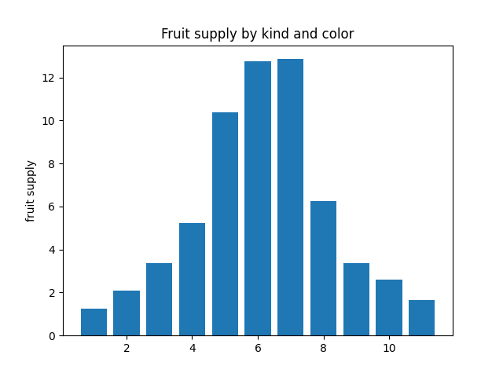
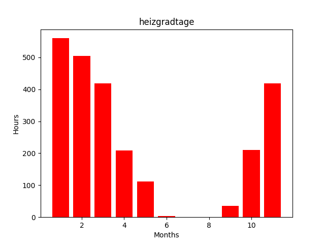

<!--
 DO NOT EDIT.
 THIS FILE WAS AUTOMATICALLY GENERATED BY mkdocs-gallery.
 TO MAKE CHANGES, EDIT THE SOURCE PYTHON FILE:
 "docs/examples/plott_4_GeoAdmin.py"
 LINE NUMBERS ARE GIVEN BELOW.
-->

!!! note

    Click [here](#download_links)
    to download the full example code


GeoAdmin API

===================================

[Documentation](https://api3.geo.admin.ch/index.html)

[Intro in Rest API Real Python](https://realpython.com/api-integration-in-python/#rest-architecture)

Layers Metadata[¶](https://api3.geo.admin.ch/services/sdiservices.html#layers-metadata "Permalink to this headline")

This service provides metadata for all the available layers in the GeoAdmin API.

<!-- GENERATED FROM PYTHON SOURCE LINES 18-28 -->

```{.python }
import requests
from pprint import pprint

api_url = "https://api3.geo.admin.ch/rest/services/api/MapServer"
response = requests.get(api_url)
layers = response.json()

pprint(layers.keys())
print(len(layers["layers"]))

```


Out:
{: .mkd-glr-script-out }

```{.shell .mkd-glr-script-out-disp }
dict_keys(['mapName', 'description', 'copyrightUnicode', 'layers', 'spatialReference', 'tileInfo', 'initialExtent', 'fullExtent', 'units', 'capabilities'])
780

```


<!-- GENERATED FROM PYTHON SOURCE LINES 29-30 -->

## Search Layer by name

<!-- GENERATED FROM PYTHON SOURCE LINES 32-33 -->

search for layer url with text

<!-- GENERATED FROM PYTHON SOURCE LINES 33-46 -->

```{.python }


param = {"searchText": "solar"}
response = requests.get("https://api3.geo.admin.ch/rest/services/api/MapServer?", param)
json = response.json()

name = json["layers"][0]["name"] 
full_name = json["layers"][0]["fullName"] 
link = json["layers"][0]["attributes"]["urlDetails"]

print(f"Name: {name}, \n Voller Name: {full_name} \n link: {link}")


```


Out:
{: .mkd-glr-script-out }

```{.shell .mkd-glr-script-out-disp }
Name: Solarenergie: Eignung Fassaden, 
 Voller Name: Eignung von Hausfassaden für die Nutzung von Sonnenenergie 
 link: https://www.bfe.admin.ch/solarenergie-eignung-fassaden

```


<!-- GENERATED FROM PYTHON SOURCE LINES 47-48 -->

Get the egid  of building from address

<!-- GENERATED FROM PYTHON SOURCE LINES 48-77 -->

```{.python }
street = 'Stadthausquai'
num = '17'
plz = '8001'
place = 'Zürich'


def feature_id(search_text):
    search_url = "https://api3.geo.admin.ch/rest/services/api/SearchServer?searchText=&origins=address&type=locations"
    search_value = {
    "searchText": search_text,
    }
    r = requests.get(search_url, params=search_value)
    results = r.json()
    pprint(results)

search_txt = f"{street} {num} {place} {plz}"
param = {"searchText": search_txt}


response = requests.get("https://api3.geo.admin.ch/rest/services/api/SearchServer?&origins=address&type=locations", param)
json = response.json()

detail = json["results"][0]["attrs"]["detail"]
featureid = json["results"][0]["attrs"]["featureId"]

print(f"{detail} \n {featureid}")

pprint(json)

```


Out:
{: .mkd-glr-script-out }

```{.shell .mkd-glr-script-out-disp }
stadthausquai 17 8001 zuerich 261 zuerich ch zh 
 140877_0
{'results': [{'attrs': {'detail': 'stadthausquai 17 8001 zuerich 261 zuerich '
                                  'ch zh',
                        'featureId': '140877_0',
                        'geom_quadindex': '030003300013231013332',
                        'geom_st_box2d': 'BOX(683305.2009999999 '
                                         '247082.66899999787,683305.2009999999 '
                                         '247082.66899999787)',
                        'label': 'Stadthausquai 17 <b>8001 Zürich</b>',
                        'lat': 47.369319915771484,
                        'lon': 8.541560173034668,
                        'num': 17,
                        'objectclass': '',
                        'origin': 'address',
                        'rank': 7,
                        'x': 247082.671875,
                        'y': 683305.1875,
                        'zoomlevel': 10},
              'id': 2116031,
              'weight': 4}]}

```


<!-- GENERATED FROM PYTHON SOURCE LINES 78-83 -->

## Height from coordinates

[docs height](https://api3.geo.admin.ch/rest/services/height)


<!-- GENERATED FROM PYTHON SOURCE LINES 85-97 -->

```{.python }


url = "https://api3.geo.admin.ch/rest/services/height"
params = {
    "easting": 2600000,
    "northing": 1200000
          }
response = requests.get(url, params)
json = response.json()
print(json)

```


Out:
{: .mkd-glr-script-out }

```{.shell .mkd-glr-script-out-disp }
{'height': '553.6'}

```


<!-- GENERATED FROM PYTHON SOURCE LINES 98-101 -->

## gebaeude_wohnungs_register


<!-- GENERATED FROM PYTHON SOURCE LINES 103-121 -->

```{.python }

url = f"https://api3.geo.admin.ch/rest/services/ech/MapServer/ch.bfs.gebaeude_wohnungs_register/{featureid}"

response = requests.get(url)
json = response.json()


atr = json["feature"]["attributes"]

dkode = atr["dkode"]
dkodn = atr["dkodn"] 

print(f"{dkode =        }")
print(f"{dkodn =        }")
pprint(json)


```


Out:
{: .mkd-glr-script-out }

```{.shell .mkd-glr-script-out-disp }
dkode =        2683305.201
dkodn =        1247082.669
{'feature': {'attributes': {'deinr': '17',
                            'dexpdat': '09.03.2023',
                            'dkode': 2683305.201,
                            'dkodn': 1247082.669,
                            'doffadr': 1,
                            'dplz4': 8001,
                            'dplzname': 'Zürich',
                            'dplzz': 0,
                            'edid': '0',
                            'egaid': 100118254,
                            'egid': '140877',
                            'egrid': 'CH327787999175',
                            'esid': 10075941,
                            'ewid': None,
                            'gabbj': None,
                            'ganzwhg': None,
                            'garea': 2272,
                            'gastw': 9,
                            'gazzi': None,
                            'gbauj': 1885,
                            'gbaum': 1,
                            'gbaup': 8011,
                            'gbez': 'Stadthaus',
                            'gdekt': 'ZH',
                            'gebf': 20448,
                            'gebnr': '1841',
                            'genh1': 7580,
                            'genh2': None,
                            'genw1': 7520,
                            'genw2': None,
                            'gexpdat': '09.03.2023',
                            'ggdename': 'Zürich',
                            'ggdenr': 261,
                            'gkat': 1060,
                            'gklas': 1220,
                            'gkode': 2683280.065,
                            'gkodn': 1247074.234,
                            'gksce': 905,
                            'gschutzr': 0,
                            'gstat': 1004,
                            'gvol': 62815,
                            'gvolnorm': 962,
                            'gvolsce': 859,
                            'gwaerdath1': '03.01.2018',
                            'gwaerdath2': '-',
                            'gwaerdatw1': '03.01.2018',
                            'gwaerdatw2': '-',
                            'gwaersceh1': 859,
                            'gwaersceh2': None,
                            'gwaerscew1': 859,
                            'gwaerscew2': None,
                            'gwaerzh1': 7460,
                            'gwaerzh2': None,
                            'gwaerzw1': 7630,
                            'gwaerzw2': None,
                            'label': 'Stadthausquai 17',
                            'lgbkr': 281,
                            'lparz': 'AA5731',
                            'lparzsx': None,
                            'ltyp': None,
                            'plz_plz6': '8001/800100',
                            'strindx': ['Sta'],
                            'strname': ['Stadthausquai'],
                            'strname_deinr': 'Stadthausquai 17',
                            'strnamk': ['Stadthausquai'],
                            'stroffiziel': '1',
                            'strsp': ['DE'],
                            'wabbj': None,
                            'warea': None,
                            'wazim': None,
                            'wbauj': None,
                            'wbez': None,
                            'weinr': None,
                            'wexpdat': None,
                            'whgnr': None,
                            'wkche': None,
                            'wmehrg': None,
                            'wstat': None,
                            'wstwk': None},
             'bbox': [683305.2, 247082.7, 683305.2, 247082.7],
             'featureId': '140877_0',
             'geometry': {'spatialReference': {'wkid': 21781},
                          'x': 683305.2,
                          'y': 247082.7},
             'id': '140877_0',
             'layerBodId': 'ch.bfs.gebaeude_wohnungs_register',
             'layerName': 'GWR: Gebäudestatus'}}

```


<!-- GENERATED FROM PYTHON SOURCE LINES 122-125 -->

## Solardach energie

solarenergie-eignung-daecher

<!-- GENERATED FROM PYTHON SOURCE LINES 127-128 -->

# Solardach energie

<!-- GENERATED FROM PYTHON SOURCE LINES 128-156 -->

```{.python }

cordiantes = str(dkode) + "," + str(dkodn)

print(cordiantes)
link = "https://api3.geo.admin.ch/rest/services/all/MapServer/identify"

query = {
	"geometry": cordiantes,
	"geometryFormat": "geojson",
	"geometryType": "esriGeometryPoint",
	"imageDisplay": "1410,620,96",
	"lang": "de",
	"layers": "all:ch.bfe.solarenergie-eignung-daecher",
	"limit": "10",
	"mapExtent": "2683322.444874717,1250605.7978890815,2683674.944874717,1250760.7978890815",
	"returnGeometry": "true",
	"sr": "2056",
	"tolerance": "10"
}

response = requests.get(link, query)
pv_json = response.json()

print(f'How many: {len(pv_json["results"])}')

pprint(pv_json['results'][0]["properties"])


```


Out:
{: .mkd-glr-script-out }

```{.shell .mkd-glr-script-out-disp }
2683305.201,1247082.669
How many: 2
{'a_param': [0.0151209214,
             -0.0149136051,
             0.0090321821,
             0.0128238572,
             0.0143819344,
             0.1305514852,
             0.3877787688,
             0.4522255903,
             0.3557589657,
             0.0686995703,
             0.0012518123],
 'ausrichtung': -177,
 'b_param': [0.587679668,
             0.6614977069,
             0.5502412637,
             0.5296633994,
             0.4258052525,
             0.3613144388,
             0.6170816083,
             0.6298137043,
             0.6224022149,
             0.5333113988,
             0.5310760443],
 'bedarf_heizung': 1237661,
 'bedarf_warmwasser': 81792,
 'building_id': 1992633,
 'c_param': [0.8526575886,
             0.1911423204,
             1.5201611332,
             2.240268033,
             6.800010165,
             16.2462724583,
             -3.0958350372,
             -4.0721419788,
             -4.675420533,
             3.593378144,
             2.8761759857],
 'datum_aenderung': '2021-11-29T05:43:37',
 'datum_erstellung': '2021-11-29T05:43:37',
 'df_nummer': 105,
 'dg_heizung': 1,
 'dg_waermebedarf': 2,
 'duschgaenge': 65,
 'finanzertrag': 798.2,
 'flaeche': 113.1225298534,
 'flaeche_kollektoren': 113.1225298534,
 'gs_serie_start': '2023-02-01T00:00:00',
 'gstrahlung': 49887,
 'heizgradtage': [505.0,
                  560.0,
                  419.0,
                  210.0,
                  35.0,
                  1.0,
                  0.0,
                  4.0,
                  112.0,
                  208.0,
                  418.0],
 'klasse': 1,
 'klasse_text': 'Gering##Faible##Bassa##Low##Gering',
 'label': 17528405,
 'monate': [2, 1, 11, 10, 9, 8, 7, 6, 5, 4, 3],
 'monats_ertrag': [2.0825521966,
                   1.2446001289,
                   1.6613542419,
                   2.5895618331,
                   3.3593888391,
                   6.2676545785,
                   12.8516502259,
                   12.7525206066,
                   10.385519355,
                   5.2352661939,
                   3.3793176502],
 'mstrahlung': 441,
 'neigung': 54,
 'sb_datum_aenderung': '2018-06-08T12:28:45',
 'sb_datum_erstellung': '2018-06-08T12:22:39',
 'sb_objektart': 1,
 'stromertrag': 7982,
 'volumen_speicher': 7400,
 'waermeertrag': 27449}

```


<!-- GENERATED FROM PYTHON SOURCE LINES 157-169 -->

```{.python }
from IPython.display import display, HTML, IFrame

feature_ids=[]
for i in pv_json["results"]:
	feature_ids.append(i["featureId"])
print(feature_ids)
	


```


Out:
{: .mkd-glr-script-out }

```{.shell .mkd-glr-script-out-disp }
[17528405, 17528404]

```


<!-- GENERATED FROM PYTHON SOURCE LINES 170-192 -->

```{.python }
import matplotlib.pyplot as plt

klasse = pv_json["results"][0]["properties"]['klasse_text']
finanzertrag = pv_json["results"][0]["properties"]["finanzertrag"]
mstrahlung = pv_json["results"][0]["properties"]["mstrahlung"]
neigung = pv_json["results"][0]["properties"]["neigung"]

fig, ax = plt.subplots()
x = pv_json["results"][0]["properties"]["monate"]
y = pv_json["results"][0]["properties"]["monats_ertrag"]
ax.bar(x, y, )
ax.set_ylabel('fruit supply')
ax.set_title('Fruit supply by kind and color')

print(f"{finanzertrag = }")
print(f"{mstrahlung = }")
print(f"{neigung = }")
print(f"{klasse = }")

plt.show()


```


{: .mkd-glr-single-img srcset="../images/mkd_glr_plott_4_GeoAdmin_001.png, ../images/mkd_glr_plott_4_GeoAdmin_001_2_0x.png 2.0x"}

Out:
{: .mkd-glr-script-out }

```{.shell .mkd-glr-script-out-disp }
finanzertrag = 798.2
mstrahlung = 441
neigung = 54
klasse = 'Gering##Faible##Bassa##Low##Gering'

```


<!-- GENERATED FROM PYTHON SOURCE LINES 193-198 -->

## Heizgradtage

> Heizgradtage werden verwendet, um den jährlichen Heizwärmebedarf auf die Kalendermonate zu verteilen. Die Heizgradtage für einen Monat berechnen sich aus der Differenz zwischen der Raumtemperatur (20°C) und der Tagesmitteltemperatur an Tagen mit einer Tagesmitteltemperatur tiefer als die Heizgrenze (< 12°C).


<!-- GENERATED FROM PYTHON SOURCE LINES 200-217 -->

```{.python }

fig, ax = plt.subplots()

x = pv_json["results"][0]["properties"]["monate"]
y = pv_json["results"][0]["properties"]["heizgradtage"]
ax.bar(x, y, color="red")

ax.set_ylabel('Hours')
ax.set_xlabel('Months')
ax.set_title('heizgradtage')


plt.show()
print(y)


```


{: .mkd-glr-single-img srcset="../images/mkd_glr_plott_4_GeoAdmin_002.png, ../images/mkd_glr_plott_4_GeoAdmin_002_2_0x.png 2.0x"}

Out:
{: .mkd-glr-script-out }

```{.shell .mkd-glr-script-out-disp }
[505.0, 560.0, 419.0, 210.0, 35.0, 1.0, 0.0, 4.0, 112.0, 208.0, 418.0]

```


**Total running time of the script:** ( 0 minutes  1.382 seconds)

<div id="download_links"></div>


[:fontawesome-solid-download: Download Python source code: plott_4_GeoAdmin.py](./plott_4_GeoAdmin.py){ .md-button .center}

[:fontawesome-solid-download: Download Jupyter notebook: plott_4_GeoAdmin.ipynb](./plott_4_GeoAdmin.ipynb){ .md-button .center}


[Gallery generated by mkdocs-gallery](https://mkdocs-gallery.github.io){: .mkd-glr-signature }
